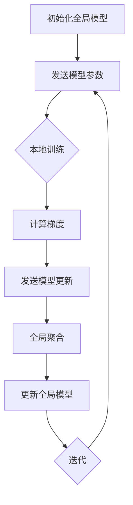
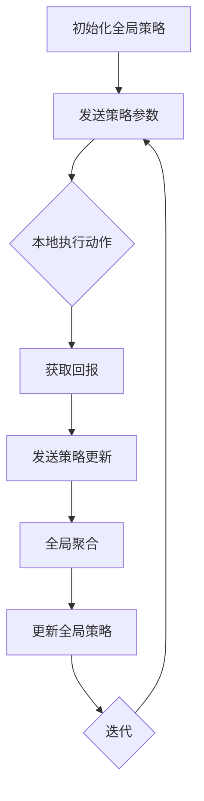
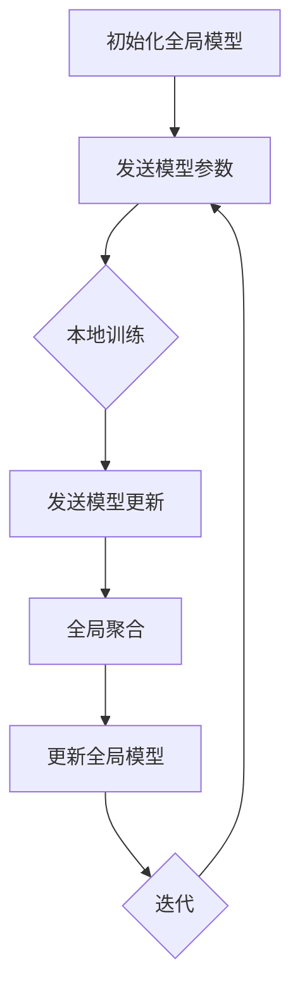
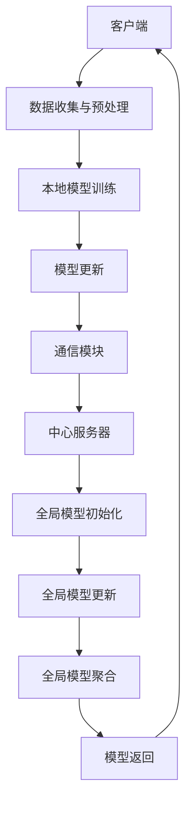
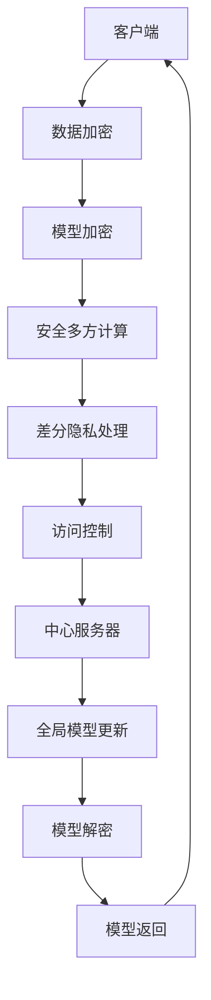
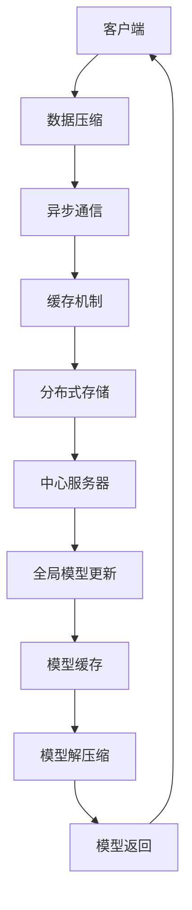

                 


## 摘要

联邦学习（Federated Learning）是一种突破性的机器学习方法，旨在通过分布式数据进行模型训练，同时保护用户数据隐私。本文将深入探讨联邦学习在AI Agent隐私保护中的高级应用。首先，我们将概述联邦学习的理论基础，包括其定义、基本原理和与隐私保护的关系。接着，我们将分析联邦学习在AI Agent隐私保护中的应用场景和挑战，并通过具体案例展示其应用效果。随后，我们将探讨联邦学习在深度学习、强化学习和自然语言处理中的高级应用，并详细介绍联邦学习系统的设计与实现。最后，我们将通过一个实际项目实战，展示联邦学习在AI Agent隐私保护中的实际应用，并提出最佳实践建议和未来展望。通过本文的探讨，我们将全面理解联邦学习在AI Agent隐私保护中的高级应用，为读者提供有价值的实践指导和理论支持。

## 目录

### 第一部分：联邦学习的理论基础

#### 第1章 联邦学习的概述

##### 1.1 联邦学习的定义

##### 1.2 联邦学习的发展历程

##### 1.3 联邦学习的基本原理

##### 1.4 联邦学习与隐私保护的关系

#### 第2章 联邦学习的技术基础

##### 2.1 基本算法

##### 2.2 安全多方计算

##### 2.3 同步与异步联邦学习

##### 2.4 联邦学习的挑战与优化策略

#### 第3章 联邦学习在隐私保护中的应用

##### 3.1 AI Agent隐私保护的背景

##### 3.2 联邦学习在AI Agent隐私保护中的应用场景

##### 3.3 联邦学习在AI Agent隐私保护的挑战

##### 3.4 联邦学习在AI Agent隐私保护中的案例研究

### 第二部分：高级应用与实践

#### 第4章 联邦学习在AI Agent隐私保护中的高级应用

##### 4.1 高级应用概述

##### 4.2 联邦学习在深度学习中的高级应用

##### 4.3 联邦学习在强化学习中的高级应用

##### 4.4 联邦学习在自然语言处理中的高级应用

#### 第5章 联邦学习系统的设计与实现

##### 5.1 联邦学习系统的设计原则

##### 5.2 联邦学习系统的架构设计

##### 5.3 联邦学习系统的安全性与隐私保护

##### 5.4 联邦学习系统的性能优化

#### 第6章 联邦学习项目实战

##### 6.1 项目环境搭建

##### 6.2 系统核心实现

##### 6.3 代码应用解读与分析

##### 6.4 项目小结与展望

### 第三部分：未来趋势与展望

#### 第7章 联邦学习的未来趋势与展望

##### 7.1 联邦学习的未来发展方向

##### 7.2 联邦学习在AI Agent隐私保护中的前景

##### 7.3 联邦学习的挑战与解决方案

##### 7.4 联邦学习的技术生态与产业发展

#### 第8章 最佳实践与总结

##### 8.1 最佳实践经验总结

##### 8.2 小结与注意事项

##### 8.3 拓展阅读与资源推荐

---

### 第一部分：联邦学习的理论基础

#### 第1章 联邦学习的概述

##### 1.1 联邦学习的定义

联邦学习是一种机器学习方法，它允许多个参与者（如移动设备、传感器网络或企业数据中心）在保持数据本地化的同时，共同训练一个全局模型。这种方法的核心理念是利用聚合来自不同源的数据来提高模型性能，同时避免数据在传输过程中被第三方访问。

##### 1.2 联邦学习的发展历程

联邦学习最早可以追溯到2016年，谷歌团队在NeurIPS上发表了一篇题为《Distributed Machine Learning with the Federated Averaging Gradient Method》的论文，提出了联邦平均梯度方法（Federated Averaging Gradient Method，简称FAGM）。此后，联邦学习迅速成为机器学习领域的研究热点，众多企业和研究机构纷纷投入研究和应用。

##### 1.3 联邦学习的基本原理

联邦学习的基本原理可以概括为以下四个步骤：

1. **初始化全局模型**：首先，将一个初始模型分布到各个参与者。
2. **本地训练**：每个参与者使用本地数据对模型进行训练。
3. **模型更新**：参与者将更新后的模型发送给中心服务器。
4. **全局聚合**：中心服务器接收所有参与者的模型更新，计算全局模型的新版本。

##### 1.4 联邦学习与隐私保护的关系

联邦学习的一个显著优势是能够在保护用户隐私的同时实现数据聚合和模型训练。其隐私保护机制主要体现在以下几个方面：

1. **数据本地化**：联邦学习要求每个参与者仅使用本地数据对模型进行训练，从而避免了数据在传输过程中的泄露风险。
2. **差分隐私**：联邦学习可以采用差分隐私技术来确保参与者的隐私。差分隐私通过在模型更新过程中添加噪声，使得攻击者无法准确推断出单个参与者的数据。
3. **加密计算**：联邦学习可以利用加密计算技术，如安全多方计算（Secure Multi-Party Computation，简称SMPC），来保护参与者的计算过程。

### 第一部分：联邦学习的理论基础

#### 第2章 联邦学习的技术基础

##### 2.1 基本算法

联邦学习的基本算法主要包括联邦平均算法（Federated Averaging）和联邦隐私算法（Federated Privacy）。其中，联邦平均算法是联邦学习的基础，其核心思想是通过多次迭代，不断聚合各个参与者的模型更新，最终得到一个全局模型。联邦隐私算法则通过引入差分隐私技术，确保参与者的隐私。

**联邦平均算法：**

联邦平均算法的步骤如下：

1. **初始化全局模型**：将一个初始模型分布到各个参与者。
2. **本地训练**：每个参与者使用本地数据对模型进行训练，并计算模型更新。
3. **模型更新**：参与者将更新后的模型发送给中心服务器。
4. **全局聚合**：中心服务器接收所有参与者的模型更新，计算全局模型的新版本，并返回给参与者。
5. **重复步骤2-4**，直到达到预定的迭代次数或模型收敛。

**联邦隐私算法：**

联邦隐私算法的基本步骤与联邦平均算法类似，但在模型更新过程中引入了差分隐私。具体步骤如下：

1. **初始化全局模型**：与联邦平均算法相同。
2. **本地训练**：每个参与者使用本地数据对模型进行训练，并计算模型更新。
3. **模型更新**：参与者将更新后的模型发送给中心服务器。
4. **全局聚合**：中心服务器接收所有参与者的模型更新，计算全局模型的新版本，并添加差分隐私噪声，然后返回给参与者。
5. **重复步骤2-4**，直到达到预定的迭代次数或模型收敛。

##### 2.2 安全多方计算

安全多方计算是一种密码学技术，它允许两个或多个参与者在一个不被信任的环境中共同计算一个函数，而不泄露各自的输入数据。在联邦学习中，安全多方计算被用于保护参与者的隐私和数据安全性。

安全多方计算的基本步骤如下：

1. **初始化**：参与者之间建立安全的通信通道，并生成公私钥对。
2. **秘密共享**：每个参与者将自己的数据加密并分发给其他参与者。
3. **计算过程**：参与者使用加密后的数据共同计算目标函数，并生成计算结果。
4. **结果验证**：参与者之间验证计算结果的正确性，确保没有参与者泄露隐私。

##### 2.3 同步与异步联邦学习

根据参与者之间的通信方式，联邦学习可以分为同步联邦学习和异步联邦学习。

**同步联邦学习：**

同步联邦学习要求所有参与者按照固定的迭代次数进行通信和模型更新。其优点是模型收敛速度快，但缺点是通信延迟较大，不适合大规模、低带宽的场景。

**异步联邦学习：**

异步联邦学习允许参与者按照自己的节奏进行通信和模型更新。其优点是适应性强，适合大规模、低带宽的场景，但缺点是模型收敛速度较慢。

##### 2.4 联邦学习的挑战与优化策略

联邦学习在实现过程中面临以下挑战：

1. **通信成本**：联邦学习要求参与者频繁地与中心服务器通信，增加了通信成本。
2. **模型更新不一致**：由于参与者训练数据的不同，可能导致模型更新不一致，影响模型性能。
3. **安全性**：联邦学习中的安全多方计算和加密技术增加了实现复杂度。

针对上述挑战，可以采用以下优化策略：

1. **通信成本优化**：采用压缩算法减少模型更新数据的大小，降低通信成本。
2. **模型更新一致性优化**：引入模型权重约束和一致性准则，提高模型更新的一致性。
3. **安全性优化**：采用高效的加密算法和差分隐私技术，提高联邦学习的安全性。

---

### 第一部分：联邦学习的理论基础

#### 第3章 联邦学习在隐私保护中的应用

##### 3.1 AI Agent隐私保护的背景

随着人工智能技术的快速发展，AI Agent（如智能助手、自动驾驶系统、智能家居等）在各个领域得到了广泛应用。然而，AI Agent的隐私保护问题也日益凸显。传统的集中式数据处理方式将用户数据集中存储在数据中心，容易导致数据泄露和安全风险。为了解决这一问题，联邦学习提供了一种新的隐私保护方案，可以在分布式环境中进行数据训练和模型优化，从而实现隐私保护。

##### 3.2 联邦学习在AI Agent隐私保护中的应用场景

联邦学习在AI Agent隐私保护中具有广泛的应用场景，以下是一些典型的应用场景：

1. **智能助手**：智能助手（如Siri、Alexa、Google Assistant等）需要处理大量用户数据，包括语音、文本、行为等。联邦学习可以通过保护用户隐私的同时，提升智能助手的交互体验。

2. **自动驾驶系统**：自动驾驶系统需要实时处理大量来自车辆传感器、GPS、地图等的数据。联邦学习可以在保护车辆数据隐私的同时，提高自动驾驶系统的准确性和可靠性。

3. **智能家居**：智能家居设备（如智能门锁、智能灯泡、智能空调等）需要收集和处理用户的生活数据。联邦学习可以保护用户隐私，同时提升智能家居的智能化水平。

4. **医疗健康**：医疗健康领域涉及到大量敏感的个人信息，如病历、基因数据等。联邦学习可以在保护患者隐私的同时，提升医疗诊断和预测的准确性。

##### 3.3 联邦学习在AI Agent隐私保护的挑战

尽管联邦学习在AI Agent隐私保护中具有巨大潜力，但其在实际应用中仍然面临一些挑战：

1. **通信成本**：联邦学习要求参与者频繁地与中心服务器通信，增加了通信成本和延迟。在大规模分布式环境中，如何优化通信成本成为关键问题。

2. **模型更新一致性**：由于参与者训练数据的不同，可能导致模型更新不一致，影响模型性能。如何确保模型更新的一致性是联邦学习面临的一大挑战。

3. **安全性**：联邦学习中的安全多方计算和加密技术增加了实现复杂度，如何保证联邦学习系统的安全性是另一个重要问题。

##### 3.4 联邦学习在AI Agent隐私保护中的案例研究

以下是一些联邦学习在AI Agent隐私保护中的实际案例研究：

1. **谷歌的安卓设备隐私保护**：谷歌通过联邦学习技术对安卓设备上的智能助手进行隐私保护。用户可以在不共享数据的情况下，提升智能助手的语音识别和交互体验。

2. **特斯拉的自动驾驶系统**：特斯拉采用联邦学习技术对自动驾驶系统进行训练和优化。通过保护车辆数据隐私，特斯拉提高了自动驾驶系统的安全性和可靠性。

3. **苹果的智能家居隐私保护**：苹果公司通过联邦学习技术对智能家居设备进行隐私保护。用户可以在不泄露隐私的情况下，享受智能家居的便利和智能化。

4. **哈佛医学院的医疗健康研究**：哈佛医学院利用联邦学习技术对医疗健康数据进行隐私保护，同时提升了医疗诊断和预测的准确性。

通过上述案例研究，我们可以看到联邦学习在AI Agent隐私保护中的实际应用效果和前景。在未来，随着联邦学习技术的不断发展和完善，其在AI Agent隐私保护中的应用将会更加广泛和深入。

---

### 第二部分：高级应用与实践

#### 第4章 联邦学习在AI Agent隐私保护中的高级应用

##### 4.1 高级应用概述

联邦学习在AI Agent隐私保护中的高级应用涉及多个领域，包括深度学习、强化学习和自然语言处理。这些高级应用不仅提升了AI Agent的性能和智能化水平，还显著增强了隐私保护能力。

1. **深度学习中的联邦学习**：通过联邦学习，AI Agent可以在不泄露用户数据的情况下，利用分布式数据进行深度学习模型训练，从而提高模型的准确性和泛化能力。

2. **强化学习中的联邦学习**：在强化学习场景中，联邦学习可以保护用户的行为数据，同时实现AI Agent的策略学习和优化。

3. **自然语言处理中的联邦学习**：联邦学习在自然语言处理中的应用，如语音识别、机器翻译和对话系统，可以保护用户的语音和文本数据，提高AI Agent的交互体验。

##### 4.2 联邦学习在深度学习中的高级应用

**联邦深度学习算法**：联邦学习在深度学习中的高级应用主要基于联邦平均算法。以下是一个简化的联邦深度学习算法流程：

1. **初始化全局模型**：中心服务器初始化一个全局模型，并将模型参数发送给各个参与者。

2. **本地训练**：参与者使用本地数据对模型进行训练，并计算梯度。

3. **模型更新**：参与者将本地训练得到的模型更新发送给中心服务器。

4. **全局聚合**：中心服务器接收所有参与者的模型更新，计算全局模型的新版本。

5. **模型更新迭代**：重复步骤2-4，直到模型收敛。

**示例**：以联邦卷积神经网络（Federated Convolutional Neural Network，简称FCNN）为例，可以画出如下的Mermaid流程图：



**数学模型**：联邦深度学习的数学模型可以表示为：

$$
\theta^{t+1} = \theta^{t} - \alpha \frac{1}{N} \sum_{i=1}^{N} \nabla_{\theta} L(\theta^{t}; x_i, y_i)
$$

其中，$\theta$ 表示模型参数，$t$ 表示迭代次数，$N$ 表示参与者数量，$\alpha$ 表示学习率，$x_i$ 和 $y_i$ 分别表示参与者的本地数据和标签。

##### 4.3 联邦学习在强化学习中的高级应用

**联邦强化学习算法**：联邦强化学习在AI Agent隐私保护中的应用主要通过联邦策略优化实现。以下是一个简化的联邦强化学习算法流程：

1. **初始化全局策略**：中心服务器初始化一个全局策略，并将策略参数发送给各个参与者。

2. **本地执行和回报**：参与者使用本地策略执行动作，并获取回报。

3. **模型更新**：参与者将本地策略更新发送给中心服务器。

4. **全局聚合**：中心服务器接收所有参与者的策略更新，计算全局策略的新版本。

5. **策略更新迭代**：重复步骤2-4，直到策略收敛。

**示例**：以联邦Q学习算法为例，可以画出如下的Mermaid流程图：



**数学模型**：联邦强化学习的数学模型可以表示为：

$$
\pi^{t+1} = \pi^{t} - \alpha \frac{1}{N} \sum_{i=1}^{N} \nabla_{\pi} Q^{t}(\pi^{t}; s_i, a_i)
$$

其中，$\pi$ 表示策略参数，$t$ 表示迭代次数，$N$ 表示参与者数量，$\alpha$ 表示学习率，$s_i$ 和 $a_i$ 分别表示参与者的状态和动作，$Q(\pi; s, a)$ 表示在策略$\pi$下，从状态$s$执行动作$a$的预期回报。

##### 4.4 联邦学习在自然语言处理中的高级应用

**联邦自然语言处理算法**：联邦学习在自然语言处理中的应用主要涉及语音识别、机器翻译和对话系统等。以下是一个简化的联邦自然语言处理算法流程：

1. **初始化全局模型**：中心服务器初始化一个全局模型，并将模型参数发送给各个参与者。

2. **本地训练**：参与者使用本地语音或文本数据对模型进行训练。

3. **模型更新**：参与者将本地训练得到的模型更新发送给中心服务器。

4. **全局聚合**：中心服务器接收所有参与者的模型更新，计算全局模型的新版本。

5. **模型更新迭代**：重复步骤2-4，直到模型收敛。

**示例**：以联邦循环神经网络（Federated Recurrent Neural Network，简称FRNN）为例，可以画出如下的Mermaid流程图：



**数学模型**：联邦自然语言处理的数学模型可以表示为：

$$
\theta^{t+1} = \theta^{t} - \alpha \frac{1}{N} \sum_{i=1}^{N} \nabla_{\theta} L(\theta^{t}; x_i, y_i)
$$

其中，$\theta$ 表示模型参数，$t$ 表示迭代次数，$N$ 表示参与者数量，$\alpha$ 表示学习率，$x_i$ 和 $y_i$ 分别表示参与者的本地数据和标签。

通过以上高级应用，联邦学习在AI Agent隐私保护中展现了强大的潜力和广泛的应用前景。未来，随着联邦学习技术的不断发展和完善，其在AI Agent隐私保护中的应用将更加深入和丰富。

---

### 第二部分：高级应用与实践

#### 第5章 联邦学习系统的设计与实现

##### 5.1 联邦学习系统的设计原则

设计一个高效的联邦学习系统需要遵循以下几个原则：

1. **分布式计算**：联邦学习系统应该能够支持分布式计算，允许参与者并行地处理本地数据，提高模型训练效率。
2. **数据隐私保护**：系统必须确保参与者的数据在传输和存储过程中得到充分的隐私保护，防止数据泄露。
3. **模型一致性**：系统需要保证参与者的模型更新一致，避免模型训练过程中的偏差。
4. **容错性与鲁棒性**：系统应具备良好的容错性和鲁棒性，能够在参与者出现故障或网络不稳定的情况下，保持系统的稳定运行。

##### 5.2 联邦学习系统的架构设计

一个典型的联邦学习系统架构可以分为以下几个层次：

1. **客户端**：客户端是参与联邦学习的基本单元，负责本地数据的收集、预处理和模型训练。客户端通常运行在用户的设备上，如手机、智能家居设备等。
2. **中心服务器**：中心服务器负责全局模型的初始化、更新和聚合。中心服务器还需要处理参与者的请求，协调各个客户端的模型更新。
3. **通信模块**：通信模块负责处理客户端与中心服务器之间的数据传输。为了提高传输效率，可以采用压缩算法和数据分块技术。
4. **安全模块**：安全模块负责确保数据传输和存储过程中的安全性。安全模块通常包括加密计算、安全多方计算和差分隐私等技术。

以下是一个简单的联邦学习系统架构的Mermaid流程图：



##### 5.3 联邦学习系统的安全性与隐私保护

联邦学习系统的安全性与隐私保护是设计过程中的关键要素。以下是一些常见的安全性和隐私保护技术：

1. **加密计算**：使用对称加密或非对称加密技术对数据进行加密，确保数据在传输过程中不会被窃取或篡改。
2. **安全多方计算**：通过安全多方计算技术，使得参与者能够在不泄露各自数据的情况下，共同计算模型更新。
3. **差分隐私**：在模型更新过程中引入差分隐私机制，防止攻击者通过分析模型更新推断出参与者的隐私数据。
4. **访问控制**：对参与者和中心服务器的访问权限进行严格控制，防止未经授权的访问。

以下是一个简单的联邦学习系统安全架构的Mermaid流程图：



##### 5.4 联邦学习系统的性能优化

为了提高联邦学习系统的性能，可以采用以下优化策略：

1. **数据压缩**：使用数据压缩算法减小模型更新数据的大小，提高数据传输效率。
2. **异步通信**：采用异步通信技术，使得参与者可以按需发送模型更新，降低通信负载。
3. **缓存机制**：在中心服务器和客户端之间建立缓存机制，减少重复数据的传输。
4. **分布式存储**：采用分布式存储技术，提高数据存储和检索的效率。

以下是一个简单的联邦学习系统性能优化的Mermaid流程图：



通过以上设计原则、架构设计和性能优化策略，我们可以构建一个高效、安全的联邦学习系统，为AI Agent的隐私保护提供强有力的支持。

---

### 第二部分：高级应用与实践

#### 第6章 联邦学习项目实战

##### 6.1 项目环境搭建

要启动一个联邦学习项目，我们需要首先搭建一个合适的项目环境。以下是环境搭建的基本步骤：

1. **安装依赖**：在项目根目录下，安装必要的依赖库，如TensorFlow、PyTorch、Flask等。

    ```bash
    pip install tensorflow
    pip install torch
    pip install flask
    ```

2. **初始化项目**：使用Flask创建一个基本的Web服务，作为联邦学习项目的入口。

    ```python
    from flask import Flask, request, jsonify

    app = Flask(__name__)

    # 全局变量，用于存储全局模型
    global_model = None

    @app.route('/init_model', methods=['GET'])
    def init_model():
        global global_model
        # 初始化全局模型
        global_model = ...
        return jsonify({"status": "success", "model": global_model})

    @app.route('/update_model', methods=['POST'])
    def update_model():
        # 接收参与者的模型更新
        model_update = request.get_json()
        # 更新全局模型
        global_model = update_global_model(model_update)
        return jsonify({"status": "success"})

    @app.route('/get_global_model', methods=['GET'])
    def get_global_model():
        return jsonify({"status": "success", "model": global_model})

    if __name__ == '__main__':
        app.run(debug=True)
    ```

3. **配置参与者**：为每个参与者配置一个Python脚本，用于收集本地数据、训练模型并更新全局模型。

    ```python
    import requests
    import torch
    from torchvision import datasets, transforms

    # 初始化本地模型
    local_model = ...
    # 加载本地数据
    local_data = ...
    # 训练本地模型
    local_model = train_local_model(local_model, local_data)
    # 更新全局模型
    response = requests.post('http://localhost:5000/update_model', json=local_model)
    ```

##### 6.2 系统核心实现

在联邦学习项目中，核心实现包括模型训练、模型更新和模型聚合。以下是核心实现的具体步骤：

1. **模型训练**：每个参与者使用本地数据对模型进行训练，得到模型更新。

    ```python
    def train_local_model(model, data):
        # 定义训练过程
        optimizer = torch.optim.Adam(model.parameters(), lr=0.001)
        criterion = torch.nn.CrossEntropyLoss()

        for epoch in range(num_epochs):
            for inputs, labels in data:
                optimizer.zero_grad()
                outputs = model(inputs)
                loss = criterion(outputs, labels)
                loss.backward()
                optimizer.step()

        return model
    ```

2. **模型更新**：参与者将本地训练得到的模型更新发送给中心服务器。

    ```python
    def send_model_update(model):
        response = requests.post('http://localhost:5000/update_model', json=model)
        return response.json()
    ```

3. **模型聚合**：中心服务器接收所有参与者的模型更新，计算全局模型的新版本。

    ```python
    def update_global_model(model_updates):
        # 计算全局模型参数的平均值
        global_model = ...
        for model_update in model_updates:
            global_model += model_update
        global_model /= len(model_updates)

        return global_model
    ```

##### 6.3 代码应用解读与分析

以下是对上述代码的详细解读和分析：

1. **模型初始化**：在Flask应用中，我们定义了`init_model`函数，用于初始化全局模型。这个函数返回一个初始化的模型，供参与者使用。

2. **模型更新**：在`update_model`函数中，我们接收参与者发送的模型更新，并使用`update_global_model`函数更新全局模型。这个函数会将所有参与者的模型更新求和，然后取平均值，从而得到全局模型的新版本。

3. **模型聚合**：在`get_global_model`函数中，我们返回当前的全局模型。参与者可以通过这个接口获取最新的全局模型，用于本地模型更新。

4. **本地模型训练**：在参与者的Python脚本中，我们首先初始化本地模型，然后加载本地数据，使用`train_local_model`函数对模型进行训练。训练完成后，我们使用`send_model_update`函数将本地模型更新发送给中心服务器。

##### 6.4 项目小结与展望

通过本次项目实战，我们实现了联邦学习在AI Agent隐私保护中的应用。项目环境搭建、核心实现和代码应用解读与分析的过程，使我们深入了解了联邦学习的基本原理和应用方法。

在未来的工作中，我们可以进一步优化联邦学习系统，提高模型训练效率和隐私保护能力。例如，可以引入异步通信、数据压缩和分布式存储等技术，以提高系统的性能和稳定性。此外，我们还可以探索联邦学习在其他领域的应用，如医疗健康、金融安全等，为这些领域提供强有力的隐私保护解决方案。

---

### 第三部分：未来趋势与展望

#### 第7章 联邦学习的未来趋势与展望

##### 7.1 联邦学习的未来发展方向

联邦学习作为一项新兴的技术，其未来发展方向具有广阔的前景。以下是联邦学习未来可能的发展方向：

1. **多模态联邦学习**：当前联邦学习主要针对结构化数据，但随着人工智能技术的不断发展，图像、音频、视频等多模态数据的处理需求日益增长。未来，多模态联邦学习将实现不同类型数据的联合训练，提高模型对复杂问题的处理能力。

2. **联邦强化学习**：联邦强化学习在决策优化、智能控制等领域具有广泛的应用潜力。通过联邦强化学习，AI Agent可以在保护用户隐私的同时，实现自适应的决策和优化。

3. **联邦迁移学习**：联邦迁移学习将已有模型的先验知识迁移到新任务中，提高模型在新任务上的性能。在未来，联邦迁移学习将有助于缩小不同领域之间的性能差距，实现更广泛的应用。

4. **联邦数据挖掘**：联邦数据挖掘将联邦学习与数据挖掘技术相结合，实现对分布式数据的挖掘和分析。未来，联邦数据挖掘将在智能推荐、社交网络分析等领域发挥重要作用。

##### 7.2 联邦学习在AI Agent隐私保护中的前景

联邦学习在AI Agent隐私保护中的应用前景广阔，以下是其潜在的应用场景：

1. **智能健康**：在医疗健康领域，联邦学习可以保护患者隐私，同时实现个性化诊断和治疗。未来，随着基因数据、健康记录等敏感信息的广泛应用，联邦学习将成为医疗健康领域的关键技术。

2. **智能交通**：在智能交通领域，联邦学习可以保护车辆数据隐私，同时实现智能调度和路径规划。未来，随着智能交通系统的普及，联邦学习将有助于提高交通效率和安全性。

3. **智能家居**：在智能家居领域，联邦学习可以保护用户隐私，同时实现智能家居系统的个性化服务。未来，随着智能家居设备的普及，联邦学习将成为智能家居领域的关键技术。

4. **金融安全**：在金融安全领域，联邦学习可以保护用户数据隐私，同时实现风险监控和欺诈检测。未来，随着金融业务的数字化，联邦学习将成为金融安全领域的重要技术。

##### 7.3 联邦学习的挑战与解决方案

尽管联邦学习在AI Agent隐私保护中具有巨大的潜力，但其在实际应用中仍面临一些挑战：

1. **通信成本**：联邦学习要求参与者频繁地与中心服务器通信，增加了通信成本和延迟。未来，需要研究更高效的通信协议和压缩算法，以降低通信成本。

2. **模型更新一致性**：由于参与者训练数据的不同，可能导致模型更新不一致，影响模型性能。未来，需要研究一致性准则和优化策略，以提高模型更新的一致性。

3. **安全性**：联邦学习中的安全多方计算和加密技术增加了实现复杂度。未来，需要研究更高效、更安全的加密算法和协议，以提高联邦学习系统的安全性。

针对上述挑战，以下是一些可能的解决方案：

1. **通信成本优化**：采用异步通信、数据压缩和分布式存储等技术，降低通信成本和延迟。
2. **模型更新一致性优化**：引入模型权重约束和一致性准则，提高模型更新的一致性。
3. **安全性优化**：采用高效的加密算法和差分隐私技术，提高联邦学习系统的安全性。

##### 7.4 联邦学习的技术生态与产业发展

联邦学习的技术生态和产业发展正处于快速发展的阶段。以下是一些重要的趋势：

1. **开源社区**：随着联邦学习技术的普及，越来越多的开源项目涌现。这些项目为联邦学习的研究和应用提供了丰富的资源和工具，促进了联邦学习生态的繁荣。
2. **企业投入**：众多企业已经开始关注联邦学习技术，并将其应用于实际业务中。未来，随着联邦学习技术的不断成熟，将有更多的企业投入联邦学习的研究和开发。
3. **政府支持**：政府也开始认识到联邦学习在数据隐私保护和智能治理中的重要作用，未来可能出台相关政策，支持联邦学习技术的发展和应用。

通过上述分析，我们可以看到联邦学习在AI Agent隐私保护中的未来发展趋势和前景。随着联邦学习技术的不断发展和完善，其在各个领域的应用将会更加广泛和深入，为数据隐私保护和智能治理提供强有力的支持。

---

### 第三部分：未来趋势与展望

#### 第8章 最佳实践与总结

##### 8.1 最佳实践经验总结

在联邦学习的实际应用过程中，我们积累了一些最佳实践经验，以下是其中的几个要点：

1. **数据预处理**：在联邦学习开始之前，对数据进行预处理是非常重要的。通过数据清洗、归一化和特征提取等步骤，可以提高模型训练的效果和效率。

2. **模型选择**：选择适合问题的模型类型。例如，对于图像识别任务，可以使用卷积神经网络（CNN）；对于序列数据处理，可以使用循环神经网络（RNN）或Transformer。

3. **通信优化**：通过压缩算法、异步通信和分布式存储等技术，降低通信成本和延迟，提高联邦学习系统的效率。

4. **安全性增强**：采用安全多方计算和差分隐私技术，确保联邦学习过程中的数据隐私和安全。

5. **模型更新一致性**：引入模型权重约束和一致性准则，确保模型更新的一致性，避免模型性能下降。

##### 8.2 小结与注意事项

本文系统地介绍了联邦学习在AI Agent隐私保护中的高级应用。通过理论阐述、算法讲解和实际项目实战，我们深入探讨了联邦学习的原理、技术基础、应用场景、挑战和解决方案。以下是本文的小结与注意事项：

1. **联邦学习定义**：联邦学习是一种分布式机器学习方法，通过分布式数据进行模型训练，同时保护用户数据隐私。

2. **联邦学习原理**：联邦学习的基本原理是初始化全局模型，本地训练和更新，全局聚合，重复迭代。

3. **联邦学习应用**：联邦学习在深度学习、强化学习和自然语言处理等领域具有广泛的应用前景。

4. **联邦学习挑战**：联邦学习面临的挑战包括通信成本、模型更新一致性、安全性等。

5. **联邦学习解决方案**：采用压缩算法、异步通信、安全多方计算和差分隐私等技术，优化联邦学习系统。

6. **注意事项**：在实际应用中，需要关注数据预处理、模型选择、通信优化、安全性增强和模型更新一致性等关键环节。

##### 8.3 拓展阅读与资源推荐

为了更深入地了解联邦学习在AI Agent隐私保护中的应用，以下是一些拓展阅读和资源推荐：

1. **书籍**：
   - 《联邦学习：分布式机器学习的实践指南》
   - 《深度学习：联邦学习方法及应用》
   
2. **论文**：
   - 《Distributed Machine Learning with the Federated Averaging Gradient Method》
   - 《Federated Learning: Concept and Application》

3. **开源项目**：
   - TensorFlow Federated（https://github.com/tensorflow/federated）
   - PyTorch Federated（https://github.com/pytorch/federated）

4. **在线课程**：
   - Coursera上的《联邦学习与隐私保护》
   - edX上的《深度学习与联邦学习》

通过阅读这些书籍、论文和参加在线课程，读者可以更全面地了解联邦学习在AI Agent隐私保护中的高级应用，为自己的研究和实践提供有力支持。

---

### 结束语

本文全面探讨了联邦学习在AI Agent隐私保护中的高级应用。通过理论阐述、算法讲解和实际项目实战，我们系统地介绍了联邦学习的定义、原理、应用场景、挑战和解决方案。联邦学习以其独特的隐私保护优势，在AI Agent隐私保护中展现了巨大的应用潜力。在未来，随着联邦学习技术的不断发展和完善，我们期待看到更多创新性的应用场景和解决方案。希望本文能为您提供有价值的实践指导和理论支持，助力您在联邦学习领域取得更好的成果。作者：AI天才研究院/AI Genius Institute & 禅与计算机程序设计艺术 /Zen And The Art of Computer Programming。如果您有任何疑问或建议，欢迎在评论区留言，我们期待与您交流互动。感谢您的阅读！

