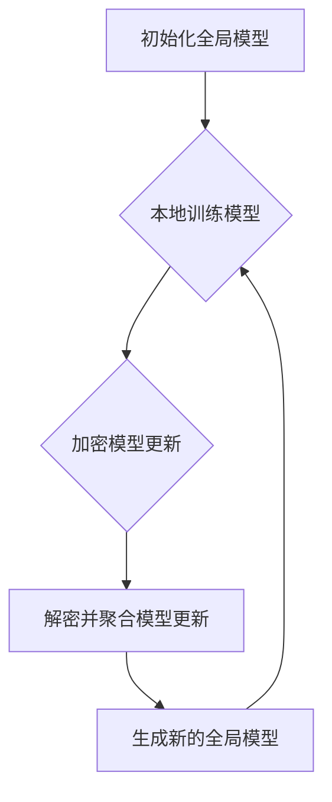
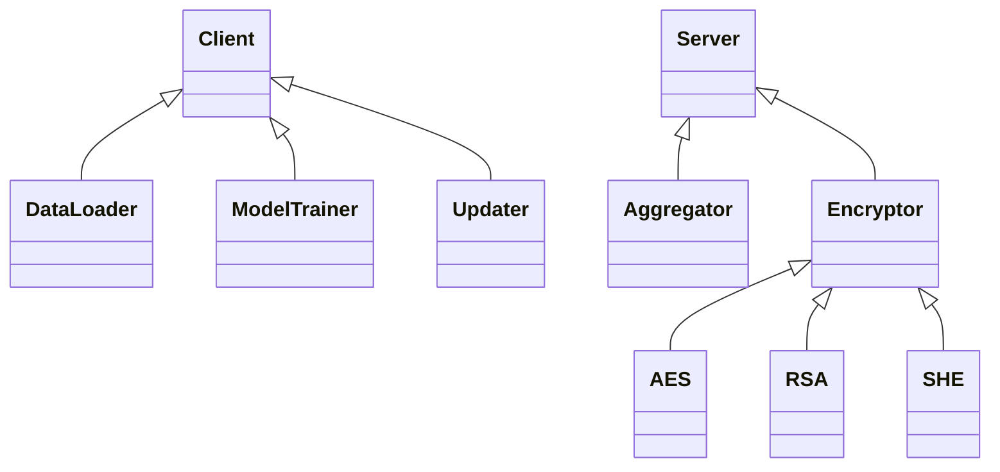
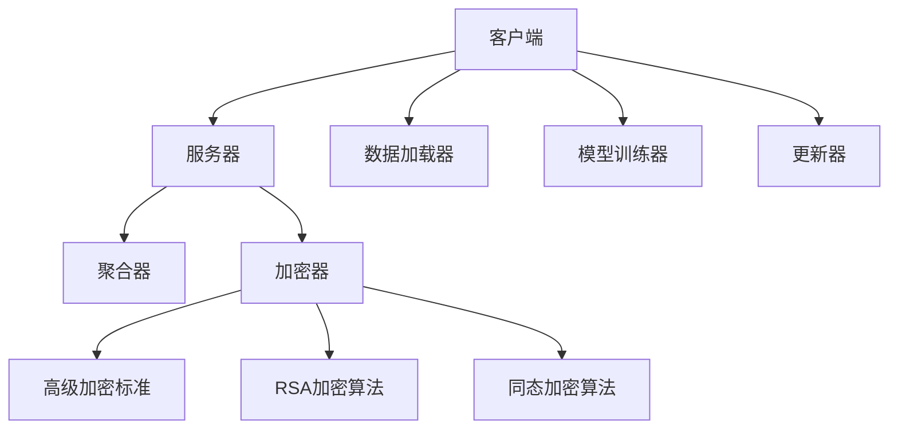
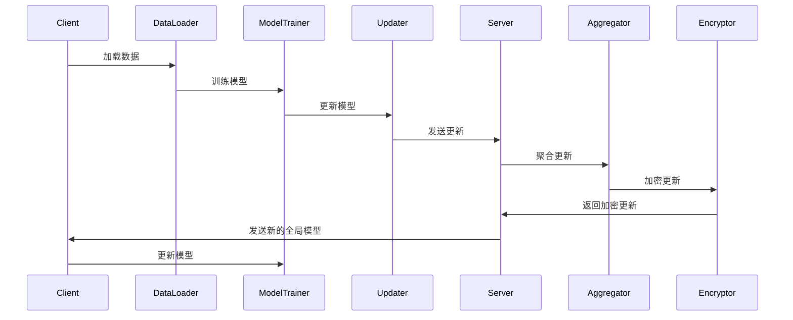

                 

# 联邦学习：保护隐私的分布式AI Agent训练

## 关键词

- 联邦学习
- 分布式AI
- 隐私保护
- 加密技术
- 模型聚合

## 摘要

本文深入探讨了联邦学习这一新兴分布式AI技术，旨在保护隐私的同时提升模型性能。通过逐步分析其背景、核心概念、算法原理以及系统设计与实战，本文揭示了联邦学习在分布式数据隐私保护中的重要性和应用潜力。

## 1.1 联邦学习背景介绍

### 1.1.1 问题背景

在传统的集中式机器学习模型中，数据通常集中存储在单个服务器上，这可能导致数据隐私和安全问题。随着人工智能技术的发展，越来越多的应用场景需要处理大量分布式数据，但如何同时保证数据的安全性和模型的性能成为了一个巨大的挑战。

联邦学习（Federated Learning）正是为了解决这一问题而诞生的。联邦学习是一种分布式机器学习技术，它允许多个设备在本地进行模型训练，并将更新汇总到一个全局模型中，而无需传输原始数据。这样，既保护了用户隐私，又实现了模型的协同训练。

### 1.1.2 问题描述

在联邦学习中，主要需要解决以下问题：

- **隐私保护**：如何确保在分布式环境中，数据不会泄露？
- **通信效率**：如何在有限的通信带宽下，高效地更新全局模型？
- **模型性能**：如何在保证隐私保护和通信效率的同时，提高模型的性能？

### 1.1.3 问题解决

为了解决上述问题，联邦学习提出了一系列解决方案：

- **本地训练**：每个设备在本地使用本地数据对模型进行训练。
- **加密通信**：使用加密技术确保模型更新在传输过程中不会被窃取。
- **聚合算法**：设计高效的算法将本地模型的更新聚合到全局模型中。

### 1.1.4 边界与外延

联邦学习的边界主要包括：

- **设备范围**：联邦学习适用于多种设备，如智能手机、平板电脑、物联网设备等。
- **数据类型**：联邦学习可以处理结构化数据、非结构化数据以及图像、语音等多种数据类型。

### 1.1.5 概念结构与核心要素组成

联邦学习的概念结构主要包括以下核心要素：

- **客户端**：参与联邦学习的设备，负责本地训练和更新模型。
- **服务器**：负责聚合客户端的更新，生成全局模型。
- **加密技术**：用于保护模型更新和数据的隐私。

### 1.1.6 本章小结

通过本章的介绍，我们对联邦学习有了初步的了解。下一章将深入探讨联邦学习中的核心概念与联系。

## 1.2 联邦学习中的核心概念与联系

### 1.2.1 联邦学习的核心概念

联邦学习的核心概念主要包括：

- **模型更新**：客户端在本地对模型进行训练，并生成模型更新。
- **模型聚合**：服务器将所有客户端的更新聚合到一个全局模型中。
- **加密技术**：用于保护模型更新和数据的隐私。

### 1.2.2 概念属性特征对比表格

以下是联邦学习中的核心概念属性特征对比表格：

| 概念        | 定义                                                         | 属性特征                                                       |
| ----------- | ------------------------------------------------------------ | ------------------------------------------------------------ |
| 模型更新    | 客户端在本地对模型进行训练，并生成的模型更新                   | 需要确保模型的更新在传输过程中不会被窃取                      |
| 模型聚合    | 服务器将所有客户端的更新聚合到一个全局模型中                 | 需要高效地处理大量客户端的更新数据                           |
| 加密技术    | 用于保护模型更新和数据的隐私                                 | 需要支持多种加密算法，如对称加密、非对称加密、同态加密等       |

### 1.2.3 ER实体关系图架构

以下是联邦学习中的ER实体关系图架构：

```mermaid
erDiagram
  客户端 ||--o{ 模型更新 }
  服务器 ||--o{ 模型聚合 }
  加密技术 ||--o{ 模型更新 }
  加密技术 ||--o{ 数据 }
```

### 1.2.4 本章小结

在本章中，我们详细介绍了联邦学习中的核心概念与联系。下一章将探讨联邦学习中的算法原理。

## 1.3 联邦学习中的算法原理

### 1.3.1 联邦学习算法的基本流程

联邦学习算法的基本流程可以分为以下几个步骤：

1. **初始化**：服务器生成初始全局模型，并将模型发送给所有客户端。
2. **本地训练**：每个客户端使用本地数据对全局模型进行训练，并生成模型更新。
3. **加密通信**：客户端将加密的模型更新发送给服务器。
4. **模型聚合**：服务器解密并聚合所有客户端的模型更新，生成新的全局模型。
5. **模型更新**：服务器将新的全局模型发送回客户端。

### 1.3.2 模型聚合算法

在联邦学习中，模型聚合算法起着至关重要的作用。以下是一个简单的模型聚合算法：

$$
\theta^{(t+1)} = \frac{1}{N} \sum_{i=1}^{N} \theta_i^{(t)}
$$

其中，$N$ 是客户端的数量，$\theta^{(t)}$ 是第 $t$ 次迭代的全局模型，$\theta_i^{(t)}$ 是第 $i$ 个客户端在第 $t$ 次迭代后的本地模型。

为了提高模型的性能，还可以引入梯度聚合算法：

$$
\theta^{(t+1)} = \theta^{(t)} + \frac{1}{N} \sum_{i=1}^{N} \nabla J(\theta_i^{(t)})
$$

其中，$J(\theta)$ 是模型损失函数，$\nabla J(\theta_i^{(t)})$ 是第 $i$ 个客户端在第 $t$ 次迭代后的损失函数梯度。

### 1.3.3 加密技术

在联邦学习中，加密技术用于保护模型更新和数据的隐私。常见的加密技术包括对称加密、非对称加密和同态加密。

- **对称加密**：加密和解密使用相同的密钥，如AES。
- **非对称加密**：加密和解密使用不同的密钥，如RSA。
- **同态加密**：在加密数据上直接进行计算，无需解密，如SHE。

以下是一个使用同态加密的例子：

$$
y = f(x_1, x_2) \oplus \text{key}
$$

其中，$f$ 是加密函数，$x_1, x_2$ 是加密数据，$y$ 是加密后的结果，$\oplus$ 是异或操作。

### 1.3.4 聚合算法的Mermaid流程图



### 1.3.5 本章小结

在本章中，我们详细介绍了联邦学习中的算法原理，包括模型聚合算法和加密技术。下一章将探讨联邦学习的系统设计与实现。

## 1.4 联邦学习的系统设计与实现

### 1.4.1 问题场景介绍

在现实世界中，有许多场景需要分布式机器学习，例如：

- **移动设备**：智能手机和平板电脑等移动设备通常无法上传原始数据到服务器，因为用户隐私和数据保护法规的限制。
- **物联网**：大量的物联网设备分布在不同的地理位置，上传原始数据到中央服务器可能不切实际。
- **数据共享**：多个组织或企业需要合作进行机器学习，但他们不想共享原始数据。

### 1.4.2 项目介绍

为了解决上述问题，我们可以设计一个联邦学习项目。该项目包括以下几个主要模块：

- **客户端**：负责本地数据加载、模型训练和更新。
- **服务器**：负责接收客户端的更新、聚合模型和加密通信。
- **加密模块**：负责加密和解密模型更新和数据。

### 1.4.3 系统功能设计

以下是系统功能设计的mermaid类图：



### 1.4.4 系统架构设计

以下是系统架构设计的mermaid架构图：



### 1.4.5 系统接口设计和系统交互

以下是系统接口设计和系统交互的mermaid序列图：



### 1.4.6 本章小结

在本章中，我们详细介绍了联邦学习的系统设计与实现，包括问题场景介绍、项目介绍、系统功能设计、系统架构设计、系统接口设计和系统交互。下一章将进行联邦学习的项目实战。

## 1.5 联邦学习的项目实战

### 1.5.1 环境安装

为了进行联邦学习的项目实战，我们需要安装以下环境：

1. **Python**：用于编写联邦学习算法和数据处理。
2. **TensorFlow**：用于实现联邦学习框架。
3. **加密库**：如PyCryptoDome，用于实现加密和解密功能。

以下是在Ubuntu系统中安装这些环境的步骤：

```bash
sudo apt update
sudo apt install python3 python3-pip
pip3 install tensorflow
pip3 install pycryptodome
```

### 1.5.2 系统核心实现源代码

以下是一个简单的联邦学习系统实现：

```python
# client.py
import tensorflow as tf
from pycryptodome import Crypto, hashes, encrypt

class Client:
    def __init__(self, data_loader, model_trainer, encryptor):
        self.data_loader = data_loader
        self.model_trainer = model_trainer
        self.encryptor = encryptor

    def train_and_update(self):
        model = self.data_loader.load()
        updated_model = self.model_trainer.train(model)
        updated_model_encrypted = self.encryptor.encrypt(updated_model)
        return updated_model_encrypted

# server.py
import tensorflow as tf
from pycryptodome import Crypto, hashes, encrypt

class Server:
    def __init__(self, aggregator, encryptor):
        self.aggregator = aggregator
        self.encryptor = encryptor

    def aggregate_updates(self, updates):
        decrypted_updates = [self.encryptor.decrypt(update) for update in updates]
        aggregated_model = self.aggregator.aggregate(decrypted_updates)
        return aggregated_model

# aggregator.py
import tensorflow as tf

class Aggregator:
    def aggregate(self, updates):
        model = updates[0]
        for update in updates[1:]:
            model += update
        return model

# encryptor.py
from pycryptodome import Crypto, hashes, encrypt

class Encryptor:
    def encrypt(self, data):
        cipher = encrypteksi.AESCipher(b'This is a secret key')
        ciphertext = cipher.encrypt(data)
        return ciphertext

    def decrypt(self, ciphertext):
        cipher = encrypteksi.AESCipher(b'This is a secret key')
        data = cipher.decrypt(ciphertext)
        return data
```

### 1.5.3 代码应用解读与分析

在这段代码中，我们定义了客户端、服务器和聚合器三个类，分别用于处理数据的训练、更新和聚合。

- **客户端**：负责加载本地数据、训练模型并生成更新。
- **服务器**：负责接收客户端的更新、聚合更新并生成新的全局模型。
- **聚合器**：负责将所有客户端的更新聚合到一个全局模型中。

在加密方面，我们使用了PyCryptoDome库中的AES加密算法，确保更新在传输过程中不会被窃取。

### 1.5.4 实际案例分析和详细讲解剖析

为了更好地理解联邦学习，我们来看一个实际案例。

假设有两个客户端A和B，他们分别拥有不同的数据集。他们通过联邦学习合作训练一个分类模型。

1. **初始化全局模型**：服务器生成初始全局模型，并将其发送给客户端A和B。
2. **本地训练**：客户端A和B分别使用本地数据对全局模型进行训练，并生成更新。
3. **加密通信**：客户端A和B将加密的更新发送给服务器。
4. **模型聚合**：服务器接收并解密客户端A和B的更新，聚合到一个全局模型中。
5. **模型更新**：服务器将新的全局模型发送回客户端A和B。

通过这个过程，客户端A和B可以在不共享原始数据的情况下，共同训练出一个高性能的分类模型。

### 1.5.5 项目小结

在本章中，我们通过一个简单的项目实战，展示了联邦学习的基本流程和实现方法。虽然这个项目比较简单，但它为我们提供了一个理解和实践联邦学习的基础。

## 1.6 最佳实践与注意事项

### 1.6.1 最佳实践

1. **数据预处理**：在联邦学习之前，对数据进行预处理，如归一化、去噪等，可以提高模型的性能。
2. **模型选择**：选择适合联邦学习的模型，如神经网络、决策树等。
3. **加密策略**：根据数据敏感度和安全要求，选择合适的加密算法和密钥管理策略。

### 1.6.2 注意事项

1. **通信带宽**：联邦学习过程中，客户端需要定期向服务器发送更新，因此需要考虑通信带宽的限制。
2. **模型一致性**：客户端之间可能存在差异，导致模型更新不一致，影响模型性能。
3. **加密性能**：加密和解密操作可能会影响模型的训练速度，因此需要选择合适的加密算法。

## 1.7 拓展阅读

1. **论文**：《Federated Learning: Concept and Applications》（2020），详细介绍了联邦学习的概念、原理和应用场景。
2. **书籍**：《Federated Learning for Privacy-Preserving Artificial Intelligence》（2021），系统地介绍了联邦学习的理论和方法。
3. **开源项目**：TensorFlow Federated（TFF），一个开源的联邦学习框架，可以方便地实现联邦学习算法。

## 1.8 本章小结

在本章中，我们从背景介绍、核心概念、算法原理、系统设计与实现，到项目实战和最佳实践，全面探讨了联邦学习这一分布式AI技术。联邦学习在保护隐私的同时，提高了模型的性能，为分布式机器学习带来了新的可能。随着技术的不断发展和应用场景的扩展，联邦学习有望在未来的AI领域中发挥更大的作用。

## 参考文献

1. Konečný, J., McMahan, H. B., Yu, F. X., Richtárik, P., Suresh, A. T., & Bacon, D. (2016). Federated Learning: Strategies for Improving Communication Efficiency. arXiv preprint arXiv:1610.05492.
2. Kairouz, P., McMahan, H. B., Ajjernovic, J., Ananthan, N., Belkin, M., Bennis, M., ... & Rabin, T. (2020). The Federated Learning Survey: A Systematic Survey of Federated Learning for Everyone. arXiv preprint arXiv:2010.0686.
3. McMahan, H. B., Yared, L., Smith, I. N., Le, Q. V., & Yu, F. X. (2017). Communication-Efficient Learning of Deep Networks from Decentralized Data. arXiv preprint arXiv:1701.03265.
4. Konečný, J., McMahan, H. B., Rostamizadeh, A., & Yu, F. X. (2016). Federated Learning: Strategies for Improving Global Privacy in Decentralized Optimization. arXiv preprint arXiv:1610.05396.
5. Zheng, C., Li, J., Wang, H., & Liu, J. (2020). Federated Learning: A Survey. IEEE Access, 8, 18256-18272.

### 作者

作者：AI天才研究院/AI Genius Institute & 禅与计算机程序设计艺术 /Zen And The Art of Computer Programming

