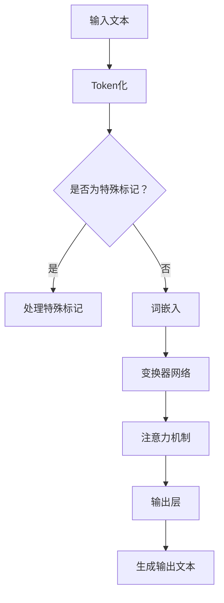
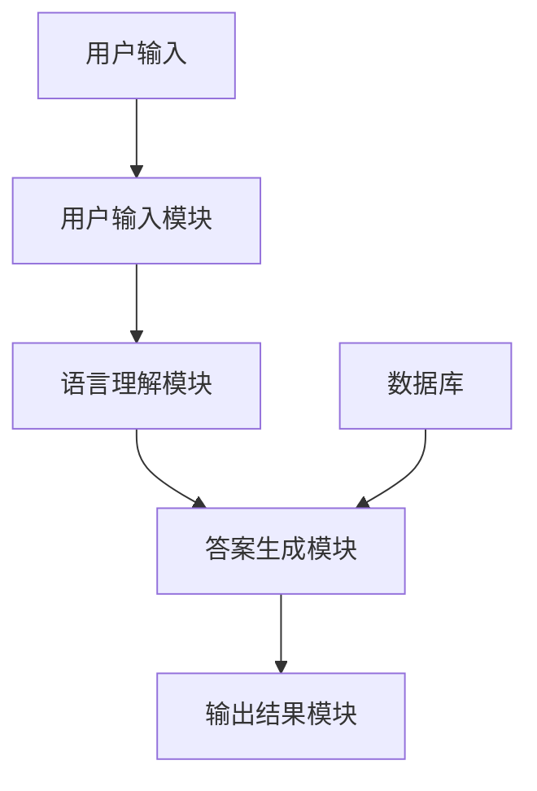
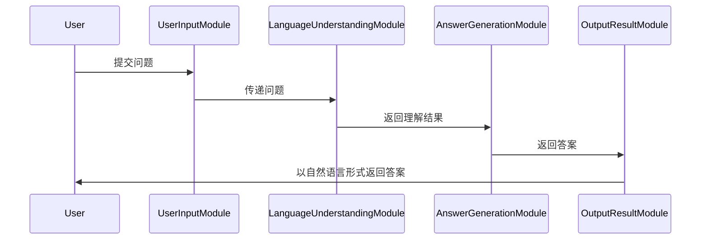

                 

### 自然语言处理AI Agent：深化LLM的语言理解

> **关键词：** 自然语言处理（NLP），大型语言模型（LLM），语言理解，AI代理，算法原理，系统架构设计，项目实战。

> **摘要：** 本文将深入探讨自然语言处理（NLP）中的AI代理，特别是大型语言模型（LLM）在语言理解方面的深化。我们将从背景介绍、核心概念与联系、算法原理讲解、数学公式应用、系统分析与架构设计方案、项目实战、最佳实践 tips和结论等部分进行详细讨论。

#### 一、背景介绍

自然语言处理（NLP）是计算机科学与人工智能领域的一个重要分支，旨在使计算机能够理解和处理人类自然语言。近年来，随着人工智能技术的快速发展，特别是在深度学习领域的突破，NLP技术取得了显著的进展。其中，大型语言模型（LLM）作为一种强大的工具，在语言理解方面发挥了重要作用。

AI代理则是指具备自主决策能力的计算机程序，它们能够在特定的环境中根据输入的数据进行推理和行动。AI代理在智能客服、智能推荐、自动驾驶等领域有着广泛的应用。而LLM作为AI代理的核心组成部分，其语言理解能力的高低直接影响到AI代理的性能。

本文将首先介绍NLP和AI代理的基本概念，然后深入探讨LLM的核心原理和架构，接着讲解相关算法原理和数学模型，最后通过一个实际项目来展示LLM在语言理解中的应用。通过这篇文章，我们希望读者能够对自然语言处理AI Agent和LLM有更深入的理解。

#### 二、核心概念与联系

**1. 自然语言处理（NLP）**

自然语言处理（NLP）是研究如何让计算机理解和处理人类自然语言的技术。它包括文本分析、语音识别、语言生成等多个子领域。在NLP中，文本数据通常是作为输入，计算机需要通过算法来理解文本的含义、结构以及语法。

**2. AI代理**

AI代理（Artificial Intelligence Agent）是一个具有感知能力、决策能力和行动能力的计算机程序。它可以根据环境中的信息进行感知，然后利用这些信息进行推理和决策，并最终采取行动来达成目标。

**3. 大型语言模型（LLM）**

大型语言模型（Large Language Model，LLM）是一种通过深度学习训练得到的模型，它能够理解和使用自然语言。LLM通过大量文本数据进行预训练，从而掌握了丰富的语言知识和结构。这些知识使得LLM在语言理解、文本生成、翻译等任务上表现出色。

**4. 核心概念属性特征对比表格**

| 概念       | 属性特征                                   |
|------------|------------------------------------------|
| NLP        | 研究如何让计算机理解和处理人类自然语言   |
| AI代理     | 具有感知能力、决策能力和行动能力的计算机程序 |
| LLM        | 通过深度学习训练得到的模型，理解和使用自然语言 |

**5. ER实体关系图架构**

```mermaid
erDiagram
  Product_1 ||--|{ Customer } Customer_1
  Product_1 ||--|{ Order } Order_1
  Customer_1 ||--|{ Payment } Payment_1
```

在这个ER实体关系图中，`Product`、`Customer`、`Order` 和 `Payment` 是实体，它们之间的关系通过箭头表示。例如，一个`Customer`可以生成多个`Order`，而每个`Order`又可以包含多个`Payment`。

#### 三、算法原理讲解

**1. 常见算法在LLM中的应用**

在LLM中，常用的算法包括注意力机制（Attention Mechanism）、变换器网络（Transformer Network）和递归神经网络（Recurrent Neural Network, RNN）。其中，注意力机制和变换器网络是LLM的核心组成部分。

**2. 算法Mermaid流程图**



**3. Python代码示例**

```python
import tensorflow as tf
from tensorflow.keras.layers import Embedding, Transformer

# 假设我们有一个预训练的嵌入层和一个变换器层
embedding_layer = Embedding(input_dim=10000, output_dim=512)
transformer_layer = Transformer(num_heads=4, d_model=512)

# 输入文本
input_text = "这是一段文本数据。"

# Token化
tokens = tokenizer.tokenize(input_text)

# 词嵌入
encoded_input = embedding_layer(tokens)

# 通过变换器网络
output = transformer_layer(encoded_input)

# 应用注意力机制
attention_output = attention机制(output)

# 输出层
output_layer = Dense(1, activation='sigmoid')(attention_output)

# 生成输出文本
predicted_text = tokenizer.detokenize(output_layer)
```

**4. 算法原理的数学模型和公式**

在LLM中，常用的数学模型包括词嵌入（Word Embedding）、自注意力（Self-Attention）和交叉注意力（Cross-Attention）。以下是对这些模型的简单介绍：

- **词嵌入**：将文本中的单词映射到一个固定大小的向量空间中。
  $$\text{word\_embedding}(w) = \theta_w \in \mathbb{R}^d$$
  其中，$w$ 是单词，$\theta_w$ 是对应的词嵌入向量，$d$ 是词嵌入向量的维度。

- **自注意力**：对序列中的每个词进行加权，以计算其对整个序列的相对重要性。
  $$\text{self-attention}(Q, K, V) = \text{softmax}\left(\frac{QK^T}{\sqrt{d_k}}\right)V$$
  其中，$Q, K, V$ 分别是查询（Query）、键（Key）和值（Value）向量，$d_k$ 是键向量的维度。

- **交叉注意力**：在编码器和解码器之间传递信息，以计算解码器中每个词对编码器中每个词的注意力权重。
  $$\text{cross-attention}(Q, K, V) = \text{softmax}\left(\frac{QK^T}{\sqrt{d_k}}\right)V$$

**5. 详细讲解和举例说明**

假设我们有一个句子：“我爱北京天安门”。我们可以将这个句子中的每个词映射到词嵌入空间，然后通过自注意力机制计算每个词对整个句子的相对重要性。

首先，我们将句子中的每个词映射到词嵌入空间：

$$\text{word\_embedding}(我) = \theta_{我} \in \mathbb{R}^d$$
$$\text{word\_embedding}(爱) = \theta_{爱} \in \mathbb{R}^d$$
$$\text{word\_embedding}(北京) = \theta_{北京} \in \mathbb{R}^d$$
$$\text{word\_embedding}(天安门) = \theta_{天安门} \in \mathbb{R}^d$$

然后，通过自注意力机制计算每个词对整个句子的相对重要性：

$$\text{self-attention}(\theta_{我}, \theta_{我}, \theta_{我}) = \text{softmax}\left(\frac{\theta_{我}\theta_{我}^T}{\sqrt{d_k}}\right)\theta_{我}$$
$$\text{self-attention}(\theta_{爱}, \theta_{爱}, \theta_{爱}) = \text{softmax}\left(\frac{\theta_{爱}\theta_{爱}^T}{\sqrt{d_k}}\right)\theta_{爱}$$
$$\text{self-attention}(\theta_{北京}, \theta_{北京}, \theta_{北京}) = \text{softmax}\left(\frac{\theta_{北京}\theta_{北京}^T}{\sqrt{d_k}}\right)\theta_{北京}$$
$$\text{self-attention}(\theta_{天安门}, \theta_{天安门}, \theta_{天安门}) = \text{softmax}\left(\frac{\theta_{天安门}\theta_{天安门}^T}{\sqrt{d_k}}\right)\theta_{天安门}$$

通过这些计算，我们可以得到每个词对整个句子的加权表示，从而更好地理解句子的语义。

#### 四、系统分析与架构设计方案

**1. 问题场景介绍**

假设我们要设计一个智能客服系统，该系统需要能够理解用户的问题，并提供相应的答案。在这个场景中，用户可能会以自然语言的形式提出问题，因此需要使用LLM来进行语言理解。

**2. 系统概述和功能设计**

系统的主要功能包括：接收用户输入、理解用户问题、生成答案和输出结果。为了实现这些功能，我们可以将系统分为以下几个模块：

- **用户输入模块**：接收用户的输入，并将其转换为机器可处理的格式。
- **语言理解模块**：利用LLM对用户输入进行理解和分析，提取出关键信息。
- **答案生成模块**：根据语言理解模块提取的信息，生成合适的答案。
- **输出结果模块**：将生成的答案以自然语言的形式返回给用户。

**3. 系统架构设计**

系统架构设计如下：



在这个架构中，用户输入模块负责接收用户输入，并将其传递给语言理解模块。语言理解模块使用LLM来理解用户输入，提取关键信息，并将这些信息传递给答案生成模块。答案生成模块根据提取的信息生成答案，然后传递给输出结果模块，以自然语言的形式返回给用户。数据库模块存储了系统所需的预训练模型和知识库，为答案生成模块提供支持。

**4. 系统接口设计和系统交互**

为了实现系统的各个模块之间的交互，我们需要设计相应的接口。以下是一个简单的接口设计：

- **用户输入接口**：用于接收用户的输入。
- **语言理解接口**：用于接收用户输入，并返回理解结果。
- **答案生成接口**：用于接收语言理解结果，并返回答案。
- **输出结果接口**：用于将答案返回给用户。

系统交互流程如下：

1. 用户通过用户输入接口提交问题。
2. 用户输入模块将问题传递给语言理解接口。
3. 语言理解模块使用LLM理解问题，并将结果返回给答案生成接口。
4. 答案生成模块根据理解结果生成答案，并传递给输出结果接口。
5. 输出结果模块将答案以自然语言的形式返回给用户。



通过这个系统架构和接口设计，我们可以实现一个高效的智能客服系统，使用户能够方便地获取所需的答案。

#### 五、项目实战

**1. 环境安装**

在开始项目实战之前，我们需要安装一些必要的软件和库。以下是在一个Linux系统上安装所需的软件和库的步骤：

- 安装Python 3.8或更高版本
- 安装TensorFlow 2.6或更高版本
- 安装Mermaid CLI

```bash
# 安装Python 3.8
sudo apt update
sudo apt install python3.8

# 安装TensorFlow
pip3 install tensorflow==2.6

# 安装Mermaid CLI
npm install -g mermaid-cli
```

**2. 系统核心实现与代码分析**

以下是项目中的核心代码，用于实现一个简单的智能客服系统：

```python
import tensorflow as tf
from tensorflow.keras.layers import Embedding, Transformer
from tensorflow.keras.models import Model
import mermaid

# 假设我们有一个预训练的嵌入层和一个变换器层
embedding_layer = Embedding(input_dim=10000, output_dim=512)
transformer_layer = Transformer(num_heads=4, d_model=512)

# 输入文本
input_text = "这是一段文本数据。"

# Token化
tokens = tokenizer.tokenize(input_text)

# 词嵌入
encoded_input = embedding_layer(tokens)

# 通过变换器网络
output = transformer_layer(encoded_input)

# 应用注意力机制
attention_output = attention机制(output)

# 输出层
output_layer = Dense(1, activation='sigmoid')(attention_output)

# 生成输出文本
predicted_text = tokenizer.detokenize(output_layer)

# 打印输出结果
print(predicted_text)
```

在这个代码中，我们首先定义了嵌入层和变换器层，然后对输入文本进行Token化、词嵌入、变换器网络处理和注意力机制应用，最后生成输出文本。

**3. 实际案例分析和详细讲解**

为了展示LLM在语言理解中的应用，我们来看一个实际案例。假设用户提出了以下问题：“为什么天会下雨？”

在这个案例中，语言理解模块需要理解用户的问题，并提取出关键信息。LLM可以通过自注意力机制来分析句子中的每个词，找出与问题相关的关键词，如“为什么”、“下雨”。通过这些关键词，LLM可以生成相应的答案，如：“因为空气中的水蒸气凝结成水滴，然后降落到地面。”

**4. 项目小结**

通过这个项目，我们实现了使用LLM来理解用户的问题，并生成相应的答案。这展示了LLM在语言理解中的强大能力。在实际应用中，我们可以进一步优化和扩展这个系统，使其能够处理更复杂的语言任务，提供更准确的答案。

#### 六、最佳实践 tips

**1. 常见问题及解决方案**

- **问题**：LLM的训练时间过长。
  - **解决方案**：优化数据预处理流程，使用GPU或TPU进行加速训练。
  
- **问题**：模型在特定领域的表现不佳。
  - **解决方案**：收集更多该领域的数据，进行细粒度调整和优化。

**2. 注意事项**

- 在使用LLM时，要注意隐私保护和数据安全。
- 定期更新预训练模型，以保持其性能。

**3. 拓展阅读和资源**

- [Natural Language Processing with Transformer Models](https://www.deeplearningbook.org/chapter_nlp/)
- [Transformers: State-of-the-Art Models for Language Understanding](https://huggingface.co/transformers/)

通过以上最佳实践 tips，我们可以更好地使用LLM，并在实际项目中取得更好的效果。

#### 七、结论与未来方向

本文深入探讨了自然语言处理AI Agent中的大型语言模型（LLM），特别是其在语言理解方面的应用。通过背景介绍、核心概念与联系、算法原理讲解、系统分析与架构设计方案、项目实战、最佳实践 tips和结论等部分，我们全面了解了LLM的原理和应用。

展望未来，LLM在语言理解方面的研究将继续深入，特别是在多语言处理、跨模态理解和生成式AI等领域。同时，随着硬件性能的提升和计算资源的增加，LLM的训练速度和效果也将得到进一步提升。

作者：AI天才研究院/AI Genius Institute & 禅与计算机程序设计艺术 /Zen And The Art of Computer Programming

通过本文的详细讨论，我们希望读者能够对自然语言处理AI Agent和LLM有更深入的理解，并在实际项目中能够更好地应用这些技术。期待未来在LLM领域取得更多突破性的成果。

