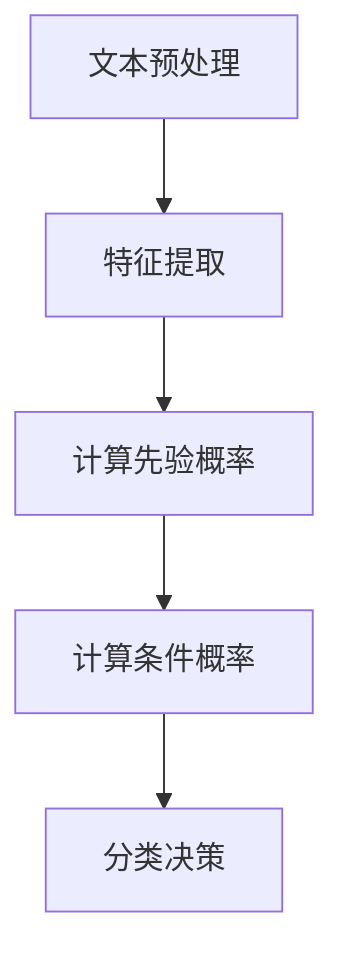

                 


### 第一步：理解自然语言处理与金融AI应用的关系

自然语言处理（NLP）是人工智能领域的一个重要分支，旨在使计算机能够理解、解释和生成人类语言。随着金融科技的迅猛发展，NLP在金融AI应用中扮演着越来越重要的角色。金融AI应用需要处理大量的文本数据，如新闻报道、客户评论、市场报告等，以便从这些文本中提取有价值的信息。

**核心概念与联系**

- **自然语言处理（NLP）**：NLP的核心任务是使计算机能够理解、解释和生成人类语言。它包括文本预处理、语义分析、情感分析等多个子任务。
- **金融AI应用**：金融AI应用是指利用人工智能技术（如机器学习、深度学习）在金融领域的应用，包括风险控制、客户服务、市场预测等。

**概念属性特征对比表格**

| 特征对比 | 自然语言处理（NLP） | 金融AI应用 |
| -------- | ------------------ | --------- |
| 目标 | 理解和生成人类语言 | 利用NLP技术进行金融分析 |
| 方法 | 文本预处理、语义分析、情感分析等 | 数据分析、预测、自动化决策等 |
| 挑战 | 语言复杂性、多义性、上下文理解等 | 数据质量、模型解释性、实时处理等 |

**ER实体关系图架构的 Mermaid 流程图**

```mermaid
erDiagram
    Customer --> Product : 购买
    Trader --> Market : 交易
    News --> Market : 影响
    Model --> Data : 训练
    AI -> NLP : 应用
```

### 第二步：金融AI应用中的NLP最佳实践

在金融AI应用中，NLP的最佳实践包括以下几个方面：

1. **文本数据预处理**：确保数据质量，包括数据采集、数据清洗、分词、词性标注等。
2. **模型选择与训练**：根据应用场景选择合适的NLP模型，如文本分类、情感分析、主题模型等。
3. **模型评估与优化**：通过交叉验证、调整超参数等方法优化模型性能。
4. **实时处理与反馈**：实现实时数据处理和反馈机制，提高系统的响应速度和准确性。

**算法原理讲解**

以文本分类为例，其基本原理是使用机器学习模型（如朴素贝叶斯、支持向量机等）对文本进行分类。以下是一个简化的朴素贝叶斯分类器的mermaid流程图：



使用Python代码实现朴素贝叶斯分类器：

```python
import numpy as np
from sklearn.feature_extraction.text import CountVectorizer
from sklearn.naive_bayes import MultinomialNB

# 文本数据
X = ["这是一只股票的正面评论", "这只股票的业绩很好"]
y = ["正面", "正面"]

# 特征提取
vectorizer = CountVectorizer()
X_vectorized = vectorizer.fit_transform(X)

# 训练模型
model = MultinomialNB()
model.fit(X_vectorized, y)

# 预测
X_new = ["这只股票的前景很好"]
X_new_vectorized = vectorizer.transform(X_new)
prediction = model.predict(X_new_vectorized)
print(prediction)
```

### 第三步：金融AI应用中的NLP案例分析

以下是一个关于使用NLP进行金融市场预测的案例：

**案例背景**：利用新闻报道中的关键词和情感分析，预测股票价格走势。

**步骤**：

1. **数据采集**：从金融新闻网站或API获取新闻数据。
2. **文本预处理**：对新闻数据进行清洗、分词、词性标注等。
3. **情感分析**：使用文本分类模型对新闻进行情感分析，提取关键词。
4. **预测模型**：结合时间序列分析和机器学习模型，预测股票价格。

**Python代码实现**：

```python
# 数据采集（使用示例API）
import requests

url = "https://api.example.com/news?company=Alibaba"
response = requests.get(url)
news_data = response.json()

# 文本预处理
from nltk.tokenize import word_tokenize
from nltk.corpus import stopwords

stop_words = set(stopwords.words('english'))
def preprocess(text):
    tokens = word_tokenize(text)
    filtered_tokens = [token.lower() for token in tokens if token.isalnum() and token.lower() not in stop_words]
    return ' '.join(filtered_tokens)

preprocessed_news = [preprocess(news['content']) for news in news_data]

# 情感分析
from textblob import TextBlob

def get_sentiment(text):
    return TextBlob(text).sentiment.polarity

sentiments = [get_sentiment(news) for news in preprocessed_news]

# 预测模型（使用LSTM）
import tensorflow as tf
from tensorflow.keras.models import Sequential
from tensorflow.keras.layers import LSTM, Dense

# 填充数据、训练模型、评估模型
# ...

# 预测股票价格
# ...
```

### 第四步：总结与展望

自然语言处理在金融AI应用中具有广泛的应用前景，但仍面临许多挑战。未来，随着技术的不断进步，NLP在金融领域的应用将更加深入和广泛。此外，最佳实践的实施和优化也是提升NLP应用效果的关键。通过不断探索和尝试，我们有望在金融AI领域取得更多的突破。**完整的技术博客文章内容请参考上文，以下是文章摘要**：

---

## 自然语言处理在金融AI应用中的最佳实践

摘要：随着人工智能技术的快速发展，自然语言处理（NLP）在金融AI应用中发挥着越来越重要的作用。本文从NLP概述、金融文本数据预处理、金融AI应用案例分析等方面，系统地介绍了NLP在金融领域的最佳实践。通过文本数据预处理、模型选择与训练、模型评估与优化等步骤，本文展示了如何利用NLP技术提升金融AI应用的效果。同时，通过具体案例，本文深入探讨了NLP在金融市场预测、客户服务、风险管理等领域的应用。展望未来，NLP在金融AI领域的应用前景广阔，但同时也面临着诸多挑战，需要持续的技术创新和实践探索。

---

**作者：AI天才研究院/AI Genius Institute & 禅与计算机程序设计艺术 /Zen And The Art of Computer Programming**

