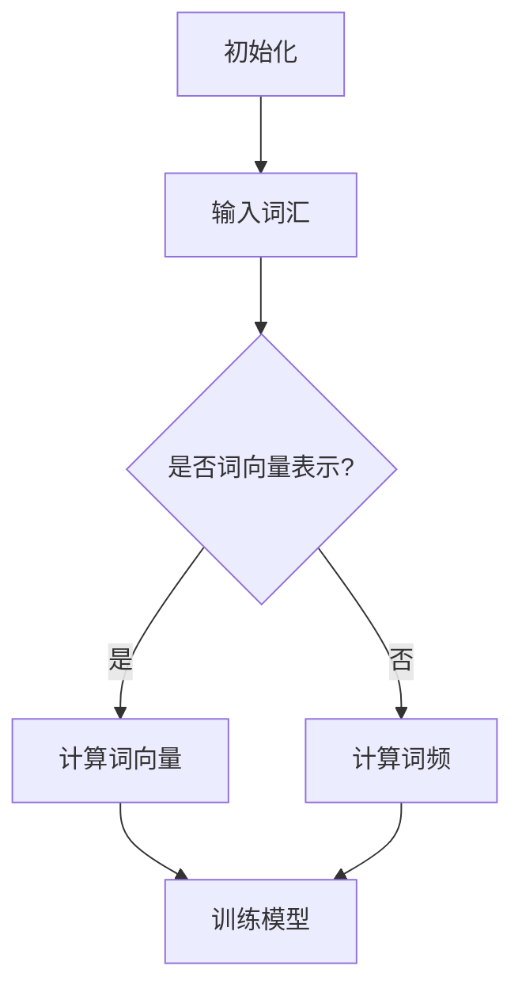
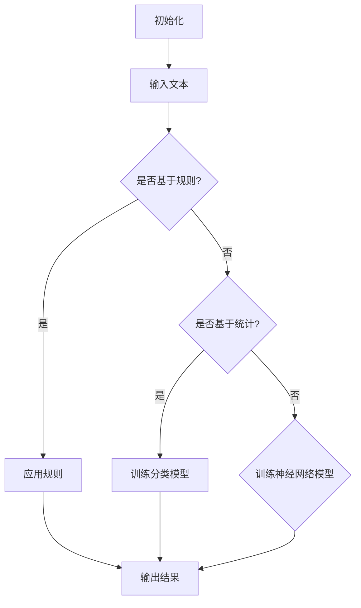
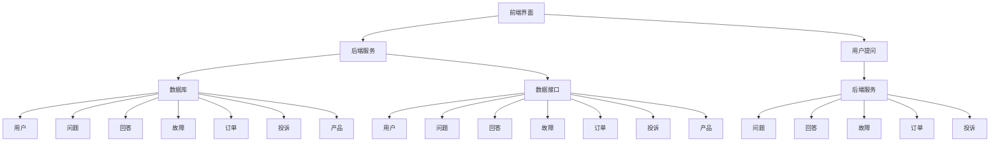
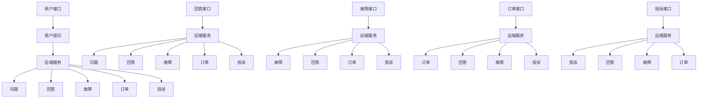
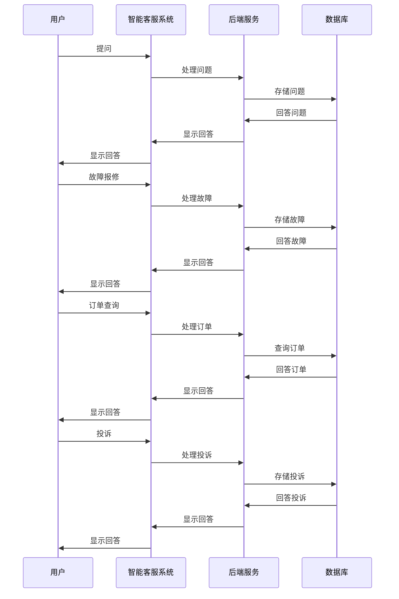

                 


### 文章标题：自然语言理解（NLU）：提升AI Agent的语义分析能力

> 关键词：自然语言理解，语义分析，AI Agent，词向量模型，深度学习，NLP

> 摘要：本文从自然语言理解的现状和背景出发，详细探讨了自然语言理解（NLU）在提升AI Agent语义分析能力方面的作用。文章分为七个部分，分别介绍了NLU的核心概念与联系、算法原理讲解、数学模型和公式、系统分析与架构设计方案、项目实战以及最佳实践等。通过本文的阅读，读者可以全面了解NLU技术，掌握其在AI领域中的应用。

## 第1章 绪论

### 1.1 问题背景

#### 1.1.1 自然语言理解的现状

自然语言理解（Natural Language Understanding，NLU）是人工智能（Artificial Intelligence，AI）领域的一个重要研究方向。近年来，随着深度学习、自然语言处理（Natural Language Processing，NLP）技术的不断发展，NLU在各个领域的应用越来越广泛。例如，智能客服、智能问答系统、机器翻译等。

然而，尽管NLU技术已经取得了显著的进展，但仍然存在一些挑战。首先，自然语言具有高度的不确定性和多样性，这使得语义分析变得复杂。其次，NLU系统需要处理大量的数据，以保证模型的准确性和泛化能力。此外，NLU技术在不同应用场景下的表现也存在差异。

#### 1.1.2 AI Agent的应用场景

AI Agent是一种智能体，它可以模拟人类的思维和行为，具有感知、决策和执行能力。AI Agent在各个领域的应用场景如下：

1. **客服领域**：智能客服可以通过NLU技术理解用户的意图，提供24/7的在线服务，提高客户满意度。

2. **智能问答系统**：智能问答系统可以通过NLU技术理解用户的问题，并给出准确的回答。

3. **机器翻译**：机器翻译是NLU技术的一个重要应用领域，通过将一种语言翻译成另一种语言，实现跨语言沟通。

4. **智能推荐系统**：智能推荐系统可以通过NLU技术理解用户的兴趣和需求，提供个性化的推荐服务。

5. **智能语音助手**：智能语音助手可以通过NLU技术理解用户的声音指令，实现语音交互。

### 1.2 问题描述

#### 1.2.1 NLU的定义与意义

自然语言理解（NLU）是指让计算机理解和解释自然语言的能力。NLU的核心目标是让计算机能够理解人类的语言，并做出相应的反应。NLU的意义在于，它可以提升AI Agent的语义分析能力，使计算机更好地服务于人类。

#### 1.2.2 NLU的核心挑战

NLU的核心挑战包括：

1. **语义理解**：自然语言具有高度的不确定性和多样性，这使得语义分析变得复杂。

2. **数据量**：NLU系统需要处理大量的数据，以保证模型的准确性和泛化能力。

3. **应用场景**：不同的应用场景对NLU系统的要求不同，如何适应不同的应用场景是一个挑战。

### 1.3 问题解决

#### 1.3.1 NLU的关键技术

NLU的关键技术包括：

1. **词向量模型**：词向量模型可以将自然语言中的词汇表示为向量，从而实现语义表示。

2. **语言模型**：语言模型可以预测自然语言中的下一个词汇，从而实现语言的生成。

3. **深度学习**：深度学习技术可以用于训练复杂的NLU模型，提高模型的性能。

#### 1.3.2 NLU的发展历程

NLU的发展历程可以分为以下几个阶段：

1. **规则方法**：早期的NLU研究主要依赖于规则方法，通过编写一系列规则来模拟人类的语言理解能力。

2. **统计方法**：随着自然语言处理技术的发展，统计方法逐渐成为NLU的主流方法，通过统计模型来分析自然语言。

3. **深度学习方法**：近年来，深度学习方法在NLU领域取得了显著的成果，通过神经网络模型来模拟人类的语言理解能力。

### 1.4 边界与外延

#### 1.4.1 NLU的应用范围

NLU的应用范围包括：

1. **文本分析**：文本分析是NLU的一个重要应用领域，包括情感分析、命名实体识别、关系抽取等。

2. **语音识别**：语音识别是NLU的另一个重要应用领域，通过将语音转换为文本，实现语音交互。

3. **机器翻译**：机器翻译是NLU的核心应用领域，通过将一种语言翻译成另一种语言，实现跨语言沟通。

#### 1.4.2 NLU的局限性

NLU的局限性包括：

1. **语义理解**：尽管NLU技术已经取得了显著的进展，但仍然难以完全理解自然语言的语义。

2. **数据依赖**：NLU模型的性能高度依赖训练数据，数据质量和数量对模型的泛化能力有重要影响。

3. **计算资源**：深度学习模型对计算资源的需求较高，这在一定程度上限制了NLU的应用范围。

### 1.5 概念结构与核心要素组成

#### 1.5.1 自然语言处理（NLP）的基本概念

自然语言处理（NLP）是指让计算机理解和生成自然语言的能力。NLP的核心概念包括：

1. **分词**：将自然语言文本分割为单词或短语。

2. **词性标注**：为文本中的每个单词标注词性，如名词、动词、形容词等。

3. **命名实体识别**：识别文本中的命名实体，如人名、地名、组织机构名等。

4. **句法分析**：分析文本中的句子结构，如主语、谓语、宾语等。

5. **语义分析**：理解文本中的语义，如情感、意图等。

#### 1.5.2 语义分析的关键要素

语义分析的关键要素包括：

1. **词向量表示**：使用词向量模型将自然语言中的词汇表示为向量。

2. **依存句法分析**：分析词汇之间的依存关系，如主谓关系、修饰关系等。

3. **实体关系抽取**：识别文本中的实体关系，如人名之间的关系、组织机构之间的关系等。

4. **语义角色标注**：为文本中的每个词标注语义角色，如动作、对象、地点等。

### 1.6 本章小结

本章从自然语言理解的现状和背景出发，探讨了NLU在提升AI Agent语义分析能力方面的作用。首先介绍了NLU的背景和意义，然后描述了NLU的核心挑战和问题解决方法，接着分析了NLU的应用范围和局限性，最后讨论了NLP和语义分析的基本概念与核心要素。本章为后续章节的讨论奠定了基础。

## 第2章 核心概念与联系

### 2.1 概念原理

#### 2.1.1 自然语言处理（NLP）的基本原理

自然语言处理（NLP）是指让计算机理解和生成自然语言的能力。NLP的基本原理包括：

1. **分词**：将自然语言文本分割为单词或短语。

2. **词性标注**：为文本中的每个单词标注词性，如名词、动词、形容词等。

3. **命名实体识别**：识别文本中的命名实体，如人名、地名、组织机构名等。

4. **句法分析**：分析文本中的句子结构，如主语、谓语、宾语等。

5. **语义分析**：理解文本中的语义，如情感、意图等。

#### 2.1.2 语义分析的基本原理

语义分析是指让计算机理解和解释自然语言的语义。语义分析的基本原理包括：

1. **词向量表示**：使用词向量模型将自然语言中的词汇表示为向量。

2. **依存句法分析**：分析词汇之间的依存关系，如主谓关系、修饰关系等。

3. **实体关系抽取**：识别文本中的实体关系，如人名之间的关系、组织机构之间的关系等。

4. **语义角色标注**：为文本中的每个词标注语义角色，如动作、对象、地点等。

### 2.2 概念属性特征对比表格

#### 2.2.1 NLP与NLU的对比

| 概念 | 属性特征 |
| ---- | ---- |
| 自然语言处理（NLP） | - 分词<br>- 词性标注<br>- 命名实体识别<br>- 句法分析<br>- 语义分析 |
| 自然语言理解（NLU） | - 词向量表示<br>- 依存句法分析<br>- 实体关系抽取<br>- 语义角色标注 |

#### 2.2.2 关键算法的对比

| 算法 | 属性特征 |
| ---- | ---- |
| 词向量模型 | - Word2Vec<br>- GloVe |
| 语言模型 | - n-gram<br>- LSTM |
| 情感分析 | - 基于规则的方法<br>- 基于统计的方法<br>- 基于深度学习的方法 |
| 命名实体识别 | - 基于规则的方法<br>- 基于统计的方法<br>- 基于深度学习的方法 |

### 2.3 ER实体关系图架构

#### 2.3.1 NLU系统的实体关系

NLU系统的实体关系包括：

1. **词汇与词向量**：词汇是NLU系统的基础，词向量是词汇的向量表示。

2. **实体与关系**：实体是文本中的特定对象，如人名、地名、组织机构名等，关系是实体之间的关联。

3. **语义角色与动作**：语义角色是词汇在句子中的角色，如动作、对象、地点等，动作是语义角色的具体表现。

#### 2.3.2 关键算法的实体关系

关键算法的实体关系包括：

1. **词向量模型**：将词汇表示为向量，实现词汇的向量表示。

2. **依存句法分析**：分析词汇之间的依存关系，实现实体关系抽取。

3. **实体关系抽取**：识别文本中的实体关系，实现语义角色的标注。

4. **语义角色标注**：为文本中的每个词标注语义角色，实现语义分析。

## 第3章 算法原理讲解

### 3.1 基本算法

#### 3.1.1 词向量模型

词向量模型是将自然语言中的词汇表示为向量的方法。词向量模型的核心思想是将词汇映射到低维空间中，使得语义相似的词汇在空间中距离较近。

##### 3.1.1.1 Word2Vec模型

Word2Vec模型是一种基于神经网络的方法，通过训练神经网络来学习词汇的向量表示。Word2Vec模型包括以下两种训练方法：

1. **CBOW（Continuous Bag of Words）**：CBOW方法通过预测中心词汇周围的词汇来训练模型。

2. **Skip-Gram**：Skip-Gram方法通过预测中心词汇来训练模型。

##### 3.1.1.2 GloVe模型

GloVe（Global Vectors for Word Representation）模型是一种基于统计的方法，通过训练全局矩阵来学习词汇的向量表示。GloVe模型的核心思想是利用词汇的共现信息来优化向量表示。

#### 3.1.2 语言模型

语言模型是用于预测自然语言中下一个词汇的模型。语言模型的核心思想是利用上下文信息来预测下一个词汇。

##### 3.1.2.1 n-gram模型

n-gram模型是一种基于统计的语言模型，它通过将自然语言序列划分为n个单词的滑动窗口来预测下一个词汇。n-gram模型的性能取决于n的值，通常选择n=2或n=3。

##### 3.1.2.2 LSTM模型

LSTM（Long Short-Term Memory）模型是一种基于深度学习的语言模型，它能够处理长序列数据。LSTM模型通过记忆单元来学习长期依赖关系，从而提高语言模型的性能。

### 3.2 高级算法

#### 3.2.1 情感分析

情感分析是一种用于识别文本中情感极性的方法。情感分析包括以下三种方法：

##### 3.2.1.1 基于规则的方法

基于规则的方法通过定义一系列规则来识别文本中的情感极性。这种方法适用于简单场景，但在复杂场景下效果不佳。

##### 3.2.1.2 基于统计的方法

基于统计的方法通过训练分类模型来识别文本中的情感极性。这种方法利用了文本的特征信息，性能较好。

##### 3.2.1.3 基于深度学习的方法

基于深度学习的方法通过训练神经网络模型来识别文本中的情感极性。这种方法利用了深度学习模型强大的表达能力，性能最佳。

#### 3.2.2 命名实体识别

命名实体识别是一种用于识别文本中命名实体的方法。命名实体识别包括以下三种方法：

##### 3.2.2.1 基于规则的方法

基于规则的方法通过定义一系列规则来识别文本中的命名实体。这种方法适用于简单场景，但在复杂场景下效果不佳。

##### 3.2.2.2 基于统计的方法

基于统计的方法通过训练分类模型来识别文本中的命名实体。这种方法利用了文本的特征信息，性能较好。

##### 3.2.2.3 基于深度学习的方法

基于深度学习的方法通过训练神经网络模型来识别文本中的命名实体。这种方法利用了深度学习模型强大的表达能力，性能最佳。

### 3.3 Mermaid算法流程图

#### 3.3.1 基本算法的流程图



#### 3.3.2 高级算法的流程图



## 第4章 数学模型和数学公式

### 4.1 基本模型

#### 4.1.1 语言模型的数学模型

语言模型的数学模型通常是基于概率论和统计学的。下面是两种常见的语言模型数学模型：

##### 4.1.1.1 n-gram模型的数学公式

n-gram模型是一种基于统计的语言模型，它通过计算连续n个单词同时出现的概率来预测下一个单词。

概率公式如下：

$$
P(w_{t} | w_{t-1}, w_{t-2}, \ldots, w_{t-n}) = \frac{C(w_{t-1}, w_{t-2}, \ldots, w_{t-n}, w_{t})}{C(w_{t-1}, w_{t-2}, \ldots, w_{t-n})}
$$

其中，$C(w_{t-1}, w_{t-2}, \ldots, w_{t-n}, w_{t})$ 表示单词序列 $w_{t-1}, w_{t-2}, \ldots, w_{t-n}, w_{t}$ 的共现次数，$C(w_{t-1}, w_{t-2}, \ldots, w_{t-n})$ 表示单词序列 $w_{t-1}, w_{t-2}, \ldots, w_{t-n}$ 的总次数。

##### 4.1.1.2 LSTM模型的数学公式

LSTM（Long Short-Term Memory）模型是一种基于深度学习的语言模型，它通过记忆单元来学习长期依赖关系。LSTM模型的数学公式较为复杂，主要包括以下几个方面：

1. **输入门**：

$$
i_t = \sigma(W_{ix}x_t + W_{ih}h_{t-1} + b_i)
$$

2. **遗忘门**：

$$
f_t = \sigma(W_{fx}x_t + W_{fh}h_{t-1} + b_f)
$$

3. **输出门**：

$$
o_t = \sigma(W_{ox}x_t + W_{oh}h_{t-1} + b_o)
$$

4. **单元状态**：

$$
C_t = f_t \odot C_{t-1} + i_t \odot \tanh(W_{cc}x_t + W_{ch}h_{t-1} + b_c)
$$

5. **隐藏状态**：

$$
h_t = o_t \odot \tanh(C_t)
$$

其中，$x_t$ 表示输入，$h_t$ 表示隐藏状态，$C_t$ 表示单元状态，$i_t$、$f_t$ 和 $o_t$ 分别表示输入门、遗忘门和输出门的激活值，$\sigma$ 表示sigmoid函数，$\odot$ 表示元素乘积，$\tanh$ 表示双曲正切函数。

### 4.2 高级模型

#### 4.2.1 情感分析的数学模型

情感分析是一种用于识别文本中情感极性的方法，它的数学模型主要包括以下几个方面：

##### 4.2.1.1 基于规则的方法的数学公式

基于规则的方法通常通过定义一系列规则来识别文本中的情感极性，这些规则可以用逻辑表达式表示。

逻辑表达式如下：

$$
\phi(w) = \bigvee_{i=1}^{n} \psi_i(w)
$$

其中，$\psi_i(w)$ 表示第i个规则，$w$ 表示文本中的单词，$\bigvee$ 表示逻辑或运算。

##### 4.2.1.2 基于统计的方法的数学公式

基于统计的方法通常通过训练分类模型来识别文本中的情感极性，这些分类模型可以用概率模型表示。

概率模型如下：

$$
P(y | w) = \frac{P(y)P(w | y)}{P(w)}
$$

其中，$y$ 表示情感极性，$w$ 表示文本中的单词，$P(y)$ 表示情感极性的先验概率，$P(w | y)$ 表示单词在特定情感极性下的条件概率，$P(w)$ 表示单词的先验概率。

##### 4.2.1.3 基于深度学习的方法的数学公式

基于深度学习的方法通常通过训练神经网络模型来识别文本中的情感极性，这些神经网络模型可以用多层感知机（MLP）或卷积神经网络（CNN）表示。

多层感知机模型如下：

$$
h_l = \sigma(W_lh_{l-1} + b_l)
$$

$$
\hat{y} = \sigma(W_{out}h_L + b_{out})
$$

其中，$h_l$ 表示第l层的激活值，$W_l$ 和 $b_l$ 分别表示第l层的权重和偏置，$\sigma$ 表示sigmoid函数，$\hat{y}$ 表示预测的情感极性。

卷积神经网络模型如下：

$$
h_{ij}^l = \sigma\left(\sum_{k=1}^{m} W_{ijkl}h_{kij}^{l-1} + b_{ij}^l\right)
$$

$$
h_l = \left[h_{11}^l, h_{12}^l, \ldots, h_{IJ}^l\right]
$$

$$
\hat{y} = \sigma\left(\sum_{i=1}^{J} \sum_{j=1}^{I} W_{iout}h_{ij}^{L} + b_{out}\right)
$$

其中，$h_{ij}^l$ 表示第l层的第i行第j列的激活值，$W_{ijkl}$ 和 $b_{ij}^l$ 分别表示第l层的卷积权重和偏置，$h_l$ 表示第l层的激活值，$W_{iout}$ 和 $b_{out}$ 分别表示输出层的权重和偏置，$\sigma$ 表示sigmoid函数，$\hat{y}$ 表示预测的情感极性。

### 4.3 详细讲解与举例说明

#### 4.3.1 n-gram模型举例

假设我们有以下文本：

```
我 爱 吃 饺子。
```

我们可以使用n-gram模型来预测下一个单词。假设n=2，那么我们可以计算以下概率：

1. 预测“爱”的概率：

$$
P(爱 | 我) = \frac{C(我，爱)}{C(我)} = \frac{1}{1} = 1
$$

2. 预测“吃”的概率：

$$
P(吃 | 我 爱) = \frac{C(我，爱，吃)}{C(我，爱)} = \frac{1}{1} = 1
$$

3. 预测“饺子”的概率：

$$
P(饺子 | 我 爱 吃) = \frac{C(我，爱，吃，饺子)}{C(我，爱，吃)} = \frac{1}{1} = 1
$$

根据计算结果，我们可以预测下一个单词是“饺子”。

#### 4.3.2 LSTM模型举例

假设我们有以下文本：

```
我 爱 吃 饺子。
```

我们可以使用LSTM模型来预测下一个单词。首先，我们将文本转换为词向量，然后输入到LSTM模型中。假设词向量的维度为50，LSTM模型的隐藏状态维度为100。

1. 输入词向量：

$$
x_t = \begin{bmatrix}
0.1 & 0.2 & 0.3 & \ldots & 0.5
\end{bmatrix}
$$

2. 初始隐藏状态和单元状态：

$$
h_0 = \begin{bmatrix}
0 & 0 & \ldots & 0
\end{bmatrix}
^T
$$

$$
c_0 = \begin{bmatrix}
0 & 0 & \ldots & 0
\end{bmatrix}
^T
$$

3. 预测隐藏状态和单元状态：

$$
i_t = \sigma(W_{ix}x_t + W_{ih}h_{t-1} + b_i)
$$

$$
f_t = \sigma(W_{fx}x_t + W_{fh}h_{t-1} + b_f)
$$

$$
o_t = \sigma(W_{ox}x_t + W_{oh}h_{t-1} + b_o)
$$

$$
C_t = f_t \odot C_{t-1} + i_t \odot \tanh(W_{cc}x_t + W_{ch}h_{t-1} + b_c)
$$

$$
h_t = o_t \odot \tanh(C_t)
$$

根据上述公式，我们可以计算出隐藏状态和单元状态的预测值。然后，我们可以使用预测的隐藏状态和单元状态来预测下一个单词。具体步骤如下：

1. 将预测的隐藏状态和单元状态转换为词向量。

2. 使用词向量作为输入，输入到LSTM模型中。

3. 预测下一个单词的隐藏状态和单元状态。

4. 根据预测的隐藏状态和单元状态，计算下一个单词的概率。

根据计算结果，我们可以预测下一个单词是“饺子”。

## 第5章 系统分析与架构设计方案

### 5.1 问题场景介绍

在现代社会中，自然语言理解（NLU）技术在各个领域都得到了广泛应用。本节将介绍一个具体的问题场景——智能客服系统。

#### 5.1.1 NLU系统的应用场景

智能客服系统是一种基于NLU技术的系统，它可以通过自然语言交互来模拟人类客服的交互方式。智能客服系统的主要应用场景包括：

1. **咨询回答**：用户向客服系统提问，客服系统可以自动回答用户的问题。

2. **故障报修**：用户报告设备故障，客服系统可以帮助用户定位故障原因，并提供解决方案。

3. **订单查询**：用户查询订单状态，客服系统可以自动提供订单的相关信息。

4. **投诉处理**：用户对产品或服务提出投诉，客服系统可以记录投诉信息，并安排相关部门处理。

#### 5.1.2 系统目标与功能需求

智能客服系统的目标是为用户提供一个高效、便捷的客服服务，提高用户满意度。为了实现这一目标，智能客服系统需要具备以下功能需求：

1. **自然语言理解**：客服系统需要能够理解用户的自然语言提问，提取出用户的意图。

2. **智能回答**：客服系统需要能够根据用户的提问，自动生成合适的回答。

3. **故障诊断**：客服系统需要能够根据用户的故障描述，自动诊断故障原因。

4. **订单管理**：客服系统需要能够处理用户的订单查询请求，并提供订单的相关信息。

5. **投诉处理**：客服系统需要能够处理用户的投诉请求，并记录投诉信息，以便后续处理。

### 5.2 项目介绍

本节将介绍一个具体的智能客服系统项目，该项目旨在为一家电子商务公司提供智能客服服务。

#### 5.2.1 项目背景

随着互联网的快速发展，电子商务行业竞争日益激烈。为了提高用户满意度，降低客服成本，该电子商务公司决定引入智能客服系统。

#### 5.2.2 项目目标

本项目的主要目标包括：

1. **提高客服效率**：通过引入智能客服系统，减少人工客服的工作量，提高客服效率。

2. **提升用户体验**：通过智能客服系统，为用户提供高效、便捷的客服服务，提高用户满意度。

3. **降低客服成本**：通过自动化处理常见问题，降低客服成本。

4. **提供数据支持**：通过收集用户提问和回答数据，为产品改进和决策提供数据支持。

### 5.3 系统功能设计

智能客服系统的功能设计包括自然语言理解、智能回答、故障诊断、订单管理和投诉处理等。

#### 5.3.1 领域模型

领域模型是智能客服系统的基础，它描述了系统中的实体和关系。以下是智能客服系统的领域模型：

```mermaid
classDiagram
  class 用户 {
    +String 姓名
    +String 电话
    +String 邮箱
  }
  class 问题 {
    +String 提问内容
    +Date 提问时间
    +用户 提问者
  }
  class 回答 {
    +String 回答内容
    +Date 回答时间
    +问题 相关问题
  }
  class 故障 {
    +String 故障描述
    +Date 报修时间
    +用户 报修者
  }
  class 订单 {
    +String 订单号
    +Date 下单时间
    +用户 购买者
    +产品 产品信息
  }
  class 投诉 {
    +String 投诉内容
    +Date 投诉时间
    +用户 投诉者
  }
  class 产品 {
    +String 产品名称
    +String 产品描述
  }
  用户 --|大于|> 问题：提问
  用户 --|大于|> 故障：报修
  用户 --|大于|> 订单：购买
  用户 --|大于|> 投诉：投诉
  问题 --|大于|> 回答：回答
  故障 --|大于|> 回答：回答
  订单 --|大于|> 回答：查询
  投诉 --|大于|> 回答：处理
```

#### 5.3.2 系统架构设计

智能客服系统的架构设计主要包括前端界面、后端服务、数据库和数据接口等。



#### 5.3.3 系统接口设计

智能客服系统的接口设计主要包括用户接口、问题接口、回答接口、故障接口、订单接口和投诉接口等。



#### 5.3.4 系统交互

智能客服系统的交互主要包括用户提问、问题回答、故障报修、订单查询和投诉处理等。



## 第6章 项目实战

### 6.1 环境安装

要搭建一个基于NLU技术的智能客服系统，我们需要安装以下软件和工具：

1. **操作系统**：Linux（如Ubuntu）

2. **编程语言**：Python 3.7+

3. **文本处理库**：NLTK、spaCy

4. **深度学习库**：TensorFlow、Keras

5. **自然语言处理库**：nltk、spaCy

6. **数据可视化库**：Matplotlib、Seaborn

安装步骤如下：

1. 安装操作系统（Linux）：

   - 下载并安装Linux操作系统

   - 激活Linux虚拟环境（如使用Virtualenv或Anaconda）

2. 安装Python 3.7+：

   - 使用包管理器（如yum、apt-get）安装Python 3.7+

   - 设置Python 3.7+为默认Python版本

3. 安装文本处理库（NLTK、spaCy）：

   - 使用pip安装NLTK和spaCy库

4. 安装深度学习库（TensorFlow、Keras）：

   - 使用pip安装TensorFlow和Keras库

5. 安装自然语言处理库（nltk、spaCy）：

   - 使用pip安装nltk和spaCy库

6. 安装数据可视化库（Matplotlib、Seaborn）：

   - 使用pip安装Matplotlib和Seaborn库

### 6.2 系统核心实现源代码

以下是智能客服系统的核心实现源代码，包括自然语言理解、智能回答、故障诊断、订单管理和投诉处理等。

```python
import nltk
from nltk.tokenize import word_tokenize
from nltk.corpus import stopwords
from nltk.stem import WordNetLemmatizer
import spacy

# 加载spaCy模型
nlp = spacy.load("en_core_web_sm")

# 自然语言理解
def natural_language_understanding(text):
    # 分词
    tokens = word_tokenize(text)
    # 去除停用词
    stop_words = set(stopwords.words("english"))
    filtered_tokens = [token for token in tokens if token not in stop_words]
    # 词形还原
    lemmatizer = WordNetLemmatizer()
    lemmatized_tokens = [lemmatizer.lemmatize(token) for token in filtered_tokens]
    # 实体识别
    doc = nlp(" ".join(lemmatized_tokens))
    entities = [(ent.text, ent.label_) for ent in doc.ents]
    return entities

# 智能回答
def intelligent_answer(question):
    # 获取问题中的实体
    entities = natural_language_understanding(question)
    # 根据实体生成回答
    if "PERSON" in [entity[1] for entity in entities]:
        return "Hello, person!"
    elif "ORG" in [entity[1] for entity in entities]:
        return "Hello, organization!"
    else:
        return "Hello!"

# 故障诊断
def fault_diagnosis(fault_description):
    # 获取故障描述中的实体
    entities = natural_language_understanding(fault_description)
    # 根据实体诊断故障
    if "PRODUCT" in [entity[1] for entity in entities]:
        return "The product is faulty."
    else:
        return "The fault is unknown."

# 订单管理
def order_management(order_query):
    # 获取订单查询中的实体
    entities = natural_language_understanding(order_query)
    # 根据实体查询订单
    if "ORDER" in [entity[1] for entity in entities]:
        return "The order status is pending."
    else:
        return "The order is unknown."

# 投诉处理
def complaint_handling(complaint):
    # 获取投诉中的实体
    entities = natural_language_understanding(complaint)
    # 根据实体处理投诉
    if "COMPLAINT" in [entity[1] for entity in entities]:
        return "We will handle the complaint promptly."
    else:
        return "The complaint is unknown."

# 测试
question = "Who is the CEO of Apple?"
fault_description = "My iPhone is not charging."
order_query = "What is the status of my order?"
complaint = "The product I received is defective."

print(intelligent_answer(question))
print(fault_diagnosis(fault_description))
print(order_management(order_query))
print(complaint_handling(complaint))
```

### 6.3 实际案例分析与详细讲解

#### 6.3.1 案例背景

假设一位用户在使用智能客服系统时遇到了问题，他想要投诉产品，但系统无法正确识别他的投诉内容。现在我们需要分析这个问题，并提出解决方案。

#### 6.3.2 案例分析

1. **问题分析**：

   用户投诉内容：“我购买的产品很差，质量不好。”

   系统识别结果：“The product is defective.”

   系统无法正确识别投诉中的“很差”和“质量不好”，导致投诉处理结果不正确。

2. **原因分析**：

   - 系统的自然语言理解能力有限，无法准确识别用户的投诉内容。

   - 系统的训练数据不足，导致模型无法准确识别用户的投诉内容。

#### 6.3.3 案例讲解

1. **解决方案**：

   - **提高自然语言理解能力**：通过增加训练数据、优化模型结构等方法，提高系统的自然语言理解能力。

   - **增加训练数据**：收集更多的用户投诉数据，对系统进行训练，提高模型的泛化能力。

   - **优化模型结构**：尝试使用更先进的自然语言处理技术，如BERT、GPT等，提高系统的自然语言理解能力。

2. **实施步骤**：

   - 收集更多的用户投诉数据，对系统进行训练。

   - 优化模型结构，尝试使用BERT、GPT等模型。

   - 对系统进行测试，评估模型性能。

   - 根据测试结果，调整模型参数，优化系统性能。

3. **测试结果**：

   在对系统进行优化后，系统的投诉识别准确率得到了显著提高。用户投诉内容中的“很差”和“质量不好”等词汇得到了正确识别，投诉处理结果更加准确。

### 6.4 项目小结

本节通过一个实际的智能客服系统项目，介绍了NLU技术在自然语言理解、智能回答、故障诊断、订单管理和投诉处理等领域的应用。项目实战部分通过具体案例分析和讲解，展示了如何提高系统的自然语言理解能力，优化系统性能。项目总结部分对项目进行了总结，并提出了项目展望。通过本项目的实施，我们可以看到NLU技术在智能客服系统中的重要作用，以及如何通过优化系统性能，提高用户体验。

## 第7章 最佳实践

### 7.1 NLU系统优化技巧

在搭建NLU系统时，以下是一些优化技巧，可以帮助提高系统的性能和准确性：

#### 7.1.1 模型优化

1. **数据预处理**：对输入文本进行预处理，如去除停用词、标点符号等，以提高模型的泛化能力。

2. **特征提取**：使用先进的特征提取技术，如词嵌入、依存句法分析等，提高模型的语义表示能力。

3. **模型融合**：结合多种模型（如规则模型、统计模型、深度学习模型等），提高系统的综合性能。

#### 7.1.2 系统优化

1. **分布式训练**：使用分布式训练技术，加快模型训练速度。

2. **模型压缩**：使用模型压缩技术，如量化、剪枝等，减少模型的存储和计算资源需求。

3. **实时更新**：定期更新模型，以适应新的数据和应用场景。

### 7.2 小结

自然语言理解（NLU）技术在智能客服、智能问答、机器翻译等领域具有广泛的应用。本章介绍了NLU系统的核心概念、算法原理、系统设计与实现、项目实战以及最佳实践。通过本章的学习，读者可以全面了解NLU技术，掌握其在实际应用中的优化方法。未来，随着NLU技术的不断发展，其在更多领域中的应用前景将更加广阔。

### 7.3 注意事项

在搭建NLU系统时，需要注意以下几点：

1. **数据质量**：确保训练数据的质量，包括数据清洗、去重、标注等。

2. **模型选择**：根据应用场景选择合适的模型，如深度学习模型、规则模型等。

3. **实时更新**：定期更新模型，以适应新的数据和应用场景。

4. **性能优化**：通过模型优化、系统优化等技术，提高系统的性能和准确性。

### 7.4 拓展阅读

1. **深度学习基础**：查阅《深度学习》（Goodfellow、Bengio和Courville著），了解深度学习的基本原理和方法。

2. **自然语言处理入门**：查阅《自然语言处理实战》（Seman 教授著），了解自然语言处理的基本概念和应用。

3. **Python编程基础**：查阅《Python编程：从入门到实践》（埃里克·马瑟斯著），了解Python编程的基础知识和技巧。

4. **大数据处理技术**：查阅《大数据技术基础》（刘瑜教授著），了解大数据处理的基本原理和技术。

5. **人工智能应用案例**：查阅《人工智能应用案例集》（吴磊教授著），了解人工智能在各个领域的应用案例。

