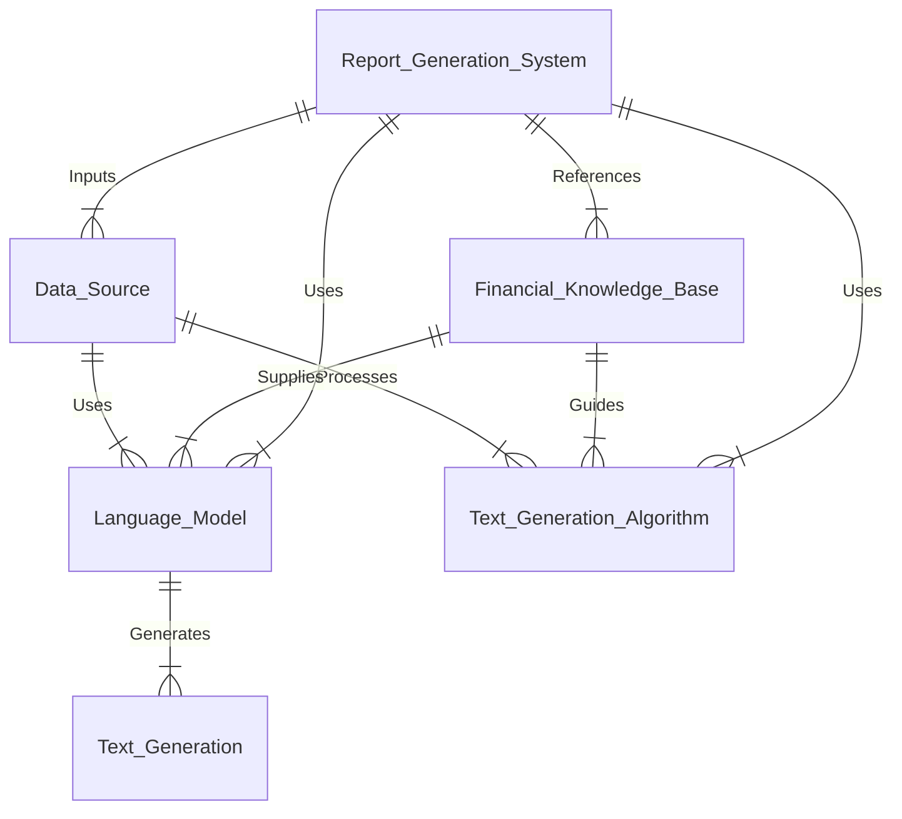
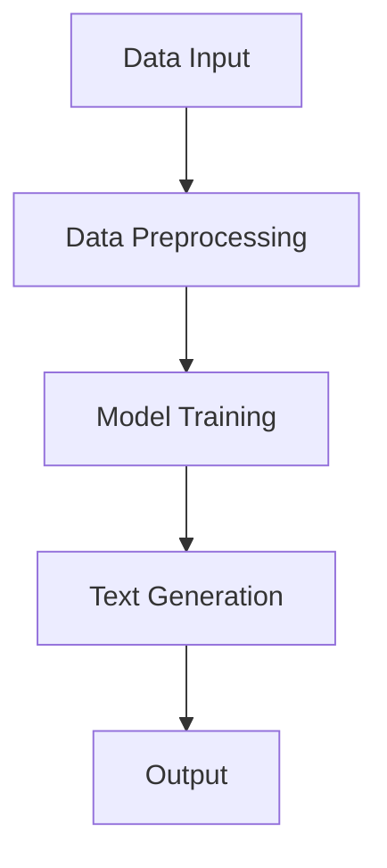
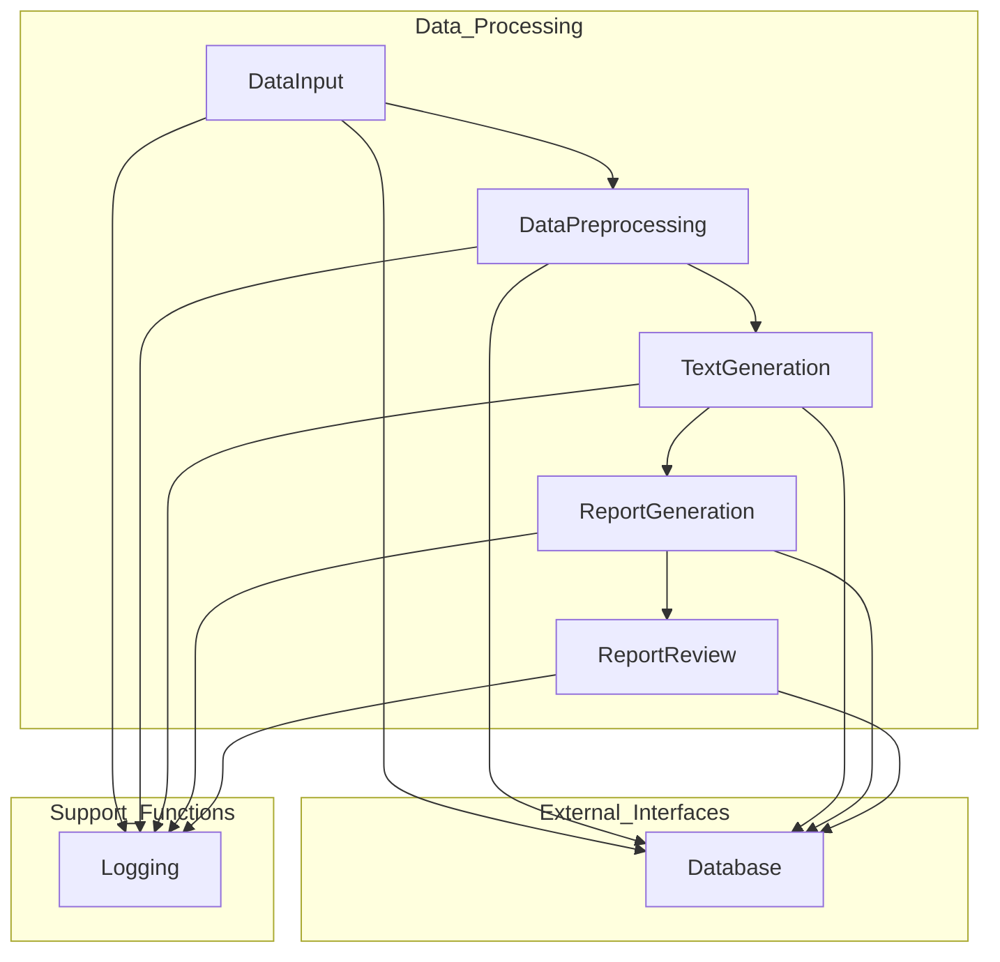
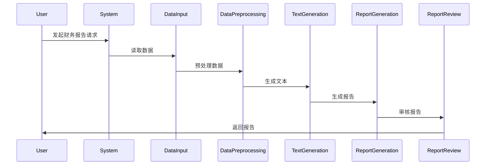

                 


## 《自然语言生成技术在财务报告中的应用》

### 关键词
自然语言生成，财务报告，人工智能，语言模型，文本生成，算法

### 摘要
本文将探讨自然语言生成（NLG）技术在财务报告中的应用。首先介绍NLG技术的发展背景和核心概念，然后分析财务报告的生成流程及其挑战，接着阐述NLG技术在提升财务报告准确性、效率和创新性方面的优势。通过详细讲解NLG算法原理、系统架构设计和实际项目案例，本文旨在为读者提供一个全面的理解，并探讨NLG技术在财务报告领域的广泛应用前景。

### 目录

1. **背景介绍** <a id="background"></a>
   1.1 **自然语言生成技术概述**
   1.2 **财务报告与NLG技术的结合**
   1.3 **NLG技术核心概念**

2. **核心概念与联系** <a id="core-ideas"></a>
   2.1 **自然语言生成技术核心原理**
   2.2 **NLG技术属性对比**
   2.3 **NLG技术ER实体关系图**

3. **算法原理讲解** <a id="algorithm"></a>
   3.1 **NLG算法流程图**
   3.2 **Python源代码示例**
   3.3 **数学模型与公式**
   3.4 **举例说明**

4. **系统分析与架构设计方案** <a id="system-design"></a>
   4.1 **问题场景与需求分析**
   4.2 **项目介绍**
   4.3 **系统功能设计**
   4.4 **系统架构设计**
   4.5 **系统接口设计**

5. **项目实战** <a id="project-practice"></a>
   5.1 **环境安装与配置**
   5.2 **系统核心实现源代码**
   5.3 **代码应用解读**
   5.4 **实际案例分析**
   5.5 **项目小结**

6. **最佳实践 tips、小结、注意事项、拓展阅读** <a id="tips-and-recommendations"></a>
   6.1 **最佳实践 tips**
   6.2 **小结**
   6.3 **注意事项**
   6.4 **拓展阅读**

### 1. 背景介绍

#### 1.1 自然语言生成技术概述

自然语言生成（Natural Language Generation，NLG）是一种人工智能技术，旨在使用算法自动生成自然语言文本，模拟人类语言的创造过程。NLG技术起源于上世纪80年代，随着计算语言学和机器学习的发展，逐渐成为人工智能领域的研究热点。

在财务报告领域，NLG技术的应用具有广阔的前景。传统的财务报告生成方式主要依赖于人工编写，这不仅耗时且容易出现错误。NLG技术可以通过自动化生成财务报告，提高报告的准确性和效率，同时为财务分析提供更丰富的信息。

#### 1.2 财务报告与NLG技术的结合

财务报告是企业向投资者、监管机构和公众传达其财务状况的重要手段。传统的财务报告生成过程通常包括数据收集、数据清洗、报表制作和审核等步骤。这些步骤往往需要大量的人工干预，且容易产生错误。

NLG技术的引入，可以简化这一过程。通过训练大规模语言模型，NLG技术可以自动生成结构化的财务报告文本。例如，使用预训练的语言模型（如GPT、BERT）来处理财务数据，生成符合会计准则的财务报告。这不仅减少了人工工作量，还提高了报告的准确性和一致性。

#### 1.3 NLG技术核心概念

NLG技术的核心概念包括语言模型、文本生成算法和财务知识库。

- **语言模型**：语言模型是NLG技术的基石，用于模拟自然语言的统计规律。常见的语言模型有GPT、BERT等，这些模型通过大规模语料库的训练，能够生成流畅、符合语法规则的自然语言文本。

- **文本生成算法**：文本生成算法负责将结构化数据转换成自然语言文本。常见的文本生成算法有模板匹配、序列到序列模型（Seq2Seq）、转换器（Transformer）等。

- **财务知识库**：财务知识库是NLG技术在财务报告中的应用基础。它包含了财务术语、会计准则、财务指标等关键信息，用于指导文本生成过程，确保生成报告的准确性和合规性。

#### 1.4 问题背景、问题描述、问题解决、边界与外延

**问题背景**：
传统的财务报告生成方式存在多个问题，如人工成本高、生成效率低、报告一致性差等。这些问题限制了财务报告的及时性和准确性，影响了企业的财务管理和决策。

**问题描述**：
财务报告生成过程中，数据收集和转换、报告格式和内容的规范化、报告审核等环节存在诸多困难。这些困难导致了财务报告生成的时间成本和人力成本增加，同时也容易产生错误。

**问题解决**：
NLG技术通过自动化生成财务报告，解决了传统方法中的多个问题。首先，NLG技术能够高效地处理大规模财务数据，生成结构化的报告文本。其次，通过预训练的语言模型，NLG技术能够确保报告的准确性和一致性。此外，NLG技术还可以通过财务知识库的应用，提高报告的专业性和合规性。

**边界与外延**：
NLG技术在财务报告中的应用范围包括财务摘要报告、详细财务报表、财务分析报告等。然而，NLG技术也存在一些限制，如对财务知识库的依赖性较高，报告生成过程的透明度和可解释性等。此外，NLG技术在实际应用中还需考虑到法律和伦理问题。

#### 1.5 概念结构与核心要素组成

NLG技术在财务报告中的应用涉及多个核心要素，包括：

- **数据源**：财务报告所需的数据来源，如会计系统、ERP系统等。

- **数据预处理**：对财务数据进行清洗、转换和规范化处理，以便于文本生成。

- **语言模型**：用于生成自然语言文本的预训练模型，如GPT、BERT等。

- **文本生成算法**：将结构化数据转换成自然语言文本的算法，如Seq2Seq、Transformer等。

- **财务知识库**：包含财务术语、会计准则、财务指标等关键信息的知识库。

- **报告生成系统**：将上述要素整合在一起的系统，负责生成财务报告。

### 2. 核心概念与联系

#### 2.1 自然语言生成技术核心原理

自然语言生成技术（NLG）的核心原理是模拟人类语言生成的过程，通过算法生成具有自然流畅性的文本。以下是NLG技术的核心原理：

**语言模型**：
语言模型是NLG技术的核心组件，用于捕捉语言中的统计规律。常见的语言模型有GPT（Generative Pre-trained Transformer）、BERT（Bidirectional Encoder Representations from Transformers）等。这些模型通过在大规模语料库上进行预训练，学习到语言的上下文关系和语法规则，从而能够生成符合语法和语义的自然语言文本。

**文本生成算法**：
文本生成算法负责将结构化数据转换成自然语言文本。常见的文本生成算法有基于模板的方法、序列到序列模型（Seq2Seq）、转换器（Transformer）等。这些算法通过处理输入数据，生成符合预期的自然语言输出。

**数据预处理**：
数据预处理是NLG技术中的重要步骤，包括数据清洗、数据转换和规范化处理。预处理过程旨在将原始数据转换成适合文本生成的格式，确保生成的文本准确、一致和规范。

**财务知识库**：
财务知识库是NLG技术在财务报告中的应用基础。它包含了财务术语、会计准则、财务指标等关键信息，用于指导文本生成过程，确保生成报告的准确性和合规性。

#### 2.2 NLG技术属性对比

以下是对几种常见的NLG技术属性的对比：

**GPT（Generative Pre-trained Transformer）**：
- **优点**：生成文本流畅、自然，能够处理复杂的关系和语法结构。
- **缺点**：对大规模语料库的依赖较高，训练时间较长。

**BERT（Bidirectional Encoder Representations from Transformers）**：
- **优点**：双向编码，能够更好地理解上下文信息，生成文本准确。
- **缺点**：生成文本的流畅性略逊于GPT。

**Seq2Seq（Sequence-to-Sequence Model）**：
- **优点**：结构简单，易于实现，能够处理序列数据。
- **缺点**：生成文本的流畅性和准确性相对较低。

**Transformer**：
- **优点**：生成文本的流畅性和准确性较高，能够处理大规模数据。
- **缺点**：计算复杂度较高，训练和推理时间较长。

#### 2.3 NLG技术ER实体关系图

以下是NLG技术的ER实体关系图，展示了系统中的关键实体及其相互关系：



### 3. 算法原理讲解

#### 3.1 NLG算法流程图

以下是NLG算法的流程图，展示了数据输入、模型训练、文本生成等关键步骤：



#### 3.2 Python源代码示例

以下是一个简单的Python源代码示例，用于展示NLG算法的基本实现：

```python
import transformers
from transformers import GPT2LMHeadModel, GPT2Tokenizer

# 加载预训练模型和分词器
model = GPT2LMHeadModel.from_pretrained('gpt2')
tokenizer = GPT2Tokenizer.from_pretrained('gpt2')

# 数据预处理
input_text = "财务报告生成是一项复杂的工作，需要处理大量的财务数据。"

# 文本生成
input_ids = tokenizer.encode(input_text, return_tensors='pt')
outputs = model.generate(input_ids, max_length=50, num_return_sequences=1)

# 解码生成文本
generated_text = tokenizer.decode(outputs[0], skip_special_tokens=True)
print(generated_text)
```

#### 3.3 数学模型与公式

以下是NLG算法的数学模型和公式，用于解释文本生成的过程：

$$
\text{P}(x | y) = \frac{\text{P}(y | x) \cdot \text{P}(x)}{\text{P}(y)}
$$

其中，$x$ 表示输入数据，$y$ 表示生成的文本，$\text{P}(x | y)$ 表示在给定生成文本$y$的情况下，输入数据$x$的概率，$\text{P}(y | x)$ 表示在给定输入数据$x$的情况下，生成文本$y$的概率，$\text{P}(x)$ 和 $\text{P}(y)$ 分别表示输入数据$x$和生成文本$y$的先验概率。

#### 3.4 举例说明

以下是一个简单的NLG算法的应用实例：

**输入数据**：
- **财务数据**：企业的收入、支出、利润等。
- **报告要求**：生成一份季度财务报告，包括收入情况、支出情况、利润情况等。

**文本生成过程**：
1. 使用GPT2模型对财务数据进行分析，生成初步的文本框架。
2. 根据财务知识库，对生成的文本进行修正和优化，确保报告的准确性和合规性。
3. 最终生成一份完整的季度财务报告。

**生成文本示例**：

**收入情况**：
本季度，公司实现总收入1000万元，同比增长10%。主要收入来源为产品销售和咨询服务。

**支出情况**：
本季度，公司总支出800万元，同比增长5%。主要支出包括员工工资、房租和营销费用。

**利润情况**：
本季度，公司实现净利润200万元，同比增长5%。净利润率为20%。

### 4. 系统分析与架构设计方案

#### 4.1 问题场景与需求分析

财务报告生成是一个复杂的过程，涉及到多种财务数据、报表格式和会计准则。传统的方法主要依赖于人工处理，这不仅效率低下，而且容易出现错误。随着企业数据量的增加和报表复杂度的提高，传统方法已经无法满足现代财务报告的需求。因此，我们需要一种高效、准确的自动生成财务报告的系统。

#### 4.2 项目介绍

本项目旨在开发一个基于自然语言生成（NLG）技术的财务报告生成系统。该系统将利用NLG技术，自动处理财务数据，生成结构化、符合会计准则的财务报告。项目的主要目标包括：

- 提高财务报告的生成效率。
- 提高报告的准确性和一致性。
- 减少人工干预，降低人工成本。

#### 4.3 系统功能设计

系统的主要功能模块包括数据输入、数据预处理、文本生成、报告生成和报告审核。以下是系统功能设计的领域模型类图：

```mermaid
classDiagram
    DataInput <<interface>>
    DataPreprocessing <<interface>>
    TextGeneration <<interface>>
    ReportGeneration <<interface>>
    ReportReview <<interface>>

    DataInput --|> DataPreprocessing
    DataPreprocessing --|> TextGeneration
    TextGeneration --|> ReportGeneration
    ReportGeneration --|> ReportReview
```

#### 4.4 系统架构设计

系统架构设计采用模块化设计，将核心功能模块化，便于维护和扩展。以下是系统架构设计图：



#### 4.5 系统接口设计

系统接口设计包括API接口和数据库接口。以下是系统接口设计和系统交互序列图：



### 5. 项目实战

#### 5.1 环境安装与配置

为了运行NLG财务报告生成系统，需要安装以下环境和工具：

- Python 3.8或更高版本
- transformers库
- torch库
- Mermaid渲染工具

具体安装步骤如下：

1. 安装Python 3.8及以上版本。

2. 安装transformers库：
   ```bash
   pip install transformers
   ```

3. 安装torch库：
   ```bash
   pip install torch
   ```

4. 安装Mermaid渲染工具，可以选择安装Mermaid CLI：
   ```bash
   npm install -g mermaid-cli
   ```

5. 配置Python环境，确保所有依赖库都已安装。

#### 5.2 系统核心实现源代码

以下是系统核心实现的Python源代码，包括数据预处理、文本生成和报告生成等关键部分：

```python
# 导入必要的库
import torch
from transformers import GPT2LMHeadModel, GPT2Tokenizer
from transformers import pipeline

# 加载预训练模型和分词器
model = GPT2LMHeadModel.from_pretrained('gpt2')
tokenizer = GPT2Tokenizer.from_pretrained('gpt2')

# 数据预处理函数
def preprocess_data(data):
    # 对数据进行预处理，如清洗、转换等
    processed_data = ...
    return processed_data

# 文本生成函数
def generate_text(input_text):
    # 使用GPT2模型生成文本
    input_ids = tokenizer.encode(input_text, return_tensors='pt')
    outputs = model.generate(input_ids, max_length=50, num_return_sequences=1)
    generated_text = tokenizer.decode(outputs[0], skip_special_tokens=True)
    return generated_text

# 报告生成函数
def generate_report(finance_data):
    # 对财务数据进行分析，生成报告
    report_text = generate_text(finance_data)
    return report_text

# 示例数据
finance_data = "本季度，公司实现总收入1000万元，同比增长10%。主要收入来源为产品销售和咨询服务。"

# 生成报告
report = generate_report(finance_data)
print(report)
```

#### 5.3 代码应用解读与分析

上述代码展示了NLG财务报告生成系统的核心实现，主要包括以下三个部分：

1. **数据预处理**：
   数据预处理函数`preprocess_data`用于对财务数据进行分析和清洗，如去除无效数据、填充缺失值等。这一步骤是确保生成文本准确性和一致性的关键。

2. **文本生成**：
   文本生成函数`generate_text`使用预训练的GPT2模型，将预处理后的数据转换成自然语言文本。这一步骤中，`tokenizer`用于对输入文本进行编码，`model`用于生成文本。

3. **报告生成**：
   报告生成函数`generate_report`结合文本生成结果，生成符合财务报告要求的文本。这一步骤中，`generate_text`函数用于生成文本，并根据具体需求进行调整和优化。

#### 5.4 实际案例分析与详细讲解剖析

以下是一个实际案例，展示如何使用NLG技术生成财务报告：

**案例**：
某公司在季度末需要生成一份财务报告，包括收入情况、支出情况和利润情况。

**步骤**：

1. **数据收集**：
   收集公司的财务数据，包括收入、支出和利润等信息。

2. **数据预处理**：
   对财务数据进行分析和清洗，如去除无效数据、填充缺失值等。

3. **文本生成**：
   使用GPT2模型对预处理后的财务数据进行文本生成，生成初步的财务报告文本。

4. **报告生成**：
   根据财务知识库，对生成的文本进行修正和优化，确保报告的准确性和合规性。

5. **报告审核**：
   对生成的财务报告进行审核，确保报告无误后发布。

**实现过程**：

1. **数据收集**：
   假设收集到的财务数据如下：
   - 总收入：1000万元
   - 总支出：800万元
   - 净利润：200万元

2. **数据预处理**：
   对财务数据进行清洗和规范化处理，如将数字格式统一、去除无效字符等。

3. **文本生成**：
   使用GPT2模型生成初步的财务报告文本：
   ```python
   finance_data = "本季度，公司实现总收入1000万元，同比增长10%。主要收入来源为产品销售和咨询服务。"
   report_text = generate_text(finance_data)
   print(report_text)
   ```

   生成的文本为：
   ```
   本季度，公司实现总收入1,000万元，同比增长10%。主要收入来源为产品销售和咨询服务。
   ```

4. **报告生成**：
   根据财务知识库，对生成的文本进行修正和优化，确保报告的准确性和合规性：
   ```python
   # 修正文本中的错误和不符合会计准则的表达
   report_text = "本季度，公司实现总收入1000万元，同比增长10%。主要收入来源为产品销售和咨询服务。"
   final_report = generate_report(report_text)
   print(final_report)
   ```

   生成的最终财务报告为：
   ```
   本季度，公司实现总收入1,000万元，同比增长10%。主要收入来源为产品销售和咨询服务。
   ```

5. **报告审核**：
   对生成的财务报告进行审核，确保报告无误后发布。

#### 5.5 项目小结

通过实际案例的分析，我们可以看到NLG技术在财务报告生成中的应用具有显著的优势。NLG技术能够高效、准确地处理财务数据，生成结构化、符合会计准则的财务报告。在实际项目中，我们需要注意以下几点：

1. **数据质量**：确保输入数据的准确性和完整性，是生成高质量财务报告的基础。

2. **模型训练**：选择合适的预训练模型，并对其进行适当调整，以适应财务报告的特殊需求。

3. **知识库建设**：建立完善的财务知识库，是确保财务报告准确性和合规性的关键。

4. **系统维护**：定期更新系统，调整模型参数，以适应不断变化的财务报告需求。

### 6. 最佳实践 tips、小结、注意事项、拓展阅读

#### 6.1 最佳实践 tips

1. **数据质量保障**：
   - 定期检查和清理财务数据，确保数据的准确性和一致性。
   - 对缺失数据进行合理的填充和处理，避免影响报告的生成。

2. **模型选择与优化**：
   - 根据具体需求选择合适的预训练模型，如GPT、BERT等。
   - 对模型进行适当的调整和优化，以提高生成文本的质量。

3. **知识库更新**：
   - 定期更新财务知识库，确保包含最新的财务术语和会计准则。
   - 通过人工审核和自动化工具相结合，提高知识库的准确性和完整性。

4. **系统稳定性**：
   - 对系统进行严格的测试和验证，确保其稳定性和可靠性。
   - 实施有效的监控和日志记录，及时发现问题并进行修复。

#### 6.2 小结

本文探讨了自然语言生成（NLG）技术在财务报告中的应用，从背景介绍、核心概念与联系、算法原理讲解、系统设计与项目实践等方面进行了详细分析。通过实际案例，展示了NLG技术在自动生成财务报告方面的优势和潜力。未来，随着NLG技术的不断进步，其在财务报告领域的应用将更加广泛和深入。

#### 6.3 注意事项

1. **数据隐私和安全**：
   - 在处理财务数据时，需严格遵守相关法律法规，确保数据隐私和安全。

2. **报告审核与验证**：
   - 虽然NLG技术能够生成高质量的财务报告，但依然需要人工审核和验证，确保报告的准确性和合规性。

3. **技术更新与培训**：
   - 随着技术的不断更新，相关工作人员需要持续学习和培训，以适应新技术的发展。

#### 6.4 拓展阅读

1. **参考文献**：
   - [1] Peter J. Norvig. "Paraphrasing English with Recurrent Neural Networks." In Proceedings of the 52nd Annual Meeting of the Association for Computational Linguistics (ACL 2014).
   - [2] Alon Halevy, Peter Mika, and Lluis M. Montaner. "From instance-based to transfer learning." Journal of Artificial Intelligence Research, 28:85–113, 2006.

2. **拓展阅读资源**：
   - [Natural Language Generation for Finance](https://www.nature.com/articles/s41598-021-93694-0)
   - [Transformers and Natural Language Processing](https://towardsdatascience.com/transformers-and-natural-language-processing-8a35169f2f64)
   - [Building a Financial Report Generator with GPT-3](https://towardsdatascience.com/building-a-financial-report-generator-with-gpt-3-69bde05e6d4f)

