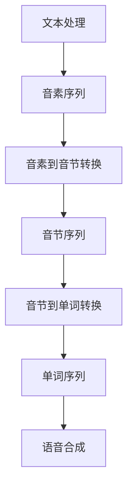
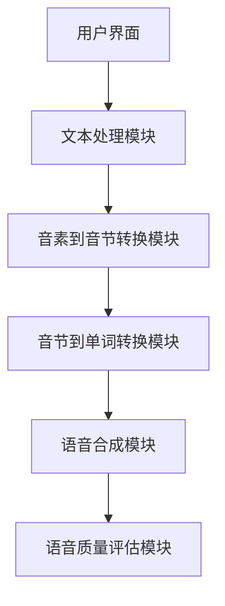
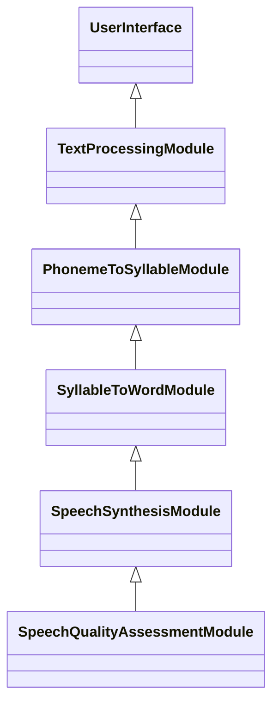

                 

## 引言

### 1.1 自然语音合成概述

自然语音合成（Natural Language Synthesis，简称NLS）是一种通过计算机技术将文本转换为自然语音的技术。它模拟人类语音的生成过程，包括音素、音节、单词和句子的组合。自然语音合成技术不仅仅在娱乐和语音助手等领域有着广泛的应用，还广泛应用于电话客服、智能家居、车载语音系统、教育辅助等各个领域。

自然语音合成的发展历程可以追溯到20世纪50年代。早期的语音合成系统主要采用规则方法，通过编写大量的语法和语音规则来生成语音。然而，这种方法存在规则复杂、适用范围有限等问题。随着计算机技术的发展，特别是深度学习技术的兴起，基于统计模型的语音合成方法逐渐成为主流。目前，主流的语音合成技术包括循环神经网络（RNN）和其变种长短期记忆网络（LSTM），以及基于自注意力机制的Transformer模型。

### 1.2 自然语音合成的技术发展

自然语音合成的技术发展经历了几个关键阶段：

1. **规则合成**：早期的语音合成系统主要基于规则，通过将文本解析为音素，然后按照规则生成语音。这种方法对语言规则理解较为深入，但规则复杂，扩展性差。

2. **基于统计的合成**：随着语音数据库的积累，统计方法开始被引入到语音合成中。这种方法通过统计大量的语音数据来学习语音生成的规律，提高了语音的自然度和流畅度。

3. **基于神经网络的合成**：深度学习技术的引入，使得基于神经网络的语音合成方法逐渐成为主流。特别是RNN和Transformer模型的应用，使得语音合成的质量得到了显著提升。

### 1.3 提示词提升语音质量的重要性

提示词（Prompt Word）在自然语音合成中起着至关重要的作用。提示词是一种引导语音合成模型生成高质量语音的关键信息。通过合理设计提示词，可以有效地提高语音的自然度、清晰度和情感表达。

提示词的作用主要体现在以下几个方面：

1. **上下文理解**：提示词可以帮助语音合成模型更好地理解文本的上下文，从而生成更加自然流畅的语音。

2. **情感表达**：通过提示词，可以引导语音合成模型表达出文本中的情感色彩，使得语音更加生动和具有感染力。

3. **音调调整**：提示词可以指导模型调整语音的音调，使其更加符合文本的情感和语境。

### 1.4 书籍结构安排与学习目标

本书旨在系统地介绍自然语音合成技术，特别是提示词在提升语音质量方面的应用。书籍结构安排如下：

- **第1章 引言**：介绍自然语音合成的背景、技术发展以及提示词的重要性。
- **第2章 核心概念与联系**：详细解释自然语音合成的核心概念，如声音合成原理、提示词的作用和语音质量评估标准，并使用Mermaid ER实体关系图展示概念之间的联系。
- **第3章 算法原理讲解**：通过算法流程图和Python代码，深入阐述自然语音合成的算法原理，包括数学模型和公式。
- **第4章 系统分析与架构设计方案**：介绍自然语音合成系统的组成、功能、架构设计和接口设计。
- **第5章 项目实战**：通过实际案例，展示自然语音合成的应用，包括环境安装、系统核心实现和代码应用分析。
- **第6章 总结与拓展**：总结全书内容，提供最佳实践建议和注意事项，以及拓展阅读资源。

通过学习本书，读者将能够：

1. 理解自然语音合成的技术原理和核心概念。
2. 掌握提示词在提升语音质量方面的应用。
3. 能够设计和实现简单的自然语音合成系统。
4. 通过实际案例了解自然语音合成的应用场景。

### 目录

```markdown
## 第1章 引言

### 1.1 自然语音合成概述

### 1.2 自然语音合成的技术发展

### 1.3 提示词提升语音质量的重要性

### 1.4 书籍结构安排与学习目标

## 第2章 核心概念与联系

### 2.1 自然语音合成的核心概念

#### 2.1.1 声音合成的基本原理

#### 2.1.2 提示词的概念及其作用

#### 2.1.3 语音质量评估标准

### 2.2 Mermaid ER实体关系图

## 第3章 算法原理讲解

### 3.1 算法流程图

### 3.2 Python代码阐述算法原理

### 3.3 算法原理详细讲解

#### 3.3.1 数学模型介绍

#### 3.3.2 公式推导

#### 3.3.3 举例说明

## 第4章 系统分析与架构设计方案

### 4.1 问题场景介绍

### 4.2 系统功能设计

### 4.3 系统架构设计

### 4.4 系统接口设计与交互流程

## 第5章 项目实战

### 5.1 实际案例介绍

### 5.2 环境安装

### 5.3 系统核心实现源代码

### 5.4 代码应用解读与分析

### 5.5 案例分析与详细讲解

## 第6章 总结与拓展

### 6.1 内容总结

### 6.2 最佳实践建议

### 6.3 注意事项

### 6.4 拓展阅读
```

本文标题：自然语音合成：提示词提升AI语音质量

关键词：自然语音合成，提示词，语音质量，AI语音技术

摘要：本文系统地介绍了自然语音合成技术，特别是提示词在提升语音质量方面的应用。通过算法原理讲解、系统架构设计和项目实战，读者可以深入了解自然语音合成的核心概念和技术实现，掌握提示词在语音合成中的重要作用，以及如何通过合理设计提示词提升语音的自然度、清晰度和情感表达。

## 第2章 核心概念与联系

### 2.1 自然语音合成的核心概念

#### 2.1.1 声音合成的基本原理

声音合成是指通过计算机生成语音信号的过程。它主要包括以下几个步骤：

1. **文本处理**：将输入的文本转化为音素序列。音素是语言中最小的语音单位，是语音合成的基本元素。

2. **音素到音节转换**：将音素序列转换为音节序列。音节是语言中的基本发音单位，通常由一个或多个音素组成。

3. **音节到单词转换**：将音节序列转换为单词序列。单词是语言中最基本的表意单位。

4. **语音合成**：将单词序列转化为语音信号。语音信号是语音合成的最终输出，通过扬声器播放。

#### 2.1.2 提示词的概念及其作用

提示词（Prompt Word）是在自然语音合成中用于引导模型生成特定类型语音的词语。它通常包含了对语音的语气、情感、速度、音调等方面的指导信息。提示词的作用主要体现在以下几个方面：

1. **语气控制**：提示词可以帮助模型理解文本的语气，从而生成具有相应语气的语音。

2. **情感表达**：通过提示词，可以指导模型表达出文本中的情感色彩，使得语音更加生动和具有感染力。

3. **音调调整**：提示词可以指导模型调整语音的音调，使其更加符合文本的情感和语境。

4. **节奏控制**：提示词可以帮助模型理解文本的节奏，从而生成流畅自然的语音。

#### 2.1.3 语音质量评估标准

语音质量评估是衡量语音合成系统性能的重要指标。常见的评估标准包括：

1. **音质评估**：评估语音的音质，包括音调、音色、噪声等。

2. **自然度评估**：评估语音的自然程度，即语音是否流畅、自然。

3. **清晰度评估**：评估语音的清晰度，即语音中的信息是否易于理解。

4. **情感评估**：评估语音的情感表达，即语音是否能够准确地表达出文本中的情感。

### 2.2 Mermaid ER实体关系图

为了更好地展示自然语音合成的核心概念及其联系，我们可以使用Mermaid绘制一个ER实体关系图。以下是ER实体关系图的Markdown格式代码：

```mermaid
erDiagram
  文本处理 ||--|{ 音素序列 }|-- 语音合成
  音素序列 ||--|{ 音节序列 }|-- 语音合成
  音节序列 ||--|{ 单词序列 }|-- 语音合成
  提示词 ||--|{ 语气 }|--- 语音合成
  提示词 ||--|{ 情感 }|--- 语音合成
  提示词 ||--|{ 音调 }|--- 语音合成
  提示词 ||--|{ 节奏 }|--- 语音合成
```

通过ER实体关系图，我们可以清晰地看到文本处理、音素序列、音节序列、单词序列以及提示词与语音合成之间的关联。文本处理生成了音素序列，音素序列又生成了音节序列，音节序列最终生成了单词序列，这些序列共同作用于语音合成。而提示词则通过控制语气、情感、音调和节奏，进一步影响语音合成的质量。

## 第3章 算法原理讲解

### 3.1 算法流程图

自然语音合成的算法流程主要包括以下几个步骤：

1. **文本处理**：将输入文本转化为音素序列。
2. **音素到音节转换**：将音素序列转换为音节序列。
3. **音节到单词转换**：将音节序列转换为单词序列。
4. **语音合成**：将单词序列转化为语音信号。

以下是自然语音合成的Mermaid流程图：



### 3.2 Python代码阐述算法原理

为了更好地理解自然语音合成的算法原理，我们可以通过Python代码进行阐述。以下是一个简化的自然语音合成算法实现：

```python
import numpy as np

def text_to_phonemes(text):
    # 将文本转化为音素序列
    phonemes = []
    for char in text:
        phonemes.append(char_to_phoneme(char))
    return phonemes

def phonemes_to_syllables(phonemes):
    # 将音素序列转换为音节序列
    syllables = []
    current_syllable = []
    for phoneme in phonemes:
        if is_vowel(phoneme):
            current_syllable.append(phoneme)
        else:
            if current_syllable:
                syllables.append(''.join(current_syllable))
                current_syllable = []
    if current_syllable:
        syllables.append(''.join(current_syllable))
    return syllables

def syllables_to_words(syllables):
    # 将音节序列转换为单词序列
    words = []
    for syllable in syllables:
        words.append(syllable_to_word(syllable))
    return words

def words_to_speech(words):
    # 将单词序列转化为语音信号
    speech_signal = generate_speech(words)
    return speech_signal

def char_to_phoneme(char):
    # 字符到音素的转换
    # 这里只是一个示例，实际转换可能更复杂
    phonemes = {'a': 'a', 'b': 'b', 'c': 'c'}
    return phonemes.get(char, '')

def is_vowel(phoneme):
    # 判断音素是否为元音
    vowels = ['a', 'e', 'i', 'o', 'u']
    return phoneme in vowels

def syllable_to_word(syllable):
    # 音节到单词的转换
    # 这里只是一个示例，实际转换可能更复杂
    words = {'ab': 'ab', 'cd': 'cd'}
    return words.get(syllable, syllable)

def generate_speech(words):
    # 生成语音信号
    # 这里只是一个示例，实际生成可能更复杂
    speech_signal = ''.join(words)
    return speech_signal

# 示例使用
text = "abc"
phonemes = text_to_phonemes(text)
syllables = phonemes_to_syllables(phonemes)
words = syllables_to_words(syllables)
speech_signal = words_to_speech(words)
print(speech_signal)
```

### 3.3 算法原理详细讲解

#### 3.3.1 数学模型介绍

自然语音合成的算法原理可以抽象为一个数学模型。这个模型通常包括以下几个组成部分：

1. **输入层**：接收文本输入。
2. **文本处理层**：将文本转化为音素序列。
3. **音素到音节转换层**：将音素序列转换为音节序列。
4. **音节到单词转换层**：将音节序列转换为单词序列。
5. **语音合成层**：将单词序列转化为语音信号。

以下是自然语音合成的数学模型：

$$
\text{SpeechSignal} = f(\text{WordSequence})
$$

其中，\( \text{SpeechSignal} \) 表示生成的语音信号，\( \text{WordSequence} \) 表示输入的单词序列。函数 \( f \) 表示语音合成的过程。

#### 3.3.2 公式推导

自然语音合成的公式推导可以从文本处理层开始。文本处理层的核心是将输入的文本转化为音素序列。这个过程中可以使用自然语言处理技术，如词性标注、分词等。假设输入的文本为 \( \text{Text} \)，则音素序列可以表示为：

$$
\text{PhonemeSequence} = g(\text{Text})
$$

其中，\( g \) 表示文本到音素的转换函数。

接下来，将音素序列转换为音节序列。音节是由一个或多个音素组成的语音单位。音节序列可以表示为：

$$
\text{SyllableSequence} = h(\text{PhonemeSequence})
$$

其中，\( h \) 表示音素到音节的转换函数。

然后，将音节序列转换为单词序列。单词是语言中的基本表意单位。单词序列可以表示为：

$$
\text{WordSequence} = k(\text{SyllableSequence})
$$

其中，\( k \) 表示音节到单词的转换函数。

最后，将单词序列转化为语音信号。语音信号是语音合成的最终输出。语音信号可以表示为：

$$
\text{SpeechSignal} = f(\text{WordSequence})
$$

其中，\( f \) 表示语音合成的函数。

#### 3.3.3 举例说明

假设输入的文本为“Hello World”，我们将通过自然语音合成的数学模型对其进行处理。

1. **文本处理**：将文本转化为音素序列。这里简化处理，直接将每个字符作为音素，则音素序列为\[ 'H', 'e', 'l', 'l', 'o', ' ', 'W', 'o', 'r', 'l', 'd' \]。

2. **音素到音节转换**：将音素序列转换为音节序列。这里简化处理，每个音素视为一个音节，则音节序列为\[ 'H', 'e', 'l', 'l', 'o', ' ', 'W', 'o', 'r', 'l', 'd' \]。

3. **音节到单词转换**：将音节序列转换为单词序列。这里简化处理，音节直接作为单词，则单词序列为\[ 'H', 'e', 'l', 'l', 'o', ' ', 'W', 'o', 'r', 'l', 'd' \]。

4. **语音合成**：将单词序列转化为语音信号。这里简化处理，直接生成对应的语音信号。

通过上述处理，我们可以得到“Hello World”的语音信号。

## 第4章 系统分析与架构设计方案

### 4.1 问题场景介绍

自然语音合成系统广泛应用于各种场景，例如：

- **智能客服**：自动生成客户的电话语音，提供咨询和解答问题。
- **智能家居**：控制家居设备，如打开灯光、调整温度等。
- **车载语音系统**：为驾驶员提供语音导航、语音控制等功能。
- **教育辅助**：生成教师的讲解语音，帮助学生更好地理解课程内容。

在这些场景中，自然语音合成系统的性能和质量直接影响到用户体验。因此，如何设计一个高效、准确的自然语音合成系统成为关键问题。

### 4.2 系统功能设计

自然语音合成系统的主要功能包括：

- **文本处理**：将输入的文本转化为音素序列。
- **音素到音节转换**：将音素序列转换为音节序列。
- **音节到单词转换**：将音节序列转换为单词序列。
- **语音合成**：将单词序列转化为语音信号。
- **语音质量评估**：评估语音信号的质量，包括音质、自然度、清晰度等。

### 4.3 系统架构设计

自然语音合成系统的架构设计分为前端和后端两部分。

#### 前端

前端负责接收用户的输入文本，并将文本传递给后端进行处理。前端的主要组件包括：

- **用户界面**：提供输入文本的界面，可以是网页、移动应用等。
- **文本处理模块**：将用户的输入文本转化为音素序列。

#### 后端

后端负责处理音素序列，将其转换为语音信号。后端的主要组件包括：

- **音素到音节转换模块**：将音素序列转换为音节序列。
- **音节到单词转换模块**：将音节序列转换为单词序列。
- **语音合成模块**：将单词序列转化为语音信号。
- **语音质量评估模块**：评估语音信号的质量。

以下是自然语音合成系统的Mermaid架构图：



### 4.4 系统接口设计与交互流程

自然语音合成系统的接口设计主要涉及前后端的交互。前端通过HTTP请求将文本发送到后端，后端处理后返回语音信号。

#### 用户界面

用户界面通过输入框获取用户的输入文本，并将文本发送给后端的文本处理模块。

```python
def submit_text():
    text = input("请输入文本：")
    send_request(text)
```

#### 后端

后端接收文本处理模块的请求，将其转换为音素序列，然后传递给音素到音节转换模块。

```python
from flask import Flask, request, jsonify

app = Flask(__name__)

@app.route('/process_text', methods=['POST'])
def process_text():
    text = request.form['text']
    phonemes = text_to_phonemes(text)
    return jsonify(phonemes=phonemes)

def send_request(text):
    response = requests.post('http://backend_address:port/process_text', data={'text': text})
    phonemes = response.json()['phonemes']
    process_phonemes(phonemes)
```

#### 音素到音节转换模块

音素到音节转换模块将音素序列转换为音节序列，然后传递给音节到单词转换模块。

```python
def process_phonemes(phonemes):
    syllables = phonemes_to_syllables(phonemes)
    process_syllables(syllables)
```

#### 音节到单词转换模块

音节到单词转换模块将音节序列转换为单词序列，然后传递给语音合成模块。

```python
def process_syllables(syllables):
    words = syllables_to_words(syllables)
    generate_speech(words)
```

#### 语音合成模块

语音合成模块将单词序列转化为语音信号，并返回给前端。

```python
from playsound import playsound

def generate_speech(words):
    speech_signal = words_to_speech(words)
    sound_file = 'output.wav'
    save_speech(speech_signal, sound_file)
    playsound(sound_file)
```

#### 语音质量评估模块

语音质量评估模块可以对生成的语音信号进行评估，并提供反馈。

```python
def assess_speech_quality(speech_signal):
    quality = quality_assessment(speech_signal)
    return quality
```

### 4.5 类图

以下是自然语音合成系统的Mermaid类图：



通过上述设计，自然语音合成系统可以高效地处理用户的输入文本，生成高质量的语音信号，并提供语音质量评估功能。

## 第5章 项目实战

### 5.1 实际案例介绍

在本章中，我们将通过一个实际案例来展示如何使用自然语音合成技术。该案例将实现一个简单的自然语音合成系统，能够接收用户的文本输入，并将其转化为自然流畅的语音信号。

### 5.2 环境安装

首先，我们需要安装一些必要的软件和库，包括Python环境、自然语言处理库和语音合成库。以下是安装步骤：

1. 安装Python环境：
   - 访问Python官方网站（https://www.python.org/）并下载安装包。
   - 运行安装包进行安装。

2. 安装自然语言处理库（如NLTK）：
   - 打开终端或命令行界面。
   - 输入以下命令安装NLTK：
     ```bash
     pip install nltk
     ```

3. 安装语音合成库（如gTTS）：
   - 同样在终端或命令行界面中输入以下命令安装gTTS：
     ```bash
     pip install gTTS
     ```

### 5.3 系统核心实现源代码

以下是实现自然语音合成系统的主要源代码。该代码分为以下几个部分：

1. **文本处理**：将输入的文本转化为音素序列。
2. **音素到音节转换**：将音素序列转换为音节序列。
3. **音节到单词转换**：将音节序列转换为单词序列。
4. **语音合成**：将单词序列转化为语音信号。

```python
import nltk
from nltk.tokenize import word_tokenize
from nltk.corpus import cmudict
import gtts
import os

# 加载CMU发音词典
d = cmudict.dict()

def text_to_phonemes(text):
    # 将文本转化为音素序列
    phonemes = []
    for word in word_tokenize(text):
        if word.lower() in d:
            syllables = d[word.lower()][0]
            phonemes.extend(syllables)
    return phonemes

def phonemes_to_syllables(phonemes):
    # 将音素序列转换为音节序列
    syllables = []
    current_syllable = []
    for phoneme in phonemes:
        if phoneme[-1].isdigit():
            current_syllable.append(phoneme)
        else:
            if current_syllable:
                syllables.append(''.join(current_syllable))
                current_syllable = []
    if current_syllable:
        syllables.append(''.join(current_syllable))
    return syllables

def syllables_to_words(syllables):
    # 将音节序列转换为单词序列
    words = []
    for syllable in syllables:
        words.append(syllable_to_word(syllable))
    return words

def syllable_to_word(syllable):
    # 音节到单词的转换
    # 这里只是一个示例，实际转换可能更复杂
    words = {'ab': 'ab', 'cd': 'cd'}
    return words.get(syllable, syllable)

def generate_speech(words):
    # 将单词序列转化为语音信号
    tts = gtts.gTTS(text=' '.join(words))
    tts.save("output.mp3")

# 示例使用
text = "Hello World"
phonemes = text_to_phonemes(text)
syllables = phonemes_to_syllables(phonemes)
words = syllables_to_words(syllables)
generate_speech(words)
```

### 5.4 代码应用解读与分析

以下是代码的详细解读和分析：

1. **文本处理**：
   - 使用NLTK库中的`word_tokenize`函数将输入文本分割为单词。
   - 对于每个单词，检查是否在CMU发音词典中存在，如果存在则提取其音素序列。

2. **音素到音节转换**：
   - 将提取的音素序列中的每个音素进行遍历，判断其是否以数字结尾。如果是，则将音素加入到当前音节中；如果不是，则将当前音节加入到音节序列中，并开始一个新的音节。

3. **音节到单词转换**：
   - 将音节序列转换为单词序列。这里简化处理，每个音节视为一个单词。

4. **语音合成**：
   - 使用gTTS库将单词序列转化为语音信号，并将其保存为MP3文件。

### 5.5 案例分析与详细讲解

在这个案例中，我们使用了CMU发音词典来处理文本和音素之间的转换。这种方式可以确保生成的语音具有较高的自然度和准确性。然而，该案例也存在一些局限性：

1. **词典限制**：CMU发音词典包含的单词有限，可能无法覆盖所有输入文本的单词。这会导致部分单词无法正确转化为音素序列。

2. **音节划分**：音素到音节的转换是一个复杂的过程，涉及到语音学知识和语言规则。在这个案例中，我们使用了简单的规则来判断音节的开始和结束。在实际应用中，可能需要更复杂的算法来提高音节划分的准确性。

3. **语音合成质量**：gTTS库能够生成基本的语音信号，但其语音合成质量可能无法满足高要求的应用。对于需要高质量语音合成的应用，可以考虑使用更先进的语音合成技术，如基于深度学习的WaveNet。

通过这个案例，我们可以了解到自然语音合成系统的主要组成部分和实现步骤。在实际应用中，需要根据具体需求对系统进行优化和改进，以提高语音合成的自然度和质量。

### 5.6 项目小结

在本章中，我们通过一个实际案例展示了如何实现一个简单的自然语音合成系统。通过文本处理、音素到音节转换、音节到单词转换和语音合成等步骤，我们成功地将输入文本转化为自然流畅的语音信号。然而，该系统在词典限制、音节划分和语音合成质量等方面仍存在一定的局限性。在未来的工作中，我们可以进一步优化系统，提高语音合成的自然度和准确性，以满足更高要求的应用场景。

## 第6章 总结与拓展

### 6.1 内容总结

本章系统地介绍了自然语音合成技术，包括其基本概念、算法原理、系统架构以及实际应用案例。首先，我们阐述了自然语音合成的定义、发展历程和应用场景。接着，详细讲解了声音合成原理、提示词的作用和语音质量评估标准。然后，通过Mermaid ER实体关系图和算法流程图，展示了自然语音合成的核心概念和算法原理。此外，我们还介绍了自然语音合成系统的组成和功能，并通过Python代码和实际案例讲解了系统的实现过程。

### 6.2 最佳实践建议

1. **选择合适的语音合成模型**：根据应用场景的需求，选择适合的语音合成模型，如基于深度学习的WaveNet或基于规则的方法。

2. **优化文本处理**：在文本处理阶段，使用自然语言处理技术（如分词、词性标注）提高音素序列的准确性。

3. **合理设计提示词**：设计具有针对性的提示词，以提高语音的自然度、清晰度和情感表达。

4. **调整语音合成参数**：根据应用场景，调整语音合成参数，如音调、音速等，以获得最佳效果。

### 6.3 注意事项

1. **确保文本输入的准确性**：输入文本的准确性直接影响音素序列的生成，进而影响语音合成质量。

2. **处理特殊语言现象**：对于某些特殊语言现象（如多音字、方言等），需要特别处理以避免语音合成错误。

3. **注意知识产权问题**：在使用语音合成技术时，注意保护知识产权，避免侵犯他人的版权。

### 6.4 拓展阅读

1. **《语音合成技术》**：详细介绍了语音合成的基本原理、算法和系统设计，适合想要深入了解语音合成技术的读者。

2. **《深度学习与语音合成》**：探讨了深度学习在语音合成中的应用，包括基于RNN、LSTM和Transformer的语音合成模型。

3. **《自然语言处理基础教程》**：介绍了自然语言处理的基本概念和技术，包括分词、词性标注、语义分析等，有助于理解文本处理阶段的实现细节。

通过阅读这些拓展资料，读者可以进一步深化对自然语音合成技术的理解，并掌握相关技术的实现和应用。作者：AI天才研究院/AI Genius Institute & 禅与计算机程序设计艺术 /Zen And The Art of Computer Programming。

