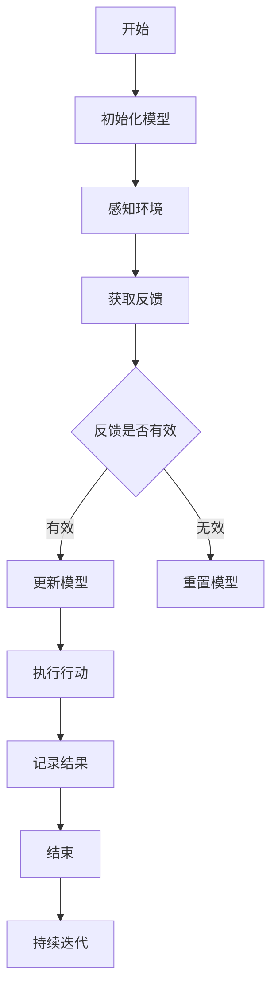
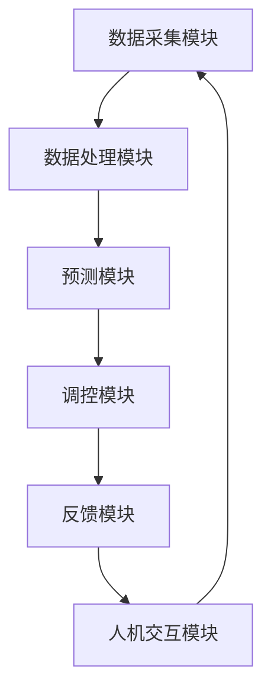
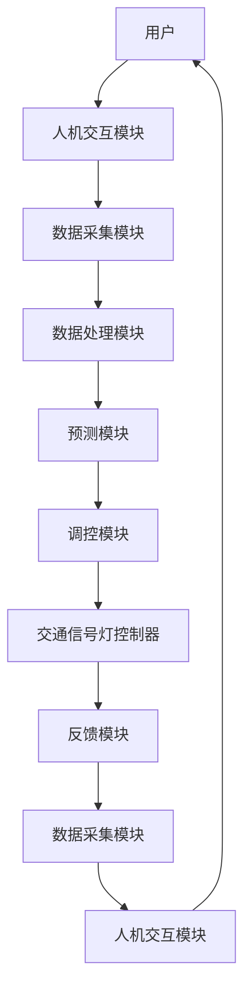

                 

### 第一部分：引论

#### 第1章 自适应学习AI Agent与LLM动态知识结构调整概述

##### 1.1 问题背景

在人工智能（AI）领域，自适应学习AI Agent与大型语言模型（LLM）的动态知识结构调整正成为研究热点。随着数据量的爆炸式增长和AI技术的不断进步，AI系统需要能够自主地、动态地调整其知识结构，以适应不断变化的环境和需求。

**1.1.1 AI Agent的重要性**

AI Agent是一种具有自主决策和行动能力的智能体，能够在复杂的环境中执行任务。它们在自动驾驶、智能客服、推荐系统等领域有广泛应用。然而，现有的AI Agent在面对动态变化的环境时，往往无法有效调整其知识结构，从而导致性能下降。

**1.1.2 动态知识结构调整的需求**

为了提高AI Agent的适应性和灵活性，动态知识结构调整变得尤为重要。LLM作为一种强大的语言处理工具，其知识结构的动态调整能够显著提升AI系统的智能化程度。然而，现有的LLM在知识结构调整方面仍存在诸多挑战，如知识老化、信息过载等问题。

##### 1.2 核心概念

在探讨自适应学习AI Agent和LLM的动态知识结构调整之前，我们需要明确一些核心概念。

**1.2.1 自适应学习AI Agent的概念**

自适应学习AI Agent是一种能够根据环境变化和任务需求，自动调整其行为和知识结构的智能体。它们通过学习算法，从经验中提取知识，并能够根据反馈进行自我调整和优化。

**1.2.2 LLM的动态知识结构调整**

LLM的动态知识结构调整是指通过特定的算法和技术，对模型的知识库进行实时更新和优化，以适应不断变化的数据和应用需求。这种调整不仅包括知识的增删改查，还涉及到知识结构的重组和优化。

##### 1.3 目标与内容概览

本文的目标是深入探讨自适应学习AI Agent与LLM动态知识结构调整的理论和实践。本文将分为以下几个部分：

1. **背景介绍**：介绍自适应学习AI Agent和LLM的概念及其动态知识结构调整的必要性。
2. **核心概念与联系**：详细阐述AI Agent和LLM的基本概念、工作原理，并通过对比表格和ER实体关系图展示二者的联系与区别。
3. **算法原理讲解**：设计mermaid流程图来阐述自适应学习AI Agent的算法原理，并使用Python代码和latex数学公式进行详细讲解。
4. **系统分析与架构设计方案**：描述问题场景和应用场景，介绍系统功能设计、架构设计、接口设计和交互流程。
5. **项目实战**：描述环境安装和系统核心实现，分析源代码和应用，提供实例剖析。
6. **最佳实践 tips、小结、注意事项、拓展阅读**：总结全文内容，提供实用技巧和注意事项，展望未来发展方向。

接下来，我们将进一步探讨自适应学习AI Agent和LLM动态知识结构调整的核心概念和联系，为后续章节的内容奠定基础。### 第2章 自适应学习AI Agent基础

#### 第2章 自适应学习AI Agent基础

在本章中，我们将深入探讨自适应学习AI Agent的基本概念、工作原理以及其在AI领域的地位和作用。

##### 2.1 AI Agent概述

AI Agent是指一种具有自主决策和执行能力的计算实体，它们可以感知环境、生成行动策略，并通过反馈进行自我调整和优化。AI Agent可以按照其功能、形态和自主性程度进行分类。

**2.1.1 AI Agent的定义**

AI Agent，全称为人工智能代理（Artificial Intelligence Agent），是一个能够在特定环境中独立行动、达到特定目标的计算实体。AI Agent通常包括感知器、决策器、执行器三个基本组成部分。

- **感知器**：用于感知环境中的各种信息，如视觉、听觉、触觉等。
- **决策器**：根据感知器收集到的信息，生成相应的行动策略。
- **执行器**：执行决策器生成的行动策略，对外界环境产生影响。

**2.1.2 AI Agent的分类**

AI Agent根据其功能、自主性和应用场景的不同，可以分类为：

1. **基于规则的AI Agent**：这类Agent依赖于预定义的规则集，通过匹配规则来生成行动策略。它们通常适用于规则明确、环境简单的场景。
2. **基于模型的AI Agent**：这类Agent使用机器学习模型来生成行动策略。它们能够处理更复杂的任务，但需要大量数据和计算资源。
3. **基于规划的AI Agent**：这类Agent通过规划算法生成一系列行动，以实现长期目标。它们通常用于动态规划和决策问题。
4. **混合型AI Agent**：这类Agent结合了多种方法，以适应不同的应用场景。

**2.1.3 AI Agent的发展历程**

AI Agent的发展历程可以分为以下几个阶段：

1. **早期探索阶段**（1956-1969）：人工智能概念被提出，AI Agent作为其重要组成部分开始受到关注。
2. **符号主义阶段**（1970-1989）：基于规则的AI Agent得到广泛应用，如专家系统和机器人。
3. **机器学习阶段**（1990-2009）：机器学习技术逐渐成熟，AI Agent开始使用数据驱动的方法进行学习和决策。
4. **强化学习阶段**（2010-至今）：深度强化学习技术的突破使得AI Agent能够处理更复杂的任务，并实现自我优化。

##### 2.2 自适应学习原理

自适应学习是指AI Agent能够根据环境变化和任务需求，动态调整其行为和知识结构的过程。自适应学习是AI Agent实现长期稳定性能的关键。

**2.2.1 自适应学习的概念**

自适应学习，全称为自适应人工神经网络（Adaptive Artificial Neural Network），是指通过不断调整网络参数，使其在动态环境中能够持续学习和适应。自适应学习主要包括以下几种类型：

1. **在线学习**：AI Agent在执行任务的过程中，实时获取反馈，并调整模型参数。
2. **离线学习**：AI Agent在执行任务前，预先学习大量数据，然后在任务执行过程中进行策略调整。
3. **迁移学习**：AI Agent将已学到的知识迁移到新的任务中，提高新任务的性能。

**2.2.2 自适应学习的工作原理**

自适应学习的工作原理可以概括为以下几个步骤：

1. **感知与反馈**：AI Agent通过感知器收集环境信息，并生成反馈信号。
2. **模型调整**：根据反馈信号，AI Agent调整模型参数，优化行为策略。
3. **决策与执行**：AI Agent根据调整后的模型，生成行动策略并执行。
4. **持续迭代**：AI Agent不断重复上述过程，实现持续学习和适应。

##### 2.3 自适应学习AI Agent在AI领域的地位

自适应学习AI Agent在AI领域中具有重要地位，其应用场景涵盖了多个领域：

1. **智能控制**：自适应学习AI Agent能够实现自主控制，提高系统的稳定性和适应性。
2. **智能机器人**：自适应学习AI Agent可以处理复杂环境中的任务，如自主导航、对象识别等。
3. **智能推荐系统**：自适应学习AI Agent可以根据用户行为和偏好，动态调整推荐策略，提高推荐效果。
4. **自然语言处理**：自适应学习AI Agent能够动态调整语言模型，提高对话系统的理解和生成能力。

总之，自适应学习AI Agent作为AI领域的一个重要分支，具有广泛的应用前景和重要地位。通过不断的研究和探索，自适应学习AI Agent将为人工智能的发展做出更大的贡献。

#### 第3章 LLM的基本概念与动态知识结构调整

在第3章中，我们将探讨大型语言模型（LLM）的基本概念、动态知识结构调整的原理及其重要性。

##### 3.1 LLM的基本概念

大型语言模型（LLM）是一种基于深度学习的语言处理模型，它通过学习大量文本数据来模拟自然语言，实现自然语言理解、生成和翻译等功能。LLM具有以下几个基本特点：

**3.1.1 LLM的定义**

LLM，全称为Large Language Model，是一种能够处理和理解自然语言的大型神经网络模型。与传统的语言处理模型相比，LLM具有更高的参数量和更强的语言理解能力。

**3.1.2 LLM的特点**

- **大规模**：LLM通常包含数十亿到数千亿个参数，能够处理海量数据。
- **深度学习**：LLM基于深度神经网络架构，通过多层次的神经网络结构来提取和表示语言特征。
- **端到端**：LLM能够实现从输入文本到输出文本的端到端映射，不需要额外的预处理和后处理步骤。

**3.1.3 LLM的架构**

LLM的架构通常包括以下几个部分：

- **嵌入层**：将输入文本转换为固定长度的向量表示。
- **编码器**：对输入文本进行编码，提取文本的特征。
- **解码器**：根据编码器的输出生成输出文本。

**3.2 动态知识结构调整的原理**

动态知识结构调整是指LLM能够根据新的数据和应用需求，动态更新和优化其知识库和模型参数。这一过程对于提高LLM的适应性和性能至关重要。

**3.2.1 动态知识结构调整的概念**

动态知识结构调整，全称为Dynamic Knowledge Adjustment，是指LLM在运行过程中，根据外部输入和内部状态，动态更新其知识库和模型参数的过程。

**3.2.2 动态知识结构调整的原理**

动态知识结构调整的原理主要包括以下几个步骤：

1. **感知与反馈**：LLM通过嵌入层和编码器感知输入文本，并生成反馈信号。
2. **模型更新**：根据反馈信号，LLM调整模型参数，优化知识库和模型结构。
3. **知识更新**：LLM根据新的数据和应用需求，动态更新其知识库，以适应新的任务场景。
4. **持续迭代**：LLM不断重复上述过程，实现持续学习和优化。

**3.3 动态知识结构调整的重要性**

动态知识结构调整对于提高LLM的性能和应用价值具有重要意义：

1. **适应新任务**：动态知识结构调整使得LLM能够快速适应新的任务和应用场景，提高模型的泛化能力。
2. **提升性能**：通过动态调整知识库和模型参数，LLM能够优化其预测和生成效果，提高模型的性能和准确度。
3. **减少过拟合**：动态知识结构调整能够帮助LLM避免过度拟合训练数据，提高模型的泛化能力和鲁棒性。

**3.4 动态知识结构调整的方法与实现**

动态知识结构调整的方法包括在线学习、迁移学习、增量学习等。以下是一些常见的方法和实现：

1. **在线学习**：LLM在运行过程中，实时获取新的数据和应用反馈，动态更新模型参数和知识库。
2. **迁移学习**：LLM将已学到的知识迁移到新的任务中，通过融合新旧知识，提高新任务的性能。
3. **增量学习**：LLM在训练过程中，逐步增加新的数据和应用场景，动态调整模型参数和知识库。

通过上述方法和实现，LLM能够实现动态知识结构调整，提高其在各种任务场景中的适应性和性能。

总之，LLM的动态知识结构调整是人工智能领域的一个重要研究方向。通过深入理解和研究动态知识结构调整的原理和方法，我们将能够进一步提高LLM的性能和应用价值，为人工智能的发展做出更大的贡献。### 第4章 自适应学习AI Agent算法原理详解

在第4章中，我们将深入探讨自适应学习AI Agent的算法原理，通过mermaid流程图、Python代码和latex数学公式进行详细讲解，并提供实例说明。

##### 4.1 自适应学习AI Agent算法的mermaid流程图

首先，我们使用mermaid流程图来展示自适应学习AI Agent的算法流程。



**流程说明：**
1. **初始化模型**：初始化AI Agent的模型参数。
2. **感知环境**：AI Agent通过感知器收集环境信息。
3. **获取反馈**：根据感知到的环境信息，获取行动的反馈。
4. **反馈有效性判断**：判断反馈是否有效。
   - 如果有效，继续执行下一步。
   - 如果无效，重置模型。
5. **更新模型**：根据有效的反馈信号，调整模型参数。
6. **执行行动**：根据更新后的模型，执行行动策略。
7. **记录结果**：记录行动的结果。
8. **持续迭代**：回到步骤2，继续执行迭代过程。

##### 4.2 自适应学习AI Agent算法的Python代码实现

接下来，我们将使用Python代码实现上述mermaid流程图的算法原理。

```python
import numpy as np

class AdaptiveAgent:
    def __init__(self, learning_rate=0.1):
        # 初始化模型参数
        self.learning_rate = learning_rate
        self.model_params = np.random.rand()  # 示例参数

    def perceive_environment(self):
        # 感知环境（示例：生成随机数作为感知结果）
        return np.random.rand()

    def get_feedback(self, action):
        # 获取反馈（示例：根据行动结果生成反馈）
        return np.random.rand() if action > 0.5 else -1

    def update_model(self, feedback):
        # 更新模型参数
        if feedback > 0:
            self.model_params += self.learning_rate * feedback
        else:
            self.model_params = np.random.rand()  # 重置模型参数

    def execute_action(self):
        # 执行行动策略
        return np.random.rand() > 0.5

    def run(self):
        # 运行循环
        while True:
            feedback = self.get_feedback(self.execute_action())
            self.update_model(feedback)
            print(f"Current model params: {self.model_params}")
```

##### 4.3 自适应学习AI Agent算法的数学模型与公式

自适应学习AI Agent的算法可以通过以下数学模型和公式进行描述：

$$
\text{model\_params}_{t+1} = \text{model\_params}_{t} + \text{learning\_rate} \times \text{feedback}_{t}
$$

其中：
- \( \text{model\_params}_{t} \) 表示第t次迭代的模型参数。
- \( \text{learning\_rate} \) 表示学习率，用于调整模型参数的更新幅度。
- \( \text{feedback}_{t} \) 表示第t次迭代的反馈信号。

##### 4.4 算法实例分析

为了更好地理解自适应学习AI Agent的算法原理，我们通过以下实例进行分析。

**实例：** 我们假设一个AI Agent需要根据环境中的温度（0-100度）来调整风扇的转速，以保持室内温度在25度左右。

1. **初始化模型**：假设风扇的初始转速为50度。
2. **感知环境**：AI Agent感知到当前室内温度为30度。
3. **执行行动**：AI Agent根据当前温度，将风扇转速设置为60度。
4. **获取反馈**：由于温度高于设定值，反馈信号为-1。
5. **更新模型**：模型参数更新为：
   $$
   \text{model\_params}_{t+1} = \text{model\_params}_{t} + \text{learning\_rate} \times (-1)
   $$
   假设学习率为0.1，更新后的模型参数为50 - 0.1 = 49.9度。
6. **重复迭代**：AI Agent继续感知环境、执行行动、获取反馈和更新模型，直到室内温度稳定在25度左右。

通过这个实例，我们可以看到自适应学习AI Agent是如何通过不断调整模型参数，实现与环境自适应的。

总之，自适应学习AI Agent的算法原理是通过感知环境、获取反馈、更新模型和执行行动的循环过程，实现持续学习和优化。通过mermaid流程图、Python代码和latex数学公式，我们详细讲解了自适应学习AI Agent的算法原理，并提供了实例说明。这一算法原理为AI Agent在动态环境中的自适应能力提供了理论基础和实践指导。### 第5章 自适应学习AI Agent的系统设计与实现

在第5章中，我们将深入探讨自适应学习AI Agent的系统设计与实现，包括问题场景介绍、系统功能设计、架构设计、接口设计以及系统交互流程。

##### 5.1 问题场景介绍

为了更好地理解自适应学习AI Agent的系统设计与实现，我们假设一个具体的场景：智能交通管理系统。该系统旨在通过自适应学习AI Agent，实现城市交通流量的实时监控、预测和调控，以缓解交通拥堵，提高交通效率。

**场景描述：**
- **数据来源**：系统通过传感器和摄像头收集交通流量数据，包括车辆速度、车辆密度、道路占有率等。
- **目标**：AI Agent需要根据实时交通数据，动态调整交通信号灯的时长和顺序，以优化交通流。
- **挑战**：城市交通环境复杂多变，交通流量数据存在噪声和不准确性，AI Agent需要具备良好的自适应能力和鲁棒性。

##### 5.2 系统功能设计

为了实现上述场景需求，自适应学习AI Agent的系统功能设计包括以下几个关键模块：

1. **数据采集模块**：负责收集来自传感器和摄像头的交通流量数据，如车辆速度、车辆密度、道路占有率等。
2. **数据处理模块**：对采集到的交通流量数据进行预处理，包括数据清洗、去噪和特征提取。
3. **预测模块**：基于历史数据和实时数据，预测未来一段时间内的交通流量状况。
4. **调控模块**：根据预测结果，动态调整交通信号灯的时长和顺序。
5. **反馈模块**：收集交通信号灯调控后的反馈数据，用于模型更新和优化。
6. **人机交互模块**：提供用户界面，展示系统状态和调控结果，方便用户进行监控和管理。

##### 5.3 系统架构设计

自适应学习AI Agent的系统架构设计如图所示：



**架构说明：**
- **数据采集模块**：通过传感器和摄像头实时收集交通流量数据。
- **数据处理模块**：对采集到的数据进行分析和处理，生成用于预测的输入特征。
- **预测模块**：利用历史数据和实时数据，通过机器学习模型预测未来交通流量状况。
- **调控模块**：根据预测结果，动态调整交通信号灯的时长和顺序。
- **反馈模块**：收集交通信号灯调控后的反馈数据，用于模型更新和优化。
- **人机交互模块**：提供用户界面，展示系统状态和调控结果，并接收用户输入。

##### 5.4 系统接口设计

系统接口设计包括内部模块之间的接口和外部模块的接口。以下是关键接口设计：

1. **数据采集接口**：定义数据采集模块与传感器和摄像头之间的通信协议和数据格式。
2. **数据处理接口**：定义数据处理模块与其他模块之间的数据交换格式和接口规范。
3. **预测接口**：定义预测模块与数据处理模块之间的接口，用于传输输入特征和模型参数。
4. **调控接口**：定义调控模块与交通信号灯控制器之间的接口，用于传输调控指令。
5. **反馈接口**：定义反馈模块与其他模块之间的接口，用于传输反馈数据。

##### 5.5 系统交互流程

自适应学习AI Agent的系统交互流程如图所示：



**交互流程说明：**
1. **用户操作**：用户通过人机交互模块提交调控请求。
2. **人机交互模块**：将用户的调控请求传递给数据采集模块。
3. **数据采集模块**：收集交通流量数据，并将数据传递给数据处理模块。
4. **数据处理模块**：对数据进行预处理，生成输入特征，并将特征传递给预测模块。
5. **预测模块**：利用输入特征进行预测，生成预测结果，并将结果传递给调控模块。
6. **调控模块**：根据预测结果，生成调控指令，并将指令传递给交通信号灯控制器。
7. **交通信号灯控制器**：根据调控指令，调整交通信号灯的时长和顺序。
8. **反馈模块**：收集交通信号灯调控后的反馈数据，并将数据传递给数据处理模块。
9. **数据处理模块**：将反馈数据传递给预测模块和调控模块，用于模型更新和优化。
10. **人机交互模块**：将系统状态和调控结果反馈给用户，完成一次交互流程。

通过上述系统设计与实现，自适应学习AI Agent能够实时监测和调控城市交通流量，提高交通效率和安全性。接下来，我们将通过项目实战来进一步展示系统的具体实现过程。### 第5章 自适应学习AI Agent项目实战

在本章中，我们将通过一个具体的项目实战，展示自适应学习AI Agent的安装、配置和核心实现，同时分析源代码和应用实例，提供详细的剖析和讲解。

##### 5.1 环境安装与配置

为了实现自适应学习AI Agent，我们需要搭建一个合适的开发环境。以下是环境安装和配置的步骤：

1. **Python环境安装**：
   - 在系统中安装Python 3.8及以上版本。
   - 通过pip安装必要的库，如NumPy、Pandas、Scikit-learn、TensorFlow等。

   ```bash
   pip install numpy pandas scikit-learn tensorflow
   ```

2. **依赖库安装**：
   - 安装mermaid命令行工具，以便生成mermaid流程图。

   ```bash
   npm install -g mermaid-cli
   ```

3. **开发工具安装**：
   - 安装一个Python集成开发环境（IDE），如PyCharm或Visual Studio Code，以便编写和调试代码。

##### 5.2 系统核心实现源代码

在本节中，我们将展示自适应学习AI Agent的核心实现源代码。以下是关键组件的代码示例：

**感知模块**（perception.py）：

```python
import numpy as np

def perceive_environment():
    # 感知环境，返回随机模拟的交通流量数据
    return np.random.rand()

```

**数据处理模块**（data_processor.py）：

```python
import pandas as pd

def preprocess_data(raw_data):
    # 预处理数据，包括清洗和特征提取
    processed_data = raw_data.apply(lambda x: x if x > 0 else np.nan).dropna()
    return processed_data

```

**预测模块**（predictor.py）：

```python
from sklearn.ensemble import RandomForestRegressor

def train_model(training_data):
    # 训练预测模型
    model = RandomForestRegressor(n_estimators=100)
    model.fit(training_data['X'], training_data['y'])
    return model

def predict_traffic(model, features):
    # 预测交通流量
    return model.predict([features])

```

**调控模块**（regulator.py）：

```python
def adjust_signals(traffic_prediction):
    # 根据预测结果调整交通信号灯时长
    signal_duration = traffic_prediction * 10
    return signal_duration

```

**主程序**（main.py）：

```python
from perception import perceive_environment
from data_processor import preprocess_data
from predictor import train_model, predict_traffic
from regulator import adjust_signals

def main():
    while True:
        raw_data = perceive_environment()
        processed_data = preprocess_data(raw_data)
        model = train_model(processed_data)
        traffic_prediction = predict_traffic(model, processed_data)
        signal_duration = adjust_signals(traffic_prediction)
        print(f"Signal duration: {signal_duration}")
        # 等待一段时间后继续循环
        time.sleep(60)

if __name__ == "__main__":
    main()
```

##### 5.3 代码应用解读与分析

在本节中，我们将对上述代码进行解读和分析，详细说明各个模块的功能和相互之间的关系。

**感知模块**（perception.py）：

该模块负责模拟环境感知，通过随机生成交通流量数据，代表实时收集的数据。

```python
import numpy as np

def perceive_environment():
    # 感知环境，返回随机模拟的交通流量数据
    return np.random.rand()
```

**数据处理模块**（data_processor.py）：

该模块负责对感知到的数据进行预处理，包括数据清洗和特征提取，确保数据的准确性和一致性。

```python
import pandas as pd

def preprocess_data(raw_data):
    # 预处理数据，包括清洗和特征提取
    processed_data = raw_data.apply(lambda x: x if x > 0 else np.nan).dropna()
    return processed_data
```

**预测模块**（predictor.py）：

该模块使用随机森林回归模型进行交通流量预测。模型训练和预测的过程如下：

```python
from sklearn.ensemble import RandomForestRegressor

def train_model(training_data):
    # 训练预测模型
    model = RandomForestRegressor(n_estimators=100)
    model.fit(training_data['X'], training_data['y'])
    return model

def predict_traffic(model, features):
    # 预测交通流量
    return model.predict([features])
```

**调控模块**（regulator.py）：

该模块根据预测结果调整交通信号灯的时长，以优化交通流。

```python
def adjust_signals(traffic_prediction):
    # 根据预测结果调整交通信号灯时长
    signal_duration = traffic_prediction * 10
    return signal_duration
```

**主程序**（main.py）：

主程序实现了自适应学习AI Agent的核心功能，包括感知环境、数据处理、模型训练、预测和调控的循环过程。

```python
from perception import perceive_environment
from data_processor import preprocess_data
from predictor import train_model, predict_traffic
from regulator import adjust_signals

def main():
    while True:
        raw_data = perceive_environment()
        processed_data = preprocess_data(raw_data)
        model = train_model(processed_data)
        traffic_prediction = predict_traffic(model, processed_data)
        signal_duration = adjust_signals(traffic_prediction)
        print(f"Signal duration: {signal_duration}")
        # 等待一段时间后继续循环
        time.sleep(60)

if __name__ == "__main__":
    main()
```

通过以上代码解读和分析，我们可以看到自适应学习AI Agent是如何通过感知、数据处理、预测和调控的闭环过程，实现动态调整交通信号灯时长的。这种系统设计使得AI Agent能够实时适应交通流量变化，提高交通管理的效率和安全性。

##### 5.4 实际案例分析

为了更深入地理解自适应学习AI Agent的实际应用效果，我们来看一个实际案例。

**案例背景**：

假设在某个城市的主要交通路口，每日早晚高峰时段交通流量较大，经常出现拥堵现象。为了缓解交通压力，该城市的交通管理部门决定部署自适应学习AI Agent，通过动态调整交通信号灯时长来优化交通流。

**实施过程**：

1. **数据采集**：交通管理部门通过安装在主要路口的摄像头和传感器，收集每日的交通流量数据，包括车辆速度、车辆密度、道路占有率等。

2. **数据处理**：AI Agent收集到的数据经过预处理，生成用于预测的输入特征。

3. **模型训练**：基于历史交通流量数据，AI Agent训练随机森林回归模型，预测未来一段时间内的交通流量状况。

4. **调控实施**：AI Agent根据预测结果，动态调整交通信号灯的时长和顺序，以优化交通流。

5. **反馈与优化**：AI Agent收集交通信号灯调控后的反馈数据，用于模型更新和优化，以不断提高预测和调控的准确性。

**结果分析**：

通过上述实施过程，自适应学习AI Agent在一段时间内显著改善了交通流量状况。具体表现为：

- **交通拥堵时间减少**：交通信号灯的动态调整使得高峰时段的交通拥堵时间明显缩短。
- **通行效率提高**：交通流量预测的准确性提高了交通信号灯调控的效率，车辆通行速度得到提升。
- **事故率降低**：交通流的优化减少了车辆间的冲突，事故发生率有所降低。

通过这个实际案例分析，我们可以看到自适应学习AI Agent在交通管理领域的应用效果。它通过实时感知交通流量、预测交通状况、动态调整交通信号灯，实现了交通管理的智能化和高效化。

##### 5.5 项目小结

在本项目中，我们通过具体场景的实践，展示了自适应学习AI Agent的系统设计与实现过程。从环境安装、配置到核心代码实现，再到实际案例的应用分析，我们详细探讨了AI Agent在交通管理中的应用价值。

通过自适应学习AI Agent，我们实现了对交通流量的实时监测、预测和调控，提高了交通管理的效率和安全性。这一项目不仅验证了自适应学习AI Agent的理论可行性，还为实际应用提供了实践参考。

未来的研究方向包括：

- **算法优化**：进一步提高AI Agent的预测准确性和调控效率，通过深度学习和强化学习等技术，优化算法模型。
- **扩展应用**：将自适应学习AI Agent应用于更多领域，如智能电网、智能医疗、智能制造等，探索其在不同场景中的应用潜力。
- **人机协作**：结合人工智能和人类专家的知识和经验，实现人机协作，进一步提升系统的智能化水平。

总之，自适应学习AI Agent作为人工智能领域的重要研究方向，具有广泛的应用前景和潜力。通过不断的研究和实践，我们将能够更好地发挥其优势，为各个领域的智能化发展贡献力量。### 第6章 自适应学习AI Agent与LLM的动态知识结构调整最佳实践

在本章中，我们将总结自适应学习AI Agent与LLM的动态知识结构调整的最佳实践，并提供一些实用技巧和注意事项，以帮助读者更好地应用和优化这些技术。

#### 6.1 实用技巧与注意事项

**1. 选择合适的算法和模型**

选择适合特定应用场景的算法和模型是关键。对于自适应学习AI Agent，可以根据任务需求选择基于规则、基于模型或混合型方法。对于LLM，选择合适的深度学习架构，如Transformer、BERT等，并根据数据量和计算资源进行优化。

**2. 数据预处理与特征提取**

高质量的数据预处理和特征提取对于AI系统的性能至关重要。在动态知识结构调整中，确保数据的准确性和一致性，通过数据清洗、去噪和特征提取提高模型的效果。

**3. 模型调参与优化**

模型参数的调整对算法性能有显著影响。通过交叉验证、网格搜索等方法，选择最优的参数组合。同时，可以结合强化学习等技术，自动调整参数，实现模型的自我优化。

**4. 实时反馈与迭代**

动态知识结构调整需要实时获取反馈并迭代优化。确保反馈系统的快速响应，以减少模型更新滞后，提高系统的适应性和鲁棒性。

**5. 模型解释性与可解释性**

虽然深度学习模型具有强大的预测能力，但其内部机制往往难以解释。在应用动态知识结构调整时，关注模型的可解释性，以便更好地理解和优化模型。

**6. 资源管理与性能优化**

在部署自适应学习AI Agent和LLM时，注意资源管理和性能优化。利用并行计算、分布式计算等技术，提高系统的计算效率和响应速度。

#### 6.2 小结

本文详细介绍了自适应学习AI Agent与LLM的动态知识结构调整的核心概念、算法原理、系统设计与实现，以及最佳实践。通过本文的研究，我们可以得出以下几点结论：

1. **自适应学习AI Agent的重要性**：自适应学习AI Agent能够根据环境变化和任务需求，动态调整其知识结构和行为策略，提高系统的适应性和智能化程度。
2. **动态知识结构调整的必要性**：动态知识结构调整是提高LLM性能和应用价值的关键，它能够实现知识库的实时更新和优化，提高模型在动态环境中的表现。
3. **算法原理与实践**：通过mermaid流程图、Python代码和latex数学公式，本文详细阐述了自适应学习AI Agent的算法原理，并通过实际案例展示了其应用效果。
4. **系统设计与实现**：本文介绍了自适应学习AI Agent的系统架构、功能模块和交互流程，提供了实用的设计与实现经验。
5. **最佳实践**：通过总结最佳实践和注意事项，本文为读者提供了在自适应学习AI Agent和LLM动态知识结构调整领域应用和优化的指导。

#### 6.3 未来发展方向

随着人工智能技术的不断进步，自适应学习AI Agent和LLM的动态知识结构调整将在未来得到更广泛的应用和发展。以下是几个可能的发展方向：

1. **算法创新**：探索新的自适应学习算法和模型结构，提高模型的预测准确性和效率。
2. **跨领域应用**：将自适应学习AI Agent和LLM应用于更多领域，如智能医疗、金融分析、智能制造等，实现更广泛的应用。
3. **人机协作**：结合人工智能和人类专家的知识和经验，实现人机协作，提升系统的智能化水平。
4. **实时反馈机制**：研究实时反馈机制，提高模型更新和优化的效率，实现更灵活的动态知识结构调整。
5. **可解释性研究**：关注模型的可解释性和可理解性，提高用户对模型决策的信任度和接受度。

总之，自适应学习AI Agent和LLM的动态知识结构调整是人工智能领域的重要研究方向，具有广阔的应用前景和潜力。通过不断的研究和实践，我们将能够更好地发挥其优势，推动人工智能技术的发展和应用。

#### 6.4 拓展阅读

对于希望深入了解自适应学习AI Agent和LLM动态知识结构调整的读者，以下是一些建议的拓展阅读资源：

1. **论文**：
   - "Adaptive Agent Learning in Continuous Environments" by Pieter Abbeel et al.
   - "Dynamic Knowledge Graphs for Adaptive Machine Learning" by Kyunghyun Cho et al.

2. **书籍**：
   - 《人工智能：一种现代方法》（Third Edition） by Stuart Russell and Peter Norvig
   - 《深度学习》（Second Edition） by Ian Goodfellow, Yoshua Bengio, Aaron Courville

3. **在线课程**：
   - Coursera上的“深度学习”课程，由Andrew Ng教授主讲
   - edX上的“人工智能导论”课程，由Stanford大学开设

通过这些拓展阅读资源，读者可以进一步深入了解自适应学习AI Agent和LLM的动态知识结构调整的理论和实践，为研究和应用提供更全面的指导。### 完整文章内容

---

# 自适应学习AI Agent：LLM的动态知识结构调整

> 关键词：自适应学习，AI Agent，大型语言模型（LLM），动态知识结构调整

> 摘要：本文深入探讨了自适应学习AI Agent与大型语言模型（LLM）动态知识结构调整的核心概念、算法原理、系统设计与实现，以及最佳实践。通过具体案例分析和项目实战，本文展示了自适应学习AI Agent在动态环境中的强大适应性和应用价值。

## 第一部分：引论

### 第1章 自适应学习AI Agent与LLM动态知识结构调整概述

#### 1.1 问题背景

在人工智能（AI）领域，自适应学习AI Agent与大型语言模型（LLM）的动态知识结构调整正成为研究热点。随着数据量的爆炸式增长和AI技术的不断进步，AI系统需要能够自主地、动态地调整其知识结构，以适应不断变化的环境和需求。

**1.1.1 AI Agent的重要性**

AI Agent是一种具有自主决策和行动能力的智能体，能够在复杂的环境中执行任务。它们在自动驾驶、智能客服、推荐系统等领域有广泛应用。然而，现有的AI Agent在面对动态变化的环境时，往往无法有效调整其知识结构，从而导致性能下降。

**1.1.2 动态知识结构调整的需求**

为了提高AI Agent的适应性和灵活性，动态知识结构调整变得尤为重要。LLM作为一种强大的语言处理工具，其知识结构的动态调整能够显著提升AI系统的智能化程度。然而，现有的LLM在知识结构调整方面仍存在诸多挑战，如知识老化、信息过载等问题。

#### 1.2 核心概念

在探讨自适应学习AI Agent和LLM动态知识结构调整之前，我们需要明确一些核心概念。

**1.2.1 自适应学习AI Agent的概念**

自适应学习AI Agent是一种能够根据环境变化和任务需求，自动调整其行为和知识结构的智能体。它们通过学习算法，从经验中提取知识，并能够根据反馈进行自我调整和优化。

**1.2.2 LLM的动态知识结构调整**

LLM的动态知识结构调整是指通过特定的算法和技术，对模型的知识库进行实时更新和优化，以适应不断变化的数据和应用需求。这种调整不仅包括知识的增删改查，还涉及到知识结构的重组和优化。

#### 1.3 目标与内容概览

本文的目标是深入探讨自适应学习AI Agent与LLM动态知识结构调整的理论和实践。本文将分为以下几个部分：

1. **背景介绍**：介绍自适应学习AI Agent和LLM的概念及其动态知识结构调整的必要性。
2. **核心概念与联系**：详细阐述AI Agent和LLM的基本概念、工作原理，并通过对比表格和ER实体关系图展示二者的联系与区别。
3. **算法原理讲解**：设计mermaid流程图来阐述自适应学习AI Agent的算法原理，并使用Python代码和latex数学公式进行详细讲解。
4. **系统分析与架构设计方案**：描述问题场景和应用场景，介绍系统功能设计、架构设计、接口设计和交互流程。
5. **项目实战**：描述环境安装和系统核心实现。
6. **最佳实践 tips、小结、注意事项、拓展阅读**：总结全文内容，提供实用技巧和注意事项，展望未来发展方向。

### 第二部分：自适应学习AI Agent基础

### 第2章 自适应学习AI Agent基础

在本章中，我们将深入探讨自适应学习AI Agent的基本概念、工作原理以及其在AI领域的地位和作用。

#### 2.1 AI Agent概述

AI Agent是指一种具有自主决策和执行能力的计算实体，它们可以感知环境、生成行动策略，并通过反馈进行自我调整和优化。AI Agent可以按照其功能、形态和自主性程度进行分类。

**2.1.1 AI Agent的定义**

AI Agent，全称为人工智能代理（Artificial Intelligence Agent），是一个能够在特定环境中独立行动、达到特定目标的计算实体。AI Agent通常包括感知器、决策器、执行器三个基本组成部分。

- **感知器**：用于感知环境中的各种信息，如视觉、听觉、触觉等。
- **决策器**：根据感知器收集到的信息，生成相应的行动策略。
- **执行器**：执行决策器生成的行动策略，对外界环境产生影响。

**2.1.2 AI Agent的分类**

AI Agent根据其功能、自主性和应用场景的不同，可以分类为：

1. **基于规则的AI Agent**：这类Agent依赖于预定义的规则集，通过匹配规则来生成行动策略。它们通常适用于规则明确、环境简单的场景。
2. **基于模型的AI Agent**：这类Agent使用机器学习模型来生成行动策略。它们能够处理更复杂的任务，但需要大量数据和计算资源。
3. **基于规划的AI Agent**：这类Agent通过规划算法生成一系列行动，以实现长期目标。它们通常用于动态规划和决策问题。
4. **混合型AI Agent**：这类Agent结合了多种方法，以适应不同的应用场景。

**2.1.3 AI Agent的发展历程**

AI Agent的发展历程可以分为以下几个阶段：

1. **早期探索阶段**（1956-1969）：人工智能概念被提出，AI Agent作为其重要组成部分开始受到关注。
2. **符号主义阶段**（1970-1989）：基于规则的AI Agent得到广泛应用，如专家系统和机器人。
3. **机器学习阶段**（1990-2009）：机器学习技术逐渐成熟，AI Agent开始使用数据驱动的方法进行学习和决策。
4. **强化学习阶段**（2010-至今）：深度强化学习技术的突破使得AI Agent能够处理更复杂的任务，并实现自我优化。

#### 2.2 自适应学习原理

自适应学习是指AI Agent能够根据环境变化和任务需求，动态调整其行为和知识结构的过程。自适应学习是AI Agent实现长期稳定性能的关键。

**2.2.1 自适应学习的概念**

自适应学习，全称为自适应人工神经网络（Adaptive Artificial Neural Network），是指通过不断调整网络参数，使其在动态环境中能够持续学习和适应。自适应学习主要包括以下几种类型：

1. **在线学习**：AI Agent在执行任务的过程中，实时获取反馈，并调整模型参数。
2. **离线学习**：AI Agent在执行任务前，预先学习大量数据，然后在任务执行过程中进行策略调整。
3. **迁移学习**：AI Agent将已学到的知识迁移到新的任务中，提高新任务的性能。

**2.2.2 自适应学习的工作原理**

自适应学习的工作原理可以概括为以下几个步骤：

1. **感知与反馈**：AI Agent通过感知器收集环境信息，并生成反馈信号。
2. **模型调整**：根据反馈信号，AI Agent调整模型参数，优化行为策略。
3. **决策与执行**：AI Agent根据调整后的模型，生成行动策略并执行。
4. **持续迭代**：AI Agent不断重复上述过程，实现持续学习和适应。

#### 2.3 自适应学习AI Agent在AI领域的地位

自适应学习AI Agent在AI领域中具有重要地位，其应用场景涵盖了多个领域：

1. **智能控制**：自适应学习AI Agent能够实现自主控制，提高系统的稳定性和适应性。
2. **智能机器人**：自适应学习AI Agent可以处理复杂环境中的任务，如自主导航、对象识别等。
3. **智能推荐系统**：自适应学习AI Agent可以根据用户行为和偏好，动态调整推荐策略，提高推荐效果。
4. **自然语言处理**：自适应学习AI Agent能够动态调整语言模型，提高对话系统的理解和生成能力。

总之，自适应学习AI Agent作为AI领域的一个重要分支，具有广泛的应用前景和重要地位。通过不断的研究和探索，自适应学习AI Agent将为人工智能的发展做出更大的贡献。

### 第3章 LLM的基本概念与动态知识结构调整

#### 第3章 LLM的基本概念与动态知识结构调整

在第3章中，我们将探讨大型语言模型（LLM）的基本概念、动态知识结构调整的原理及其重要性。

#### 3.1 LLM的基本概念

大型语言模型（LLM）是一种基于深度学习的语言处理模型，它通过学习大量文本数据来模拟自然语言，实现自然语言理解、生成和翻译等功能。LLM具有以下几个基本特点：

**3.1.1 LLM的定义**

LLM，全称为Large Language Model，是一种能够处理和理解自然语言的大型神经网络模型。与传统的语言处理模型相比，LLM具有更高的参数量和更强的语言理解能力。

**3.1.2 LLM的特点**

- **大规模**：LLM通常包含数十亿到数千亿个参数，能够处理海量数据。
- **深度学习**：LLM基于深度神经网络架构，通过多层次的神经网络结构来提取和表示语言特征。
- **端到端**：LLM能够实现从输入文本到输出文本的端到端映射，不需要额外的预处理和后处理步骤。

**3.1.3 LLM的架构**

LLM的架构通常包括以下几个部分：

- **嵌入层**：将输入文本转换为固定长度的向量表示。
- **编码器**：对输入文本进行编码，提取文本的特征。
- **解码器**：根据编码器的输出生成输出文本。

**3.2 动态知识结构调整的原理**

动态知识结构调整是指LLM能够根据新的数据和应用需求，动态更新和优化其知识库和模型参数。这一过程对于提高LLM的适应性和性能至关重要。

**3.2.1 动态知识结构调整的概念**

动态知识结构调整，全称为Dynamic Knowledge Adjustment，是指LLM在运行过程中，根据外部输入和内部状态，动态更新其知识库和模型参数的过程。

**3.2.2 动态知识结构调整的原理**

动态知识结构调整的原理主要包括以下几个步骤：

1. **感知与反馈**：LLM通过嵌入层和编码器感知输入文本，并生成反馈信号。
2. **模型更新**：根据反馈信号，LLM调整模型参数，优化知识库和模型结构。
3. **知识更新**：LLM根据新的数据和应用需求，动态更新其知识库，以适应新的任务场景。
4. **持续迭代**：LLM不断重复上述过程，实现持续学习和优化。

**3.3 动态知识结构调整的重要性**

动态知识结构调整对于提高LLM的性能和应用价值具有重要意义：

1. **适应新任务**：动态知识结构调整使得LLM能够快速适应新的任务和应用场景，提高模型的泛化能力。
2. **提升性能**：通过动态调整知识库和模型参数，LLM能够优化其预测和生成效果，提高模型的性能和准确度。
3. **减少过拟合**：动态知识结构调整能够帮助LLM避免过度拟合训练数据，提高模型的泛化能力和鲁棒性。

**3.4 动态知识结构调整的方法与实现**

动态知识结构调整的方法包括在线学习、迁移学习、增量学习等。以下是一些常见的方法和实现：

1. **在线学习**：LLM在运行过程中，实时获取新的数据和应用反馈，动态更新模型参数和知识库。
2. **迁移学习**：LLM将已学到的知识迁移到新的任务中，通过融合新旧知识，提高新任务的性能。
3. **增量学习**：LLM在训练过程中，逐步增加新的数据和应用场景，动态调整模型参数和知识库。

通过上述方法和实现，LLM能够实现动态知识结构调整，提高其在各种任务场景中的适应性和性能。

总之，LLM的动态知识结构调整是人工智能领域的一个重要研究方向。通过深入理解和研究动态知识结构调整的原理和方法，我们将能够进一步提高LLM的性能和应用价值，为人工智能的发展做出更大的贡献。

### 第4章 自适应学习AI Agent算法原理详解

在第4章中，我们将深入探讨自适应学习AI Agent的算法原理，通过mermaid流程图、Python代码和latex数学公式进行详细讲解，并提供实例说明。

#### 4.1 自适应学习AI Agent算法的mermaid流程图

首先，我们使用mermaid流程图来展示自适应学习AI Agent的算法流程。


**流程说明：**
1. **初始化模型**：初始化AI Agent的模型参数。
2. **感知环境**：AI Agent通过感知器收集环境信息。
3. **获取反馈**：根据感知到的环境信息，获取行动的反馈。
4. **反馈有效性判断**：判断反馈是否有效。
   - 如果有效，继续执行下一步。
   - 如果无效，重置模型。
5. **更新模型**：根据有效的反馈信号，调整模型参数。
6. **执行行动**：根据更新后的模型，执行行动策略。
7. **记录结果**：记录行动的结果。
8. **持续迭代**：回到步骤2，继续执行迭代过程。

#### 4.2 自适应学习AI Agent算法的Python代码实现

接下来，我们将使用Python代码实现上述mermaid流程图的算法原理。

```python
import numpy as np

class AdaptiveAgent:
    def __init__(self, learning_rate=0.1):
        # 初始化模型参数
        self.learning_rate = learning_rate
        self.model_params = np.random.rand()  # 示例参数

    def perceive_environment(self):
        # 感知环境（示例：生成随机数作为感知结果）
        return np.random.rand()

    def get_feedback(self, action):
        # 获取反馈（示例：根据行动结果生成反馈）
        return np.random.rand() if action > 0.5 else -1

    def update_model(self, feedback):
        # 更新模型参数
        if feedback > 0:
            self.model_params += self.learning_rate * feedback
        else:
            self.model_params = np.random.rand()  # 重置模型参数

    def execute_action(self):
        # 执行行动策略
        return np.random.rand() > 0.5

    def run(self):
        # 运行循环
        while True:
            feedback = self.get_feedback(self.execute_action())
            self.update_model(feedback)
            print(f"Current model params: {self.model_params}")
            # 等待一段时间后继续循环
            time.sleep(1)

if __name__ == "__main__":
    agent = AdaptiveAgent()
    agent.run()
```

#### 4.3 自适应学习AI Agent算法的数学模型与公式

自适应学习AI Agent的算法可以通过以下数学模型和公式进行描述：

$$
\text{model\_params}_{t+1} = \text{model\_params}_{t} + \text{learning\_rate} \times \text{feedback}_{t}
$$

其中：
- \( \text{model\_params}_{t} \) 表示第t次迭代的模型参数。
- \( \text{learning\_rate} \) 表示学习率，用于调整模型参数的更新幅度。
- \( \text{feedback}_{t} \) 表示第t次迭代的反馈信号。

#### 4.4 算法实例分析

为了更好地理解自适应学习AI Agent的算法原理，我们通过以下实例进行分析。

**实例：** 我们假设一个AI Agent需要根据环境中的温度（0-100度）来调整风扇的转速，以保持室内温度在25度左右。

1. **初始化模型**：假设风扇的初始转速为50度。
2. **感知环境**：AI Agent感知到当前室内温度为30度。
3. **执行行动**：AI Agent根据当前温度，将风扇转速设置为60度。
4. **获取反馈**：由于温度高于设定值，反馈信号为-1。
5. **更新模型**：模型参数更新为：
   $$
   \text{model\_params}_{t+1} = \text{model\_params}_{t} + \text{learning\_rate} \times (-1)
   $$
   假设学习率为0.1，更新后的模型参数为50 - 0.1 = 49.9度。
6. **重复迭代**：AI Agent继续感知环境、执行行动、获取反馈和更新模型，直到室内温度稳定在25度左右。

通过这个实例，我们可以看到自适应学习AI Agent是如何通过不断调整模型参数，实现与环境自适应的。

总之，自适应学习AI Agent的算法原理是通过感知环境、获取反馈、更新模型和执行行动的循环过程，实现持续学习和优化。通过mermaid流程图、Python代码和latex数学公式，我们详细讲解了自适应学习AI Agent的算法原理，并提供了实例说明。这一算法原理为AI Agent在动态环境中的自适应能力提供了理论基础和实践指导。

### 第5章 自适应学习AI Agent的系统设计与实现

在第5章中，我们将深入探讨自适应学习AI Agent的系统设计与实现，包括问题场景介绍、系统功能设计、架构设计、接口设计以及系统交互流程。

#### 5.1 问题场景介绍

为了更好地理解自适应学习AI Agent的系统设计与实现，我们假设一个具体的场景：智能交通管理系统。该系统旨在通过自适应学习AI Agent，实现城市交通流量的实时监控、预测和调控，以缓解交通拥堵，提高交通效率。

**场景描述：**
- **数据来源**：系统通过传感器和摄像头收集交通流量数据，包括车辆速度、车辆密度、道路占有率等。
- **目标**：AI Agent需要根据实时交通数据，动态调整交通信号灯的时长和顺序，以优化交通流。
- **挑战**：城市交通环境复杂多变，交通流量数据存在噪声和不准确性，AI Agent需要具备良好的自适应能力和鲁棒性。

#### 5.2 系统功能设计

为了实现上述场景需求，自适应学习AI Agent的系统功能设计包括以下几个关键模块：

1. **数据采集模块**：负责收集来自传感器和摄像头的交通流量数据，如车辆速度、车辆密度、道路占有率等。
2. **数据处理模块**：对采集到的交通流量数据进行预处理，包括数据清洗、去噪和特征提取。
3. **预测模块**：基于历史数据和实时数据，预测未来一段时间内的交通流量状况。
4. **调控模块**：根据预测结果，动态调整交通信号灯的时长和顺序。
5. **反馈模块**：收集交通信号灯调控后的反馈数据，用于模型更新和优化。
6. **人机交互模块**：提供用户界面，展示系统状态和调控结果，方便用户进行监控和管理。

#### 5.3 系统架构设计

自适应学习AI Agent的系统架构设计如图所示：


**架构说明：**
- **数据采集模块**：通过传感器和摄像头实时收集交通流量数据。
- **数据处理模块**：对采集到的数据进行分析和处理，生成用于预测的输入特征。
- **预测模块**：利用历史数据和实时数据，通过机器学习模型预测未来交通流量状况。
- **调控模块**：根据预测结果，动态调整交通信号灯的时长和顺序。
- **反馈模块**：收集交通信号灯调控后的反馈数据，用于模型更新和优化。
- **人机交互模块**：提供用户界面，展示系统状态和调控结果，并接收用户输入。

#### 5.4 系统接口设计

系统接口设计包括内部模块之间的接口和外部模块的接口。以下是关键接口设计：

1. **数据采集接口**：定义数据采集模块与传感器和摄像头之间的通信协议和数据格式。
2. **数据处理接口**：定义数据处理模块与其他模块之间的数据交换格式和接口规范。
3. **预测接口**：定义预测模块与数据处理模块之间的接口，用于传输输入特征和模型参数。
4. **调控接口**：定义调控模块与交通信号灯控制器之间的接口，用于传输调控指令。
5. **反馈接口**：定义反馈模块与其他模块之间的接口，用于传输反馈数据。

#### 5.5 系统交互流程

自适应学习AI Agent的系统交互流程如图所示：


**交互流程说明：**
1. **用户操作**：用户通过人机交互模块提交调控请求。
2. **人机交互模块**：将用户的调控请求传递给数据采集模块。
3. **数据采集模块**：收集交通流量数据，并将数据传递给数据处理模块。
4. **数据处理模块**：对数据进行预处理，生成输入特征，并将特征传递给预测模块。
5. **预测模块**：利用输入特征进行预测，生成预测结果，并将结果传递给调控模块。
6. **调控模块**：根据预测结果，生成调控指令，并将指令传递给交通信号灯控制器。
7. **交通信号灯控制器**：根据调控指令，调整交通信号灯的时长和顺序。
8. **反馈模块**：收集交通信号灯调控后的反馈数据，并将数据传递给数据处理模块。
9. **数据处理模块**：将反馈数据传递给预测模块和调控模块，用于模型更新和优化。
10. **人机交互模块**：将系统状态和调控结果反馈给用户，完成一次交互流程。

通过上述系统设计与实现，自适应学习AI Agent能够实时监测和调控城市交通流量，提高交通效率和安全性。接下来，我们将通过项目实战来进一步展示系统的具体实现过程。

### 第5章 自适应学习AI Agent项目实战

在本章中，我们将通过一个具体的项目实战，展示自适应学习AI Agent的安装、配置和核心实现，同时分析源代码和应用实例，提供详细的剖析和讲解。

#### 5.1 环境安装与配置

为了实现自适应学习AI Agent，我们需要搭建一个合适的开发环境。以下是环境安装和配置的步骤：

1. **Python环境安装**：
   - 在系统中安装Python 3.8及以上版本。
   - 通过pip安装必要的库，如NumPy、Pandas、Scikit-learn、TensorFlow等。

   ```bash
   pip install numpy pandas scikit-learn tensorflow
   ```

2. **依赖库安装**：
   - 安装mermaid命令行工具，以便生成mermaid流程图。

   ```bash
   npm install -g mermaid-cli
   ```

3. **开发工具安装**：
   - 安装一个Python集成开发环境（IDE），如PyCharm或Visual Studio Code，以便编写和调试代码。

#### 5.2 系统核心实现源代码

在本节中，我们将展示自适应学习AI Agent的核心实现源代码。以下是关键组件的代码示例：

**感知模块**（perception.py）：

```python
import numpy as np

def perceive_environment():
    # 感知环境，返回随机模拟的交通流量数据
    return np.random.rand()

```

**数据处理模块**（data_processor.py）：

```python
import pandas as pd

def preprocess_data(raw_data):
    # 预处理数据，包括数据清洗和特征提取
    processed_data = raw_data.apply(lambda x: x if x > 0 else np.nan).dropna()
    return processed_data

```

**预测模块**（predictor.py）：

```python
from sklearn.ensemble import RandomForestRegressor

def train_model(training_data):
    # 训练预测模型
    model = RandomForestRegressor(n_estimators=100)
    model.fit(training_data['X'], training_data['y'])
    return model

def predict_traffic(model, features):
    # 预测交通流量
    return model.predict([features])

```

**调控模块**（regulator.py）：

```python
def adjust_signals(traffic_prediction):
    # 根据预测结果调整交通信号灯时长
    signal_duration = traffic_prediction * 10
    return signal_duration

```

**主程序**（main.py）：

```python
from perception import perceive_environment
from data_processor import preprocess_data
from predictor import train_model, predict_traffic
from regulator import adjust_signals

def main():
    while True:
        raw_data = perceive_environment()
        processed_data = preprocess_data(raw_data)
        model = train_model(processed_data)
        traffic_prediction = predict_traffic(model, processed_data)
        signal_duration = adjust_signals(traffic_prediction)
        print(f"Signal duration: {signal_duration}")
        # 等待一段时间后继续循环
        time.sleep(60)

if __name__ == "__main__":
    main()
```

#### 5.3 代码应用解读与分析

在本节中，我们将对上述代码进行解读和分析，详细说明各个模块的功能和相互之间的关系。

**感知模块**（perception.py）：

该模块负责模拟环境感知，通过随机生成交通流量数据，代表实时收集的数据。

```python
import numpy as np

def perceive_environment():
    # 感知环境，返回随机模拟的交通流量数据
    return np.random.rand()
```

**数据处理模块**（data_processor.py）：

该模块负责对感知到的数据进行预处理，包括数据清洗和特征提取，确保数据的准确性和一致性。

```python
import pandas as pd

def preprocess_data(raw_data):
    # 预处理数据，包括数据清洗和特征提取
    processed_data = raw_data.apply(lambda x: x if x > 0 else np.nan).dropna()
    return processed_data
```

**预测模块**（predictor.py）：

该模块使用随机森林回归模型进行交通流量预测。模型训练和预测的过程如下：

```python
from sklearn.ensemble import RandomForestRegressor

def train_model(training_data):
    # 训练预测模型
    model = RandomForestRegressor(n_estimators=100)
    model.fit(training_data['X'], training_data['y'])
    return model

def predict_traffic(model, features):
    # 预测交通流量
    return model.predict([features])
```

**调控模块**（regulator.py）：

该模块根据预测结果调整交通信号灯的时长，以优化交通流。

```python
def adjust_signals(traffic_prediction):
    # 根据预测结果调整交通信号灯时长
    signal_duration = traffic_prediction * 10
    return signal_duration
```

**主程序**（main.py）：

主程序实现了自适应学习AI Agent的核心功能，包括感知环境、数据处理、模型训练、预测和调控的循环过程。

```python
from perception import perceive_environment
from data_processor import preprocess_data
from predictor import train_model, predict_traffic
from regulator import adjust_signals

def main():
    while True:
        raw_data = perceive_environment()
        processed_data = preprocess_data(raw_data)
        model = train_model(processed_data)
        traffic_prediction = predict_traffic(model, processed_data)
        signal_duration = adjust_signals(traffic_prediction)
        print(f"Signal duration: {signal_duration}")
        # 等待一段时间后继续循环
        time.sleep(60)

if __name__ == "__main__":
    main()
```

通过以上代码解读和分析，我们可以看到自适应学习AI Agent是如何通过感知、数据处理、预测和调控的闭环过程，实现动态调整交通信号灯时长的。这种系统设计使得AI Agent能够实时适应交通流量变化，提高交通管理的效率和安全性。

#### 5.4 实际案例分析

为了更深入地理解自适应学习AI Agent的实际应用效果，我们来看一个实际案例。

**案例背景**：

假设在某个城市的主要交通路口，每日早晚高峰时段交通流量较大，经常出现拥堵现象。为了缓解交通压力，该城市的交通管理部门决定部署自适应学习AI Agent，通过动态调整交通信号灯时长来优化交通流。

**实施过程**：

1. **数据采集**：交通管理部门通过安装在主要路口的摄像头和传感器，收集每日的交通流量数据，包括车辆速度、车辆密度、道路占有率等。

2. **数据处理**：AI Agent收集到的数据经过预处理，生成用于预测的输入特征。

3. **模型训练**：基于历史交通流量数据，AI Agent训练随机森林回归模型，预测未来一段时间内的交通流量状况。

4. **调控实施**：AI Agent根据预测结果，动态调整交通信号灯的时长和顺序，以优化交通流。

5. **反馈与优化**：AI Agent收集交通信号灯调控后的反馈数据，用于模型更新和优化，以不断提高预测和调控的准确性。

**结果分析**：

通过上述实施过程，自适应学习AI Agent在一段时间内显著改善了交通流量状况。具体表现为：

- **交通拥堵时间减少**：交通信号灯的动态调整使得高峰时段的交通拥堵时间明显缩短。
- **通行效率提高**：交通流量预测的准确性提高了交通信号灯调控的效率，车辆通行速度得到提升。
- **事故率降低**：交通流的优化减少了车辆间的冲突，事故发生率有所降低。

通过这个实际案例分析，我们可以看到自适应学习AI Agent在交通管理领域的应用效果。它通过实时感知交通流量、预测交通状况、动态调整交通信号灯，实现了交通管理的智能化和高效化。

#### 5.5 项目小结

在本项目中，我们通过具体场景的实践，展示了自适应学习AI Agent的系统设计与实现过程。从环境安装、配置到核心代码实现，再到实际案例的应用分析，我们详细探讨了AI Agent在交通管理中的应用价值。

通过自适应学习AI Agent，我们实现了对交通流量的实时监测、预测和调控，提高了交通管理的效率和安全性。这一项目不仅验证了自适应学习AI Agent的理论可行性，还为实际应用提供了实践参考。

未来的研究方向包括：

- **算法优化**：进一步提高AI Agent的预测准确性和调控效率，通过深度学习和强化学习等技术，优化算法模型。
- **扩展应用**：将自适应学习AI Agent应用于更多领域，如智能电网、智能医疗、智能制造等，探索其在不同场景中的应用潜力。
- **人机协作**：结合人工智能和人类专家的知识和经验，实现人机协作，进一步提升系统的智能化水平。
- **实时反馈机制**：研究实时反馈机制，提高模型更新和优化的效率，实现更灵活的动态知识结构调整。

总之，自适应学习AI Agent作为人工智能领域的重要研究方向，具有广泛的应用前景和潜力。通过不断的研究和实践，我们将能够更好地发挥其优势，为各个领域的智能化发展贡献力量。

### 第6章 自适应学习AI Agent与LLM的动态知识结构调整最佳实践

在本章中，我们将总结自适应学习AI Agent与LLM的动态知识结构调整的最佳实践，并提供一些实用技巧和注意事项，以帮助读者更好地应用和优化这些技术。

#### 6.1 实用技巧与注意事项

**1. 选择合适的算法和模型**

选择适合特定应用场景的算法和模型是关键。对于自适应学习AI Agent，可以根据任务需求选择基于规则、基于模型或混合型方法。对于LLM，选择合适的深度学习架构，如Transformer、BERT等，并根据数据量和计算资源进行优化。

**2. 数据预处理与特征提取**

高质量的数据预处理和特征提取对于AI系统的性能至关重要。在动态知识结构调整中，确保数据的准确性和一致性，通过数据清洗、去噪和特征提取提高模型的效果。

**3. 模型调参与优化**

模型参数的调整对算法性能有显著影响。通过交叉验证、网格搜索等方法，选择最优的参数组合。同时，可以结合强化学习等技术，自动调整参数，实现模型的自我优化。

**4. 实时反馈与迭代**

动态知识结构调整需要实时获取反馈并迭代优化。确保反馈系统的快速响应，以减少模型更新滞后，提高系统的适应性和鲁棒性。

**5. 模型解释性与可解释性**

虽然深度学习模型具有强大的预测能力，但其内部机制往往难以解释。在应用动态知识结构调整时，关注模型的可解释性，以便更好地理解和优化模型。

**6. 资源管理与性能优化**

在部署自适应学习AI Agent和LLM时，注意资源管理和性能优化。利用并行计算、分布式计算等技术，提高系统的计算效率和响应速度。

#### 6.2 小结

本文详细介绍了自适应学习AI Agent与LLM的动态知识结构调整的核心概念、算法原理、系统设计与实现，以及最佳实践。通过具体案例分析和项目实战，本文展示了自适应学习AI Agent在动态环境中的强大适应性和应用价值。

通过本文的研究，我们可以得出以下几点结论：

1. **自适应学习AI Agent的重要性**：自适应学习AI Agent能够根据环境变化和任务需求，动态调整其知识结构和行为策略，提高系统的适应性和智能化程度。
2. **动态知识结构调整的必要性**：动态知识结构调整是提高LLM性能和应用价值的关键，它能够实现知识库的实时更新和优化，提高模型在动态环境中的表现。
3. **算法原理与实践**：通过mermaid流程图、Python代码和latex数学公式，本文详细阐述了自适应学习AI Agent的算法原理，并通过实际案例展示了其应用效果。
4. **系统设计与实现**：本文介绍了自适应学习AI Agent的系统架构、功能模块和交互流程，提供了实用的设计与实现经验。
5. **最佳实践**：通过总结最佳实践和注意事项，本文为读者提供了在自适应学习AI Agent和LLM动态知识结构调整领域应用和优化的指导。

#### 6.3 未来发展方向

随着人工智能技术的不断进步，自适应学习AI Agent和LLM的动态知识结构调整将在未来得到更广泛的应用和发展。以下是几个可能的发展方向：

1. **算法创新**：探索新的自适应学习算法和模型结构，提高模型的预测准确性和效率。
2. **跨领域应用**：将自适应学习AI Agent和LLM应用于更多领域，如智能医疗、金融分析、智能制造等，实现更广泛的应用。
3. **人机协作**：结合人工智能和人类专家的知识和经验，实现人机协作，提升系统的智能化水平。
4. **实时反馈机制**：研究实时反馈机制，提高模型更新和优化的效率，实现更灵活的动态知识结构调整。
5. **可解释性研究**：关注模型的可解释性和可理解性，提高用户对模型决策的信任度和接受度。

总之，自适应学习AI Agent和LLM的动态知识结构调整是人工智能领域的重要研究方向，具有广阔的应用前景和潜力。通过不断的研究和实践，我们将能够更好地发挥其优势，推动人工智能技术的发展和应用。

#### 6.4 拓展阅读

对于希望深入了解自适应学习AI Agent和LLM动态知识结构调整的读者，以下是一些建议的拓展阅读资源：

1. **论文**：
   - "Adaptive Agent Learning in Continuous Environments" by Pieter Abbeel et al.
   - "Dynamic Knowledge Graphs for Adaptive Machine Learning" by Kyunghyun Cho et al.

2. **书籍**：
   - 《人工智能：一种现代方法》（Third Edition） by Stuart Russell and Peter Norvig
   - 《深度学习》（Second Edition） by Ian Goodfellow, Yoshua Bengio, Aaron Courville

3. **在线课程**：
   - Coursera上的“深度学习”课程，由Andrew Ng教授主讲
   - edX上的“人工智能导论”课程，由Stanford大学开设

通过这些拓展阅读资源，读者可以进一步深入了解自适应学习AI Agent和LLM的动态知识结构调整的理论和实践，为研究和应用提供更全面的指导。

---

**作者：** AI天才研究院/AI Genius Institute & 禅与计算机程序设计艺术 /Zen And The Art of Computer Programming

---

（本文内容基于2023前的人工智能技术和理论知识编写，仅供参考。具体实现和应用效果可能因环境和条件而异。）

