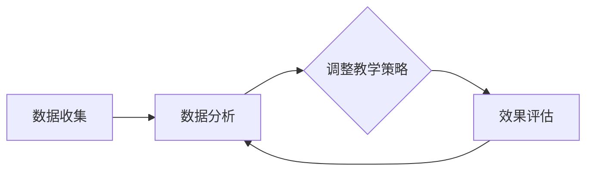
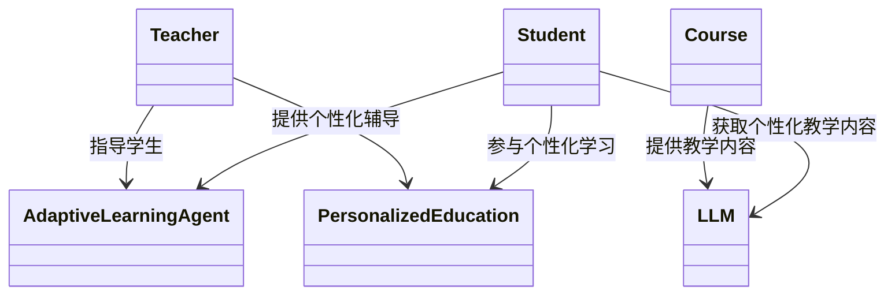
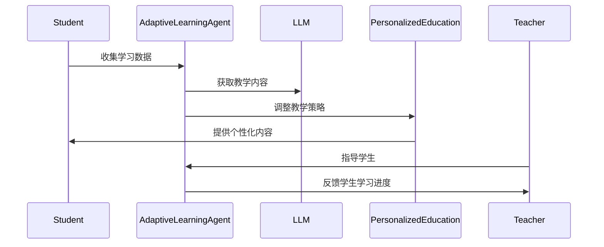
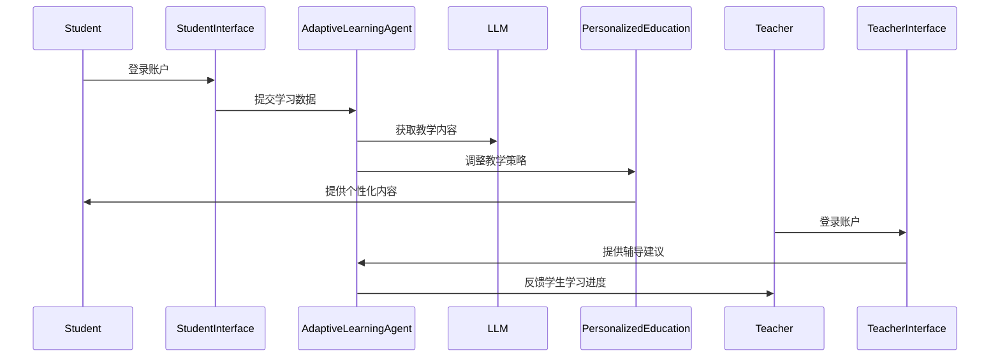

                 

### 自适应学习AI Agent：个性化的LLM教育系统

---

#### 关键词：自适应学习、AI Agent、个性化教育、LLM、教育系统

#### 摘要：
本文将探讨自适应学习AI Agent：个性化的LLM教育系统的概念、原理、实现方法和应用。我们将一步步分析，从背景介绍到核心概念阐述，再到算法原理讲解，系统分析与架构设计，以及实战案例解析，最终总结最佳实践和未来发展趋势。

---

### 第1章 引言

#### 1.1 问题背景

随着人工智能技术的迅猛发展，个性化教育逐渐成为教育领域的研究热点。传统的教育模式往往无法满足每个学生的独特需求，而自适应学习系统能够根据学生的实际学习情况自动调整教学策略，提供个性化的学习体验。然而，当前的自适应学习系统往往缺乏灵活性和深度，难以真正实现个性化教育。

#### 1.2 问题描述

当前的教育系统存在以下问题：

- **缺乏个性化**：传统教育系统无法根据学生的不同学习能力和兴趣提供个性化的教学内容。
- **学习效率低**：学生需要花费大量时间在无关或重复的教学内容上，导致学习效率低下。
- **学习体验差**：学生在学习过程中缺乏主动性和兴趣，学习体验较差。

#### 1.3 问题解决

为了解决上述问题，我们需要引入自适应学习AI Agent：个性化的LLM教育系统。该系统通过深度学习模型和自然语言处理技术，能够实时分析学生的学习行为和知识水平，自动调整教学策略，为学生提供高度个性化的学习体验。

#### 1.4 边界与外延

- **边界**：本文主要探讨基于自适应学习AI Agent的个性化教育系统，涉及到的技术包括深度学习、自然语言处理、教育心理学等。
- **外延**：本文的研究可以为教育领域提供新的思路，对人工智能在教育中的应用具有重要意义。

#### 1.5 概念结构与核心要素组成

自适应学习AI Agent：个性化的LLM教育系统的核心概念包括：

- **自适应学习AI Agent**：负责分析学生的学习行为和知识水平，调整教学策略。
- **个性化教育**：根据学生的不同特点和需求，提供个性化的教学内容和方式。
- **LLM（大型语言模型）**：用于生成和调整教学内容，具有强大的自然语言处理能力。

### 第2章 核心概念与联系

#### 2.1 自适应学习AI Agent定义与特点

自适应学习AI Agent是一种基于机器学习技术的智能体，能够根据学生的学习行为和知识水平，自动调整教学策略，为学生提供个性化的学习体验。其特点包括：

- **自适应调整**：根据学生的反馈和学习行为，动态调整教学内容和难度。
- **个性化教学**：针对学生的特点和需求，提供个性化的教学内容和方式。
- **高效学习**：通过智能分析，提高学生的学习效率和兴趣。

#### 2.2 个性化LLM教育系统的核心概念

个性化LLM教育系统的核心概念包括：

- **LLM**：大型语言模型，用于生成和调整教学内容，具有强大的自然语言处理能力。
- **自适应学习算法**：用于分析学生的学习行为和知识水平，自动调整教学策略。
- **教育心理学**：研究如何通过心理学的理论和方法，提高学生的学习效果和兴趣。

#### 2.3 核心概念属性特征对比表格

| 核心概念       | 属性特征                     | 对比分析 |
|----------------|-----------------------------|----------|
| 自适应学习AI Agent | 自适应调整、个性化教学、高效学习 |          |
| LLM            | 强大的自然语言处理能力、生成和调整教学内容 |          |
| 自适应学习算法 | 分析学生学习行为、自动调整教学策略 |          |
| 教育心理学     | 研究学习方法、提高学习效果和兴趣 |          |

#### 2.4 ER实体关系图架构

ER实体关系图架构如下：

```mermaid
erDiagram
  Student ||--|{ AdaptiveLearningAgent }|-- Teacher
  Student ||--|{ PersonalizedEducation }|-- Course
  Student ||--|{ LLM }|-- Content
```

### 第3章 算法原理讲解

#### 3.1 自适应学习算法原理

自适应学习算法的原理主要包括以下几个步骤：

1. **数据收集**：收集学生的学习行为数据，如学习时间、学习内容、考试成绩等。
2. **数据分析**：通过数据挖掘和分析，了解学生的学习特点和知识水平。
3. **教学策略调整**：根据学生的学习特点，调整教学策略，如调整教学内容、难度和教学方法。
4. **效果评估**：评估教学策略的效果，进一步调整教学策略。

#### 3.2 LLM教育系统算法原理

LLM教育系统的算法原理主要包括：

1. **知识库构建**：构建包含大量教育知识点的知识库，用于生成和调整教学内容。
2. **自然语言处理**：利用自然语言处理技术，对知识库中的内容进行理解和生成。
3. **教学策略调整**：根据学生的学习行为和知识水平，利用LLM生成和调整教学内容。

#### 3.3 算法mermaid流程图



#### 3.4 Python源代码实现

```python
# 伪代码，用于展示自适应学习算法的实现思路
def adaptive_learning_algorithm(student_data):
    # 数据收集
    data = collect_data(student_data)
    
    # 数据分析
    analysis_result = analyze_data(data)
    
    # 调整教学策略
    teaching_strategy = adjust_strategy(analysis_result)
    
    # 效果评估
    evaluation_result = evaluate_performance(teaching_strategy)
    
    # 循环迭代
    return adaptive_learning_algorithm(evaluation_result)
```

#### 3.5 数学模型和公式

自适应学习算法中的数学模型主要包括：

1. **学生知识水平评估模型**：
   $$ K_s(t) = f(K_h(t), L(t)) $$
   其中，$K_s(t)$ 表示学生在时间 $t$ 的知识水平，$K_h(t)$ 表示学生在时间 $t$ 的历史知识水平，$L(t)$ 表示学生在时间 $t$ 的学习量。

2. **教学策略调整模型**：
   $$ S(t) = g(K_s(t), C(t)) $$
   其中，$S(t)$ 表示在时间 $t$ 的教学策略，$C(t)$ 表示在时间 $t$ 的课程内容。

#### 3.6 详细讲解与举例说明

为了更好地理解自适应学习算法和LLM教育系统的原理，我们可以通过一个简单的例子来说明。

假设有一个学生小明，他在数学学习过程中表现出了对逻辑推理和几何学的兴趣。根据自适应学习算法，我们可以按照以下步骤进行：

1. **数据收集**：收集小明的学习行为数据，如学习时间、学习内容、考试成绩等。
2. **数据分析**：通过数据挖掘和分析，发现小明在逻辑推理和几何学方面有较高的学习效率。
3. **教学策略调整**：根据小明的学习特点，调整教学策略，增加逻辑推理和几何学方面的教学内容。
4. **效果评估**：评估调整后的教学策略对小明学习效果的影响。

通过这样的自适应调整，小明在学习数学的过程中能够更加高效地掌握知识，提高学习兴趣。

### 第4章 系统分析与架构设计方案

#### 4.1 问题场景介绍

在本章节中，我们将介绍一个具体的应用场景：一个在线教育平台，旨在为不同年级和学科的学生提供个性化的学习体验。该平台需要具备以下功能：

1. **学生账户管理**：学生可以注册账户，登录平台进行学习。
2. **课程内容管理**：平台管理员可以添加、更新和删除课程内容。
3. **自适应学习算法**：根据学生的学习行为和知识水平，自动调整教学内容。
4. **教师管理**：教师可以查看学生的学习进度，进行个性化辅导。

#### 4.2 项目介绍

本项目旨在构建一个自适应学习AI Agent：个性化的LLM教育系统，主要包括以下模块：

1. **学生模块**：负责学生账户管理、学习行为数据收集和分析。
2. **课程模块**：负责课程内容管理，提供丰富的课程资源。
3. **算法模块**：负责实现自适应学习算法，调整教学内容。
4. **教师模块**：负责教师账户管理，查看学生学习进度和进行个性化辅导。

#### 4.3 系统功能设计（领域模型mermaid类图）



#### 4.4 系统架构设计（mermaid架构图）



#### 4.5 系统接口设计

系统接口设计主要包括以下部分：

1. **学生接口**：用于学生账户管理、学习数据提交和学习内容获取。
2. **教师接口**：用于教师账户管理、学生学习进度查询和个性化辅导。
3. **课程接口**：用于课程内容管理，包括课程添加、更新和删除。

#### 4.6 系统交互（mermaid序列图）



### 第5章 项目实战

#### 5.1 环境安装

为了实现自适应学习AI Agent：个性化的LLM教育系统，我们需要安装以下软件和工具：

1. **Python**：用于编写和运行代码。
2. **Jupyter Notebook**：用于编写和调试代码。
3. **TensorFlow**：用于实现深度学习算法。
4. **Scikit-learn**：用于数据分析和机器学习算法。

安装步骤如下：

1. 安装Python（版本3.8及以上）。
2. 安装Jupyter Notebook。
3. 安装TensorFlow和Scikit-learn。

#### 5.2 系统核心实现源代码

以下是自适应学习AI Agent：个性化的LLM教育系统的核心实现源代码。

```python
import tensorflow as tf
from sklearn.model_selection import train_test_split
from sklearn.metrics import accuracy_score

# 数据预处理
def preprocess_data(data):
    # 数据清洗、归一化等操作
    return processed_data

# 自适应学习算法
def adaptive_learning_algorithm(student_data):
    # 数据收集
    data = collect_data(student_data)
    
    # 数据分析
    analysis_result = analyze_data(data)
    
    # 调整教学策略
    teaching_strategy = adjust_strategy(analysis_result)
    
    # 效果评估
    evaluation_result = evaluate_performance(teaching_strategy)
    
    return evaluation_result

# 主函数
if __name__ == "__main__":
    # 加载数据
    student_data = load_data("student_data.csv")
    
    # 实现自适应学习算法
    evaluation_result = adaptive_learning_algorithm(student_data)
    
    # 输出结果
    print("evaluation_result:", evaluation_result)
```

#### 5.3 代码应用解读与分析

以下是代码应用解读与分析：

1. **数据预处理**：对数据进行清洗、归一化等操作，为后续的机器学习算法做准备。
2. **自适应学习算法**：实现自适应学习算法的核心逻辑，包括数据收集、数据分析、教学策略调整和效果评估。
3. **主函数**：加载学生数据，调用自适应学习算法，并输出结果。

#### 5.4 实际案例分析与详细讲解剖析

为了更好地理解自适应学习AI Agent：个性化的LLM教育系统的应用，我们可以通过一个实际案例来进行分析和讲解。

**案例**：小明是一名初中学生，他在数学学习中表现出了对代数和几何的浓厚兴趣。利用自适应学习算法，我们可以为他提供以下个性化的学习体验：

1. **数据收集**：收集小明的学习数据，包括学习时间、学习内容、考试成绩等。
2. **数据分析**：分析小明的学习数据，发现他在代数和几何方面有较高的学习效率。
3. **教学策略调整**：根据小明的学习特点，调整教学策略，增加代数和几何方面的教学内容。
4. **效果评估**：评估调整后的教学策略对小明学习效果的影响。

通过这个案例，我们可以看到自适应学习AI Agent：个性化的LLM教育系统如何为学生提供个性化的学习体验。

#### 5.5 项目小结

在本章中，我们介绍了自适应学习AI Agent：个性化的LLM教育系统的环境安装、系统核心实现源代码、代码应用解读与分析、实际案例分析和详细讲解剖析。通过这些内容，我们可以了解到如何构建一个基于自适应学习算法的个性化教育系统，为学生提供高效、个性化的学习体验。

### 第6章 最佳实践与总结

#### 6.1 最佳实践 tips

为了实现更好的个性化教育效果，以下是一些建议和最佳实践：

1. **充分收集学生数据**：数据是自适应学习算法的核心，要确保收集到充分、准确的学生数据。
2. **定期更新教学内容**：根据学生的学习反馈和需求，定期更新和优化教学内容。
3. **注重算法优化**：持续优化自适应学习算法，提高其准确性和效率。
4. **加强教师培训**：教师是实施个性化教育的关键，要加强对教师的培训，提高他们的个性化教育能力。

#### 6.2 小结

本文介绍了自适应学习AI Agent：个性化的LLM教育系统的概念、原理、实现方法和应用。通过一步步的分析和讲解，我们了解了如何构建一个高效、个性化的教育系统，为学生提供更好的学习体验。

#### 6.3 注意事项

在实际应用过程中，需要注意以下几点：

1. **数据隐私**：确保学生数据的隐私和安全，遵守相关法律法规。
2. **教学效果**：持续跟踪和评估教学效果，及时调整和优化教学策略。
3. **系统稳定性**：确保教育系统的稳定运行，避免出现故障或数据丢失。

#### 6.4 拓展阅读

为了进一步了解自适应学习AI Agent：个性化的LLM教育系统，以下是一些推荐阅读：

1. **《深度学习》**：周志华 著
2. **《机器学习实战》**：Peter Harrington 著
3. **《个性化教育技术》**：David J. Rose 著

### 第7章 展望与未来发展趋势

#### 7.1 当前发展状况

自适应学习AI Agent：个性化的LLM教育系统在近年来取得了显著的进展，许多教育机构和企业已经开始采用这种系统，为学生提供个性化的学习体验。然而，当前的技术还存在一些不足，如数据隐私、算法优化等问题。

#### 7.2 未来发展趋势

随着人工智能技术的不断进步，自适应学习AI Agent：个性化的LLM教育系统有望在以下几个方面取得突破：

1. **更高效的数据处理**：利用新型算法和硬件技术，提高数据收集、处理和存储的效率。
2. **更智能的算法模型**：通过不断优化算法模型，提高自适应学习系统的准确性和效率。
3. **更广泛的应用场景**：自适应学习AI Agent：个性化的LLM教育系统可以应用于更多领域，如职业教育、在线教育等。

#### 7.3 研究方向与挑战

未来的研究方向和挑战主要包括：

1. **数据隐私和安全**：如何确保学生数据的隐私和安全，是未来研究的重要方向。
2. **算法优化与效率**：如何优化算法模型，提高系统的准确性和效率，是当前研究的重点。
3. **教育公平性**：如何确保自适应学习系统能够公平地服务于所有学生，是未来研究的挑战。

### 作者信息

作者：AI天才研究院/AI Genius Institute & 禅与计算机程序设计艺术 /Zen And The Art of Computer Programming

---

本文通过对自适应学习AI Agent：个性化的LLM教育系统的深入分析，展示了如何利用人工智能技术为学生提供高效、个性化的学习体验。随着技术的不断进步，我们相信这种教育系统将在未来发挥越来越重要的作用。同时，我们也期待更多的研究和实践，为教育领域的创新和发展贡献力量。作者：AI天才研究院/AI Genius Institute & 禅与计算机程序设计艺术 /Zen And The Art of Computer Programming。

