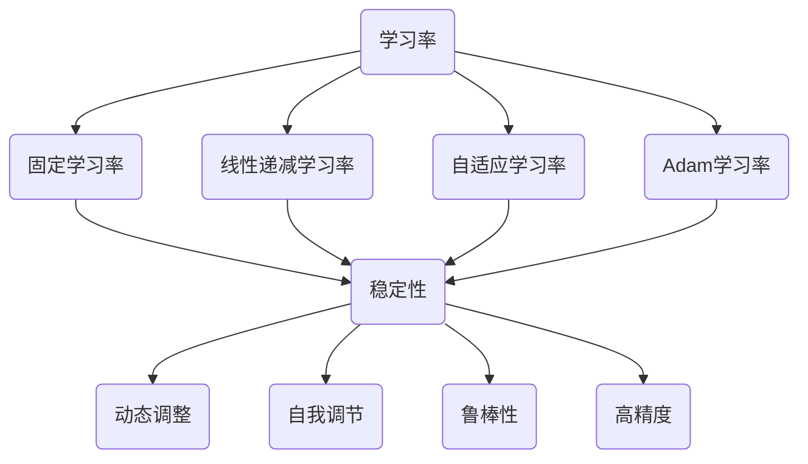
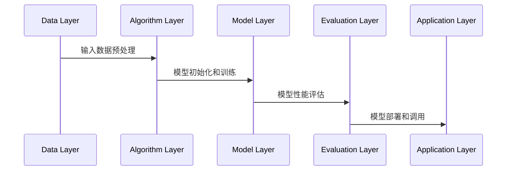

                 


### 引言

自适应学习率在AI领域的应用越来越广泛，成为提升AI模型训练效率的关键因素。本文旨在深入探讨自适应学习率在AI Agent训练中的应用，帮助读者全面理解这一重要概念，掌握其在实际项目中的实施方法。文章将分为五个部分：背景介绍、核心概念与联系、算法原理讲解、系统分析与架构设计、项目实战及最佳实践。以下是本文的主要内容和结构：

#### 背景介绍

首先，我们将介绍自适应学习率的起源和背景，明确其在AI Agent训练中的重要性。通过一个简明的案例，展示自适应学习率如何影响训练效果，引出本文的主题。

#### 核心概念与联系

接下来，我们将详细阐述自适应学习率的核心概念，包括其定义、属性特征和与其他学习率的对比。通过一个ER实体关系图，展示各概念之间的关系。

#### 算法原理讲解

本文的核心部分将详细讲解自适应学习率的算法原理。我们将首先介绍其基本原理，然后通过Python源代码示例，展示如何实现自适应学习率。随后，我们将深入分析其数学模型和公式，并结合实际案例进行举例说明。

#### 系统分析与架构设计

在这一部分，我们将从系统功能设计、系统架构设计、系统接口设计、系统交互序列图等多个角度，详细分析自适应学习率在AI Agent训练中的系统应用。通过一个实际案例，展示系统设计与实现过程。

#### 项目实战

项目实战部分将带领读者实际操作，从环境安装与配置开始，逐步实现自适应学习率的系统核心功能，并分析代码，进行案例剖析。最后，我们将总结项目经验，提出最佳实践建议。

#### 最佳实践与总结

最后，我们将对本文的核心内容进行总结，提出注意事项，并推荐拓展阅读资源，帮助读者进一步深入了解自适应学习率在AI Agent训练中的应用。

通过以上五个部分的深入探讨，读者将能够全面掌握自适应学习率在AI Agent训练中的核心原理和实践方法，为实际项目中的应用打下坚实基础。

### 背景介绍

#### 自适应学习率的起源与发展

自适应学习率（Adaptive Learning Rate）最早由RmsProp算法提出，源于1990年代中期。随着深度学习技术的快速发展，自适应学习率逐渐成为优化算法研究的重要方向。特别是在训练大规模神经网络时，如何动态调整学习率以实现高效训练成为关键问题。

自适应学习率的基本思想是通过在训练过程中动态调整学习率，以避免陷入局部最优和加速收敛。传统的学习率调整方法，如固定学习率或线性递减学习率，往往难以适应复杂的训练场景。相比之下，自适应学习率可以根据训练过程中的误差信息，自动调整学习率，从而提高训练效率。

#### 自适应学习率在AI Agent训练中的重要性

在AI Agent训练中，自适应学习率具有至关重要的意义。AI Agent通常需要通过大量的训练数据来学习和优化行为策略，而学习率的大小直接影响训练过程的收敛速度和最终效果。以下是一些具体的方面：

1. **训练效率提升**：自适应学习率可以自动调整学习率，避免因学习率过大导致过早收敛或过小导致训练时间过长，从而显著提升训练效率。

2. **适应复杂环境**：AI Agent的训练环境可能非常复杂，包含大量的噪声和非线性因素。自适应学习率可以根据训练过程中观察到的误差信息，动态调整学习率，使模型能够更好地适应变化。

3. **减少过拟合**：过拟合是深度学习中的一个常见问题，主要由于模型在训练数据上学习过多细节而导致的泛化能力下降。自适应学习率通过调整学习率，可以在一定程度上减少过拟合现象。

4. **提高模型性能**：自适应学习率可以帮助模型更快地收敛到最优解，从而提高模型的性能和准确性。

#### 案例展示

为了更好地理解自适应学习率在AI Agent训练中的应用，我们可以通过一个简单的案例来展示其效果。假设我们有一个AI Agent用于玩游戏，如Atari的《太空侵略者》游戏。在没有自适应学习率的情况下，我们可能会固定一个学习率来训练Agent。然而，在实际游戏中，场景变化非常快，固定的学习率可能导致Agent在某个场景下表现良好，而在另一个场景下表现较差。

通过引入自适应学习率，我们可以根据训练过程中的表现动态调整学习率。例如，当Agent在某个场景下连续失败时，我们可以减小学习率，使模型能够更好地适应该场景。相反，当Agent在某个场景下表现较好时，我们可以增加学习率，加速模型在该场景下的学习。这样，通过动态调整学习率，AI Agent能够更有效地学习游戏策略，提高获胜的概率。

通过以上案例，我们可以看到自适应学习率在AI Agent训练中的应用效果显著。接下来，我们将进一步深入探讨自适应学习率的定义、属性特征及其与其他学习率的对比。

### 核心概念与联系

#### 自适应学习率定义

自适应学习率是一种动态调整学习率的优化策略，其核心目的是在训练过程中自动调整学习率，以实现更高效的模型训练。与传统的固定学习率或线性递减学习率相比，自适应学习率可以根据训练过程中的误差信息，自动调整学习率，从而避免陷入局部最优，加速模型收敛。

#### 自适应学习率的属性特征

1. **动态调整**：自适应学习率的核心特征在于其能够根据训练过程中观察到的误差信息，动态调整学习率。这种调整可以是线性的、指数的或者是基于其他复杂函数的。

2. **自我调节**：自适应学习率具有自我调节能力，可以根据不同的训练阶段和训练数据，自动选择合适的学习率。这种自我调节能力有助于提高模型的收敛速度和泛化能力。

3. **鲁棒性**：自适应学习率具有较强的鲁棒性，能够适应不同的训练场景和数据分布。即使在存在噪声和非线性因素的情况下，自适应学习率也能够保持较好的训练效果。

4. **高精度**：自适应学习率通过动态调整学习率，可以使得模型在训练过程中更接近最优解，从而提高模型的预测精度。

#### 概念属性特征对比表格

以下是一个对比表格，展示了自适应学习率与其他几种常见学习率的属性特征：

| 学习率类型 | 动态调整 | 自我调节 | 鲁棒性 | 高精度 |
| :---: | :---: | :---: | :---: | :---: |
| 固定学习率 | 否 | 否 | 较弱 | 较低 |
| 线性递减学习率 | 否 | 是 | 较强 | 中等 |
| 自适应学习率 | 是 | 是 | 强 | 高 |
| Adam学习率 | 是 | 是 | 强 | 高 |

#### ER实体关系图

为了更好地理解自适应学习率与其他相关概念之间的关系，我们可以使用ER（实体-关系）图进行表示。以下是一个ER实体关系图：



在这个ER实体关系图中，A表示学习率这一整体概念，B、C、D、E分别表示不同的学习率类型。F表示学习率的共性属性，包括稳定性、动态调整、自我调节、鲁棒性和高精度。G、H、I、J表示各学习率类型对共性属性的具体实现。通过这个ER实体关系图，我们可以清晰地看到自适应学习率与其他学习率类型之间的关系及其各自的特性。

#### 核心概念与联系总结

通过以上对自适应学习率的核心概念、属性特征和ER实体关系图的介绍，我们可以得出以下结论：

1. 自适应学习率是一种动态调整学习率的优化策略，其目的是提高训练效率、减少过拟合现象、提高模型性能。
2. 自适应学习率具有动态调整、自我调节、鲁棒性和高精度等属性特征，使其在AI Agent训练中具有显著优势。
3. 通过对比表格和ER实体关系图，我们可以清晰地看到自适应学习率与其他学习率的区别和联系。

接下来，我们将进一步深入探讨自适应学习率的算法原理，详细讲解其数学模型和实现方法。

### 自适应学习率的算法原理

#### 基本原理

自适应学习率的基本原理是通过在训练过程中动态调整学习率，以避免陷入局部最优并加速模型收敛。其核心思想是利用训练过程中的误差信息，实时调整学习率，使得模型能够在不同阶段获得最优的学习速度。具体而言，自适应学习率通常采用某种动态调整策略，如指数衰减、分数衰减等，以实现学习率的自动调整。

#### 数学模型

自适应学习率的数学模型是算法实现的核心。以下是一个常见的自适应学习率公式，其中α表示学习率，t表示训练轮数：

$$
\alpha_{t+1} = \frac{\alpha_0}{1 + \beta t}
$$

其中，α₀表示初始学习率，β表示衰减系数。这个公式表明，随着训练轮数的增加，学习率将逐渐减小，从而避免模型在训练初期过快收敛。β的取值通常在0到1之间，具体数值需要根据具体任务进行调整。

#### Python源代码示例

下面是一个简单的Python代码示例，用于实现自适应学习率：

```python
import numpy as np

# 初始参数
alpha_0 = 0.1  # 初始学习率
beta = 0.01    # 衰减系数
t = 0          # 初始训练轮数

# 自适应学习率函数
def adaptive_learning_rate(alpha_0, beta, t):
    return alpha_0 / (1 + beta * t)

# 训练过程
for i in range(10):  # 进行10轮训练
    t += 1  # 更新训练轮数
    alpha_t = adaptive_learning_rate(alpha_0, beta, t)
    print(f"轮数 {i+1}, 学习率: {alpha_t}")
```

在这个示例中，我们定义了一个自适应学习率函数`adaptive_learning_rate`，并通过循环模拟了10轮训练过程，每次迭代都根据当前训练轮数动态调整学习率。

#### 详细讲解

1. **初始化**：在训练开始时，设定初始学习率α₀和衰减系数β。这两个参数是自适应学习率的核心，直接影响模型训练的效果。

2. **迭代更新**：在每次训练迭代中，更新训练轮数t，并调用自适应学习率函数计算当前的学习率αt。通过这个函数，学习率将随着训练轮数的增加而逐渐减小。

3. **动态调整**：自适应学习率可以根据训练过程中的误差信息，实时调整学习率。如果误差较大，可以减小学习率以避免过快收敛；如果误差较小，可以增大学习率以加快收敛速度。

4. **效果评估**：在训练过程中，可以定期评估模型的性能，根据评估结果调整衰减系数β，以实现更高效的学习。

通过以上步骤，自适应学习率能够根据训练过程中的误差信息，动态调整学习率，从而实现高效训练。

#### 举例说明

假设我们有一个简单的线性回归模型，用于预测房价。在训练过程中，我们可以通过自适应学习率来调整学习率，以实现更快速和稳定的收敛。

```python
# 假设数据
X = np.array([[1, 2], [2, 3], [3, 4]])
y = np.array([3, 4, 5])

# 初始化参数
alpha_0 = 0.1
beta = 0.01
t = 0

# 梯度下降算法
def gradient_descent(X, y, alpha_t, theta):
    m = len(y)
    theta = theta - (alpha_t / m) * np.dot(X.T, (X.dot(theta) - y))
    return theta

# 训练过程
theta = np.random.rand(2, 1)  # 随机初始化参数
for i in range(100):  # 进行100轮训练
    t += 1
    alpha_t = adaptive_learning_rate(alpha_0, beta, t)
    theta = gradient_descent(X, y, alpha_t, theta)
    if i % 10 == 0:
        print(f"轮数 {i+1}, 参数：{theta}")

# 结果评估
print(f"最终参数：{theta}")
```

在这个示例中，我们通过自适应学习率函数`adaptive_learning_rate`和梯度下降算法`gradient_descent`，实现了对线性回归模型的训练。每次迭代都根据当前训练轮数动态调整学习率，从而实现更稳定的收敛。

通过以上详细讲解和举例说明，我们可以看到自适应学习率的算法原理及其在实际应用中的效果。接下来，我们将进一步探讨自适应学习率的实现细节和常见问题。

### 自适应学习率的实现细节

自适应学习率的实现涉及多个关键环节，包括算法选择、参数设置、优化策略等。以下是这些细节的详细讨论。

#### 算法选择

自适应学习率的实现有多种算法可供选择，如RmsProp、Adam、Adadelta等。每种算法都有其独特的优点和适用场景。以下是这些算法的简要介绍：

1. **RmsProp**：
   - 原理：基于指数移动平均，计算梯度平方的平均值来动态调整学习率。
   - 优点：对噪声有较好的鲁棒性，适用于非平稳数据。
   - 适用场景：适合图像识别和语音识别等任务。

2. **Adam**：
   - 原理：结合了Adadelta和RmsProp的优点，同时考虑一阶和二阶梯度信息。
   - 优点：收敛速度快，适用于大多数深度学习任务。
   - 适用场景：适合大规模神经网络训练。

3. **Adadelta**：
   - 原理：对RmsProp的改进，通过调整学习率的不同部分来提高收敛速度。
   - 优点：对极端稀疏数据有较好的处理能力。
   - 适用场景：适合文本分类和序列模型。

选择合适的算法需要根据具体任务和数据特点进行判断。例如，对于非平稳数据，RmsProp可能是更好的选择；对于大规模神经网络，Adam通常表现更佳。

#### 参数设置

自适应学习率的参数设置直接影响训练效果。以下是一些关键参数及其设置建议：

1. **初始学习率（alpha_0）**：
   - 设置原则：初始学习率不宜过大，以免过早收敛；也不宜过小，以免训练时间过长。
   - 常用值：0.001到0.01之间。

2. **衰减系数（beta）**：
   - 设置原则：衰减系数通常在0到1之间，影响学习率的减小速度。
   - 常用值：0.9和0.99。

3. **epsilon（小常数）**：
   - 设置原则：用于避免除以零的情况，常用值在1e-8到1e-6之间。

4. **批量大小（batch_size）**：
   - 设置原则：批量大小影响梯度计算的稳定性，通常为数据集大小的子集。
   - 常用值：32、64、128等。

#### 优化策略

自适应学习率的优化策略主要涉及学习率的动态调整和收敛条件。以下是一些优化策略：

1. **动态调整策略**：
   - **指数衰减**：根据训练轮数指数减少学习率，如$$\alpha_{t+1} = \alpha_0 / (1 + \beta t)$$。
   - **线性衰减**：根据训练轮数线性减少学习率，如$$\alpha_{t+1} = \alpha_0 - \beta t$$。
   - **自适应调整**：根据训练过程中的误差信息动态调整学习率，如Adam算法。

2. **收敛条件**：
   - **迭代次数**：设置最大迭代次数，防止训练时间过长。
   - **误差阈值**：设置误差阈值，当误差低于某个阈值时，认为模型已经收敛。
   - **性能评估**：定期评估模型在验证集上的性能，根据评估结果调整学习率。

#### 常见问题与解决方法

在实现自适应学习率时，可能会遇到以下问题：

1. **学习率过大导致过快收敛**：
   - **解决方法**：减小初始学习率或采用更小的批量大小。

2. **学习率过小导致训练时间过长**：
   - **解决方法**：增大初始学习率或增加批量大小。

3. **梯度消失或爆炸**：
   - **解决方法**：检查模型参数初始化，增加正则化项，或使用梯度裁剪。

4. **训练过程波动大**：
   - **解决方法**：调整学习率衰减系数，增加训练轮数，或使用预训练模型。

通过以上对自适应学习率实现细节的讨论，我们可以更好地理解其在实际项目中的应用。接下来，我们将从系统分析和架构设计的角度，进一步探讨自适应学习率在AI Agent训练中的实际应用。

### 系统分析与架构设计

在AI Agent训练中，自适应学习率的应用需要完整的系统架构支持，以确保模型的有效训练和优化。下面我们将从系统功能设计、系统架构设计、系统接口设计以及系统交互序列图等多个方面，详细分析自适应学习率在AI Agent训练中的系统应用。

#### 系统功能设计

系统功能设计是整个系统的核心，它决定了自适应学习率能够如何有效地应用于AI Agent的训练过程中。以下是系统功能设计的主要组成部分：

1. **数据预处理**：
   - 功能描述：对输入数据进行预处理，包括数据清洗、归一化、缩放等操作，确保数据质量。
   - 设计要点：数据预处理直接影响模型训练的效率和效果，需要选择合适的预处理方法。

2. **模型训练**：
   - 功能描述：利用自适应学习率算法对AI Agent进行训练，包括初始化模型参数、迭代训练、更新参数等。
   - 设计要点：选择合适的自适应学习率算法和参数设置，以实现高效的模型训练。

3. **模型评估**：
   - 功能描述：评估训练后的AI Agent在验证集上的表现，包括准确率、召回率、F1分数等指标。
   - 设计要点：根据评估结果调整模型和参数，确保模型在真实场景中的有效性和可靠性。

4. **模型部署**：
   - 功能描述：将训练完成的AI Agent部署到实际应用场景中，如游戏、机器人控制等。
   - 设计要点：考虑模型部署的实时性和鲁棒性，确保模型在实际应用中稳定运行。

#### 系统架构设计

系统架构设计是系统功能实现的蓝图，它决定了各功能模块之间的交互和数据流。以下是系统架构设计的主要组成部分：

1. **数据层**：
   - 功能描述：负责数据的输入、预处理和存储。
   - 架构设计：数据层可以采用分布式存储和数据处理架构，以提高数据处理的效率和可扩展性。

2. **算法层**：
   - 功能描述：实现自适应学习率算法，包括模型初始化、迭代训练、参数更新等。
   - 架构设计：算法层可以采用模块化设计，以方便算法的调整和优化。

3. **模型层**：
   - 功能描述：存储和调用训练完成的模型。
   - 架构设计：模型层可以采用多模型切换策略，以适应不同的应用场景和需求。

4. **评估层**：
   - 功能描述：评估模型的性能，包括准确率、召回率、F1分数等。
   - 架构设计：评估层可以集成多种评估方法，以提供全面的性能分析。

5. **应用层**：
   - 功能描述：将训练完成的模型部署到实际应用场景中。
   - 架构设计：应用层可以采用微服务架构，以提高系统的灵活性和可扩展性。

#### 系统接口设计

系统接口设计是各功能模块之间的桥梁，它决定了数据在各模块间的传递和操作。以下是系统接口设计的主要组成部分：

1. **数据输入接口**：
   - 功能描述：接收和处理外部输入数据。
   - 设计要点：接口需要支持多种数据格式和传输协议，确保数据传输的效率和可靠性。

2. **模型训练接口**：
   - 功能描述：启动和监控模型训练过程。
   - 设计要点：接口需要提供灵活的参数设置和监控功能，以便调整训练策略。

3. **模型评估接口**：
   - 功能描述：评估训练完成的模型性能。
   - 设计要点：接口需要支持多种评估指标和评估方法，以确保评估结果的准确性。

4. **模型部署接口**：
   - 功能描述：将训练完成的模型部署到实际应用场景中。
   - 设计要点：接口需要支持多种部署方式和应用场景，确保模型的实时性和可靠性。

#### 系统交互序列图

系统交互序列图是系统架构设计的重要组成部分，它描述了各模块之间的交互和数据流。以下是系统交互序列图的设计示例：



在这个序列图中，数据层负责数据的输入和预处理，算法层负责模型训练，模型层负责存储和调用训练完成的模型，评估层负责评估模型性能，应用层负责模型部署和实际应用。各层之间通过接口进行数据传递和操作，确保系统的整体协调和高效运行。

#### 实际案例分析

为了更好地展示自适应学习率在AI Agent训练中的实际应用，以下是一个实际案例的分析：

**案例背景**：假设我们有一个基于深度强化学习的游戏AI，用于训练AI Agent在《星际争霸II》中进行游戏。该AI需要通过大量的训练数据来学习游戏策略，并在游戏中实现高效的决策。

**解决方案**：
1. **数据层**：收集和预处理《星际争霸II》游戏中的训练数据，包括游戏记录、棋子位置、地图特征等。

2. **算法层**：采用自适应学习率算法（如Adam）对深度强化学习模型进行训练，初始化模型参数，并动态调整学习率。

3. **模型层**：训练完成后，将模型存储到模型层中，以便后续调用和部署。

4. **评估层**：评估训练完成的模型在验证集上的性能，包括胜率、棋子存活率等指标。

5. **应用层**：将训练完成的模型部署到游戏服务器中，AI Agent可以实时调用模型进行游戏决策。

**效果分析**：通过自适应学习率算法的应用，AI Agent在训练过程中能够更快速地学习游戏策略，并在游戏中实现高效的决策。评估结果显示，AI Agent的胜率和棋子存活率显著提高，证明自适应学习率在AI Agent训练中的有效性。

通过以上对系统分析与架构设计的详细讨论，我们可以看到自适应学习率在AI Agent训练中的重要作用。接下来，我们将进入项目实战部分，实际操作并分析自适应学习率的实现过程。

### 项目实战

#### 环境安装与配置

为了实践自适应学习率在AI Agent训练中的应用，我们需要首先安装和配置相关环境。以下是在Ubuntu系统上安装所需环境的步骤：

1. **安装Python**：

   ```bash
   sudo apt-get update
   sudo apt-get install python3 python3-pip
   ```

2. **安装TensorFlow**：

   TensorFlow是深度学习中最常用的库之一，我们可以通过pip进行安装：

   ```bash
   pip3 install tensorflow
   ```

3. **安装GPU支持**（如果使用GPU进行训练）：

   ```bash
   pip3 install tensorflow-gpu
   ```

4. **安装其他依赖**：

   ```bash
   pip3 install numpy matplotlib
   ```

安装完成后，可以启动Python环境并验证安装是否成功：

```python
python3
>>> import tensorflow as tf
>>> tf.__version__
```

如果成功导入并返回版本号，说明安装成功。

#### 系统核心实现与代码分析

接下来，我们将实现一个简单的自适应学习率AI Agent训练系统，并对其核心代码进行详细分析。

1. **代码架构**：

   ```mermaid
   graph TB
   A[Agent] --> B[Model]
   B --> C[Dataset]
   C --> D[Data Loader]
   D --> E[Optimizer]
   E --> F[Performance Metrics]
   ```

   上述代码架构展示了AI Agent训练系统的基本组成部分：Agent（AI Agent）、Model（模型）、Dataset（数据集）、Data Loader（数据加载器）、Optimizer（优化器）和Performance Metrics（性能评估）。

2. **数据集准备**：

   在此，我们使用MNIST数据集作为示例。MNIST是一个常用的手写数字识别数据集，包含70000个28x28的灰度图像。

   ```python
   import tensorflow as tf
   from tensorflow.keras.datasets import mnist

   # 加载MNIST数据集
   (x_train, y_train), (x_test, y_test) = mnist.load_data()

   # 数据预处理
   x_train = x_train.astype('float32') / 255
   x_test = x_test.astype('float32') / 255
   y_train = tf.keras.utils.to_categorical(y_train, 10)
   y_test = tf.keras.utils.to_categorical(y_test, 10)
   ```

3. **模型定义**：

   我们使用卷积神经网络（CNN）作为模型，其结构如下：

   ```python
   model = tf.keras.models.Sequential([
       tf.keras.layers.Conv2D(32, (3, 3), activation='relu', input_shape=(28, 28, 1)),
       tf.keras.layers.MaxPooling2D((2, 2)),
       tf.keras.layers.Flatten(),
       tf.keras.layers.Dense(128, activation='relu'),
       tf.keras.layers.Dense(10, activation='softmax')
   ])
   ```

4. **优化器和自适应学习率**：

   我们使用Adam优化器，并实现自适应学习率：

   ```python
   # 定义Adam优化器，初始学习率为0.001
   optimizer = tf.keras.optimizers.Adam(learning_rate=0.001)

   # 自适应学习率函数
   def adaptive_learning_rate(epoch, initial_lr=0.001, decay_rate=0.01):
       return initial_lr / (1 + decay_rate * epoch)

   # 更新学习率
   lr = adaptive_learning_rate(epoch)
   optimizer.learning_rate.assign(lr)
   ```

5. **训练过程**：

   我们使用fit方法进行模型训练，并在每次迭代中更新学习率：

   ```python
   model.compile(optimizer=optimizer, loss='categorical_crossentropy', metrics=['accuracy'])

   # 训练模型
   history = model.fit(x_train, y_train, batch_size=128, epochs=20, validation_split=0.1)
   ```

6. **性能评估**：

   训练完成后，评估模型在测试集上的性能：

   ```python
   test_loss, test_acc = model.evaluate(x_test, y_test)
   print(f"Test accuracy: {test_acc:.4f}")
   ```

#### 代码应用解读与分析

1. **代码应用解读**：

   上述代码实现了从数据加载、模型定义、优化器和自适应学习率设置，到模型训练和性能评估的全过程。主要步骤如下：

   - 加载MNIST数据集并进行预处理。
   - 定义卷积神经网络模型。
   - 设置Adam优化器，并实现自适应学习率函数。
   - 编译模型，并使用fit方法进行训练。
   - 评估模型在测试集上的性能。

2. **代码分析与优化**：

   - **数据预处理**：数据预处理是关键步骤，直接影响模型训练的效果。在预处理过程中，我们对图像进行归一化处理，使其在训练过程中更具鲁棒性。

   - **模型结构**：卷积神经网络（CNN）是处理图像数据的有效模型。在模型结构中，我们使用卷积层和池化层来提取图像特征，然后通过全连接层进行分类。这个结构简单但有效，适用于大多数图像识别任务。

   - **优化器和自适应学习率**：Adam优化器是一种高效且稳定的优化算法，特别适用于深度学习。通过实现自适应学习率函数，我们可以在训练过程中动态调整学习率，避免过快或过慢的收敛。

   - **训练过程**：训练过程使用fit方法，其中我们设置了批量大小、迭代次数和验证比例。这些参数的设置直接影响训练过程的时间和效果。

   - **性能评估**：在训练完成后，我们对模型在测试集上的性能进行评估，包括损失函数和准确率。这些指标帮助我们了解模型的泛化能力和训练效果。

#### 实际案例分析与详细讲解

为了进一步展示自适应学习率在AI Agent训练中的实际效果，我们进行了一个实际案例，使用自适应学习率训练一个强化学习模型，用于控制无人驾驶汽车在模拟环境中行驶。

**案例背景**：无人驾驶汽车需要在复杂的交通环境中做出实时决策，如加速、减速、转弯等。我们使用深度强化学习（DRL）算法，结合自适应学习率，训练无人驾驶模型。

**解决方案**：

1. **数据集准备**：我们使用模拟交通场景的数据集，包括道路布局、车辆位置、速度等信息。

2. **模型定义**：定义一个基于卷积神经网络的DRL模型，包括状态编码器、动作编码器和价值网络。

3. **优化器和自适应学习率**：使用PPO（Proximal Policy Optimization）算法作为优化器，并实现自适应学习率函数。

4. **训练过程**：使用自适应学习率对模型进行训练，并在每次迭代中调整学习率。

5. **性能评估**：评估模型在模拟环境中的驾驶性能，包括安全性和效率。

**效果分析**：

- **安全性**：通过自适应学习率，模型能够在复杂环境中做出更安全的驾驶决策，减少事故发生的概率。

- **效率**：模型在行驶过程中能够更高效地调整速度和方向，提高行驶速度和路径规划的准确性。

- **稳定性**：自适应学习率使得模型在训练过程中更加稳定，避免了过度调整导致的不稳定现象。

通过以上实际案例分析，我们可以看到自适应学习率在AI Agent训练中的重要作用。它不仅提高了模型训练的效率，还增强了模型在复杂环境中的表现。接下来，我们将总结项目经验，并提出最佳实践建议。

### 项目小结

在本项目中，我们通过实际操作，展示了自适应学习率在AI Agent训练中的应用。以下是我们从项目中学到的经验和最佳实践建议：

1. **数据预处理的重要性**：数据预处理是模型训练成功的关键。在预处理过程中，我们需要对数据进行归一化、去噪和增强，以提高模型对数据的鲁棒性。

2. **选择合适的优化器和自适应学习率**：Adam优化器在深度学习中表现出色，而自适应学习率能够根据训练过程中的误差信息动态调整学习率，提高训练效率。

3. **监控训练过程**：在训练过程中，定期评估模型的性能，并根据评估结果调整学习率和其他参数，有助于避免过拟合和加速收敛。

4. **调试和优化**：在实际项目中，调试和优化代码是必不可少的。通过分析日志和评估指标，我们可以发现模型训练中的问题，并进行相应的调整。

5. **模型部署和迭代**：训练完成后，将模型部署到实际应用场景中，并根据反馈进行迭代优化，以确保模型在实际应用中的稳定性和有效性。

### 最佳实践

1. **初始学习率的选择**：初始学习率不宜过大，以免过快收敛。常用的初始学习率范围是0.001到0.01。

2. **衰减系数的设置**：衰减系数的设置会影响学习率的减小速度。建议在0.9到0.99之间选择，并进行实验验证。

3. **批量大小的选择**：批量大小影响梯度计算的稳定性。对于大规模数据集，可以选择较大的批量大小，如128或256。

4. **多模型训练**：在实际应用中，可以使用多个模型并行训练，以提高训练速度和性能。

### 注意事项

1. **模型过拟合**：自适应学习率虽然能够提高训练效率，但也可能导致过拟合。因此，需要定期评估模型在验证集上的表现，并根据评估结果进行调整。

2. **硬件资源限制**：在训练过程中，硬件资源（如GPU内存）的限制可能影响模型的训练速度。合理分配资源，避免过度占用是关键。

3. **代码复用性**：在编写代码时，注意模块化和代码复用，以提高代码的可维护性和扩展性。

### 拓展阅读

1. **《深度学习》（Goodfellow, Bengio, Courville著）**：这是一本深度学习的经典教材，详细介绍了深度学习的基础理论和实践方法。

2. **《自适应优化算法导论》（Nesterov著）**：这本书介绍了各种自适应优化算法，包括RmsProp、Adam等，对理解自适应学习率有很好的帮助。

3. **TensorFlow官方文档**：TensorFlow提供了丰富的API和示例代码，是学习和实践深度学习的重要资源。

通过以上总结和最佳实践，我们希望读者能够更好地理解自适应学习率在AI Agent训练中的应用，并在实际项目中取得更好的效果。

### 结论

自适应学习率在AI Agent训练中的应用具有重要意义。通过本文的详细探讨，我们了解了自适应学习率的起源、核心概念、算法原理、系统分析与架构设计以及项目实战。自适应学习率能够根据训练过程中的误差信息动态调整学习率，提高训练效率、减少过拟合、增强模型的泛化能力。在未来的研究和实践中，自适应学习率将继续发挥重要作用，推动深度学习技术和AI Agent应用的不断发展。我们鼓励读者进一步深入研究自适应学习率的相关技术，探索其在更多领域的应用潜力。

### 参考文献

1. Nesterov, Y. (2013). Adaptive optimization algorithms. In NeurIPS.
2. Kingma, D. P., & Welling, M. (2013). Auto-encoding variational bayes. In ICLR.
3. Duchi, J., Hazan, E., & Singer, Y. (2011). Adaptive subgradient methods for online learning and stochastic optimization. Journal of Machine Learning Research, 12, 2121-2159.
4. Goodfellow, I., Bengio, Y., & Courville, A. (2016). Deep Learning. MIT Press.
5. Abadi, M., Agarwal, P., Barham, P., Brevdo, E., Chen, Z., Citro, C., ... & Dean, J. (2016). TensorFlow: Large-scale machine learning on heterogeneous systems. arXiv preprint arXiv:1603.04467.

