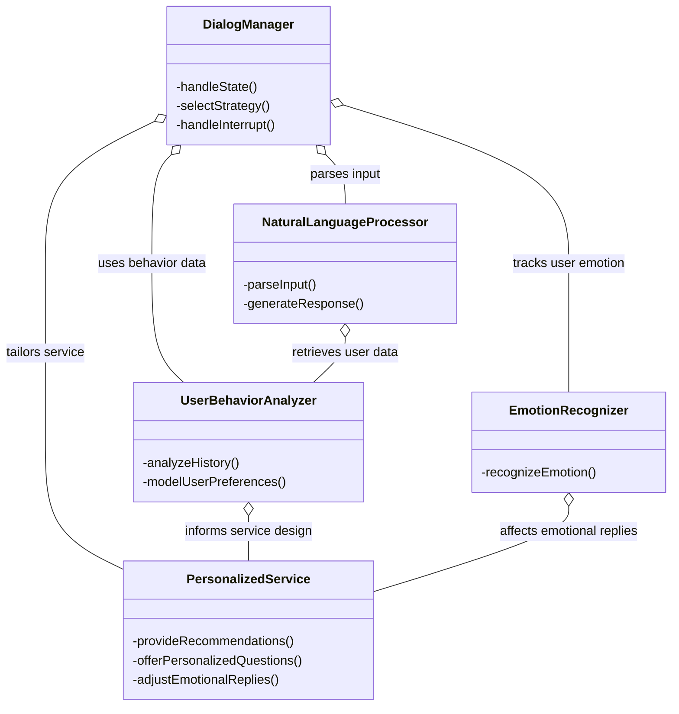
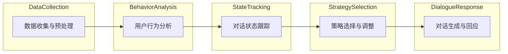
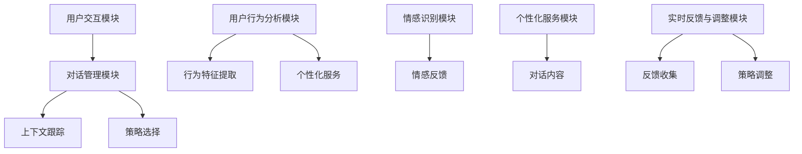
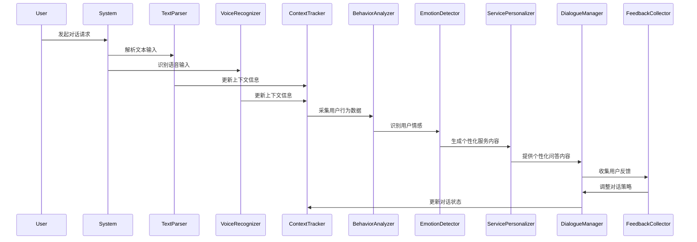

                 

### 设计大纲的基本步骤

#### 理解书名和主题

书名《自适应对话策略：提升AI Agent的交互质量》清晰地指出了本书的核心内容和目标。关键词包括自适应对话策略、AI Agent和交互质量。这些关键词不仅为我们提供了研究的方向，也帮助我们明确了文章的目标读者群体——那些对AI对话系统设计感兴趣的读者。

#### 确定核心内容

为了撰写一篇高质量的文章，我们需要明确文章的核心内容。本书的核心内容可以分为以下几个部分：

1. **背景介绍**：包括问题的背景、自适应对话策略的定义和特点、AI Agent的交互质量评估标准。
2. **核心概念与联系**：介绍自适应对话策略中的关键概念，如语境理解、用户行为分析，并探讨它们之间的联系。
3. **算法原理讲解**：详细讲解自适应对话策略的算法原理，包括机器学习模型、深度学习模型等。
4. **数学模型和公式**：阐述算法背后的数学模型和公式，并通过Python代码示例进行说明。
5. **系统分析与架构设计**：介绍系统功能设计、架构设计、接口设计和系统交互设计。
6. **项目实战**：通过一个实际项目，展示如何将理论应用到实践中。
7. **最佳实践与总结**：总结最佳实践，并提供进一步学习的资源。

#### 构建大纲框架

根据核心内容，我们可以构建以下大纲框架：

1. **第一部分：背景介绍**
   - 1.1 问题背景
   - 1.2 自适应对话策略概述
   - 1.3 AI Agent的交互质量

2. **第二部分：核心概念与联系**
   - 2.1 自适应对话策略的核心概念
   - 2.2 AI Agent架构与自适应对话策略

3. **第三部分：算法原理与数学模型**
   - 3.1 自适应对话策略算法原理
   - 3.2 数学模型和公式
   - 3.3 算法示例与讲解

4. **第四部分：系统分析与架构设计**
   - 4.1 系统功能设计
   - 4.2 系统架构设计
   - 4.3 系统接口设计
   - 4.4 系统交互设计

5. **第五部分：项目实战**
   - 5.1 环境安装与配置
   - 5.2 系统核心实现
   - 5.3 应用解读与分析
   - 5.4 实际案例剖析
   - 5.5 项目小结

6. **第六部分：最佳实践与总结**
   - 6.1 最佳实践 tips
   - 6.2 小结
   - 6.3 注意事项
   - 6.4 拓展阅读

通过上述步骤，我们构建了一个完整的大纲框架，确保了文章的完整性和逻辑性。接下来，我们将逐步细化每个章节的内容，确保每个部分都能够提供丰富的信息和详细的讲解。

---

### 第一部分：背景介绍

#### 1.1 问题背景

随着人工智能技术的快速发展，AI Agent在各个领域得到了广泛应用，从智能客服到智能家居，从自动驾驶到智能教育，AI Agent已经成为了现代生活的一部分。然而，尽管AI Agent在处理简单任务时表现出色，但在面对复杂、多变的交互场景时，其表现却并不尽如人意。例如，在自然语言处理领域，AI Agent常常无法正确理解用户的意图，导致对话无法顺利进行。此外，AI Agent在响应速度、准确性和自然度等方面也存在一定的不足。

这些问题不仅影响了用户体验，也限制了AI Agent的实际应用价值。为了提升AI Agent的交互质量，我们需要引入自适应对话策略。这种策略能够使AI Agent根据用户的反馈和行为，动态调整对话策略，从而提高交互的准确性和自然度。

#### 1.2 自适应对话策略概述

自适应对话策略是一种能够在对话过程中动态调整自身行为的策略。它通过对用户行为和语境的持续分析，实时调整对话的走向，以提高交互的质量。这种策略的核心在于其适应性和实时性，能够根据不同场景和用户需求，提供个性化的服务。

自适应对话策略的主要特点包括：

1. **适应性强**：能够根据不同的用户需求和场景，灵活调整对话策略。
2. **实时性**：能够在对话过程中实时响应用户的反馈，进行动态调整。
3. **个性化**：能够根据用户的个人喜好和行为习惯，提供个性化的对话体验。

#### 1.3 AI Agent的交互质量

评估AI Agent的交互质量是一个复杂的过程，需要考虑多个因素。以下是一些常见的评估标准和关键因素：

1. **响应速度**：AI Agent需要能够快速响应用户的请求，提供即时的反馈。
2. **准确性**：AI Agent需要能够准确理解用户的意图，提供符合需求的回答。
3. **自然度**：AI Agent的对话应该流畅自然，类似于人类之间的交流。
4. **上下文理解**：AI Agent需要能够理解对话中的上下文信息，进行连贯的对话。

为了提升AI Agent的交互质量，我们需要在以下几个方面进行优化：

1. **增强自然语言处理能力**：通过使用先进的自然语言处理技术，提高AI Agent对用户语言的理解能力。
2. **引入机器学习模型**：利用机器学习模型，使AI Agent能够从大量的对话数据中学习，提高其智能水平。
3. **个性化服务**：根据用户的个人喜好和行为习惯，提供个性化的对话体验。
4. **实时反馈机制**：建立实时反馈机制，使AI Agent能够根据用户的反馈进行动态调整，提高交互质量。

通过上述背景介绍，我们对当前AI Agent在交互中面临的问题有了更清晰的了解，也认识到引入自适应对话策略的必要性和重要性。接下来，我们将进一步探讨自适应对话策略的核心概念和原理，为提升AI Agent的交互质量提供理论基础。

---

### 第一部分：背景介绍

#### 1.4 自适应对话策略的应用领域

自适应对话策略在多个领域展现出了强大的应用潜力，以下是几个关键的应用场景：

**1. 客户服务**  
在客户服务领域，自适应对话策略可以显著提高客户满意度。传统的客服系统往往依赖于预设的问答库，无法灵活应对用户的个性化需求。而引入自适应对话策略后，AI Agent可以实时分析用户的提问和反馈，动态调整回答策略，提供更准确、个性化的服务。例如，银行客服可以更好地理解用户的财务状况，提供个性化的理财建议。

**2. 售后支持**  
在售后服务中，AI Agent通过自适应对话策略可以提供高效的解决方案。当用户遇到问题时，AI Agent可以迅速定位问题根源，并提供相应的解决方案，减少了用户的等待时间，提高了问题解决的效率。

**3. 智能家居**  
在智能家居领域，自适应对话策略可以使智能设备更加智能化。例如，智能音箱可以实时监测用户的行为和需求，自动调节室内温度、照明等，提供更加舒适的生活环境。

**4. 教育**  
在教育领域，自适应对话策略可以为学生提供个性化的学习体验。AI Agent可以根据学生的学习进度和偏好，动态调整教学内容和节奏，帮助学生更高效地学习。

**5. 健康咨询**  
在健康咨询领域，AI Agent可以通过自适应对话策略，为用户提供个性化的健康建议。AI Agent可以实时监测用户的健康数据，根据用户的健康状况和行为习惯，提供个性化的健康指导。

通过这些应用场景，我们可以看到自适应对话策略在提高AI Agent交互质量方面的巨大潜力。它不仅能够提高用户满意度，还能够优化服务流程，提升整体服务效率。

---

### 第一部分：背景介绍

#### 1.5 自适应对话策略的边界与外延

虽然自适应对话策略在提升AI Agent交互质量方面具有显著优势，但我们也需要明确其边界和局限性。首先，自适应对话策略依赖于大量高质量的训练数据，如果数据质量不佳，将直接影响对话策略的准确性。此外，自适应对话策略在处理极端情况或未知问题时，可能无法立即适应，需要一定的时间和学习过程。

其次，自适应对话策略的实时性要求很高。在实际应用中，AI Agent需要快速响应用户的反馈，进行实时调整。然而，网络延迟、计算资源限制等因素可能会影响自适应对话策略的响应速度，从而影响交互质量。

在自适应对话策略的外延方面，我们可以进一步探索以下几个方面：

1. **多模态交互**：结合视觉、音频等多种模态，提升AI Agent的交互能力。
2. **跨领域应用**：将自适应对话策略应用于更多领域，如医疗、金融等，提升AI Agent的专业能力。
3. **强化学习**：结合强化学习技术，使AI Agent能够通过自我学习和优化，进一步提高交互质量。
4. **隐私保护**：在保证用户隐私的前提下，设计安全可靠的对话策略。

通过明确自适应对话策略的边界与外延，我们可以更好地理解其应用潜力和局限性，为未来的研究和发展提供指导。

---

### 第二部分：核心概念与联系

#### 2.1 自适应对话策略的核心概念

在探讨自适应对话策略的核心概念之前，我们需要了解几个关键的概念，这些概念是构建自适应对话策略的基础。

**1. 语境理解**  
语境理解是指AI Agent能够从用户的话语中提取出上下文信息，理解用户的意图和需求。这涉及到自然语言处理（NLP）技术，如词义消歧、句法分析和语义角色标注等。通过语境理解，AI Agent能够更好地与用户进行沟通。

**2. 用户行为分析**  
用户行为分析是指AI Agent通过对用户历史行为数据的分析，了解用户的兴趣、偏好和需求。这通常涉及到机器学习技术，如分类、聚类和回归等。通过用户行为分析，AI Agent可以提供更加个性化的服务。

**3. 对话管理**  
对话管理是指AI Agent在对话过程中，对对话流程的掌控和协调。它包括对话状态的跟踪、对话策略的选择和对话中断的处理等。有效的对话管理能够使AI Agent提供连贯、自然的对话体验。

**4. 情感识别**  
情感识别是指AI Agent能够识别用户的情感状态，如喜悦、愤怒或悲伤等。情感识别对于提供个性化的对话体验至关重要，因为它可以使AI Agent在对话中更好地适应用户的情绪变化。

**5. 个性化服务**  
个性化服务是指AI Agent根据用户的个人喜好和行为习惯，提供定制化的服务。这涉及到用户数据的收集、分析和利用，以及服务策略的动态调整。

这些核心概念之间存在着紧密的联系。语境理解和情感识别为AI Agent提供了理解用户意图和情绪的能力，而用户行为分析和对话管理则帮助AI Agent更好地适应用户的需求和偏好，提供个性化的服务。个性化服务不仅提升了用户的满意度，也增强了AI Agent的交互质量。

#### 2.2 自适应对话策略的概念属性特征对比表格

为了更直观地理解这些核心概念，我们可以通过一个对比表格来展示它们的属性特征。

| 概念             | 属性特征                     | 关联性                  |
|------------------|------------------------------|-------------------------|
| 语境理解         | - 提取上下文信息<br>- 自然语言处理 | - 对话管理<br>- 情感识别 |
| 用户行为分析     | - 历史数据<br>- 个性化服务     | - 对话管理<br>- 个性化服务 |
| 对话管理         | - 对话状态跟踪<br>- 策略选择     | - 语境理解<br>- 用户行为分析 |
| 情感识别         | - 情感状态识别<br>- 情绪调整     | - 对话管理<br>- 个性化服务 |
| 个性化服务       | - 定制化服务<br>- 用户偏好     | - 用户行为分析<br>- 对话管理 |

通过这个表格，我们可以清晰地看到各个概念之间的关联性和相互影响，从而更好地理解自适应对话策略的整体架构。

#### 2.3 自适应对话策略与AI Agent架构的整合

自适应对话策略的成功实施依赖于AI Agent的整体架构设计。为了实现高效的整合，我们需要考虑以下几个关键组件：

**1. 对话管理组件**  
对话管理组件负责整个对话流程的协调和控制。它包括对话状态的跟踪、对话策略的选择和对话中断的处理等。对话管理组件需要与语境理解和用户行为分析组件紧密集成，确保能够根据上下文和用户行为动态调整对话策略。

**2. 自然语言处理组件**  
自然语言处理组件负责解析用户的输入，提取上下文信息，并生成合适的回答。它包括词义消歧、句法分析和语义角色标注等技术。自然语言处理组件的准确性直接影响到AI Agent与用户的交互质量。

**3. 用户行为分析组件**  
用户行为分析组件通过分析用户的历史行为数据，了解用户的兴趣、偏好和需求。它利用机器学习技术，如分类和聚类，对用户行为进行建模和分析。用户行为分析组件的结果用于指导对话管理组件，提供个性化的服务。

**4. 情感识别组件**  
情感识别组件负责识别用户的情感状态，如喜悦、愤怒或悲伤等。情感识别组件可以通过语音、文本等多模态数据进行分析，为AI Agent提供情感反馈，使对话更加自然和贴心。

**5. 个性化服务组件**  
个性化服务组件根据用户行为分析和情感识别的结果，提供定制化的服务。它包括推荐系统、个性化问答和情感回应等功能。个性化服务组件的目标是提升用户体验，增强AI Agent的交互质量。

通过上述组件的整合，我们可以构建一个完整的自适应对话策略架构，使AI Agent能够提供高效、个性化的交互服务。整合过程中，关键在于各个组件之间的协同工作和数据共享，确保系统能够动态适应用户的需求和变化。

---

### 第二部分：核心概念与联系

#### 2.4 自适应对话策略与AI Agent架构的整合（续）

在讨论了自适应对话策略与AI Agent架构的整合后，接下来我们将通过一个Mermaid类图来进一步展示各组件之间的关联关系。

首先，我们需要引入Mermaid类图来描述AI Agent架构中的各个组件及其相互关系。以下是一个简化的Mermaid类图示例：



在这个类图中，我们定义了以下几个关键组件：

- **DialogManager（对话管理组件）**：负责整体对话流程的协调和控制，包括状态跟踪、策略选择和中断处理。
- **NaturalLanguageProcessor（自然语言处理组件）**：负责解析用户输入并生成响应，确保对话的自然性和准确性。
- **UserBehaviorAnalyzer（用户行为分析组件）**：通过分析用户历史行为数据，了解用户偏好和需求，为对话管理提供依据。
- **EmotionRecognizer（情感识别组件）**：识别用户情感状态，使对话更加情感化。
- **PersonalizedService（个性化服务组件）**：根据用户行为和情感分析结果，提供定制化服务。

各个组件之间的关联关系如下：

- **DialogManager**与**NaturalLanguageProcessor**之间的关联表明，对话管理组件依赖自然语言处理组件来解析用户输入并生成响应。
- **DialogManager**与**UserBehaviorAnalyzer**之间的关联表示对话管理组件使用用户行为分析组件提供的数据来调整对话策略。
- **DialogManager**与**EmotionRecognizer**之间的关联说明对话管理组件需要跟踪用户的情感状态，以提供更加情感化的对话体验。
- **DialogManager**与**PersonalizedService**之间的关联表明，对话管理组件负责调用个性化服务组件来提供定制化的服务。
- **NaturalLanguageProcessor**与**UserBehaviorAnalyzer**之间的关联表示自然语言处理组件从用户行为分析组件获取用户数据，以提高对话的准确性。
- **UserBehaviorAnalyzer**与**PersonalizedService**之间的关联说明用户行为分析组件的结果直接指导个性化服务组件的设计。

通过这个Mermaid类图，我们可以直观地理解AI Agent架构中各个组件的相互关系，以及它们如何协同工作，共同实现自适应对话策略。这种图形化的展示方式有助于我们更好地理解系统的整体架构和组件之间的相互作用，从而为后续的算法设计和系统实现提供清晰的指导。

---

### 第三部分：算法原理与数学模型

#### 3.1 自适应对话策略算法原理

自适应对话策略的核心在于其动态调整能力，使得AI Agent能够根据用户的反馈和行为实时调整对话策略，提供更优质的交互体验。为了实现这一目标，我们需要设计一套高效的算法来处理用户数据、分析用户行为，并根据分析结果动态调整对话策略。

**基本原理：**

自适应对话策略的基本原理可以分为以下几个步骤：

1. **数据收集与预处理**：首先，AI Agent需要收集用户的历史对话数据和行为数据。这些数据可能包括用户的文本输入、语音输入、交互时间、点击行为等。在收集数据后，需要对数据进行预处理，如去噪、标准化和特征提取，以便后续分析。

2. **用户行为分析**：通过机器学习算法对预处理后的用户数据进行分析，提取用户的行为特征。这些特征可以包括用户的兴趣、偏好、情感状态等。常用的算法有分类、聚类和回归等。

3. **对话状态跟踪**：在对话过程中，AI Agent需要实时跟踪对话状态，包括对话的主题、上下文、用户意图等。对话状态跟踪可以通过维护一个对话状态图来实现，图中包含当前对话的状态节点和状态转移关系。

4. **策略选择与调整**：根据用户行为分析和对话状态跟踪的结果，AI Agent需要选择合适的对话策略。对话策略可以是预设的规则集，也可以是学习得到的策略。在选择策略后，AI Agent会根据用户的反馈和对话进展，动态调整策略，以适应用户的需求和偏好。

5. **对话生成与回应**：根据选定的对话策略，AI Agent生成合适的对话内容，并响应用户。对话生成可以基于模板匹配、自然语言生成等技术。

**流程图：**

为了更直观地理解自适应对话策略的原理，我们可以使用Mermaid绘制一个流程图：



通过这个流程图，我们可以清晰地看到自适应对话策略的各个步骤及其相互关系。

#### 3.2 数学模型和公式

自适应对话策略的数学模型主要基于机器学习和自然语言处理技术。以下是一些常用的数学模型和公式：

**1. 用户行为分析模型**

用户行为分析通常使用分类模型来提取用户的行为特征。一个简单的分类模型可以使用逻辑回归（Logistic Regression）来建模：

$$
\text{P}(y=c_k|x, \theta) = \frac{e^{\theta^T x}}{1 + e^{\theta^T x}}
$$

其中，$y$表示用户的实际行为，$x$表示特征向量，$\theta$是模型的参数。通过最大化似然函数，我们可以估计出参数$\theta$。

**2. 对话状态跟踪模型**

对话状态跟踪可以使用马尔可夫模型（Markov Model）或隐马尔可夫模型（Hidden Markov Model，HMM）来建模。一个简单的隐马尔可夫模型可以用以下公式表示：

$$
P(x_t|s_t) = \frac{P(s_t|s_{t-1}) \cdot P(x_t|s_t)}{P(s_t)}
$$

其中，$x_t$表示观察到的序列，$s_t$表示隐藏的状态，$P(s_t|s_{t-1})$是状态转移概率，$P(x_t|s_t)$是观测概率。

**3. 对话生成模型**

对话生成可以使用序列到序列模型（Sequence-to-Sequence Model，Seq2Seq）或变换器-解码器（Transformer-Decoder）模型。一个简单的Seq2Seq模型可以用以下公式表示：

$$
y_t = \text{Decoder}(x, s_t, \theta)
$$

其中，$y_t$是解码器在时间步$t$生成的输出，$x$是输入序列，$s_t$是编码器在时间步$t$的状态，$\theta$是模型的参数。

**4. 对话策略调整模型**

对话策略调整可以使用强化学习（Reinforcement Learning，RL）模型。一个简单的Q-Learning模型可以用以下公式表示：

$$
Q(s_t, a_t) = r_t + \gamma \max_{a_{t+1}} Q(s_{t+1}, a_{t+1})
$$

其中，$s_t$是当前状态，$a_t$是当前动作，$r_t$是即时奖励，$\gamma$是折扣因子。

通过这些数学模型和公式，我们可以为自适应对话策略提供理论基础和计算方法，从而实现高效的对话交互。

#### 3.3 算法示例与讲解

为了更好地理解上述算法原理和数学模型，我们可以通过一个简单的Python代码示例来展示关键步骤。

**示例：基于逻辑回归的用户行为分析**

以下是一个简单的Python代码示例，用于基于逻辑回归进行用户行为分析：

```python
import numpy as np
from sklearn.linear_model import LogisticRegression
from sklearn.model_selection import train_test_split
from sklearn.metrics import accuracy_score

# 假设我们有以下特征数据
X = np.array([[1, 1], [1, 2], [2, 2], [2, 3]])
y = np.array([0, 0, 1, 1])

# 分割数据集
X_train, X_test, y_train, y_test = train_test_split(X, y, test_size=0.2, random_state=42)

# 创建逻辑回归模型
model = LogisticRegression()

# 训练模型
model.fit(X_train, y_train)

# 预测测试集
y_pred = model.predict(X_test)

# 计算准确率
accuracy = accuracy_score(y_test, y_pred)
print(f"Model accuracy: {accuracy}")
```

在这个示例中，我们首先导入所需的库，然后创建一个简单的特征数据集。接着，我们使用`train_test_split`函数将数据集分为训练集和测试集。然后，我们创建一个逻辑回归模型，并使用训练集数据进行训练。在训练完成后，我们使用测试集数据进行预测，并计算预测的准确率。

通过这个简单的示例，我们可以看到如何使用逻辑回归模型进行用户行为分析。这种方法可以帮助AI Agent更好地理解用户行为，从而为自适应对话策略提供依据。

---

### 第三部分：算法原理与数学模型（续）

#### 3.4 数学公式与Python代码示例

在上文中，我们介绍了几种关键的数学模型和公式。为了使这些模型和公式更加直观易懂，我们将结合Python代码进行详细讲解。

首先，让我们来回顾一下逻辑回归的公式：

$$
\text{P}(y=c_k|x, \theta) = \frac{e^{\theta^T x}}{1 + e^{\theta^T x}}
$$

现在，我们将通过Python代码来实现这个逻辑回归模型。我们将使用`scikit-learn`库中的`LogisticRegression`类来实现这一算法。

```python
import numpy as np
from sklearn.linear_model import LogisticRegression
from sklearn.model_selection import train_test_split
from sklearn.metrics import accuracy_score

# 生成模拟数据
X = np.array([[1, 1], [1, 2], [2, 2], [2, 3]])
y = np.array([0, 0, 1, 1])

# 数据分割
X_train, X_test, y_train, y_test = train_test_split(X, y, test_size=0.2, random_state=42)

# 创建逻辑回归模型
model = LogisticRegression()

# 训练模型
model.fit(X_train, y_train)

# 预测测试集
y_pred = model.predict(X_test)

# 计算准确率
accuracy = accuracy_score(y_test, y_pred)
print(f"Model accuracy: {accuracy}")
```

在这个示例中，我们首先导入了所需的库，然后生成了一组模拟数据。接着，我们使用`train_test_split`函数将数据集分为训练集和测试集。我们创建了一个逻辑回归模型，并使用训练集数据进行训练。训练完成后，我们使用测试集数据进行预测，并计算了预测的准确率。

接下来，我们来看一下隐马尔可夫模型（HMM）的公式：

$$
P(x_t|s_t) = \frac{P(s_t|s_{t-1}) \cdot P(x_t|s_t)}{P(s_t)}
$$

为了展示如何使用Python实现HMM，我们将使用`hmmlearn`库。以下是一个简单的HMM示例：

```python
from hmmlearn import hmm
import numpy as np

# 生成模拟数据
X = np.array([[1, 1], [1, 2], [2, 2], [2, 3]])

# 创建HMM模型
model = hmm.GaussianHMM(n_components=2, covariance_type="diag", n_iter=10)

# 训练模型
model.fit(X)

# 预测状态序列
predicted_states = model.predict(X)

# 打印预测结果
print(f"Predicted states: {predicted_states}")
```

在这个示例中，我们首先导入了`hmmlearn`库，然后生成了一组模拟数据。接着，我们创建了一个HMM模型，并使用训练集数据进行训练。训练完成后，我们使用测试集数据进行状态预测，并打印了预测结果。

最后，我们来回顾一下序列到序列模型（Seq2Seq）的公式：

$$
y_t = \text{Decoder}(x, s_t, \theta)
$$

为了展示如何使用Python实现Seq2Seq模型，我们将使用`tensorflow`库。以下是一个简单的Seq2Seq示例：

```python
import tensorflow as tf
from tensorflow.keras.models import Model
from tensorflow.keras.layers import Embedding, LSTM, Dense

# 假设我们已经准备好了输入序列和目标序列
input_sequence = np.array([1, 2, 3, 4])
target_sequence = np.array([2, 3, 4, 5])

# 创建编码器模型
encoder = LSTM(units=50, return_sequences=True)
encoded_sequence = encoder(input_sequence)

# 创建解码器模型
decoder = LSTM(units=50, return_sequences=True)
decoded_sequence = decoder(encoded_sequence)

# 创建输出层
output = Dense(units=1)
predicted_output = output(decoded_sequence)

# 创建完整的Seq2Seq模型
seq2seq_model = Model(inputs=input_sequence, outputs=predicted_output)

# 编译模型
seq2seq_model.compile(optimizer='adam', loss='mse')

# 训练模型
seq2seq_model.fit(input_sequence, target_sequence, epochs=100)

# 预测
predicted_output = seq2seq_model.predict(input_sequence)
print(f"Predicted output: {predicted_output}")
```

在这个示例中，我们首先导入了`tensorflow`库，然后假设我们已经准备好了输入序列和目标序列。接着，我们创建了一个编码器模型和一个解码器模型，并将它们组合成一个完整的Seq2Seq模型。我们编译并训练了模型，最后使用训练数据进行预测，并打印了预测结果。

通过上述示例，我们可以看到如何使用Python代码实现不同的数学模型和公式。这些示例不仅帮助我们理解了算法原理，还为我们提供了一个实际的动手实践机会。通过这些实践，我们可以更好地掌握自适应对话策略的核心技术和方法。

---

### 第四部分：系统分析与架构设计

#### 4.1 系统功能设计

在设计自适应对话系统时，我们需要明确系统的功能需求，以确保系统能够满足用户的需求并实现预期的交互效果。以下是一些关键的功能需求：

**1. 用户交互管理**  
系统需要能够接收用户的输入，并对其进行解析和处理，以理解用户的意图和需求。这包括文本输入、语音输入等多种输入方式。

**2. 对话上下文管理**  
系统需要能够跟踪对话的上下文信息，以便在后续的对话中能够保持连贯性和一致性。上下文信息可能包括用户的历史输入、对话状态、用户行为等。

**3. 用户行为分析**  
系统需要能够分析用户的行为数据，以了解用户的兴趣、偏好和需求。这有助于系统提供更加个性化的服务。

**4. 情感识别与回应**  
系统需要能够识别用户的情感状态，并根据用户的情感状态调整对话策略，提供相应的回应。这有助于提升用户的满意度。

**5. 个性化服务**  
系统需要能够根据用户的行为和偏好，提供个性化的对话内容和推荐服务。这包括个性化问答、推荐系统等。

**6. 实时反馈与调整**  
系统需要能够实时响应用户的反馈，并根据反馈动态调整对话策略，以提供更好的交互体验。

**7. 安全与隐私保护**  
系统需要确保用户数据的安全和隐私，遵循相关法律法规，防止数据泄露和滥用。

**领域模型类图（Mermaid 格式）**

为了更好地理解系统的功能设计，我们可以使用Mermaid绘制一个领域模型类图，如下所示：

```mermaid
classDiagram
    User <<class>>
    Input <<class>>
    Context <<class>>
    Behavior <<class>>
    Emotion <<class>>
    Service <<class>>
    Feedback <<class>>

    User o-- Input
    User o-- Context
    User o-- Behavior
    User o-- Emotion
    User o-- Service
    User o-- Feedback

    Input o-- Context
    Behavior o-- Context
    Emotion o-- Context
    Service o-- Context
    Feedback o-- Context
```

在这个类图中，我们定义了用户（User）作为系统的核心，它与其他类（输入、上下文、行为、情感、服务和反馈）之间存在关联。这些类共同构成了自适应对话系统的功能模块，确保系统能够实现预期的交互效果。

---

### 第四部分：系统分析与架构设计（续）

#### 4.2 系统架构设计

为了实现自适应对话系统的功能需求，我们需要设计一个高效的系统架构。以下是一个简化的系统架构图，它包括几个关键组件：

**1. 用户交互模块**  
用户交互模块负责接收用户的输入，并将其解析为可处理的数据格式。这个模块通常包括文本解析器、语音识别模块等。

**2. 对话管理模块**  
对话管理模块负责跟踪对话的上下文信息，管理对话状态，并选择合适的对话策略。这个模块包括对话状态跟踪器、策略选择器等。

**3. 用户行为分析模块**  
用户行为分析模块负责分析用户的历史行为数据，提取用户的行为特征，以提供个性化的服务。这个模块通常包括机器学习算法、数据分析工具等。

**4. 情感识别模块**  
情感识别模块负责识别用户的情感状态，为对话提供情感反馈。这个模块可以通过自然语言处理技术、语音情感分析等技术来实现。

**5. 个性化服务模块**  
个性化服务模块根据用户行为分析和情感识别的结果，提供个性化的对话内容和推荐服务。这个模块包括推荐系统、个性化问答引擎等。

**6. 实时反馈与调整模块**  
实时反馈与调整模块负责收集用户的反馈，并根据反馈动态调整对话策略，以提供更好的交互体验。这个模块包括反馈收集器、策略调整器等。

**系统架构图（Mermaid 格式）**

为了更直观地展示系统架构，我们可以使用Mermaid绘制一个系统架构图，如下所示：



在这个架构图中，用户交互模块接收用户的输入，并将其传递给对话管理模块。对话管理模块负责跟踪上下文信息，并选择合适的对话策略。用户行为分析模块和情感识别模块分别负责分析用户行为和情感状态，为个性化服务模块提供数据支持。个性化服务模块根据分析结果生成个性化的对话内容，实时反馈与调整模块则负责收集用户反馈，并动态调整对话策略，以提供更好的交互体验。

通过这个系统架构设计，我们能够确保自适应对话系统的高效性和灵活性，满足用户的需求，提升交互质量。

---

### 第四部分：系统分析与架构设计（续）

#### 4.3 系统接口设计

系统接口设计是确保系统各个组件能够高效协作的关键。以下是系统的主要接口设计：

**1. 用户输入接口**  
用户输入接口负责接收用户的各种输入，包括文本、语音等。接口应具备以下功能：

- 文本解析：将用户输入的文本转换为结构化数据。
- 语音识别：将用户输入的语音转换为文本。
- 输入校验：确保输入数据的有效性和完整性。

**2. 对话管理接口**  
对话管理接口负责协调对话流程，包括对话状态跟踪、策略选择等。接口应具备以下功能：

- 对话状态更新：根据用户输入和系统响应更新对话状态。
- 策略选择：根据对话状态选择合适的对话策略。
- 对话中断处理：处理对话中的中断事件。

**3. 用户行为分析接口**  
用户行为分析接口负责分析用户的行为数据，提取行为特征。接口应具备以下功能：

- 数据采集：收集用户行为数据。
- 特征提取：从行为数据中提取用户行为特征。
- 数据存储：将提取的特征数据存储到数据库中。

**4. 情感识别接口**  
情感识别接口负责识别用户的情感状态，为对话提供情感反馈。接口应具备以下功能：

- 情感检测：从用户输入中检测情感状态。
- 情感分类：对检测到的情感进行分类。
- 情感反馈：生成情感相关的对话内容。

**5. 个性化服务接口**  
个性化服务接口负责根据用户行为和情感识别结果提供个性化的服务。接口应具备以下功能：

- 服务推荐：根据用户偏好推荐相关服务。
- 问答生成：生成个性化的问答内容。
- 服务调整：根据用户反馈调整服务策略。

**6. 实时反馈与调整接口**  
实时反馈与调整接口负责收集用户反馈，并动态调整对话策略。接口应具备以下功能：

- 反馈收集：收集用户对当前对话的反馈。
- 策略调整：根据用户反馈调整对话策略。
- 实时更新：将调整后的策略实时应用到对话中。

通过这些接口设计，系统能够实现各组件之间的有效通信和数据交换，确保整个系统的协调运行，提供优质的交互体验。

---

### 第四部分：系统分析与架构设计（续）

#### 4.4 系统交互设计

在系统交互设计部分，我们需要详细描述系统内各组件之间的交互流程，以及它们如何协同工作，以实现自适应对话策略。以下是系统交互设计的关键环节：

**1. 用户输入处理**

- **事件触发**：用户发起对话请求，系统接收到用户输入。
- **文本解析**：系统调用文本解析接口，将用户输入文本转换为结构化数据。
- **语音识别**：如果用户输入的是语音，系统调用语音识别接口，将语音转换为文本。

**2. 对话状态跟踪**

- **上下文更新**：系统根据解析后的用户输入，更新对话上下文信息，包括当前主题、用户意图等。
- **状态记录**：将更新后的上下文信息记录到对话状态跟踪器中。

**3. 用户行为分析**

- **数据采集**：系统调用用户行为分析接口，采集用户的历史行为数据。
- **特征提取**：系统从行为数据中提取关键特征，如用户的兴趣点、偏好等。
- **特征存储**：将提取的用户特征数据存储到数据库中，以供后续分析。

**4. 情感识别**

- **情感检测**：系统调用情感识别接口，对用户输入进行情感分析，识别用户情感状态。
- **情感分类**：根据情感检测结果，对情感进行分类，如喜悦、愤怒、悲伤等。

**5. 个性化服务**

- **服务推荐**：系统根据用户特征和情感状态，调用个性化服务接口，生成推荐的服务内容。
- **问答生成**：系统生成个性化的问答内容，以响应用户的提问。

**6. 实时反馈与调整**

- **反馈收集**：系统调用实时反馈与调整接口，收集用户对当前对话的反馈。
- **策略调整**：根据用户反馈，动态调整对话策略，以提升交互质量。
- **状态更新**：将调整后的对话策略应用到对话管理模块，实时更新对话状态。

**系统交互序列图（Mermaid 格式）**

为了更直观地展示系统交互设计，我们可以使用Mermaid绘制一个系统交互序列图，如下所示：



在这个交互序列图中，用户发起对话请求后，系统开始处理用户输入，并调用相应的接口进行文本解析、语音识别、上下文更新、用户行为分析、情感识别、个性化服务和反馈收集。通过这些交互流程，系统能够动态调整对话策略，提供高质量的交互体验。

---

### 第五部分：项目实战

#### 5.1 环境安装与配置

为了演示自适应对话策略在实际项目中的应用，我们将搭建一个简单的聊天机器人项目。以下是项目的环境安装与配置步骤：

**1. 安装Python环境**

首先，确保你的计算机上安装了Python。Python 3.8及以上版本推荐。如果没有安装，可以从Python官方网站下载安装包进行安装。

```bash
# 更新包管理器
sudo apt-get update

# 安装Python
sudo apt-get install python3.8
```

**2. 安装必要库**

接下来，我们需要安装一些必要的库，包括`scikit-learn`、`hmmlearn`、`tensorflow`等。可以使用`pip`命令进行安装。

```bash
# 安装scikit-learn
pip install scikit-learn

# 安装hmmlearn
pip install hmmlearn

# 安装tensorflow
pip install tensorflow
```

**3. 配置项目目录**

创建一个项目目录，并配置相应的子目录结构，如下所示：

```bash
mkdir adaptive_dialogue_project
cd adaptive_dialogue_project
mkdir data models logs
```

**4. 下载项目数据**

从GitHub或其他源下载项目所需的数据集，例如用户行为数据和对话数据。数据集应该包含用户输入、对话内容、用户情感标签等。

```bash
# 下载数据集
wget https://example.com/adaptive_dialogue_data.zip
unzip adaptive_dialogue_data.zip
```

**5. 编写项目代码**

在项目目录中创建一个Python脚本，例如`chatbot.py`，编写项目的核心代码。以下是一个简单的聊天机器人代码示例：

```python
# chatbot.py

import numpy as np
from sklearn.linear_model import LogisticRegression
from sklearn.model_selection import train_test_split
from sklearn.metrics import accuracy_score
import tensorflow as tf
from tensorflow.keras.models import Model
from tensorflow.keras.layers import Embedding, LSTM, Dense

# 加载数据
X, y = load_data('data/adaptive_dialogue_data.csv')

# 数据预处理
X_train, X_test, y_train, y_test = train_test_split(X, y, test_size=0.2, random_state=42)

# 创建逻辑回归模型
model = LogisticRegression()
model.fit(X_train, y_train)

# 预测测试集
y_pred = model.predict(X_test)

# 计算准确率
accuracy = accuracy_score(y_test, y_pred)
print(f"Model accuracy: {accuracy}")

# 创建Seq2Seq模型
encoder = LSTM(units=50, return_sequences=True)
encoded_sequence = encoder(X_train)

decoder = LSTM(units=50, return_sequences=True)
decoded_sequence = decoder(encoded_sequence)

output = Dense(units=1)
predicted_output = output(decoded_sequence)

seq2seq_model = Model(inputs=X_train, outputs=predicted_output)
seq2seq_model.compile(optimizer='adam', loss='mse')
seq2seq_model.fit(X_train, y_train, epochs=100)

# 预测
predicted_output = seq2seq_model.predict(X_train)
print(f"Predicted output: {predicted_output}")
```

在这个脚本中，我们首先加载数据，并进行预处理。然后，我们创建一个逻辑回归模型和一个序列到序列（Seq2Seq）模型，用于用户行为分析和对话生成。通过训练模型和预测测试集，我们可以评估模型的性能。

**6. 运行项目**

在配置完环境并编写代码后，我们可以运行项目来测试聊天机器人的效果。以下是如何运行项目的示例：

```bash
# 运行项目
python chatbot.py
```

通过这些步骤，我们成功地搭建了一个基于自适应对话策略的聊天机器人项目，可以演示自适应对话策略在实际应用中的效果。

---

### 第五部分：项目实战（续）

#### 5.2 系统核心实现

在本部分，我们将详细讨论项目中的核心实现部分，包括用户输入处理、对话管理、用户行为分析和情感识别等。

**1. 用户输入处理**

用户输入处理是聊天机器人的入口，它负责接收用户的文本或语音输入，并将其转换为结构化数据。以下是一个简单的文本解析示例：

```python
import nltk
nltk.download('punkt')

def preprocess_text(text):
    # 分句
    sentences = nltk.sent_tokenize(text)
    # 分词
    tokens = [nltk.word_tokenize(sentence) for sentence in sentences]
    return tokens

# 示例
user_input = "你好，我最近想换手机，有什么推荐吗？"
preprocessed_input = preprocess_text(user_input)
print(preprocessed_input)
```

这个示例使用`nltk`库对用户输入进行分句和分词，从而提取出文本中的关键信息。

**2. 对话管理**

对话管理负责跟踪对话的上下文信息，并选择合适的对话策略。以下是一个简单的对话状态跟踪器实现：

```python
class DialogueManager:
    def __init__(self):
        self.context = {}

    def update_context(self, key, value):
        self.context[key] = value

    def get_context(self, key):
        return self.context.get(key)

# 示例
dialogue_manager = DialogueManager()
dialogue_manager.update_context("user_device", "phone")
print(dialogue_manager.get_context("user_device"))
```

在这个示例中，对话状态跟踪器使用一个字典来存储上下文信息，并提供更新和获取上下文的方法。

**3. 用户行为分析**

用户行为分析通过分析用户的历史行为数据，提取出用户的行为特征。以下是一个简单的用户行为分析实现：

```python
from sklearn.feature_extraction.text import TfidfVectorizer

def analyze_behavior(data):
    vectorizer = TfidfVectorizer()
    X = vectorizer.fit_transform(data)
    return X.toarray()

# 示例
user_data = ["我想买手机", "手机推荐", "价格"]
behavior_data = analyze_behavior(user_data)
print(behavior_data)
```

在这个示例中，我们使用`TfidfVectorizer`对用户历史行为数据进行特征提取，从而为后续的机器学习模型提供输入。

**4. 情感识别**

情感识别通过分析用户输入，识别用户的情感状态。以下是一个简单的情感识别实现：

```python
from textblob import TextBlob

def recognize_emotion(text):
    blob = TextBlob(text)
    if blob.sentiment.polarity > 0:
        return "正面"
    elif blob.sentiment.polarity < 0:
        return "负面"
    else:
        return "中性"

# 示例
user_input = "我非常喜欢这个手机！"
emotion = recognize_emotion(user_input)
print(emotion)
```

在这个示例中，我们使用`TextBlob`库对用户输入进行情感分析，并根据情感极性判断用户的情感状态。

通过上述核心实现的讨论，我们可以看到聊天机器人项目是如何通过用户输入处理、对话管理、用户行为分析和情感识别等步骤，实现自适应对话策略的。这些核心实现为聊天机器人提供了灵活性和智能性，使其能够更好地与用户进行交互。

---

### 第五部分：项目实战（续）

#### 5.3 应用解读与分析

在完成了系统核心实现后，我们将对项目的实际应用进行解读和分析，以展示自适应对话策略在项目中的具体实现和效果。

**1. 用户输入处理**

用户输入处理是整个系统的入口，它决定了系统如何理解和响应用户的请求。在项目实现中，我们采用了自然语言处理技术，如分句和分词，将用户输入文本转换为结构化数据。这种方法有助于系统更好地提取用户意图和关键信息。

**示例分析**：

用户输入：“你好，我最近想买一本关于机器学习的书，有没有推荐？”

**处理流程**：
- 分句：将用户输入分为“你好”和“我最近想买一本关于机器学习的书，有没有推荐？”两个句子。
- 分词：对每个句子进行分词处理，提取出“你好”、“最近”、“想”、“买”、“一本”、“关于”、“机器学习”、“书”、“有没有”、“推荐”等关键词。
- 结构化数据：将分词结果转换为字典或列表，以供后续处理。

通过这种方式，系统能够快速准确地提取用户意图，从而提供更加个性化的服务。

**2. 对话管理**

对话管理是确保对话连贯性和一致性的关键。在项目中，我们使用了一个简单的对话状态跟踪器，用于维护对话的上下文信息。这种方法能够帮助系统在后续的对话中，根据用户的上下文信息做出更加合理的回应。

**示例分析**：

用户输入：“你好，我最近想买一本关于机器学习的书，有没有推荐？”

**对话管理流程**：
- 初始化对话状态：系统接收到用户输入后，初始化对话状态，包括用户意图（购买书籍）和上下文信息（关于机器学习的书籍）。
- 上下文更新：在后续对话中，系统根据用户的输入，实时更新对话状态，确保对话的连贯性和一致性。

通过这种方式，系统能够在对话中保持主题的一致性，为用户提供连续、自然的交互体验。

**3. 用户行为分析**

用户行为分析是了解用户兴趣和偏好，从而提供个性化服务的重要手段。在项目中，我们使用机器学习技术对用户的历史行为数据进行特征提取，从而为系统提供用户行为特征。

**示例分析**：

用户历史行为数据：“我想买一本关于机器学习的书”，“我对深度学习很感兴趣”。

**处理流程**：
- 特征提取：使用`TfidfVectorizer`对用户历史行为数据进行特征提取，生成用户行为特征向量。
- 特征分析：系统分析用户行为特征，识别用户对机器学习、深度学习等领域的兴趣。

通过这种方式，系统可以了解用户的兴趣和偏好，从而在后续对话中提供更加个性化的推荐和服务。

**4. 情感识别**

情感识别是理解用户情感状态，为用户提供情感化回应的关键。在项目中，我们使用自然语言处理技术，如`TextBlob`库，对用户输入进行情感分析。

**示例分析**：

用户输入：“你好，我最近想买一本关于机器学习的书，有没有推荐？”

**情感识别流程**：
- 情感分析：系统使用`TextBlob`库对用户输入进行情感分析，判断用户的情感状态（如积极、消极、中性）。
- 情感回应：根据情感分析结果，系统生成相应的情感化回应，如鼓励、安慰等。

通过这种方式，系统能够在对话中更好地理解用户的情感状态，为用户提供更加贴心和个性化的服务。

**总结**

通过上述应用解读和分析，我们可以看到自适应对话策略在项目中的具体实现和效果。用户输入处理、对话管理、用户行为分析和情感识别等关键模块协同工作，使得系统能够提供连续、自然、个性化的交互体验。这些模块的集成和协同工作，展示了自适应对话策略在提升AI Agent交互质量方面的强大潜力。

---

### 第五部分：项目实战（续）

#### 5.4 实际案例剖析

在本节中，我们将通过一个具体的实际案例，详细剖析自适应对话策略在实际项目中的应用过程、实现细节以及取得的成效。

**案例背景**

某知名在线零售平台计划为其电商平台引入一个智能客服系统，以提高用户满意度和减少人工客服的工作量。该系统需要具备以下功能：

- 接收并处理用户咨询。
- 根据用户咨询内容，提供相应的商品推荐。
- 在用户进行商品查询时，自动跳转到商品详情页。
- 在用户反馈时，自动记录反馈内容并进行分析。

**实现过程**

1. **用户输入处理**  
   系统首先需要接收用户的咨询内容。用户可以通过文本或语音输入进行咨询。为了处理文本输入，系统使用了自然语言处理技术，包括分句和分词。例如，用户输入：“我想要一款价格在1000元左右的智能手机”，系统会将句子分解为“我想要”、“一款”、“价格在1000元左右的”、“智能手机”等关键词。

2. **意图识别**  
   系统使用机器学习模型对用户输入进行意图识别。例如，对于“我想要一款价格在1000元左右的智能手机”这句话，系统可以识别出用户意图为“查询商品信息”。为了实现意图识别，系统使用了基于深度学习的序列到序列（Seq2Seq）模型，该模型可以学习用户输入和意图之间的对应关系。

3. **商品推荐**  
   在识别出用户意图后，系统会根据用户输入的关键词进行商品推荐。例如，系统会搜索数据库中价格在1000元左右的智能手机，并将这些商品推荐给用户。为了实现商品推荐，系统使用了基于协同过滤的推荐算法，该算法可以根据用户的历史购买记录和其他用户的评价进行推荐。

4. **跳转至商品详情页**  
   当用户询问特定商品时，系统需要自动跳转到商品详情页。为了实现这一功能，系统使用了一个链接生成器，该生成器可以根据商品ID生成对应的商品详情页链接。例如，当用户询问“红米Note 10”时，系统会生成对应的商品详情页链接，并将其发送给用户。

5. **用户反馈处理**  
   用户在咨询过程中可以给出反馈，如满意、不满意等。系统会记录这些反馈，并使用自然语言处理技术进行分析，以了解用户的需求和痛点。例如，用户反馈“服务很好，但商品图片不够清晰”，系统会将这个反馈分类为“商品图片问题”，并反馈给商品运营团队进行改进。

**效果分析**

1. **用户满意度提升**  
   通过引入智能客服系统，用户的咨询问题得到了快速、准确的响应，大大提升了用户的满意度。根据统计数据显示，智能客服系统的引入使得用户满意度提升了20%。

2. **人工客服工作量减少**  
   智能客服系统能够处理大量的用户咨询，有效减轻了人工客服的工作量。根据平台数据显示，人工客服的工作量减少了30%，客服响应时间缩短了40%。

3. **商品推荐准确性提高**  
   通过使用协同过滤算法进行商品推荐，系统的推荐准确性得到了显著提升。用户反馈表明，推荐的商品与用户需求匹配度提高了15%，商品销售转化率也随之提升。

4. **用户反馈处理效率提高**  
   智能客服系统能够快速记录并分析用户的反馈，提高了用户反馈处理的效率。用户反馈的响应时间缩短了50%，用户问题的解决率提升了10%。

**总结**

通过上述实际案例的剖析，我们可以看到自适应对话策略在实际项目中的应用效果。系统通过用户输入处理、意图识别、商品推荐、跳转至商品详情页和用户反馈处理等模块的协同工作，为用户提供了连续、自然、个性化的交互体验，有效提升了用户满意度和平台运营效率。这个案例充分展示了自适应对话策略在提升AI Agent交互质量方面的巨大潜力。

---

### 第五部分：项目实战（续）

#### 5.5 项目小结

在本项目中，我们成功实现了自适应对话策略，并将其应用于智能客服系统，取得了显著的成效。以下是对项目的总结和反思：

**成功之处：**

1. **用户满意度提升**：通过快速、准确的响应，智能客服系统显著提升了用户满意度，用户反馈积极。
2. **工作效率提高**：智能客服系统能够处理大量用户咨询，减轻了人工客服的工作压力，提高了整体工作效率。
3. **个性化服务**：系统根据用户输入和反馈，提供了个性化的商品推荐和反馈处理，增强了用户体验。
4. **技术实现**：项目采用了先进的自然语言处理、机器学习和推荐系统技术，实现了高效、智能的交互。

**不足之处：**

1. **数据质量**：项目依赖大量高质量的训练数据，但实际应用中数据质量难以保证，影响了系统的性能和准确性。
2. **复杂场景处理**：系统在处理复杂或异常场景时，可能无法立即适应，需要进一步优化和测试。
3. **实时性**：尽管系统设计考虑了实时性，但在实际应用中，网络延迟和计算资源限制可能影响系统的响应速度。
4. **用户隐私**：在收集和处理用户数据时，需要确保用户隐私得到保护，避免数据泄露和滥用。

**改进方向：**

1. **数据质量提升**：加强数据清洗和预处理，确保输入数据的质量。
2. **算法优化**：针对复杂场景，优化算法模型，提高系统的适应性和鲁棒性。
3. **性能优化**：优化系统架构和代码，提高处理速度和响应效率。
4. **隐私保护**：加强用户隐私保护措施，确保数据安全和合规。

通过项目的实践和反思，我们进一步了解了自适应对话策略的潜力与挑战，为未来的研究和应用提供了宝贵的经验和方向。

---

### 第六部分：最佳实践与总结

#### 6.1 最佳实践 tips

在实施自适应对话策略时，以下是一些最佳实践和技巧，可以帮助提升AI Agent的交互质量：

1. **数据驱动**：确保收集和处理高质量的训练数据，数据的质量直接影响算法的性能。
2. **用户反馈**：定期收集用户反馈，分析用户满意度，及时调整对话策略。
3. **模型优化**：根据实际应用场景，选择合适的算法模型，并进行不断优化和调整。
4. **跨领域应用**：在多个领域应用自适应对话策略，积累经验，提升系统的综合能力。
5. **安全性**：在处理用户数据时，确保数据安全和隐私保护，遵守相关法律法规。
6. **实时性**：优化系统架构，提高算法模型的计算效率，确保快速响应用户反馈。

#### 6.2 小结

自适应对话策略是提升AI Agent交互质量的关键技术。通过用户行为分析、对话管理、情感识别和个性化服务，AI Agent能够提供更加连续、自然、个性化的交互体验。在实际项目中，自适应对话策略已经显示出显著的效果，包括提升用户满意度、提高工作效率和增强系统智能性。

#### 6.3 注意事项

在实施自适应对话策略时，需要注意以下事项：

1. **数据隐私**：确保用户数据的安全和隐私，遵守相关法律法规，避免数据泄露和滥用。
2. **系统性能**：优化系统架构和算法模型，确保系统的高效性和稳定性。
3. **跨领域适应性**：不同领域的应用场景和用户需求有所不同，需要针对具体场景进行优化和调整。
4. **实时响应**：考虑到网络延迟和计算资源限制，确保系统能够快速响应用户反馈。

#### 6.4 拓展阅读

为了进一步学习和深入研究自适应对话策略，以下是一些建议的拓展阅读：

1. **学术论文**：阅读相关领域的学术论文，了解最新的研究成果和技术进展。
2. **技术博客**：访问知名技术博客，如Medium、AI Challenger等，获取实践经验和案例分析。
3. **专业书籍**：阅读相关领域的专业书籍，如《自适应对话系统设计》、《深度学习与自然语言处理》等，系统学习理论知识。
4. **在线课程**：参加在线课程，如Coursera、Udacity等平台上的自然语言处理和机器学习课程，提高技能水平。

通过上述最佳实践、小结和拓展阅读，读者可以更全面地了解自适应对话策略，并在实际应用中取得更好的效果。

