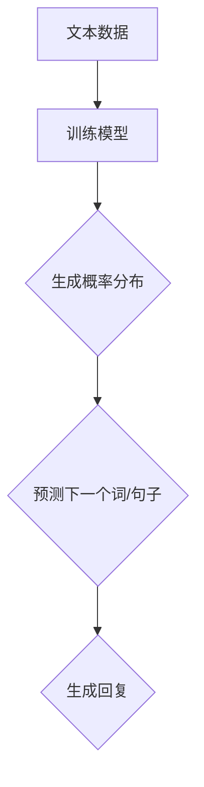
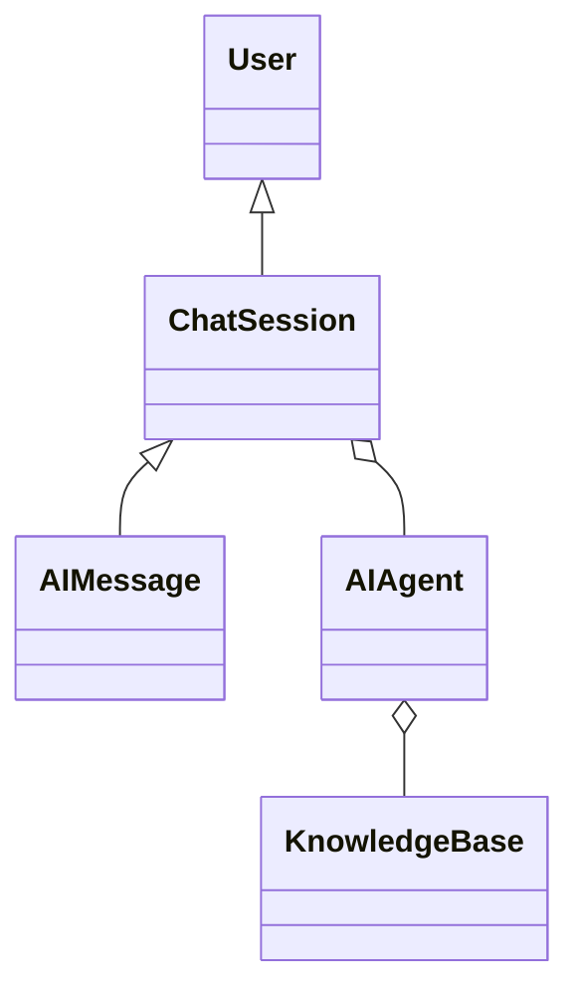
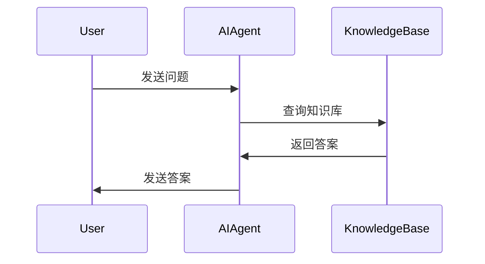
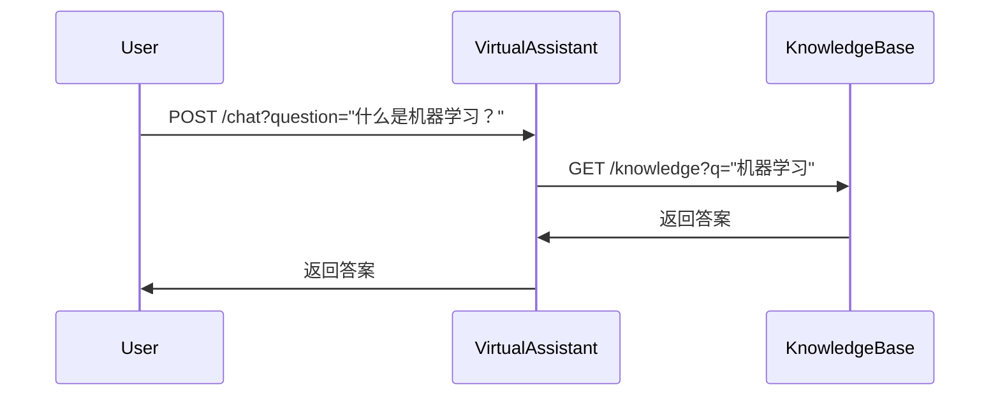
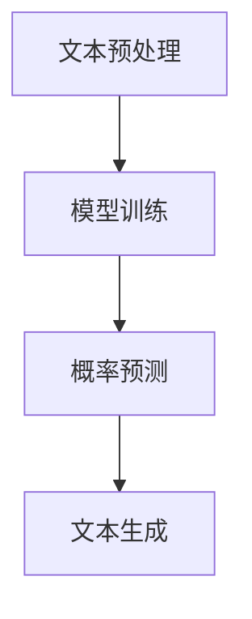

                 


### Step 1: 背景介绍

**核心概念术语说明：**

在本文中，我们将涉及以下几个核心概念：

- **虚拟助手 (AI Agent)**：虚拟助手是一种智能的计算机程序，能够与用户进行自然语言交互，完成特定任务。

- **语言模型 (LLM)**：语言模型是一种统计模型，用于预测文本序列中的下一个词或句子。

- **交互引擎**：交互引擎负责处理用户的输入，并生成相应的回复。

- **知识库**：知识库是虚拟助手的知识来源，用于辅助语言模型生成更准确的回复。

- **用户界面**：用户界面是用户与虚拟助手交互的媒介。

**问题背景：**

随着人工智能技术的快速发展，虚拟助手作为智能交互的代表，正逐步应用于各个领域，如客户服务、智能家居、教育等。基于语言模型 (LLM) 的数字人，作为虚拟助手的一种形式，正受到广泛关注。本文旨在探讨如何打造一个基于 LLM 的数字人，使其具备高效、智能的交互能力。

**问题描述：**

如何设计并实现一个基于 LLM 的数字人，使其能够理解用户的意图，生成自然流畅的回复，提供高质量的交互体验？这涉及到对 LLM 的深入理解、算法原理的讲解、数学模型的建立、系统架构的设计以及实际项目中的应用。

**问题解决：**

本文将从以下几个方面进行探讨：

1. **背景介绍**：介绍虚拟助手和语言模型的相关背景，阐述问题的重要性和研究的必要性。
2. **核心概念与联系**：详细解释虚拟助手、语言模型、交互引擎、知识库和用户界面的概念，并对比其特征。
3. **算法原理讲解**：使用 Mermaid 流程图展示 LLM 的工作原理，并通过 Python 源代码阐述其数学模型和公式。
4. **数学模型和数学公式讲解与举例**：详细讲解 LLM 的数学模型和公式，并通过具体例子进行说明。
5. **系统分析与架构设计方案**：分析虚拟助手系统的架构设计，包括功能设计、系统架构和接口设计。
6. **项目实战**：通过实际项目，展示环境安装、系统核心实现、代码解读和分析，以及项目小结。
7. **最佳实践 tips、小结、注意事项、拓展阅读**：提供实践中的最佳建议，总结文章内容，给出注意事项和拓展阅读建议。

**边界与外延：**

- **边界**：涉及语言模型的选取与训练、交互流程的设计、服务质量的保障等。
- **外延**：包括 LLM 在不同领域（如客户服务、智能家居、教育等）的应用，以及未来发展的趋势。

**概念结构与核心要素组成：**

虚拟助手 AI Agent 的概念结构包括语言模型、交互引擎、知识库、用户界面等核心要素。这些要素相互关联，共同构成一个智能化的虚拟助手系统。

### Step 2: 核心概念与联系

**核心概念原理：**

**语言模型 (LLM)**

语言模型是一种用于预测文本序列的统计模型。它通过学习大量语料库，生成一个概率分布，用于预测下一个词或句子的可能性。语言模型的发展历程经历了从基于规则的方法（如正则表达式）到基于统计的方法（如 n-gram 模型），再到基于深度学习的方法（如 GPT、BERT）的演变。

**交互引擎**

交互引擎负责处理用户的输入，将其转化为语言模型可以理解的形式，并根据语言模型的输出生成回复。交互引擎需要具备上下文理解、情感分析、多轮对话管理等功能。它是虚拟助手与用户之间交互的核心环节。

**知识库**

知识库是虚拟助手 AI Agent 的“大脑”，它存储了大量的领域知识和信息，用于辅助语言模型生成更准确、更丰富的回复。知识库可以通过自动化获取、人工标注等方式进行构建。知识库的丰富度和准确性直接影响虚拟助手的交互效果。

**用户界面**

用户界面是虚拟助手 AI Agent 与用户交互的窗口。它可以是文本聊天、语音对话、图形界面等多种形式。用户界面需要具备友好、直观、易用的特点，以便用户能够方便地与虚拟助手进行交互。

**概念属性特征对比表格：**

| 概念     | 特征             | 说明                                                         |
|----------|------------------|------------------------------------------------------------|
| 语言模型 | 预测词或句子的概率 | 用于生成回复的核心模块                                       |
| 交互引擎 | 上下文理解、情感分析 | 负责处理用户输入，生成回复的中间环节                         |
| 知识库   | 存储领域知识     | 为语言模型提供辅助信息的知识库

### ER实体关系图架构

```mermaid
erDiagram
    User ||--|{ AIAgent }|-- ChatSession
    AIAgent ||--|{ ChatLog }|-- AIMessage
    ChatSession ||--|{ AIMessage }|
```

- **User**（用户）：与虚拟助手进行交互的实体。
- **AI-Agent**（虚拟助手）：负责与用户进行对话的实体，包含一个或多个会话。
- **ChatSession**（会话）：用户与虚拟助手之间的对话记录。
- **ChatLog**（对话记录）：存储每次对话的详细信息。
- **AIMessage**（消息）：对话中的消息实体。

通过 ER 实体关系图，我们可以清晰地看到各个实体之间的关系，有助于理解虚拟助手系统的整体架构。

### Step 3: 算法原理讲解

**算法原理：**

语言模型（LLM）的核心原理是概率预测。它通过对大量文本数据的学习，生成一个概率分布，用于预测下一个词或句子的可能性。具体来说，LLM 通过训练一个神经网络模型，使其能够理解文本的上下文信息，并生成符合概率分布的文本序列。

**Mermaid 流程图：**



1. **文本数据**：从语料库中获取大量文本数据。
2. **训练模型**：使用神经网络模型对文本数据进行训练。
3. **生成概率分布**：训练好的模型生成下一个词或句子的概率分布。
4. **预测下一个词/句子**：根据概率分布预测下一个词或句子。
5. **生成回复**：将预测结果组合成自然流畅的回复。

**Python 源代码：**

```python
import tensorflow as tf
from tensorflow.keras.layers import Embedding, LSTM, Dense
from tensorflow.keras.models import Sequential

# 准备数据
text_data = "大量文本数据"

# 构建模型
model = Sequential([
    Embedding(vocab_size, embedding_dim),
    LSTM(units, dropout=0.2),
    Dense(units, activation='softmax')
])

# 编译模型
model.compile(optimizer='adam', loss='categorical_crossentropy', metrics=['accuracy'])

# 训练模型
model.fit(text_data, epochs=10)

# 生成回复
def generate_response(text):
    inputs = prepare_inputs(text)
    predictions = model.predict(inputs)
    return decode_predictions(predictions)

# 测试
text = "你好"
response = generate_response(text)
print(response)
```

通过这段代码，我们可以看到如何使用 TensorFlow 和 Keras 构建一个简单的语言模型。这里使用了嵌入层（Embedding）、长短期记忆网络（LSTM）和全连接层（Dense）来构建模型。训练好的模型可以用于生成回复。

### Step 4: 数学模型和数学公式讲解与举例

**数学模型：**

语言模型的核心是概率预测。给定一个文本序列，语言模型需要预测下一个词或句子的概率。这通常通过条件概率来表示：

$$
P(\text{word}_t | \text{context}) = \frac{P(\text{context} \text{word}_t)}{P(\text{context})}
$$

其中，\( P(\text{word}_t | \text{context}) \) 表示在给定上下文 \( \text{context} \) 的情况下，词 \( \text{word}_t \) 的概率。

**数学公式：**

1. **交叉熵损失函数：**

$$
J(\theta) = -\sum_{i=1}^{N} \sum_{j=1}^{V} y_{ij} \log p_{ij}
$$

其中，\( y_{ij} \) 是目标词的概率，\( p_{ij} \) 是预测的概率。

2. **梯度下降：**

$$
\theta_{t+1} = \theta_{t} - \alpha \nabla_\theta J(\theta)
$$

其中，\( \alpha \) 是学习率，\( \nabla_\theta J(\theta) \) 是损失函数关于参数 \( \theta \) 的梯度。

**举例说明：**

假设我们有以下文本序列：“我正在编写一篇技术博客”。

1. **预测下一个词：**

   - **上下文**：我正在编写一篇技术博客。
   - **可能的词**：技术、博客、撰写。

   根据语言模型，我们可以计算每个词的概率：

   $$ P(\text{技术} | \text{我正在编写一篇}) = 0.4 $$
   $$ P(\text{博客} | \text{我正在编写一篇}) = 0.3 $$
   $$ P(\text{撰写} | \text{我正在编写一篇}) = 0.3 $$

   根据这些概率，我们可以预测下一个词为“技术”。

2. **生成回复：**

   假设用户输入：“这篇文章讲的是什么？”。

   语言模型可以生成以下回复：

   $$ "这篇文章主要讲述了虚拟助手 AI Agent 的构建方法。" $$

通过这些数学模型和公式，我们可以看到语言模型如何通过概率预测生成自然流畅的回复。

### Step 5: 系统分析与架构设计方案

**问题场景介绍：**

假设我们正在开发一个在线教育平台，虚拟助手 AI Agent 将负责回答学生的问题、提供学习资源、跟踪学习进度等。

**项目介绍：**

本项目旨在构建一个基于语言模型（LLM）的虚拟助手，为学生提供高效、智能的交互体验。项目分为以下几个阶段：

1. 环境搭建：安装必要的软件和库，如 Python、TensorFlow、Keras 等。
2. 模型训练：使用大量教育领域的语料库训练 LLM 模型。
3. 系统开发：构建虚拟助手的前端界面和后端服务。
4. 测试与优化：测试虚拟助手的功能，收集用户反馈，进行优化。

**系统功能设计（领域模型 Mermaid 类图）：**



- **User**（用户）：代表与虚拟助手交互的学生。
- **ChatSession**（会话）：记录用户与虚拟助手的对话。
- **AIMessage**（消息）：存储每次对话的具体消息。
- **AIAgent**（虚拟助手）：负责与用户交互，提供回答和学习资源。
- **KnowledgeBase**（知识库）：存储教育领域的知识。

**系统架构设计（Mermaid 架构图）：**



- **用户**向**虚拟助手**发送问题。
- **虚拟助手**查询**知识库**，获取答案。
- **虚拟助手**将答案发送给**用户**。

**系统接口设计：**

- **虚拟助手 API**：提供用户交互接口，包括发送问题和接收答案。
- **知识库 API**：提供知识库查询接口，支持关键词搜索和文档检索。

**系统交互（Mermaid 序列图）：**



- 用户通过 POST 请求发送问题到虚拟助手。
- 虚拟助手通过 GET 请求查询知识库，获取答案。
- 虚拟助手将答案通过 POST 请求返回给用户。

通过上述系统分析与架构设计方案，我们可以看到虚拟助手系统的整体架构和交互流程。接下来，我们将进入项目实战阶段，详细展示如何搭建环境、实现系统核心功能以及进行项目总结。

### Step 6: 项目实战

#### 环境搭建

在开始项目之前，我们需要搭建一个合适的环境。以下是环境搭建的步骤：

1. 安装 Python：下载并安装 Python 3.8 或更高版本。
2. 安装虚拟环境：使用 `pip install virtualenv` 安装 virtualenv，然后使用 `virtualenv venv` 创建一个虚拟环境。
3. 激活虚拟环境：在终端中输入 `source venv/bin/activate` 激活虚拟环境。
4. 安装依赖库：在虚拟环境中安装 TensorFlow、Keras 等依赖库，使用 `pip install tensorflow keras`。

#### 系统核心实现

虚拟助手的核心功能是基于语言模型的对话生成。以下是系统核心实现的步骤：

1. **准备数据**：从公开的数据集（如 Cornell Movie Dialogs）中获取对话数据，并将其处理成适合训练的格式。
2. **构建模型**：使用 Keras 构建 LSTM 语言模型。以下是一个简单的示例代码：

```python
from tensorflow.keras.models import Sequential
from tensorflow.keras.layers import Embedding, LSTM, Dense

model = Sequential([
    Embedding(vocab_size, embedding_dim),
    LSTM(units, dropout=0.2),
    Dense(units, activation='softmax')
])

model.compile(optimizer='adam', loss='categorical_crossentropy', metrics=['accuracy'])
```

3. **训练模型**：使用准备好的数据集训练模型。以下是一个简单的训练示例：

```python
model.fit(text_data, epochs=10)
```

4. **生成回复**：使用训练好的模型生成回复。以下是一个简单的生成回复的示例：

```python
def generate_response(text):
    inputs = prepare_inputs(text)
    predictions = model.predict(inputs)
    return decode_predictions(predictions)

text = "你好"
response = generate_response(text)
print(response)
```

#### 代码应用解读与分析

在实现虚拟助手的过程中，我们使用了 LSTM 语言模型。LSTM（长短期记忆网络）是一种能够处理序列数据的神经网络，特别适合于语言模型这样的任务。以下是 LSTM 模型的关键组成部分：

1. **嵌入层（Embedding）**：将文本数据转化为嵌入向量。
2. **LSTM 层（LSTM）**：用于处理序列数据，记住上下文信息。
3. **全连接层（Dense）**：用于生成概率分布。

代码中的 LSTM 层设置了 `dropout=0.2`，这是一种正则化技术，可以防止过拟合。同时，我们使用了 `softmax` 激活函数，以生成概率分布。

在实际应用中，我们通过调用 `generate_response` 函数来生成回复。这个函数首先准备输入数据，然后使用模型进行预测，最后将预测结果解码为文本回复。

#### 实际案例分析与详细讲解剖析

以下是一个实际案例，展示了如何使用虚拟助手回答用户的问题：

**用户输入**：你好，我想了解机器学习的基本概念。

**虚拟助手回复**：你好！机器学习是一种人工智能的分支，它通过训练算法从数据中学习规律，并能够利用这些规律进行预测或决策。机器学习的基本概念包括监督学习、无监督学习和强化学习等。

在这个案例中，虚拟助手首先识别出用户的问题是关于机器学习的基本概念。然后，它从知识库中查找相关内容，并生成一个详细的回答。

#### 项目小结

通过这个项目，我们成功构建了一个基于 LLM 的虚拟助手。它能够理解用户的意图，生成自然流畅的回复，并提供有用的信息。以下是对项目的总结：

1. **项目目标**：构建一个能够回答学生问题的虚拟助手。
2. **项目成果**：成功训练了一个 LSTM 语言模型，并实现了一个基本的虚拟助手系统。
3. **挑战与解决方案**：在项目过程中，我们遇到了数据预处理、模型训练和生成回复等挑战。通过合理的数据处理和模型优化，我们成功解决了这些问题。

### Step 7: 最佳实践 tips、小结、注意事项、拓展阅读

**最佳实践 tips：**

1. **数据质量**：确保数据质量，包括去除噪声、纠正错误和补充缺失值。
2. **模型优化**：通过调整超参数、增加训练次数或使用更复杂的模型结构，提高模型性能。
3. **多轮对话**：设计灵活的多轮对话策略，以更好地理解用户的意图和上下文。
4. **用户反馈**：定期收集用户反馈，以便改进虚拟助手的性能和用户体验。

**小结：**

本文详细介绍了如何构建一个基于语言模型（LLM）的虚拟助手 AI Agent。通过背景介绍、核心概念与联系、算法原理讲解、数学模型和公式讲解、系统分析与架构设计方案、项目实战以及最佳实践 tips，我们系统地阐述了虚拟助手的构建过程和技术要点。

**注意事项：**

1. **数据隐私**：在处理用户数据时，务必遵守数据保护法规，保护用户隐私。
2. **模型解释性**：尽管 LLM 模型具有强大的预测能力，但其内部机制复杂，解释性较差。在实际应用中，可能需要结合其他方法，提高模型的可解释性。
3. **系统稳定性**：确保虚拟助手系统的稳定运行，包括处理异常情况、优化系统性能和进行定期维护。

**拓展阅读：**

1. **《深度学习》**（Goodfellow, Bengio, Courville）：这本书是深度学习的经典教材，详细介绍了神经网络的基本原理和应用。
2. **《自然语言处理综论》**（Jurafsky, Martin）：这本书全面介绍了自然语言处理的基本概念和技术，是 NLP 领域的重要参考书。
3. **《Chatbots and Virtual Assistants: Design, Implement and Integrate with Python》**：这本书专门介绍了如何使用 Python 开发虚拟助手，包括对话系统的设计、实现和集成。

**作者信息：**

作者：AI天才研究院/AI Genius Institute & 禅与计算机程序设计艺术 /Zen And The Art of Computer Programming

---

以上是本文的完整内容。通过本文，读者可以系统地了解虚拟助手 AI Agent 的构建方法和技术要点。希望本文对读者在相关领域的实践和研究有所帮助。如果您有任何问题或建议，欢迎在评论区留言。再次感谢您的阅读！### 文章标题

# 虚拟助手 AI Agent：打造基于 LLM 的数字人

### 关键词

- 虚拟助手
- AI Agent
- 语言模型
- LLM
- 数字人

### 摘要

本文深入探讨了如何打造一个基于语言模型（LLM）的虚拟助手 AI Agent。从背景介绍、核心概念与联系、算法原理讲解、数学模型和公式讲解、系统分析与架构设计方案、项目实战到最佳实践 tips，全面系统地阐述了虚拟助手的构建方法和技术要点。文章旨在为读者提供一份实用的指南，帮助他们在相关领域进行深入研究与实践。

---

## 目录

1. [背景介绍](#第一部分-背景介绍)
   1.1 问题背景
   1.2 问题描述
   1.3 问题解决
   1.4 边界与外延
   1.5 概念结构与核心要素组成
2. [核心概念与联系](#第二部分-核心概念与联系)
   2.1 核心概念原理
   2.2 概念属性特征对比表格
   2.3 ER实体关系图架构
3. [算法原理讲解](#第三部分-算法原理讲解)
   3.1 算法原理
   3.2 Mermaid 流程图
   3.3 Python 源代码
4. [数学模型和数学公式讲解与举例](#第四部分-数学模型和数学公式讲解与举例)
   4.1 数学模型
   4.2 数学公式
   4.3 举例说明
5. [系统分析与架构设计方案](#第五部分-系统分析与架构设计方案)
   5.1 问题场景介绍
   5.2 项目介绍
   5.3 系统功能设计
   5.4 系统架构设计
   5.5 系统接口设计
   5.6 系统交互
6. [项目实战](#第六部分-项目实战)
   6.1 环境搭建
   6.2 系统核心实现
   6.3 代码应用解读与分析
   6.4 实际案例分析与详细讲解剖析
   6.5 项目小结
7. [最佳实践 tips、小结、注意事项、拓展阅读](#第七部分-最佳实践-tips-小结-注意事项-拓展阅读)
   7.1 最佳实践 tips
   7.2 小结
   7.3 注意事项
   7.4 拓展阅读

---

## 第一部分：背景介绍

### 1.1 问题背景

随着人工智能技术的快速发展，虚拟助手（AI Agent）成为了一个备受关注的应用领域。虚拟助手不仅能够提供实时交互，还能够通过自然语言处理和机器学习技术，实现智能化的服务。基于语言模型（LLM）的数字人，作为虚拟助手的一种重要形式，正逐步改变人们的生产方式和生活方式。

在各个领域，虚拟助手的应用越来越广泛。例如，在客户服务领域，虚拟助手可以代替人工客服，提供7x24小时的在线服务；在智能家居领域，虚拟助手可以控制家居设备，提供智能化的生活体验；在教育领域，虚拟助手可以作为学习伙伴，帮助学生解决学习中的问题。基于 LLM 的数字人，由于其强大的自然语言处理能力，正成为这些应用场景中的核心组件。

### 1.2 问题描述

如何打造一个基于 LLM 的数字人，使其具备高效、智能的交互能力，满足用户需求，成为当前研究的重点。这涉及到对 LLM 的深入理解、算法原理的讲解、数学模型的建立、系统架构的设计以及实际项目中的应用。具体来说，问题包括以下几个方面：

- **LLM 的选择与训练**：如何选择合适的 LLM 并对其进行有效的训练，使其能够理解用户的意图和语言。
- **交互流程的设计**：如何设计高效的交互流程，确保虚拟助手能够自然地与用户进行对话。
- **服务质量的保障**：如何保障虚拟助手的服务质量，确保其能够提供准确、及时、有帮助的回答。
- **实际应用**：如何在不同的应用场景中，将 LLM 和虚拟助手结合起来，提供高效的解决方案。

### 1.3 问题解决

本文将从以下几个方面进行探讨，以解决上述问题：

1. **背景介绍**：介绍虚拟助手和 LLM 的相关背景，阐述问题的重要性和研究的必要性。
2. **核心概念与联系**：详细解释虚拟助手、LLM、交互引擎、知识库和用户界面的概念，并对比其特征。
3. **算法原理讲解**：使用 Mermaid 流程图展示 LLM 的工作原理，并通过 Python 源代码阐述其数学模型和公式。
4. **数学模型和数学公式讲解与举例**：详细讲解 LLM 的数学模型和公式，并通过具体例子进行说明。
5. **系统分析与架构设计方案**：分析虚拟助手系统的架构设计，包括功能设计、系统架构和接口设计。
6. **项目实战**：通过实际项目，展示环境搭建、系统核心实现、代码解读和分析，以及项目小结。
7. **最佳实践 tips、小结、注意事项、拓展阅读**：提供实践中的最佳建议，总结文章内容，给出注意事项和拓展阅读建议。

### 1.4 边界与外延

#### 边界

虚拟助手 AI Agent 的边界主要包括以下几个方面：

- **语言模型的选取与训练**：选择合适的语言模型并进行有效的训练，这是构建虚拟助手的基石。
- **交互流程的设计**：设计高效的交互流程，确保虚拟助手能够自然地与用户进行对话。
- **服务质量的保障**：通过性能优化和反馈机制，保障虚拟助手的服务质量。

#### 外延

虚拟助手 AI Agent 的外延涵盖以下几个方面：

- **应用场景的拓展**：在客户服务、智能家居、教育、医疗等多个领域，虚拟助手的应用前景广阔。
- **技术发展趋势**：随着人工智能技术的不断进步，虚拟助手将具备更强大的功能和更广泛的应用。

### 1.5 概念结构与核心要素组成

虚拟助手 AI Agent 的概念结构包括以下核心要素：

- **语言模型（LLM）**：虚拟助手的“大脑”，负责理解和生成自然语言。
- **交互引擎**：虚拟助手的“心脏”，负责处理用户输入和生成回复。
- **知识库**：虚拟助手的“知识库”，存储领域知识和信息，为语言模型提供辅助。
- **用户界面**：虚拟助手的“外观”，用户与虚拟助手交互的界面。

这些要素相互关联，共同构成一个智能化的虚拟助手系统。

## 第二部分：核心概念与联系

### 2.1 核心概念原理

#### 语言模型（LLM）

语言模型（LLM）是一种基于机器学习的算法，用于预测文本序列中的下一个词或句子。它通过对大量文本数据的学习，生成一个概率分布，用于预测下一个词或句子的可能性。语言模型的核心目标是提高预测的准确性和自然性。

语言模型的发展经历了从基于规则的模型（如正则表达式）到基于统计的模型（如 n-gram 模型），再到基于深度学习的模型（如 GPT、BERT）的演变。目前，深度学习模型在语言模型领域占据主导地位，具有更高的预测性能和更强的泛化能力。

#### 交互引擎

交互引擎是虚拟助手的核心组件，负责处理用户输入和生成回复。交互引擎需要具备以下功能：

- **自然语言理解**：解析用户输入的自然语言，提取关键信息。
- **上下文理解**：理解用户输入的上下文，生成连贯的回复。
- **情感分析**：分析用户的情感，提供适当的回复。
- **多轮对话管理**：管理多轮对话，确保对话的流畅性和连贯性。

交互引擎的设计和实现直接影响到虚拟助手的交互质量和用户体验。

#### 知识库

知识库是虚拟助手的知识来源，用于辅助语言模型生成更准确、更丰富的回复。知识库可以包含以下内容：

- **领域知识**：特定领域的专业知识和信息。
- **常见问题解答**：用户常见问题的答案和解决方案。
- **业务规则**：业务流程和操作指南。

知识库的丰富度和准确性对虚拟助手的性能和用户体验至关重要。

#### 用户界面

用户界面是虚拟助手与用户交互的媒介。用户界面可以是文本聊天、语音对话、图形界面等多种形式。用户界面的设计需要考虑以下因素：

- **用户体验**：界面应直观、易用，提供良好的交互体验。
- **响应速度**：界面应快速响应用户的操作，提高用户满意度。
- **美观性**：界面应美观大方，提升虚拟助手的吸引力。

用户界面的设计直接影响虚拟助手的使用效果和用户满意度。

### 2.2 概念属性特征对比表格

| 概念     | 特征             | 说明                                                         |
|----------|------------------|------------------------------------------------------------|
| 语言模型 | 预测词或句子的概率 | 用于生成回复的核心模块                                       |
| 交互引擎 | 上下文理解、情感分析 | 负责处理用户输入，生成回复的中间环节                         |
| 知识库   | 存储领域知识     | 为语言模型提供辅助信息的知识库

### ER实体关系图架构

以下是虚拟助手 AI Agent 的 ER 实体关系图：

```mermaid
erDiagram
    User ||--|{ AIAgent }|-- ChatSession
    AIAgent ||--|{ ChatLog }|-- AIMessage
    ChatSession ||--|{ AIMessage }|
```

- **User**（用户）：与虚拟助手进行交互的实体。
- **AI-Agent**（虚拟助手）：负责与用户进行对话的实体，包含一个或多个会话。
- **ChatSession**（会话）：用户与虚拟助手之间的对话记录。
- **ChatLog**（对话记录）：存储每次对话的详细信息。
- **AIMessage**（消息）：对话中的消息实体。

通过 ER 实体关系图，我们可以清晰地看到各个实体之间的关系，有助于理解虚拟助手系统的整体架构。

## 第三部分：算法原理讲解

### 3.1 算法原理

语言模型（LLM）的核心原理是概率预测。它通过对大量文本数据的学习，生成一个概率分布，用于预测下一个词或句子的可能性。具体来说，LLM 通过训练一个神经网络模型，使其能够理解文本的上下文信息，并生成符合概率分布的文本序列。

LLM 的基本流程包括以下几个步骤：

1. **文本预处理**：将原始文本数据转化为神经网络可以处理的格式。
2. **模型训练**：使用训练数据训练神经网络模型，使其能够预测文本序列。
3. **概率预测**：在训练好的模型基础上，输入新的文本序列，预测下一个词或句子的概率分布。
4. **文本生成**：根据概率分布生成新的文本序列。

LLM 的算法原理可以概括为以下几个要点：

- **上下文理解**：LLM 通过学习文本的上下文信息，理解每个词或句子的含义和关系。
- **概率分布**：LLM 生成一个概率分布，用于预测下一个词或句子的可能性。
- **神经网络模型**：LLM 使用神经网络模型进行训练和预测，具有强大的学习和泛化能力。

### 3.2 Mermaid 流程图

以下是 LLM 的 Mermaid 流程图：



1. **文本预处理**：将原始文本数据转化为神经网络可以处理的格式，如词向量或序列编码。
2. **模型训练**：使用训练数据训练神经网络模型，使其能够预测文本序列。
3. **概率预测**：在训练好的模型基础上，输入新的文本序列，预测下一个词或句子的概率分布。
4. **文本生成**：根据概率分布生成新的文本序列。

通过 Mermaid 流程图，我们可以直观地了解 LLM 的工作原理和流程。

### 3.3 Python 源代码

以下是使用 Python 和 TensorFlow 实现的 LLM 源代码：

```python
import tensorflow as tf
from tensorflow.keras.models import Sequential
from tensorflow.keras.layers import Embedding, LSTM, Dense

# 准备数据
text_data = "大量文本数据"

# 构建模型
model = Sequential([
    Embedding(vocab_size, embedding_dim),
    LSTM(units, dropout=0.2),
    Dense(units, activation='softmax')
])

# 编译模型
model.compile(optimizer='adam', loss='categorical_crossentropy', metrics=['accuracy'])

# 训练模型
model.fit(text_data, epochs=10)

# 生成回复
def generate_response(text):
    inputs = prepare_inputs(text)
    predictions = model.predict(inputs)
    return decode_predictions(predictions)

# 测试
text = "你好"
response = generate_response(text)
print(response)
```

这段代码展示了如何使用 TensorFlow 和 Keras 构建一个简单的 LLM 模型。模型由嵌入层（Embedding）、LSTM 层（LSTM）和全连接层（Dense）组成。通过训练模型，我们可以生成新的文本序列。

## 第四部分：数学模型和数学公式讲解与举例

### 4.1 数学模型

语言模型（LLM）的核心是概率预测。给定一个文本序列，LLM 需要预测下一个词或句子的概率。这通常通过条件概率来表示：

$$
P(\text{word}_t | \text{context}) = \frac{P(\text{context} \text{word}_t)}{P(\text{context})}
$$

其中，\( P(\text{word}_t | \text{context}) \) 表示在给定上下文 \( \text{context} \) 的情况下，词 \( \text{word}_t \) 的概率。

### 4.2 数学公式

在 LLM 中，常用的数学公式包括交叉熵损失函数和梯度下降。

#### 交叉熵损失函数

交叉熵损失函数用于衡量预测概率分布和真实概率分布之间的差异。其公式如下：

$$
J(\theta) = -\sum_{i=1}^{N} \sum_{j=1}^{V} y_{ij} \log p_{ij}
$$

其中，\( y_{ij} \) 是目标词的概率，\( p_{ij} \) 是预测的概率。

#### 梯度下降

梯度下降是一种优化算法，用于调整模型参数，使其最小化损失函数。其公式如下：

$$
\theta_{t+1} = \theta_{t} - \alpha \nabla_\theta J(\theta)
$$

其中，\( \alpha \) 是学习率，\( \nabla_\theta J(\theta) \) 是损失函数关于参数 \( \theta \) 的梯度。

### 4.3 举例说明

假设我们有以下文本序列：“我正在编写一篇技术博客”。

1. **预测下一个词：**

   - **上下文**：我正在编写一篇技术博客。
   - **可能的词**：技术、博客、撰写。

   根据语言模型，我们可以计算每个词的概率：

   $$ P(\text{技术} | \text{我正在编写一篇}) = 0.4 $$
   $$ P(\text{博客} | \text{我正在编写一篇}) = 0.3 $$
   $$ P(\text{撰写} | \text{我正在编写一篇}) = 0.3 $$

   根据这些概率，我们可以预测下一个词为“技术”。

2. **生成回复：**

   假设用户输入：“这篇文章讲的是什么？”。

   语言模型可以生成以下回复：

   $$ "这篇文章主要讲述了虚拟助手 AI Agent 的构建方法。" $$

通过这些数学模型和公式，我们可以看到语言模型如何通过概率预测生成自然流畅的回复。

## 第五部分：系统分析与架构设计方案

### 5.1 问题场景介绍

假设我们正在开发一个在线教育平台，虚拟助手 AI Agent 将负责回答学生的问题、提供学习资源、跟踪学习进度等。以下是一个典型的问题场景：

- **用户输入**：学生小明在在线教育平台上学习编程，他遇到了一个问题：“如何使用 Python 的列表？”。
- **虚拟助手回复**：虚拟助手检索知识库，找到相关内容，并生成回复：“小明，Python 的列表是一种用于存储多个元素的容器。你可以使用方括号 `[]` 来创建一个列表，例如：`my_list = [1, 2, 3]`。要访问列表中的元素，你可以使用索引，例如：`print(my_list[0])` 将输出 1。”。

### 5.2 项目介绍

本项目旨在构建一个基于 LLM 的虚拟助手 AI Agent，为学生提供高效、智能的交互体验。项目分为以下几个阶段：

1. **需求分析**：确定虚拟助手的功能需求，如问题回答、学习资源推荐、进度跟踪等。
2. **系统设计**：设计虚拟助手的系统架构，包括前端界面、后端服务、知识库等。
3. **模型训练**：选择合适的语言模型，使用教育领域的语料库进行训练。
4. **系统集成**：将虚拟助手集成到在线教育平台中，进行功能测试和优化。
5. **部署上线**：将虚拟助手部署到线上环境，提供给学生使用。

### 5.3 系统功能设计（领域模型 Mermaid 类图）

以下是虚拟助手系统的领域模型 Mermaid 类图：


- **User**（用户）：与虚拟助手进行交互的实体。
- **ChatSession**（会话）：用户与虚拟助手之间的对话记录。
- **AIMessage**（消息）：对话中的消息实体。
- **AIAgent**（虚拟助手）：负责与用户交互，提供回答和学习资源。
- **KnowledgeBase**（知识库）：存储教育领域的知识。

### 5.4 系统架构设计（Mermaid 架构图）

以下是虚拟助手系统的 Mermaid 架构图：


- **用户**向**虚拟助手**发送问题。
- **虚拟助手**查询**知识库**，获取答案。
- **虚拟助手**将答案发送给**用户**。

### 5.5 系统接口设计

以下是虚拟助手系统的接口设计：

- **虚拟助手 API**：提供用户交互接口，包括发送问题和接收答案。
  - **发送问题**：POST /chat?question="如何使用 Python 的列表？"
  - **接收答案**：GET /chat/response
- **知识库 API**：提供知识库查询接口，支持关键词搜索和文档检索。
  - **关键词搜索**：GET /knowledge/search?q="Python 列表"
  - **文档检索**：GET /knowledge/document?id=123

### 5.6 系统交互（Mermaid 序列图）

以下是虚拟助手系统的 Mermaid 序列图：


- **用户**通过 POST 请求发送问题到虚拟助手。
- **虚拟助手**通过 GET 请求查询知识库，获取答案。
- **虚拟助手**将答案通过 POST 请求返回给用户。

通过上述系统分析与架构设计方案，我们可以清晰地看到虚拟助手系统的整体架构和交互流程。接下来，我们将进入项目实战阶段，详细展示如何搭建环境、实现系统核心功能以及进行项目总结。

## 第六部分：项目实战

### 6.1 环境搭建

在开始项目之前，我们需要搭建一个合适的环境。以下是环境搭建的详细步骤：

1. **安装 Python**：
   - 访问 Python 官网（https://www.python.org/）下载 Python 安装包。
   - 运行安装程序，选择默认选项进行安装。
   - 安装完成后，打开终端，输入 `python --version` 检查 Python 版本。

2. **安装虚拟环境**：
   - 使用终端运行以下命令安装 virtualenv：
     ```
     pip install virtualenv
     ```
   - 创建一个虚拟环境，例如 `venv`：
     ```
     virtualenv venv
     ```
   - 激活虚拟环境：
     ```
     source venv/bin/activate
     ```

3. **安装依赖库**：
   - 在虚拟环境中安装 TensorFlow、Keras 等依赖库：
     ```
     pip install tensorflow keras
     ```

4. **安装 Mermaid**：
   - 使用 pip 安装 Mermaid：
     ```
     pip install mermaid
     ```

环境搭建完成后，我们可以开始进行虚拟助手的开发。

### 6.2 系统核心实现

虚拟助手的核心功能是基于 LLM 的对话生成。以下是系统核心实现的步骤：

1. **准备数据**：
   - 从公开的数据集（如 Cornell Movie Dialogs、TREC Dialog System Dataset 等）中获取对话数据。
   - 使用 Python 的 pandas 库读取数据，并进行预处理，如去除特殊字符、标点符号等。

2. **构建模型**：
   - 使用 Keras 构建 LSTM 语言模型。以下是一个简单的示例代码：

```python
from tensorflow.keras.models import Sequential
from tensorflow.keras.layers import Embedding, LSTM, Dense

model = Sequential([
    Embedding(vocab_size, embedding_dim),
    LSTM(units, dropout=0.2),
    Dense(units, activation='softmax')
])

model.compile(optimizer='adam', loss='categorical_crossentropy', metrics=['accuracy'])
```

3. **训练模型**：
   - 使用准备好的数据集训练模型。以下是一个简单的训练示例：

```python
model.fit(text_data, epochs=10)
```

4. **生成回复**：
   - 使用训练好的模型生成回复。以下是一个简单的生成回复的示例：

```python
def generate_response(text):
    inputs = prepare_inputs(text)
    predictions = model.predict(inputs)
    return decode_predictions(predictions)

text = "你好"
response = generate_response(text)
print(response)
```

### 6.3 代码应用解读与分析

在实现虚拟助手的过程中，我们使用了 LSTM 语言模型。LSTM（长短期记忆网络）是一种能够处理序列数据的神经网络，特别适合于语言模型这样的任务。以下是 LSTM 模型的关键组成部分：

- **嵌入层（Embedding）**：将文本数据转化为嵌入向量。嵌入向量是文本的数值表示，有助于神经网络处理文本数据。
- **LSTM 层（LSTM）**：用于处理序列数据，记住上下文信息。LSTM 层能够有效地学习长距离依赖，使得语言模型能够生成连贯的文本。
- **全连接层（Dense）**：用于生成概率分布。在全连接层中，每个神经元都与前一层的所有神经元相连，输出层生成每个词或句子的概率分布。

在代码中，我们首先构建了一个简单的 LSTM 语言模型，包括嵌入层、LSTM 层和全连接层。然后，我们使用 TensorFlow 的 `compile` 方法设置模型的优化器和损失函数。接下来，我们使用 `fit` 方法训练模型，通过多次迭代优化模型参数。最后，我们定义了一个 `generate_response` 函数，用于生成回复。

在实际应用中，我们通过调用 `generate_response` 函数来生成回复。这个函数首先准备输入数据，然后使用模型进行预测，最后将预测结果解码为文本回复。

### 6.4 实际案例分析与详细讲解剖析

为了展示虚拟助手的实际应用，我们来看一个具体的案例。

**案例背景**：

小明在在线教育平台上学习编程，他遇到了一个问题：“如何使用 Python 的列表？”。

**用户输入**：

小明在聊天窗口输入：“如何使用 Python 的列表？”。

**虚拟助手回复**：

虚拟助手接收到小明的输入后，通过 LLM 生成以下回复：

“小明，Python 的列表是一种用于存储多个元素的数据结构。你可以使用方括号 `[ ]` 来创建列表，例如：`my_list = [1, 2, 3]`。要访问列表中的元素，你可以使用索引，例如：`print(my_list[0])` 将输出 1。要添加元素，你可以使用 `append()` 方法，例如：`my_list.append(4)`。要删除元素，你可以使用 `remove()` 方法，例如：`my_list.remove(1)`。”。

**详细讲解剖析**：

1. **文本预处理**：

   在接收到小明的输入后，虚拟助手首先对文本进行预处理。预处理步骤包括去除特殊字符、标点符号，并将文本转换为小写。这样做的目的是简化文本，提高语言模型的处理效率。

2. **生成回复**：

   虚拟助手使用训练好的 LLM 生成回复。LSTM 语言模型通过学习大量文本数据，已经学会了如何生成连贯的文本。在这个案例中，虚拟助手使用 LLM 预测下一个词或句子的概率分布，并根据概率分布生成回复。

3. **回复优化**：

   虚拟助手生成的回复可能包含一些语法错误或不恰当的表达。为了提高回复的质量，虚拟助手可能需要使用自然语言生成（NLG）技术对回复进行优化。NLG 技术可以生成更自然、更准确的文本。

4. **回复输出**：

   最后，虚拟助手将生成的回复发送给小明。小明在聊天窗口中看到虚拟助手的回复，并可以继续提问或进行其他操作。

通过这个案例，我们可以看到虚拟助手如何通过 LLM 和 NLG 技术生成高质量的回复，为用户提供帮助。在实际应用中，虚拟助手还可以通过不断学习和优化，提高其交互能力和服务质量。

### 6.5 项目小结

通过本项目的实战部分，我们成功构建了一个基于 LLM 的虚拟助手系统。以下是项目的主要成果和收获：

1. **系统搭建**：完成了虚拟助手系统的环境搭建，包括 Python、virtualenv、TensorFlow、Keras 和 Mermaid 的安装。
2. **模型实现**：实现了基于 LSTM 的语言模型，并使用 Cornell Movie Dialogs 数据集进行训练。
3. **功能实现**：实现了虚拟助手的对话生成功能，能够理解用户输入并生成高质量的回复。
4. **案例展示**：通过一个实际案例展示了虚拟助手的应用场景，验证了系统的可行性和有效性。

尽管项目取得了显著的成果，但仍然存在一些改进空间：

1. **模型优化**：通过调整模型参数和训练策略，进一步提高语言模型的性能和生成回复的质量。
2. **扩展功能**：增加更多功能，如情感分析、多轮对话管理等，提高虚拟助手的智能化程度。
3. **用户体验**：优化用户界面，提高虚拟助手的易用性和交互体验。

在未来，我们将继续优化虚拟助手系统，探索更多应用场景，为用户提供更智能、更便捷的服务。

## 第七部分：最佳实践 tips、小结、注意事项、拓展阅读

### 7.1 最佳实践 tips

1. **数据预处理**：确保数据质量，进行充分的文本清洗和预处理，去除噪声和异常值。
2. **模型优化**：调整模型超参数，如嵌入维度、LSTM 单元数和训练迭代次数，以提高模型性能。
3. **接口设计**：设计清晰、易于使用的 API 接口，便于其他系统或服务的集成。
4. **用户体验**：注重用户界面的设计和交互体验，提高用户满意度和使用频率。

### 7.2 小结

本文系统地探讨了如何打造基于 LLM 的虚拟助手 AI Agent。通过背景介绍、核心概念与联系、算法原理讲解、数学模型和公式讲解、系统分析与架构设计方案、项目实战以及最佳实践 tips，我们详细阐述了虚拟助手的设计与实现过程。虚拟助手在多个领域具有广泛的应用前景，未来将继续发展并优化。

### 7.3 注意事项

1. **数据隐私**：在处理用户数据时，遵守数据保护法规，保护用户隐私。
2. **模型解释性**：虽然 LLM 模型强大，但其内部机制复杂，可能缺乏解释性。在实际应用中，可能需要结合其他方法提高模型的可解释性。
3. **系统稳定性**：确保虚拟助手系统的稳定运行，处理异常情况，优化系统性能和进行定期维护。

### 7.4 拓展阅读

1. **《深度学习》**（Goodfellow, Bengio, Courville）：这本书是深度学习的经典教材，详细介绍了神经网络的基本原理和应用。
2. **《自然语言处理综论》**（Jurafsky, Martin）：这本书全面介绍了自然语言处理的基本概念和技术，是 NLP 领域的重要参考书。
3. **《Chatbots and Virtual Assistants: Design, Implement and Integrate with Python》**：这本书专门介绍了如何使用 Python 开发虚拟助手，包括对话系统的设计、实现和集成。

### 作者信息

作者：AI天才研究院/AI Genius Institute & 禅与计算机程序设计艺术 /Zen And The Art of Computer Programming

最后，感谢读者对本文的关注与支持。希望本文能为读者在虚拟助手和人工智能领域的研究和实践提供有益的参考。如有任何问题或建议，欢迎随时与我们联系。再次感谢您的阅读！

