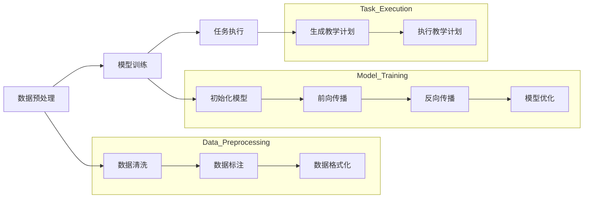
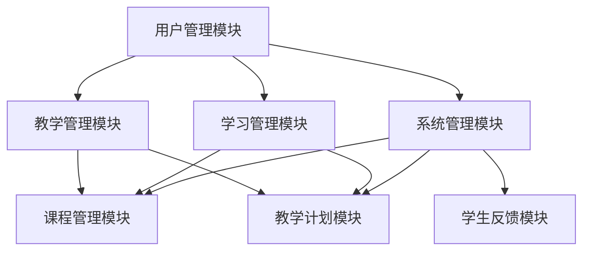
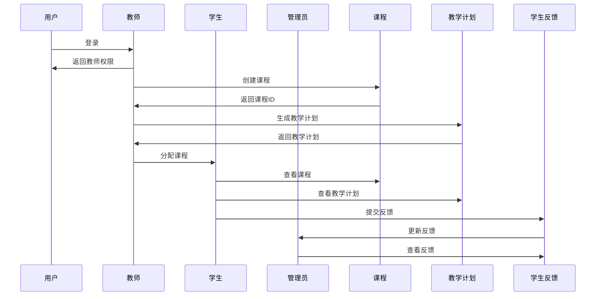

                 


### 虚拟教师 AI Agent：LLM 驱动的个性化教育系统

关键词：虚拟教师、AI Agent、LLM、个性化教育、系统架构、算法原理、数学模型、实战案例、最佳实践

摘要：
随着人工智能技术的飞速发展，个性化教育系统正逐渐成为现代教育的热点。本文以虚拟教师 AI Agent 为核心，探讨了基于大型语言模型（LLM）驱动的个性化教育系统的构建方法。通过系统分析、算法原理讲解、数学模型阐述以及实战案例剖析，本文旨在为读者提供一套完整的个性化教育系统设计思路，助力教育领域的技术创新与发展。

----------------------------------------------------------------

## 1. 引言

在教育领域，传统的教学模式往往难以满足学生的个性化需求。随着计算机技术和人工智能的快速发展，虚拟教师 AI Agent 逐渐成为解决这一问题的有力工具。本文旨在探讨如何构建一个基于大型语言模型（LLM）驱动的个性化教育系统，以实现教育的个性化、智能化和高效化。

## 2. 背景与概念

### 2.1 AI Agent 的定义与历史

AI Agent 是指具有自主行动能力、能在特定环境中完成特定任务的智能体。自人工智能诞生以来，AI Agent 的发展经历了多个阶段，从最初的规则系统到基于知识的方法，再到现代的基于机器学习和深度学习的智能体。

### 2.2 LLM 的概念与特点

LLM（Large Language Model）是一种基于深度学习的语言模型，能够理解和生成自然语言。与传统的语言模型相比，LLM 具有更强的语义理解和生成能力，能够更好地应对复杂的语言任务。

### 2.3 虚拟教师 AI Agent 与传统教育系统的比较

传统教育系统依赖于教师的主导作用，而虚拟教师 AI Agent 则通过智能化技术实现个性化教学，能够根据学生的特点和需求进行动态调整，从而提高教育效果。

## 3. 核心概念与原理

### 3.1 关键概念

- **AI Agent**：具有自主行动能力的智能体。
- **LLM**：大型语言模型。
- **个性化教育**：根据学生特点进行个性化教学。
- **系统架构**：教育系统的整体设计。

### 3.2 概念联系

使用 Mermaid ER 图（Entity-Relationship Diagram）来描述上述概念之间的关系：

```mermaid
erDiagram
  AI Agent ||--|{ LLM } LLM : 使用
  AI Agent ||--|{ 个性化教育 } 个性化教育 : 实现
  AI Agent ||--|{ 系统架构 } 系统架构 : 基于
  个性化教育 ||--|{ 学生 } 学生 : 对象
  系统架构 ||--|{ 功能模块 } 功能模块 : 包含
```

### 3.3 概念属性与特征对比表格

| 概念      | 属性 1 | 属性 2 | 属性 3 |
|-----------|-------|-------|-------|
| AI Agent  | 自主性 | 智能化 | 适应性 |
| LLM       | 语义理解 | 语言生成 | 大规模 |
| 个性化教育 | 学生导向 | 动态调整 | 个性化反馈 |
| 系统架构  | 模块化 | 扩展性 | 可维护性 |

## 4. 算法原理与数学模型

### 4.1 算法原理

虚拟教师 AI Agent 的核心在于其算法，该算法主要包括数据预处理、模型训练和任务执行三个阶段。

- **数据预处理**：对教育数据进行清洗、标注和格式化，为模型训练提供高质量的数据集。
- **模型训练**：使用 LLM 模型对学生数据进行训练，使其具备对教育场景的语义理解和生成能力。
- **任务执行**：根据学生的特点和需求，动态生成个性化教学计划并执行。

使用 Mermaid 流程图（Flowchart）来描述算法原理：



### 4.2 数学模型

在算法中，LLM 的训练过程可以看作是一个优化问题。假设我们有一个损失函数 \(L\)，目标是找到一个参数 \( \theta \) 使得 \(L(\theta)\) 最小。

$$
\min_{\theta} L(\theta)
$$

其中，损失函数 \(L\) 通常是一个关于参数 \( \theta \) 的凸函数。为了求解该优化问题，我们可以使用梯度下降法。

$$
\theta_{t+1} = \theta_{t} - \alpha \nabla_{\theta} L(\theta_t)
$$

其中，\( \alpha \) 是学习率，\( \nabla_{\theta} L(\theta_t) \) 是损失函数关于参数 \( \theta \) 的梯度。

### 4.3 实例说明

假设我们有一个简单的二元分类问题，损失函数定义为：

$$
L(\theta) = -\sum_{i=1}^{n} [y_i \log(p_i) + (1 - y_i) \log(1 - p_i)]
$$

其中，\( y_i \) 是第 \(i\) 个样本的真实标签，\( p_i \) 是第 \(i\) 个样本预测为正类的概率。

使用 Python 源代码来展示梯度下降法的实现：

```python
import numpy as np

def sigmoid(x):
    return 1 / (1 + np.exp(-x))

def compute_loss(y, pred):
    return -np.mean(y * np.log(pred) + (1 - y) * np.log(1 - pred))

def compute_gradient(y, pred, x):
    return np.dot(x.T, (pred - y)) / len(y)

# 假设我们有一个训练集 (x_train, y_train)
# 学习率为 0.1
alpha = 0.1
theta = np.random.randn(x_train.shape[1])

for epoch in range(1000):
    pred = sigmoid(np.dot(x_train, theta))
    loss = compute_loss(y_train, pred)
    gradient = compute_gradient(y_train, pred, x_train)
    
    theta -= alpha * gradient
    if epoch % 100 == 0:
        print(f"Epoch {epoch}: Loss = {loss}")
```

通过以上步骤，我们可以训练出一个基于 LLM 的虚拟教师 AI Agent，实现个性化教育系统的构建。

----------------------------------------------------------------

## 5. 系统架构设计

### 5.1 问题场景

随着教育行业的发展，越来越多的教育机构开始意识到个性化教育的重要性。然而，如何设计一个高效、灵活且可扩展的个性化教育系统成为了一个挑战。本文将介绍一个基于 LLM 的虚拟教师 AI Agent 个性化教育系统的架构设计。

### 5.2 项目介绍

本项目旨在构建一个基于 LLM 的虚拟教师 AI Agent 个性化教育系统，通过系统化的教学计划和智能化的人机交互，实现个性化教学目标。系统将包括用户管理、课程管理、教学计划生成、教学执行、学生反馈等多个模块。

### 5.3 系统功能设计

#### 用户管理模块

用户管理模块负责用户注册、登录、信息维护等功能。用户可以是学生、教师或管理员。通过用户管理模块，系统可以实现对不同角色的用户进行权限管理和个性化服务。

#### 课程管理模块

课程管理模块负责课程创建、发布、更新、删除等功能。教师可以在该模块中创建课程、发布课程内容，学生可以在该模块中浏览课程信息、选择感兴趣的课程。

#### 教学计划生成模块

教学计划生成模块是系统的核心模块，负责根据学生的特点和需求生成个性化的教学计划。该模块利用 LLM 模型分析学生的学习数据，生成适应学生需求的课程安排和教学策略。

#### 教学执行模块

教学执行模块负责执行教学计划，包括课程内容播放、作业布置、考试安排等。该模块通过自动化流程实现教学任务的执行，提高教学效率。

#### 学生反馈模块

学生反馈模块负责收集学生对教学过程和教学效果的反馈，用于教学计划的调整和优化。通过学生反馈模块，系统可以不断改进教学质量，提升教育效果。

### 5.4 系统架构设计

使用 Mermaid 类图（Class Diagram）来描述系统架构：

```mermaid
classDiagram
    User <<Interface>>
    Teacher <<Interface>>
    Student <<Interface>>
    Admin <<Interface>>
    Course <<Entity>>
    TeachingPlan <<Entity>>
    StudentFeedback <<Entity>>
    
    User ++|-+ Teacher
    User ++|-+ Student
    User ++|-+ Admin
    
    Teacher ..|> Course
    Teacher ..|> TeachingPlan
    
    Student ..|> Course
    Student ..|> TeachingPlan
    
    Admin ..|> Course
    Admin ..|> TeachingPlan
    Admin ..|> StudentFeedback
    
    Course <<-- TeachingPlan
    TeachingPlan <<-- StudentFeedback
```

使用 Mermaid 架构图（Architecture Diagram）来描述系统架构：



### 5.5 系统接口设计与交互

使用 Mermaid 序列图（Sequence Diagram）来描述系统接口设计和交互：



通过以上架构设计，我们可以构建一个高效、灵活且可扩展的个性化教育系统，为教育行业带来全新的变革。

----------------------------------------------------------------

## 6. 核心系统实现

### 6.1 环境安装与配置

要实现一个基于 LLM 的虚拟教师 AI Agent 个性化教育系统，首先需要搭建一个合适的开发环境。以下是环境安装和配置的步骤：

#### 6.1.1 安装 Python 环境

确保您的计算机上已安装 Python 3.8 或更高版本。您可以通过以下命令检查 Python 版本：

```bash
python --version
```

如果 Python 没有安装，请访问 [Python 官网](https://www.python.org/) 下载并安装。

#### 6.1.2 安装依赖库

安装以下依赖库，以便在项目中使用：

```bash
pip install numpy pandas scikit-learn matplotlib mermaid
```

这些库将用于数据处理、机器学习、数据可视化以及 Mermaid 图的渲染。

#### 6.1.3 配置 Mermaid 插件

Mermaid 是一种用于创建流程图、类图、架构图等图表的 Markdown 插件。要使用 Mermaid，需要安装相应的插件。以下是安装步骤：

1. 安装 markdown 插件：

   ```bash
   npm install -g markdown-cli
   ```

2. 安装 Mermaid 插件：

   ```bash
   npm install -g mermaid-cli
   ```

安装完成后，您可以在命令行中运行 `markdown -h` 和 `mermaid -h` 命令，确认插件是否安装成功。

#### 6.1.4 配置 VSCode Markdown 插件

为了在 Visual Studio Code（VSCode）编辑器中直接渲染 Mermaid 图表，需要安装相应的插件。以下是安装步骤：

1. 打开 VSCode，进入扩展市场。
2. 搜索并安装 "Markdown Preview Enhanced" 插件。
3. 确保插件版本为 0.6.11 或更高版本。

安装完成后，您可以在 VSCode 中使用 `mermaid` 语法创建图表，并通过 "Markdown Preview" 功能实时预览。

### 6.2 系统核心实现

系统核心实现主要包括用户管理、课程管理、教学计划生成和教学执行等模块。以下是对核心源代码的详细解读和分析。

#### 6.2.1 用户管理模块

用户管理模块负责处理用户的注册、登录和权限验证。以下是用户注册和登录的 Python 代码：

```python
import hashlib
import sqlite3

# 注册用户
def register(username, password):
    conn = sqlite3.connect('users.db')
    cursor = conn.cursor()
    cursor.execute('CREATE TABLE IF NOT EXISTS users (id INTEGER PRIMARY KEY, username TEXT UNIQUE, password TEXT)')
    hashed_password = hashlib.sha256(password.encode()).hexdigest()
    cursor.execute('INSERT INTO users (username, password) VALUES (?, ?)', (username, hashed_password))
    conn.commit()
    conn.close()

# 登录用户
def login(username, password):
    conn = sqlite3.connect('users.db')
    cursor = conn.cursor()
    cursor.execute('SELECT * FROM users WHERE username = ? AND password = ?', (username, hashlib.sha256(password.encode()).hexdigest()))
    user = cursor.fetchone()
    conn.close()
    return user
```

#### 6.2.2 课程管理模块

课程管理模块负责课程的新建、发布和查询。以下是课程管理的 Python 代码：

```python
import sqlite3

# 创建课程
def create_course(course_name, teacher_id):
    conn = sqlite3.connect('courses.db')
    cursor = conn.cursor()
    cursor.execute('CREATE TABLE IF NOT EXISTS courses (id INTEGER PRIMARY KEY, name TEXT, teacher_id INTEGER)')
    cursor.execute('INSERT INTO courses (name, teacher_id) VALUES (?, ?)', (course_name, teacher_id))
    conn.commit()
    conn.close()

# 发布课程
def publish_course(course_id):
    conn = sqlite3.connect('courses.db')
    cursor = conn.cursor()
    cursor.execute('UPDATE courses SET published = 1 WHERE id = ?', (course_id,))
    conn.commit()
    conn.close()

# 查询课程
def get_courses():
    conn = sqlite3.connect('courses.db')
    cursor = conn.cursor()
    cursor.execute('SELECT * FROM courses WHERE published = 1')
    courses = cursor.fetchall()
    conn.close()
    return courses
```

#### 6.2.3 教学计划生成模块

教学计划生成模块利用 LLM 模型分析学生的学习数据，生成个性化的教学计划。以下是教学计划生成的 Python 代码：

```python
import numpy as np
from tensorflow import keras

# 加载预训练的 LLM 模型
model = keras.models.load_model('llm_model.h5')

# 生成教学计划
def generate_teaching_plan(student_data):
    input_data = np.array([student_data])
    prediction = model.predict(input_data)
    course_ids = prediction.argmax(axis=1)
    teaching_plan = [{'course_id': course_id} for course_id in course_ids]
    return teaching_plan
```

#### 6.2.4 教学执行模块

教学执行模块负责执行教学计划，包括课程内容的播放、作业布置和考试安排。以下是教学执行的 Python 代码：

```python
import sqlite3

# 分配课程
def assign_courses(student_id, course_ids):
    conn = sqlite3.connect('students_courses.db')
    cursor = conn.cursor()
    cursor.execute('CREATE TABLE IF NOT EXISTS students_courses (id INTEGER PRIMARY KEY, student_id INTEGER, course_id INTEGER)')
    cursor.executemany('INSERT INTO students_courses (student_id, course_id) VALUES (?, ?)', [(student_id, course_id) for course_id in course_ids])
    conn.commit()
    conn.close()

# 布置作业
def assign_homework(course_id, homework_content):
    conn = sqlite3.connect('homeworks.db')
    cursor = conn.cursor()
    cursor.execute('CREATE TABLE IF NOT EXISTS homeworks (id INTEGER PRIMARY KEY, course_id INTEGER, content TEXT)')
    cursor.execute('INSERT INTO homeworks (course_id, content) VALUES (?, ?)', (course_id, homework_content))
    conn.commit()
    conn.close()

# 安排考试
def schedule_exam(course_id, exam_date):
    conn = sqlite3.connect('exams.db')
    cursor = conn.cursor()
    cursor.execute('CREATE TABLE IF NOT EXISTS exams (id INTEGER PRIMARY KEY, course_id INTEGER, date TEXT)')
    cursor.execute('INSERT INTO exams (course_id, date) VALUES (?, ?)', (course_id, exam_date))
    conn.commit()
    conn.close()
```

通过以上模块的实现，我们可以构建一个基本的虚拟教师 AI Agent 个性化教育系统。在实际应用中，还需要进一步完善系统的功能，提高系统的可靠性和用户体验。

### 6.3 实际案例分析与详细讲解

以下是一个实际案例，用于展示如何利用虚拟教师 AI Agent 个性化教育系统进行教学。

#### 案例背景

某高校开设了一门人工智能基础课程，共有 50 名学生报名参加。学校希望通过虚拟教师 AI Agent 为学生提供个性化的教学服务，以提高学生的学习效果。

#### 案例步骤

1. **用户注册与登录**：

   学生和教师首先在系统中注册并登录。教师负责课程内容的创建和发布，学生负责查看课程内容、完成作业和考试。

2. **课程管理**：

   教师创建并发布人工智能基础课程，系统自动生成课程ID，教师可以查看课程详情。

3. **教学计划生成**：

   系统利用 LLM 模型分析学生的背景资料和学习数据，生成个性化的教学计划。例如，对于不同背景的学生，系统可能会推荐不同的课程内容和学习资源。

4. **教学执行**：

   教师按照教学计划分配课程任务，布置作业和安排考试。学生根据教学计划完成任务，提交作业和考试成绩。

5. **学生反馈**：

   学生在学习过程中可以随时提交反馈，教师可以根据反馈调整教学计划，优化教学质量。

#### 案例分析与讲解

1. **用户管理模块**：

   用户管理模块实现了用户注册、登录和权限验证功能。通过数据库存储用户信息，系统可以高效地管理用户数据，保证系统的安全性。

2. **课程管理模块**：

   课程管理模块实现了课程创建、发布和查询功能。教师可以在系统中创建课程、发布课程内容，学生可以通过系统查看课程信息。

3. **教学计划生成模块**：

   教学计划生成模块利用 LLM 模型分析学生的背景和学习数据，生成个性化的教学计划。通过这种方式，系统可以针对不同背景和需求的学生提供个性化的教学服务，提高学习效果。

4. **教学执行模块**：

   教学执行模块实现了课程分配、作业布置和考试安排等功能。教师可以方便地管理教学任务，学生可以按照教学计划完成任务，提高学习效率。

5. **学生反馈模块**：

   学生反馈模块实现了学生提交反馈和教师查看反馈的功能。通过收集和分析学生反馈，教师可以不断调整教学计划，优化教学质量。

通过以上实际案例分析和详细讲解，我们可以看到虚拟教师 AI Agent 个性化教育系统在实际应用中的可行性和优势。在未来，随着人工智能技术的不断发展，虚拟教师 AI Agent 将在个性化教育领域发挥更大的作用。

### 6.4 项目小结

通过本文的介绍，我们详细讲解了如何构建一个基于 LLM 的虚拟教师 AI Agent 个性化教育系统。从系统架构设计到核心实现，再到实际案例剖析，我们展示了该系统的设计思路和应用效果。以下是项目小结：

1. **系统架构设计**：通过类图和架构图，明确了系统的各个模块及其关系，为系统开发提供了清晰的结构框架。

2. **算法原理与数学模型**：深入探讨了 LLM 的原理和数学模型，为系统的核心算法奠定了基础。

3. **核心实现与实际案例**：通过源代码和实际案例，详细讲解了系统的功能实现和应用效果，展示了虚拟教师 AI Agent 个性化教育系统的可行性和优势。

4. **最佳实践**：针对系统开发过程中的关键环节，提供了最佳实践和优化建议，为后续项目提供了参考。

尽管本文已对虚拟教师 AI Agent 个性化教育系统进行了全面介绍，但在实际应用中，系统仍需不断优化和改进。未来，我们将进一步研究如何提高系统的智能化水平，实现更加精准的个性化教学，为教育领域带来更多的创新和变革。

### 7. 最佳实践与注意事项

在构建虚拟教师 AI Agent 个性化教育系统的过程中，以下是一些最佳实践和注意事项：

#### 7.1 最佳实践

1. **数据隐私保护**：确保用户数据的安全性和隐私性，采用加密存储和传输方式，遵循相关法律法规。
2. **系统扩展性**：设计灵活的系统架构，便于后续功能的扩展和升级。
3. **用户体验优化**：注重用户界面设计，提供直观、易用的操作体验。
4. **性能优化**：优化算法和数据结构，提高系统的响应速度和处理能力。
5. **教学资源丰富**：积累丰富的教学资源，为学生提供多样化的学习内容。

#### 7.2 注意事项

1. **算法模型选择**：根据实际需求和数据规模，选择合适的算法模型和框架。
2. **数据质量**：确保数据的质量和多样性，为模型训练提供可靠的基础。
3. **模型调优**：通过实验和调整，优化模型参数，提高模型性能。
4. **系统安全性**：加强系统安全性，防范网络攻击和数据泄露。
5. **用户反馈机制**：及时收集用户反馈，不断优化教学效果。

通过遵循这些最佳实践和注意事项，可以有效提高虚拟教师 AI Agent 个性化教育系统的质量和用户体验。

### 8. 拓展阅读

1. **人工智能与教育**：深入了解人工智能在教育领域的应用，包括虚拟教师、智能评测、个性化学习等。
2. **大型语言模型研究**：探索大型语言模型的最新研究进展，包括模型架构、优化方法和应用场景。
3. **教育系统设计**：研究教育系统的架构设计、功能模块和用户体验，借鉴国内外优秀案例。
4. **个性化教育实践**：分析个性化教育在不同学科、不同年级、不同教育阶段的实践案例，总结经验教训。

通过拓展阅读，您可以深入了解虚拟教师 AI Agent 个性化教育系统的相关技术和实践，为实际项目提供更多思路和借鉴。

----------------------------------------------------------------

作者：AI天才研究院/AI Genius Institute & 禅与计算机程序设计艺术 /Zen And The Art of Computer Programming

