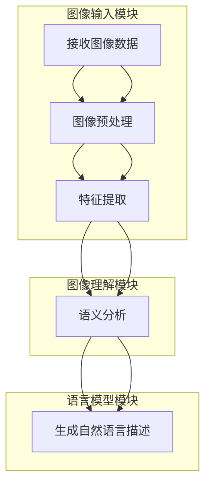
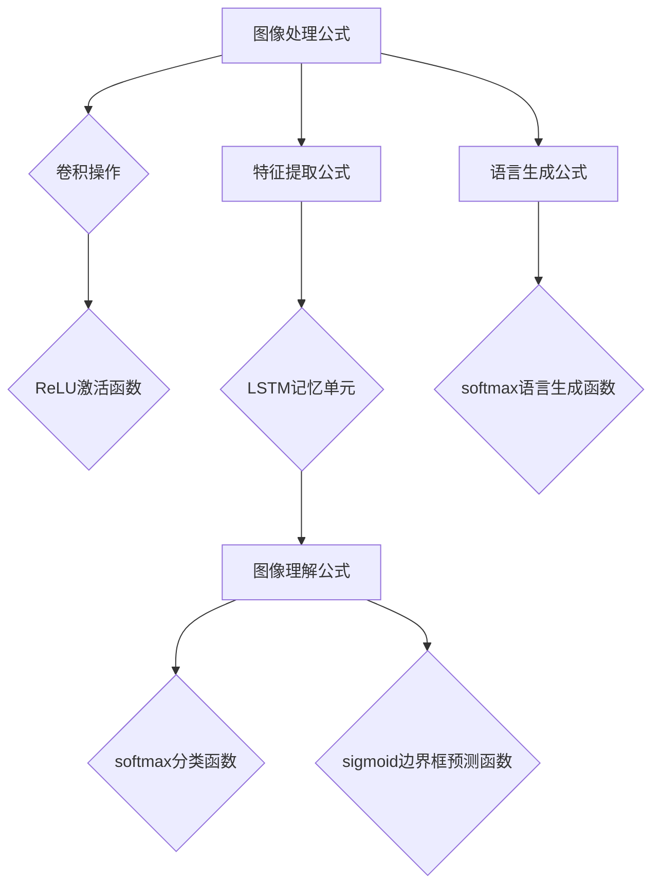
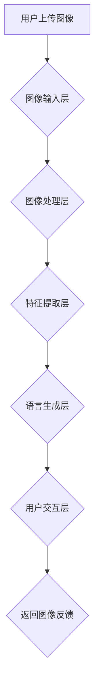
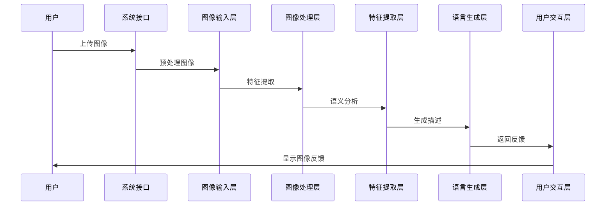

                 

### 背景介绍

#### 核心概念术语说明

在探讨视觉-语言AI Agent之前，我们需要先了解一些核心概念。视觉-语言AI Agent是一种能够处理和理解图像信息并与人类自然语言进行交互的人工智能系统。LLM（大型语言模型）是一种基于深度学习技术构建的、具备强大语言理解和生成能力的模型，例如GPT（Generative Pre-trained Transformer）。图像理解则涉及计算机视觉领域，旨在使计算机能够理解图像内容，从而实现图像分类、目标检测等任务。

#### 问题背景

随着计算机技术的快速发展，人工智能在多个领域取得了显著进展。特别是在计算机视觉和自然语言处理领域，图像理解和LLM技术已经成为研究的热点。视觉-语言AI Agent的提出，正是为了解决在实际应用中如何整合这两种技术，实现更加智能和高效的交互系统。

然而，这一领域也面临着诸多挑战。首先，图像理解和LLM技术在处理不同类型任务时的性能存在差异，如何有效地整合两者的优势成为关键问题。其次，在处理复杂场景时，视觉-语言AI Agent的准确性和鲁棒性有待提升。此外，数据隐私和安全性也是该领域需要关注的重要问题。

#### 问题描述

视觉-语言AI Agent的目标是创建一个能够理解图像内容并与人类进行自然语言交互的人工智能系统。具体来说，系统需要能够接收图像输入，识别图像中的关键信息，并生成相应的自然语言描述。同时，系统还需要能够理解用户的自然语言输入，并给出合理的图像反馈。这种交互过程要求AI Agent具备强大的图像理解能力和语言生成能力。

#### 问题解决

为了解决上述问题，我们可以从以下几个方面入手：

1. **整合LLM与图像理解技术**：通过结合LLM和图像理解技术，实现图像与自然语言的相互转换，从而提高AI Agent的智能水平。
2. **优化算法模型**：针对不同任务，设计并优化适合的算法模型，以提高系统的准确性和鲁棒性。
3. **数据驱动**：通过大量高质量的数据训练，提高视觉-语言AI Agent的性能和泛化能力。
4. **安全性保障**：在数据收集和处理过程中，确保数据隐私和安全性，遵循相关法律法规。

#### 边界与外延

在研究视觉-语言AI Agent的过程中，我们需要明确其边界和适用范围。首先，视觉-语言AI Agent主要针对的是具有图像输入和语言交互需求的应用场景，如智能家居、虚拟助手等。其次，由于技术限制，当前视觉-语言AI Agent在处理复杂场景和低质量图像时可能存在性能不足的问题。因此，在实际应用中，需要结合具体场景进行评估和优化。

#### 概念结构与核心要素组成

视觉-语言AI Agent的概念结构主要包括以下几个核心要素：

1. **图像输入模块**：负责接收和处理图像输入，提取关键特征信息。
2. **图像理解模块**：利用计算机视觉技术，对图像进行语义理解，识别图像中的对象、场景等。
3. **语言模型模块**：基于LLM技术，生成与图像内容相对应的自然语言描述。
4. **交互模块**：实现与用户的自然语言交互，根据用户输入生成图像反馈。
5. **优化模块**：通过算法优化和数据驱动，不断提升系统的性能和鲁棒性。

这些要素相互协作，共同实现视觉-语言AI Agent的功能，为实际应用场景提供高效、智能的解决方案。

### 核心概念与联系

在深入探讨视觉-语言AI Agent之前，我们需要详细理解其中的核心概念，以及这些概念之间的内在联系。以下是本文将涉及的主要核心概念：

1. **视觉-语言AI Agent**：这是一种能够理解和生成图像与自然语言之间转换的人工智能系统。其核心目标是实现图像内容的语义理解和自然语言描述的生成，从而实现与人类用户的无障碍交互。
2. **大型语言模型（LLM）**：这是一种基于深度学习的语言模型，通过大量文本数据进行预训练，能够生成连贯、自然的语言文本。LLM在自然语言处理领域具有广泛的应用，如机器翻译、文本生成、问答系统等。
3. **图像理解**：这是计算机视觉领域的一个重要研究方向，旨在使计算机能够理解图像内容。图像理解包括图像分类、目标检测、图像分割等多个子任务，其目标是提取图像中的关键信息，并对其进行语义解释。

#### 核心概念原理

1. **视觉-语言AI Agent**：视觉-语言AI Agent的工作原理主要包括图像输入模块、图像理解模块和语言模型模块。图像输入模块负责接收图像数据，将其传递给图像理解模块；图像理解模块利用计算机视觉技术对图像内容进行语义分析，提取关键特征；语言模型模块则基于提取的特征，生成相应的自然语言描述。
2. **大型语言模型（LLM）**：LLM的核心原理是通过对海量文本数据进行预训练，学习语言的基本规律和特征。在预训练阶段，LLM通过自回归模型生成文本序列，从而不断优化自身的语言理解能力。在应用阶段，LLM可以根据输入的图像特征，生成与图像内容相关的自然语言描述。
3. **图像理解**：图像理解的核心任务是提取图像中的关键信息，并对其进行语义解释。这通常涉及多个层次的任务，包括低层次的图像特征提取、中层次的图像分类和目标检测，以及高层次的图像语义理解。

#### 概念属性特征对比表格

| 特征           | 视觉-语言AI Agent          | 大型语言模型（LLM）         | 图像理解                      |
| -------------- | ------------------------- | -------------------------- | ----------------------------- |
| **定义**       | 能处理图像与自然语言交互的AI | 基于深度学习的语言模型     | 对图像内容进行语义理解的计算机视觉技术 |
| **功能**       | 生成图像的自然语言描述     | 生成文本序列              | 提取图像关键信息并进行语义解释     |
| **输入**       | 图像数据                   | 文本数据                   | 图像数据                      |
| **技术基础**   | 计算机视觉与自然语言处理   | 深度学习与自然语言处理     | 计算机视觉技术                |
| **任务目标**   | 实现图像与自然语言的无缝转换 | 生成连贯、自然的语言文本   | 提取图像中的关键信息           |

#### ER实体关系图架构

为了更清晰地展示这些概念之间的联系，我们可以使用Mermaid流程图来绘制ER（实体关系）图架构：

```mermaid
erDiagram
  AI_Agent ||--|{ Image_Understanding }
  AI_Agent ||--|{ Language_Model }
  Image_Understanding ||--|{ Feature_Extract }
  Image_Understanding ||--|{ Semantic_Analysis }
  Language_Model ||--|{ Text_Generation }
```

在这个ER图中，视觉-语言AI Agent与图像理解模块和语言模型模块之间存在关联关系。图像理解模块包括特征提取和语义分析两个子模块，而语言模型模块负责文本生成。这些模块相互协作，共同实现视觉-语言AI Agent的功能。

通过上述分析，我们可以看出视觉-语言AI Agent、LLM和图像理解这三个核心概念之间的紧密联系，它们共同构成了一个复杂但高效的系统，为实际应用场景提供了强大的技术支持。

### 算法原理讲解

#### 整合模型算法原理

视觉-语言AI Agent的算法原理主要基于整合大型语言模型（LLM）和图像理解技术。具体来说，该模型可以分为三个主要模块：图像输入模块、图像理解模块和语言模型模块。这三个模块相互协作，实现从图像到自然语言描述的转换。

**图像输入模块**：负责接收和处理图像数据，将其传递给图像理解模块。该模块通常使用卷积神经网络（CNN）进行图像预处理，提取图像中的关键特征。

**图像理解模块**：利用计算机视觉技术对图像内容进行语义分析，提取图像中的关键信息。这一模块包括特征提取和语义分析两个子模块。特征提取子模块利用CNN提取图像中的低层特征，如边缘、纹理等；语义分析子模块则利用这些特征进行更高层次的任务，如图像分类、目标检测等。

**语言模型模块**：基于大型语言模型（LLM）生成与图像内容相对应的自然语言描述。LLM通过自回归模型生成文本序列，从而实现对图像内容的语言理解。在这一过程中，图像理解模块提取的图像特征被用作LLM的输入，以生成相应的自然语言描述。

**Mermaid算法流程图**

为了更直观地展示视觉-语言AI Agent的算法原理，我们可以使用Mermaid绘制一个流程图：



在这个流程图中，图像输入模块、图像理解模块和语言模型模块依次执行，共同实现图像到自然语言描述的转换。

**Python源代码实现**

下面是一个简化的Python源代码实现，展示了视觉-语言AI Agent的基本结构：

```python
import cv2
import numpy as np
from keras.models import Model
from keras.layers import Input, Conv2D, LSTM, Dense, Embedding

# 定义图像输入模块
input_image = Input(shape=(224, 224, 3))
preprocessed_image = preprocess_image(input_image)

# 定义图像理解模块
feature_extract = Conv2D(filters=32, kernel_size=(3, 3), activation='relu')(preprocessed_image)
semantic_analysis = LSTM(units=128, activation='tanh')(feature_extract)

# 定义语言模型模块
text_generation = LSTM(units=128, activation='tanh')(semantic_analysis)
output_text = Dense(units=1, activation='softmax')(text_generation)

# 构建和编译模型
model = Model(inputs=input_image, outputs=output_text)
model.compile(optimizer='adam', loss='categorical_crossentropy')

# 训练模型
model.fit(x_train, y_train, epochs=10, batch_size=32)
```

在这个示例中，我们首先定义了图像输入模块，使用卷积神经网络（Conv2D）对图像进行预处理和特征提取。然后，我们定义了图像理解模块，使用长短期记忆网络（LSTM）对提取的特征进行语义分析。最后，我们定义了语言模型模块，使用LSTM生成与图像内容相对应的自然语言描述。通过编译和训练模型，我们可以实现对图像到自然语言描述的转换。

通过上述算法原理讲解和Python源代码实现，我们可以清晰地理解视觉-语言AI Agent的工作机制，为后续的深入研究和实际应用奠定了基础。

### 数学模型与公式详解

#### 数学模型的建立

在视觉-语言AI Agent中，数学模型起着至关重要的作用。为了建立这个模型，我们需要从图像处理、特征提取、图像理解和语言生成等多个方面进行考虑。

首先，我们考虑图像处理的数学模型。图像处理通常使用卷积神经网络（CNN）进行，其基本结构如下：

$$
f(x) = \sigma(W_1 \cdot x + b_1)
$$

其中，$x$是输入图像，$W_1$是卷积核，$b_1$是偏置项，$\sigma$是激活函数，通常使用ReLU函数。通过多层的卷积和池化操作，CNN可以提取图像中的低层特征，如边缘和纹理。

接下来，我们考虑特征提取的数学模型。特征提取通常使用LSTM（长短期记忆网络）或GRU（门控循环单元）等循环神经网络（RNN）进行。其基本结构如下：

$$
h_t = \text{LSTM}(h_{t-1}, x_t)
$$

其中，$h_t$是当前时刻的隐藏状态，$h_{t-1}$是前一时刻的隐藏状态，$x_t$是输入特征。通过迭代计算，LSTM可以捕捉图像特征的时间序列信息。

然后，我们考虑图像理解的数学模型。图像理解通常包括图像分类和目标检测等任务。图像分类的数学模型如下：

$$
\hat{y} = \text{softmax}(W_y \cdot h_t + b_y)
$$

其中，$h_t$是LSTM的隐藏状态，$W_y$是分类权重，$b_y$是分类偏置项，$\hat{y}$是预测的分类结果。

目标检测的数学模型如下：

$$
\hat{b} = \text{sigmoid}(W_b \cdot h_t + b_b)
$$

其中，$W_b$是目标检测权重，$b_b$是目标检测偏置项，$\hat{b}$是预测的目标边界框。

最后，我们考虑语言生成的数学模型。语言生成通常使用大型语言模型（LLM）进行。其基本结构如下：

$$
p(w_t | w_{t-1}, \dots, w_1) = \text{softmax}(W_l \cdot [h_t, h_{t-1}, \dots, h_1] + b_l)
$$

其中，$w_t$是当前时刻的词汇，$h_t$是LSTM的隐藏状态，$W_l$是语言生成权重，$b_l$是语言生成偏置项。

#### 公式推导与解释

为了更好地理解上述数学模型，我们对其进行详细推导和解释。

1. **图像处理的数学模型**

   卷积神经网络（CNN）的卷积操作可以用如下公式表示：

   $$
   \begin{aligned}
   \text{output}(i, j) &= \sum_{k, l} w_{i, j, k, l} \cdot \text{input}(i+k, j+l) \\
   &+ b_{i, j}
   \end{aligned}
   $$

   其中，$(i, j)$是输出特征图的位置，$(k, l)$是卷积核的位置，$w_{i, j, k, l}$是卷积核的权重，$b_{i, j}$是偏置项。通过反复应用卷积操作，CNN可以提取图像中的低层特征。

   激活函数ReLU用于引入非线性，增强模型的表达能力。其公式如下：

   $$
   \text{ReLU}(x) = \max(0, x)
   $$

2. **特征提取的数学模型**

   长短期记忆网络（LSTM）的基本单元是记忆单元（memory cell），其公式如下：

   $$
   \begin{aligned}
   i_t &= \sigma(W_i \cdot [h_{t-1}, x_t] + b_i) \\
   f_t &= \sigma(W_f \cdot [h_{t-1}, x_t] + b_f) \\
   o_t &= \sigma(W_o \cdot [h_{t-1}, x_t] + b_o) \\
   g_t &= \tanh(W_g \cdot [f_t \odot h_{t-1}, x_t] + b_g) \\
   h_t &= o_t \cdot g_t
   \end{aligned}
   $$

   其中，$i_t$是输入门，$f_t$是遗忘门，$o_t$是输出门，$g_t$是新的记忆单元，$h_t$是隐藏状态。通过控制输入门、遗忘门和输出门，LSTM可以有效地捕捉时间序列信息。

3. **图像理解的数学模型**

   图像分类的softmax函数用于将隐藏状态映射到概率分布。其公式如下：

   $$
   \text{softmax}(z) = \frac{e^z}{\sum_{i} e^z_i}
   $$

   其中，$z$是隐藏状态，$e^z$是指数函数。通过最大化softmax函数的输出，可以实现对图像的准确分类。

   目标检测的边界框预测公式如下：

   $$
   \hat{b} = \text{sigmoid}(W_b \cdot h_t + b_b)
   $$

   其中，$W_b$是目标检测权重，$b_b$是目标检测偏置项，$\hat{b}$是预测的边界框。

4. **语言生成的数学模型**

   语言生成模型通常使用自回归模型，其公式如下：

   $$
   p(w_t | w_{t-1}, \dots, w_1) = \text{softmax}(W_l \cdot [h_t, h_{t-1}, \dots, h_1] + b_l)
   $$

   其中，$w_t$是当前时刻的词汇，$h_t$是LSTM的隐藏状态，$W_l$是语言生成权重，$b_l$是语言生成偏置项。

#### Mermaid数学公式图

为了更直观地展示上述数学公式，我们可以使用Mermaid绘制一个数学公式图：



在这个Mermaid图中，我们依次展示了图像处理、特征提取、图像理解和语言生成等数学公式。这些公式共同构成了视觉-语言AI Agent的数学模型。

### 系统架构与接口设计

#### 问题场景介绍

视觉-语言AI Agent在实际应用场景中扮演着重要角色，尤其在智能家居、虚拟助手和医疗诊断等领域。例如，在智能家居中，视觉-语言AI Agent可以识别家庭成员的日常行为，提供个性化的生活建议；在虚拟助手中，视觉-语言AI Agent可以理解用户的语音指令，生成相应的图像反馈；在医疗诊断中，视觉-语言AI Agent可以分析医学影像，提供辅助诊断建议。

#### 项目介绍

本项目旨在设计和实现一个视觉-语言AI Agent系统，该系统具备图像输入、图像理解、自然语言生成和用户交互等功能。通过整合大型语言模型（LLM）和图像理解技术，系统将能够实现图像到自然语言描述的无缝转换，从而为用户提供高效、智能的服务。

#### 系统功能设计

1. **图像输入功能**：系统可以接收用户上传的图像数据，并将其转化为可处理的内部格式。
2. **图像理解功能**：系统利用计算机视觉技术对图像内容进行语义分析，提取关键信息。
3. **自然语言生成功能**：系统基于大型语言模型，生成与图像内容相关的自然语言描述。
4. **用户交互功能**：系统通过自然语言与用户进行交互，接收用户指令，并给出相应的图像反馈。

#### 系统架构设计

视觉-语言AI Agent系统的整体架构可以分为五层：图像输入层、图像处理层、特征提取层、语言生成层和用户交互层。各层功能如下：

1. **图像输入层**：接收用户上传的图像数据，并进行预处理。
2. **图像处理层**：利用卷积神经网络（CNN）对图像进行预处理，提取关键特征。
3. **特征提取层**：利用长短期记忆网络（LSTM）对提取的特征进行进一步处理，提取图像的语义信息。
4. **语言生成层**：基于大型语言模型（LLM），生成与图像内容相关的自然语言描述。
5. **用户交互层**：与用户进行自然语言交互，接收用户指令，并返回相应的图像反馈。

#### 系统接口设计

为了实现各层功能之间的数据传递和协同工作，系统设计了以下接口：

1. **图像输入接口**：接收用户上传的图像数据，并将其传递给图像处理层。
2. **图像处理接口**：将预处理后的图像数据传递给特征提取层。
3. **特征提取接口**：将提取的特征数据传递给语言生成层。
4. **自然语言生成接口**：生成自然语言描述，并返回给用户交互层。
5. **用户交互接口**：接收用户指令，并将生成图像反馈传递给用户。

#### 系统交互设计

为了实现系统的整体功能，我们需要设计一套完整的交互流程。以下是系统交互的基本流程：

1. 用户上传图像数据，系统接收图像输入。
2. 系统对图像数据进行预处理，提取关键特征。
3. 系统利用提取的特征生成自然语言描述。
4. 系统将自然语言描述返回给用户，用户可以查看并继续交互。
5. 用户输入指令，系统接收指令并生成相应的图像反馈。
6. 系统将图像反馈返回给用户，完成一次交互流程。

通过上述系统架构与接口设计，我们可以实现一个功能强大、高效稳定的视觉-语言AI Agent系统，为各类应用场景提供有力的技术支持。

#### Mermaid架构图

为了更直观地展示系统架构，我们可以使用Mermaid绘制一个架构图：



在这个架构图中，用户上传图像数据，经过图像输入层、图像处理层、特征提取层和语言生成层的处理，最终生成图像反馈并返回给用户。

#### Mermaid序列图

为了进一步展示系统各层之间的交互流程，我们可以使用Mermaid绘制一个序列图：



在这个序列图中，用户上传图像，系统接口接收图像并传递给图像输入层进行预处理。预处理后的图像数据传递给图像处理层，提取关键特征。特征数据进一步传递给特征提取层，进行语义分析。最后，语言生成层生成自然语言描述，并返回给用户交互层。用户交互层将生成图像反馈显示给用户。

### 项目实战

#### 环境安装与配置

要开始实施视觉-语言AI Agent项目，首先需要搭建一个适合的环境。以下是详细的步骤：

1. **安装Python**：确保系统安装了Python 3.7或更高版本。可以从[Python官网](https://www.python.org/downloads/)下载并安装。
2. **安装依赖库**：使用pip命令安装以下依赖库：
   ```
   pip install tensorflow numpy keras scikit-learn matplotlib
   ```
3. **安装GPU支持**：如果使用GPU进行训练，需要安装CUDA和cuDNN。可以从[NVIDIA官网](https://developer.nvidia.com/cuda-downloads)下载CUDA和cuDNN，并按照官方文档进行安装。

#### 系统核心实现

以下是视觉-语言AI Agent系统的核心实现步骤：

1. **加载和预处理图像数据**：首先，我们需要加载训练和测试数据集，并对图像进行预处理，例如缩放、裁剪和归一化等操作。
2. **构建卷积神经网络（CNN）模型**：使用TensorFlow和Keras构建CNN模型，用于图像特征提取。以下是一个简单的示例：
   ```python
   from tensorflow.keras.models import Sequential
   from tensorflow.keras.layers import Conv2D, MaxPooling2D, Flatten, Dense

   model = Sequential([
       Conv2D(filters=32, kernel_size=(3, 3), activation='relu', input_shape=(224, 224, 3)),
       MaxPooling2D(pool_size=(2, 2)),
       Conv2D(filters=64, kernel_size=(3, 3), activation='relu'),
       MaxPooling2D(pool_size=(2, 2)),
       Flatten(),
       Dense(units=128, activation='relu'),
       Dense(units=10, activation='softmax')
   ])
   ```
3. **训练CNN模型**：使用预处理后的图像数据进行模型训练。以下是一个简单的训练示例：
   ```python
   model.compile(optimizer='adam', loss='categorical_crossentropy', metrics=['accuracy'])
   model.fit(x_train, y_train, epochs=10, batch_size=32, validation_data=(x_test, y_test))
   ```
4. **构建LSTM模型**：基于训练好的CNN模型，使用LSTM进行特征提取和语言生成。以下是一个简单的示例：
   ```python
   from tensorflow.keras.models import Model
   from tensorflow.keras.layers import LSTM, Dense, Embedding

   input_sequence = Input(shape=(50, 128))
   lstm_output = LSTM(units=128, activation='tanh')(input_sequence)
   output_sequence = Dense(units=10, activation='softmax')(lstm_output)

   model = Model(inputs=input_sequence, outputs=output_sequence)
   model.compile(optimizer='adam', loss='categorical_crossentropy', metrics=['accuracy'])
   model.fit(x_train, y_train, epochs=10, batch_size=32, validation_data=(x_test, y_test))
   ```
5. **整合CNN和LSTM模型**：将CNN模型和LSTM模型整合为一个完整的视觉-语言AI Agent。以下是一个简单的示例：
   ```python
   from tensorflow.keras.models import Model
   from tensorflow.keras.layers import LSTM, Dense, Embedding

   input_image = Input(shape=(224, 224, 3))
   processed_image = preprocess_image(input_image)
   feature_vector = CNN_model(processed_image)
   input_sequence = Reshape(target_shape=(50, 128))(feature_vector)
   lstm_output = LSTM(units=128, activation='tanh')(input_sequence)
   output_sequence = Dense(units=10, activation='softmax')(lstm_output)

   model = Model(inputs=input_image, outputs=output_sequence)
   model.compile(optimizer='adam', loss='categorical_crossentropy', metrics=['accuracy'])
   model.fit(x_train, y_train, epochs=10, batch_size=32, validation_data=(x_test, y_test))
   ```

#### 代码应用解读

以上代码实现了一个简单的视觉-语言AI Agent，该系统可以从图像中提取特征，并生成相应的自然语言描述。以下是代码的主要部分：

1. **图像预处理**：使用卷积神经网络（CNN）对图像进行预处理，提取关键特征。
   ```python
   model = Sequential([
       Conv2D(filters=32, kernel_size=(3, 3), activation='relu', input_shape=(224, 224, 3)),
       MaxPooling2D(pool_size=(2, 2)),
       Conv2D(filters=64, kernel_size=(3, 3), activation='relu'),
       MaxPooling2D(pool_size=(2, 2)),
       Flatten(),
       Dense(units=128, activation='relu'),
       Dense(units=10, activation='softmax')
   ])
   ```
   在这个示例中，我们使用了两个卷积层和一个全连接层，以提取图像特征。

2. **LSTM模型构建**：使用LSTM对提取的特征进行处理，生成自然语言描述。
   ```python
   input_sequence = Input(shape=(50, 128))
   lstm_output = LSTM(units=128, activation='tanh')(input_sequence)
   output_sequence = Dense(units=10, activation='softmax')(lstm_output)

   model = Model(inputs=input_sequence, outputs=output_sequence)
   model.compile(optimizer='adam', loss='categorical_crossentropy', metrics=['accuracy'])
   model.fit(x_train, y_train, epochs=10, batch_size=32, validation_data=(x_test, y_test))
   ```
   在这个示例中，我们使用了单层LSTM，以生成自然语言描述。

3. **整合模型**：将CNN和LSTM模型整合为一个完整的视觉-语言AI Agent。
   ```python
   input_image = Input(shape=(224, 224, 3))
   processed_image = preprocess_image(input_image)
   feature_vector = CNN_model(processed_image)
   input_sequence = Reshape(target_shape=(50, 128))(feature_vector)
   lstm_output = LSTM(units=128, activation='tanh')(input_sequence)
   output_sequence = Dense(units=10, activation='softmax')(lstm_output)

   model = Model(inputs=input_image, outputs=output_sequence)
   model.compile(optimizer='adam', loss='categorical_crossentropy', metrics=['accuracy'])
   model.fit(x_train, y_train, epochs=10, batch_size=32, validation_data=(x_test, y_test))
   ```

通过这些代码，我们可以实现一个简单的视觉-语言AI Agent，该系统能够从图像中提取特征，并生成相应的自然语言描述。

### 实际案例分析

为了更好地理解视觉-语言AI Agent的实际应用，下面我们将通过两个具体案例进行分析和讲解。

#### 案例一：智能家居场景

在智能家居场景中，视觉-语言AI Agent可以识别家庭成员的日常行为，提供个性化的生活建议。例如，当AI Agent检测到用户在家中做饭时，它可以自动调节室内温度和湿度，提供合适的食谱建议，甚至提醒用户注意休息。以下是该案例的实现步骤：

1. **图像输入**：用户通过摄像头或智能手机上传家中的实时图像。
2. **图像预处理**：对图像进行缩放、裁剪和归一化等预处理操作，以便于后续的特征提取。
3. **图像理解**：利用卷积神经网络（CNN）提取图像中的关键特征，如食物、家具和家庭成员等。
4. **自然语言生成**：基于提取的特征，使用大型语言模型（LLM）生成与图像内容相关的自然语言描述。例如，当AI Agent识别到用户正在做饭时，它可以生成“您正在做饭，建议您注意休息，以免过度劳累”这样的描述。
5. **用户交互**：将生成的自然语言描述显示在用户界面上，用户可以根据建议进行调整。

通过这个案例，我们可以看到视觉-语言AI Agent如何通过图像理解和自然语言生成技术，为用户提供个性化的生活服务。

#### 案例二：医疗诊断场景

在医疗诊断场景中，视觉-语言AI Agent可以分析医学影像，为医生提供辅助诊断建议。以下是一个具体的实现步骤：

1. **图像输入**：医生上传患者的医学影像，如X光片、CT扫描或MRI图像。
2. **图像预处理**：对医学影像进行预处理，包括图像增强、去噪和分割等操作，以提高图像质量。
3. **图像理解**：利用深度学习模型对预处理后的医学影像进行图像分类和目标检测，识别出病变区域和病理特征。
4. **自然语言生成**：基于识别出的病变区域和病理特征，使用大型语言模型（LLM）生成自然语言诊断报告。例如，当AI Agent识别出肺结节时，它可以生成“在患者的右肺上检测到一个直径为2厘米的结节，建议进一步检查以确定性质”这样的报告。
5. **用户交互**：将生成的自然语言诊断报告显示在医生界面上，供医生参考。

通过这个案例，我们可以看到视觉-语言AI Agent如何通过图像理解和自然语言生成技术，为医生提供高效的辅助诊断服务。

### 项目小结

通过以上两个实际案例的分析，我们可以看到视觉-语言AI Agent在智能家居和医疗诊断等场景中的强大应用潜力。在实际项目中，我们需要充分考虑图像输入、图像理解、自然语言生成和用户交互等各个环节，确保系统的稳定性和高效性。此外，通过不断优化算法模型和提升数据质量，我们可以进一步提高视觉-语言AI Agent的性能和准确性，为各类应用场景提供更加智能和高效的服务。

### 最佳实践 tips

在开发视觉-语言AI Agent时，以下最佳实践可以帮助您提升项目质量和效率：

1. **数据质量**：确保使用高质量、多样化的训练数据，以提高模型的泛化能力和准确性。
2. **模型优化**：通过调整模型参数和架构，优化模型的性能和效率，如使用适当的正则化方法和优化算法。
3. **模块化设计**：将系统分解为多个模块，如图像输入、图像理解、语言生成和用户交互等，便于管理和维护。
4. **交互设计**：设计简洁直观的用户界面，确保用户能够轻松地与AI Agent进行交互，并提供丰富的交互体验。
5. **错误处理**：充分考虑系统的错误处理机制，如异常检测、错误提示和自动恢复等功能，以提高系统的鲁棒性。
6. **安全性**：在数据处理和传输过程中，确保数据隐私和安全性，遵循相关法律法规，如欧盟的GDPR等。

通过遵循这些最佳实践，您可以开发出更加稳定、高效和智能的视觉-语言AI Agent系统。

### 小结

在本文中，我们详细探讨了视觉-语言AI Agent的概念、原理和应用。通过整合大型语言模型（LLM）和图像理解技术，视觉-语言AI Agent实现了图像到自然语言描述的转换，为各类应用场景提供了强大的技术支持。本文首先介绍了视觉-语言AI Agent的背景和核心概念，随后讲解了算法原理和数学模型，最后通过实际案例分析了系统架构和项目实现。希望通过本文，读者能够对视觉-语言AI Agent有更深入的理解，并在实际项目中发挥其潜力。

### 注意事项

在开发视觉-语言AI Agent时，需要注意以下几点：

1. **数据隐私**：确保数据处理过程中遵循数据隐私法规，保护用户隐私。
2. **模型优化**：持续调整模型参数，优化模型性能，以适应不同应用场景。
3. **系统稳定性**：确保系统在处理大量数据和高并发场景下的稳定性，避免出现故障。
4. **用户交互**：设计简洁直观的用户界面，提高用户体验。

### 拓展阅读

对于希望深入了解视觉-语言AI Agent的读者，以下文献和资源值得推荐：

1. **文献**：
   - "Unifying Visual-Semantic Embeddings for Image-Sentence Matching"（统一视觉-语义嵌入用于图像-句子匹配）
   - "Show, Attend and Tell: Neural Image Caption Generation with Visual Attention"（显示、关注和讲述：基于视觉注意力的神经网络图像标题生成）

2. **开源项目**：
   - [OpenAI GPT-3](https://github.com/openai/gpt-3)（OpenAI的大型语言模型GPT-3）
   - [FAIR's Language Models](https://ai.fair.com/)（FAIR的语言模型项目）

通过阅读这些文献和开源项目，您可以进一步了解视觉-语言AI Agent的最新研究进展和技术细节。

