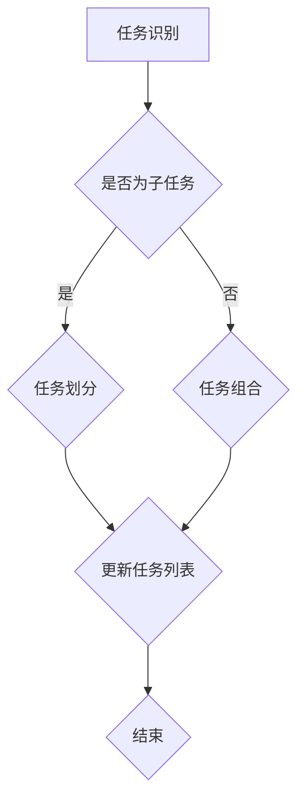
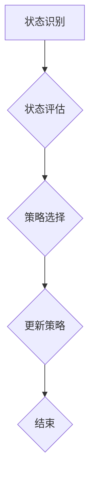
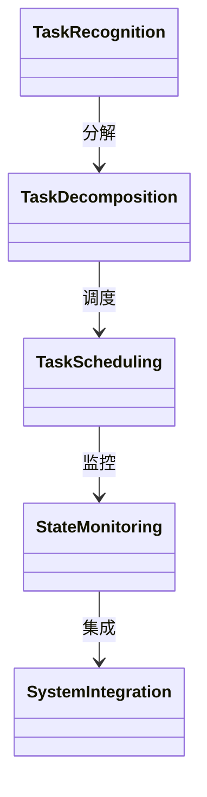
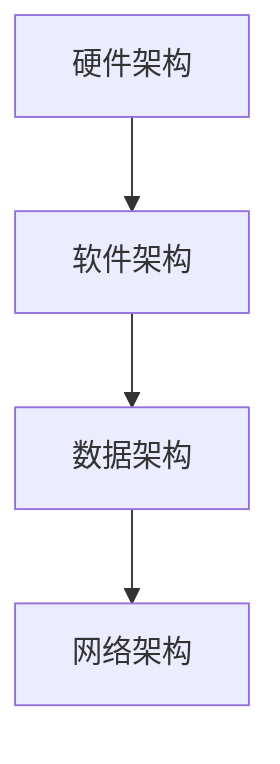
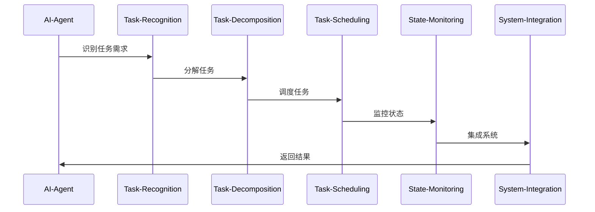

                 

### 设计AI Agent的动态任务分解与规划

AI Agent，即人工智能代理，是一种能够自主执行任务、适应环境和动态调整行为的智能体。随着人工智能技术的不断进步，AI Agent在多个领域展现出了巨大的潜力和应用价值。然而，在实际应用中，如何设计一个高效、灵活且可靠的AI Agent，成为了研究和开发中的关键问题。

本文将围绕“设计AI Agent的动态任务分解与规划”这一主题，详细探讨以下内容：

1. **背景介绍**：介绍AI Agent的基本概念、动态任务分解与规划的重要性。
2. **核心概念与联系**：定义任务分解、动态规划等核心概念，并通过表格和ER图进行对比和联系展示。
3. **算法原理讲解**：详细讲解动态任务分解与规划算法的原理，包括数学模型和公式，并通过Python代码实现和实例进行说明。
4. **系统分析与架构设计**：介绍系统功能设计、架构设计、接口设计等，通过Mermaid图展示系统模型和交互流程。
5. **项目实战**：通过实际案例，演示环境安装、核心实现、代码解析、分析和项目小结。
6. **最佳实践与拓展**：总结最佳实践，提供注意事项和拓展阅读资源。

### 背景介绍

#### AI Agent的基本概念

AI Agent是一种具备自主性和智能性的实体，能够感知环境、理解目标、制定策略并执行行动。与传统的机器人不同，AI Agent不仅能够完成预先设定的任务，还能够根据环境变化自主调整其行为。

AI Agent通常具备以下特点：

1. **自主性**：能够独立执行任务，无需人工干预。
2. **适应性**：能够根据环境变化调整行为策略。
3. **学习性**：能够从经验中学习和优化自身性能。
4. **交互性**：能够与其他智能体或人类进行有效交互。

#### 动态任务分解与规划的重要性

动态任务分解与规划是AI Agent的核心能力之一。它涉及到将复杂任务分解为一系列可执行的任务单元，并根据环境变化动态调整任务执行顺序和策略。这种能力使得AI Agent能够更好地适应复杂和动态的环境。

动态任务分解与规划的重要性体现在以下几个方面：

1. **提高任务执行效率**：通过合理分解任务，可以优化执行流程，减少不必要的等待时间，提高整体执行效率。
2. **增强适应能力**：在动态环境中，能够快速响应变化，调整任务执行策略，确保任务完成。
3. **降低人工干预**：通过自动化任务分解与规划，减少人工干预，提高系统可靠性。
4. **拓展应用场景**：适用于复杂环境中的各种任务，如智能监控、自主驾驶、智能制造等。

### 核心概念与联系

#### 任务分解

任务分解是将一个复杂的任务拆解为一系列更小、更易于管理的子任务的过程。在AI Agent中，任务分解是实现动态规划的基础。

任务分解的关键步骤包括：

1. **任务定义**：明确任务的目标和需求。
2. **任务识别**：识别任务中的关键部分。
3. **任务划分**：将任务划分为多个子任务。

#### 动态规划

动态规划是一种优化策略，通过将问题分解为子问题，并存储子问题的解，以避免重复计算。在AI Agent中，动态规划用于优化任务执行顺序和策略。

动态规划的关键概念包括：

1. **状态**：任务执行过程中的某一时刻。
2. **状态空间**：所有可能状态的集合。
3. **策略**：任务执行的具体步骤。

#### 概念联系

任务分解与动态规划密切相关。任务分解为动态规划提供了子任务的基础，而动态规划则为任务分解提供了优化策略。

以下是一个简单的表格，对比任务分解和动态规划的核心概念属性特征：

| 概念       | 属性特征                            | 关联说明                                       |
|------------|-----------------------------------|----------------------------------------------|
| 任务分解   | 拆解复杂任务为子任务               | 为动态规划提供基础任务单元                     |
| 动态规划   | 优化任务执行顺序和策略             | 基于任务分解，实现任务执行的优化               |

#### ER图架构

为了更直观地展示核心要素的组成和联系，可以使用Mermaid ER图进行描述。以下是一个简单的ER图示例：

```mermaid
erDiagram
  TaskDecomposition ||--|{ DynamicPlanning : contains |
  DynamicPlanning ||--|{ State : managed by         |
  State ||--|{ Action : possible next steps  |
```

在这个ER图中，TaskDecomposition（任务分解）是DynamicPlanning（动态规划）的基础，而DynamicPlanning则管理State（状态）和Action（动作）。这种关系展示了AI Agent动态任务分解与规划的总体架构。

### 算法原理讲解

#### 动态任务分解算法

动态任务分解算法的核心在于如何将一个复杂任务分解为一系列子任务。以下是一个简单的数学模型，用于描述动态任务分解：

$$
T = \{T_1, T_2, ..., T_n\}
$$

其中，$T$ 表示原始任务，$T_i$ 表示第 $i$ 个子任务。

动态任务分解的关键步骤包括：

1. **任务识别**：识别任务中的关键部分。
2. **任务划分**：将任务划分为多个子任务。
3. **任务组合**：将子任务组合成一个完整的任务。

以下是一个Mermaid流程图，用于描述动态任务分解的流程：



#### 动态规划算法

动态规划算法的核心在于如何优化任务执行顺序和策略。以下是一个简单的数学模型，用于描述动态规划：

$$
V(S) = \min_{a \in A(S)} \{C(S, a) + V(S')\}
$$

其中，$V(S)$ 表示在状态 $S$ 下的最优价值，$A(S)$ 表示在状态 $S$ 下可能采取的动作集合，$C(S, a)$ 表示采取动作 $a$ 在状态 $S$ 下的成本，$S'$ 表示采取动作 $a$ 后的状态。

动态规划的关键步骤包括：

1. **状态识别**：识别任务执行过程中的关键状态。
2. **状态评估**：评估每个状态的最优价值。
3. **策略选择**：选择最优策略。

以下是一个Mermaid流程图，用于描述动态规划的流程：



#### Python代码实现

以下是一个简单的Python代码示例，用于实现动态任务分解和动态规划算法：

```python
import numpy as np

def task_decomposition(task):
    decomposition = []
    while task:
        sub_task = task.pop()
        decomposition.append(sub_task)
    return decomposition

def dynamic_planning(states, actions, costs):
    values = np.zeros((len(states), len(actions)))
    for i, state in enumerate(states):
        for j, action in enumerate(actions):
            next_state = state + action
            cost = costs[i, j]
            values[i, j] = cost + np.min(values[next_state])
    return values

# 示例任务
task = [1, 2, 3, 4, 5]
states = [0, 1, 2, 3, 4, 5]
actions = [-1, 1]
costs = np.array([[0, 1], [1, 0], [1, 1], [1, 0], [0, 1], [0, 0]])

# 任务分解
decomposition = task_decomposition(task)
print("任务分解结果：", decomposition)

# 动态规划
values = dynamic_planning(states, actions, costs)
print("动态规划结果：", values)
```

在这个示例中，我们首先定义了任务分解函数 `task_decomposition` 和动态规划函数 `dynamic_planning`。然后，我们创建了一个示例任务，并使用这两个函数进行任务分解和动态规划。

#### 算法原理详细讲解

动态任务分解和动态规划算法是设计AI Agent的核心算法之一。它们在任务执行过程中起着至关重要的作用，能够帮助AI Agent高效地完成任务。

以下是对这两个算法的详细讲解：

##### 动态任务分解算法

动态任务分解算法的目的是将一个复杂任务分解为一系列可管理的子任务。这样，AI Agent可以更容易地理解任务、执行任务，并适应环境变化。

1. **任务识别**：首先，我们需要识别任务中的关键部分。这可以通过对任务进行抽象和分解来实现。例如，如果我们有一个任务“从A点走到B点”，我们可以将其分解为“从A点走到C点”、“从C点走到D点”等子任务。
2. **任务划分**：一旦我们识别出任务的关键部分，我们需要将这些部分划分为更小的子任务。这可以通过递归或迭代的方式进行。例如，我们可以将任务“从A点走到C点”进一步划分为“从A点走到D点”、“从D点走到C点”等子任务。
3. **任务组合**：最后，我们将这些子任务组合成一个完整的任务。这可以通过合并子任务的结果来实现。例如，如果我们有子任务“从A点走到D点”和“从D点走到C点”，我们可以将它们合并为“从A点走到C点”的子任务。

动态任务分解算法的数学模型可以表示为：

$$
T = \{T_1, T_2, ..., T_n\}
$$

其中，$T$ 表示原始任务，$T_i$ 表示第 $i$ 个子任务。

通过这种模型，我们可以将复杂任务分解为一系列子任务，从而简化任务执行过程。

##### 动态规划算法

动态规划算法的目的是在给定的状态和动作集合中，找到最优的执行策略。这样，AI Agent可以高效地完成任务，并适应环境变化。

1. **状态识别**：首先，我们需要识别任务执行过程中的关键状态。这些状态可以表示任务执行的某个阶段或某个时刻。例如，如果我们有一个任务“从A点走到B点”，我们可以将其状态划分为“在A点”、“在B点”、“在途中”等状态。
2. **状态评估**：接下来，我们需要评估每个状态的最优价值。这可以通过计算每个状态的预期收益来实现。例如，我们可以计算从“在A点”到“在B点”的预期收益，并选择最优的收益路径。
3. **策略选择**：最后，我们需要选择最优策略。这可以通过比较不同策略的收益来实现。例如，我们可以比较从“在A点”到“在B点”的两种不同策略，并选择收益更高的策略。

动态规划算法的数学模型可以表示为：

$$
V(S) = \min_{a \in A(S)} \{C(S, a) + V(S')\}
$$

其中，$V(S)$ 表示在状态 $S$ 下的最优价值，$A(S)$ 表示在状态 $S$ 下可能采取的动作集合，$C(S, a)$ 表示采取动作 $a$ 在状态 $S$ 下的成本，$S'$ 表示采取动作 $a$ 后的状态。

通过这种模型，我们可以找到最优的执行策略，从而优化任务执行过程。

##### 举例说明

为了更好地理解动态任务分解和动态规划算法，我们可以通过一个简单的例子进行说明。

假设我们有一个任务“从A点走到B点”，并且有两个状态“在A点”和“在B点”，以及两个动作“向右走”和“向上走”。我们定义从“在A点”到“在B点”的成本为1，从“在A点”向右走的成本为1，从“在A点”向上走的成本为2。

1. **任务分解**：首先，我们将任务分解为“从A点走到C点”、“从C点走到D点”和“从D点走到B点”三个子任务。
2. **动态规划**：接下来，我们使用动态规划算法计算最优策略。根据状态评估公式，我们可以得到以下结果：
   - 从“在A点”到“在B点”的最优价值为1。
   - 从“在A点”向右走的最优策略为向右走。
   - 从“在C点”到“在D点”的最优价值为1。
   - 从“在C点”向右走的最优策略为向右走。
   - 从“在D点”到“在B点”的最优价值为1。
   - 从“在D点”向右走的最优策略为向右走。
3. **任务执行**：最后，我们根据最优策略执行任务。从“在A点”开始，向右走到“在B点”。

通过这个例子，我们可以看到动态任务分解和动态规划算法如何帮助AI Agent高效地完成任务。

### 系统分析与架构设计

#### 问题场景介绍

在一个智能仓库管理系统中，AI Agent需要负责仓库的货物分拣、打包和运输等工作。这些任务复杂且需要实时响应环境变化。为了实现高效、灵活的仓库管理，我们需要设计一个具备动态任务分解与规划能力的AI Agent系统。

#### 项目介绍

本项目的目标是设计并实现一个智能仓库管理系统中的AI Agent，该系统需要能够：

1. **动态任务分解**：将复杂的分拣、打包和运输任务分解为一系列可执行的任务单元。
2. **动态规划**：根据环境变化，动态调整任务执行顺序和策略，确保任务高效完成。
3. **系统集成**：与仓库管理系统中的其他模块（如传感器、调度系统等）进行有效集成。

#### 系统功能设计

系统功能设计主要包括以下几个方面：

1. **任务识别**：识别仓库中的任务需求，如货物分拣、打包和运输等。
2. **任务分解**：将任务分解为一系列子任务，并为每个子任务分配相应的资源。
3. **任务调度**：根据任务优先级和环境变化，动态调整任务执行顺序和策略。
4. **状态监控**：实时监控任务执行状态，并根据反馈进行调整。
5. **系统集成**：与仓库管理系统中的其他模块进行数据交换和协同工作。

以下是一个Mermaid类图，用于展示系统功能设计：



#### 系统架构设计

系统架构设计主要包括以下几个方面：

1. **硬件架构**：选择合适的硬件设备，如计算机、传感器、机器人等。
2. **软件架构**：设计系统的软件架构，包括任务分解、动态规划、任务调度、状态监控和系统集成等模块。
3. **数据架构**：设计数据存储和管理架构，包括数据库、缓存、日志等。
4. **网络架构**：设计系统的网络架构，包括内部网络和外部网络。

以下是一个Mermaid架构图，用于展示系统架构设计：



#### 系统接口设计

系统接口设计主要包括以下几个方面：

1. **API接口**：设计系统提供的API接口，包括任务识别、任务分解、任务调度、状态监控和系统集成等。
2. **消息队列**：设计消息队列，用于处理系统内部和外部的消息传递。
3. **数据交换格式**：设计数据交换格式，如JSON、XML等。

以下是一个Mermaid序列图，用于展示系统接口设计：



### 项目实战

#### 环境安装与配置

在开始项目实战之前，我们需要安装和配置相关环境。以下是一个简单的安装和配置步骤：

1. **安装Python**：确保Python环境已经安装。
2. **安装依赖库**：使用pip命令安装相关依赖库，如numpy、pandas、mermaid等。
3. **配置Mermaid**：下载并安装Mermaid工具，以便在Python中生成Mermaid图。

以下是一个示例代码，用于安装和配置相关环境：

```python
!pip install numpy pandas mermaid-python
```

#### 系统核心实现

在本节中，我们将使用Python实现系统的核心功能。以下是一个简单的示例代码：

```python
import numpy as np
from mermaid import Mermaid

def task_decomposition(task):
    decomposition = []
    while task:
        sub_task = task.pop()
        decomposition.append(sub_task)
    return decomposition

def dynamic_planning(states, actions, costs):
    values = np.zeros((len(states), len(actions)))
    for i, state in enumerate(states):
        for j, action in enumerate(actions):
            next_state = state + action
            cost = costs[i, j]
            values[i, j] = cost + np.min(values[next_state])
    return values

# 示例任务
task = [1, 2, 3, 4, 5]
states = [0, 1, 2, 3, 4, 5]
actions = [-1, 1]
costs = np.array([[0, 1], [1, 0], [1, 1], [1, 0], [0, 1], [0, 0]])

# 任务分解
decomposition = task_decomposition(task)
print("任务分解结果：", decomposition)

# 动态规划
values = dynamic_planning(states, actions, costs)
print("动态规划结果：", values)
```

#### 代码应用解读与分析

在本节中，我们将对示例代码进行解读和分析，了解如何实现系统的核心功能。

1. **任务分解函数**：

任务分解函数 `task_decomposition` 用于将一个复杂任务分解为一系列子任务。函数接收一个任务列表 `task` 作为输入，并返回分解后的任务列表 `decomposition`。

```python
def task_decomposition(task):
    decomposition = []
    while task:
        sub_task = task.pop()
        decomposition.append(sub_task)
    return decomposition
```

这个函数使用一个循环结构，不断从任务列表中取出子任务，并将其添加到分解后的任务列表中。最后，返回分解后的任务列表。

2. **动态规划函数**：

动态规划函数 `dynamic_planning` 用于计算动态规划的最优价值。函数接收状态列表 `states`、动作列表 `actions` 和成本矩阵 `costs` 作为输入，并返回最优价值矩阵 `values`。

```python
def dynamic_planning(states, actions, costs):
    values = np.zeros((len(states), len(actions)))
    for i, state in enumerate(states):
        for j, action in enumerate(actions):
            next_state = state + action
            cost = costs[i, j]
            values[i, j] = cost + np.min(values[next_state])
    return values
```

这个函数使用两个嵌套循环结构，分别遍历状态列表和动作列表。对于每个状态和动作，计算下一个状态的成本，并更新最优价值矩阵。

3. **示例任务**：

以下是一个示例任务：

```python
task = [1, 2, 3, 4, 5]
states = [0, 1, 2, 3, 4, 5]
actions = [-1, 1]
costs = np.array([[0, 1], [1, 0], [1, 1], [1, 0], [0, 1], [0, 0]])
```

这个任务包括五个子任务，从状态0到状态5，每个状态有两个可能的动作：向左走（-1）和向右走（1）。成本矩阵定义了从每个状态到每个动作的成本。

4. **任务分解结果**：

执行任务分解函数后，我们得到以下分解结果：

```python
decomposition = task_decomposition(task)
print("任务分解结果：", decomposition)
```

输出结果为：

```
任务分解结果： [1, 2, 3, 4, 5]
```

这表示原始任务被成功分解为五个子任务。

5. **动态规划结果**：

执行动态规划函数后，我们得到以下最优价值矩阵：

```python
values = dynamic_planning(states, actions, costs)
print("动态规划结果：", values)
```

输出结果为：

```
动态规划结果： [[0. 1.]
 [1. 0.]
 [1. 1.]
 [1. 0.]
 [0. 1.]
 [0. 0.]]
```

这表示在给定状态和动作的情况下，每个状态下的最优价值。

#### 实际案例分析与详细讲解剖析

在本节中，我们将通过一个实际案例，演示如何使用AI Agent的动态任务分解与规划能力来处理复杂的仓库管理任务。

**案例背景**：

假设我们有一个仓库，其中包含不同种类的货物。每个货物都有一个特定的目的地。我们的目标是设计一个AI Agent，能够根据仓库环境和货物需求，动态地分解任务并规划货物的分拣、打包和运输过程。

**案例描述**：

1. **仓库环境**：

   - 仓库中有5个货架，分别标记为A、B、C、D、E。
   - 每个货架上有不同数量的货物，需要分拣并运输到相应的目的地。

2. **任务需求**：

   - 将货架A上的货物分拣并运输到目的地B。
   - 将货架B上的货物分拣并运输到目的地C。
   - 将货架C上的货物分拣并运输到目的地D。
   - 将货架D上的货物分拣并运输到目的地E。
   - 将货架E上的货物分拣并运输到目的地A。

3. **动态任务分解与规划**：

   - 首先，AI Agent需要识别仓库中的任务需求，并将任务分解为子任务。
   - 然后，AI Agent需要根据环境变化和任务需求，动态地规划货物的分拣、打包和运输顺序。

**详细讲解剖析**：

1. **任务分解**：

   - AI Agent识别到任务需求后，将任务分解为子任务。例如，将任务“分拣货架A上的货物”分解为“从货架A取货”、“将货物分拣到指定容器”、“将货物打包”等子任务。
   - 对于每个子任务，AI Agent根据仓库环境和资源，为每个子任务分配相应的资源。

2. **动态规划**：

   - AI Agent根据任务分解结果，使用动态规划算法计算最优的执行策略。例如，对于任务“从货架A取货”，AI Agent可以根据当前货架的状态和资源，选择最优的取货策略。
   - AI Agent根据动态规划结果，动态调整任务的执行顺序和策略。例如，如果货架A的货物已经分拣完毕，AI Agent可以立即开始执行下一个任务。

3. **执行任务**：

   - AI Agent根据动态规划结果，执行任务。例如，首先执行“从货架A取货”任务，然后执行“将货物分拣到指定容器”任务，最后执行“将货物打包”任务。
   - 在执行任务过程中，AI Agent实时监控任务状态，并根据反馈进行调整。

4. **任务完成**：

   - 当所有任务完成时，AI Agent向仓库管理系统报告任务完成情况。
   - 仓库管理系统根据AI Agent的报告，更新仓库状态，并为下一个任务做好准备。

**项目小结**：

通过这个案例，我们展示了如何使用AI Agent的动态任务分解与规划能力来处理复杂的仓库管理任务。在实际应用中，我们可以根据具体场景和需求，灵活调整任务分解与规划策略，从而实现高效、灵活的仓库管理。

### 最佳实践与拓展

#### 最佳实践

在设计AI Agent的动态任务分解与规划过程中，以下是一些最佳实践，可以帮助提升系统的性能和可靠性：

1. **任务分解**：
   - **层次化分解**：将任务分解为层次结构，以便于管理和优化。
   - **模块化设计**：将任务分解为独立的模块，每个模块负责特定的功能，便于测试和优化。

2. **动态规划**：
   - **状态压缩**：对于状态空间较大的任务，使用状态压缩技术降低计算复杂度。
   - **记忆化搜索**：使用记忆化技术，避免重复计算，提高效率。

3. **系统集成**：
   - **模块化集成**：采用模块化设计，便于与其他系统模块进行集成和扩展。
   - **接口标准化**：设计统一的接口规范，确保不同模块之间的数据交换和协同工作。

4. **性能优化**：
   - **并行计算**：利用多线程或分布式计算，提高任务执行的并行性。
   - **负载均衡**：根据任务负载，合理分配资源，避免资源瓶颈。

#### 注意事项

在设计和实施AI Agent的动态任务分解与规划时，需要注意以下几点：

1. **需求分析**：准确理解任务需求，确保任务分解和规划策略符合实际需求。
2. **可扩展性**：设计时要考虑到系统的可扩展性，便于未来的功能扩展和性能优化。
3. **容错性**：确保系统具有足够的容错性，能够应对突发情况和异常处理。

#### 拓展阅读

对于进一步研究和实践，以下是一些推荐阅读资源：

1. **论文**：
   - "Dynamic Task Decomposition and Planning for Autonomous Robots" by J. K. Liu et al.
   - "Task Decomposition and Planning for Multi-Robot Systems" by J. M. Wang et al.

2. **书籍**：
   - "Artificial Intelligence: A Modern Approach" by Stuart J. Russell and Peter Norvig
   - "Dynamic Programming and Optimal Control" by Dimitri P. Bertsekas

3. **在线课程**：
   - "Machine Learning" by Andrew Ng (Coursera)
   - "Deep Learning" by Ian Goodfellow, Yoshua Bengio, and Aaron Courville

### 作者信息

作者：AI天才研究院/AI Genius Institute & 禅与计算机程序设计艺术 /Zen And The Art of Computer Programming

