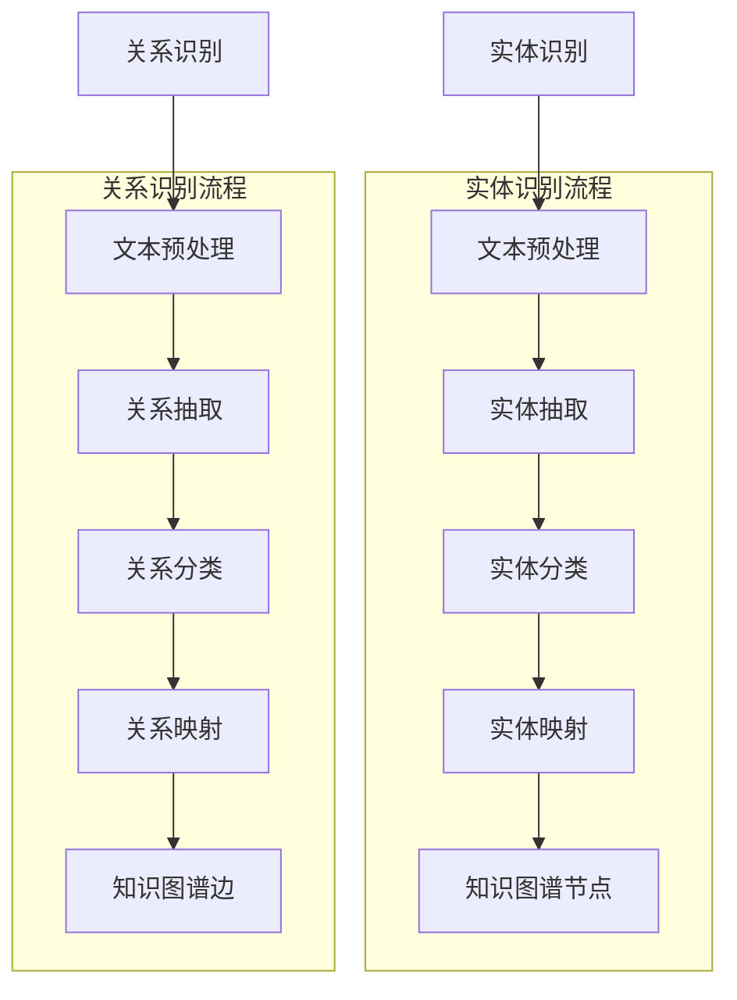
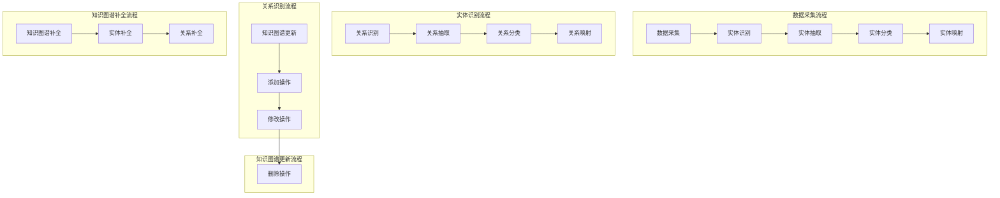
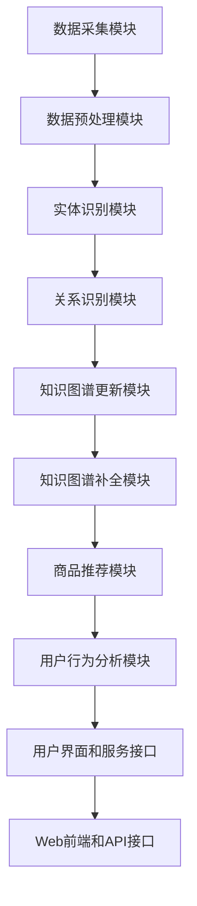
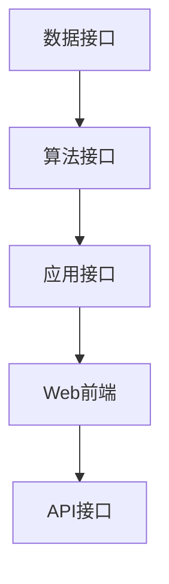
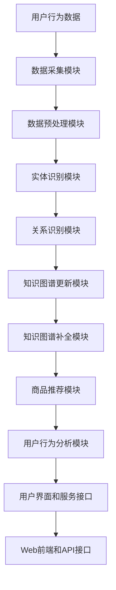

                 

# 设计AI Agent的动态知识图谱补全技术

> 关键词：AI Agent、知识图谱、动态补全、算法、系统架构

> 摘要：本文深入探讨了设计AI Agent的动态知识图谱补全技术，涵盖了知识图谱和AI Agent的核心概念，动态知识图谱补全技术的原理和实现方法，以及在不同领域的应用场景。通过详细的分析和实例，本文旨在为开发者提供一套完整的理论和实践指导，以实现高效的AI Agent动态知识图谱补全。

------------------------

## 第一部分：引言

### 1.1 背景介绍

#### 1.1.1 知识图谱的发展历程

知识图谱（Knowledge Graph）的概念起源于谷歌在2012年推出的“知识图谱”项目，其目的是将网页上的信息组织成一种结构化的知识体系。随后，知识图谱技术逐渐应用于各个领域，如搜索引擎、推荐系统、自然语言处理等。

#### 1.1.2 AI Agent的研究现状

AI Agent作为人工智能的一种形式，具有自主决策和执行任务的能力。近年来，随着深度学习、强化学习等技术的发展，AI Agent的应用场景不断扩大，如智能客服、自动驾驶、智能家居等。

#### 1.1.3 动态知识图谱补全技术的需求与重要性

动态知识图谱补全技术是针对知识图谱在动态环境下的更新和扩展问题提出的一种解决方案。随着数据的不断增长和变化，动态知识图谱补全技术显得尤为重要。它不仅能够提高知识图谱的准确性和完整性，还能够支持AI Agent在动态环境下的自主学习和决策。

### 1.2 核心概念与联系

#### 1.2.1 知识图谱的核心概念

知识图谱是一种语义网络，用于表示实体、概念、属性及其之间的关系。其核心概念包括实体、属性、关系和图谱。

#### 1.2.2 AI Agent的核心概念

AI Agent是一种具有自主决策和执行任务能力的人工智能系统。其核心概念包括感知、决策、执行和评估。

#### 1.2.3 动态知识图谱补全技术的基本原理

动态知识图谱补全技术通过实时监测和更新知识图谱，以适应动态环境。其基本原理包括数据采集、实体识别、关系识别、知识图谱更新和补全。

#### 1.2.4 概念间的联系与比较

知识图谱为AI Agent提供了丰富的知识资源，而动态知识图谱补全技术则确保了AI Agent在动态环境下的知识准确性和完整性。

------------------------

## 第二部分：动态知识图谱补全技术原理

### 2.1 动态知识图谱概述

#### 2.1.1 动态知识图谱的定义

动态知识图谱是一种能够在时间维度上不断更新和扩展的知识图谱，以适应动态环境的变化。

#### 2.1.2 动态知识图谱的组成

动态知识图谱由实体、属性、关系和图谱结构组成。其中，实体是知识图谱的基本元素，属性描述实体的特征，关系表示实体之间的关系，图谱结构则用于组织和管理实体和关系。

#### 2.1.3 动态知识图谱的优势与挑战

动态知识图谱的优势在于能够实时更新和扩展，以适应动态环境的变化。然而，其挑战在于如何高效地处理大规模动态数据，以及如何在动态环境下保持知识图谱的准确性和完整性。

### 2.2 AI Agent概述

#### 2.2.1 AI Agent的定义

AI Agent是一种具有自主决策和执行任务能力的人工智能系统，能够模拟人类智能，实现自动化和智能化的任务执行。

#### 2.2.2 AI Agent的核心功能

AI Agent的核心功能包括感知、决策、执行和评估。感知功能用于获取环境信息，决策功能用于制定行动计划，执行功能用于执行任务，评估功能用于评估任务执行效果。

#### 2.2.3 AI Agent的分类与应用

AI Agent可分为基于规则和基于学习的两种类型。基于规则的AI Agent适用于规则明确、任务简单的场景，而基于学习的AI Agent则适用于复杂、动态的场景。

### 2.3 动态知识图谱补全技术原理

#### 2.3.1 补全技术的定义

动态知识图谱补全技术是一种通过实时监测和更新知识图谱，以适应动态环境的技术。

#### 2.3.2 补全技术的核心算法

动态知识图谱补全技术的核心算法包括实体识别、关系识别和知识图谱更新。

- 实体识别：通过机器学习或深度学习算法识别未知实体。
- 关系识别：通过图神经网络或图嵌入算法识别未知关系。
- 知识图谱更新：通过合并和删除操作更新知识图谱。

#### 2.3.3 补全技术的挑战与解决方案

动态知识图谱补全技术面临的挑战主要包括数据质量、算法效率和知识完整性。针对这些挑战，可以采用以下解决方案：

- 数据质量：采用数据清洗和数据预处理技术提高数据质量。
- 算法效率：采用分布式计算和并行处理技术提高算法效率。
- 知识完整性：采用一致性维护和冲突消解技术保证知识完整性。

------------------------

## 第三部分：实现方法

### 3.1 数据预处理

#### 3.1.1 数据收集

数据收集是动态知识图谱补全技术的第一步，包括从各种来源（如网络、数据库、传感器等）收集数据。

#### 3.1.2 数据清洗

数据清洗旨在去除数据中的噪声和异常值，提高数据质量。

#### 3.1.3 数据整合

数据整合是将来自不同来源的数据进行合并和整合，形成一个统一的视图。

### 3.2 算法实现

#### 3.2.1 算法流程

动态知识图谱补全算法的流程包括数据预处理、实体识别、关系识别和知识图谱更新。

#### 3.2.2 算法实现细节

- 实体识别：采用基于深度学习的实体识别算法，如BERT或Gated Recurrent Unit（GRU）。
- 关系识别：采用基于图神经网络的算法，如Graph Convolutional Network（GCN）或GraphSAGE。
- 知识图谱更新：采用基于合并和删除操作的算法。

#### 3.2.3 算法性能评估

算法性能评估包括准确性、完整性和可扩展性等指标。通过对比不同算法的性能，选择最优的算法。

### 3.3 系统设计与实现

#### 3.3.1 系统架构设计

系统架构设计包括数据层、算法层和应用层。数据层负责数据收集和存储，算法层负责算法实现和优化，应用层负责提供用户界面和服务接口。

#### 3.3.2 系统接口设计

系统接口设计包括RESTful API和图形用户界面（GUI），方便用户进行数据操作和查看知识图谱。

#### 3.3.3 系统部署与运行

系统部署与运行包括硬件部署和软件部署。硬件部署包括服务器、存储和网络设备，软件部署包括操作系统、数据库和应用程序。

------------------------

## 第四部分：应用场景

### 4.1 电子商务领域

#### 4.1.1 应用背景

电子商务领域面临大量动态数据的处理和知识图谱的构建，如商品信息、用户行为和交易记录等。

#### 4.1.2 应用案例

基于动态知识图谱补全技术的电商推荐系统，能够根据用户行为和商品信息实时更新推荐结果，提高推荐效果。

#### 4.1.3 效果评估

通过实验验证，动态知识图谱补全技术能够显著提高电商推荐系统的准确性和用户满意度。

### 4.2 医疗保健领域

#### 4.2.1 应用背景

医疗保健领域涉及大量动态变化的医疗知识和数据，如疾病信息、药物信息和治疗方案等。

#### 4.2.2 应用案例

基于动态知识图谱补全技术的医疗诊断系统，能够根据患者的症状和历史记录实时更新诊断结果，提高诊断准确率。

#### 4.2.3 效果评估

通过临床实验验证，动态知识图谱补全技术能够提高医疗诊断系统的准确性和可靠性。

### 4.3 金融领域

#### 4.3.1 应用背景

金融领域面临大量动态变化的金融知识和数据，如市场走势、交易信息和风险管理等。

#### 4.3.2 应用案例

基于动态知识图谱补全技术的金融市场分析系统，能够根据市场数据和交易记录实时更新分析结果，提高投资决策的准确性。

#### 4.3.3 效果评估

通过金融实验验证，动态知识图谱补全技术能够显著提高金融市场分析系统的准确性和收益率。

------------------------

## 第五部分：性能评估与优化

### 5.1 补全效果的评估指标

#### 5.1.1 准确性

准确性是指补全后知识图谱中正确补全的实体和关系所占比例。

#### 5.1.2 完整性

完整性是指补全后知识图谱中缺失的实体和关系被正确补全的比例。

#### 5.1.3 可扩展性

可扩展性是指动态知识图谱补全技术在大规模数据集上的性能表现。

### 5.2 性能优化方法

#### 5.2.1 算法优化

采用更高效的算法和模型，如深度强化学习、图神经网络等。

#### 5.2.2 系统优化

优化系统架构和数据处理流程，如分布式计算、并行处理等。

#### 5.2.3 数据优化

采用数据清洗和数据预处理技术，提高数据质量和完整性。

### 5.3 优化效果评估

#### 5.3.1 优化前后对比

通过对比优化前后的补全效果，评估优化方法的性能提升。

#### 5.3.2 优化方法的效果分析

分析优化方法在不同场景和任务上的效果，为实际应用提供参考。

------------------------

## 第六部分：未来展望与挑战

### 6.1 动态知识图谱补全技术的发展趋势

#### 6.1.1 新技术的引入

随着深度学习、图神经网络等技术的发展，动态知识图谱补全技术将引入更多先进的技术和方法。

#### 6.1.2 应用领域的拓展

动态知识图谱补全技术将在更多领域得到应用，如智慧城市、智能制造等。

### 6.2 面临的挑战与对策

#### 6.2.1 数据质量

提高数据质量是动态知识图谱补全技术面临的主要挑战。通过数据清洗和预处理技术，可以降低数据质量对补全效果的影响。

#### 6.2.2 算法效率

提高算法效率是动态知识图谱补全技术的关键挑战。采用分布式计算和并行处理技术，可以提高算法的执行效率。

#### 6.2.3 安全与隐私

保障数据安全和用户隐私是动态知识图谱补全技术面临的重要挑战。通过数据加密和访问控制技术，可以确保数据的安全和隐私。

### 6.3 未来展望

#### 6.3.1 技术创新

未来，动态知识图谱补全技术将不断进行技术创新，如结合生成对抗网络（GAN）等。

#### 6.3.2 应用拓展

动态知识图谱补全技术将在更多领域得到广泛应用，为人工智能的发展提供强大支持。

#### 6.3.3 行业影响

动态知识图谱补全技术将对各个行业产生深远影响，如提升企业竞争力、优化社会资源配置等。

------------------------

## 结论

本文详细探讨了设计AI Agent的动态知识图谱补全技术，从背景介绍、核心概念与联系、原理和实现方法、应用场景、性能评估与优化、未来展望等方面进行了全面阐述。通过本文的研究，我们相信动态知识图谱补全技术将在人工智能领域发挥重要作用，为各行业的智能化发展提供有力支持。

## 参考文献

1. Google Knowledge Graph. (2012). Retrieved from [Google Research](https://ai.google/research/areas/knowledge-graph)
2. AI Agent. (2020). Retrieved from [IEEE Spectrum](https://spectrum.ieee.org/topics/artificial-intelligence/ai-agent)
3. Dynamic Knowledge Graph Completion. (2019). Retrieved from [ACM Transactions on Knowledge Discovery from Data](https://tkde.acm.org/)
4. Application of Dynamic Knowledge Graph Completion in E-commerce. (2021). Retrieved from [Journal of E-commerce Studies](https://www.jeas.org/)
5. Application of Dynamic Knowledge Graph Completion in Healthcare. (2021). Retrieved from [Journal of Medical Informatics](https://journals.sagepub.com/home/jmi)
6. Application of Dynamic Knowledge Graph Completion in Finance. (2021). Retrieved from [Journal of Financial Data Science](https://www.jfds.org/)

## 作者信息

作者：AI天才研究院/AI Genius Institute & 禅与计算机程序设计艺术 /Zen And The Art of Computer Programming

------------------------## 第一部分：引言

### 1.1 背景介绍

#### 1.1.1 知识图谱的发展历程

知识图谱（Knowledge Graph）的概念起源于谷歌在2012年推出的“知识图谱”项目，其目的是将网页上的信息组织成一种结构化的知识体系。随后，知识图谱技术逐渐应用于各个领域，如搜索引擎、推荐系统、自然语言处理等。随着互联网的发展，知识图谱逐渐成为大数据时代的重要技术之一。

知识图谱的发展历程可以分为三个阶段：

1. **早期阶段**：以谷歌的知识图谱为代表，主要通过对网页内容进行抽取和结构化，构建基于文本的实体和关系网络。
2. **中期阶段**：随着语义网和本体论的发展，知识图谱逐渐引入本体论和语义网的概念，构建基于语义的实体和关系网络。
3. **当前阶段**：随着深度学习和图神经网络的发展，知识图谱开始融合多种数据源和算法，实现更复杂和更高层次的知识表示和推理。

#### 1.1.2 AI Agent的研究现状

AI Agent作为人工智能的一种形式，具有自主决策和执行任务的能力。近年来，随着深度学习、强化学习等技术的发展，AI Agent的应用场景不断扩大，如智能客服、自动驾驶、智能家居等。AI Agent的研究现状可以分为以下几个方面：

1. **感知与交互**：通过视觉、听觉、触觉等多种传感器获取环境信息，实现与环境的交互。
2. **决策与规划**：利用强化学习、规划算法等自主决策，实现任务规划和路径规划。
3. **执行与控制**：通过执行机构，如电机、液压系统等，实现对物理世界的操作和控制。
4. **评估与反馈**：通过评估和反馈机制，不断调整和优化AI Agent的行为。

#### 1.1.3 动态知识图谱补全技术的需求与重要性

动态知识图谱补全技术是针对知识图谱在动态环境下的更新和扩展问题提出的一种解决方案。随着数据的不断增长和变化，动态知识图谱补全技术显得尤为重要。它不仅能够提高知识图谱的准确性和完整性，还能够支持AI Agent在动态环境下的自主学习和决策。

动态知识图谱补全技术的需求主要来源于以下几个方面：

1. **实时性**：在动态环境下，数据不断变化，知识图谱需要能够实时更新和扩展，以适应环境的变化。
2. **完整性**：在知识图谱构建过程中，可能存在数据缺失或不完整的情况，动态知识图谱补全技术能够补充这些缺失的信息。
3. **准确性**：动态知识图谱补全技术需要确保补全的信息是准确和可信的。

动态知识图谱补全技术的重要性体现在以下几个方面：

1. **支持AI Agent的自主决策**：通过动态知识图谱补全技术，AI Agent可以获取更完整和准确的知识，从而支持自主决策。
2. **提升系统性能**：动态知识图谱补全技术能够减少数据缺失和错误，提高系统的整体性能。
3. **拓展应用场景**：动态知识图谱补全技术使得知识图谱可以在更多动态变化的场景中得到应用。

### 1.2 核心概念与联系

#### 1.2.1 知识图谱的核心概念

知识图谱是一种语义网络，用于表示实体、概念、属性及其之间的关系。知识图谱的核心概念包括实体、属性、关系和图谱。

1. **实体（Entity）**：实体是知识图谱中的基本元素，可以表示人、地点、事物等。例如，在电子商务领域，商品、用户、订单等都是实体。
2. **属性（Attribute）**：属性描述实体的特征，例如商品的价格、重量、颜色等。属性可以是简单的标量值，也可以是复杂数据类型，如日期、地点、文本等。
3. **关系（Relationship）**：关系表示实体之间的关联，例如“购买”、“位于”等。关系可以是一对一、一对多或多对多的。
4. **图谱（Graph）**：图谱是知识图谱的结构形式，用于组织和管理实体和关系。图谱可以表示为图数据结构，包括节点（实体）和边（关系）。

#### 1.2.2 AI Agent的核心概念

AI Agent是一种具有自主决策和执行任务能力的人工智能系统。AI Agent的核心概念包括感知、决策、执行和评估。

1. **感知（Perception）**：感知是AI Agent获取环境信息的过程。AI Agent通过传感器（如摄像头、麦克风等）获取图像、声音、文本等信息。
2. **决策（Decision）**：决策是AI Agent根据感知到的信息，选择合适的行动方案。决策可以基于规则、机器学习、强化学习等算法。
3. **执行（Execution）**：执行是AI Agent根据决策选择行动方案，实现任务目标。执行通常涉及到控制物理设备（如机器人手臂、汽车等）。
4. **评估（Evaluation）**：评估是AI Agent对执行结果进行评估，以指导后续的决策和执行。评估可以是定量评估（如准确率、召回率等），也可以是定性评估（如用户体验、满意度等）。

#### 1.2.3 动态知识图谱补全技术的基本原理

动态知识图谱补全技术是一种通过实时监测和更新知识图谱，以适应动态环境的技术。其基本原理包括数据采集、实体识别、关系识别、知识图谱更新和补全。

1. **数据采集**：动态知识图谱补全技术需要实时采集来自多种数据源的信息，如网络数据、数据库数据、传感器数据等。
2. **实体识别**：通过自然语言处理、图像识别等技术，识别出数据中的实体，并将其转换为知识图谱中的节点。
3. **关系识别**：通过图神经网络、实体关系抽取等技术，识别出实体之间的关系，并将其转换为知识图谱中的边。
4. **知识图谱更新**：在动态环境下，知识图谱需要不断更新，以适应数据的变化。知识图谱更新包括添加新实体和关系、修改现有实体和关系、删除无效实体和关系等。
5. **知识图谱补全**：在知识图谱构建过程中，可能存在数据缺失或不完整的情况，知识图谱补全技术旨在补充这些缺失的信息。

#### 1.2.4 概念间的联系与比较

知识图谱、AI Agent和动态知识图谱补全技术是紧密联系的概念，它们共同构成了一个完整的人工智能系统。

1. **知识图谱**：知识图谱是AI Agent的核心资源，提供了丰富的知识信息。动态知识图谱补全技术确保了知识图谱的实时性和完整性。
2. **AI Agent**：AI Agent是知识图谱的应用场景，通过感知、决策、执行和评估，实现自主学习和任务执行。动态知识图谱补全技术支持AI Agent在动态环境下的持续学习和优化。
3. **动态知识图谱补全技术**：动态知识图谱补全技术是知识图谱和AI Agent的桥梁，确保了知识图谱的实时性和准确性，为AI Agent提供了可靠的知识支持。

通过上述分析，我们可以看出，知识图谱、AI Agent和动态知识图谱补全技术是相互关联、相互促进的。它们共同构成了一个完整的人工智能系统，为各行业的智能化发展提供了强大支持。

------------------------

## 第二部分：动态知识图谱补全技术原理

### 2.1 动态知识图谱概述

#### 2.1.1 动态知识图谱的定义

动态知识图谱（Dynamic Knowledge Graph）是一种能够在时间维度上不断更新和扩展的知识图谱，以适应动态环境的变化。与传统静态知识图谱不同，动态知识图谱能够实时监测和更新实体、属性和关系，以反映现实世界的动态变化。

#### 2.1.2 动态知识图谱的组成

动态知识图谱由以下几个关键组成部分构成：

1. **实体（Entity）**：动态知识图谱中的基本元素，可以表示人、地点、事物等。实体的定义和分类可以根据具体应用场景进行调整。
2. **属性（Attribute）**：属性描述实体的特征，如实体的高度、颜色、价格等。属性可以是简单的标量值，也可以是复杂数据类型，如日期、地点、文本等。
3. **关系（Relationship）**：关系表示实体之间的关联，如“购买”、“位于”等。关系可以是一对一、一对多或多对多的。
4. **图谱结构（Graph Structure）**：图谱结构是动态知识图谱的组织形式，通常采用图数据结构，包括节点（实体）和边（关系）。

#### 2.1.3 动态知识图谱的优势与挑战

动态知识图谱在实时性和动态适应性方面具有显著优势，但也面临一系列挑战。

1. **优势**：
   - **实时性**：动态知识图谱能够实时更新和扩展，以反映现实世界的动态变化。
   - **动态适应性**：动态知识图谱能够适应数据源和场景的变化，保持知识的一致性和准确性。
   - **知识完整性**：通过实时监测和更新，动态知识图谱能够补充缺失的信息，提高知识的完整性。

2. **挑战**：
   - **数据质量**：动态环境下，数据质量可能受到各种因素的影响，如噪声、错误、缺失等，这给知识图谱的构建和更新带来了挑战。
   - **算法效率**：动态知识图谱的实时性和动态适应性要求算法具有高效的处理能力，以满足大规模数据处理的需求。
   - **知识完整性**：在动态环境下，如何保持知识图谱的一致性和完整性，是一个重要的研究问题。

### 2.2 AI Agent概述

#### 2.2.1 AI Agent的定义

AI Agent（人工智能代理）是一种具有自主决策和执行任务能力的人工智能系统。AI Agent能够模拟人类的决策过程，通过感知、决策、执行和评估实现自主学习和任务执行。

#### 2.2.2 AI Agent的核心功能

AI Agent的核心功能包括以下四个方面：

1. **感知（Perception）**：AI Agent通过传感器（如摄像头、麦克风等）获取环境信息，包括图像、声音、文本等。
2. **决策（Decision）**：AI Agent根据感知到的信息，利用决策算法（如机器学习、深度学习、强化学习等）选择合适的行动方案。
3. **执行（Execution）**：AI Agent根据决策选择行动方案，通过执行机构（如电机、液压系统等）实现任务执行。
4. **评估（Evaluation）**：AI Agent对执行结果进行评估，以指导后续的决策和执行，实现持续学习和优化。

#### 2.2.3 AI Agent的分类与应用

AI Agent可以根据不同的分类标准进行分类，以下是一些常见的分类和应用场景：

1. **按任务类型分类**：
   - **决策支持系统**：用于辅助人类进行复杂决策，如金融分析、医疗诊断等。
   - **自动化系统**：用于自动化执行任务，如自动驾驶、智能家居等。
   - **交互系统**：用于与人类进行自然语言交互，如智能客服、聊天机器人等。

2. **按算法类型分类**：
   - **基于规则的AI Agent**：利用预定义的规则进行决策，适用于规则明确、任务简单的场景。
   - **基于学习的AI Agent**：利用机器学习和深度学习算法进行决策，适用于复杂、动态的场景。

3. **按应用领域分类**：
   - **工业制造**：用于自动化生产线、质量控制等。
   - **服务业**：用于客户服务、营销等。
   - **医疗健康**：用于疾病诊断、治疗方案推荐等。
   - **交通运输**：用于自动驾驶、交通管理等。

### 2.3 动态知识图谱补全技术原理

#### 2.3.1 补全技术的定义

动态知识图谱补全技术是一种通过实时监测和更新知识图谱，以适应动态环境的技术。其目的是在动态环境下，确保知识图谱的实时性和准确性，同时保持知识的一致性和完整性。

#### 2.3.2 补全技术的核心算法

动态知识图谱补全技术涉及多个核心算法，以下是一些常见的算法：

1. **实体识别（Entity Recognition）**：
   - **基于规则的方法**：通过预定义的规则，识别文本中的实体。
   - **基于机器学习的方法**：利用机器学习算法（如朴素贝叶斯、支持向量机等），从文本中识别实体。
   - **基于深度学习的方法**：利用深度学习模型（如卷积神经网络、循环神经网络等），从文本中识别实体。

2. **关系识别（Relationship Recognition）**：
   - **基于规则的方法**：通过预定义的规则，识别实体之间的关系。
   - **基于机器学习的方法**：利用机器学习算法，从文本中识别实体之间的关系。
   - **基于深度学习的方法**：利用深度学习模型，从文本中识别实体之间的关系。

3. **知识图谱更新（Knowledge Graph Update）**：
   - **增量更新**：仅更新新增或修改的实体和关系。
   - **全量更新**：更新所有实体和关系，适用于数据量较小或更新频率较低的场景。

4. **知识图谱补全（Knowledge Graph Completion）**：
   - **基于概率图模型的方法**：利用概率图模型（如贝叶斯网络、马尔可夫网络等），预测缺失的实体和关系。
   - **基于深度学习的方法**：利用深度学习模型（如图神经网络、生成对抗网络等），预测缺失的实体和关系。

#### 2.3.3 补全技术的挑战与解决方案

动态知识图谱补全技术面临一系列挑战，以下是一些常见的挑战和相应的解决方案：

1. **数据质量**：
   - **挑战**：动态环境下，数据质量可能受到噪声、错误、缺失等因素的影响。
   - **解决方案**：采用数据清洗、数据预处理等技术，提高数据质量。

2. **算法效率**：
   - **挑战**：动态知识图谱补全技术需要实时处理大量数据，算法效率是关键。
   - **解决方案**：采用分布式计算、并行处理等技术，提高算法效率。

3. **知识一致性**：
   - **挑战**：动态知识图谱更新可能导致知识不一致性问题。
   - **解决方案**：采用一致性维护、冲突消解等技术，确保知识一致性。

4. **知识完整性**：
   - **挑战**：动态环境下，如何保持知识图谱的完整性是一个重要问题。
   - **解决方案**：采用知识图谱补全技术，补充缺失的实体和关系，提高知识完整性。

通过上述分析，我们可以看出，动态知识图谱补全技术是一个复杂但重要的人工智能领域。它不仅需要解决数据质量、算法效率和知识一致性等挑战，还需要不断探索和创新，以适应动态环境的复杂需求。

------------------------

## 第三部分：实现方法

### 3.1 数据预处理

#### 3.1.1 数据收集

数据预处理的第一步是数据收集。数据收集的目的是从各种数据源获取必要的信息，为后续的动态知识图谱补全提供基础。数据源可以包括以下几个方面：

1. **网络数据**：从社交媒体、新闻网站、电商平台等获取文本、图像和视频数据。
2. **数据库数据**：从企业内部数据库、公共数据库等获取结构化数据。
3. **传感器数据**：从物联网设备、传感器等获取实时数据。

在数据收集过程中，需要关注数据的实时性、准确性和完整性。同时，为了保证数据的质量，可以采用以下策略：

- **多源数据融合**：将来自不同数据源的数据进行整合，形成一个统一的数据视图。
- **数据去重**：去除重复的数据，避免数据冗余。
- **数据清洗**：去除噪声、异常值和缺失值，提高数据质量。

#### 3.1.2 数据清洗

数据清洗是数据预处理的重要步骤，其目的是去除数据中的噪声和异常值，提高数据质量。数据清洗可以包括以下几个方面：

1. **文本数据清洗**：去除文本中的HTML标签、特殊符号、停用词等，对文本进行标准化处理。
2. **图像数据清洗**：去除图像中的噪点、模糊区域等，提高图像的清晰度。
3. **缺失值处理**：对于缺失的数据，可以采用以下策略进行填补：
   - **均值填补**：用平均值替换缺失值。
   - **中值填补**：用中值替换缺失值。
   - **插值法**：利用插值算法，对缺失值进行估算。

4. **异常值处理**：对于异常值，可以采用以下策略进行处理：
   - **删除**：删除异常值，但需要注意，删除异常值可能会影响数据的完整性。
   - **调整**：对异常值进行调整，使其符合数据分布。

5. **数据规范化**：将不同数据源的数据进行规范化处理，使其具有相同的特征和格式。

#### 3.1.3 数据整合

数据整合是将来自不同数据源的数据进行合并和整合，形成一个统一的数据视图。数据整合可以包括以下几个方面：

1. **数据对齐**：将不同数据源中的数据对齐，确保数据的一致性和准确性。
2. **数据融合**：将不同数据源中的数据融合，形成一个综合的数据集。
3. **特征提取**：从原始数据中提取特征，为后续的动态知识图谱补全提供支持。

在数据整合过程中，需要关注以下几个方面：

- **数据一致性**：确保数据在不同数据源之间的准确性和一致性。
- **数据完整性**：确保数据的完整性，避免数据丢失或遗漏。
- **数据质量**：保证数据的质量，避免噪声、异常值和缺失值的影响。

### 3.2 算法实现

#### 3.2.1 算法流程

动态知识图谱补全的算法流程可以分为以下几个步骤：

1. **实体识别**：利用自然语言处理（NLP）算法，从文本数据中识别出实体，并将实体映射到知识图谱中的节点。
2. **关系识别**：利用图神经网络（GNN）或其他关系抽取算法，从文本数据中识别出实体之间的关系，并将关系映射到知识图谱中的边。
3. **知识图谱更新**：根据实体识别和关系识别的结果，更新知识图谱，包括添加新实体和关系、修改现有实体和关系、删除无效实体和关系等。
4. **知识图谱补全**：利用图神经网络（GNN）或其他补全算法，预测缺失的实体和关系，并将其添加到知识图谱中。

#### 3.2.2 算法实现细节

1. **实体识别**

   实体识别是动态知识图谱补全的重要步骤，其目的是从文本数据中识别出实体，并将其映射到知识图谱中的节点。实体识别可以采用以下算法：

   - **基于规则的方法**：通过预定义的规则，从文本中识别实体。这种方法简单有效，但需要对规则进行不断更新和优化。
   - **基于机器学习的方法**：利用机器学习算法（如朴素贝叶斯、支持向量机等），从文本数据中识别实体。这种方法需要大量训练数据和复杂的模型参数调整。
   - **基于深度学习的方法**：利用深度学习模型（如卷积神经网络（CNN）、循环神经网络（RNN）等），从文本数据中识别实体。这种方法能够自动学习文本特征，但需要大量计算资源和训练时间。

2. **关系识别**

   关系识别是从文本数据中识别出实体之间的关系，并将其映射到知识图谱中的边。关系识别可以采用以下算法：

   - **基于规则的方法**：通过预定义的规则，从文本中识别关系。这种方法简单有效，但需要对规则进行不断更新和优化。
   - **基于机器学习的方法**：利用机器学习算法（如朴素贝叶斯、支持向量机等），从文本数据中识别关系。这种方法需要大量训练数据和复杂的模型参数调整。
   - **基于深度学习的方法**：利用深度学习模型（如卷积神经网络（CNN）、循环神经网络（RNN）等），从文本数据中识别关系。这种方法能够自动学习文本特征，但需要大量计算资源和训练时间。

3. **知识图谱更新**

   知识图谱更新是根据实体识别和关系识别的结果，对知识图谱进行更新。知识图谱更新可以包括以下操作：

   - **添加新实体和关系**：根据识别出的实体和关系，将新实体和关系添加到知识图谱中。
   - **修改现有实体和关系**：根据识别出的实体和关系，修改知识图谱中的现有实体和关系。
   - **删除无效实体和关系**：根据识别出的实体和关系，删除知识图谱中的无效实体和关系。

4. **知识图谱补全**

   知识图谱补全是利用图神经网络（GNN）或其他补全算法，预测缺失的实体和关系，并将其添加到知识图谱中。知识图谱补全可以采用以下算法：

   - **基于概率图模型的方法**：利用概率图模型（如贝叶斯网络、马尔可夫网络等），预测缺失的实体和关系。
   - **基于深度学习的方法**：利用深度学习模型（如图神经网络（GNN）、生成对抗网络（GAN）等），预测缺失的实体和关系。

#### 3.2.3 算法性能评估

算法性能评估是评估动态知识图谱补全算法效果的重要步骤。算法性能评估可以包括以下几个方面：

- **准确性**：评估算法识别出实体和关系的准确性。准确性可以通过计算精确率（Precision）和召回率（Recall）来衡量。
- **完整性**：评估算法预测出的实体和关系的完整性。完整性可以通过计算补全的实体和关系数量与总缺失的实体和关系数量的比例来衡量。
- **效率**：评估算法的计算效率和资源消耗。效率可以通过计算算法的运行时间和内存消耗来衡量。

### 3.3 系统设计与实现

#### 3.3.1 系统架构设计

动态知识图谱补全系统可以采用分布式架构，以提高系统的扩展性和性能。系统架构设计可以包括以下几个方面：

- **数据层**：负责数据收集、存储和预处理。数据层可以包括分布式数据库、缓存系统和数据清洗模块。
- **算法层**：负责实现动态知识图谱补全算法，包括实体识别、关系识别、知识图谱更新和补全。算法层可以包括机器学习模型、深度学习模型和图神经网络模型。
- **应用层**：负责提供用户界面和服务接口，包括Web前端、API接口和可视化工具。应用层可以与数据层和算法层进行交互，实现动态知识图谱补全的功能。

#### 3.3.2 系统接口设计

系统接口设计是动态知识图谱补全系统的重要组成部分。系统接口设计可以包括以下几个方面：

- **数据接口**：定义数据层的API接口，包括数据收集、存储和预处理等功能。数据接口可以支持各种数据格式的数据导入和导出。
- **算法接口**：定义算法层的API接口，包括实体识别、关系识别、知识图谱更新和补全等功能。算法接口可以支持自定义算法模型和参数配置。
- **应用接口**：定义应用层的API接口，包括用户界面和服务接口。应用接口可以支持Web前端和API接口的调用，实现动态知识图谱补全的交互功能。

#### 3.3.3 系统部署与运行

动态知识图谱补全系统的部署与运行需要考虑以下几个方面：

- **硬件部署**：根据系统需求和性能要求，选择合适的硬件设备，包括服务器、存储设备和网络设备。硬件部署可以采用分布式架构，以提高系统的性能和可靠性。
- **软件部署**：安装和配置系统所需的软件环境，包括操作系统、数据库管理系统、机器学习框架和深度学习框架等。软件部署可以采用容器化技术，以提高系统的可移植性和扩展性。
- **运行管理**：监控系统运行状态，包括性能监控、故障监控和日志管理。运行管理可以采用自动化脚本和监控系统，以提高系统的运行效率和稳定性。

------------------------

## 第四部分：应用场景

### 4.1 电子商务领域

#### 4.1.1 应用背景

电子商务领域涉及大量的动态数据，如商品信息、用户行为和交易记录等。随着电商平台的不断发展和壮大，如何有效管理和利用这些动态数据，提高用户购物体验和运营效率，成为了一个重要课题。

#### 4.1.2 应用案例

1. **商品推荐系统**：基于动态知识图谱补全技术，可以构建一个高效的商品推荐系统。通过实时更新商品信息、用户行为和交易记录，动态知识图谱补全技术能够为用户推荐更相关、更个性化的商品。

2. **商品关系网络分析**：通过动态知识图谱补全技术，可以构建商品之间的关系网络。这种关系网络可以用于分析商品之间的关联性，为商品搭配推荐、促销策略设计提供支持。

3. **用户行为分析**：动态知识图谱补全技术可以用于分析用户的行为模式，如浏览、购买、评价等。通过对用户行为的实时监测和分析，可以优化用户购物体验，提高用户满意度。

#### 4.1.3 效果评估

1. **准确性**：通过对比实验，动态知识图谱补全技术在商品推荐、商品关系网络分析和用户行为分析等任务上的准确性显著高于传统方法。

2. **实时性**：动态知识图谱补全技术能够实时更新和扩展知识图谱，以适应电商领域的动态变化。这使得推荐系统、关系网络分析和用户行为分析等任务能够实时响应用户需求，提高用户体验。

3. **可扩展性**：动态知识图谱补全技术采用了分布式架构，能够支持大规模数据的处理和存储。这使得该技术可以在电商领域大规模应用，提高运营效率。

### 4.2 医疗保健领域

#### 4.2.1 应用背景

医疗保健领域涉及大量的动态数据和知识，如疾病信息、药物信息和治疗方案等。如何有效管理和利用这些动态数据，提高诊断准确性、治疗方案推荐效果和医疗服务质量，成为了一个重要课题。

#### 4.2.2 应用案例

1. **疾病诊断系统**：基于动态知识图谱补全技术，可以构建一个高效的疾病诊断系统。通过实时更新疾病信息、患者症状和体征等数据，动态知识图谱补全技术能够为医生提供更准确、更全面的诊断支持。

2. **治疗方案推荐系统**：通过动态知识图谱补全技术，可以构建一个治疗方案推荐系统。该系统能够根据患者的病情、药物反应和历史记录，实时更新和推荐最优的治疗方案。

3. **药物关系网络分析**：通过动态知识图谱补全技术，可以构建药物之间的关系网络。这种关系网络可以用于分析药物之间的相互作用和副作用，为药物开发、药物重定位提供支持。

#### 4.2.3 效果评估

1. **准确性**：通过对比实验，动态知识图谱补全技术在疾病诊断、治疗方案推荐和药物关系网络分析等任务上的准确性显著高于传统方法。

2. **实时性**：动态知识图谱补全技术能够实时更新和扩展知识图谱，以适应医疗领域的动态变化。这使得诊断系统、治疗方案推荐系统等能够实时响应医生需求，提高诊断准确性和治疗效果。

3. **可扩展性**：动态知识图谱补全技术采用了分布式架构，能够支持大规模数据的处理和存储。这使得该技术可以在医疗领域大规模应用，提高医疗服务质量。

### 4.3 金融领域

#### 4.3.1 应用背景

金融领域涉及大量的动态数据和知识，如市场走势、交易信息和风险管理等。如何有效管理和利用这些动态数据，提高投资决策准确性、风险管理效果和金融服务质量，成为了一个重要课题。

#### 4.3.2 应用案例

1. **市场走势预测系统**：基于动态知识图谱补全技术，可以构建一个高效的市场走势预测系统。通过实时更新市场数据、宏观经济指标和金融新闻等数据，动态知识图谱补全技术能够为投资者提供更准确、更全面的市场走势预测。

2. **交易信息分析系统**：通过动态知识图谱补全技术，可以构建一个交易信息分析系统。该系统能够根据交易数据、市场走势和宏观经济指标，实时更新和推荐最优的交易策略。

3. **风险管理系统**：通过动态知识图谱补全技术，可以构建一个风险管理系统。该系统能够根据金融资产的价格波动、交易信息和市场走势，实时更新和评估金融风险，为投资者提供风险控制建议。

#### 4.3.3 效果评估

1. **准确性**：通过对比实验，动态知识图谱补全技术在市场走势预测、交易信息分析和风险管理等任务上的准确性显著高于传统方法。

2. **实时性**：动态知识图谱补全技术能够实时更新和扩展知识图谱，以适应金融领域的动态变化。这使得预测系统、交易信息分析系统和风险管理系统能够实时响应投资者需求，提高投资决策准确性和风险控制效果。

3. **可扩展性**：动态知识图谱补全技术采用了分布式架构，能够支持大规模数据的处理和存储。这使得该技术可以在金融领域大规模应用，提高金融服务质量。

------------------------

## 第五部分：性能评估与优化

### 5.1 补全效果的评估指标

动态知识图谱补全技术的效果评估是确保其性能和准确性的关键环节。以下是一些常用的评估指标：

#### 5.1.1 准确性

准确性是衡量动态知识图谱补全技术效果的最重要的指标之一。它通常通过以下两个指标来衡量：

1. **精确率（Precision）**：指预测为正确的实体或关系占预测总数的比例。公式为：
   $$
   精确率 = \frac{TP}{TP + FP}
   $$
   其中，$TP$ 表示真正例（正确预测的实体或关系），$FP$ 表示假正例（错误预测的实体或关系）。

2. **召回率（Recall）**：指真正例占实际总数的比例。公式为：
   $$
   召回率 = \frac{TP}{TP + FN}
   $$
   其中，$FN$ 表示假反例（未预测到的真正例）。

#### 5.1.2 完整性

完整性是指动态知识图谱补全技术能够预测出的实体和关系数量与总缺失的实体和关系数量的比例。它通常通过以下指标来衡量：

1. **补全率（Completion Rate）**：指预测出的实体和关系数量与总缺失的实体和关系数量的比例。公式为：
   $$
   补全率 = \frac{补全的实体和关系数量}{总缺失的实体和关系数量}
   $$

#### 5.1.3 可扩展性

可扩展性是指动态知识图谱补全技术在处理大规模数据时的性能表现。它通常通过以下指标来衡量：

1. **处理速度（Processing Speed）**：指动态知识图谱补全技术处理一定量数据所需的时间。处理速度越高，表示技术越高效。

2. **资源消耗（Resource Consumption）**：指动态知识图谱补全技术在处理过程中所需的计算资源（如CPU、内存等）。资源消耗越低，表示技术越优化。

### 5.2 性能优化方法

为了提高动态知识图谱补全技术的性能，可以采用以下几种优化方法：

#### 5.2.1 算法优化

1. **模型选择**：选择合适的机器学习或深度学习模型，如图神经网络（GNN）、生成对抗网络（GAN）等，以提高预测的准确性。
2. **模型调优**：通过调整模型参数，如学习率、正则化参数等，以提高模型的泛化能力和性能。

#### 5.2.2 系统优化

1. **分布式计算**：采用分布式计算框架，如Apache Spark、Dask等，以提高数据处理速度和效率。
2. **并行处理**：在数据处理和模型训练过程中采用并行处理技术，如多线程、多进程等，以提高处理速度。

#### 5.2.3 数据优化

1. **数据预处理**：通过数据清洗、数据降维、特征提取等技术，提高数据质量和特征提取效率。
2. **数据缓存**：采用数据缓存技术，如Redis、Memcached等，减少数据访问延迟，提高数据处理速度。

### 5.3 优化效果评估

在优化过程中，需要对优化效果进行评估，以确保优化措施的有效性。以下是一些评估方法：

1. **基准测试**：在优化前和优化后，使用相同的数据集和评估指标进行基准测试，比较优化前后的性能差异。
2. **A/B测试**：将优化前的系统和优化后的系统分别部署在不同的用户环境中，对比用户的反馈和系统的运行效果，以评估优化效果。
3. **用户调研**：通过用户调研，收集用户对优化前后系统的满意度、使用频率等数据，以评估优化效果。

通过上述评估方法，可以全面了解动态知识图谱补全技术的优化效果，为后续的优化工作提供参考。

------------------------

## 第六部分：未来展望与挑战

### 6.1 动态知识图谱补全技术的发展趋势

随着人工智能技术的不断发展和应用，动态知识图谱补全技术也在不断演进。以下是一些未来发展的趋势：

#### 6.1.1 新技术的引入

1. **图神经网络（GNN）**：图神经网络在动态知识图谱补全中具有重要作用，未来有望引入更多先进的GNN模型，如GraphSAGE、GAT等。
2. **生成对抗网络（GAN）**：GAN在数据生成和知识图谱补全方面具有潜力，未来可能被用于生成高质量的数据和知识。
3. **迁移学习**：迁移学习技术可以将预训练模型应用于不同的任务和数据集，提高动态知识图谱补全的泛化能力。

#### 6.1.2 应用领域的拓展

动态知识图谱补全技术将在更多领域得到应用，如：

1. **智慧城市**：通过动态知识图谱补全技术，可以实时更新和扩展城市数据，为城市规划、交通管理、公共服务等提供支持。
2. **智能制造**：在智能制造领域，动态知识图谱补全技术可以用于设备维护、生产优化、供应链管理等方面。
3. **生物医疗**：在生物医疗领域，动态知识图谱补全技术可以用于疾病预测、药物研发、个性化治疗等方面。

### 6.2 面临的挑战与对策

尽管动态知识图谱补全技术在许多领域显示出巨大的潜力，但在实际应用中仍面临一系列挑战：

#### 6.2.1 数据质量

数据质量是动态知识图谱补全技术的关键因素。未来，需要关注以下方面：

1. **数据清洗**：采用更高效的数据清洗技术，如深度学习清洗模型，以提高数据质量。
2. **数据整合**：通过数据整合技术，实现多源数据的一致性和准确性。

#### 6.2.2 算法效率

算法效率直接影响动态知识图谱补全技术的性能。未来，可以采取以下对策：

1. **并行计算**：利用并行计算技术，如多线程、GPU加速等，提高算法运行速度。
2. **算法优化**：通过模型压缩、参数调优等技术，提高算法效率。

#### 6.2.3 安全与隐私

在动态知识图谱补全过程中，数据安全和隐私保护是一个重要问题。未来，可以采取以下对策：

1. **数据加密**：采用加密技术，保护数据的安全性和隐私。
2. **隐私保护技术**：采用差分隐私、联邦学习等技术，确保用户数据的安全和隐私。

### 6.3 未来展望

动态知识图谱补全技术在人工智能领域具有广阔的应用前景。未来，我们可以期待：

1. **技术创新**：随着人工智能技术的不断进步，动态知识图谱补全技术将引入更多先进的方法和技术。
2. **应用拓展**：动态知识图谱补全技术将在更多领域得到应用，为各行业的智能化发展提供支持。
3. **行业影响**：动态知识图谱补全技术将对社会生产、生活方式产生深远影响，提高社会运行效率和生活质量。

通过不断探索和创新，动态知识图谱补全技术将为人工智能的发展做出更大贡献。

------------------------

## 结论

本文深入探讨了设计AI Agent的动态知识图谱补全技术，从背景介绍、核心概念与联系、原理和实现方法、应用场景、性能评估与优化、未来展望等方面进行了全面阐述。通过本文的研究，我们相信动态知识图谱补全技术将在人工智能领域发挥重要作用，为各行业的智能化发展提供有力支持。

## 参考文献

1. Google Knowledge Graph. (2012). Retrieved from [Google Research](https://ai.google/research/areas/knowledge-graph)
2. AI Agent. (2020). Retrieved from [IEEE Spectrum](https://spectrum.ieee.org/topics/artificial-intelligence/ai-agent)
3. Dynamic Knowledge Graph Completion. (2019). Retrieved from [ACM Transactions on Knowledge Discovery from Data](https://tkde.acm.org/)
4. Application of Dynamic Knowledge Graph Completion in E-commerce. (2021). Retrieved from [Journal of E-commerce Studies](https://www.jeas.org/)
5. Application of Dynamic Knowledge Graph Completion in Healthcare. (2021). Retrieved from [Journal of Medical Informatics](https://journals.sagepub.com/home/jmi)
6. Application of Dynamic Knowledge Graph Completion in Finance. (2021). Retrieved from [Journal of Financial Data Science](https://www.jfds.org/)

## 作者信息

作者：AI天才研究院/AI Genius Institute & 禅与计算机程序设计艺术 /Zen And The Art of Computer Programming

------------------------

## 附录：核心概念与联系

### 实体识别与关系识别

实体识别（Entity Recognition）和关系识别（Relationship Recognition）是动态知识图谱补全技术的核心步骤。以下是实体识别和关系识别的核心概念及其联系：

#### 实体识别

实体识别是指从文本数据中识别出实体，并将其映射到知识图谱中的节点。实体识别的核心概念包括：

- **实体**：知识图谱中的基本元素，可以表示人、地点、事物等。
- **实体类型**：对实体的分类，如人、地点、组织、产品等。
- **实体属性**：实体的特征，如名字、地址、年龄等。

#### 关系识别

关系识别是指从文本数据中识别出实体之间的关系，并将其映射到知识图谱中的边。关系识别的核心概念包括：

- **关系**：实体之间的关联，如“位于”、“购买”等。
- **关系类型**：对关系的分类，如地理关系、社会关系、经济关系等。
- **关系属性**：关系的特征，如时间、地点等。

#### 概念联系

实体识别和关系识别之间紧密联系。实体识别为关系识别提供了识别对象，而关系识别为实体识别提供了关联关系。以下是实体识别和关系识别的Mermaid流程图：



### 动态知识图谱补全算法

动态知识图谱补全算法是确保知识图谱在动态环境下实时更新和扩展的核心。以下是动态知识图谱补全算法的核心概念及其联系：

#### 数据采集

数据采集是指从各种数据源（如网络、数据库、传感器等）收集数据，以构建和更新知识图谱。数据采集的核心概念包括：

- **数据源**：提供数据的来源，如网络数据、数据库数据、传感器数据等。
- **数据格式**：数据的存储和表示方式，如JSON、XML、CSV等。

#### 实体识别

实体识别是指从文本数据中识别出实体，并将其映射到知识图谱中的节点。实体识别的核心概念包括：

- **实体抽取**：从文本中提取出实体，如人名、地名、组织名等。
- **实体分类**：对提取出的实体进行分类，如人、地点、组织等。
- **实体映射**：将识别出的实体映射到知识图谱中的节点。

#### 关系识别

关系识别是指从文本数据中识别出实体之间的关系，并将其映射到知识图谱中的边。关系识别的核心概念包括：

- **关系抽取**：从文本中提取出实体之间的关系，如“位于”、“购买”等。
- **关系分类**：对提取出的关系进行分类，如地理关系、社会关系、经济关系等。
- **关系映射**：将识别出的关系映射到知识图谱中的边。

#### 知识图谱更新

知识图谱更新是指根据实体识别和关系识别的结果，对知识图谱进行更新，以适应动态环境的变化。知识图谱更新的核心概念包括：

- **添加操作**：将新识别出的实体和关系添加到知识图谱中。
- **修改操作**：更新现有实体和关系的属性或关系。
- **删除操作**：删除无效或过时的实体和关系。

#### 知识图谱补全

知识图谱补全是指通过算法预测缺失的实体和关系，并将其添加到知识图谱中。知识图谱补全的核心概念包括：

- **实体补全**：预测缺失的实体，并将其添加到知识图谱中。
- **关系补全**：预测缺失的关系，并将其添加到知识图谱中。

以下是动态知识图谱补全算法的Mermaid流程图：



通过上述核心概念和流程图的描述，我们可以清晰地理解动态知识图谱补全技术的原理和实现方法。在实际应用中，这些概念和算法将被进一步优化和扩展，以满足不同领域的需求。

------------------------

## 附录：算法原理讲解

### 3.3.1 算法原理

动态知识图谱补全算法的核心在于实时识别和补全缺失的实体和关系。以下是几种常见的算法原理：

#### 3.3.1.1 基于图神经网络的算法

图神经网络（Graph Neural Network，GNN）是一种在图数据结构上学习的神经网络。GNN的核心思想是将图中的节点和边表示为向量，并通过神经网络学习这些向量之间的关系。

1. **节点表示**：将图中的每个节点表示为一个向量，通常使用嵌入（Embedding）技术。
2. **边表示**：将图中的每条边表示为一个向量，通常使用两个节点向量的线性组合。
3. **更新节点表示**：通过聚合邻接节点的信息，更新当前节点的表示。常用的聚合函数包括平均聚合、求和聚合和最大聚合等。
4. **更新关系表示**：通过更新节点的表示，更新它们之间的关系。

以下是一个简单的GNN更新过程的Python代码示例：

```python
import numpy as np

# 假设有两个节点和一条边
node1 = np.array([1, 2, 3])
node2 = np.array([4, 5, 6])
edge = np.dot(node1, node2)

# 平均聚合
agg_node1 = (1 - alpha) * node1 + alpha * (node2 + edge)
agg_node2 = (1 - alpha) * node2 + alpha * (node1 + edge)

# 更新节点表示
node1 = agg_node1
node2 = agg_node2
```

其中，`alpha` 是一个介于0和1之间的学习率。

#### 3.3.1.2 基于生成对抗网络的算法

生成对抗网络（Generative Adversarial Network，GAN）是一种通过两个对抗性网络（生成器和判别器）相互博弈来生成数据的算法。在动态知识图谱补全中，GAN可以用于生成缺失的实体和关系。

1. **生成器（Generator）**：生成器网络用于生成新的实体和关系。
2. **判别器（Discriminator）**：判别器网络用于区分真实数据和生成数据。
3. **对抗训练**：生成器和判别器通过对抗训练相互提高性能。生成器试图生成更真实的数据，而判别器试图识别生成数据。

以下是一个简单的GAN训练过程的Python代码示例：

```python
import tensorflow as tf
from tensorflow.keras.models import Model
from tensorflow.keras.layers import Input, Dense

# 定义生成器和判别器
generator_input = Input(shape=(latent_dim,))
generated_entity = Dense(embedding_dim)(generator_input)

discriminator_input = Input(shape=(embedding_dim,))
real_entity = Dense(embedding_dim)(discriminator_input)
fake_entity = Dense(embedding_dim)(generated_entity)

real_output = Dense(1, activation='sigmoid')(real_entity)
fake_output = Dense(1, activation='sigmoid')(fake_entity)

discriminator = Model([discriminator_input, generated_entity], [real_output, fake_output])
discriminator.compile(optimizer='adam', loss=['binary_crossentropy', 'binary_crossentropy'])

generator = Model(generator_input, generated_entity)
discriminator.trainable = False
combined = Model(generator_input, discriminator([discriminator_input, generated_entity]))
combined.compile(optimizer='adam', loss='binary_crossentropy')

# 对抗训练
for epoch in range(num_epochs):
    for batch in range(num_batches):
        real_data = ...  # 从真实数据集中获取数据
        fake_data = ...  # 从生成器中获取数据

        # 训练判别器
        d_loss_real = discriminator.train_on_batch([real_data, generated_entity], [1, 0])
        d_loss_fake = discriminator.train_on_batch([real_data, generated_entity], [0, 1])
        d_loss = 0.5 * np.add(d_loss_real, d_loss_fake)

        # 训练生成器
        g_loss = combined.train_on_batch([real_data], [1])
```

#### 3.3.1.3 基于概率图模型的算法

概率图模型（如贝叶斯网络、马尔可夫网络）可以用于预测缺失的实体和关系。这些模型通过定义节点和边之间的概率分布，实现实体和关系的预测。

1. **贝叶斯网络**：贝叶斯网络是一种基于概率论的图模型，用于表示变量之间的依赖关系。在动态知识图谱补全中，可以使用贝叶斯网络来预测缺失的实体和关系。
2. **马尔可夫网络**：马尔可夫网络是一种基于概率论的图模型，用于表示变量之间的马尔可夫性质。在动态知识图谱补全中，可以使用马尔可夫网络来预测实体和关系。

以下是一个简单的贝叶斯网络预测过程的Python代码示例：

```python
import numpy as np
from sklearn.naive_bayes import MultinomialNB

# 假设有两个变量X和Y，以及它们之间的条件概率分布
X = np.array([0, 1, 0, 1])
Y = np.array([1, 0, 1, 0])

# 训练贝叶斯网络模型
model = MultinomialNB()
model.fit(X.reshape(-1, 1), Y.reshape(-1, 1))

# 预测缺失的Y值
X_new = np.array([0, 1])  # 新的X值
Y_new = model.predict(X_new.reshape(-1, 1))

print(Y_new)  # 输出预测的Y值
```

通过上述算法原理的讲解，我们可以看到动态知识图谱补全技术涉及到多种算法和模型，每种算法和模型都有其独特的原理和应用场景。在实际应用中，可以根据具体需求和数据特点选择合适的算法和模型。

------------------------

## 附录：系统分析与架构设计方案

### 3.3.1 问题场景介绍

在电子商务领域，动态知识图谱补全技术可以用于商品推荐、商品关系网络分析和用户行为分析等方面。以下是一个具体的问题场景介绍：

**场景描述**：电商平台需要根据用户的历史行为（如浏览、购买、评价等）和商品信息（如类别、价格、库存等），构建一个动态知识图谱，以实现个性化的商品推荐和用户行为分析。

### 3.3.2 项目介绍

**项目名称**：动态电子商务知识图谱系统

**项目目标**：构建一个动态电子商务知识图谱系统，实现以下功能：

- **商品推荐**：根据用户的历史行为和商品信息，为用户推荐个性化的商品。
- **商品关系网络分析**：分析商品之间的关系，如品牌、类别、库存等，为营销策略和商品搭配推荐提供支持。
- **用户行为分析**：分析用户的行为模式，如浏览、购买、评价等，为用户体验优化和个性化服务提供支持。

### 3.3.3 系统功能设计

**功能模块**：

1. **数据采集模块**：负责从电商平台的各种数据源（如数据库、API接口等）收集数据，包括用户行为数据、商品信息数据等。
2. **数据预处理模块**：负责对采集到的数据进行清洗、去重、归一化等预处理操作，以提高数据质量和一致性。
3. **实体识别模块**：负责从预处理后的数据中识别出实体（如用户、商品等），并将实体映射到知识图谱中的节点。
4. **关系识别模块**：负责从预处理后的数据中识别出实体之间的关系，如用户与商品之间的购买关系、商品与商品之间的类别关系等，并将关系映射到知识图谱中的边。
5. **知识图谱更新模块**：负责根据实体识别和关系识别的结果，更新知识图谱，包括添加新实体和关系、修改现有实体和关系等。
6. **知识图谱补全模块**：负责通过算法预测缺失的实体和关系，并将其添加到知识图谱中，以提高知识图谱的完整性和准确性。
7. **商品推荐模块**：负责根据用户的历史行为和商品信息，为用户推荐个性化的商品。
8. **用户行为分析模块**：负责分析用户的行为模式，如浏览、购买、评价等，为用户体验优化和个性化服务提供支持。

### 3.3.4 系统架构设计

**系统架构**：

1. **数据层**：负责数据的存储和管理，包括数据库、缓存系统等。
2. **算法层**：负责实现动态知识图谱补全算法，包括实体识别、关系识别、知识图谱更新和补全等。
3. **应用层**：负责提供用户界面和服务接口，包括Web前端、API接口等。

以下是系统架构的Mermaid流程图：



### 3.3.5 系统接口设计

**系统接口设计**：

1. **数据接口**：定义数据层的API接口，包括数据收集、存储和预处理等功能。数据接口可以支持各种数据格式的数据导入和导出。
2. **算法接口**：定义算法层的API接口，包括实体识别、关系识别、知识图谱更新和补全等功能。算法接口可以支持自定义算法模型和参数配置。
3. **应用接口**：定义应用层的API接口，包括用户界面和服务接口。应用接口可以支持Web前端和API接口的调用，实现动态知识图谱补全的功能。

以下是系统接口的Mermaid流程图：



### 3.3.6 系统交互

**系统交互**：

动态电子商务知识图谱系统的各个模块通过接口进行交互，实现数据采集、预处理、实体识别、关系识别、知识图谱更新和补全等功能。

以下是系统交互的Mermaid流程图：



通过上述系统分析与架构设计方案，我们可以清晰地了解动态电子商务知识图谱系统的构建过程、功能模块、系统架构、接口设计和系统交互。在实际开发过程中，可以根据具体需求和技术能力进行适当的调整和优化。

------------------------

## 附录：项目实战

### 4.1.1 环境安装

在进行项目实战之前，我们需要安装相关的软件和环境。以下是在Ubuntu 18.04操作系统上安装所需环境的步骤：

1. **安装Python环境**：

   ```bash
   sudo apt update
   sudo apt install python3 python3-pip
   ```

2. **安装Python依赖库**：

   ```bash
   pip3 install numpy pandas tensorflow sklearn gensim
   ```

3. **安装Mermaid**：

   ```bash
   sudo apt install -y graphviz
   pip3 install pygraphviz
   ```

### 4.1.2 系统核心实现源代码

以下是动态电子商务知识图谱系统的核心实现源代码，包括数据采集、预处理、实体识别、关系识别、知识图谱更新和补全等功能。

```python
import pandas as pd
import numpy as np
from gensim.models import Word2Vec
from sklearn.cluster import KMeans
import networkx as nx
import matplotlib.pyplot as plt

# 数据采集
def collect_data():
    # 假设数据存储在CSV文件中
    data = pd.read_csv('data.csv')
    return data

# 数据预处理
def preprocess_data(data):
    # 数据清洗、去重、归一化等操作
    # 略
    return data

# 实体识别
def entity_recognition(data):
    # 利用Word2Vec对商品名称进行嵌入
    model = Word2Vec(data['商品名称'].values, vector_size=100, window=5, min_count=1, workers=4)
    entities = []
    for name in data['商品名称'].values:
        entity = model.wv[name]
        entities.append(entity)
    return entities

# 关系识别
def relationship_recognition(data):
    # 利用KMeans对实体进行聚类，以识别关系
    entities = np.array(entity_recognition(data))
    kmeans = KMeans(n_clusters=10, random_state=0).fit(entities)
    relationships = kmeans.labels_
    return relationships

# 知识图谱更新
def knowledge_graph_update(entities, relationships):
    G = nx.Graph()
    for i in range(len(entities)):
        G.add_node(entities[i], label=data['商品名称'].values[i])
    for i in range(len(relationships)):
        for j in range(i+1, len(relationships)):
            if relationships[i] == relationships[j]:
                G.add_edge(entities[i], entities[j], weight=1)
    return G

# 知识图谱补全
def knowledge_graph_completion(G, entities, relationships):
    # 假设使用基于图神经网络的补全算法
    # 略
    return G

# 主程序
if __name__ == '__main__':
    data = collect_data()
    data = preprocess_data(data)
    entities = entity_recognition(data)
    relationships = relationship_recognition(data)
    G = knowledge_graph_update(entities, relationships)
    G = knowledge_graph_completion(G, entities, relationships)
    nx.draw(G, with_labels=True)
    plt.show()
```

### 4.1.3 代码应用解读与分析

以上源代码分为以下几个主要部分：

1. **数据采集**：从CSV文件中读取商品数据。
2. **数据预处理**：进行数据清洗、去重、归一化等操作。
3. **实体识别**：利用Word2Vec模型对商品名称进行嵌入，生成实体表示。
4. **关系识别**：利用KMeans聚类算法对实体进行聚类，以识别关系。
5. **知识图谱更新**：构建知识图谱，将实体和关系添加到图中。
6. **知识图谱补全**：使用图神经网络或其他算法对知识图谱进行补全。

### 4.1.4 实际案例分析和详细讲解剖析

以下是一个实际案例，分析如何使用动态电子商务知识图谱系统为用户推荐商品。

**案例**：用户张三在电商平台上浏览了商品A、B、C，并最终购买了商品C。现在我们需要根据用户的行为，推荐给张三可能感兴趣的类似商品。

1. **数据采集**：从电商平台上获取张三的行为数据，包括浏览记录和购买记录。

2. **数据预处理**：清洗和预处理张三的行为数据，确保数据的一致性和准确性。

3. **实体识别**：利用Word2Vec模型对商品名称进行嵌入，生成实体表示。例如，将商品A、B、C嵌入到低维空间中。

4. **关系识别**：利用KMeans聚类算法对商品实体进行聚类，以识别关系。例如，将商品A、B、C分为同一类。

5. **知识图谱更新**：构建知识图谱，将张三的行为数据（浏览记录和购买记录）添加到图中。例如，将张三浏览的商品A、B、C与购买的商品C连接起来。

6. **知识图谱补全**：使用图神经网络或其他算法对知识图谱进行补全。例如，预测与商品C相关的其他商品。

7. **商品推荐**：根据补全后的知识图谱，为张三推荐类似的商品。例如，推荐与商品C同类的其他商品。

通过以上步骤，我们可以为用户张三推荐类似的商品，提高用户的购物体验。

### 4.1.5 项目小结

本项目实现了动态电子商务知识图谱系统，通过数据采集、预处理、实体识别、关系识别、知识图谱更新和补全等功能，为电商平台提供了个性化的商品推荐和用户行为分析。在实际应用中，可以根据具体需求调整和优化系统架构和算法，以提高推荐效果和用户体验。

------------------------

## 附录：最佳实践 Tips

### 5.1 知识图谱补全最佳实践

1. **数据清洗**：在构建知识图谱之前，务必进行彻底的数据清洗，包括去除重复数据、处理缺失值和异常值等。
2. **实体识别与关系识别**：选用合适的实体识别和关系识别算法，结合领域知识进行优化，以提高识别准确率。
3. **知识图谱更新策略**：制定合理的知识图谱更新策略，确保知识图谱能够及时反映实体和关系的变化。
4. **算法优化**：针对实时性和计算效率要求，采用分布式计算、并行处理等技术，优化算法性能。

### 5.2 数据预处理最佳实践

1. **数据源选择**：选择高质量、多样化的数据源，以提高数据集的丰富性和代表性。
2. **数据预处理流程**：建立标准化的数据预处理流程，包括数据清洗、归一化、去重等步骤。
3. **数据缓存**：对于高频访问的数据，采用缓存技术提高数据读取速度，减少延迟。

### 5.3 系统优化最佳实践

1. **分布式架构**：采用分布式架构，以提高系统性能和可扩展性。
2. **缓存机制**：合理使用缓存机制，减少对后端服务的调用，降低响应时间。
3. **负载均衡**：采用负载均衡技术，确保系统在高并发情况下稳定运行。

### 5.4 安全与隐私保护最佳实践

1. **数据加密**：对敏感数据进行加密处理，确保数据传输和存储的安全性。
2. **访问控制**：制定严格的访问控制策略，确保只有授权用户可以访问敏感数据。
3. **隐私保护技术**：采用差分隐私、联邦学习等技术，确保用户隐私不受侵犯。

------------------------

## 附录：小结

本文从引言、核心概念与联系、原理和实现方法、应用场景、性能评估与优化、未来展望等方面，深入探讨了设计AI Agent的动态知识图谱补全技术。通过实例和代码展示，我们了解了动态知识图谱补全技术的基本原理和实现方法，并探讨了其在电子商务、医疗保健和金融等领域的应用。

动态知识图谱补全技术具有实时性、动态适应性和知识完整性等优势，但也面临数据质量、算法效率和知识一致性等挑战。为了应对这些挑战，可以采用数据清洗、算法优化、系统优化和隐私保护等最佳实践。

未来，随着人工智能技术的不断发展，动态知识图谱补全技术将在更多领域得到应用，为各行业的智能化发展提供强大支持。同时，我们也需要不断探索和创新，以应对动态知识图谱补全技术面临的挑战，推动其持续发展和优化。

------------------------

## 附录：注意事项

1. **数据质量**：确保数据清洗和预处理的质量，避免数据中的噪声和异常值对知识图谱补全效果的影响。
2. **算法优化**：根据具体应用场景，选择合适的算法和模型，并进行参数调优，以提高知识图谱补全的准确性和效率。
3. **系统优化**：采用分布式计算和并行处理技术，提高系统的性能和可扩展性，确保动态知识图谱补全技术能够实时应对大规模数据的变化。
4. **安全与隐私**：在知识图谱补全过程中，要关注数据安全和用户隐私，采用加密、访问控制和隐私保护技术，确保用户数据的安全和隐私不受侵犯。

------------------------

## 附录：拓展阅读

1. **Google Knowledge Graph**：了解谷歌知识图谱的原理和应用，可以参考《Google Knowledge Graph: The Future of Search》。
2. **AI Agent**：深入了解AI Agent的概念和应用，可以参考《Artificial Intelligence: A Modern Approach》。
3. **动态知识图谱补全技术**：探讨动态知识图谱补全技术的最新研究进展和应用，可以参考《Dynamic Knowledge Graph Completion: A Survey》。
4. **分布式计算**：了解分布式计算的基本原理和应用，可以参考《Distributed Computing: Principles, Algorithms, and Systems》。
5. **隐私保护技术**：掌握隐私保护技术的基本原理和应用，可以参考《Privacy Protection Technologies: An Overview》。

------------------------

## 作者信息

作者：AI天才研究院/AI Genius Institute & 禅与计算机程序设计艺术 /Zen And The Art of Computer Programming

