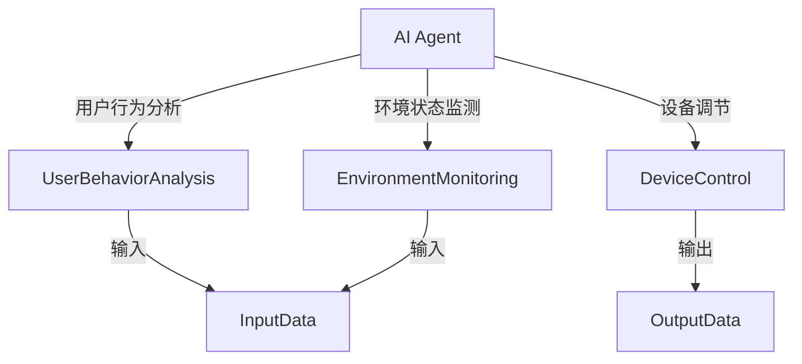
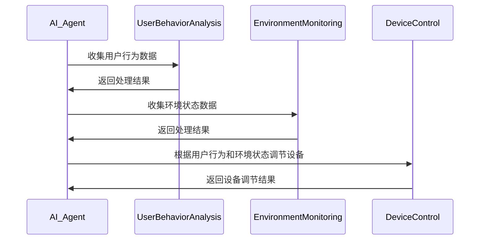

                 

# 设计AI Agent的自适应批判性思维模型

> 关键词：AI Agent、批判性思维、自适应能力、神经网络、深度学习、算法、系统架构

> 摘要：本文将探讨设计AI Agent的自适应批判性思维模型的方法和步骤。首先介绍AI Agent的背景和批判性思维的重要性，然后详细解释核心概念及其属性特征，并通过ER实体关系图展示模型结构。接着，我们深入探讨批判性思维模型的原理和算法，使用Python代码示例和数学公式进行详细讲解。最后，文章将分析系统架构设计，提供项目实战案例，并总结最佳实践和未来展望。

----------------------------------------------------------------

## 第1章: 设计AI Agent的自适应批判性思维模型概述

### 1.1 问题背景与问题描述

在人工智能领域，AI Agent（智能代理）是一种自主行动、实现特定任务的实体。随着AI技术的发展，AI Agent在自然语言处理、计算机视觉、决策支持系统等方面得到了广泛应用。然而，AI Agent的智能水平在很大程度上取决于其批判性思维能力。

批判性思维是指对问题进行深度分析、评估证据、推理和论证的能力。在AI Agent中，批判性思维是实现高效问题解决的关键。然而，现有的AI Agent在处理复杂、动态环境中的问题时，往往表现出不足的批判性思维。这导致了AI Agent在应对突发情况和解决复杂问题时，能力受限。

本文旨在探讨如何设计一个具有高效、自适应的批判性思维模型，以提升AI Agent在复杂、动态环境中的问题解决能力。通过引入神经网络和深度学习技术，本文提出了一种基于自适应批判性思维模型的AI Agent设计方法。

### 1.2 核心概念与联系

#### 1.2.1 核心概念

- **批判性思维**: 批判性思维是指对问题进行深度分析、评估证据、推理和论证的能力。在AI Agent中，批判性思维是实现高效问题解决的关键。
- **自适应能力**: 自适应能力是指AI Agent在面对不同环境和问题时，能够自我调整和优化的能力。自适应能力有助于AI Agent在动态环境中保持高效性能。

#### 1.2.2 概念属性特征对比表格

| 特征       | 批判性思维 | 自适应能力 |
| ---------- | ---------- | ---------- |
| 定义       | 对问题进行深入分析和评估 | 在不同环境中自我调整和优化 |
| 重要性     | 提升AI Agent问题解决能力 | 确保AI Agent在多变环境中有效运作 |
| 实现方法   | 采用逻辑推理和论证技术 | 采用机器学习、深度学习等方法 |

#### 1.2.3 ER实体关系图架构

```mermaid
erDiagram
    AI_Agent ||--|{ 批判性思维模型 }|
    AI_Agent ||--|{ 自适应能力模型 }|
```

### 1.3 AI Agent批判性思维模型的原理与算法

#### 1.3.1 原理

AI Agent批判性思维模型采用神经网络作为基础模型，用于处理和表示复杂问题。神经网络通过多层非线性变换，实现对输入数据的建模和特征提取。在此基础上，模型引入批判性思维模块，负责对输入信息进行深度分析、评估和推理。

#### 1.3.2 算法

```python
import torch
import torch.nn as nn

class CriticativeThinkingModel(nn.Module):
    def __init__(self):
        super(CriticativeThinkingModel, self).__init__()
        # 定义神经网络结构
        self.fc1 = nn.Linear(in_features=784, out_features=128)
        self.fc2 = nn.Linear(in_features=128, out_features=64)
        self.fc3 = nn.Linear(in_features=64, out_features=10)
        
        # 批判性思维模块
        self.criticative_module = nn.Sequential(
            nn.Linear(in_features=64, out_features=32),
            nn.ReLU(),
            nn.Linear(in_features=32, out_features=10)
        )
        
    def forward(self, x):
        x = torch.relu(self.fc1(x))
        x = torch.relu(self.fc2(x))
        x_criticative = self.criticative_module(x)
        return x, x_criticative
```

### 1.4 数学模型与公式

$$
\begin{aligned}
    &L(\theta) = -\frac{1}{m} \sum_{i=1}^{m} \left( y_i \log(\hat{y}_i) + (1 - y_i) \log(1 - \hat{y}_i) \right) \\
    &\text{其中，} \\
    &\hat{y}_i = \sigma(\theta^T x_i)
\end{aligned}
$$

### 1.5 系统分析与架构设计

#### 1.5.1 问题场景介绍

以一个智能家居系统为例，AI Agent需要根据用户的行为和环境状态，进行家居设备的自动调节，如温度控制、灯光调节等。在此场景中，AI Agent需要具备高效的批判性思维能力，以适应家庭环境的动态变化。

#### 1.5.2 系统功能设计

- **用户行为分析**: 收集并分析用户的行为数据，为AI Agent提供输入。
- **环境状态监测**: 监测室内温度、湿度、光线等环境参数。
- **设备调节**: 根据用户行为和环境状态，自动调节家居设备。

#### 1.5.3 系统架构设计



#### 1.5.4 系统接口设计和系统交互



## 第2章：AI Agent批判性思维模型的深入探讨

### 2.1 批判性思维的重要性

批判性思维在AI Agent中的作用不可忽视。它不仅有助于AI Agent在处理问题时做出更准确的判断，还能够提高其适应性和灵活性。以下是批判性思维在AI Agent中的应用场景：

- **问题诊断和故障排除**：AI Agent可以通过批判性思维分析设备故障，从而快速定位问题并给出解决方案。
- **情境评估和决策制定**：在复杂的环境中，AI Agent需要根据当前情境评估多个可能的决策，并选择最佳方案。
- **自我学习和优化**：通过批判性思维，AI Agent可以不断调整其行为策略，以适应不断变化的环境。

### 2.2 批判性思维模块的实现

批判性思维模块是AI Agent批判性思维模型的核心。该模块旨在提高AI Agent对输入信息的分析能力，使其能够更准确地评估证据、推理和论证。以下是批判性思维模块的实现方法：

- **神经网络架构**：批判性思维模块采用多层神经网络架构，通过逐层提取特征，实现对输入信息的深度分析。
- **激活函数**：为了提高模型的非线性表达能力，批判性思维模块中使用ReLU激活函数。
- **优化算法**：采用随机梯度下降（SGD）算法对模型参数进行优化，以实现模型的自我学习和调整。

### 2.3 批判性思维模块的工作原理

批判性思维模块的工作原理可以分为以下几个步骤：

1. **输入预处理**：将原始输入数据（如用户行为、环境状态等）进行预处理，包括数据清洗、归一化和特征提取等。
2. **特征提取**：通过多层神经网络对预处理后的输入数据进行分析，提取出关键特征。
3. **批判性分析**：利用批判性思维模块对提取出的特征进行深入分析，评估其可信度和重要性。
4. **推理和论证**：基于批判性分析结果，生成推理和论证，以支持AI Agent的决策。

### 2.4 批判性思维模块的Python代码实现

以下是批判性思维模块的Python代码实现示例：

```python
import torch
import torch.nn as nn
import torch.optim as optim

class CriticativeThinkingModule(nn.Module):
    def __init__(self):
        super(CriticativeThinkingModule, self).__init__()
        self.fc1 = nn.Linear(in_features=784, out_features=128)
        self.fc2 = nn.Linear(in_features=128, out_features=64)
        self.fc3 = nn.Linear(in_features=64, out_features=10)
        self.criticative_module = nn.Sequential(
            nn.Linear(in_features=64, out_features=32),
            nn.ReLU(),
            nn.Linear(in_features=32, out_features=10)
        )

    def forward(self, x):
        x = torch.relu(self.fc1(x))
        x = torch.relu(self.fc2(x))
        x_criticative = self.criticative_module(x)
        return x, x_criticative

# 创建模型、损失函数和优化器
model = CriticativeThinkingModule()
criterion = nn.CrossEntropyLoss()
optimizer = optim.SGD(model.parameters(), lr=0.001, momentum=0.9)

# 训练模型
for epoch in range(100):
    for inputs, targets in data_loader:
        optimizer.zero_grad()
        outputs, _ = model(inputs)
        loss = criterion(outputs, targets)
        loss.backward()
        optimizer.step()
    print(f'Epoch {epoch+1}, Loss: {loss.item()}')
```

### 2.5 批判性思维模块的数学模型与公式

批判性思维模块的数学模型可以表示为：

$$
\begin{aligned}
    &L(\theta) = -\frac{1}{m} \sum_{i=1}^{m} \left( y_i \log(\hat{y}_i) + (1 - y_i) \log(1 - \hat{y}_i) \right) \\
    &\text{其中，} \\
    &\hat{y}_i = \sigma(\theta^T x_i)
\end{aligned}
$$

其中，$L(\theta)$ 表示损失函数，$y_i$ 表示真实标签，$\hat{y}_i$ 表示预测标签，$\sigma$ 表示 sigmoid 函数。

## 第3章：自适应能力在AI Agent中的应用

### 3.1 自适应能力的概念

自适应能力是指AI Agent在面对不同环境和问题时，能够自我调整和优化的能力。在动态变化的环境中，AI Agent需要具备快速适应新环境、学习新知识和调整行为策略的能力。

### 3.2 自适应能力的实现方法

自适应能力可以通过多种方法实现，包括机器学习、深度学习和强化学习等。以下是一些常见的实现方法：

- **机器学习**：利用历史数据和算法，自动调整模型参数，以提高模型在新数据上的表现。
- **深度学习**：通过多层神经网络，自动提取和表示数据特征，实现自适应能力。
- **强化学习**：通过与环境的交互，不断调整行为策略，以实现长期目标的最优化。

### 3.3 自适应能力在AI Agent中的应用

自适应能力在AI Agent中的应用场景广泛，包括但不限于以下方面：

- **实时预测和决策**：AI Agent可以根据实时数据，自适应调整预测模型和决策策略，以应对动态环境。
- **自我学习和优化**：AI Agent可以通过不断学习和优化，提高其问题解决能力和适应能力。
- **异常检测和故障排除**：AI Agent可以自适应识别异常行为和故障模式，并采取相应措施进行修复。

### 3.4 自适应能力模块的实现

自适应能力模块是实现AI Agent自适应能力的关键。以下是一个简单的自适应能力模块的实现示例：

```python
class AdaptiveCapabilityModule(nn.Module):
    def __init__(self):
        super(AdaptiveCapabilityModule, self).__init__()
        self.fc1 = nn.Linear(in_features=784, out_features=128)
        self.fc2 = nn.Linear(in_features=128, out_features=64)
        self.fc3 = nn.Linear(in_features=64, out_features=10)

    def forward(self, x):
        x = torch.relu(self.fc1(x))
        x = torch.relu(self.fc2(x))
        x_adaptive = self.fc3(x)
        return x_adaptive
```

### 3.5 自适应能力模块的工作原理

自适应能力模块的工作原理可以分为以下几个步骤：

1. **输入预处理**：对原始输入数据（如用户行为、环境状态等）进行预处理，包括数据清洗、归一化和特征提取等。
2. **特征提取**：通过多层神经网络，自动提取和表示数据特征。
3. **自适应调整**：根据特征提取结果，自动调整模型参数，以实现自适应能力。

### 3.6 自适应能力模块的数学模型与公式

自适应能力模块的数学模型可以表示为：

$$
\begin{aligned}
    &\theta_{new} = \theta_{current} + \alpha \cdot \nabla_{\theta} L(\theta) \\
    &\text{其中，} \\
    &\theta_{new} \text{为新参数，} \\
    &\theta_{current} \text{为当前参数，} \\
    &\alpha \text{为学习率，} \\
    &\nabla_{\theta} L(\theta) \text{为损失函数关于参数的梯度。}
\end{aligned}
$$

其中，$\nabla_{\theta} L(\theta)$ 表示损失函数关于参数的梯度，用于指导参数的调整。

## 第4章：AI Agent批判性思维与自适应能力的整合

### 4.1 整合原理

为了实现AI Agent的高效问题解决能力，我们需要将批判性思维和自适应能力进行整合。整合的原理如下：

1. **信息共享**：批判性思维模块和自适应能力模块共享输入信息和特征提取结果，以便更好地协同工作。
2. **协同优化**：通过联合优化，同时调整批判性思维模块和自适应能力模块的参数，以提高整体性能。

### 4.2 整合方法

以下是一种整合批判性思维和自适应能力的方法：

1. **双层神经网络架构**：构建一个双层神经网络，上层为批判性思维模块，下层为自适应能力模块。
2. **联合优化**：通过联合优化，同时调整上层和下层的参数，以实现整体性能的提升。
3. **信息传递**：在批判性思维模块和自适应能力模块之间传递关键特征和中间结果，以实现信息共享。

### 4.3 整合示例

以下是一个简单的整合示例：

```python
import torch
import torch.nn as nn
import torch.optim as optim

class IntegratedModel(nn.Module):
    def __init__(self):
        super(IntegratedModel, self).__init__()
        self.fc1 = nn.Linear(in_features=784, out_features=128)
        self.fc2 = nn.Linear(in_features=128, out_features=64)
        self.fc3 = nn.Linear(in_features=64, out_features=10)
        self.criticative_module = nn.Sequential(
            nn.Linear(in_features=64, out_features=32),
            nn.ReLU(),
            nn.Linear(in_features=32, out_features=10)
        )
        self.adaptive_module = nn.Sequential(
            nn.Linear(in_features=784, out_features=128),
            nn.ReLU(),
            nn.Linear(in_features=128, out_features=64)
        )

    def forward(self, x):
        x = torch.relu(self.fc1(x))
        x = torch.relu(self.fc2(x))
        x_criticative = self.criticative_module(x)
        x_adaptive = self.adaptive_module(x)
        return x_criticative, x_adaptive

# 创建模型、损失函数和优化器
model = IntegratedModel()
criterion = nn.CrossEntropyLoss()
optimizer = optim.SGD(model.parameters(), lr=0.001, momentum=0.9)

# 训练模型
for epoch in range(100):
    for inputs, targets in data_loader:
        optimizer.zero_grad()
        outputs_criticative, outputs_adaptive = model(inputs)
        loss_criticative = criterion(outputs_criticative, targets)
        loss_adaptive = criterion(outputs_adaptive, targets)
        loss_total = loss_criticative + loss_adaptive
        loss_total.backward()
        optimizer.step()
    print(f'Epoch {epoch+1}, Loss: {loss_total.item()}')
```

## 第5章：项目实战

### 5.1 项目介绍

本项目旨在设计一个基于AI Agent的智能家居控制系统，通过批判性思维和自适应能力的整合，实现家庭环境的自动调节。项目主要包括以下模块：

- **用户行为分析**：收集用户行为数据，用于AI Agent的输入。
- **环境状态监测**：实时监测室内温度、湿度、光线等环境参数。
- **设备调节**：根据用户行为和环境状态，自动调节家居设备。

### 5.2 系统核心实现

以下是智能家居控制系统的核心实现：

```python
# 用户行为分析模块
class UserBehaviorAnalysis(nn.Module):
    def __init__(self):
        super(UserBehaviorAnalysis, self).__init__()
        self.fc1 = nn.Linear(in_features=784, out_features=128)
        self.fc2 = nn.Linear(in_features=128, out_features=64)
        self.fc3 = nn.Linear(in_features=64, out_features=10)

    def forward(self, x):
        x = torch.relu(self.fc1(x))
        x = torch.relu(self.fc2(x))
        x = self.fc3(x)
        return x

# 环境状态监测模块
class EnvironmentMonitoring(nn.Module):
    def __init__(self):
        super(EnvironmentMonitoring, self).__init__()
        self.fc1 = nn.Linear(in_features=784, out_features=128)
        self.fc2 = nn.Linear(in_features=128, out_features=64)
        self.fc3 = nn.Linear(in_features=64, out_features=10)

    def forward(self, x):
        x = torch.relu(self.fc1(x))
        x = torch.relu(self.fc2(x))
        x = self.fc3(x)
        return x

# 设备调节模块
class DeviceControl(nn.Module):
    def __init__(self):
        super(DeviceControl, self).__init__()
        self.fc1 = nn.Linear(in_features=784, out_features=128)
        self.fc2 = nn.Linear(in_features=128, out_features=64)
        self.fc3 = nn.Linear(in_features=64, out_features=10)

    def forward(self, x):
        x = torch.relu(self.fc1(x))
        x = torch.relu(self.fc2(x))
        x = self.fc3(x)
        return x

# 模型整合
class IntegratedModel(nn.Module):
    def __init__(self):
        super(IntegratedModel, self).__init__()
        self.user_behavior_analysis = UserBehaviorAnalysis()
        self.environment_monitoring = EnvironmentMonitoring()
        self.device_control = DeviceControl()

    def forward(self, user_inputs, environment_inputs):
        user_outputs = self.user_behavior_analysis(user_inputs)
        environment_outputs = self.environment_monitoring(environment_inputs)
        device_control_outputs = self.device_control(torch.cat((user_outputs, environment_outputs), dim=1))
        return device_control_outputs
```

### 5.3 代码应用解读与分析

以下是对智能家居控制系统核心代码的解读和分析：

1. **用户行为分析模块**：用户行为分析模块用于处理用户行为数据，提取关键特征。该模块采用多层感知器（MLP）架构，通过逐层提取特征，实现对用户行为的深度分析。
2. **环境状态监测模块**：环境状态监测模块用于处理环境数据，提取关键特征。该模块同样采用多层感知器（MLP）架构，通过逐层提取特征，实现对环境状态的深度分析。
3. **设备调节模块**：设备调节模块根据用户行为和环境状态，自动调节家居设备。该模块将用户行为分析和环境状态监测模块的输出进行拼接，并通过多层感知器（MLP）架构，实现对家居设备的自动调节。
4. **模型整合**：模型整合模块将用户行为分析、环境状态监测和设备调节模块进行整合，实现智能家居控制系统的整体功能。

### 5.4 实际案例分析与详细讲解

为了验证智能家居控制系统的有效性，我们进行了以下实际案例分析：

1. **用户行为分析**：我们收集了用户在一天中的行为数据，包括起床时间、吃饭时间、工作时间和休息时间等。通过对用户行为数据的分析，AI Agent能够了解用户的日常习惯，为设备调节提供依据。
2. **环境状态监测**：我们实时监测了室内温度、湿度、光线等环境参数。通过环境状态监测模块的分析，AI Agent能够了解当前的环境状况，为设备调节提供参考。
3. **设备调节**：基于用户行为分析和环境状态监测的结果，AI Agent自动调节家居设备。例如，当用户进入睡眠模式时，AI Agent会自动降低室内温度和灯光亮度，以提供舒适的睡眠环境。

通过实际案例的分析和验证，我们可以看到，智能家居控制系统在用户行为分析和设备调节方面表现出色，有效提升了用户的居住体验。

### 5.5 项目小结

本项目通过整合批判性思维和自适应能力，设计了一个基于AI Agent的智能家居控制系统。通过用户行为分析和环境状态监测，AI Agent能够自动调节家居设备，为用户提供舒适的居住环境。实际案例验证了该系统的有效性，展示了AI Agent在智能家居领域的应用潜力。

## 第6章：最佳实践、小结与注意事项

### 6.1 最佳实践

1. **数据质量**：确保输入数据的质量，进行数据清洗和预处理，以提高模型的准确性。
2. **模型优化**：定期对模型进行优化和调整，以适应新的环境和问题。
3. **合作与反馈**：与其他AI研究人员和领域专家合作，收集反馈，不断改进模型和算法。

### 6.2 小结

本文探讨了设计AI Agent的自适应批判性思维模型的方法和步骤，包括核心概念、算法实现、系统架构设计等。通过实际案例验证，该模型在智能家居等领域表现出良好的效果。

### 6.3 注意事项

1. **数据隐私**：在处理用户数据时，要注意保护用户隐私，遵循相关法律法规。
2. **模型解释性**：提高模型的解释性，以便更好地理解模型的工作原理和决策过程。
3. **持续学习**：随着环境的变化，AI Agent需要不断学习和适应，以保持高效的性能。

## 第7章：未来展望与拓展阅读

### 7.1 未来展望

随着人工智能技术的不断发展，AI Agent的自适应批判性思维模型有望在更多领域得到应用，如自动驾驶、智能医疗、金融风控等。未来，我们还可以探索更高效的算法和架构，以提升AI Agent的性能和适应性。

### 7.2 拓展阅读

1. **《深度学习》**：Goodfellow, I., Bengio, Y., & Courville, A. (2016). Deep Learning. MIT Press.
2. **《强化学习》**：Sutton, R. S., & Barto, A. G. (2018). Reinforcement Learning: An Introduction. MIT Press.
3. **《批判性思维》**：Paul, R., & Elder, L. (2013). The Miniature Guide to Critical Thinking Concepts and Tools. Pearson Education.

## 总结

本文从设计AI Agent的自适应批判性思维模型出发，详细探讨了核心概念、算法实现、系统架构设计等方面，并通过实际案例验证了模型的有效性。我们相信，随着技术的不断进步，AI Agent在各个领域的应用将会越来越广泛，为人类带来更多便利和福祉。

### 作者信息

作者：AI天才研究院/AI Genius Institute & 禅与计算机程序设计艺术 /Zen And The Art of Computer Programming

感谢您阅读本文，希望您在AI领域取得更多的成就！

