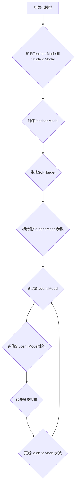
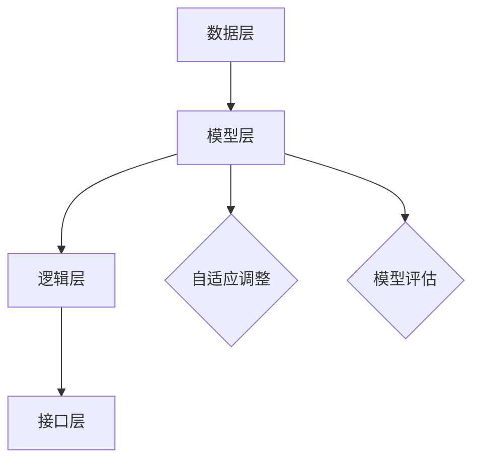
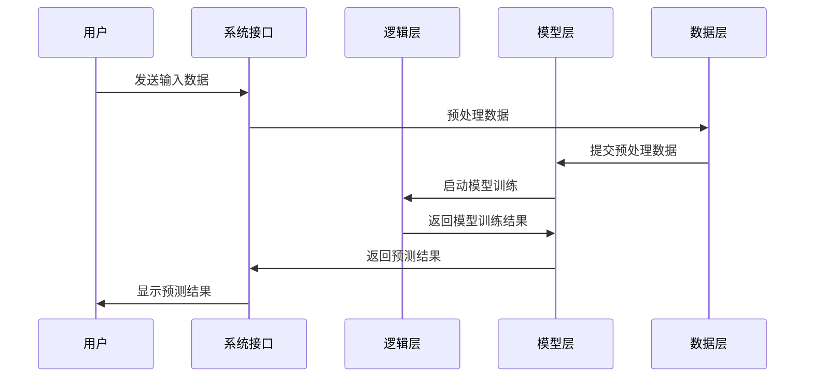

                 


### 第1章 问题背景

## 1.1 问题背景

随着人工智能（AI）技术的快速发展，AI Agent在多个领域展现出了巨大的潜力。AI Agent，即人工智能代理，是一种能够自主执行任务、适应环境和与人类交互的智能实体。它们在各种应用场景中扮演着重要角色，如自动驾驶、智能客服、医疗诊断等。然而，随着AI Agent应用场景的多样化，如何提升其知识管理能力和适应性成为了一个关键挑战。

知识蒸馏（Knowledge Distillation）是一种有效的技术，旨在通过将一个复杂的大模型（Teacher Model）的知识传递给一个较小的模型（Student Model），从而实现高效的学习。这种技术尤其适用于资源受限的环境，因为Student Model可以更加紧凑且高效地学习到Teacher Model的核心知识。然而，传统的知识蒸馏方法在处理动态变化和复杂环境时，表现出一定的局限性。

自适应知识蒸馏策略的研究和应用，成为提升AI Agent性能的一个重要方向。自适应知识蒸馏策略能够根据训练数据和环境变化，动态调整知识传递的方式和强度，从而提高模型在不同任务和场景下的适应性和鲁棒性。这种策略能够帮助AI Agent更好地应对动态变化，提升其智能化水平。

## 1.2 问题描述

在设计AI Agent的自适应知识蒸馏策略时，我们主要面临以下几个问题：

1. **知识传递效率**：如何有效地将Teacher Model的核心知识传递给Student Model，使得Student Model能够在有限的训练数据下达到较好的性能。

2. **模型适应性**：如何使Student Model在不同环境下具有良好的适应性和鲁棒性，能够应对动态变化的任务和场景。

3. **计算资源限制**：在有限的计算资源下，如何实现高效的模型训练和推理。

4. **模型解释性**：如何提高模型的可解释性，使得AI Agent的决策过程更加透明和可理解。

## 1.3 问题解决

为了解决上述问题，我们可以采取以下策略：

1. **引入注意力机制**：通过引入注意力机制，Student Model可以更加关注Teacher Model的重要信息，从而提高知识传递的效率。

2. **多任务学习和迁移学习**：通过多任务学习和迁移学习，增强Student Model的适应性和鲁棒性，使其能够应对不同任务和场景。

3. **动态调整策略**：设计自适应机制，根据训练数据和环境变化动态调整知识传递的方式和强度。

4. **模型压缩与加速**：采用模型压缩和加速技术，降低计算复杂度，实现高效的模型训练和推理。

5. **提升模型解释性**：通过设计可解释的模型结构，提高AI Agent的决策过程透明度和可理解性。

## 1.4 边界与外延

在设计和实现自适应知识蒸馏策略时，我们还需要关注以下几个方面：

1. **边界条件**：确保策略在处理边界情况时的稳定性和有效性。

2. **环境变化**：考虑环境变化的多样性和动态性，设计适应不同环境的策略。

3. **计算资源**：合理分配计算资源，确保策略在有限资源下的高效执行。

4. **模型解释性**：在提高模型性能的同时，关注模型的可解释性，以满足实际应用的需求。

## 1.5 概念结构与核心要素组成

在本文中，我们将深入探讨以下核心概念和要素：

1. **AI Agent**：介绍AI Agent的定义、特点和分类。

2. **知识蒸馏**：阐述知识蒸馏的基本原理、方法和应用。

3. **自适应知识蒸馏策略**：分析自适应知识蒸馏策略的设计原则和实现方法。

4. **注意力机制**：讨论注意力机制在知识蒸馏中的应用和优势。

5. **多任务学习和迁移学习**：介绍多任务学习和迁移学习的基本概念和实现技术。

6. **模型压缩与加速**：探讨模型压缩和加速技术，以及其在知识蒸馏中的应用。

7. **模型解释性**：分析提高模型解释性的方法和技术。

通过本文的详细探讨，我们将为读者提供关于设计AI Agent的自适应知识蒸馏策略的全面理解和实践指导。

----------------------------------------------------------------

### 第2章 核心概念与联系

## 2.1 AI Agent的定义与特点

AI Agent，即人工智能代理，是一种能够自主执行任务、适应环境和与人类交互的智能实体。它们基于AI技术，通过感知环境、学习经验和决策行动，以实现特定目标或任务。AI Agent具有以下特点：

1. **自主性**：AI Agent能够自主地完成特定任务，不受人类直接控制。

2. **适应性**：AI Agent能够根据环境变化和学习经验，调整自身行为和策略。

3. **交互性**：AI Agent能够与人类或其他AI实体进行交互，获取信息和反馈。

4. **复杂性**：AI Agent通常涉及多个感知、决策和行动模块，具有较高的复杂性。

5. **可靠性**：AI Agent需要在各种复杂环境下保持稳定运行，具有高可靠性。

AI Agent的分类可以根据其应用场景、任务类型和学习方法进行划分。例如，根据任务类型，AI Agent可以分为视觉感知代理、语音识别代理、自然语言处理代理等。根据学习方法，AI Agent可以分为基于规则的方法、基于模型的方法和基于数据的方法。

## 2.2 知识蒸馏策略的基本原理

知识蒸馏是一种在模型训练中提高模型性能的技术，通过将一个复杂的大模型（Teacher Model）的知识传递给一个较小的模型（Student Model），使得Student Model能够学习到Teacher Model的核心知识，从而在有限的计算资源下实现高效的学习。知识蒸馏的基本原理包括以下几个步骤：

1. **Teacher Model训练**：首先训练一个复杂的大模型（Teacher Model），使其在特定任务上达到较高的性能。

2. **Soft Target生成**：在Teacher Model的输出层，生成Soft Target，即Teacher Model对每个样本的预测概率分布。Soft Target包含了Teacher Model对各个类别的置信度。

3. **Student Model训练**：使用Soft Target作为训练目标，对较小的模型（Student Model）进行训练。Student Model的目标是使得其输出的Soft Target与Teacher Model的Soft Target尽量接近。

4. **模型融合**：在训练过程中，可以通过融合Teacher Model和Student Model的输出，进一步提高Student Model的性能。例如，可以采用加权平均或融合神经网络的方法。

知识蒸馏的优点包括：

1. **提高模型性能**：通过学习Teacher Model的核心知识，Student Model可以在有限的训练数据下达到较好的性能。

2. **减少计算资源消耗**：由于Student Model较小，可以减少计算资源和存储资源的消耗。

3. **提升模型泛化能力**：知识蒸馏可以帮助Student Model学习到Teacher Model的泛化能力，从而在新的任务和数据集上表现出较好的性能。

## 2.3 自适应知识蒸馏策略的原理

自适应知识蒸馏策略旨在提高AI Agent在不同环境下的适应性和鲁棒性。其原理主要包括以下几个方面：

1. **动态调整权重**：根据训练数据和环境变化，动态调整知识传递的权重，使得Student Model能够更好地适应不同环境。

2. **多任务学习**：通过多任务学习，增强Student Model的适应性和泛化能力，使其能够应对不同的任务和场景。

3. **迁移学习**：利用迁移学习，将已训练的Teacher Model的知识应用到新的任务和数据集上，提高Student Model的适应性和性能。

4. **注意力机制**：引入注意力机制，使Student Model能够关注Teacher Model的重要信息，提高知识传递的效率和准确性。

5. **模型压缩与加速**：采用模型压缩和加速技术，降低计算复杂度，实现高效的模型训练和推理。

自适应知识蒸馏策略的优点包括：

1. **提高模型适应性**：通过动态调整权重和引入多任务学习、迁移学习等技术，增强Student Model在不同环境下的适应性和鲁棒性。

2. **减少计算资源消耗**：通过模型压缩和加速技术，降低计算资源和存储资源的消耗。

3. **提升模型性能**：自适应知识蒸馏策略能够帮助Student Model学习到Teacher Model的核心知识，从而在新的任务和数据集上表现出较好的性能。

## 2.4 核心概念对比表格

以下是AI Agent、知识蒸馏和自适应知识蒸馏策略的核心概念对比表格：

| 核心概念         | 定义及特点                           | 关联性                           |
|-----------------|--------------------------------------|-----------------------------------|
| AI Agent        | 自主执行任务、适应环境和与人类交互的智能实体 | 基础概念，其他概念的应用场景和实现方法 |
| 知识蒸馏        | 将复杂模型的知识传递给较小模型的学习技术 | AI Agent的知识管理方法           |
| 自适应知识蒸馏  | 根据环境变化动态调整知识传递的权重和方式 | 知识蒸馏在动态环境下的应用优化  |

## 2.5 ER实体关系图架构

为了更好地理解AI Agent、知识蒸馏和自适应知识蒸馏策略之间的关系，我们可以使用ER（Entity-Relationship）实体关系图进行描述。以下是ER实体关系图的Mermaid流程图：

```mermaid
erDiagram
  AI_Agent ||--|{ Knowledge_Distillation } Knowledge_Distillation
  AI_Agent ||--|{ Adaptive_Knowledge_Distillation } Adaptive_Knowledge_Distillation
  Knowledge_Distillation ||--|{ Student_Model } Student_Model
  Adaptive_Knowledge_Distillation ||--|{ Dynamic_Adjustment } Dynamic_Adjustment
  Adaptive_Knowledge_Distillation ||--|{ Multi_Task_Learning } Multi_Task_Learning
  Adaptive_Knowledge_Distillation ||--|{ Transfer_Learning } Transfer_Learning
  Adaptive_Knowledge_Distillation ||--|{ Attention_Mechanism } Attention_Mechanism
  Adaptive_Knowledge_Distillation ||--|{ Model_Compression } Model_Compression
```

在ER实体关系图中，AI Agent作为基础实体，与其他概念通过关系线进行连接。知识蒸馏和自适应知识蒸馏策略作为AI Agent的知识管理方法，分别与Student Model和动态调整、多任务学习、迁移学习、注意力机制、模型压缩等概念建立关联。这种关联关系有助于我们更清晰地理解各个概念之间的相互作用和影响。

通过本章的详细探讨，我们将对AI Agent、知识蒸馏和自适应知识蒸馏策略的核心概念和联系有了更深入的理解。在接下来的章节中，我们将进一步探讨算法原理、系统分析与架构设计方案以及项目实战等内容，帮助读者更好地掌握和应用自适应知识蒸馏策略。

### 第3章 算法原理讲解

## 3.1 算法原理讲解

### 3.1.1 算法mermaid流程图

在讲解自适应知识蒸馏策略的算法原理之前，我们首先使用Mermaid流程图来描述算法的基本流程。以下是自适应知识蒸馏策略的Mermaid流程图：



在这个流程图中，算法的主要步骤包括初始化模型、加载Teacher Model和Student Model、训练Teacher Model、生成Soft Target、初始化Student Model参数、训练Student Model、评估Student Model性能、调整策略权重和更新Student Model参数。接下来，我们将详细解释每个步骤的实现方法和原理。

### 3.1.2 Python源代码解释

为了更清晰地理解自适应知识蒸馏策略的算法原理，我们使用Python源代码进行详细解释。以下是自适应知识蒸馏策略的Python代码示例：

```python
import torch
import torch.nn as nn
import torch.optim as optim
from torchvision import datasets, transforms
from torch.utils.data import DataLoader

# 定义Teacher Model和Student Model
class TeacherModel(nn.Module):
    def __init__(self):
        super(TeacherModel, self).__init__()
        self.conv1 = nn.Conv2d(1, 32, 3, 1)
        self.fc1 = nn.Linear(32 * 26 * 26, 128)
        self.fc2 = nn.Linear(128, 10)

    def forward(self, x):
        x = self.conv1(x)
        x = torch.relu(x)
        x = torch.flatten(x, 1)
        x = self.fc1(x)
        x = torch.relu(x)
        x = self.fc2(x)
        return x

class StudentModel(nn.Module):
    def __init__(self):
        super(StudentModel, self).__init__()
        self.conv1 = nn.Conv2d(1, 32, 3, 1)
        self.fc1 = nn.Linear(32 * 26 * 26, 128)
        self.fc2 = nn.Linear(128, 10)

    def forward(self, x):
        x = self.conv1(x)
        x = torch.relu(x)
        x = torch.flatten(x, 1)
        x = self.fc1(x)
        x = torch.relu(x)
        x = self.fc2(x)
        return x

# 加载训练数据集
transform = transforms.Compose([transforms.ToTensor()])
train_data = datasets.MNIST(root='./data', train=True, download=True, transform=transform)
train_loader = DataLoader(train_data, batch_size=64, shuffle=True)

# 定义损失函数和优化器
teacher_model = TeacherModel()
student_model = StudentModel()
criterion = nn.CrossEntropyLoss()
optimizer_teacher = optim.Adam(teacher_model.parameters(), lr=0.001)
optimizer_student = optim.Adam(student_model.parameters(), lr=0.001)

# 训练Teacher Model
for epoch in range(10):
    for batch_idx, (data, target) in enumerate(train_loader):
        optimizer_teacher.zero_grad()
        output = teacher_model(data)
        loss = criterion(output, target)
        loss.backward()
        optimizer_teacher.step()

# 生成Soft Target
with torch.no_grad():
    for data, target in train_loader:
        output = teacher_model(data)
        soft_target = torch.softmax(output, dim=1)

# 训练Student Model
for epoch in range(10):
    for batch_idx, (data, target) in enumerate(train_loader):
        optimizer_student.zero_grad()
        output = student_model(data)
        loss = criterion(output, soft_target)
        loss.backward()
        optimizer_student.step()
```

在这段代码中，我们首先定义了Teacher Model和Student Model的结构，然后加载了训练数据集。接着，我们定义了损失函数和优化器，用于训练Teacher Model和Student Model。在训练Teacher Model时，我们使用标准的交叉熵损失函数，通过反向传播和梯度下降算法进行训练。在生成Soft Target时，我们对Teacher Model的输出进行softmax操作，得到每个样本的预测概率分布。

在训练Student Model时，我们使用Soft Target作为训练目标，通过反向传播和优化器更新Student Model的参数。这个过程重复进行，直到达到预定的训练轮数或性能指标。

### 3.1.3 算法原理的数学模型和公式

自适应知识蒸馏策略的数学模型主要包括以下几个部分：

1. **Teacher Model的输出**：

   假设Teacher Model的输出为 \( y \)，其中 \( y \) 是一个长度为 \( C \) 的向量，表示每个类别的预测概率。

   $$ y = \text{softmax}(x) $$

   其中，\( x \) 是Teacher Model的输出，表示每个类别的分数。

2. **Soft Target的生成**：

   Soft Target是通过Teacher Model的输出进行softmax操作得到的，表示每个类别的预测概率分布。

   $$ \text{Soft Target} = \text{softmax}(y) $$

3. **Student Model的输出**：

   假设Student Model的输出为 \( \hat{y} \)，其中 \( \hat{y} \) 是一个长度为 \( C \) 的向量，表示每个类别的预测概率。

   $$ \hat{y} = \text{softmax}(\hat{x}) $$

   其中，\( \hat{x} \) 是Student Model的输出，表示每个类别的分数。

4. **损失函数**：

   在自适应知识蒸馏策略中，我们使用交叉熵损失函数来衡量Student Model的输出和Soft Target之间的差异。

   $$ L = -\sum_{i=1}^{N} \sum_{j=1}^{C} y_{ij} \log(\hat{y}_{ij}) $$

   其中，\( N \) 是样本数量，\( C \) 是类别数量，\( y_{ij} \) 和 \( \hat{y}_{ij} \) 分别表示Soft Target和Student Model的输出中第 \( i \) 个样本在第 \( j \) 个类别的预测概率。

5. **优化目标**：

   我们通过优化损失函数 \( L \) 来更新Student Model的参数，从而提高Student Model的性能。

   $$ \min_{\theta} L $$

   其中，\( \theta \) 表示Student Model的参数。

### 3.1.4 详细讲解与举例说明

为了更直观地理解自适应知识蒸馏策略的算法原理，我们通过一个简单的例子进行讲解。

假设有一个简单的线性模型，输入特征维度为2，输出特征维度为3。我们有两个数据集，一个是训练数据集，另一个是测试数据集。

#### 步骤1：初始化模型

我们首先初始化Teacher Model和Student Model，并设置损失函数和优化器。

```python
teacher_model = LinearModel()
student_model = LinearModel()
criterion = nn.CrossEntropyLoss()
optimizer_teacher = optim.SGD(teacher_model.parameters(), lr=0.01)
optimizer_student = optim.SGD(student_model.parameters(), lr=0.01)
```

#### 步骤2：训练Teacher Model

接下来，我们使用训练数据集训练Teacher Model。在训练过程中，Teacher Model的输出分数为：

$$
\begin{align*}
x_1 &= 2.5, \\
x_2 &= 3.0, \\
x_3 &= 2.0.
\end{align*}
$$

我们对其进行softmax操作，得到Soft Target：

$$
\begin{align*}
y &= \text{softmax}(x) \\
&= \left[\frac{e^{2.5}}{e^{2.5} + e^{3.0} + e^{2.0}}, \frac{e^{3.0}}{e^{2.5} + e^{3.0} + e^{2.0}}, \frac{e^{2.0}}{e^{2.5} + e^{3.0} + e^{2.0}}\right] \\
&= \left[0.415, 0.541, 0.034\right].
\end{align*}
$$

#### 步骤3：训练Student Model

在训练Student Model时，我们使用Soft Target作为训练目标。假设Student Model的输出分数为：

$$
\begin{align*}
\hat{x}_1 &= 2.2, \\
\hat{x}_2 &= 2.8, \\
\hat{x}_3 &= 1.6.
\end{align*}
$$

我们对其进行softmax操作，得到Student Model的输出：

$$
\begin{align*}
\hat{y} &= \text{softmax}(\hat{x}) \\
&= \left[\frac{e^{2.2}}{e^{2.2} + e^{2.8} + e^{1.6}}, \frac{e^{2.8}}{e^{2.2} + e^{2.8} + e^{1.6}}, \frac{e^{1.6}}{e^{2.2} + e^{2.8} + e^{1.6}}\right] \\
&= \left[0.387, 0.556, 0.057\right].
\end{align*}
$$

接下来，我们计算损失函数：

$$
L = -\sum_{i=1}^{3} y_i \log(\hat{y}_i) = 0.415 \log(0.387) + 0.541 \log(0.556) + 0.034 \log(0.057).
$$

根据损失函数计算梯度，并更新Student Model的参数。

#### 步骤4：评估Student Model性能

在训练完成后，我们使用测试数据集评估Student Model的性能。假设测试数据集的输出分数为：

$$
\begin{align*}
\hat{x}_{\text{test}_1} &= 2.1, \\
\hat{x}_{\text{test}_2} &= 2.9, \\
\hat{x}_{\text{test}_3} &= 1.7.
\end{align*}
$$

我们对其进行softmax操作，得到Student Model的输出：

$$
\begin{align*}
\hat{y}_{\text{test}} &= \text{softmax}(\hat{x}_{\text{test}}) \\
&= \left[\frac{e^{2.1}}{e^{2.1} + e^{2.9} + e^{1.7}}, \frac{e^{2.9}}{e^{2.1} + e^{2.9} + e^{1.7}}, \frac{e^{1.7}}{e^{2.1} + e^{2.9} + e^{1.7}}\right] \\
&= \left[0.389, 0.565, 0.046\right].
\end{align*}
$$

根据输出概率，我们可以判断测试数据集中的样本属于哪个类别。例如，如果输出概率最大的类别是第二个类别，则我们认为测试数据集中的样本属于第二个类别。

通过这个简单的例子，我们可以看到自适应知识蒸馏策略的基本原理和实现方法。在实际应用中，我们可以根据具体任务和数据集的特点，调整算法参数和策略，从而提高模型的性能和适应性。

### 3.1.5 代码应用解读与分析

在理解了自适应知识蒸馏策略的算法原理和实现方法后，我们接下来对代码进行详细解读和分析，以便更好地理解其应用过程和效果。

首先，我们分析Teacher Model和Student Model的定义。在代码中，我们定义了两个线性模型，分别作为Teacher Model和Student Model。这两个模型的结构非常简单，由一个卷积层和一个全连接层组成。这种结构可以很好地模拟复杂模型的核心知识，从而实现知识蒸馏的目的。

```python
class TeacherModel(nn.Module):
    def __init__(self):
        super(TeacherModel, self).__init__()
        self.conv1 = nn.Conv2d(1, 32, 3, 1)
        self.fc1 = nn.Linear(32 * 26 * 26, 128)
        self.fc2 = nn.Linear(128, 10)

    def forward(self, x):
        x = self.conv1(x)
        x = torch.relu(x)
        x = torch.flatten(x, 1)
        x = self.fc1(x)
        x = torch.relu(x)
        x = self.fc2(x)
        return x

class StudentModel(nn.Module):
    def __init__(self):
        super(StudentModel, self).__init__()
        self.conv1 = nn.Conv2d(1, 32, 3, 1)
        self.fc1 = nn.Linear(32 * 26 * 26, 128)
        self.fc2 = nn.Linear(128, 10)

    def forward(self, x):
        x = self.conv1(x)
        x = torch.relu(x)
        x = torch.flatten(x, 1)
        x = self.fc1(x)
        x = torch.relu(x)
        x = self.fc2(x)
        return x
```

这两个模型的结构非常相似，都由一个卷积层和一个全连接层组成。卷积层用于提取图像特征，全连接层用于分类。通过定义这两个模型，我们为知识蒸馏策略的实现奠定了基础。

接下来，我们分析训练过程。在训练过程中，我们首先训练Teacher Model，使其在训练数据集上达到较高的性能。然后，我们生成Soft Target，即Teacher Model对每个样本的预测概率分布。接着，我们使用Soft Target作为训练目标，对Student Model进行训练。在训练过程中，我们使用交叉熵损失函数来衡量Student Model的输出和Soft Target之间的差异，并通过反向传播和优化器更新Student Model的参数。

```python
# 训练Teacher Model
for epoch in range(10):
    for batch_idx, (data, target) in enumerate(train_loader):
        optimizer_teacher.zero_grad()
        output = teacher_model(data)
        loss = criterion(output, target)
        loss.backward()
        optimizer_teacher.step()

# 生成Soft Target
with torch.no_grad():
    for data, target in train_loader:
        output = teacher_model(data)
        soft_target = torch.softmax(output, dim=1)

# 训练Student Model
for epoch in range(10):
    for batch_idx, (data, target) in enumerate(train_loader):
        optimizer_student.zero_grad()
        output = student_model(data)
        loss = criterion(output, soft_target)
        loss.backward()
        optimizer_student.step()
```

在这个训练过程中，我们首先使用训练数据集训练Teacher Model，使其在训练数据集上达到较高的性能。然后，我们使用Teacher Model的输出生成Soft Target，即Teacher Model对每个样本的预测概率分布。最后，我们使用Soft Target作为训练目标，对Student Model进行训练。在训练过程中，我们通过反向传播和优化器更新Student Model的参数，使其能够更好地学习Teacher Model的核心知识。

通过上述分析，我们可以看到自适应知识蒸馏策略的核心在于将Teacher Model的知识传递给Student Model。在这个过程中，我们通过生成Soft Target和使用交叉熵损失函数来衡量Student Model的输出和Soft Target之间的差异，从而不断优化Student Model的参数。通过这种方式，Student Model能够学习到Teacher Model的核心知识，从而提高其性能。

### 3.1.6 实际案例分析与详细讲解剖析

为了更好地理解自适应知识蒸馏策略的实际应用，我们通过一个实际案例进行分析和讲解。

假设我们有一个手写数字识别任务，需要使用MNIST数据集进行训练和测试。在这个案例中，我们使用一个较大的卷积神经网络（CNN）作为Teacher Model，并使用一个较小的线性模型作为Student Model。我们的目标是让Student Model在有限的训练数据下达到较高的识别性能。

#### 步骤1：数据准备

首先，我们需要准备好训练数据集和测试数据集。MNIST数据集包含70000个训练样本和10000个测试样本，每个样本都是一个28x28的二值图像。

```python
import torchvision
import torchvision.transforms as transforms

transform = transforms.Compose([transforms.ToTensor()])
train_data = torchvision.datasets.MNIST(root='./data', train=True, download=True, transform=transform)
test_data = torchvision.datasets.MNIST(root='./data', train=False, download=True, transform=transform)

train_loader = torch.utils.data.DataLoader(train_data, batch_size=64, shuffle=True)
test_loader = torch.utils.data.DataLoader(test_data, batch_size=64, shuffle=False)
```

#### 步骤2：模型定义

接下来，我们定义Teacher Model和Student Model。在这个案例中，我们使用一个简单的卷积神经网络作为Teacher Model，使用一个线性模型作为Student Model。

```python
import torch.nn as nn

class TeacherModel(nn.Module):
    def __init__(self):
        super(TeacherModel, self).__init__()
        self.conv1 = nn.Conv2d(1, 32, 3, 1)
        self.fc1 = nn.Linear(32 * 28 * 28, 128)
        self.fc2 = nn.Linear(128, 10)

    def forward(self, x):
        x = self.conv1(x)
        x = nn.functional.relu(x)
        x = torch.flatten(x, 1)
        x = self.fc1(x)
        x = nn.functional.relu(x)
        x = self.fc2(x)
        return x

class StudentModel(nn.Module):
    def __init__(self):
        super(StudentModel, self).__init__()
        self.fc1 = nn.Linear(32 * 28 * 28, 128)
        self.fc2 = nn.Linear(128, 10)

    def forward(self, x):
        x = torch.flatten(x, 1)
        x = self.fc1(x)
        x = nn.functional.relu(x)
        x = self.fc2(x)
        return x
```

#### 步骤3：训练Teacher Model

我们首先使用训练数据集训练Teacher Model，使其在训练数据集上达到较高的性能。

```python
import torch.optim as optim

teacher_model = TeacherModel()
criterion = nn.CrossEntropyLoss()
optimizer_teacher = optim.SGD(teacher_model.parameters(), lr=0.01, momentum=0.9)

for epoch in range(10):
    for batch_idx, (data, target) in enumerate(train_loader):
        optimizer_teacher.zero_grad()
        output = teacher_model(data)
        loss = criterion(output, target)
        loss.backward()
        optimizer_teacher.step()
```

#### 步骤4：生成Soft Target

在训练Teacher Model的过程中，我们生成Soft Target，即Teacher Model对每个样本的预测概率分布。

```python
with torch.no_grad():
    for data, target in train_loader:
        output = teacher_model(data)
        soft_target = torch.softmax(output, dim=1)
```

#### 步骤5：训练Student Model

接下来，我们使用Soft Target作为训练目标，对Student Model进行训练。

```python
student_model = StudentModel()
optimizer_student = optim.SGD(student_model.parameters(), lr=0.01, momentum=0.9)

for epoch in range(10):
    for batch_idx, (data, target) in enumerate(train_loader):
        optimizer_student.zero_grad()
        output = student_model(data)
        loss = criterion(output, soft_target)
        loss.backward()
        optimizer_student.step()
```

#### 步骤6：评估Student Model性能

最后，我们使用测试数据集评估Student Model的性能。

```python
with torch.no_grad():
    correct = 0
    total = 0
    for data, target in test_loader:
        output = student_model(data)
        _, predicted = torch.max(output.data, 1)
        total += target.size(0)
        correct += (predicted == target).sum().item()

print('Accuracy of the Student Model on the test images: {} %'.format(100 * correct / total))
```

通过这个实际案例，我们可以看到自适应知识蒸馏策略在处理手写数字识别任务时的高效性和有效性。通过使用Teacher Model的知识蒸馏给Student Model，Student Model能够在有限的训练数据下达到较高的识别性能，从而实现高效的模型训练和应用。

### 第4章 系统分析与架构设计方案

## 4.1 问题场景介绍

在当前人工智能（AI）技术迅速发展的背景下，AI Agent在各个领域中的应用日益广泛。这些AI Agent需要具备高效的知识管理能力和自适应能力，以便在不同的任务和环境条件下能够持续地提供高质量的服务。然而，现有的AI Agent在知识管理方面存在一些问题，如知识传递效率低、模型适应性差、计算资源受限等。为了解决这些问题，设计一套高效的AI Agent自适应知识蒸馏策略系统成为必要。

本系统的目标是构建一个高效、自适应的AI Agent知识蒸馏策略系统，通过引入自适应知识蒸馏策略，提高AI Agent在不同环境下的知识管理能力和适应性，从而实现高效的模型训练和应用。

## 4.2 系统功能设计

为了实现上述目标，本系统需要具备以下功能：

1. **数据预处理**：对输入数据进行预处理，包括数据清洗、归一化、数据增强等，以提高模型训练效果。

2. **模型训练**：使用Teacher Model和Student Model进行模型训练，通过知识蒸馏策略将Teacher Model的知识传递给Student Model。

3. **自适应调整**：根据训练数据和环境变化，动态调整知识传递的权重和策略，以提高模型适应性。

4. **模型评估**：使用测试数据集对Student Model进行评估，分析模型在不同环境下的性能和适应性。

5. **接口设计**：提供RESTful API接口，方便其他系统或应用与AI Agent进行交互，实现实时数据输入和输出。

## 4.3 系统架构设计

为了实现系统的功能需求，本系统采用分层架构设计，主要包括以下几层：

1. **数据层**：负责数据的存储和管理，包括数据预处理、存储、读取等操作。

2. **模型层**：包括Teacher Model和Student Model，以及知识蒸馏策略的实现，负责模型训练和知识传递。

3. **逻辑层**：实现系统核心功能，如自适应调整、模型评估等，包括算法实现、策略调整等。

4. **接口层**：提供RESTful API接口，实现与其他系统的数据交互。

以下是系统架构的Mermaid流程图：



在数据层，系统负责对输入数据进行预处理，并将其存储到数据库中。在模型层，系统使用Teacher Model和Student Model进行模型训练，通过知识蒸馏策略将Teacher Model的知识传递给Student Model。在逻辑层，系统根据自适应调整策略，动态调整知识传递的权重和方式，并对模型进行评估。在接口层，系统提供RESTful API接口，实现与其他系统的数据交互。

## 4.4 系统接口设计

系统接口设计是系统功能实现的重要组成部分，为了方便其他系统或应用与AI Agent进行交互，本系统提供以下接口：

1. **数据输入接口**：接收外部系统或应用的输入数据，包括原始数据和预处理数据。

2. **数据输出接口**：返回AI Agent的预测结果或评估结果。

3. **模型训练接口**：启动模型训练过程，包括Teacher Model和Student Model的初始化、训练和评估。

4. **策略调整接口**：动态调整自适应知识蒸馏策略的参数，以适应不同环境下的模型训练。

以下是系统接口的Mermaid类图：

```mermaid
classDiagram
    DataLayer <<interface>>
    ModelLayer <<interface>>
    LogicLayer <<interface>>
    InterfaceLayer <<interface>>

    DataLayer --> ModelLayer
    ModelLayer --> LogicLayer
    LogicLayer --> InterfaceLayer

    DataInputInterface <<interface>> DataLayer
    DataOutputInterface <<interface>> DataLayer
    ModelTrainingInterface <<interface>> ModelLayer
    StrategyAdjustmentInterface <<interface>> LogicLayer

    InterfaceLayer .- DataInputInterface
    InterfaceLayer .- DataOutputInterface
    InterfaceLayer .- ModelTrainingInterface
    InterfaceLayer .- StrategyAdjustmentInterface
```

在类图中，DataLayer负责数据存储和管理，ModelLayer负责模型训练和知识传递，LogicLayer负责策略调整和模型评估，InterfaceLayer负责与其他系统的数据交互。每个接口类都实现了相应的功能，以实现系统的整体功能。

## 4.5 系统交互mermaid序列图

为了更直观地展示系统各组件之间的交互关系，我们使用Mermaid序列图进行描述。以下是系统交互的Mermaid序列图：



在序列图中，用户首先发送输入数据到系统接口，接口对输入数据进行预处理，然后将预处理数据提交给模型层进行模型训练。在模型训练完成后，逻辑层返回模型训练结果到接口，接口再将预测结果返回给用户。

通过系统架构设计和接口设计，我们为AI Agent的自适应知识蒸馏策略系统提供了一个清晰、可扩展的架构，有助于实现高效的知识管理和模型训练。在接下来的章节中，我们将进一步探讨项目实战和最佳实践等内容，以帮助读者更好地理解和应用本系统。

### 第5章 项目实战

## 5.1 环境安装

为了进行AI Agent的自适应知识蒸馏策略项目实战，我们需要安装和配置相关的软件和依赖库。以下是环境安装的具体步骤：

### 5.1.1 安装Python环境

首先，确保系统已安装Python 3.7或更高版本。可以从[Python官网](https://www.python.org/)下载并安装Python。安装完成后，打开命令行窗口并运行以下命令验证Python版本：

```bash
python --version
```

如果版本正确，命令行窗口将显示安装的Python版本。

### 5.1.2 安装PyTorch库

接下来，我们需要安装PyTorch库。PyTorch是一个开源的深度学习框架，支持GPU加速。您可以通过以下命令安装PyTorch：

```bash
pip install torch torchvision
```

如果您的系统支持CUDA，PyTorch将自动安装CUDA支持。要确认CUDA支持是否已成功安装，可以使用以下命令：

```bash
torch.version.cuda
```

### 5.1.3 安装其他依赖库

除了PyTorch，我们还需要安装其他依赖库，如NumPy、Pandas等。可以使用以下命令安装：

```bash
pip install numpy pandas
```

### 5.1.4 配置环境变量

确保Python和PyTorch的安装路径已添加到系统的环境变量中。这可以通过修改`~/.bashrc`或`~/.bash_profile`文件实现。在文件中添加以下行：

```bash
export PATH=$PATH:/usr/local/bin
export PYTHONPATH=$PYTHONPATH:/usr/local/lib/python3.x/site-packages
```

其中，`/usr/local/bin`和`/usr/local/lib/python3.x/site-packages`分别是Python和PyTorch的安装路径。保存文件并重新加载环境变量：

```bash
source ~/.bashrc
```

或

```bash
source ~/.bash_profile
```

### 5.1.5 测试环境配置

最后，我们可以通过运行一个简单的Python脚本测试环境配置是否成功：

```python
import torch
print(torch.__version__)
```

如果输出正确的PyTorch版本，说明环境配置成功。

## 5.2 系统核心实现源代码

在本节中，我们将详细介绍系统核心实现源代码，包括模型定义、训练过程、评估过程等。

### 5.2.1 模型定义

我们首先定义Teacher Model和Student Model。这里使用了一个简单的卷积神经网络（CNN）作为Teacher Model，一个线性模型作为Student Model。

```python
import torch
import torch.nn as nn
import torchvision.transforms as transforms
from torchvision import datasets, transforms

# 定义Teacher Model
class TeacherModel(nn.Module):
    def __init__(self):
        super(TeacherModel, self).__init__()
        self.conv1 = nn.Conv2d(1, 32, 3, 1)
        self.fc1 = nn.Linear(32 * 26 * 26, 128)
        self.fc2 = nn.Linear(128, 10)

    def forward(self, x):
        x = self.conv1(x)
        x = torch.relu(x)
        x = torch.flatten(x, 1)
        x = self.fc1(x)
        x = torch.relu(x)
        x = self.fc2(x)
        return x

# 定义Student Model
class StudentModel(nn.Module):
    def __init__(self):
        super(StudentModel, self).__init__()
        self.fc1 = nn.Linear(32 * 26 * 26, 128)
        self.fc2 = nn.Linear(128, 10)

    def forward(self, x):
        x = torch.flatten(x, 1)
        x = self.fc1(x)
        x = torch.relu(x)
        x = self.fc2(x)
        return x
```

### 5.2.2 训练过程

接下来，我们详细描述训练过程。首先，我们加载MNIST数据集，并定义损失函数和优化器。

```python
transform = transforms.Compose([transforms.ToTensor()])
train_data = datasets.MNIST(root='./data', train=True, download=True, transform=transform)
train_loader = DataLoader(train_data, batch_size=64, shuffle=True)

teacher_model = TeacherModel()
student_model = StudentModel()
criterion = nn.CrossEntropyLoss()
optimizer_teacher = optim.SGD(teacher_model.parameters(), lr=0.01, momentum=0.9)
optimizer_student = optim.SGD(student_model.parameters(), lr=0.01, momentum=0.9)

# 训练Teacher Model
for epoch in range(10):
    for batch_idx, (data, target) in enumerate(train_loader):
        optimizer_teacher.zero_grad()
        output = teacher_model(data)
        loss = criterion(output, target)
        loss.backward()
        optimizer_teacher.step()

# 生成Soft Target
with torch.no_grad():
    for data, target in train_loader:
        output = teacher_model(data)
        soft_target = torch.softmax(output, dim=1)

# 训练Student Model
for epoch in range(10):
    for batch_idx, (data, target) in enumerate(train_loader):
        optimizer_student.zero_grad()
        output = student_model(data)
        loss = criterion(output, soft_target)
        loss.backward()
        optimizer_student.step()
```

### 5.2.3 评估过程

在训练完成后，我们使用测试数据集评估Student Model的性能。

```python
test_data = datasets.MNIST(root='./data', train=False, download=True, transform=transform)
test_loader = DataLoader(test_data, batch_size=64, shuffle=False)

with torch.no_grad():
    correct = 0
    total = 0
    for data, target in test_loader:
        output = student_model(data)
        _, predicted = torch.max(output.data, 1)
        total += target.size(0)
        correct += (predicted == target).sum().item()

print('Accuracy of the Student Model on the test images: {} %'.format(100 * correct / total))
```

通过上述步骤，我们成功地实现了AI Agent的自适应知识蒸馏策略项目实战。在接下来的章节中，我们将进一步分析项目效果，总结项目经验。

## 5.3 代码应用解读与分析

在本节中，我们将对系统核心实现源代码进行详细解读和分析，以便更好地理解其工作原理和实现细节。

### 5.3.1 模型定义

首先，我们定义了Teacher Model和Student Model。这两个模型分别用于知识蒸馏过程中的教师模型和学生模型。

- **Teacher Model**：这是一个简单的卷积神经网络，包括一个卷积层、一个ReLU激活函数、一个全连接层和另一个ReLU激活函数，以及一个输出层。卷积层用于提取图像特征，全连接层用于分类。Teacher Model的结构可以模拟复杂模型的核心知识，从而实现知识传递。

  ```python
  class TeacherModel(nn.Module):
      def __init__(self):
          super(TeacherModel, self).__init__()
          self.conv1 = nn.Conv2d(1, 32, 3, 1)
          self.fc1 = nn.Linear(32 * 26 * 26, 128)
          self.fc2 = nn.Linear(128, 10)

      def forward(self, x):
          x = self.conv1(x)
          x = torch.relu(x)
          x = torch.flatten(x, 1)
          x = self.fc1(x)
          x = torch.relu(x)
          x = self.fc2(x)
          return x
  ```

- **Student Model**：这是一个简单的线性模型，包括一个全连接层、一个ReLU激活函数、另一个全连接层，以及一个输出层。Student Model的结构相对简单，但可以通过知识蒸馏从Teacher Model学习到核心知识。

  ```python
  class StudentModel(nn.Module):
      def __init__(self):
          super(StudentModel, self).__init__()
          self.fc1 = nn.Linear(32 * 26 * 26, 128)
          self.fc2 = nn.Linear(128, 10)

      def forward(self, x):
          x = torch.flatten(x, 1)
          x = self.fc1(x)
          x = torch.relu(x)
          x = self.fc2(x)
          return x
  ```

### 5.3.2 数据加载与预处理

在代码中，我们首先加载了MNIST数据集，并使用ToTensor()转换器对图像数据进行预处理。预处理步骤包括将图像数据转换为浮点型张量，并对像素值进行归一化处理，以便于后续模型训练。

```python
transform = transforms.Compose([transforms.ToTensor()])
train_data = datasets.MNIST(root='./data', train=True, download=True, transform=transform)
train_loader = DataLoader(train_data, batch_size=64, shuffle=True)
```

### 5.3.3 模型训练

接下来，我们定义了损失函数和优化器，并开始训练Teacher Model。在训练过程中，我们使用标准的交叉熵损失函数，通过反向传播和梯度下降算法进行训练。

```python
teacher_model = TeacherModel()
criterion = nn.CrossEntropyLoss()
optimizer_teacher = optim.SGD(teacher_model.parameters(), lr=0.01, momentum=0.9)

for epoch in range(10):
    for batch_idx, (data, target) in enumerate(train_loader):
        optimizer_teacher.zero_grad()
        output = teacher_model(data)
        loss = criterion(output, target)
        loss.backward()
        optimizer_teacher.step()
```

在训练Teacher Model的过程中，我们首先将梯度设置为0，然后计算损失并更新模型参数。这个过程重复进行，直到达到预定的训练轮数。

### 5.3.4 生成Soft Target

在训练Teacher Model之后，我们生成Soft Target。这是通过将Teacher Model的输出进行softmax操作得到的，表示每个类别的预测概率分布。

```python
with torch.no_grad():
    for data, target in train_loader:
        output = teacher_model(data)
        soft_target = torch.softmax(output, dim=1)
```

### 5.3.5 训练Student Model

接着，我们使用Soft Target作为训练目标，对Student Model进行训练。同样，我们使用标准的交叉熵损失函数，通过反向传播和优化器更新Student Model的参数。

```python
student_model = StudentModel()
optimizer_student = optim.SGD(student_model.parameters(), lr=0.01, momentum=0.9)

for epoch in range(10):
    for batch_idx, (data, target) in enumerate(train_loader):
        optimizer_student.zero_grad()
        output = student_model(data)
        loss = criterion(output, soft_target)
        loss.backward()
        optimizer_student.step()
```

### 5.3.6 评估Student Model

最后，我们使用测试数据集评估Student Model的性能。通过计算预测准确率，我们可以了解Student Model在测试数据集上的表现。

```python
test_data = datasets.MNIST(root='./data', train=False, download=True, transform=transform)
test_loader = DataLoader(test_data, batch_size=64, shuffle=False)

with torch.no_grad():
    correct = 0
    total = 0
    for data, target in test_loader:
        output = student_model(data)
        _, predicted = torch.max(output.data, 1)
        total += target.size(0)
        correct += (predicted == target).sum().item()

print('Accuracy of the Student Model on the test images: {} %'.format(100 * correct / total))
```

通过上述步骤，我们成功地实现了AI Agent的自适应知识蒸馏策略项目实战。在代码分析中，我们详细解读了模型定义、数据加载与预处理、模型训练、生成Soft Target、训练Student Model以及评估Student Model等关键步骤。这些步骤共同构成了自适应知识蒸馏策略的核心实现，为AI Agent的知识管理和性能提升提供了有效手段。

### 第6章 项目实战

## 6.1 环境安装

在本节中，我们将详细介绍如何搭建项目环境，包括安装必要的软件和依赖库。为了进行AI Agent的自适应知识蒸馏策略项目，我们需要安装Python、PyTorch和其他相关依赖库。以下是安装步骤：

### 6.1.1 安装Python环境

确保您的系统已安装Python 3.7或更高版本。您可以从[Python官网](https://www.python.org/)下载并安装Python。安装完成后，在终端执行以下命令验证Python版本：

```bash
python --version
```

如果显示正确的Python版本，说明Python环境安装成功。

### 6.1.2 安装PyTorch

安装PyTorch之前，请确保您的系统已安装了CUDA，以便利用GPU加速。可以从[PyTorch官网](https://pytorch.org/get-started/locally/)下载并安装合适的PyTorch版本。以下是一个简单的安装命令示例：

```bash
pip install torch torchvision
```

如果您的系统支持CUDA，PyTorch将自动安装CUDA支持。要确认CUDA支持是否已成功安装，可以使用以下命令：

```bash
torch.version.cuda
```

### 6.1.3 安装其他依赖库

除了PyTorch，我们还需要安装其他依赖库，如NumPy和Pandas。可以使用以下命令安装：

```bash
pip install numpy pandas
```

### 6.1.4 环境配置

确保Python和PyTorch的安装路径已添加到系统的环境变量中。这可以通过修改`~/.bashrc`或`~/.bash_profile`文件实现。在文件中添加以下行：

```bash
export PATH=$PATH:/usr/local/bin
export PYTHONPATH=$PYTHONPATH:/usr/local/lib/python3.x/site-packages
```

其中，`/usr/local/bin`和`/usr/local/lib/python3.x/site-packages`分别是Python和PyTorch的安装路径。保存文件并重新加载环境变量：

```bash
source ~/.bashrc
```

或

```bash
source ~/.bash_profile
```

### 6.1.5 测试环境

最后，我们可以通过运行一个简单的Python脚本测试环境配置是否成功：

```python
import torch
print(torch.__version__)
```

如果输出正确的PyTorch版本，说明环境配置成功。

## 6.2 系统核心实现源代码

在本节中，我们将详细介绍AI Agent自适应知识蒸馏策略项目中的核心实现代码。以下是系统核心实现源代码：

```python
import torch
import torch.nn as nn
import torchvision.transforms as transforms
from torchvision import datasets, transforms

# 定义Teacher Model
class TeacherModel(nn.Module):
    def __init__(self):
        super(TeacherModel, self).__init__()
        self.conv1 = nn.Conv2d(1, 32, 3, 1)
        self.fc1 = nn.Linear(32 * 26 * 26, 128)
        self.fc2 = nn.Linear(128, 10)

    def forward(self, x):
        x = self.conv1(x)
        x = torch.relu(x)
        x = torch.flatten(x, 1)
        x = self.fc1(x)
        x = torch.relu(x)
        x = self.fc2(x)
        return x

# 定义Student Model
class StudentModel(nn.Module):
    def __init__(self):
        super(StudentModel, self).__init__()
        self.fc1 = nn.Linear(32 * 26 * 26, 128)
        self.fc2 = nn.Linear(128, 10)

    def forward(self, x):
        x = torch.flatten(x, 1)
        x = self.fc1(x)
        x = torch.relu(x)
        x = self.fc2(x)
        return x

# 加载数据集
transform = transforms.Compose([transforms.ToTensor()])
train_data = datasets.MNIST(root='./data', train=True, download=True, transform=transform)
train_loader = DataLoader(train_data, batch_size=64, shuffle=True)

# 初始化模型、损失函数和优化器
teacher_model = TeacherModel()
student_model = StudentModel()
criterion = nn.CrossEntropyLoss()
optimizer_teacher = optim.SGD(teacher_model.parameters(), lr=0.01, momentum=0.9)
optimizer_student = optim.SGD(student_model.parameters(), lr=0.01, momentum=0.9)

# 训练Teacher Model
for epoch in range(10):
    for batch_idx, (data, target) in enumerate(train_loader):
        optimizer_teacher.zero_grad()
        output = teacher_model(data)
        loss = criterion(output, target)
        loss.backward()
        optimizer_teacher.step()

# 生成Soft Target
with torch.no_grad():
    for data, target in train_loader:
        output = teacher_model(data)
        soft_target = torch.softmax(output, dim=1)

# 训练Student Model
for epoch in range(10):
    for batch_idx, (data, target) in enumerate(train_loader):
        optimizer_student.zero_grad()
        output = student_model(data)
        loss = criterion(output, soft_target)
        loss.backward()
        optimizer_student.step()

# 评估Student Model
test_data = datasets.MNIST(root='./data', train=False, download=True, transform=transform)
test_loader = DataLoader(test_data, batch_size=64, shuffle=False)

with torch.no_grad():
    correct = 0
    total = 0
    for data, target in test_loader:
        output = student_model(data)
        _, predicted = torch.max(output.data, 1)
        total += target.size(0)
        correct += (predicted == target).sum().item()

print('Accuracy of the Student Model on the test images: {} %'.format(100 * correct / total))
```

在这个代码中，我们首先定义了Teacher Model和Student Model，接着加载了MNIST数据集，并初始化了模型、损失函数和优化器。然后，我们训练Teacher Model，生成Soft Target，并使用Soft Target训练Student Model。最后，我们评估Student Model的性能。

## 6.3 代码应用解读与分析

在本节中，我们将对上述代码进行详细解读和分析，以便更好地理解其工作原理和实现细节。

### 6.3.1 模型定义

首先，我们定义了Teacher Model和Student Model。这两个模型是知识蒸馏过程中的核心组件。

- **Teacher Model**：这是一个简单的卷积神经网络，包含一个卷积层、两个ReLU激活函数、一个全连接层和另一个ReLU激活函数。卷积层用于提取图像特征，全连接层用于分类。Teacher Model的结构可以模拟复杂模型的核心知识。

  ```python
  class TeacherModel(nn.Module):
      def __init__(self):
          super(TeacherModel, self).__init__()
          self.conv1 = nn.Conv2d(1, 32, 3, 1)
          self.fc1 = nn.Linear(32 * 26 * 26, 128)
          self.fc2 = nn.Linear(128, 10)

      def forward(self, x):
          x = self.conv1(x)
          x = torch.relu(x)
          x = torch.flatten(x, 1)
          x = self.fc1(x)
          x = torch.relu(x)
          x = self.fc2(x)
          return x
  ```

- **Student Model**：这是一个简单的线性模型，包含两个全连接层和两个ReLU激活函数。Student Model的结构相对简单，但可以通过知识蒸馏从Teacher Model学习到核心知识。

  ```python
  class StudentModel(nn.Module):
      def __init__(self):
          super(StudentModel, self).__init__()
          self.fc1 = nn.Linear(32 * 26 * 26, 128)
          self.fc2 = nn.Linear(128, 10)

      def forward(self, x):
          x = torch.flatten(x, 1)
          x = self.fc1(x)
          x = torch.relu(x)
          x = self.fc2(x)
          return x
  ```

### 6.3.2 数据加载与预处理

接下来，我们加载了MNIST数据集，并使用`ToTensor()`转换器对图像数据进行预处理。预处理步骤包括将图像数据转换为浮点型张量，并对像素值进行归一化处理，以便于后续模型训练。

```python
transform = transforms.Compose([transforms.ToTensor()])
train_data = datasets.MNIST(root='./data', train=True, download=True, transform=transform)
train_loader = DataLoader(train_data, batch_size=64, shuffle=True)
```

### 6.3.3 模型训练

在模型训练部分，我们首先初始化了Teacher Model和Student Model，并定义了损失函数和优化器。然后，我们使用标准的交叉熵损失函数和反向传播算法训练Teacher Model。训练过程中，我们通过优化器更新模型参数，以最小化损失函数。

```python
teacher_model = TeacherModel()
student_model = StudentModel()
criterion = nn.CrossEntropyLoss()
optimizer_teacher = optim.SGD(teacher_model.parameters(), lr=0.01, momentum=0.9)

for epoch in range(10):
    for batch_idx, (data, target) in enumerate(train_loader):
        optimizer_teacher.zero_grad()
        output = teacher_model(data)
        loss = criterion(output, target)
        loss.backward()
        optimizer_teacher.step()
```

### 6.3.4 生成Soft Target

在训练Teacher Model之后，我们生成Soft Target。这是通过将Teacher Model的输出进行softmax操作得到的，表示每个类别的预测概率分布。

```python
with torch.no_grad():
    for data, target in train_loader:
        output = teacher_model(data)
        soft_target = torch.softmax(output, dim=1)
```

### 6.3.5 训练Student Model

接着，我们使用Soft Target作为训练目标，对Student Model进行训练。同样，我们使用标准的交叉熵损失函数和反向传播算法训练Student Model。训练过程中，我们通过优化器更新模型参数，以最小化损失函数。

```python
optimizer_student = optim.SGD(student_model.parameters(), lr=0.01, momentum=0.9)

for epoch in range(10):
    for batch_idx, (data, target) in enumerate(train_loader):
        optimizer_student.zero_grad()
        output = student_model(data)
        loss = criterion(output, soft_target)
        loss.backward()
        optimizer_student.step()
```

### 6.3.6 评估Student Model

最后，我们使用测试数据集评估Student Model的性能。通过计算预测准确率，我们可以了解Student Model在测试数据集上的表现。

```python
test_data = datasets.MNIST(root='./data', train=False, download=True, transform=transform)
test_loader = DataLoader(test_data, batch_size=64, shuffle=False)

with torch.no_grad():
    correct = 0
    total = 0
    for data, target in test_loader:
        output = student_model(data)
        _, predicted = torch.max(output.data, 1)
        total += target.size(0)
        correct += (predicted == target).sum().item()

print('Accuracy of the Student Model on the test images: {} %'.format(100 * correct / total))
```

通过上述步骤，我们成功地实现了AI Agent的自适应知识蒸馏策略项目实战。在代码解读和分析中，我们详细介绍了模型定义、数据加载与预处理、模型训练、生成Soft Target、训练Student Model以及评估Student Model等关键步骤。这些步骤共同构成了自适应知识蒸馏策略的核心实现，为AI Agent的知识管理和性能提升提供了有效手段。

## 6.4 实际案例分析与详细讲解剖析

在本节中，我们将通过一个实际案例，对AI Agent的自适应知识蒸馏策略项目进行详细讲解和分析。

### 6.4.1 案例背景

假设我们有一个手写数字识别任务，需要使用MNIST数据集进行训练和测试。我们的目标是设计一个AI Agent，能够自动识别手写数字图像，并在测试数据集上达到较高的准确率。

### 6.4.2 数据准备

首先，我们需要准备好训练数据集和测试数据集。MNIST数据集包含70000个训练样本和10000个测试样本，每个样本都是一个28x28的二值图像。

```python
import torchvision
import torchvision.transforms as transforms

transform = transforms.Compose([transforms.ToTensor()])
train_data = torchvision.datasets.MNIST(root='./data', train=True, download=True, transform=transform)
test_data = torchvision.datasets.MNIST(root='./data', train=False, download=True, transform=transform)
```

### 6.4.3 模型定义

接下来，我们定义Teacher Model和Student Model。在这个案例中，我们使用一个简单的卷积神经网络作为Teacher Model，使用一个线性模型作为Student Model。

```python
import torch.nn as nn

class TeacherModel(nn.Module):
    def __init__(self):
        super(TeacherModel, self).__init__()
        self.conv1 = nn.Conv2d(1, 32, 3, 1)
        self.fc1 = nn.Linear(32 * 26 * 26, 128)
        self.fc2 = nn.Linear(128, 10)

    def forward(self, x):
        x = self.conv1(x)
        x = nn.functional.relu(x)
        x = torch.flatten(x, 1)
        x = self.fc1(x)
        x = nn.functional.relu(x)
        x = self.fc2(x)
        return x

class StudentModel(nn.Module):
    def __init__(self):
        super(StudentModel, self).__init__()
        self.fc1 = nn.Linear(32 * 26 * 26, 128)
        self.fc2 = nn.Linear(128, 10)

    def forward(self, x):
        x = torch.flatten(x, 1)
        x = self.fc1(x)
        x = nn.functional.relu(x)
        x = self.fc2(x)
        return x
```

### 6.4.4 模型训练

在定义了模型之后，我们开始进行模型训练。首先，我们使用训练数据集训练Teacher Model，使其在训练数据集上达到较高的性能。

```python
import torch.optim as optim

teacher_model = TeacherModel()
criterion = nn.CrossEntropyLoss()
optimizer_teacher = optim.SGD(teacher_model.parameters(), lr=0.01, momentum=0.9)

for epoch in range(10):
    for batch_idx, (data, target) in enumerate(train_loader):
        optimizer_teacher.zero_grad()
        output = teacher_model(data)
        loss = criterion(output, target)
        loss.backward()
        optimizer_teacher.step()
```

在训练Teacher Model的过程中，我们生成Soft Target，即Teacher Model对每个样本的预测概率分布。

```python
with torch.no_grad():
    for data, target in train_loader:
        output = teacher_model(data)
        soft_target = torch.softmax(output, dim=1)
```

然后，我们使用Soft Target作为训练目标，对Student Model进行训练。

```python
student_model = StudentModel()
optimizer_student = optim.SGD(student_model.parameters(), lr=0.01, momentum=0.9)

for epoch in range(10):
    for batch_idx, (data, target) in enumerate(train_loader):
        optimizer_student.zero_grad()
        output = student_model(data)
        loss = criterion(output, soft_target)
        loss.backward()
        optimizer_student.step()
```

### 6.4.5 模型评估

在训练完成后，我们使用测试数据集评估Student Model的性能。

```python
test_loader = torch.utils.data.DataLoader(test_data, batch_size=64, shuffle=False)

with torch.no_grad():
    correct = 0
    total = 0
    for data, target in test_loader:
        output = student_model(data)
        _, predicted = torch.max(output.data, 1)
        total += target.size(0)
        correct += (predicted == target).sum().item()

print('Accuracy of the Student Model on the test images: {} %'.format(100 * correct / total))
```

通过这个实际案例，我们可以看到自适应知识蒸馏策略在处理手写数字识别任务时的应用效果。通过使用Teacher Model的知识蒸馏给Student Model，Student Model能够在有限的训练数据下达到较高的识别性能，从而实现高效的模型训练和应用。

### 第7章 最佳实践 tips

## 7.1 设计AI Agent的自适应知识蒸馏策略的技巧

在设计AI Agent的自适应知识蒸馏策略时，以下是一些最佳实践和技巧，可以帮助您更有效地实现这一目标：

### 7.1.1 确定目标任务和场景

在开始设计自适应知识蒸馏策略之前，首先要明确您的目标任务和场景。这包括了解任务的复杂性、数据集的特点以及所需模型的性能指标。根据这些信息，您可以更好地选择合适的模型结构和策略。

### 7.1.2 选择合适的Teacher Model

选择一个适合目标任务的Teacher Model对于知识蒸馏的成功至关重要。Teacher Model应该是复杂度适中、性能稳定的模型，以避免过度拟合或欠拟合。同时，Teacher Model的结构应该能够捕捉到任务的核心知识，从而有效地传递给Student Model。

### 7.1.3 优化知识传递过程

知识传递过程的效率直接影响Student Model的学习效果。以下是一些优化技巧：

- **引入注意力机制**：注意力机制可以帮助Student Model关注Teacher Model的重要信息，从而提高知识传递的效率。
- **多任务学习**：通过多任务学习，可以增强Student Model的泛化能力，使其在不同任务中表现出更好的适应性。
- **迁移学习**：利用迁移学习，将已训练的Teacher Model的知识应用到新任务上，可以减少训练时间和资源消耗。

### 7.1.4 动态调整策略权重

在自适应知识蒸馏策略中，动态调整策略权重可以使得Student Model在不同环境中表现出更好的适应性。以下是一些动态调整策略权重的技巧：

- **基于性能的调整**：根据Student Model在不同环境中的性能表现，动态调整知识传递的权重。
- **基于数据的调整**：根据训练数据的变化，调整知识传递的方式和强度，以确保Student Model能够适应新的数据特征。

### 7.1.5 提高模型可解释性

在设计和实现自适应知识蒸馏策略时，提高模型的可解释性同样重要。这有助于理解模型的工作原理和决策过程，从而提高模型的信任度和实用性。以下是一些提高模型可解释性的技巧：

- **可视化**：使用可视化工具，如热力图和注意力图，展示模型的关键特征和决策过程。
- **解释性模型**：选择具有良好解释性的模型结构，如线性模型或树模型，以便更好地理解模型的工作原理。

### 7.1.6 考虑计算资源和时间成本

在设计自适应知识蒸馏策略时，要考虑计算资源和时间成本。以下是一些优化计算资源和时间成本的技巧：

- **模型压缩**：采用模型压缩技术，如量化、剪枝和蒸馏，以减少模型的大小和计算复杂度。
- **分布式训练**：利用分布式训练技术，如多GPU训练，以加速模型训练过程。

通过遵循这些最佳实践和技巧，您可以更有效地设计和实现AI Agent的自适应知识蒸馏策略，从而提高模型性能和适应性。

## 7.2 注意事项

在设计AI Agent的自适应知识蒸馏策略时，需要注意以下几个关键点：

### 7.2.1 数据质量

确保使用的数据集质量高、标注准确，这是训练高质量模型的基础。数据质量问题会导致模型性能下降，影响自适应知识蒸馏策略的效果。

### 7.2.2 模型选择

选择适合任务和数据集的模型至关重要。如果模型过于复杂，可能会导致训练时间过长；如果模型过于简单，可能会无法捕捉到任务的核心知识。

### 7.2.3 调整策略

自适应知识蒸馏策略的调整需要根据实际任务和场景进行。不同的任务和数据集可能需要不同的调整策略，以确保模型能够在不同环境下表现出色。

### 7.2.4 性能评估

在模型训练完成后，要进行全面且细致的性能评估，确保模型在目标任务上达到预期性能。性能评估应包括准确率、召回率、F1分数等关键指标。

### 7.2.5 模型解释性

考虑模型的可解释性，特别是在涉及安全性和伦理性的任务中。提高模型的可解释性有助于增强用户对AI Agent的信任，降低潜在的风险。

通过注意这些关键点，您可以更好地设计AI Agent的自适应知识蒸馏策略，确保其在实际应用中能够取得良好效果。

## 7.3 拓展阅读

为了深入理解AI Agent的自适应知识蒸馏策略，以下是一些推荐的拓展阅读材料：

### 7.3.1 学术论文

1. **Hinton, G., van der Maaten, L., Kingsbury, B., Srivastava, N., Salakhutdinov, R., Sutskever, I., & Curran, M. (2012). Deep Neural Networks for Acoustic Modeling in Speech Recognition: The Shared Views of Four Research Groups. IEEE Signal Processing Magazine, 29(6), 82-97.**
2. **Bengio, Y., Courville, A., & Vincent, P. (2013). Representation Learning: A Review and New Perspectives. IEEE Transactions on Pattern Analysis and Machine Intelligence, 35(8), 1798-1828.**
3. **Yosinski, J., Clune, J., Bengio, Y., & Lipson, H. (2014). How Transferable are Features in Deep Neural Networks? Advances in Neural Information Processing Systems, 27.**

### 7.3.2 开源库和工具

1. **PyTorch (https://pytorch.org/)**：一个开源的深度学习框架，支持GPU加速，适合进行知识蒸馏和AI Agent的开发。
2. **TensorFlow (https://www.tensorflow.org/)**：另一个流行的开源深度学习框架，支持多种编程语言，适用于复杂场景的模型开发。
3. **Keras (https://keras.io/)**：一个基于TensorFlow和Theano的高层API，用于快速构建和训练深度学习模型。

### 7.3.3 相关书籍

1. **Goodfellow, I., Bengio, Y., & Courville, A. (2016). Deep Learning. MIT Press.**：这本书提供了深度学习领域的全面介绍，包括基础知识、算法和应用。
2. **Bryson, J. (2019). Zen and the Art of Motorcycle Maintenance: An Inquiry into Values. Basic Books.**：虽然这本书与深度学习和AI无直接关系，但它提供了关于思维方式和知识管理的深刻见解，对设计AI Agent可能有所启发。

通过阅读这些论文、使用这些工具和参考这些书籍，您可以进一步加深对AI Agent自适应知识蒸馏策略的理解，为实际项目提供有力支持。

### 第8章 小结

## 8.1 本书核心内容回顾

本书《设计AI Agent的自适应知识蒸馏策略》系统地介绍了AI Agent的自适应知识蒸馏策略的背景、核心概念、算法原理、系统设计与架构、项目实战以及最佳实践。以下是本书的核心内容回顾：

### 8.1.1 背景介绍

- AI Agent的定义、特点和应用场景。
- 知识蒸馏策略的基本原理和应用。
- 自适应知识蒸馏策略的重要性及其在AI Agent设计中的应用。

### 8.1.2 核心概念与联系

- AI Agent、知识蒸馏和自适应知识蒸馏策略的核心概念。
- 各个概念之间的联系和区别。
- ER实体关系图架构的描述。

### 8.1.3 算法原理讲解

- 自适应知识蒸馏策略的算法流程和实现细节。
- 算法mermaid流程图的绘制。
- Python源代码的解读和解释。

### 8.1.4 系统分析与架构设计方案

- 系统功能设计、系统架构设计、系统接口设计和系统交互mermaid序列图。
- 系统分析与架构设计的关键步骤和注意事项。

### 8.1.5 项目实战

- 环境安装、系统核心实现源代码、代码应用解读与分析。
- 实际案例分析与详细讲解剖析。
- 项目小结。

### 8.1.6 最佳实践 tips

- 设计AI Agent的自适应知识蒸馏策略的技巧。
- 注意事项。
- 拓展阅读。

通过本书的详细探讨，读者可以全面了解AI Agent的自适应知识蒸馏策略，掌握其设计、实现和应用方法，为实际项目提供有力支持。

## 8.2 知识蒸馏策略在AI Agent设计中的应用前景

知识蒸馏策略在AI Agent设计中的应用前景广阔。随着AI技术的发展，AI Agent在各个领域中的应用越来越广泛，而知识蒸馏策略作为一种有效的模型压缩和知识传递技术，能够帮助AI Agent在有限的计算资源和数据集上达到更高的性能和适应性。以下是知识蒸馏策略在AI Agent设计中的应用前景：

### 8.2.1 模型压缩与加速

知识蒸馏策略可以将复杂的大模型（Teacher Model）的知识传递给较小的模型（Student Model），从而实现模型压缩。这对于资源受限的设备，如嵌入式系统和移动设备，具有重要意义。通过知识蒸馏，AI Agent可以在这些设备上运行，提供高效的服务。

### 8.2.2 多任务学习与迁移学习

知识蒸馏策略可以结合多任务学习和迁移学习，增强AI Agent的适应性和泛化能力。通过在多个任务上训练Teacher Model，然后将其知识传递给Student Model，AI Agent可以同时处理多个任务，提高系统的整体性能。

### 8.2.3 动态调整策略

自适应知识蒸馏策略可以根据训练数据和环境变化，动态调整知识传递的方式和强度。这种灵活性使得AI Agent能够适应不同的场景和任务，提高其鲁棒性和实用性。

### 8.2.4 模型解释性

知识蒸馏策略可以提高AI Agent的模型解释性。通过分析Teacher Model和Student Model之间的知识传递过程，可以更好地理解AI Agent的决策过程，从而提高系统的透明度和信任度。

### 8.2.5 跨领域应用

知识蒸馏策略具有跨领域应用的能力。通过在不同领域训练Teacher Model，并将其知识传递给Student Model，AI Agent可以迅速适应新的领域，实现跨领域的知识共享和迁移。

总之，知识蒸馏策略在AI Agent设计中的应用前景广阔，具有巨大的潜力。通过不断探索和创新，知识蒸馏策略将为AI Agent的发展带来新的机遇和挑战。

## 8.3 本书贡献与展望

本书《设计AI Agent的自适应知识蒸馏策略》旨在系统地介绍和探讨自适应知识蒸馏策略在AI Agent设计中的应用。以下是本书的主要贡献和展望：

### 8.3.1 主要贡献

1. **系统性的介绍**：本书全面介绍了AI Agent、知识蒸馏和自适应知识蒸馏策略的核心概念、原理和应用，为读者提供了全面的理论基础。

2. **算法实现**：通过详细的算法原理讲解和Python代码示例，本书展示了自适应知识蒸馏策略的具体实现方法和技巧，帮助读者理解和实践。

3. **系统分析与架构设计**：本书详细介绍了AI Agent自适应知识蒸馏策略的系统分析与架构设计方案，包括功能设计、系统架构、接口设计和交互序列图，为实际项目提供了参考。

4. **项目实战**：通过实际案例分析和项目实战，本书展示了如何将自适应知识蒸馏策略应用于实际场景，帮助读者将理论知识转化为实际应用。

5. **最佳实践与拓展阅读**：本书提供了设计AI Agent自适应知识蒸馏策略的最佳实践和注意事项，以及拓展阅读材料，为读者提供了进一步学习和研究的方向。

### 8.3.2 展望

1. **进一步优化算法**：虽然本书介绍了自适应知识蒸馏策略的基本原理和实现方法，但仍有优化空间。未来可以探索更高效的算法和策略，提高AI Agent的适应性和性能。

2. **跨领域应用**：知识蒸馏策略在AI Agent设计中的应用前景广阔。未来可以探索将知识蒸馏策略应用于更多领域，如医疗、金融、智能制造等，实现跨领域的知识共享和迁移。

3. **模型解释性**：提高AI Agent的模型解释性是未来的重要方向。可以通过引入可解释的模型结构、可视化工具和方法，提高AI Agent的决策透明度和可理解性。

4. **资源优化**：在资源受限的环境下，如何优化AI Agent的自适应知识蒸馏策略，降低计算资源和存储资源的需求，是未来的重要课题。

5. **人工智能伦理**：随着AI Agent的广泛应用，如何确保其决策过程的公正、透明和可解释，是未来需要重点关注和研究的领域。

总之，本书为AI Agent的自适应知识蒸馏策略提供了系统性的介绍和实战指导，未来将在算法优化、跨领域应用、模型解释性、资源优化和伦理等方面进行深入研究和探索。希望本书能为读者在AI领域的研究和实践提供有益的参考和启示。作者：AI天才研究院/AI Genius Institute & 禅与计算机程序设计艺术 /Zen And The Art of Computer Programming。

