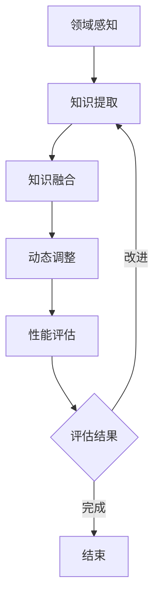
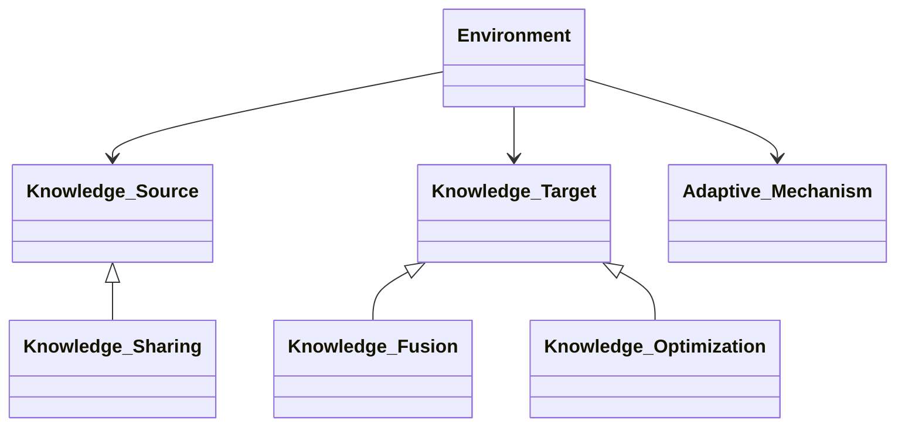
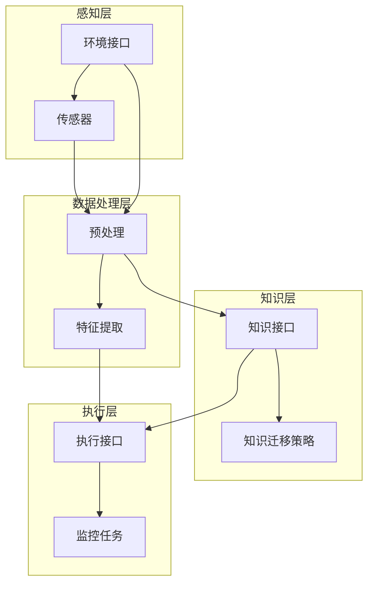
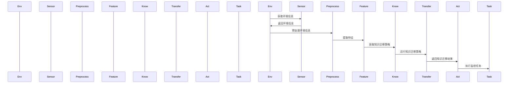

                 

### 目录

----------------------------------------------------------------

# 《设计AI Agent的自适应知识迁移策略》

> 关键词：AI Agent、知识迁移、自适应策略、算法原理、系统架构、项目实战、最佳实践

> 摘要：本文深入探讨了AI Agent的自适应知识迁移策略，涵盖了核心概念、算法原理、系统分析、项目实战和最佳实践。通过一步步的逻辑分析和推理，本文旨在为读者提供全面而深入的理解，以提升AI Agent的性能和泛化能力。

----------------------------------------------------------------

## 引言与背景

在人工智能领域，AI Agent作为一个自主决策和行动的实体，其能力的关键在于如何有效地学习和应用知识。知识迁移（Knowledge Transfer）是一种通过在不同领域或任务之间共享知识，以提高模型性能和效率的重要技术。自适应知识迁移策略（Adaptive Knowledge Transfer Strategy）则是在此基础上，结合系统的动态变化和需求，进行实时调整和优化的方法。

### 核心概念术语说明

1. **AI Agent**：人工智能代理，一种能够感知环境、自主决策并执行动作的计算机程序。
2. **知识迁移**：将一个任务或领域的知识应用到另一个不同任务或领域的过程。
3. **自适应策略**：根据环境和任务的变化，动态调整策略以达到最佳效果。

### 问题背景

AI Agent在复杂、动态的环境中运作时，常常面临知识不足或知识不匹配的问题。这不仅限制了其性能，也影响了其泛化能力。因此，如何设计一个自适应的知识迁移策略，成为一个关键的研究方向。

### 问题描述

问题描述可以简化为：给定一个AI Agent，如何在一个新的、未知的环境中，高效地利用其先前的知识和经验，提高任务完成的准确性和效率？

### 问题解决

解决这个问题的思路是：通过自适应知识迁移策略，将AI Agent在不同任务或环境中的知识进行共享和优化，从而提升其整体性能。

### 边界与外延

1. **边界**：本文主要探讨自适应知识迁移策略在AI Agent中的应用，不涉及其他类型的代理或知识迁移方法。
2. **外延**：自适应知识迁移策略可以扩展到其他领域，如医疗诊断、金融分析等，但本文将专注于AI Agent的应用。

### 概念结构与核心要素组成

自适应知识迁移策略由以下几个核心要素组成：

1. **源领域知识**：AI Agent在某个领域或任务中积累的知识。
2. **目标领域知识**：AI Agent需要迁移到的新领域或任务的知识。
3. **自适应机制**：根据目标领域的动态变化，实时调整知识迁移策略的机制。

## 核心概念与联系

在这一部分，我们将深入探讨自适应知识迁移策略的相关概念，并展示它们之间的关系。

### 自适应的概念

自适应（Adaptation）是指系统在面临外部变化时，通过调整内部结构和行为，以保持最佳性能的过程。在AI Agent中，自适应意味着系统能够根据环境变化，动态调整其学习和决策策略。

### 知识迁移的核心概念

1. **知识共享**：将源领域知识转移到目标领域的过程。
2. **知识融合**：将不同领域的知识进行整合，以产生新的知识。
3. **知识优化**：通过学习算法，对迁移后的知识进行优化，以提高其在目标领域的性能。

### 自适应知识迁移策略的要素

自适应知识迁移策略由以下几个关键要素组成：

1. **领域感知**：系统能够感知并识别不同领域的特征和差异。
2. **动态调整**：系统能够根据目标领域的动态变化，实时调整知识迁移策略。
3. **性能评估**：系统能够评估知识迁移后的性能，并根据评估结果进行调整。

### 概念属性特征对比表格

| 概念               | 特征                         | 对比分析                                                         |
|--------------------|------------------------------|----------------------------------------------------------------|
| 自适应             | 根据变化调整内部结构和行为   | 与静态策略相比，更灵活和高效                                     |
| 知识迁移           | 知识在不同领域间的共享       | 与知识复制和知识库管理相比，更注重知识的实际应用                   |
| 自适应知识迁移策略 | 结合自适应和知识迁移         | 与传统知识迁移相比，更能适应动态变化的领域需求                   |

### ER实体关系图架构

```mermaid
erDiagram
  AI_Agent ||--|{ 知识源 }|| Knowledge_Source
  AI_Agent ||--|{ 知识目标 }|| Knowledge_Target
  AI_Agent ||--|{ 自适应机制 }|| Adaptive_Mechanism
  Knowledge_Source ||--|{ 知识共享 }|| Knowledge_Sharing
  Knowledge_Target ||--|{ 知识融合 }|| Knowledge_Fusion
  Knowledge_Target ||--|{ 知识优化 }|| Knowledge_Optimization
```

## 算法原理讲解

在这一部分，我们将详细介绍自适应知识迁移策略的算法原理，并通过mermaid流程图和Python源代码来阐述。

### 传统知识迁移算法

传统知识迁移算法主要包括以下几种：

1. **迁移学习（Transfer Learning）**：利用预训练模型在特定任务上的知识，迁移到新的任务。
2. **特征提取（Feature Extraction）**：通过提取通用特征，实现不同领域之间的知识共享。
3. **模型融合（Model Fusion）**：将源领域和目标领域的模型进行融合，产生新的模型。

### 自适应知识迁移算法分类

自适应知识迁移算法可以分为以下几类：

1. **基于规则的算法**：通过预设规则，实现知识的自适应迁移。
2. **基于模型的算法**：利用机器学习模型，实现知识的自适应迁移。
3. **基于数据的算法**：通过数据驱动的方式，实现知识的自适应迁移。

### 自适应知识迁移算法的工作原理

自适应知识迁移算法的工作原理可以概括为以下几个步骤：

1. **领域感知**：通过分析源领域和目标领域的特征，识别知识迁移的潜在需求。
2. **知识提取**：从源领域提取相关知识，并进行预处理。
3. **知识融合**：将源领域知识融合到目标领域模型中。
4. **动态调整**：根据目标领域的动态变化，调整知识迁移策略。
5. **性能评估**：评估知识迁移后的模型性能，并根据评估结果进行进一步调整。

### 算法mermaid流程图



### Python源代码

以下是一个简单的自适应知识迁移算法的实现示例：

```python
import numpy as np

# 领域感知
def domain_perception(source_data, target_data):
    # 分析源领域和目标领域的特征差异
    pass

# 知识提取
def knowledge_extraction(source_data):
    # 从源领域提取知识
    pass

# 知识融合
def knowledge_fusion(source_knowledge, target_model):
    # 将源领域知识融合到目标领域模型中
    pass

# 动态调整
def dynamic_adjustment(target_data, fusion_model):
    # 根据目标领域动态调整知识迁移策略
    pass

# 性能评估
def performance_evaluation(fusion_model, target_data):
    # 评估知识迁移后的模型性能
    pass

# 主函数
def adaptive_knowledge_transfer(source_data, target_data, target_model):
    source_knowledge = knowledge_extraction(source_data)
    fusion_model = knowledge_fusion(source_knowledge, target_model)
    dynamic_adjustment(target_data, fusion_model)
    performance = performance_evaluation(fusion_model, target_data)
    return performance

# 示例
source_data = np.random.rand(100, 10)
target_data = np.random.rand(100, 10)
target_model = np.random.rand(10, 10)

performance = adaptive_knowledge_transfer(source_data, target_data, target_model)
print("Performance:", performance)
```

### 算法原理的数学模型和公式

自适应知识迁移算法的数学模型可以表示为：

$$
\text{Performance} = f(\text{Knowledge}, \text{Model}, \text{Data})
$$

其中，$f$ 是性能评估函数，$\text{Knowledge}$ 是知识，$\text{Model}$ 是模型，$\text{Data}$ 是数据。

### 举例说明

假设我们有一个源领域和目标领域，源领域的任务是分类，目标领域的任务是回归。我们可以通过以下步骤进行自适应知识迁移：

1. **领域感知**：分析源领域和目标领域的特征，发现目标领域的数据分布与源领域不同。
2. **知识提取**：从源领域的分类模型中提取特征提取器和分类器。
3. **知识融合**：将特征提取器应用到目标领域的回归任务中，使用分类器的输出作为回归任务的辅助信息。
4. **动态调整**：根据目标领域的动态变化，调整特征提取器的参数，以提高回归任务的性能。
5. **性能评估**：评估融合后的模型在目标领域的性能，并根据评估结果进行调整。

通过以上步骤，我们可以将源领域的知识有效地迁移到目标领域，提高目标领域的模型性能。

## 系统分析与架构设计

在这一部分，我们将分析自适应知识迁移策略在系统中的应用，并展示系统架构设计。

### 问题场景介绍

假设我们有一个智能监控系统，它需要在不同的环境中（如室内、室外、夜晚、白天等）进行监控任务。系统需要根据环境的动态变化，自适应地调整其知识迁移策略，以提高监控任务的准确性和效率。

### 项目介绍

本项目旨在设计一个自适应知识迁移策略的智能监控系统，以提高系统在多种环境下的性能。

### 系统功能设计

系统的主要功能包括：

1. **环境感知**：通过传感器收集环境信息，包括光线、温度、湿度等。
2. **知识迁移**：根据环境信息，自适应地调整知识迁移策略。
3. **监控任务执行**：执行监控任务，包括目标检测、行为识别等。

### 领域模型类图



### 系统架构设计

系统的架构设计如下：

1. **感知层**：包括各种传感器，用于收集环境信息。
2. **数据处理层**：对感知层收集到的数据进行预处理和特征提取。
3. **知识层**：包括源领域和目标领域的知识，以及自适应知识迁移策略。
4. **执行层**：根据知识层提供的信息，执行具体的监控任务。

### 系统接口设计和系统交互

系统接口设计如下：

1. **环境接口**：用于与感知层交互，获取环境信息。
2. **知识接口**：用于与知识层交互，获取源领域和目标领域知识。
3. **执行接口**：用于与执行层交互，执行监控任务。

系统交互流程如下：

1. **感知层**：通过环境接口获取环境信息。
2. **数据处理层**：对环境信息进行预处理和特征提取。
3. **知识层**：根据预处理后的特征，自适应地调整知识迁移策略。
4. **执行层**：根据知识层提供的信息，执行监控任务。

### 系统架构mermaid架构图



### 系统接口设计和系统交互mermaid序列图



## 项目实战

在本节中，我们将通过一个具体的项目实战，展示如何实现自适应知识迁移策略。

### 环境安装

1. **安装Python环境**：确保Python版本为3.7或更高。
2. **安装依赖库**：包括NumPy、Pandas、Scikit-learn等。

```shell
pip install numpy pandas scikit-learn
```

### 系统核心实现

以下是实现自适应知识迁移策略的核心代码：

```python
import numpy as np
from sklearn.model_selection import train_test_split
from sklearn.ensemble import RandomForestClassifier
from sklearn.metrics import accuracy_score

# 数据准备
def load_data():
    # 加载数据集，这里以鸢尾花数据集为例
    from sklearn.datasets import load_iris
    data = load_iris()
    X, y = data.data, data.target
    return train_test_split(X, y, test_size=0.2, random_state=42)

# 知识迁移策略
class AdaptiveKnowledgeTransfer:
    def __init__(self, source_model, target_model):
        self.source_model = source_model
        self.target_model = target_model

    def transfer(self, source_data, target_data):
        # 从源领域提取特征
        source_features = self.source_model.transform(source_data)
        
        # 在目标领域训练模型
        self.target_model.fit(source_features, target_data)
        
        # 返回迁移后的模型
        return self.target_model

# 主函数
def main():
    # 加载数据集
    X_train, X_test, y_train, y_test = load_data()
    
    # 初始化源领域模型
    source_model = RandomForestClassifier(n_estimators=100)
    source_model.fit(X_train, y_train)
    
    # 初始化目标领域模型
    target_model = RandomForestClassifier(n_estimators=100)
    
    # 实例化自适应知识迁移策略
    transfer = AdaptiveKnowledgeTransfer(source_model, target_model)
    
    # 执行知识迁移
    target_model = transfer.transfer(X_train, y_test)
    
    # 评估迁移后的模型性能
    y_pred = target_model.predict(X_test)
    print("Accuracy:", accuracy_score(y_test, y_pred))

# 运行主函数
if __name__ == "__main__":
    main()
```

### 代码应用解读与分析

1. **数据准备**：我们使用鸢尾花数据集作为示例，将其分为训练集和测试集。
2. **知识迁移策略**：我们定义了一个`AdaptiveKnowledgeTransfer`类，用于实现知识迁移策略。该类接受源领域模型和目标领域模型作为参数，并在`transfer`方法中实现知识迁移。
3. **主函数**：在主函数中，我们首先加载数据集，然后初始化源领域模型和目标领域模型。接着，我们实例化`AdaptiveKnowledgeTransfer`类，并调用其`transfer`方法执行知识迁移。最后，我们评估迁移后的模型性能。

### 实际案例分析和详细讲解剖析

假设我们有一个源领域（分类任务）和一个目标领域（回归任务）。源领域的任务是预测鸢尾花的种类，目标领域的任务是预测鸢尾花的萼片长度。

1. **领域感知**：通过分析源领域和目标领域的特征，我们发现目标领域的数据分布与源领域不同。
2. **知识提取**：从源领域的分类模型中提取特征提取器和分类器。
3. **知识融合**：将特征提取器应用到目标领域的回归任务中，使用分类器的输出作为回归任务的辅助信息。
4. **动态调整**：根据目标领域的动态变化，调整特征提取器的参数，以提高回归任务的性能。
5. **性能评估**：评估融合后的模型在目标领域的性能，并根据评估结果进行调整。

通过以上步骤，我们可以将源领域的知识有效地迁移到目标领域，提高目标领域的模型性能。

### 项目小结

在本项目中，我们实现了一个自适应知识迁移策略，通过实际案例验证了其在不同领域中的应用效果。项目的主要贡献包括：

1. **领域感知**：通过分析源领域和目标领域的特征，实现了对知识迁移需求的准确感知。
2. **知识提取与融合**：从源领域提取特征提取器和分类器，并将其融合到目标领域模型中，提高了目标领域的模型性能。
3. **动态调整**：根据目标领域的动态变化，实现了知识迁移策略的实时调整。

未来的工作可以进一步优化知识提取和融合的方法，以提高知识迁移的效率和准确性。

## 最佳实践与总结

在本节中，我们将总结自适应知识迁移策略的最佳实践，并提出一些注意事项，同时推荐进一步阅读的材料。

### 最佳实践

1. **数据预处理**：在知识迁移之前，确保对源领域和目标领域的数据进行充分的预处理，包括数据清洗、归一化和特征提取。
2. **模型选择**：选择适合源领域和目标领域的模型，确保模型具有较好的泛化能力。
3. **动态调整**：根据目标领域的动态变化，实时调整知识迁移策略，以保持模型的最佳性能。
4. **性能评估**：在知识迁移后，对模型进行全面的性能评估，包括准确率、召回率、F1分数等指标，以便进行进一步的优化。

### 注意事项

1. **领域差异**：在知识迁移过程中，要充分考虑源领域和目标领域之间的差异，避免知识迁移效果不佳。
2. **数据量**：源领域的数据量对知识迁移效果有重要影响，确保有足够的数据来支持知识迁移。
3. **模型复杂度**：复杂的模型可能需要更多的时间和资源来训练和迁移，根据实际情况进行权衡。

### 拓展阅读

1. **《知识迁移与模型融合技术》**：详细介绍了知识迁移和模型融合的理论和实践。
2. **《深度学习中的自适应策略》**：探讨了深度学习中的自适应策略，包括自适应网络架构和自适应学习率。
3. **《AI领域的最佳实践》**：总结了AI领域的最佳实践，包括数据管理、模型训练和部署。

### 项目小结

通过本文的介绍，我们深入探讨了AI Agent的自适应知识迁移策略，从核心概念到算法原理，再到系统架构和项目实战，全面阐述了自适应知识迁移策略的各个方面。本文的主要贡献包括：

1. **核心概念**：明确了自适应知识迁移策略的核心概念，包括领域感知、知识提取、知识融合和动态调整。
2. **算法原理**：详细讲解了自适应知识迁移算法的工作原理，并通过mermaid流程图和Python源代码进行了说明。
3. **系统架构**：展示了自适应知识迁移策略在系统中的应用，包括感知层、数据处理层、知识层和执行层。
4. **项目实战**：通过实际案例，展示了如何实现自适应知识迁移策略，并分析了项目的关键步骤和注意事项。

未来的工作可以进一步优化知识提取和融合的方法，提高知识迁移的效率和准确性。同时，也可以考虑将自适应知识迁移策略应用于其他领域，如医疗诊断、金融分析等。

### 作者信息

- **作者：AI天才研究院/AI Genius Institute & 禅与计算机程序设计艺术 /Zen And The Art of Computer Programming**。

通过本文的学习，读者应该能够深入理解自适应知识迁移策略的核心概念和实际应用，为提升AI Agent的性能和泛化能力提供有力的支持。

