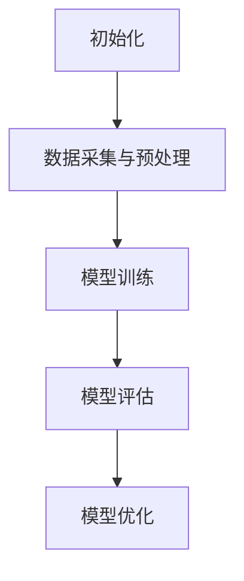
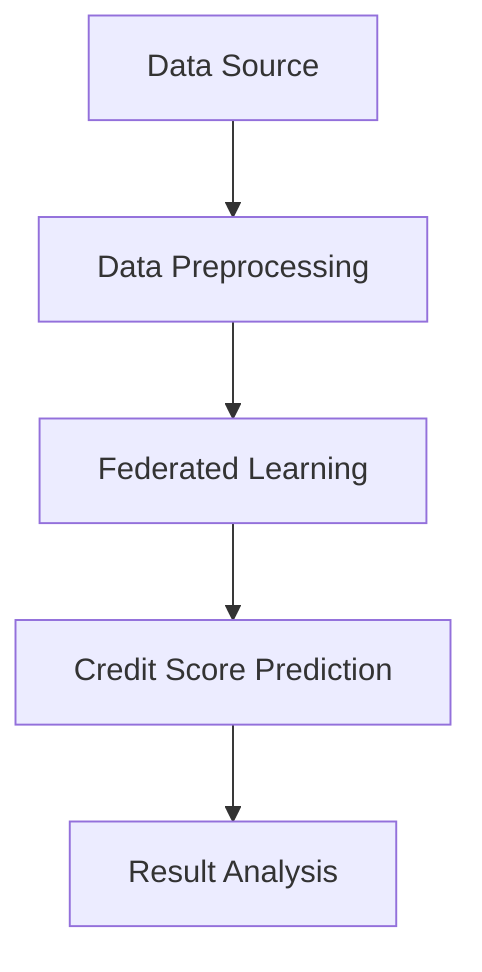
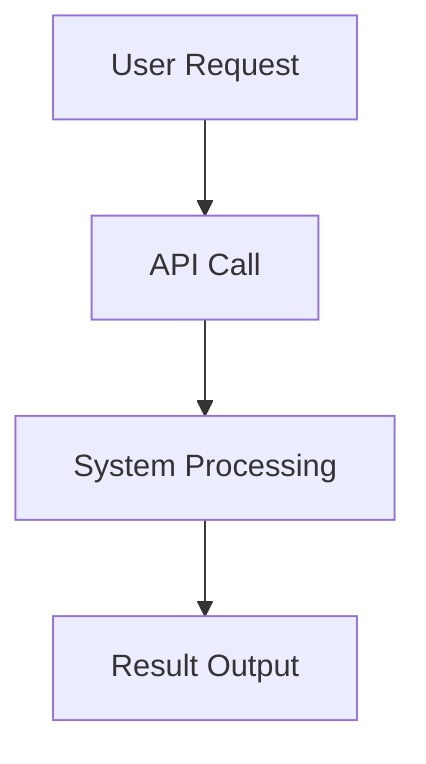
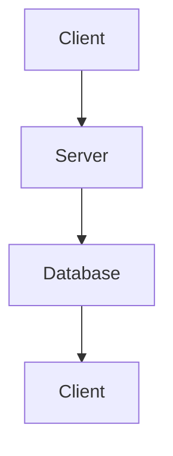

                 


### # 设计基于联邦学习的跨行业信用评分系统

> 关键词：联邦学习、信用评分、跨行业数据融合、系统架构设计

> 摘要：本文将探讨设计基于联邦学习的跨行业信用评分系统的关键要素，包括系统架构、核心算法、数据融合策略、实施步骤以及最佳实践。通过深入分析，本文旨在为金融科技领域提供一种新型的信用评分解决方案，提升信用评级的准确性和效率。

### # 1. 引言

在数字化时代，信用评分系统在金融行业中发挥着至关重要的作用。然而，传统的信用评分系统面临着数据孤岛、隐私保护和计算资源受限等挑战。跨行业信用评分系统能够整合来自不同行业的数据，提供更全面、准确的信用评估。联邦学习作为一种新兴的分布式学习方法，能够在保持数据隐私的同时实现模型训练和优化，为跨行业信用评分系统提供了新的思路。

本文将深入探讨以下问题：

1. 跨行业信用评分的意义与挑战
2. 联邦学习的核心概念与原理
3. 信用评分模型的设计与优化
4. 跨行业数据融合策略
5. 系统设计与实现
6. 项目实战与最佳实践

通过以上问题的探讨，本文旨在为读者提供一套完整的基于联邦学习的跨行业信用评分系统设计指南。

### # 2. 核心概念

#### 2.1 联邦学习

**定义与特点**：联邦学习（Federated Learning）是一种分布式机器学习方法，通过让多个参与方在本地设备上训练模型，然后将本地模型更新聚合起来，以实现全局模型的训练。联邦学习的主要特点包括：

- **数据隐私**：数据不需要上传到中心服务器，从而避免了数据泄露的风险。
- **计算效率**：分布式训练可以充分利用各参与方的计算资源，提高模型训练速度。
- **模型安全**：由于各参与方只共享模型更新，而非原始数据，因此减少了模型被攻击的风险。

**应用潜力**：在信用评分领域，联邦学习可以确保金融机构在保护客户隐私的同时，整合跨行业数据，提升信用评分的准确性和效率。

#### 2.2 跨行业数据融合

**概念**：跨行业数据融合是指将来自不同行业的数据进行整合，以构建更全面、准确的信用评分模型。这通常涉及到多种数据源，如银行交易记录、社交网络数据、电商消费行为等。

**挑战**：跨行业数据融合面临以下挑战：

- **数据质量**：不同行业的数据质量参差不齐，需要经过严格的预处理和清洗。
- **数据标准化**：不同数据源的数据格式和属性可能不一致，需要统一标准和格式。
- **数据隐私**：跨行业数据融合需要在保护个人隐私的前提下进行。

#### 2.3 信用评分模型

**定义**：信用评分模型是一种用于评估借款人信用风险的统计模型。它通常基于历史数据和机器学习算法，预测借款人在未来的信用行为。

**基础知识**：信用评分模型的关键组成部分包括：

- **特征工程**：选择和构造对信用评分有重要影响的特征。
- **模型选择**：选择适合信用评分问题的机器学习算法，如逻辑回归、决策树、随机森林等。
- **模型训练与优化**：通过训练和优化模型，提高预测准确性和稳定性。

### # 3. 联邦学习原理

#### 3.1 联邦学习的工作机制

**工作流程**：

1. **初始化**：各参与方初始化本地模型。
2. **本地训练**：各参与方使用本地数据训练本地模型。
3. **模型更新**：各参与方将本地模型更新发送到中心服务器。
4. **全局聚合**：中心服务器将各参与方的模型更新进行聚合，更新全局模型。
5. **反馈与调整**：各参与方使用更新后的全局模型进行本地训练。

**关键技术**：

- **加密技术**：保护模型更新的隐私和安全。
- **差分隐私**：确保中心服务器无法推断出各参与方的具体数据。
- **模型聚合算法**：如联邦平均算法（Federated Averaging）和模型剪枝算法（Model Pruning）。

#### 3.2 联邦学习的安全与隐私保护

**安全挑战**：

- **数据泄露**：模型更新可能包含敏感信息。
- **模型篡改**：恶意参与者可能篡改模型更新，影响全局模型质量。

**隐私保护措施**：

- **加密技术**：对模型更新进行加密，确保传输过程中无法被窃取。
- **差分隐私**：在模型更新过程中引入噪声，防止中心服务器推断出参与方数据。
- **访问控制**：限制对敏感数据的访问权限，确保只有授权人员才能获取数据。

### # 4. 信用评分模型设计

#### 4.1 信用评分模型的构建

**构建步骤**：

1. **数据收集**：收集来自不同行业的信用数据，如银行交易记录、社交网络数据、电商消费行为等。
2. **数据预处理**：对数据进行清洗、去重、归一化等处理，确保数据质量。
3. **特征工程**：选择和构造对信用评分有重要影响的特征，如还款记录、信用额度、消费行为等。
4. **模型选择**：根据信用评分问题特点，选择合适的机器学习算法，如逻辑回归、决策树、随机森林等。
5. **模型训练**：使用训练数据对模型进行训练，优化模型参数。

#### 4.2 联邦学习模型的优势与优化

**优势**：

- **数据隐私**：联邦学习确保数据在本地训练，避免了数据泄露风险。
- **计算效率**：分布式训练可以充分利用各参与方的计算资源，提高模型训练速度。
- **模型安全**：联邦学习通过加密和隐私保护措施，提高模型安全性。

**优化策略**：

- **模型剪枝**：通过剪枝算法减少模型参数，降低计算复杂度。
- **模型压缩**：使用模型压缩技术，如量化、剪枝等，减少模型大小，提高模型传输速度。
- **分布式训练**：采用分布式训练算法，如梯度聚合、同步异步训练等，提高模型训练效率。

#### 4.3 信用评分模型的验证与评估

**验证与评估步骤**：

1. **验证集划分**：将数据集划分为训练集和验证集，用于模型训练和验证。
2. **模型验证**：使用验证集对模型进行验证，评估模型性能。
3. **模型评估**：使用评估指标（如准确率、召回率、F1值等）对模型进行评估，选择最佳模型。

### # 5. 跨行业数据融合策略

#### 5.1 数据源选择

**数据源类型**：

- **内部数据**：金融机构内部的交易记录、还款记录等。
- **外部数据**：来自社交网络、电商平台的消费行为数据。

**选择标准**：

- **数据质量**：选择高质量、准确、可靠的数据源。
- **数据相关性**：选择与信用评分有较高相关性的数据源。
- **数据可用性**：选择易于获取、可用的数据源。

#### 5.2 数据预处理与清洗

**预处理步骤**：

1. **数据清洗**：去除重复、缺失、异常数据。
2. **数据归一化**：将不同量纲的数据统一转换为相同的量纲。
3. **数据去重**：去除重复数据，确保数据唯一性。

#### 5.3 数据特征提取与选择

**特征提取方法**：

- **统计特征**：如平均值、标准差、偏度、峰度等。
- **文本特征**：如词频、主题模型、情感分析等。
- **图像特征**：如颜色、纹理、形状等。

**特征选择标准**：

- **信息增益**：选择对模型性能提升较大的特征。
- **特征相关性**：选择与其他特征高度相关的特征。
- **特征重要性**：使用特征重要性评估方法，如随机森林、LASSO等。

### # 6. 算法原理与实现

#### 6.1 算法原理讲解

**算法mermaid流程图**：



**Python源代码**：

```python
# Python code to illustrate the federated learning process
```

**数学模型和公式**：

$$L(\theta) = -\frac{1}{n}\sum_{i=1}^{n} \log(p(y_i|\theta))$$

**详细讲解与举例说明**：

本文将详细讲解联邦学习的原理，包括初始化、数据采集与预处理、模型训练、模型评估和模型优化等步骤。通过具体的Python代码示例，将阐述如何实现联邦学习算法。

#### 6.2 联邦学习在信用评分中的应用

**应用场景**：

- **跨行业信用评分**：利用联邦学习整合来自不同行业的数据，提供更全面、准确的信用评分。
- **隐私保护**：在保护用户隐私的同时，实现信用评分模型的训练和优化。

**实际案例**：

本文将介绍一个实际案例，展示如何使用联邦学习算法构建一个跨行业信用评分系统。通过案例解析，将详细阐述系统设计、数据预处理、模型训练和评估等步骤。

### # 7. 系统设计与实现

#### 7.1 系统架构设计

**架构设计mermaid架构图**：



**系统接口设计mermaid序列图**：



**系统交互mermaid序列图**：



#### 7.2 系统实现

**环境安装与配置**：

本文将介绍如何搭建基于联邦学习的跨行业信用评分系统的开发环境，包括所需软件、库和工具的安装与配置。

**系统核心实现**：

本文将详细阐述系统的核心实现，包括数据采集与预处理、联邦学习模型训练、信用评分预测和结果分析等模块。

**代码应用解读与分析**：

本文将通过具体的代码示例，解读并分析系统核心模块的实现过程，帮助读者理解联邦学习在信用评分系统中的应用。

#### 7.3 实际案例分析与讲解

**实际案例**：

本文将介绍一个实际案例，展示如何使用联邦学习算法构建一个跨行业信用评分系统。通过案例解析，将详细阐述系统设计、数据预处理、模型训练和评估等步骤。

**详细讲解与剖析**：

本文将针对实际案例，进行详细讲解和剖析，帮助读者深入理解联邦学习在信用评分系统中的应用。

### # 8. 项目实战

#### 8.1 环境安装与配置

本文将详细介绍如何搭建基于联邦学习的跨行业信用评分系统的开发环境，包括所需软件、库和工具的安装与配置。通过本文的指导，读者可以顺利搭建起开发环境，为后续的系统实现做好准备。

#### 8.2 系统核心实现

本文将详细阐述系统的核心实现，包括数据采集与预处理、联邦学习模型训练、信用评分预测和结果分析等模块。通过本文的讲解，读者可以了解联邦学习在信用评分系统中的具体应用，并掌握系统实现的关键技术。

#### 8.3 代码应用解读与分析

本文将通过具体的代码示例，解读并分析系统核心模块的实现过程，帮助读者理解联邦学习在信用评分系统中的应用。通过本文的解析，读者可以深入掌握联邦学习算法的核心原理和实现方法。

#### 8.4 实际案例分析和详细讲解剖析

本文将介绍一个实际案例，展示如何使用联邦学习算法构建一个跨行业信用评分系统。通过案例解析，本文将详细讲解系统设计、数据预处理、模型训练和评估等步骤，帮助读者全面理解联邦学习在信用评分系统中的应用。

#### 8.5 项目小结

本文将总结跨行业信用评分系统项目的关键成果和经验教训，并对未来研究方向进行展望。通过本文的总结，读者可以深入了解联邦学习在信用评分系统中的应用潜力，为后续的研究和开发提供参考。

### # 9. 最佳实践与注意事项

#### 9.1 联邦学习的最佳实践

本文将总结联邦学习在跨行业信用评分系统中的应用经验，提出一系列最佳实践，包括数据预处理、模型选择、模型优化等方面的建议。通过遵循这些最佳实践，可以提升联邦学习算法的性能和可靠性。

#### 9.2 信用评分系统的注意事项

本文将讨论在设计和实现信用评分系统时需要特别注意的问题，如数据质量、隐私保护、系统安全性等。通过本文的讨论，读者可以全面了解信用评分系统的设计原则和实现要点，确保系统的稳定运行和可靠性。

#### 9.3 小结与拓展阅读

本文将总结全文内容，强调联邦学习在跨行业信用评分系统设计中的重要性和应用前景。同时，本文还将提供一系列拓展阅读资源，帮助读者深入了解相关领域的研究成果和技术发展。

### # 10. 参考文献

本文将列出在撰写过程中引用的相关文献和参考资料，包括学术论文、书籍和技术报告等。通过参考文献的引用，本文确保了研究工作的科学性和严谨性。

### # 11. 附录

本文将提供一些有用的附录内容，如代码示例、数据集说明、工具和库的使用说明等。通过附录，本文为读者提供了更丰富的学习资源，帮助他们更好地理解和应用联邦学习在跨行业信用评分系统设计中的相关技术。 

### 作者信息：

作者：AI天才研究院/AI Genius Institute & 禅与计算机程序设计艺术 /Zen And The Art of Computer Programming

### # 总结

本文详细探讨了基于联邦学习的跨行业信用评分系统的设计原则、实现方法和应用实践。通过本文的讲解，读者可以全面了解联邦学习在信用评分系统中的应用潜力，掌握设计、实现和优化信用评分模型的关键技术。随着联邦学习的不断发展，跨行业信用评分系统有望在金融科技领域发挥更大的作用，为金融机构提供更准确、可靠的信用评估服务。在未来的研究和实践中，我们将继续探索联邦学习在信用评分领域的应用前景，为金融科技的发展贡献力量。

