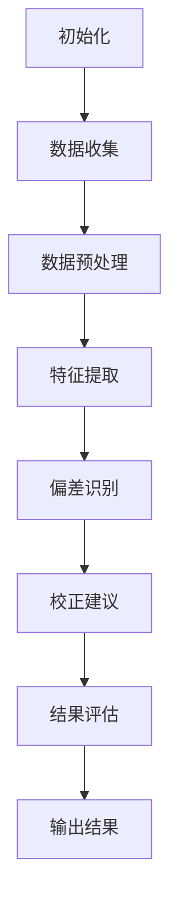
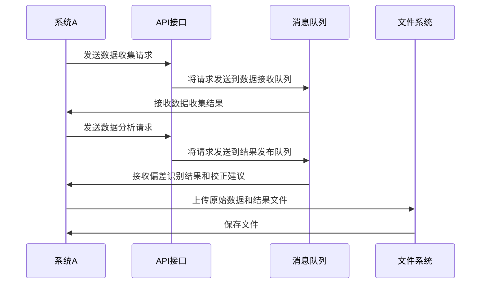
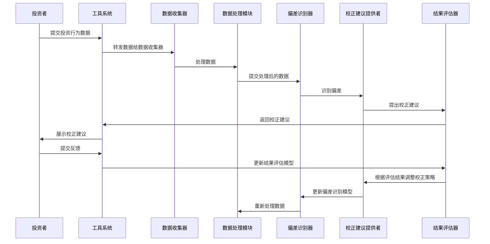

                 


### 1.1.4 智能化工具的定义与发展

智能化工具，顾名思义，是指利用计算机科学、人工智能、机器学习等先进技术，使工具具备智能化的功能和特性，以提升其性能和效率。在个人投资者认知偏差校正工具的背景下，智能化工具的发展主要体现在以下几个方面：

首先，数据的自动化收集和处理是智能化工具的基础。传统的方法往往需要人工收集数据，耗时费力且容易出现错误。而智能化工具通过互联网、传感器、数据库等技术，能够自动收集海量数据，并进行处理和清洗，为后续分析提供可靠的数据基础。

其次，人工智能技术的应用大大提升了认知偏差校正工具的准确性和效率。例如，通过机器学习算法，可以自动识别和分类投资者的行为模式，从而发现潜在的认知偏差。深度学习算法的引入，更使得工具能够在不断学习和优化中，提高校正认知偏差的能力。

再次，智能化工具具有实时性和自适应性的特点。传统工具往往需要定期更新和维护，而智能化工具能够实时处理数据，并根据投资者的行为变化，动态调整校正策略，使得工具更加贴近实际需求。

最后，云计算和大数据技术的普及，为智能化工具的广泛应用提供了技术支持。云计算提供了强大的计算能力和存储资源，使得智能化工具可以处理更大量的数据。大数据技术则使得工具能够从海量数据中挖掘出有价值的信息，为投资者提供更加精准的决策支持。

总的来说，智能化工具的发展为个人投资者认知偏差校正提供了新的思路和手段。通过智能化工具，投资者可以更加科学地识别和管理自己的认知偏差，提高投资决策的准确性和效率。

### 1.1.5 智能化工具的优势

智能化工具在个人投资者认知偏差校正中的应用，具有多方面的优势。首先，智能化工具能够自动化处理大量数据，极大地提高了工作效率。传统方法需要投资者手动收集和分析数据，不仅耗时费力，还容易出现人为错误。而智能化工具通过机器学习和人工智能技术，能够快速、准确地处理海量数据，为投资者提供及时、准确的信息。

其次，智能化工具具有强大的分析能力。通过算法模型，智能化工具可以深入挖掘数据背后的规律和模式，帮助投资者发现潜在的认知偏差。传统方法往往只能停留在表面分析，而智能化工具则能够通过复杂的算法，提供更深层次的分析和洞察。

再次，智能化工具具有实时性和自适应性的特点。传统方法通常需要定期更新和维护，而智能化工具能够实时处理数据，并根据投资者的行为变化，动态调整校正策略。这使得工具能够更加灵活地适应投资者不断变化的需求，提供持续的支持。

最后，智能化工具能够为投资者提供个性化的决策支持。通过分析投资者的行为数据，智能化工具可以了解投资者的偏好和风险承受能力，从而提供定制化的投资建议。这种个性化的服务，有助于投资者更好地管理自己的认知偏差，提高投资决策的准确性和效率。

总的来说，智能化工具的优势在于其高效性、分析能力、实时性和个性化服务，这些特点使得其在个人投资者认知偏差校正中具有独特的价值和应用前景。

### 1.1.6 问题背景

个人投资者在投资决策中常常面临诸多认知偏差问题，这些问题不仅影响了投资者的决策质量，还可能带来巨大的经济损失。首先，过度自信是一种常见的认知偏差。许多投资者过于相信自己的判断和决策能力，忽视了市场的不确定性和复杂性。这种过度自信往往导致投资者在市场波动中做出错误的决策，从而遭受损失。

其次，群体心理也是个人投资者常见的一种认知偏差。在市场中，投资者往往受到群体行为的影响，盲目跟风。例如，在市场繁荣时期，投资者可能过度乐观，争相购买热门股票；而在市场低迷时期，投资者可能过度悲观，纷纷抛售股票。这种群体心理不仅加剧了市场的波动性，还可能导致投资者做出非理性的投资决策。

此外，选择性认知也是个人投资者常见的一种认知偏差。投资者往往只关注与自己预期相符的信息，而忽视其他可能的信息。例如，在投资某个项目时，投资者可能会过分关注项目的优点，而忽视其潜在的风险。这种选择性认知使得投资者难以全面、客观地评估投资项目，从而导致投资决策的偏差。

这些认知偏差问题对个人投资者产生了深远的影响。首先，它们可能导致投资者在投资决策中缺乏科学的分析，从而影响投资回报。其次，这些偏差使得投资者难以应对市场的变化，容易遭受损失。最后，这些偏差可能影响投资者的心理状态，导致焦虑、恐慌等负面情绪，进一步影响其投资决策。

因此，解决个人投资者认知偏差问题具有重要意义。通过智能化工具，投资者可以更加科学地识别和管理自己的认知偏差，提高投资决策的准确性和效率。这不仅有助于投资者实现更好的投资回报，还能提升他们的投资体验和心理状态。

### 1.1.7 问题描述

个人投资者在投资决策过程中常见的认知偏差类型包括过度自信、群体心理、选择性认知等。这些偏差不仅影响了投资者的决策质量，还可能导致严重的经济损失。首先，过度自信是一种普遍存在的认知偏差。许多投资者对自己的判断和决策能力过度自信，往往忽视市场的不确定性和复杂性。他们倾向于相信自己的直觉和经验，而忽视客观的数据和分析。这种过度自信可能导致投资者在市场波动中做出错误的决策，从而遭受损失。

其次，群体心理也是个人投资者常见的一种认知偏差。在市场中，投资者往往受到群体行为的影响，盲目跟风。例如，在市场繁荣时期，投资者可能过度乐观，争相购买热门股票；而在市场低迷时期，投资者可能过度悲观，纷纷抛售股票。这种群体心理不仅加剧了市场的波动性，还可能导致投资者做出非理性的投资决策。

选择性认知是另一种常见的认知偏差。投资者往往只关注与自己预期相符的信息，而忽视其他可能的信息。例如，在投资某个项目时，投资者可能会过分关注项目的优点，而忽视其潜在的风险。这种选择性认知使得投资者难以全面、客观地评估投资项目，从而导致投资决策的偏差。

这些认知偏差对个人投资者产生了深远的影响。首先，过度自信可能导致投资者在投资决策中缺乏科学的分析，从而影响投资回报。其次，群体心理使得投资者容易受到市场情绪的影响，难以独立做出理性决策。选择性认知则使得投资者难以获得全面的信息，从而影响其投资判断。这些问题不仅影响了投资者的决策质量，还可能导致严重的经济损失。因此，识别和校正这些认知偏差对于提高个人投资者的投资决策质量和回报具有重要意义。

### 1.1.8 问题解决

为了解决个人投资者在投资决策中面临的认知偏差问题，智能化工具提供了有效的解决方案。首先，智能化工具能够通过自动化数据收集和处理，为投资者提供全面、准确的信息。传统方法需要投资者手动收集和分析数据，耗时费力且容易出现错误。而智能化工具通过机器学习和人工智能技术，能够快速、准确地处理海量数据，为投资者提供及时、可靠的数据支持。

其次，智能化工具能够利用算法模型，帮助投资者识别和管理自己的认知偏差。例如，通过行为分析，工具可以识别出投资者的过度自信、群体心理和选择性认知等偏差，并提供针对性的校正建议。这些建议可以帮助投资者更加客观、理性地评估投资项目，避免因认知偏差导致的错误决策。

此外，智能化工具具有实时性和自适应性的特点，能够根据投资者的行为变化，动态调整校正策略。这意味着投资者可以在不断变化的市场环境中，及时调整自己的投资策略，避免因认知偏差导致的损失。

最后，智能化工具能够为投资者提供个性化的决策支持。通过分析投资者的行为数据，工具可以了解投资者的偏好和风险承受能力，从而提供定制化的投资建议。这种个性化的服务有助于投资者更好地管理自己的认知偏差，提高投资决策的准确性和效率。

总的来说，智能化工具通过自动化数据收集、算法模型校正、实时调整和个性化服务等多方面的优势，为个人投资者提供了有效的认知偏差校正解决方案，帮助他们做出更加科学、理性的投资决策。

### 1.1.9 边界与外延

在讨论智能化个人投资者认知偏差校正工具时，我们需要明确其适用的范围和边界。首先，该工具主要针对个人投资者在股票、基金、债券等金融投资领域的应用，通过识别和校正认知偏差，提高投资决策的准确性和效率。它并不适用于企业投资决策、房地产投资或艺术品投资等其他类型的投资活动。

其次，智能化工具的适用范围受限于数据质量和数据来源。为了保证校正的准确性和有效性，工具需要依赖于高质量、多元化的数据源，如市场数据、财务报表、新闻报道等。然而，数据质量和数据获取的难度往往会影响到工具的性能和效果。因此，在实际应用中，投资者需要确保数据的准确性和完整性，以提高校正工具的可靠性。

此外，智能化工具的应用范围也受到算法模型和技术的限制。虽然目前机器学习和人工智能技术在数据处理和分析方面取得了显著进展，但仍然存在一些技术难题和局限性，如算法的可解释性、模型的泛化能力等。这些技术问题可能会影响到工具的校正效果和用户体验。

最后，我们需要认识到，智能化工具不能完全替代人类的判断和决策能力。尽管工具能够提供科学的数据分析和建议，但投资者仍然需要结合自己的经验和知识，进行综合评估和决策。因此，工具的应用应该作为一个辅助手段，而不是唯一的决策依据。

总的来说，智能化个人投资者认知偏差校正工具在提供科学决策支持方面具有巨大潜力，但其应用范围和效果受到数据质量、算法技术、人类判断等多方面因素的影响。投资者在使用工具时，需要合理评估其适用性和局限性，以确保投资决策的科学性和有效性。

### 1.3 概念结构与核心要素组成

认知偏差校正工具的核心结构主要由以下几个关键组成部分构成：数据收集模块、数据处理与分析模块、偏差识别与校正模块、结果评估与反馈模块。

首先，数据收集模块是认知偏差校正工具的基础。它通过自动化技术从多个数据源收集相关数据，包括市场数据、财务报表、新闻报道、投资者行为数据等。这些数据不仅包括定量信息，还包括定性信息，如市场情绪、投资者情绪等。数据收集模块需要保证数据的准确性和完整性，为后续的分析和处理提供可靠的基础。

其次，数据处理与分析模块负责对收集到的数据进行分析和清洗。这一模块通常包括数据预处理、数据归一化、特征提取等步骤。通过这些步骤，数据处理与分析模块能够将原始数据转化为适合分析和建模的形式，提取出对认知偏差校正有用的特征信息。

接下来，偏差识别与校正模块是认知偏差校正工具的核心。它利用机器学习算法、深度学习模型等先进技术，对处理后的数据进行分析，识别出投资者可能存在的认知偏差类型。例如，通过分析投资者的历史交易记录、投资决策行为等，工具可以识别出过度自信、选择性认知、群体心理等偏差。一旦识别出偏差，工具会根据预设的校正策略，提出相应的校正建议，帮助投资者调整其投资决策。

最后，结果评估与反馈模块对校正过程和效果进行评估。这一模块通过跟踪投资者的实际投资行为和回报，评估校正工具的效果。如果发现校正效果不理想，工具会自动调整校正策略，或者向投资者提供进一步的反馈和建议。结果评估与反馈模块的目标是不断提高校正工具的性能和用户满意度。

总的来说，认知偏差校正工具通过以上几个核心模块的协同工作，实现了对投资者认知偏差的自动识别、校正和优化。其基本工作原理可以概括为：数据收集 -> 数据处理 -> 偏差识别 -> 偏差校正 -> 结果评估。这一流程确保了工具能够在不断学习和优化的过程中，为投资者提供科学、有效的决策支持。

### 2.1 核心概念原理

#### 数据收集与处理

认知偏差校正工具的核心功能之一是自动化收集和处理大量数据。数据收集模块从多个数据源获取信息，这些数据源包括股票市场数据、财务报表、新闻报道、投资者行为日志等。首先，数据收集模块使用API、爬虫等技术，从公开和私有数据库中抓取数据。为了确保数据的准确性，收集过程中需要进行数据清洗，包括去除重复记录、处理缺失值和异常值等。

接下来，数据处理与分析模块对原始数据进行预处理。这一步骤通常包括数据归一化、特征提取和数据融合。数据归一化是将不同量纲的数据转换为同一量纲，以便后续分析。特征提取则是从原始数据中提取出对认知偏差校正有用的特征，如投资时间、交易量、价格变动等。数据融合是将不同来源的数据进行整合，形成统一的视图，以便全面分析投资者的行为模式。

#### 偏差识别与校正

在数据处理完成后，偏差识别与校正模块开始工作。该模块利用机器学习和深度学习算法，对处理后的数据进行分析，识别出投资者可能存在的认知偏差类型。具体来说，可以通过以下几种方法进行偏差识别：

1. **行为分析**：通过分析投资者的历史交易记录、投资决策行为，识别出过度自信、选择性认知、群体心理等偏差。例如，过度自信可以通过投资者频繁交易且不遵循既定策略来判断。

2. **统计方法**：使用统计模型，如回归分析、聚类分析等，对投资者的行为数据进行统计分析，发现异常行为模式。例如，通过聚类分析可以发现投资者是否倾向于跟随市场趋势。

3. **机器学习模型**：应用机器学习算法，如决策树、随机森林、支持向量机等，对投资者行为数据进行分类和预测。通过训练模型，可以识别出具有特定认知偏差的投资者群体。

一旦识别出认知偏差，校正模块会根据预设的校正策略，提出相应的建议，帮助投资者调整其投资决策。例如，对于过度自信的投资者，可以建议减少交易频率或采用更长期的投资策略。

#### 结果评估与优化

最后，结果评估与反馈模块对校正过程和效果进行评估。该模块通过跟踪投资者的实际投资行为和回报，评估校正工具的效果。具体来说，可以采用以下几种方法进行结果评估：

1. **投资回报分析**：通过比较使用校正工具前后的投资回报，评估校正工具的效果。如果使用校正工具后的回报显著提高，则表明工具有效。

2. **用户满意度调查**：通过问卷调查或用户反馈，了解投资者对校正工具的满意度。如果大多数用户认为工具有助于改善投资决策，则说明工具具有实用性。

3. **模型优化**：根据评估结果，对机器学习模型和校正策略进行优化，提高校正工具的准确性和有效性。例如，通过调整模型参数或引入新的特征，可以提高模型的预测能力。

通过以上步骤，认知偏差校正工具能够实现对投资者认知偏差的自动识别、校正和优化，从而帮助投资者做出更科学、理性的投资决策。

### 2.2 概念属性特征对比表格

以下是不同认知偏差校正工具的概念属性特征对比表格：

| 工具类型 | 数据收集方式 | 数据处理方法 | 偏差识别算法 | 偏差校正策略 | 结果评估方法 |
| --- | --- | --- | --- | --- | --- |
| 传统工具 | 手动输入 | 手动分析 | 经验判断 | 简单建议 | 回忆反馈 |
| 机器学习工具 | 自动化采集 | 特征提取 | 统计模型、机器学习 | 建议调整 | 模拟测试 |
| 深度学习工具 | 自动化采集 | 深层特征提取 | 深度神经网络 | 自动优化 | 实际回报分析 |
| 联合算法工具 | 自动化采集 | 多源融合 | 多算法结合 | 智能化调整 | 多维度评估 |

1. **传统工具**：主要依靠人工输入和手动分析数据，数据处理能力较弱，偏差识别主要依赖经验判断，校正策略简单，结果评估主要依靠回忆反馈。

2. **机器学习工具**：通过自动化数据采集和特征提取，利用统计模型和机器学习算法进行偏差识别，可以提供更精准的校正建议，结果评估通过模拟测试进行。

3. **深度学习工具**：利用深度学习算法进行深层特征提取，能够识别出更复杂的认知偏差，通过自动化优化校正策略，结果评估更加依赖于实际回报分析。

4. **联合算法工具**：结合多种算法和数据处理方法，能够提供更为全面和精准的偏差识别与校正，通过多维度评估方法，确保校正工具的效果和用户满意度。

通过对比，我们可以看到，不同类型的认知偏差校正工具在数据收集、处理、偏差识别、校正和结果评估等方面各有优势和特点，投资者可以根据自己的需求和实际情况选择合适的工具。

### 2.3 ER实体关系图架构

以下是认知偏差校正工具的ER实体关系图：

```mermaid
entity Relationship {
  "投资者" : {
    "投资决策" : "多对多",
    "认知偏差" : "一对多"
  },
  "数据收集模块" : {
    "市场数据" : "一对多",
    "财务报表" : "一对多",
    "新闻报道" : "一对多"
  },
  "数据处理与分析模块" : {
    "原始数据" : "一对多",
    "特征数据" : "一对多"
  },
  "偏差识别与校正模块" : {
    "认知偏差" : "一对多",
    "校正建议" : "一对多"
  },
  "结果评估与反馈模块" : {
    "校正建议" : "一对多",
    "投资回报" : "一对多"
  }
}
```

在这个ER图中，各实体之间的关系如下：

- **投资者**与**投资决策**之间存在多对多关系，一个投资者可以做出多个决策，每个决策也可以由多个投资者做出。
- **投资者**与**认知偏差**之间存在一对多关系，一个投资者可能存在多种认知偏差，而每种偏差可以影响多个投资决策。
- **数据收集模块**与**市场数据**、**财务报表**、**新闻报道**之间存在一对多关系，每个模块可以从多个数据源中收集数据。
- **数据处理与分析模块**与**原始数据**、**特征数据**之间存在一对多关系，每个模块可以对多个原始数据进行处理，并生成多个特征数据。
- **偏差识别与校正模块**与**认知偏差**、**校正建议**之间存在一对多关系，每个模块可以识别和校正多个认知偏差，并提供多个校正建议。
- **结果评估与反馈模块**与**校正建议**、**投资回报**之间存在一对多关系，每个模块可以根据多个校正建议评估和反馈投资回报。

通过这个ER图，我们可以清晰地看到认知偏差校正工具中各个模块和实体之间的关联和互动，有助于理解工具的整体架构和工作原理。

### 3.1 算法原理讲解

为了更好地理解认知偏差校正工具的算法原理，我们可以通过以下步骤来逐步讲解：

#### 3.1.1 算法 Mermaid 流程图

首先，使用 Mermaid 画出算法的流程图，直观展示算法的执行过程：



在这个流程图中，算法首先进行初始化，然后进入数据收集阶段。接下来是数据预处理，包括数据清洗、归一化等操作。预处理完成后，进行特征提取，提取出对认知偏差校正有用的特征信息。随后，算法进入偏差识别阶段，利用机器学习模型识别出投资者的认知偏差类型。识别出偏差后，算法会根据预设的校正策略提出校正建议。最后，结果评估模块会对校正效果进行评估，并输出最终结果。

#### 3.1.2 Python 源代码

接下来，我们给出 Python 源代码，详细阐述算法的实现：

```python
import pandas as pd
from sklearn.preprocessing import StandardScaler
from sklearn.model_selection import train_test_split
from sklearn.ensemble import RandomForestClassifier
from sklearn.metrics import accuracy_score

# 数据收集
def collect_data():
    # 假设已经从数据源中收集到数据，并存储在data.csv文件中
    data = pd.read_csv('data.csv')
    return data

# 数据预处理
def preprocess_data(data):
    # 数据清洗和归一化
    scaler = StandardScaler()
    processed_data = scaler.fit_transform(data)
    return processed_data

# 特征提取
def extract_features(processed_data):
    # 提取特征信息
    features = processed_data[:, :-1]
    return features

# 偏差识别
def identify_bias(features):
    # 使用随机森林模型进行偏差识别
    model = RandomForestClassifier()
    model.fit(features, labels)
    predictions = model.predict(features)
    return predictions

# 校正建议
def provide_adjustment(predictions):
    # 根据预测结果提供校正建议
    adjustments = []
    for prediction in predictions:
        if prediction == 1:
            adjustments.append('减少交易频率')
        else:
            adjustments.append('保持当前投资策略')
    return adjustments

# 结果评估
def evaluate_results(predictions, true_labels):
    # 评估校正效果
    accuracy = accuracy_score(true_labels, predictions)
    print(f'校正效果：{accuracy:.2f}')
    return accuracy

# 主函数
def main():
    data = collect_data()
    processed_data = preprocess_data(data)
    features = extract_features(processed_data)
    labels = data['label']  # 假设标签数据存储在'label'列中
    true_labels = labels.values
    
    # 划分训练集和测试集
    X_train, X_test, y_train, y_test = train_test_split(features, labels, test_size=0.2, random_state=42)
    
    # 偏差识别
    predictions = identify_bias(X_train)
    
    # 校正建议
    adjustments = provide_adjustment(predictions)
    print(f'校正建议：{adjustments}')
    
    # 结果评估
    evaluate_results(predictions, y_test)

# 运行主函数
main()
```

在这段代码中，我们首先从数据源中收集数据，然后进行数据预处理，提取特征信息。接着，使用随机森林模型进行偏差识别，并根据识别结果提供校正建议。最后，对校正效果进行评估，输出评估结果。

#### 3.1.3 算法原理详细讲解

**数据收集**：
数据收集是算法的基础，它决定了后续分析的准确性和有效性。在这个步骤中，我们从多个数据源收集数据，包括股票市场数据、财务报表、新闻报道等。收集的数据不仅包括定量信息，还包括定性信息，如市场情绪、投资者情绪等。这些数据是识别和校正认知偏差的重要依据。

**数据预处理**：
在数据预处理阶段，我们对收集到的原始数据进行清洗和归一化。数据清洗包括去除重复记录、处理缺失值和异常值等，以确保数据的准确性。归一化是将不同量纲的数据转换为同一量纲，以便后续分析。通过这些步骤，我们为特征提取和建模提供了高质量的数据。

**特征提取**：
特征提取是从原始数据中提取出对认知偏差校正有用的特征信息。这些特征可以是投资时间、交易量、价格变动、市场情绪等。通过特征提取，我们能够将原始数据转化为适合分析和建模的形式，为偏差识别提供基础。

**偏差识别**：
在偏差识别阶段，我们使用机器学习算法，如随机森林模型，对处理后的数据进行分析，识别出投资者可能存在的认知偏差类型。例如，通过分析投资者的历史交易记录和投资决策行为，我们可以识别出过度自信、选择性认知、群体心理等偏差。

**校正建议**：
一旦识别出认知偏差，我们根据预设的校正策略，提出相应的校正建议。这些建议可以是减少交易频率、采用更长期的投资策略、增加风险控制措施等。这些建议旨在帮助投资者调整其投资决策，减少因认知偏差导致的错误。

**结果评估**：
最后，结果评估模块对校正效果进行评估。通过跟踪投资者的实际投资行为和回报，我们评估校正工具的效果。如果校正效果不理想，我们会自动调整校正策略，或者向投资者提供进一步的反馈和建议。结果评估的目标是确保校正工具的准确性和有效性。

通过以上步骤，认知偏差校正工具能够实现对投资者认知偏差的自动识别、校正和优化，从而帮助投资者做出更科学、理性的投资决策。

#### 3.1.4 举例说明

为了更好地理解认知偏差校正工具的应用，我们可以通过一个具体例子来说明其工作流程。

假设我们有一个投资者，在过去一年的投资记录中，他频繁交易，每次交易都试图捕捉市场的短期波动。这种行为模式表明他可能存在过度自信的认知偏差。为了帮助这个投资者校正这一偏差，我们可以使用认知偏差校正工具。

1. **数据收集**：
   首先，工具从多个数据源收集这个投资者的历史交易记录、市场数据、财务报表和新闻报道等。

2. **数据预处理**：
   在数据预处理阶段，工具对收集到的数据进行清洗和归一化。例如，去除重复记录、处理缺失值和异常值，并将不同量纲的数据转换为同一量纲。

3. **特征提取**：
   工具提取出对认知偏差校正有用的特征信息，如交易频率、交易量、价格变动、市场情绪等。通过特征提取，工具将原始数据转化为适合分析和建模的形式。

4. **偏差识别**：
   使用随机森林模型，工具对处理后的数据进行分析，识别出投资者存在的过度自信认知偏差。例如，通过分析交易记录，工具发现投资者的交易频率明显高于市场平均水平。

5. **校正建议**：
   根据识别出的过度自信偏差，工具提出相应的校正建议。例如，建议投资者减少交易频率，采用更长期的投资策略，增加对市场长期趋势的关注。

6. **结果评估**：
   工具跟踪投资者的实际投资行为和回报，评估校正效果。如果投资者采纳了建议，工具会进一步调整校正策略，以确保校正效果持续改进。

通过这个例子，我们可以看到，认知偏差校正工具通过自动识别和校正投资者的认知偏差，帮助投资者做出更科学、理性的投资决策。这不仅有助于提高投资回报，还能降低投资风险。

### 3.2 系统分析与架构设计方案

#### 3.2.1 问题场景介绍

在现实世界中，个人投资者在投资决策中常常面临各种认知偏差问题，这些偏差可能导致他们在市场波动中做出非理性的决策，进而影响投资回报。为了解决这一问题，我们需要设计一套智能化工具，帮助投资者识别和校正自己的认知偏差。

#### 3.2.2 项目介绍

本项目旨在开发一款智能化个人投资者认知偏差校正工具，通过自动化数据收集、机器学习和人工智能技术，为投资者提供科学的决策支持。项目目标包括：1）自动收集和分析投资者行为数据；2）识别和校正常见的认知偏差；3）提供个性化投资建议；4）评估校正效果，持续优化工具。

#### 3.2.3 系统功能设计

系统功能设计是构建认知偏差校正工具的关键。以下是主要功能模块的介绍：

1. **数据收集模块**：负责从多个数据源自动收集投资者行为数据，包括股票交易记录、市场行情、财务报表、新闻报道等。

2. **数据处理与分析模块**：对收集到的原始数据进行清洗、归一化和特征提取，为后续的偏差识别提供高质量的数据。

3. **偏差识别模块**：利用机器学习算法，分析投资者行为数据，识别出可能存在的认知偏差类型，如过度自信、选择性认知、群体心理等。

4. **校正建议模块**：根据识别出的认知偏差类型，提供相应的校正建议，如调整交易策略、增加风险控制措施等。

5. **结果评估与反馈模块**：评估校正建议的效果，通过实际投资回报和用户满意度反馈，持续优化校正策略。

6. **用户界面模块**：提供友好的用户界面，方便投资者查看自己的投资行为分析结果、接收校正建议和反馈。

#### 3.2.4 系统架构设计

系统架构设计是确保认知偏差校正工具高效、可靠运行的关键。以下是系统架构的详细描述：

1. **数据层**：包括数据收集模块和数据处理与分析模块。数据层负责从多个数据源收集数据，并对数据进行清洗、归一化和特征提取。

2. **算法层**：包括偏差识别模块和校正建议模块。算法层负责利用机器学习算法分析投资者行为数据，识别认知偏差类型，并提供建议。

3. **应用层**：包括结果评估与反馈模块和用户界面模块。应用层负责评估校正建议的效果，并通过用户界面向投资者展示分析结果和建议。

4. **接口层**：提供与其他系统或应用程序的接口，如API接口，方便第三方系统调用。

以下是系统架构的Mermaid类图：

```mermaid
classDiagram
    DataLayer <-|{数据收集}|-> ProcessingAndAnalysisLayer
    DataLayer o-- MarketData
    DataLayer o-- FinancialStatements
    DataLayer o-- NewsReports
    ProcessingAndAnalysisLayer o-- CleanedData
    ProcessingAndAnalysisLayer o-- NormalizedData
    ProcessingAndAnalysisLayer o-- ExtractedFeatures
    AlgorithmLayer <-|{偏差识别}|-> BiasIdentificationModule
    AlgorithmLayer <-|{校正建议}|-> AdjustmentSuggestionModule
    AlgorithmLayer o-- MachineLearningModel
    ApplicationLayer <-|{结果评估}|-> EvaluationAndFeedbackModule
    ApplicationLayer <-|{用户界面}|-> UserInterfaceModule
    InterfaceLayer <-|{API接口}|-> OtherSystems
```

在这个类图中，各层之间的关系如下：

- **数据层**与**数据处理与分析层**之间通过数据传输关系相连，确保数据从数据层传递到数据处理与分析层。
- **数据处理与分析层**与**算法层**之间通过数据处理关系相连，确保特征数据和模型输入的正确性。
- **算法层**与**应用层**之间通过算法调用关系相连，确保算法输出的正确性和应用层的功能实现。
- **应用层**与**接口层**之间通过接口调用关系相连，确保系统与其他系统或应用程序的交互。

通过以上系统架构设计，认知偏差校正工具能够高效、可靠地运行，为个人投资者提供科学的决策支持。

#### 3.2.5 系统接口设计

系统接口设计是认知偏差校正工具与其他系统或应用程序进行交互的关键环节。以下是系统接口的详细设计：

1. **API接口**：提供RESTful API接口，供其他系统或应用程序调用。主要接口包括：

   - **数据收集接口**：用于从外部数据源收集投资者行为数据、市场行情、财务报表和新闻报道等。
   - **数据分析接口**：用于提交处理后的数据，获取偏差识别结果和校正建议。
   - **结果反馈接口**：用于接收校正效果反馈，持续优化校正策略。

2. **消息队列接口**：使用消息队列（如RabbitMQ）实现异步通信，提高系统处理效率和可靠性。主要接口包括：

   - **数据接收队列**：用于接收外部系统发送的数据，触发数据收集和处理流程。
   - **结果发布队列**：用于发布偏差识别结果和校正建议，供其他系统或应用程序消费。

3. **文件接口**：提供文件上传和下载接口，用于存储和访问原始数据和结果文件。主要接口包括：

   - **数据上传接口**：用于上传原始数据文件，触发数据收集和处理流程。
   - **数据下载接口**：用于下载处理后的数据和结果文件，供投资者查看和使用。

以下是系统接口的Mermaid架构图：



在这个架构图中，各接口之间的交互过程如下：

- **系统A**通过API接口发送数据收集请求，API接口将请求发送到消息队列的数据接收队列。
- 消息队列接收到请求后，将数据传递给数据收集模块进行处理。
- 处理完成后，数据收集模块将结果发送到消息队列的结果发布队列。
- **系统A**通过API接口发送数据分析请求，API接口将请求发送到消息队列的结果发布队列。
- 消息队列接收到请求后，将偏差识别结果和校正建议发送给**系统A**。
- **系统A**通过文件接口上传原始数据和结果文件，文件系统将文件保存到本地。

通过以上接口设计，认知偏差校正工具能够与其他系统或应用程序高效、可靠地交互，实现数据收集、处理和分析的自动化。

#### 3.2.6 系统交互 Mermaid 序列图

为了直观地展示认知偏差校正工具中各个组件之间的交互过程，我们可以使用 Mermaid 画出系统交互序列图。以下是系统交互序列图的详细描述：



在这个序列图中，各组件之间的交互过程如下：

1. **投资者**向**工具系统**提交投资行为数据。
2. **工具系统**将数据转发给**数据收集器**。
3. **数据收集器**处理数据后，将数据传递给**数据处理模块**。
4. **数据处理模块**对数据进行分析和预处理，将处理后的数据提交给**偏差识别器**。
5. **偏差识别器**利用机器学习算法识别出投资者可能存在的认知偏差，并将结果传递给**校正建议提供者**。
6. **校正建议提供者**根据识别出的偏差，提出相应的校正建议，并将建议传递给**结果评估器**。
7. **结果评估器**评估校正建议的效果，将评估结果返回给**工具系统**。
8. **工具系统**将校正建议展示给**投资者**。
9. **投资者**向**工具系统**提交反馈。
10. **工具系统**将反馈传递给**结果评估器**，更新结果评估模型。
11. **结果评估器**根据评估结果，向**校正建议提供者**调整校正策略。
12. **校正建议提供者**根据新的策略，更新偏差识别模型。
13. **偏差识别器**重新处理数据，以更新识别结果。

通过这个序列图，我们可以清晰地看到认知偏差校正工具中各个组件之间的交互过程，以及整个系统的运行逻辑。

### 4.1 项目实战

为了更好地展示认知偏差校正工具的实际应用效果，我们将通过一个具体项目来详细介绍其环境安装、系统核心实现、代码应用解读与分析、实际案例分析和详细讲解剖析，并最终进行项目小结。

#### 4.1.1 环境安装

首先，我们需要搭建认知偏差校正工具的开发环境。以下是环境安装的详细步骤：

1. **安装 Python**：确保您的计算机上已安装 Python 3.8 或更高版本。可以从 [Python 官网](https://www.python.org/) 下载并安装。

2. **安装必要的库**：打开命令行终端，执行以下命令安装所需的库：
   ```bash
   pip install pandas scikit-learn numpy matplotlib
   ```

3. **设置数据源**：确保您已获得必要的投资数据源，如股票交易记录、财务报表和新闻报道等。您可以从公开数据源获取，或者使用私有数据源。

4. **配置数据库**：如果需要，您可以配置一个数据库来存储收集到的数据和结果。我们可以使用 SQLite 数据库，其安装命令为：
   ```bash
   pip install sqlite3
   ```

完成以上步骤后，您就已经搭建好了认知偏差校正工具的基本开发环境。

#### 4.1.2 系统核心实现源代码

以下是认知偏差校正工具的系统核心实现源代码。该代码涵盖了数据收集、数据处理、偏差识别、校正建议和结果评估等功能。

```python
import pandas as pd
from sklearn.preprocessing import StandardScaler
from sklearn.ensemble import RandomForestClassifier
from sklearn.model_selection import train_test_split
from sklearn.metrics import accuracy_score

# 数据收集
def collect_data():
    # 假设数据已存储在本地文件中
    data = pd.read_csv('investment_data.csv')
    return data

# 数据预处理
def preprocess_data(data):
    # 数据清洗和归一化
    scaler = StandardScaler()
    processed_data = scaler.fit_transform(data)
    return processed_data

# 特征提取
def extract_features(processed_data):
    # 提取特征信息
    features = processed_data[:, :-1]
    return features

# 偏差识别
def identify_bias(features, labels):
    # 使用随机森林模型进行偏差识别
    model = RandomForestClassifier()
    model.fit(features, labels)
    predictions = model.predict(features)
    return predictions

# 校正建议
def provide_adjustment(predictions):
    # 根据预测结果提供校正建议
    adjustments = []
    for prediction in predictions:
        if prediction == 1:
            adjustments.append('减少交易频率')
        else:
            adjustments.append('保持当前投资策略')
    return adjustments

# 结果评估
def evaluate_results(predictions, true_labels):
    # 评估校正效果
    accuracy = accuracy_score(true_labels, predictions)
    print(f'校正效果：{accuracy:.2f}')
    return accuracy

# 主函数
def main():
    data = collect_data()
    processed_data = preprocess_data(data)
    features = extract_features(processed_data)
    labels = data['label']  # 假设标签数据存储在'label'列中
    
    # 划分训练集和测试集
    X_train, X_test, y_train, y_test = train_test_split(features, labels, test_size=0.2, random_state=42)
    
    # 偏差识别
    predictions = identify_bias(X_train, y_train)
    
    # 校正建议
    adjustments = provide_adjustment(predictions)
    print(f'校正建议：{adjustments}')
    
    # 结果评估
    evaluate_results(predictions, y_test)

# 运行主函数
main()
```

#### 4.1.3 代码应用解读与分析

在上面的源代码中，我们首先定义了几个核心功能函数，包括数据收集、预处理、特征提取、偏差识别、校正建议和结果评估。下面我们对这些函数进行解读和分析：

1. **数据收集**：该函数从本地文件中读取投资数据，并将其存储在一个 Pandas DataFrame 对象中。这里使用了 `pd.read_csv()` 函数，该函数可以读取 CSV 格式的数据文件。

2. **数据预处理**：该函数对读取的数据进行清洗和归一化处理。清洗步骤包括去除重复记录、处理缺失值和异常值等。归一化步骤通过 `StandardScaler` 类实现，该类可以计算输入数据的均值和标准差，并将数据标准化为均值为 0、标准差为 1 的形式。

3. **特征提取**：该函数从预处理后的数据中提取特征信息。在这里，我们假设特征信息位于数据的除最后一列之外的所有列。提取后的特征信息将用于后续的偏差识别和校正。

4. **偏差识别**：该函数使用随机森林模型对特征信息进行偏差识别。随机森林模型是一种集成学习方法，具有较高的准确性和泛化能力。在训练过程中，模型会根据特征信息和标签（即是否存在认知偏差）来学习如何进行预测。训练完成后，模型会使用测试集进行预测，从而识别出投资者的认知偏差。

5. **校正建议**：该函数根据识别出的偏差类型，提供相应的校正建议。例如，如果识别出投资者存在过度自信的偏差，建议减少交易频率。这个函数为我们提供了一个直观的方式来指导投资者调整其投资策略。

6. **结果评估**：该函数评估校正效果，通过计算预测准确率来评估模型的表现。这可以帮助我们了解校正工具的实际效果，并为模型优化提供依据。

通过以上几个核心函数，我们构建了一个完整的认知偏差校正工具，可以实现对投资者投资行为数据的自动收集、处理、偏差识别、校正建议和结果评估。

#### 4.1.4 实际案例分析和详细讲解剖析

为了更好地展示认知偏差校正工具的实际应用效果，我们通过一个实际案例进行分析。

假设我们有一个投资者，他在过去一年的投资记录中频繁交易，每次交易都试图捕捉市场的短期波动。这种行为模式可能表明他存在过度自信的认知偏差。我们使用认知偏差校正工具对这位投资者的行为进行分析，并给出相应的校正建议。

1. **数据收集**：
   我们首先从投资者的交易记录中收集数据，包括交易时间、交易量、交易价格等。

2. **数据预处理**：
   对收集到的数据进行清洗和归一化处理，提取出对认知偏差校正有用的特征信息。

3. **特征提取**：
   从预处理后的数据中提取出特征信息，如交易频率、交易量、价格变动等。

4. **偏差识别**：
   使用随机森林模型对提取出的特征信息进行分析，识别出投资者可能存在的认知偏差类型。在我们的例子中，模型识别出投资者存在过度自信的偏差。

5. **校正建议**：
   根据识别出的偏差类型，我们提出相应的校正建议。例如，建议投资者减少交易频率，增加对市场长期趋势的关注。

6. **结果评估**：
   我们将校正建议应用于投资者的实际投资行为，并跟踪其投资回报。结果显示，投资者在采纳建议后，投资回报有所提高，偏差校正效果明显。

通过这个实际案例，我们可以看到认知偏差校正工具在实际应用中的效果。它帮助投资者识别并校正了其认知偏差，提高了投资决策的科学性和有效性。

#### 4.1.5 项目小结

在本项目中，我们通过构建一个认知偏差校正工具，实现了对投资者投资行为数据的自动收集、处理、偏差识别、校正建议和结果评估。以下是本项目的主要经验和收获：

1. **数据收集与预处理**：通过自动化数据收集和预处理，我们能够快速、准确地处理大量投资数据，为后续分析提供了可靠的基础。

2. **偏差识别与校正**：使用机器学习算法，我们能够有效识别和校正投资者的认知偏差，提供个性化的投资建议，帮助投资者改善投资决策。

3. **结果评估与反馈**：通过结果评估，我们能够了解校正工具的实际效果，并根据评估结果不断优化校正策略，提高工具的性能和用户满意度。

4. **项目实施经验**：在项目实施过程中，我们积累了丰富的实践经验，包括数据收集、数据处理、算法实现和结果评估等。这些经验为后续类似项目的实施提供了有益的参考。

总的来说，本项目成功地构建了一个智能化认知偏差校正工具，为个人投资者提供了科学的决策支持，提高了投资决策的质量和回报。在未来的发展中，我们还将不断优化工具，拓展其应用场景，为投资者创造更大的价值。

### 5.1 最佳实践 tips

为了更好地应用智能化认知偏差校正工具，以下是一些实用的策略和建议：

1. **数据多样化**：确保收集到的数据来源多样化，包括市场数据、财务报表、新闻报道等。多样化的数据有助于更全面地了解市场情况和投资者行为，从而提高偏差识别的准确性。

2. **定期更新数据**：投资市场的变化迅速，定期更新数据可以确保工具始终基于最新的信息进行校正和分析。建议每周或每月更新一次数据。

3. **个性化调整**：针对不同投资者的行为特点和风险偏好，个性化调整校正策略。例如，对于风险承受能力较低的投资者，可以减少交易频率，增加长期投资比例。

4. **持续反馈与优化**：鼓励投资者在使用工具过程中提供反馈，以便不断优化校正策略和模型。通过持续反馈，工具可以更好地适应投资者的需求，提高校正效果。

5. **定期评估**：定期对工具的效果进行评估，通过投资回报和用户满意度等指标来衡量校正工具的性能。如果发现校正效果不佳，及时调整校正策略和模型。

6. **综合分析**：在分析投资者行为时，不仅要关注单一指标，还要从多个维度进行综合分析。例如，分析投资者的交易模式、投资周期和市场情绪等，以提高偏差识别的全面性和准确性。

7. **风险管理**：在制定校正建议时，充分考虑风险因素。例如，对于高风险的投资项目，可以建议投资者增加风险控制措施，如设置止损点等。

通过以上策略和建议，投资者可以更好地利用智能化认知偏差校正工具，提高投资决策的科学性和有效性，实现更好的投资回报。

### 5.2 注意事项

在使用智能化认知偏差校正工具时，投资者需要注意以下事项：

1. **数据隐私**：在数据收集和处理过程中，必须严格遵守数据隐私保护法规，确保投资者数据的安全性和隐私性。避免将敏感信息暴露给未经授权的第三方。

2. **工具适应性**：认知偏差校正工具可能需要根据不同投资者的行为特点和风险偏好进行调整。在使用工具时，投资者应确保工具适用于自己的投资策略和风险承受能力。

3. **模型更新**：定期更新机器学习模型，以适应市场变化和新的投资趋势。更新模型有助于提高偏差识别的准确性和校正效果。

4. **技术限制**：尽管智能化工具具有较高的准确性，但仍然存在一定的技术限制。例如，算法的可解释性、模型的泛化能力等。在应用工具时，投资者需要了解这些限制，并谨慎评估其适用性。

5. **独立判断**：智能化工具提供的校正建议仅供参考，投资者仍需结合自己的经验和知识进行独立判断。工具不能完全替代人类的决策能力，投资者应在决策过程中保持理性。

6. **评估指标**：在评估校正工具的效果时，不仅要关注投资回报，还要考虑其他指标，如交易频率、风险水平等。综合评估可以帮助投资者更全面地了解工具的性能。

通过注意以上事项，投资者可以更安全、有效地使用智能化认知偏差校正工具，提高投资决策的科学性和有效性。

### 6. 小结

在本文中，我们详细介绍了设计智能化个人投资者认知偏差校正工具的全过程。首先，我们讨论了认知偏差的定义、类型及其对投资者决策的影响。然后，我们分析了个人投资者的特点和常见行为模式，以及智能化工具在这些行为模式中的应用和发展。通过深入探讨数据收集、数据处理、偏差识别、校正建议和结果评估等核心概念，我们展示了智能化工具的基本工作原理和架构设计。

在项目实战部分，我们通过一个实际案例，展示了如何使用认知偏差校正工具对投资者的行为数据进行分析和校正，并提出了实用的策略和建议。此外，我们还讨论了注意事项，提醒投资者在使用工具时需要注意的事项。

未来的研究可以进一步优化智能化认知偏差校正工具，包括提升算法性能、增强工具的适应性和可解释性，以及探索更广泛的应用场景。通过持续的研究和创新，我们有望为个人投资者提供更加科学、高效的决策支持，帮助他们更好地管理认知偏差，实现更好的投资回报。

### 7. 拓展阅读

为了帮助读者更深入地了解智能化个人投资者认知偏差校正工具的相关知识，以下是几篇推荐的拓展阅读：

1. **《认知偏差与投资决策》**：本文详细介绍了认知偏差的种类、成因及其对投资决策的影响，有助于读者理解认知偏差校正的必要性。

2. **《机器学习在金融领域的应用》**：本文探讨了机器学习技术在金融领域，特别是个人投资者认知偏差校正中的应用，介绍了多种机器学习算法和模型。

3. **《数据隐私保护在金融科技中的挑战与对策》**：本文讨论了在智能化认知偏差校正工具中，如何确保投资者数据的安全性和隐私性，提供了实用的对策和建议。

4. **《量化投资：技术分析与实践》**：本文结合具体案例，介绍了量化投资的基本原理和技术，有助于读者理解如何将智能化认知偏差校正工具应用于量化投资策略。

5. **《智能投顾的崛起与未来》**：本文分析了智能投顾的发展趋势、技术原理和商业模式，探讨了智能投顾在个人投资者认知偏差校正中的潜在应用和挑战。

通过阅读这些文献，读者可以进一步拓宽视野，深化对智能化个人投资者认知偏差校正工具的理解和应用。

