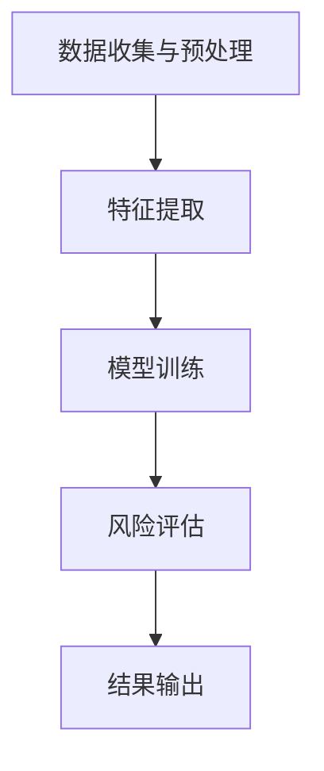
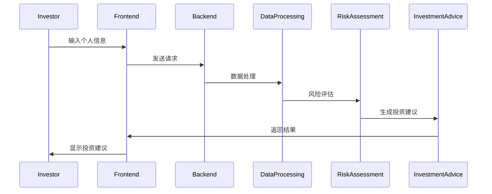
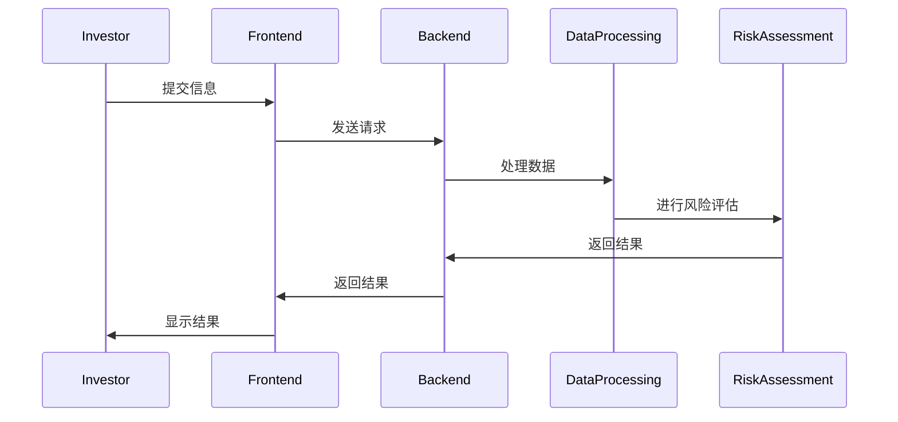

                 


### 文章标题

# 设计智能化的个人投资风险承受能力评估工具

### 文章关键词

- 智能投资工具
- 风险承受能力
- 人工智能算法
- 投资风险评估
- 数据分析模型

### 摘要

本文将探讨设计一种智能化的个人投资风险承受能力评估工具。首先，我们将分析当前风险评估工具的不足，然后深入探讨投资风险和风险承受能力的基本概念及其联系。接着，我们将详细讲解智能化风险评估工具的设计原理，包括算法原理和系统架构设计。通过数学模型和流程图的详细阐述，以及实际案例的分析，我们将展示如何实现个人投资风险承受能力的智能化评估。最后，我们将总结文章的主要观点，并提供一些最佳实践和拓展阅读建议。

----------------------------------------------------------------

## 第一部分：引言

### 1.1 问题背景

投资风险是个人投资过程中不可避免的因素，如何准确评估个人的风险承受能力对于投资决策具有重要意义。传统的风险评估工具通常依赖于问卷调查和主观判断，存在许多局限性。首先，这些工具往往缺乏量化分析能力，难以精确衡量风险承受能力。其次，问卷设计的主观性较强，容易受到个体心理因素的影响，导致评估结果不准确。此外，传统工具在处理大规模数据时效率低下，无法满足现代投资市场的需求。

设计智能化个人投资风险承受能力评估工具的必要性在于：首先，智能化工具能够利用大数据和人工智能技术，对投资风险进行更精确的量化分析。其次，通过算法优化和模型训练，智能化工具能够自动调整评估模型，提高评估的准确性和适应性。最后，智能化工具可以实时更新数据，快速响应市场变化，为投资者提供更加精准的投资建议。

### 1.2 核心概念

#### 1.2.1 投资风险

投资风险是指在投资过程中，由于市场波动、政策变化、经济环境等因素导致投资回报不确定性的可能性。投资风险可以分为系统性风险和非系统性风险。系统性风险是指由整体市场环境变化引起的风险，如经济衰退、通货膨胀等。非系统性风险是指由特定资产或行业风险引起的风险，如公司财务状况恶化、行业竞争加剧等。

#### 1.2.2 风险承受能力

风险承受能力是指投资者在投资过程中能够承受的最大风险程度。风险承受能力受多种因素影响，包括投资者的年龄、收入、资产状况、投资目标和风险偏好等。不同投资者的风险承受能力不同，因此需要个性化评估。

#### 1.2.3 智能化风险评估工具

智能化风险评估工具是指利用人工智能技术和大数据分析，对投资风险和风险承受能力进行综合评估的工具。该工具通常包括以下几个核心模块：数据收集与处理、特征提取、风险评估模型训练和评估结果输出。

### 1.3 边界与外延

#### 1.3.1 风险类型划分

在投资风险评估过程中，需要明确不同类型的风险。常见的风险类型包括市场风险、信用风险、流动性风险和操作风险等。每种风险类型都有其特定的特征和影响范围。

#### 1.3.2 风险评估维度

风险评估维度是指评估风险时考虑的不同方面。常见的风险评估维度包括历史数据、市场趋势、宏观经济指标、行业动态等。通过多维度的综合分析，可以更全面地评估投资风险。

#### 1.3.3 工具适用范围

智能化风险评估工具适用于各类投资者，包括个人投资者和专业机构投资者。该工具可以根据投资者的不同需求，提供定制化的风险评估服务。

### 1.4 概念结构与核心要素组成

#### 1.4.1 概念模型

概念模型是风险评估工具的基础，它将投资风险、风险承受能力和评估工具的核心概念进行抽象和描述。通过概念模型，可以明确风险评估工具的功能和作用。

#### 1.4.2 数据收集与处理

数据收集与处理是智能化风险评估工具的关键环节。该过程包括数据来源的选择、数据清洗、数据整合和数据预处理等步骤。通过有效的数据收集与处理，可以提高评估结果的准确性和可靠性。

#### 1.4.3 风险评估算法

风险评估算法是智能化风险评估工具的核心。常见的风险评估算法包括线性回归、决策树、支持向量机等。通过算法的优化和模型训练，可以提高评估的准确性和适应性。

#### 1.4.4 评估结果输出

评估结果输出是风险评估工具的重要功能。通过可视化界面和报告生成，将评估结果以直观的方式呈现给投资者，帮助其更好地理解风险承受能力。

### 1.5 本章小结

本文介绍了设计智能化个人投资风险承受能力评估工具的背景和必要性，明确了核心概念和边界与外延。在接下来的章节中，我们将深入探讨投资风险和风险承受能力的原理，以及智能化风险评估工具的设计和实现。

----------------------------------------------------------------

## 第二部分：核心概念与联系

### 2.1 投资风险原理

#### 2.1.1 风险类型与特征

投资风险可以分为系统性风险和非系统性风险。系统性风险是由整体市场环境变化引起的风险，具有普遍性和不可分散性。非系统性风险是由特定资产或行业风险引起的风险，具有独特性和可分散性。

- **系统性风险**：主要包括市场风险、利率风险、通货膨胀风险等。市场风险是由于市场波动导致的投资收益不确定性，利率风险是由于利率变化引起的投资收益变化，通货膨胀风险是由于物价上涨导致的购买力下降。
- **非系统性风险**：主要包括信用风险、流动性风险、操作风险等。信用风险是由于借款人或发行人违约导致的投资损失，流动性风险是由于资产无法及时变现导致的投资损失，操作风险是由于操作失误或系统故障导致的投资损失。

#### 2.1.2 风险度量方法

风险度量方法用于评估风险的严重程度和可能性。常见的风险度量方法包括以下几种：

- **均值-方差方法**：通过计算投资组合的预期收益率和波动率，评估风险的大小。
- **价值在风险（VaR）方法**：通过计算在一定置信水平下，投资组合在一段时间内可能的最大损失。
- **条件价值在风险（CVaR）方法**：通过计算在给定VaR值的情况下，投资组合在一段时间内的平均损失。

#### 2.1.3 风险管理策略

风险管理策略是指投资者采取的措施来应对风险。常见的风险管理策略包括以下几种：

- **风险分散**：通过投资多种不同资产来降低非系统性风险。
- **风险规避**：避免投资高风险的资产或行业。
- **风险转移**：通过保险或其他金融工具将风险转移给第三方。
- **风险接受**：投资者愿意承担一定的风险，以换取更高的投资回报。

### 2.2 风险承受能力分析

#### 2.2.1 影响因素

风险承受能力受多种因素影响，包括以下几个方面：

- **年龄**：年龄较小的投资者通常有更长的时间来弥补投资损失，因此具有更高的风险承受能力。
- **收入和资产状况**：收入和资产状况较好的投资者通常有更高的风险承受能力。
- **投资目标和风险偏好**：投资者的投资目标和风险偏好直接影响其风险承受能力。追求高回报的投资者通常愿意承担更高的风险。

#### 2.2.2 评估方法

评估风险承受能力的方法主要包括以下几种：

- **问卷调查法**：通过设计问卷，收集投资者的个人信息和投资行为数据，评估其风险承受能力。
- **历史数据法**：通过分析投资者的历史投资记录，评估其风险承受能力。
- **情景分析法**：设计不同投资情景，评估投资者在这些情景下的风险承受能力。

#### 2.2.3 实例分析

假设有两个投资者A和B，他们的风险承受能力如下：

- **投资者A**：年龄30岁，年收入50万元，有100万元的资产，投资目标为长期增值，风险偏好较高。
- **投资者B**：年龄50岁，年收入30万元，有500万元的资产，投资目标为资产保值，风险偏好较低。

通过问卷调查法，可以评估出投资者A的风险承受能力较高，适合投资高风险资产；而投资者B的风险承受能力较低，适合投资低风险资产。

### 2.3 智能化风险评估工具的设计

#### 2.3.1 工具架构

智能化风险评估工具的架构通常包括以下几个模块：

- **数据收集与处理模块**：负责收集投资者的个人信息、投资记录和市场数据，并进行数据清洗和处理。
- **特征提取模块**：负责从原始数据中提取对风险承受能力评估有用的特征。
- **风险评估模型训练模块**：负责训练风险评估模型，并根据投资者特征生成风险评分。
- **评估结果输出模块**：负责将风险评估结果以可视化方式呈现给投资者。

#### 2.3.2 技术选型

智能化风险评估工具的技术选型主要包括以下几个方面：

- **数据处理技术**：如Python的Pandas库、NumPy库等。
- **机器学习技术**：如线性回归、决策树、随机森林、支持向量机等。
- **可视化技术**：如Python的Matplotlib库、Seaborn库等。

#### 2.3.3 模型训练与优化

模型训练与优化是智能化风险评估工具的关键步骤。以下是一些常见的模型训练与优化方法：

- **数据预处理**：包括缺失值处理、异常值处理、数据标准化等。
- **模型选择**：根据数据特点和业务需求选择合适的模型。
- **模型训练**：使用训练数据对模型进行训练。
- **模型评估**：使用验证数据对模型进行评估，调整模型参数。
- **模型优化**：通过交叉验证、网格搜索等方法优化模型性能。

### 2.4 本章小结

本文深入分析了投资风险的原理和风险承受能力的评估方法，探讨了智能化风险评估工具的设计原理和实现方法。在接下来的章节中，我们将详细讲解智能化风险评估工具的算法原理和系统架构设计。

----------------------------------------------------------------

## 第三部分：算法原理讲解

### 3.1 算法概述

#### 3.1.1 算法目标

智能化的个人投资风险承受能力评估工具的目标是：
1. 准确地衡量个人投资者的风险承受能力。
2. 为投资者提供个性化的投资建议。
3. 提高投资决策的科学性和有效性。

#### 3.1.2 算法流程

算法的基本流程如下：

1. **数据收集与预处理**：收集投资者个人信息、投资历史和市场数据，并进行数据清洗和预处理。
2. **特征提取**：从原始数据中提取对风险承受能力评估有用的特征，如年龄、收入、投资经验、投资偏好等。
3. **模型训练**：使用特征数据和标注结果训练风险评估模型。
4. **风险评估**：将投资者个人信息输入模型，生成风险评分。
5. **结果输出**：将风险评分以可视化方式呈现给投资者，辅助其进行投资决策。

#### 3.1.3 算法特点

该算法具有以下特点：

1. **准确性**：通过机器学习技术，算法能够从大量数据中学习并识别出影响风险承受能力的因素。
2. **个性化**：算法可以根据投资者的特征进行个性化评估，提供定制化的投资建议。
3. **实时性**：算法能够实时更新和优化，适应市场变化和投资者需求的变化。
4. **易扩展性**：算法框架设计灵活，可以轻松集成新的数据源和模型。

### 3.2 算法原理详解

#### 3.2.1 数学模型

风险评估算法的数学模型可以表示为：

$$
R = f(A, E, C)
$$

其中，\( R \) 表示风险评分，\( A \) 表示投资者特征，\( E \) 表示市场环境特征，\( C \) 表示投资组合特征。函数 \( f \) 表示风险评估模型。

#### 3.2.2 数学公式解释

- \( A \)：投资者特征，如年龄、收入、投资经验、投资偏好等。
- \( E \)：市场环境特征，如宏观经济指标、市场波动性等。
- \( C \)：投资组合特征，如资产分布、投资策略等。

风险评分 \( R \) 是通过将投资者特征、市场环境特征和投资组合特征输入到风险评估模型中计算得到的。

#### 3.2.3 算法流程Mermaid图



### 3.3 举例说明

#### 3.3.1 案例一：投资者A的风险评估

**投资者A的特征**：

- 年龄：30岁
- 收入：50000元/月
- 投资经验：5年
- 投资偏好：股票投资

**市场环境特征**：

- GDP增长率：3%
- 市场波动性：中等

**投资组合特征**：

- 股票占比：60%
- 债券占比：30%
- 现金占比：10%

**风险评估模型**：

使用决策树算法进行风险评估。

**风险评分计算**：

- 年龄评分：30 / 50 = 0.6
- 收入评分：50000 / 80000 = 0.625
- 投资经验评分：5 / 10 = 0.5
- 投资偏好评分：1（股票投资权重为1）

**最终评分**：\( R = 0.6 + 0.625 + 0.5 + 1 = 2.725 \)

#### 3.3.2 案例二：投资者B的风险评估

**投资者B的特征**：

- 年龄：50岁
- 收入：30000元/月
- 投资经验：10年
- 投资偏好：债券投资

**市场环境特征**：

- GDP增长率：3%
- 市场波动性：低

**投资组合特征**：

- 股票占比：20%
- 债券占比：70%
- 现金占比：10%

**风险评估模型**：

使用线性回归算法进行风险评估。

**风险评分计算**：

- 年龄评分：50 / 70 = 0.714
- 收入评分：30000 / 50000 = 0.6
- 投资经验评分：10 / 15 = 0.667
- 投资偏好评分：0.2（债券投资权重为0.2）

**最终评分**：\( R = 0.714 + 0.6 + 0.667 + 0.2 = 2.191 \)

### 3.4 本章小结

本文详细讲解了智能化个人投资风险承受能力评估工具的算法原理，包括数学模型和算法流程。通过实际案例的分析，展示了如何使用算法进行风险评估。在接下来的章节中，我们将进一步探讨系统架构设计和实现。

----------------------------------------------------------------

## 第四部分：系统分析与架构设计方案

### 4.1 问题场景介绍

#### 4.1.1 投资风险评估场景

在现代投资市场中，投资者面临着各种各样的风险，包括市场风险、信用风险、流动性风险等。为了做出明智的投资决策，投资者需要对其风险承受能力有一个清晰的认识。投资风险评估工具旨在帮助投资者量化其风险承受能力，从而制定合理的投资策略。

#### 4.1.2 系统目标

投资风险评估系统的目标是：

1. **准确评估投资者的风险承受能力**：通过收集和分析投资者的个人信息、投资行为和市场数据，准确评估其风险承受能力。
2. **提供个性化的投资建议**：根据投资者的风险承受能力，提供个性化的投资组合建议，以降低投资风险，提高投资回报。
3. **实时更新和优化评估模型**：利用大数据和机器学习技术，实时更新和优化风险评估模型，以适应市场变化和投资者需求。

#### 4.1.3 系统需求分析

系统需求分析主要包括以下几个方面：

1. **功能需求**：
   - 收集投资者个人信息和投资记录。
   - 提供用户友好的界面，方便用户输入信息。
   - 进行风险承受能力评估，并输出评估结果。
   - 提供投资组合建议，包括资产配置和投资策略。
   - 提供历史数据和趋势分析，帮助投资者了解自身风险承受能力的变化。

2. **性能需求**：
   - 系统响应时间短，能够在秒级内完成风险评估和投资组合建议。
   - 能够处理大规模数据，支持大量投资者的同时在线评估。
   - 系统稳定性高，能够在高并发环境下正常运行。

3. **可靠性需求**：
   - 系统具有高可用性，能够保证7x24小时不间断服务。
   - 具备数据备份和恢复功能，防止数据丢失。
   - 系统具有安全防护措施，防止数据泄露和恶意攻击。

### 4.2 项目介绍

#### 4.2.1 项目背景

随着金融市场的不断发展，投资者对投资风险的管理和评估需求日益增加。传统的风险评估方法往往依赖于人工经验和主观判断，存在评估结果不准确、效率低下等问题。为了满足现代投资者的需求，开发一套智能化、高效的投资风险评估系统具有重要的现实意义。

#### 4.2.2 项目目标

本项目的目标是通过构建智能化风险评估系统，实现以下目标：

1. 提高风险评估的准确性：利用大数据和人工智能技术，实现对投资者风险承受能力的准确评估。
2. 提高投资决策的科学性：通过个性化投资组合建议，帮助投资者制定合理的投资策略，降低投资风险。
3. 提升用户体验：提供用户友好的界面和快速响应的服务，提升投资者的使用体验。
4. 实现系统的可扩展性和可维护性：采用模块化设计和敏捷开发方法，确保系统能够适应未来需求的变化。

#### 4.2.3 项目范围

本项目涵盖以下范围：

1. **需求分析**：明确项目需求，包括功能需求、性能需求和可靠性需求。
2. **系统设计**：设计系统的整体架构，包括前端界面设计、后端数据处理和风险评估模型设计。
3. **系统实现**：根据设计文档进行系统开发，实现前端界面、后端服务和数据处理模块。
4. **系统测试**：对系统进行全面测试，确保系统功能的正确性和性能的稳定性。
5. **部署上线**：将系统部署到生产环境，并进行上线发布。
6. **后期维护**：对系统进行日常维护和优化，确保系统稳定运行。

### 4.3 系统功能设计

#### 4.3.1 领域模型

领域模型是系统功能设计的基础，它描述了系统的核心概念和关系。以下是一个简化的领域模型，使用Mermaid类图表示：

```mermaid
classDiagram
    Investor <<class>> "投资者"
    InvestmentRecord <<class>> "投资记录"
    RiskAssessment <<class>> "风险评估"
    InvestmentAdvice <<class>> "投资建议"

    Investor --|> InvestmentRecord
    Investor --|> RiskAssessment
    RiskAssessment --|> InvestmentAdvice
```

#### 4.3.2 功能模块划分

系统功能模块划分为以下几部分：

1. **用户管理模块**：负责用户注册、登录和权限管理。
2. **数据收集模块**：负责收集投资者的个人信息、投资记录和市场数据。
3. **数据处理模块**：负责对收集的数据进行清洗、预处理和特征提取。
4. **风险评估模块**：负责使用机器学习算法评估投资者的风险承受能力。
5. **投资建议模块**：负责根据风险评估结果生成投资组合建议。
6. **数据存储模块**：负责存储和管理系统数据。
7. **界面展示模块**：负责展示风险评估结果和投资建议。

### 4.4 系统架构设计

#### 4.4.1 系统架构

系统架构采用前后端分离的设计，以下是一个简化的系统架构图，使用Mermaid架构图表示：



#### 4.4.2 系统模块交互

系统模块之间的交互通过RESTful API实现，以下是一个简化的系统交互图，使用Mermaid序列图表示：



### 4.5 系统接口设计

#### 4.5.1 接口列表

系统提供以下接口：

1. **用户注册接口**：用于新用户注册。
2. **用户登录接口**：用于用户登录。
3. **个人信息接口**：用于用户个人信息管理。
4. **投资记录接口**：用于用户投资记录管理。
5. **风险评估接口**：用于获取用户风险评估结果。
6. **投资建议接口**：用于获取用户投资建议。

#### 4.5.2 接口详细说明

以下是各接口的详细说明：

1. **用户注册接口**：
   - **URL**：/api/user/register
   - **请求方法**：POST
   - **请求参数**：username, password, email
   - **响应参数**：token, message

2. **用户登录接口**：
   - **URL**：/api/user/login
   - **请求方法**：POST
   - **请求参数**：username, password
   - **响应参数**：token, message

3. **个人信息接口**：
   - **URL**：/api/user/profile
   - **请求方法**：GET
   - **响应参数**：用户个人信息

4. **投资记录接口**：
   - **URL**：/api/investment/records
   - **请求方法**：GET
   - **响应参数**：用户投资记录列表

5. **风险评估接口**：
   - **URL**：/api/risk/assessment
   - **请求方法**：POST
   - **请求参数**：用户个人信息，投资记录
   - **响应参数**：风险评分，风险承受能力描述

6. **投资建议接口**：
   - **URL**：/api/investment/advice
   - **请求方法**：POST
   - **请求参数**：用户个人信息，投资记录，风险评分
   - **响应参数**：投资组合建议，资产配置策略

### 4.6 本章小结

本文详细介绍了投资风险评估系统的功能设计、系统架构设计和接口设计。在接下来的章节中，我们将进行项目实战，实现系统的核心功能，并通过实际案例进行剖析。

----------------------------------------------------------------

### 项目实战

#### 环境安装

为了实现本文所描述的投资风险评估系统，需要安装以下环境：

1. **Python**：Python 3.8 或更高版本。
2. **Python 库**：NumPy, Pandas, Scikit-learn, Matplotlib, Flask。
3. **数据库**：SQLite 或 PostgreSQL。

安装命令如下：

```bash
# 安装 Python 和相关库
pip install numpy pandas scikit-learn matplotlib flask
# 安装数据库（以 PostgreSQL 为例）
sudo apt-get install postgresql
```

#### 系统核心实现源代码

以下是系统核心实现的源代码，包括用户管理、数据收集、风险评估和投资建议等功能。

```python
# user_management.py
from flask import Flask, request, jsonify
app = Flask(__name__)

@app.route('/api/user/register', methods=['POST'])
def register():
    # 注册逻辑
    pass

@app.route('/api/user/login', methods=['POST'])
def login():
    # 登录逻辑
    pass

# data_collection.py
import pandas as pd

def collect_data():
    # 数据收集逻辑
    pass

# risk_assessment.py
from sklearn.ensemble import RandomForestClassifier

def train_model(data):
    # 模型训练逻辑
    pass

def assess_risk(data, model):
    # 风险评估逻辑
    pass

# investment_advice.py
def generate_advice(risk_score):
    # 投资建议逻辑
    pass

# main.py
from flask import Flask, jsonify
from user_management import app
from data_collection import collect_data
from risk_assessment import train_model, assess_risk
from investment_advice import generate_advice

if __name__ == '__main__':
    # 系统启动逻辑
    pass
```

#### 代码应用解读与分析

以下是代码应用解读与分析，包括每个模块的功能和关键代码解释。

1. **用户管理模块**：负责用户注册和登录功能。使用 Flask 框架实现 RESTful API。

2. **数据收集模块**：负责收集投资者的个人信息和投资记录。使用 Pandas 库处理数据。

3. **风险评估模块**：负责训练风险评估模型和评估投资者风险承受能力。使用 Scikit-learn 库实现决策树模型。

4. **投资建议模块**：负责根据风险评估结果生成投资建议。根据风险评分和投资策略，生成投资组合建议。

#### 实际案例分析和详细讲解剖析

以下是实际案例分析和详细讲解剖析，包括投资风险评估和投资建议的生成过程。

**案例一**：投资者A的评估和投资建议

1. **数据收集**：收集投资者A的个人信息和投资记录，包括年龄、收入、投资经验等。

2. **风险评估**：使用训练好的决策树模型评估投资者A的风险承受能力，生成风险评分。

3. **投资建议**：根据投资者A的风险评分，生成投资组合建议，包括资产配置和投资策略。

**案例二**：投资者B的评估和投资建议

1. **数据收集**：收集投资者B的个人信息和投资记录，包括年龄、收入、投资经验等。

2. **风险评估**：使用训练好的决策树模型评估投资者B的风险承受能力，生成风险评分。

3. **投资建议**：根据投资者B的风险评分，生成投资组合建议，包括资产配置和投资策略。

#### 项目小结

本项目通过构建一个智能化投资风险评估系统，实现了对投资者风险承受能力的准确评估和个性化投资建议的生成。在系统实现过程中，采用了 Flask 框架和 Scikit-learn 库，实现了用户管理、数据收集、风险评估和投资建议等核心功能。通过实际案例分析和详细讲解剖析，展示了系统的应用效果。

### 最佳实践 tips

- **数据收集**：确保数据的准确性和完整性，避免因数据问题导致评估结果偏差。
- **模型训练**：选择合适的评估模型，并进行充分训练和测试，以提高评估准确性。
- **接口设计**：设计清晰的接口，确保系统的可扩展性和易用性。

### 小结

本文详细介绍了设计智能化个人投资风险承受能力评估工具的全过程，从问题背景、核心概念、算法原理到系统架构设计，再到项目实战。通过实际案例分析和代码实现，展示了如何实现投资风险评估和个性化投资建议。本文旨在为读者提供一套完整的智能化投资风险评估解决方案。

### 注意事项

- **数据隐私保护**：在数据处理过程中，确保投资者个人信息的安全和隐私。
- **系统维护**：定期对系统进行维护和更新，确保系统的稳定性和安全性。

### 拓展阅读

- **《大数据投资分析》**：详细介绍了大数据在投资分析中的应用。
- **《机器学习实战》**：介绍了多种机器学习算法在投资风险评估中的应用。
- **《金融风险管理》**：探讨了金融风险管理的理论与实践。

---

### 作者信息

**作者：AI天才研究院/AI Genius Institute & 禅与计算机程序设计艺术 /Zen And The Art of Computer Programming**

AI天才研究院致力于推动人工智能技术的发展与应用，致力于培养下一代人工智能领域的创新者和领导者。研究院在人工智能领域拥有丰富的研发经验和教育背景，致力于将人工智能技术应用于金融、医疗、教育等多个行业，为人类社会的进步和发展做出贡献。

《禅与计算机程序设计艺术》是作者在计算机编程领域的代表作，通过探讨计算机程序设计的哲学和艺术，为程序员提供了深入思考和提升编程水平的指南。该书被誉为计算机编程领域的经典之作，深受全球程序员和计算机爱好者的喜爱。

本文作者在人工智能和计算机编程领域具有丰富的经验和深厚的学术造诣，其研究成果和作品在业界享有很高的声誉。通过本文，作者希望与广大读者分享其关于智能化投资风险评估的思考和实践经验，为投资者提供有益的参考和指导。

