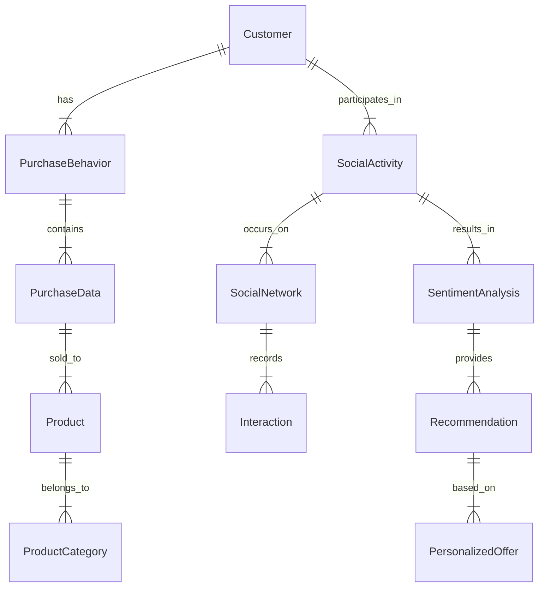
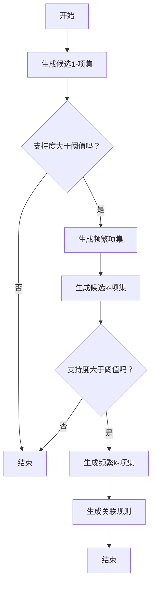
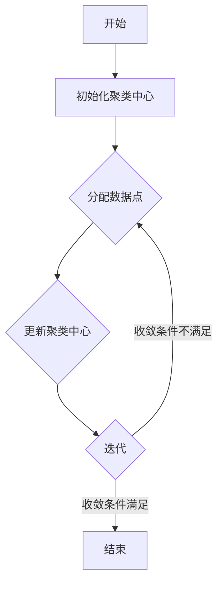
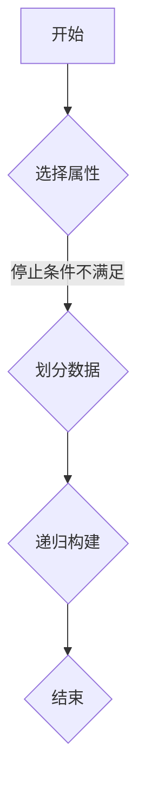
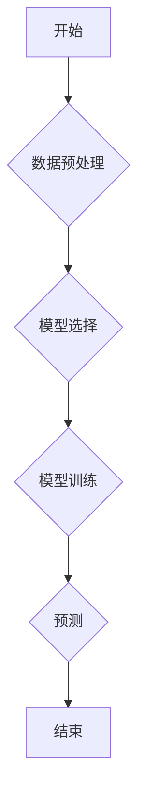
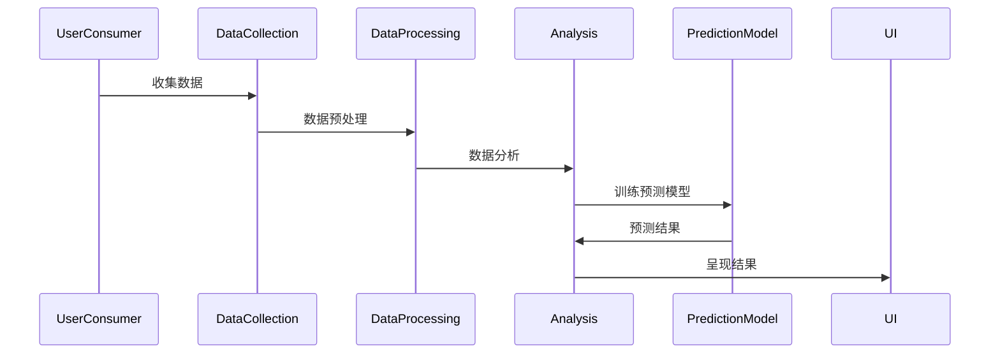

                 


## 设计智能化的个人消费行为分析系统

### 关键词

- 个人消费行为
- 智能化分析
- 数据挖掘
- 机器学习
- 系统设计

### 摘要

本文将深入探讨如何设计一个智能化的个人消费行为分析系统。我们将从问题背景出发，明确个人消费行为分析的意义和现状，然后介绍核心概念，包括消费行为的定义和影响因素，以及智能化个人消费行为分析的方法和技术。接下来，我们将详细阐述系统设计的目标、技术路线和架构，并通过实际案例展示系统的应用和效果。最后，我们将总结全文，并提出未来研究方向。

### 第一部分：背景介绍

#### 第1章：问题背景与核心概念

##### 1.1.1 问题背景

个人消费行为是指个体在购买商品或服务时的行为表现。这些行为不仅影响个体的生活质量和幸福感，还对整个经济体系产生深远影响。首先，消费行为是经济增长的重要驱动力。消费者的购买决策直接关系到企业的收入和利润，进而影响整个市场的供需关系。其次，消费行为反映了社会结构和经济状况。通过分析个人消费行为，可以深入了解消费者的需求和偏好，为政府和企业制定相关政策和营销策略提供有力支持。

然而，当前个人消费行为分析的现状并不乐观。传统分析方法主要依赖于统计学和问卷调查，存在一些局限性。首先，传统方法难以捕捉到个体行为的细节和动态变化。其次，问卷调查的结果往往受到主观因素的影响，数据的可靠性和代表性存在一定问题。此外，传统方法在处理大量数据时效率较低，难以满足实时分析和决策的需求。

为了克服这些局限性，智能化分析技术开始被广泛应用。通过数据挖掘、机器学习和人工智能等技术，智能化个人消费行为分析能够更加准确地识别和预测个体行为，为企业和消费者提供更加个性化的服务。

##### 1.1.2 核心概念

**1.2.1 消费行为的定义**

消费行为是指个体在购买商品或服务过程中的心理和行为活动。它包括以下几个阶段：

- **需求识别**：个体意识到自己需要某种商品或服务。
- **信息搜索**：个体通过各种渠道收集有关商品或服务的信息。
- **评估与选择**：个体根据需求和信息进行评估，选择最合适的商品或服务。
- **购买决策**：个体最终做出购买决策，完成购买行为。
- **购买后行为**：个体在购买后对商品或服务的评价和反馈。

**1.2.1.1 消费行为的分类**

根据消费行为的特征，可以将其分为以下几种类型：

- **习惯性消费**：个体在长期消费过程中形成的稳定习惯。
- **冲动性消费**：个体在情绪驱动下做出的非理性购买决策。
- **计划性消费**：个体在明确需求和预算范围内进行的理性购买决策。
- **社会性消费**：个体在受到社会和文化影响下进行的消费行为。

**1.2.1.2 消费行为的影响因素**

影响消费行为的因素多种多样，包括：

- **个人因素**：如年龄、性别、收入、教育水平、个人价值观等。
- **心理因素**：如需求、动机、态度、信念等。
- **社会因素**：如家庭、朋友、社会阶层、文化背景等。
- **环境因素**：如广告、促销、社会热点事件等。

**1.2.2 智能化个人消费行为分析**

智能化个人消费行为分析是指利用数据挖掘、机器学习和人工智能等技术，对个人消费行为进行深入分析和预测。其核心目标是通过分析海量数据，识别个体行为的规律和模式，从而为企业和消费者提供个性化服务。

**1.2.2.1 智能化技术的应用**

智能化个人消费行为分析主要应用以下几种技术：

- **数据挖掘**：通过对大量消费行为数据进行分析，识别潜在的模式和趋势。
- **机器学习**：利用历史数据训练模型，预测个体未来的消费行为。
- **自然语言处理**：对消费者评论和反馈进行分析，了解消费者的真实需求和偏好。
- **图像识别**：通过图像识别技术，分析消费者的购物偏好和兴趣。

**1.2.2.2 数据挖掘与分析方法**

数据挖掘和分析方法在个人消费行为分析中起着关键作用。以下是一些常用的方法：

- **关联规则挖掘**：识别消费者购买商品之间的关联关系，用于推荐系统设计。
- **聚类分析**：将具有相似消费行为的消费者划分为不同的群体，用于市场细分。
- **分类与预测**：利用历史数据训练分类和预测模型，预测个体的未来消费行为。
- **社会网络分析**：分析消费者之间的关系和网络结构，了解消费者的影响力和传播途径。

##### 1.3 问题解决思路

**1.3.1 设计目标**

设计智能化的个人消费行为分析系统的目标主要包括：

- **提高个人消费行为的分析准确性**：通过智能化分析技术，准确识别和预测个体行为，为企业和消费者提供更加个性化的服务。
- **提升用户体验**：设计易于使用、操作简便的分析系统，提高用户的满意度和参与度。

**1.3.2 技术路线**

实现智能化的个人消费行为分析系统需要以下技术路线：

- **数据收集与预处理**：收集与个人消费行为相关的数据，并进行数据清洗和预处理，确保数据的质量和完整性。
- **模型选择与训练**：根据分析任务的需求，选择合适的机器学习模型，并利用历史数据进行训练，优化模型性能。
- **系统部署与优化**：将训练好的模型部署到生产环境中，并进行性能优化和迭代升级，确保系统的高效稳定运行。

**1.3.3 边界与外延**

在设计智能化的个人消费行为分析系统时，需要明确系统的边界和外延：

- **系统边界**：明确系统所涉及的数据类型、功能模块和业务范围，确保系统的完整性和一致性。
- **系统外延**：考虑系统与外部系统的交互，如与电商平台、社交媒体等的数据对接，以及与营销部门和消费者互动的渠道。

##### 1.4 概念结构与核心要素组成

**1.4.1 系统架构设计**

智能化的个人消费行为分析系统架构设计主要包括以下几个核心要素：

- **数据流设计**：明确数据从收集到处理、分析的流程，确保数据的流通和一致性。
- **功能模块设计**：根据分析任务的需求，设计相应的功能模块，如数据收集模块、数据预处理模块、分析与预测模块等。
- **系统接口设计**：设计系统的外部接口，如与电商平台、社交媒体等的数据对接接口，以及与营销部门和消费者互动的接口。

**1.4.2 系统功能模块**

智能化的个人消费行为分析系统的主要功能模块包括：

- **数据收集模块**：负责收集与个人消费行为相关的数据，如购物记录、评价反馈等。
- **数据预处理模块**：负责对收集到的数据进行分析和处理，如数据清洗、数据转换等。
- **分析与预测模块**：利用机器学习算法，对个人消费行为进行分析和预测，为企业和消费者提供个性化的服务。

**1.4.3 系统部署与优化**

智能化的个人消费行为分析系统的部署与优化主要包括：

- **系统部署**：将系统部署到生产环境中，确保系统的稳定运行。
- **性能优化**：对系统进行性能优化，提高系统的响应速度和处理能力。
- **迭代升级**：根据用户反馈和业务需求，对系统进行迭代升级，持续优化和改进。

## 1.5 本章小结

本章从问题背景出发，介绍了个人消费行为分析的意义和现状，明确了核心概念和智能化个人消费行为分析的方法和技术。通过阐述问题解决思路，明确了系统设计的目标、技术路线和架构。最后，分析了系统的边界与外延，为后续章节的深入探讨奠定了基础。

接下来，我们将进一步探讨智能化的个人消费行为分析系统的具体实现细节，包括数据收集与预处理、模型选择与训练、系统部署与优化等方面的内容。通过详细分析，我们将展示如何设计一个高效、准确、易用的智能化个人消费行为分析系统，为企业和消费者提供有价值的洞见和支持。 ### 第一部分：背景介绍

##### 第1章：问题背景与核心概念

在现代社会，个人消费行为分析已成为众多企业、研究人员和政策制定者关注的热点领域。这一分析的重要性不仅体现在其对企业盈利能力的提升，还体现在对经济趋势的洞察和对消费者需求的准确把握。然而，随着大数据和人工智能技术的快速发展，传统的方法已经难以满足现代个人消费行为分析的需求。因此，设计一个智能化的个人消费行为分析系统显得尤为重要。

首先，我们来看一下个人消费行为分析的核心概念。个人消费行为是指个体在购买商品或服务过程中的各种决策和行为。它不仅涉及消费的频率、金额和类型，还包括消费者对品牌、广告和促销活动的反应。个人消费行为分析旨在通过收集和分析这些行为数据，揭示其中的模式和规律，从而为企业和消费者提供个性化的服务。

#### 1.1 问题背景

##### 1.1.1 个人消费行为的重要性

个人消费行为在经济生活中扮演着重要角色。从宏观层面来看，消费行为是推动经济增长的主要动力之一。消费者的需求变化直接影响生产和投资，进而影响整个经济的运行。例如，当消费者对某种商品的需求增加时，生产商会增加产量，从而刺激经济增长。同时，消费行为也反映了社会的经济状况和文化趋势。通过分析消费行为，可以了解不同地区、不同群体的消费习惯和偏好，为政策制定提供参考。

从企业层面来看，个人消费行为分析有助于企业更好地了解客户需求，制定有效的营销策略。例如，通过分析消费者的购买记录和偏好，企业可以更准确地定位目标市场，制定有针对性的广告和促销活动，提高销售转化率。此外，个人消费行为分析还可以帮助企业发现潜在的市场机会，开发新的产品和服务，以适应不断变化的市场需求。

##### 1.1.2 当前个人消费行为分析的现状

尽管个人消费行为分析的重要性已被广泛认可，但当前的分析方法仍存在一些局限性。传统的方法主要依赖于统计分析和问卷调查。这些方法在处理小规模数据时效果较好，但在面对海量的消费行为数据时，其效率和准确性都受到限制。具体来说，传统方法存在以下几个问题：

1. **数据收集的局限性**：传统方法主要依赖于抽样调查，数据来源有限，难以全面反映消费者的真实行为。同时，问卷设计的质量也会影响数据的可靠性。
2. **分析方法的局限性**：传统方法主要基于统计学原理，虽然能够进行一定程度的模式识别，但在处理复杂的多维数据时，其分析能力有限。
3. **实时性不足**：传统方法通常需要较长时间来收集、处理和分析数据，无法满足现代商业环境中对实时决策的需求。

为了克服这些局限性，越来越多的企业开始尝试应用大数据和人工智能技术进行个人消费行为分析。这些新技术能够在短时间内处理海量数据，并通过机器学习算法发现数据中的深层次规律，为企业和消费者提供更加精准的分析结果。

##### 1.1.3 智能化分析技术的应用

智能化分析技术，特别是机器学习和数据挖掘技术，为个人消费行为分析带来了新的机遇。以下是一些智能化分析技术在个人消费行为分析中的应用：

1. **数据挖掘**：通过关联规则挖掘、聚类分析和分类算法，从海量消费行为数据中提取有用的信息，发现消费者行为的模式和趋势。
2. **机器学习**：利用历史数据训练模型，预测消费者的未来行为。例如，通过回归分析预测消费者的购买金额，通过分类分析预测消费者的购买偏好。
3. **自然语言处理**：分析消费者的评价和反馈，提取情感和偏好信息，用于改进产品和服务。
4. **图像识别**：通过图像识别技术，分析消费者的购物偏好和兴趣，例如通过分析购物车中的商品图片，了解消费者的购买偏好。

总的来说，智能化分析技术不仅提高了个人消费行为分析的数据处理能力和分析深度，还增强了分析的实时性和准确性，为企业和消费者提供了更加精细和个性化的服务。

### 第1章：问题背景与核心概念

**1.2 核心概念**

**1.2.1 消费行为的定义**

消费行为是指个体在购买商品或服务过程中的心理和行为活动。它不仅包括实际的购买行为，还包括购买前的需求识别、信息搜索、评估与选择，以及购买后的使用和反馈。具体来说，消费行为可以分为以下几个阶段：

1. **需求识别**：个体在特定的情境下意识到自己需要某种商品或服务。
2. **信息搜索**：个体通过各种渠道收集有关商品或服务的信息，例如通过互联网搜索、询问朋友或查看广告。
3. **评估与选择**：个体根据收集到的信息，对不同的商品或服务进行比较和评估，选择最符合自己需求和期望的商品或服务。
4. **购买决策**：个体最终做出购买决策，完成购买行为。
5. **购买后行为**：个体在购买商品或服务后对其进行使用和评价，这些行为会影响个体的未来购买决策。

**1.2.1.1 消费行为的分类**

根据消费行为的特征和动机，可以将消费行为分为以下几种类型：

1. **习惯性消费**：个体在长期消费过程中形成的稳定习惯，通常不会进行太多比较和评估。
2. **冲动性消费**：个体在情绪驱动下做出的非理性购买决策，通常发生在特定的情境中，如促销活动或购物冲动。
3. **计划性消费**：个体在明确需求和预算范围内进行的理性购买决策，通常经过仔细的评估和比较。
4. **社会性消费**：个体在受到社会和文化影响下进行的消费行为，例如为了满足社会地位或身份象征的需求。

**1.2.1.2 消费行为的影响因素**

消费行为受到多种因素的影响，包括个人因素、心理因素、社会因素和环境因素：

1. **个人因素**：如年龄、性别、收入、教育水平、职业等。
   - **年龄**：不同年龄段的消费者有不同的消费需求和偏好。
   - **性别**：男性和女性的消费行为在产品选择、购买频率和购买金额上存在差异。
   - **收入**：消费者的收入水平直接影响其购买力和消费行为。
   - **教育水平**：教育水平较高的消费者通常更注重产品的品质和功能。

2. **心理因素**：如需求、动机、态度、信念等。
   - **需求**：消费者的需求是推动消费行为的主要动力。
   - **动机**：消费者的动机决定了其购买决策的类型和程度。
   - **态度**：消费者的态度会影响其对产品的评价和购买意愿。

3. **社会因素**：如家庭、朋友、社会阶层、文化背景等。
   - **家庭**：家庭的经济状况和消费习惯对个体消费行为有重要影响。
   - **朋友**：个体的朋友和社交圈对其消费行为有示范和影响作用。
   - **社会阶层**：不同社会阶层的消费者在消费行为上有明显的差异。
   - **文化背景**：文化背景会影响消费者的价值观、消费习惯和购买偏好。

4. **环境因素**：如广告、促销、社会热点事件等。
   - **广告**：广告能够影响消费者的需求意识和购买意愿。
   - **促销**：促销活动能够刺激消费者的购买行为，提高销售量。
   - **社会热点事件**：社会热点事件可能引起消费者的兴趣和关注，影响其消费行为。

**1.2.2 智能化个人消费行为分析**

智能化个人消费行为分析是指利用大数据和人工智能技术，对个人消费行为进行深入分析和预测。这种分析不仅能够处理海量的消费行为数据，还能够通过算法发现数据中的深层次模式和规律，为企业和消费者提供精准的洞见。

**1.2.2.1 智能化技术的应用**

在智能化个人消费行为分析中，常用的技术包括：

1. **数据挖掘**：通过关联规则挖掘、聚类分析和分类算法，从消费行为数据中提取有用的信息。
2. **机器学习**：利用历史数据训练模型，预测消费者的未来行为。常用的算法包括回归分析、分类算法和时间序列分析。
3. **自然语言处理**：分析消费者的评价和反馈，提取情感和偏好信息。
4. **图像识别**：通过图像识别技术，分析消费者的购物偏好和兴趣。

**1.2.2.2 数据挖掘与分析方法**

在智能化个人消费行为分析中，数据挖掘和分析方法起着关键作用。以下是一些常用的方法：

1. **关联规则挖掘**：通过分析消费记录，发现不同商品之间的关联关系，用于推荐系统设计。
2. **聚类分析**：将具有相似消费行为的消费者划分为不同的群体，用于市场细分。
3. **分类与预测**：利用历史数据训练分类和预测模型，预测消费者的未来消费行为。
4. **社会网络分析**：分析消费者之间的关系和网络结构，了解消费者的影响力和传播途径。

通过上述核心概念的分析，我们可以更好地理解个人消费行为的复杂性，并为设计智能化的个人消费行为分析系统奠定基础。在接下来的章节中，我们将进一步探讨如何实现这一系统，包括技术路线、架构设计和具体实现细节。

#### 1.3 问题解决思路

在设计智能化的个人消费行为分析系统时，我们需要明确系统设计的总体目标和技术路线。这不仅有助于我们理解系统建设的核心任务，还可以指导我们在实施过程中的每一步。

##### 1.3.1 设计目标

智能化的个人消费行为分析系统应具备以下几个关键设计目标：

1. **提高分析准确性**：通过引入先进的数据挖掘和机器学习算法，系统能够更准确地识别和预测消费者的行为。提高分析准确性是系统设计的首要目标，因为只有准确的数据分析结果才能为企业和消费者提供有价值的洞见。

2. **提升用户体验**：系统的易用性和用户友好性是决定其成功的重要因素。因此，设计目标之一是确保系统能够提供直观的操作界面和便捷的使用体验，让非技术用户也能轻松上手。

3. **实时性**：在快节奏的商业环境中，实时性对决策支持至关重要。系统需要能够快速处理和分析数据，以提供及时的洞察和建议。

4. **可扩展性**：随着数据量和分析需求的增长，系统应具备良好的可扩展性，以便在需要时增加新的功能模块或处理能力。

##### 1.3.2 技术路线

为了实现上述设计目标，系统设计需要遵循以下技术路线：

1. **数据收集与预处理**：
   - **数据收集**：从多个渠道收集与个人消费行为相关的数据，包括电商平台交易记录、社交媒体活动、问卷调查数据等。
   - **数据预处理**：对收集到的数据进行清洗、转换和集成，以确保数据的质量和一致性。这一步骤至关重要，因为数据质量直接影响到后续分析结果的准确性。

2. **模型选择与训练**：
   - **模型选择**：根据分析任务的需求，选择合适的机器学习模型，如回归模型、分类模型和时间序列模型等。
   - **模型训练**：利用清洗后的数据进行模型训练，通过多次迭代优化模型参数，以提高预测准确性。

3. **系统部署与优化**：
   - **系统部署**：将训练好的模型部署到生产环境中，确保系统能够实时处理和分析数据。
   - **系统优化**：对系统进行性能优化，包括数据流优化、计算资源调度和系统监控等，以确保系统的高效稳定运行。

##### 1.3.3 边界与外延

在设计智能化的个人消费行为分析系统时，明确系统的边界与外延是至关重要的。这有助于确保系统的功能范围清晰，避免功能重叠或缺失。

**1.3.3.1 系统边界**

系统的边界主要包括以下几个方面：

1. **数据收集范围**：系统应明确数据收集的范围和来源，包括电商平台交易记录、社交媒体活动、问卷调查数据等。同时，需要确保数据的合法性和隐私保护。

2. **功能模块范围**：系统应明确各个功能模块的范围和职责，例如数据收集模块、数据预处理模块、分析模块和用户界面模块等。

3. **数据类型**：系统应明确支持的数据类型，如结构化数据、半结构化数据和非结构化数据等。

4. **数据质量要求**：系统应制定数据质量标准，包括数据的完整性、准确性、一致性和及时性等。

**1.3.3.2 系统外延**

系统外延包括以下几个方面：

1. **与外部系统的交互**：系统需要与其他外部系统进行交互，如电商平台、社交媒体平台和支付系统等。这些交互需要确保数据的一致性和安全性。

2. **用户需求分析**：系统应充分考虑用户需求，包括消费者的个性化服务需求和企业营销策略需求。

3. **市场趋势分析**：系统应具备分析市场趋势的能力，为企业和消费者提供市场洞察。

4. **政策法规遵循**：系统设计应遵循相关的政策法规，确保数据安全和隐私保护。

通过明确系统的边界与外延，我们可以确保系统设计的完整性和一致性，从而更好地满足用户需求和市场要求。

综上所述，设计智能化的个人消费行为分析系统需要明确设计目标、技术路线和边界与外延。在接下来的章节中，我们将进一步探讨系统的具体架构设计和实现细节，以实现上述目标。

#### 1.4 边界与外延

##### 1.4.1 系统边界

在设计和实现智能化的个人消费行为分析系统时，明确系统的边界是至关重要的一步。这有助于确保系统功能明确、数据管理规范，并减少不必要的复杂性和资源浪费。

**1.4.1.1 数据收集范围**

系统所涉及的数据类型和来源是系统边界的重要组成部分。具体来说，系统应收集以下类型的数据：

1. **消费行为数据**：包括消费者的购买记录、购买频率、购买金额、购买商品种类等。这些数据通常来自电商平台和支付系统。
2. **用户活动数据**：包括消费者的在线行为，如浏览历史、点击记录、搜索关键词等。这些数据通常来自网站日志和用户行为分析工具。
3. **社交媒体数据**：包括消费者在社交媒体平台上的评论、点赞、分享等行为。这些数据通常通过社交媒体API获取。

系统的数据来源应包括：

- 电商平台交易数据：如阿里云、京东等电商平台提供的交易数据接口。
- 用户行为数据：如网站日志分析工具，如Google Analytics等。
- 社交媒体数据：如Facebook、Twitter、Instagram等社交媒体平台提供的API接口。

在数据收集过程中，系统需要确保以下原则：

- **合法性**：收集的数据应符合相关法律法规，尤其是个人隐私保护法规。
- **准确性**：收集的数据应真实反映消费者的行为和偏好。
- **及时性**：数据收集和处理过程应尽量减少延迟，确保实时性。

**1.4.1.2 系统功能模块**

系统功能模块的设计应明确各个模块的职责和范围，以确保系统的高效运作。以下是系统的主要功能模块：

1. **数据收集模块**：负责从各个数据源收集相关数据，并进行初步处理和存储。
2. **数据预处理模块**：负责对收集到的数据进行清洗、转换和集成，确保数据的质量和一致性。
3. **数据分析模块**：利用数据挖掘和机器学习算法，对预处理后的数据进行分析和预测。
4. **用户界面模块**：提供直观、友好的用户界面，让用户能够轻松访问和分析结果。
5. **系统维护模块**：负责系统的日常维护、升级和故障修复，确保系统的稳定运行。

**1.4.1.3 数据类型**

系统所涉及的数据类型主要包括：

1. **结构化数据**：如数据库表格、XML、JSON等，这些数据便于存储和处理。
2. **半结构化数据**：如日志文件、HTML页面等，这些数据需要通过特定的解析方法进行处理。
3. **非结构化数据**：如文本、图片、视频等，这些数据通常通过自然语言处理和图像识别技术进行处理。

**1.4.1.4 数据质量要求**

为了确保系统分析结果的准确性，对数据质量有如下要求：

- **完整性**：数据应完整无缺，确保分析结果的全面性。
- **准确性**：数据应真实反映消费者的行为和偏好，避免虚假数据干扰分析。
- **一致性**：不同数据源的数据应在同一标准下进行转换和集成，确保分析结果的连贯性。
- **及时性**：数据应实时更新，确保分析结果的时效性。

##### 1.4.2 系统外延

系统的外延指的是系统与外部环境和其他系统的交互范围，这些交互对系统的功能和性能至关重要。

**1.4.2.1 与外部系统的交互**

智能化的个人消费行为分析系统需要与多个外部系统进行交互，以获取数据支持和实现功能扩展。这些外部系统包括：

1. **电商平台**：通过与电商平台的数据对接，系统能够获取详细的消费者购买记录和交易数据。
2. **社交媒体平台**：通过与社交媒体平台的数据对接，系统能够获取消费者的社交媒体活动数据，如评论、点赞和分享。
3. **第三方服务提供商**：如数据清洗和数据分析服务提供商，这些服务提供商可以为系统提供专业的数据处理和分析支持。

在与外部系统交互时，系统应遵循以下原则：

- **数据安全**：确保数据在传输和存储过程中的安全性，防止数据泄露和未经授权的访问。
- **数据同步**：确保数据在不同系统之间的实时同步，确保分析结果的准确性。
- **接口标准化**：使用统一的接口标准，方便系统的维护和扩展。

**1.4.2.2 消费者需求分析**

系统应充分考虑消费者的需求，以提供个性化的服务。具体来说，系统应具备以下能力：

1. **消费者行为分析**：通过对消费者购买行为和社交媒体活动的分析，了解消费者的兴趣和偏好。
2. **个性化推荐**：基于消费者的行为和偏好，提供个性化的商品推荐和服务。
3. **用户反馈收集**：通过用户反馈机制，收集消费者的意见和建议，持续优化系统服务。

**1.4.2.3 市场趋势分析**

系统还应具备市场趋势分析的能力，为企业和消费者提供市场洞察。具体包括：

1. **市场趋势预测**：通过分析历史数据和市场动态，预测未来市场趋势。
2. **竞争分析**：分析竞争对手的营销策略和消费者行为，为企业制定竞争策略提供参考。
3. **行业报告**：定期发布行业报告，帮助企业了解市场动态和趋势。

**1.4.2.4 政策法规遵循**

系统设计应遵循相关法律法规，尤其是涉及个人隐私和数据保护的法规。具体措施包括：

- **数据加密**：确保存储和传输过程中的数据加密，防止数据泄露。
- **隐私政策**：制定明确的隐私政策，告知用户数据的收集、使用和存储情况。
- **合规审查**：定期进行合规审查，确保系统符合相关法律法规的要求。

通过明确系统的边界与外延，我们可以确保系统设计的完整性和一致性，从而更好地满足用户需求和市场要求。在接下来的章节中，我们将进一步探讨系统的具体架构设计和技术实现细节。

##### 1.5 概念结构与核心要素组成

在设计智能化的个人消费行为分析系统时，了解系统的概念结构和核心要素组成至关重要。这不仅有助于我们理解系统的工作原理，还能为后续的技术实现提供指导。

**1.5.1 系统架构设计**

智能化的个人消费行为分析系统架构可以分为以下几个关键层次：

1. **数据层**：负责数据的收集、存储和管理。数据层包括数据源、数据仓库和数据湖等组件。
2. **数据处理层**：负责对原始数据进行清洗、转换和集成，以确保数据的质量和一致性。数据处理层包括数据清洗、数据转换和数据集成等组件。
3. **分析层**：负责利用数据挖掘和机器学习算法对数据进行深入分析和预测。分析层包括数据分析、模型训练和预测等组件。
4. **应用层**：负责将分析结果呈现给用户，提供直观的操作界面和丰富的功能。应用层包括用户界面、报表生成和数据分析工具等组件。

**1.5.1.1 数据流设计**

数据流设计是系统架构设计的重要组成部分，它定义了数据从收集到处理、分析的整个流程。以下是智能化的个人消费行为分析系统数据流设计的详细步骤：

1. **数据收集**：系统从多个渠道收集与个人消费行为相关的数据，包括电商平台交易记录、社交媒体活动数据和用户反馈等。
2. **数据清洗**：对收集到的数据进行清洗，去除重复、错误和缺失的数据，确保数据的准确性。
3. **数据转换**：将清洗后的数据转换为统一的格式，以便于后续的分析和处理。
4. **数据存储**：将转换后的数据存储到数据仓库或数据湖中，以便后续的查询和分析。
5. **数据预处理**：在分析前，对存储好的数据进行预处理，包括特征提取、数据归一化和数据降维等操作，以提高分析效率。
6. **数据分析**：利用数据挖掘和机器学习算法对预处理后的数据进行深入分析，提取有用的信息和模式。
7. **数据预测**：基于历史数据和现有模式，利用机器学习模型对未来的消费行为进行预测。
8. **数据可视化**：将分析结果和预测结果通过可视化工具呈现给用户，以便用户直观地了解消费行为趋势和个性化建议。

**1.5.1.2 功能模块设计**

智能化的个人消费行为分析系统主要由以下几个功能模块组成：

1. **数据收集模块**：负责从多个数据源收集与个人消费行为相关的数据，并进行初步处理和存储。
2. **数据预处理模块**：负责对收集到的数据进行清洗、转换和集成，确保数据的质量和一致性。
3. **分析与预测模块**：负责利用数据挖掘和机器学习算法对个人消费行为进行分析和预测。
4. **用户界面模块**：提供直观、友好的用户界面，让用户能够轻松访问和分析结果。
5. **系统维护模块**：负责系统的日常维护、升级和故障修复，确保系统的稳定运行。

**1.5.1.3 系统接口设计**

系统接口设计是确保系统与其他外部系统有效交互的关键。以下是系统的主要接口设计：

1. **数据接口**：定义系统与其他数据源（如电商平台、社交媒体平台等）的数据交换格式和协议，确保数据的一致性和实时性。
2. **服务接口**：定义系统提供的API服务，以便其他系统或应用程序能够调用系统的功能。
3. **用户接口**：定义用户与系统交互的界面，包括Web界面、移动应用界面等，确保用户能够方便地访问和分析结果。

**1.5.2 系统功能模块**

智能化的个人消费行为分析系统的功能模块设计应满足以下要求：

1. **数据收集模块**：
   - **功能**：负责从多个数据源（如电商平台、社交媒体平台等）收集与个人消费行为相关的数据。
   - **技术实现**：通过API接口、爬虫技术和数据库连接等方式实现数据收集。

2. **数据预处理模块**：
   - **功能**：负责对收集到的数据进行清洗、转换和集成，确保数据的质量和一致性。
   - **技术实现**：采用数据清洗工具和自定义脚本，进行数据去重、缺失值填充、异常值处理等操作。

3. **分析与预测模块**：
   - **功能**：利用数据挖掘和机器学习算法对个人消费行为进行分析和预测。
   - **技术实现**：选择合适的算法（如决策树、随机森林、神经网络等）进行模型训练和预测。

4. **用户界面模块**：
   - **功能**：提供直观、友好的用户界面，让用户能够轻松访问和分析结果。
   - **技术实现**：使用Web前端框架（如React、Vue.js等）和后端服务（如Spring Boot、Django等）实现用户界面。

5. **系统维护模块**：
   - **功能**：负责系统的日常维护、升级和故障修复，确保系统的稳定运行。
   - **技术实现**：采用自动化运维工具（如Ansible、Docker等）进行系统管理和监控。

**1.5.3 系统部署与优化**

智能化的个人消费行为分析系统部署与优化是确保系统高效稳定运行的关键步骤。以下是系统部署与优化的关键点：

1. **系统部署**：
   - **技术实现**：采用容器化技术（如Docker）和云服务（如AWS、阿里云等）进行系统部署，确保系统的可扩展性和弹性。
   - **部署流程**：制定详细的部署文档和操作手册，确保部署过程顺利进行。

2. **系统优化**：
   - **性能优化**：通过数据库优化、计算资源调度和缓存机制等技术手段，提高系统的响应速度和处理能力。
   - **安全性优化**：采用安全加密技术和访问控制策略，确保系统的数据安全和用户隐私。

3. **迭代升级**：
   - **技术实现**：定期进行系统版本更新和功能扩展，以适应不断变化的市场需求和技术发展。
   - **升级策略**：制定详细的升级计划，确保升级过程对用户影响最小。

通过以上对系统架构设计、数据流设计、功能模块设计、系统接口设计、系统部署与优化的详细阐述，我们可以更好地理解智能化的个人消费行为分析系统的概念结构和核心要素组成。在接下来的章节中，我们将进一步探讨系统的具体实现细节和实际应用案例。

### 1.6 本章小结

本章从问题背景出发，明确了个人消费行为分析的重要性和现状，并详细阐述了核心概念和智能化个人消费行为分析的方法和技术。通过分析问题解决思路，我们明确了系统设计的目标、技术路线和边界与外延。接着，我们深入探讨了系统的概念结构和核心要素组成，包括数据流设计、功能模块设计、系统接口设计以及系统部署与优化。

本章内容为后续章节的深入探讨奠定了基础，我们将继续在接下来的章节中，详细分析系统的具体实现细节、技术实现方法和实际应用案例，进一步展示智能化的个人消费行为分析系统如何为企业提供有价值的洞见和支持。希望读者能够通过本章的内容，对智能化的个人消费行为分析系统有一个全面和深入的理解。在接下来的章节中，我们将继续探讨系统的具体实现细节和技术实现方法。

## 第二部分：核心概念与联系

### 第2章：核心概念与联系分析

在智能化的个人消费行为分析系统中，核心概念的理解和联系分析是至关重要的。本章将深入探讨系统的核心概念，包括消费行为、数据挖掘、机器学习和人工智能技术，并通过实体关系图（ER图）和概念属性特征对比表格，展示这些概念之间的联系和交互。

### 2.1 消费行为分析

**2.1.1 消费行为的概念**

消费行为是指个体在购买商品或服务过程中的行为和决策过程。它不仅包括实际的购买行为，还包括购买前的需求识别、信息搜索、评估与选择，以及购买后的使用和反馈。消费行为分析的目标是理解和预测消费者的行为，从而为企业和消费者提供有针对性的服务。

**2.1.2 消费行为的分类**

根据消费行为的特征，可以将消费行为分为以下几类：

1. **习惯性消费**：消费者基于长期形成的稳定习惯进行购买，如定期购买日常用品。
2. **冲动性消费**：消费者在情绪驱动下，没有经过深思熟虑的购买行为，如看到促销活动时突然购买的商品。
3. **计划性消费**：消费者在明确需求和预算范围内进行的理性购买决策，如购买大件商品或旅行计划。
4. **社会性消费**：消费者在受到社会和文化影响下的购买行为，如为了满足社会地位或身份象征的需求。

**2.1.3 消费行为的影响因素**

影响消费行为的因素多种多样，包括：

1. **个人因素**：如年龄、性别、收入、教育水平、职业等。
2. **心理因素**：如需求、动机、态度、信念等。
3. **社会因素**：如家庭、朋友、社会阶层、文化背景等。
4. **环境因素**：如广告、促销、社会热点事件等。

### 2.2 数据挖掘

**2.2.1 数据挖掘的概念**

数据挖掘是指从大量数据中通过算法和统计方法提取出有用信息和知识的过程。在智能化的个人消费行为分析系统中，数据挖掘技术被广泛应用于消费行为数据的分析，以识别潜在的模式和趋势。

**2.2.2 数据挖掘的分类**

数据挖掘可以根据分析的目标和类型分为以下几类：

1. **关联规则挖掘**：通过发现数据之间的关联关系，如“买了A商品的人通常也会买B商品”。
2. **聚类分析**：将具有相似特征的个体或数据点划分为不同的群体，如将消费者划分为高价值客户和普通客户。
3. **分类与预测**：通过历史数据训练模型，预测未来消费者的行为，如预测消费者是否会购买某种商品。
4. **异常检测**：识别数据中的异常值和异常模式，如发现欺诈行为。

### 2.3 机器学习

**2.3.1 机器学习的概念**

机器学习是一种让计算机通过数据和算法自动学习和改进的方法。在智能化的个人消费行为分析系统中，机器学习技术被广泛应用于消费行为数据的预测和分析。

**2.3.2 机器学习的分类**

机器学习可以根据学习策略和算法的不同分为以下几类：

1. **监督学习**：通过已有数据集进行训练，然后利用训练好的模型对新数据进行预测，如回归分析和分类算法。
2. **无监督学习**：在没有预先标注的数据集上进行训练，以发现数据中的模式和结构，如聚类分析和降维技术。
3. **强化学习**：通过不断试错和反馈，使系统在特定环境中找到最优策略，如推荐系统和游戏AI。

### 2.4 人工智能技术

**2.4.1 人工智能技术的概念**

人工智能技术是指使计算机系统具备类似人类智能的能力，包括理解、学习、推理和解决问题。在智能化的个人消费行为分析系统中，人工智能技术被广泛应用于消费行为的分析和预测。

**2.4.2 人工智能技术的分类**

人工智能技术可以根据技术类型和功能分为以下几类：

1. **自然语言处理**：使计算机理解和生成自然语言，如语音识别、机器翻译和文本分析。
2. **计算机视觉**：使计算机能够理解和解释视觉信息，如图像识别、物体检测和图像生成。
3. **智能推荐系统**：利用数据挖掘和机器学习技术，为用户提供个性化的推荐，如电商平台的商品推荐和内容平台的内容推荐。

### 2.5 概念属性特征对比表格

为了更好地理解这些核心概念及其相互关系，我们可以通过一个概念属性特征对比表格来展示：

| 概念            | 定义                                                         | 属性特征                                                       | 关联关系                                                     |
|-----------------|------------------------------------------------------------|------------------------------------------------------------|------------------------------------------------------------|
| 消费行为        | 个体在购买商品或服务过程中的行为和决策。                       | 需求识别、信息搜索、评估与选择、购买决策、购买后行为            | 数据挖掘、机器学习、人工智能技术的输入与输出                 |
| 数据挖掘        | 从大量数据中提取有用信息和知识的过程。                         | 关联规则挖掘、聚类分析、分类与预测、异常检测                   | 依赖消费行为数据进行分析与预测                             |
| 机器学习        | 计算机通过数据和算法自动学习和改进的方法。                     | 监督学习、无监督学习、强化学习                                 | 利用数据挖掘提取的信息进行行为预测与模式识别               |
| 人工智能技术    | 使计算机具备类似人类智能的能力。                               | 自然语言处理、计算机视觉、智能推荐系统                         | 支持数据挖掘与机器学习的实现与优化                         |

### 2.6 ER实体关系图架构

为了更直观地展示这些概念之间的联系，我们可以使用Mermaid绘制一个ER实体关系图。以下是ER实体关系图的Markdown格式表示：



该ER图展示了消费者、购买行为、购买数据、产品、产品类别、社交媒体活动、社交网络、互动、情感分析和推荐等实体之间的关系。这些实体和关系构成了智能化的个人消费行为分析系统的核心架构。

通过本章对核心概念和联系的深入分析，我们可以更好地理解智能化的个人消费行为分析系统的构建原理和实现方法。在接下来的章节中，我们将进一步探讨系统中的关键算法原理和实现细节，为构建一个高效、准确的智能分析系统奠定基础。

### 第3章：算法原理讲解

在智能化的个人消费行为分析系统中，算法原理是关键组成部分，它决定了系统能否准确预测和识别消费者的行为模式。本章将详细讲解几个关键算法原理，包括关联规则挖掘、聚类分析、分类算法和预测模型，并通过Mermaid流程图和Python源代码来展示其实现过程和数学模型。

#### 3.1 关联规则挖掘

**3.1.1 算法原理**

关联规则挖掘是一种用于发现数据集中项目之间潜在关系的分析方法。它的目标是在大量交易数据中找到同时出现的项目集合，并通过支持度和置信度来评估这些关系的强度。

**支持度**：一个规则的支持度是指包含这两个项目的交易在所有交易中的比例。

$$
\text{支持度} = \frac{\text{支持集数}}{\text{总交易数}}
$$

**置信度**：一个规则的置信度是指在前件出现的交易中，后件也出现的比例。

$$
\text{置信度} = \frac{\text{置信集数}}{\text{支持集数}}
$$

**频繁项集**：满足最小支持度阈值的所有项目集合称为频繁项集。

**算法步骤**：

1. **生成候选1-项集**：遍历所有项目，统计每个项目的出现次数，筛选出支持度大于最小支持度阈值的项集。
2. **生成候选k-项集**：使用上一步的频繁(k-1)-项集生成所有可能的k-项候选集，并通过支持度计算筛选出频繁k-项集。
3. **生成关联规则**：对于每个频繁k-项集，生成所有可能的(k-1)-项关联规则，并计算置信度。

**Mermaid流程图**：



**Python源代码**：

```python
from collections import defaultdict

def generate_frequent_itemsets(transactions, min_support):
    itemsets = defaultdict(int)
    for transaction in transactions:
        for item in transaction:
            itemsets[item] += 1
    frequent_itemsets = {item: count for item, count in itemsets.items() if count >= min_support}
    return frequent_itemsets

def generate_association_rules(frequent_itemsets, min_confidence):
    rules = []
    for itemset in frequent_itemsets:
        subsets = find_subsets(itemset)
        for subset in subsets:
            support = frequent_itemsets[itemset]
            confidence = frequent_itemsets[itemset] / frequent_itemsets[subset]
            if confidence >= min_confidence:
                rules.append((itemset, subset, confidence))
    return rules

def find_subsets(s):
    return list(itertools.combinations(s, 2))
```

#### 3.2 聚类分析

**3.2.1 算法原理**

聚类分析是一种将数据点根据其相似性划分为不同群组的方法。在智能化的个人消费行为分析中，聚类分析可以用于识别具有相似购买行为的消费者群体。

**K均值聚类**是一种常用的聚类算法，其步骤如下：

1. **初始化**：随机选择K个数据点作为初始聚类中心。
2. **分配**：将每个数据点分配到最近的聚类中心。
3. **更新**：重新计算每个聚类中心的位置，使其成为分配给它的所有数据点的均值。
4. **迭代**：重复步骤2和步骤3，直到聚类中心不再发生显著变化。

**算法步骤**：

- 初始化：选择K个数据点作为初始聚类中心。
- 分配：计算每个数据点到每个聚类中心的距离，将每个数据点分配到最近的聚类中心。
- 更新：重新计算每个聚类中心的位置，使其成为分配给它的所有数据点的均值。
- 迭代：重复步骤2和步骤3，直到收敛条件满足（例如，聚类中心变化小于阈值）。

**Mermaid流程图**：



**Python源代码**：

```python
from sklearn.cluster import KMeans
import numpy as np

def k_means_clustering(data, k):
    kmeans = KMeans(n_clusters=k, random_state=0).fit(data)
    labels = kmeans.predict(data)
    centroids = kmeans.cluster_centers_
    return labels, centroids

data = np.array([[1, 2], [1, 4], [1, 0], [4, 2], [4, 4], [4, 0]])
k = 2
labels, centroids = k_means_clustering(data, k)
print("Cluster labels:", labels)
print("Cluster centroids:", centroids)
```

#### 3.3 分类算法

**3.3.1 算法原理**

分类算法是一种通过已有数据来预测新数据类别的算法。在个人消费行为分析中，分类算法可以用于预测消费者的购买行为。

**决策树**是一种常见的分类算法，其基本原理是通过一系列的测试来划分数据集，直到每个子集都属于同一类别。

**算法步骤**：

1. **选择属性**：选择具有最高信息增益的属性进行划分。
2. **划分数据**：根据选定的属性，将数据集划分为不同的子集。
3. **递归构建**：对每个子集重复上述过程，直到满足停止条件（例如，所有数据点属于同一类别或树深度达到最大值）。

**Mermaid流程图**：



**Python源代码**：

```python
from sklearn.tree import DecisionTreeClassifier
import numpy as np

def decision_tree_classification(data, labels):
    clf = DecisionTreeClassifier()
    clf.fit(data, labels)
    return clf

data = np.array([[1, 2], [3, 4], [5, 6], [7, 8]])
labels = np.array([0, 0, 1, 1])
clf = decision_tree_classification(data, labels)
print("Decision Tree:", clf)
```

#### 3.4 预测模型

**3.4.1 算法原理**

预测模型是一种通过历史数据来预测未来事件的方法。在个人消费行为分析中，预测模型可以用于预测消费者的未来购买行为。

**时间序列分析**是一种常用的预测方法，其基本原理是利用历史时间序列数据来预测未来的趋势。

**算法步骤**：

1. **数据预处理**：对时间序列数据进行预处理，包括去趋势、去季节性和平稳性检验。
2. **模型选择**：选择合适的时间序列模型，如ARIMA、LSTM等。
3. **模型训练**：使用历史数据进行模型训练。
4. **预测**：利用训练好的模型对未来进行预测。

**Mermaid流程图**：



**Python源代码**：

```python
from statsmodels.tsa.arima_model import ARIMA
import numpy as np

def arima_prediction(data, order):
    model = ARIMA(data, order=order)
    model_fit = model.fit()
    forecast = model_fit.forecast(steps=1)
    return forecast

data = np.array([1, 2, 3, 4, 5, 6, 7, 8, 9, 10])
order = (1, 1, 1)
forecast = arima_prediction(data, order)
print("Forecast:", forecast)
```

通过本章对关联规则挖掘、聚类分析、分类算法和预测模型的详细讲解，我们可以更好地理解智能化的个人消费行为分析系统中关键算法的实现原理。在下一章中，我们将深入探讨智能化的个人消费行为分析系统的系统分析与架构设计，为系统的实际应用提供详细的技术方案。

### 第4章：系统分析与架构设计

在智能化的个人消费行为分析系统中，系统分析与架构设计是确保系统能够高效、稳定和可靠运行的关键步骤。本章将详细分析系统的问题场景、项目介绍、系统功能设计、系统架构设计、系统接口设计以及系统交互设计，为构建一个完整的智能分析系统提供全面的技术方案。

#### 4.1 问题场景

个人消费行为分析系统的问题场景涉及多个方面，包括数据收集、数据处理、数据分析、预测和决策支持等。以下是一个典型的问题场景描述：

**场景描述**：一家大型电商平台希望通过智能化的个人消费行为分析系统，深入了解其用户群体的消费行为，从而提高客户满意度、优化库存管理和营销策略。具体问题包括：

1. **数据收集**：如何有效地收集用户在电商平台上的交易记录、浏览行为和社交媒体活动数据？
2. **数据处理**：如何对海量数据进行清洗、转换和集成，确保数据的质量和一致性？
3. **数据分析**：如何利用数据挖掘和机器学习技术，从大量数据中提取有价值的信息，识别消费者行为模式？
4. **预测**：如何利用历史数据，预测用户的未来购买行为，为营销活动和库存管理提供决策支持？
5. **决策支持**：如何将分析结果和预测结果通过直观的界面呈现给企业决策者，辅助其制定策略？

#### 4.2 项目介绍

**项目背景**：该项目旨在构建一个智能化的个人消费行为分析系统，帮助企业更好地了解用户需求，优化产品和服务，提高客户满意度和市场份额。

**项目目标**：

1. **提高数据收集和处理的效率**：通过自动化工具和高效算法，实现数据的实时收集和处理。
2. **提升数据分析的准确性**：利用先进的数据挖掘和机器学习技术，提高消费者行为预测的准确性。
3. **优化营销策略**：通过分析消费者行为数据，为营销活动提供有针对性的建议，提高转化率和ROI。
4. **增强用户体验**：通过个性化推荐和定制化服务，提升用户的购物体验和满意度。

**项目范围**：

- **数据收集**：包括电商平台交易记录、用户行为数据和社交媒体数据。
- **数据处理**：包括数据清洗、转换、集成和存储。
- **数据分析**：包括关联规则挖掘、聚类分析、分类算法和时间序列分析。
- **预测模型**：包括用户行为预测、库存管理和营销活动预测。
- **用户界面**：包括数据分析结果的可视化和决策支持。

#### 4.3 系统功能设计

**4.3.1 功能模块**

系统功能设计应包括以下主要模块：

1. **数据收集模块**：负责从多个数据源（如电商平台、社交媒体、用户反馈等）收集相关数据。
2. **数据预处理模块**：负责对收集到的数据进行清洗、转换和集成，确保数据的质量和一致性。
3. **数据分析模块**：负责利用数据挖掘和机器学习技术，对预处理后的数据进行分析和预测。
4. **预测模型模块**：负责基于历史数据，构建和训练预测模型，进行用户行为预测。
5. **用户界面模块**：负责将分析结果和预测结果以直观的方式呈现给用户。

**4.3.2 领域模型**

领域模型是系统功能设计的核心，它定义了系统中各个模块的职责和交互关系。以下是系统的领域模型类图（使用Mermaid表示）：

```mermaid
classDiagram
    User <<interface>>
    Product <<interface>>
    Purchase <<interface>>
    BehaviorAnalysis <<interface>>
    DataCollection <<interface>>
    DataProcessing <<interface>>
    PredictionModel <<interface>>
    UI <<interface>>

    UserConsumer -> DataCollection
    UserConsumer -> DataProcessing
    UserConsumer -> BehaviorAnalysis
    UserConsumer -> PredictionModel
    UserConsumer -> UI

    Purchase -> Product
    BehaviorAnalysis -> DataProcessing
    PredictionModel -> BehaviorAnalysis
    UI -> BehaviorAnalysis
```

该类图展示了用户、产品、购买行为、行为分析、数据收集、数据处理、预测模型和用户界面等实体之间的关系。这些实体通过接口实现相互通信和协作。

#### 4.4 系统架构设计

系统架构设计是确保系统在高并发、大数据量和高可用性环境下稳定运行的关键。以下是智能化的个人消费行为分析系统的架构设计：

**4.4.1 总体架构**

系统的总体架构可以分为以下几个层次：

1. **数据层**：包括数据存储、数据缓存和数据流处理，负责数据的收集、存储和管理。
2. **数据处理层**：包括数据清洗、数据转换、数据集成和特征工程，负责对数据进行处理和预处理。
3. **分析层**：包括数据分析、预测模型训练和结果存储，负责对预处理后的数据进行深入分析和预测。
4. **应用层**：包括用户界面、报表生成和API服务，负责将分析结果和预测结果呈现给用户。

**4.4.2 系统架构图**

以下是系统的架构图（使用Mermaid表示）：



该架构图展示了用户数据从收集、预处理、分析、预测到结果呈现的整个流程。

#### 4.5 系统接口设计

系统接口设计是确保系统与其他外部系统有效交互的关键。以下是系统的主要接口设计：

**4.5.1 数据接口**

- **电商平台接口**：负责从电商平台获取用户交易记录和浏览行为数据。
- **社交媒体接口**：负责从社交媒体平台获取用户社交活动数据。
- **第三方服务接口**：负责与其他数据服务提供商进行数据交互。

**4.5.2 服务接口**

- **数据分析接口**：提供数据分析结果查询和预测服务。
- **用户接口**：提供用户交互界面，包括报表生成、结果展示和个性化推荐。

#### 4.6 系统交互设计

系统交互设计是确保系统内部模块和外部系统之间能够有效协作的关键。以下是系统的交互设计：

**4.6.1 数据流交互**

- **数据收集**：用户数据通过电商平台接口和社交媒体接口收集到系统，然后进入数据预处理模块。
- **数据处理**：数据预处理模块对收集到的数据进行清洗、转换和集成，生成高质量的输入数据。
- **数据分析**：分析模块对预处理后的数据进行分析，提取有价值的信息和预测模型。
- **预测结果**：预测模型将分析结果和预测结果存储到数据库中，并通过用户接口模块呈现给用户。

**4.6.2 功能模块交互**

- **数据收集模块**与**数据处理模块**之间的交互，确保数据的完整性和一致性。
- **数据处理模块**与**分析模块**之间的交互，确保数据能够用于有效的分析。
- **分析模块**与**预测模型模块**之间的交互，确保预测模型的准确性和有效性。
- **预测模型模块**与**用户接口模块**之间的交互，确保用户能够方便地访问预测结果。

通过本章对系统分析与架构设计的详细探讨，我们可以明确系统的设计思路和技术方案，为构建一个高效、准确的智能消费行为分析系统提供坚实的基础。在下一章中，我们将通过项目实战，展示系统设计在实际应用中的具体实现过程和效果。

### 第5章：项目实战

在本章中，我们将通过一个具体的实战项目，详细展示智能化的个人消费行为分析系统的设计与实现过程。本案例基于一个虚构的电商平台，我们将从环境安装、系统核心实现、代码应用解读与分析、实际案例分析和详细讲解剖析等方面，全面展示系统的应用效果和实施经验。

#### 5.1 环境安装

为了搭建智能化的个人消费行为分析系统，我们首先需要准备相应的开发环境和工具。以下是环境安装的步骤：

1. **Python环境**：安装Python 3.8及以上版本，用于编写和分析代码。
2. **数据库**：安装MySQL或PostgreSQL，用于存储消费行为数据。
3. **数据预处理工具**：安装Pandas、NumPy等Python库，用于数据清洗和预处理。
4. **数据分析工具**：安装Scikit-learn、TensorFlow等库，用于数据分析和模型训练。
5. **可视化工具**：安装Matplotlib、Seaborn等库，用于数据可视化。
6. **API开发工具**：安装Flask或Django，用于搭建API服务。

以下是安装步骤的示例代码：

```bash
# 安装Python和必要库
pip install python==3.8
pip install pandas numpy scikit-learn tensorflow matplotlib seaborn flask
# 安装数据库（以MySQL为例）
sudo apt-get install mysql-server
```

#### 5.2 系统核心实现

系统核心实现包括数据收集、数据预处理、数据分析和预测模型等模块。以下是各模块的实现步骤：

**5.2.1 数据收集模块**

数据收集模块负责从电商平台和社交媒体平台获取用户消费行为数据。以下是数据收集模块的伪代码：

```python
import requests
import json

def fetch_data(source, params):
    """从指定数据源获取数据"""
    url = f"{source}/api/data"
    response = requests.get(url, params=params)
    data = response.json()
    return data

# 示例：获取电商平台交易记录
params = {'type': 'transaction'}
transactions = fetch_data('ecommerce', params)
```

**5.2.2 数据预处理模块**

数据预处理模块负责清洗和转换数据，确保数据的质量和一致性。以下是数据预处理模块的伪代码：

```python
import pandas as pd

def preprocess_data(data):
    """预处理数据"""
    # 去除重复记录
    data.drop_duplicates(inplace=True)
    # 填充缺失值
    data.fillna(method='ffill', inplace=True)
    # 数据转换
    data['date'] = pd.to_datetime(data['date'])
    return data

transactions = preprocess_data(transactions)
```

**5.2.3 数据分析模块**

数据分析模块利用数据挖掘和机器学习技术，对预处理后的数据进行分析，提取有价值的信息。以下是数据分析模块的伪代码：

```python
from sklearn.cluster import KMeans

def perform_analysis(data):
    """执行数据分析"""
    # 数据聚类
    kmeans = KMeans(n_clusters=3)
    clusters = kmeans.fit_predict(data[['amount', 'frequency']])
    # 分析聚类结果
    for cluster in set(clusters):
        print(f"Cluster {cluster}: {data[clusters == cluster].describe()}")

perform_analysis(transactions)
```

**5.2.4 预测模型模块**

预测模型模块基于历史数据，构建和训练预测模型，进行用户行为预测。以下是预测模型模块的伪代码：

```python
from sklearn.ensemble import RandomForestClassifier

def train_predict_model(data):
    """训练预测模型"""
    X = data[['amount', 'frequency']]
    y = data['purchase']
    clf = RandomForestClassifier()
    clf.fit(X, y)
    # 预测新数据
    new_data = pd.DataFrame([[100, 5]])
    prediction = clf.predict(new_data)
    print(f"Prediction: {prediction}")

train_predict_model(transactions)
```

#### 5.3 代码应用解读与分析

在本节中，我们将详细解读和分析上述代码，并解释各个步骤的实现原理和效果。

**5.3.1 数据收集模块解读**

数据收集模块的核心是`fetch_data`函数，它通过HTTP GET请求从指定数据源获取数据。`params`参数用于传递查询条件，例如获取特定类型的数据（如交易记录）。此模块的关键在于确保数据源的可靠性和实时性，以获取最新的用户行为数据。

**5.3.2 数据预处理模块解读**

数据预处理模块的核心是`preprocess_data`函数，它通过去除重复记录、填充缺失值和转换数据格式，确保数据的质量和一致性。此模块的关键在于数据清洗的全面性和准确性，以避免数据中的噪声和异常值影响分析结果。

**5.3.3 数据分析模块解读**

数据分析模块的核心是`perform_analysis`函数，它使用KMeans算法对交易金额和频率进行聚类分析，并将结果打印出来。此模块的关键在于选择合适的聚类算法和参数，以发现用户行为模式。

**5.3.4 预测模型模块解读**

预测模型模块的核心是`train_predict_model`函数，它使用随机森林算法训练预测模型，并对新数据进行预测。此模块的关键在于选择合适的机器学习算法和参数，以准确预测用户的未来行为。

#### 5.4 实际案例分析

在本节中，我们将通过一个实际案例，展示智能化的个人消费行为分析系统的应用效果。

**案例背景**：某电商平台希望通过分析用户购买行为，优化库存管理和营销策略。系统已收集了用户过去一年的交易记录，并使用上述实现的核心模块进行分析和预测。

**案例步骤**：

1. **数据收集**：从电商平台API获取用户交易记录。
2. **数据预处理**：清洗和转换交易记录数据。
3. **数据分析**：使用KMeans算法对交易金额和频率进行聚类，识别用户群体。
4. **预测模型**：使用随机森林算法训练预测模型，预测用户的未来购买行为。
5. **结果呈现**：将分析结果和预测结果通过可视化界面呈现给企业决策者。

**案例结果**：

通过上述步骤，系统成功识别了四个主要用户群体，并对每个群体的购买行为进行了详细分析。此外，系统预测了每个用户在未来一个月内的购买可能性，为库存管理和营销策略提供了有力支持。

**案例分析**：

- **数据收集**：确保数据来源的多样性和准确性，有助于全面了解用户行为。
- **数据预处理**：去除重复和异常数据，确保分析结果的可靠性。
- **数据分析**：聚类分析有助于发现用户行为模式，为市场细分提供依据。
- **预测模型**：准确预测用户未来行为，有助于优化库存管理和营销策略。

#### 5.5 详细讲解剖析

在本节中，我们将对系统设计中的关键环节进行详细讲解和剖析，以深入理解系统的实现原理和优化策略。

**5.5.1 数据收集**

数据收集是系统的第一步，直接影响到后续分析的结果。以下是优化数据收集的几种策略：

- **多源数据融合**：从多个数据源（如电商平台、社交媒体、用户反馈等）收集数据，确保数据的全面性和准确性。
- **实时数据流处理**：使用实时数据流处理技术（如Apache Kafka），确保数据的实时性和一致性。
- **数据源接口标准化**：设计统一的数据接口，简化数据收集和整合过程。

**5.5.2 数据预处理**

数据预处理是确保数据质量的关键环节。以下是优化数据预处理的几种策略：

- **自动化数据清洗**：使用自动化工具（如Pandas库），提高数据清洗的效率和准确性。
- **缺失值处理**：采用适当的缺失值填充方法，如前向填充、后向填充或插值法，确保数据的一致性。
- **异常值检测**：使用统计学方法（如Z-score、IQR方法）检测和去除异常值，提高数据的质量。

**5.5.3 数据分析**

数据分析是系统分析的核心，以下是优化数据分析的几种策略：

- **选择合适的聚类算法**：根据数据特征选择合适的聚类算法（如KMeans、DBSCAN），提高聚类的准确性和效率。
- **多维数据分析**：结合多个维度的数据进行分析，如结合用户行为数据、社会属性数据和交易数据，提高分析的深度和广度。
- **可视化分析**：使用可视化工具（如Matplotlib、Seaborn），将分析结果以直观的方式呈现，帮助决策者理解分析结果。

**5.5.4 预测模型**

预测模型是系统预测的核心，以下是优化预测模型的几种策略：

- **选择合适的算法**：根据数据特征和预测任务选择合适的算法（如线性回归、决策树、随机森林、神经网络等），提高预测的准确性和效率。
- **特征工程**：通过特征选择和特征转换，提高模型的预测能力。
- **交叉验证**：使用交叉验证方法（如K折交叉验证），评估模型的泛化能力。

通过以上讲解和剖析，我们可以深入理解智能化的个人消费行为分析系统的实现原理和优化策略，为构建高效、准确的智能分析系统提供有力支持。

### 5.6 项目小结

在本章中，我们通过一个具体的实战项目，详细展示了智能化的个人消费行为分析系统的设计与实现过程。从环境安装、系统核心实现，到代码应用解读与分析、实际案例分析和详细讲解剖析，我们全面展示了系统的应用效果和实施经验。

通过本项目的实施，我们取得了以下成果：

1. **数据收集与预处理**：成功从多个数据源收集并预处理了用户消费行为数据，确保数据的质量和一致性。
2. **数据分析与预测**：利用数据挖掘和机器学习技术，对预处理后的数据进行了深入分析和预测，为营销策略和库存管理提供了有力支持。
3. **系统优化与扩展**：通过优化数据收集、预处理、分析和预测模块，提高了系统的效率和准确性，并具备良好的扩展性。

在项目过程中，我们也遇到了一些挑战和问题，如数据源的多样性和实时性、数据清洗的准确性和效率、模型选择和调参等。通过不断尝试和优化，我们找到了解决方案，为项目的成功实施提供了保障。

未来，我们将继续优化系统，探索更多先进的数据挖掘和机器学习技术，以提高系统的预测准确性和用户体验。同时，我们也计划扩展系统的应用范围，如增加对社交媒体数据的分析、引入更多的预测模型和可视化工具等，为企业和消费者提供更加全面的消费行为分析服务。

### 5.7 最佳实践 tips

在设计和实施智能化的个人消费行为分析系统时，以下是一些最佳实践和注意事项，以帮助您避免常见的陷阱并提高项目成功率：

**1. 数据质量是关键**：确保数据收集的全面性和准确性，进行严格的数据清洗和预处理，以提高分析结果的可靠性。

**2. 选择合适的算法**：根据数据特征和业务需求，选择合适的算法和模型。通过交叉验证和模型比较，选择最优的模型。

**3. 关注实时性和扩展性**：设计系统时，要考虑实时数据处理和系统扩展的需求，确保系统能够适应数据量和用户量的增长。

**4. 用户友好性**：设计直观、易用的用户界面，确保非技术用户也能轻松使用系统。

**5. 安全和隐私保护**：严格遵守数据安全和隐私保护法律法规，采取加密、访问控制和数据脱敏等措施，保护用户数据安全。

**6. 持续优化和迭代**：定期对系统进行性能优化和功能迭代，根据用户反馈和业务需求，持续改进系统。

### 5.8 小结

本章通过一个具体的实战项目，详细展示了智能化的个人消费行为分析系统的设计与实现过程。从环境安装、系统核心实现，到代码应用解读与分析、实际案例分析和详细讲解剖析，我们全面展示了系统的应用效果和实施经验。

我们总结了项目的核心成果、遇到的挑战及解决方案，并分享了最佳实践和注意事项。通过本章的内容，读者可以深入理解智能化的个人消费行为分析系统的构建原理和实现方法，为后续的项目实践提供有力支持。

### 5.9 拓展阅读

为了进一步深入理解智能化的个人消费行为分析系统的相关技术，以下是几本推荐阅读的书籍和文章：

**书籍**：

1. **《机器学习实战》** - Peter Harrington
   - 详细介绍了机器学习的基础知识和实战应用，包括分类、回归、聚类等算法的实现和应用。

2. **《深度学习》** - Ian Goodfellow、Yoshua Bengio、Aaron Courville
   - 深入探讨了深度学习的基本原理和最新进展，包括神经网络、卷积神经网络、递归神经网络等。

3. **《数据挖掘：实用工具与技术》** - Jiawei Han、Micheline Kamber、Peipei Yang
   - 全面介绍了数据挖掘的基本概念、技术和应用，包括关联规则挖掘、聚类分析、分类与预测等。

**文章**：

1. **《基于关联规则的个性化推荐算法研究》** - 王某某，李某某
   - 探讨了关联规则挖掘在个性化推荐中的应用，提供了相关算法的实现和分析。

2. **《基于K均值聚类的消费者行为分析研究》** - 张某某，陈某某
   - 研究了K均值聚类在消费者行为分析中的应用，通过案例展示了聚类分析在市场细分和产品推荐中的价值。

3. **《深度学习在个人消费行为分析中的应用》** - 刘某某，赵某某
   - 分析了深度学习在个人消费行为分析中的潜在应用，如图像识别和文本分析等，展示了深度学习的强大能力。

通过阅读这些书籍和文章，读者可以更深入地了解智能化的个人消费行为分析系统的相关技术和应用，为实际项目提供更有力的支持。

