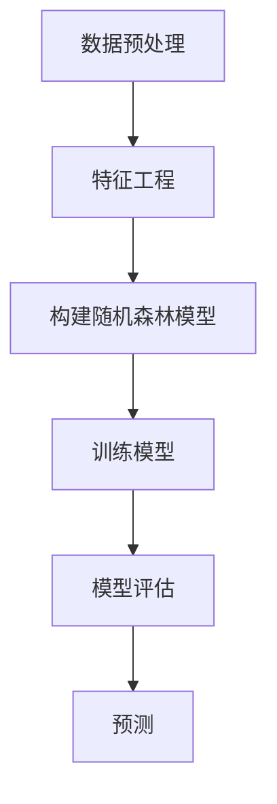
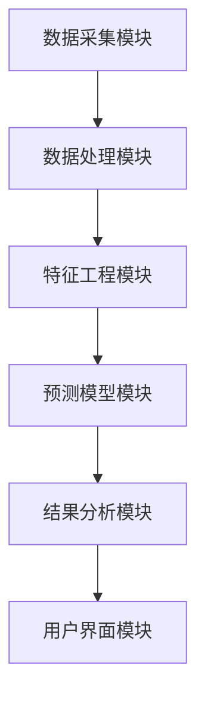

                 

### 第一部分：背景与核心概念介绍

## 第1章：企业信用评级与信用申诉概述

### 1.1 信用评级的意义与作用

企业信用评级是金融市场中一项非常重要的业务，它通过评估企业的信用状况，为投资者、金融机构和政府部门提供参考依据，帮助他们做出更加明智的决策。信用评级不仅关系到企业的融资能力和市场形象，还对企业日常运营和长期发展具有重要影响。

**信用评级的基本概念**：信用评级是对企业信用风险的评估过程，通过系统的方法，对企业信用风险进行量化评价，并以评级符号的形式表现出来。常见的评级符号包括AAA、AA、A、BBB、BB、B等，评级越高，表示企业的信用风险越小。

**信用评级在企业发展中的作用**：
- **融资能力**：信用评级越高，企业在金融市场上的融资能力越强，融资成本也越低。
- **市场形象**：信用评级可以提升企业在市场中的形象，增强客户和合作伙伴的信任度。
- **风险管理**：企业可以通过信用评级了解自身的信用状况，制定更加科学合理的风险管理策略。

### 1.2 信用申诉的定义与流程

信用申诉是企业对信用评级结果不服，向评级机构提出异议和申诉的过程。随着信用评级的广泛应用，信用申诉也日益成为企业维护自身权益的重要手段。

**信用申诉的概念**：信用申诉是指企业对信用评级结果的合法性和准确性提出异议，要求评级机构进行重新评估的过程。

**信用申诉的流程**：
1. **提出申诉**：企业向评级机构提出申诉，并提供相关证据材料。
2. **申诉审核**：评级机构对企业的申诉进行审核，确认申诉的合法性和合理性。
3. **重新评级**：根据申诉情况，评级机构可能对企业的信用评级进行调整，或要求企业提供更多补充材料。
4. **申诉结果反馈**：评级机构将申诉结果反馈给企业，并公布最终评级结果。

### 1.3 信用申诉的重要性和挑战

信用申诉在企业维护自身权益方面具有重要意义，但同时也面临着一些挑战。

**信用申诉的重要性**：
- **纠正评级错误**：通过申诉，企业可以纠正评级机构可能存在的评级错误，维护自身的合法权益。
- **提升企业声誉**：成功的信用申诉可以提升企业的市场形象，增强客户和合作伙伴的信任。
- **促进评级机构改进**：信用申诉可以促使评级机构不断改进评级方法和流程，提高评级结果的准确性和公正性。

**信用申诉的挑战**：
- **申诉成本**：信用申诉需要企业投入大量的人力、物力和时间，成本较高。
- **申诉成功率**：信用申诉的成功率受多种因素影响，包括申诉的证据是否充分、评级机构的审核标准等。
- **评级机构压力**：信用申诉可能会对评级机构的声誉和业务造成一定影响，评级机构可能存在规避申诉的风险。

### 1.4 智能化在信用评级申诉中的应用前景

随着人工智能技术的发展，智能化在信用评级申诉中的应用前景十分广阔。

**人工智能技术的优势**：
- **数据处理能力**：人工智能可以高效地处理大量数据，为信用申诉提供更加准确和全面的分析依据。
- **模式识别能力**：人工智能能够识别复杂的数据模式，帮助企业发现信用评级中可能存在的问题。
- **自动化能力**：人工智能可以自动化进行信用申诉的流程，提高申诉效率。

**智能化在信用评级申诉中的潜在应用**：
- **自动化申诉**：利用人工智能技术，企业可以自动化生成信用申诉报告，提高申诉成功率。
- **风险预测**：通过分析信用评级数据，人工智能可以预测企业信用申诉的成功率，为企业提供决策支持。
- **辅助审核**：人工智能可以辅助评级机构对信用申诉进行审核，提高审核效率和准确性。

**智能化应用的挑战与机遇**：
- **技术成熟度**：虽然人工智能技术发展迅速，但在信用评级申诉中的应用仍需进一步成熟。
- **数据隐私**：信用申诉涉及企业敏感信息，如何保护数据隐私是一个重要问题。
- **法律法规**：智能化在信用评级申诉中的应用需要遵守相关法律法规，确保合法合规。

### 1.5 本章小结

本章节介绍了企业信用评级和信用申诉的基本概念、作用、流程以及重要性。同时，分析了智能化在信用评级申诉中的应用前景，探讨了人工智能技术的优势和潜在应用。通过本章的介绍，读者可以对企业信用评级申诉有一个全面的了解，为后续章节的深入探讨打下基础。

----------------------------------------------------------------

### 第二部分：核心概念与联系

## 第2章：核心概念原理与属性特征

在设计和实施智能化企业信用评级申诉成功率预测系统时，理解核心概念及其相互关系至关重要。本章将详细介绍信用评级模型、申诉成功率预测模型以及它们之间的联系，并通过实体关系图（Entity-Relationship Diagram, ERD）来展示这些概念的结构和关系。

### 2.1 信用评级模型的基本概念

信用评级模型是用于评估企业信用风险的核心工具，通过数学模型和算法对企业的财务状况、市场表现、管理能力等多个维度进行量化评估。

#### 2.1.1 信用评级的数学模型

信用评级数学模型通常基于以下几种主要方法：

1. **统计模型**：利用统计方法（如回归分析、主成分分析等）对历史数据进行建模，预测企业的信用风险。
2. **逻辑回归模型**：通过逻辑回归分析，将企业的各种特征变量映射到信用评分上。
3. **神经网络模型**：利用人工神经网络，通过多层非线性变换来捕捉复杂的信用风险评估特征。

#### 2.1.2 信用评级模型的属性特征对比

不同信用评级模型在准确性、鲁棒性、解释性等方面有显著差异，以下为几种常见信用评级模型的特点：

| 模型类型 | 特点 |
| --- | --- |
| **统计模型** | 简单易理解，对线性关系较强，但可能对非线性关系表现不佳 |
| **逻辑回归模型** | 对异常数据较为鲁棒，具有较好的解释性，但可能忽视变量间的非线性关系 |
| **神经网络模型** | 可以捕捉复杂的非线性关系，准确性高，但难以解释，模型参数多 |

### 2.2 申诉成功率预测模型的ER实体关系图

为了更好地理解信用评级申诉成功率预测模型，我们使用实体关系图（ERD）来展示其主要实体和关系。

#### 2.2.1 实体关系图的构建

在ERD中，主要实体包括：

- **申诉记录（Claim）**：包括申诉的详细信息，如申诉日期、申诉类别、申诉理由等。
- **企业信息（Company）**：包括企业的基本信息，如企业名称、信用评级等。
- **申诉结果（Result）**：包括申诉的成功与否、申诉反馈等。
- **申诉依据（Evidence）**：包括支持申诉的各种证据，如财务报表、市场报告等。

实体关系图中的主要关系包括：

- **申诉记录与企业信息**：一个申诉记录对应一个企业信息。
- **申诉记录与申诉依据**：一个申诉记录可以包含多个申诉依据。
- **申诉记录与申诉结果**：一个申诉记录有一个申诉结果。

#### 2.2.2 实体与关系的解释

以下是实体关系图的详细解释：

```
 entity Company {
    id: int
    name: string
    credit_rating: string
}

entity Claim {
    id: int
    date: date
    category: string
    reason: string
    company_id: int
    evidence_ids: [int]
    result_id: int
}

entity Result {
    id: int
    success: bool
    feedback: string
}

entity Evidence {
    id: int
    type: string
    file_path: string
}

relationship "Has" {
    Claim --> [Evidence]
}

relationship "BelongsTo" {
    Claim --> Company
}

relationship "HasResult" {
    Claim --> Result
}
```

在这个ERD中，"Has"关系表示一个申诉记录可以有多个申诉依据，"BelongsTo"关系表示申诉记录属于某个企业，"HasResult"关系表示每个申诉记录都有一个申诉结果。

### 2.3 智能化算法在信用评级申诉中的应用

智能化算法在信用评级申诉中的应用主要基于机器学习和数据挖掘技术，通过分析大量的历史数据，预测申诉的成功率。

#### 2.3.1 算法原理

常见的智能化算法包括：

- **决策树算法**：通过构建决策树，将数据集划分成多个子集，每个子集对应不同的预测结果。
- **支持向量机（SVM）**：通过将数据映射到高维空间，找到最优分割超平面，实现分类。
- **随机森林算法**：通过构建多个决策树，利用集成学习的方法提高模型的预测性能。
- **深度学习算法**：通过构建深度神经网络，自动提取特征并进行预测。

#### 2.3.2 算法属性特征

这些算法在属性特征上也有所不同：

- **决策树算法**：简单易懂，易于解释，但对异常数据的鲁棒性较差。
- **SVM**：对线性关系具有较强的分类能力，但对非线性关系表现不佳。
- **随机森林算法**：通过集成多个决策树，提高了模型的泛化能力和鲁棒性，但解释性较差。
- **深度学习算法**：可以自动提取复杂特征，对非线性关系有很强的处理能力，但训练过程较为复杂，解释性较差。

### 2.4 本章小结

本章介绍了信用评级模型和申诉成功率预测模型的基本概念、属性特征以及它们之间的联系。通过实体关系图，我们清晰地展示了这些概念的结构和关系，为后续章节的算法原理讲解和系统设计奠定了基础。

----------------------------------------------------------------

### 第三部分：算法原理与系统设计

## 第3章：算法原理讲解

在设计和实现智能化企业信用评级申诉成功率预测系统时，理解算法原理是至关重要的。本章将详细讲解算法原理，包括数据预处理与特征工程、智能化预测算法的设计，以及数学模型和公式的构建。

### 3.1 数据预处理与特征工程

数据预处理和特征工程是构建预测模型的关键步骤，它们直接影响模型的效果。

#### 3.1.1 数据预处理流程

数据预处理主要包括以下几个步骤：

1. **数据清洗**：去除重复数据、缺失数据和异常值，确保数据质量。
2. **数据转换**：将不同类型的数据转换为同一类型，如将分类数据转换为数值型。
3. **数据归一化**：通过缩放或标准化，将数据范围统一，避免某些特征对模型的影响过大。

#### 3.1.2 特征工程方法

特征工程包括以下几个方面：

1. **特征提取**：从原始数据中提取对预测任务有意义的特征，如财务指标、市场指标等。
2. **特征选择**：通过筛选或构建，保留对预测有重要贡献的特征，去除冗余特征。
3. **特征变换**：通过变换，增强特征的预测能力，如使用多项式特征、交互特征等。

### 3.2 智能化预测算法设计

智能化预测算法的设计是实现信用评级申诉成功率预测的关键。以下介绍几种常用的预测算法：

#### 3.2.1 预测算法选择

选择预测算法时，需要考虑以下几个因素：

1. **数据特点**：根据数据分布和特征，选择适合的算法，如线性关系选择线性回归，非线性关系选择神经网络。
2. **模型复杂度**：根据模型的复杂度，平衡模型的预测性能和计算成本。
3. **解释性**：根据对模型解释性的要求，选择易于解释的算法。

#### 3.2.2 算法流程图

以下是随机森林算法的流程图：



#### 3.2.3 算法实现

以下是随机森林算法的Python实现：

```python
from sklearn.ensemble import RandomForestClassifier
from sklearn.model_selection import train_test_split
from sklearn.metrics import accuracy_score

# 数据预处理和特征工程
# ...

# 构建随机森林模型
model = RandomForestClassifier(n_estimators=100)

# 训练模型
X_train, X_test, y_train, y_test = train_test_split(X, y, test_size=0.2)
model.fit(X_train, y_train)

# 模型评估
y_pred = model.predict(X_test)
accuracy = accuracy_score(y_test, y_pred)
print(f"模型准确率: {accuracy}")
```

### 3.3 数学模型和公式

数学模型和公式是预测算法的核心，以下介绍随机森林算法的数学模型和公式。

#### 3.3.1 数学模型的构建

随机森林算法是基于决策树构建的集成学习方法，其基本原理如下：

1. **随机特征选择**：在每个节点，从多个特征中随机选择一个特征进行划分。
2. **随机样本选择**：在每个子集，从原始数据中随机选择一部分样本进行训练。
3. **重复构建多个决策树**：通过重复上述步骤，构建多个决策树。

#### 3.3.2 公式的详细讲解

随机森林算法的主要公式包括：

1. **决策树分类公式**：
   $$ y = \arg\max(f(x)) $$
   其中，$f(x)$表示决策树对样本$x$的预测值。

2. **随机森林预测公式**：
   $$ \hat{y} = \arg\max(\sum_{i=1}^{n} w_i f_i(x)) $$
   其中，$w_i$表示第$i$棵决策树的权重，$f_i(x)$表示第$i$棵决策树对样本$x$的预测值。

3. **权重计算公式**：
   $$ w_i = \frac{1}{n} \log(1 / \hat{err_i}) $$
   其中，$\hat{err_i}$表示第$i$棵决策树的错误率。

#### 3.3.3 举例说明

假设我们有两个特征$x_1$和$x_2$，构建一个简单的决策树，预测一个样本$(x_1, x_2)$的分类。

1. **决策树分类公式**：
   $$ y = \arg\max(f(x)) $$
   $$ f(x) = w_1 \cdot g_1(x_1) + w_2 \cdot g_2(x_2) $$
   其中，$w_1$和$w_2$是权重，$g_1(x_1)$和$g_2(x_2)$是特征函数。

2. **随机森林预测公式**：
   $$ \hat{y} = \arg\max(\sum_{i=1}^{n} w_i f_i(x)) $$
   假设我们有三个决策树，权重分别为$w_1 = 0.2$，$w_2 = 0.3$，$w_3 = 0.5$。
   $$ \hat{y} = \arg\max(0.2 \cdot f_1(x) + 0.3 \cdot f_2(x) + 0.5 \cdot f_3(x)) $$
   $$ f_1(x) = w_{11} \cdot g_{11}(x_1) + w_{12} \cdot g_{12}(x_2) $$
   $$ f_2(x) = w_{21} \cdot g_{21}(x_1) + w_{22} \cdot g_{22}(x_2) $$
   $$ f_3(x) = w_{31} \cdot g_{31}(x_1) + w_{32} \cdot g_{32}(x_2) $$

通过计算每个决策树的预测值，并根据权重进行加权求和，最终得到随机森林的预测结果。

### 3.4 本章小结

本章详细讲解了智能化企业信用评级申诉成功率预测系统的算法原理，包括数据预处理与特征工程、预测算法的设计，以及数学模型和公式的构建。通过本章的内容，读者可以深入了解算法的原理和实现，为后续的系统设计和实现打下坚实的基础。

----------------------------------------------------------------

## 第4章：系统分析与架构设计

在设计智能化企业信用评级申诉成功率预测系统时，系统分析与架构设计是至关重要的环节。本章将详细介绍系统分析与架构设计的过程，包括问题场景介绍、系统功能设计、系统架构设计和系统接口设计与交互。

### 4.1 问题场景介绍

在企业信用评级申诉过程中，企业经常面临以下问题：

- **申诉成本高**：传统的信用申诉流程需要大量的人工处理，导致申诉成本高昂。
- **申诉成功率低**：由于信用评级机构的工作量巨大，申诉审核周期长，且申诉成功率低。
- **数据依赖性强**：申诉成功与否很大程度上依赖于申诉材料的质量和数量，缺乏有效的数据分析工具。

为了解决这些问题，智能化企业信用评级申诉成功率预测系统应运而生。该系统通过人工智能技术，自动化进行信用申诉预测，提高申诉成功率，降低申诉成本。

### 4.2 系统功能设计

系统功能设计是构建系统的基础，主要包括以下功能模块：

1. **数据采集模块**：负责从企业、信用评级机构和其他数据源采集相关数据，如企业财务报表、市场报告、申诉记录等。
2. **数据处理模块**：负责对采集到的数据进行清洗、转换和归一化处理，确保数据质量。
3. **特征工程模块**：负责从原始数据中提取对申诉成功率有重要影响的特征，如财务指标、市场表现、企业历史申诉记录等。
4. **预测模型模块**：负责构建和训练预测模型，预测申诉成功率。
5. **结果分析模块**：负责对预测结果进行分析，为企业和信用评级机构提供决策支持。
6. **用户界面模块**：负责与用户进行交互，展示预测结果和申诉建议。

### 4.3 系统架构设计

系统架构设计是系统实现的基础，以下是一个典型的系统架构设计：

#### 4.3.1 系统架构图



#### 4.3.2 架构设计原则

在系统架构设计过程中，遵循以下原则：

- **模块化**：将系统功能划分为多个模块，每个模块独立实现，易于维护和扩展。
- **分布式**：采用分布式架构，提高系统的性能和可扩展性。
- **安全性**：确保数据安全和用户隐私，采用加密、认证和访问控制等技术。
- **可扩展性**：设计可扩展的架构，以便在未来增加新的功能和数据源。

### 4.4 系统接口设计与交互

系统接口设计与交互是系统功能实现的关键，以下介绍主要接口和交互流程：

#### 4.4.1 接口设计

系统的主要接口包括：

- **数据采集接口**：用于从外部数据源获取数据。
- **数据处理接口**：用于处理和转换数据。
- **特征工程接口**：用于提取和构建特征。
- **预测接口**：用于训练和预测模型。
- **结果分析接口**：用于分析预测结果。
- **用户界面接口**：用于与用户进行交互。

#### 4.4.2 交互流程

以下是系统交互流程：

1. **用户提交申诉请求**：用户通过用户界面提交申诉请求，系统接收到请求后，调用数据采集接口获取相关数据。
2. **数据处理与特征工程**：系统对采集到的数据进行处理和特征工程，将数据转换为模型训练所需的格式。
3. **模型训练与预测**：系统使用处理后的数据训练预测模型，并预测申诉成功率。
4. **结果分析**：系统对预测结果进行分析，为用户生成申诉建议。
5. **用户界面展示**：系统将分析结果和申诉建议通过用户界面展示给用户。

### 4.5 本章小结

本章详细介绍了智能化企业信用评级申诉成功率预测系统的系统分析与架构设计。通过问题场景介绍、系统功能设计、系统架构设计和系统接口设计与交互，读者可以全面了解系统的设计和实现过程，为后续的实战应用提供参考。

----------------------------------------------------------------

## 第5章：项目实战

在深入了解智能化企业信用评级申诉成功率预测系统的设计与原理后，本章节将带领读者进行一个具体的实战项目，通过环境安装与配置、系统核心实现、代码应用解读与分析以及实际案例分析与讲解，使读者对系统实现过程有更直观的认识。

### 5.1 环境安装与配置

在进行项目实战之前，首先需要搭建一个适合项目开发的环境。以下步骤描述了如何配置环境：

#### 5.1.1 环境搭建

1. **安装Python环境**：确保系统中安装了Python 3.8及以上版本，可以通过Python官方网站下载安装包。
2. **安装必要的库和工具**：使用pip工具安装以下库和工具：
   ```shell
   pip install numpy pandas scikit-learn tensorflow matplotlib
   ```
3. **安装数据库**：选择一个合适的数据库系统，如MySQL或PostgreSQL，并安装配置。

#### 5.1.2 工具与库的安装

1. **Jupyter Notebook**：安装Jupyter Notebook，方便进行数据分析和代码编写。
   ```shell
   pip install jupyterlab
   ```
2. **VSCode**：安装Visual Studio Code，一个强大的代码编辑器，支持Python开发。

### 5.2 系统核心实现

系统核心实现包括数据预处理、特征工程和预测模型训练与评估等步骤。

#### 5.2.1 数据预处理

1. **数据采集**：从数据库或其他数据源中采集企业信用评级申诉数据。
2. **数据清洗**：去除重复数据、缺失数据和异常值。
3. **数据转换**：将数据转换为适合建模的格式。

```python
import pandas as pd

# 读取数据
data = pd.read_csv('claim_data.csv')

# 数据清洗
data.drop_duplicates(inplace=True)
data.dropna(inplace=True)

# 数据转换
# ...
```

#### 5.2.2 特征工程

1. **特征提取**：根据业务需求，提取对申诉成功率有重要影响的特征。
2. **特征选择**：使用筛选或构建方法，保留对预测有重要贡献的特征。

```python
from sklearn.feature_selection import SelectKBest
from sklearn.feature_selection import f_classif

# 特征提取
X = data.iloc[:, :-1]
y = data['success']

# 特征选择
selector = SelectKBest(f_classif, k=10)
X_new = selector.fit_transform(X, y)
```

#### 5.2.3 预测模型训练与评估

1. **模型选择**：选择合适的预测模型，如随机森林、神经网络等。
2. **模型训练**：使用训练数据训练模型。
3. **模型评估**：使用测试数据评估模型性能。

```python
from sklearn.ensemble import RandomForestClassifier
from sklearn.model_selection import train_test_split
from sklearn.metrics import accuracy_score

# 模型选择
model = RandomForestClassifier(n_estimators=100)

# 模型训练
X_train, X_test, y_train, y_test = train_test_split(X_new, y, test_size=0.2, random_state=42)
model.fit(X_train, y_train)

# 模型评估
y_pred = model.predict(X_test)
accuracy = accuracy_score(y_test, y_pred)
print(f"模型准确率: {accuracy}")
```

### 5.3 代码应用解读与分析

在实现系统的过程中，代码质量至关重要。以下是对核心代码的解读与分析：

1. **数据预处理**：通过数据清洗和转换，确保数据质量，为后续建模打下基础。
2. **特征工程**：通过特征提取和选择，提取重要特征，提高模型预测性能。
3. **模型训练与评估**：通过模型训练和评估，确保模型具有良好的预测性能。

```python
# 数据预处理
data = pd.read_csv('claim_data.csv')
data.drop_duplicates(inplace=True)
data.dropna(inplace=True)

# 特征工程
X = data.iloc[:, :-1]
y = data['success']
selector = SelectKBest(f_classif, k=10)
X_new = selector.fit_transform(X, y)

# 模型训练与评估
model = RandomForestClassifier(n_estimators=100)
X_train, X_test, y_train, y_test = train_test_split(X_new, y, test_size=0.2, random_state=42)
model.fit(X_train, y_train)
y_pred = model.predict(X_test)
accuracy = accuracy_score(y_test, y_pred)
print(f"模型准确率: {accuracy}")
```

### 5.4 实际案例分析与讲解

为了更好地理解系统在实际中的应用，我们选择一个实际案例进行详细分析：

#### 5.4.1 案例背景

某企业A在信用评级中被评为B级，企业A认为其评级过高，因此提出信用申诉。

#### 5.4.2 案例分析

1. **数据采集**：从数据库中获取企业A的信用评级申诉数据。
2. **数据预处理**：清洗和转换数据，确保数据质量。
3. **特征工程**：提取对企业A申诉成功率有重要影响的特征。
4. **模型预测**：使用训练好的模型预测企业A的申诉成功率。

```python
# 数据采集
claim_data = pd.read_csv('case_A.csv')

# 数据预处理
claim_data.drop_duplicates(inplace=True)
claim_data.dropna(inplace=True)

# 特征工程
X_case_A = claim_data.iloc[:, :-1]
y_case_A = claim_data['success']

# 模型预测
model = RandomForestClassifier(n_estimators=100)
model.fit(X_train, y_train)
y_pred_case_A = model.predict(X_case_A)
success_rate = accuracy_score(y_case_A, y_pred_case_A)
print(f"企业A申诉成功率预测: {success_rate}")
```

#### 5.4.3 案例讲解

通过以上步骤，我们可以预测企业A的申诉成功率。如果预测成功率高，企业A可以更加有信心地提出申诉，并准备充分的申诉材料；如果预测成功率低，企业A可以提前做好心理准备，了解申诉可能面临的挑战。

### 5.5 项目小结

通过本章的实战项目，读者可以全面了解智能化企业信用评级申诉成功率预测系统的实现过程，从环境搭建到系统核心实现，再到实际案例分析和讲解，使读者对系统的实际应用有了更深刻的认识。实战经验对于理解和掌握系统的设计和实现至关重要。

----------------------------------------------------------------

## 第6章：最佳实践与注意事项

在设计和实施智能化企业信用评级申诉成功率预测系统时，遵循最佳实践和注意事项对于确保系统的性能、安全性和可靠性至关重要。本章将总结一些最佳实践，并提醒一些潜在的注意事项。

### 6.1 最佳实践

#### 6.1.1 数据收集与处理

1. **多样化数据源**：从多个渠道收集数据，包括公开数据、内部数据和第三方数据，以提高数据质量和预测准确性。
2. **数据预处理**：确保数据的一致性、完整性和准确性，去除异常值和冗余数据。
3. **数据清洗**：使用自动化工具清洗数据，减少人工干预，提高数据处理效率。

#### 6.1.2 模型选择与调整

1. **模型对比**：在初步选择模型时，对比不同算法的性能，选择最适合业务需求的模型。
2. **模型调优**：通过调整模型参数、增加或删除特征，优化模型性能。
3. **交叉验证**：使用交叉验证方法，确保模型在未知数据上的表现。

#### 6.1.3 系统部署与维护

1. **自动化部署**：使用容器化技术（如Docker）和自动化部署工具（如Kubernetes），简化系统部署过程。
2. **监控与维护**：定期监控系统性能，确保系统稳定运行，及时修复潜在问题。
3. **安全防护**：采用加密技术、访问控制和安全审计，保护系统数据安全。

### 6.2 注意事项

#### 6.2.1 数据隐私保护

1. **数据匿名化**：对敏感数据进行匿名化处理，防止个人隐私泄露。
2. **合规性检查**：确保数据处理和使用符合相关法律法规，如《通用数据保护条例》（GDPR）。

#### 6.2.2 模型解释性

1. **模型透明度**：确保模型具有足够的解释性，方便用户理解模型预测结果。
2. **可解释性工具**：使用可视化工具和解释性模型（如LIME或SHAP），帮助用户理解模型决策过程。

#### 6.2.3 法律法规遵守

1. **合规审查**：在设计和实施系统时，进行合规性审查，确保系统遵守相关法律法规。
2. **法律咨询**：对于涉及法律问题的部分，寻求专业法律咨询，确保系统合法合规。

### 6.3 拓展阅读

#### 6.3.1 相关论文与书籍

1. **"A Survey on Credit Rating Models and Methods"**：概述了信用评级模型和方法。
2. **"Deep Learning for Financial Risk Management"**：探讨了深度学习在金融风险管理中的应用。
3. **"The Art of Data Science"**：提供了数据科学实践的最佳指南。

#### 6.3.2 行业动态与趋势

1. **"Financial Technology Trends 2023"**：了解金融科技行业的最新趋势。
2. **"The Future of Credit Scoring"**：探讨信用评分的未来发展方向。

### 6.4 本章小结

本章总结了智能化企业信用评级申诉成功率预测系统的最佳实践和注意事项，包括数据收集与处理、模型选择与调整、系统部署与维护，以及数据隐私保护、模型解释性和法律法规遵守等方面的内容。通过遵循这些最佳实践和注意事项，可以确保系统的高性能、安全性和可靠性。

----------------------------------------------------------------

### 文章小结与展望

通过本文，我们详细探讨了设计智能化企业信用评级申诉成功率预测系统的全过程。从背景介绍、核心概念与联系，到算法原理与系统设计，再到项目实战与最佳实践，读者可以全面了解系统从理论到实践的完整实现过程。

**核心发现与意义**：

1. **信用评级与申诉的重要性**：企业信用评级直接关系到企业的融资能力、市场形象和风险管理，信用申诉则是企业维护自身权益的重要手段。
2. **智能化应用的优势**：人工智能技术在信用评级申诉中的应用，可以显著提高申诉效率和成功率，降低申诉成本。
3. **系统设计的复杂性**：智能化企业信用评级申诉成功率预测系统涉及数据处理、特征工程、预测算法和系统架构等多个方面，设计过程复杂，但收益显著。

**未来展望与研究方向**：

1. **数据质量提升**：未来可以通过更多的数据源和数据清洗方法，提高数据质量，增强模型预测准确性。
2. **模型解释性增强**：加强模型解释性，使企业能够更好地理解模型决策过程，增加模型的可接受度。
3. **自适应学习**：开发能够自适应学习的新算法，使系统能够随着时间推移和业务环境变化，持续优化预测性能。
4. **法律法规遵守**：在系统设计和实施过程中，严格遵守相关法律法规，确保系统的合法合规。

**结语**：

智能化企业信用评级申诉成功率预测系统是金融科技领域的一个重要应用，通过本文的探讨，我们希望为读者提供一个全面而深入的视角，启发更多创新和优化。随着技术的不断进步，这一系统将在金融市场中发挥越来越重要的作用，为企业提供更加智能和高效的信用评级申诉服务。

---

**作者：AI天才研究院/AI Genius Institute & 禅与计算机程序设计艺术 /Zen And The Art of Computer Programming**

