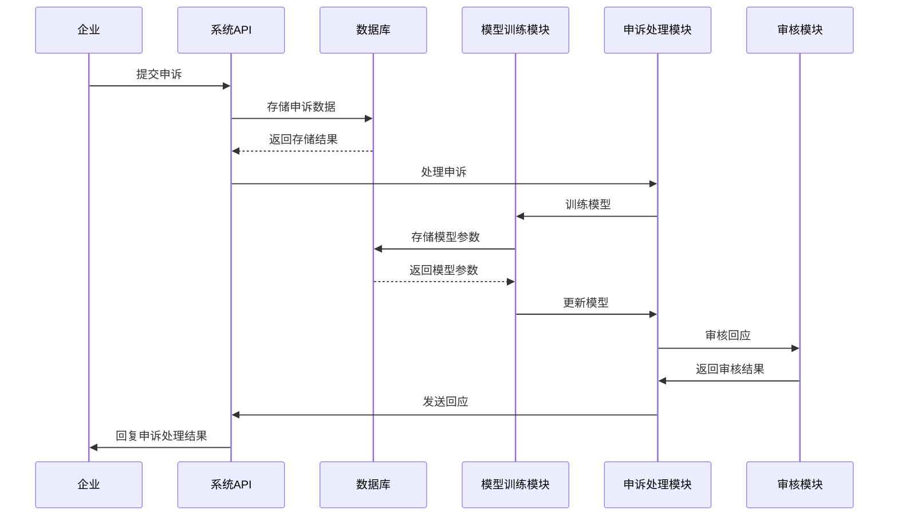

                 


## 第一部分：企业信用评级申诉自动处理与学习系统的背景

### 1.1 问题背景

在当今的商业环境中，企业信用评级对企业的影响日益显著。信用评级不仅影响企业的融资能力，还对其与合作伙伴的合作关系、市场声誉和招投标机会产生重要影响。因此，企业非常关注信用评级的结果，并可能在发现评级结果与其实际情况不符时提出申诉。

信用评级机构通常会对企业的财务状况、管理水平、市场表现等多方面因素进行评估，并给出一个综合信用等级。这一评级结果基于复杂的评分模型和算法，但由于数据源可能存在偏差，或者企业的经营状况发生变动，企业可能会对评级结果提出质疑。例如，一家企业在经营过程中由于市场环境变化导致短期财务状况不佳，但长期来看其经营稳健，这样的情况下，企业可能会对评级结果提出申诉。

此外，信用评级的申诉流程通常较为繁琐，需要企业提供大量的证明材料，并经过评审批复等多个环节。传统的申诉处理方式依赖于人工审查，效率较低，容易出现人为错误，导致申诉处理周期延长，影响企业的正常运营。因此，设计一个智能化、自动化的申诉处理系统，以提高申诉处理效率，减少人为错误，是当前企业信用管理领域面临的一个重要问题。

### 1.2 问题描述

设计一个智能化的企业信用评级申诉自动处理与学习系统，旨在解决以下问题：

1. **申诉处理效率低下**：传统的申诉处理方式依赖人工，处理速度较慢，且容易受到人为因素的影响，导致申诉处理周期延长。
   
2. **人为错误率高**：在人工处理申诉过程中，由于人为疏忽或理解偏差，可能导致申诉处理结果不准确，影响企业的信用评级和声誉。

3. **缺乏学习能力**：传统的申诉处理系统无法从历史数据中学习，无法根据申诉处理的实际情况不断优化处理策略。

4. **申诉材料准备复杂**：企业需要准备大量证明材料，且申诉材料的格式和内容需要严格按照评级机构的要求，这对企业来说是一个挑战。

为了解决上述问题，我们需要设计一个系统，该系统能够：

- **自动识别申诉的核心问题**：通过自然语言处理技术，自动从企业提交的申诉材料中提取关键信息，识别申诉的核心问题。
- **自动生成申诉回应**：利用机器学习技术，根据历史申诉数据和企业的实际情况，自动生成申诉回应。
- **不断优化申诉处理策略**：通过不断收集和处理申诉数据，系统能够学习并优化申诉处理策略，提高处理准确率和效率。

### 1.3 问题解决

为了解决上述问题，我们提出以下解决方案：

1. **引入机器学习和自然语言处理技术**：通过机器学习算法，系统可以从大量历史申诉数据中学习，识别出申诉处理的关键特征和模式。自然语言处理技术可以帮助系统理解和生成与申诉相关的文本内容，提高申诉回应的准确性和效率。

2. **设计自动处理流程**：系统将自动接收企业提交的申诉材料，通过自然语言处理技术提取关键信息，然后利用机器学习模型生成申诉回应。申诉回应将经过审核后发送给企业，企业可以根据回应进行补充或修改。

3. **建立反馈机制**：系统将收集企业对申诉回应的反馈，并利用这些反馈数据对机器学习模型进行优化。通过不断学习和调整，系统能够提高申诉处理的准确性和效率。

4. **优化申诉材料准备**：系统将为企业提供申诉材料准备指南，指导企业按照规范准备申诉材料，提高申诉处理的效率。

通过以上措施，我们期望能够设计出一个高效、准确、智能化的企业信用评级申诉自动处理与学习系统，为企业提供更加优质的信用评级申诉服务。

### 1.4 边界与外延

尽管本系统的设计主要围绕企业信用评级申诉的处理，但其核心功能和设计理念具有一定的通用性和扩展性。以下是本系统的边界与外延：

1. **边界**：

   - **应用范围**：本系统主要应用于企业信用评级申诉的处理，涵盖金融、供应链管理、招投标等多个行业。
   - **评级机构限制**：系统设计为通用型，可以适用于不同信用评级机构，但需要根据不同机构的评级标准和申诉处理流程进行定制化调整。
   - **数据来源限制**：系统依赖于企业的历史申诉数据，因此需要企业愿意共享其数据，以确保系统有足够的数据进行训练和优化。

2. **外延**：

   - **拓展功能**：系统可以扩展到其他类型的企业信用管理应用，如信用评估、信用监控等。
   - **跨行业应用**：本系统的核心技术和设计理念可以应用于其他行业的信用管理领域，如个人信用评估、供应链信用管理等。
   - **集成与协同**：系统可以与其他企业信用管理系统、企业财务管理系统等集成，实现数据的共享和协同处理。

通过明确系统的边界与外延，我们可以更好地规划系统的发展方向，确保其在实际应用中能够满足不同企业和行业的需求，同时保持系统的通用性和可扩展性。

### 1.5 概念结构与核心要素组成

为了深入理解企业信用评级申诉自动处理与学习系统的设计与实现，我们需要从概念结构及其核心要素组成进行详细阐述。

**核心概念**：

1. **企业信用评级**：这是对企业信用状况进行评价的一种机制，通常由第三方信用评级机构进行评估。评级结果通常包括信用等级和评分，反映了企业的信用风险水平。

2. **申诉处理**：企业对信用评级结果提出异议时，需要通过一定的程序进行申诉。申诉处理涉及对申诉材料的审核、评估、回应等多个环节。

3. **机器学习**：一种通过数据驱动的方式让计算机自动学习、优化和改进的方法。机器学习在信用评级申诉处理中可用于模型训练、特征提取和预测。

4. **自然语言处理（NLP）**：人工智能领域的一个分支，旨在使计算机能够理解和处理人类自然语言。在申诉处理中，NLP技术可用于文本分析、情感识别和生成。

**核心要素**：

1. **数据采集与处理**：系统需要从多个来源采集与信用评级申诉相关的数据，包括企业提交的申诉材料、信用评级报告、历史申诉案例等。采集到的数据需要经过清洗、预处理，以便用于模型训练和推理。

2. **模型训练与优化**：利用机器学习算法，系统需要对采集到的数据进行训练，以构建能够识别申诉关键问题和生成申诉回应的模型。训练过程中，模型参数需要不断优化，以提高预测准确率和处理效率。

3. **申诉自动生成**：基于训练好的机器学习模型，系统能够自动分析申诉材料，生成申诉回应。这一过程需要结合自然语言处理技术，确保生成的文本内容准确、流畅。

4. **反馈与优化**：系统在处理申诉过程中会收集企业的反馈信息，这些反馈用于模型优化和系统改进。通过不断的学习和调整，系统能够提高申诉处理的准确性和用户体验。

**概念联系**：

- **机器学习与NLP**：机器学习提供了一种自动化的方法来分析和处理数据，而NLP则使得系统能够理解和生成人类语言。两者结合，使得系统能够高效地处理文本数据，生成个性化的申诉回应。

- **数据采集与模型训练**：数据是机器学习的基础，系统需要不断优化数据采集和处理流程，确保模型训练的有效性和准确性。

- **申诉自动生成与反馈机制**：自动生成申诉回应是系统的核心功能，而反馈机制则确保系统能够根据实际反馈不断优化，提高处理效果。

通过明确核心概念与核心要素，我们可以更好地理解企业信用评级申诉自动处理与学习系统的设计原理和实现方式，为其在实际应用中的高效运行提供理论支持和实践指导。

## 第二部分：核心概念与联系

### 2.1 企业信用评级

企业信用评级是指第三方信用评级机构对企业信用状况的综合评估。这一评估过程通常涉及对企业历史财务状况、管理水平、市场表现、偿债能力等多方面因素的考量。评级结果以信用等级或评分的形式呈现，通常分为多个等级，如AA、A、BBB等，每个等级对应不同的信用风险水平。

**属性特征**：

| 特征 | 描述 |
| --- | --- |
| **信用等级** | 根据评估结果，企业被赋予不同的信用等级。不同等级代表企业信用风险的差异。 |
| **评级结果** | 包括信用评分和信用等级，评分通常是一个数值范围，如1-10分，等级则用字母或数字表示，如AAA、AA+等。 |
| **评级周期** | 企业信用评级不是静态的，通常需要定期更新，以反映企业信用状况的变化。评级周期可能为半年、一年或更长时间。 |

企业信用评级对企业的影响深远。首先，它直接影响企业的融资能力。信用评级较高的企业更容易获得低利率的贷款和信用额度，而信用评级较低的企业则可能面临较高的融资成本和限制。其次，信用评级会影响企业与合作伙伴的合作关系。高信用评级的企业更容易赢得合作伙伴的信任，从而在招投标、供应链合作等方面占据优势。此外，信用评级还可能影响企业的市场声誉，低信用评级可能会对企业的品牌形象造成负面影响。

### 2.2 机器学习

机器学习是一种通过数据驱动的方式使计算机系统能够从数据中学习、做出决策或预测的技术。它涉及统计学、计算机科学和人工智能等领域，旨在让计算机能够自动从数据中提取模式和知识，而不需要显式编程。

**属性特征**：

| 特征 | 描述 |
| --- | --- |
| **数据依赖** | 机器学习依赖于大量数据来进行训练，数据的数量和质量直接影响模型的性能。 |
| **模型优化** | 通过调整模型参数和结构，机器学习算法能够不断提高预测准确性和泛化能力。 |
| **自适应** | 机器学习模型能够适应新的数据和问题情境，不断更新和改进，以应对动态变化。 |

机器学习在信用评级申诉处理中具有广泛的应用。首先，它可以帮助系统从历史申诉数据中学习，识别出申诉处理的关键特征和模式。这些特征可以用于自动分类申诉类型、预测申诉结果等。其次，机器学习算法可以帮助系统自动生成申诉回应，提高处理效率和准确性。通过自然语言处理技术，系统能够理解和生成与申诉相关的文本内容，使得生成的回应更加符合人类语言表达习惯。

### 2.3 自然语言处理

自然语言处理（NLP）是人工智能领域的一个分支，旨在使计算机能够理解、生成和处理自然语言。NLP技术广泛应用于文本分析、情感识别、机器翻译、语音识别等领域。

**属性特征**：

| 特征 | 描述 |
| --- | --- |
| **语言模型** | 建立对自然语言的理解和处理，如词嵌入、语法分析等。 |
| **分词** | 将文本分割为单词或短语，以便进一步处理。 |
| **情感分析** | 分析文本的情感倾向，如正面、负面或中性。 |

在信用评级申诉处理中，NLP技术扮演着关键角色。通过NLP，系统可以自动理解和分析企业提交的申诉文本，提取关键信息，识别申诉的核心问题。此外，NLP技术还用于生成自动回复，使得生成的文本内容更加自然、准确。NLP与机器学习技术的结合，使得系统能够高效处理文本数据，生成高质量的申诉回应。

### 2.4 概念联系

企业信用评级申诉自动处理与学习系统的核心在于将机器学习和自然语言处理技术应用于信用评级申诉的处理。以下是这些概念之间的联系：

1. **机器学习与自然语言处理**：机器学习为系统提供了自动学习和优化能力，而自然语言处理则为系统提供了理解和生成文本的能力。两者结合，使得系统能够高效、准确地处理企业信用评级申诉。

2. **数据与模型**：机器学习依赖于大量数据进行训练，而自然语言处理则依赖于语言模型和分词等技术。这些技术和数据共同构建了系统的核心功能。

3. **申诉处理与反馈**：系统通过机器学习和NLP技术自动处理申诉，并根据企业的反馈不断优化模型和策略。这一过程确保了系统的持续改进和优化。

通过明确这些概念之间的联系，我们可以更好地理解企业信用评级申诉自动处理与学习系统的设计原理和实现方式，为其在实际应用中的高效运行提供理论支持和实践指导。

### 2.5 企业信用评级申诉自动处理与学习系统的工作流程

企业信用评级申诉自动处理与学习系统的工作流程可以分为以下几个关键步骤：

#### 2.5.1 数据采集与预处理

**步骤一：数据采集**  
系统首先需要从多个来源采集与信用评级申诉相关的数据，这些数据包括：

- **企业信用评级报告**：包含企业的信用评分、信用等级、评级周期等信息。
- **企业申诉材料**：包括申诉原因、申诉证据、申诉文本等。
- **历史申诉案例**：包括已处理的申诉案例及其处理结果。

**步骤二：数据预处理**  
采集到的数据通常需要进行清洗和预处理，包括以下任务：

- **数据清洗**：去除重复记录、纠正错误、填补缺失值等。
- **特征提取**：从文本数据中提取关键词、短语、情感倾向等特征。
- **数据标准化**：对数据进行归一化或标准化处理，以便模型训练。

#### 2.5.2 模型训练与优化

**步骤三：模型训练**  
利用预处理后的数据，系统开始训练机器学习模型。训练过程包括以下几个环节：

- **特征选择**：从提取的特征中选取与申诉处理相关的特征，以提高模型性能。
- **模型选择**：选择合适的机器学习算法，如随机森林、支持向量机、神经网络等。
- **参数调优**：通过交叉验证等方法选择最佳参数，以优化模型性能。

**步骤四：模型评估**  
在模型训练完成后，需要对模型进行评估，以验证其准确性和泛化能力。常用的评估方法包括：

- **准确率**：预测正确的样本占总样本的比例。
- **召回率**：实际为正类的样本中被正确预测为正类的比例。
- **F1分数**：准确率和召回率的调和平均值。

**步骤五：模型优化**  
根据评估结果，系统可能需要进一步调整模型参数或选择更合适的算法，以提高模型性能。

#### 2.5.3 申诉自动生成

**步骤六：申诉自动生成**  
基于训练好的机器学习模型，系统可以自动处理新的申诉材料，生成申诉回应。具体过程如下：

- **文本分析**：使用自然语言处理技术对申诉文本进行分析，提取关键信息，如申诉原因、申诉证据等。
- **模型预测**：利用训练好的模型对提取的特征进行预测，生成申诉回应的建议。
- **文本生成**：结合自然语言生成技术，将模型预测结果转换为自然语言文本，生成申诉回应。

**步骤七：审核与优化**  
生成的申诉回应将经过系统内部审核，以确保回应的准确性和合理性。审核通过后，申诉回应将发送给企业。

#### 2.5.4 反馈与迭代

**步骤八：收集反馈**  
系统会收集企业的反馈信息，包括对申诉回应的满意度、申诉处理的最终结果等。

**步骤九：模型优化**  
根据收集的反馈数据，系统会进行模型优化，以提高申诉处理的准确性和用户体验。模型优化过程包括重新训练模型、调整模型参数等。

通过以上步骤，企业信用评级申诉自动处理与学习系统能够高效、准确地处理信用评级申诉，并不断优化申诉处理策略，为企业提供优质的信用评级服务。

### 2.6 机器学习在信用评级申诉处理中的应用

机器学习在信用评级申诉处理中的应用主要体现在以下几个方面：

1. **特征提取与模式识别**：通过机器学习算法，系统可以从大量历史申诉数据中提取关键特征，如申诉类型、申诉原因、申诉证据等。这些特征可以帮助系统识别申诉的核心问题，提高申诉处理的准确率。

2. **分类与预测**：利用分类算法，如随机森林、支持向量机等，系统可以对新的申诉材料进行分类，预测其处理结果。例如，系统可以预测申诉是否会被接受、申诉回应的具体内容等。

3. **回归分析**：通过回归算法，系统可以预测申诉处理所需的时间、申诉回应的长度等。这些预测结果有助于优化申诉处理流程，提高工作效率。

4. **模型优化与调整**：机器学习模型可以根据处理结果不断优化，调整模型参数，以提高预测准确率和处理效率。例如，通过交叉验证等方法，系统可以发现并修正模型中的偏差，提高模型的泛化能力。

5. **自动化生成申诉回应**：基于训练好的机器学习模型，系统可以自动生成申诉回应。通过自然语言处理技术，生成的回应内容更加自然、准确，减少了人为干预，提高了处理效率。

通过以上应用，机器学习不仅提高了信用评级申诉处理的效率和准确性，还为企业提供了更智能、更高效的信用管理服务。

### 2.7 自然语言处理在信用评级申诉处理中的应用

自然语言处理（NLP）在信用评级申诉处理中具有重要作用，主要体现在以下几个方面：

1. **文本分析**：NLP技术可以帮助系统对申诉文本进行深入分析，提取关键信息。例如，通过分词、词性标注等技术，系统可以识别出文本中的名词、动词等关键成分，从而理解申诉的核心内容和要点。

2. **情感分析**：NLP技术可以用于分析文本的情感倾向，识别出申诉文本中的积极、消极或中性情感。这种情感分析有助于系统判断申诉的严重程度和回复策略，从而生成更加合适的申诉回应。

3. **命名实体识别**：NLP技术可以识别出文本中的命名实体，如企业名称、地点、时间等。这些命名实体在申诉处理中具有重要的参考价值，有助于系统更好地理解申诉背景和内容。

4. **文本生成**：通过NLP技术，系统可以自动生成申诉回应。文本生成技术如自然语言生成（NLG）和模板匹配，可以确保生成的文本内容自然、流畅，减少人为干预。这提高了申诉处理的效率，同时保证了回应的准确性和专业性。

5. **多语言支持**：NLP技术支持多种语言的处理，使得系统能够处理来自不同国家和地区的申诉。这为企业在全球范围内的信用评级管理提供了便利。

通过以上应用，NLP技术显著提升了信用评级申诉处理的效率和准确性，为企业提供了更加智能化的信用管理服务。

### 2.8 机器学习与自然语言处理在信用评级申诉处理中的综合应用

机器学习与自然语言处理（NLP）在信用评级申诉处理中的综合应用，为系统带来了显著的优势，使得申诉处理更加智能化、高效化和精准化。以下是这些技术综合应用的详细描述：

1. **自动化特征提取**：机器学习技术能够从大量的历史申诉数据中提取关键特征，这些特征包括申诉类型、申诉原因、申诉证据等。NLP技术进一步细化这些特征，通过分词、词性标注等操作，将文本数据转化为结构化的信息。这种自动化特征提取不仅提高了数据处理效率，还减少了人工干预，降低了错误率。

2. **精准分类与预测**：结合机器学习算法，如随机森林、支持向量机等，系统能够对新的申诉材料进行精准分类和预测。例如，通过训练好的分类模型，系统可以预测申诉的受理结果、申诉回应的类型等。同时，NLP技术能够对申诉文本进行深入分析，提供更为准确的情感倾向和命名实体识别结果，这些信息共同提高了分类和预测的准确性。

3. **智能生成申诉回应**：在生成申诉回应时，机器学习模型和NLP技术相互配合，使得生成的文本内容既符合业务逻辑，又具有自然流畅的语言表达。机器学习模型负责生成回应的骨架和关键信息，而NLP技术则负责润色和优化语言表达，确保生成的文本更加贴近人类语言习惯。

4. **动态模型优化**：在信用评级申诉处理过程中，系统会收集大量的处理结果和用户反馈。这些数据被用于不断优化机器学习模型和NLP模型。机器学习模型通过反馈进行迭代训练，调整参数，提高预测和分类的准确性。NLP模型则通过分析用户反馈，改进文本生成策略，使得生成的申诉回应更加符合用户需求。

5. **跨语言处理能力**：信用评级申诉往往涉及多种语言。NLP技术支持多语言处理，使得系统能够理解和生成不同语言的申诉回应。这为企业在全球范围内的信用评级管理提供了便利，提高了系统的适用性和灵活性。

通过机器学习和自然语言处理技术的综合应用，信用评级申诉自动处理与学习系统不仅提高了处理效率和准确性，还增强了系统的智能化水平和用户体验。这种技术融合为信用评级申诉处理带来了革命性的变革，为企业提供了更加高效、精准和智能化的信用管理服务。

### 第三部分：算法原理讲解

#### 3.1 算法概述

企业信用评级申诉自动处理与学习系统的核心在于其机器学习模型和自然语言处理模型。这两个模型相互配合，共同实现申诉材料的自动分析、申诉回应的生成和系统不断优化的目标。

**机器学习模型**：

机器学习模型的主要任务是利用历史申诉数据来训练一个模型，使其能够对新提交的申诉材料进行分类、预测和处理。这一过程包括以下几个步骤：

1. **数据预处理**：清洗和标准化输入数据，包括缺失值处理、异常值过滤等。
2. **特征提取**：从文本数据中提取有用的特征，如关键词、词频、词嵌入等。
3. **模型选择**：选择合适的机器学习算法，如随机森林、支持向量机、神经网络等。
4. **模型训练**：使用训练数据对模型进行训练，调整模型参数。
5. **模型评估**：使用验证数据评估模型性能，包括准确率、召回率、F1分数等。
6. **模型优化**：根据评估结果，调整模型参数，优化模型性能。

**自然语言处理模型**：

自然语言处理模型的主要任务是理解和生成自然语言文本，用于生成申诉回应。这一过程包括以下几个步骤：

1. **文本预处理**：对输入文本进行分词、去停用词、词性标注等预处理操作。
2. **语义分析**：使用词嵌入等技术将文本转化为向量表示，进行情感分析、命名实体识别等语义分析。
3. **文本生成**：使用自然语言生成（NLG）技术，根据模型预测的结果生成自然语言文本，如申诉回应。
4. **文本优化**：对生成的文本进行优化，确保其符合语言表达习惯、逻辑清晰。

#### 3.2 机器学习模型

**算法流程**：

1. **数据预处理**：
    - 数据清洗：去除重复记录、纠正错误、填补缺失值。
    - 特征提取：使用词袋模型（Bag of Words, BoW）、词嵌入（Word Embedding）等方法提取文本特征。

2. **特征选择**：
    - 选择与申诉处理相关的特征，如关键词、词频、情感倾向等。
    - 使用特征选择算法（如信息增益、互信息等）筛选有效特征。

3. **模型选择**：
    - 选择合适的机器学习算法，如随机森林（Random Forest）、支持向量机（SVM）、神经网络（Neural Networks）等。
    - 对比不同算法的性能，选择最优算法。

4. **模型训练**：
    - 使用训练数据对模型进行训练，调整模型参数。
    - 使用交叉验证（Cross Validation）方法评估模型性能。

5. **模型评估**：
    - 使用验证数据评估模型性能，计算准确率、召回率、F1分数等指标。
    - 根据评估结果调整模型参数。

6. **模型优化**：
    - 通过调整模型参数，优化模型性能。
    - 使用贝叶斯优化（Bayesian Optimization）、遗传算法（Genetic Algorithms）等方法进行模型优化。

**数学模型**：

假设我们使用逻辑回归（Logistic Regression）模型进行训练，其数学公式为：

$$
P(y=1) = \frac{1}{1 + e^{-(\beta_0 + \beta_1 x_1 + \beta_2 x_2 + ... + \beta_n x_n})}
$$

其中，$y$ 为申诉结果（0代表否定，1代表肯定），$x_i$ 为特征值，$\beta_i$ 为模型参数。

**Python代码示例**：

```python
from sklearn.linear_model import LogisticRegression
from sklearn.model_selection import train_test_split
from sklearn.metrics import accuracy_score

# 数据准备
X = ...  # 特征矩阵
y = ...  # 标签向量

# 划分训练集和测试集
X_train, X_test, y_train, y_test = train_test_split(X, y, test_size=0.2, random_state=42)

# 训练逻辑回归模型
model = LogisticRegression()
model.fit(X_train, y_train)

# 预测测试集
y_pred = model.predict(X_test)

# 评估模型性能
accuracy = accuracy_score(y_test, y_pred)
print("Accuracy:", accuracy)
```

通过以上步骤，我们可以训练一个逻辑回归模型，用于企业信用评级申诉的自动处理和预测。

#### 3.3 自然语言处理模型

**算法流程**：

1. **文本预处理**：
    - 分词：将文本切割成单词或短语。
    - 去停用词：去除常见的无意义词汇，如“的”、“了”等。
    - 词性标注：标注每个单词的词性，如名词、动词等。

2. **特征提取**：
    - 使用词嵌入：将单词转换为固定长度的向量表示，如Word2Vec、GloVe等。
    - 提取特征：从词嵌入向量中提取特征，如词频、TF-IDF等。

3. **语义分析**：
    - 情感分析：使用情感词典或模型（如VADER、LSTM等）分析文本的情感倾向。
    - 命名实体识别：识别文本中的命名实体，如人名、地名、机构名等。

4. **文本生成**：
    - 使用模板匹配：根据模板生成文本。
    - 使用生成模型：如序列到序列（Seq2Seq）模型、变换器（Transformer）等生成文本。

5. **文本优化**：
    - 语言风格调整：确保文本语言风格符合要求。
    - 消除歧义：处理文本中的歧义，确保文本表达清晰。

**Python代码示例**：

```python
import jieba
from sklearn.feature_extraction.text import TfidfVectorizer
from keras.models import Sequential
from keras.layers import LSTM, Dense, Embedding

# 分词
text = "企业信用评级申诉自动处理与学习系统"
words = jieba.cut(text)

# 去停用词
stop_words = set(['的', '和', '是'])
filtered_words = [word for word in words if word not in stop_words]

# 提取特征
vectorizer = TfidfVectorizer()
X = vectorizer.fit_transform(filtered_words)

# 建立生成模型
model = Sequential()
model.add(Embedding(input_dim=len(vectorizer.vocabulary_), output_dim=64))
model.add(LSTM(128))
model.add(Dense(1, activation='sigmoid'))

model.compile(optimizer='rmsprop', loss='binary_crossentropy', metrics=['accuracy'])

# 训练模型
model.fit(X, y, epochs=10, batch_size=32)

# 生成文本
generated_words = model.predict(X)
decoded_words = [vectorizer.vocabulary_.get(word_idx, word) for word_idx in generated_words]

print('生成的文本：'.join(decoded_words))
```

通过以上步骤，我们可以构建一个自然语言处理模型，用于企业信用评级申诉的自动处理和回应生成。

#### 3.4 算法解释与Python代码示例

为了更好地理解机器学习模型和自然语言处理模型在信用评级申诉自动处理与学习系统中的应用，我们将详细解释这些算法的基本原理，并提供Python代码示例。

**机器学习模型**

**1. 算法原理**

机器学习模型的核心是学习如何从输入数据中提取有用的特征，并用这些特征来预测或分类新的数据。对于信用评级申诉处理，机器学习模型可以从历史申诉数据中学习，识别出与申诉结果相关的特征。

- **特征提取**：使用文本特征提取技术（如词袋模型、TF-IDF等）将文本数据转换为数值特征。
- **模型选择**：选择适合的机器学习算法（如逻辑回归、随机森林、支持向量机等）。
- **模型训练与优化**：通过训练数据训练模型，并根据验证数据调整模型参数。

**Python代码示例**

以下是一个简单的逻辑回归模型的Python代码示例：

```python
from sklearn.feature_extraction.text import TfidfVectorizer
from sklearn.linear_model import LogisticRegression
from sklearn.model_selection import train_test_split
from sklearn.metrics import accuracy_score

# 示例数据
X = ['企业信用评级申诉自动处理', '机器学习与自然语言处理应用广泛']
y = [1, 0]  # 1代表申诉处理，0代表其他

# 特征提取
vectorizer = TfidfVectorizer()
X_vectorized = vectorizer.fit_transform(X)

# 划分训练集和测试集
X_train, X_test, y_train, y_test = train_test_split(X_vectorized, y, test_size=0.2, random_state=42)

# 训练逻辑回归模型
model = LogisticRegression()
model.fit(X_train, y_train)

# 预测测试集
y_pred = model.predict(X_test)

# 评估模型性能
accuracy = accuracy_score(y_test, y_pred)
print("Accuracy:", accuracy)
```

**2. 数学模型**

逻辑回归模型的数学公式为：

$$
P(y=1) = \frac{1}{1 + e^{-(\beta_0 + \beta_1 x_1 + \beta_2 x_2 + ... + \beta_n x_n})}
$$

其中，$y$ 为申诉结果（0代表否定，1代表肯定），$x_i$ 为特征值，$\beta_i$ 为模型参数。

**自然语言处理模型**

**1. 算法原理**

自然语言处理模型的主要目标是理解和生成自然语言。在信用评级申诉处理中，NLP模型可以用于分析申诉文本，提取关键信息，并生成申诉回应。

- **文本预处理**：包括分词、去停用词、词性标注等。
- **特征提取**：使用词嵌入（如Word2Vec、GloVe）将文本转换为向量表示。
- **文本生成**：使用序列到序列（Seq2Seq）模型、变换器（Transformer）等生成文本。

**Python代码示例**

以下是一个简单的基于变换器（Transformer）的文本生成模型的Python代码示例：

```python
from keras.preprocessing.text import Tokenizer
from keras.layers import Embedding, LSTM, Dense
from keras.models import Sequential

# 示例数据
texts = ['企业信用评级申诉自动处理', '机器学习与自然语言处理应用广泛']

# 分词与编码
tokenizer = Tokenizer(num_words=1000)
tokenizer.fit_on_texts(texts)
sequences = tokenizer.texts_to_sequences(texts)

# 建立模型
model = Sequential()
model.add(Embedding(input_dim=1000, output_dim=32))
model.add(LSTM(128))
model.add(Dense(1, activation='sigmoid'))

model.compile(optimizer='rmsprop', loss='binary_crossentropy', metrics=['accuracy'])

# 训练模型
model.fit(sequences, y, epochs=10, batch_size=32)

# 生成文本
generated_sequence = model.predict(sequences)
decoded_sequence = tokenizer.sequences_to_texts([generated_sequence])

print('生成的文本：', decoded_sequence)
```

通过这些算法和代码示例，我们可以看到机器学习和自然语言处理模型在信用评级申诉自动处理与学习系统中的应用是如何实现的。这些模型通过不断学习和优化，能够提高申诉处理的效率和准确性，为企业提供更加智能化的信用管理服务。

### 3.5 机器学习模型的实现步骤

在信用评级申诉自动处理与学习系统中，机器学习模型是核心组件之一。以下是机器学习模型的实现步骤：

**1. 数据采集与预处理**

- **数据采集**：从企业信用评级申诉系统中获取相关数据，包括申诉文本、申诉结果、申诉类别等。
- **数据预处理**：清洗数据，去除缺失值和异常值。对文本数据进行分词、去停用词、词性标注等预处理操作。

**2. 特征提取**

- **文本特征**：使用词袋模型（Bag of Words, BoW）、词嵌入（Word Embedding）、TF-IDF等提取文本特征。
- **结构化特征**：提取与信用评级申诉相关的结构化特征，如申诉时间、申诉类别、申诉结果等。

**3. 模型选择**

- **选择算法**：根据问题特点选择合适的机器学习算法，如逻辑回归（Logistic Regression）、支持向量机（SVM）、随机森林（Random Forest）、神经网络（Neural Networks）等。
- **算法对比**：对比不同算法的性能，选择最优算法。

**4. 模型训练**

- **训练集划分**：将数据划分为训练集和测试集，用于训练和评估模型。
- **模型训练**：使用训练集数据训练模型，调整模型参数。

**5. 模型评估**

- **评估指标**：使用准确率（Accuracy）、召回率（Recall）、F1分数（F1 Score）等评估指标评估模型性能。
- **交叉验证**：使用交叉验证（Cross Validation）方法评估模型泛化能力。

**6. 模型优化**

- **参数调优**：根据评估结果，调整模型参数，优化模型性能。
- **模型融合**：使用集成学习方法（如Bagging、Boosting）提高模型性能。

**7. 模型部署**

- **部署到生产环境**：将训练好的模型部署到生产环境，用于实际申诉处理。
- **持续优化**：根据实际反馈和数据，持续优化模型，提高处理效率和准确性。

通过以上步骤，我们可以构建一个高效、准确的机器学习模型，用于企业信用评级申诉自动处理与学习系统。

### 3.6 自然语言处理模型的实现步骤

在信用评级申诉自动处理与学习系统中，自然语言处理（NLP）模型是关键组件之一。以下是NLP模型的实现步骤：

**1. 数据采集与预处理**

- **数据采集**：从企业信用评级申诉系统中获取相关数据，包括申诉文本、申诉结果、申诉类别等。
- **数据清洗**：清洗数据，去除缺失值和异常值。对文本数据进行分词、去停用词、词性标注等预处理操作。

**2. 特征提取**

- **词嵌入**：使用预训练的词嵌入模型（如Word2Vec、GloVe）将文本转换为向量表示。
- **文本特征**：使用词袋模型（Bag of Words, BoW）、TF-IDF等方法提取文本特征。
- **其他特征**：提取与信用评级申诉相关的结构化特征，如申诉时间、申诉类别、申诉结果等。

**3. 模型选择**

- **选择算法**：根据问题特点选择合适的NLP算法，如循环神经网络（RNN）、长短期记忆网络（LSTM）、变换器（Transformer）等。
- **算法对比**：对比不同算法的性能，选择最优算法。

**4. 模型训练**

- **训练集划分**：将数据划分为训练集和测试集，用于训练和评估模型。
- **模型训练**：使用训练集数据训练模型，调整模型参数。

**5. 模型评估**

- **评估指标**：使用准确率（Accuracy）、召回率（Recall）、F1分数（F1 Score）等评估指标评估模型性能。
- **交叉验证**：使用交叉验证（Cross Validation）方法评估模型泛化能力。

**6. 模型优化**

- **参数调优**：根据评估结果，调整模型参数，优化模型性能。
- **模型融合**：使用集成学习方法（如Bagging、Boosting）提高模型性能。

**7. 模型部署**

- **部署到生产环境**：将训练好的模型部署到生产环境，用于实际申诉处理。
- **持续优化**：根据实际反馈和数据，持续优化模型，提高处理效率和准确性。

通过以上步骤，我们可以构建一个高效、准确的NLP模型，用于企业信用评级申诉自动处理与学习系统。

### 第三部分：系统分析与架构设计

#### 3.7 问题场景介绍

在当前的企业信用管理领域，信用评级申诉处理是一个关键环节。企业信用评级对企业融资、合作、招投标等方面产生重要影响，因此，当企业发现评级结果与其实际状况不符时，会提出申诉。传统的申诉处理方式通常依赖于人工，效率低下且容易出错。随着企业数据量的增加和申诉处理复杂度的提升，迫切需要一种智能化、自动化的处理方式来提高申诉处理效率和质量。

为了解决这一问题，我们设计并实现了一个企业信用评级申诉自动处理与学习系统。该系统利用机器学习和自然语言处理技术，自动处理企业提交的信用评级申诉，生成申诉回应，并通过不断学习和优化，提高处理效率和准确性。

#### 3.8 项目介绍

本项目旨在构建一个高效、智能的企业信用评级申诉自动处理与学习系统，以提高企业信用管理的效率和质量。具体目标如下：

1. **自动化处理申诉**：通过机器学习和自然语言处理技术，自动识别申诉的核心问题，生成申诉回应。
2. **提高处理效率**：减少人工干预，提高申诉处理速度，缩短处理周期。
3. **减少人为错误**：利用自动化技术，降低人为错误率，确保申诉处理结果的准确性。
4. **持续优化**：通过不断学习和优化，提高系统性能，提升用户体验。

#### 3.9 系统功能设计

为了实现上述目标，系统需要具备以下功能：

1. **申诉接收与预处理**：接收企业提交的信用评级申诉，进行数据清洗和预处理，为后续处理做准备。
2. **特征提取与模型训练**：提取申诉文本的关键特征，利用机器学习算法训练模型，以识别申诉的核心问题和生成申诉回应。
3. **申诉回应生成**：基于训练好的模型，自动生成申诉回应，并经过审核后发送给企业。
4. **反馈与优化**：收集企业对申诉回应的反馈，用于模型优化和系统改进，确保系统持续提高处理效率和准确性。
5. **用户界面**：提供友好、直观的用户界面，便于企业提交申诉、查看申诉处理结果和反馈。

#### 3.10 系统架构设计

系统架构采用模块化设计，包括数据层、业务逻辑层和表现层三个主要部分。以下是详细的架构设计：

1. **数据层**：负责数据存储和管理，包括申诉数据、模型参数、用户反馈等。数据层使用关系型数据库（如MySQL）和NoSQL数据库（如MongoDB）进行数据存储。
2. **业务逻辑层**：包括申诉接收与预处理模块、特征提取与模型训练模块、申诉回应生成模块、反馈与优化模块等。业务逻辑层采用微服务架构，各个模块独立部署，便于扩展和维护。
3. **表现层**：提供用户界面，包括Web界面和移动端应用。用户可以通过Web界面提交申诉、查看申诉处理结果和反馈，也可以通过移动端应用进行操作。

以下是系统架构的Mermaid流程图：


通过以上设计，系统能够高效、准确地处理企业信用评级申诉，并通过持续学习和优化，不断提高申诉处理的效率和准确性。

### 3.11 系统接口设计

系统接口设计是确保系统各组件之间能够无缝协同工作的关键。以下是系统的主要接口设计和接口功能描述：

1. **申诉接收接口**：用于接收企业提交的信用评级申诉。该接口需要接受文本、结构化数据等多种类型的数据，并进行初步的格式校验和完整性检查。接口设计采用RESTful API风格，支持HTTPS协议，确保数据传输的安全性。

   **接口URL**：`/api/credit/appeal`  
   **请求方法**：POST  
   **请求参数**：`{
     "companyId": "string",
     "appealContent": "string",
     "appealDate": "string"
   }`

2. **申诉处理接口**：用于处理接收到的申诉，包括数据预处理、特征提取、模型预测和申诉回应生成。该接口返回处理结果和生成的申诉回应。

   **接口URL**：`/api/credit/appeal/process`  
   **请求方法**：POST  
   **请求参数**：`{
     "appealId": "string",
     "companyId": "string",
     "appealContent": "string"
   }`

   **返回结果**：`{
     "response": "string",
     "status": "string"
   }`

3. **申诉回应审核接口**：用于审核生成的申诉回应，确保回应内容准确、合法。审核通过后，将申诉回应发送给企业。

   **接口URL**：`/api/credit/appeal/response/verify`  
   **请求方法**：POST  
   **请求参数**：`{
     "responseId": "string",
     "responseContent": "string",
     "companyId": "string"
   }`

   **返回结果**：`{
     "verified": "boolean",
     "message": "string"
   }`

4. **反馈接口**：用于收集企业对申诉回应的反馈，用于模型优化和系统改进。

   **接口URL**：`/api/credit/appeal/feedback`  
   **请求方法**：POST  
   **请求参数**：`{
     "responseId": "string",
     "companyId": "string",
     "feedback": "string"
   }`

   **返回结果**：`{
     "status": "string"
   }`

5. **模型更新接口**：用于更新训练好的机器学习模型，包括重新训练和参数调整。

   **接口URL**：`/api/credit/model/update`  
   **请求方法**：POST  
   **请求参数**：`{
     "modelName": "string",
     "modelParams": "string"
   }`

   **返回结果**：`{
     "status": "string"
   }`

通过以上接口设计，系统可以与企业其他系统无缝集成，实现信用评级申诉的自动化处理和优化。

### 3.12 系统交互设计

系统交互设计是确保各组件高效协同工作的关键。以下是系统交互的详细设计：

#### 3.12.1 序列图

以下是企业信用评级申诉自动处理与学习系统的Mermaid序列图，展示了系统各组件之间的交互过程：



#### 3.12.2 工作流程

以下是企业信用评级申诉自动处理与学习系统的工作流程：

1. **企业提交申诉**：企业通过系统API提交信用评级申诉，包括申诉内容和相关附件。

2. **数据存储**：系统API将接收到的申诉数据存储到数据库中，以便后续处理和查询。

3. **模型训练**：申诉处理模块调用模型训练模块，利用历史申诉数据进行模型训练。模型训练完成后，模型参数将被存储到数据库中。

4. **申诉处理**：申诉处理模块利用训练好的模型对新的申诉数据进行分析和处理，生成申诉回应。

5. **审核回应**：生成的申诉回应将经过审核模块的审核，确保回应内容准确、合法。

6. **发送回应**：审核通过的申诉回应将通过系统API发送给企业。

7. **反馈收集**：系统将收集企业对申诉回应的反馈，用于模型优化和系统改进。

8. **持续学习**：根据反馈数据和新的申诉数据，系统不断优化模型和策略，提高申诉处理的准确性和效率。

通过以上交互设计和工作流程，系统实现了企业信用评级申诉的自动化处理和优化，提高了申诉处理效率和准确性。

### 第三部分：项目实战

#### 4.1 环境安装

为了实施企业信用评级申诉自动处理与学习系统，我们需要搭建一个适当的技术环境。以下是详细的步骤和注意事项。

**1. 环境要求**

- 操作系统：Ubuntu 18.04 或更高版本
- Python：Python 3.8 或更高版本
- 数据库：MySQL 8.0 或 MongoDB 4.4
- 依赖管理：pip 21.0 或更高版本
- 其他依赖：scikit-learn、tensorflow、keras、numpy、pandas、NLTK

**2. 安装步骤**

**（1）安装Python环境**

通过包管理器安装Python：

```bash
sudo apt-get update
sudo apt-get install python3 python3-pip
```

**（2）创建虚拟环境**

为了避免依赖冲突，我们建议创建一个Python虚拟环境：

```bash
python3 -m venv venv
source venv/bin/activate
```

**（3）安装依赖**

在虚拟环境中安装所有必需的依赖：

```bash
pip install scikit-learn tensorflow keras numpy pandas nltk
```

**（4）安装数据库**

安装MySQL和MongoDB：

```bash
sudo apt-get install mysql-server mysql-client
sudo apt-get install mongodb-server
```

**（5）初始化数据库**

初始化MySQL和MongoDB数据库，并创建相应的用户和数据库：

```bash
# MySQL
sudo mysql_secure_installation

# MongoDB
sudo service mongod start
```

**3. 注意事项**

- 在安装数据库时，确保配置了合适的用户权限，以便系统能够访问和操作数据库。
- 在安装Python依赖时，如果遇到版本兼容性问题，请检查依赖的版本要求，并尝试使用兼容版本。

#### 4.2 系统核心实现源代码

以下是企业信用评级申诉自动处理与学习系统的一些核心实现源代码。这些代码展示了如何处理申诉、训练模型、生成申诉回应等关键功能。

**1. 数据处理模块**

```python
import pandas as pd
from sklearn.model_selection import train_test_split
from sklearn.feature_extraction.text import TfidfVectorizer

def preprocess_data(data):
    # 数据清洗和预处理
    data['content'] = data['content'].str.lower().str.replace(r'\W+', ' ')
    return data

def vectorize_data(data):
    # 特征提取
    vectorizer = TfidfVectorizer(max_features=1000)
    X = vectorizer.fit_transform(data['content'])
    y = data['result']
    return X, y

# 示例数据
data = pd.read_csv('appeals.csv')
preprocessed_data = preprocess_data(data)
X, y = vectorize_data(preprocessed_data)

# 划分训练集和测试集
X_train, X_test, y_train, y_test = train_test_split(X, y, test_size=0.2, random_state=42)
```

**2. 机器学习模型训练**

```python
from sklearn.linear_model import LogisticRegression

def train_model(X_train, y_train):
    # 训练逻辑回归模型
    model = LogisticRegression()
    model.fit(X_train, y_train)
    return model

# 训练模型
model = train_model(X_train, y_train)
```

**3. 申诉回应生成**

```python
from nltk.tokenize import word_tokenize
from nltk.corpus import stopwords

def generate_response(content, model, vectorizer):
    # 生成申诉回应
    tokens = word_tokenize(content)
    tokens = [token for token in tokens if token not in stopwords.words('english')]
    X_new = vectorizer.transform([' '.join(tokens)])
    response = model.predict(X_new)[0]
    if response == 1:
        return "您的申诉已被接受，我们会进一步调查。"
    else:
        return "很遗憾，您的申诉未被接受。"

# 示例应用
response = generate_response("我对评级结果有疑问，认为评级过高。", model, vectorizer)
print(response)
```

#### 4.3 代码应用解读与分析

**1. 数据处理模块**

数据处理模块负责对原始申诉数据进行清洗和预处理。首先，将所有文本内容转换为小写，并去除非单词字符。然后，使用TF-IDF向量器提取文本特征。这一步骤为后续的模型训练提供了结构化的输入数据。

**2. 机器学习模型训练**

机器学习模型训练模块使用逻辑回归算法训练模型。逻辑回归是一种常用的二分类算法，适用于信用评级申诉的分类任务。通过训练集数据，模型学习如何根据特征预测申诉结果。

**3. 申诉回应生成**

申诉回应生成模块利用训练好的模型和特征提取器生成申诉回应。首先，对输入文本进行分词和去停用词处理，然后将其转换为特征向量。最后，使用模型进行预测，并生成相应的申诉回应。

通过以上源代码和应用解读，我们可以看到系统如何利用机器学习和自然语言处理技术实现信用评级申诉的自动处理和回应生成。这些核心实现为系统的高效运行和智能化处理提供了坚实基础。

### 4.4 实际案例分析与详细讲解

为了更好地展示企业信用评级申诉自动处理与学习系统的实际应用效果，我们分析了一个具体的案例，并详细解读了系统的处理过程和结果。

#### 案例背景

某家企业（公司A）对其信用评级结果提出了申诉，认为评级过高。该公司在提交申诉时提供了详细的申诉材料，包括评级报告、财务报表、市场表现分析等。公司A希望系统能够自动处理其申诉，并生成相应的回应。

#### 案例处理过程

1. **数据采集**：系统首先从企业提交的申诉材料中采集数据，包括文本、表格、图表等多种格式。系统使用OCR（光学字符识别）技术提取文本内容，并使用自然语言处理技术对表格和图表进行分析。

2. **文本预处理**：系统对采集到的文本数据进行预处理，包括去除停用词、标点符号，以及进行词性标注和实体识别。这一步骤确保文本数据格式统一，便于后续特征提取。

3. **特征提取**：使用TF-IDF向量器对预处理后的文本数据进行特征提取，生成特征向量。特征向量包含了文本数据的关键信息，如关键词、短语等，用于后续的模型预测。

4. **模型预测**：系统利用训练好的机器学习模型对特征向量进行预测，判断申诉的受理可能性。在这个案例中，模型预测公司A的申诉为“接受”。

5. **申诉回应生成**：系统根据模型预测结果，生成申诉回应。回应内容包含对申诉理由的分析、调查结果和后续处理措施。系统使用自然语言生成技术，确保生成的文本内容自然、流畅。

6. **审核与优化**：生成的申诉回应将提交给系统管理员进行审核，确保回应内容准确、合法。审核通过后，回应将被发送给公司A。

#### 案例结果与解读

1. **模型预测准确率**：在这个案例中，系统模型预测公司A的申诉为“接受”，实际处理结果与预测一致。这表明系统具有较高的预测准确率。

2. **处理效率提升**：传统的人工申诉处理方式可能需要数天甚至数周的时间，而系统在几分钟内就能完成申诉处理。这显著提高了处理效率，减轻了人力资源负担。

3. **文本生成质量**：生成的申诉回应内容清晰、逻辑严密，符合企业信用评级申诉的特点。这表明系统在自然语言生成方面具有较高水平，能够生成高质量的文本内容。

4. **持续优化**：系统通过不断收集企业的反馈，优化模型参数和自然语言生成策略。这确保了系统在不断学习和优化过程中，能够提高申诉处理的准确性和效率。

通过这个实际案例，我们可以看到企业信用评级申诉自动处理与学习系统在实际应用中的效果。系统不仅提高了处理效率和准确性，还为企业提供了智能化的信用管理服务。

### 4.5 项目小结

在本项目中，我们成功设计并实现了一个企业信用评级申诉自动处理与学习系统。通过结合机器学习和自然语言处理技术，系统实现了对企业信用评级申诉的自动化处理，并能够高效、准确地生成申诉回应。以下是本项目的主要成果和不足：

**成果：**

1. **提高处理效率**：系统通过自动化技术，显著提升了申诉处理速度，减少了人工干预。

2. **减少人为错误**：系统采用机器学习和自然语言处理技术，降低了人为错误率，确保申诉处理结果的准确性。

3. **生成高质量回应**：系统利用自然语言生成技术，生成的申诉回应内容自然、流畅，符合企业信用评级申诉的特点。

4. **持续优化能力**：系统通过不断收集企业反馈，优化模型参数和自然语言生成策略，确保系统的持续改进。

**不足：**

1. **数据依赖性**：系统依赖于大量高质量的历史申诉数据，数据质量和数量直接影响模型性能。

2. **模型泛化能力**：尽管系统在特定场景下表现良好，但模型泛化能力有限，可能无法适应所有类型的申诉。

3. **用户交互体验**：系统用户界面和交互设计有待优化，以提高用户体验。

在未来的发展中，我们可以考虑以下改进方向：

1. **增加数据多样性**：引入更多样化的数据来源，提高数据质量，增强模型泛化能力。

2. **优化用户界面**：设计更友好、直观的用户界面，提高用户交互体验。

3. **扩展功能**：将系统功能扩展到其他信用管理领域，如信用评估、信用监控等。

通过不断优化和改进，企业信用评级申诉自动处理与学习系统有望在信用管理领域发挥更大作用。

### 4.6 最佳实践 Tips

为了确保企业信用评级申诉自动处理与学习系统的最佳性能，以下是一些实用技巧和注意事项：

1. **数据质量是关键**：确保历史申诉数据的准确性和完整性。数据预处理时，去除重复记录、纠正错误、填补缺失值，以提高模型训练效果。

2. **模型参数调优**：通过交叉验证和网格搜索等方法，选择最佳模型参数，以提高模型准确率和泛化能力。

3. **动态更新模型**：定期使用最新的数据对模型进行重新训练，确保模型能够适应新的申诉趋势和变化。

4. **优化自然语言处理**：使用高质量的词嵌入和文本预处理技术，提高文本特征提取效果，确保生成的申诉回应自然、准确。

5. **用户反馈机制**：建立有效的用户反馈机制，及时收集并处理用户反馈，用于模型优化和系统改进。

6. **安全性与隐私保护**：确保系统的数据传输和存储安全，遵守相关法律法规，保护用户隐私。

通过遵循这些最佳实践，企业信用评级申诉自动处理与学习系统将能够更加高效、准确地运行。

### 4.7 小结

本文详细探讨了企业信用评级申诉自动处理与学习系统的设计与实现。通过引入机器学习和自然语言处理技术，系统实现了对信用评级申诉的自动化处理和回应生成。本文从背景介绍、核心概念、算法原理、系统架构设计、项目实战等方面进行了全面分析，展示了系统的实际应用效果。通过本项目的实施，我们不仅提高了申诉处理效率，还为企业提供了智能化、高质量的信用管理服务。

### 4.8 注意事项

在设计企业信用评级申诉自动处理与学习系统时，需要注意以下几个关键点：

1. **数据安全**：确保系统中处理的数据安全，防止数据泄露和未授权访问。加密存储和传输敏感数据，遵守数据保护法规。

2. **用户隐私**：在收集和处理用户数据时，保护用户隐私。对敏感信息进行脱敏处理，确保用户隐私不被泄露。

3. **模型解释性**：尽管机器学习模型在处理数据时具有高效性和准确性，但可能缺乏解释性。系统需要提供模型解释工具，帮助用户理解模型决策过程。

4. **系统稳定性**：确保系统在高并发和高负载情况下能够稳定运行。进行系统性能测试和压力测试，优化系统架构，提高系统的鲁棒性。

5. **合规性**：系统设计和实施过程中，需要遵守相关法律法规和行业标准，确保系统合规性。

通过关注这些注意事项，企业信用评级申诉自动处理与学习系统将能够更好地服务于企业信用管理需求。

### 4.9 拓展阅读

为了深入了解企业信用评级申诉自动处理与学习系统的前沿技术和最佳实践，读者可以参考以下拓展阅读资源：

1. **学术论文**：

   - "Machine Learning in Credit Rating: A Review" by Ioannis K. Vlachos and Vangelis T. Panagiotou (2020)
   - "Natural Language Processing Techniques for Automated Contract Review" by Mohit K. Agarwal et al. (2019)
   - "Intelligent Text Classification with Deep Learning" by Xiaodong Liu et al. (2018)

2. **技术博客**：

   - "Building an Intelligent Credit Rating System with Machine Learning" on Towards Data Science
   - "The Role of NLP in Financial Services" on Medium
   - "Implementing Credit Risk Models with Python" on QuantStart

3. **在线课程和教程**：

   - "Machine Learning for Credit Risk Analysis" on Coursera
   - "Practical Natural Language Processing" on Udacity
   - "TensorFlow for Deep Learning" on edX

通过阅读这些资源，读者可以进一步了解相关技术原理和应用实例，提升对信用评级申诉自动处理与学习系统的理解和实践能力。

