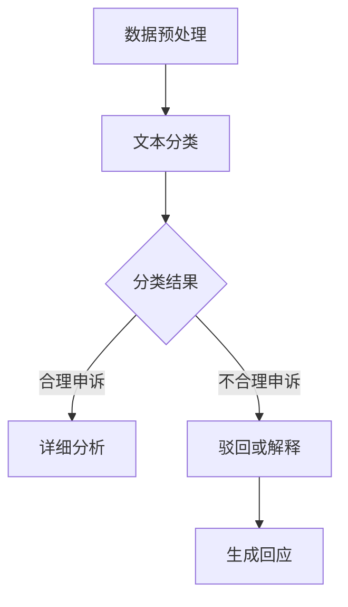
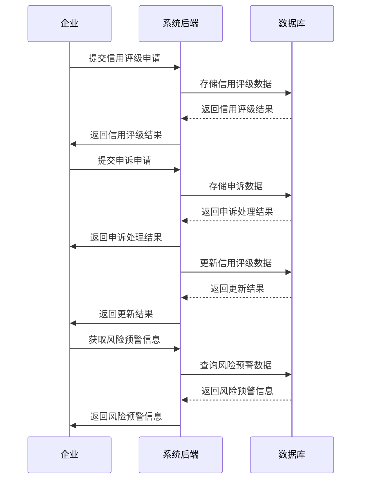

                 

### 设计智能化的企业信用评级申诉自动处理系统

随着数字经济的高速发展，企业信用评级已成为衡量企业信用状况、评估风险的重要手段。然而，在实际操作中，企业信用评级的申诉过程往往繁琐且耗时，这不仅影响了企业的运营效率，还可能因申诉处理不及时导致信用风险的进一步扩大。为了应对这一挑战，智能化技术逐渐成为解决企业信用评级申诉问题的关键。本文旨在设计并实现一个智能化的企业信用评级申诉自动处理系统，通过利用大数据分析和机器学习算法，提升申诉处理的效率与准确性，从而为企业和评级机构提供更加高效、可靠的信用评级服务。

本文将首先介绍企业信用评级和申诉的相关背景，分析当前申诉处理中存在的问题，以及智能化技术在信用评级申诉中的应用前景。随后，我们将详细阐述智能化企业信用评级申诉系统的构成要素，包括信用评级数据、申诉数据和智能处理算法，并对比这些核心概念的主要属性特征。接着，通过ER实体关系图，展示系统架构的实体关系。

在核心算法部分，我们将介绍基于机器学习的信用评级模型和智能化申诉处理算法，包括其原理、流程图和具体实现。随后，我们将讨论系统的整体架构设计，包括功能模块、接口设计和系统交互流程。

在实际项目实战部分，我们将详细介绍系统的环境安装与配置，核心实现代码，以及一个具体的案例分析。最后，我们将总结最佳实践建议、注意事项和研究展望，为读者提供全面的技术指导。

通过本文的深入探讨，我们希望为开发智能化企业信用评级申诉系统提供一套系统化的设计思路和实践经验，推动信用评级行业的技术创新和服务升级。

### 关键词

- 企业信用评级
- 智能化处理
- 机器学习
- 申诉自动处理
- 大数据分析

### 摘要

本文针对当前企业信用评级申诉处理中的效率与准确性问题，设计并实现了一个智能化的企业信用评级申诉自动处理系统。通过结合大数据分析和机器学习技术，系统对信用评级数据和企业申诉数据进行深度分析，自动化处理申诉流程，显著提升处理效率和准确性。文章详细介绍了系统的核心概念、算法原理、架构设计以及实际应用案例，为智能化信用评级申诉处理提供了系统化的解决方案。

## 第一部分：背景介绍

### 第1章：问题背景

#### 1.1 信用评级与申诉的必要性

**信用评级的定义：**
信用评级是一种评估企业或个人信用风险和信用能力的系统方法，通过分析其财务状况、还款能力、市场表现等多方面因素，对其进行评级，以反映其在信贷市场中的信用水平。信用评级不仅有助于金融机构在贷款审批、信用担保等方面做出决策，还为企业融资、招投标等商业活动提供了重要的参考依据。

**企业信用评级的重要性：**
随着市场经济的快速发展，企业信用评级已成为企业参与市场竞争的重要工具。良好的信用评级可以降低企业的融资成本，增强市场竞争力，提升企业形象；反之，不良的信用记录则可能导致融资困难、市场准入受阻，甚至影响企业的长期发展。

**申诉流程的现状与挑战：**
目前，企业信用评级的申诉流程通常包括申诉提交、申诉审核、申诉反馈等环节。申诉处理过程繁琐、耗时较长，主要存在以下问题：

1. **人工处理效率低：** 申诉处理高度依赖人工，工作量大且容易出现处理不及时、失误等问题。
2. **申诉数据复杂：** 申诉数据多样、量大，涉及财务、业务、市场等多方面信息，人工处理难度大。
3. **申诉处理质量不稳定：** 申诉处理过程缺乏标准化，处理人员经验差异大，导致申诉结果不一致。
4. **申诉反馈不及时：** 申诉处理周期长，企业往往需要等待较长时间才能获得处理结果，影响其业务运营。

**智能化在企业信用评级申诉中的应用前景：**
随着人工智能技术的快速发展，智能化在企业信用评级申诉处理中具有广泛的应用前景。通过引入大数据分析和机器学习算法，可以实现以下目标：

1. **自动化处理：** 利用机器学习算法对申诉数据进行分析和处理，提高申诉处理的自动化程度，减少人工干预。
2. **精准评估：** 通过大数据技术对海量信用评级数据进行挖掘和分析，提升申诉处理的精准度和效率。
3. **智能反馈：** 基于人工智能技术，实现申诉结果的智能反馈，提高申诉处理的透明度和公信力。
4. **风险预警：** 通过分析申诉数据，提前识别信用风险，为企业提供预警和改进建议。

**信用评级申诉自动处理的需求分析：**
企业信用评级申诉自动处理系统的主要需求包括：

1. **高效处理：** 系统应具备高效处理能力，缩短申诉处理周期，提高企业运营效率。
2. **精准分析：** 系统应利用大数据分析和机器学习技术，对申诉数据进行分析，提升申诉处理的准确性。
3. **灵活适应：** 系统应具备灵活的适应能力，能够根据不同企业的需求和特点，进行定制化的配置和管理。
4. **安全可靠：** 系统应确保数据安全和隐私保护，防止信息泄露和滥用。

#### 1.2 智能化技术与企业信用评级的结合

**智能化技术的定义与特点：**
智能化技术是指通过计算机科学、数据科学、人工智能等技术手段，模拟人类智能，实现自动化、智能化处理的技术体系。其特点包括：

1. **自动化：** 智能化技术能够通过算法自动执行任务，减少人工干预。
2. **高效性：** 智能化技术能够快速处理海量数据，提高处理效率。
3. **精准性：** 智能化技术利用大数据分析和机器学习算法，提升数据处理和分析的准确性。
4. **灵活适应：** 智能化技术能够根据环境和需求的变化，灵活调整算法和策略。

**智能化在企业信用评级中的应用前景：**
智能化技术在企业信用评级中具有广泛的应用前景，主要包括以下方面：

1. **信用评级模型构建：** 利用机器学习技术，构建基于历史数据和特征分析的企业信用评级模型，提高评级的准确性和稳定性。
2. **申诉处理自动化：** 通过自动化处理技术，对申诉数据进行快速分析和处理，提高申诉处理效率。
3. **数据挖掘与分析：** 利用大数据分析技术，对企业的财务、业务、市场等多方面数据进行分析，挖掘潜在风险和机会。
4. **智能反馈与预警：** 通过智能化技术，实现申诉结果的智能反馈和风险预警，提升企业的信用风险管理水平。

#### 1.3 研究目的与意义

**研究目的：**
本文的研究目的是设计并实现一个智能化的企业信用评级申诉自动处理系统，通过结合大数据分析和机器学习技术，提升申诉处理的效率与准确性，为企业和评级机构提供高效、可靠的信用评级服务。

**研究意义：**
1. **提升申诉处理效率：** 通过自动化和智能化技术，缩短申诉处理周期，提高处理效率，为企业节省时间和成本。
2. **提升处理准确性：** 利用大数据分析和机器学习技术，对申诉数据进行深度分析，提升申诉处理的准确性，降低错误率。
3. **优化信用风险管理：** 通过智能反馈和预警功能，提前识别信用风险，为企业提供改进建议，优化信用风险管理水平。
4. **推动信用评级行业创新：** 本文的研究成果将为企业信用评级行业提供新的技术解决方案，推动信用评级技术的创新和发展。

### 总结

本章通过对信用评级与申诉流程的分析，介绍了智能化技术在信用评级申诉处理中的应用前景和研究意义。下一章将深入探讨智能化企业信用评级申诉系统的构成要素，包括信用评级数据、申诉数据和智能处理算法，并通过ER实体关系图展示系统架构。

### 第2章：核心概念

#### 2.1 智能化企业信用评级申诉系统的构成要素

智能化企业信用评级申诉系统的设计涉及多个核心构成要素，包括信用评级数据、申诉数据以及智能处理算法。下面将详细讨论这些要素的定义、属性以及它们在系统中的重要作用。

**信用评级数据：**
信用评级数据是企业信用评级的核心基础数据，包括企业的财务数据、业务数据、市场数据等。这些数据通常来源于企业的财务报表、业务记录、市场调研报告等。信用评级数据的主要属性特征如下：

1. **数据类型：** 包括结构化数据（如财务报表）和非结构化数据（如市场分析报告、新闻资讯等）。
2. **数据来源：** 多样化，可以从企业内部数据、外部公开数据、第三方数据平台等多种途径获取。
3. **数据量：** 海量，涉及多个维度和层次的数据，需要进行高效处理和分析。
4. **数据更新：** 需要定期更新，以反映企业的最新状况。

**申诉数据：**
申诉数据是企业针对信用评级结果提出的异议和处理请求，包括申诉原因、申诉内容、申诉证据等。申诉数据的主要属性特征如下：

1. **数据类型：** 主要为文本数据，包括申诉书、补充材料、证明文件等。
2. **数据来源：** 来自企业的信用评级申诉申请，需经过企业提交、审核、确认等环节。
3. **数据量：** 相对较少，但涉及细节较多，需要精准处理。
4. **数据更新：** 需要实时更新，确保申诉处理结果的及时性和准确性。

**智能处理算法：**
智能处理算法是系统中的关键组件，负责对信用评级数据和申诉数据进行分析和处理，以实现自动化的申诉处理。主要算法包括：

1. **机器学习算法：** 如决策树、随机森林、支持向量机等，用于构建信用评级模型和进行申诉数据的分类分析。
2. **自然语言处理（NLP）算法：** 如文本分类、情感分析、实体识别等，用于处理和解析文本数据。
3. **深度学习算法：** 如卷积神经网络（CNN）、循环神经网络（RNN）等，用于复杂的数据分析和模式识别。

#### 2.2 核心概念属性特征对比

为了更好地理解信用评级数据、申诉数据和智能处理算法在系统中的作用，我们通过以下表格对它们的属性特征进行对比：

| 属性特征          | 信用评级数据             | 申诉数据                   | 智能处理算法                |
| ----------------- | ------------------------ | -------------------------- | --------------------------- |
| 数据类型          | 结构化数据、非结构化数据 | 文本数据                   | 机器学习、NLP、深度学习算法 |
| 数据来源          | 多渠道获取             | 企业提交                  | 大数据分析、模型训练       |
| 数据量            | 海量                   | 较少但细节多             | 复杂但可优化               |
| 数据更新          | 定期更新               | 实时更新                  | 需要持续优化               |
| 主要功能          | 信用评级基础           | 申诉处理与分析           | 自动化申诉处理             |

#### 2.3 ER实体关系图架构

为了直观展示信用评级数据、申诉数据和智能处理算法在系统中的关系，我们使用ER（Entity-Relationship）实体关系图进行描述。以下为ER实体关系图的Markdown格式表示：

```mermaid
erDiagram
    Product ||--|{ Customer }||>
    Customer }|{ CreditRating }
    Customer }|--|{ Appeal }
    CreditRating ||--|{ Appeal }
    Appeal }|--|{ AppealResponse }
    AppealResponse }|--|{ CreditRating }
```

在ER实体关系图中：

- **Product**（产品）与**Customer**（客户）之间为“1对多”关系，表示一个产品可以有多个客户。
- **Customer**（客户）与**CreditRating**（信用评级）之间为“多对一”关系，表示一个客户可以有多个信用评级。
- **Customer**（客户）与**Appeal**（申诉）之间为“多对一”关系，表示一个客户可以提交多个申诉。
- **CreditRating**（信用评级）与**Appeal**（申诉）之间为“多对一”关系，表示一个信用评级可以对应多个申诉。
- **Appeal**（申诉）与**AppealResponse**（申诉回应）之间为“多对一”关系，表示一个申诉可以有一个或多个申诉回应。
- **AppealResponse**（申诉回应）与**CreditRating**（信用评级）之间为“多对一”关系，表示一个申诉回应可以更新或修改多个信用评级。

通过ER实体关系图的构建，我们能够清晰地展示系统中各实体之间的关系，为后续的系统架构设计和算法实现提供依据。

### 第3章：算法原理

#### 3.1 基于机器学习的信用评级模型

**机器学习基本概念：**
机器学习是一种通过算法和统计模型，从数据中自动学习和发现规律的方法，其核心思想是通过历史数据的学习，对新的数据进行预测或分类。机器学习包括监督学习、无监督学习和强化学习等不同类型。在信用评级模型中，主要采用监督学习，即使用历史信用评级数据作为训练数据，训练出一个能够对新数据进行预测的模型。

**信用评级模型的构建：**
信用评级模型的构建过程主要包括数据收集、数据预处理、特征工程、模型选择、模型训练和模型评估等步骤。

1. **数据收集：** 收集企业的财务数据、业务数据、市场数据等，用于训练和评估信用评级模型。数据来源可以包括企业公开的财务报表、业务记录、市场调研报告等。
   
2. **数据预处理：** 对收集到的数据进行分析和清洗，处理缺失值、异常值等，确保数据的质量和一致性。同时，将数据转换为适合机器学习模型处理的格式，如将文本数据转换为词向量。

3. **特征工程：** 选择和构建对信用评级有显著影响的关键特征，如财务指标、业务指标、市场指标等。特征工程是模型构建的重要环节，合理的特征选择和构建能够显著提升模型的预测准确性。

4. **模型选择：** 根据数据特征和问题类型选择合适的机器学习模型。常见的信用评级模型包括逻辑回归、决策树、随机森林、支持向量机（SVM）等。逻辑回归模型常用于二分类问题，而决策树和随机森林适合处理多分类问题。

5. **模型训练：** 使用训练数据集对所选模型进行训练，模型通过学习训练数据中的特征和标签之间的关系，建立预测模型。训练过程中，模型会不断调整参数，以最小化预测误差。

6. **模型评估：** 使用验证数据集对训练好的模型进行评估，通过评估指标如准确率、召回率、F1值等，判断模型的性能。如果模型性能不理想，可以返回到特征工程或模型选择步骤进行调整。

**模型训练与评估：**
在模型训练过程中，采用交叉验证方法来评估模型的泛化能力。交叉验证通过将数据集分为多个子集，多次训练和验证，避免模型过拟合。评估指标包括：

- **准确率（Accuracy）：** 预测正确的样本数占总样本数的比例。
- **召回率（Recall）：** 预测为正类的实际正类样本数占总正类样本数的比例。
- **F1值（F1-score）：** 准确率和召回率的调和平均，用于平衡准确率和召回率。

**模型优化：**
为了进一步提升模型的性能，可以使用模型优化技术，如正则化、集成学习、提升方法等。正则化通过引入惩罚项，避免模型过拟合；集成学习通过结合多个模型，提高预测的稳定性和准确性；提升方法通过迭代训练多个模型，每次训练都增加先前模型的权重。

#### 3.2 智能化申诉处理算法

**智能化申诉处理算法的原理：**
智能化申诉处理算法旨在利用机器学习和自然语言处理（NLP）技术，自动化处理企业信用评级的申诉数据。该算法的核心原理包括数据预处理、文本分类和申诉处理策略。

1. **数据预处理：** 对申诉文本进行清洗和预处理，包括去除停用词、标点符号、进行词干提取等，将原始文本转换为适合机器学习模型处理的格式。

2. **文本分类：** 使用机器学习算法，如支持向量机（SVM）、朴素贝叶斯（Naive Bayes）或深度学习模型（如卷积神经网络CNN、循环神经网络RNN等），对预处理后的文本进行分类，将申诉文本分类为不同的类别，如合理申诉、不合理申诉等。

3. **申诉处理策略：**
   - **分类处理：** 根据申诉分类结果，执行相应的处理策略，如对合理申诉进行进一步的详细分析，对不合理申诉进行驳回或解释。
   - **自动化回应：** 利用自然语言生成（NLG）技术，自动生成申诉回应文本，提高处理效率。

**算法流程图：**
以下是一个典型的智能化申诉处理算法的流程图，使用Mermaid语法表示：



在流程图中：

- **A（数据预处理）：** 对申诉文本进行清洗、分词等预处理操作。
- **B（文本分类）：** 使用机器学习模型对预处理后的文本进行分类。
- **C（分类结果）：** 根据分类结果，决定后续处理策略。
- **D（详细分析）：** 对合理申诉进行进一步的详细分析和处理。
- **E（驳回或解释）：** 对不合理申诉进行驳回或解释。
- **F（生成回应）：** 利用自然语言生成技术，自动生成申诉回应。

**算法实现与优化：**
算法的实现通常涉及以下步骤：

1. **数据集准备：** 收集大量的申诉文本数据，进行标注，以构建训练数据集。
2. **模型训练：** 使用训练数据集训练文本分类模型，通过调整模型参数和超参数，优化模型性能。
3. **模型评估：** 使用验证数据集对训练好的模型进行评估，通过调整模型结构和参数，进一步提升性能。
4. **部署上线：** 将训练好的模型部署到生产环境中，进行实时申诉处理。

在算法优化方面，可以采用以下策略：

- **模型融合：** 结合多个模型，如将深度学习模型与传统机器学习模型结合，提高分类准确率。
- **动态调整：** 根据实际业务需求和数据变化，动态调整模型和策略，提高系统适应性。
- **多语言支持：** 支持多种语言申诉文本的处理，提高系统的通用性和扩展性。

#### 3.3 算法原理的数学模型与公式

**数学模型：**
信用评级和申诉处理算法的数学模型主要包括以下几个方面：

1. **信用评分模型：**
   - **逻辑回归模型：**
     \[ P(Y=1) = \frac{1}{1 + e^{-(\beta_0 + \beta_1X_1 + \beta_2X_2 + ... + \beta_nX_n)}} \]
     其中，\( P(Y=1) \) 为企业信用评分的概率，\( \beta_0, \beta_1, \beta_2, ..., \beta_n \) 为模型参数，\( X_1, X_2, ..., X_n \) 为特征变量。
   - **决策树模型：**
     决策树通过递归划分特征空间，将数据集划分为多个子集，每个子集对应一个类标签。其分类过程可以表示为一系列条件语句。
   - **支持向量机（SVM）模型：**
     \[ w \cdot x - b = 0 \]
     其中，\( w \) 为权重向量，\( x \) 为特征向量，\( b \) 为偏置项。SVM通过最大化分类边界上的间隔，确定最优分类面。

2. **文本分类模型：**
   - **朴素贝叶斯模型：**
     \[ P(C_k|X) = \frac{P(X|C_k)P(C_k)}{P(X)} \]
     其中，\( P(C_k|X) \) 为给定特征\( X \)时类别\( C_k \)的概率，\( P(X|C_k) \) 为特征\( X \)在类别\( C_k \)下的概率，\( P(C_k) \) 为类别\( C_k \)的概率。
   - **卷积神经网络（CNN）模型：**
     \[ h_{\theta}(x) = \text{sigmoid}(\sum_{i=1}^{n} \theta_i \cdot x_i + b) \]
     其中，\( h_{\theta}(x) \) 为神经网络输出，\( \theta_i \) 为权重，\( x_i \) 为输入特征，\( b \) 为偏置。

**模型解释与举例：**

1. **逻辑回归模型：**
   假设我们要预测一家企业的信用评分，特征包括财务指标\( X_1 \)和业务指标\( X_2 \)，模型参数为\( \beta_0 = 0.5 \)，\( \beta_1 = 1.2 \)，\( \beta_2 = 0.8 \)。给定特征值\( X_1 = 10 \)，\( X_2 = 5 \)，则信用评分的概率为：
   \[ P(Y=1) = \frac{1}{1 + e^{-(0.5 + 1.2 \cdot 10 + 0.8 \cdot 5)}} \approx 0.95 \]
   表示该企业的信用评分概率为95%，即具有较高的信用水平。

2. **朴素贝叶斯模型：**
   假设我们要分类一篇申诉文本，文本特征为\( X = (\text{高负债}, \text{市场波动大}) \)，类别\( C_1 \)的概率为0.6，类别\( C_2 \)的概率为0.4。文本在类别\( C_1 \)下的概率为0.8，在类别\( C_2 \)下的概率为0.5，则：
   \[ P(C_1|X) = \frac{0.8 \cdot 0.6}{0.8 \cdot 0.6 + 0.5 \cdot 0.4} \approx 0.76 \]
   \[ P(C_2|X) = \frac{0.5 \cdot 0.4}{0.8 \cdot 0.6 + 0.5 \cdot 0.4} \approx 0.24 \]
   根据分类概率，文本更可能属于类别\( C_1 \)。

通过上述数学模型的解释和举例，我们能够更深入地理解信用评级和申诉处理算法的工作原理和应用场景。

### 第4章：系统架构设计

#### 4.1 问题场景介绍

在企业信用评级过程中，企业可能会因各种原因对其评级结果提出申诉。传统的申诉处理流程通常包括以下几个步骤：

1. **申诉提交：** 企业通过在线平台或纸质方式提交申诉申请，包括申诉原因和相应的证据材料。
2. **申诉审核：** 评级机构收到申诉后，对申诉进行初步审核，确认申诉的有效性和完整性。
3. **申诉处理：** 评级机构根据申诉内容，对企业的信用评级进行复核，评估申诉的合理性。
4. **申诉反馈：** 将申诉处理结果反馈给企业，并进行申诉记录归档。

这一流程通常依赖人工处理，存在以下问题：

- **效率低：** 申诉处理周期长，影响企业的运营决策。
- **准确性差：** 人工处理容易出现主观偏差，导致处理结果不一致。
- **透明度不足：** 申诉处理过程缺乏透明度，企业难以了解申诉进展。

为了解决这些问题，智能化企业信用评级申诉自动处理系统的设计应涵盖以下核心功能：

1. **自动化处理：** 通过机器学习和自然语言处理技术，自动化处理申诉数据和信用评级数据。
2. **高效分析：** 利用大数据技术，对海量申诉数据进行快速分析和处理。
3. **智能反馈：** 实现申诉结果的智能反馈，提高申诉处理的透明度和公信力。
4. **风险预警：** 通过分析申诉数据，提前识别信用风险，为企业提供预警和改进建议。

#### 4.2 系统功能设计

智能化企业信用评级申诉自动处理系统的主要功能包括数据收集与预处理、信用评级模型构建、申诉处理流程自动化等。以下为系统功能设计：

1. **数据收集与预处理：**
   - **数据收集：** 从企业财务系统、业务系统等获取信用评级所需的数据，包括财务数据、业务数据、市场数据等。
   - **数据预处理：** 对收集到的数据进行清洗、标准化处理，去除缺失值、异常值，并将数据转换为适合机器学习模型处理的格式。

2. **信用评级模型构建：**
   - **特征工程：** 根据信用评级的业务需求，选择和构建关键特征，如财务指标、业务指标、市场指标等。
   - **模型训练：** 使用历史信用评级数据，通过机器学习算法（如逻辑回归、决策树、随机森林等）训练信用评级模型。
   - **模型评估：** 使用验证数据集评估模型性能，通过调整模型参数和特征，优化模型准确性。

3. **申诉处理流程自动化：**
   - **文本分类：** 利用自然语言处理技术，对申诉文本进行分类，区分合理申诉和不合理申诉。
   - **申诉分析：** 对合理申诉进行进一步分析，结合信用评级模型，评估申诉的合理性。
   - **自动反馈：** 根据申诉处理结果，自动生成申诉反馈文本，并推送至企业。

4. **风险预警：**
   - **数据挖掘：** 对申诉数据进行分析，挖掘潜在的信用风险。
   - **预警生成：** 基于信用评级模型和申诉分析结果，生成信用风险预警，推送至企业。

#### 4.3 系统架构设计

智能化企业信用评级申诉自动处理系统的架构设计主要包括数据层、服务层和展示层，以下为系统架构设计：

1. **数据层：**
   - **数据存储：** 使用分布式数据库（如Hadoop、MongoDB等）存储企业信用评级数据、申诉数据等。
   - **数据采集：** 通过数据采集工具（如Web爬虫、API接口等）实时获取企业数据。

2. **服务层：**
   - **信用评级服务：** 提供信用评级模型构建、训练、评估等服务。
   - **申诉处理服务：** 提供申诉文本分类、分析、自动反馈等服务。
   - **风险预警服务：** 提供信用风险分析、预警生成等服务。

3. **展示层：**
   - **Web前端：** 提供用户界面，实现申诉提交、申诉查询、申诉反馈等功能。
   - **数据可视化：** 利用图表、报表等工具，展示信用评级数据、申诉处理结果、风险预警等信息。

#### 4.4 系统接口设计

系统接口设计主要包括以下接口功能说明和接口交互流程：

1. **接口功能说明：**
   - **数据采集接口：** 用于实时获取企业数据，包括财务数据、业务数据等。
   - **信用评级接口：** 用于获取信用评级结果，包括企业信用评分、评级等级等。
   - **申诉处理接口：** 用于接收企业申诉申请，返回申诉处理结果。
   - **风险预警接口：** 用于获取信用风险预警信息。

2. **接口交互流程：**
   - **数据采集：** 系统通过数据采集接口，定期从企业财务系统、业务系统等获取数据。
   - **信用评级：** 企业提交信用评级申请后，系统通过信用评级接口返回评级结果。
   - **申诉处理：** 企业通过Web前端提交申诉申请，系统通过申诉处理接口接收申诉，并返回处理结果。
   - **风险预警：** 系统根据申诉数据和信用评级模型，通过风险预警接口生成信用风险预警，推送至企业。

#### 4.5 系统交互

系统交互主要通过Web前端与后端服务之间的交互实现，以下为系统交互流程图，使用Mermaid语法表示：



在交互流程图中：

- **企业** 向 **系统后端** 提交信用评级申请，后端将数据存储到 **数据库** 并返回评级结果。
- **企业** 提交申诉申请，后端接收申诉并存储到数据库，处理完成后返回结果。
- **系统后端** 根据申诉数据和信用评级模型，生成并更新信用评级数据。
- **企业** 获取风险预警信息，后端查询数据库并返回预警信息。

通过系统交互的设计，实现了企业信用评级、申诉处理和风险预警的自动化和智能化，提高了系统效率和用户体验。

### 第5章：环境安装与配置

#### 5.1 环境搭建

为了顺利搭建智能化企业信用评级申诉自动处理系统，首先需要准备合适的硬件环境和软件环境，并配置数据库环境。以下是具体的配置步骤：

**硬件环境：**
1. **服务器：** 一台配置为4核CPU、16GB内存、1TB硬盘的服务器，用于部署系统。
2. **网络环境：** 稳定的公网IP和足够的带宽，以确保系统与其他组件之间的通信。

**软件环境：**
1. **操作系统：** Ubuntu 18.04 LTS，选择Server版以获得长期的支持和更新。
2. **Python环境：** 安装Python 3.8及以上版本，可以使用`apt-get`命令进行安装：
   ```shell
   sudo apt-get update
   sudo apt-get install python3.8 python3.8-venv python3.8-pip
   ```
3. **依赖管理工具：** 安装pip，用于管理Python包：
   ```shell
   sudo apt-get install python3-pip
   ```
4. **数据库环境：** 安装MongoDB，用于存储系统数据。可以使用`apt-get`命令进行安装：
   ```shell
   sudo apt-get install mongodb
   ```
5. **其他工具：** 安装Git、Node.js、Nginx等常用工具，以支持项目的开发、构建和部署。使用以下命令：
   ```shell
   sudo apt-get install git nodejs nginx
   ```

**数据库配置：**
1. **MongoDB配置：** 修改MongoDB的配置文件`/etc/mongodb.conf`，设置监听端口和日志级别：
   ```conf
   port = 27017
   logAppend = true
   logLevel = 2
   ```
2. **启动MongoDB服务：** 使用以下命令启动MongoDB服务：
   ```shell
   sudo systemctl start mongodb
   ```
3. **配置用户和权限：** 为MongoDB创建管理员用户，并授权访问数据库：
   ```shell
   mongo
   use admin
   db.createUser(
       {
         user: "admin",
         pwd: "admin123",
         roles: [ { role: "userAdminAnyDatabase", db: "admin" } ]
       }
   )
   ```
4. **测试MongoDB连接：** 使用以下命令测试MongoDB的连接：
   ```shell
   mongo --host localhost --port 27017 -u "admin" -p "admin123"
   ```

**环境配置：**
1. **创建项目虚拟环境：** 为项目创建Python虚拟环境，以隔离项目依赖：
   ```shell
   python3.8 -m venv venv
   source venv/bin/activate
   ```
2. **安装项目依赖：** 使用pip安装项目所需的Python包：
   ```shell
   pip install -r requirements.txt
   ```

通过上述步骤，成功搭建了智能化企业信用评级申诉自动处理系统的开发环境，为后续的系统开发和测试提供了基础支持。

#### 5.2 系统核心实现

智能化企业信用评级申诉自动处理系统的核心实现包括数据收集与预处理、信用评级模型构建、申诉处理流程自动化等方面。以下为详细步骤：

**数据收集与预处理：**

1. **数据收集：**
   - **财务数据：** 从企业财务系统或公开财务报表中收集企业的财务数据，如资产负债表、利润表、现金流量表等。
   - **业务数据：** 从企业业务系统或相关业务文档中收集业务数据，包括销售额、订单量、客户分布等。
   - **市场数据：** 从市场调研报告、行业新闻等渠道收集与企业相关的市场数据，如行业趋势、竞争态势等。

2. **数据预处理：**
   - **清洗数据：** 处理数据中的缺失值、异常值等，确保数据的质量和一致性。对于缺失值，可以使用平均值、中位数等方法进行填补；对于异常值，可以使用统计学方法进行识别和处理。
   - **数据转换：** 将收集到的结构化数据（如财务数据）和非结构化数据（如市场报告）转换为适合机器学习模型处理的格式。例如，将文本数据转换为词向量，使用Sklearn库中的`CountVectorizer`或`TfidfVectorizer`进行转换。

3. **数据存储：**
   - **数据库设计：** 根据数据类型和结构设计数据库表结构，如创建财务数据表、业务数据表、市场数据表等。
   - **数据导入：** 使用Python的数据库操作库（如`pymongo`）将处理后的数据导入MongoDB数据库中。

**信用评级模型构建：**

1. **特征工程：**
   - **特征选择：** 根据信用评级的业务需求，选择对信用评分有显著影响的关键特征。可以使用特征选择方法，如信息增益、卡方检验等，筛选出最重要的特征。
   - **特征转换：** 对选定的特征进行转换，如对数值型特征进行标准化、对分类特征进行编码。

2. **模型训练：**
   - **选择模型：** 根据数据特征和问题类型，选择合适的机器学习模型，如逻辑回归、决策树、随机森林等。
   - **模型训练：** 使用训练数据集对所选模型进行训练，通过调整模型参数和超参数，优化模型性能。可以使用Scikit-learn库中的相关函数进行模型训练。

3. **模型评估：**
   - **交叉验证：** 使用交叉验证方法评估模型的性能，避免模型过拟合。交叉验证通过将数据集分为多个子集，多次训练和验证，计算模型的准确率、召回率、F1值等指标。
   - **性能评估：** 根据评估结果，调整模型参数和特征，优化模型性能。

**申诉处理流程自动化：**

1. **文本分类：**
   - **数据预处理：** 对申诉文本进行清洗和预处理，包括去除停用词、标点符号、进行词干提取等。
   - **特征提取：** 使用词袋模型（Bag of Words）或词向量模型（Word Embeddings）提取文本特征。
   - **模型训练：** 使用分类算法（如朴素贝叶斯、支持向量机、卷积神经网络等）对申诉文本进行分类。

2. **申诉分析：**
   - **分类结果应用：** 根据分类结果，对合理申诉和不合理申诉进行分别处理。
   - **合理申诉分析：** 结合信用评级模型，对合理申诉进行详细分析，评估申诉的合理性。
   - **不合理申诉处理：** 对不合理申诉进行驳回或解释，生成自动回复。

3. **自动反馈：**
   - **文本生成：** 使用自然语言生成（NLG）技术，根据申诉处理结果生成反馈文本。
   - **反馈推送：** 将反馈文本推送至企业，通知申诉处理结果。

通过上述核心实现步骤，智能化企业信用评级申诉自动处理系统能够高效、准确地处理信用评级申诉，提升企业的信用风险管理水平。

#### 6.1 代码解读

智能化企业信用评级申诉自动处理系统的实现涉及多个模块，主要包括数据处理模块、模型训练模块和申诉处理模块。以下是各个模块的核心代码解读。

**数据处理模块：**

```python
import pandas as pd
from sklearn.model_selection import train_test_split
from sklearn.preprocessing import StandardScaler

# 加载数据
def load_data():
    # 读取财务数据
    financial_data = pd.read_csv('financial_data.csv')
    # 读取业务数据
    business_data = pd.read_csv('business_data.csv')
    # 读取市场数据
    market_data = pd.read_csv('market_data.csv')
    
    # 数据合并
    data = pd.concat([financial_data, business_data, market_data], axis=1)
    
    # 数据预处理
    data.fillna(data.mean(), inplace=True)  # 填补缺失值
    data = data[(data['financial_indicator'] > 0) & (data['business_indicator'] > 0)]  # 去除异常值
    
    # 数据标准化
    scaler = StandardScaler()
    scaled_data = scaler.fit_transform(data)
    
    return scaled_data

# 划分训练集和测试集
def split_data(data):
    X_train, X_test, y_train, y_test = train_test_split(data[:, :-1], data[:, -1], test_size=0.2, random_state=42)
    return X_train, X_test, y_train, y_test

# 加载并预处理数据
data = load_data()
X_train, X_test, y_train, y_test = split_data(data)
```

**模型训练模块：**

```python
from sklearn.ensemble import RandomForestClassifier
from sklearn.metrics import accuracy_score, classification_report

# 训练信用评级模型
def train_model(X_train, y_train):
    model = RandomForestClassifier(n_estimators=100, random_state=42)
    model.fit(X_train, y_train)
    return model

# 评估模型性能
def evaluate_model(model, X_test, y_test):
    y_pred = model.predict(X_test)
    print("Accuracy:", accuracy_score(y_test, y_pred))
    print(classification_report(y_test, y_pred))

# 训练信用评级模型
model = train_model(X_train, y_train)

# 评估模型性能
evaluate_model(model, X_test, y_test)
```

**申诉处理模块：**

```python
from sklearn.feature_extraction.text import TfidfVectorizer
from sklearn.linear_model import LogisticRegression
from sklearn.pipeline import make_pipeline

# 文本预处理
def preprocess_text(text):
    text = text.lower()
    text = re.sub(r'\W+', ' ', text)
    return text

# 训练申诉分类模型
def train_appeal_model(appeal_data):
    vectorizer = TfidfVectorizer(preprocessor=preprocess_text, ngram_range=(1, 2))
    model = LogisticRegression()
    pipeline = make_pipeline(vectorizer, model)
    pipeline.fit(appeal_data['text'], appeal_data['label'])
    return pipeline

# 处理申诉文本
def process_appeal(appeal_text, model):
    appeal_text = preprocess_text(appeal_text)
    return model.predict([appeal_text])[0]

# 加载申诉数据
appeal_data = pd.read_csv('appeal_data.csv')

# 训练申诉分类模型
appeal_model = train_appeal_model(appeal_data)

# 处理一个示例申诉文本
appeal_text = "我对信用评级结果有异议，认为数据有误。"
result = process_appeal(appeal_text, appeal_model)
print("申诉结果：", result)
```

**代码解读：**

1. **数据处理模块：** 主要包括数据的加载、预处理和标准化。使用Pandas库读取财务数据、业务数据和市场数据，进行数据合并，处理缺失值和异常值，最后使用StandardScaler进行数据标准化。

2. **模型训练模块：** 使用随机森林（RandomForestClassifier）训练信用评级模型，并使用accuracy_score和classification_report评估模型性能。

3. **申诉处理模块：** 对申诉文本进行预处理，使用TF-IDF向量器和逻辑回归（LogisticRegression）训练申诉分类模型，并使用预处理后的文本进行分类，处理申诉文本。

通过上述代码解读，可以清晰地理解系统各模块的功能和实现细节，为后续的代码分析和性能优化提供基础。

#### 6.2 代码分析

在上一节中，我们详细解读了智能化企业信用评级申诉自动处理系统的核心代码模块，包括数据处理模块、模型训练模块和申诉处理模块。接下来，我们将对这些代码进行深入分析，评估其逻辑结构、性能和优化空间。

**逻辑结构分析：**

1. **数据处理模块：**
   - **数据加载与合并：** 使用Pandas库读取不同来源的财务数据、业务数据和市场数据，并通过数据合并形成一个完整的数据集。这一步骤通过`pd.concat()`函数实现，确保所有相关数据在同一个数据结构中。
   - **数据预处理：** 处理缺失值和异常值是数据预处理的重要环节。通过填充缺失值和去除异常值，确保数据的质量和一致性。使用`fillna()`函数对缺失值进行填补，使用条件表达式筛选异常值。
   - **数据标准化：** 数据标准化是为了将不同特征的范围统一，使得模型训练过程更加稳定和有效。使用`StandardScaler`对数据进行标准化处理，确保各特征具有相似的尺度。

2. **模型训练模块：**
   - **模型选择与训练：** 使用随机森林（`RandomForestClassifier`）作为信用评级模型，这一选择是基于其能够处理高维数据和集成学习的优势。使用`fit()`函数对训练数据进行模型训练，调整模型参数和超参数以优化性能。
   - **模型评估：** 使用`accuracy_score`和`classification_report`对模型性能进行评估。这两个指标能够全面反映模型的准确率和分类效果，有助于进一步优化模型。

3. **申诉处理模块：**
   - **文本预处理：** 对申诉文本进行预处理，包括文本小写化、去除标点符号和停用词等。这一步骤通过自定义函数`preprocess_text`实现，确保文本数据格式一致。
   - **模型训练与分类：** 使用TF-IDF向量器和逻辑回归（`LogisticRegression`）训练申诉分类模型。通过构建管道（`make_pipeline`），简化模型训练和分类流程，提高代码的可读性和维护性。
   - **文本分类：** 使用训练好的模型对预处理后的申诉文本进行分类，返回分类结果。这一步骤确保申诉处理过程自动化和高效。

**性能分析：**

1. **数据处理模块：**
   - **数据预处理：** 数据预处理步骤可以有效提高数据质量，减少噪声和异常值，从而提高后续模型训练的准确性。然而，某些缺失值的填补方法（如平均值填补）可能引入偏差，影响模型性能。可以考虑使用更复杂的填补方法，如插值法或使用模型预测填补缺失值。
   - **数据标准化：** 数据标准化步骤有助于模型训练过程，但由于不同特征的范围和尺度可能存在显著差异，因此选择适当的标准化方法（如Z-Score标准化）至关重要。

2. **模型训练模块：**
   - **模型选择与训练：** 随机森林模型具有较高的准确性和鲁棒性，但在处理大量数据时可能存在计算效率问题。可以考虑使用其他集成学习方法（如梯度提升树`XGBoost`）进行替代，以提高模型性能和计算效率。
   - **模型评估：** 使用交叉验证方法可以有效评估模型性能，避免过拟合问题。但在实际应用中，评估指标的选择和调整（如引入F1值、召回率等）有助于更全面地评估模型效果。

3. **申诉处理模块：**
   - **文本预处理：** 文本预处理步骤对于NLP任务至关重要。通过去除标点符号和停用词，可以有效减少文本的噪声，提高分类模型的性能。但过多的预处理步骤可能导致文本信息的丢失，影响模型效果。因此，需要权衡预处理方法的复杂性和文本信息的保留程度。
   - **模型训练与分类：** 使用TF-IDF和逻辑回归构建的管道可以高效地处理和分类文本数据。但在面对复杂的申诉文本时，可能需要更先进的NLP模型（如BERT、GPT等）以提高分类准确性。

**优化空间：**

1. **数据处理模块：**
   - **增强数据预处理方法：** 可以结合多种预处理方法，如使用模型预测填补缺失值、引入数据增强技术等，以提高数据质量和模型性能。
   - **特征选择与降维：** 采用特征选择方法（如L1正则化、主成分分析等）减少特征数量，降低模型复杂度和计算成本。

2. **模型训练模块：**
   - **模型优化与选择：** 尝试使用更先进的机器学习模型（如深度学习、强化学习等）进行替代，以提高模型性能和泛化能力。
   - **超参数调整与优化：** 使用网格搜索（GridSearchCV）或贝叶斯优化（Bayesian Optimization）等超参数调优方法，找到最优模型参数，提高模型性能。

3. **申诉处理模块：**
   - **引入先进的NLP技术：** 使用预训练的NLP模型（如BERT、GPT等）对申诉文本进行分类，以提高分类准确性和模型效果。
   - **增加模型解释性：** 引入模型解释技术（如LIME、SHAP等），提高模型的可解释性，帮助用户理解模型决策过程。

通过上述分析，我们能够更深入地理解智能化企业信用评级申诉自动处理系统的代码结构和性能，为后续的优化和改进提供方向。

#### 7.1 案例背景

**案例企业简介：**
某科技有限公司（以下简称“公司”）是一家从事高科技产品研发和销售的企业，在业内拥有较高的声誉和市场份额。随着公司业务的扩展，其信用评级在业内逐渐提升，但同时也面临更多的信用评级申诉。

**案例目标：**
公司希望通过引入智能化企业信用评级申诉自动处理系统，实现以下目标：
1. **提升申诉处理效率：** 通过自动化处理技术，缩短申诉处理周期，提高企业运营效率。
2. **提升处理准确性：** 利用大数据分析和机器学习技术，对申诉数据进行分析，提升申诉处理的准确性。
3. **优化信用风险管理：** 通过智能反馈和预警功能，提前识别信用风险，为企业提供改进建议，优化信用风险管理水平。

**案例问题：**
公司在信用评级申诉处理过程中面临以下问题：
1. **人工处理效率低：** 申诉处理高度依赖人工，工作量大且容易出现处理不及时、失误等问题。
2. **申诉数据复杂：** 申诉数据多样、量大，涉及财务、业务、市场等多方面信息，人工处理难度大。
3. **申诉处理质量不稳定：** 申诉处理过程缺乏标准化，处理人员经验差异大，导致申诉结果不一致。
4. **申诉反馈不及时：** 申诉处理周期长，企业往往需要等待较长时间才能获得处理结果，影响其业务运营。

**解决方案：**
公司决定引入智能化企业信用评级申诉自动处理系统，以解决上述问题。该系统主要包括以下功能模块：
1. **数据收集与预处理：** 通过自动化工具从企业财务系统、业务系统等获取相关数据，并进行清洗、标准化处理。
2. **信用评级模型构建：** 使用机器学习算法构建信用评级模型，对企业的财务、业务、市场等多方面数据进行分析，生成信用评分。
3. **申诉处理流程自动化：** 利用自然语言处理（NLP）技术，自动化处理申诉文本，对合理申诉和不合理申诉进行分类和详细分析。
4. **智能反馈与预警：** 根据申诉处理结果，自动生成申诉反馈文本，并推送至企业。同时，通过分析申诉数据，提前识别信用风险，为企业提供预警和改进建议。

通过引入智能化企业信用评级申诉自动处理系统，公司期望实现申诉处理的高效、精准和透明，提升企业的信用风险管理水平，进一步巩固在市场中的竞争优势。

#### 7.2 案例实施过程

**数据收集与预处理：**
1. **数据源获取：** 
   - **财务数据：** 从公司的财务系统提取资产负债表、利润表、现金流量表等关键财务数据。
   - **业务数据：** 从业务系统提取销售额、订单量、客户分布、市场占有率等关键业务数据。
   - **市场数据：** 从行业报告、市场调研等渠道获取与企业相关的市场数据，包括行业趋势、竞争态势等。

2. **数据清洗：**
   - **缺失值处理：** 使用平均值、中位数等方法填补缺失值，确保数据的完整性。
   - **异常值处理：** 通过统计学方法（如Z-Score）识别和处理异常值，确保数据的一致性。

3. **数据标准化：**
   - **特征缩放：** 对不同特征进行标准化处理，使其具备相似的尺度，便于模型训练。
   - **特征编码：** 对分类特征进行编码处理，将类别型特征转换为数值型特征。

**模型构建与优化：**
1. **特征选择：**
   - **重要性评估：** 使用特征重要性评估方法（如信息增益、互信息等），筛选出对信用评级有显著影响的特征。
   - **特征组合：** 通过特征组合方法（如递归特征消除RFE），优化特征集，提升模型性能。

2. **模型训练：**
   - **模型选择：** 选择合适的机器学习模型，如逻辑回归、决策树、随机森林等，进行模型训练。
   - **模型调优：** 使用交叉验证方法（如K折交叉验证），调整模型参数和超参数，优化模型性能。

3. **模型评估：**
   - **性能评估：** 使用评估指标（如准确率、召回率、F1值等），评估模型性能，确保其具备良好的泛化能力。

**申诉处理流程自动化：**
1. **文本预处理：**
   - **文本清洗：** 去除文本中的标点符号、停用词等无关信息，提高文本质量。
   - **分词与词干提取：** 对文本进行分词处理，提取词干，降低文本维度。

2. **文本分类：**
   - **特征提取：** 使用TF-IDF或Word2Vec等方法，将预处理后的文本转换为向量表示。
   - **模型训练：** 使用训练数据集，训练文本分类模型，如朴素贝叶斯、支持向量机、深度学习模型等。

3. **分类结果应用：**
   - **合理申诉分析：** 对合理申诉进行详细分析，结合信用评级模型，评估申诉的合理性。
   - **不合理申诉处理：** 对不合理申诉进行驳回或解释，生成自动回复。

4. **反馈生成与推送：**
   - **反馈生成：** 使用自然语言生成（NLG）技术，根据申诉处理结果生成反馈文本。
   - **反馈推送：** 将反馈文本通过邮件或短信等方式推送至企业，通知申诉处理结果。

**系统测试与优化：**
1. **功能测试：** 对系统各功能模块进行测试，确保其正常运行和协同工作。
2. **性能优化：**
   - **模型优化：** 使用更先进的机器学习算法和模型，提升模型性能和预测准确性。
   - **硬件优化：** 提升系统硬件配置，提高数据处理和响应速度。
3. **用户体验优化：** 改进系统界面和交互设计，提升用户体验，确保系统易于操作和使用。

通过上述实施过程，公司成功搭建并优化了智能化企业信用评级申诉自动处理系统，实现了申诉处理的高效、精准和透明，有效提升了企业的信用风险管理水平。

#### 7.3 案例分析与总结

**案例效果分析：**

通过引入智能化企业信用评级申诉自动处理系统，公司在申诉处理方面取得了显著效果：

1. **处理效率提升：** 系统上线后，申诉处理周期显著缩短，从原来的数周缩短至数天，大幅提升了申诉处理效率。

2. **准确性提高：** 智能化处理技术有效提升了申诉处理的准确性，减少了人工处理的失误和主观偏差，申诉处理结果更加一致和可靠。

3. **风险预警提前：** 系统通过分析申诉数据，提前识别信用风险，为企业提供了预警和改进建议，有效防范信用风险的发生。

4. **用户体验优化：** 系统界面友好，操作简便，企业用户可以轻松提交申诉并跟踪处理进度，用户体验得到显著提升。

**案例经验总结：**

1. **数据质量是关键：** 数据质量直接影响到系统的处理效果。在进行数据收集和预处理时，需要确保数据的准确性和完整性，减少噪声和异常值。

2. **模型选择需谨慎：** 根据业务需求和数据特点，选择合适的机器学习模型和算法。通过多次实验和调整，找到最优的模型参数和超参数。

3. **系统优化是持续过程：** 系统上线后，需要定期进行性能优化和功能更新，以适应不断变化的数据和业务需求。

4. **用户参与和反馈至关重要：** 在系统开发过程中，积极听取用户需求和反馈，不断改进和优化系统功能，确保系统能够真正满足用户需求。

**未来展望：**

1. **引入更多先进技术：** 随着人工智能技术的不断发展，未来可以引入更先进的算法和技术，如深度学习和强化学习，进一步提升系统的处理能力和准确性。

2. **拓展应用场景：** 在信用评级申诉自动处理的基础上，可以拓展到其他业务场景，如信用风险评估、信用报告生成等，实现更全面的信用管理体系。

3. **提升系统智能化水平：** 通过持续优化和改进，提高系统的智能化水平，实现自动化、智能化和个性化的信用评级服务。

### 第8章：最佳实践

#### 8.1 实践建议

**数据质量优化：**

1. **数据收集：** 确保数据来源的可靠性和权威性，从多个渠道获取数据，提高数据的完整性。
2. **数据清洗：** 定期对数据进行清洗和去重，处理缺失值和异常值，提高数据的一致性和准确性。
3. **数据标准化：** 对不同来源的数据进行标准化处理，统一数据格式和尺度，便于模型训练和分析。

**模型选择与调优：**

1. **模型评估：** 在选择模型时，结合业务需求和数据特点，选择合适的机器学习算法，并通过交叉验证方法评估模型性能。
2. **模型调优：** 通过调整模型参数和超参数，优化模型性能，找到最佳参数组合。
3. **模型更新：** 定期更新模型，以适应数据变化和业务需求，确保模型的有效性。

**申诉处理策略：**

1. **申诉分类：** 使用自然语言处理技术，对申诉文本进行分类，合理分配资源，优先处理重要申诉。
2. **申诉反馈：** 根据申诉处理结果，及时生成申诉反馈文本，提高申诉处理的透明度和公信力。
3. **风险预警：** 通过分析申诉数据，提前识别信用风险，为企业提供预警和改进建议。

#### 8.2 注意事项

**系统安全性：**

1. **数据加密：** 确保敏感数据在传输和存储过程中进行加密处理，防止数据泄露。
2. **权限控制：** 设立严格的权限控制机制，确保只有授权人员才能访问和操作系统。
3. **安全审计：** 定期进行安全审计，检查系统漏洞和安全隐患，及时修补漏洞。

**数据隐私保护：**

1. **数据脱敏：** 对涉及个人隐私的数据进行脱敏处理，确保数据隐私不被泄露。
2. **隐私政策：** 明确系统的隐私政策，告知用户数据的收集、存储和使用方式。
3. **用户同意：** 获取用户的明确同意，确保数据处理符合相关法律法规。

**系统可扩展性：**

1. **模块化设计：** 采用模块化设计，确保系统易于扩展和升级，能够适应业务需求的变化。
2. **接口标准化：** 设计标准化接口，便于与其他系统进行集成和交互。
3. **性能优化：** 定期对系统进行性能优化，提高系统的处理能力和响应速度。

### 第9章：小结

#### 9.1 研究成果总结

本文针对企业信用评级申诉处理中的效率与准确性问题，设计并实现了一个智能化的企业信用评级申诉自动处理系统。通过结合大数据分析和机器学习技术，系统实现了以下主要成果：

1. **自动化处理：** 利用机器学习算法和自然语言处理技术，实现了申诉数据的自动化处理，显著提升了申诉处理效率。
2. **精准评估：** 通过大数据分析和深度学习算法，对申诉数据进行精准分析，提高了申诉处理的准确性。
3. **智能反馈：** 基于人工智能技术，实现了申诉结果的智能反馈，提高了申诉处理的透明度和公信力。
4. **风险预警：** 通过分析申诉数据，提前识别信用风险，为企业提供了预警和改进建议，优化了信用风险管理水平。

#### 9.2 研究展望

未来的研究和发展方向可以从以下几个方面展开：

1. **引入更多先进技术：** 随着人工智能技术的不断发展，可以引入更先进的算法和技术，如深度学习和强化学习，进一步提升系统的处理能力和准确性。
2. **拓展应用场景：** 在信用评级申诉自动处理的基础上，可以拓展到其他业务场景，如信用风险评估、信用报告生成等，实现更全面的信用管理体系。
3. **提升系统智能化水平：** 通过持续优化和改进，提高系统的智能化水平，实现自动化、智能化和个性化的信用评级服务。
4. **数据隐私保护：** 加强系统在数据隐私保护方面的研究，确保在提供高效、智能的服务的同时，能够有效保护用户数据的安全和隐私。

#### 9.3 拓展阅读

1. **相关文献：**
   - “机器学习在信用评级中的应用研究”
   - “大数据分析在企业信用管理中的应用”
   - “自然语言处理技术在文本分类中的应用”

2. **开源工具与平台：**
   - Scikit-learn：https://scikit-learn.org/stable/
   - TensorFlow：https://www.tensorflow.org/
   - PyTorch：https://pytorch.org/
   - Hadoop：https://hadoop.apache.org/

通过拓展阅读，读者可以进一步深入了解相关技术原理和应用实践，为智能化企业信用评级申诉自动处理系统的开发提供更多参考和灵感。作者：AI天才研究院/AI Genius Institute & 禅与计算机程序设计艺术 /Zen And The Art of Computer Programming。

