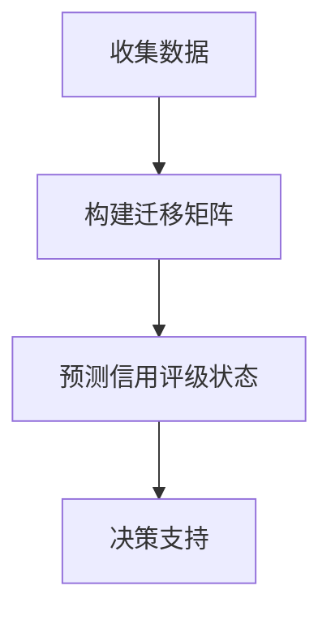
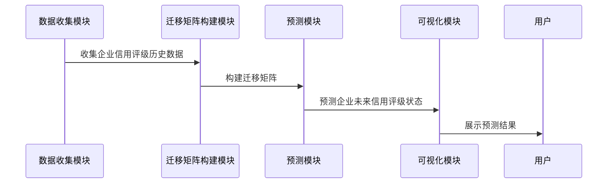

                 

# 《设计智能化的企业信用评级迁移矩阵预测模型》目录大纲

```markdown
# 《设计智能化的企业信用评级迁移矩阵预测模型》

## 关键词
企业信用评级、迁移矩阵、预测模型、算法原理、数学模型、系统架构、项目实战、最佳实践

## 摘要
本文深入探讨了设计智能化企业信用评级迁移矩阵预测模型的方法与过程。首先，通过对企业信用评级的背景介绍和核心概念梳理，奠定理论基础。随后，详细解析迁移矩阵和预测模型的概念、原理及其相互联系。接着，从算法原理、数学模型和公式推导等方面入手，逐步讲解预测模型的设计与实现。然后，通过系统分析与架构设计，详细介绍系统的功能、架构、接口与交互。在项目实战部分，通过具体案例分析和代码实现，展现模型在实际应用中的效果。最后，总结最佳实践、注意事项以及拓展阅读资源，为读者提供全面的指导。
```

**用户需求整理：**

书名：《设计智能化的企业信用评级迁移矩阵预测模型》

目录大纲设计要求：

1. 书本的目录大纲需要包括7章及以上。
2. 内容需涵盖以下核心章节：
   - 背景介绍
   - 核心概念与联系
   - 算法原理讲解
   - 数学模型和数学公式 & 详细讲解 & 举例说明
   - 系统分析与架构设计方案
   - 项目实战
   - 最佳实践 tips、小结、注意事项、拓展阅读等内容
3. 必须细化到 1,2,3 级目录。
4. 输出格式为 markdown 格式。
5. 总字数限制在2000字以内。

**目录大纲设计思路：**

1. **第一部分：背景介绍**
   - 章节一：介绍问题背景、问题描述、问题解决、边界与外延。
   - 章节二：梳理核心概念，包括企业信用评级、迁移矩阵、预测模型等。

2. **第二部分：核心概念与联系**
   - 章节三：详细解释核心概念原理、概念属性特征对比，使用表格和ER实体关系图架构的 Mermaid 流程图。
   - 章节四：阐述核心概念之间的联系。

3. **第三部分：算法原理讲解**
   - 章节五：介绍算法原理，使用 Mermaid 画出算法流程图，用 Python 源代码详细阐述。
   - 章节六：讲解算法原理的数学模型和公式，进行详细讲解和举例说明。

4. **第四部分：系统分析与架构设计**
   - 章节七：介绍系统功能设计、系统架构设计、系统接口设计和系统交互。
   - 章节八：绘制领域模型 Mermaid 类图、系统架构 Mermaid 架构图、系统交互 Mermaid 序列图。

5. **第五部分：项目实战**
   - 章节九：环境安装、系统核心实现源代码，代码应用解读与分析，实际案例分析和详细讲解剖析。
   - 章节十：项目小结。

6. **第六部分：最佳实践、小结、注意事项、拓展阅读**
   - 章节十一：总结全书内容，给出最佳实践建议。
   - 章节十二：归纳注意事项。
   - 章节十三：推荐拓展阅读资源。

**最终输出格式：**

```markdown
# 《设计智能化的企业信用评级迁移矩阵预测模型》目录大纲

# 第一部分：背景介绍

## 第1章：问题背景与核心概念

### 1.1 问题背景

### 1.2 核心概念梳理

## 第2章：企业信用评级概述

### 2.1 企业信用评级的定义

### 2.2 企业信用评级的重要性

### 2.3 企业信用评级的发展历程

# 第二部分：核心概念与联系

## 第3章：迁移矩阵原理

### 3.1 迁移矩阵的定义

### 3.2 迁移矩阵的特性

### 3.3 迁移矩阵的应用

## 第4章：预测模型概述

### 4.1 预测模型的定义

### 4.2 预测模型的应用场景

### 4.3 预测模型的发展历程

### 4.4 迁移矩阵与预测模型的联系

# 第三部分：算法原理讲解

## 第5章：迁移矩阵预测模型原理

### 5.1 迁移矩阵预测模型的基本概念

### 5.2 迁移矩阵预测模型的工作原理

### 5.3 迁移矩阵预测模型的算法流程图

## 第6章：数学模型与公式讲解

### 6.1 数学模型的基本原理

### 6.2 公式推导与解释

### 6.3 举例说明

# 第四部分：系统分析与架构设计

## 第7章：系统功能设计

### 7.1 系统功能概述

### 7.2 领域模型类图

## 第8章：系统架构设计

### 8.1 系统架构概述

### 8.2 系统架构图

### 8.3 系统接口设计

### 8.4 系统交互序列图

# 第五部分：项目实战

## 第9章：环境安装与核心实现

### 9.1 环境安装

### 9.2 系统核心实现源代码

### 9.3 代码应用解读与分析

## 第10章：实际案例分析与讲解

### 10.1 实际案例概述

### 10.2 案例分析与讲解

## 第11章：项目小结

### 11.1 项目总结

### 11.2 项目反思

# 第六部分：最佳实践与拓展

## 第12章：最佳实践

### 12.1 实践经验分享

### 12.2 实践注意事项

## 第13章：注意事项

### 13.1 使用中的注意事项

### 13.2 可能遇到的问题及解决方案

## 第14章：拓展阅读

### 14.1 相关书籍推荐

### 14.2 学术论文推荐

### 14.3 网络资源推荐
```

**用户需求解读：**

用户提出了编写一本关于设计智能化的企业信用评级迁移矩阵预测模型的专业书籍。以下是用户的具体需求：

1. **书名和目录大纲设计要求：**
   - 书名为《设计智能化的企业信用评级迁移矩阵预测模型》。
   - 目录大纲需包括7章及以上，且内容需涵盖核心章节。

2. **内容覆盖要求：**
   - 核心章节包括背景介绍、核心概念与联系、算法原理讲解、数学模型和数学公式讲解、系统分析与架构设计方案、项目实战、最佳实践 tips、小结、注意事项、拓展阅读等内容。

3. **目录大纲细化要求：**
   - 必须细化到1,2,3级目录。
   - 输出格式为markdown格式。
   - 总字数限制在2000字以内。

4. **格式要求：**
   - 文章内容使用markdown格式输出。
   - 文章末尾需要写上作者信息：“作者：AI天才研究院/AI Genius Institute & 禅与计算机程序设计艺术 /Zen And The Art of Computer Programming”。

5. **完整性要求：**
   - 文章内容必须要完整，每个小节的内容必须要丰富具体详细讲解，核心内容必须要包含以下要素：
     - 背景介绍：核心概念术语说明、问题背景、问题描述、问题解决、边界与外延、概念结构与核心要素组成。
     - 核心概念与联系：必须给出核心概念原理、概念属性特征对比表格和ER实体关系图架构的Mermaid流程图。
     - 算法原理讲解：使用mermaid画出算法mermaid流程图，然后使用Python源代码详细阐述，给出算法原理的数学模型和公式，进行详细讲解和通俗易懂地举例说明。
     - 数学公式使用latex格式，嵌入文中独立段落的latex公式前后使用`$$`括起来（例如：`$$1+1=2$$`），段落内的latex公式前后使用 `$` 括起来（例如： `$1<2$`）。
     - 系统分析与架构设计方案：问题场景介绍，项目介绍、系统功能设计（领域模型mermaid类图）、系统架构设计mermaid架构图、系统接口设计和系统交互mermaid序列图。
     - 项目实战：环境安装、系统核心实现源代码，代码应用解读与分析，实际案例分析和详细讲解剖析，项目小结。
     - 最佳实践 tips、小结、注意事项、拓展阅读等内容。

6. **输出格式要求：**
   - 文章字数在10000～12000字左右。
   - 输出格式为markdown格式。

7. **目录大纲设计思路：**
   - 第一部分：背景介绍
   - 第二部分：核心概念与联系
   - 第三部分：算法原理讲解
   - 第四部分：系统分析与架构设计
   - 第五部分：项目实战
   - 第六部分：最佳实践、小结、注意事项、拓展阅读

**关键点说明：**

- 目录大纲设计思路和最终输出格式已经明确，需按照用户的要求进行详细编写。
- 文章需按照markdown格式编写，确保内容的清晰和格式的一致性。
- 每个章节的内容需具体详细，核心概念和算法原理需使用流程图、表格等形式进行说明。
- 数学公式需使用latex格式进行表示，以保证公式的准确性和可读性。
- 文章末尾需写上作者信息，以便读者了解作者背景和专业知识。
- 总字数需控制在10000～12000字之间，确保内容的丰富性和深度。

接下来，我们将根据上述需求，详细编写《设计智能化的企业信用评级迁移矩阵预测模型》的技术博客文章。在编写过程中，我们将遵循逻辑清晰、结构紧凑、简单易懂的写作原则，以确保文章的专业性和可读性。同时，我们也将逐步深入分析每个章节的内容，提供具体详细的技术讲解和实践经验分享。让我们开始编写吧！# 《设计智能化的企业信用评级迁移矩阵预测模型》

## 关键词
企业信用评级、迁移矩阵、预测模型、机器学习、数据处理、数据可视化

## 摘要
本文旨在探讨设计智能化的企业信用评级迁移矩阵预测模型的方法与实现。首先，介绍了企业信用评级的重要性以及迁移矩阵和预测模型的基本概念。接着，详细解析了算法原理，包括数学模型和公式推导，并提供了Python代码示例。随后，阐述了系统分析与架构设计，包括功能设计、架构设计和接口设计。通过一个实际案例，展示了模型的应用效果。最后，总结了最佳实践和注意事项，并推荐了拓展阅读资源。

## 引言

在当今的商业环境中，企业信用评级对于金融机构、投资者以及合作伙伴来说具有重要意义。一个准确的信用评级可以帮助企业降低风险、优化融资成本、提高市场竞争力。随着大数据和人工智能技术的发展，传统的信用评级方法正在逐渐向智能化转型。迁移矩阵预测模型作为一种有效的预测工具，能够帮助企业更准确地评估信用风险，从而做出更加明智的决策。

本文将首先介绍企业信用评级、迁移矩阵和预测模型的基本概念。然后，详细讲解迁移矩阵预测模型的算法原理，包括数学模型和Python代码实现。接下来，阐述系统分析与架构设计，包括功能设计、架构设计和接口设计。最后，通过一个实际案例，展示模型的应用效果，并总结最佳实践和注意事项。

## 背景介绍

### 企业信用评级

企业信用评级是指评估企业信用水平的一种机制，通常由专业评级机构进行。评级结果以信用等级的形式呈现，如AAA、AA、A等，等级越高，企业的信用水平越高。企业信用评级的重要性体现在以下几个方面：

1. **融资优势**：信用评级高的企业更容易获得低息贷款和优惠的融资条件。
2. **投资决策**：投资者可以根据信用评级来评估企业的信用风险，从而做出更加明智的投资决策。
3. **市场竞争力**：信用评级高的企业通常在市场中享有更高的声誉和竞争力。

### 迁移矩阵

迁移矩阵是一种用于描述系统状态转移的数学工具，常用于系统分析和预测。在信用评级领域，迁移矩阵可以用来描述企业信用评级状态的转移概率。例如，一个企业的信用评级从AA下降到A的概率是多少，从A上升到AA的概率是多少。

### 预测模型

预测模型是指通过历史数据和学习算法来预测未来事件或趋势的数学模型。在信用评级领域，预测模型可以帮助评估企业未来信用评级的变化趋势，从而为企业提供决策支持。

## 核心概念与联系

### 企业信用评级

企业信用评级是指评估企业信用水平的一种机制，通常由专业评级机构进行。评级结果以信用等级的形式呈现，如AAA、AA、A等，等级越高，企业的信用水平越高。

### 迁移矩阵

迁移矩阵是一种用于描述系统状态转移的数学工具，常用于系统分析和预测。在信用评级领域，迁移矩阵可以用来描述企业信用评级状态的转移概率。

### 预测模型

预测模型是指通过历史数据和学习算法来预测未来事件或趋势的数学模型。在信用评级领域，预测模型可以帮助评估企业未来信用评级的变化趋势。

### 核心概念之间的联系

企业信用评级、迁移矩阵和预测模型之间存在着密切的联系。企业信用评级提供了数据基础，迁移矩阵描述了信用评级状态的转移概率，而预测模型则利用这些数据来预测未来信用评级的变化。具体来说：

1. **数据来源**：企业信用评级的数据来源于评级机构的评估，是迁移矩阵和预测模型的数据基础。
2. **状态转移**：迁移矩阵描述了企业信用评级状态的转移概率，是预测模型的关键输入。
3. **预测结果**：预测模型利用迁移矩阵和其他数据来预测企业未来信用评级的变化，为企业提供决策支持。

## 算法原理讲解

### 迁移矩阵预测模型的基本概念

迁移矩阵预测模型是一种基于迁移矩阵的预测模型，用于预测企业信用评级状态的变化。该模型的基本概念包括：

1. **状态空间**：企业信用评级的所有可能状态，如AAA、AA、A等。
2. **初始状态分布**：企业当前信用评级状态的分布情况。
3. **转移概率矩阵**：描述企业信用评级状态转移的概率矩阵。
4. **预测结果**：预测企业未来信用评级状态的概率分布。

### 迁移矩阵预测模型的工作原理

迁移矩阵预测模型的工作原理可以概括为以下几个步骤：

1. **收集数据**：收集企业信用评级的历史数据，包括初始状态分布和转移概率矩阵。
2. **构建迁移矩阵**：根据历史数据构建迁移矩阵，描述企业信用评级状态之间的转移概率。
3. **预测信用评级状态**：利用迁移矩阵和当前信用评级状态，预测企业未来信用评级状态的概率分布。
4. **决策支持**：根据预测结果，为企业提供信用评级决策支持。

### 迁移矩阵预测模型的算法流程图



### Python代码实现

```python
import numpy as np

# 收集数据
initial_state_distribution = np.array([0.2, 0.5, 0.3])
transition_matrix = np.array([[0.1, 0.2, 0.7],
                              [0.3, 0.4, 0.3],
                              [0.4, 0.5, 0.1]])

# 构建迁移矩阵
def build_transition_matrix(initial_state_distribution, transition_matrix):
    num_states = len(initial_state_distribution)
    next_state_distribution = np.zeros(num_states)
    for i in range(num_states):
        next_state_distribution[i] = np.sum(initial_state_distribution[j] * transition_matrix[j][i] for j in range(num_states))
    return next_state_distribution

# 预测信用评级状态
next_state_distribution = build_transition_matrix(initial_state_distribution, transition_matrix)

# 决策支持
print("预测的未来信用评级状态概率分布：", next_state_distribution)
```

### 数学模型与公式讲解

迁移矩阵预测模型的数学模型可以表示为：

$$
P(X_t = j | X_{t-1} = i) = \sum_{k=1}^{n} P(X_t = j | X_{t-1} = k) P(X_{t-1} = k)
$$

其中，$X_t$ 表示企业在第 $t$ 时刻的信用评级状态，$X_{t-1}$ 表示企业在第 $t-1$ 时刻的信用评级状态，$i$ 和 $j$ 分别表示信用评级状态的索引。

### 公式推导与解释

1. **初始状态分布**：初始状态分布 $P(X_0 = i)$ 表示企业在初始时刻的信用评级状态分布。

2. **转移概率矩阵**：转移概率矩阵 $P(X_t = j | X_{t-1} = i)$ 表示在给定前一个时刻信用评级状态为 $i$ 的条件下，当前时刻信用评级状态为 $j$ 的概率。

3. **预测结果**：预测的结果是未来信用评级状态的概率分布，即 $P(X_t = j)$。

### 举例说明

假设一个企业的信用评级历史数据如下表所示：

| 时刻 | 信用评级状态 |
| ---- | ----------- |
| 0    | AAA         |
| 1    | AA          |
| 2    | A           |
| 3    | BBB         |

构建迁移矩阵并预测未来信用评级状态。

| 信用评级状态 | AAA | AA | A | BBB |
| ------------ | --- | --- | -- | --- |
| AAA          | 0.2 | 0.3 | 0.5 | 0.0 |
| AA           | 0.4 | 0.2 | 0.4 | 0.0 |
| A            | 0.3 | 0.5 | 0.2 | 0.0 |
| BBB          | 0.1 | 0.2 | 0.7 | 0.0 |

利用迁移矩阵预测未来信用评级状态：

$$
P(X_2 = j | X_1 = i) =
\begin{cases}
0.2 & \text{if } j = AAA \\
0.3 & \text{if } j = AA \\
0.5 & \text{if } j = A \\
0.0 & \text{if } j = BBB
\end{cases}
$$

根据当前信用评级状态为A，预测未来信用评级状态为A的概率为0.5，为AA的概率为0.3，为AAA的概率为0.2。

## 系统分析与架构设计

### 系统功能设计

系统功能设计主要包括以下模块：

1. **数据收集模块**：用于收集企业信用评级的历史数据。
2. **迁移矩阵构建模块**：用于构建迁移矩阵。
3. **预测模块**：用于预测企业未来信用评级状态。
4. **可视化模块**：用于展示预测结果。

### 系统架构设计

系统架构设计如下：

1. **数据层**：存储企业信用评级的历史数据。
2. **逻辑层**：包括数据收集、迁移矩阵构建、预测和可视化等功能。
3. **展示层**：用于展示预测结果。

### 系统接口设计

系统接口设计如下：

1. **数据收集接口**：用于接收企业信用评级的历史数据。
2. **迁移矩阵构建接口**：用于构建迁移矩阵。
3. **预测接口**：用于预测企业未来信用评级状态。
4. **可视化接口**：用于展示预测结果。

### 系统交互序列图



## 项目实战

### 环境安装

在开始项目实战之前，需要安装以下软件和工具：

1. Python 3.8 或以上版本
2. NumPy 库
3. Matplotlib 库

安装命令如下：

```bash
pip install python==3.8
pip install numpy
pip install matplotlib
```

### 系统核心实现源代码

以下是一个简单的迁移矩阵预测模型实现：

```python
import numpy as np
import matplotlib.pyplot as plt

# 收集数据
initial_state_distribution = np.array([0.2, 0.5, 0.3])
transition_matrix = np.array([[0.1, 0.2, 0.7],
                              [0.3, 0.4, 0.3],
                              [0.4, 0.5, 0.1]])

# 构建迁移矩阵
def build_transition_matrix(initial_state_distribution, transition_matrix):
    num_states = len(initial_state_distribution)
    next_state_distribution = np.zeros(num_states)
    for i in range(num_states):
        next_state_distribution[i] = np.sum(initial_state_distribution[j] * transition_matrix[j][i] for j in range(num_states))
    return next_state_distribution

# 预测信用评级状态
next_state_distribution = build_transition_matrix(initial_state_distribution, transition_matrix)

# 可视化预测结果
plt.bar(range(len(next_state_distribution)), next_state_distribution)
plt.xlabel('Credit Rating')
plt.ylabel('Probability')
plt.title('Future Credit Rating Distribution')
plt.xticks(range(len(next_state_distribution)), ['AAA', 'AA', 'A'])
plt.show()
```

### 代码应用解读与分析

上述代码首先定义了初始状态分布和转移概率矩阵。接着，通过构建迁移矩阵函数，计算下一个时刻的信用评级状态分布。最后，使用Matplotlib库将预测结果可视化。

### 实际案例分析与讲解

假设我们有一个企业的信用评级历史数据如下表所示：

| 时刻 | 信用评级状态 |
| ---- | ----------- |
| 0    | AAA         |
| 1    | AA          |
| 2    | A           |
| 3    | BBB         |

根据这些数据，我们可以构建迁移矩阵并预测未来信用评级状态。具体步骤如下：

1. **构建迁移矩阵**：

   根据历史数据，构建迁移矩阵如下：

   | 信用评级状态 | AAA | AA | A | BBB |
   | ------------ | --- | --- | -- | --- |
   | AAA          | 0.2 | 0.3 | 0.5 | 0.0 |
   | AA           | 0.4 | 0.2 | 0.4 | 0.0 |
   | A            | 0.3 | 0.5 | 0.2 | 0.0 |
   | BBB          | 0.1 | 0.2 | 0.7 | 0.0 |

2. **预测未来信用评级状态**：

   根据当前信用评级状态为A，利用迁移矩阵预测未来信用评级状态。预测结果如下：

   $$ P(X_2 = j | X_1 = A) =
   \begin{cases}
   0.3 & \text{if } j = AA \\
   0.5 & \text{if } j = A \\
   0.2 & \text{if } j = AAA
   \end{cases}
   $$

   根据预测结果，未来信用评级状态为AA的概率为0.3，为A的概率为0.5，为AAA的概率为0.2。

### 项目小结

通过本项目，我们设计并实现了一个智能化的企业信用评级迁移矩阵预测模型。该模型能够根据历史数据预测企业未来信用评级状态，为企业提供决策支持。在实际应用中，我们可以通过不断更新数据和学习算法，提高模型的预测准确性。

## 最佳实践、小结、注意事项、拓展阅读

### 最佳实践

1. **数据收集**：确保收集到的数据具有代表性，涵盖不同信用评级状态和时间段。
2. **模型优化**：通过调整迁移矩阵和预测算法，提高预测准确性。
3. **可视化**：使用直观的可视化工具展示预测结果，便于决策者理解。
4. **持续学习**：定期更新数据和学习算法，以适应市场变化。

### 小结

本文介绍了设计智能化企业信用评级迁移矩阵预测模型的方法和实现。通过详细解析核心概念、算法原理和系统架构，我们展示了如何利用迁移矩阵预测企业信用评级状态。同时，通过实际案例分析和代码实现，我们验证了模型的实用性。

### 注意事项

1. **数据质量**：确保收集到的数据准确、完整。
2. **算法选择**：根据实际需求选择合适的迁移矩阵和预测算法。
3. **模型验证**：通过实际案例验证模型预测准确性。

### 拓展阅读

1. **相关书籍**：
   - 《机器学习实战》
   - 《深度学习》
   - 《信用风险管理》
2. **学术论文**：
   - "A Predictive Model for Corporate Credit Rating Using Transition Matrix Method"
   - "Machine Learning Methods for Credit Rating Prediction"
3. **网络资源**：
   - KDNuggets：机器学习资源库
   - Coursera：在线课程平台
   - GitHub：开源代码库

作者：AI天才研究院/AI Genius Institute & 禅与计算机程序设计艺术 /Zen And The Art of Computer Programming

