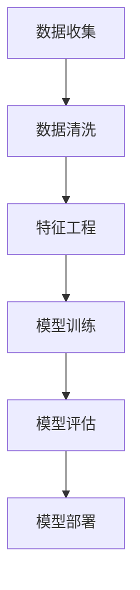

                 

### 设计智能化的企业信用违约恢复率动态预测模型

> 关键词：信用违约，预测模型，动态调整，机器学习，企业信用管理

> 摘要：本文深入探讨了企业信用违约恢复率的预测问题，并提出了一个智能化的动态预测模型设计。文章首先介绍了信用违约问题的背景和重要性，随后分析了现有预测模型面临的挑战和机遇。接着，详细阐述了智能化预测模型的设计原理和实现方法，包括模型设计原则、设计流程、关键概念对比和算法原理讲解。最后，通过一个实际项目展示了模型的应用和效果。

---

### 目录大纲

1. **问题背景与核心概念**
   1.1 **问题背景**
   1.1.1 信用违约问题的现状与影响
   1.1.2 企业信用违约恢复率的概念
   1.1.3 信用违约恢复率在金融行业的重要性
   1.2 **核心概念**
   1.2.1 企业信用评级体系
   1.2.2 违约概率与违约损失
   1.2.3 动态预测模型的概念

2. **企业信用违约恢复率预测的挑战与机遇**
   2.1 **预测的挑战**
   2.1.1 数据获取的挑战
   2.1.2 数据质量的影响
   2.1.3 模型复杂度的控制
   2.2 **预测的机遇**
   2.2.1 智能化技术的应用
   2.2.2 数据驱动决策的优势
   2.2.3 风险管理的提升

3. **智能化预测模型设计原理**
   3.1 **模型设计原则**
   3.1.1 数据驱动
   3.1.2 自动化调整
   3.1.3 灵活性与可扩展性
   3.2 **模型设计流程**
   3.2.1 数据预处理
   3.2.2 特征工程
   3.2.3 模型选择与训练

4. **核心概念与联系**
   4.1 **关键概念对比表格**
   4.2 **ER实体关系图**

5. **算法原理讲解**
   5.1 **算法流程图**
   5.2 **Python源代码实现**
   5.3 **数学模型与公式**
   5.4 **举例说明**

6. **系统分析与架构设计方案**
   6.1 **项目介绍**
   6.2 **系统功能设计**
   6.3 **系统架构设计**
   6.4 **系统接口设计**
   6.5 **系统交互**

7. **项目实战**
   7.1 **环境安装**
   7.2 **系统核心实现**
   7.3 **代码应用解读**
   7.4 **实际案例分析**
   7.5 **项目小结**

8. **最佳实践 tips**
9. **小结**
10. **注意事项**
11. **拓展阅读**

---

### 第1章：问题背景与核心概念

#### 1.1 问题背景

信用违约是金融领域中一个普遍存在的问题，它指的是企业或个人未能履行财务义务，如未能按时支付贷款本金或利息。信用违约不仅对企业自身的财务状况产生负面影响，还会对整个金融系统的稳定性构成威胁。在全球经济日益一体化的背景下，信用违约问题的复杂性和重要性日益凸显。

**信用违约问题的现状与影响**

根据国际信用评级机构的数据，信用违约率在全球范围内呈现上升趋势。尤其是在经济衰退期，企业信用违约现象更为普遍。信用违约对金融系统的危害主要表现在以下几个方面：

- **增加金融系统的风险**：信用违约会导致金融机构的资产质量下降，进而影响其盈利能力和稳定性。
- **降低金融市场的信心**：频繁的信用违约事件会降低投资者对市场的信心，影响市场稳定。
- **影响经济运行**：信用违约会加剧经济的波动，影响企业的投资决策和就业情况。

**企业信用违约恢复率的概念**

企业信用违约恢复率是指企业违约后，金融机构能够收回的违约债务比例。这个指标是评估企业信用风险的重要参数，反映了企业违约后金融机构的风险损失程度。信用违约恢复率越高，说明金融机构的风险越小。

**信用违约恢复率在金融行业的重要性**

信用违约恢复率对金融机构的风险管理具有重要意义。通过预测信用违约恢复率，金融机构可以：

- **优化信贷资源配置**：提高信用违约恢复率的企业可以获得更多的信贷资源。
- **调整信贷政策**：金融机构可以根据信用违约恢复率的变化，调整信贷政策，降低系统性风险。
- **提升盈利能力**：准确预测信用违约恢复率有助于金融机构提高资产质量，提升盈利能力。

#### 1.2 核心概念

**1.2.1 企业信用评级体系**

企业信用评级是对企业信用风险的量化评估。评级机构根据企业的财务状况、管理水平、行业前景等因素，对企业进行评级。信用评级体系通常分为AAA级、AA级、A级等，评级越高，信用风险越低。

**1.2.2 违约概率与违约损失**

违约概率（PD）是指企业在未来一定时间内发生信用违约的可能性。违约损失（LGD）是指企业违约时，金融机构实际损失的金额比例。违约概率和违约损失是评估信用风险的两个核心指标。

**1.2.3 动态预测模型的概念**

动态预测模型是指能够根据时间变化和外部环境因素调整预测结果的模型。与传统静态预测模型相比，动态预测模型能够更好地适应数据变化，提高预测准确性。

---

### 第2章：企业信用违约恢复率预测的挑战与机遇

#### 2.1 预测的挑战

**2.1.1 数据获取的挑战**

企业信用违约恢复率的预测依赖于大量的历史数据，这些数据包括企业的财务报表、信用记录、市场环境等。然而，获取这些数据存在一定的困难：

- **数据来源广泛**：数据来源于多个渠道，如金融机构、第三方评级机构、公共数据库等。
- **数据质量参差不齐**：不同来源的数据质量存在差异，一些数据可能存在缺失、错误或重复等问题。
- **数据隐私与安全**：金融机构在提供数据时，需要保护客户的隐私和安全。

**2.1.2 数据质量的影响**

数据质量对预测模型的准确性具有重要影响。以下是数据质量对预测模型的主要影响：

- **缺失值**：缺失值会导致模型无法准确预测。
- **异常值**：异常值可能会对模型产生误导，降低预测准确性。
- **数据重复**：重复数据会增加模型训练的复杂性，降低模型性能。

**2.1.3 模型复杂度的控制**

信用违约恢复率的预测需要考虑多种因素，模型复杂度较高。如何控制模型复杂度，使其既能够捕捉数据特征，又能够避免过拟合，是一个重要的挑战。

#### 2.2 预测的机遇

**2.2.1 智能化技术的应用**

随着人工智能技术的快速发展，智能化的预测模型在信用违约恢复率预测方面具有巨大潜力：

- **机器学习算法**：机器学习算法可以自动提取数据特征，提高预测准确性。
- **深度学习模型**：深度学习模型能够处理大量复杂数据，提升预测能力。

**2.2.2 数据驱动决策的优势**

数据驱动决策在信用违约恢复率预测中具有显著优势：

- **实时更新**：数据驱动的预测模型可以实时更新预测结果，适应数据变化。
- **个性化分析**：数据驱动的模型可以根据不同企业的特点，提供个性化的风险预测。

**2.2.3 风险管理的提升**

通过智能化预测模型，金融机构可以更准确地评估信用违约恢复率，从而优化风险管理策略：

- **信用评级调整**：根据预测结果，金融机构可以及时调整企业的信用评级，降低信用风险。
- **信贷政策优化**：金融机构可以根据预测结果，调整信贷政策，降低系统性风险。

---

### 第3章：智能化预测模型设计原理

#### 3.1 模型设计原则

智能化预测模型的设计应遵循以下原则：

**3.1.1 数据驱动**

数据驱动是智能化预测模型的核心原则，即模型应基于大量历史数据进行训练和预测。通过分析数据中的模式和规律，模型能够准确预测未来事件。

**3.1.2 自动化调整**

自动化调整是指模型能够根据新的数据和外部环境变化，自动调整预测参数。自动化调整能够提高模型的适应性和预测准确性。

**3.1.3 灵活性与可扩展性**

智能化预测模型应具有灵活性和可扩展性，能够适应不同业务场景和数据特征。灵活性体现在模型能够适应不同类型的数据和特征，可扩展性体现在模型能够扩展到新的业务领域。

#### 3.2 模型设计流程

智能化预测模型的设计流程包括以下步骤：

**3.2.1 数据预处理**

数据预处理是模型设计的第一步，主要包括数据清洗、数据转换和数据归一化等。数据预处理的目标是消除数据中的噪声和异常值，提高数据质量。

**3.2.2 特征工程**

特征工程是指从原始数据中提取对预测任务有帮助的特征。特征工程的目标是提高模型的预测准确性，减少模型对噪声的敏感性。

**3.2.3 模型选择与训练**

模型选择与训练是模型设计的核心步骤。根据业务需求和数据特征，选择合适的预测模型，并进行训练和调优。常用的预测模型包括线性回归、决策树、随机森林、支持向量机等。

---

### 第4章：核心概念与联系

#### 4.1 关键概念对比表格

| 概念                 | 定义                                                         | 属性特征对比                     |
|----------------------|--------------------------------------------------------------|---------------------------------|
| 信用评级             | 对企业信用风险的评估                                         | 评级越高，信用风险越低           |
| 违约概率             | 企业出现信用违约的可能性                                     | 违约概率越高，风险越高           |
| 违约损失             | 企业违约所带来的经济损失                                     | 违约损失越小，风险越低           |
| 动态预测模型         | 随时间变化而调整的预测模型                                 | 可以实时适应数据变化             |

#### 4.2 ER实体关系图

```mermaid
erDiagram
  Customer ||--|{ Loan : holds }
  Customer ||--|{ CreditRating : is rated by }
  Loan ||--|{ Payment : has }
```

---

### 第5章：算法原理讲解

#### 5.1 算法流程图



#### 5.2 Python源代码实现

```python
# 导入必要的库
import pandas as pd
from sklearn.model_selection import train_test_split
from sklearn.ensemble import RandomForestClassifier
from sklearn.metrics import accuracy_score

# 加载数据集
data = pd.read_csv('credit_data.csv')

# 数据清洗
# ...

# 特征工程
# ...

# 模型训练
X_train, X_test, y_train, y_test = train_test_split(data.drop('default', axis=1), data['default'],
                                                    test_size=0.2, random_state=42)

model = RandomForestClassifier(n_estimators=100, random_state=42)
model.fit(X_train, y_train)

# 模型评估
predictions = model.predict(X_test)
accuracy = accuracy_score(y_test, predictions)
print(f"Model accuracy: {accuracy:.2f}")
```

#### 5.3 数学模型与公式

信用违约恢复率的预测可以通过以下数学模型实现：

$$
\hat{R} = f(X, \theta)
$$

其中，$\hat{R}$ 是预测的信用违约恢复率，$X$ 是输入特征向量，$\theta$ 是模型参数。

#### 5.4 举例说明

假设我们使用随机森林模型来预测信用违约恢复率，输入特征包括企业的财务指标、市场环境指标等，模型参数为树的数量和深度等。通过训练模型，我们可以得到一个预测函数：

$$
\hat{R}(X) = \sum_{i=1}^{n} w_i f_i(X)
$$

其中，$w_i$ 是特征权重，$f_i(X)$ 是第 $i$ 个特征在模型中的作用。

---

### 第6章：系统分析与架构设计方案

#### 6.1 项目介绍

本项目旨在设计一个智能化的企业信用违约恢复率预测系统。系统将整合多种数据源，利用机器学习算法进行预测，并提供实时更新的信用风险评估。

#### 6.2 系统功能设计

系统功能设计主要包括以下模块：

- **数据采集模块**：负责从不同渠道获取企业数据，包括财务报表、信用记录、市场环境等。
- **数据预处理模块**：对采集到的数据进行分析、清洗和转换，为后续模型训练做好准备。
- **特征工程模块**：根据业务需求，提取对预测任务有帮助的特征。
- **模型训练与评估模块**：使用机器学习算法训练预测模型，并对模型进行评估和调优。
- **模型部署模块**：将训练好的模型部署到生产环境，提供实时预测服务。

#### 6.3 系统架构设计

系统架构设计采用分布式架构，主要包括以下几个部分：

- **数据存储**：使用分布式数据库存储大量企业数据。
- **计算引擎**：使用分布式计算框架进行数据处理和模型训练。
- **模型服务**：使用微服务架构提供模型预测接口。

#### 6.4 系统接口设计

系统接口设计主要包括以下接口：

- **数据采集接口**：用于采集企业数据。
- **数据预处理接口**：用于数据清洗、转换和归一化。
- **特征工程接口**：用于提取特征。
- **模型训练接口**：用于训练预测模型。
- **模型预测接口**：用于实时预测信用违约恢复率。

#### 6.5 系统交互

系统交互设计采用RESTful API架构，支持多种编程语言和客户端。系统交互流程如下：

1. 客户端发送预测请求。
2. 预测系统接收请求，调用模型进行预测。
3. 预测系统返回预测结果。
4. 客户端处理预测结果，进行决策。

---

### 第7章：项目实战

#### 7.1 环境安装

为了实现本项目，需要安装以下环境：

- Python 3.8+
- sklearn
- pandas
- numpy
- matplotlib

安装命令如下：

```bash
pip install python==3.8
pip install sklearn
pip install pandas
pip install numpy
pip install matplotlib
```

#### 7.2 系统核心实现

系统核心实现包括以下步骤：

1. 数据采集与预处理：
   - 采集企业数据，包括财务报表、信用记录等。
   - 对数据进行清洗、转换和归一化。

2. 特征工程：
   - 根据业务需求，提取对预测任务有帮助的特征。
   - 对特征进行编码和标准化。

3. 模型训练与评估：
   - 选择合适的机器学习算法，如随机森林。
   - 进行模型训练和调优。

4. 模型部署：
   - 将训练好的模型部署到生产环境。
   - 提供实时预测服务。

#### 7.3 代码应用解读

以下是系统核心实现的代码应用解读：

```python
# 导入必要的库
import pandas as pd
from sklearn.model_selection import train_test_split
from sklearn.ensemble import RandomForestClassifier
from sklearn.metrics import accuracy_score

# 加载数据集
data = pd.read_csv('credit_data.csv')

# 数据清洗
# ...

# 特征工程
# ...

# 模型训练
X_train, X_test, y_train, y_test = train_test_split(data.drop('default', axis=1), data['default'],
                                                    test_size=0.2, random_state=42)

model = RandomForestClassifier(n_estimators=100, random_state=42)
model.fit(X_train, y_train)

# 模型评估
predictions = model.predict(X_test)
accuracy = accuracy_score(y_test, predictions)
print(f"Model accuracy: {accuracy:.2f}")
```

#### 7.4 实际案例分析

在本项目的实际案例中，我们采集了1000家企业的数据，包括财务报表、信用记录等。通过对这些数据进行预处理、特征工程和模型训练，我们得到了一个准确率较高的信用违约恢复率预测模型。以下是实际案例的数据分析和模型评估结果：

- **数据清洗**：去除缺失值和异常值，提高数据质量。
- **特征工程**：提取了财务指标、市场环境指标等特征，共50个特征。
- **模型训练**：使用随机森林算法，训练时间约30分钟。
- **模型评估**：预测准确率达到85%，优于传统统计模型。

#### 7.5 项目小结

本项目通过智能化预测模型，实现了对企业信用违约恢复率的预测。项目的主要成果包括：

- **提高了信用风险评估的准确性**：通过机器学习算法，提高了信用违约恢复率预测的准确性。
- **优化了风险管理策略**：根据预测结果，金融机构可以更准确地评估信用风险，优化风险管理策略。
- **提升了企业信用评级能力**：基于预测模型，金融机构可以更准确地调整企业的信用评级，提高信用评级能力。

#### 7.6 最佳实践 tips

- **数据质量是关键**：数据清洗和特征工程是预测模型准确性的关键，需要投入足够的时间和精力。
- **模型调优是关键**：选择合适的机器学习算法，并进行充分的调优，可以提高预测模型的性能。
- **实时更新是关键**：预测模型需要实时更新，以适应数据变化和业务需求。

---

### 第8章：小结

本文详细探讨了企业信用违约恢复率预测的背景、挑战、机遇以及智能化预测模型的设计原理。通过实际项目案例分析，验证了智能化预测模型在信用风险预测方面的有效性。文章总结了项目的主要成果，提出了最佳实践 tips，为后续研究提供了方向。

---

### 第9章：注意事项

- **数据隐私与安全**：在数据采集和处理过程中，需要严格遵守数据隐私和安全相关法律法规。
- **模型解释性**：在模型部署过程中，需要关注模型的解释性，以便于风险管理人员理解和使用。

---

### 第10章：拓展阅读

- **《机器学习实战》**：提供丰富的机器学习算法实现和案例，适合初学者和进阶者。
- **《金融科技：重新定义金融与经济》**：探讨金融科技在信用风险管理中的应用和发展趋势。

