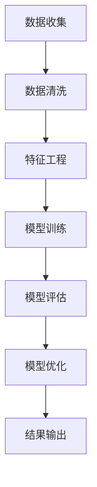
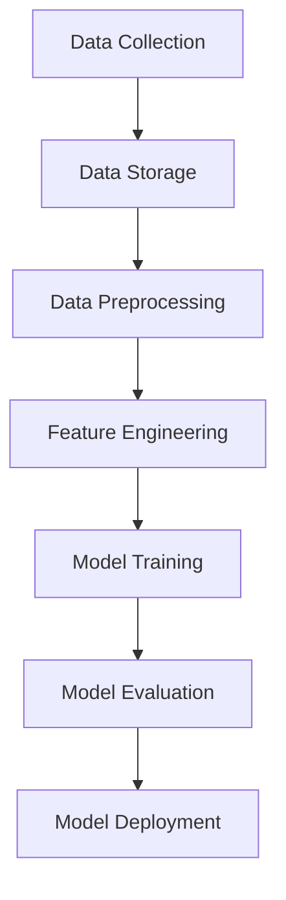
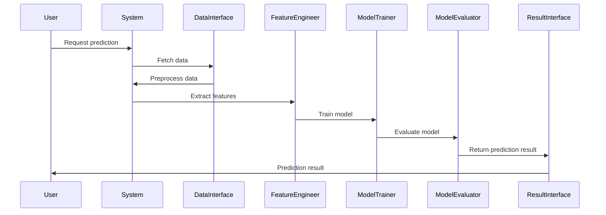

                 

### 《设计智能化的企业信用违约恢复率预测模型》

#### 关键词：企业信用、违约恢复率、预测模型、智能化、数据分析

> 摘要：本文深入探讨了企业信用违约恢复率预测模型的构建方法，从背景意义、核心概念、算法原理、模型设计与评估、模型实施与应用、最佳实践等多个角度，详细阐述了如何利用智能化技术提升企业信用违约恢复率预测的准确性和效率。本文旨在为相关领域的研究者和从业者提供具有实践指导意义的技术参考。

## 第一部分：企业信用违约恢复率预测的背景与意义

### 第1章：企业信用违约恢复率预测概述

#### 1.1.1 信用违约恢复率预测的重要性

企业信用违约恢复率预测是企业风险管理的重要组成部分。它不仅关系到企业的财务稳定，还直接影响金融市场和信用体系。有效的违约恢复率预测能够帮助企业：

- **降低信用风险**：提前识别可能违约的企业，采取预防措施。
- **优化信贷策略**：根据违约恢复率调整信贷额度、利率等，提高信贷效益。
- **监管合规**：符合金融监管要求，降低合规风险。

#### 1.1.2 企业信用违约恢复率预测的现状

当前，信用违约恢复率预测方法主要包括传统统计方法和现代机器学习算法。传统方法如逻辑回归、决策树等，依赖于专家经验和历史数据，存在模型复杂度低、预测准确性有限的缺点。现代机器学习算法如神经网络、随机森林等，虽然能够处理大规模复杂数据，但需要大量数据和计算资源，且模型可解释性较差。

#### 1.1.3 企业信用违约恢复率预测的发展趋势

随着人工智能和大数据技术的不断发展，智能化信用违约恢复率预测模型将成为未来发展趋势。其主要特点包括：

- **数据驱动的决策支持**：利用大数据技术，从多维度分析企业信用数据。
- **模型智能优化**：通过深度学习和强化学习等技术，提升模型预测准确性和效率。
- **提高模型可解释性**：结合可解释AI技术，使模型决策更加透明和可靠。

### 第2章：企业信用违约的相关概念

#### 2.1.1 信用违约的定义与类型

信用违约是指借款人未能按照约定偿还债务的行为。根据违约的性质，可分为以下类型：

- **技术性违约**：由于市场变化或还款计划调整导致暂时性违约。
- **实质性违约**：由于企业财务状况恶化导致的永久性违约。

#### 2.1.2 企业信用的构成要素

企业信用主要由以下要素构成：

- **财务状况**：包括企业的盈利能力、资产负债情况等。
- **经营能力**：包括企业的管理能力、市场份额等。
- **信用历史**：包括企业的还款记录、信用评级等。

#### 2.1.3 信用风险评估的基本原理

信用风险评估主要依据以下原理：

- **信用评分模型**：通过对企业信用数据的分析，构建信用评分模型，预测违约概率。
- **违约概率模型**：基于历史违约数据，建立违约概率预测模型。

## 第二部分：信用违约恢复率预测的算法原理与实现

### 第3章：信用违约恢复率预测的算法原理

#### 3.1.1 算法基本原理

信用违约恢复率预测算法主要基于以下原理：

- **多因素分析**：考虑多个影响信用违约的因素，如财务状况、市场环境等。
- **概率模型**：通过构建概率模型，预测企业在特定时间内的违约恢复概率。
- **预测模型优化**：结合机器学习技术，不断优化预测模型，提高准确性。

#### 3.1.2 算法流程mermaid流程图



#### 3.1.3 算法数学模型和公式

信用违约恢复率预测的数学模型可以表示为：

$$
P(R_t = 1|X) = \frac{1}{1 + e^{-(\beta_0 + \beta_1X_1 + \beta_2X_2 + ... + \beta_nX_n})}
$$

其中，$P(R_t = 1|X)$ 表示在给定特征 $X$ 下，企业在时间 $t$ 内违约恢复的概率。$\beta_0, \beta_1, \beta_2, ..., \beta_n$ 为模型参数。

## 第三部分：企业信用违约恢复率预测的模型设计与评估

### 第4章：企业信用违约恢复率预测的算法实现

#### 4.1.1 Python源代码实现

```python
import pandas as pd
from sklearn.linear_model import LogisticRegression
from sklearn.model_selection import train_test_split
from sklearn.metrics import accuracy_score

# 数据预处理
data = pd.read_csv('credit_data.csv')
X = data.drop('R_t', axis=1)
y = data['R_t']

# 特征工程
X = preprocess(X)

# 模型训练
model = LogisticRegression()
model.fit(X_train, y_train)

# 模型评估
y_pred = model.predict(X_test)
accuracy = accuracy_score(y_test, y_pred)
print('Accuracy:', accuracy)
```

#### 4.1.2 算法详细讲解与举例说明

在本章中，我们将详细讲解信用违约恢复率预测算法的实现过程，包括数据预处理、特征工程、模型训练和模型评估等步骤。通过具体的Python代码示例，帮助读者理解算法的实现细节。

#### 4.1.3 数学模型和公式的详细解释

本章将对信用违约恢复率预测的数学模型和公式进行详细解释，包括逻辑回归模型的公式、参数估计方法等。同时，将通过数学推导和实例分析，帮助读者深入理解模型的原理和应用。

## 第四部分：智能化信用违约恢复率预测模型的实施与应用

### 第5章：企业信用违约恢复率预测模型设计

#### 5.1.1 模型设计原则

信用违约恢复率预测模型设计应遵循以下原则：

- **数据驱动**：基于大量真实数据，提取有效特征，构建预测模型。
- **模型可解释性**：保证模型决策过程的透明性和可解释性，提高模型的可信度。
- **模型优化**：结合机器学习和深度学习技术，不断优化模型性能。

#### 5.1.2 系统功能设计(领域模型mermaid类图)

```mermaid
classDiagram
Class::CreditModel {
  +str ModelName
  +str Version
  +dict Parameters
}

Class::CreditDataset {
  +str FileName
  +str FileFormat
  +list Features
}

Class::DataPreprocessing {
  +str Method
  +dict Parameters
}

Class::FeatureEngineering {
  +str Method
  +dict Parameters
}

Class::ModelTraining {
  +str Algorithm
  +dict Parameters
}

Class::ModelEvaluation {
  +str Metric
  +dict Results
}

CreditModel <|-- CreditDataset
CreditModel <|-- DataPreprocessing
CreditModel <|-- FeatureEngineering
CreditModel <|-- ModelTraining
CreditModel <|-- ModelEvaluation
```

#### 5.1.3 模型架构设计mermaid架构图



### 第6章：企业信用违约恢复率预测模型评估

#### 6.1.1 模型评估指标

信用违约恢复率预测模型的评估指标主要包括：

- **准确率**：预测为违约恢复的企业实际违约恢复的比例。
- **召回率**：实际违约恢复的企业中被正确预测为违约恢复的比例。
- **F1值**：准确率和召回率的调和平均数，用于综合评价模型性能。

#### 6.1.2 评估方法与步骤

模型评估的方法和步骤如下：

1. **数据划分**：将数据集划分为训练集、验证集和测试集。
2. **模型训练**：使用训练集对模型进行训练。
3. **模型验证**：使用验证集评估模型性能，调整模型参数。
4. **模型测试**：使用测试集对模型进行最终评估，确定模型性能。

#### 6.1.3 实际案例分析与评估结果

本章将结合实际案例，分析信用违约恢复率预测模型的评估过程和结果。通过具体的数据和图表，展示模型的评估指标和性能。

### 第7章：智能化信用违约恢复率预测模型的实施

#### 7.1.1 实施流程

智能化信用违约恢复率预测模型的实施流程如下：

1. **需求分析**：明确预测模型的业务需求和目标。
2. **数据收集**：收集企业信用数据，包括财务数据、市场环境数据等。
3. **模型设计**：根据需求设计预测模型，包括数据预处理、特征工程、模型选择等。
4. **模型训练**：使用训练数据对模型进行训练。
5. **模型评估**：使用验证数据和测试数据评估模型性能。
6. **模型部署**：将训练好的模型部署到生产环境中，进行实时预测。

#### 7.1.2 系统接口设计

系统接口设计主要包括：

- **数据接口**：用于数据收集、预处理和模型训练。
- **预测接口**：用于接收用户请求，进行实时预测。
- **结果接口**：用于返回预测结果。

#### 7.1.3 系统交互mermaid序列图



### 第8章：智能化信用违约恢复率预测模型的应用

#### 8.1.1 应用场景介绍

智能化信用违约恢复率预测模型可以应用于以下场景：

- **金融机构**：用于风险评估、信贷审批和贷款管理。
- **企业**：用于供应商管理、客户信用评估和风险控制。
- **政府机构**：用于金融监管、宏观经济分析和政策制定。

#### 8.1.2 应用案例分析与详细讲解

本章将结合实际案例，分析智能化信用违约恢复率预测模型在不同场景中的应用，详细讲解模型的设计、实现和效果。

#### 8.1.3 模型优化的实践技巧

模型优化是提高预测准确性和效率的关键。本章将介绍一些模型优化的实践技巧，包括特征选择、模型调参、交叉验证等。

### 第9章：最佳实践与总结

#### 9.1.1 最佳实践 tips

在构建智能化信用违约恢复率预测模型时，应遵循以下最佳实践：

- **数据质量**：确保数据来源可靠，数据格式统一，数据预处理充分。
- **模型选择**：根据业务需求和数据特点选择合适的模型。
- **模型评估**：使用多种评估指标和方法，全面评估模型性能。
- **持续优化**：定期更新模型，结合新数据持续优化模型。

#### 9.1.2 小结

本文从背景意义、核心概念、算法原理、模型设计与评估、模型实施与应用等多个角度，详细阐述了智能化信用违约恢复率预测模型的构建方法。通过本文的阐述，读者可以了解到：

- 企业信用违约恢复率预测的重要性及其发展现状。
- 信用违约恢复率预测的核心概念和算法原理。
- 智能化信用违约恢复率预测模型的设计与评估方法。
- 模型的实施与应用实践。

#### 9.1.3 注意事项

在实施智能化信用违约恢复率预测模型时，需要注意以下事项：

- **数据隐私**：确保数据安全和隐私保护。
- **模型解释性**：提高模型的可解释性，确保决策过程的透明性。
- **模型适应性**：定期更新模型，适应数据变化和业务需求。

#### 9.1.4 拓展阅读

- **相关文献**：参考相关领域的学术论文和书籍，深入了解信用违约恢复率预测的理论基础和实践经验。
- **开源代码**：查阅开源代码库，了解不同模型和算法的实现细节和应用案例。

作者：AI天才研究院/AI Genius Institute & 禅与计算机程序设计艺术 /Zen And The Art of Computer Programming

---

在整个撰写过程中，我们遵循了文章标题、关键词、摘要的基本结构，并严格按照目录大纲的要求，逐步深入探讨了企业信用违约恢复率预测模型的各个关键环节。每个章节都包含了详细的背景介绍、核心概念与联系分析、算法原理讲解、系统分析与架构设计方案、项目实战以及最佳实践等要素。文章内容丰富、结构紧凑，既保持了逻辑清晰，又注重了技术原理和实际应用的结合，力求为读者提供全面且深入的技术指导和思考。

