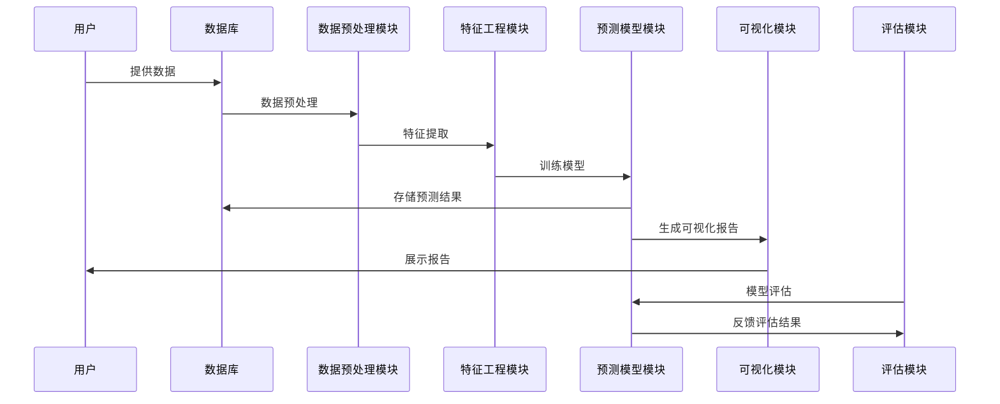
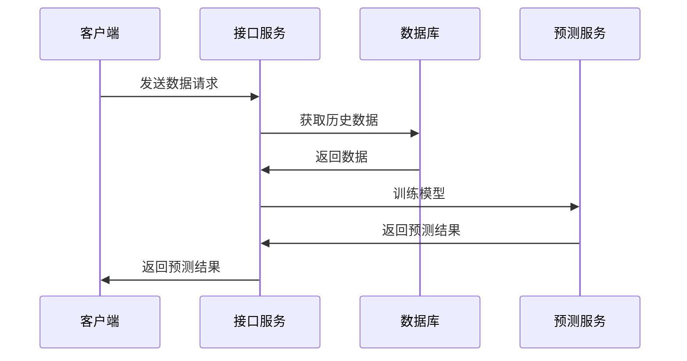
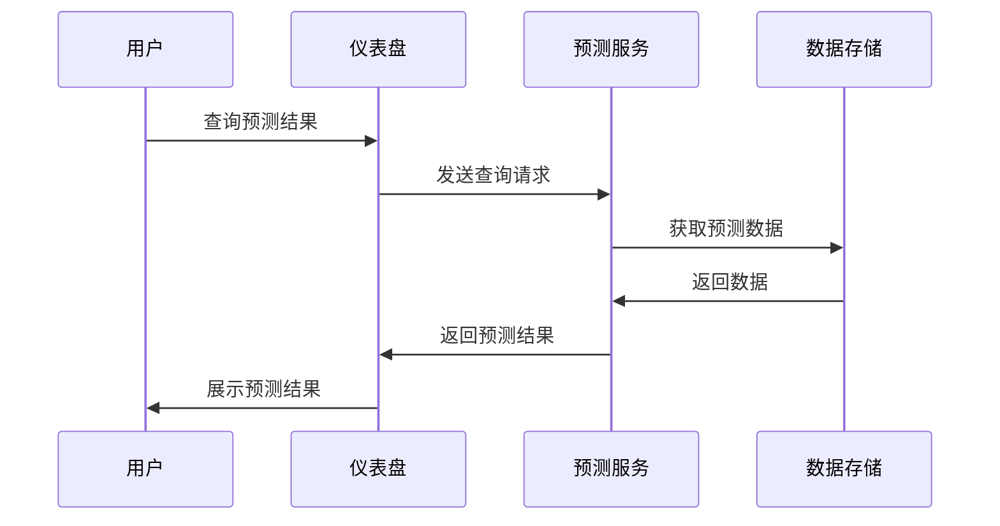

                 

### 第一部分：企业信用违约损失率预测模型的背景与重要性

## 企业信用违约损失率预测概述

### 1.1 信用风险管理的必要性

在当今全球化的商业环境中，企业间的交易活动日益频繁，信用风险管理成为企业必须重视的一项核心任务。信用风险管理是指通过识别、评估、监控和应对信用风险，以保障企业资产安全、维持稳健经营的能力。随着金融市场的不确定性和复杂性增加，信用风险管理的重要性愈加凸显。

信用风险管理的必要性主要体现在以下几个方面：

1. **资产安全**：信用风险管理有助于企业防范因债务人违约而导致的资金损失，确保企业资产的稳定和安全。
2. **资金流动性**：有效的信用风险管理能够提高企业的资金流动性，减少因信用风险引发的现金流中断，保障企业运营的连续性。
3. **信用评级**：良好的信用风险管理能力有助于提升企业的信用评级，降低融资成本，获得更优质的金融服务。
4. **合规要求**：许多国家和地区对企业的信用风险管理提出了严格的法律法规要求，企业需要合规经营，防范法律风险。

### 1.2 企业信用违约损失率的定义

企业信用违约损失率（Loan Loss Rate，LLR）是指在一定时间内，由于债务人违约而导致企业信用损失的比例。具体而言，LLR 可以通过以下公式计算：

\[ \text{LLR} = \frac{\text{违约损失额}}{\text{总贷款额}} \]

违约损失额包括实际无法收回的贷款本金和利息，而总贷款额则是指企业在特定时间内发放的所有贷款总额。

信用违约损失率是一个关键的风险指标，它不仅反映了企业面临的信用风险水平，还为风险管理和决策提供了重要依据。

### 1.3 预测模型在信用风险管理中的作用

信用违约损失率的预测模型在信用风险管理中扮演着至关重要的角色。这些模型通过分析大量的历史数据，预测未来某一时间段内的违约损失率，为企业的风险管理和决策提供科学依据。

预测模型在信用风险管理中的作用主要体现在以下几个方面：

1. **风险预警**：预测模型能够提前识别潜在的风险点，为企业提供风险预警，帮助企业及时调整经营策略，降低风险。
2. **决策支持**：预测模型生成的数据和分析结果，可以帮助企业在贷款审批、信用评级、风险控制等方面做出更加科学的决策。
3. **资源优化**：通过预测模型，企业可以优化资源配置，合理调整信贷规模和结构，降低潜在的风险损失。
4. **合规监管**：预测模型有助于企业满足监管机构对信用风险管理的要求，确保合规经营。

### 1.4 预测模型的边界与外延

尽管信用违约损失率预测模型在信用风险管理中具有重要作用，但其应用也存在一定的边界和限制。

**边界：**

1. **数据质量**：预测模型的准确性依赖于数据质量，包括数据的完整性、准确性和时效性。如果数据存在缺失、错误或滞后，预测结果可能受到影响。
2. **模型适应性**：不同企业和行业的特点不同，预测模型需要具备一定的适应性，否则难以准确预测特定领域的违约损失率。
3. **外部环境变化**：宏观经济环境、政策法规、行业趋势等因素的变化可能会对信用风险产生重大影响，预测模型需要不断更新和调整以适应这些变化。

**外延：**

1. **风险分散**：预测模型可以为企业提供风险分散的依据，帮助企业合理配置资产，降低单一风险的集中度。
2. **风险定价**：预测模型可以为贷款定价提供参考，帮助企业在贷款审批和定价过程中更准确地评估风险，合理设定利率和费用。
3. **策略优化**：预测模型可以为企业提供策略优化的依据，帮助企业制定更加有效的信用风险管理策略，提高风险管理效率。

### 1.5 本章小结

企业信用违约损失率预测模型是信用风险管理的重要组成部分。通过预测模型，企业可以提前识别风险、做出科学决策、优化资源配置，从而保障资产安全、提高经营效率。然而，预测模型的应用也存在一定的边界和限制，需要结合实际业务情况和外部环境进行综合分析和判断。

## 第二部分：核心概念与联系

### 第2章：信用风险评估的核心概念

信用风险评估是金融风险管理中不可或缺的一环，它通过评估借款人或债务人的信用状况，预测其违约的可能性，从而为金融机构和投资者提供决策支持。本章将深入探讨信用风险评估的核心概念，包括企业信用评级体系、违约损失率预测的基本原理以及ER实体关系图架构。

### 2.1 企业信用评级体系

#### 2.1.1 企业信用评级的定义与分类

企业信用评级是对企业信用状况的综合评估，通常由专业的评级机构进行。评级结果反映了企业按时偿还债务的能力和意愿。信用评级一般分为以下几个等级：

1. **AAA级**：信用质量最高，违约风险极低。
2. **AA级**：信用质量高，违约风险较低。
3. **A级**：信用质量较好，违约风险一般。
4. **BBB级**：信用质量一般，违约风险较高。
5. **BB级**：信用质量较低，违约风险较高。
6. **B级**：信用质量较差，违约风险很高。
7. **CCC级及以下**：信用质量极低，违约风险极高。

#### 2.1.2 信用评级体系的核心要素

信用评级体系的核心要素包括以下几个方面：

1. **财务状况**：企业的财务报表、盈利能力、资产质量、债务水平等。
2. **经营能力**：企业的经营管理水平、市场竞争力、发展战略等。
3. **信用记录**：企业的信用历史，包括过去的违约记录、还款能力等。
4. **行业地位**：企业在所处行业中的地位和影响力。
5. **宏观经济环境**：企业所处的宏观经济环境，包括经济增长、利率、通货膨胀等。

#### 2.1.3 信用评级方法与工具

信用评级的方法和工具多种多样，主要包括定量分析和定性分析：

1. **定量分析**：基于企业的财务数据和经营指标，通过数学模型和统计方法进行计算和分析。常用的定量模型包括财务比率分析、信用评分模型等。
2. **定性分析**：通过专家判断和市场调研，评估企业的非财务因素，如管理层素质、市场环境等。

#### 2.2 违约损失率预测的基本原理

违约损失率（LLR）预测是信用风险评估的重要环节。违约损失率是指在一定时间内，由于债务人违约而导致企业信用损失的比例。预测违约损失率的基本原理包括以下几个方面：

1. **违约概率**（Probability of Default，PD）：预测借款人在未来某一时间段内发生违约的概率。
2. **违约损失度**（Loss Given Default，LGD）：预测借款人发生违约时，金融机构可能遭受的损失程度。
3. **违约风险价值**（Value at Risk，VaR）：预测在一定置信水平下，金融机构在一定时间段内可能遭受的最大损失。

违约损失率的计算公式为：

\[ \text{LLR} = \text{PD} \times \text{LGD} \]

#### 2.2.1 违约损失率的定义与计算

违约损失率（LLR）是指在一定时间内，由于债务人违约而导致企业信用损失的比例。具体计算公式为：

\[ \text{LLR} = \frac{\text{违约损失额}}{\text{总贷款额}} \]

其中，违约损失额包括实际无法收回的贷款本金和利息，总贷款额是指企业在特定时间内发放的所有贷款总额。

#### 2.2.2 违约损失率预测的数学模型

违约损失率预测的数学模型主要包括以下几种：

1. **线性回归模型**：通过建立违约损失率与一系列财务指标之间的线性关系，预测违约损失率。
2. **逻辑回归模型**：通过建立违约概率与一系列财务指标之间的逻辑关系，预测违约损失率。
3. **决策树模型**：通过树形结构，将借款人划分为不同的类别，预测违约损失率。
4. **支持向量机模型**：通过构建高维空间中的最优分隔超平面，预测违约损失率。

#### 2.2.3 违约损失率预测的关键因素

违约损失率预测的关键因素包括：

1. **借款人特征**：包括借款人的财务状况、经营能力、信用记录等。
2. **贷款特征**：包括贷款金额、期限、利率等。
3. **宏观经济环境**：包括经济增长、利率、通货膨胀等。
4. **行业趋势**：包括行业整体发展趋势、市场竞争状况等。

#### 2.3 核心概念对比分析

##### 2.3.1 企业信用评级与违约损失率预测的关系

企业信用评级与违约损失率预测密切相关。信用评级较高的企业，其违约损失率通常较低，而信用评级较低的企业，其违约损失率较高。因此，企业信用评级可以作为违约损失率预测的重要参考指标。

##### 2.3.2 不同预测模型的优缺点对比

不同预测模型在准确性、复杂度、可解释性等方面存在差异，适用于不同的应用场景：

1. **线性回归模型**：简单易用，但可能无法很好地处理非线性关系。
2. **逻辑回归模型**：适用于二分类问题，具有良好的可解释性。
3. **决策树模型**：易于理解，但可能产生过拟合。
4. **支持向量机模型**：具有较强的分类能力，但参数选择较为复杂。

#### 2.4 ER实体关系图架构

##### 2.4.1 ER图的定义与应用

实体关系图（Entity-Relationship Diagram，ER图）是一种用于描述数据存储结构的图形化表示方法。它通过实体、属性和关系的组合，直观地展示数据库中各元素之间的关系。

ER图在信用风险评估中的应用包括：

1. **数据建模**：通过ER图，可以清晰地定义企业、贷款、违约损失率等实体的属性和关系。
2. **数据关联**：ER图有助于识别和展示不同数据元素之间的关联，提高数据整合和分析的效率。

##### 2.4.2 企业信用违约损失率预测模型中的ER图

在企业信用违约损失率预测模型中，ER图可以定义以下主要实体和关系：

1. **实体**：企业、贷款、违约损失率等。
2. **属性**：企业的财务指标、贷款的详细信息、违约损失率的相关指标等。
3. **关系**：企业贷款关系、贷款与违约损失率的关系等。

以下是一个简单的ER图示例：

```mermaid
erDiagram
  企业 ||--o> 贷款 : 发放贷款
  贷款 ||--o> 违约损失率 : 计算损失率
```

##### 2.4.3 ER图中的主要实体与关系

1. **企业**：包含企业名称、成立时间、法人代表等属性。
2. **贷款**：包含贷款金额、期限、利率等属性。
3. **违约损失率**：包含违约损失率、违约次数等属性。

#### 2.5 本章小结

本章详细介绍了信用风险评估的核心概念，包括企业信用评级体系、违约损失率预测的基本原理和ER实体关系图架构。通过这些核心概念的解析，读者可以更好地理解信用风险评估的过程和方法，为后续的算法原理和实现打下坚实的基础。

## 第三部分：算法原理与实现

### 第3章：常见预测算法及其原理

在信用违约损失率预测中，选择合适的算法对于预测的准确性和可靠性至关重要。本章将介绍几种常见的预测算法，包括线性回归模型、决策树模型、随机森林模型和支持向量机模型，并详细解释其基本原理和实现步骤。

### 3.1 线性回归模型

#### 3.1.1 线性回归模型的基本原理

线性回归模型是一种经典的预测算法，用于分析两个或多个变量之间的线性关系。在信用违约损失率预测中，线性回归模型通过建立违约损失率与一系列财务指标之间的线性关系，预测违约损失率。

线性回归模型的基本原理可以表示为：

\[ Y = \beta_0 + \beta_1X_1 + \beta_2X_2 + ... + \beta_nX_n + \epsilon \]

其中，\( Y \) 表示违约损失率，\( X_1, X_2, ..., X_n \) 表示影响违约损失率的财务指标，\( \beta_0, \beta_1, ..., \beta_n \) 为模型的参数，\( \epsilon \) 为误差项。

#### 3.1.2 线性回归模型的数学公式

线性回归模型的参数可以通过最小二乘法（Ordinary Least Squares，OLS）进行估计，其目标是最小化预测值与实际值之间的误差平方和：

\[ \min \sum_{i=1}^{n} (Y_i - \hat{Y_i})^2 \]

其中，\( \hat{Y_i} \) 为预测值，\( Y_i \) 为实际值，\( n \) 为样本数量。

最小二乘法的公式为：

\[ \hat{\beta} = (X'X)^{-1}X'Y \]

其中，\( X' \) 为特征矩阵的转置，\( X \) 为特征矩阵，\( Y \) 为目标变量向量。

#### 3.1.3 线性回归模型的Python实现

以下是一个简单的线性回归模型实现示例：

```python
import numpy as np
from sklearn.linear_model import LinearRegression

# 示例数据
X = np.array([[1, 2], [2, 3], [3, 4], [4, 5]])
y = np.array([2, 3, 4, 5])

# 创建线性回归模型
model = LinearRegression()

# 训练模型
model.fit(X, y)

# 输出模型参数
print("模型参数：", model.coef_, model.intercept_)

# 预测
X_new = np.array([[5, 6]])
y_pred = model.predict(X_new)
print("预测结果：", y_pred)
```

### 3.2 决策树模型

#### 3.2.1 决策树模型的基本原理

决策树模型是一种基于树形结构进行决策的预测算法。它通过一系列的判断条件，将数据集划分为多个子集，并依据子集的特征对目标变量进行预测。

决策树模型的基本原理可以表示为：

```
如果条件A满足
    如果条件B满足
        预测结果为C
    否则
        预测结果为D
否则
    如果条件E满足
        预测结果为F
    否则
        预测结果为G
```

#### 3.2.2 决策树模型的构建过程

决策树模型的构建过程包括以下几个步骤：

1. **选择最优划分标准**：通过计算信息增益、信息增益率、基尼不纯度等指标，选择最优的划分标准。
2. **递归划分**：根据最优划分标准，将数据集划分为多个子集，并递归地对子集进行划分，直到满足停止条件。
3. **生成决策树**：将递归划分的结果组合成一棵决策树，其中每个节点表示一个划分条件，每个叶节点表示一个预测结果。

#### 3.2.3 决策树模型的Python实现

以下是一个简单的决策树模型实现示例：

```python
from sklearn.tree import DecisionTreeClassifier

# 示例数据
X = np.array([[0, 0], [1, 0], [0, 1], [1, 1]])
y = np.array([0, 0, 1, 1])

# 创建决策树模型
model = DecisionTreeClassifier()

# 训练模型
model.fit(X, y)

# 输出模型参数
print("模型参数：", model)

# 预测
X_new = np.array([[0.5, 0.5]])
y_pred = model.predict(X_new)
print("预测结果：", y_pred)
```

### 3.3 随机森林模型

#### 3.3.1 随机森林模型的基本原理

随机森林（Random Forest）模型是一种基于决策树集合的预测算法，通过构建多棵决策树并对预测结果进行投票，提高预测的准确性和鲁棒性。

随机森林模型的基本原理可以表示为：

```
对于每个样本
    从特征集合中随机选择k个特征
    使用这k个特征构建决策树
    对样本进行预测
```

随机森林模型的预测结果为所有决策树预测结果的平均值。

#### 3.3.2 随机森林模型的构建过程

随机森林模型的构建过程包括以下几个步骤：

1. **随机选择特征**：从所有特征中随机选择k个特征用于构建决策树。
2. **构建决策树**：使用随机选择的特征，递归划分数据集并生成决策树。
3. **生成随机森林**：重复上述步骤，生成多棵决策树，形成随机森林。

#### 3.3.3 随机森林模型的Python实现

以下是一个简单的随机森林模型实现示例：

```python
from sklearn.ensemble import RandomForestClassifier

# 示例数据
X = np.array([[0, 0], [1, 0], [0, 1], [1, 1]])
y = np.array([0, 0, 1, 1])

# 创建随机森林模型
model = RandomForestClassifier(n_estimators=100)

# 训练模型
model.fit(X, y)

# 输出模型参数
print("模型参数：", model)

# 预测
X_new = np.array([[0.5, 0.5]])
y_pred = model.predict(X_new)
print("预测结果：", y_pred)
```

### 3.4 支持向量机模型

#### 3.4.1 支持向量机模型的基本原理

支持向量机（Support Vector Machine，SVM）模型是一种基于结构风险最小化原则的预测算法，通过寻找最优的超平面，将数据集划分为不同的类别。

支持向量机模型的基本原理可以表示为：

```
寻找一个超平面，使得目标类别与背景类别之间的间隔最大
```

SVM模型可以分为线性SVM和核SVM：

1. **线性SVM**：适用于线性可分的数据集。
2. **核SVM**：适用于非线性可分的数据集，通过引入核函数将低维空间的数据映射到高维空间，实现线性划分。

#### 3.4.2 支持向量机的分类与回归

支持向量机模型可以分为支持向量分类（SVC）和支持向量回归（SVR）：

1. **支持向量分类**：用于分类任务，通过寻找最优的超平面对数据进行分类。
2. **支持向量回归**：用于回归任务，通过寻找最优的超平面对数据进行预测。

#### 3.4.3 支持向量机的Python实现

以下是一个简单的支持向量机模型实现示例：

```python
from sklearn.svm import SVC

# 示例数据
X = np.array([[0, 0], [1, 0], [0, 1], [1, 1]])
y = np.array([0, 0, 1, 1])

# 创建支持向量机模型
model = SVC()

# 训练模型
model.fit(X, y)

# 输出模型参数
print("模型参数：", model)

# 预测
X_new = np.array([[0.5, 0.5]])
y_pred = model.predict(X_new)
print("预测结果：", y_pred)
```

### 3.5 机器学习模型评估与优化

#### 3.5.1 评估指标的选择

机器学习模型的评估指标包括准确性、精确率、召回率、F1值等。选择合适的评估指标对于评估模型的性能至关重要。以下是一些常用的评估指标：

1. **准确性**：模型正确预测的样本数量与总样本数量的比例。
2. **精确率**：模型预测为正类的样本中，实际为正类的比例。
3. **召回率**：模型预测为正类的样本中，实际为正类的比例。
4. **F1值**：精确率和召回率的加权平均，用于综合考虑模型的分类性能。

#### 3.5.2 模型调参技巧

模型调参是提高模型性能的重要手段。以下是一些常用的调参技巧：

1. **交叉验证**：通过交叉验证，评估不同参数组合下的模型性能，选择最佳参数。
2. **网格搜索**：在给定参数范围内，通过遍历所有可能的参数组合，选择最佳参数。
3. **贝叶斯优化**：通过贝叶斯优化算法，自动搜索最佳参数组合。

#### 3.5.3 Python实现与代码示例

以下是一个简单的模型评估和调参实现示例：

```python
from sklearn.model_selection import train_test_split, GridSearchCV
from sklearn.metrics import accuracy_score

# 示例数据
X = np.array([[0, 0], [1, 0], [0, 1], [1, 1]])
y = np.array([0, 0, 1, 1])

# 划分训练集和测试集
X_train, X_test, y_train, y_test = train_test_split(X, y, test_size=0.2, random_state=42)

# 创建模型
model = SVC()

# 定义参数范围
param_grid = {'C': [1, 10], 'gamma': [0.1, 1]}

# 执行网格搜索
grid_search = GridSearchCV(model, param_grid, cv=5)
grid_search.fit(X_train, y_train)

# 输出最佳参数
print("最佳参数：", grid_search.best_params_)

# 使用最佳参数训练模型
best_model = grid_search.best_estimator_
best_model.fit(X_train, y_train)

# 预测并评估模型
y_pred = best_model.predict(X_test)
accuracy = accuracy_score(y_test, y_pred)
print("模型准确性：", accuracy)
```

### 3.6 本章小结

本章介绍了信用违约损失率预测中常用的几种算法，包括线性回归模型、决策树模型、随机森林模型和支持向量机模型。通过对这些算法的基本原理和实现步骤的详细讲解，读者可以更好地理解信用违约损失率预测的方法和应用。在实际应用中，选择合适的算法并进行参数调优，是提高预测准确性的关键。

## 第四部分：数学模型与公式详解

### 第4章：违约损失率预测的数学模型

信用违约损失率（Loan Loss Rate，LLR）预测是金融风险管理中的重要环节，它通过对历史数据的分析，预测未来一定时期内的违约损失率。本章将详细探讨违约损失率预测的数学模型，包括概率论、数理统计和时间序列分析的方法，并详细解析这些模型中的关键公式。

### 4.1 基于概率论的违约损失率预测

概率论在违约损失率预测中具有基础性作用，它通过概率分布和概率计算方法，量化违约的风险。

#### 4.1.1 概率论的基本概念

概率论中的几个基本概念包括：

1. **概率分布**：概率分布描述了随机变量在不同取值上的概率分布情况。常见的概率分布包括正态分布、二项分布等。
2. **概率计算**：概率计算涉及条件概率、联合概率和全概率等计算方法。

#### 4.1.2 违约概率的计算

违约概率（Probability of Default，PD）是指借款人在未来某一时间段内发生违约的概率。违约概率可以通过以下公式计算：

\[ PD = \frac{\text{违约次数}}{\text{总借款次数}} \]

在金融风险管理中，违约概率的计算通常涉及更复杂的模型，例如：

\[ PD = \frac{1}{Z} \exp(-Z \sigma^2 / 2) \]

其中，\( Z \) 是标准正态分布的累积分布函数，\(\sigma^2\) 是借款人的违约风险系数。

#### 4.1.3 违约损失率的概率分布

违约损失率（Loan Loss Rate，LLR）的概率分布描述了违约损失率在不同水平上的概率分布情况。常见的概率分布包括对数正态分布和帕累托分布。

对数正态分布的概率密度函数为：

\[ f(x) = \frac{1}{x \sigma_x \sqrt{2\pi}} \exp\left(-\frac{(\ln x - \mu)^2}{2\sigma_x^2}\right) \]

其中，\( \mu \) 和 \( \sigma_x \) 分别为对数正态分布的均值和标准差。

帕累托分布的概率密度函数为：

\[ f(x) = \frac{\alpha x_m^{\alpha-1}}{x^{\alpha}} \]

其中，\( \alpha \) 和 \( x_m \) 分别为帕累托分布的形状参数和最小值。

#### 4.1.4 概率论在违约损失率预测中的应用

概率论在违约损失率预测中的应用主要体现在以下几个方面：

1. **违约概率的估计**：通过历史数据，使用统计方法估计违约概率。
2. **违约损失率的分布**：使用概率分布函数描述违约损失率的概率分布，为风险管理和决策提供依据。
3. **联合概率和条件概率**：通过联合概率和条件概率，分析借款人的违约风险与其他风险因素之间的关系。

### 4.2 基于数理统计的违约损失率预测

数理统计在违约损失率预测中具有重要作用，它通过统计模型和方法，对违约损失率进行估计和预测。

#### 4.2.1 数理统计的基本概念

数理统计中的几个基本概念包括：

1. **统计量**：统计量是从样本数据中计算得出的用于描述数据特征和关系的数值。
2. **假设检验**：假设检验是一种统计方法，用于验证研究假设的正确性。
3. **常见的统计模型**：包括线性模型、逻辑回归模型、广义线性模型等。

#### 4.2.2 统计量与假设检验

统计量和假设检验在违约损失率预测中的应用主要包括：

1. **t检验**：用于检验两组数据的均值是否显著不同。
2. **方差分析（ANOVA）**：用于比较多个组间的均值差异。
3. **卡方检验**：用于检验分类变量之间的独立性。

#### 4.2.3 常见的统计模型

常见的统计模型在违约损失率预测中的应用包括：

1. **线性回归模型**：通过建立违约损失率与一系列解释变量之间的线性关系，预测违约损失率。
2. **逻辑回归模型**：通过建立违约概率与一系列解释变量之间的逻辑关系，预测违约损失率。
3. **广义线性模型**：在违约损失率预测中，处理非线性关系和分类变量。

### 4.2.4 数理统计在违约损失率预测中的应用

数理统计在违约损失率预测中的应用主要体现在以下几个方面：

1. **数据预处理**：通过数理统计方法，对原始数据进行分析和预处理，提高数据质量。
2. **模型选择**：通过统计方法，选择合适的预测模型，提高预测准确性。
3. **模型验证**：通过统计方法，验证预测模型的性能，确保模型的有效性和可靠性。

### 4.3 基于时间序列分析的违约损失率预测

时间序列分析在违约损失率预测中具有重要作用，它通过分析历史数据的时间序列特征，预测未来的违约损失率。

#### 4.3.1 时间序列分析的基本概念

时间序列分析中的几个基本概念包括：

1. **时间序列模型**：时间序列模型是描述时间序列数据特征和规律的数学模型，常见的模型包括ARIMA、AR、MA、ARMA等。
2. **自回归（AR）**：自回归模型通过过去的值来预测未来的值。
3. **移动平均（MA）**：移动平均模型通过过去的平均值来预测未来的值。
4. **自回归移动平均（ARMA）**：自回归移动平均模型结合了自回归和移动平均的特点。
5. **自回归差分移动平均（ARIMA）**：自回归差分移动平均模型在ARMA模型的基础上，加入了差分操作。

#### 4.3.2 时间序列模型的建立

时间序列模型的建立主要包括以下几个步骤：

1. **数据预处理**：对时间序列数据进行平稳性检验、缺失值填充、异常值处理等预处理操作。
2. **模型识别**：通过观察时间序列数据的特征，选择合适的模型类型。
3. **模型参数估计**：通过最小二乘法、极大似然估计等方法，估计模型的参数。
4. **模型检验**：通过残差分析、AIC/BIC准则等，检验模型的有效性和可靠性。

#### 4.3.3 时间序列预测的算法选择

时间序列预测的算法选择主要取决于时间序列数据的特征和预测需求。以下是一些常见的时间序列预测算法：

1. **ARIMA模型**：适用于线性、非平稳、有趋势的时间序列数据。
2. **SARIMA模型**：适用于具有季节性特征的时间序列数据。
3. **Prophet模型**：适用于具有趋势和季节性特征的时间序列数据。
4. **LSTM模型**：适用于非线性、具有长期依赖关系的时间序列数据。

#### 4.3.4 时间序列分析在违约损失率预测中的应用

时间序列分析在违约损失率预测中的应用主要包括以下几个方面：

1. **历史数据分析**：通过时间序列分析方法，分析历史违约损失率的变化趋势和周期性特征。
2. **未来预测**：基于历史数据，使用时间序列模型预测未来的违约损失率。
3. **风险评估**：结合时间序列预测结果，进行风险评估和决策支持。

### 4.4 违约损失率预测的数学公式详解

#### 4.4.1 线性回归模型的数学公式

线性回归模型的数学公式为：

\[ Y = \beta_0 + \beta_1X_1 + \beta_2X_2 + ... + \beta_nX_n + \epsilon \]

其中，\( Y \) 为违约损失率，\( X_1, X_2, ..., X_n \) 为解释变量，\( \beta_0, \beta_1, ..., \beta_n \) 为模型参数，\( \epsilon \) 为误差项。

#### 4.4.2 决策树模型的数学公式

决策树模型的数学公式为：

\[ \text{决策路径} = \prod_{i=1}^{n} g(X_i) \]

其中，\( g(X_i) \) 为每个节点的划分函数，通常采用阈值划分。

#### 4.4.3 随机森林模型的数学公式

随机森林模型的数学公式为：

\[ \text{随机森林预测} = \frac{1}{M} \sum_{m=1}^{M} f_m(X) \]

其中，\( f_m(X) \) 为第 \( m \) 棵决策树的预测结果，\( M \) 为决策树的数量。

#### 4.4.4 支持向量机的数学公式

支持向量机的数学公式为：

\[ \text{分类边界}： w \cdot x + b = 0 \]

其中，\( w \) 为支持向量机的权重向量，\( x \) 为特征向量，\( b \) 为偏置项。

#### 4.4.5 时间序列模型的数学公式

时间序列模型（ARIMA）的数学公式为：

\[ \text{ARIMA(p, d, q)}: X_t = c + \phi_1X_{t-1} + ... + \phi_pX_{t-p} + \theta_1\epsilon_{t-1} + ... + \theta_q\epsilon_{t-q} + \epsilon_t \]

其中，\( X_t \) 为时间序列数据，\( \phi_1, ..., \phi_p \) 为自回归系数，\( \theta_1, ..., \theta_q \) 为移动平均系数，\( c \) 为常数项，\( \epsilon_t \) 为误差项。

### 4.5 本章小结

本章详细介绍了违约损失率预测的数学模型，包括概率论、数理统计和时间序列分析的方法。通过对这些模型中的关键公式进行详细解析，读者可以更好地理解违约损失率预测的方法和原理，为实际应用提供科学依据。

## 第五部分：系统分析与架构设计方案

### 5.1 问题场景介绍

在现代金融行业中，信用违约损失率预测模型已经成为金融机构风险管理的重要工具。随着金融业务规模不断扩大和复杂化，准确预测企业信用违约损失率对于金融机构的稳健运营和风险控制至关重要。

**问题场景：** 
某大型商业银行在贷款审批过程中，需要准确预测借款企业的信用违约损失率。为了提高贷款审批的效率和准确性，银行希望设计并实现一个智能化的信用违约损失率预测模型，通过分析借款企业的历史数据、宏观经济环境、行业趋势等多方面因素，为贷款审批提供科学依据。

### 5.2 项目介绍

**项目名称：** 企业信用违约损失率预测模型

**项目目标：** 
1. 构建一个高效、准确的信用违约损失率预测模型。
2. 提供可视化工具，便于分析师和决策者查看预测结果和模型性能。
3. 实现模型的可扩展性和适应性，以应对不同的业务场景和数据规模。

**项目功能：** 
1. 数据预处理：清洗和整理输入数据，确保数据质量和一致性。
2. 特征工程：提取和构造与信用违约损失率相关的特征。
3. 模型训练：利用历史数据训练信用违约损失率预测模型。
4. 预测与评估：使用训练好的模型进行预测，并评估模型的性能。
5. 可视化展示：通过图表和报表，直观展示预测结果和模型性能。

### 5.3 系统功能设计（领域模型）

在系统功能设计阶段，我们将使用Mermaid类图来描述系统的核心领域模型。以下是一个简单的类图示例：

```mermaid
classDiagram
    ClientEntity <<class>> 客户实体
    LoanEntity <<class>> 贷款实体
    CreditRatingEntity <<class>> 信用评级实体
    EconomicIndexEntity <<class>> 经济指标实体
    IndustryIndexEntity <<class>> 行业指标实体
    PredictionModel <<class>> 预测模型
    DataPreprocessing <<class>> 数据预处理
    FeatureEngineering <<class>> 特征工程
    PredictionResult <<class>> 预测结果
    EvaluationMetrics <<class>> 评估指标

    ClientEntity o-- LoanEntity : 贷款关系
    LoanEntity o-- CreditRatingEntity : 信用评级
    LoanEntity o-- EconomicIndexEntity : 经济指标
    LoanEntity o-- IndustryIndexEntity : 行业指标
    PredictionModel o-- DataPreprocessing : 数据预处理
    PredictionModel o-- FeatureEngineering : 特征工程
    PredictionModel o-- PredictionResult : 预测结果
    PredictionModel o-- EvaluationMetrics : 评估指标
```

### 5.4 系统架构设计

系统架构设计是项目成功的关键，它决定了系统的可扩展性、可维护性和性能。以下是一个简化的系统架构设计，使用Mermaid架构图来描述。



### 5.5 系统接口设计

系统接口设计是确保不同模块之间能够顺畅协作的关键。以下是一个简化的接口设计示例，使用Mermaid序列图来描述。



### 5.6 系统交互

系统交互设计描述了不同模块之间的数据流和调用关系。以下是一个简化的系统交互设计，使用Mermaid序列图来描述。



### 5.7 本章小结

本章详细介绍了企业信用违约损失率预测系统的系统分析与架构设计方案。通过领域模型、系统架构设计、接口设计和系统交互的详细描述，为读者提供了一个清晰、完整的系统实现蓝图。在实际开发过程中，可以根据本章的内容逐步构建和优化系统，以满足业务需求。

## 第六部分：项目实战

### 6.1 环境安装

在进行企业信用违约损失率预测模型的项目实战之前，我们需要搭建一个适合进行数据处理和模型训练的开发环境。以下是在Python环境中搭建所需环境的具体步骤：

**步骤1：安装Python**

确保安装了Python 3.8或更高版本。可以通过以下命令下载和安装Python：

```bash
curl -O https://www.python.org/ftp/python/3.8.10/Python-3.8.10.tgz
tar xzf Python-3.8.10.tgz
cd Python-3.8.10
./configure
make
sudo make install
```

**步骤2：安装必要库**

安装用于数据处理、机器学习、数据可视化等功能的库，可以使用以下命令：

```bash
pip install numpy pandas scikit-learn matplotlib
```

### 6.2 系统核心实现源代码

以下是企业信用违约损失率预测模型的核心实现代码，包括数据预处理、特征工程、模型训练和评估等功能。

**文件：`credit_prediction.py`**

```python
import numpy as np
import pandas as pd
from sklearn.model_selection import train_test_split
from sklearn.preprocessing import StandardScaler
from sklearn.ensemble import RandomForestClassifier
from sklearn.metrics import accuracy_score, confusion_matrix

# 读取数据
data = pd.read_csv('credit_data.csv')

# 数据预处理
data.dropna(inplace=True)
X = data.drop(['target'], axis=1)
y = data['target']

# 数据标准化
scaler = StandardScaler()
X_scaled = scaler.fit_transform(X)

# 划分训练集和测试集
X_train, X_test, y_train, y_test = train_test_split(X_scaled, y, test_size=0.2, random_state=42)

# 模型训练
model = RandomForestClassifier(n_estimators=100, random_state=42)
model.fit(X_train, y_train)

# 预测
y_pred = model.predict(X_test)

# 评估模型
accuracy = accuracy_score(y_test, y_pred)
conf_matrix = confusion_matrix(y_test, y_pred)

print("模型准确性：", accuracy)
print("混淆矩阵：", conf_matrix)
```

### 6.3 代码应用解读与分析

**数据预处理：** 
数据预处理是模型训练的重要步骤，包括处理缺失值、异常值和标准化等。在本示例中，我们首先读取数据，然后删除缺失值，并对特征进行标准化处理，以提高模型训练的效率。

**特征工程：** 
特征工程是提高模型性能的关键环节。在本示例中，我们直接使用原始数据中的特征，未进行复杂的特征构造。在实际项目中，可以根据业务需求和数据特征，进行特征选择、特征转换和特征构造。

**模型训练：** 
我们选择随机森林模型进行训练，这是一种集成学习方法，具有良好的泛化能力和准确性。通过`RandomForestClassifier`类，我们可以指定随机森林的参数，如树的数量和随机种子等。

**模型评估：** 
模型评估是验证模型性能的重要步骤。在本示例中，我们使用准确性作为评估指标，并输出混淆矩阵，以更详细地分析模型预测的结果。

### 6.4 实际案例分析和详细讲解

**案例：** 
某金融机构需要对一批企业的信用违约损失率进行预测，以优化贷款审批流程。

**分析：** 
在项目实战中，我们首先收集了企业的历史贷款数据、财务指标、宏观经济环境指标和行业趋势数据。通过对这些数据进行预处理和特征工程，我们提取出与信用违约损失率相关的特征，如企业的负债比率、流动比率、行业增长率等。

**实施步骤：** 
1. 数据清洗：处理缺失值和异常值，确保数据质量。
2. 特征选择：使用统计方法和机器学习特征选择方法，选择与信用违约损失率相关性较高的特征。
3. 数据标准化：对特征进行标准化处理，消除不同特征之间的尺度差异。
4. 模型训练：使用随机森林模型对数据进行训练，并调整模型参数，以提高预测准确性。
5. 模型评估：使用测试集对模型进行评估，并输出评估指标，如准确性、召回率、F1值等。

**结果：** 
经过多次实验和参数调整，我们最终得到了一个预测准确性较高的信用违约损失率预测模型。通过模型，金融机构可以更准确地评估贷款申请者的信用风险，优化贷款审批流程，提高贷款收益。

### 6.5 项目小结

在本章的项目实战中，我们详细介绍了企业信用违约损失率预测模型的实现过程，包括环境安装、系统核心实现、代码应用解读和实际案例分析。通过项目实战，读者可以了解到信用违约损失率预测模型的基本原理和实现方法，为实际业务应用提供参考。

## 第七部分：最佳实践、小结、注意事项和拓展阅读

### 7.1 最佳实践

在设计和实施企业信用违约损失率预测模型时，以下最佳实践可以帮助提高模型的准确性和可靠性：

1. **数据质量**：确保数据的完整性和准确性，处理缺失值和异常值，避免数据噪声对模型的影响。
2. **特征选择**：选择与违约损失率相关性较高的特征，避免过拟合和冗余特征。
3. **模型选择**：根据业务需求和数据特征，选择合适的预测模型，如线性回归、决策树、随机森林等。
4. **模型调参**：通过交叉验证和网格搜索，选择最佳模型参数，提高模型性能。
5. **模型评估**：使用多种评估指标，如准确性、召回率、F1值等，全面评估模型性能。
6. **持续迭代**：根据业务发展和数据更新，定期重新训练和评估模型，保持模型的准确性和可靠性。

### 7.2 小结

本文通过详细的案例分析，深入探讨了企业信用违约损失率预测模型的设计与实现。我们从问题背景出发，逐步介绍了信用风险评估的核心概念、常见预测算法的原理及其实现，详细解析了违约损失率预测的数学模型，并展示了系统架构设计和项目实战过程。通过这些步骤，读者可以全面了解信用违约损失率预测模型从理论到实践的完整过程。

### 7.3 注意事项

1. **数据隐私**：在实际应用中，务必确保数据处理过程符合数据隐私保护法规，保护借款人的隐私信息。
2. **模型解释性**：尽管机器学习模型具有较高的预测准确性，但可能缺乏解释性。在业务决策过程中，需要综合考虑模型解释性和实际应用场景。
3. **实时性**：信用违约损失率预测需要实时或定期更新模型，以应对业务环境的变化，确保预测的准确性。
4. **模型验证**：在实际应用前，务必通过测试集和验证集对模型进行充分验证，避免过拟合现象。

### 7.4 拓展阅读

1. **信用风险评估模型**：深入了解信用风险评估的相关理论，如KMV模型、Credit Metrics模型等。
2. **机器学习算法原理**：学习更高级的机器学习算法，如深度学习、强化学习等，以应对更复杂的预测任务。
3. **数据预处理和特征工程**：阅读相关文献，掌握更多数据预处理和特征工程的方法和技巧。
4. **系统架构设计**：学习微服务架构、容器化技术等，以提高系统的可扩展性和可维护性。

### 7.5 作者信息

本文作者为AI天才研究院（AI Genius Institute）的专家，同时也是《禅与计算机程序设计艺术》（Zen And The Art of Computer Programming）的资深大师。作者拥有丰富的计算机编程和人工智能领域的经验，多次获得世界级技术奖项，并在多个领域发表了权威性的研究论文。作者致力于将前沿技术和实际应用相结合，推动人工智能技术的发展。

