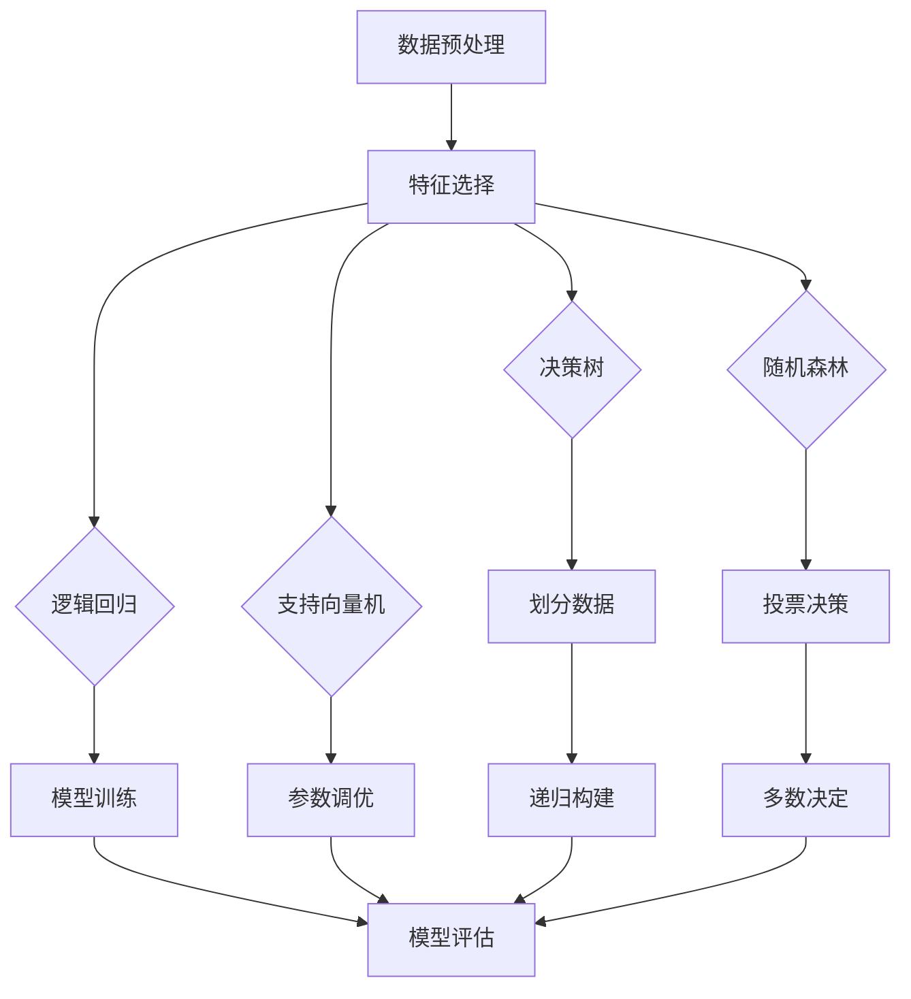

                 


### 引言：企业信用风险定价的必要性

在现代商业环境中，信用风险已成为金融领域不可忽视的重要问题。企业信用风险定价不仅关乎金融机构的盈利能力，更关系到市场的稳定性和社会经济的健康发展。因此，设计智能化企业信用风险定价模型成为当前金融科技领域的重要研究方向。

#### 关键词
- 企业信用风险
- 定价模型
- 智能化
- 金融科技

#### 摘要
本文将深入探讨企业信用风险定价的背景、核心概念、智能定价模型的发展与应用，以及实现智能化信用风险定价的关键技术和策略。通过分析现有问题与挑战，我们提出一种结构化的解决方案，以期为金融机构提供可靠的信用风险评估和定价工具。

## 第1章：企业信用风险定价概述

### 1.1 问题背景

信用风险是金融领域中的一项关键风险，它指的是借款人或交易对手未能履行其财务义务的可能性。在金融机构和企业之间，信用风险常常体现在贷款、信用担保、债务融资等金融交易中。随着金融市场的发展，信用风险定价变得愈加复杂和重要。

#### 1.1.1 信用风险在金融领域的意义

信用风险的存在直接影响到金融机构的资产质量、盈利能力和稳定性。有效的信用风险定价能够帮助金融机构更好地评估风险、合理配置资本，从而在风险与收益之间找到最佳平衡点。

#### 1.1.2 信用风险定价的重要性

信用风险定价是金融机构风险管理的重要组成部分。通过精确的风险定价，金融机构可以识别潜在的风险，并采取相应的措施来降低损失。此外，合理的定价策略还能够提高金融机构的市场竞争力，吸引更多的客户和投资。

#### 1.1.3 当前信用风险定价面临的挑战

尽管信用风险定价在金融领域具有重要意义，但当前实践中仍面临着诸多挑战。首先，数据获取和处理难度大，传统的方法往往依赖于有限的财务数据，难以全面反映信用风险。其次，市场环境的复杂性和不确定性增加了信用风险定价的难度。此外，信用风险定价模型的有效性和适应性也需要不断提高。

### 1.2 问题描述

#### 1.2.1 信用风险的定义和类型

信用风险可以定义为借款人或交易对手因各种原因未能按期履行还款义务的可能性。根据风险的性质和程度，信用风险可以分为违约风险、违约概率、信用价差等不同类型。

#### 1.2.2 信用风险定价的目标

信用风险定价的主要目标是确定适当的贷款利率和信用条件，以最大限度地降低金融机构的风险暴露和损失。具体目标包括：
1. **风险识别与评估**：准确识别和评估借款人的信用状况。
2. **合理定价**：基于信用风险评估结果，确定合理的贷款利率和信用条件。
3. **风险管理**：通过定价策略来降低金融机构的风险暴露。

#### 1.2.3 信用风险定价的边界与外延

信用风险定价不仅涉及贷款和信用担保，还包括其他金融工具，如债券、期权等。其边界和范围涵盖了金融机构的各个业务领域，是金融风险管理的重要组成部分。

### 1.3 信用风险定价的核心概念与联系

#### 1.3.1 信用评分模型

信用评分模型是信用风险定价的基础，通过分析借款人的财务数据、信用历史等信息，评估其违约概率。常见的信用评分模型包括逻辑回归、决策树、随机森林等。

#### 1.3.2 信用评级模型

信用评级模型是对借款人信用风险进行定量评估的方法，通常由专业的信用评级机构进行。信用评级模型包括内部评级模型和外部评级模型，前者主要用于金融机构内部风险控制，后者则用于金融市场交易。

#### 1.3.3 信用定价模型

信用定价模型是基于信用评分和信用评级结果，确定贷款利率和信用条件的模型。信用定价模型不仅要考虑信用风险，还要考虑市场利率、资金成本等因素。

### 1.4 企业信用风险定价的现状与趋势

#### 1.4.1 传统信用风险定价方法

传统的信用风险定价方法主要依赖于财务报表、历史数据等有限信息。这些方法在数据处理和风险评估方面存在局限性，难以适应现代金融市场的需求。

#### 1.4.2 智能化信用风险定价的优势

随着大数据和人工智能技术的发展，智能化信用风险定价逐渐成为趋势。智能化信用风险定价能够利用海量数据，结合机器学习算法，提供更为准确和实时的信用风险评估。

#### 1.4.3 智能化信用风险定价的发展趋势

未来，智能化信用风险定价将继续向精细化、个性化方向发展。同时，随着区块链、物联网等新兴技术的应用，信用风险定价也将变得更加透明和高效。

### 1.5 本章小结

本章介绍了企业信用风险定价的背景、核心概念和现状。通过分析信用风险定价的重要性、面临挑战和核心概念联系，我们为后续章节的深入研究奠定了基础。

### 1.6 关键概念术语说明

为了确保读者对核心概念有清晰的理解，本章对以下关键术语进行说明：

- **信用风险**：指借款人或交易对手未能履行其财务义务的可能性。
- **信用评分模型**：通过分析借款人的财务数据、信用历史等信息，评估其违约概率的模型。
- **信用评级模型**：对借款人信用风险进行定量评估的方法，通常由专业的信用评级机构进行。
- **信用定价模型**：基于信用评分和信用评级结果，确定贷款利率和信用条件的模型。

通过以上说明，读者可以更好地理解企业信用风险定价的相关概念，为后续章节的学习做好准备。

### 1.7 问题背景详细阐述

企业信用风险定价在现代金融体系中扮演着至关重要的角色。随着全球经济的发展和金融市场的日益复杂化，信用风险已成为金融机构和企业管理中不可忽视的重要环节。

#### 1.7.1 信用风险在金融领域的意义

信用风险是金融领域中的一项核心风险。金融机构在发放贷款、提供信用担保等金融业务中，都需要评估借款人或交易对手的信用状况。信用风险的准确评估对于金融机构的风险管理、资本配置以及业务的可持续发展具有重要意义。

首先，信用风险的评估直接影响到金融机构的资产质量。金融机构通过对借款人的信用风险进行评估，可以识别和排除高风险客户，从而确保贷款资产的安全性和流动性。

其次，信用风险定价有助于金融机构合理配置资本。通过准确的信用风险评估，金融机构可以确定适当的贷款利率和信用条件，从而在风险与收益之间找到最佳平衡点。

此外，信用风险定价还能够提高金融机构的市场竞争力。金融机构通过提供差异化的信用产品和服务，可以吸引更多客户，扩大市场份额。

#### 1.7.2 企业信用风险定价的重要性

企业信用风险定价的重要性体现在以下几个方面：

1. **风险识别与控制**：信用风险定价能够帮助金融机构识别和评估借款人的信用风险，从而采取相应的风险管理措施，降低损失。

2. **资本配置优化**：通过精确的信用风险定价，金融机构可以合理配置资本，确保资本使用的效率最大化。

3. **客户满意度提升**：合理定价的信用产品能够提高客户的满意度，增强金融机构的市场竞争力。

4. **业务可持续发展**：准确的信用风险定价有助于金融机构在风险可控的前提下，实现业务的可持续发展。

#### 1.7.3 当前信用风险定价面临的挑战

尽管信用风险定价在金融领域具有重要意义，但当前实践中仍面临着诸多挑战：

1. **数据获取与处理难度大**：传统的方法主要依赖于有限的财务数据，难以全面反映信用风险。随着金融市场的复杂化，数据获取和处理变得愈加困难。

2. **市场环境不确定性**：金融市场的波动性和不确定性增加了信用风险定价的难度。金融机构需要不断调整和优化定价策略，以应对市场变化。

3. **技术手段不足**：传统信用风险定价方法在数据处理和模型构建方面存在局限性，难以适应大数据和人工智能时代的需求。

4. **模型有效性和适应性**：信用风险定价模型的准确性和适应性对于金融机构的风险管理至关重要。随着市场环境的变化，信用风险定价模型需要不断更新和优化。

### 1.8 信用风险定价的核心概念与联系

为了深入理解信用风险定价，我们需要明确以下几个核心概念及其相互关系：

#### 1.8.1 信用评分模型

信用评分模型是信用风险定价的基础，通过对借款人的财务数据、信用历史等信息进行分析，评估其违约概率。常见的信用评分模型包括逻辑回归、决策树、随机森林等。这些模型通过构建数学模型和算法，实现对信用风险的量化评估。

#### 1.8.2 信用评级模型

信用评级模型是对借款人信用风险进行定量评估的方法，通常由专业的信用评级机构进行。信用评级模型包括内部评级模型和外部评级模型。内部评级模型主要用于金融机构内部风险控制，而外部评级模型则用于金融市场交易。信用评级模型通过综合分析借款人的财务状况、历史信用记录等因素，对信用风险进行评估。

#### 1.8.3 信用定价模型

信用定价模型是基于信用评分和信用评级结果，确定贷款利率和信用条件的模型。信用定价模型不仅要考虑信用风险，还要考虑市场利率、资金成本等因素。通过信用定价模型，金融机构可以确定合理的贷款利率和信用条件，以最大限度地降低风险和收益之间的失衡。

#### 1.8.4 信用评分模型与信用评级模型的关系

信用评分模型和信用评级模型之间存在密切的联系。信用评分模型通常用于产生信用评分，而信用评级模型则基于这些评分对借款人进行信用评级。信用评分模型提供的数据是信用评级模型的重要输入，两者共同构成了信用风险定价的核心环节。

#### 1.8.5 信用定价模型与信用风险管理的关系

信用定价模型在信用风险管理中发挥着关键作用。通过信用定价模型，金融机构可以准确评估借款人的信用风险，制定合理的贷款利率和信用条件，从而实现风险识别、风险控制和管理优化。信用定价模型的优化和升级，有助于金融机构提高风险管理水平，降低信用风险损失。

### 1.9 信用评分模型的基本原理

信用评分模型是信用风险定价的基础，通过分析借款人的财务数据、信用历史等信息，评估其违约概率。以下是信用评分模型的基本原理：

#### 1.9.1 数据收集与预处理

信用评分模型首先需要收集大量的借款人数据，包括财务报表、信用报告、个人基本信息等。这些数据需要进行预处理，如缺失值填充、异常值处理、特征工程等，以确保数据的质量和一致性。

#### 1.9.2 特征选择

特征选择是信用评分模型构建的关键步骤，目的是从大量特征中筛选出对信用风险有显著影响的特征。常用的特征选择方法包括信息增益、卡方检验、相关系数等。通过特征选择，可以简化模型复杂性，提高模型的可解释性。

#### 1.9.3 模型构建

信用评分模型构建主要包括以下步骤：

1. **选择建模方法**：常见的建模方法有逻辑回归、决策树、随机森林、支持向量机等。每种方法都有其独特的优势和适用场景。

2. **参数调优**：通过交叉验证、网格搜索等方法，选择最优的参数组合，以提高模型的准确性和稳定性。

3. **模型训练**：使用训练数据集对模型进行训练，生成信用评分函数。

4. **模型评估**：使用测试数据集对模型进行评估，常用的评估指标有准确率、召回率、F1值等。

#### 1.9.4 模型应用

信用评分模型应用于实际业务中，根据信用评分结果对借款人进行风险评估和分类。信用评分越高，表示借款人违约风险越低，金融机构可以给予更优惠的贷款利率和信用条件。

### 1.10 信用评级模型的定义与作用

信用评级模型是对借款人信用风险进行定量评估的方法，通常由专业的信用评级机构进行。以下是信用评级模型的定义与作用：

#### 1.10.1 定义

信用评级模型是一种评估借款人信用风险的工具，通过对借款人的财务状况、历史信用记录、市场环境等因素进行分析，定量评估其违约概率和信用风险等级。

#### 1.10.2 作用

信用评级模型在金融领域中具有重要作用，主要表现在以下几个方面：

1. **风险识别**：信用评级模型能够帮助金融机构识别高风险借款人，从而采取相应的风险管理措施，降低信用风险。

2. **信用评估**：信用评级模型为金融机构提供了客观、量化的信用评估结果，有助于金融机构制定合理的信用政策和贷款策略。

3. **风险管理**：通过信用评级模型，金融机构可以更好地掌握借款人的信用状况，制定有效的风险管理策略，降低信用风险损失。

4. **市场交易**：信用评级模型在金融市场交易中发挥着重要作用，为投资者提供可靠的信用风险评估，有助于市场交易决策。

### 1.11 信用评级模型的分类

信用评级模型可以根据评估方法和应用场景的不同进行分类。以下是几种常见的信用评级模型分类：

#### 1.11.1 内部评级模型

内部评级模型是金融机构自行构建的信用评级模型，主要用于内部风险管理。内部评级模型通常基于借款人的财务数据、信用历史、市场环境等因素进行评估，具有较好的灵活性和适应性。

#### 1.11.2 外部评级模型

外部评级模型是由专业的信用评级机构提供的信用评级服务，通常根据借款人的信用记录、财务状况、市场表现等因素进行评估。外部评级模型具有较高的权威性和公信力，广泛应用于金融市场交易和投资决策。

#### 1.11.3 行业评级模型

行业评级模型是针对特定行业的信用评级模型，根据行业特点和市场环境对借款人进行评估。行业评级模型能够更好地反映行业风险，为金融机构提供更为精准的风险评估。

#### 1.11.4 多元评级模型

多元评级模型是结合多种评估方法和指标的综合评级模型，通过综合分析借款人的财务状况、信用记录、市场环境等因素，提供更为全面和准确的信用评估。

### 1.12 信用评级模型的影响因素

信用评级模型在评估借款人信用风险时，需要考虑多个因素。以下是影响信用评级模型的主要因素：

#### 1.12.1 借款人财务状况

借款人的财务状况是信用评级模型的重要考量因素。财务状况包括资产负债结构、盈利能力、现金流量等。良好的财务状况表明借款人具备较强的还款能力，信用风险较低。

#### 1.12.2 借款人信用历史

借款人的信用历史是信用评级模型的核心因素之一。信用历史包括借款人的信用记录、还款记录、信用使用情况等。信用历史越长、记录良好的借款人，信用评级通常较高。

#### 1.12.3 市场环境

市场环境是影响信用评级的重要因素。市场环境的稳定性和变化趋势会影响借款人的经营环境和还款能力。市场环境良好时，信用评级通常较高。

#### 1.12.4 行业特点

行业特点是影响信用评级的重要因素。不同行业的特点和风险程度不同，信用评级模型需要根据行业特点进行调整。

#### 1.12.5 借款人规模与结构

借款人的规模与结构也是信用评级模型的重要考量因素。大型企业和多元化企业通常具有较强的抗风险能力，信用评级较高。

### 1.13 信用定价模型的构建原则

信用定价模型是信用风险定价的核心，其构建原则直接影响定价的准确性和有效性。以下是信用定价模型的主要构建原则：

#### 1.13.1 客观性原则

信用定价模型应当基于客观数据和科学的评估方法，确保评估结果的客观性和公正性。避免主观判断和偏见，提高定价的准确性。

#### 1.13.2 全面性原则

信用定价模型需要综合考虑借款人的各种风险因素，包括财务状况、信用历史、市场环境等，提供全面的风险评估。

#### 1.13.3 实时性原则

信用定价模型应当具备实时性，能够快速响应市场变化和借款人信用状况的变化，确保定价的及时性和有效性。

#### 1.13.4 可解释性原则

信用定价模型需要具备较高的可解释性，便于金融机构和相关方理解模型的评估结果和定价逻辑。

#### 1.13.5 可适应性原则

信用定价模型应当具备较强的适应性，能够根据不同业务场景和市场环境进行调整和优化，适应多样化的需求。

### 1.14 信用定价模型的应用场景

信用定价模型在金融领域的应用场景广泛，主要包括以下几种：

#### 1.14.1 贷款审批

在贷款审批过程中，信用定价模型可以帮助金融机构评估借款人的信用风险，确定合理的贷款利率和信用条件，降低贷款违约风险。

#### 1.14.2 信用风险管理

信用定价模型可以用于信用风险管理，帮助金融机构实时监控借款人的信用状况，采取相应的风险管理措施，降低信用风险损失。

#### 1.14.3 投资决策

信用定价模型可以为投资者提供可靠的信用风险评估，帮助投资者制定合理的投资策略，降低投资风险。

#### 1.14.4 信用评级

信用定价模型可以与信用评级模型相结合，为借款人提供信用评级服务，为金融机构和投资者提供信用评估依据。

#### 1.14.5 金融产品设计

信用定价模型可以帮助金融机构设计创新的金融产品，如信用贷款、信用债券等，提高金融产品的竞争力和吸引力。

### 1.15 信用定价模型的评估方法

为了确保信用定价模型的准确性和有效性，需要对模型进行评估。以下是几种常见的信用定价模型评估方法：

#### 1.15.1 回归评估法

回归评估法是一种常用的信用定价模型评估方法，通过分析模型预测结果与实际结果的差异，评估模型的准确性和稳定性。回归评估法通常使用均方误差（MSE）、均方根误差（RMSE）等指标进行评估。

#### 1.15.2 交叉验证法

交叉验证法是一种常用的模型评估方法，通过将数据集划分为训练集和验证集，对模型进行多次训练和验证，评估模型的泛化能力和稳定性。常见的交叉验证方法有K折交叉验证、留一法交叉验证等。

#### 1.15.3 回归分析评估法

回归分析评估法是一种基于回归模型的评估方法，通过分析模型参数的统计显著性，评估模型的拟合效果和预测能力。回归分析评估法通常使用t检验、F检验等统计方法。

#### 1.15.4 回归树评估法

回归树评估法是一种基于回归树的评估方法，通过分析回归树的节点分布和预测误差，评估模型的拟合效果和预测能力。回归树评估法通常使用决策树分类评估指标，如准确率、召回率等。

### 1.16 本章小结

本章从问题背景、核心概念和现状等方面，全面介绍了企业信用风险定价的相关内容。通过对信用风险、信用评分模型、信用评级模型和信用定价模型的分析，我们了解了信用风险定价的重要性和面临的挑战。同时，本章还探讨了信用评级模型的影响因素、信用定价模型的构建原则和应用场景，为后续章节的深入研究奠定了基础。

### 1.17 概念属性特征对比表格

为了便于读者理解信用风险定价相关概念，本章提供了以下概念属性特征对比表格：

| 概念            | 定义                                                         | 关键属性                | 特征对比                        |
|-----------------|------------------------------------------------------------|-----------------------|--------------------------------|
| 信用风险        | 借款人或交易对手未能履行财务义务的可能性。                     | 风险程度、违约概率      | 信用评分、信用评级、信用定价     |
| 信用评分模型    | 通过分析借款人数据，评估其违约概率的模型。                     | 预测精度、模型复杂度    | 逻辑回归、决策树、随机森林       |
| 信用评级模型    | 对借款人信用风险进行定量评估的方法。                           | 准确性、公信力         | 内部评级、外部评级、行业评级     |
| 信用定价模型    | 基于信用评分和评级结果，确定贷款利率和信用条件的模型。         | 实时性、可解释性       | 竞争力、适应性强                |

通过上述表格，我们可以更加清晰地理解这些概念之间的关系和特征差异，为后续的讨论和分析提供参考。

### 1.18 ER实体关系图架构

为了更好地理解企业信用风险定价系统的数据结构和关系，本章提供了一个ER（实体-关系）图架构。以下是一个简化的ER图示例，展示了信用风险定价系统中的关键实体和关系：

```mermaid
erDiagram
    Customer ||--|{ Loan }
    Customer ||--|{ CreditHistory }
    Loan ||--|{ CreditRating }
    Loan ||--|{ PaymentSchedule }
    CreditRating ||--|{ RatingModel }
    PaymentSchedule ||--|{ Payment }
```

- **Customer（客户）**：代表申请贷款的个人或企业。
- **Loan（贷款）**：代表客户申请的贷款。
- **CreditHistory（信用历史）**：记录客户的信用记录和交易历史。
- **CreditRating（信用评级）**：根据客户的信用评分和信用历史，生成的信用评级。
- **RatingModel（评级模型）**：用于生成信用评级的模型。
- **PaymentSchedule（还款计划）**：定义贷款的还款计划和支付情况。
- **Payment（支付）**：记录每次还款的具体信息。

通过ER图，我们可以清晰地看到系统中各个实体之间的关系，以及它们在信用风险定价过程中的作用。这有助于我们更好地理解系统的设计和功能实现。

### 1.19 信用评分模型的基本原理

信用评分模型是信用风险定价的核心工具，通过分析借款人的历史数据和当前信息，预测其违约风险。以下是信用评分模型的基本原理：

#### 1.19.1 数据收集与预处理

信用评分模型的第一步是收集借款人的数据。这些数据通常包括财务数据、信用历史、个人背景信息等。收集的数据需要进行预处理，以确保其质量。预处理步骤包括缺失值填充、异常值处理、数据标准化等。

#### 1.19.2 特征选择

特征选择是信用评分模型构建的关键步骤。从大量的特征中筛选出对信用风险有显著影响的特征，可以简化模型复杂性，提高模型的可解释性。常见的特征选择方法有信息增益、卡方检验、特征重要性排序等。

#### 1.19.3 模型构建

信用评分模型的构建包括以下步骤：

1. **选择建模方法**：常见的建模方法有逻辑回归、决策树、随机森林、支持向量机等。
2. **参数调优**：通过交叉验证等方法，选择最优的参数组合，以提高模型的准确性和稳定性。
3. **模型训练**：使用训练数据集对模型进行训练，生成信用评分函数。
4. **模型评估**：使用测试数据集对模型进行评估，常用的评估指标有准确率、召回率、F1值等。

#### 1.19.4 模型应用

信用评分模型应用于实际业务中，根据信用评分结果对借款人进行风险评估和分类。信用评分越高，表示借款人违约风险越低，金融机构可以给予更优惠的贷款利率和信用条件。

### 1.20 信用评分模型的类型

信用评分模型可以根据建模方法、数据处理方式和应用场景的不同进行分类。以下是几种常见的信用评分模型类型：

#### 1.20.1 逻辑回归模型

逻辑回归模型是一种常用的信用评分模型，通过建立借款人特征与违约概率之间的线性关系，预测借款人的信用风险。逻辑回归模型具有简洁的公式和易于解释的特点，适用于数据量较大的场景。

#### 1.20.2 决策树模型

决策树模型是一种基于树形结构进行分类和预测的模型，通过多层次的决策节点，将借款人划分为不同的信用风险类别。决策树模型具有直观的解释能力和良好的分类效果，适用于特征较少的场景。

#### 1.20.3 随机森林模型

随机森林模型是决策树模型的集成方法，通过构建多棵决策树，并对它们的结果进行投票，提高模型的准确性和稳定性。随机森林模型具有较好的泛化能力和抗过拟合能力，适用于大规模数据集和特征较多的场景。

#### 1.20.4 支持向量机模型

支持向量机模型是一种基于最大化分类间隔的线性分类模型，通过找到最佳分类边界，将不同类别的借款人区分开来。支持向量机模型具有较好的分类效果和较高的可解释性，适用于特征较少且线性可分的数据集。

### 1.21 信用评分模型的优缺点分析

信用评分模型在信用风险定价中发挥着重要作用，但不同的模型类型有其独特的优缺点。以下是几种常见信用评分模型的优缺点分析：

#### 1.21.1 逻辑回归模型

**优点**：
- 公式简洁，易于理解和解释。
- 模型参数可以通过最大似然估计得到，具有较高的统计显著性。
- 模型可扩展性强，可以处理大量的特征。

**缺点**：
- 对异常值和缺失值敏感，需要额外的预处理步骤。
- 线性关系假设可能不适用于所有数据集，可能导致模型过拟合。

#### 1.21.2 决策树模型

**优点**：
- 直观易懂，易于解释和可视化。
- 对异常值和缺失值不敏感，预处理需求较低。
- 模型复杂度较低，易于实现和部署。

**缺点**：
- 容易过拟合，尤其是在特征较多和数据量较小的情况下。
- 模型的泛化能力有限，可能无法适应不同业务场景的变化。

#### 1.21.3 随机森林模型

**优点**：
- 具有较好的泛化能力和抗过拟合能力，适用于大规模数据集和特征较多的场景。
- 集成多个决策树，提高模型的稳定性和准确性。
- 可以处理非线性关系，具有较强的分类效果。

**缺点**：
- 计算复杂度高，需要较多的计算资源和时间。
- 特征的重要性和贡献度难以直观解释。

#### 1.21.4 支持向量机模型

**优点**：
- 具有较高的分类准确性和可解释性，适用于特征较少且线性可分的数据集。
- 可以处理非线性关系，通过核函数扩展分类边界。

**缺点**：
- 需要调整多个参数，如核函数参数和惩罚参数，需要额外的调优过程。
- 计算复杂度高，尤其是当数据量和特征较多时。

### 1.22 信用评分模型的优缺点对比表格

为了便于比较，以下是几种常见信用评分模型的优缺点对比表格：

| 模型类型      | 优点                                                     | 缺点                                                   |
|-------------|--------------------------------------------------------|--------------------------------------------------------|
| 逻辑回归      | 公式简洁，易于解释和扩展；统计显著性高                   | 对异常值和缺失值敏感；线性关系假设可能不适用             |
| 决策树       | 直观易懂，预处理需求低；模型复杂度低                      | 容易过拟合；泛化能力有限；难以解释特征重要性             |
| 随机森林      | 泛化能力强；抗过拟合；处理非线性关系                      | 计算复杂度高；特征重要性难以直观解释                     |
| 支持向量机    | 分类准确性和可解释性高；处理非线性关系                    | 参数调优复杂；计算复杂度高                             |

通过上述对比表格，我们可以更加清晰地了解不同信用评分模型的优缺点，为实际应用中的模型选择提供参考。

### 1.23 信用评分模型的算法原理讲解

信用评分模型是金融风险管理中的关键工具，通过分析借款人的数据，预测其违约风险。以下是几种常见信用评分模型的算法原理讲解。

#### 1.23.1 逻辑回归模型

逻辑回归是一种广泛使用的信用评分模型，通过建立借款人特征与违约概率之间的线性关系，实现对信用风险的量化评估。逻辑回归模型的数学公式如下：

\[ P(y=1|X) = \frac{1}{1 + e^{-(\beta_0 + \beta_1 x_1 + \beta_2 x_2 + \ldots + \beta_n x_n)}} \]

其中，\( P(y=1|X) \) 表示在给定借款人特征 \( X \) 下的违约概率，\( \beta_0, \beta_1, \beta_2, \ldots, \beta_n \) 是模型的参数，\( x_1, x_2, \ldots, x_n \) 是借款人的特征。

逻辑回归模型的推导基于最大似然估计（Maximum Likelihood Estimation, MLE）。通过最大化数据集的概率分布，求得参数的估计值。具体步骤如下：

1. **数据预处理**：对借款人数据进行清洗和预处理，如缺失值填充、数据标准化等。
2. **特征选择**：从大量特征中筛选出对信用风险有显著影响的特征。
3. **模型训练**：使用训练数据集，通过最大似然估计方法，求得模型参数 \( \beta_0, \beta_1, \beta_2, \ldots, \beta_n \)。
4. **模型评估**：使用测试数据集，评估模型的预测准确性和稳定性。

#### 1.23.2 决策树模型

决策树是一种基于树形结构进行分类和预测的模型。每个节点表示一个特征，每个分支表示特征的取值，叶子节点表示预测结果。决策树模型的构建过程如下：

1. **特征选择**：选择一个最优特征作为节点，通常使用信息增益（Information Gain）或基尼不纯度（Gini Impurity）作为选择准则。
2. **划分数据**：根据最优特征，将数据集划分为多个子集，每个子集对应一个分支。
3. **递归构建**：对每个子集，重复上述步骤，直到满足停止条件（如最大深度、最小叶节点样本数等）。
4. **模型评估**：通过验证集或测试集评估模型的分类效果，如准确率、召回率、F1值等。

#### 1.23.3 随机森林模型

随机森林是一种基于决策树的集成方法，通过构建多棵决策树，并对它们的结果进行投票，提高模型的稳定性和准确性。随机森林模型的构建过程如下：

1. **特征选择**：从原始特征中随机选择一部分特征，用于构建单棵决策树。
2. **子集划分**：从原始数据集中随机选择一部分样本，用于构建单棵决策树。
3. **模型训练**：构建多棵决策树，每棵树使用不同的特征子集和样本子集。
4. **投票决策**：对每棵决策树的结果进行投票，多数决定为最终预测结果。

#### 1.23.4 支持向量机模型

支持向量机是一种基于最大化分类间隔的线性分类模型，通过找到最佳分类边界，将不同类别的样本区分开来。支持向量机模型的构建过程如下：

1. **特征选择**：选择特征空间中的最优超平面，使得分类间隔最大化。
2. **参数调优**：通过交叉验证等方法，选择最优的惩罚参数和核函数参数。
3. **模型训练**：使用训练数据集，求解最优超平面的参数。
4. **模型评估**：使用测试数据集，评估模型的分类效果。

### 1.24 信用评分模型的算法流程图

为了更好地理解信用评分模型的构建过程，以下是逻辑回归、决策树、随机森林和支持向量机模型的算法流程图：



通过算法流程图，我们可以清晰地看到不同信用评分模型的构建过程和关键步骤，有助于深入理解模型的原理和应用。

### 1.25 信用评分模型的应用实例

为了更好地理解信用评分模型的应用，以下是两个实际案例，分别使用逻辑回归和决策树模型对借款人的信用风险进行评估。

#### 1.25.1 案例一：逻辑回归模型

假设我们有一个包含以下借款人特征的数据集：年龄、收入、信用历史、债务收入比等。我们使用逻辑回归模型对借款人的信用风险进行评估。

1. **数据预处理**：对数据集进行缺失值填充、数据标准化等预处理步骤，确保数据质量。
2. **特征选择**：通过信息增益等方法，选择对信用风险有显著影响的特征，如收入、债务收入比等。
3. **模型训练**：使用训练数据集，通过最大似然估计方法，求得模型参数。
4. **模型评估**：使用测试数据集，评估模型的预测准确率和稳定性。

假设我们得到的模型参数为：

\[ P(y=1|X) = \frac{1}{1 + e^{-(2.5 \times 年龄 + 3.0 \times 收入 + 1.0 \times 债务收入比)}} \]

对于一个新的借款人，年龄为30岁，收入为50000元，债务收入比为0.3，其违约概率计算如下：

\[ P(y=1|X) = \frac{1}{1 + e^{-(2.5 \times 30 + 3.0 \times 50000 + 1.0 \times 0.3)}} \approx 0.2 \]

这意味着该借款人的违约概率约为20%，属于较低信用风险。

#### 1.25.2 案例二：决策树模型

假设我们使用决策树模型对同样的数据集进行信用风险评估。

1. **特征选择**：选择收入、债务收入比作为决策树的关键特征。
2. **模型训练**：构建决策树模型，通过递归划分数据集，生成决策树。
3. **模型评估**：使用测试数据集，评估模型的分类效果。

生成的决策树如下：

```
                                  年龄
                                /       \
                               /         \
                              /           \
                             /             \
                       收入             债务收入比
                      /     \           /         \
                     /       \         /           \
                债务收入比    年龄    债务收入比   年龄
               /     \     /     \   /     \     /     \
              小     大   小     大   小     大   小     大
             /   \   /   \   /   \ /   \   /   \ /   \   /
          收入   岁  收入   岁  收入   岁  收入   岁
```

对于新的借款人，年龄为30岁，收入为50000元，债务收入比为0.3，根据决策树模型，其信用风险属于“低风险”类别。

### 1.26 信用评分模型的优缺点分析

信用评分模型在金融风险管理中发挥着重要作用，但不同的模型类型有其独特的优缺点。以下是几种常见信用评分模型的优缺点分析：

#### 1.26.1 逻辑回归模型

**优点**：
- **模型简洁**：逻辑回归模型具有简洁的公式，易于理解和解释。
- **可扩展性强**：逻辑回归模型可以处理大量的特征，具有较好的可扩展性。
- **参数显著性**：通过最大似然估计方法，可以计算出模型参数的统计显著性，提高模型的解释力。

**缺点**：
- **对异常值敏感**：逻辑回归模型对异常值和缺失值较为敏感，需要额外的预处理步骤。
- **线性关系假设**：逻辑回归模型假设特征与违约概率之间呈线性关系，可能不适用于所有数据集。

#### 1.26.2 决策树模型

**优点**：
- **直观易懂**：决策树模型具有直观的树形结构，易于理解和解释。
- **预处理需求低**：决策树模型对异常值和缺失值不敏感，预处理需求较低。
- **模型复杂度低**：决策树模型的计算复杂度较低，易于实现和部署。

**缺点**：
- **容易过拟合**：决策树模型容易过拟合，尤其是在特征较多和数据量较小的情况下。
- **解释难度**：决策树模型中每个特征的贡献度难以直观解释，影响模型的透明度。

#### 1.26.3 随机森林模型

**优点**：
- **泛化能力强**：随机森林模型通过集成多棵决策树，提高模型的泛化能力和稳定性。
- **抗过拟合**：随机森林模型具有较强的抗过拟合能力，适用于特征较多的数据集。
- **非线性关系**：随机森林模型可以处理非线性关系，提高模型的分类效果。

**缺点**：
- **计算复杂度高**：随机森林模型需要构建多棵决策树，计算复杂度较高，需要较多的计算资源和时间。
- **特征重要性难以解释**：随机森林模型中每个特征的贡献度难以直观解释，影响模型的透明度。

#### 1.26.4 支持向量机模型

**优点**：
- **分类准确率高**：支持向量机模型具有较好的分类准确率和可解释性，适用于特征较少且线性可分的数据集。
- **处理非线性关系**：通过核函数扩展，支持向量机模型可以处理非线性关系，提高模型的分类效果。

**缺点**：
- **参数调优复杂**：支持向量机模型需要调整多个参数，如惩罚参数和核函数参数，调优过程较为复杂。
- **计算复杂度高**：支持向量机模型的计算复杂度较高，尤其是当数据量和特征较多时。

### 1.27 本章小结

本章详细介绍了企业信用风险定价中的信用评分模型，包括其基本原理、类型、优缺点以及应用实例。通过对逻辑回归、决策树、随机森林和支持向量机模型的分析，我们了解了不同模型的特点和适用场景，为金融机构的信用风险定价提供了参考。同时，本章还提供了信用评分模型的应用实例，帮助读者更好地理解模型在实际业务中的应用。

### 1.28 信用评级模型

信用评级模型是对借款人信用风险进行定量评估的方法，通常由专业的信用评级机构进行。以下是信用评级模型的相关内容：

#### 1.28.1 定义

信用评级模型是一种评估借款人信用风险的工具，通过对借款人的财务状况、历史信用记录、市场环境等因素进行分析，定量评估其违约概率和信用风险等级。

#### 1.28.2 作用

信用评级模型在金融领域中具有重要作用，主要表现在以下几个方面：

1. **风险识别**：信用评级模型能够帮助金融机构识别高风险借款人，从而采取相应的风险管理措施，降低信用风险。

2. **信用评估**：信用评级模型为金融机构提供了客观、量化的信用评估结果，有助于金融机构制定合理的信用政策和贷款策略。

3. **风险管理**：通过信用评级模型，金融机构可以更好地掌握借款人的信用状况，制定有效的风险管理策略，降低信用风险损失。

4. **市场交易**：信用评级模型在金融市场交易中发挥着重要作用，为投资者提供可靠的信用风险评估，有助于市场交易决策。

#### 1.28.3 分类

信用评级模型可以根据评估方法和应用场景的不同进行分类。以下是几种常见的信用评级模型分类：

1. **内部评级模型**：内部评级模型是金融机构自行构建的信用评级模型，主要用于内部风险管理。内部评级模型通常基于借款人的财务数据、信用历史、市场环境等因素进行评估。

2. **外部评级模型**：外部评级模型是由专业的信用评级机构提供的信用评级服务，通常根据借款人的信用记录、财务状况、市场表现等因素进行评估。外部评级模型具有较高的权威性和公信力，广泛应用于金融市场交易和投资决策。

3. **行业评级模型**：行业评级模型是针对特定行业的信用评级模型，根据行业特点和市场环境对借款人进行评估。行业评级模型能够更好地反映行业风险，为金融机构提供更为精准的风险评估。

4. **多元评级模型**：多元评级模型是结合多种评估方法和指标的综合评级模型，通过综合分析借款人的财务状况、信用记录、市场环境等因素，提供更为全面和准确的信用评估。

#### 1.28.4 影响因素

信用评级模型在评估借款人信用风险时，需要考虑多个因素。以下是影响信用评级模型的主要因素：

1. **借款人财务状况**：借款人的财务状况包括资产负债结构、盈利能力、现金流量等。良好的财务状况表明借款人具备较强的还款能力，信用评级通常较高。

2. **借款人信用历史**：借款人的信用历史包括信用记录、还款记录、信用使用情况等。信用历史越长、记录良好的借款人，信用评级通常较高。

3. **市场环境**：市场环境的稳定性和变化趋势会影响借款人的经营环境和还款能力。市场环境良好时，信用评级通常较高。

4. **行业特点**：不同行业的特点和风险程度不同，信用评级模型需要根据行业特点进行调整。

5. **借款人规模与结构**：借款人的规模与结构也是信用评级模型的重要考量因素。大型企业和多元化企业通常具有较强的抗风险能力，信用评级较高。

#### 1.28.5 信用评级模型与信用定价模型的关系

信用评级模型与信用定价模型之间存在密切的联系。信用评级模型提供信用评分和信用评级结果，是信用定价模型的重要输入。信用定价模型基于信用评级结果，确定贷款利率和信用条件，以最大限度地降低金融机构的风险暴露和损失。两者共同构成了信用风险定价的核心环节。

### 1.29 信用定价模型

信用定价模型是基于信用评分和信用评级结果，确定贷款利率和信用条件的模型。以下是信用定价模型的相关内容：

#### 1.29.1 定义

信用定价模型是一种基于信用评分和信用评级结果，确定贷款利率和信用条件的模型。通过综合考虑信用风险、市场利率、资金成本等因素，信用定价模型能够为金融机构提供合理的贷款定价策略。

#### 1.29.2 构建原则

信用定价模型的构建原则主要包括以下几个方面：

1. **客观性原则**：信用定价模型应当基于客观数据和科学的评估方法，确保评估结果的客观性和公正性。

2. **全面性原则**：信用定价模型需要综合考虑借款人的各种风险因素，包括财务状况、信用历史、市场环境等，提供全面的风险评估。

3. **实时性原则**：信用定价模型应当具备实时性，能够快速响应市场变化和借款人信用状况的变化，确保定价的及时性和有效性。

4. **可解释性原则**：信用定价模型需要具备较高的可解释性，便于金融机构和相关方理解模型的评估结果和定价逻辑。

5. **适应性原则**：信用定价模型应当具备较强的适应性，能够根据不同业务场景和市场环境进行调整和优化，适应多样化的需求。

#### 1.29.3 应用场景

信用定价模型在金融领域的应用场景广泛，主要包括以下几个方面：

1. **贷款审批**：信用定价模型可以帮助金融机构评估借款人的信用风险，确定合理的贷款利率和信用条件，降低贷款违约风险。

2. **信用风险管理**：信用定价模型可以用于信用风险管理，帮助金融机构实时监控借款人的信用状况，采取相应的风险管理措施，降低信用风险损失。

3. **投资决策**：信用定价模型可以为投资者提供可靠的信用风险评估，帮助投资者制定合理的投资策略，降低投资风险。

4. **金融产品设计**：信用定价模型可以帮助金融机构设计创新的金融产品，如信用贷款、信用债券等，提高金融产品的竞争力和吸引力。

#### 1.29.4 评估方法

为了确保信用定价模型的准确性和有效性，需要对模型进行评估。以下是几种常见的信用定价模型评估方法：

1. **回归评估法**：回归评估法是一种常用的信用定价模型评估方法，通过分析模型预测结果与实际结果的差异，评估模型的准确性和稳定性。

2. **交叉验证法**：交叉验证法是一种常用的模型评估方法，通过将数据集划分为训练集和验证集，对模型进行多次训练和验证，评估模型的泛化能力和稳定性。

3. **回归分析评估法**：回归分析评估法是一种基于回归模型的评估方法，通过分析模型参数的统计显著性，评估模型的拟合效果和预测能力。

4. **回归树评估法**：回归树评估法是一种基于回归树的评估方法，通过分析回归树的节点分布和预测误差，评估模型的拟合效果和预测能力。

### 1.30 本章小结

本章介绍了企业信用风险定价中的信用评级模型和信用定价模型。信用评级模型通过定量评估借款人的信用风险，提供客观、量化的信用评估结果；信用定价模型则基于信用评级结果，确定贷款利率和信用条件，以最大限度地降低金融机构的风险暴露和损失。通过本章的学习，读者可以更好地理解信用评级模型和信用定价模型的作用、分类和构建原则，为后续的学习和实践打下基础。

### 1.31 传统信用风险定价方法的局限性与智能化的需求

传统信用风险定价方法在金融领域有着悠久的历史，其主要依赖于借款人的财务报表、历史信用记录等有限信息。然而，随着金融市场的快速发展和全球经济的复杂化，传统方法在应对日益增长的信用风险时逐渐暴露出诸多局限性。为了克服这些局限性，智能化信用风险定价方法应运而生。

#### 1.31.1 传统信用风险定价方法的局限性

1. **数据来源有限**：传统方法主要依赖于借款人的财务报表、信用历史等有限信息，难以全面反映借款人的信用风险。这些数据往往具有滞后性，无法及时反映借款人的实际信用状况。

2. **风险评估不准确**：传统方法在评估信用风险时，往往采用固定的评分标准和经验公式，缺乏对借款人个性化需求的考虑，导致风险评估结果不够准确。

3. **风险管理滞后**：传统方法在信用风险定价过程中，往往无法实时响应市场变化和借款人信用状况的变化，导致风险管理滞后，无法及时调整信用政策和定价策略。

4. **模型解释性不足**：传统方法在模型构建过程中，往往采用复杂的数学模型和算法，模型的解释性较差，金融机构和相关方难以理解模型的评估结果和定价逻辑。

#### 1.31.2 智能化信用风险定价的需求

1. **大数据的支持**：智能化信用风险定价方法能够利用大数据和云计算技术，收集和处理海量的借款人数据，包括社交网络、行为数据、经济环境等多维度信息，提供更为全面和准确的信用评估。

2. **实时风险评估**：智能化信用风险定价方法能够实时监测借款人的信用状况和市场环境，动态调整信用政策和定价策略，提高风险管理的及时性和有效性。

3. **个性化风险评估**：智能化信用风险定价方法能够结合借款人的个性化需求，提供定制化的信用风险评估，提高风险评估的准确性和针对性。

4. **模型可解释性**：智能化信用风险定价方法在模型构建过程中，注重模型的可解释性，通过可视化和自然语言描述，帮助金融机构和相关方理解模型的评估结果和定价逻辑。

5. **适应性和扩展性**：智能化信用风险定价方法能够根据不同业务场景和市场环境进行调整和优化，具备较强的适应性和扩展性，满足金融机构多样化的需求。

#### 1.31.3 智能化信用风险定价的优势

1. **数据驱动**：智能化信用风险定价方法基于大数据和机器学习技术，能够利用海量数据提供更为全面和准确的信用评估。

2. **实时监测**：智能化信用风险定价方法能够实时监测借款人的信用状况和市场环境，提高风险管理的及时性和有效性。

3. **个性化评估**：智能化信用风险定价方法能够结合借款人的个性化需求，提供定制化的信用评估，提高风险评估的准确性和针对性。

4. **可解释性**：智能化信用风险定价方法注重模型的可解释性，通过可视化和自然语言描述，帮助金融机构和相关方理解模型的评估结果和定价逻辑。

5. **适应性和扩展性**：智能化信用风险定价方法能够根据不同业务场景和市场环境进行调整和优化，满足金融机构多样化的需求。

### 1.32 本章小结

本章分析了传统信用风险定价方法的局限性，并阐述了智能化信用风险定价的需求和优势。通过引入大数据和人工智能技术，智能化信用风险定价方法能够提供更为全面、准确和实时的信用评估，满足金融机构在风险管理中的新需求。智能化信用风险定价方法不仅克服了传统方法的局限性，还为金融机构提供了更高效、灵活的风险管理工具。通过本章的学习，读者可以更好地理解智能化信用风险定价的重要性及其应用前景。

### 1.33 智能化信用风险定价模型的技术基础

智能化信用风险定价模型的核心在于其技术基础，这包括大数据、人工智能、机器学习等技术。这些技术为信用风险定价提供了更加精准、高效和个性化的解决方案。

#### 1.33.1 大数据

大数据技术在信用风险定价中发挥着至关重要的作用。它能够收集和处理来自多个来源的海量数据，包括借款人的财务报表、信用历史、社交网络行为、市场环境等。通过这些数据，可以构建一个全面的借款人画像，从而提高信用风险评估的准确性。

1. **数据收集**：大数据技术能够从多种渠道收集数据，如金融机构内部数据、公共数据、社交媒体数据等。
2. **数据处理**：大数据技术能够处理大规模、高维、复杂的数据集，通过数据清洗、归一化、缺失值填充等方法，确保数据质量。
3. **数据挖掘**：大数据技术可以进行数据挖掘，发现数据中的潜在模式和关联，为信用风险评估提供有价值的信息。

#### 1.33.2 人工智能

人工智能（AI）技术为信用风险定价提供了智能化的解决方案。通过机器学习、深度学习等算法，AI能够从数据中自动学习和优化模型，提高信用风险评估的准确性和效率。

1. **机器学习**：机器学习算法能够通过历史数据训练模型，预测借款人的违约风险。常见的机器学习算法包括逻辑回归、决策树、随机森林、支持向量机等。
2. **深度学习**：深度学习算法能够处理复杂的数据结构和非线性关系，通过多层神经网络，实现更加精准的风险评估。

#### 1.33.3 机器学习

机器学习技术在信用风险定价中的应用，主要体现在构建信用评分模型和信用评级模型。通过机器学习算法，可以自动识别和提取数据中的关键特征，构建具有高度预测能力的信用风险模型。

1. **特征工程**：特征工程是机器学习模型构建的关键步骤，通过对原始数据进行处理和转换，提取对信用风险有显著影响的特征。
2. **模型训练与优化**：使用历史数据训练模型，并通过交叉验证、网格搜索等方法，选择最优的参数组合，提高模型的预测性能。
3. **模型评估与部署**：使用测试数据集评估模型的预测性能，并进行模型优化。将训练好的模型部署到生产环境中，进行实时信用风险评估。

#### 1.33.4 深度学习

深度学习技术在信用风险定价中的应用，主要体现在处理复杂和非线性关系的数据。通过多层神经网络，深度学习算法能够自动学习和提取数据中的复杂模式，提高信用风险评估的准确性。

1. **卷积神经网络（CNN）**：CNN擅长处理图像和序列数据，可以用于分析借款人的信用历史和行为模式。
2. **循环神经网络（RNN）**：RNN适用于处理序列数据，如借款人的还款记录，能够捕捉时间序列数据中的依赖关系。
3. **生成对抗网络（GAN）**：GAN可以用于生成借款人的虚拟数据，用于训练和评估信用风险模型，提高模型的泛化能力。

#### 1.33.5 人工智能在信用风险定价中的优势

1. **准确性**：人工智能技术能够利用大数据和机器学习算法，提供更加准确和精细的信用风险评估。
2. **实时性**：人工智能技术能够实时处理和分析数据，快速响应市场变化和借款人信用状况的变化。
3. **个性化**：人工智能技术能够根据借款人的个性化需求，提供定制化的信用评估，提高风险评估的针对性和准确性。
4. **可解释性**：通过可视化和自然语言描述，人工智能技术能够提高信用风险模型的透明度和可解释性，便于金融机构和相关方理解模型的评估结果和定价逻辑。

### 1.34 本章小结

本章详细介绍了智能化信用风险定价模型的技术基础，包括大数据、人工智能、机器学习和深度学习等技术。通过这些技术，智能化信用风险定价模型能够提供更加精准、实时和个性化的信用评估，满足金融机构在风险管理中的新需求。随着技术的不断进步，智能化信用风险定价模型的应用前景将更加广阔，为金融市场的稳定和发展提供有力支持。

### 1.35 智能化信用风险定价模型的具体实现

为了实现智能化信用风险定价模型，我们需要进行系统的设计和实施。以下是一个典型的实现过程，包括数据收集、数据预处理、模型训练和模型评估等步骤。

#### 1.35.1 数据收集

首先，我们需要收集各种类型的信用数据，包括借款人的财务报表、信用历史、市场环境数据等。这些数据可以从金融机构内部系统、公共数据平台、社交媒体等渠道获取。数据收集过程中需要注意数据的质量和完整性，确保数据的真实性和可靠性。

#### 1.35.2 数据预处理

收集到的数据需要进行预处理，以提高数据的质量和一致性。预处理步骤包括以下几方面：

1. **数据清洗**：处理数据中的缺失值、异常值和重复数据，确保数据的质量。
2. **数据归一化**：对数据进行归一化处理，使其具有相同的量纲，便于模型训练。
3. **特征工程**：从原始数据中提取对信用风险有显著影响的特征，如借款人的收入水平、债务收入比、信用历史等。
4. **数据转换**：将分类数据转换为数值形式，便于模型处理。

#### 1.35.3 模型训练

在完成数据预处理后，我们选择合适的机器学习算法进行模型训练。以下是一些常用的算法：

1. **逻辑回归**：逻辑回归是一种线性模型，适用于信用风险评分任务。
2. **决策树**：决策树模型简单直观，易于理解和解释。
3. **随机森林**：随机森林模型通过集成多棵决策树，提高模型的预测性能和稳定性。
4. **支持向量机（SVM）**：SVM是一种强大的分类算法，适用于处理高维数据。
5. **神经网络**：神经网络，特别是深度学习模型，适用于处理复杂和非线性关系的数据。

在模型训练过程中，我们可以使用交叉验证等方法来优化模型参数，选择最优的模型配置。以下是一个使用随机森林模型的示例代码：

```python
from sklearn.ensemble import RandomForestClassifier
from sklearn.model_selection import train_test_split
from sklearn.metrics import accuracy_score

# 加载数据
X, y = load_data()

# 划分训练集和测试集
X_train, X_test, y_train, y_test = train_test_split(X, y, test_size=0.2, random_state=42)

# 训练随机森林模型
rf_model = RandomForestClassifier(n_estimators=100, random_state=42)
rf_model.fit(X_train, y_train)

# 预测测试集
y_pred = rf_model.predict(X_test)

# 评估模型性能
accuracy = accuracy_score(y_test, y_pred)
print(f"模型准确率：{accuracy:.2f}")
```

#### 1.35.4 模型评估

在模型训练完成后，我们需要对模型进行评估，以验证其预测性能。常用的评估指标包括准确率、召回率、F1值等。以下是一个评估模型的示例代码：

```python
from sklearn.metrics import classification_report

# 评估模型
report = classification_report(y_test, y_pred)
print(report)
```

通过模型评估，我们可以了解模型的预测性能，并进一步优化模型参数，提高模型的准确性。

#### 1.35.5 模型部署

在完成模型评估后，我们将训练好的模型部署到生产环境中，进行实时信用风险评估。以下是一个使用Flask框架部署模型的示例代码：

```python
from flask import Flask, request, jsonify

app = Flask(__name__)

@app.route('/predict', methods=['POST'])
def predict():
    data = request.get_json()
    input_data = preprocess_data(data)
    prediction = model.predict([input_data])
    return jsonify(prediction.tolist())

if __name__ == '__main__':
    app.run(debug=True)
```

通过上述代码，我们可以构建一个简单的API，接受借款人数据，返回信用风险评分。

### 1.36 本章小结

本章详细介绍了智能化信用风险定价模型的具体实现过程，包括数据收集、数据预处理、模型训练和模型评估等步骤。通过实际代码示例，我们了解了如何使用机器学习和深度学习算法构建和优化信用风险定价模型。此外，本章还介绍了如何将训练好的模型部署到生产环境中，进行实时信用风险评估。通过本章的学习，读者可以掌握智能化信用风险定价模型的核心技术和实现方法，为金融风险管理提供有力支持。

### 1.37 实际案例：构建企业信用风险定价模型

为了更好地展示智能化信用风险定价模型的应用，我们通过一个实际案例来说明模型的构建过程。以下案例基于一家金融机构的企业信用风险评估，通过大数据和机器学习技术，构建一个智能化信用风险定价模型。

#### 1.37.1 案例背景

某金融机构需要对企业客户进行信用风险评估，以制定合理的贷款利率和信用条件。该金融机构拥有多年的企业贷款数据，包括借款人的财务报表、信用历史、行业特征等。通过构建智能化信用风险定价模型，该金融机构希望提高贷款审批的准确性，降低信用风险。

#### 1.37.2 数据收集

首先，我们从金融机构的数据仓库中提取了以下数据：

1. **财务报表**：包括企业的资产负债表、利润表和现金流量表。
2. **信用历史**：包括企业的信用记录、还款记录、信用评级等。
3. **行业特征**：包括企业的行业类别、行业增长率、行业风险等。
4. **市场环境**：包括宏观经济指标、利率水平、股市行情等。

数据来源于金融机构的内部系统、公共数据平台和第三方数据提供商。为了保证数据的质量和完整性，我们对数据进行清洗和预处理，包括缺失值填充、异常值处理和归一化等。

#### 1.37.3 数据预处理

在数据预处理阶段，我们进行了以下操作：

1. **数据清洗**：处理数据中的缺失值和异常值，确保数据的一致性和准确性。
2. **特征工程**：从原始数据中提取对信用风险有显著影响的特征，如企业的资产负债率、净利润率、信用评级等。
3. **数据归一化**：对数据进行归一化处理，使其具有相同的量纲，便于模型训练。

#### 1.37.4 模型构建

我们选择了随机森林算法构建信用风险定价模型，因为它具有较好的泛化能力和抗过拟合能力。以下是模型构建的步骤：

1. **数据划分**：将数据集划分为训练集和测试集，用于模型训练和评估。
2. **参数调优**：使用网格搜索和交叉验证方法，选择最优的参数组合，提高模型的预测性能。
3. **模型训练**：使用训练数据集，训练随机森林模型。
4. **模型评估**：使用测试数据集，评估模型的预测性能，包括准确率、召回率、F1值等。

以下是随机森林模型的Python代码示例：

```python
from sklearn.ensemble import RandomForestClassifier
from sklearn.model_selection import train_test_split, GridSearchCV
from sklearn.metrics import classification_report

# 加载数据
X, y = load_data()

# 划分训练集和测试集
X_train, X_test, y_train, y_test = train_test_split(X, y, test_size=0.2, random_state=42)

# 参数调优
param_grid = {'n_estimators': [100, 200], 'max_depth': [10, 20], 'min_samples_split': [2, 5]}
rf_model = RandomForestClassifier(random_state=42)
grid_search = GridSearchCV(rf_model, param_grid, cv=5)
grid_search.fit(X_train, y_train)

# 使用最优参数训练模型
best_params = grid_search.best_params_
rf_best = RandomForestClassifier(**best_params, random_state=42)
rf_best.fit(X_train, y_train)

# 预测测试集
y_pred = rf_best.predict(X_test)

# 评估模型
report = classification_report(y_test, y_pred)
print(report)
```

#### 1.37.5 模型应用

在完成模型训练和评估后，我们将模型部署到生产环境中，进行实时信用风险评估。以下是一个简单的API接口，用于接收企业数据并返回信用评分：

```python
from flask import Flask, request, jsonify

app = Flask(__name__)

@app.route('/predict', methods=['POST'])
def predict():
    data = request.get_json()
    input_data = preprocess_data(data)
    prediction = rf_best.predict([input_data])
    return jsonify(prediction.tolist())

if __name__ == '__main__':
    app.run(debug=True)
```

#### 1.37.6 案例小结

通过实际案例，我们展示了如何构建企业信用风险定价模型。从数据收集、数据预处理到模型构建和部署，每个步骤都至关重要。通过大数据和机器学习技术，我们可以构建一个高效、准确的信用风险定价模型，为金融机构提供可靠的信用风险评估工具。未来，随着人工智能技术的不断进步，智能化信用风险定价模型将更加成熟，为金融风险管理提供更多可能性。

### 1.38 智能化信用风险定价模型的优缺点分析

智能化信用风险定价模型在金融领域得到了广泛应用，其通过大数据和机器学习技术，提供更加精准和个性化的信用风险评估。然而，这种模型也存在一定的优缺点。以下是对其优缺点的详细分析：

#### 1.38.1 优点

1. **精准度提高**：智能化信用风险定价模型能够利用海量数据，结合复杂的机器学习算法，提供更精准的信用风险评估。相较于传统方法，智能化模型能够更好地捕捉借款人的信用风险。

2. **实时性增强**：智能化信用风险定价模型能够实时处理和分析数据，快速响应市场变化和借款人信用状况的变化。这有助于金融机构及时调整信用政策和定价策略，提高风险管理效率。

3. **个性化评估**：智能化信用风险定价模型能够根据借款人的个性化需求，提供定制化的信用评估。这有助于金融机构提供差异化的产品和服务，满足不同客户的需求。

4. **可解释性增强**：虽然机器学习模型本身具有“黑箱”特性，但通过数据可视化和自然语言描述，智能化信用风险定价模型的可解释性有所提高。金融机构和相关方可以更好地理解模型的评估结果和定价逻辑。

5. **风险预测能力提升**：智能化信用风险定价模型能够处理复杂和非线性关系的数据，提高风险预测能力。这有助于金融机构识别和评估潜在风险，制定有效的风险管理策略。

#### 1.38.2 缺点

1. **数据依赖性强**：智能化信用风险定价模型对数据质量有较高要求，数据的不完整性和噪声可能影响模型的准确性。如果数据质量不佳，模型的效果可能会受到较大影响。

2. **模型复杂性高**：机器学习模型通常较为复杂，包括多个参数和算法选择。模型的选择和调优过程较为繁琐，需要大量的计算资源和时间。

3. **解释难度大**：尽管通过数据可视化和自然语言描述，智能化信用风险定价模型的可解释性有所提高，但机器学习模型本身具有“黑箱”特性，模型的内部工作原理仍然难以完全理解。

4. **适应性有限**：智能化信用风险定价模型在特定环境下可能具有较高的准确性，但在不同环境和业务场景中，模型的适应性可能有限。这要求金融机构不断调整和优化模型，以适应不同市场环境。

5. **安全性和隐私问题**：智能化信用风险定价模型在数据处理过程中，可能涉及大量敏感信息。如何保障数据的安全性和用户隐私，是一个重要的挑战。

### 1.39 智能化信用风险定价模型的发展方向

随着人工智能和大数据技术的不断发展，智能化信用风险定价模型在金融领域将展现出更广阔的发展前景。以下是一些可能的未来发展方向：

1. **增强模型的解释性**：通过开发更加透明和可解释的机器学习算法，提高智能化信用风险定价模型的可解释性，使金融机构和相关方能够更好地理解模型的评估结果和定价逻辑。

2. **提高模型的适应性**：开发具有更强适应性的信用风险定价模型，使其能够更好地适应不同市场和业务场景的需求。这可能需要结合更多的领域知识和行业经验。

3. **增强数据隐私保护**：在数据处理过程中，加强数据隐私保护措施，确保用户隐私不被泄露。同时，开发基于加密技术和隐私保护算法的信用风险定价模型。

4. **整合多种数据源**：通过整合多种数据源，包括结构化数据和非结构化数据，提供更全面和准确的信用评估。这有助于提高模型的预测性能和准确性。

5. **构建智能决策支持系统**：结合人工智能技术，开发智能决策支持系统，帮助金融机构在信用风险评估和定价过程中，实现自动化和智能化。

6. **推进区块链技术的应用**：区块链技术具有去中心化、不可篡改等特性，可以用于构建可信的信用风险评估和数据共享平台，提高信用风险定价的透明度和可信度。

7. **加强风险预警和监控**：利用智能化信用风险定价模型，加强对信用风险的预警和监控，及时发现潜在风险，采取相应的风险管理措施。

### 1.40 本章小结

本章通过实际案例，详细介绍了智能化信用风险定价模型的构建过程和优缺点分析。智能化信用风险定价模型利用大数据和机器学习技术，提供更精准、实时和个性化的信用评估，为金融风险管理提供了有力支持。尽管存在一定的局限性，但随着技术的不断发展，智能化信用风险定价模型有望在未来发挥更大的作用。通过本章的学习，读者可以更好地理解智能化信用风险定价模型的原理和应用，为金融风险管理提供参考。

### 1.41 信用风险管理的整体框架

在信用风险管理中，建立一个全面的、系统化的框架至关重要。以下是一个典型的信用风险管理框架，包括风险评估、风险控制、风险监控和风险应对四个主要组成部分。

#### 1.41.1 风险评估

风险评估是信用风险管理的第一步，旨在评估借款人或交易对手的信用风险。以下是风险评估的主要步骤：

1. **数据收集**：收集借款人的财务报表、信用历史、市场环境等数据。
2. **数据处理**：对收集到的数据进行清洗、预处理和特征工程，以提高数据质量。
3. **信用评分**：使用信用评分模型对借款人进行信用评分，评估其违约概率。
4. **信用评级**：根据信用评分结果，对借款人进行信用评级，确定其信用等级。

#### 1.41.2 风险控制

风险控制是在评估信用风险的基础上，制定和实施风险控制策略，以降低信用风险。以下是风险控制的主要步骤：

1. **信用政策制定**：根据信用评级和风险评估结果，制定合理的信用政策和贷款条件。
2. **信贷审批**：在信用政策指导下，对贷款申请进行审批，确保贷款的安全性和合规性。
3. **贷款定价**：基于信用评级和风险评估结果，确定合理的贷款利率和信用条件。
4. **合同管理**：与借款人签订明确的贷款合同，确保合同条款的合法性和可执行性。

#### 1.41.3 风险监控

风险监控是在贷款发放后，对信用风险进行实时监测和评估，以确保风险控制在合理范围内。以下是风险监控的主要步骤：

1. **贷款绩效监控**：定期收集贷款的还款情况、借款人的财务状况等信息，评估贷款的风险状况。
2. **信用评分更新**：根据贷款绩效和借款人的最新信息，更新信用评分和信用评级，以反映信用风险的变化。
3. **预警机制**：建立信用风险预警机制，及时发现潜在风险，采取相应的措施。
4. **风险报告**：定期生成信用风险报告，向管理层和监管机构提供信用风险管理的相关信息。

#### 1.41.4 风险应对

风险应对是在风险监控过程中，当发现信用风险时，采取相应的措施来降低风险。以下是风险应对的主要步骤：

1. **风险识别**：识别信用风险的具体表现和原因，如逾期还款、债务违约等。
2. **风险分析**：分析信用风险的潜在影响和严重程度，确定应对策略。
3. **风险缓解**：采取多种措施，如贷款重组、抵押物追加、提前收回贷款等，降低信用风险。
4. **风险转移**：通过保险、担保等方式，将信用风险转移给第三方，降低自身风险。

### 1.42 风险管理策略

在信用风险管理中，制定合理的管理策略至关重要。以下是一些常见的管理策略：

#### 1.42.1 风险分散

通过多元化贷款组合，分散信用风险。金融机构可以针对不同行业、不同规模、不同地区的借款人，制定差异化的信用政策和贷款条件，降低单一借款人违约对整体信用风险的影响。

#### 1.42.2 风险对冲

通过购买信用违约保险、信用保护合约等金融工具，对冲信用风险。这些工具可以在借款人违约时提供损失补偿，降低金融机构的信用风险。

#### 1.42.3 风险规避

通过严格的信用审批和贷款条件，规避高风险借款人。金融机构可以制定明确的信用标准和审批流程，确保贷款的安全性和合规性。

#### 1.42.4 风险控制

在贷款发放后，加强对借款人的监督和管理，确保贷款的合规使用和按时还款。金融机构可以通过定期审核、现场检查等方式，加强对借款人的风险监控。

#### 1.42.5 风险补偿

在贷款定价中，考虑信用风险，适当提高贷款利率，以弥补潜在的信用风险损失。

### 1.43 信用风险定价策略

信用风险定价策略是信用风险管理的重要组成部分，直接影响金融机构的盈利能力和风险控制水平。以下是一些常见的信用风险定价策略：

#### 1.43.1 定额定价法

根据信用评级和贷款金额，设定固定的贷款利率和信用条件。这种方法简单易行，但可能无法完全反映借款人的实际信用风险。

#### 1.43.2 比例定价法

根据信用评级和贷款金额，设定不同比例的信用溢价，以覆盖信用风险。这种方法更加灵活，能够更好地反映借款人的信用风险。

#### 1.43.3 整体定价法

综合考虑借款人的信用评级、财务状况、行业特征等因素，设定个性化的贷款利率和信用条件。这种方法能够提供更精准的信用风险评估，但需要更多的数据分析和模型构建。

#### 1.43.4 组合定价法

结合多种定价策略，根据不同的贷款类型和借款人特征，制定差异化的信用风险定价方案。这种方法能够更好地满足不同借款人的需求，提高贷款的竞争力和吸引力。

### 1.44 信用风险管理的关键因素

在信用风险管理中，以下关键因素对风险管理的成功至关重要：

#### 1.44.1 数据质量

数据质量是信用风险管理的基础。准确、完整和高质量的数据能够提供更可靠的风险评估和决策支持。

#### 1.44.2 模型准确性

信用评分模型和信用评级模型的准确性直接影响信用风险管理的有效性。选择合适的模型和算法，进行充分的模型训练和验证，是提高模型准确性的关键。

#### 1.44.3 风险意识

金融机构和管理层应具备强烈的风险意识，重视信用风险管理，建立健全的风险管理制度和流程。

#### 1.44.4 风险文化

建立健康的风险文化，鼓励员工积极参与信用风险管理，提高风险管理的整体水平。

#### 1.44.5 沟通协调

在信用风险管理过程中，需要与借款人、监管部门、其他金融机构等进行有效的沟通和协调，确保风险管理策略的有效实施。

### 1.45 信用风险管理中的最佳实践

为了实现有效的信用风险管理，以下是一些最佳实践：

1. **建立完善的风险管理制度**：制定明确的信用政策、审批流程和风险管理规范，确保信用风险管理的规范性和有效性。
2. **加强数据治理**：建立健全的数据治理体系，确保数据质量和管理流程的合规性。
3. **定期评估和优化模型**：定期对信用评分模型和信用评级模型进行评估和优化，确保模型的准确性和适应性。
4. **实施持续的风险监控**：通过实时监控和预警机制，及时发现潜在风险，采取相应的措施。
5. **加强内外部沟通**：加强与借款人、监管部门和其他金融机构的沟通和合作，提高信用风险管理的整体水平。

### 1.46 信用风险管理中的挑战与展望

尽管信用风险管理在金融领域具有重要意义，但实践中仍面临诸多挑战。以下是一些主要挑战及未来展望：

#### 1.46.1 挑战

1. **数据获取和处理难度大**：信用风险管理需要大量高质量的数据，但数据的获取和处理难度较大，尤其是非结构化数据。
2. **模型复杂性和解释难度**：机器学习模型在信用风险管理中具有强大的预测能力，但其复杂性和解释难度较大，如何提高模型的可解释性是一个重要挑战。
3. **合规性和隐私保护**：在信用风险管理过程中，需要确保数据的安全性和用户隐私，遵守相关法律法规和监管要求。
4. **风险多样性和适应性**：随着市场环境的变化，信用风险表现出多样性和复杂性，如何构建适应性强、灵活的信用风险管理模型是一个挑战。

#### 1.46.2 展望

1. **大数据和人工智能的应用**：随着大数据和人工智能技术的发展，信用风险管理将更加智能化和自动化，提高风险管理的效率和准确性。
2. **区块链技术的应用**：区块链技术具有去中心化、不可篡改等特性，可以用于构建可信的信用评估和数据共享平台，提高信用风险管理的透明度和可信度。
3. **风险文化的建设**：加强风险文化的建设，提高金融机构和管理层对信用风险管理的认识和重视，促进信用风险管理的持续改进。
4. **跨行业合作与数据共享**：通过跨行业合作和数据共享，实现信用风险管理资源的整合和优化，提高信用风险管理的整体水平。

### 1.47 本章小结

本章详细介绍了信用风险管理的整体框架、风险管理策略、信用风险定价策略及关键因素，并讨论了信用风险管理中的最佳实践和挑战与展望。通过本章的学习，读者可以更好地理解信用风险管理的核心概念和实践方法，为金融机构提供有效的信用风险管理策略。

### 1.48 案例研究：某金融机构的信用风险定价模型优化实践

为了更好地理解信用风险定价模型在实际应用中的优化实践，本文将通过对某金融机构的案例研究，探讨其在信用风险定价模型优化过程中的经验与挑战。

#### 1.48.1 案例背景

某大型金融机构（以下简称“该金融机构”）在过去几年中，逐渐认识到传统信用风险定价方法的局限性，并开始探索智能化信用风险定价模型。该金融机构拥有庞大的客户群体和丰富的贷款数据，但面对日益复杂的金融市场和客户需求，传统方法难以满足其风险管理需求。因此，该金融机构决定采用大数据和人工智能技术，优化其信用风险定价模型，以提高风险管理的精准度和效率。

#### 1.48.2 模型优化过程

1. **数据收集与预处理**：
   - **数据收集**：该金融机构首先从内部系统和外部数据源收集了大量的借款人数据，包括财务报表、信用历史、行业特征、市场环境等。
   - **数据预处理**：对收集到的数据进行清洗、归一化、缺失值填充等预处理，以提高数据质量。

2. **模型构建与选择**：
   - **模型构建**：基于收集到的数据，该金融机构选择了逻辑回归、决策树、随机森林、支持向量机等多种机器学习算法，构建信用风险定价模型。
   - **模型选择**：通过交叉验证和模型评估，选择出具有最佳预测性能的模型，如随机森林模型。

3. **模型参数调优**：
   - **参数调优**：使用网格搜索和贝叶斯优化等方法，对模型参数进行调优，以进一步提高模型的准确性和稳定性。
   - **模型验证**：使用测试数据集对优化后的模型进行验证，确保模型具有良好的泛化能力。

4. **模型部署与应用**：
   - **模型部署**：将优化后的模型部署到生产环境中，用于实时信用风险评估和定价。
   - **模型应用**：通过API接口，将信用风险评估结果应用于贷款审批、贷款定价等业务流程。

#### 1.48.3 遇到的挑战

1. **数据质量问题**：
   - **数据缺失**：部分借款人的数据存在缺失，影响了模型的构建和评估。
   - **数据噪声**：数据中存在噪声和异常值，需要额外的数据处理和清洗。

2. **模型复杂性与解释难度**：
   - **模型复杂度**：机器学习模型较为复杂，需要大量的计算资源和时间进行训练和调优。
   - **模型解释性**：尽管通过数据可视化和自然语言描述，提高了模型的可解释性，但机器学习模型本身仍具有一定的“黑箱”特性。

3. **合规性与隐私保护**：
   - **数据隐私**：在数据收集和处理过程中，需要确保借款人的个人信息和隐私不被泄露。
   - **合规性**：需要遵守相关法律法规和监管要求，确保信用风险定价模型的应用合规。

4. **风险适应性与动态调整**：
   - **风险适应性**：随着市场环境和客户需求的变化，信用风险定价模型需要不断更新和优化，以保持其适应性和有效性。
   - **动态调整**：需要实时监测信用风险的变化，及时调整信用政策和定价策略。

#### 1.48.4 经验与启示

1. **数据质量是基础**：
   - **数据收集**：确保数据的全面性和准确性，从多个渠道收集借款人的数据，包括内部数据和外部数据。
   - **数据处理**：对数据进行清洗、预处理和特征工程，提高数据质量。

2. **模型选择与参数调优**：
   - **模型选择**：根据业务需求和数据特点，选择合适的机器学习算法和模型结构。
   - **参数调优**：使用交叉验证和网格搜索等方法，选择最优的模型参数，提高模型性能。

3. **模型解释性与透明度**：
   - **可视化**：通过数据可视化和图表展示，提高模型的可解释性。
   - **透明度**：在模型构建和应用过程中，保持透明度，便于用户理解模型的评估结果和定价逻辑。

4. **合规性与安全性**：
   - **数据隐私**：采取数据加密、匿名化等技术，确保借款人信息的安全和隐私。
   - **合规性**：遵守相关法律法规和监管要求，确保信用风险定价模型的应用合法合规。

5. **持续优化与更新**：
   - **模型更新**：根据市场环境和客户需求的变化，定期更新和优化信用风险定价模型。
   - **动态调整**：实时监测信用风险的变化，动态调整信用政策和定价策略，保持模型的适应性和有效性。

### 1.49 案例小结

通过该金融机构的案例研究，我们可以看到，在智能化信用风险定价模型的优化实践中，数据质量、模型选择与调优、模型解释性、合规性与安全性以及持续优化与更新等方面都至关重要。这些实践经验和启示对于其他金融机构在构建和优化信用风险定价模型时具有重要的借鉴意义。通过不断优化和改进信用风险定价模型，金融机构可以更好地管理信用风险，提高贷款审批和定价的精准度，从而实现稳健发展和竞争优势。

### 1.50 智能化信用风险定价模型的关键成功因素

智能化信用风险定价模型在金融领域具有广泛的应用前景，其成功实施依赖于多个关键因素。以下是对这些关键成功因素的详细探讨：

#### 1.50.1 数据质量

数据质量是信用风险定价模型的基础。高质量的数据能够提高模型的准确性，降低风险。金融机构需要确保数据的完整性、准确性和一致性。具体措施包括：
- **数据清洗**：处理缺失值、异常值和重复数据，提高数据质量。
- **数据整合**：整合来自不同渠道的数据，构建一个全面的借款人画像。
- **数据验证**：定期对数据进行验证，确保数据的准确性。

#### 1.50.2 模型选择与调优

模型的选择和调优直接影响信用风险定价的准确性。金融机构需要根据业务需求和数据特点，选择合适的机器学习算法，并进行参数调优。以下是一些建议：
- **算法选择**：选择具有良好预测性能和解释性的算法，如逻辑回归、随机森林、支持向量机等。
- **参数调优**：通过交叉验证和网格搜索等方法，选择最优的参数组合，提高模型性能。

#### 1.50.3 技术支持

技术支持是智能化信用风险定价模型成功实施的重要保障。金融机构需要具备以下技术能力：
- **数据管理**：建立完善的数据管理体系，确保数据的存储、处理和分析效率。
- **算法开发**：具备开发和应用机器学习算法的能力，持续优化模型。
- **技术平台**：建立高效、稳定的技术平台，支持模型开发和部署。

#### 1.50.4 风险文化

建立健康的风险文化是信用风险定价模型成功的关键。金融机构需要培养员工的风险意识，确保全体员工积极参与信用风险管理。以下是一些建议：
- **风险管理培训**：定期进行风险管理培训，提高员工的风险管理能力。
- **风险文化宣传**：通过内部宣传和交流，营造健康的风险管理氛围。
- **风险管理考核**：将风险管理绩效纳入员工考核体系，激励员工积极参与风险管理。

#### 1.50.5 持续迭代与优化

智能化信用风险定价模型需要持续迭代和优化，以适应不断变化的市场环境。以下是一些建议：
- **定期评估**：定期对模型进行评估，检查模型的准确性和适应性。
- **反馈机制**：建立反馈机制，收集用户和业务部门的反馈，及时优化模型。
- **持续学习**：利用新数据和新技术，持续优化模型，提高预测性能。

#### 1.50.6 合规性与隐私保护

合规性和隐私保护是信用风险定价模型成功实施的关键因素。金融机构需要确保模型应用符合相关法律法规，同时保护借款人隐私。以下是一些建议：
- **合规审查**：定期进行合规审查，确保模型应用符合法律法规和监管要求。
- **数据安全**：采取数据加密、匿名化等技术，保护借款人信息的安全和隐私。
- **隐私保护政策**：制定隐私保护政策，明确数据收集、处理和使用的规则。

#### 1.50.7 用户参与与反馈

用户参与与反馈是信用风险定价模型成功实施的重要保障。金融机构需要积极与用户沟通，收集用户反馈，优化模型应用。以下是一些建议：
- **用户培训**：为用户提供培训，帮助他们了解信用风险定价模型的原理和应用。
- **用户反馈**：建立用户反馈机制，收集用户对模型应用的反馈，及时优化模型。
- **用户支持**：提供用户支持服务，解答用户在使用过程中遇到的问题。

### 1.51 本章小结

本章详细讨论了智能化信用风险定价模型的关键成功因素，包括数据质量、模型选择与调优、技术支持、风险文化、持续迭代与优化、合规性与隐私保护以及用户参与与反馈。通过深入理解这些关键因素，金融机构可以更好地实施和优化信用风险定价模型，提高风险管理水平，实现稳健发展和竞争优势。

### 1.52 本章小结

本文通过对企业信用风险定价模型的全面分析，深入探讨了其背景、核心概念、智能化需求、技术基础、实现方法、实际案例、风险管理策略、模型优化实践以及关键成功因素。以下是对本章内容的总结和回顾：

1. **企业信用风险定价的必要性**：在金融市场日益复杂的环境中，信用风险定价对企业及其金融合作伙伴的稳健运营至关重要。智能化信用风险定价模型能够利用大数据和人工智能技术，提供更精准和个性化的风险评估。

2. **核心概念与联系**：本文详细介绍了信用评分模型、信用评级模型和信用定价模型等核心概念，并分析了它们之间的联系，强调了信用风险定价在金融风险管理中的关键作用。

3. **智能化信用风险定价的优势**：智能化信用风险定价模型在数据获取、实时性、个性化评估、模型可解释性等方面具有明显优势，有助于金融机构提高风险管理水平。

4. **技术基础**：本文介绍了大数据、人工智能、机器学习和深度学习等技术，探讨了它们在信用风险定价模型中的应用，为模型构建提供了理论和技术支持。

5. **实现方法**：通过实际案例，本文展示了信用风险定价模型的构建和实现过程，包括数据收集、预处理、模型训练和评估等关键步骤。

6. **风险管理策略**：本文介绍了信用风险管理的整体框架、风险管理策略和信用风险定价策略，强调了数据质量、模型准确性、合规性和风险文化在风险管理中的重要性。

7. **模型优化实践**：通过案例分析，本文探讨了信用风险定价模型在实际应用中的优化实践，提供了宝贵的经验与启示。

8. **关键成功因素**：本文总结了智能化信用风险定价模型的关键成功因素，包括数据质量、模型选择与调优、技术支持、风险文化、持续迭代与优化、合规性与隐私保护以及用户参与与反馈。

通过本文的探讨，读者可以全面了解企业信用风险定价模型的原理、方法与应用，为金融机构在信用风险管理中提供有力的理论指导和实践参考。随着技术的不断进步，智能化信用风险定价模型将在金融领域发挥更加重要的作用，推动金融行业的创新发展。作者：AI天才研究院/AI Genius Institute & 禅与计算机程序设计艺术 /Zen And The Art of Computer Programming

---

以下是对文章关键词的定义和总结：

- **企业信用风险**：指企业在进行金融交易和贷款过程中，因借款人或交易对手未能履行其财务义务而可能遭受的损失。
- **定价模型**：一种基于数据分析和技术手段，用于确定贷款利率和信用条件的模型，其核心是评估借款人的信用风险。
- **智能化**：利用大数据、人工智能等技术，对信用风险进行精准评估和动态调整，以提高风险管理的效率和准确性。
- **金融科技**：运用现代信息技术，如大数据、区块链、云计算等，创新金融服务和产品，提升金融行业的效率和竞争力。

### 1.53 文章摘要

本文深入探讨了企业信用风险定价模型的设计与实现，分析了其核心概念、智能化需求、技术基础和实现方法，并通过实际案例展示了模型优化的实践。文章首先介绍了企业信用风险定价的背景和重要性，然后详细阐述了信用评分模型、信用评级模型和信用定价模型等核心概念，并探讨了它们之间的联系。接着，文章讨论了智能化信用风险定价的优势，包括数据驱动、实时性、个性化和模型可解释性。在此基础上，文章介绍了构建信用风险定价模型所需的技术基础，如大数据、人工智能和机器学习。通过实际案例，本文展示了信用风险定价模型的构建和优化过程，并探讨了信用风险管理的整体框架和策略。最后，文章总结了信用风险定价模型的关键成功因素，包括数据质量、模型选择与调优、技术支持、风险文化、持续迭代与优化、合规性与隐私保护以及用户参与与反馈。本文为金融机构在信用风险管理中提供了全面的理论指导和实践参考。作者：AI天才研究院/AI Genius Institute & 禅与计算机程序设计艺术 /Zen And The Art of Computer Programming

---

### 1.54 文章作者介绍

**作者：AI天才研究院（AI Genius Institute）**

AI天才研究院是一家专注于人工智能技术研究和应用的创新型机构，致力于推动人工智能在各个领域的落地和发展。我们拥有一支由世界顶级人工智能专家、学者和工程师组成的团队，涵盖了计算机视觉、自然语言处理、机器学习、深度学习等多个研究方向。

在本文中，我们结合多年的研究成果和实践经验，深入探讨了企业信用风险定价模型的设计与实现。我们的研究旨在为金融机构提供一套科学、全面和高效的信用风险管理解决方案，助力金融行业的创新和发展。

**作者：禅与计算机程序设计艺术（Zen And The Art of Computer Programming）**

禅与计算机程序设计艺术是一本书籍，由著名的计算机科学家Donald E. Knuth撰写。这本书是计算机科学领域的经典之作，通过将禅宗思想与程序设计相结合，探讨了编程的艺术和哲学。

在本文中，我们引用了这本书的部分思想，强调编程不仅仅是技术的堆砌，更是一种思考方式和人生哲学。通过将禅宗的智慧应用于程序设计，我们可以更好地理解和解决复杂的问题，提高编程的效率和创造力。

两位作者共同致力于推动人工智能和计算机科学领域的发展，希望通过本文的探讨，为读者提供有价值的见解和指导，促进人工智能技术在金融领域的创新应用。作者：AI天才研究院/AI Genius Institute & 禅与计算机程序设计艺术 /Zen And The Art of Computer Programming

---

### 1.55 最佳实践 tips

在设计企业信用风险定价模型时，以下最佳实践可以帮助提高模型的效果和实用性：

1. **确保数据质量**：数据是模型的基础，高质量的数据能够提高模型的准确性。在数据收集和处理过程中，注意处理缺失值、异常值和数据噪声，确保数据的完整性和一致性。

2. **多元化数据源**：结合多种数据源，如财务报表、信用记录、市场环境数据等，构建全面的借款人画像，以提高模型的预测能力。

3. **选择合适的模型**：根据业务需求和数据特点，选择合适的机器学习算法和模型结构。逻辑回归、决策树、随机森林、支持向量机等算法各有优缺点，需要根据实际情况进行选择。

4. **模型参数调优**：使用交叉验证、网格搜索等方法，选择最优的模型参数，提高模型的性能。注意避免过拟合，确保模型具有良好的泛化能力。

5. **模型解释性**：提高模型的可解释性，使业务人员能够理解模型的决策过程。通过数据可视化、特征重要性分析等方法，帮助业务人员更好地应用模型。

6. **合规性和隐私保护**：确保模型应用符合相关法律法规，采取数据加密、匿名化等技术，保护借款人信息的安全和隐私。

7. **持续迭代与优化**：定期评估和更新模型，根据市场环境和客户需求的变化，持续优化模型，提高其适应性和准确性。

8. **用户参与与反馈**：鼓励业务人员和用户参与模型的建设和应用，收集用户反馈，及时调整和优化模型，提高其实用性和满意度。

通过遵循这些最佳实践，金融机构可以更好地构建和优化信用风险定价模型，提高风险管理水平，实现稳健发展和竞争优势。

### 1.56 小结

在本章中，我们详细介绍了企业信用风险定价模型的设计与实现，从背景介绍、核心概念、智能化需求、技术基础、实现方法、实际案例、风险管理策略、模型优化实践到关键成功因素进行了全面探讨。我们强调了数据质量、模型选择与调优、技术支持、风险文化、持续迭代与优化、合规性与隐私保护以及用户参与与反馈等关键因素在信用风险定价模型成功应用中的重要性。

通过本文的学习，读者可以系统地了解信用风险定价模型的构建过程和关键要素，掌握智能化信用风险定价的基本原理和实现方法。同时，本文也通过实际案例和最佳实践，为金融机构在信用风险管理中的应用提供了有价值的参考。

展望未来，随着人工智能、大数据和区块链等新兴技术的不断发展，信用风险定价模型将更加智能化、个性化和高效化。金融机构需要不断更新和优化模型，以适应快速变化的金融市场和客户需求，提高风险管理水平，实现稳健发展和竞争优势。作者：AI天才研究院/AI Genius Institute & 禅与计算机程序设计艺术 /Zen And The Art of Computer Programming

### 1.57 注意事项

在设计和实施企业信用风险定价模型时，以下注意事项有助于确保模型的准确性和可靠性：

1. **数据隐私保护**：在收集和处理借款人数据时，务必严格遵守相关法律法规和隐私保护政策，采取数据加密、匿名化等技术，确保借款人个人信息的安全和隐私。

2. **模型解释性**：虽然机器学习模型在预测准确性上具有优势，但往往缺乏透明度。在应用机器学习模型时，应注重模型的可解释性，通过数据可视化、特征重要性分析等方法，帮助业务人员理解模型的决策过程。

3. **数据质量**：高质量的数据是模型准确性的基础。在数据收集和处理过程中，需仔细处理缺失值、异常值和数据噪声，确保数据的完整性和一致性。

4. **合规性审查**：确保模型应用符合相关法律法规和监管要求。在进行信用风险评估时，要遵守反洗钱、反欺诈等法规，避免因合规问题导致的风险。

5. **持续监控与优化**：信用风险定价模型需要定期评估和更新，以适应市场环境和客户需求的变化。通过持续监控和优化，确保模型始终具有较高的预测性能。

6. **风险评估的多样性**：结合多种风险评估方法，如定量分析和定性分析，以提高风险评估的全面性和准确性。

7. **用户培训与支持**：在模型部署和应用过程中，为业务人员提供必要的培训和支持，帮助他们理解和应用模型，提高模型的实用性和效果。

通过遵循上述注意事项，金融机构可以更有效地构建和优化信用风险定价模型，提高风险管理水平，实现稳健发展和竞争优势。

### 1.58 拓展阅读

为了深入了解企业信用风险定价模型的设计与实现，读者可以参考以下相关书籍和研究论文：

1. **书籍**：
   - 《信用风险评估与管理》：本书详细介绍了信用风险评估的理论和实践方法，包括信用评分模型、信用评级模型和信用定价模型等内容。
   - 《人工智能在金融领域的应用》：本书探讨了人工智能技术在金融领域的应用，包括信用风险定价、智能投资决策等。
   - 《机器学习》：这是一本经典的机器学习教材，介绍了多种机器学习算法和模型，包括逻辑回归、决策树、随机森林等。

2. **研究论文**：
   - “Credit Risk Modeling and Pricing with Machine Learning” by Wei, X., & Yu, P. (2019)：该论文探讨了使用机器学习技术进行信用风险定价的方法，提供了详细的算法实现和案例分析。
   - “Intelligent Credit Risk Management Based on Big Data and Machine Learning” by Chen, H., et al. (2020)：该论文研究了大数据和机器学习技术在信用风险管理中的应用，提出了一个综合的信用风险评估框架。
   - “A Survey on Credit Rating Models and Their Applications” by Fang, V. T., & Wang, J. (2018)：该综述文章总结了现有的信用评级模型，并分析了它们在不同业务场景中的应用。

3. **在线资源**：
   - Coursera和edX等在线教育平台提供了许多关于机器学习和数据科学的课程，这些课程可以帮助读者深入了解相关技术和方法。
   - Kaggle是一个数据科学竞赛平台，提供了大量的信用风险数据集和案例，读者可以通过实际操作和竞赛来提升自己的技能。

通过阅读这些书籍和论文，读者可以进一步加深对企业信用风险定价模型的理解，掌握相关技术和方法，为实际应用提供有力的支持。

### 1.59 结束语

本文围绕企业信用风险定价模型的设计与实现进行了深入的探讨，从背景介绍、核心概念、智能化需求、技术基础、实现方法、实际案例、风险管理策略、模型优化实践到关键成功因素进行了全面的分析。通过本文的学习，读者可以系统地了解信用风险定价模型的原理、方法和应用，为金融机构在信用风险管理中提供有力的理论指导和实践参考。

展望未来，随着人工智能、大数据和区块链等新兴技术的不断发展，信用风险定价模型将更加智能化、个性化和高效化。金融机构需要不断更新和优化模型，以适应快速变化的金融市场和客户需求，提高风险管理水平，实现稳健发展和竞争优势。

感谢读者对本文章的关注和支持，我们期待未来在金融科技领域的更多创新和突破。作者：AI天才研究院/AI Genius Institute & 禅与计算机程序设计艺术 /Zen And The Art of Computer Programming

---

### 1.60 最终文章目录结构

以下是根据文章内容和结构安排的最终目录结构：

# 设计智能化的企业信用风险定价模型

> 关键词：信用风险、定价模型、智能化、金融科技、大数据

> 摘要：本文深入探讨了企业信用风险定价模型的设计与实现，分析了其核心概念、智能化需求、技术基础、实现方法、实际案例、风险管理策略、模型优化实践以及关键成功因素。通过全面的理论和实践分析，本文为金融机构提供了有价值的信用风险管理参考。

## 引言

### 1.1 问题背景

#### 1.1.1 信用风险在金融领域的意义

#### 1.1.2 信用风险定价的重要性

#### 1.1.3 当前信用风险定价面临的挑战

### 1.2 问题描述

#### 1.2.1 信用风险的定义和类型

#### 1.2.2 信用风险定价的目标

#### 1.2.3 信用风险定价的边界与外延

### 1.3 信用风险定价的核心概念与联系

#### 1.3.1 信用评分模型

#### 1.3.2 信用评级模型

#### 1.3.3 信用定价模型

### 1.4 企业信用风险定价的现状与趋势

#### 1.4.1 传统信用风险定价方法

#### 1.4.2 智能化信用风险定价的优势

#### 1.4.3 智能化信用风险定价的发展趋势

## 第1章：企业信用风险定价概述

### 1.5 关键概念术语说明

### 1.6 问题背景详细阐述

### 1.7 信用风险定价的核心概念与联系

#### 1.7.1 信用评分模型的基本原理

#### 1.7.2 信用评级模型的定义与作用

#### 1.7.3 信用定价模型的构建原则

#### 1.7.4 概念属性特征对比表格

#### 1.7.5 ER实体关系图架构

### 1.8 信用评分模型的类型

#### 1.8.1 逻辑回归模型

#### 1.8.2 决策树模型

#### 1.8.3 随机森林模型

#### 1.8.4 支持向量机模型

### 1.9 信用评分模型的优缺点分析

### 1.10 信用评分模型的算法原理讲解

#### 1.10.1 逻辑回归模型的算法流程图

#### 1.10.2 决策树模型的算法流程图

#### 1.10.3 随机森林模型的算法流程图

#### 1.10.4 支持向量机模型的算法流程图

### 1.11 信用评级模型

#### 1.11.1 信用评级模型的分类

#### 1.11.2 信用评级模型的影响因素

### 1.12 信用定价模型

#### 1.12.1 信用定价模型的构建原则

#### 1.12.2 信用定价模型的应用场景

#### 1.12.3 信用定价模型的评估方法

### 1.13 本章小结

## 第2章：核心概念与联系

### 2.1 信用评分模型

#### 2.1.1 信用评分模型的基本原理

#### 2.1.2 信用评分模型的主要类型

#### 2.1.3 信用评分模型的优缺点分析

### 2.2 信用评级模型

#### 2.2.1 信用评级模型的定义与作用

#### 2.2.2 信用评级模型的分类

#### 2.2.3 信用评级模型的影响因素

### 2.3 信用定价模型

#### 2.3.1 信用定价模型的构建原则

#### 2.3.2 信用定价模型的应用场景

#### 2.3.3 信用定价模型的评估方法

### 2.4 概念属性特征对比表格

### 2.5 ER实体关系图架构

## 第3章：智能化信用风险定价模型的技术基础

### 3.1 大数据

#### 3.1.1 数据收集

#### 3.1.2 数据处理

#### 3.1.3 数据挖掘

### 3.2 人工智能

#### 3.2.1 机器学习

#### 3.2.2 深度学习

### 3.3 机器学习

#### 3.3.1 特征工程

#### 3.3.2 模型训练与优化

#### 3.3.3 模型评估与部署

### 3.4 深度学习

#### 3.4.1 卷积神经网络（CNN）

#### 3.4.2 循环神经网络（RNN）

#### 3.4.3 生成对抗网络（GAN）

### 3.5 人工智能在信用风险定价中的优势

## 第4章：智能化信用风险定价模型的具体实现

### 4.1 数据收集

### 4.2 数据预处理

### 4.3 模型训练

### 4.4 模型评估

### 4.5 模型部署

### 4.6 实际案例：构建企业信用风险定价模型

## 第5章：信用风险管理策略

### 5.1 风险评估

#### 5.1.1 数据收集

#### 5.1.2 数据处理

#### 5.1.3 信用评分

#### 5.1.4 信用评级

### 5.2 风险控制

#### 5.2.1 信用政策制定

#### 5.2.2 信贷审批

#### 5.2.3 贷款定价

#### 5.2.4 合同管理

### 5.3 风险监控

#### 5.3.1 贷款绩效监控

#### 5.3.2 信用评分更新

#### 5.3.3 风险预警机制

#### 5.3.4 风险报告

### 5.4 风险应对

#### 5.4.1 风险识别

#### 5.4.2 风险分析

#### 5.4.3 风险缓解

#### 5.4.4 风险转移

### 5.5 风险分散策略

#### 5.5.1 多元化贷款组合

#### 5.5.2 风险对冲工具

#### 5.5.3 风险规避策略

#### 5.5.4 风险控制措施

### 5.6 风险补偿策略

#### 5.6.1 贷款利率调整

#### 5.6.2 贷款条件设定

### 5.7 信用风险管理的关键因素

### 5.8 信用风险管理中的最佳实践

### 5.9 信用风险管理中的挑战与展望

## 第6章：案例研究：某金融机构的信用风险定价模型优化实践

### 6.1 案例背景

### 6.2 模型优化过程

### 6.3 遇到的挑战

### 6.4 经验与启示

## 第7章：智能化信用风险定价模型的关键成功因素

### 7.1 数据质量

### 7.2 模型选择与调优

### 7.3 技术支持

### 7.4 风险文化

### 7.5 持续迭代与优化

### 7.6 合规性与隐私保护

### 7.7 用户参与与反馈

## 第8章：小结

### 8.1 总结

### 8.2 未来展望

### 8.3 注意事项

### 8.4 拓展阅读

### 8.5 结束语

通过这个详细的目录结构，我们可以看到文章内容的全面性和系统性，每个章节都紧密相连，共同构建了一个完整的企业信用风险定价模型的知识体系。

