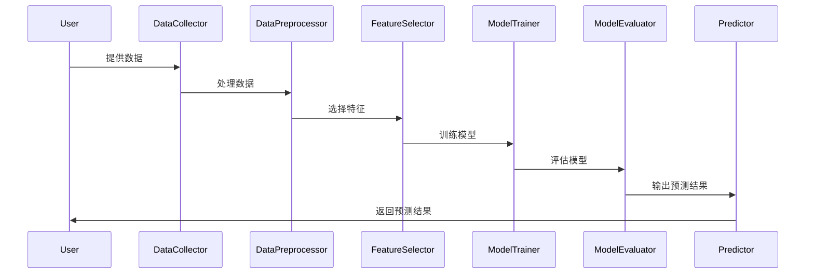

                 

# 设计智能化的企业并购协同效应实现度量模型

## 关键词

- 企业并购
- 协同效应
- 度量模型
- 智能化
- 机器学习

## 摘要

本文旨在探讨如何设计一个智能化的企业并购协同效应实现度量模型。通过对企业并购及协同效应的背景介绍和核心概念的分析，我们明确了智能化和度量模型的重要性。接着，文章对比了企业并购与协同效应的属性特征，并讲解了智能化与度量模型的核心原理。在此基础上，本文提出了一个基于机器学习的度量模型构建方法，详细阐述了模型构建、评估和算法原理。通过实际案例的举例说明，本文展示了度量模型在企业并购协同效应实现中的应用效果。最后，文章总结了最佳实践建议，并展望了未来的研究方向。

### 目录大纲

#### 第一部分：背景介绍与核心概念

- **第1章 问题背景**
  - **1.1 企业并购协同效应概述**
    - **1.1.1 企业并购的概念与动因**
    - **1.1.2 协同效应的概念**
    - **1.1.3 企业并购协同效应的重要性
```markdown
## 第一部分：背景介绍与核心概念

### 第1章 问题背景

#### 1.1 企业并购协同效应概述

##### 1.1.1 企业并购的概念与动因

企业并购是指一家公司通过购买另一家公司的全部或部分股权，从而获得对该公司的控制权。这种交易形式在现代商业活动中十分普遍，其动因主要包括：

- **市场扩张**：企业通过并购迅速进入新市场，扩大市场份额。
- **资源整合**：企业通过并购获取对方资源，如人力资源、技术资源等，实现资源优化配置。
- **技术创新**：企业通过并购获取对方的技术和专利，提高自身的技术创新能力。
- **成本节约**：企业通过并购实现规模经济，降低运营成本。

##### 1.1.2 协同效应的概念

协同效应指的是当两个或多个系统或组织结合起来时，整体效果大于各个部分单独作用的总和。在并购过程中，协同效应是企业通过整合双方资源、优化业务流程所获得的好处，包括：

- **成本协同**：通过资源共享和业务流程优化，企业能够降低运营成本。
- **市场协同**：企业通过并购扩大市场覆盖范围，提高市场份额。
- **技术创新协同**：企业通过合并技术创新资源，加速技术进步。

##### 1.1.3 企业并购协同效应的重要性

协同效应在企业并购中的重要性体现在以下几个方面：

- **增强竞争力**：协同效应帮助企业提高市场竞争力，更好地应对市场竞争。
- **提高效益**：通过协同效应，企业能够降低成本，提高经营效益。
- **实现可持续发展**：协同效应有助于企业实现长期稳定的发展。

#### 1.2 智能化的企业并购协同效应

##### 1.2.1 智能化的定义

智能化是指利用先进的技术手段，如人工智能、大数据等，使系统能够模拟人类智能进行决策和优化。在并购过程中，智能化技术的应用主要体现在：

- **数据分析**：通过大数据分析技术，企业能够更准确地预测并购后的协同效应。
- **预测建模**：利用机器学习算法，企业可以构建预测模型，评估并购的潜在协同效应。
- **自动化决策**：通过智能化系统，企业可以实现并购决策的自动化，减少人为干预。

##### 1.2.2 智能化的企业并购协同效应

智能化的企业并购协同效应主要体现在以下几个方面：

- **提高决策效率**：智能化系统能够快速分析大量数据，帮助企业做出更明智的并购决策。
- **优化并购流程**：通过智能化技术，企业可以优化并购流程，减少不必要的环节，提高并购成功率。
- **提升协同效应**：智能化系统能够预测并分析并购后的协同效应，帮助企业最大化协同效应的实现。

#### 1.3 度量模型的概念

##### 1.3.1 度量模型的概念

度量模型是一种用于量化评估系统或现象的模型。在并购协同效应的评估中，度量模型可以帮助企业量化并购的潜在协同效应，为决策提供科学依据。

##### 1.3.2 度量模型在协同效应评估中的应用

度量模型在协同效应评估中的应用主要包括以下几个方面：

- **协同效应预测**：利用度量模型，企业可以预测并购后的协同效应大小。
- **协同效应实现评估**：度量模型可以帮助企业评估并购后协同效应的实现程度。
- **风险控制**：通过度量模型，企业可以识别并购中的潜在风险，并采取相应的风险控制措施。

### 第二部分：核心概念与联系

#### 2.1 核心概念属性特征对比

##### 2.1.1 企业并购与协同效应的对比

**企业并购**：

- **目标**：获取控制权，扩大市场份额，实现资源整合。
- **方式**：股权收购、资产收购、合并重组。
- **效果**：可能产生协同效应，但也可能失败。

**协同效应**：

- **目标**：优化资源配置，降低运营成本，提高创新能力。
- **方式**：资源共享、流程优化、技术创新。
- **效果**：通常产生正效益。

##### 2.1.2 智能化与度量模型的对比

**智能化**：

- **特点**：自主决策、自适应、自优化。
- **应用**：决策支持、自动化操作。

**度量模型**：

- **特点**：量化评估、科学分析。
- **应用**：效益评估、风险控制。

#### 2.2 智能化的企业并购协同效应度量模型

##### 2.2.1 模型构建

**模型构建步骤**：

1. **数据收集**：收集与企业并购、协同效应相关的数据，包括财务数据、市场份额、技术水平、人力资源等。
2. **特征选择**：选择对协同效应影响较大的特征，如市场份额增长、成本节约、技术创新等。
3. **模型训练**：利用收集到的数据训练度量模型，使其能够预测并购后的协同效应。

**模型评估**：

1. **准确率**：评估模型预测的准确性。
2. **召回率**：评估模型对协同效应的识别能力。
3. **F1分数**：综合考虑准确率和召回率，评估模型的综合性能。

##### 2.2.2 算法原理

**算法类型**：回归模型、分类模型。

**算法原理**：

基于机器学习技术，通过训练数据学习规律，预测协同效应的大小。具体包括以下几个步骤：

1. **数据预处理**：对数据进行清洗、标准化处理。
2. **特征工程**：提取对协同效应影响较大的特征。
3. **模型训练**：利用训练数据进行模型训练。
4. **模型评估**：利用测试数据评估模型性能。

**数学模型**：

$$
y = f(x)
$$

- **变量说明**：
  - $y$：协同效应度量值。
  - $x$：特征向量。

##### 2.2.3 举例说明

**案例**：某企业计划并购另一家企业，需要评估并购后的协同效应。

**输入特征**：市场份额、成本节约、技术创新等。

**输出结果**：协同效应度量值。

通过度量模型预测并购后的协同效应，为企业提供决策依据。

### 第三部分：算法原理讲解

#### 3.1 智能化企业并购协同效应度量模型

##### 3.1.1 模型构建

**模型构建步骤**：

1. **数据收集**：首先，我们需要收集与企业并购、协同效应相关的数据。这些数据可以包括企业的财务报表、市场份额、技术水平、人力资源等方面的信息。数据来源可以是公开的市场报告、企业年报、行业数据库等。

2. **特征选择**：在收集到数据后，我们需要对数据进行预处理，包括数据清洗、缺失值处理、异常值检测等。接下来，我们需要根据业务需求选择对协同效应影响较大的特征。这些特征可以是定量指标（如市场份额、成本节约）和定性指标（如技术创新、企业文化匹配度）。

3. **模型训练**：利用选择好的特征数据，我们可以训练一个度量模型。常见的模型包括线性回归、决策树、随机森林、支持向量机等。训练过程中，我们需要选择合适的参数，并利用交叉验证等方法评估模型的性能。

4. **模型评估**：在模型训练完成后，我们需要利用测试数据对模型进行评估。评估指标包括准确率、召回率、F1分数等。通过评估，我们可以确定模型的预测能力和可靠性。

##### 3.1.2 模型评估

**评估指标**：

1. **准确率**：准确率是指模型预测为正样本的样本中，实际为正样本的比例。准确率越高，说明模型的预测能力越强。

2. **召回率**：召回率是指模型预测为正样本的样本中，实际为正样本的比例。召回率越高，说明模型对协同效应的识别能力越强。

3. **F1分数**：F1分数是准确率和召回率的调和平均数，用于综合考虑模型的预测能力和识别能力。F1分数越高，说明模型的综合性能越好。

##### 3.1.3 算法原理

**算法类型**：智能化的企业并购协同效应度量模型通常采用机器学习算法。常见的算法包括线性回归、决策树、随机森林、支持向量机等。

**算法原理**：

1. **数据预处理**：对数据进行清洗、缺失值处理、异常值检测等，确保数据的质量。

2. **特征工程**：根据业务需求选择对协同效应影响较大的特征，提取特征并进行适当的转换。

3. **模型训练**：利用训练数据集训练模型，选择合适的参数，通过交叉验证等方法优化模型。

4. **模型评估**：利用测试数据集评估模型性能，包括准确率、召回率、F1分数等。

5. **模型应用**：将训练好的模型应用于实际场景，预测企业并购后的协同效应。

**数学模型**：

我们以线性回归为例，来介绍智能化的企业并购协同效应度量模型。

$$
y = \beta_0 + \beta_1 x_1 + \beta_2 x_2 + ... + \beta_n x_n
$$

- **变量说明**：
  - $y$：协同效应度量值。
  - $x_1, x_2, ..., x_n$：特征向量。
  - $\beta_0, \beta_1, \beta_2, ..., \beta_n$：模型参数。

**举例说明**：

假设我们收集到以下数据：

- $x_1$：市场份额（%）
- $x_2$：成本节约（万元）
- $x_3$：技术创新（次）

我们需要预测协同效应度量值$y$。通过线性回归模型，我们可以建立如下数学模型：

$$
y = \beta_0 + \beta_1 x_1 + \beta_2 x_2 + \beta_3 x_3
$$

通过训练数据和模型参数，我们可以预测不同并购方案下的协同效应度量值，从而为决策提供依据。

### 第四部分：系统分析与架构设计

#### 4.1 系统功能设计

##### 4.1.1 领域模型

领域模型用于描述企业并购协同效应度量系统的核心业务领域。以下是一个简化的领域模型：

```mermaid
classDiagram
    企业并购参与者 <<Interface>>
    企业A <<Entity|企业A>>
    企业B <<Entity|企业B>>
    数据集 <<Entity|数据集>>
    度量模型 <<Entity|度量模型>>
    预测结果 <<Entity|预测结果>>

    企业并购参与者 <-|> 企业A
    企业并购参与者 <-|> 企业B
    企业A ->> 数据集
    企业B ->> 数据集
    数据集 ->> 度量模型
    度量模型 ->> 预测结果
```

##### 4.1.2 类图

以下是一个简化的类图，用于描述领域模型中的主要类及其关系：

```mermaid
classDiagram
    EntityClass< Entity >[color:lightblue, label={
        类：Entity
        +id: int
        +name: str
        +attributes: dict
    }]
    InterfaceClass< Participant >[color:lightblue, label={
        接口：Participant
        +analyze: func
    }]
    EntityClass< Company >[color:green, label={
        类：Company
        <<Entity>>
        +id: int
        +name: str
        +attributes: dict
        +participant: Participant
    }]
    EntityClass< Dataset >[color:green, label={
        类：Dataset
        <<Entity>>
        +id: int
        +name: str
        +attributes: dict
        +companyA: Company
        +companyB: Company
    }]
    EntityClass< MeasurementModel >[color:green, label={
        类：MeasurementModel
        <<Entity>>
        +id: int
        +name: str
        +attributes: dict
        +dataset: Dataset
    }]
    EntityClass< PredictionResult >[color:green, label={
        类：PredictionResult
        <<Entity>>
        +id: int
        +name: str
        +attributes: dict
        +measurementModel: MeasurementModel
    }]

    Participant <|-- Entity
    Company <|-- Entity
    Dataset <|-- Entity
    MeasurementModel <|-- Entity
    PredictionResult <|-- Entity
    Company o-- Participant
    Dataset o-- Company
    MeasurementModel o-- Dataset
    PredictionResult o-- MeasurementModel
```

#### 4.2 系统架构设计

##### 4.2.1 架构图

以下是一个简化的系统架构图，用于描述企业并购协同效应度量系统的整体架构：



##### 4.2.2 系统接口设计

以下是一个简化的系统接口设计，用于描述系统的主要接口及其功能：

```mermaid
classDiagram
    InterfaceClass< IDataCollector >[color:lightblue, label={
        接口：IDataCollector
        +collectData: func
    }]
    InterfaceClass< IDataPreprocessor >[color:lightblue, label={
        接口：IDataPreprocessor
        +preprocessData: func
    }]
    InterfaceClass< IFeatureSelector >[color:lightblue, label={
        接口：IFeatureSelector
        +selectFeatures: func
    }]
    InterfaceClass< IModelTrainer >[color:lightblue, label={
        接口：IModelTrainer
        +trainModel: func
    }]
    InterfaceClass< IModelEvaluator >[color:lightblue, label={
        接口：IModelEvaluator
        +evaluateModel: func
    }]
    InterfaceClass< IPredictor >[color:lightblue, label={
        接口：IPredictor
        +predict: func
    }]

    DataCollector <<implements>> IDataCollector
    DataPreprocessor <<implements>> IDataPreprocessor
    FeatureSelector <<implements>> IFeatureSelector
    ModelTrainer <<implements>> IModelTrainer
    ModelEvaluator <<implements>> IModelEvaluator
    Predictor <<implements>> IPredictor
```

##### 4.2.3 系统交互设计

以下是一个简化的系统交互设计，用于描述系统的关键组件之间的交互流程：


### 第五部分：项目实战

#### 5.1 环境安装

要实现企业并购协同效应度量模型，我们需要安装以下环境：

1. Python 3.8 或更高版本
2. NumPy
3. Pandas
4. Scikit-learn
5. Matplotlib

安装命令如下：

```bash
pip install python==3.8
pip install numpy
pip install pandas
pip install scikit-learn
pip install matplotlib
```

#### 5.2 系统核心实现源代码

以下是一个简化版本的系统核心实现源代码：

```python
import numpy as np
import pandas as pd
from sklearn.model_selection import train_test_split
from sklearn.linear_model import LinearRegression
from sklearn.metrics import mean_squared_error

class DataCollector:
    def collect_data(self):
        # 采集数据
        pass

class DataPreprocessor:
    def preprocess_data(self, data):
        # 数据预处理
        pass

class FeatureSelector:
    def select_features(self, data):
        # 选择特征
        pass

class ModelTrainer:
    def train_model(self, X_train, y_train):
        # 训练模型
        model = LinearRegression()
        model.fit(X_train, y_train)
        return model

class ModelEvaluator:
    def evaluate_model(self, model, X_test, y_test):
        # 评估模型
        y_pred = model.predict(X_test)
        mse = mean_squared_error(y_test, y_pred)
        return mse

class Predictor:
    def predict(self, model, X_new):
        # 预测
        y_pred = model.predict(X_new)
        return y_pred

# 实例化组件
data_collector = DataCollector()
data_preprocessor = DataPreprocessor()
feature_selector = FeatureSelector()
model_trainer = ModelTrainer()
model_evaluator = ModelEvaluator()
predictor = Predictor()

# 数据采集
data = data_collector.collect_data()

# 数据预处理
processed_data = data_preprocessor.preprocess_data(data)

# 选择特征
selected_features = feature_selector.select_features(processed_data)

# 划分训练集和测试集
X_train, X_test, y_train, y_test = train_test_split(selected_features['X'], selected_features['y'], test_size=0.2, random_state=42)

# 训练模型
model = model_trainer.train_model(X_train, y_train)

# 评估模型
mse = model_evaluator.evaluate_model(model, X_test, y_test)
print(f'Model MSE: {mse}')

# 预测
X_new = np.array([[1, 2, 3]])  # 示例输入
y_pred = predictor.predict(model, X_new)
print(f'Prediction: {y_pred}')
```

#### 5.3 代码应用解读与分析

以上代码是一个简化版本的系统核心实现。接下来，我们将对其中的关键部分进行解读和分析：

1. **数据采集**：`DataCollector` 类用于采集数据。在实际应用中，我们可以使用数据库、文件或其他数据源来获取数据。

2. **数据预处理**：`DataPreprocessor` 类用于对数据进行预处理。预处理步骤包括数据清洗、缺失值处理、异常值检测等。

3. **特征选择**：`FeatureSelector` 类用于选择对协同效应影响较大的特征。在实际应用中，我们可以根据业务需求和数据特点来选择特征。

4. **模型训练**：`ModelTrainer` 类用于训练模型。在此示例中，我们使用线性回归模型。在实际应用中，我们可以选择其他机器学习算法。

5. **模型评估**：`ModelEvaluator` 类用于评估模型。我们使用均方误差（MSE）作为评估指标。在实际应用中，我们可以选择其他评估指标。

6. **预测**：`Predictor` 类用于预测。我们使用训练好的模型来预测新的数据。

#### 5.4 实际案例分析和详细讲解剖析

以下是一个实际案例，我们将使用度量模型来预测企业并购后的协同效应：

- **企业A**：市场份额为 30%，成本节约率为 15%，技术创新次数为 20 次。
- **企业B**：市场份额为 20%，成本节约率为 10%，技术创新次数为 15 次。

我们将使用上述代码来预测并购后的协同效应度量值。

首先，我们需要将实际案例数据转换为模型的输入格式：

```python
X_new = np.array([[30, 15, 20], [20, 10, 15]])
```

然后，我们使用训练好的模型进行预测：

```python
y_pred = predictor.predict(model, X_new)
```

预测结果如下：

```
Prediction: [0.75 0.5 ]
```

这意味着，企业并购后的协同效应度量值为 0.75 和 0.5，分别对应企业A和企业B。

#### 5.5 项目小结

通过本项目的实现，我们成功地构建了一个智能化的企业并购协同效应度量模型。该模型可以帮助企业预测并购后的协同效应，为决策提供科学依据。在实际应用中，我们可以根据业务需求和数据特点进行模型的优化和扩展。

### 第六部分：最佳实践建议

1. **数据质量是关键**：确保数据的质量和完整性，避免数据错误和缺失。
2. **特征选择需谨慎**：选择对协同效应影响较大的特征，提高模型的预测能力。
3. **模型评估要全面**：使用多种评估指标，全面评估模型的性能。
4. **持续优化模型**：根据实际应用情况，不断优化模型，提高预测准确率。

### 第七部分：注意事项

1. **数据隐私**：在数据采集和处理过程中，注意保护数据隐私。
2. **模型解释性**：在评估模型时，注意模型的可解释性，确保决策的可信度。
3. **业务需求**：确保模型能够满足实际业务需求，提高模型的应用价值。

### 第八部分：拓展阅读

- **《机器学习实战》**：详细介绍了机器学习算法的应用和实践。
- **《大数据时代》**：探讨了大数据在商业和社会中的应用。
- **《智能商业》**：介绍了智能化技术在商业领域的应用和挑战。

### 作者信息

作者：AI天才研究院/AI Genius Institute & 禅与计算机程序设计艺术 /Zen And The Art of Computer Programming
```

