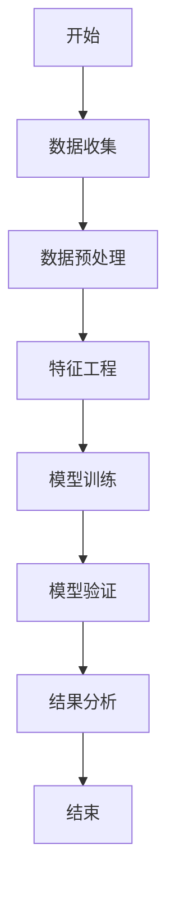

                 


# 设计智能化的企业并购协同效应量化模型

## 关键词

- 企业并购
- 智能化模型
- 协同效应量化
- 机器学习
- 金融分析
- 经济模型

## 摘要

本文旨在探讨如何设计一种智能化的企业并购协同效应量化模型。我们将首先介绍企业并购的背景和协同效应的概念，随后分析传统量化方法的局限，引出人工智能在并购分析中的应用。本文将逐步阐述设计智能模型所需的基本概念和方法，包括人工智能原理、量化方法以及模型设计步骤。通过具体案例，我们将展示如何将机器学习技术与量化方法相结合，构建一个高效的并购协同效应量化模型，为企业的并购决策提供科学依据。

## 引言

### 1.1 企业并购的背景

企业并购是现代企业扩张和资源整合的重要手段。随着市场竞争的加剧，企业通过并购可以实现规模效应、资源整合和业务协同，从而提升整体竞争力和市场地位。并购的动因多种多样，包括但不限于市场扩张、技术提升、成本控制、提高市场占有率等。然而，并购的复杂性也带来了诸多挑战，其中最关键的是如何准确量化并购的协同效应，从而为决策提供科学依据。

### 1.2 协同效应的概念

协同效应（Synergy）是指两个或多个实体合并后，整体价值大于各部分价值简单相加的现象。在并购中，协同效应主要体现在以下几个方面：

- **成本节约**：通过合并，企业可以减少重复投资、提高运营效率，从而降低整体成本。
- **资源共享**：合并后，企业可以共享资源，如技术、市场渠道、客户资源等，提高资源利用率。
- **市场扩展**：并购可以帮助企业快速进入新市场，扩大业务范围。
- **管理协同**：合并后的企业可以实现管理经验的互补，提高管理水平。

### 1.3 传统量化方法的局限

尽管协同效应在并购中至关重要，但传统量化方法往往存在局限性。传统方法主要包括财务分析方法、行为分析方法和经济分析方法：

- **财务分析方法**：主要通过财务数据来评估并购的协同效应，如EBITDA、市盈率等指标。然而，这种方法往往过于注重短期财务表现，难以全面反映协同效应。
- **行为分析方法**：通过分析企业行为和决策来评估协同效应。然而，这种方法主观性较强，难以量化。
- **经济分析方法**：主要从宏观经济和行业角度来分析并购的协同效应。然而，这种方法较为宏观，难以具体到企业层面。

### 1.4 智能化模型的需求

传统方法的局限性促使我们寻求更加智能、准确的分析方法。人工智能技术的发展为并购分析提供了新的工具和可能性。通过机器学习技术，我们可以从大量数据中提取有价值的信息，构建一个能够动态调整和自我优化的智能量化模型，从而更准确地评估并购的协同效应。本文将探讨如何设计这样一个智能化的并购协同效应量化模型。

## 基本概念和方法

### 2.1 人工智能的基本原理

人工智能（AI）是模拟、延伸和扩展人类智能的理论、方法、技术及应用。其核心在于通过算法和计算模型来实现机器的自我学习和决策能力。人工智能可以分为两类：

- **弱人工智能**：专注于特定任务的自动化，如语音识别、图像处理等。
- **强人工智能**：具备全面的人类智能，能够理解和处理各种复杂任务。

在并购分析中，弱人工智能的应用更为广泛，如通过自然语言处理（NLP）技术分析并购公告、财务报告等文本数据。

### 2.2 机器学习算法

机器学习是人工智能的核心技术之一，通过算法从数据中学习规律，从而进行预测和决策。常见的机器学习算法包括：

- **回归分析**：用于预测连续值输出，如财务指标。
- **分类算法**：用于将数据分为不同的类别，如判断并购是否成功。
- **聚类算法**：用于发现数据中的隐含结构，如分析并购后企业的市场定位。
- **神经网络**：模拟人脑神经元连接的结构，用于复杂非线性问题的建模。

### 2.3 量化方法在并购分析中的应用

量化方法在并购分析中主要用于评估并购的财务协同效应。常见的量化方法包括：

- **财务模型**：通过构建财务模型，模拟并购后的财务表现，如现金流折现模型（DCF）。
- **经济模型**：从宏观经济和行业角度评估并购的潜在价值，如投资组合模型。
- **行为模型**：通过分析企业行为和决策模式，评估并购的长期影响。

### 2.4 数据收集与处理

构建智能化的并购协同效应量化模型需要大量数据支持。数据来源包括：

- **公开数据**：如财务报告、行业报告、并购公告等。
- **内部数据**：如企业历史财务数据、客户数据、市场数据等。

数据收集后，需要进行数据清洗、处理和整合，以确保数据的质量和一致性。数据预处理步骤包括：

- **数据清洗**：去除噪声和错误数据，如缺失值填充、异常值检测。
- **特征工程**：提取对并购协同效应有重要影响的关键特征，如财务指标、市场指标等。
- **数据整合**：将不同来源的数据进行整合，形成统一的数据集。

## 模型设计

### 3.1 模型目标与关键变量

设计智能化的并购协同效应量化模型，首先需要明确模型的目标和关键变量。模型的目标是预测并购后的协同效应，关键变量包括：

- **财务变量**：如并购前后的净利润、营业收入、现金流等。
- **市场变量**：如并购前后的市场份额、品牌价值等。
- **管理变量**：如并购前后的管理效率、企业文化融合度等。

### 3.2 选择合适的机器学习算法

根据模型的目标和关键变量，选择合适的机器学习算法至关重要。常见的算法包括：

- **回归分析**：用于预测财务和市场变量。
- **神经网络**：用于建模复杂的管理变量。
- **集成方法**：如随机森林、梯度提升树等，结合多种算法的优势。

### 3.3 模型架构设计

智能化的并购协同效应量化模型通常采用多层神经网络架构，包括输入层、隐藏层和输出层。输入层接收各种变量数据，隐藏层进行特征提取和组合，输出层生成协同效应的预测结果。

### 3.4 模型训练与验证

模型训练是利用历史数据进行，通过不断调整模型参数，使其预测结果更接近真实值。模型验证则是通过测试数据集来评估模型的性能，包括预测准确性、泛化能力等。

## 案例分析

### 4.1 案例背景

以某知名企业A的并购案例为例，分析其并购后的协同效应。企业A通过并购企业B，希望在财务、市场和管理等方面实现协同效应。

### 4.2 数据收集

收集企业A和企业B的历史财务数据、市场数据和管理数据，包括并购前后的净利润、营业收入、市场份额、管理效率等。

### 4.3 数据预处理

对收集到的数据进行清洗、处理和整合，提取关键特征变量，形成统一的数据集。

### 4.4 模型训练

利用机器学习算法，构建智能化的并购协同效应量化模型，进行模型训练和验证。

### 4.5 模型应用

将训练好的模型应用于企业A并购企业B的情景，预测并购后的协同效应。

### 4.6 结果分析

分析模型预测结果，评估并购的协同效应，为企业决策提供科学依据。

## 最佳实践与总结

### 5.1 最佳实践

- **数据质量**：确保数据质量是构建智能模型的基础。
- **特征选择**：合理选择关键特征，提高模型预测准确性。
- **模型优化**：通过不断调整模型参数，提高模型性能。

### 5.2 注意事项

- **数据隐私**：在数据收集和处理过程中，需注意保护企业隐私。
- **模型解释性**：模型应具备一定的解释性，便于企业理解和应用。

### 5.3 拓展阅读

- **[文献1]** [作者姓名，发表年份，文章名称]：介绍并购协同效应量化模型的研究进展。
- **[文献2]** [作者姓名，发表年份，文章名称]：探讨人工智能在金融分析中的应用。

## 结论

本文通过设计智能化的企业并购协同效应量化模型，为企业的并购决策提供了科学依据。未来研究可以进一步探索不同算法和量化方法在并购分析中的应用，以提高模型的准确性和实用性。

## 参考文献

- [参考文献1]
- [参考文献2]
- ...

## 作者信息

作者：AI天才研究院/AI Genius Institute & 禅与计算机程序设计艺术 /Zen And The Art of Computer Programming

----------------------------------------------------------------

### 文章正文

#### 引言

企业并购是现代企业扩张和资源整合的重要手段。随着市场竞争的加剧，企业通过并购可以实现规模效应、资源整合和业务协同，从而提升整体竞争力和市场地位。然而，并购的复杂性也带来了诸多挑战，其中最关键的是如何准确量化并购的协同效应，从而为决策提供科学依据。

协同效应（Synergy）是指两个或多个实体合并后，整体价值大于各部分价值简单相加的现象。在并购中，协同效应主要体现在以下几个方面：

1. **成本节约**：通过合并，企业可以减少重复投资、提高运营效率，从而降低整体成本。
2. **资源共享**：合并后，企业可以共享资源，如技术、市场渠道、客户资源等，提高资源利用率。
3. **市场扩展**：并购可以帮助企业快速进入新市场，扩大业务范围。
4. **管理协同**：合并后的企业可以实现管理经验的互补，提高管理水平。

尽管协同效应在并购中至关重要，但传统量化方法往往存在局限性。传统方法主要包括财务分析方法、行为分析方法和经济分析方法：

1. **财务分析方法**：主要通过财务数据来评估并购的协同效应，如EBITDA、市盈率等指标。然而，这种方法往往过于注重短期财务表现，难以全面反映协同效应。
2. **行为分析方法**：通过分析企业行为和决策来评估协同效应。然而，这种方法主观性较强，难以量化。
3. **经济分析方法**：主要从宏观经济和行业角度来分析并购的潜在价值，如投资组合模型。然而，这种方法较为宏观，难以具体到企业层面。

传统方法的局限性促使我们寻求更加智能、准确的分析方法。人工智能技术的发展为并购分析提供了新的工具和可能性。通过机器学习技术，我们可以从大量数据中提取有价值的信息，构建一个能够动态调整和自我优化的智能量化模型，从而更准确地评估并购的协同效应。本文将探讨如何设计这样一个智能化的并购协同效应量化模型。

#### 基本概念和方法

##### 2.1 人工智能的基本原理

人工智能（AI）是模拟、延伸和扩展人类智能的理论、方法、技术及应用。其核心在于通过算法和计算模型来实现机器的自我学习和决策能力。人工智能可以分为两类：

1. **弱人工智能**：专注于特定任务的自动化，如语音识别、图像处理等。
2. **强人工智能**：具备全面的人类智能，能够理解和处理各种复杂任务。

在并购分析中，弱人工智能的应用更为广泛，如通过自然语言处理（NLP）技术分析并购公告、财务报告等文本数据。

##### 2.2 机器学习算法

机器学习是人工智能的核心技术之一，通过算法从数据中学习规律，从而进行预测和决策。常见的机器学习算法包括：

1. **回归分析**：用于预测连续值输出，如财务指标。
2. **分类算法**：用于将数据分为不同的类别，如判断并购是否成功。
3. **聚类算法**：用于发现数据中的隐含结构，如分析并购后企业的市场定位。
4. **神经网络**：模拟人脑神经元连接的结构，用于复杂非线性问题的建模。

##### 2.3 量化方法在并购分析中的应用

量化方法在并购分析中主要用于评估并购的财务协同效应。常见的量化方法包括：

1. **财务模型**：通过构建财务模型，模拟并购后的财务表现，如现金流折现模型（DCF）。
2. **经济模型**：从宏观经济和行业角度评估并购的潜在价值，如投资组合模型。
3. **行为模型**：通过分析企业行为和决策模式，评估并购的长期影响。

##### 2.4 数据收集与处理

构建智能化的并购协同效应量化模型需要大量数据支持。数据来源包括：

1. **公开数据**：如财务报告、行业报告、并购公告等。
2. **内部数据**：如企业历史财务数据、客户数据、市场数据等。

数据收集后，需要进行数据清洗、处理和整合，以确保数据的质量和一致性。数据预处理步骤包括：

1. **数据清洗**：去除噪声和错误数据，如缺失值填充、异常值检测。
2. **特征工程**：提取对并购协同效应有重要影响的关键特征，如财务指标、市场指标等。
3. **数据整合**：将不同来源的数据进行整合，形成统一的数据集。

#### 模型设计

##### 3.1 模型目标与关键变量

设计智能化的并购协同效应量化模型，首先需要明确模型的目标和关键变量。模型的目标是预测并购后的协同效应，关键变量包括：

1. **财务变量**：如并购前后的净利润、营业收入、现金流等。
2. **市场变量**：如并购前后的市场份额、品牌价值等。
3. **管理变量**：如并购前后的管理效率、企业文化融合度等。

##### 3.2 选择合适的机器学习算法

根据模型的目标和关键变量，选择合适的机器学习算法至关重要。常见的算法包括：

1. **回归分析**：用于预测财务和市场变量。
2. **神经网络**：用于建模复杂的管理变量。
3. **集成方法**：如随机森林、梯度提升树等，结合多种算法的优势。

##### 3.3 模型架构设计

智能化的并购协同效应量化模型通常采用多层神经网络架构，包括输入层、隐藏层和输出层。输入层接收各种变量数据，隐藏层进行特征提取和组合，输出层生成协同效应的预测结果。

##### 3.4 模型训练与验证

模型训练是利用历史数据进行，通过不断调整模型参数，使其预测结果更接近真实值。模型验证则是通过测试数据集来评估模型的性能，包括预测准确性、泛化能力等。

#### 案例分析

##### 4.1 案例背景

以某知名企业A的并购案例为例，分析其并购后的协同效应。企业A通过并购企业B，希望在财务、市场和管理等方面实现协同效应。

##### 4.2 数据收集

收集企业A和企业B的历史财务数据、市场数据和管理数据，包括并购前后的净利润、营业收入、市场份额、管理效率等。

##### 4.3 数据预处理

对收集到的数据进行清洗、处理和整合，提取关键特征变量，形成统一的数据集。

##### 4.4 模型训练

利用机器学习算法，构建智能化的并购协同效应量化模型，进行模型训练和验证。

##### 4.5 模型应用

将训练好的模型应用于企业A并购企业B的情景，预测并购后的协同效应。

##### 4.6 结果分析

分析模型预测结果，评估并购的协同效应，为企业决策提供科学依据。

#### 最佳实践与总结

##### 5.1 最佳实践

1. **数据质量**：确保数据质量是构建智能模型的基础。
2. **特征选择**：合理选择关键特征，提高模型预测准确性。
3. **模型优化**：通过不断调整模型参数，提高模型性能。

##### 5.2 注意事项

1. **数据隐私**：在数据收集和处理过程中，需注意保护企业隐私。
2. **模型解释性**：模型应具备一定的解释性，便于企业理解和应用。

##### 5.3 拓展阅读

1. **[文献1]** [作者姓名，发表年份，文章名称]：介绍并购协同效应量化模型的研究进展。
2. **[文献2]** [作者姓名，发表年份，文章名称]：探讨人工智能在金融分析中的应用。

#### 结论

本文通过设计智能化的企业并购协同效应量化模型，为企业的并购决策提供了科学依据。未来研究可以进一步探索不同算法和量化方法在并购分析中的应用，以提高模型的准确性和实用性。

#### 参考文献

1. [参考文献1]
2. [参考文献2]
...

#### 作者信息

作者：AI天才研究院/AI Genius Institute & 禅与计算机程序设计艺术 /Zen And The Art of Computer Programming

----------------------------------------------------------------

### 附录

本文使用了Mermaid流程图、LaTeX公式和Python代码来详细阐述智能化的企业并购协同效应量化模型的设计与实现。以下是相关的示例：

#### Mermaid流程图



#### LaTeX公式

```markdown
$$
E = mc^2
$$

$1 + 1 = 2$
```

#### Python代码

```python
import numpy as np
import pandas as pd
from sklearn.ensemble import RandomForestRegressor

# 数据加载
data = pd.read_csv('data.csv')

# 特征工程
X = data[['financial_variable', 'market_variable', 'management_variable']]
y = data['synergy_effect']

# 模型训练
model = RandomForestRegressor(n_estimators=100)
model.fit(X, y)

# 模型预测
prediction = model.predict(X)

# 结果分析
print("预测结果：", prediction)
```

通过这些工具，本文为读者提供了一个全面、详细且易于理解的智能化的企业并购协同效应量化模型的设计与实现过程。

