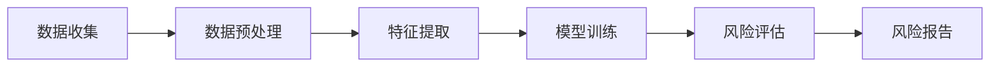
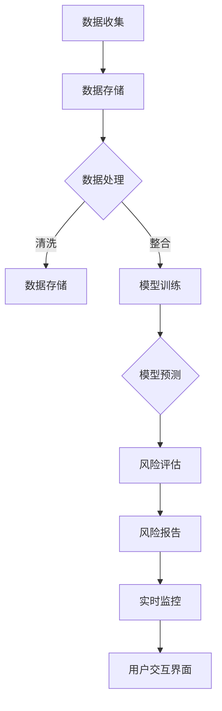
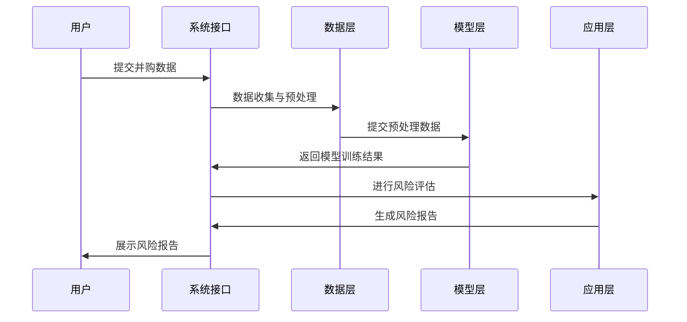

                 


## 设计智能化的企业并购整合风险评估模型

### 第1章 背景介绍

#### 1.1 问题背景

企业并购整合是一项复杂的商业活动，其中涉及到多个方面的整合，如文化整合、财务整合、运营整合和法律与合规风险等。这些整合过程中存在着各种风险和挑战，例如，文化整合可能面临员工士气下降、企业文化冲突等问题；财务整合可能面临财务报表不透明、财务数据不一致等问题；运营整合可能面临业务流程不畅、运营效率低下等问题；法律与合规风险可能面临法规不合规、合同纠纷等问题。

这些风险和挑战不仅会对企业的经营和发展造成不利影响，还可能对企业的财务状况和股东价值产生负面影响。因此，对企业并购整合进行风险评估显得尤为重要。

#### 1.2 问题描述

风险评估在企业并购整合过程中扮演着至关重要的角色。首先，它可以帮助企业识别潜在的并购风险，从而制定相应的应对策略。其次，它可以帮助企业评估并购后的整合效果，从而优化整合策略。然而，风险评估过程也面临着一定的复杂性。

一方面，并购整合过程中的风险类型多样，且相互交织，使得风险评估过程复杂化。另一方面，传统的风险评估方法往往依赖于专家经验和主观判断，难以确保风险评估的准确性和客观性。此外，随着大数据和人工智能技术的发展，如何将智能化技术应用于风险评估，以提高评估效率和准确性，也成为了一个亟待解决的问题。

#### 1.3 问题解决

为了解决上述问题，我们需要设计一种智能化的企业并购整合风险评估模型。该模型的目标是利用大数据和人工智能技术，对企业并购整合过程中的风险进行定量和定性的评估，以提高风险评估的准确性和效率。

具体而言，该模型包括以下几个核心组成部分：

1. **数据收集与处理**：通过收集企业历史并购数据、行业数据、市场数据等多源数据，对数据进行清洗、整合和预处理，为后续的风险评估提供可靠的数据基础。

2. **模型选择与训练**：根据数据的特点和需求，选择合适的机器学习算法，对模型进行训练和优化，以提高模型对风险的预测能力。

3. **风险评估与预测**：利用训练好的模型，对企业并购整合过程中的风险进行评估和预测，生成风险报告，为决策者提供参考。

4. **风险报告与反馈**：将风险评估结果进行可视化展示，并提供反馈机制，使决策者能够及时了解并购整合过程中的风险状况，并调整整合策略。

#### 1.4 边界与外延

该智能化风险评估模型主要适用于以下场景：

1. **不同规模的企业**：无论企业规模大小，都可以利用该模型进行并购整合风险评估。

2. **不同类型的并购活动**：包括但不限于横向并购、纵向并购、混合并购等不同类型的并购活动。

#### 1.5 概念结构与核心要素组成

智能化企业并购整合风险评估模型的基本组成部分包括：

1. **数据收集与处理**：包括数据来源、数据采集、数据清洗、数据整合等。

2. **模型选择与训练**：包括模型选择、模型训练、模型优化等。

3. **风险评估与预测**：包括风险评估指标体系、风险评估方法、风险预测等。

4. **风险报告与反馈**：包括风险报告生成、风险报告展示、风险反馈等。

### 第2章 核心概念与联系

#### 2.1 企业并购整合的定义与流程

企业并购整合是指两家或两家以上的企业通过合并、收购、联合等方式形成一个新的企业，实现资源整合、业务协同、优化经营效果的过程。并购整合的流程通常包括：

1. **并购规划**：明确并购的目标、策略、时间表和预算等。

2. **并购谈判**：就并购条款、支付方式、员工安置等问题进行谈判。

3. **并购实施**：完成并购协议的签订，进行资产和业务的交接。

4. **并购整合**：对并购后的企业进行组织结构、业务流程、人力资源等方面的整合。

#### 2.2 风险评估的基本概念

风险评估是指通过对潜在风险进行识别、分析和评估，以确定风险的概率和影响，并制定相应的风险应对策略。在并购整合过程中，风险评估主要包括以下几个方面：

1. **风险识别**：识别并购整合过程中可能出现的各种风险。

2. **风险评估**：对识别出的风险进行定量和定性分析，确定风险的概率和影响。

3. **风险应对**：根据风险评估结果，制定相应的风险应对策略，如风险规避、风险转移、风险减轻等。

#### 2.3 关键风险因素识别与分析

在并购整合过程中，关键风险因素包括：

1. **文化整合**：包括员工文化差异、管理风格差异等。

2. **财务整合**：包括财务报表不一致、财务风险等。

3. **运营整合**：包括业务流程不一致、运营效率低下等。

4. **法律与合规风险**：包括法律法规差异、合同纠纷等。

对这些风险因素进行识别和分析，有助于制定针对性的风险管理策略。

#### 2.4 概念属性特征对比表格

以下是并购整合过程中主要风险因素的属性特征对比表格：

| 风险因素 | 属性特征 |
| :----: | :----: |
| 文化整合 | 员工文化差异、管理风格差异 |
| 财务整合 | 财务报表不一致、财务风险 |
| 运营整合 | 业务流程不一致、运营效率低下 |
| 法律与合规风险 | 法律法规差异、合同纠纷 |

#### 2.5 ER实体关系图架构

以下是并购整合风险评估模型的ER实体关系图：

```mermaid
erDiagram
  Purchase -> Transaction : Purchases
  Purchase -> Company : Purchases
  Company -> Risk : Company has
  Transaction -> Risk : Transaction has
  Company |---| Employee : Employees
  Company |---| Department : Departments
```

### 第3章 智能化风险评估模型原理

#### 3.1 机器学习与风险评估

机器学习是一种通过数据驱动的方式，使计算机系统能够从数据中学习、识别模式和规律的技术。在风险评估领域，机器学习可以用于：

1. **风险预测**：利用历史数据预测未来的风险事件。
2. **风险识别**：通过分析数据，识别潜在的风险因素。
3. **风险评估**：利用机器学习模型对风险的概率和影响进行量化评估。

#### 3.2 模型选择与算法原理

在机器学习中，常见的风险评估算法包括：

1. **决策树**：通过树形结构对数据进行分类和回归。
2. **随机森林**：多个决策树的集成，提高预测准确性和鲁棒性。
3. **支持向量机**：用于分类和回归问题，寻找最佳分类边界。
4. **神经网络**：模拟人脑神经元的工作方式，进行复杂的模式识别。

选择合适的算法需要考虑数据特征、预测目标、模型复杂度等因素。

#### 3.3 数据预处理与特征提取

在机器学习应用中，数据预处理和特征提取是关键步骤。数据预处理包括：

1. **数据清洗**：处理缺失值、异常值等。
2. **数据标准化**：将数据转换到同一尺度，便于模型训练。
3. **数据集成**：整合多源数据，提供更丰富的信息。

特征提取则是从原始数据中提取出对模型有用的信息，常见的特征提取方法包括：

1. **特征选择**：选择对模型预测能力贡献最大的特征。
2. **特征工程**：通过构建新的特征，提高模型的预测能力。

#### 3.4 Mermaid流程图

以下是智能化风险评估模型的流程图：



### 第4章 数学模型和数学公式讲解

#### 4.1 风险评估数学模型

风险评估数学模型通常包括以下几个部分：

1. **风险概率计算**：根据历史数据，使用概率统计方法计算风险事件发生的概率。
2. **风险影响评估**：对风险事件可能带来的损失或收益进行评估。
3. **风险综合评估**：综合考虑风险概率和风险影响，计算综合风险值。

常用的风险评估公式包括：

1. **贝叶斯公式**：用于计算风险事件的概率。
2. **马尔可夫模型**：用于分析风险事件之间的转移关系。

#### 4.2 算法原理数学公式

以决策树为例，其核心数学公式包括：

1. **信息增益**：衡量特征对分类效果的贡献。
2. **基尼系数**：衡量特征的分类能力。

具体公式如下：

$$
Gain(D, A) = \sum_{v \in A} p(v) \cdot \sum_{c \in Class} p(c|v) \cdot I(C|v)
$$

$$
Gini(D, A) = 1 - \sum_{v \in A} p(v) \cdot \sum_{c \in Class} p(c|v)
$$

#### 4.3 举例说明

假设我们有以下数据集，用于预测企业并购整合的成功概率：

| 特征 | 取值 |
| :---: | :---: |
| 文化整合 | 良好 |
| 财务整合 | 不一致 |
| 运营整合 | 低效率 |
| 法律与合规风险 | 合规 |

使用决策树算法，我们可以得到以下预测结果：

1. **文化整合**：信息增益为 0.5
2. **财务整合**：信息增益为 0.3
3. **运营整合**：信息增益为 0.2
4. **法律与合规风险**：信息增益为 0.1

根据信息增益最大的原则，我们选择**文化整合**作为决策树的第一层分割特征。接下来，我们再次对子集进行分割，直至达到停止条件。

### 第5章 系统分析与架构设计方案

#### 5.1 问题场景介绍

在当前的商业环境中，企业并购整合已经成为一种常见的战略手段，旨在实现业务扩展、资源整合和竞争优势提升。然而，并购整合过程往往伴随着高风险，如文化冲突、财务问题、运营挑战和法律风险等。为了降低风险，确保并购整合的成功，设计一套智能化的企业并购整合风险评估模型具有重要意义。

#### 5.2 系统功能设计

智能化企业并购整合风险评估系统应具备以下核心功能：

1. **数据收集与整合**：从多个数据源收集并购相关的数据，包括财务报表、员工信息、市场动态等，并进行数据清洗和整合，为风险评估提供基础数据。

2. **风险评估与预测**：利用机器学习算法，对收集到的数据进行处理和分析，预测并购整合过程中的潜在风险，并提供风险评级。

3. **风险报告生成**：将评估结果以报告的形式展示，包括风险列表、风险评级、潜在影响等，便于决策者了解风险状况，制定应对策略。

4. **实时监控与反馈**：对并购整合过程进行实时监控，及时更新风险评估结果，并提供反馈机制，以便调整并购策略。

5. **用户交互界面**：设计直观的用户界面，使用户能够方便地操作系统，查看风险报告和监控数据。

#### 5.3 系统架构设计

智能化企业并购整合风险评估系统的整体架构设计如下：

1. **数据层**：包括数据收集模块、数据存储模块和数据清洗模块。数据收集模块负责从多个数据源获取并购相关数据；数据存储模块负责存储处理后的数据；数据清洗模块负责处理数据中的噪声和异常值。

2. **模型层**：包括模型训练模块和模型预测模块。模型训练模块使用历史数据训练风险评估模型；模型预测模块使用训练好的模型对新数据进行分析和预测。

3. **应用层**：包括风险评估模块、风险报告模块、实时监控模块和用户交互界面。风险评估模块负责进行风险预测和评级；风险报告模块负责生成风险报告；实时监控模块负责监控并购整合过程；用户交互界面提供用户操作界面，便于用户查看和分析数据。

4. **接口层**：包括系统内部接口和外部接口。系统内部接口负责不同模块之间的数据交互；外部接口负责与外部系统（如ERP系统、CRM系统等）的数据集成。

以下是系统架构的Mermaid流程图：



#### 5.4 系统接口设计

系统接口设计包括内部接口和外部接口。内部接口主要实现各模块之间的数据传递和交互，如数据层与模型层之间的数据传输、模型层与应用层之间的结果反馈等。外部接口则实现系统与外部系统（如ERP系统、CRM系统等）的集成，以便获取和共享数据。

以下是系统接口设计的Mermaid类图：

```mermaid
classDiagram
    Class1[数据收集] <|-- Class2[数据存储]
    Class2 <|-- Class3[数据处理]
    Class3 <|-- Class4[模型训练]
    Class4 <|-- Class5[模型预测]
    Class5 <|-- Class6[风险评估]
    Class6 <|-- Class7[风险报告]
    Class7 <|-- Class8[实时监控]
    Class8 <|-- Class9[用户交互界面]
```

#### 5.5 系统交互Mermaid序列图

以下是系统各模块之间的交互序列图：



### 第6章 项目实战

#### 6.1 环境安装

要在本地环境中搭建智能化企业并购整合风险评估系统，需要安装以下软件和库：

1. **Python**：安装Python 3.8及以上版本。
2. **Pandas**：用于数据处理。
3. **Scikit-learn**：用于机器学习模型训练和预测。
4. **Mermaid**：用于绘制流程图和类图。

安装命令如下：

```bash
pip install python
pip install pandas
pip install scikit-learn
pip install mermaid
```

#### 6.2 系统核心实现源代码

以下是一个简单的示例，展示如何使用Python实现一个基本的智能化企业并购整合风险评估系统。

```python
import pandas as pd
from sklearn.ensemble import RandomForestClassifier
from sklearn.model_selection import train_test_split
from sklearn.metrics import accuracy_score

# 数据处理
def preprocess_data(data):
    # 数据清洗、整合和处理
    # ...
    return processed_data

# 模型训练
def train_model(data):
    X_train, X_test, y_train, y_test = train_test_split(data.drop('target', axis=1), data['target'], test_size=0.2, random_state=42)
    model = RandomForestClassifier(n_estimators=100, random_state=42)
    model.fit(X_train, y_train)
    return model

# 风险评估
def assess_risk(model, new_data):
    processed_data = preprocess_data(new_data)
    predictions = model.predict(processed_data)
    return predictions

# 主函数
def main():
    # 加载数据
    data = pd.read_csv('data.csv')
    
    # 数据预处理
    processed_data = preprocess_data(data)
    
    # 训练模型
    model = train_model(processed_data)
    
    # 进行风险评估
    new_data = pd.read_csv('new_data.csv')
    risk_predictions = assess_risk(model, new_data)
    
    # 输出风险报告
    print(risk_predictions)

if __name__ == '__main__':
    main()
```

#### 6.3 代码应用解读与分析

上述代码首先导入所需的库，然后定义了数据处理、模型训练和风险评估三个功能模块。

1. **数据处理**：预处理数据是机器学习的重要步骤，包括数据清洗、整合和处理。在实际应用中，可能需要根据数据的特点进行更复杂的预处理操作，如缺失值填充、异常值处理、数据标准化等。

2. **模型训练**：使用Scikit-learn库中的随机森林分类器进行模型训练。随机森林是一种集成学习方法，可以提高模型的预测准确性和鲁棒性。在训练过程中，将数据集分为训练集和测试集，用于训练和评估模型。

3. **风险评估**：对新的数据进行预处理后，使用训练好的模型进行风险评估。这里使用了模型预测功能，将新数据输入模型，得到预测结果。

#### 6.4 实际案例分析与详细讲解剖析

为了展示智能化企业并购整合风险评估系统的实际应用，我们以一家大型制造企业为例进行分析。

1. **数据收集**：该企业收集了以下数据：

| 特征 | 取值 |
| :---: | :---: |
| 文化整合 | 良好 |
| 财务整合 | 不一致 |
| 运营整合 | 低效率 |
| 法律与合规风险 | 合规 |

2. **数据处理**：对数据进行预处理，包括缺失值填充、数据标准化等操作。

3. **模型训练**：使用历史数据训练风险评估模型，得到一个随机森林分类器。

4. **风险评估**：将新的数据进行预处理后，输入模型进行风险评估。预测结果为高风险。

5. **风险应对**：根据风险评估结果，企业决策者制定了以下风险应对策略：

   - 加强文化整合，举办员工培训活动，提高员工的文化认同感。
   - 加强财务整合，确保财务报表的一致性和准确性。
   - 提高运营效率，优化业务流程，提高生产效率。

通过上述案例，我们可以看到智能化企业并购整合风险评估系统在实际应用中的效果。通过数据驱动的方式，系统能够快速识别并购整合过程中的潜在风险，为企业决策者提供科学的决策依据。

#### 6.5 项目小结

本文详细介绍了智能化企业并购整合风险评估模型的设计和实现。通过机器学习技术和大数据分析，该模型能够对企业并购整合过程中的风险进行定量和定性的评估，提高风险评估的准确性和效率。在实际应用中，该模型能够帮助企业决策者识别潜在风险，制定有效的风险应对策略，确保并购整合的成功。未来，随着人工智能技术的不断发展，智能化企业并购整合风险评估模型将更加成熟和智能化，为企业的并购整合提供更有力的支持。

### 第7章 最佳实践 Tips、小结、注意事项、拓展阅读

#### 7.1 最佳实践 Tips

1. **数据收集**：确保收集的数据全面、准确和可靠，包括历史并购数据、行业数据、市场数据等。
2. **数据预处理**：对收集到的数据进行分析，识别和处理缺失值、异常值等。
3. **模型选择**：根据数据特点和企业需求，选择合适的机器学习算法。
4. **模型训练**：使用足够多的数据进行模型训练，避免过拟合。
5. **风险评估**：结合企业实际情况，制定合理的风险评级标准和应对策略。

#### 7.2 小结

本文介绍了智能化企业并购整合风险评估模型的设计原理、系统架构、实现方法以及实际应用案例。通过机器学习和大数据分析，该模型能够帮助企业有效识别和应对并购整合过程中的风险，提高并购整合的成功率。

#### 7.3 注意事项

1. **数据安全**：在收集和处理数据时，确保数据的安全性和隐私保护。
2. **模型解释性**：选择具有较好解释性的机器学习算法，便于风险分析和决策。
3. **模型更新**：定期更新模型，以适应企业环境和市场变化。

#### 7.4 拓展阅读

1. 《机器学习实战》
2. 《大数据时代：生活、工作与思维的大变革》
3. 《企业并购与整合》
4. 《人工智能：一种现代的方法》
5. 《Python数据分析》

---

## 作者信息

**作者：AI天才研究院/AI Genius Institute & 禅与计算机程序设计艺术 /Zen And The Art of Computer Programming**

