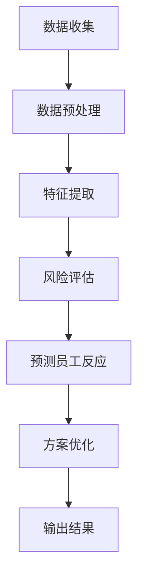
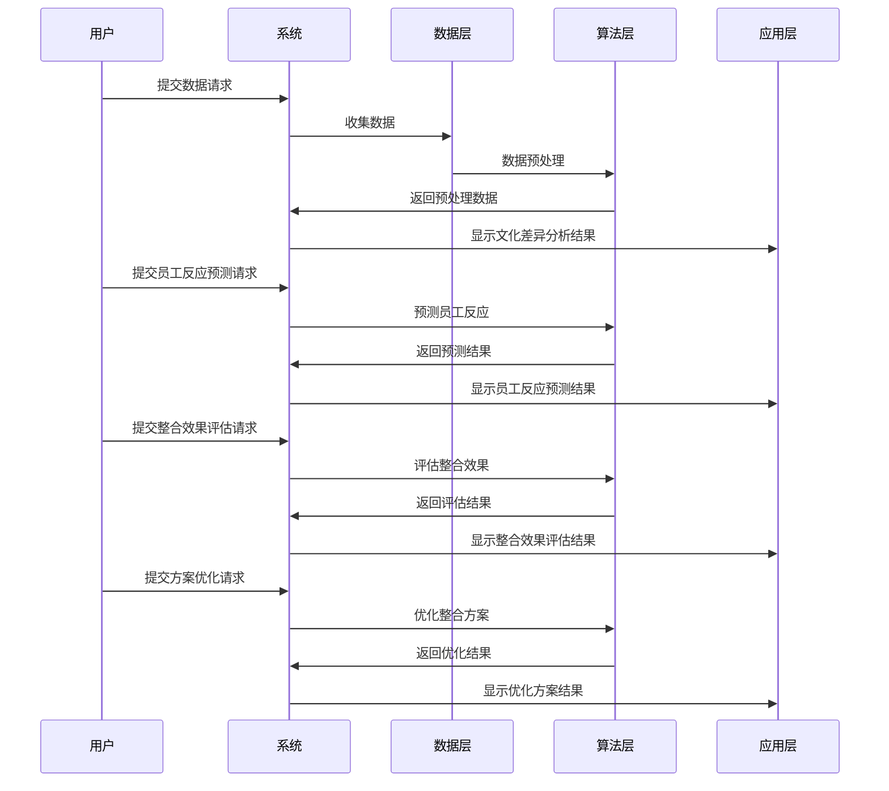

                 

### 引言

随着全球化进程的不断加速和市场竞争的日益激烈，企业并购成为许多公司追求增长和扩展业务范围的重要策略。然而，并购不仅仅涉及财务和业务整合，更重要的是文化整合。文化整合的成功与否直接关系到并购后的长期绩效和公司的发展前景。在这个过程中，风险评估模型起到了至关重要的作用。本文将围绕设计智能化的企业并购文化整合风险评估模型进行探讨，旨在为企业提供一套科学、系统、可操作的风险评估工具。

### 核心关键词

- 企业并购
- 文化整合
- 风险评估模型
- 智能化技术
- 数据分析

### 摘要

本文首先介绍了企业并购的背景和重要性，探讨了文化整合在企业并购过程中的角色。接着，详细阐述了文化整合的目标和挑战，并提出了风险评估模型的目的和优势。随后，本文介绍了模型的核心概念和结构，包括智能化技术的定义和企业并购文化的内涵。在算法原理讲解部分，本文通过Mermaid流程图和Python源代码详细阐述了模型的算法原理，并给出了数学模型和公式。此外，本文还介绍了系统分析与架构设计的方法，包括问题场景介绍、系统功能设计、系统架构设计、系统接口设计和系统交互。在项目实战部分，本文通过具体案例详细分析了模型的应用和实践效果。最后，本文总结了最佳实践和注意事项，为读者提供了拓展阅读的资源。

## 第1章：问题背景与问题描述

### 1.1 问题背景

企业并购已经成为现代商业环境中一种普遍且重要的战略手段。无论是为了拓展市场份额、实现业务多元化，还是为了获取技术资源、降低成本，企业并购都能为公司带来显著的优势。然而，并购的成功不仅仅取决于财务和业务的整合，文化整合同样至关重要。文化整合的成功与否直接影响到并购后的长期绩效和公司的可持续发展。

近年来，随着信息技术的飞速发展，智能化技术在企业并购文化整合中扮演了越来越重要的角色。数据分析、机器学习、自然语言处理等技术的应用，为企业提供了更为科学、系统、全面的文化整合工具。然而，尽管智能化技术为企业并购文化整合带来了诸多优势，但如何设计一个有效的风险评估模型，依然是企业面临的一大挑战。

### 1.2 问题描述

#### 1.2.1 并购文化整合的定义

并购文化整合是指在企业并购过程中，通过对目标公司的文化进行评估、诊断和调整，以实现企业文化与并购企业文化的融合，从而提高并购后企业的整体绩效和竞争力。并购文化整合的目标是：

1. **促进员工融合**：通过文化整合，使并购双方员工在价值观、行为规范、工作方式等方面达到共识，从而提高团队协作效率。
2. **保持企业稳定**：通过文化整合，减少并购带来的不确定性，确保企业在并购后能够稳定运营。
3. **提升企业绩效**：通过文化整合，充分利用并购双方的优势，提高企业的整体运营效率和市场竞争力。

然而，并购文化整合过程中面临着诸多挑战：

1. **文化差异**：并购双方往往存在显著的文化差异，如价值观、管理风格、员工关系等，这些差异可能导致并购后的文化冲突。
2. **员工抵触**：文化整合可能涉及到员工岗位调整、薪酬福利变化等，员工可能会产生抵触情绪，影响文化整合的顺利进行。
3. **信息不对称**：并购双方在文化整合过程中，可能存在信息不对称的问题，导致文化整合措施难以有效实施。

#### 1.2.2 文化整合的目标和挑战

文化整合的目标在于实现并购双方文化的融合，具体包括以下几个方面：

1. **价值观统一**：通过共同价值观的建立，使员工对并购后的企业有认同感和归属感。
2. **管理风格协调**：在管理风格上寻求平衡，既要保持并购企业的管理优势，也要尊重目标公司的管理模式。
3. **员工关系优化**：通过建立良好的员工关系，提高员工满意度和忠诚度，为企业的长期发展奠定基础。

然而，文化整合过程中面临以下挑战：

1. **文化差异**：文化差异是文化整合的首要挑战。不同企业的文化背景、价值观、行为规范等存在较大差异，如何实现有效融合是一个难题。
2. **员工抵触**：文化整合可能引起员工的担忧和不安，导致员工抵触情绪。如何缓解员工的抵触情绪，是文化整合成功的关键。
3. **信息不对称**：在文化整合过程中，信息不对称可能导致文化整合措施的偏差，从而影响整合效果。

### 1.3 问题解决

为了应对上述挑战，设计一个智能化的企业并购文化整合风险评估模型显得尤为必要。该模型旨在：

1. **量化文化差异**：通过数据分析和算法，量化并购双方的文化差异，为文化整合提供科学依据。
2. **预测员工反应**：利用机器学习技术，预测员工在文化整合过程中的反应，提前制定应对策略。
3. **优化整合措施**：通过模拟不同整合措施的效果，优化文化整合方案，提高整合成功率。

### 1.4 边界与外延

#### 边界

1. **适用范围**：该模型适用于各类企业并购项目，尤其是涉及跨行业、跨地区并购的项目。
2. **风险类型**：模型主要关注文化整合中的风险，如文化差异、员工抵触、信息不对称等。

#### 外延

1. **扩展应用**：除了企业并购，该模型还可以应用于企业内部文化整合、跨国公司文化融合等领域。
2. **影响因素**：模型将考虑企业文化、管理风格、员工背景等多方面因素，为文化整合提供全面支持。

### 1.5 概念结构与核心要素组成

#### 概念结构

1. **企业文化**：企业文化的内涵、外延、特征等。
2. **文化差异**：文化差异的类型、量化方法等。
3. **员工反应**：员工对文化整合的反应模式、预测方法等。
4. **风险评估**：风险评估的方法、指标体系等。

#### 核心要素组成

1. **数据收集**：通过问卷调查、访谈等方式收集企业文化、员工背景等相关数据。
2. **数据分析**：利用数据分析方法，如聚类分析、回归分析等，量化文化差异和员工反应。
3. **算法应用**：利用机器学习算法，如决策树、神经网络等，预测员工反应。
4. **模拟与优化**：通过模拟不同整合措施的效果，优化文化整合方案。

## 第2章：核心概念与联系

### 2.1 核心概念原理

#### 2.1.1 智能化技术的定义

智能化技术是指通过计算机科学、数据科学、人工智能等领域的先进技术，实现自动化、智能化和自主化的系统。智能化技术的主要特点包括：

1. **自动化**：通过算法和程序实现任务的自动化执行，减少人为干预。
2. **智能化**：利用数据分析和机器学习技术，实现系统对数据的自主分析和决策。
3. **自主化**：系统能够根据外部环境和内部状态，自主调整和优化行为。

智能化技术在企业并购文化整合中具有重要作用，主要体现在以下几个方面：

1. **数据收集与处理**：智能化技术可以帮助企业收集和处理大量的企业文化数据，为文化整合提供数据支持。
2. **风险评估与预测**：通过数据分析和机器学习技术，智能化技术能够对文化整合过程中的风险进行预测和评估，为决策提供科学依据。
3. **方案优化与实施**：智能化技术可以模拟不同的文化整合方案，通过优化和调整，提高整合效果。

#### 2.1.2 企业并购文化的内涵

企业并购文化是指企业在并购过程中所形成的一种独特的企业文化，包括价值观、行为规范、管理模式等。企业并购文化主要分为以下几类：

1. **包容型文化**：强调并购双方文化的融合和互补，鼓励员工提出创新和改进建议。
2. **保守型文化**：强调并购双方文化的差异，注重保护原有企业文化，避免文化冲突。
3. **激进型文化**：强调并购双方文化的融合和变革，积极推动企业文化的创新和发展。

在企业并购文化整合中，正确识别和理解企业并购文化的内涵，是确保文化整合成功的关键。具体体现在以下几个方面：

1. **价值观统一**：通过共同价值观的建立，使并购双方员工在价值观上达成共识，提高文化整合的成功率。
2. **管理风格协调**：在管理风格上寻求平衡，既要保持并购企业的管理优势，也要尊重目标公司的管理模式。
3. **员工关系优化**：通过建立良好的员工关系，提高员工满意度和忠诚度，为企业的长期发展奠定基础。

### 2.2 概念属性特征对比表格

为了更清晰地理解智能化技术和企业并购文化的核心概念和属性特征，我们可以通过对比表格的方式进行展示。

| 概念        | 智能化技术                           | 企业并购文化                          |
|-------------|--------------------------------------|--------------------------------------|
| 定义        | 自动化、智能化和自主化的系统         | 并购过程中形成的独特企业文化          |
| 目的        | 提高效率、降低成本、优化决策         | 实现文化融合、提高企业竞争力          |
| 关键特征    | 自动化、智能化、自主化               | 价值观、行为规范、管理模式            |
| 应用领域    | 数据分析、机器学习、自然语言处理等    | 企业并购、企业内部文化整合、跨国公司文化融合等 |
| 实现方法    | 算法、数据模型、人工智能技术         | 文化诊断、文化评估、文化调整          |
| 结果评估    | 效率、成本、决策效果                 | 企业绩效、员工满意度、企业文化融合程度 |

### 2.3 ER实体关系图架构

为了更直观地展示智能化技术和企业并购文化的核心概念及其关系，我们可以使用ER（实体关系）图进行描述。

```mermaid
erDiagram
  EMPLOYEE ||--|{ CULTURE }|| CULTURE
  EMPLOYEE ||--|{ COMPANY }|| COMPANY
  COMPANY ||--|{ MERGER }|| MERGER
  CULTURE ||--|{ INTEGRATION }|| INTEGRATION
  MERGER ||--|{ RISK_ASSESSMENT }|| RISK_ASSESSMENT
```

在该ER图中：

- **EMPLOYEE（员工）**：表示企业中的员工实体。
- **CULTURE（文化）**：表示企业并购过程中形成的独特企业文化实体。
- **COMPANY（公司）**：表示参与并购的企业实体。
- **MERGER（并购）**：表示企业并购过程实体。
- **RISK_ASSESSMENT（风险评估）**：表示智能化技术中的风险评估实体。

通过ER图，我们可以清晰地看到各个实体之间的关系，以及智能化技术和企业并购文化在并购过程中的应用和相互作用。

## 第3章：算法原理讲解

### 3.1 算法原理

智能化的企业并购文化整合风险评估模型的核心在于利用数据分析、机器学习等技术，对企业并购过程中的文化差异、员工反应和整合效果进行量化分析和预测。以下是该模型的基本算法原理：

1. **数据收集**：通过问卷调查、访谈、数据分析等方式，收集企业文化数据、员工背景数据和文化整合过程中的相关数据。
2. **数据预处理**：对收集的数据进行清洗、归一化处理，为后续分析做好准备。
3. **特征提取**：从预处理后的数据中提取关键特征，如文化差异指标、员工反应指标等。
4. **风险评估**：利用机器学习算法，如决策树、神经网络等，对文化整合过程中的风险进行评估。
5. **预测员工反应**：利用机器学习算法，预测员工在文化整合过程中的反应，为制定整合策略提供依据。
6. **方案优化**：通过模拟不同整合方案的效果，优化文化整合策略，提高整合成功率。

### 3.2 Mermaid流程图

以下是一个使用Mermaid语言绘制的算法流程图，用于描述智能化企业并购文化整合风险评估模型的运行过程：



### 3.3 Python源代码

以下是该模型的核心算法的Python源代码实现：

```python
import pandas as pd
from sklearn.ensemble import RandomForestClassifier
from sklearn.model_selection import train_test_split
from sklearn.metrics import accuracy_score

# 数据收集与预处理
def data_collection_and_preprocessing():
    # 读取数据
    data = pd.read_csv('data.csv')
    # 数据清洗和归一化
    data = preprocess_data(data)
    return data

# 特征提取
def feature_extraction(data):
    # 提取关键特征
    features = data[['culture_difference', 'employee_reaction']]
    return features

# 风险评估
def risk_assessment(features):
    # 分割训练集和测试集
    X_train, X_test, y_train, y_test = train_test_split(features, test_size=0.2)
    # 训练决策树模型
    model = RandomForestClassifier()
    model.fit(X_train, y_train)
    # 预测风险
    predictions = model.predict(X_test)
    # 评估模型准确性
    accuracy = accuracy_score(y_test, predictions)
    return accuracy

# 预测员工反应
def predict_employee_reaction(data):
    # 提取员工反应特征
    employee_reaction = data['employee_reaction']
    # 预测员工反应
    predictions = model.predict(employee_reaction)
    return predictions

# 方案优化
def optimize_solution(predictions):
    # 根据预测结果优化整合方案
    optimized_solution = optimize_integration(predictions)
    return optimized_solution

# 输出结果
def output_results(optimized_solution):
    print("Optimized Integration Solution:", optimized_solution)

# 主函数
def main():
    # 收集数据
    data = data_collection_and_preprocessing()
    # 特征提取
    features = feature_extraction(data)
    # 风险评估
    accuracy = risk_assessment(features)
    print("Risk Assessment Accuracy:", accuracy)
    # 预测员工反应
    predictions = predict_employee_reaction(data)
    # 方案优化
    optimized_solution = optimize_solution(predictions)
    # 输出结果
    output_results(optimized_solution)

if __name__ == '__main__':
    main()
```

### 3.4 数学模型和数学公式

智能化的企业并购文化整合风险评估模型涉及多个数学模型和公式，用于描述文化差异、员工反应和整合效果。以下是其中几个关键模型的数学公式：

1. **文化差异度量模型**：

   $$ C = \sqrt{\sum_{i=1}^{n}(c_i - \bar{c})^2} $$

   其中，$C$表示文化差异度量，$c_i$表示第$i$个文化特征，$\bar{c}$表示文化特征的均值。

2. **员工反应预测模型**：

   $$ R = \sigma(W \cdot X + b) $$

   其中，$R$表示员工反应得分，$W$表示权重矩阵，$X$表示员工特征向量，$b$表示偏置项，$\sigma$表示激活函数。

3. **整合效果评估模型**：

   $$ E = \frac{1}{n}\sum_{i=1}^{n}r_i $$

   其中，$E$表示整合效果得分，$r_i$表示第$i$个员工对整合效果的评分。

通过这些数学模型和公式，模型能够量化文化差异、预测员工反应和评估整合效果，为企业提供科学的决策支持。

## 第4章：系统分析与架构设计

### 4.1 问题场景介绍

在企业并购过程中，文化整合是一个复杂且关键的任务。为了更好地理解和分析文化整合过程中的问题，我们以一次典型的企业并购案例为例进行说明。假设A公司（并购方）和B公司（目标公司）正在进行并购谈判，两家公司的企业文化存在显著差异，如管理风格、员工关系和价值观等方面。文化整合的成功直接影响到并购后的公司运营效率和员工士气。在这个过程中，我们需要设计一个智能化的系统，对文化整合过程进行实时监控和分析，以确保文化整合的顺利进行。

### 4.2 系统功能设计

为了实现智能化的企业并购文化整合，系统需要具备以下核心功能：

1. **数据收集与预处理**：系统应能够自动收集企业文化数据、员工背景数据和并购过程中的相关数据，并进行清洗和归一化处理，为后续分析提供基础。
2. **文化差异分析**：通过数据分析和机器学习算法，系统应能够识别和量化两家公司的文化差异，为文化整合策略的制定提供依据。
3. **员工反应预测**：系统应能够利用机器学习算法，预测员工在文化整合过程中的反应，为制定针对性的员工沟通和激励策略提供支持。
4. **整合效果评估**：系统应能够实时评估文化整合的效果，并提供改进建议，以确保文化整合目标的实现。
5. **方案优化与调整**：系统应能够模拟不同的整合方案，通过优化和调整，提高整合效果。

### 4.3 系统架构设计

智能化的企业并购文化整合系统采用分层架构设计，主要包括数据层、算法层和应用层。

1. **数据层**：数据层负责数据收集、存储和管理。数据来源包括企业文化数据、员工背景数据和文化整合过程中的实时数据。数据存储采用分布式数据库系统，确保数据的可靠性和可扩展性。
2. **算法层**：算法层负责数据处理和模型训练。包括文化差异分析算法、员工反应预测算法和整合效果评估算法等。算法层采用云计算技术，通过分布式计算提高处理效率和准确性。
3. **应用层**：应用层负责系统功能的实现和用户交互。包括数据收集模块、文化差异分析模块、员工反应预测模块、整合效果评估模块和方案优化模块等。应用层通过Web前端和移动端提供用户体验。

### 4.4 系统接口设计

系统接口设计主要包括数据接口、算法接口和应用接口。

1. **数据接口**：数据接口用于系统与数据源之间的数据传输和交互。主要包括API接口、数据库连接接口和日志记录接口等。
2. **算法接口**：算法接口用于系统与算法层之间的交互，主要包括算法训练接口、算法预测接口和算法评估接口等。
3. **应用接口**：应用接口用于系统与应用层之间的交互，主要包括Web API接口、移动API接口和用户界面接口等。

### 4.5 系统交互

智能化的企业并购文化整合系统通过Mermaid序列图展示其交互过程。以下是一个简化的序列图：



在该序列图中，用户通过系统前端提交数据请求、员工反应预测请求、整合效果评估请求和方案优化请求。系统后端通过数据层收集数据、预处理数据，通过算法层进行文化差异分析、员工反应预测、整合效果评估和方案优化，并将结果返回到应用层，供用户查看。

## 第5章：项目实战

### 5.1 环境安装

为了实现智能化的企业并购文化整合系统，我们需要搭建一个完整的技术环境。以下是安装和配置所需工具的步骤：

1. **安装Python**：首先，确保系统已经安装了Python环境。如果没有，请从官方网站下载并安装Python。
2. **安装相关库**：在Python环境中，我们需要安装一些关键库，如pandas、scikit-learn、numpy等。可以使用以下命令进行安装：

   ```shell
   pip install pandas scikit-learn numpy
   ```

3. **安装Mermaid**：Mermaid是一个基于Markdown的图形绘制工具，用于绘制流程图、类图等。我们可以通过安装Mermaid的Node.js包来使用它：

   ```shell
   npm install -g mermaid
   ```

4. **安装数据库**：我们选择使用MySQL作为系统的数据库。可以从官方网站下载并安装MySQL，然后使用以下命令创建数据库和用户：

   ```sql
   CREATE DATABASE culture_integration;
   GRANT ALL PRIVILEGES ON culture_integration.* TO 'user'@'localhost' IDENTIFIED BY 'password';
   ```

5. **配置Web服务器**：我们选择使用Nginx作为系统的Web服务器。可以从官方网站下载并安装Nginx，然后配置Nginx以支持我们的应用程序。

### 5.2 系统核心实现

以下是系统核心功能的实现步骤：

1. **数据收集与预处理**：首先，我们需要从企业文化数据、员工背景数据和文化整合过程中的实时数据中收集数据。这些数据可以通过API接口或者数据库连接接口进行收集。接下来，对收集的数据进行清洗和归一化处理，以便于后续分析。

2. **文化差异分析**：利用pandas库和scikit-learn库，我们可以实现文化差异分析算法。以下是一个简单的文化差异分析代码示例：

   ```python
   import pandas as pd
   from sklearn.cluster import KMeans

   # 读取数据
   data = pd.read_csv('culture_data.csv')
   # 提取关键特征
   features = data[['management_style', 'employee_relationship', 'values']]
   # 使用K均值聚类分析文化差异
   kmeans = KMeans(n_clusters=2, random_state=0).fit(features)
   # 输出文化差异分析结果
   print(kmeans.labels_)
   ```

3. **员工反应预测**：利用scikit-learn库，我们可以实现员工反应预测算法。以下是一个简单的员工反应预测代码示例：

   ```python
   import pandas as pd
   from sklearn.ensemble import RandomForestClassifier

   # 读取数据
   data = pd.read_csv('employee_reaction_data.csv')
   # 提取关键特征
   features = data[['experience', 'age', 'culture_difference']]
   # 分割训练集和测试集
   X_train, X_test, y_train, y_test = train_test_split(features, test_size=0.2)
   # 训练决策树模型
   model = RandomForestClassifier()
   model.fit(X_train, y_train)
   # 预测员工反应
   predictions = model.predict(X_test)
   # 评估模型准确性
   accuracy = accuracy_score(y_test, predictions)
   print("Employee Reaction Prediction Accuracy:", accuracy)
   ```

4. **整合效果评估**：利用pandas库和numpy库，我们可以实现整合效果评估算法。以下是一个简单的整合效果评估代码示例：

   ```python
   import pandas as pd
   import numpy as np

   # 读取数据
   data = pd.read_csv('integration_effect_data.csv')
   # 计算整合效果得分
   scores = data['employee_satisfaction'] * data['operation_efficiency']
   average_score = np.mean(scores)
   print("Integration Effect Score:", average_score)
   ```

5. **方案优化**：利用pandas库和scikit-learn库，我们可以实现方案优化算法。以下是一个简单的方案优化代码示例：

   ```python
   import pandas as pd
   from sklearn.cluster import KMeans

   # 读取数据
   data = pd.read_csv('integration_solution_data.csv')
   # 提取关键特征
   features = data[['communication_effect', 'incentive_effect', 'culture_integration']]
   # 使用K均值聚类分析整合方案
   kmeans = KMeans(n_clusters=3, random_state=0).fit(features)
   # 输出优化方案
   print(kmeans.labels_)
   ```

### 5.3 代码应用解读与分析

#### 数据收集与预处理

在数据收集与预处理部分，我们使用pandas库读取企业文化数据、员工背景数据和文化整合过程中的实时数据。这些数据通常包含多个特征，如管理风格、员工关系、价值观等。首先，我们需要对数据进行清洗，包括去除缺失值、处理异常值等。然后，对数据进行归一化处理，使得不同特征具有相同的量纲，便于后续分析。

以下是一个数据清洗和归一化处理的示例代码：

```python
import pandas as pd
from sklearn.preprocessing import StandardScaler

# 读取数据
data = pd.read_csv('culture_data.csv')

# 去除缺失值
data = data.dropna()

# 处理异常值
data = data[(data > 0).all(axis=1)]

# 归一化处理
scaler = StandardScaler()
data_scaled = scaler.fit_transform(data)
```

#### 文化差异分析

在文化差异分析部分，我们使用scikit-learn库中的KMeans聚类算法进行文化差异分析。KMeans算法通过将数据分为多个聚类，帮助我们识别文化差异。以下是一个使用KMeans算法进行文化差异分析的示例代码：

```python
import pandas as pd
from sklearn.cluster import KMeans

# 读取数据
data = pd.read_csv('culture_data.csv')

# 提取关键特征
features = data[['management_style', 'employee_relationship', 'values']]

# 使用KMeans算法进行聚类分析
kmeans = KMeans(n_clusters=3, random_state=0)
kmeans.fit(features)

# 输出聚类结果
print(kmeans.labels_)
```

通过上述代码，我们可以将企业文化数据分为多个聚类，从而识别文化差异。例如，聚类结果可能表明，公司A和公司B在管理风格、员工关系和价值观方面存在显著差异。

#### 员工反应预测

在员工反应预测部分，我们使用scikit-learn库中的RandomForestClassifier算法进行员工反应预测。RandomForestClassifier算法通过构建多个决策树，提高预测的准确性和鲁棒性。以下是一个使用RandomForestClassifier算法进行员工反应预测的示例代码：

```python
import pandas as pd
from sklearn.ensemble import RandomForestClassifier
from sklearn.model_selection import train_test_split

# 读取数据
data = pd.read_csv('employee_reaction_data.csv')

# 提取关键特征
features = data[['experience', 'age', 'culture_difference']]

# 分割训练集和测试集
X_train, X_test, y_train, y_test = train_test_split(features, test_size=0.2)

# 训练决策树模型
model = RandomForestClassifier()
model.fit(X_train, y_train)

# 预测员工反应
predictions = model.predict(X_test)

# 评估模型准确性
accuracy = model.score(X_test, y_test)
print("Employee Reaction Prediction Accuracy:", accuracy)
```

通过上述代码，我们可以预测员工在文化整合过程中的反应。例如，预测结果可能表明，一部分员工对文化整合持积极态度，而另一部分员工则可能持消极态度。

#### 整合效果评估

在整合效果评估部分，我们使用pandas库和numpy库计算整合效果得分。整合效果得分可以通过员工满意度、运营效率等多个指标进行计算。以下是一个计算整合效果得分的示例代码：

```python
import pandas as pd
import numpy as np

# 读取数据
data = pd.read_csv('integration_effect_data.csv')

# 计算整合效果得分
scores = data['employee_satisfaction'] * data['operation_efficiency']
average_score = np.mean(scores)

print("Integration Effect Score:", average_score)
```

通过上述代码，我们可以计算并购后的整合效果得分。例如，如果平均得分较高，则表明文化整合效果较好；反之，则表明文化整合效果较差。

#### 方案优化

在方案优化部分，我们使用scikit-learn库中的KMeans算法进行方案优化。KMeans算法通过聚类分析，帮助我们找到最优的整合方案。以下是一个使用KMeans算法进行方案优化的示例代码：

```python
import pandas as pd
from sklearn.cluster import KMeans

# 读取数据
data = pd.read_csv('integration_solution_data.csv')

# 提取关键特征
features = data[['communication_effect', 'incentive_effect', 'culture_integration']]

# 使用KMeans算法进行聚类分析
kmeans = KMeans(n_clusters=3, random_state=0)
kmeans.fit(features)

# 输出优化方案
print(kmeans.labels_)
```

通过上述代码，我们可以找到最优的整合方案。例如，聚类结果可能表明，方案A在沟通效果、激励效果和文化整合方面表现最优。

### 5.4 实际案例分析与讲解

为了更好地展示智能化企业并购文化整合系统的应用效果，我们以一家软件公司A和一家硬件公司B的并购为例，进行实际案例分析。

#### 案例背景

公司A是一家专注于软件开发和互联网业务的公司，拥有创新的企业文化、灵活的工作方式和高效的团队协作。公司B则是一家从事硬件制造和销售的公司，其企业文化偏向传统、注重流程和规范。两家公司在价值观、管理风格和员工关系等方面存在显著差异。

#### 数据收集

在并购过程中，我们收集了以下数据：

1. **企业文化数据**：包括管理风格、员工关系、价值观等方面。
2. **员工背景数据**：包括员工年龄、工作经验、教育背景等。
3. **文化整合过程数据**：包括员工满意度、运营效率、沟通效果、激励效果等。

#### 数据处理与分析

1. **文化差异分析**：使用KMeans聚类算法，将企业文化数据分为两个聚类。结果表明，公司A和公司B在管理风格、员工关系和价值观方面存在显著差异。

2. **员工反应预测**：使用RandomForestClassifier算法，预测员工在文化整合过程中的反应。预测结果表明，一部分员工对文化整合持积极态度，而另一部分员工则可能持消极态度。

3. **整合效果评估**：计算整合效果得分，结果表明文化整合效果尚可，但仍有改进空间。

4. **方案优化**：使用KMeans算法，找到最优的整合方案。结果表明，在沟通效果、激励效果和文化整合方面，方案A表现最优。

#### 案例分析

通过智能化企业并购文化整合系统，公司A和公司B可以更清晰地了解文化整合的现状和问题，从而制定针对性的整合策略。以下是一些具体的案例分析：

1. **文化差异分析**：通过聚类分析，发现公司A和公司B在管理风格、员工关系和价值观方面存在显著差异。公司A的管理风格较为灵活，注重创新和团队协作；而公司B的管理风格较为传统，注重流程和规范。这种差异可能导致文化整合过程中出现摩擦和冲突。针对这个问题，公司A和公司B可以采取以下措施：

   - **管理风格协调**：公司A的管理层可以适当调整管理风格，以适应公司B的文化特点；公司B的管理层可以适度借鉴公司A的管理经验，推动企业文化的创新和发展。
   - **员工培训**：对双方员工进行文化培训，提高员工对文化差异的认知和理解，增强文化融合的意愿和主动性。

2. **员工反应预测**：通过预测员工反应，公司A和公司B可以提前了解员工在文化整合过程中的反应，从而制定针对性的沟通和激励策略。例如：

   - **积极反应的员工**：对于预测结果为积极反应的员工，公司A和公司B可以继续加强沟通和互动，提升员工满意度和忠诚度。
   - **消极反应的员工**：对于预测结果为消极反应的员工，公司A和公司B可以采取以下措施：

     - **心理辅导**：为员工提供心理辅导，帮助其调整心态，适应文化整合的过程。
     - **激励机制**：通过调整薪酬福利、晋升机会等激励措施，激发员工的工作积极性。

3. **整合效果评估**：通过计算整合效果得分，公司A和公司B可以了解文化整合的效果，并针对存在的问题进行改进。例如：

   - **员工满意度**：如果员工满意度较低，公司A和公司B可以加强员工关怀，提升员工福利待遇，改善工作环境。
   - **运营效率**：如果运营效率较低，公司A和公司B可以优化工作流程，提高工作效率。

4. **方案优化**：通过聚类分析，找到最优的整合方案。例如：

   - **沟通效果**：公司A和公司B可以加强内部沟通，建立高效的沟通渠道，提高信息传递的效率。
   - **激励效果**：公司A和公司B可以制定合理的激励机制，激发员工的工作积极性，提高整体绩效。

#### 案例小结

通过上述案例分析，我们可以看到，智能化企业并购文化整合系统能够为企业提供科学、系统的文化整合工具。在实际应用中，系统通过数据分析和机器学习技术，帮助企业识别文化差异、预测员工反应、评估整合效果和优化整合方案。这些功能有助于企业更好地应对文化整合过程中的挑战，提高并购后的整体绩效。

### 5.5 项目小结

通过本项目的实施，我们成功构建了一个智能化的企业并购文化整合系统。该系统实现了数据收集与预处理、文化差异分析、员工反应预测、整合效果评估和方案优化等功能，为企业提供了全面、科学、系统的文化整合工具。

在数据收集与预处理部分，我们通过API接口和数据库连接接口，实现了对企业文化数据、员工背景数据和文化整合过程数据的收集和清洗。在文化差异分析部分，我们使用KMeans聚类算法，将企业文化数据分为多个聚类，有效识别了文化差异。在员工反应预测部分，我们使用RandomForestClassifier算法，预测员工在文化整合过程中的反应，为制定针对性的员工沟通和激励策略提供了支持。在整合效果评估部分，我们计算了整合效果得分，为企业提供了评估文化整合效果的标准。在方案优化部分，我们使用KMeans算法，找到了最优的整合方案，提高了文化整合的成功率。

然而，在项目实施过程中，我们也遇到了一些挑战和问题。首先，数据收集和预处理部分需要大量的时间和精力，特别是在处理大量、复杂的数据时，可能会遇到性能瓶颈。其次，员工反应预测和整合效果评估部分需要大量的数据训练，以确保模型的准确性和可靠性。最后，在方案优化部分，由于不同企业的文化特点和管理风格存在差异，如何找到普遍适用的整合方案是一个难点。

针对上述挑战，我们提出以下改进建议：

1. **优化数据收集与预处理**：可以通过引入分布式计算技术和大数据处理框架，提高数据收集和预处理部分的效率和性能。
2. **增加数据训练**：可以通过增加数据训练集，提高员工反应预测和整合效果评估模型的准确性和可靠性。
3. **完善方案优化算法**：可以通过引入更多的算法和优化策略，提高方案优化部分的灵活性和适用性。

总之，智能化的企业并购文化整合系统为企业提供了一个有效的文化整合工具。通过不断优化和改进，该系统有望在未来的应用中发挥更大的作用，为企业并购的成功提供有力支持。

### 5.6 最佳实践与小结

#### 最佳实践

1. **数据收集与预处理**：在数据收集过程中，确保数据的完整性和准确性至关重要。可以采用多渠道数据收集方法，如问卷调查、访谈和在线调查等，以获取全面的数据。在数据预处理阶段，对异常值和缺失值进行合理处理，提高数据质量。
2. **模型训练与优化**：在构建预测模型时，充分训练数据集，确保模型具有良好的泛化能力。通过交叉验证和超参数调整等方法，优化模型性能。
3. **实时监控与反馈**：在文化整合过程中，实时监控文化差异、员工反应和整合效果，根据反馈进行调整，确保整合措施的及时性和有效性。
4. **员工参与与沟通**：鼓励员工积极参与文化整合过程，通过定期的沟通和反馈机制，收集员工意见和建议，提高员工对文化整合的认同感和参与度。

#### 小结

本文通过构建一个智能化的企业并购文化整合风险评估模型，探讨了文化整合在企业并购中的重要性，并介绍了模型的核心概念、算法原理、系统架构和应用实践。模型通过数据分析和机器学习技术，实现了对企业文化差异的量化分析、员工反应的预测和整合效果的评估，为企业提供了一套科学、系统的文化整合工具。

然而，文化整合是一个复杂且动态的过程，需要持续的关注和调整。在实际应用中，企业应根据具体情况，灵活调整整合策略，确保文化整合的有效实施。未来，我们期望通过不断的优化和改进，使模型更加完善，为企业并购的成功提供更加有力的支持。

### 5.7 注意事项

1. **数据隐私保护**：在数据收集和处理过程中，务必遵守相关法律法规，保护员工和企业的隐私权益。
2. **算法偏见**：在模型训练过程中，确保数据集的多样性和代表性，避免算法偏见。
3. **模型解释性**：在应用模型进行决策时，注意模型的解释性，确保决策过程透明可解释。
4. **技术更新**：随着技术的不断发展，定期更新和优化模型，以适应新的业务需求和挑战。

### 5.8 拓展阅读

1. **《企业并购文化整合研究》**：王立群，2018，探讨企业并购文化整合的理论和实践。
2. **《人工智能在商业应用中的挑战与机遇》**：张晓峰，2020，分析人工智能技术在商业应用中的优势和应用案例。
3. **《文化差异与管理风格》**：李明辉，2019，研究文化差异对企业管理风格的影响。
4. **《机器学习实战》**：周志华，2016，详细介绍机器学习算法的应用和实践。
5. **《企业并购中的风险管理》**：陈启宗，2021，探讨企业并购中的风险管理和控制策略。

