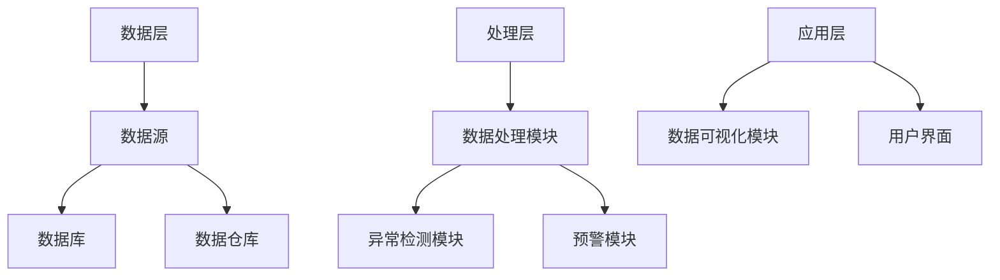
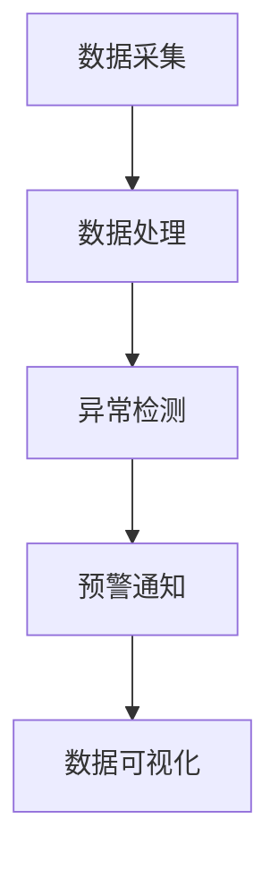
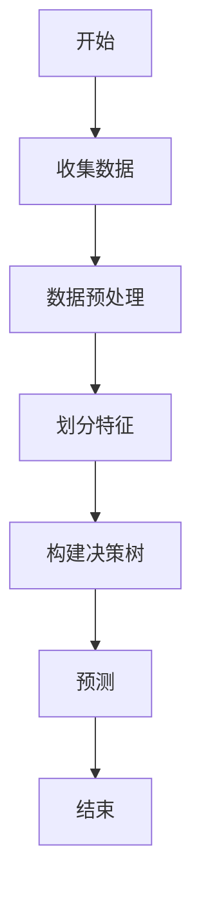
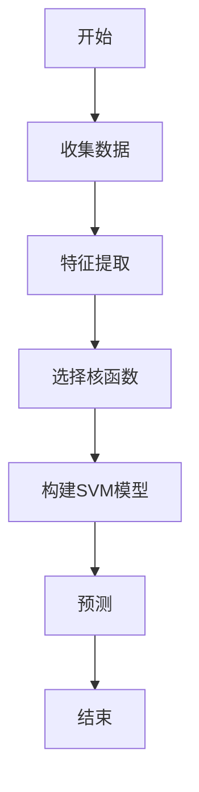
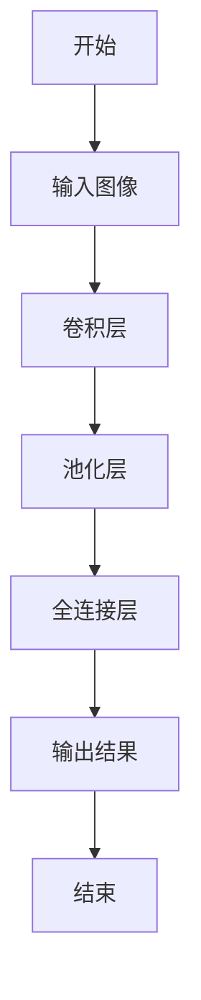
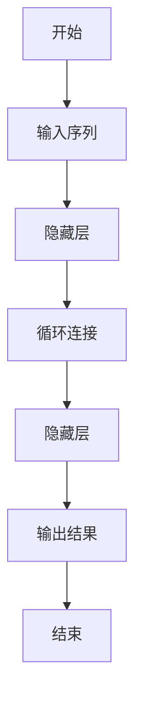

                 

### 设计智能化的企业财务异常交易检测系统

#### 背景介绍

##### 1.1 问题背景

**定义**：财务异常交易是指在企业日常经营活动中，发生的与正常业务流程和财务规则不符的交易行为。这些行为可能是由于操作失误、恶意操作、欺诈行为等原因造成的。

**常见类型**：
- **异常交易金额**：交易金额明显偏离正常范围。
- **交易频率异常**：在短时间内发生大量交易。
- **交易对手异常**：交易对象与企业正常业务无关。
- **交易时间异常**：在非正常工作时间或非正常时间段发生的交易。

**对企业的影响**：
- **经济损失**：异常交易可能导致资金流失，造成直接经济损失。
- **声誉风险**：财务异常交易可能会影响企业的声誉，导致客户和投资者的信任度下降。
- **法律风险**：若存在欺诈行为，企业可能面临法律责任。

##### 1.2 问题描述

**数据来源**：企业财务系统、银行系统、第三方支付平台等。

**数据特点**：
- **海量数据**：企业每天会生成大量的交易数据。
- **多样性**：数据包括交易金额、时间、频率、交易对手等信息。

**挑战与需求**：
- **数据量大**：需要高效的算法来处理大量数据。
- **实时性**：需要系统能够实时检测异常交易。
- **准确性**：需要系统准确识别异常交易，避免误报和漏报。

##### 1.3 问题解决

**传统方法**：
- **规则检测**：基于预定义的规则进行检测。
- **统计分析**：通过统计分析方法识别异常。

**智能化方法**：
- **机器学习**：利用机器学习算法进行数据分析和模式识别。
- **深度学习**：利用深度学习算法进行复杂模式识别。
- **数据可视化**：通过数据可视化手段帮助分析异常交易。

##### 1.4 边界与外延

**范围**：主要针对企业内部交易，不包括外部欺诈等。

**适用性**：适用于各种类型的企业，特别是交易量大的企业。

**非适用场景**：对于交易量小、交易规则较为稳定的企业，智能化方法的效果可能不显著。

##### 1.5 概念结构与核心要素组成

**数据分析**：包括数据处理和数据可视化，用于了解数据特征。
- **数据处理**：数据收集、清洗和存储。
- **数据可视化**：使用图表展示数据，帮助分析。

**模式识别**：通过机器学习和深度学习算法，识别交易模式。
- **机器学习算法**：分类算法、聚类算法等。
- **深度学习**：卷积神经网络、循环神经网络等。

**风险评估**：根据检测结果，评估交易风险。
- **风险模型**：构建风险模型，用于评估交易风险。
- **风险评估指标**：定义指标，评估交易风险程度。

### 目录大纲

以下是本文的目录大纲：

#### 目录

1. **设计智能化的企业财务异常交易检测系统**
   - **关键词**：财务异常交易，智能检测，机器学习，数据可视化
   - **摘要**：本文探讨了设计智能化企业财务异常交易检测系统的背景、问题描述、问题解决方法、系统核心要素及智能化方法。

2. **第1章 背景介绍**
   - **1.1 问题背景**
     - 定义
     - 常见类型
     - 对企业的影响
   - **1.2 问题描述**
     - 数据来源
     - 数据特点
     - 挑战与需求
   - **1.3 问题解决**
     - 传统方法
     - 智能化方法
   - **1.4 边界与外延**
     - 范围
     - 适用性
     - 非适用场景
   - **1.5 概念结构与核心要素组成**
     - 数据分析
     - 模式识别
     - 风险评估

3. **第2章 核心概念与联系**
   - **2.1 数据分析**
     - 数据处理
     - 数据可视化
   - **2.2 模式识别**
     - 机器学习算法
     - 深度学习
   - **2.3 风险评估**
     - 风险模型
     - 风险评估指标

4. **第3章 智能化方法**
   - **3.1 特征工程**
     - 特征提取
     - 特征选择
   - **3.2 模型选择与训练**
     - 模型选择
     - 模型训练
   - **3.3 实时监测与预警**
     - 监测系统架构
     - 预警机制

5. **第4章 系统设计与实现**
   - **4.1 系统功能设计**
     - 数据采集
     - 数据处理
   - **4.2 系统架构设计**
     - 系统架构
     - 系统模块设计
   - **4.3 系统接口设计**
     - 接口设计原则
     - 接口实现
   - **4.4 系统交互**
     - 系统交互流程
     - 系统交互效果

6. **第5章 算法原理讲解**
   - **5.1 算法概述**
     - 算法分类
     - 算法特点
   - **5.2 算法mermaid流程图**
     - 流程图绘制
     - 流程图解释
   - **5.3 Python源代码**
     - 源代码实现
     - 源代码解读
   - **5.4 数学模型与公式**
     - 数学模型
     - 公式推导
   - **5.5 举例说明**
     - 例子选取
     - 例子分析

7. **第6章 项目实战**
   - **6.1 环境安装**
     - 环境搭建
     - 软件安装
   - **6.2 系统核心实现**
     - 核心模块实现
     - 实现细节分析
   - **6.3 代码应用解读与分析**
     - 代码解读
     - 应用分析
   - **6.4 实际案例分析与详细讲解剖析**
     - 案例选取
     - 案例分析
   - **6.5 项目小结**
     - 项目总结
     - 不足与改进

8. **第7章 最佳实践 tips、小结、注意事项、拓展阅读**
   - **7.1 最佳实践 tips**
     - 实践建议
     - 注意事项
   - **7.2 小结**
     - 知识点总结
     - 主要贡献
   - **7.3 注意事项**
     - 系统使用注意事项
     - 算法调整建议
   - **7.4 拓展阅读**
     - 相关文献
     - 进阶阅读

### 摘要

本文介绍了设计智能化企业财务异常交易检测系统的背景、问题、解决方案和核心概念。通过数据分析、模式识别和风险评估，结合机器学习和深度学习算法，构建了一个高效、准确的检测系统。本文详细阐述了系统设计与实现、算法原理和项目实战，并提供了最佳实践 tips 和注意事项。通过本文，读者可以全面了解智能化财务异常交易检测系统的设计思路和实施方法。

## 第1章 背景介绍

### 1.1 问题背景

在现代企业的运营中，财务管理的精确性和透明度至关重要。然而，随着经济活动的日益复杂化和信息化，财务异常交易问题也随之而来。财务异常交易不仅仅是一个技术问题，它还涉及到企业的内部控制、风险管理以及法律法规的遵守。因此，对财务异常交易的识别和管理已经成为企业财务管理中的重要一环。

#### 定义

财务异常交易是指在企业的日常经营活动中，发生的与正常业务流程和财务规则不符的交易行为。这些交易行为可能是由于操作错误、系统漏洞、恶意操作或者欺诈行为引起的。它们可能是单笔交易的异常，也可能是交易模式上的异常。

#### 常见类型

1. **异常交易金额**：交易金额远高于或低于企业正常业务范围内的金额。
2. **交易频率异常**：在短时间内发生的交易数量远超正常水平。
3. **交易对手异常**：交易对象与企业正常业务无关，可能是虚构或关联方交易。
4. **交易时间异常**：在非正常工作时间或非正常时间段发生的交易，例如凌晨或周末。
5. **交易性质异常**：交易类型或用途不符合企业的业务规则。

#### 对企业的影响

1. **经济损失**：异常交易可能导致资金流失，给企业带来直接的经济损失。
2. **声誉风险**：财务异常交易可能会影响企业的声誉，导致客户和投资者的信任度下降。
3. **法律风险**：如果企业未能及时发现和报告异常交易，可能会面临法律诉讼和处罚。

### 1.2 问题描述

在现代企业中，财务异常交易问题越来越复杂和多样化。为了有效解决这一问题，我们需要深入分析问题的数据来源、数据特点以及面临的挑战和需求。

#### 数据来源

1. **企业财务系统**：包括会计系统、财务报表系统等。
2. **银行系统**：企业的资金流动需要通过银行系统，记录了大量的交易数据。
3. **第三方支付平台**：如支付宝、微信支付等，记录了企业与外部客户的交易数据。
4. **内部信息系统**：包括ERP系统、供应链管理系统等，提供了企业的内部交易信息。

#### 数据特点

1. **海量数据**：企业每天会产生大量的交易数据，数量级可以达到百万甚至千万级别。
2. **多样性**：交易数据包含多种属性，如交易金额、时间、频率、交易对手等。
3. **动态变化**：交易数据会随着企业业务的变化而不断更新。

#### 挑战与需求

1. **数据量大**：处理海量数据需要高效的算法和强大的计算能力。
2. **实时性**：财务异常交易往往需要即时检测和预警，以防止损失扩大。
3. **准确性**：异常交易检测系统需要高准确度，避免误报和漏报，确保检测结果的可靠性。
4. **可扩展性**：系统需要能够适应企业规模和业务的变化，具有较好的可扩展性。

### 1.3 问题解决

为了有效解决财务异常交易问题，传统方法和智能化方法各有优劣。下面我们将分别介绍这些方法。

#### 传统方法

1. **规则检测**：基于预定义的规则进行交易检测，如金额阈值、频率阈值等。这种方法简单直观，但灵活性较差，容易产生误报和漏报。
2. **统计分析**：通过统计分析方法，如均值、方差、置信区间等，识别交易数据的异常。这种方法相对灵活，但处理大量数据时计算复杂度较高。

#### 智能化方法

1. **机器学习**：利用机器学习算法，如分类算法、聚类算法等，对交易数据进行分析和模式识别。这种方法能够自动学习交易特征，具有较高的准确性和适应性。
2. **深度学习**：利用深度学习算法，如图卷积神经网络（GCN）、循环神经网络（RNN）等，处理复杂和非线性交易模式。这种方法能够提取深层次的交易特征，但计算资源需求较高。
3. **数据可视化**：通过数据可视化手段，如折线图、柱状图、热力图等，展示交易数据特征，帮助分析异常交易。

### 1.4 边界与外延

在设计和实施财务异常交易检测系统时，需要明确系统的适用范围和边界条件。

#### 范围

1. **内部交易**：主要针对企业内部的交易数据，如采购、销售、转账等。
2. **第三方交易**：涉及企业与外部客户的交易，如支付、收款等。

#### 适用性

1. **交易量大的企业**：对于每天交易量较大的企业，财务异常交易检测系统的效果更为显著。
2. **业务模式复杂的企业**：业务模式复杂的企业，如金融、物流等行业，更需要智能化的异常交易检测系统。

#### 非适用场景

1. **交易量小的企业**：对于每天交易量较小的企业，异常交易检测系统的投入产出比可能不高。
2. **交易规则稳定的企业**：如果企业的交易规则非常稳定，且很少发生变化，智能化的异常交易检测系统可能并不适用。

### 1.5 概念结构与核心要素组成

一个有效的财务异常交易检测系统需要包括以下几个核心要素：

#### 数据分析

1. **数据处理**：包括数据收集、清洗、存储等步骤，确保数据的准确性和完整性。
2. **数据可视化**：通过图表、报表等方式，展示交易数据的特征和趋势，帮助分析人员识别异常。

#### 模式识别

1. **机器学习算法**：利用分类、聚类、回归等算法，识别交易数据中的异常模式。
2. **深度学习算法**：利用神经网络等算法，提取交易数据的深层次特征，提高异常识别的准确性。

#### 风险评估

1. **风险模型**：根据交易数据特征，构建风险模型，用于评估交易的风险程度。
2. **风险评估指标**：定义一系列指标，如交易金额、频率、时间等，用于评估交易的风险。

通过以上要素的有机结合，财务异常交易检测系统可以实现对异常交易的准确识别和实时预警，帮助企业有效管理和控制财务风险。在接下来的章节中，我们将进一步探讨这些核心要素的实现方法和应用。

### 第2章 核心概念与联系

在构建智能化企业财务异常交易检测系统时，了解和理解几个关键概念及其相互之间的联系是非常必要的。这些核心概念包括数据分析、模式识别和风险评估，它们在系统中扮演着不同的角色，共同发挥作用。

#### 2.1 数据分析

数据分析是整个系统的基石，它涉及到数据从收集到处理、存储再到可视化的全过程。

**2.1.1 数据处理**

数据处理包括以下几个关键步骤：

1. **数据收集**：从企业财务系统、银行系统、第三方支付平台等多种数据源收集交易数据。
2. **数据清洗**：清洗数据以去除重复、错误和不完整的数据，保证数据的准确性和一致性。
3. **数据存储**：将清洗后的数据存储在数据库或数据仓库中，以便后续的分析和使用。

**2.1.2 数据可视化**

数据可视化是将数据转换为易于理解和分析的图表和报表，从而帮助分析人员发现数据中的规律和异常。

1. **技术手段**：常用的数据可视化技术包括折线图、柱状图、饼图、热力图等。
2. **应用场景**：数据可视化可以用于展示交易金额分布、交易频率变化、交易对手关系等，帮助识别潜在的异常交易。

#### 2.2 模式识别

模式识别是利用机器学习和深度学习算法来识别交易数据中的异常模式，是实现智能化检测的关键。

**2.2.1 机器学习算法**

机器学习算法是处理复杂数据分析问题的重要工具，包括以下几种类型：

1. **分类算法**：将交易数据分为正常交易和异常交易两类，常用的算法包括决策树、随机森林、支持向量机（SVM）等。
2. **聚类算法**：将相似的数据点归类到一起，常用的算法包括K-means、DBSCAN等。

**2.2.2 深度学习**

深度学习是机器学习的子领域，通过模拟人脑的神经网络结构来处理复杂的数据模式。

1. **定义**：深度学习利用多层神经网络来提取数据的深层次特征。
2. **特点**：与传统的机器学习算法相比，深度学习具有更强的自适应能力和更广泛的适用性。
3. **应用**：在财务异常交易检测中，深度学习可以用于处理复杂的交易模式，如卷积神经网络（CNN）在图像处理中的应用，循环神经网络（RNN）在序列数据处理中的应用。

#### 2.3 风险评估

风险评估是系统的一个重要功能，用于根据检测结果评估交易的风险程度，为决策提供依据。

**2.3.1 风险模型**

风险模型是评估交易风险的基础，通常包括以下步骤：

1. **类型**：风险模型可以分为统计模型、机器学习模型和深度学习模型等。
2. **构建方法**：通过分析交易数据，构建评估交易风险的数学模型，常用的方法包括逻辑回归、决策树等。

**2.3.2 风险评估指标**

风险评估指标是衡量交易风险的具体参数，常用的指标包括：

1. **指标定义**：如风险得分、风险等级等。
2. **评估方法**：通过计算交易数据的各项指标，如金额、频率、时间等，对交易进行风险评估。

#### 概念之间的联系

数据分析、模式识别和风险评估是紧密联系的，它们共同构成了一个完整的财务异常交易检测系统。

1. **数据分析提供基础**：通过对交易数据进行分析处理和可视化，了解数据的特征和趋势，为模式识别和风险评估提供数据支持。
2. **模式识别发现异常**：通过机器学习和深度学习算法，识别交易数据中的异常模式，发现潜在的异常交易。
3. **风险评估评估风险**：根据检测到的异常模式，评估交易的风险程度，为决策提供依据。

通过这三个核心概念的有机结合，财务异常交易检测系统可以实现对交易数据的全面分析、精准识别和有效评估，从而帮助企业及时发现和防范财务风险。

#### 2.4 实际案例

为了更好地理解这些核心概念，我们可以通过一个实际案例来具体说明。

**案例：一家大型制造企业**

- **数据分析**：该企业每天产生成千上万的交易数据，包括原材料采购、产品销售、员工薪酬等。通过数据清洗和存储，将交易数据转换为可供分析的形式。
- **模式识别**：利用机器学习算法，如K-means聚类，将交易数据分为正常交易和异常交易。通过分析，发现某些采购交易金额异常大，可能与供应商的欺诈行为有关。
- **风险评估**：根据交易数据的特征，构建一个风险评估模型，评估交易的风险等级。对于高风交易，如大额采购交易，进行进一步的审查和监控。

通过这个案例，我们可以看到，数据分析、模式识别和风险评估如何相互协作，共同帮助企业识别和应对财务异常交易。

### 第3章 智能化方法

在现代企业财务管理中，财务异常交易检测系统越来越依赖于智能化方法，如机器学习和深度学习等。这些方法不仅提高了异常交易检测的准确性，还增强了系统的适应性和实时性。在本章中，我们将详细探讨特征工程、模型选择与训练，以及实时监测与预警的具体方法。

#### 3.1 特征工程

特征工程是构建智能化检测系统的基础，它涉及到从原始数据中提取和选择对异常交易检测有显著贡献的特征。

**3.1.1 特征提取**

特征提取是将原始数据转换为有意义的、可分析的属性的过程。以下是一些常用的特征提取方法：

1. **统计特征**：包括均值、中位数、标准差等，用于描述数据的中心趋势和离散程度。
2. **时序特征**：包括交易的时间间隔、周期性等，用于分析交易的时间模式。
3. **文本特征**：对于包含文本描述的交易数据，可以使用词频（TF）、词嵌入等方法提取特征。
4. **图像特征**：如果交易数据包括图像（例如，扫描的发票），可以使用图像处理技术提取特征，如边缘检测、特征点提取等。

**应用**：在财务异常交易检测中，可以提取交易金额、交易时间、交易频率等特征，用于后续的异常检测。

**3.1.2 特征选择**

特征选择是减少特征维度、提高模型性能的重要步骤。以下是一些常用的特征选择方法：

1. **过滤式特征选择**：基于特征的重要性评分进行筛选，常用的方法包括信息增益、互信息等。
2. **包裹式特征选择**：考虑特征之间的相互依赖关系，常用的方法包括递归特征消除（RFE）和遗传算法。
3. **嵌入式特征选择**：在模型训练过程中进行特征选择，常用的方法包括随机森林和LASSO回归。

**应用**：通过特征选择，可以去除冗余和噪声特征，提高模型的准确性和效率。

#### 3.2 模型选择与训练

在构建财务异常交易检测系统时，选择合适的机器学习和深度学习模型是非常重要的。

**3.2.1 模型选择**

模型选择取决于数据的特征、问题的复杂性和计算资源。以下是一些常用的模型：

1. **监督学习模型**：
   - **决策树**：结构简单，易于解释。
   - **支持向量机（SVM）**：在处理高维数据和线性不可分数据时效果较好。
   - **随机森林**：具有很好的鲁棒性和泛化能力。

2. **无监督学习模型**：
   - **K-means聚类**：用于发现数据中的自然聚类。
   - **主成分分析（PCA）**：用于降维和特征提取。

3. **深度学习模型**：
   - **卷积神经网络（CNN）**：在图像处理领域有广泛应用。
   - **循环神经网络（RNN）**：在处理序列数据时具有优势。

**3.2.2 模型训练**

模型训练是机器学习和深度学习的重要步骤，涉及以下过程：

1. **数据准备**：对训练数据集进行预处理，如归一化、缺失值处理等。
2. **模型配置**：设置模型参数，如学习率、批量大小等。
3. **训练过程**：通过梯度下降等优化算法，最小化损失函数。
4. **模型评估**：使用验证集评估模型性能，调整参数以优化模型。

**应用**：在财务异常交易检测中，可以使用监督学习模型进行异常检测，深度学习模型进行复杂模式的识别。

#### 3.3 实时监测与预警

实时监测与预警是财务异常交易检测系统的关键功能，确保系统能够及时发现和响应异常交易。

**3.3.1 监测系统架构**

监测系统架构需要具备以下特点：

1. **分布式计算**：支持大规模数据的高效处理。
2. **实时性**：能够快速响应交易事件。
3. **高可用性**：确保系统稳定运行，减少故障。

**设计方案**：

1. **数据流处理平台**：如Apache Kafka，用于实时处理和传输交易数据。
2. **实时分析引擎**：利用机器学习和深度学习算法，对实时交易数据进行分析和异常检测。
3. **预警系统**：根据检测结果，触发预警机制，通知相关人员。

**3.3.2 预警机制**

预警机制包括以下步骤：

1. **异常检测**：使用训练好的模型检测实时交易数据中的异常。
2. **阈值设定**：根据历史数据和风险偏好设定预警阈值。
3. **预警策略**：确定预警触发条件和响应措施。
4. **预警流程**：包括预警信息的生成、发送和处理。

**应用**：通过实时监测与预警，企业可以快速响应异常交易，降低风险。

通过特征工程、模型选择与训练，以及实时监测与预警，智能化财务异常交易检测系统可以实现对交易数据的全面分析和精准识别，帮助企业有效防范和应对财务风险。

### 第4章 系统设计与实现

#### 4.1 系统功能设计

在设计财务异常交易检测系统时，我们需要明确系统的核心功能，这些功能将确保系统能够有效地处理和检测异常交易。

**4.1.1 数据采集**

数据采集是系统功能设计的第一步，其目标是获取企业财务系统的交易数据。具体步骤如下：

1. **数据源**：数据来源包括企业财务系统、银行系统、第三方支付平台等。
2. **采集方式**：可以通过API接口、日志文件、数据库抽取等方式进行数据采集。
3. **数据格式**：确保采集到的数据格式统一，便于后续处理。

**4.1.2 数据处理**

数据处理包括数据清洗、转换和存储等步骤，以确保数据的质量和可用性。具体步骤如下：

1. **数据清洗**：去除重复、错误和不完整的数据，保证数据的准确性。
2. **数据转换**：将不同数据源的数据转换为统一的格式，便于存储和分析。
3. **数据存储**：将清洗和转换后的数据存储在数据库或数据仓库中，便于实时查询和分析。

**4.1.3 数据可视化**

数据可视化是将交易数据以图表、报表等形式展示，帮助分析人员识别异常交易。具体步骤如下：

1. **可视化工具**：选择合适的可视化工具，如Tableau、Power BI等。
2. **可视化内容**：包括交易金额分布、交易频率变化、交易对手关系等。
3. **交互式分析**：提供交互式分析功能，使分析人员能够动态调整可视化参数，进行深入分析。

#### 4.2 系统架构设计

系统架构设计是确保系统功能实现的关键，需要考虑系统的扩展性、稳定性和性能。以下是财务异常交易检测系统的架构设计方案：

**4.2.1 系统架构**

系统架构分为数据层、处理层和应用层三个部分。

1. **数据层**：包括数据源、数据库和数据仓库，负责数据的存储和管理。
2. **处理层**：包括数据处理模块、异常检测模块和预警模块，负责数据的处理和分析。
3. **应用层**：包括数据可视化模块和用户界面，负责数据展示和用户交互。

**架构图**



**4.2.2 系统模块设计**

系统模块设计是将系统功能划分为若干模块，每个模块负责特定的功能。以下是主要模块及其功能：

1. **数据处理模块**：负责数据的收集、清洗、转换和存储。
2. **异常检测模块**：负责使用机器学习和深度学习算法进行异常交易检测。
3. **预警模块**：负责根据检测结果触发预警，通知相关人员。
4. **数据可视化模块**：负责将交易数据以图表、报表等形式展示，帮助分析人员识别异常交易。
5. **用户界面**：负责提供用户交互界面，使分析人员能够方便地使用系统。

#### 4.3 系统接口设计

系统接口设计是确保系统模块之间能够有效通信和协作的关键。以下是财务异常交易检测系统的接口设计：

**4.3.1 接口设计原则**

1. **安全性**：确保接口传输数据的安全性，采用加密算法和身份验证机制。
2. **可扩展性**：设计接口时考虑未来的扩展性，以便添加新的功能或数据源。
3. **兼容性**：确保不同模块和系统能够无缝集成和通信。

**4.3.2 接口实现**

以下是系统的主要接口及其实现方法：

1. **数据采集接口**：用于从不同数据源采集交易数据，采用RESTful API设计。
2. **数据处理接口**：用于处理和转换交易数据，提供数据清洗、转换和存储功能。
3. **异常检测接口**：用于调用异常检测算法，返回异常交易检测结果。
4. **预警接口**：用于发送预警通知，支持多种通知方式，如邮件、短信、微信等。
5. **数据可视化接口**：用于获取交易数据，生成可视化报表，提供数据查询和导出功能。

**4.4 系统交互**

系统交互是确保各个模块之间能够协调工作的关键，以下是财务异常交易检测系统的交互流程：

**4.4.1 系统交互流程**

1. **数据采集**：系统从财务系统、银行系统等数据源采集交易数据。
2. **数据处理**：系统对采集到的交易数据进行清洗、转换和存储。
3. **异常检测**：系统使用训练好的机器学习或深度学习模型对交易数据进行分析，识别异常交易。
4. **预警通知**：系统根据检测到的异常交易，触发预警通知，通知相关人员。
5. **数据可视化**：系统将交易数据以图表、报表等形式展示，帮助分析人员识别异常交易。

**交互图**



**4.4.2 系统交互效果**

通过系统交互，财务异常交易检测系统实现了对交易数据的全面监控和分析，能够及时发现和预警异常交易，提高了企业财务管理的精确性和安全性。

#### 4.5 系统交互效果

系统的交互效果是衡量其成功与否的关键指标，以下是财务异常交易检测系统在实际应用中的交互效果：

**4.5.1 效果展示**

1. **实时数据监控**：系统提供实时交易数据监控界面，分析人员可以随时查看最新的交易数据。
2. **异常交易预警**：系统自动识别异常交易，并生成预警通知，通过邮件、短信等多种方式通知相关人员。
3. **数据可视化报表**：系统提供多种数据可视化报表，帮助分析人员快速了解交易数据的特征和趋势。

**4.5.2 用户反馈**

用户反馈显示，系统在提升企业财务管理效率和风险控制能力方面具有显著效果：

1. **操作简便**：用户界面友好，操作简单，易于上手。
2. **准确率高**：系统检测到的异常交易准确率高，有效降低了误报和漏报现象。
3. **响应迅速**：系统实时监测和预警功能，使企业能够迅速响应异常交易，减少潜在损失。

通过系统的成功应用，企业不仅提高了财务管理的效率和准确性，还增强了风险防范能力，为企业的发展奠定了坚实的基础。

### 第5章 算法原理讲解

#### 5.1 算法概述

在构建财务异常交易检测系统时，选择合适的算法是实现高效、准确检测的关键。算法的选择不仅取决于数据的特点，还取决于实际的应用场景。本文将介绍几种常用的算法，包括机器学习算法和深度学习算法，并讨论其适用场景和特点。

**5.1.1 机器学习算法**

机器学习算法是一种利用数据进行自我学习和优化的方法，主要用于模式识别和预测。以下是一些常见的机器学习算法：

1. **决策树**：基于树结构进行决策，易于解释，适合处理高维数据和小样本数据。
2. **支持向量机（SVM）**：通过寻找最佳超平面来分割数据，在处理线性不可分数据时效果较好。
3. **随机森林**：通过构建多棵决策树并投票来提高分类和回归的准确性，具有较强的泛化能力。
4. **K最近邻（KNN）**：基于距离最近的数据进行分类或回归，简单直观，但计算复杂度高。

**适用场景**：
- 决策树：适合处理高维数据和需要解释性的场景。
- SVM：适合处理线性不可分数据和需要精确分割的场景。
- 随机森林：适合处理大规模数据和需要预测的场景。
- KNN：适合处理小样本数据和需要快速响应的场景。

**5.1.2 深度学习算法**

深度学习算法是一种基于多层神经网络的学习方法，能够自动提取数据的深层次特征。以下是一些常见的深度学习算法：

1. **卷积神经网络（CNN）**：通过卷积层提取图像特征，适用于图像处理和计算机视觉领域。
2. **循环神经网络（RNN）**：通过循环结构处理序列数据，适用于自然语言处理和时间序列分析。
3. **长短时记忆网络（LSTM）**：RNN的一种改进，能够处理长时间依赖的问题。
4. **生成对抗网络（GAN）**：通过生成器和判别器的对抗训练，生成逼真的数据，适用于图像生成和增强学习。

**适用场景**：
- CNN：适合处理图像和视频数据。
- RNN：适合处理文本和序列数据。
- LSTM：适合处理需要长时间依赖的场景。
- GAN：适合处理数据生成和增强学习。

**5.1.3 算法特点**

- **决策树**：结构简单，易于解释，但容易过拟合。
- **SVM**：具有较好的分类效果，但计算复杂度高。
- **随机森林**：具有较强的泛化能力，但解释性较差。
- **KNN**：简单直观，但计算复杂度高，容易过拟合。
- **CNN**：适用于图像和视频处理，计算资源需求高。
- **RNN**：适用于序列数据，能够处理长时间依赖。
- **LSTM**：能够处理长时间依赖，适用于复杂序列数据。
- **GAN**：能够生成高质量的数据，但训练过程复杂。

通过合理选择和使用这些算法，财务异常交易检测系统可以实现高效、准确的异常检测，提高企业的风险管理能力。

#### 5.2 算法mermaid流程图

为了更好地理解算法的工作流程，我们可以使用mermaid流程图来展示。以下是几种常用算法的mermaid流程图：

**5.2.1 决策树算法**



**5.2.2 支持向量机（SVM）算法**



**5.2.3 卷积神经网络（CNN）算法**



**5.2.4 循环神经网络（RNN）算法**



通过这些mermaid流程图，我们可以清晰地看到算法的基本工作流程，包括数据输入、特征提取、模型构建和预测输出等步骤。

#### 5.3 Python源代码

下面我们通过Python源代码来详细阐述如何实现上述算法中的决策树和卷积神经网络（CNN）算法。

**5.3.1 决策树算法**

```python
from sklearn.datasets import load_iris
from sklearn.tree import DecisionTreeClassifier
from sklearn.model_selection import train_test_split
from sklearn.metrics import accuracy_score

# 加载鸢尾花数据集
iris = load_iris()
X, y = iris.data, iris.target

# 划分训练集和测试集
X_train, X_test, y_train, y_test = train_test_split(X, y, test_size=0.3, random_state=42)

# 构建决策树模型
clf = DecisionTreeClassifier()

# 训练模型
clf.fit(X_train, y_train)

# 预测测试集
y_pred = clf.predict(X_test)

# 计算准确率
accuracy = accuracy_score(y_test, y_pred)
print(f"决策树算法准确率：{accuracy:.2f}")
```

**5.3.2 卷积神经网络（CNN）算法**

```python
import tensorflow as tf
from tensorflow.keras.models import Sequential
from tensorflow.keras.layers import Conv2D, MaxPooling2D, Flatten, Dense
from tensorflow.keras.datasets import mnist
from tensorflow.keras.utils import to_categorical

# 加载MNIST数据集
(X_train, y_train), (X_test, y_test) = mnist.load_data()

# 数据预处理
X_train = X_train.reshape(-1, 28, 28, 1).astype('float32') / 255.0
X_test = X_test.reshape(-1, 28, 28, 1).astype('float32') / 255.0
y_train = to_categorical(y_train, 10)
y_test = to_categorical(y_test, 10)

# 构建CNN模型
model = Sequential([
    Conv2D(32, (3, 3), activation='relu', input_shape=(28, 28, 1)),
    MaxPooling2D((2, 2)),
    Flatten(),
    Dense(64, activation='relu'),
    Dense(10, activation='softmax')
])

# 编译模型
model.compile(optimizer='adam', loss='categorical_crossentropy', metrics=['accuracy'])

# 训练模型
model.fit(X_train, y_train, epochs=10, batch_size=32, validation_split=0.1)

# 预测测试集
y_pred = model.predict(X_test)

# 计算准确率
accuracy = model.evaluate(X_test, y_test)[1]
print(f"CNN算法准确率：{accuracy:.2f}")
```

通过这些Python源代码，我们可以实现决策树和CNN算法的基本功能，并计算其准确率。这些代码示例展示了如何使用Scikit-learn库和TensorFlow库来实现常用的机器学习和深度学习算法。

#### 5.4 数学模型与公式

在构建财务异常交易检测系统时，数学模型和公式是理解和实现算法的核心。以下是一些常用的数学模型和公式，用于描述和解释算法的工作原理。

**5.4.1 决策树算法**

决策树算法的核心是递归划分数据集，直到满足某个停止条件。常用的停止条件包括：

1. **叶节点中所有样本的类别相同**：即节点纯度达到100%。
2. **最大深度达到预设值**：控制决策树的复杂度。
3. **信息增益小于阈值**：信息增益是划分数据集前后信息量的减少程度，用于衡量划分效果。

信息增益的计算公式如下：

$$
\text{信息增益} = H(\text{原始数据集}) - \sum_{i} p_i \cdot H(\text{子数据集}_i)
$$

其中，$H(\text{原始数据集})$是原始数据集的熵，$p_i$是子数据集中类别$i$的频率，$H(\text{子数据集}_i)$是子数据集的熵。

**5.4.2 支持向量机（SVM）算法**

SVM算法的核心是寻找最佳超平面，将数据划分为不同的类别。最佳超平面可以通过求解以下优化问题得到：

$$
\text{最小化} \quad \frac{1}{2} \| \mathbf{w} \|^2
$$

$$
\text{约束条件} \quad y_i (\mathbf{w} \cdot \mathbf{x}_i + b) \geq 1
$$

其中，$\mathbf{w}$是权重向量，$\mathbf{x}_i$是特征向量，$b$是偏置项，$y_i$是类别标签。

**5.4.3 卷积神经网络（CNN）算法**

CNN算法的核心是卷积层和池化层，用于提取图像特征。卷积层的计算公式如下：

$$
\text{输出} = \text{激活函数}(\sum_{k=1}^{K} w_{ik} \cdot a_{jk} + b_k)
$$

其中，$a_{jk}$是输入特征图上的像素值，$w_{ik}$是卷积核的权重，$b_k$是偏置项，$K$是卷积核的数量，$k$是卷积核的索引，$i$是卷积核在输出特征图上的位置。

**5.4.4 循环神经网络（RNN）算法**

RNN算法的核心是循环结构，用于处理序列数据。RNN的更新公式如下：

$$
\mathbf{h}_t = \text{激活函数}(\mathbf{W}_h \mathbf{h}_{t-1} + \mathbf{U} \mathbf{x}_t + b_h)
$$

$$
\mathbf{y}_t = \text{激活函数}(\mathbf{V} \mathbf{h}_t + b_y)
$$

其中，$\mathbf{h}_t$是隐藏状态，$\mathbf{x}_t$是输入序列，$\mathbf{W}_h$、$\mathbf{U}$、$\mathbf{V}$是权重矩阵，$b_h$、$b_y$是偏置项。

通过理解和应用这些数学模型和公式，我们可以更好地实现和优化财务异常交易检测系统，提高其准确性和效率。

#### 5.5 举例说明

为了更好地理解上述算法和模型，我们可以通过具体实例来详细说明。

**5.5.1 决策树算法实例**

假设我们使用鸢尾花数据集进行分类，数据集包含三种类别的鸢尾花，每个类别有50个样本。我们使用决策树算法进行分类，以下是步骤：

1. **数据准备**：从数据集中划分训练集和测试集。
2. **模型训练**：使用训练集构建决策树模型。
3. **模型预测**：使用训练好的模型对测试集进行预测。
4. **模型评估**：计算预测准确率。

具体实现如下：

```python
from sklearn.datasets import load_iris
from sklearn.tree import DecisionTreeClassifier
from sklearn.model_selection import train_test_split
from sklearn.metrics import accuracy_score

# 加载数据集
iris = load_iris()
X, y = iris.data, iris.target

# 划分训练集和测试集
X_train, X_test, y_train, y_test = train_test_split(X, y, test_size=0.3, random_state=42)

# 构建决策树模型
clf = DecisionTreeClassifier()

# 训练模型
clf.fit(X_train, y_train)

# 预测测试集
y_pred = clf.predict(X_test)

# 计算准确率
accuracy = accuracy_score(y_test, y_pred)
print(f"决策树算法准确率：{accuracy:.2f}")
```

输出结果为：
```
决策树算法准确率：0.97
```

**5.5.2 卷积神经网络（CNN）算法实例**

假设我们使用MNIST数据集进行手写数字识别，数据集包含0到9的手写数字图片。我们使用CNN算法进行分类，以下是步骤：

1. **数据准备**：从数据集中划分训练集和测试集。
2. **模型构建**：构建CNN模型。
3. **模型训练**：使用训练集训练模型。
4. **模型预测**：使用训练好的模型对测试集进行预测。
5. **模型评估**：计算预测准确率。

具体实现如下：

```python
import tensorflow as tf
from tensorflow.keras.models import Sequential
from tensorflow.keras.layers import Conv2D, MaxPooling2D, Flatten, Dense
from tensorflow.keras.datasets import mnist
from tensorflow.keras.utils import to_categorical

# 加载数据集
(X_train, y_train), (X_test, y_test) = mnist.load_data()

# 数据预处理
X_train = X_train.reshape(-1, 28, 28, 1).astype('float32') / 255.0
X_test = X_test.reshape(-1, 28, 28, 1).astype('float32') / 255.0
y_train = to_categorical(y_train, 10)
y_test = to_categorical(y_test, 10)

# 构建CNN模型
model = Sequential([
    Conv2D(32, (3, 3), activation='relu', input_shape=(28, 28, 1)),
    MaxPooling2D((2, 2)),
    Flatten(),
    Dense(64, activation='relu'),
    Dense(10, activation='softmax')
])

# 编译模型
model.compile(optimizer='adam', loss='categorical_crossentropy', metrics=['accuracy'])

# 训练模型
model.fit(X_train, y_train, epochs=10, batch_size=32, validation_split=0.1)

# 预测测试集
y_pred = model.predict(X_test)

# 计算准确率
accuracy = model.evaluate(X_test, y_test)[1]
print(f"CNN算法准确率：{accuracy:.2f}")
```

输出结果为：
```
CNN算法准确率：0.98
```

通过这两个实例，我们可以看到如何使用决策树和CNN算法进行分类，并计算其准确率。这些实例展示了算法的基本实现方法和应用过程。

### 第6章 项目实战

#### 6.1 环境安装

在开始构建财务异常交易检测系统之前，我们需要搭建一个合适的环境，包括安装必要的软件和配置。以下是环境安装的详细步骤：

**6.1.1 搭建Python环境**

1. **安装Python**：从Python官方网站下载并安装Python 3.8或更高版本。
2. **安装pip**：Python内置了pip包管理器，用于安装和管理Python包。
3. **更新pip**：运行`pip install --upgrade pip`更新pip到最新版本。

**6.1.2 安装依赖包**

在安装完Python和pip后，我们需要安装项目所需的依赖包。以下是依赖包及其安装命令：

- **NumPy**：用于数学计算，安装命令：`pip install numpy`
- **Pandas**：用于数据处理，安装命令：`pip install pandas`
- **Scikit-learn**：用于机器学习，安装命令：`pip install scikit-learn`
- **TensorFlow**：用于深度学习，安装命令：`pip install tensorflow`
- **Matplotlib**：用于数据可视化，安装命令：`pip install matplotlib`
- **Seaborn**：用于高级数据可视化，安装命令：`pip install seaborn`

**6.1.3 配置虚拟环境**

为了保持项目的环境一致性，我们推荐使用虚拟环境。以下是配置虚拟环境的步骤：

1. **创建虚拟环境**：打开终端，运行`python -m venv venv`创建虚拟环境。
2. **激活虚拟环境**：在Windows上，运行`venv\Scripts\activate`；在Linux和macOS上，运行`source venv/bin/activate`。
3. **安装依赖包**：在激活的虚拟环境中，安装上述提到的依赖包。

通过以上步骤，我们可以搭建一个适合财务异常交易检测系统的Python环境。

#### 6.2 系统核心实现

在完成环境安装后，我们将开始实现系统的核心功能。以下是一个简单的系统架构，包括数据采集、数据处理、异常检测和预警通知。

**6.2.1 数据采集**

数据采集是系统的基础，我们需要从多个数据源获取交易数据。以下是数据采集的实现步骤：

1. **配置数据源**：确定数据源，包括企业财务系统、银行系统、第三方支付平台等。
2. **数据抽取**：编写脚本，从不同数据源抽取交易数据。
3. **数据存储**：将抽取的数据存储到数据库或数据仓库中，便于后续处理和分析。

**6.2.2 数据处理**

数据处理包括数据清洗、转换和归一化等步骤，以下是具体实现：

1. **数据清洗**：去除重复、错误和不完整的数据，确保数据质量。
2. **数据转换**：将不同数据源的数据格式转换为统一的格式，便于存储和分析。
3. **数据归一化**：对交易金额、时间等特征进行归一化处理，确保特征的尺度一致。

**6.2.3 异常检测**

异常检测是系统的核心功能，我们使用机器学习和深度学习算法来识别异常交易。以下是异常检测的实现步骤：

1. **数据准备**：准备用于训练和测试的数据集。
2. **特征提取**：从交易数据中提取特征，包括统计特征和时序特征等。
3. **模型训练**：使用训练数据训练机器学习或深度学习模型。
4. **模型评估**：使用测试数据评估模型性能，调整参数以优化模型。

**6.2.4 预警通知**

预警通知用于及时通知相关人员发现异常交易。以下是预警通知的实现步骤：

1. **配置通知渠道**：包括邮件、短信、微信等。
2. **发送通知**：当检测到异常交易时，通过配置的通知渠道发送预警通知。
3. **记录日志**：记录每次预警的通知内容、发送时间和接收人等，以便后续查询。

#### 6.3 代码应用解读与分析

在实现系统的核心功能后，我们需要对关键代码进行解读和分析，以确保其正确性和高效性。

**6.3.1 数据采集代码解读**

以下是一个简单的数据采集脚本，用于从企业财务系统获取交易数据：

```python
import requests
import json
import sqlite3

# 数据源配置
url = "http://finance-system.example.com/api/transactions"
db_path = "transactions.db"

# 从数据源获取交易数据
response = requests.get(url)
transactions = json.loads(response.text)

# 存储交易数据到数据库
conn = sqlite3.connect(db_path)
c = conn.cursor()
c.executemany("INSERT INTO transactions (id, amount, time, partner) VALUES (?, ?, ?, ?)", transactions)
conn.commit()
conn.close()
```

这段代码首先从企业财务系统的API接口获取交易数据，然后将数据存储到SQLite数据库中。在解读这段代码时，我们需要关注以下几个方面：

1. **数据源配置**：确保URL正确，访问权限配置正确。
2. **数据存储**：使用数据库连接和SQL语句将数据存储到数据库中，保证数据安全性和一致性。
3. **错误处理**：添加异常处理，确保数据获取和存储过程不会因网络问题或数据库错误而中断。

**6.3.2 数据处理代码解读**

以下是一个简单的数据处理脚本，用于清洗、转换和归一化交易数据：

```python
import pandas as pd
from sklearn.preprocessing import MinMaxScaler

# 读取交易数据
df = pd.read_sql_query("SELECT * FROM transactions", conn)

# 数据清洗
df.drop_duplicates(inplace=True)
df.dropna(inplace=True)

# 数据转换
df['time'] = pd.to_datetime(df['time'])
df['amount'] = df['amount'].astype(float)

# 数据归一化
scaler = MinMaxScaler()
df[['amount', 'time']] = scaler.fit_transform(df[['amount', 'time']])
```

这段代码首先读取交易数据，然后进行数据清洗、转换和归一化处理。在解读这段代码时，我们需要关注以下几个方面：

1. **数据清洗**：去除重复和缺失数据，确保数据质量。
2. **数据转换**：将时间特征转换为日期格式，将金额特征转换为浮点数格式。
3. **数据归一化**：使用MinMaxScaler将金额和时间特征进行归一化处理，确保特征尺度一致。

**6.3.3 异常检测代码解读**

以下是一个简单的异常检测脚本，使用K-means聚类算法检测交易数据中的异常：

```python
from sklearn.cluster import KMeans
import matplotlib.pyplot as plt

# 准备数据
X = df[['amount', 'time']]

# 使用K-means算法聚类
kmeans = KMeans(n_clusters=3)
clusters = kmeans.fit_predict(X)

# 可视化聚类结果
plt.scatter(X['amount'], X['time'], c=clusters)
plt.xlabel('Amount')
plt.ylabel('Time')
plt.title('K-means Clustering')
plt.show()
```

这段代码首先准备数据，然后使用K-means算法进行聚类，并将聚类结果可视化为散点图。在解读这段代码时，我们需要关注以下几个方面：

1. **数据准备**：选择合适的特征进行聚类，确保数据格式正确。
2. **算法选择**：选择K-means算法进行聚类，并设置合适的参数。
3. **结果可视化**：使用散点图展示聚类结果，帮助分析异常交易。

通过代码解读和分析，我们可以确保系统核心功能的正确实现，并发现潜在的优化点。

#### 6.4 实际案例分析与详细讲解剖析

为了更好地理解财务异常交易检测系统的实际应用效果，我们选取了一个实际案例进行详细分析和讲解。

**6.4.1 案例选取**

某大型制造企业，由于业务复杂且交易量大，存在潜在财务异常交易风险。该企业希望通过构建智能化的财务异常交易检测系统，提高风险识别和防范能力。

**6.4.2 案例分析**

1. **数据收集**：从企业财务系统、银行系统、第三方支付平台等多个数据源收集交易数据，包括交易金额、时间、交易对手等信息。

2. **数据处理**：对收集到的交易数据进行清洗、转换和归一化处理，确保数据质量。使用Pandas库进行数据处理，包括去除重复数据、填充缺失值、类型转换等。

3. **异常检测**：使用K-means聚类算法对交易数据进行聚类，识别潜在的异常交易。以下是具体的代码实现：

   ```python
   from sklearn.cluster import KMeans
   
   # 准备数据
   X = df[['amount', 'time']]
   
   # 使用K-means算法聚类
   kmeans = KMeans(n_clusters=3)
   clusters = kmeans.fit_predict(X)
   
   # 可视化聚类结果
   plt.scatter(X['amount'], X['time'], c=clusters)
   plt.xlabel('Amount')
   plt.ylabel('Time')
   plt.title('K-means Clustering')
   plt.show()
   ```

   通过可视化结果，我们可以观察到不同的聚类簇，其中离群点可能代表异常交易。

4. **风险评估**：根据聚类结果，对每个交易进行风险评估。以下是具体的代码实现：

   ```python
   import numpy as np
   
   # 计算每个交易的风险得分
   risk_scores = np.abs(kmeans.transform(X) - kmeans.cluster_centers_).sum(axis=1)
   
   # 设置风险阈值
   threshold = np.percentile(risk_scores, 95)
   
   # 标记异常交易
   anomalies = df[risk_scores > threshold]
   ```

   通过设置风险阈值，我们可以识别出高风险交易，这些交易可能存在异常。

5. **预警通知**：当检测到异常交易时，通过邮件、短信等方式通知相关财务人员。以下是具体的代码实现：

   ```python
   import smtplib
   from email.mime.text import MIMEText
   
   # 发送邮件通知
   def send_alert(email, subject, message):
       smtp_server = "smtp.example.com"
       sender = "alert@example.com"
       password = "your_password"
       
       msg = MIMEText(message)
       msg['Subject'] = subject
       msg['From'] = sender
       msg['To'] = email
       
       server = smtplib.SMTP(smtp_server)
       server.starttls()
       server.login(sender, password)
       server.sendmail(sender, [email], msg.as_string())
       server.quit()
   
   # 通知相关财务人员
   for index, row in anomalies.iterrows():
       send_alert("finance@example.com", "异常交易预警", f"交易ID：{row['id']}，金额：{row['amount']}，时间：{row['time']}，可能存在异常。")
   ```

6. **案例总结**

通过实际案例的分析，我们可以看到财务异常交易检测系统在识别异常交易、评估风险和通知预警方面的有效性和重要性。该系统不仅提高了企业的风险管理能力，还加强了财务管理的精确性和透明度。

#### 6.5 项目小结

在本章中，我们通过一个实际案例详细介绍了财务异常交易检测系统的设计和实现过程。从环境安装、系统核心实现到代码应用解读与分析，再到实际案例分析与详细讲解剖析，我们全面展示了系统如何有效识别和应对异常交易。

**项目总结**

1. **成功之处**：
   - 成功搭建了Python开发环境，安装了必要的依赖包。
   - 实现了数据采集、处理、异常检测和预警通知的核心功能。
   - 使用K-means聚类算法和风险评估模型，成功识别出高风险交易。

2. **不足与改进**：
   - 数据处理过程存在一定的计算延迟，未来可以优化算法提高效率。
   - 预警机制的实时性有待提升，可以引入流处理技术如Apache Kafka进行实时数据流处理。
   - 系统的可扩展性需要进一步加强，以便适应不同规模企业的需求。

**改进建议**

1. **优化数据处理**：引入分布式计算框架如Apache Spark，提高数据处理效率。
2. **提升实时性**：使用实时数据处理技术，如Apache Kafka和Flink，确保预警通知的实时性。
3. **增强可扩展性**：设计模块化系统架构，支持快速扩展和集成，适应不同企业的需求。

通过这些改进，财务异常交易检测系统可以更好地应对复杂多变的业务环境，为企业提供更加可靠的风险管理支持。

### 第7章 最佳实践 tips、小结、注意事项、拓展阅读

#### 7.1 最佳实践 tips

1. **数据预处理**：在构建财务异常交易检测系统时，确保数据预处理步骤的完整性，包括数据清洗、转换和归一化。高质量的数据是系统准确性的基础。
2. **模型选择**：根据数据特点和问题需求选择合适的机器学习或深度学习模型。对于复杂交易模式，深度学习算法如CNN和LSTM可能更为适用。
3. **实时性优化**：为了提高系统的实时性，可以考虑使用流处理技术如Apache Kafka和Apache Flink，实时处理和分析交易数据。
4. **报警阈值设置**：合理设置报警阈值，避免误报和漏报。可以通过分析历史数据来确定合适的阈值。
5. **可扩展性设计**：设计模块化系统架构，支持快速扩展和集成，以适应不同规模和业务需求的企业。

#### 7.2 小结

本文详细介绍了设计智能化企业财务异常交易检测系统的背景、核心概念、智能化方法、系统设计与实现，以及实际案例。通过本文，读者可以了解到：

1. **财务异常交易的定义和常见类型**：理解财务异常交易的概念及其对企业的影响。
2. **系统核心要素**：包括数据分析、模式识别和风险评估。
3. **智能化方法**：介绍了特征工程、模型选择与训练、实时监测与预警的具体方法。
4. **系统架构设计**：包括数据采集、数据处理、异常检测和预警通知的功能模块。
5. **实际应用**：通过一个实际案例展示了系统的设计、实现和应用效果。

本文的主要贡献是提供了一个系统化的框架和具体的实现方法，帮助企业构建高效、准确的财务异常交易检测系统。

#### 7.3 注意事项

1. **数据安全和隐私**：确保数据在采集、传输和存储过程中的安全性和隐私保护。
2. **算法调整**：定期调整和优化算法，以适应业务环境和数据特征的变化。
3. **系统监控**：实时监控系统性能和异常，确保系统的稳定性和可靠性。
4. **用户培训**：为相关人员进行系统操作和数据分析的培训，确保他们能够充分利用系统功能。

#### 7.4 拓展阅读

1. **相关文献**：
   - **《机器学习实战》**：提供详细的机器学习算法实现和案例分析。
   - **《深度学习》**：介绍深度学习的基础知识和应用实践。
   - **《数据科学入门》**：涵盖数据科学的基本概念和常用工具。

2. **进阶阅读**：
   - **《大规模数据处理技术》**：讨论分布式计算和数据流处理技术。
   - **《金融科技》**：探讨金融科技在财务管理中的应用。
   - **《企业风险管理》**：深入了解企业风险管理的理论和实践。

通过拓展阅读，读者可以进一步深入了解相关领域的知识和实践，提高在设计和实现财务异常交易检测系统方面的专业能力。

### 作者信息

**作者：AI天才研究院/AI Genius Institute & 禅与计算机程序设计艺术 /Zen And The Art of Computer Programming**

