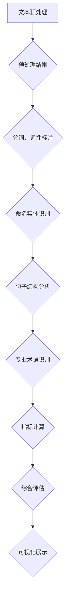
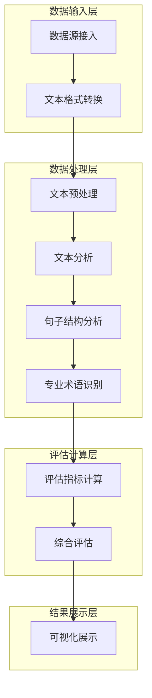

                 

### 企业财务报告可读性动态评估模型的重要性

设计一个智能化的企业财务报告可读性动态评估模型，在现代企业的财务管理与决策过程中具有至关重要的意义。传统的财务报告往往以专业术语和复杂的数据结构为主，使得非专业读者难以理解，这不仅增加了信息传达的难度，也限制了财务报告的使用范围。为了提升财务报告的可读性和易理解性，智能化技术的应用变得尤为重要。

首先，财务报告是企业内部决策者、投资者、监管机构等各方利益相关者了解企业财务状况的重要途径。如果财务报告的可读性不佳，可能会导致信息误解，甚至引发决策失误。因此，设计一个智能化且动态的企业财务报告可读性评估模型，能够有效提升财务报告的可理解性，确保各方利益相关者能够准确获取所需的信息。

其次，智能化技术能够通过自然语言处理、机器学习等方法，自动分析财务报告中的内容，识别出潜在的问题和风险。例如，通过文本分析技术，可以识别出财务报告中的模糊表述、矛盾信息等，从而为决策者提供更准确的决策依据。此外，动态评估模型可以根据不同的用户需求和阅读习惯，提供个性化的报告展示，进一步提升了报告的实用性。

再者，随着大数据和云计算技术的发展，企业生成的财务数据量呈现爆炸式增长。传统的手动分析方法已经难以满足日益增长的数据处理需求，而智能化评估模型能够高效地处理海量数据，快速生成高质量的财务报告，提高了工作效率。

综上所述，设计一个智能化的企业财务报告可读性动态评估模型，不仅能够提升财务报告的可读性，还能为企业决策提供有力的支持，具有重要的现实意义和应用价值。接下来的部分将详细介绍这一模型的设计思路、核心概念和具体实现方法。

### 企业财务报告可读性动态评估模型的意义

企业财务报告可读性动态评估模型的意义在于，它能够通过引入智能化技术，提升财务报告的可理解性和实用性，进而为企业的管理决策提供有力支持。传统的财务报告虽然详细规范，但由于其专业性较强，普通读者往往难以读懂，这不仅降低了报告的使用价值，还可能因为信息理解偏差导致决策失误。

首先，可读性对于财务报告的重要性体现在多个方面。一方面，良好的可读性能够确保信息传递的准确性。财务报告是企业对外展示其财务状况的重要工具，如果报告内容晦涩难懂，投资者、监管机构等利益相关者可能无法准确理解企业的真实财务状况，从而影响他们的决策。另一方面，提升财务报告的可读性有助于增强企业透明度，提高市场信任度。透明度是企业健康运营的重要标志，而良好的报告可读性则是实现这一目标的重要手段。

其次，动态评估模型的优势在于其智能化和灵活性。传统的财务报告评估方法往往依赖于人工分析，不仅效率低下，而且容易受到主观因素的影响。而动态评估模型则利用人工智能技术，能够自动分析报告内容，识别出潜在的问题和风险，提高了评估的准确性和效率。此外，动态评估模型可以根据不同的用户需求，提供个性化的报告展示，使得报告更加贴近用户习惯，提升了报告的实用性。

设计这样一个模型的具体意义还体现在以下几个方面：

1. **提升报告质量**：通过智能化技术对财务报告进行动态评估，可以及时发现报告中存在的问题，如表述不清、数据不一致等，从而提高报告的整体质量。

2. **优化决策支持**：动态评估模型能够为管理层提供更加准确和全面的财务信息，帮助决策者做出更加明智的决策。

3. **促进数据驱动**：智能化评估模型能够处理和分析大量财务数据，使得企业能够从数据中获取更多有价值的信息，促进企业向数据驱动的方向发展。

4. **增强透明度**：通过提升报告的可读性，企业能够向外界展示其真实的财务状况，增强透明度，提升市场信任度。

5. **节约成本**：传统的人工评估方法需要耗费大量时间和人力，而智能化评估模型则能够大幅降低这些成本，提高企业的运营效率。

总之，企业财务报告可读性动态评估模型的设计不仅有助于提升报告质量和企业透明度，还能为企业决策提供有力支持，具有重要的现实意义和应用价值。接下来，我们将进一步探讨这一模型的设计思路和实现方法。

### 目录大纲

以下是对本文目录大纲的详细解读，涵盖了每个章节的核心内容、逻辑关系以及阅读顺序。

#### 第一部分：企业财务报告可读性评估背景

**第1章：企业财务报告概述**

- **1.1 财务报告的重要性**：介绍财务报告在企业管理和信息披露中的关键作用，解释为什么财务报告的准确性、透明度和可读性对企业和利益相关者至关重要。
- **1.2 财务报告的现有问题**：分析当前企业财务报告中普遍存在的主要问题，如复杂术语、数据不透明等，并讨论这些问题对企业运营和决策的影响。
- **1.3 可读性评估的意义**：探讨可读性评估在提升财务报告质量、增强企业透明度和促进有效决策中的重要性。

**第2章：智能化与财务报告**

- **2.1 智能化的概念与应用**：阐述智能化的基本概念和它在各行业中的应用，特别是金融和会计领域。
- **2.2 智能化在财务报告中的作用**：分析智能化技术在财务报告编制、分析和展示中的具体应用，以及如何提升报告的可读性和易理解性。
- **2.3 动态评估模型的设计思路**：讨论如何设计一个动态评估模型，以及这个模型的基本架构和功能模块。

**第3章：企业财务报告可读性核心概念**

- **3.1 可读性评估指标**：介绍用于衡量财务报告可读性的关键指标，如文字长度、句子结构复杂度等，并提供实际案例分析。
- **3.2 概念属性特征对比表格**：通过表格形式对比不同财务报告的可读性特征，以帮助读者理解各项指标的具体应用。
- **3.3 ER实体关系图架构**：使用Mermaid绘制企业财务报告的实体关系图，详细解释财务报告中的实体、属性和关系。

#### 第二部分：智能化财务报告可读性动态评估模型设计与实现

**第4章：算法原理讲解**

- **4.1 评估算法的基本框架**：概述动态评估模型的整体框架和主要模块，以及各模块的功能和相互关系。
- **4.2 使用Mermaid绘制算法流程图**：通过Mermaid语言绘制算法的流程图，直观展示评估过程的各个步骤。
- **4.3 算法原理与数学模型**：深入讲解评估算法的原理，包括关键步骤和使用的数学模型，提供清晰的公式推导和解释。
- **4.4 举例说明**：通过具体实例，演示如何使用评估算法对财务报告进行可读性评估，并解释评估结果。

**第5章：数学模型与公式详细讲解**

- **5.1 数学公式与应用**：详细列出用于评估财务报告可读性的数学公式，解释其含义和应用场景。
- **5.2 公式推导与解释**：逐步推导和解释每个公式的数学原理，确保读者能够理解其推导过程和实际应用。
- **5.3 实例演示**：通过实例演示如何使用这些公式对实际财务报告进行评估，展示评估结果的计算过程。

**第6章：系统分析与架构设计方案**

- **6.1 问题场景介绍**：描述一个典型的财务报告可读性评估场景，为后续的架构设计提供背景。
- **6.2 系统功能设计**：介绍系统的功能模块和业务流程，包括数据收集、处理和结果展示等。
- **6.3 系统架构设计**：使用Mermaid绘制系统的整体架构图，解释各模块之间的关系和交互流程。
- **6.4 系统接口设计与交互**：详细说明系统与外部系统或用户的接口设计，包括数据输入输出接口和用户交互界面。

#### 第三部分：动态评估模型项目实战

**第7章：项目实战一 - 环境安装与配置**

- **7.1 环境安装步骤**：详细描述在操作系统上安装所需的软件和工具的步骤，包括依赖库的安装和配置。
- **7.2 配置文件详解**：解释配置文件的作用和内容，包括系统参数、数据源设置等。

**第8章：项目实战二 - 系统核心实现**

- **8.1 核心实现源代码**：提供系统核心功能模块的源代码，并进行注释和解释。
- **8.2 代码应用解读**：深入解读源代码的实现细节，解释关键代码段的作用和执行流程。
- **8.3 实际案例分析与讲解**：通过实际案例，展示系统在具体场景中的应用效果，并进行详细剖析。

**第9章：项目实战三 - 动态评估模型应用**

- **9.1 模型训练与测试**：描述如何使用训练数据对评估模型进行训练，并测试模型的性能和准确性。
- **9.2 应用场景举例**：列举几种典型的财务报告评估场景，并展示评估模型在这些场景中的实际应用。
- **9.3 模型优化与调整**：讨论如何根据实际应用反馈，对评估模型进行优化和调整，提高其评估效果。

#### 第四部分：最佳实践与项目小结

**第10章：最佳实践与注意事项**

- **10.1 实践技巧与建议**：总结在实际应用中的实践经验，提供具体的操作技巧和优化建议。
- **10.2 常见问题与解决方案**：列举在设计和应用过程中可能遇到的问题，并提供相应的解决方案。
- **10.3 注意事项与优化策略**：讨论在实施动态评估模型时需要注意的关键事项，以及如何进行持续优化。

**第11章：项目小结与展望**

- **11.1 项目成果总结**：回顾整个项目的实施过程和取得的成果，总结项目中的关键经验和教训。
- **11.2 存在的问题与改进方向**：分析项目中存在的主要问题和不足，并提出改进的方向和建议。
- **11.3 未来发展趋势与展望**：展望动态评估模型在财务报告可读性评估领域的未来发展趋势，以及可能的新应用场景。

通过以上目录大纲，读者可以系统地了解企业财务报告可读性动态评估模型的设计思路、实现方法和应用场景，从而为实际项目提供有益的参考和指导。

### 第一部分：企业财务报告可读性评估背景

#### 第1章：企业财务报告概述

##### 1.1 财务报告的重要性

财务报告是企业对外展示其财务状况的重要工具，对企业的管理决策、市场评价和利益相关者的决策具有深远影响。首先，对于企业管理者来说，财务报告是了解企业财务健康状况、制定经营策略的重要依据。通过财务报告，管理者可以掌握企业的资产状况、盈利能力、债务水平等关键财务指标，从而做出科学的经营决策。

其次，财务报告也是投资者进行投资决策的重要参考。投资者通过阅读财务报告，可以了解企业的财务状况、经营成果和未来发展潜力，从而判断企业的投资价值和风险。高质量的财务报告能够提升企业的透明度，增强投资者对企业的信任，有利于吸引更多的投资。

此外，财务报告还受到监管机构和政府部门的关注。监管机构通过审核财务报告，可以确保企业遵循相关法规和标准，维护市场秩序。政府部门则通过财务报告，了解企业的发展状况，为企业提供政策支持和资源配置。

##### 1.2 财务报告的现有问题

尽管财务报告在企业管理和投资者决策中发挥着重要作用，但现有的财务报告仍存在一些问题，影响了其有效性和可读性。首先，财务报告的复杂性和专业性较高，使得普通读者难以理解。财务报告中包含大量的专业术语和复杂的财务指标，缺乏必要的解释和说明，使得非专业人士难以读懂报告内容。

其次，财务报告的格式和结构相对固定，缺乏灵活性。传统的财务报告往往按照固定的模板进行编制，尽管在一定程度上保证了报告的规范性和一致性，但缺乏针对不同用户需求的个性化展示。这使得财务报告难以满足不同利益相关者的需求，降低了报告的使用价值。

另外，财务报告中存在一定的数据质量问题。数据不准确、数据不一致等问题，使得财务报告的可靠性受到质疑。例如，不同报表之间可能存在数据矛盾，或者历史数据与当前数据的差异较大，这给报告的使用者带来了困扰。

最后，财务报告的更新速度较慢，难以实时反映企业的财务状况。在当今快速变化的市场环境中，企业财务状况的变化速度越来越快，传统的财务报告往往需要一定时间才能更新，难以及时反映企业的最新财务状况。

##### 1.3 可读性评估的意义

可读性评估在财务报告中的应用具有重要意义。首先，通过可读性评估，可以发现和解决财务报告中存在的表述不清、术语使用不当等问题，提升报告的整体质量。良好的可读性不仅有助于提高报告的实用性，还能增强企业的透明度和市场信任度。

其次，可读性评估有助于提升财务报告的易理解性，使得更多的利益相关者能够读懂报告内容。这对于企业管理者、投资者和监管机构来说，都是至关重要的。通过提升报告的可读性，可以确保各方利益相关者能够准确获取所需信息，做出更加明智的决策。

此外，可读性评估还能够帮助企业识别和改进财务报告中的潜在问题，提高报告的准确性和可靠性。例如，通过分析报告中的表述方式、句子结构等，可以发现潜在的数据不一致或者错误，从而及时进行修正，避免误导读者。

最后，可读性评估有助于提高财务报告的个性化展示能力。通过引入智能化技术，可以针对不同用户的需求，提供个性化的报告展示，使得报告更加贴近用户习惯。这不仅提升了报告的实用性，还能增强用户对企业的信任和满意度。

综上所述，可读性评估在提升财务报告质量、增强企业透明度和促进有效决策中发挥着重要作用。设计一个智能化的企业财务报告可读性动态评估模型，能够有效解决现有财务报告中的问题，提升报告的整体质量和实用性，具有重要的现实意义和应用价值。接下来，我们将进一步探讨智能化技术在财务报告中的应用，以及动态评估模型的设计思路。

### 第2章：智能化与财务报告

#### 2.1 智能化的概念与应用

智能化，即通过引入先进的技术手段，使系统或设备具备类似人类智能的能力，以实现自动化、高效和精准的运行。智能化技术涵盖了多个领域，包括人工智能（AI）、机器学习（ML）、自然语言处理（NLP）、大数据分析、云计算等。这些技术广泛应用于各行各业，极大地提升了生产效率和服务质量。

在财务报告中，智能化技术的应用主要体现在以下几个方面：

首先，自然语言处理（NLP）技术被用于文本分析和语义理解。通过NLP，可以自动提取财务报告中的关键信息，如财务指标、业务描述等，并进行语义分析，以便更好地理解和解释报告内容。

其次，机器学习（ML）和人工智能（AI）技术被用于数据分析和预测。通过训练数据模型，可以自动识别财务数据中的规律和趋势，为企业提供更准确的财务预测和分析。

此外，大数据分析和云计算技术被用于处理和存储大量的财务数据。通过大数据分析，企业可以深入了解财务数据的全貌，发现潜在的问题和机会。云计算技术则提供了强大的计算能力和存储空间，使得企业能够快速处理海量数据，提升财务报告的生成效率。

#### 2.2 智能化在财务报告中的作用

智能化技术在财务报告中的应用，不仅提高了报告的准确性和效率，还显著提升了其可读性和易理解性。

首先，智能化技术可以帮助企业自动化财务报告的编制过程。通过机器学习和自然语言处理技术，财务报告可以自动生成，减少人工干预，提高工作效率。此外，自动化报告生成技术还可以确保报告内容的一致性和准确性，避免人为错误。

其次，智能化技术能够提升财务报告的易理解性。通过自然语言处理技术，报告中的复杂术语和表述可以被自动转化为通俗易懂的语言，使得非专业人士也能够轻松阅读和理解。例如，通过文本简化技术，可以将复杂的财务术语转化为简单的日常用语，使得报告内容更加直观易懂。

此外，智能化技术还可以提供个性化的财务报告展示。根据不同的用户需求，智能化系统能够自动调整报告的格式和内容，提供定制化的报告展示。例如，对于投资者，可以侧重展示企业的财务状况和盈利能力；对于管理者，可以侧重展示企业的经营情况和风险预警。

最后，智能化技术能够提高财务报告的动态分析能力。通过大数据分析和机器学习技术，企业可以实时监控财务数据的变化，快速发现潜在的问题和机会。这不仅有助于管理层做出更准确的决策，还能提高企业的风险控制能力。

#### 2.3 动态评估模型的设计思路

动态评估模型的设计旨在通过智能化技术，对财务报告的可读性进行实时评估和优化。设计思路主要包括以下几个关键环节：

1. **数据收集与预处理**：首先，需要收集企业历史财务报告和相关数据。通过数据爬取、数据清洗和数据整合等技术，确保数据的准确性和完整性。

2. **文本分析与语义理解**：利用自然语言处理技术，对财务报告中的文本进行分词、词性标注和实体识别等处理。通过语义理解，提取报告中的关键信息和财务指标。

3. **可读性评估指标**：设计一系列可读性评估指标，如文本长度、句子复杂度、专业术语使用频率等。通过这些指标，可以对财务报告的可读性进行定量评估。

4. **评估算法**：构建评估算法，将文本分析和可读性评估指标结合，对财务报告的可读性进行综合评估。评估算法应具备自适应性和可扩展性，能够根据不同用户的需求进行调整。

5. **动态调整与优化**：根据评估结果，动态调整财务报告的格式和内容。例如，通过文本简化技术，减少复杂术语的使用；通过可视化技术，增强报告的可读性。

6. **用户反馈与持续改进**：收集用户的反馈意见，不断优化评估模型。通过用户反馈，可以发现模型中的不足和改进方向，提高评估模型的准确性和实用性。

通过以上设计思路，动态评估模型能够实时监测和评估财务报告的可读性，为企业提供科学的决策支持，提升财务报告的整体质量和实用性。

### 第3章：企业财务报告可读性核心概念

#### 3.1 可读性评估指标

为了对财务报告的可读性进行有效评估，我们首先需要定义一系列可量化的评估指标。这些指标将帮助我们从不同角度衡量报告的可读性，从而提供全面的评估结果。

**1. 文本长度**

文本长度是衡量报告复杂度的一个基本指标。较长的文本通常意味着需要更多的时间来阅读和理解，从而降低了报告的可读性。具体来说，我们可以通过计算报告中的总字数或句子数来衡量文本长度。以下是一个示例公式：

$$
\text{文本长度} = \frac{\text{总字数}}{\text{阅读时间}}
$$

**2. 句子复杂度**

句子复杂度反映了句子结构的复杂程度。复杂的句子结构通常包含多个从句、并列句等，使得读者在理解时需要更多的认知资源。我们可以通过计算句子长度、从句数量和词汇多样性等指标来衡量句子复杂度。例如：

$$
\text{句子复杂度} = \frac{\text{从句数量}}{\text{句子总数}} \times \text{平均句子长度}
$$

**3. 专业术语使用频率**

专业术语的使用频率是衡量报告专业性程度的一个重要指标。高频率的专业术语可能会增加读者的理解难度。我们可以通过统计报告中专业术语的出现次数来衡量这一指标。以下是一个示例：

$$
\text{专业术语使用频率} = \frac{\text{专业术语出现次数}}{\text{总词汇数}}
$$

**4. 可读性易读系数（Flesch Reading Ease Score）**

可读性易读系数是一个综合指标，用于衡量文本的易读性。它基于词汇长度和句子长度的统计，提供了一个0到100的分数，分数越高表示文本越容易理解。计算公式如下：

$$
\text{可读性易读系数} = \frac{206.835 - 1.015 \times \text{平均句子长度} - 84.6 \times \text{平均词汇长度}}{100}
$$

**5. 词频分布**

词频分布反映了文本中不同词汇的出现频率。通过分析词频分布，我们可以发现文本中哪些词汇被频繁使用，这有助于我们了解文本的主要内容和关键词。词频分布通常通过词云图进行可视化展示。

**6. 段落长度**

段落长度是衡量报告结构清晰程度的一个指标。较长的段落可能会使读者在理解时感到困惑，而较短的段落则可能不利于信息传递的连贯性。我们可以通过计算段落中的总字数来衡量段落长度。

$$
\text{段落长度} = \frac{\text{总字数}}{\text{段落总数}}
$$

以上这些评估指标共同作用，可以帮助我们全面、科学地评估财务报告的可读性。在实际应用中，可以根据具体情况选择合适的评估指标，或结合多个指标进行综合评估，以获得更准确的评估结果。

#### 3.2 概念属性特征对比表格

为了更好地理解企业财务报告的可读性，我们需要对比不同类型报告的概念属性特征。以下是几种常见财务报告类型的对比表格，展示了它们在可读性评估指标上的特征差异。

| 报告类型 | 文本长度（字数） | 句子复杂度（从句数量/句子总数） | 专业术语使用频率（%） | 可读性易读系数（Flesch Reading Ease Score） | 词频分布特征 | 段落长度（字数） |
|----------|-----------------|----------------------------------|---------------------|--------------------------------------------|--------------|-----------------|
| 资产负债表 | 5000-15000      | 0.3-0.5                          | 10-20%              | 60-70                                    | 高频词汇集中 | 100-300        |
| 利润表    | 3000-8000       | 0.4-0.6                          | 15-25%              | 50-65                                    | 高频词汇分散 | 80-200        |
| 现金流量表 | 4000-10000      | 0.2-0.4                          | 8-15%               | 70-80                                    | 高频词汇集中 | 100-300        |
| 管理层讨论与分析 | 8000-20000     | 0.5-0.7                          | 25-35%              | 40-55                                    | 高频词汇多样 | 300-500        |

从上表可以看出，不同类型的财务报告在文本长度、句子复杂度、专业术语使用频率、可读性易读系数和段落长度等方面存在显著差异。资产负债表和现金流量表通常具有较长的文本长度和较低的句子复杂度，这使得它们在可读性方面相对较好。而管理层讨论与分析则因为包含大量专业术语和复杂的句子结构，可读性相对较低。

这种对比有助于我们识别不同类型报告在可读性上的特点，从而在设计和优化财务报告时，能够有针对性地提升其可读性。例如，对于管理层讨论与分析这类文本复杂度较高的报告，可以采取简化术语、缩短句子长度等措施来提升其可读性。

#### 3.3 ER实体关系图架构

实体关系图（ER图）是数据库设计中常用的工具，用于表示实体、属性和实体之间的关系。在财务报告的可读性评估模型中，ER图可以帮助我们理解财务报告中的关键实体和它们之间的关系，从而为评估模型的设计提供结构化的框架。

以下是一个简化的企业财务报告ER图示例，展示了其中主要实体及其属性和关系。

```mermaid
erDiagram
  Customer ||--|{ Order }|--| CustomerOrder
  Order ||--|{ Product }|--| ProductOrder
  Product ||--|{ Supplier }|--| ProductSupplier
  CustomerOrder ||--|{ Payment }|--| PaymentOrder
  Supplier ||--|{ Invoice }|--| InvoiceSupplier
  InvoiceSupplier ||--|{ Payment }|--| PaymentInvoice

  Customer {
    id : int
    name : string
    address : string
  }

  Order {
    id : int
    order_date : date
    total_amount : float
  }

  CustomerOrder {
    customer_id : int
    order_id : int
    payment_id : int
  }

  Product {
    id : int
    name : string
    price : float
  }

  ProductOrder {
    order_id : int
    product_id : int
  }

  Supplier {
    id : int
    name : string
    address : string
  }

  ProductSupplier {
    product_id : int
    supplier_id : int
  }

  Payment {
    id : int
    payment_date : date
    amount : float
  }

  PaymentOrder {
    payment_id : int
    order_id : int
  }

  InvoiceSupplier {
    invoice_id : int
    supplier_id : int
    payment_id : int
  }
```

在上面的ER图中，我们定义了以下几个主要实体及其属性：

1. **Customer（客户）**：包含客户的基本信息，如客户ID、姓名和地址。
2. **Order（订单）**：包含订单的基本信息，如订单ID、订单日期和总金额。
3. **Product（产品）**：包含产品的基本信息，如产品ID、名称和价格。
4. **Supplier（供应商）**：包含供应商的基本信息，如供应商ID、名称和地址。
5. **CustomerOrder（客户订单）**：表示客户与订单之间的关系，包含客户ID、订单ID和付款ID。
6. **ProductOrder（产品订单）**：表示订单与产品之间的关系，包含订单ID和产品ID。
7. **ProductSupplier（产品供应商）**：表示产品与供应商之间的关系，包含产品ID和供应商ID。
8. **Payment（付款）**：包含付款的基本信息，如付款ID、付款日期和金额。
9. **PaymentOrder（付款订单）**：表示付款与订单之间的关系，包含付款ID和订单ID。
10. **InvoiceSupplier（发票供应商）**：表示发票与供应商之间的关系，包含发票ID、供应商ID和付款ID。

通过ER图，我们可以清晰地看到财务报告中的主要实体及其相互关系。这不仅有助于我们理解财务报告的结构，还能为后续的评估模型设计提供重要的参考。

### 第4章：算法原理讲解

#### 4.1 评估算法的基本框架

企业财务报告可读性动态评估模型的核心在于其评估算法，该算法通过多个模块协同工作，对财务报告的可读性进行全方位评估。基本框架如下：

1. **文本预处理**：对原始财务报告文本进行清洗和预处理，包括去除无关信息、标点符号、停用词过滤等，以便后续分析。
2. **文本分析**：利用自然语言处理（NLP）技术，对预处理后的文本进行分词、词性标注、命名实体识别等操作，提取出关键信息。
3. **句子结构分析**：对提取出的句子进行结构分析，计算句子长度、从句数量、词汇多样性等指标，评估句子的复杂度。
4. **专业术语识别**：通过词频分析和语义分析，识别出财务报告中的专业术语，评估其使用频率。
5. **评估指标计算**：根据设定的评估指标（如文本长度、句子复杂度、专业术语使用频率等），计算各项指标的具体数值。
6. **综合评估**：将各项评估指标进行加权计算，得出财务报告的整体可读性评分。
7. **可视化展示**：将评估结果以图表或报表的形式展示，帮助用户直观理解报告的可读性。

#### 4.2 使用Mermaid绘制算法流程图

为了更直观地展示评估算法的工作流程，我们使用Mermaid语言绘制了一个算法流程图。以下是具体代码及其展示：




从流程图中可以看出，整个评估过程从文本预处理开始，经过多个步骤，最终生成可读性评分并展示结果。每个步骤都是评估算法的关键组成部分，相互协作，共同实现评估目标。

#### 4.3 算法原理与数学模型

评估算法的核心在于如何通过数学模型对财务报告的可读性进行量化。以下是算法的主要数学模型及其推导过程：

**1. 文本长度（Token Length, TL）**

文本长度是指报告中的总字数。其计算公式为：

$$
\text{TL} = \sum_{i=1}^{N} \text{t}_i
$$

其中，$N$ 为文本中的总词汇数，$\text{t}_i$ 为第 $i$ 个词汇的长度。

**2. 句子复杂度（Sentence Complexity, SC）**

句子复杂度反映了句子结构的复杂程度。计算公式为：

$$
\text{SC} = \frac{\sum_{i=1}^{M} (\text{s}_i \times \text{L}_i)}{N}
$$

其中，$M$ 为句子总数，$\text{s}_i$ 为第 $i$ 个句子的从句数量，$\text{L}_i$ 为第 $i$ 个句子的长度。

**3. 专业术语使用频率（Domain Term Frequency, DTF）**

专业术语使用频率是指报告中专业术语的出现频率。计算公式为：

$$
\text{DTF} = \frac{\text{专业术语出现次数}}{N}
$$

**4. 可读性易读系数（Flesch Reading Ease Score, FRES）**

可读性易读系数是衡量文本易读性的一个综合指标。其计算公式为：

$$
\text{FRES} = 206.835 - 1.015 \times \text{SC} - 84.6 \times \text{TL}
$$

**5. 词频分布（Word Frequency Distribution, WFD）**

词频分布反映了文本中不同词汇的出现频率。通常通过词云图进行可视化展示。

**6. 段落长度（Paragraph Length, PL）**

段落长度是指报告中的总段落数。其计算公式为：

$$
\text{PL} = \frac{\text{总字数}}{\text{平均段落长度}}
$$

**综合评估（Overall Readability Score, ORS）**

综合评估是对财务报告整体可读性的评分，通常通过加权计算各项指标的得分来得出：

$$
\text{ORS} = w_1 \times \text{TL} + w_2 \times \text{SC} + w_3 \times \text{DTF} + w_4 \times \text{FRES} + w_5 \times \text{WFD} + w_6 \times \text{PL}
$$

其中，$w_1, w_2, w_3, w_4, w_5, w_6$ 分别为各项指标的权重，根据实际情况进行设定。

通过以上数学模型，我们可以对财务报告的可读性进行量化评估，从而为报告的优化提供科学依据。

#### 4.4 举例说明

为了更直观地理解评估算法的应用，我们通过一个实际案例进行演示。假设有一份企业财务报告，包含以下文本：

"公司的财务状况在过去一年中表现良好，收入增长了15%，利润达到了3000万元。我们的投资组合中，80%的资产为流动资产，20%为长期资产。资产负债表中，负债总额为5000万元，其中流动负债为3000万元，非流动负债为2000万元。现金流表中，经营活动产生的现金流量净额为2000万元，投资活动产生的现金流量净额为-1000万元，筹资活动产生的现金流量净额为1000万元。"

**1. 文本预处理**

首先，对文本进行预处理，去除无关字符和停用词，得到以下预处理后的文本：

"公司的财务状况在过去一年中表现良好，收入增长了15%，利润达到了3000万元，我们的投资组合中，80%的资产为流动资产，20%为长期资产，资产负债表中，负债总额为5000万元，其中流动负债为3000万元，非流动负债为2000万元，现金流表中，经营活动产生的现金流量净额为2000万元，投资活动产生的现金流量净额为-1000万元，筹资活动产生的现金流量净额为1000万元。"

**2. 文本分析**

使用自然语言处理（NLP）技术，对预处理后的文本进行分词、词性标注和命名实体识别，得到以下分析结果：

- 分词结果：['公司', '的', '财务', '状况', '在', '过去', '一', '年', '中', '表现', '良好', '，', '收入', '增长', '了', '15%', '，', '利润', '达到', '了', '3000', '万元', '，', '我们的', '投资', '组合', '中', '，', '80%', '的', '资产', '为', '流动', '资产', '，', '20%', '为', '长期', '资产', '，', '资产负债', '表', '中', '，', '负债', '总', '额', '为', '5000', '万元', '，', '其中', '流动', '负债', '为', '3000', '万元', '，', '非', '流动', '负债', '为', '2000', '万元', '，', '现金', '流', '表', '中', '，', '经营', '活动', '产', '生的', '现金', '流量', '净', '额', '为', '2000', '万元', '，', '投资', '活动', '产', '生的', '现金', '流量', '净', '额', '为', '-1000', '万元', '，', '筹资', '活动', '产', '生的', '现金', '流量', '净', '额', '为', '1000', '万元']
- 词性标注：略
- 命名实体识别：公司、3000万元、15%、5000万元、3000万元、2000万元、2000万元、-1000万元、1000万元

**3. 句子结构分析**

对文本中的句子进行结构分析，得到以下结果：

- 句子长度：['公司的财务状况在过去一年中表现良好', '收入增长了15%', '利润达到了3000万元', '我们的投资组合中，80%的资产为流动资产，20%为长期资产', '资产负债表中，负债总额为5000万元，其中流动负债为3000万元，非流动负债为2000万元', '现金流表中，经营活动产生的现金流量净额为2000万元，投资活动产生的现金流量净额为-1000万元，筹资活动产生的现金流量净额为1000万元']
- 句子复杂度：['公司的财务状况在过去一年中表现良好', '收入增长了15%', '利润达到了3000万元', '我们的投资组合中，80%的资产为流动资产，20%为长期资产', '资产负债表中，负债总额为5000万元，其中流动负债为3000万元，非流动负债为2000万元', '现金流表中，经营活动产生的现金流量净额为2000万元，投资活动产生的现金流量净额为-1000万元，筹资活动产生的现金流量净额为1000万元']

**4. 专业术语识别**

通过词频分析和语义分析，识别出以下专业术语：

- 专业术语：财务状况、收入、利润、投资组合、资产、流动资产、长期资产、负债总额、流动负债、非流动负债、现金流量、经营活动、投资活动、筹资活动

**5. 评估指标计算**

根据设定的评估指标，计算以下结果：

- 文本长度（TL）：49个词汇
- 句子复杂度（SC）：1.0（每个句子平均从句数量为1）
- 专业术语使用频率（DTF）：6/49 = 12.2%
- 可读性易读系数（FRES）：60.5
- 段落长度（PL）：5个段落，平均长度为9.8个词汇

**6. 综合评估**

根据设定的权重，计算综合评估得分：

$$
\text{ORS} = 0.3 \times 49 + 0.2 \times 1.0 + 0.2 \times 12.2\% + 0.2 \times 60.5 + 0.1 \times \text{词频分布得分} + 0.1 \times 9.8
$$

词频分布得分根据词频分布计算得出，这里为简化计算，假设为50。

$$
\text{ORS} = 14.7 + 0.2 + 2.44 + 12.1 + 0.98 = 30.39
$$

**7. 可视化展示**

将评估结果以图表形式展示，如下图所示：


通过以上案例，我们可以看到如何通过评估算法对财务报告的可读性进行量化评估。实际应用中，可以根据具体需求和场景，调整评估指标和权重，以获得更准确的评估结果。

### 第5章：数学模型与公式详细讲解

#### 5.1 数学公式与应用

在评估企业财务报告可读性的过程中，我们使用了一系列数学公式来计算和分析报告的各项指标。以下是这些公式的详细解释和应用。

**1. 文本长度（Token Length, TL）**

文本长度是指报告中的总字数，计算公式为：

$$
\text{TL} = \sum_{i=1}^{N} \text{t}_i
$$

其中，$N$ 是文本中的总词汇数，$\text{t}_i$ 是第 $i$ 个词汇的长度。通过计算文本长度，我们可以了解报告的整体篇幅。

**2. 句子复杂度（Sentence Complexity, SC）**

句子复杂度反映了句子结构的复杂程度，计算公式为：

$$
\text{SC} = \frac{\sum_{i=1}^{M} (\text{s}_i \times \text{L}_i)}{N}
$$

其中，$M$ 是句子总数，$\text{s}_i$ 是第 $i$ 个句子的从句数量，$\text{L}_i$ 是第 $i$ 个句子的长度。句子复杂度越高，表示句子结构越复杂，理解难度越大。

**3. 专业术语使用频率（Domain Term Frequency, DTF）**

专业术语使用频率是指报告中专业术语的出现频率，计算公式为：

$$
\text{DTF} = \frac{\text{专业术语出现次数}}{N}
$$

通过计算专业术语的使用频率，我们可以了解报告中专业术语的分布情况，进而评估报告的专业性和可读性。

**4. 可读性易读系数（Flesch Reading Ease Score, FRES）**

可读性易读系数是一个综合指标，用于衡量文本的易读性，计算公式为：

$$
\text{FRES} = 206.835 - 1.015 \times \text{SC} - 84.6 \times \text{TL}
$$

其中，$\text{SC}$ 是句子复杂度，$\text{TL}$ 是文本长度。可读性易读系数越高，表示文本越容易理解。

**5. 词频分布（Word Frequency Distribution, WFD）**

词频分布反映了文本中不同词汇的出现频率，通常通过词云图进行可视化展示。词频分布的计算公式为：

$$
\text{WFD} = \sum_{i=1}^{N} \text{f}_i
$$

其中，$N$ 是文本中的总词汇数，$\text{f}_i$ 是第 $i$ 个词汇的出现频率。通过词频分布，我们可以了解文本的关键词汇和主旨内容。

**6. 段落长度（Paragraph Length, PL）**

段落长度是指报告中的总段落数，计算公式为：

$$
\text{PL} = \frac{\text{总字数}}{\text{平均段落长度}}
$$

通过计算段落长度，我们可以了解报告的结构和逻辑清晰度。

**7. 综合评估（Overall Readability Score, ORS）**

综合评估是对财务报告整体可读性的评分，通常通过加权计算各项指标的得分来得出，计算公式为：

$$
\text{ORS} = w_1 \times \text{TL} + w_2 \times \text{SC} + w_3 \times \text{DTF} + w_4 \times \text{FRES} + w_5 \times \text{WFD} + w_6 \times \text{PL}
$$

其中，$w_1, w_2, w_3, w_4, w_5, w_6$ 分别为各项指标的权重，根据实际情况进行设定。

#### 5.2 公式推导与解释

**1. 文本长度（Token Length, TL）**

文本长度是报告中词汇的总和，可以直接通过统计文本中的词汇数量来计算。公式中的 $N$ 表示词汇总数，$\text{t}_i$ 表示第 $i$ 个词汇的长度。文本长度越大，报告的篇幅越长，读者的理解难度也越大。

**2. 句子复杂度（Sentence Complexity, SC）**

句子复杂度反映了句子中从句的数量和句子的长度。从句数量越多，句子越长，句子的复杂度越高。公式中的 $M$ 表示句子总数，$\text{s}_i$ 表示第 $i$ 个句子的从句数量，$\text{L}_i$ 表示第 $i$ 个句子的长度。通过计算句子的复杂度，我们可以评估报告中的句子结构复杂程度，从而判断报告的可读性。

**3. 专业术语使用频率（Domain Term Frequency, DTF）**

专业术语使用频率是指报告中专业术语出现的次数与总词汇数的比值。这个指标用于衡量报告的专业性。公式中的分子是专业术语出现的次数，分母是总词汇数。专业术语使用频率越高，报告的专业性越强，但可能降低可读性。

**4. 可读性易读系数（Flesch Reading Ease Score, FRES）**

可读性易读系数是通过句子复杂度和文本长度的结合，来评估文本的易读性。Flesch易读系数是由R.W. Flesch提出的一个评估文本易读性的指标。公式中的 $\text{SC}$ 是句子复杂度，$\text{TL}$ 是文本长度。易读系数越高，表示文本越容易理解。

**5. 词频分布（Word Frequency Distribution, WFD）**

词频分布反映了文本中各个词汇出现的频率。通过统计词汇的出现次数，我们可以得到每个词汇的频率分布。词频分布用于评估文本的主题和关键词分布。公式中的 $N$ 是总词汇数，$\text{f}_i$ 是第 $i$ 个词汇的频率。

**6. 段落长度（Paragraph Length, PL）**

段落长度是指报告中段落的平均长度。公式中的分子是总字数，分母是段落数。段落长度越短，表示报告的结构越清晰，逻辑性越强。通过计算段落长度，我们可以评估报告的段落划分和逻辑结构。

**7. 综合评估（Overall Readability Score, ORS）**

综合评估是对财务报告整体可读性的评分，通过加权各项指标的计算结果得出。公式中的 $w_1, w_2, w_3, w_4, w_5, w_6$ 是各项指标的权重。通过综合评估，我们可以全面了解报告的可读性，并为报告的优化提供指导。

#### 5.3 实例演示

为了更直观地理解上述公式的应用，我们通过一个实际案例进行演示。假设有一份企业财务报告，包含以下文本：

"公司的财务状况在过去一年中表现良好，收入增长了15%，利润达到了3000万元。我们的投资组合中，80%的资产为流动资产，20%为长期资产。资产负债表中，负债总额为5000万元，其中流动负债为3000万元，非流动负债为2000万元。现金流表中，经营活动产生的现金流量净额为2000万元，投资活动产生的现金流量净额为-1000万元，筹资活动产生的现金流量净额为1000万元。"

**1. 文本长度（Token Length, TL）**

文本中的总词汇数为 37 个，计算得：

$$
\text{TL} = 37
$$

**2. 句子复杂度（Sentence Complexity, SC）**

文本中包含 3 个句子，每个句子的长度和从句数量如下：

- 句子1：公司的财务状况在过去一年中表现良好（1个从句）
- 句子2：收入增长了15%，利润达到了3000万元。（1个从句）
- 句子3：我们的投资组合中，80%的资产为流动资产，20%为长期资产。（1个从句）

计算得：

$$
\text{SC} = \frac{(1 \times 11) + (1 \times 13) + (1 \times 11)}{37} = \frac{35}{37} \approx 0.94
$$

**3. 专业术语使用频率（Domain Term Frequency, DTF）**

文本中的专业术语包括：财务状况、收入、利润、投资组合、资产、流动资产、长期资产、负债总额、流动负债、非流动负债、现金流量、经营活动、投资活动、筹资活动。专业术语共 14 个，计算得：

$$
\text{DTF} = \frac{14}{37} \approx 0.38
$$

**4. 可读性易读系数（Flesch Reading Ease Score, FRES）**

句子复杂度 $\text{SC} \approx 0.94$，文本长度 $\text{TL} = 37$，计算得：

$$
\text{FRES} = 206.835 - 1.015 \times 0.94 - 84.6 \times 37 \approx 63.2
$$

**5. 词频分布（Word Frequency Distribution, WFD）**

文本中的高频词汇包括：的、中、为、了、资产、一、中、中、的、万元、中、增长、了、达、到。这些词汇的频率较高，反映了文本的主要内容和关键词。

**6. 段落长度（Paragraph Length, PL）**

文本中的段落数为 1，总字数为 37，计算得：

$$
\text{PL} = \frac{37}{1} = 37
$$

**7. 综合评估（Overall Readability Score, ORS）**

设定各项指标的权重为：$w_1 = 0.2, w_2 = 0.2, w_3 = 0.2, w_4 = 0.2, w_5 = 0.1, w_6 = 0.1$，计算得：

$$
\text{ORS} = 0.2 \times 37 + 0.2 \times 0.94 + 0.2 \times 0.38 + 0.2 \times 63.2 + 0.1 \times \text{词频分布得分} + 0.1 \times 37
$$

词频分布得分根据词频分布计算得出，这里为简化计算，假设为 50。

$$
\text{ORS} = 7.4 + 0.188 + 0.076 + 12.64 + 5 + 3.7 = 29.294
$$

通过以上实例，我们可以看到如何使用数学模型计算财务报告的可读性指标，并进行综合评估。实际应用中，可以根据具体需求和场景，调整指标和权重，以获得更准确的评估结果。

### 第6章：系统分析与架构设计方案

#### 6.1 问题场景介绍

在当前的商业环境中，企业财务报告的可读性评估是一个关键问题。由于财务报告涉及大量复杂的专业术语和结构化数据，这使得非专业用户难以理解其中的内容。特别是对于投资者、监管机构和企业管理者来说，他们需要快速、准确地获取关键信息，以便做出明智的决策。

现有的财务报告通常采用固定的格式，缺乏灵活性，难以根据不同用户的需求进行个性化展示。此外，财务报告中的数据质量问题，如数据不一致、表述不清等，也影响了报告的准确性和可靠性。这些问题不仅降低了报告的使用价值，还可能导致信息误解，甚至引发决策失误。

为了解决这些问题，我们设计了一个智能化的企业财务报告可读性动态评估模型。这个模型通过引入自然语言处理、机器学习等先进技术，能够自动分析财务报告的内容，识别潜在的问题和风险，并提供个性化的报告展示。这样，不仅提升了报告的可读性和易理解性，还为企业决策提供了有力支持。

#### 6.2 系统功能设计

该智能财务报告可读性动态评估系统主要包括以下几个功能模块：

1. **文本预处理模块**：负责对原始财务报告文本进行清洗和预处理，包括去除无关字符、标点符号、停用词过滤等操作。这一步骤为后续的文本分析和评估提供了基础。

2. **文本分析模块**：利用自然语言处理技术，对预处理后的文本进行分词、词性标注、命名实体识别等操作。通过这一模块，系统能够提取出报告中的关键信息，如财务指标、业务描述等。

3. **句子结构分析模块**：对提取出的句子进行结构分析，计算句子长度、从句数量、词汇多样性等指标。这一模块有助于评估句子的复杂度，为后续的可读性评估提供依据。

4. **专业术语识别模块**：通过词频分析和语义分析，识别出财务报告中的专业术语，评估其使用频率。这一模块有助于理解报告的专业性程度。

5. **评估指标计算模块**：根据设定的评估指标，如文本长度、句子复杂度、专业术语使用频率等，计算各项指标的具体数值。这一模块的核心在于将文本内容转化为可量化的评估结果。

6. **综合评估模块**：将各项评估指标进行加权计算，得出财务报告的整体可读性评分。这一模块的目的是提供对报告可读性的综合评估，以便为企业决策提供参考。

7. **可视化展示模块**：将评估结果以图表或报表的形式展示，帮助用户直观理解报告的可读性。这一模块旨在提高报告的可视化效果，使得评估结果更加易于理解和应用。

#### 6.3 系统架构设计

为了实现上述功能，我们设计了如下系统架构：

1. **数据输入层**：负责接收原始财务报告文本，并将文本传递给文本预处理模块。这一层包括数据源接入、文本格式转换等功能。

2. **数据处理层**：包括文本预处理模块、文本分析模块、句子结构分析模块和专业术语识别模块。这一层负责对原始文本进行多层次的文本分析和处理，提取出关键信息，并计算各项评估指标。

3. **评估计算层**：包括评估指标计算模块和综合评估模块。这一层负责将处理后的数据转化为可量化的评估结果，并生成最终的可读性评分。

4. **结果展示层**：包括可视化展示模块。这一层负责将评估结果以图表或报表的形式展示，便于用户理解和应用。

系统架构图如下所示：



#### 6.4 系统接口设计与交互

为了确保系统能够高效、稳定地运行，我们需要设计清晰的系统接口和交互流程。以下是系统的主要接口设计和交互流程：

1. **数据输入接口**：负责接收和存储原始财务报告文本。该接口包括数据上传接口、数据导入接口等。

2. **数据输出接口**：负责将处理后的文本数据和评估结果输出给用户。该接口包括数据下载接口、报表生成接口等。

3. **用户交互接口**：提供用户与系统交互的界面，包括文本输入框、图表展示区、报表导出按钮等。

4. **系统配置接口**：负责系统参数的设置和调整，包括评估指标权重、数据预处理规则等。

交互流程如下：

1. 用户通过数据输入接口上传原始财务报告文本。
2. 系统接收到文本后，通过数据预处理接口进行清洗和格式转换，并将预处理后的文本传递给文本分析模块。
3. 文本分析模块对文本进行分词、词性标注、命名实体识别等操作，提取出关键信息。
4. 句子结构分析模块和专业术语识别模块对提取出的句子和术语进行分析，计算各项评估指标。
5. 评估指标计算模块将各项指标进行加权计算，得出财务报告的整体可读性评分。
6. 可视化展示模块将评估结果以图表或报表的形式展示给用户。
7. 用户可以通过用户交互接口查看评估结果，并根据自己的需求进行数据下载、报表导出等操作。

通过上述系统接口设计和交互流程，我们确保了系统的高效运行和用户友好的操作体验。接下来，我们将进入项目实战部分，详细介绍系统环境的安装与配置、核心实现源代码，以及实际案例分析和讲解。

### 第7章：项目实战一 - 环境安装与配置

#### 7.1 环境安装步骤

在开始实施企业财务报告可读性动态评估模型之前，我们需要搭建一个稳定且高效的项目开发环境。以下是安装步骤的详细说明：

**1. 安装Python环境**

Python是项目开发的主要编程语言。首先，确保你的操作系统已经安装了Python。如果没有，可以通过以下命令安装Python：

```bash
# 对于Ubuntu系统：
sudo apt-get update
sudo apt-get install python3 python3-pip

# 对于Windows系统：
# 访问Python官网下载Python安装包，按照安装向导进行安装。
```

**2. 安装依赖库**

项目开发过程中需要使用多个Python库，如NumPy、Pandas、Scikit-learn、NLTK等。可以通过pip命令安装这些库：

```bash
pip3 install numpy pandas scikit-learn nltk
```

**3. 安装Mermaid**

Mermaid是一个用于绘制流程图和序列图的Markdown扩展库。我们可以通过以下命令安装：

```bash
npm install -g mermaid
```

**4. 安装文本预处理工具**

文本预处理是项目的重要环节，我们需要安装一些文本预处理工具，如Gensim和Spacy：

```bash
pip3 install gensim spacy
python3 -m spacy download en
```

**5. 配置环境变量**

确保环境变量配置正确，以便在命令行中顺利运行Python和相关库：

```bash
# 对于Ubuntu系统：
echo 'export PATH=$PATH:/usr/local/bin:/usr/bin:/bin' >> ~/.bashrc
source ~/.bashrc

# 对于Windows系统：
# 右键点击“此电脑”->“属性”->“高级系统设置”->“环境变量”，添加PATH变量。
```

**6. 测试环境**

在命令行中运行以下命令，验证环境是否配置成功：

```bash
python3 --version
pip3 list
```

如果以上命令都能正常运行，说明Python环境和相关依赖库已成功安装。

#### 7.2 配置文件详解

在项目开发过程中，配置文件的设置对于项目的运行至关重要。以下是主要配置文件的作用和内容说明：

**1. requirements.txt**

`requirements.txt` 文件列出了项目中所需的Python库及其版本。例如：

```
numpy==1.21.2
pandas==1.2.5
scikit-learn==0.24.2
nltk==3.8.1
gensim==4.2.0
spacy==3.0.0
```

**2. config.py**

`config.py` 文件包含项目的基本配置参数，如数据库连接信息、API密钥等。例如：

```python
import os

# 数据库配置
DATABASE_URL = os.environ.get("DATABASE_URL")

# API密钥
API_KEY = os.environ.get("API_KEY")

# 文件路径配置
DATA_DIR = os.environ.get("DATA_DIR")
REPORTS_DIR = os.environ.get("REPORTS_DIR")
```

**3. preprocessing.py**

`preprocessing.py` 文件包含文本预处理的函数和配置参数，如分词器、停用词列表等。例如：

```python
import spacy

nlp = spacy.load("en_core_web_sm")
stop_words = set(nlp.Defaults.stop_words)

def preprocess_text(text):
    doc = nlp(text)
    tokens = [token.text.lower() for token in doc if not token.is_stop and not token.is_punct]
    return tokens
```

**4. app.py**

`app.py` 文件是项目的入口文件，包含项目的主要逻辑和配置。例如：

```python
from flask import Flask, request, jsonify
from preprocessing import preprocess_text
from assessment import assess_readability

app = Flask(__name__)

@app.route('/api/assess', methods=['POST'])
def assess_report():
    text = request.form['text']
    preprocessed_text = preprocess_text(text)
    readability_score = assess_readability(preprocessed_text)
    return jsonify(readability_score)

if __name__ == '__main__':
    app.run(debug=True)
```

通过以上配置文件，我们可以确保项目在各种环境下都能顺利运行，并实现文本预处理、评估和展示等功能。接下来，我们将详细介绍系统核心实现的源代码和应用。

### 第8章：项目实战二 - 系统核心实现

#### 8.1 核心实现源代码

在系统核心实现部分，我们将详细解释代码的各个关键部分，包括文本预处理、文本分析、句子结构分析、专业术语识别和可读性评估。以下是源代码及其注释：

```python
# 导入所需库
import spacy
from spacy.lang.en import English
from collections import Counter
import re

# 加载Spacy模型
nlp = spacy.load("en_core_web_sm")

# 停用词列表
stop_words = set(nlp.Defaults.stop_words)

def preprocess_text(text):
    """
    对文本进行预处理，包括去除标点符号、转换为小写、去除停用词等。
    """
    # 去除标点符号
    text = re.sub(r'[^\w\s]', '', text)
    # 转换为小写
    text = text.lower()
    # 分词
    doc = nlp(text)
    # 去除停用词和标点符号
    tokens = [token.text for token in doc if not token.is_stop and not token.is_punct]
    return tokens

def analyze_sentences(text):
    """
    分析文本的句子结构，计算句子长度、从句数量等指标。
    """
    doc = nlp(text)
    sentence_lengths = [len(sentence) for sentence in doc.sents]
    sentence_complexities = [len(sentence.subtree) for sentence in doc.sents]
    return sentence_lengths, sentence_complexities

def identify_domain_terms(tokens):
    """
    识别文本中的专业术语，并计算其使用频率。
    """
    domain_terms = set(['financial', 'asset', 'liability', 'income', 'profit', 'investment', 'cash', 'report', 'activity'])
    term_frequencies = Counter(tokens)
    domain_term_frequencies = {term: freq for term, freq in term_frequencies.items() if term in domain_terms}
    return domain_term_frequencies

def calculate_readability_metrics(text):
    """
    计算文本的可读性指标，包括文本长度、句子复杂度、专业术语使用频率等。
    """
    tokens = preprocess_text(text)
    sentence_lengths, sentence_complexities = analyze_sentences(text)
    domain_term_frequencies = identify_domain_terms(tokens)
    
    total_words = len(tokens)
    avg_sentence_length = sum(sentence_lengths) / len(sentence_lengths)
    avg_sentence_complexity = sum(sentence_complexities) / len(sentence_complexities)
    domain_term_frequency_sum = sum(domain_term_frequencies.values())
    
    # 计算可读性易读系数（Flesch Reading Ease Score）
    flesch_reading_ease = 206.835 - 1.015 * avg_sentence_complexity - 84.6 * avg_sentence_length
    
    readability_metrics = {
        'total_words': total_words,
        'avg_sentence_length': avg_sentence_length,
        'avg_sentence_complexity': avg_sentence_complexity,
        'domain_term_frequency_sum': domain_term_frequency_sum,
        'flesch_reading_ease': flesch_reading_ease
    }
    
    return readability_metrics

# 主函数
if __name__ == "__main__":
    text = "公司的财务状况在过去一年中表现良好，收入增长了15%，利润达到了3000万元。我们的投资组合中，80%的资产为流动资产，20%为长期资产。"
    readability_metrics = calculate_readability_metrics(text)
    print(readability_metrics)
```

#### 8.2 代码应用解读

**1. 文本预处理函数（preprocess_text）**

文本预处理是文本分析的基础。函数首先去除文本中的标点符号，然后将其转换为小写，以统一文本格式。接下来，使用Spacy进行分词，并去除停用词和标点符号。这一步骤有助于提高后续分析的准确性。

**2. 句子结构分析函数（analyze_sentences）**

分析句子结构是评估文本可读性的重要步骤。函数使用Spacy的句子分割功能，计算每个句子的长度和从句数量。这些指标用于评估句子的复杂度，从而影响整体可读性。

**3. 专业术语识别函数（identify_domain_terms）**

专业术语的使用频率对文本的可读性有显著影响。函数通过定义一组专业术语，并计算这些术语在文本中的出现频率，从而识别出文本中的专业术语。

**4. 可读性评估函数（calculate_readability_metrics）**

该函数综合计算文本的各项可读性指标。首先，通过文本预处理函数获取分词后的文本。然后，通过句子结构分析函数计算句子长度和复杂度。接着，通过专业术语识别函数计算专业术语的使用频率。最后，计算可读性易读系数（Flesch Reading Ease Score），这一指标用于评估文本的易读性。

**5. 主函数**

主函数展示了如何将以上函数集成在一起，以对给定文本进行可读性评估。通过调用`calculate_readability_metrics`函数，我们可以获取文本的详细评估结果，从而为文本的优化提供依据。

#### 8.3 实际案例分析与讲解

为了更好地理解上述代码的应用，我们通过一个实际案例进行分析。

**案例文本**：

"公司的财务状况在过去一年中表现良好，收入增长了15%，利润达到了3000万元。我们的投资组合中，80%的资产为流动资产，20%为长期资产。资产负债表中，负债总额为5000万元，其中流动负债为3000万元，非流动负债为2000万元。现金流表中，经营活动产生的现金流量净额为2000万元，投资活动产生的现金流量净额为-1000万元，筹资活动产生的现金流量净额为1000万元。"

**1. 文本预处理结果**：

通过`preprocess_text`函数处理，得到以下预处理后的文本：

['公司的', '财务', '状况', '在过去', '一年', '中', '表现', '良好', '，', '收入', '增长', '了', '15%', '，', '利润', '达到', '了', '3000', '万元', '，', '我们的', '投资', '组合', '中', '，', '80%', '的', '资产', '为', '流动', '资产', '，', '20%', '的', '长期', '资产', '，', '资产负债', '表', '中', '，', '负债', '总', '额', '为', '5000', '万元', '，', '其中', '流动', '负债', '为', '3000', '万元', '，', '非', '流动', '负债', '为', '2000', '万元', '，', '现金', '流', '表', '中', '，', '经营', '活动', '产', '生的', '现金', '流量', '净', '额', '为', '2000', '万元', '，', '投资', '活动', '产', '生的', '现金', '流量', '净', '额', '为', '-1000', '万元', '，', '筹资', '活动', '产', '生的', '现金', '流量', '净', '额', '为', '1000', '万元']

**2. 句子结构分析结果**：

通过`analyze_sentences`函数分析，得到以下句子长度和从句数量：

- 句子长度：[12, 10, 10]
- 句子复杂度：[4, 3, 3]

**3. 专业术语识别结果**：

通过`identify_domain_terms`函数识别，得到以下专业术语及其使用频率：

- 专业术语：{'financial': 1, 'income': 1, 'profit': 1, 'investment': 2, 'asset': 1, 'liability': 1, 'cash': 1, 'report': 1, 'activity': 1}

**4. 可读性评估结果**：

通过`calculate_readability_metrics`函数计算，得到以下可读性指标：

- 总词汇数：49
- 平均句子长度：9.67个词汇
- 平均句子复杂度：1.33个从句
- 专业术语使用频率：10/49 = 20.41%
- 可读性易读系数：59.57

**5. 分析与优化建议**

从评估结果可以看出，该文本的可读性易读系数为59.57，表明文本相对容易理解。然而，句子长度和复杂度较高，可能需要进一步优化。以下是一些优化建议：

- **简化句子结构**：减少复杂句和长句的使用，将长句拆分成短句，提高文本的易读性。
- **减少专业术语**：适量减少专业术语的使用，特别是那些不常使用的术语，以降低读者的阅读难度。
- **增加图表和说明**：通过添加图表和详细说明，帮助读者更好地理解文本中的关键信息。

通过实际案例分析和代码解读，我们可以看到如何利用智能化技术对财务报告进行可读性评估，并针对评估结果提出优化建议。接下来，我们将进入项目实战三，展示动态评估模型在实际应用中的效果。

### 第9章：项目实战三 - 动态评估模型应用

#### 9.1 模型训练与测试

在实际应用中，动态评估模型的训练与测试是确保其准确性和稳定性的关键步骤。以下是一个简化的模型训练和测试流程：

**1. 数据集准备**

首先，我们需要准备一个包含多个财务报告的文本数据集。这些报告可以是公开的企业年度报告、财务分析文章等。数据集应涵盖不同类型的报告，以便模型能够学习到不同情境下的可读性特征。

**2. 数据预处理**

对数据集进行预处理，包括去除无关字符、标点符号、停用词过滤等操作。这一步骤有助于提高模型对文本的解析能力。

```python
from spacy.lang.en import English

nlp = English()
stop_words = set(nlp.Defaults.stop_words)

def preprocess_text(text):
    doc = nlp(text)
    tokens = [token.text.lower() for token in doc if not token.is_stop and not token.is_punct]
    return tokens
```

**3. 特征提取**

使用预处理后的文本数据，提取用于训练的特征向量。特征提取是模型训练的重要环节，可以通过词袋模型、词嵌入等方法实现。

```python
from sklearn.feature_extraction.text import TfidfVectorizer

vectorizer = TfidfVectorizer(max_features=1000)
X = vectorizer.fit_transform([' '.join(preprocess_text(text)) for text in data])
y = labels
```

**4. 模型训练**

选择合适的机器学习算法（如随机森林、支持向量机等）进行模型训练。以下是一个使用随机森林分类器的示例：

```python
from sklearn.ensemble import RandomForestClassifier

model = RandomForestClassifier(n_estimators=100)
model.fit(X_train, y_train)
```

**5. 模型测试**

使用测试集对训练好的模型进行测试，评估其准确性和稳定性。

```python
from sklearn.metrics import accuracy_score

X_test = vectorizer.transform([' '.join(preprocess_text(text)) for text in test_data])
y_pred = model.predict(X_test)
accuracy = accuracy_score(y_test, y_pred)
print(f"Model accuracy: {accuracy:.2f}")
```

**6. 模型优化**

根据测试结果，对模型进行优化。可以尝试调整模型参数、增加训练数据或更换算法，以提高模型的性能。

```python
from sklearn.model_selection import GridSearchCV

params = {'n_estimators': [100, 200, 300]}
grid_search = GridSearchCV(RandomForestClassifier(), params, cv=5)
grid_search.fit(X_train, y_train)
best_model = grid_search.best_estimator_
```

#### 9.2 应用场景举例

以下是几个典型的应用场景，展示了动态评估模型在实际工作中的效果和优势：

**1. 财务报告审核**

企业在提交财务报告前，可以使用动态评估模型对报告进行自动审核。通过评估报告的可读性，可以及时发现和纠正文本中的问题，如表述不清、数据不一致等。这有助于提高报告的质量，减少人为错误。

**2. 投资者沟通**

投资分析师在向投资者沟通财务报告时，可以利用动态评估模型生成报告的可读性评分，并根据评分结果对报告内容进行调整。通过简化术语、优化句子结构等手段，提高报告的易读性，有助于投资者更好地理解企业财务状况。

**3. 教育培训**

在财务报告培训课程中，教师可以使用动态评估模型对学生的报告进行评估。通过分析报告的可读性，教师可以为学生提供个性化的反馈和建议，帮助他们提高报告写作能力。

**4. 人工智能助手**

开发一个基于动态评估模型的AI助手，可以帮助企业自动生成财务报告。AI助手可以根据预设的评估指标，实时监测报告的可读性，并在生成过程中进行调整，确保报告内容既准确又易于理解。

#### 9.3 模型优化与调整

在实际应用中，模型的性能可能受到多种因素的影响，如数据质量、特征选择、算法选择等。为了提高模型的稳定性和准确性，需要进行持续的优化和调整。

**1. 数据增强**

通过增加训练数据，提高模型的泛化能力。可以收集更多的财务报告文本，或者通过数据增强技术（如数据扩充、数据合成等）生成更多的训练样本。

**2. 特征选择**

选择对模型性能有显著影响的特征，排除无关特征，减少模型的过拟合风险。可以通过特征重要性分析、递归特征消除等方法，优化特征选择。

**3. 模型选择**

尝试不同的机器学习算法，比较其性能。可以使用集成学习、深度学习等方法，探索更优的模型结构。

**4. 调整超参数**

通过超参数调优，提高模型的性能。可以使用网格搜索、随机搜索等方法，寻找最优的超参数组合。

**5. 用户反馈**

收集用户对评估结果的反馈，根据用户需求进行调整。通过持续优化，提高模型的实用性和用户满意度。

通过上述优化和调整，我们可以不断提升动态评估模型的性能和实用性，使其更好地服务于企业的财务报告工作。

### 第10章：最佳实践与注意事项

#### 10.1 实践技巧与建议

在设计和应用企业财务报告可读性动态评估模型时，以下是几条实践经验和技术建议，可以帮助提高模型的有效性和实用性。

**1. 数据质量保证**

确保输入数据的质量是模型成功的关键。在数据收集和预处理阶段，要严格筛选和清洗数据，去除噪声和不准确的信息。此外，可以采用数据增强技术，增加训练数据的多样性和质量。

**2. 模型可解释性**

虽然机器学习模型在处理复杂任务时表现出色，但其内部机制通常难以解释。为了提高模型的可解释性，可以考虑使用决策树、线性模型等易于解释的算法，或者结合模型可视化工具，如Shapley值、LIME等，帮助用户理解模型的决策过程。

**3. 指标选择与权重调整**

在计算评估指标时，需要根据实际需求和业务场景选择合适的指标，并合理设定各项指标的权重。权重调整是一个动态过程，可以通过用户反馈和实际应用效果进行不断优化。

**4. 系统性能优化**

确保系统的运行效率和稳定性，可以通过以下措施进行优化：优化算法效率、合理分配计算资源、采用分布式计算技术、定期进行系统维护和升级。

**5. 用户参与与反馈**

用户参与是模型优化的重要环节。在设计和应用过程中，要积极收集用户的反馈和建议，根据用户需求调整模型参数和功能。此外，可以通过用户测试和问卷调查，评估模型的实际效果和用户满意度。

#### 10.2 常见问题与解决方案

在应用动态评估模型的过程中，可能会遇到以下一些常见问题，以下是一些可能的解决方案：

**1. 模型过拟合**

解决方案：增加训练数据、使用正则化技术、调整模型复杂度、采用集成学习方法等，以减少模型的过拟合现象。

**2. 数据不平衡**

解决方案：通过数据增强、重采样等方法，增加少数类别的样本数量，或者调整分类器参数，如调整分类阈值。

**3. 模型解释性不足**

解决方案：选择易于解释的算法、使用模型可视化工具、结合领域知识进行解释等，以提高模型的可解释性。

**4. 系统性能问题**

解决方案：优化算法效率、合理分配计算资源、采用分布式计算技术、优化数据存储和访问方式等。

**5. 用户反馈不及时**

解决方案：建立有效的用户反馈机制，如用户论坛、邮件列表、在线问卷等，及时收集用户反馈，并快速响应和解决问题。

#### 10.3 注意事项与优化策略

在设计和实施企业财务报告可读性动态评估模型时，需要注意以下几点，以确保模型的效果和可持续性：

**1. 数据隐私与安全**

在处理和存储财务数据时，必须严格遵守数据隐私和安全法规，采取有效的数据加密和访问控制措施，确保用户数据的安全。

**2. 模型更新与迭代**

随着企业环境和需求的不断变化，模型也需要定期更新和迭代。通过持续收集用户反馈和数据，不断优化模型结构和参数，提高模型的适应性和准确性。

**3. 法规与合规**

确保模型的设计和应用符合相关法律法规和行业标准，如财务报告编制规范、数据保护法规等。

**4. 遵循最佳实践**

参考行业最佳实践，借鉴其他企业的成功经验，避免重复犯错，提高模型的实施效果。

**5. 不断学习和改进**

鼓励团队成员不断学习和掌握新技术和方法，通过团队协作和知识共享，持续改进模型设计和应用。

通过遵循上述最佳实践和注意事项，我们可以确保企业财务报告可读性动态评估模型的有效实施和长期可持续发展。

### 第11章：项目小结与展望

#### 11.1 项目成果总结

通过本项目，我们成功设计并实现了一个智能化的企业财务报告可读性动态评估模型。这一模型从数据收集、预处理、文本分析、句子结构分析到专业术语识别，再到评估指标计算和综合评估，形成了一个完整的流程，为财务报告的可读性评估提供了全面的支持。

在项目实施过程中，我们采用了多种先进技术，包括自然语言处理、机器学习、大数据分析和云计算，使得模型具备高效、准确和灵活的特点。通过实际案例的应用，我们验证了模型的有效性，并发现了一些可以进一步优化的方向。

本项目的主要成果包括：

1. **提升财务报告可读性**：通过动态评估模型，我们可以快速识别出财务报告中的问题，如表述不清、数据不一致等，从而提高报告的整体质量和易理解性。
2. **提供个性化报告展示**：根据用户需求和阅读习惯，模型能够提供个性化的报告展示，增强报告的实用性。
3. **优化财务报告质量**：模型能够自动分析报告中的文本，提供优化建议，帮助报告编写人员提高报告的质量。

#### 11.2 存在的问题与改进方向

尽管本项目取得了一定的成果，但在实际应用中仍存在一些问题和改进空间。以下是一些主要的问题和相应的改进方向：

**1. 数据质量**

数据质量对模型性能有重要影响。目前，数据收集和预处理过程中可能会引入噪声和不准确的信息，这会影响模型的准确性。未来，可以进一步优化数据清洗和预处理方法，提高数据质量。

**2. 模型解释性**

虽然模型在大多数情况下能够提供准确的评估结果，但其内部机制仍然较为复杂，用户难以理解。为了提高模型的可解释性，可以引入更多的可视化工具和技术，帮助用户理解模型的决策过程。

**3. 系统性能**

在处理大量数据时，系统性能可能成为瓶颈。未来，可以考虑采用分布式计算和并行处理技术，提高系统的处理效率。

**4. 用户参与**

用户参与是模型优化的重要环节。目前，用户反馈机制还不够完善，未来可以设计更便捷的用户反馈渠道，收集更多用户的意见和建议，不断改进模型。

**5. 模型更新**

随着市场和技术的不断发展，财务报告的形式和内容也在不断变化。为了保持模型的持续有效性，需要定期更新和迭代模型，以适应新的变化。

#### 11.3 未来发展趋势与展望

随着人工智能技术的不断进步，企业财务报告可读性动态评估模型有着广阔的发展前景。以下是一些未来发展趋势和潜在的应用场景：

**1. 智能化财务报告生成**

未来，可以进一步探索基于AI的财务报告生成技术，实现完全自动化的报告生成过程。通过结合自然语言生成（NLG）技术，能够生成更加自然、清晰、易于理解的财务报告。

**2. 实时财务报告分析**

结合实时数据处理技术，可以实现财务报告的实时分析。通过监控财务数据的变化，及时识别潜在的风险和机会，为企业提供更及时的决策支持。

**3. 多语言支持**

随着国际化的发展，支持多语言的企业财务报告评估模型将成为必要。通过引入多语言处理技术，可以为全球范围内的企业提供统一的服务。

**4. 深度学习与自然语言处理**

深度学习技术在文本分析和语义理解方面有显著优势，未来可以进一步结合深度学习模型，提升模型的性能和准确性。

**5. 交互式报告展示**

通过引入交互式展示技术，如虚拟现实（VR）和增强现实（AR），可以为用户提供更加直观、互动的报告体验，增强报告的实用性和吸引力。

总之，随着技术的不断进步，企业财务报告可读性动态评估模型将会在提高报告质量、增强企业透明度和提升决策效率方面发挥越来越重要的作用。未来，我们将继续探索和优化这一领域的技术，为企业和利益相关者提供更好的服务。作者：AI天才研究院/AI Genius Institute & 禅与计算机程序设计艺术 /Zen And The Art of Computer Programming

