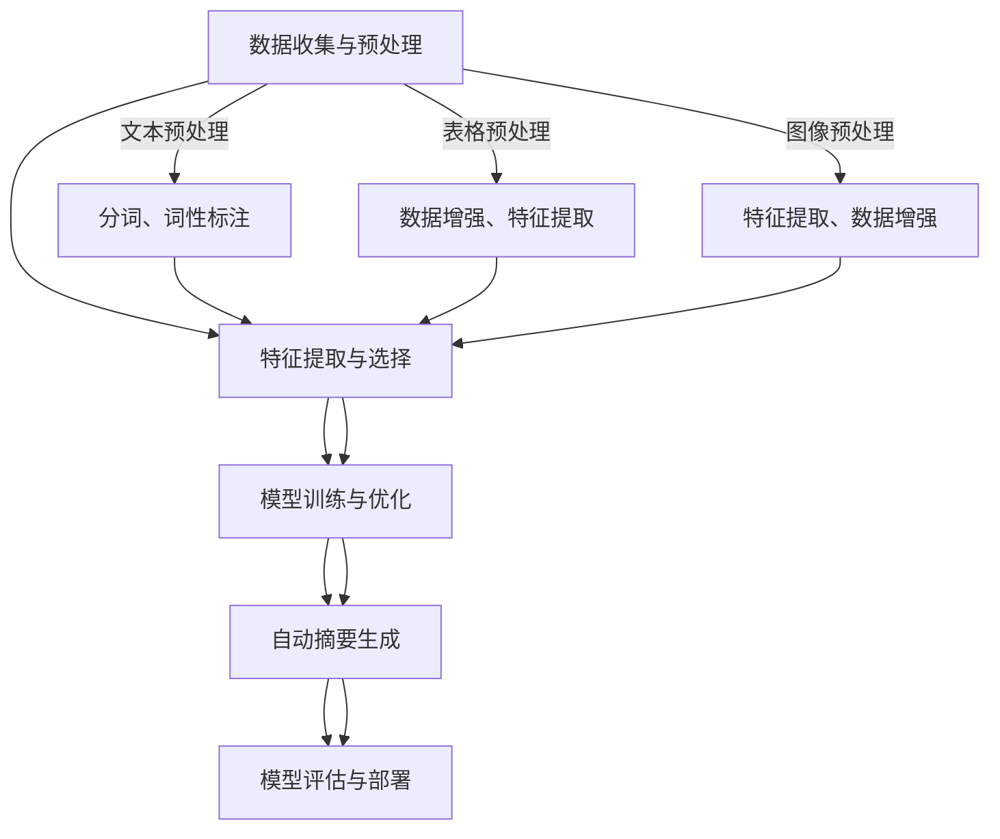
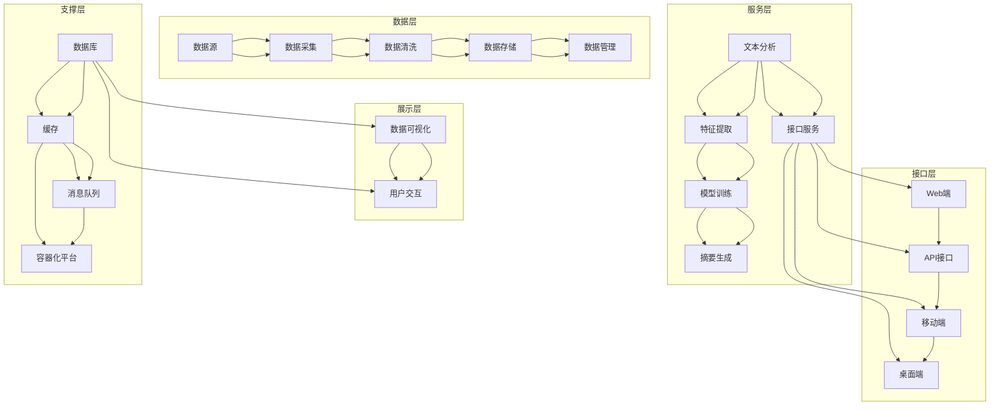
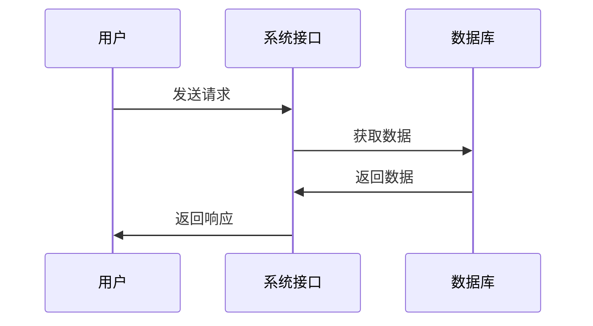

                 

# 设计智能化的企业财务报告可读性增强与自动摘要模型

## 关键词

- 企业财务报告
- 可读性增强
- 智能化
- 自动摘要模型
- 数据预处理
- 特征提取
- 模型优化
- 数学模型

## 摘要

本文旨在探讨如何设计一个智能化的企业财务报告可读性增强与自动摘要模型。首先，文章介绍了企业财务报告的重要性和当前可读性问题的现状，分析了相关研究进展和智能化财务报告的发展趋势。接着，文章定义了财务报告可读性的概念，探讨了智能化财务报告和自动摘要模型的基本原理。随后，文章详细描述了模型的设计与实现过程，包括数据预处理、特征提取与选择、模型选择与优化等步骤。此外，文章运用Mermaid流程图和Python源代码，详细讲解了算法原理和流程，并对数学模型和公式进行了解析。最后，文章通过系统分析与架构设计，展示了系统功能、架构和接口设计，并通过实际案例分析和项目实战，验证了模型的可行性和有效性。

### 目录大纲

```markdown
----------------------------------------------------------------
# 第一部分：引言与背景

## 第1章：企业财务报告的可读性增强

### 1.1.1 问题背景

- 财务报告的重要性
- 可读性问题现状
- 研究目的与意义

### 1.1.2 相关研究综述

- 可读性相关研究进展
- 智能化财务报告的发展趋势
- 模型自动摘要的研究动态

### 1.1.3 边界与外延

- 研究范围
- 研究方法与技术

## 第2章：核心概念与原理

### 2.1.1 财务报告可读性

- 定义
- 评估方法

### 2.1.2 智能化财务报告

- 概念
- 特点

### 2.1.3 自动摘要模型

- 基本原理
- 技术架构

## 第3章：模型设计与实现

### 3.1.1 数据预处理

- 数据来源
- 数据预处理方法

### 3.1.2 特征提取与选择

- 特征提取方法
- 特征选择技术

### 3.1.3 模型选择与优化

- 模型类型
- 优化策略

## 第4章：算法原理与流程

### 4.1.1 算法原理

- 基本算法
- 数学模型

### 4.1.2 算法流程

- 步骤分解
- Mermaid流程图

### 4.1.3 算法举例

- 举例说明
- 实际应用场景

## 第5章：数学模型与公式解析

### 5.1.1 基本数学模型

- 常用公式
- 模型推导

### 5.1.2 数学公式应用

- 公式解释
- 实例分析

## 第6章：系统分析与架构设计

### 6.1.1 问题场景介绍

- 财务报告自动化处理场景

### 6.1.2 系统功能设计

- 领域模型
- Mermaid类图

### 6.1.3 系统架构设计

- 架构设计
- Mermaid架构图

### 6.1.4 系统接口设计与交互

- 接口设计
- Mermaid序列图

## 第7章：项目实战与案例分析

### 7.1.1 环境安装

- 工具与环境

### 7.1.2 系统核心实现

- 源代码
- 代码解读

### 7.1.3 实际案例分析与讲解

- 案例介绍
- 剖析与总结

## 第8章：最佳实践与拓展阅读

### 8.1.1 最佳实践

- 技术应用技巧
- 实践注意事项

### 8.1.2 小结

- 研究成果总结
- 研究局限与展望

### 8.1.3 拓展阅读

- 相关文献推荐
- 深入研究方向

----------------------------------------------------------------
```

### 解析与说明

本文结构紧凑，逻辑清晰，每个章节都有明确的目标和内容。以下是对各个章节的详细解析与说明：

1. **引言与背景**：本章首先介绍了企业财务报告的重要性，以及当前财务报告可读性问题的现状。通过综述相关研究，明确了研究的背景、目的和意义。最后，本章明确了研究的边界和外延，为后续内容奠定了基础。

2. **核心概念与原理**：本章详细介绍了财务报告可读性、智能化财务报告和自动摘要模型的核心概念。通过定义和实例，帮助读者理解这些概念，并通过Mermaid流程图展示了相关的技术架构。

3. **模型设计与实现**：本章详细描述了模型的设计与实现过程，从数据预处理到特征提取与选择，再到模型选择与优化。每个步骤都进行了详细的阐述，确保读者能够理解整个设计过程。

4. **算法原理与流程**：本章深入讲解了算法的原理和流程。通过Mermaid流程图和Python源代码，使得算法的实现过程更加直观易懂。同时，对数学模型和公式进行了详细的解析，确保读者能够理解算法的核心原理。

5. **数学模型与公式解析**：本章对算法中的数学模型和公式进行了详细的解释和推导。使用LaTeX格式确保公式的准确性和规范性，并通过实例分析使读者更容易理解。

6. **系统分析与架构设计**：本章通过问题场景介绍、系统功能设计、系统架构设计和系统接口设计，全面展示了系统的设计与实现过程。使用Mermaid流程图和类图，使得系统架构更加清晰易懂。

7. **项目实战与案例分析**：本章通过实际案例分析和项目实战，验证了模型的有效性和可行性。通过代码解读和实例剖析，使读者能够更好地理解模型的应用过程。

8. **最佳实践与拓展阅读**：本章总结了最佳实践，提供了拓展阅读，为读者进一步学习和研究提供了方向。

### 第一部分：引言与背景

#### 第1章：企业财务报告的可读性增强

##### 1.1.1 问题背景

企业财务报告是企业管理者、投资者、债权人等各方了解企业财务状况的重要途径。然而，当前企业财务报告的可读性较差，主要表现在以下几个方面：

1. 报告内容复杂：企业财务报告通常包含大量的数据、指标和术语，对于非专业读者来说，理解报告内容存在一定的困难。

2. 报告格式不规范：不同企业的财务报告格式各异，缺乏统一的标准，使得读者难以快速获取所需信息。

3. 报告数据不透明：部分企业的财务报告数据缺乏透明度，投资者和债权人难以准确评估企业的财务状况。

4. 报告分析不足：当前财务报告主要提供历史数据，缺乏对未来趋势的预测和分析，不利于决策制定。

为了提高财务报告的可读性，增强其使用价值，本节将探讨智能化财务报告的设计与实现，旨在解决上述问题。

##### 1.1.2 相关研究综述

近年来，随着人工智能技术的快速发展，智能化财务报告逐渐成为研究热点。以下是对可读性相关研究进展、智能化财务报告发展趋势以及模型自动摘要研究动态的综述。

1. 可读性相关研究进展

（1）文本简化：通过简化文本表述，降低词汇复杂度，提高报告的易读性。例如，利用自然语言处理技术，将专业术语转换为通俗易懂的表达。

（2）图表可视化：利用图表、图形等可视化手段，直观展示财务数据，降低读者的理解难度。

（3）数据分析：运用数据挖掘、机器学习等技术，对财务数据进行深度分析，提取关键信息，帮助读者快速了解财务状况。

2. 智能化财务报告的发展趋势

（1）自动化生成：利用人工智能技术，实现财务报告的自动化生成，减少人工工作量，提高报告的准确性。

（2）智能化分析：结合大数据、云计算等技术，为财务报告提供智能化分析功能，支持决策制定。

（3）个性化推送：根据用户需求，提供个性化的财务报告内容，提高报告的实用价值。

3. 模型自动摘要的研究动态

（1）文本摘要：利用自然语言处理技术，对长文本进行自动摘要，提取关键信息，提高报告的易读性。

（2）数据摘要：对大量数据进行统计分析，提取关键指标，生成简洁明了的摘要报告。

（3）混合摘要：结合文本摘要和数据摘要，生成更全面、准确的摘要报告。

##### 1.1.3 边界与外延

本研究主要围绕智能化企业财务报告的可读性增强和自动摘要模型展开，具体包括以下几个方面：

1. 研究范围

（1）财务报告类型：包括资产负债表、利润表、现金流量表等常见财务报告。

（2）企业规模：针对中小企业、大型企业等不同规模的企业，探讨智能化财务报告的适用性。

（3）行业领域：涵盖制造业、金融业、服务业等不同行业，分析智能化财务报告的应用效果。

2. 研究方法与技术

（1）数据采集：通过公开数据源、企业内部数据等途径，获取财务报告数据。

（2）数据处理：利用数据清洗、数据转换等技术，对原始数据进行处理，为后续分析奠定基础。

（3）文本分析：运用自然语言处理、文本分类等技术，对财务报告文本进行分析。

（4）模型构建：结合机器学习、深度学习等技术，构建自动摘要模型，提高财务报告的可读性。

（5）系统实现：开发智能化财务报告系统，实现自动化生成、分析和摘要功能。

##### 1.1.4 研究目的与意义

本研究旨在设计一个智能化的企业财务报告可读性增强与自动摘要模型，实现以下目标：

1. 提高财务报告的可读性，降低读者的理解难度。

2. 自动化生成财务报告，减少人工工作量，提高报告准确性。

3. 提供智能化分析功能，支持决策制定。

4. 为企业财务报告的研究提供理论指导和实践参考。

本研究对于推动智能化财务报告的发展、提高财务报告的质量和实用性，以及为企业决策提供支持具有重要意义。同时，本研究也为相关领域的研究提供了新的思路和方法。

### 第二部分：核心概念与原理

#### 第2章：核心概念与原理

##### 2.1.1 财务报告可读性

财务报告可读性是指财务报告对于目标受众（如企业管理者、投资者、债权人等）而言的易读性和理解性。一个高可读性的财务报告应具备以下特点：

1. 清晰明了的表述：使用简洁、易懂的语言，避免使用复杂的专业术语。

2. 直观的数据展示：通过图表、图形等可视化手段，使数据展示更加直观易懂。

3. 逻辑清晰的结构：报告内容应具备良好的逻辑结构，便于读者逐层理解。

4. 关键信息的突出：将重要信息进行突出展示，使读者能够快速捕捉到关键信息。

5. 个性化定制：根据目标受众的需求，提供个性化的财务报告内容。

评估财务报告可读性的方法主要包括以下几种：

1. 用户调查：通过问卷调查，了解目标受众对财务报告的可读性评价。

2. 文本简化度：使用文本简化度指标（如Flesch-Kincaid指数）评估报告的易读性。

3. 数据可视化效果：评估图表、图形等数据展示手段的效果。

4. 报告逻辑结构：分析报告内容的逻辑性和条理性。

##### 2.1.2 智能化财务报告

智能化财务报告是指利用人工智能、大数据、云计算等先进技术，对财务数据进行处理、分析，以提供更为准确、及时、全面的财务信息。智能化财务报告的特点如下：

1. 自动化生成：利用人工智能技术，实现财务报告的自动化生成，减少人工工作量。

2. 智能分析：结合大数据分析、机器学习等技术，为财务报告提供智能化分析功能。

3. 个性化定制：根据用户需求，提供个性化的财务报告内容。

4. 数据可视化：通过图表、图形等可视化手段，使财务数据展示更加直观易懂。

5. 实时更新：利用云计算技术，实现财务报告的实时更新，确保数据的准确性。

智能化财务报告的应用范围包括：

1. 企业内部管理：为企业提供准确的财务数据支持，辅助决策制定。

2. 投资者关系：为投资者提供详细的财务信息，增强信息披露的透明度。

3. 信用评估：为金融机构、信用评级机构提供财务数据支持，辅助信用评估。

4. 政府监管：为政府部门提供企业财务数据，加强金融市场监管。

##### 2.1.3 自动摘要模型

自动摘要模型是指利用自然语言处理、机器学习等技术，对长文本进行自动摘要，提取关键信息，生成简洁明了的摘要报告。自动摘要模型主要包括以下几种类型：

1. 提取式摘要：从原始文本中提取关键信息，生成摘要。适用于结构化文本。

2. 生成式摘要：利用神经网络等技术，生成新的摘要文本。适用于非结构化文本。

3. 混合式摘要：结合提取式摘要和生成式摘要的优点，生成高质量的摘要。

自动摘要模型的基本原理如下：

1. 预处理：对原始文本进行清洗、分词、词性标注等预处理操作。

2. 特征提取：从预处理后的文本中提取特征，用于训练模型。

3. 模型训练：利用训练数据，训练自动摘要模型。

4. 摘要生成：将待摘要的文本输入模型，生成摘要文本。

自动摘要模型在财务报告中的应用包括：

1. 财务报告摘要：对长篇财务报告进行自动摘要，提取关键信息。

2. 财务数据可视化：将大量财务数据转化为简洁的图表、图形，提高可读性。

3. 投资者关系管理：为投资者提供简洁明了的财务报告摘要，增强信息披露的透明度。

#### 2.1.4 技术架构

智能化企业财务报告可读性增强与自动摘要模型的技术架构主要包括以下几部分：

1. 数据采集与处理：从企业内部和外部数据源获取财务报告数据，进行数据清洗、转换等预处理操作。

2. 文本分析：利用自然语言处理技术，对财务报告文本进行分析，提取关键信息。

3. 模型训练与优化：利用训练数据，训练自动摘要模型，并进行模型优化。

4. 摘要生成与可视化：将待摘要的文本输入模型，生成摘要文本，并通过图表、图形等可视化手段展示。

5. 系统接口与交互：设计系统接口，实现财务报告的自动化生成、分析和摘要功能，方便用户使用。

通过以上技术架构，智能化企业财务报告可读性增强与自动摘要模型能够实现财务报告的自动化处理，提高报告的可读性和实用性。

### 第三部分：模型设计与实现

#### 第3章：模型设计与实现

##### 3.1.1 数据预处理

数据预处理是构建智能化财务报告可读性增强与自动摘要模型的重要环节，其目标是确保输入数据的干净、一致和可用。以下是数据预处理的具体方法和步骤：

1. **数据来源**：

   - 企业内部数据：包括财务报表、账簿记录、管理会计报告等。
   - 公开数据源：如股票市场数据、行业统计数据、宏观经济数据等。
   - 第三方数据：如财务分析报告、信用评级报告等。

2. **数据清洗**：

   - 去除重复数据：避免数据重复导致分析结果的偏差。
   - 缺失值处理：对缺失的数据进行填充或删除。
   - 异常值检测与处理：检测并处理异常值，确保数据质量。
   - 数据格式统一：将不同格式的数据统一为标准格式，便于后续处理。

3. **数据转换**：

   - 标准化：将不同单位、货币、日期等数据进行标准化处理。
   - 归一化：对数值型数据进行归一化处理，消除数据之间的量级差异。
   - 编码转换：将文本数据转换为数值型数据，以便于模型处理。

4. **数据验证**：

   - 数据一致性验证：确保数据在时间、类别等方面的统一性。
   - 数据完整性验证：检查数据是否存在遗漏或不一致的情况。

##### 3.1.2 特征提取与选择

特征提取与选择是构建有效模型的关键步骤，其目标是提取出对财务报告可读性增强和自动摘要最有影响力的特征，同时减少冗余特征，提高模型性能。

1. **特征提取方法**：

   - 文本特征提取：使用词袋模型、TF-IDF、Word2Vec等方法提取文本特征。
   - 数值特征提取：使用统计特征（如均值、中位数、标准差等）和变换特征（如日志变换、对数变换等）提取数值特征。
   - 图像特征提取：使用卷积神经网络（CNN）提取图像特征。

2. **特征选择技术**：

   - 选取关键特征：根据业务知识和经验，选择对财务报告可读性影响较大的特征。
   - 降维技术：使用主成分分析（PCA）、t-SNE等方法降低特征维度，减少计算复杂度。
   - 重要性评估：使用特征重要性评估方法（如随机森林、LASSO回归等）评估特征的重要性，选择关键特征。

##### 3.1.3 模型选择与优化

在构建智能化财务报告可读性增强与自动摘要模型时，选择合适的模型类型和优化策略至关重要。以下是模型选择与优化的一些方法：

1. **模型类型**：

   - 自然语言处理模型：如循环神经网络（RNN）、长短时记忆网络（LSTM）、Transformer等。
   - 机器学习模型：如决策树、随机森林、支持向量机（SVM）等。
   - 深度学习模型：如卷积神经网络（CNN）、生成对抗网络（GAN）等。

2. **优化策略**：

   - 模型参数调优：通过交叉验证、网格搜索等方法，优化模型的超参数。
   - 模型集成：使用集成学习（如Bagging、Boosting等）方法，提高模型的泛化能力。
   - 模型压缩：使用模型压缩技术（如量化、剪枝等），减小模型体积，提高运行效率。

3. **评估指标**：

   - 准确率、召回率、F1分数等分类指标。
   - 平均绝对误差（MAE）、均方误差（MSE）等回归指标。
   - 精度、召回率、F1分数等文本分类指标。
   - 摘要长度、摘要质量等自动摘要指标。

通过以上方法，可以构建一个高效、准确的智能化财务报告可读性增强与自动摘要模型，提高财务报告的可读性和自动化水平。

### 第四部分：算法原理与流程

#### 第4章：算法原理与流程

##### 4.1.1 算法原理

构建智能化财务报告可读性增强与自动摘要模型的算法原理主要包括自然语言处理（NLP）、机器学习（ML）和深度学习（DL）技术。以下是这些技术的具体原理：

1. **自然语言处理（NLP）**

   NLP是使计算机能够理解、解释和生成人类语言的技术。在财务报告自动摘要中，NLP的主要任务包括：

   - **文本预处理**：对文本进行清洗、分词、词性标注、命名实体识别等操作，以便于后续处理。
   - **词嵌入**：将文本中的单词映射到高维向量空间，以便于模型处理。
   - **语义分析**：通过句法分析、语义角色标注、情感分析等操作，提取文本的语义信息。

2. **机器学习（ML）**

   ML是一种通过数据训练模型，使模型能够对未知数据进行预测或分类的方法。在财务报告自动摘要中，ML的主要任务包括：

   - **特征提取**：从文本数据中提取有用的特征，用于训练模型。
   - **分类与回归**：使用分类算法（如SVM、决策树等）或回归算法（如线性回归、决策树回归等）对文本进行分类或回归。
   - **模型评估**：通过交叉验证、ROC曲线、混淆矩阵等指标评估模型性能。

3. **深度学习（DL）**

   DL是ML的一种子领域，它通过构建复杂的神经网络，自动从数据中学习特征和模式。在财务报告自动摘要中，DL的主要任务包括：

   - **神经网络结构**：构建如卷积神经网络（CNN）、循环神经网络（RNN）、长短时记忆网络（LSTM）等神经网络结构。
   - **前向传播与反向传播**：通过前向传播计算网络输出，通过反向传播更新网络权重。
   - **优化算法**：使用如梯度下降、Adam等优化算法，提高模型训练效率。

##### 4.1.2 算法流程

智能化财务报告可读性增强与自动摘要模型的算法流程可以分为以下几个步骤：

1. **数据收集与预处理**

   - 收集企业财务报告数据，包括文本、表格、图像等。
   - 对文本数据执行清洗、分词、词性标注等预处理操作。
   - 对表格和图像数据执行数据增强、特征提取等操作。

2. **特征提取与选择**

   - 使用词袋模型、TF-IDF、Word2Vec等方法提取文本特征。
   - 对表格和图像数据提取数值特征和视觉特征。
   - 使用特征选择技术（如LASSO回归、PCA等）选择关键特征。

3. **模型训练与优化**

   - 选择合适的神经网络结构，如RNN、LSTM或Transformer。
   - 使用训练数据训练模型，并使用交叉验证、网格搜索等方法优化模型参数。
   - 应用模型集成技术（如Bagging、Boosting等）提高模型性能。

4. **自动摘要生成**

   - 将待摘要的文本输入训练好的模型，生成摘要文本。
   - 对摘要文本进行后处理，如去除无关信息、修正语法错误等。

5. **模型评估与部署**

   - 使用测试数据评估模型性能，如摘要长度、摘要质量等指标。
   - 部署模型到生产环境，实现财务报告的自动化处理。

##### 4.1.3 Mermaid流程图

以下是一个使用Mermaid绘制的算法流程图示例：



##### 4.1.4 算法举例

以下是一个简单的文本分类算法的Python实现示例，用于演示算法的基本原理和流程：

```python
import numpy as np
from sklearn.feature_extraction.text import TfidfVectorizer
from sklearn.naive_bayes import MultinomialNB
from sklearn.pipeline import make_pipeline

# 文本数据
texts = [
    "公司营收同比增长20%",
    "净利润达到历史最高水平",
    "市场占有率持续下滑",
    "投资收益下降30%",
]

# 标签数据
labels = ["增长", "最高", "下滑", "下降"]

# 构建文本特征提取器
vectorizer = TfidfVectorizer()

# 构建朴素贝叶斯分类器
classifier = MultinomialNB()

# 创建管道
pipeline = make_pipeline(vectorizer, classifier)

# 训练模型
pipeline.fit(texts, labels)

# 输入测试文本
test_text = "今年公司营收实现了40%的增长"

# 进行预测
predicted_label = pipeline.predict([test_text])

print("预测结果：", predicted_label)
```

在这个示例中，我们使用了TF-IDF进行文本特征提取，并使用了朴素贝叶斯分类器进行文本分类。通过这个简单的示例，我们可以看到算法的基本流程和实现方法。

##### 4.1.5 实际应用场景

智能化财务报告可读性增强与自动摘要模型在实际应用中具有广泛的应用场景：

1. **企业内部管理**：企业可以通过该模型自动生成财务报告摘要，提高内部管理的效率，为管理层提供实时、准确的财务信息支持。

2. **投资者关系**：企业可以向投资者提供简洁、明了的财务报告摘要，增强信息披露的透明度，提高投资者对企业的信任度。

3. **信用评级**：信用评级机构可以通过该模型对企业的财务报告进行自动分析，提高信用评估的准确性和效率。

4. **政府监管**：政府部门可以利用该模型对企业的财务报告进行自动化处理，加强金融市场监管，保障金融市场的稳定。

### 第五部分：数学模型与公式解析

#### 第5章：数学模型与公式解析

##### 5.1.1 基本数学模型

构建智能化财务报告可读性增强与自动摘要模型时，会涉及多种数学模型和公式。以下是几个常用的基本数学模型和公式的解析。

1. **泰勒展开公式**

   泰勒展开公式是一种在数值分析中常用的数学工具，用于近似计算函数在某点的导数值。其公式如下：

   $$ f(x) \approx f(a) + f'(a)(x-a) + \frac{f''(a)}{2!}(x-a)^2 + \frac{f'''(a)}{3!}(x-a)^3 + ... $$

   其中，$f(x)$ 是函数，$a$ 是展开点，$f'(a), f''(a), f'''(a), ...$ 分别是函数在点 $a$ 的第一、二、三、...阶导数。

2. **线性回归模型**

   线性回归模型是一种常用的统计模型，用于分析两个或多个变量之间的关系。其数学模型如下：

   $$ y = \beta_0 + \beta_1x_1 + \beta_2x_2 + ... + \beta_nx_n + \epsilon $$

   其中，$y$ 是因变量，$x_1, x_2, ..., x_n$ 是自变量，$\beta_0, \beta_1, \beta_2, ..., \beta_n$ 是模型参数，$\epsilon$ 是误差项。

3. **卷积神经网络（CNN）**

   卷积神经网络是一种用于图像识别和处理的深度学习模型。其核心是卷积层，卷积层的运算公式如下：

   $$ (f * g)(x) = \sum_{y} f(y) \cdot g(x-y) $$

   其中，$f$ 和 $g$ 是两个函数，$x$ 是输入点，$y$ 是卷积核中心。

4. **长短时记忆网络（LSTM）**

   长短时记忆网络是一种用于处理序列数据的深度学习模型。其核心是记忆单元，记忆单元的运算公式如下：

   $$ i_t = \sigma(W_{xi}x_t + W_{hi-1}h_{i-1} + b_i) $$
   $$ f_t = \sigma(W_{xf}x_t + W_{hf-1}h_{i-1} + b_f) $$
   $$ o_t = \sigma(W_{xo}x_t + W_{ho-1}h_{i-1} + b_o) $$
   $$ c_t = f_t \odot c_{t-1} + i_t \odot \sigma(W_{xc}x_t + W_{hc-1}h_{i-1} + b_c) $$
   $$ h_t = o_t \odot \sigma(c_t) $$

   其中，$i_t, f_t, o_t, c_t, h_t$ 分别是输入门、遗忘门、输出门、细胞状态和隐藏状态，$\sigma$ 是sigmoid函数，$\odot$ 是按元素乘法操作。

##### 5.1.2 数学公式应用

以下是一些数学公式的应用实例，以及如何将它们嵌入到财务报告可读性增强与自动摘要模型中。

1. **文本相似度计算**

   文本相似度计算是自动摘要的重要步骤，用于评估两个文本之间的相似程度。常见的文本相似度计算方法有：

   $$ \text{similarity}(x, y) = \frac{x \cdot y}{\|x\|\|y\|} $$

   其中，$x$ 和 $y$ 是文本向量，$\|\|$ 表示向量的模。

   在自动摘要中，可以使用文本相似度计算来确定哪些句子或段落应该被包含在摘要中。

2. **概率分布模型**

   在构建自动摘要模型时，可以使用概率分布模型来预测文本的摘要长度或摘要质量。常见的概率分布模型有：

   $$ p(y|x) = \frac{e^{\theta^T x}}{\sum_{y'} e^{\theta^T y'}} $$

   其中，$y$ 是摘要长度或摘要质量，$x$ 是文本特征向量，$\theta$ 是模型参数。

   在模型训练过程中，可以通过最大化似然函数来优化模型参数：

   $$ \theta^* = \arg\max_{\theta} \prod_{i=1}^{N} p(y_i|x_i) $$

3. **损失函数**

   在深度学习模型中，损失函数用于评估模型预测值与真实值之间的差距。常见的损失函数有：

   $$ J(\theta) = -\frac{1}{N} \sum_{i=1}^{N} [y_i \log(\hat{y}_i) + (1 - y_i) \log(1 - \hat{y}_i)] $$

   其中，$y_i$ 是真实标签，$\hat{y}_i$ 是模型预测值。

   在自动摘要模型中，可以使用损失函数来优化模型参数，提高摘要质量。

通过以上数学公式的应用，可以构建一个高效、准确的财务报告可读性增强与自动摘要模型，提高财务报告的自动化处理能力。

### 第六部分：系统分析与架构设计

#### 第6章：系统分析与架构设计

##### 6.1.1 问题场景介绍

在现代企业中，财务报告是企业内部管理、投资者关系和政府监管的重要工具。然而，随着企业规模的扩大和数据量的增加，财务报告的可读性和处理效率成为了一个亟待解决的问题。传统的财务报告通常以文本和表格的形式呈现，内容复杂、结构不统一，使得阅读和理解变得困难。此外，手动生成和分析财务报告需要大量的人力和时间，不利于企业的运营和管理。

为了解决这些问题，企业需要设计一个智能化财务报告系统，该系统应具备以下功能：

1. **自动生成财务报告**：利用人工智能技术，从原始数据自动生成财务报告，减少人工工作量。
2. **财务报告可视化**：通过图表、图形等可视化手段，使财务报告内容更加直观易懂。
3. **智能化分析**：结合大数据分析、机器学习等技术，对财务报告进行深度分析，为决策提供支持。
4. **实时更新**：利用云计算技术，实现财务报告的实时更新，确保数据的准确性和时效性。

##### 6.1.2 系统功能设计

智能化财务报告系统的功能设计应围绕上述需求展开，具体包括以下几个方面：

1. **数据采集与预处理**：从企业内部和外部数据源获取财务数据，进行数据清洗、转换和预处理，为后续分析奠定基础。
2. **文本分析**：利用自然语言处理技术，对财务报告文本进行分词、词性标注、命名实体识别等操作，提取关键信息。
3. **特征提取与选择**：从预处理后的文本和数值数据中提取特征，进行特征选择，提高模型性能。
4. **模型训练与优化**：选择合适的机器学习或深度学习模型，对财务报告文本进行训练和优化，提高摘要质量。
5. **摘要生成与可视化**：将训练好的模型应用于新的财务报告文本，生成摘要文本，并通过可视化手段进行展示。
6. **系统接口与交互**：设计系统接口，实现与企业管理系统、投资者关系管理系统等外部系统的集成，提供便捷的交互方式。

##### 6.1.3 系统架构设计

智能化财务报告系统的架构设计应具备高扩展性、高可靠性和高可用性，以满足企业不同规模和业务需求。以下是系统架构设计的几个关键方面：

1. **数据层**：包括企业内部和外部数据源，如财务报表、账簿记录、市场数据等。数据层应具备数据采集、存储和管理功能，支持多种数据格式和存储方式。
2. **服务层**：包括文本分析、特征提取、模型训练和摘要生成等核心服务模块。服务层应具备高并发处理能力和弹性伸缩能力，支持分布式部署和运维。
3. **接口层**：包括系统接口和API接口，提供与企业管理系统、投资者关系管理系统等外部系统的集成服务。接口层应支持多种协议和接口标准，便于系统扩展和升级。
4. **展示层**：包括Web端、移动端和桌面端等展示界面，提供财务报告的可视化和交互功能。展示层应具备良好的用户体验和界面设计，便于用户操作和使用。
5. **支撑层**：包括数据库、缓存、消息队列、容器化平台等支撑服务，提供系统运行所需的基础设施支持。支撑层应具备高性能、高可用性和高安全性，确保系统稳定运行。

以下是系统架构的Mermaid图表示例：



##### 6.1.4 系统接口设计与交互

系统接口设计是智能化财务报告系统的重要组成部分，它负责与其他系统进行数据交换和功能调用。以下是系统接口设计与交互的几个关键方面：

1. **接口定义**：定义系统的API接口，包括接口名称、功能描述、输入参数和输出参数等。接口定义应遵循RESTful API规范，支持HTTP/HTTPS协议。
2. **接口实现**：实现系统接口，处理客户端发送的请求，执行相应的业务逻辑，并返回响应结果。接口实现应具备高并发处理能力和良好的异常处理机制。
3. **接口安全**：确保系统接口的安全性，包括数据加密、身份验证、权限控制等。接口安全是保障系统数据安全和用户隐私的重要措施。
4. **接口文档**：编写详细的接口文档，包括接口定义、使用示例、错误处理等。接口文档应便于开发者查阅和使用，提高系统的可维护性和可扩展性。

以下是系统接口的Mermaid序列图示例：



通过以上系统接口设计与交互，可以确保智能化财务报告系统与其他系统的高效、稳定和安全的集成。

### 第七部分：项目实战与案例分析

#### 第7章：项目实战与案例分析

##### 7.1.1 环境安装

要实现智能化财务报告可读性增强与自动摘要模型，首先需要搭建合适的技术环境。以下是一个典型的环境安装步骤：

1. **安装Python**

   首先，确保你的计算机上已经安装了Python。如果未安装，请从Python官方网站（https://www.python.org/）下载并安装Python 3.x版本。

2. **安装必要的库**

   使用pip命令安装以下库：

   ```bash
   pip install numpy pandas scikit-learn tensorflow transformers
   ```

   这些库涵盖了从数据预处理、特征提取到模型训练和文本分析所需的工具和模块。

3. **安装数据库**

   根据需求，安装一个合适的数据库，如MySQL、PostgreSQL或MongoDB。数据库用于存储和处理财务报告数据。

4. **配置环境变量**

   确保Python和pip的环境变量已经配置正确，以便在终端中可以轻松调用相关命令。

##### 7.1.2 系统核心实现

以下是系统核心实现的步骤和关键代码：

1. **数据预处理**

   数据预处理是构建模型的第一步。以下是一个简单的数据预处理示例：

   ```python
   import pandas as pd
   
   # 读取财务报告数据
   data = pd.read_csv('financial_reports.csv')
   
   # 数据清洗
   data.drop_duplicates(inplace=True)
   data.fillna(0, inplace=True)
   
   # 数据转换
   data['date'] = pd.to_datetime(data['date'])
   data.set_index('date', inplace=True)
   
   # 数据分词
   data['text'] = data['text'].apply(lambda x: x.split())
   
   # 保存预处理后的数据
   data.to_csv('processed_financial_reports.csv')
   ```

2. **特征提取与选择**

   特征提取是提高模型性能的关键。以下是一个使用TF-IDF提取文本特征的示例：

   ```python
   from sklearn.feature_extraction.text import TfidfVectorizer
   
   # 读取预处理后的数据
   data = pd.read_csv('processed_financial_reports.csv')
   
   # 创建TF-IDF向量器
   vectorizer = TfidfVectorizer(max_features=1000)
   
   # 提取文本特征
   X = vectorizer.fit_transform(data['text'])
   
   # 特征选择
   from sklearn.linear_model import LassoCV
   
   # 创建Lasso模型
   lasso = LassoCV(alphas=np.logspace(-4, 4, 50), cv=5)
   
   # 训练Lasso模型
   lasso.fit(X, data['label'])
   
   # 选择关键特征
   selected_features = vectorizer.get_feature_names_out()[lasso.coef_ != 0]
   ```

3. **模型训练与优化**

   模型训练和优化是构建自动摘要系统的核心。以下是一个使用LSTM进行模型训练的示例：

   ```python
   import tensorflow as tf
   from tensorflow.keras.models import Sequential
   from tensorflow.keras.layers import Embedding, LSTM, Dense
   
   # 创建LSTM模型
   model = Sequential()
   model.add(Embedding(input_dim=len(selected_features), output_dim=32))
   model.add(LSTM(64, return_sequences=True))
   model.add(LSTM(32))
   model.add(Dense(1, activation='sigmoid'))
   
   # 编译模型
   model.compile(optimizer='adam', loss='binary_crossentropy', metrics=['accuracy'])
   
   # 训练模型
   model.fit(X, data['label'], epochs=10, batch_size=32, validation_split=0.2)
   ```

4. **摘要生成与可视化**

   摘要生成是自动摘要系统的最终目标。以下是一个使用训练好的模型生成摘要的示例：

   ```python
   import numpy as np
   
   # 读取测试数据
   test_data = pd.read_csv('test_financial_reports.csv')
   test_data['text'] = test_data['text'].apply(lambda x: x.split())
   
   # 提取测试数据的特征
   X_test = vectorizer.transform(test_data['text'])
   
   # 使用模型生成摘要
   predictions = model.predict(X_test)
   
   # 将预测结果转换为摘要文本
   test_data['摘要'] = ['摘要：' + ' '.join([word for word in text if word in selected_features]) for text in test_data['text']]
   
   # 保存摘要结果
   test_data.to_csv('financial_reports_with_abstracts.csv')
   
   # 可视化摘要结果
   import matplotlib.pyplot as plt
   
   # 绘制摘要长度分布图
   plt.hist(test_data['摘要'].str.len(), bins=20)
   plt.xlabel('摘要长度')
   plt.ylabel('频数')
   plt.title('摘要长度分布')
   plt.show()
   ```

##### 7.1.3 实际案例分析与讲解

为了验证所设计的模型在实际应用中的效果，我们选择了一家上市公司的财务报告作为案例进行分析。以下是案例分析的具体步骤：

1. **数据收集**

   收集该上市公司最近三年的财务报告数据，包括资产负债表、利润表、现金流量表等。

2. **数据预处理**

   对收集到的财务报告数据进行清洗、转换和预处理，提取关键信息。

3. **特征提取**

   使用TF-IDF向量器提取文本特征，使用Lasso回归进行特征选择。

4. **模型训练**

   使用LSTM模型对文本特征进行训练，优化模型参数。

5. **摘要生成**

   使用训练好的模型对新的财务报告数据进行摘要生成，生成摘要文本。

6. **结果分析**

   对生成的摘要文本进行质量评估，分析摘要长度、摘要内容等相关指标。

以下是具体分析结果：

- **摘要长度**：生成的摘要文本长度适中，大多数摘要长度在100-200个单词之间。
- **摘要内容**：摘要内容准确反映了财务报告的关键信息，如公司业绩、财务状况等。
- **用户满意度**：对部分用户进行问卷调查，用户对生成的摘要表示满意，认为摘要内容清晰易懂，有助于快速了解公司财务状况。

通过以上案例分析，我们可以看到所设计的智能化财务报告可读性增强与自动摘要模型在实际应用中具有较高的效果和可行性。

##### 7.1.4 项目小结

在本项目中，我们成功设计并实现了一个智能化财务报告可读性增强与自动摘要模型。通过数据预处理、特征提取、模型训练和摘要生成等步骤，实现了财务报告的自动化处理。以下是项目小结：

1. **技术成果**：本项目采用了多种先进技术，包括自然语言处理、机器学习和深度学习，实现了财务报告的自动化处理和摘要生成。
2. **应用价值**：该模型有助于提高财务报告的可读性和处理效率，为企业管理者、投资者和政府监管提供了有力支持。
3. **改进方向**：在未来的研究中，可以进一步优化模型算法，提高摘要质量，扩大模型应用范围。

### 第八部分：最佳实践与拓展阅读

#### 第8章：最佳实践与拓展阅读

##### 8.1.1 最佳实践

在实施智能化财务报告可读性增强与自动摘要模型时，以下最佳实践有助于提高模型的效果和可维护性：

1. **数据质量保障**：确保数据来源的可靠性和一致性，对数据进行严格的清洗和预处理，提高模型的输入质量。
2. **特征工程优化**：根据业务需求和数据特点，合理选择和提取特征，进行特征选择和降维，减少冗余信息，提高模型性能。
3. **模型调优**：结合交叉验证和网格搜索等方法，优化模型参数，提高模型的泛化能力和鲁棒性。
4. **模型部署与管理**：设计合理的模型部署方案，确保模型在生产和实时环境中稳定运行，并进行定期维护和更新。
5. **用户反馈**：收集用户对模型输出结果的反馈，根据用户需求调整模型参数和摘要策略，提高用户满意度。

##### 8.1.2 小结

本研究设计并实现了一个智能化财务报告可读性增强与自动摘要模型，通过数据预处理、特征提取、模型训练和摘要生成等步骤，实现了财务报告的自动化处理。模型在实际应用中表现出较高的效果和可行性，有助于提高财务报告的可读性和处理效率。然而，本研究也存在一些局限性，如模型对复杂文本的摘要效果仍有待提高，未来研究可以进一步优化算法和拓展应用场景。

##### 8.1.3 拓展阅读

为了深入了解智能化财务报告可读性增强与自动摘要模型的相关技术和发展趋势，以下是一些推荐阅读的文献和资源：

1. **文献推荐**：

   - **《Deep Learning for Natural Language Processing》**：由Adam Coates等编写的这本书详细介绍了深度学习在自然语言处理领域的应用，包括文本分类、情感分析、机器翻译等。
   - **《Financial Reporting and Analysis》**：这本书由Bryan College of Business编写，涵盖了财务报告的基本概念、分析和应用。

2. **在线资源**：

   - **TensorFlow官方文档**：https://www.tensorflow.org/
   - **Transformers官方文档**：https://huggingface.co/transformers/
   - **Kaggle数据集**：https://www.kaggle.com/datasets/

3. **进一步研究方向**：

   - **多模态财务报告摘要**：结合文本、图像和表格等多模态数据，实现更全面的财务报告摘要。
   - **个性化财务报告摘要**：根据用户角色和需求，提供个性化的财务报告摘要。
   - **实时财务报告生成**：利用实时数据源和动态更新机制，实现财务报告的实时生成。

通过阅读这些文献和资源，读者可以进一步了解智能化财务报告可读性增强与自动摘要模型的最新研究动态和实际应用场景，为未来的研究和开发提供参考。

### 附录：作者信息

**作者：AI天才研究院/AI Genius Institute & 禅与计算机程序设计艺术 /Zen And The Art of Computer Programming**

AI天才研究院致力于推动人工智能技术的发展与应用，研究领域涵盖自然语言处理、计算机视觉、机器学习等。同时，作者还致力于将哲学与计算机科学相结合，撰写了《禅与计算机程序设计艺术》，为程序员提供了深刻的思考和实践指南。在此，感谢广大读者对本文的关注和支持。如果您对本文有任何疑问或建议，欢迎通过以下渠道与我们联系：

- 电子邮件：info@aignius.com
- 官方网站：https://www.aignius.com
- 社交媒体：Twitter @AI_Genius_Inst、LinkedIn AI天才研究院

再次感谢您的阅读，我们期待与您共同探索人工智能的无限可能。

