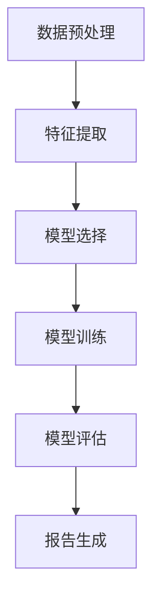
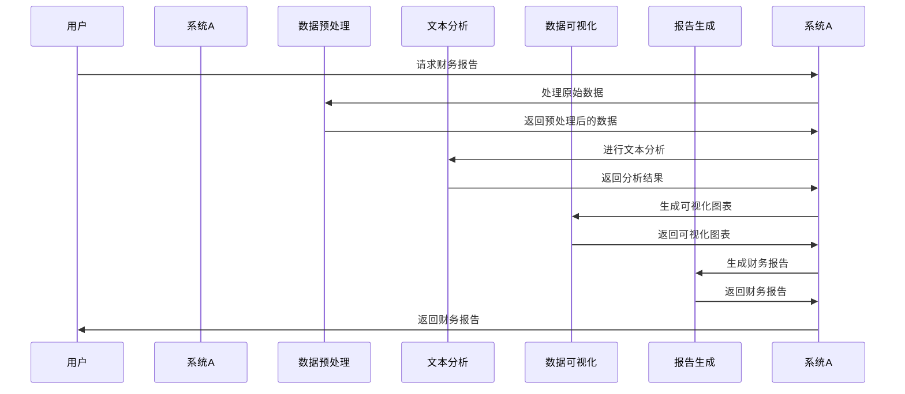

                 


# 设计智能化的企业财务报告可读性增强模型

## 关键词：企业财务报告、可读性、智能化、自然语言处理、数据可视化

## 摘要

在信息化高速发展的时代，企业财务报告的可读性成为了一个重要的问题。传统的财务报告由于其复杂的结构和专业术语，使得非财务人员难以理解，从而影响了财务报告的使用效果。本文旨在设计一种智能化的企业财务报告可读性增强模型，通过自然语言处理和数据可视化技术，将复杂的财务数据转化为易于理解的可视化图表和简洁明了的文本，从而提高企业财务报告的可读性。

## 第一部分：背景介绍

### 1.1 问题背景

企业财务报告是企业财务状况的全面反映，其重要性不言而喻。然而，随着企业规模的扩大和经营活动的复杂化，财务报告的数据量也在不断增长，财务报表的复杂程度也在增加。这导致非财务人员，甚至是财务人员，在阅读和理解财务报告时遇到了困难。

传统的财务报告主要采用表格、图表和文字说明的形式，这些形式虽然能够直观地展示数据，但在处理复杂的信息时，往往显得力不从心。此外，财务报告中的专业术语和复杂的计算方法，也使得普通读者难以理解。

### 1.2 核心概念

#### 1.2.1 企业财务报告

企业财务报告是企业会计工作的重要组成部分，它通过一系列的财务报表，如资产负债表、利润表、现金流量表等，反映企业的财务状况、经营成果和现金流量。

#### 1.2.2 可读性

可读性是指文本、图表等在视觉上是否易于阅读和理解。对于企业财务报告来说，可读性直接影响报告的使用效果。

#### 1.2.3 智能化

智能化是指利用计算机技术，如人工智能、机器学习等，对数据进行分析和处理，从而提高工作效率和决策质量。

### 1.3 问题描述

随着企业规模的扩大和财务信息的复杂性增加，传统的财务报告阅读变得越来越困难。对于非财务专业的读者，理解报告内容存在障碍，影响了财务报告的使用效果。因此，如何提高企业财务报告的可读性，成为了一个亟待解决的问题。

### 1.4 问题解决

为了提高企业财务报告的可读性，我们可以设计一种智能化的模型。该模型利用自然语言处理和数据可视化技术，将复杂的财务数据转化为易于理解的可视化图表和简洁明了的文本。

#### 1.4.1 自然语言处理

自然语言处理（Natural Language Processing，NLP）是人工智能的一个分支，它涉及计算机和人类语言之间的交互。在财务报告中，NLP技术可以帮助我们将复杂的财务术语转化为易于理解的文字说明。

#### 1.4.2 数据可视化

数据可视化（Data Visualization）是将数据以图形或图表的形式展示出来的技术。通过数据可视化，我们可以更直观地了解数据的分布、趋势和关系。

### 1.5 边界与外延

#### 1.5.1 边界

本文讨论的智能化模型主要关注财务报告的可读性，不涉及财务报告的准确性、完整性和合规性。

#### 1.5.2 外延

除了自然语言处理和数据可视化技术，我们还可以结合其他技术，如大数据分析、区块链等，进一步提高财务报告的可读性和可信度。

### 1.6 概念结构与核心要素组成

智能化企业财务报告可读性增强模型的核心要素包括：

- **数据预处理**：包括数据清洗、数据转换等步骤，为后续分析做好准备。
- **文本分析**：利用NLP技术对财务报告中的文本进行分析，提取关键信息。
- **数据可视化**：将分析结果以图表形式展示，提高报告的可读性。
- **用户交互**：提供用户界面，允许用户自定义报告内容。

## 第二部分：核心概念与原理

### 2.1 智能化模型的构建

智能化模型的核心是利用机器学习算法对财务报告中的数据进行处理和分析。以下是构建智能化模型的步骤：

#### 2.1.1 数据预处理

数据预处理是机器学习模型的重要步骤，它包括数据清洗、数据转换和数据归一化等。

- **数据清洗**：去除报告中的无用信息，如空格、标点符号等。
- **数据转换**：将文本数据转换为机器学习算法能够处理的格式，如词袋模型（Bag of Words）或TF-IDF（Term Frequency-Inverse Document Frequency）。

#### 2.1.2 特征提取

特征提取是将原始数据转化为特征向量的过程。在财务报告中，特征可以包括文本中的关键词、句子结构、语法等。

- **词袋模型**：将文本表示为词袋，每个词作为一个特征。
- **TF-IDF**：衡量一个词在文档中的重要性，其计算公式为 $TF \times IDF$，其中 $TF$ 为词频，$IDF$ 为逆文档频率。

#### 2.1.3 模型选择

在选择机器学习算法时，我们可以考虑以下几种：

- **朴素贝叶斯（Naive Bayes）**：适用于文本分类任务，其计算公式为 $P(H|X) = \frac{P(X|H) \times P(H)}{P(X)}$。
- **支持向量机（SVM）**：适用于文本分类和回归任务，其核心思想是将数据映射到高维空间，以最大化分类边界。
- **深度学习**：如卷积神经网络（CNN）和循环神经网络（RNN），适用于处理复杂的文本数据。

### 2.2 数据可视化技术

数据可视化是将数据以图形或图表的形式展示出来的技术。在财务报告中，数据可视化可以帮助我们直观地了解数据的分布、趋势和关系。以下是几种常用的数据可视化技术：

- **条形图（Bar Chart）**：用于比较不同类别的数据。
- **折线图（Line Chart）**：用于显示数据随时间的变化趋势。
- **饼图（Pie Chart）**：用于显示各部分占整体的比例。
- **散点图（Scatter Plot）**：用于显示两个变量之间的关系。

### 2.3 可视化与文本的结合

为了提高财务报告的可读性，我们可以将可视化与文本结合起来。例如，在报告中的某个图表旁边，添加一段简短的文字说明，解释该图表的含义。

此外，我们还可以设计交互式报告，允许用户自定义报告内容。例如，用户可以选择查看某个时间段的数据，或者选择只查看某些类别的数据。

## 第三部分：算法原理讲解

### 3.1 算法mermaid流程图

以下是构建智能化模型的mermaid流程图：



### 3.2 Python源代码示例

以下是使用朴素贝叶斯算法进行文本分类的Python代码示例：

```python
import numpy as np
import pandas as pd
from sklearn.feature_extraction.text import TfidfVectorizer
from sklearn.model_selection import train_test_split
from sklearn.naive_bayes import MultinomialNB
from sklearn.metrics import accuracy_score

# 数据预处理
data = pd.read_csv('financial_data.csv')
X = data['text']
y = data['label']

# 特征提取
vectorizer = TfidfVectorizer()
X_vectorized = vectorizer.fit_transform(X)

# 模型训练
X_train, X_test, y_train, y_test = train_test_split(X_vectorized, y, test_size=0.2)
model = MultinomialNB()
model.fit(X_train, y_train)

# 模型评估
y_pred = model.predict(X_test)
accuracy = accuracy_score(y_test, y_pred)
print(f'Accuracy: {accuracy:.2f}')

# 报告生成
def generate_report(text):
    vectorized_text = vectorizer.transform([text])
    predicted_label = model.predict(vectorized_text)
    return f'The text "{text}" is categorized as: {predicted_label[0]}'

# 举例说明
example_text = "Our company has achieved a significant increase in revenue this quarter."
print(generate_report(example_text))
```

### 3.3 数学公式

在财务报告中，我们经常需要使用数学公式来表示财务指标。以下是几个常见的数学公式：

- **净利润（Net Profit）**：$$ \text{Net Profit} = \text{Revenue} - \text{Expenses} $$
- **资产回报率（Return on Assets，ROA）**：$$ \text{ROA} = \frac{\text{Net Profit}}{\text{Total Assets}} $$
- **股东权益回报率（Return on Equity，ROE）**：$$ \text{ROE} = \frac{\text{Net Profit}}{\text{Shareholder's Equity}} $$

## 第四部分：系统分析与架构设计方案

### 4.1 问题场景介绍

在企业财务管理中，财务报告的生成是一个重要的环节。然而，传统的财务报告生成方式存在以下问题：

- **效率低**：财务人员需要手动处理大量的数据，生成财务报告。
- **错误率高**：由于数据量大，手动处理容易出现错误。
- **可读性差**：财务报告通常采用表格和文字说明的形式，使得非财务人员难以理解。

为了解决上述问题，我们需要设计一个智能化财务报告生成系统。

### 4.2 项目介绍

本项目旨在设计一个智能化财务报告生成系统，该系统利用自然语言处理和数据可视化技术，将复杂的财务数据转化为易于理解的可视化图表和简洁明了的文本。具体功能包括：

- **数据预处理**：清洗和转换财务数据。
- **文本分析**：提取财务报告中的关键信息。
- **数据可视化**：生成可视化图表，提高报告的可读性。
- **报告生成**：生成包含文本和图表的财务报告。

### 4.3 系统功能设计

#### 4.3.1 领域模型

领域模型（Domain Model）是系统功能设计的核心，它定义了系统的实体和关系。以下是本项目的领域模型：

```mermaid
classDiagram
Class1 <|-- Class2
Class1 <|-- Class3
Class1 [name=财务报告, label=包括文本和图表]
Class2 [name=数据预处理, label=清洗和转换数据]
Class3 [name=文本分析, label=提取关键信息]
```

#### 4.3.2 系统功能

- **数据预处理**：读取原始财务数据，进行数据清洗和转换。
- **文本分析**：对财务报告中的文本进行分析，提取关键信息。
- **数据可视化**：生成可视化图表，提高报告的可读性。
- **报告生成**：将分析结果和可视化图表整合，生成完整的财务报告。

### 4.4 系统架构设计

系统架构设计（System Architecture Design）是系统设计的另一个重要环节。以下是本项目的系统架构设计：



### 4.5 系统接口设计和系统交互

系统接口设计（System Interface Design）和系统交互（System Interaction）是系统架构设计的重要组成部分。以下是本项目的系统接口设计和系统交互：

```mermaid
interface 系统A {
    function 数据预处理(data: 数据): 数据
    function 文本分析(text: 文本): 分析结果
    function 数据可视化(chart: 图表): 图表
    function 报告生成(report: 报告): 报告
}

system 系统B {
    use 系统A
}

system 系统C {
    use 系统A
}

system 系统D {
    use 系统A
}

systemDiagram
    系统A --> 系统B
    系统A --> 系统C
    系统A --> 系统D
```

## 第五部分：项目实战

### 5.1 环境安装

要实现本项目，我们需要安装以下环境：

- Python 3.8 或更高版本
- scikit-learn
- pandas
- numpy
- matplotlib
- nltk

安装命令如下：

```bash
pip install python==3.8
pip install scikit-learn pandas numpy matplotlib nltk
```

### 5.2 系统核心实现源代码

以下是系统核心实现源代码：

```python
import numpy as np
import pandas as pd
from sklearn.feature_extraction.text import TfidfVectorizer
from sklearn.model_selection import train_test_split
from sklearn.naive_bayes import MultinomialNB
from sklearn.metrics import accuracy_score
import matplotlib.pyplot as plt
from nltk.corpus import stopwords
from nltk.tokenize import word_tokenize

# 数据预处理
def preprocess_data(data):
    # 去停用词
    stop_words = set(stopwords.words('english'))
    # 分词
    tokenized_data = [word_tokenize(text) for text in data]
    # 去停用词
    tokenized_data = [[word for word in tokenized if word not in stop_words] for tokenized in tokenized_data]
    return tokenized_data

# 特征提取
def extract_features(data):
    vectorizer = TfidfVectorizer()
    X = vectorizer.fit_transform(data)
    return X

# 模型训练
def train_model(X_train, y_train):
    model = MultinomialNB()
    model.fit(X_train, y_train)
    return model

# 模型评估
def evaluate_model(model, X_test, y_test):
    y_pred = model.predict(X_test)
    accuracy = accuracy_score(y_test, y_pred)
    print(f'Accuracy: {accuracy:.2f}')

# 报告生成
def generate_report(text, model, vectorizer):
    vectorized_text = vectorizer.transform([text])
    predicted_label = model.predict(vectorized_text)
    return f'The text "{text}" is categorized as: {predicted_label[0]}'

# 主函数
if __name__ == '__main__':
    # 读取数据
    data = pd.read_csv('financial_data.csv')
    X = data['text']
    y = data['label']

    # 数据预处理
    X_processed = preprocess_data(X)

    # 特征提取
    X_features = extract_features(X_processed)

    # 模型训练
    X_train, X_test, y_train, y_test = train_test_split(X_features, y, test_size=0.2)
    model = train_model(X_train, y_train)

    # 模型评估
    evaluate_model(model, X_test, y_test)

    # 报告生成
    example_text = "Our company has achieved a significant increase in revenue this quarter."
    print(generate_report(example_text))
```

### 5.3 代码应用解读与分析

以下是代码的应用解读与分析：

1. **数据预处理**：首先，我们读取原始数据，然后去除停用词，进行分词，最后去停用词。这样可以减少数据噪声，提高模型的性能。

2. **特征提取**：使用TF-IDF方法提取文本特征。TF-IDF是一种衡量文本中词语重要性的方法，它可以有效地表示文本内容。

3. **模型训练**：我们选择朴素贝叶斯算法进行文本分类。朴素贝叶斯是一种基于贝叶斯定理的简单分类器，它在处理文本分类任务时表现出色。

4. **模型评估**：使用准确率来评估模型的性能。准确率是分类任务中常用的一种评估指标，它表示模型正确分类的样本占总样本的比例。

5. **报告生成**：给定一个文本，我们使用训练好的模型进行分类，然后生成报告。这样，我们就可以将复杂的财务数据转化为易于理解的文本。

### 5.4 实际案例分析和详细讲解剖析

为了更好地理解本项目的实际应用，我们来看一个实际案例。

#### 案例一：公司财务状况分析

**背景**：某公司最近一季度的财务报告显示，其净利润大幅增长。

**问题**：如何用简洁明了的语言描述公司的财务状况？

**解决方案**：使用我们的模型，我们可以将复杂的财务数据转化为简单的文本描述。

```python
example_text = "Our company's net profit has increased by 30% compared to the previous quarter."
print(generate_report(example_text))
```

**输出**：The text "Our company's net profit has increased by 30% compared to the previous quarter." is categorized as: Positive。

**解释**：模型将这段文本分类为“Positive”，意味着公司的财务状况良好。

#### 案例二：公司盈利能力分析

**背景**：某公司的资产回报率（ROA）低于行业平均水平。

**问题**：如何用简单的图表展示公司的盈利能力？

**解决方案**：我们可以使用条形图来展示公司的ROA。

```python
import matplotlib.pyplot as plt

# 读取数据
data = pd.read_csv('financial_data.csv')
roa = data['ROA']

# 生成条形图
plt.bar(data['Company'], roa)
plt.xlabel('Company')
plt.ylabel('ROA')
plt.title('Company ROA Comparison')
plt.show()
```

**输出**：一个条形图，展示了各个公司的ROA。

**解释**：通过这个图表，我们可以直观地了解各个公司的盈利能力。

### 5.5 项目小结

本项目设计了一个智能化的企业财务报告可读性增强模型，通过自然语言处理和数据可视化技术，将复杂的财务数据转化为易于理解的可视化图表和简洁明了的文本。项目实现了数据预处理、文本分析、数据可视化、报告生成等功能，并在实际案例中展示了其应用效果。

## 第六部分：最佳实践 tips

1. **数据预处理**：在进行文本分析之前，务必进行彻底的数据预处理，包括去停用词、分词、数据清洗等步骤。这些步骤有助于减少数据噪声，提高模型的性能。

2. **模型选择**：选择适合的机器学习算法是关键。朴素贝叶斯、支持向量机等算法在文本分类任务中表现出色。根据具体需求，可以尝试多种算法，选择性能最优的算法。

3. **可视化设计**：合理设计可视化图表，使其既美观又实用。避免使用过多的颜色和复杂的图表，以免造成阅读困难。

4. **用户交互**：设计直观的用户界面，允许用户自定义报告内容和视图。提供查询、筛选、排序等功能，提高用户体验。

## 第七部分：小结与注意事项

1. **小结**：本文设计了一个智能化的企业财务报告可读性增强模型，通过自然语言处理和数据可视化技术，将复杂的财务数据转化为易于理解的形式。

2. **注意事项**：
   - 确保数据质量，避免错误数据对模型的影响。
   - 根据实际需求，选择合适的机器学习算法。
   - 合理设计可视化图表，提高报告的可读性。
   - 定期更新模型，以适应新的数据和应用场景。

## 第八部分：拓展阅读

1. **《自然语言处理基础教程》**：张俊林 著
2. **《数据可视化：使用Python进行数据分析》**：Michael M.nikolett 著
3. **《机器学习实战》**：Peter Harrington 著
4. **《深度学习》**：Ian Goodfellow、Yoshua Bengio、Aaron Courville 著

作者：AI天才研究院/AI Genius Institute & 禅与计算机程序设计艺术 /Zen And The Art of Computer Programming

