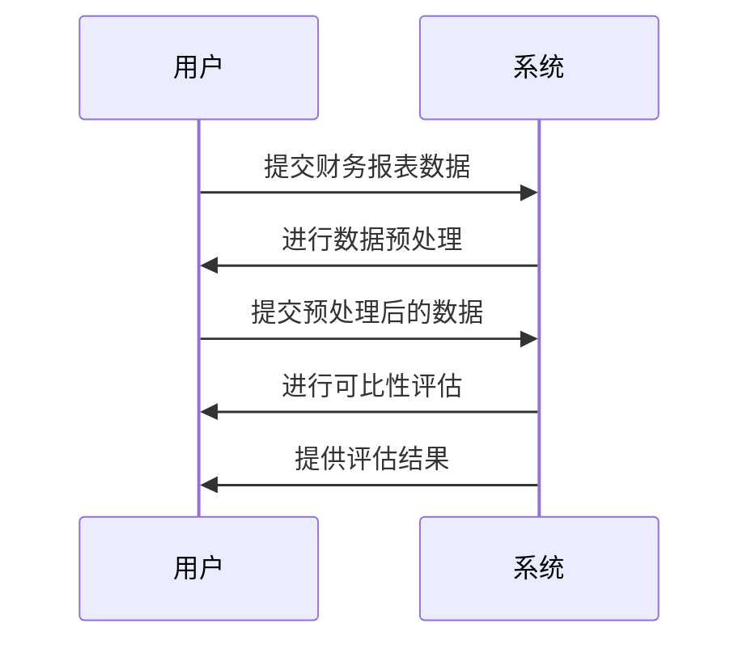

                 

# 设计智能化的企业财务报表可比性评分系统

## 关键词

- 智能化财务报表
- 可比性评分系统
- 机器学习算法
- 数据预处理
- 系统架构设计

## 摘要

本文旨在探讨设计一个智能化的企业财务报表可比性评分系统。该系统通过运用机器学习和深度学习算法，对企业财务报表数据进行处理和评估，以实现对财务报表可比性的量化分析。本文将详细阐述系统设计的背景、核心概念、算法原理、架构设计和实现过程，并提供项目实战和最佳实践建议。

### 目录大纲

1. **第一部分：背景介绍**
   1.1 **问题背景与定义**
   1.2 **问题定义**
   1.3 **边界与外延**
   1.4 **概念结构与核心要素组成**
2. **第二部分：核心概念与联系**
   2.1 **财务报表可比性的核心概念**
   2.2 **智能化评估算法**
   2.3 **概念属性特征对比表格**
   2.4 **ER实体关系图架构**
3. **第三部分：算法原理讲解**
   3.1 **KNN算法**
   3.2 **支持向量机**
   3.3 **决策树**
4. **第四部分：系统分析与架构设计**
   4.1 **问题场景介绍**
   4.2 **系统功能设计**
   4.3 **系统架构设计**
   4.4 **系统接口设计**
   4.5 **系统交互设计**
5. **第五部分：项目实战**
   5.1 **环境安装**
   5.2 **系统核心实现源代码**
   5.3 **代码应用解读与分析**
   5.4 **实际案例分析与详细讲解**
   5.5 **项目小结**
6. **第六部分：最佳实践与拓展阅读**

---

## 第一部分：背景介绍

### 1.1 问题背景与定义

在现代企业管理中，财务报表是企业运营状况的重要反映。然而，由于不同企业间的经营模式、行业特点、财务处理方法等因素的差异，导致财务报表之间的可比性成为一个复杂的问题。财务报表可比性指的是不同企业或同一企业在不同时间点的财务报表数据在分析和比较时的可参照程度。

**重要性**：
- **决策支持**：财务报表的可比性对于企业决策者制定经营策略、评估企业绩效具有重要意义。
- **投资者分析**：投资者在分析企业的财务状况时，需要了解不同企业或同一企业在不同时间点的财务报表数据是否具有可比性。
- **监管合规**：监管机构在评估企业财务报告时，也需要关注财务报表的可比性问题。

**财务报表可比性的定义与意义**：
- **定义**：财务报表可比性是指财务报表数据在不同企业或同一企业不同时间点之间可以进行有效的对比和分析。
- **意义**：可比性是财务报表数据分析和决策的基础，有助于提高财务信息的利用效率和可信度。

**当前企业财务报表可比性的评价方法与不足**：
- **传统方法**：主要包括人工对比分析和标准化的财务指标计算。这种方法虽然直观，但存在以下不足：
  - **主观性较强**：人工对比分析依赖于分析人员的经验和知识，可能导致评价结果的偏差。
  - **效率低下**：标准化财务指标计算需要大量数据预处理工作，且难以处理复杂的多维度数据。
  - **无法适应快速变化**：面对新兴业务模式和财务处理方法，传统方法难以迅速调整和适应。

### 1.2 问题定义

**设计智能化企业财务报表可比性评分系统的目标**：
- **自动化评估**：通过智能化算法，实现对企业财务报表可比性的自动化评估，提高评估效率和准确性。
- **多维度分析**：考虑财务报表数据的多维度特征，提供更全面的可比性分析。
- **适应性增强**：根据不同的行业和企业特点，自适应调整评估模型，提高评估结果的普适性。

**智能化在企业财务报表可比性评分系统中的应用**：
- **机器学习与深度学习算法**：运用这些算法，可以自动从大量数据中学习规律，提高财务报表可比性评估的准确性。
- **数据预处理与特征提取**：通过数据预处理和特征提取技术，优化输入数据的质量，提高算法的性能。
- **用户界面与交互设计**：提供友好的用户界面和交互设计，便于用户理解和使用评分系统。

**评分系统的功能与模块设计**：
- **数据采集模块**：负责收集企业财务报表数据，包括原始数据和标准化数据。
- **数据预处理模块**：对采集到的财务报表数据进行清洗、转换和归一化处理，确保数据质量。
- **可比性评估模块**：运用机器学习算法，对预处理后的财务报表数据进行分析和评估，生成可比性评分。
- **结果展示模块**：将评估结果以图表、报告等形式展示给用户，便于用户理解和使用。

### 1.3 边界与外延

**系统应用范围**：
- **企业类型**：适用于各类企业，包括中小型企业、大型跨国企业。
- **行业范围**：覆盖多种行业，包括制造业、服务业、金融业等。

**数据源和数据类型**：
- **数据源**：系统支持从企业内部数据库、外部财务数据平台等多渠道获取财务报表数据。
- **数据类型**：包括财务报表数据、企业基本信息、行业特征数据等。

**系统支持的行业和企业规模**：
- **行业支持**：覆盖多个行业，确保评分系统的普适性和灵活性。
- **企业规模**：适用于不同规模的企业，包括初创企业、中型企业和大型企业。

### 1.4 概念结构与核心要素组成

**数据采集与预处理**：
- **数据采集**：通过API接口或手动上传方式，收集企业财务报表数据。
- **数据预处理**：对采集到的数据进行清洗、去重、转换和归一化处理。

**可比性评估算法**：
- **算法选择**：根据不同企业的特点和行业需求，选择合适的机器学习算法。
- **算法实现**：运用深度学习框架，实现算法的具体实现和应用。

**智能化分析与决策支持**：
- **分析模块**：提供多种数据分析工具，包括趋势分析、对比分析等。
- **决策支持**：根据评估结果，为企业提供决策建议和优化方案。

**用户界面与交互设计**：
- **用户界面**：设计直观、易用的用户界面，提供实时数据展示和报告生成功能。
- **交互设计**：提供便捷的用户操作流程，确保用户能够轻松使用系统。

## 第二部分：核心概念与联系

### 2.1 财务报表可比性的核心概念

**财务报表可比性的定义**：
财务报表可比性是指财务报表数据在不同企业或同一企业不同时间点之间进行对比和分析时，数据之间是否存在可参照的关系。具体来说，财务报表可比性包括以下几个方面：

- **时间可比性**：不同时间点的财务报表数据在时间序列上是否具有可比性。
- **行业可比性**：同一行业内的不同企业财务报表数据是否具有可比性。
- **企业可比性**：同一企业在不同时间段或不同业务模式下的财务报表数据是否具有可比性。

**财务报表可比性的重要性**：
- **决策支持**：财务报表的可比性是企业决策者制定经营策略、评估企业绩效的重要依据。
- **投资者分析**：投资者需要了解不同企业或同一企业在不同时间点的财务报表数据是否具有可比性，以做出投资决策。
- **监管合规**：监管机构在评估企业财务报告时，需要关注财务报表的可比性问题，确保企业财务报告的准确性和公正性。

### 2.2 智能化评估算法

**机器学习算法在财务报表可比性评估中的应用**：
机器学习算法在财务报表可比性评估中具有广泛的应用前景。通过训练机器学习模型，可以从大量财务数据中提取有用信息，实现对财务报表可比性的自动化评估。常用的机器学习算法包括KNN算法、支持向量机（SVM）、决策树等。

**深度学习算法在财务报表可比性评估中的应用**：
深度学习算法具有强大的特征提取和模式识别能力，在处理高维数据和复杂非线性关系时具有显著优势。深度学习算法包括卷积神经网络（CNN）、循环神经网络（RNN）、生成对抗网络（GAN）等。深度学习算法在财务报表可比性评估中的应用，可以进一步提高评估的准确性和效率。

### 2.3 概念属性特征对比表格

下面是一个关于常用机器学习算法在财务报表可比性评估中的应用的对比表格：

| 算法       | 优点                     | 缺点                     | 适用场景         |
|------------|------------------------|------------------------|----------------|
| KNN算法   | 简单、易于实现           | 过度拟合、敏感度高       | 小数据集、相似度计算 |
| 支持向量机 | 强分类能力、结构清晰   | 计算复杂度高、对样本量要求大 | 高维数据、明确分类 |
| 决策树    | 易于理解、解释性强       | 过度拟合、可解释性降低 | 小数据集、业务规则明确 |

### 2.4 ER实体关系图架构

下面是一个用于描述企业财务报表可比性评分系统实体关系的ER图：

```mermaid
erDiagram
  Data_Sources ||--|{ Enterprise_Financial_Reports }
  Data_Sources ||--|{ Comparability_Scores }
  Enterprise_Financial_Reports ||--|{ Data_Points }
  Comparability_Scores ||--|{ Score_Details }
```

在这个ER图中，`Data_Sources`代表数据源，`Enterprise_Financial_Reports`代表企业财务报表，`Comparability_Scores`代表可比性评分，`Data_Points`代表财务报表数据点，`Score_Details`代表评分详情。

## 第三部分：算法原理讲解

### 3.1 KNN算法

**KNN算法的工作原理**：
KNN（K-Nearest Neighbors）算法是一种基于实例的机器学习算法，其基本思想是：在给定一个新的数据点时，通过计算其与训练集中各个样本的相似度，找出最近的K个邻居，然后根据这些邻居的标签来预测新数据点的标签。

**KNN算法的实现步骤**：
1. **数据准备**：将数据集划分为训练集和测试集。
2. **特征提取**：对数据进行特征提取和预处理。
3. **相似度计算**：计算新数据点与训练集中各个样本的相似度，常用的相似度度量方法包括欧氏距离、曼哈顿距离等。
4. **邻居选择**：根据相似度计算结果，选择最近的K个邻居。
5. **标签预测**：根据邻居的标签，通过多数投票或其他策略预测新数据点的标签。

**KNN算法在财务报表可比性评估中的应用**：
在财务报表可比性评估中，KNN算法可以用来预测新企业财务报表的可比性评分。具体步骤如下：
1. **数据准备**：收集并整理多个企业的财务报表数据，包括样本企业财务报表和新企业财务报表。
2. **特征提取**：对财务报表数据进行特征提取和预处理，提取与可比性评估相关的特征。
3. **相似度计算**：计算新企业财务报表与样本企业财务报表之间的相似度。
4. **邻居选择**：根据相似度计算结果，选择与新企业财务报表最相似的K个样本企业财务报表。
5. **标签预测**：根据邻居企业的可比性评分，预测新企业财务报表的可比性评分。

### 3.2 支持向量机

**支持向量机的基本原理**：
支持向量机（Support Vector Machine，SVM）是一种二分类模型，其基本思想是找到一个最佳的超平面，将数据集划分为两类，使得两类之间的边界最大化。SVM的核心是求解最优分割超平面，即找到能够最大化两类数据集之间间隔的决策边界。

**支持向量机的数学模型**：
SVM的数学模型可以表示为：

$$
\text{w} \cdot \text{x} + \text{b} = 1
$$

其中，$\text{w}$是超平面的法向量，$\text{x}$是数据点，$\text{b}$是偏置项。

**支持向量机在财务报表可比性评估中的应用**：
在财务报表可比性评估中，SVM可以用来分类财务报表数据，判断其是否具有可比性。具体步骤如下：
1. **数据准备**：收集并整理多个企业的财务报表数据，包括样本企业财务报表和新企业财务报表。
2. **特征提取**：对财务报表数据进行特征提取和预处理。
3. **模型训练**：使用训练集数据训练SVM模型，找到最优分割超平面。
4. **模型评估**：使用测试集数据评估SVM模型的准确性。
5. **分类预测**：使用训练好的SVM模型对新企业财务报表进行分类，判断其是否具有可比性。

### 3.3 决策树

**决策树的基本原理**：
决策树（Decision Tree）是一种基于规则的树形结构，其基本思想是通过一系列的决策规则将数据集划分为不同的类别或数值。决策树的每个节点代表一个特征，每个分支代表一个特征取值，叶子节点代表最终的结果。

**决策树的构建过程**：
1. **特征选择**：选择一个特征作为分割标准。
2. **数据分割**：根据选择的特征，将数据集划分为两个子集。
3. **重复构建**：对每个子集重复上述步骤，直到满足停止条件（如最大深度、最小样本数等）。
4. **生成规则**：根据分割过程生成决策规则。

**决策树在财务报表可比性评估中的应用**：
在财务报表可比性评估中，决策树可以用来生成财务报表可比性的决策规则。具体步骤如下：
1. **数据准备**：收集并整理多个企业的财务报表数据。
2. **特征提取**：对财务报表数据进行特征提取和预处理。
3. **模型训练**：使用训练集数据构建决策树模型。
4. **模型评估**：使用测试集数据评估决策树模型的准确性。
5. **规则提取**：从训练好的决策树模型中提取决策规则，用于财务报表可比性的判断。

### 3.4 数学模型与公式详解

**KNN算法的数学模型**：
$$
\text{distance} = \sqrt{\sum_{i=1}^{n}(x_i - \bar{x})^2}
$$

其中，$\text{distance}$表示数据点$x$与均值$\bar{x}$之间的距离。

**支持向量机的数学模型**：
$$
\text{w} \cdot \text{x} + \text{b} = 1
$$

其中，$\text{w}$是超平面的法向量，$\text{x}$是数据点，$\text{b}$是偏置项。

**决策树的数学模型**：
$$
\text{node\_split}(x) = \text{argmax}(\sum_{i=1}^{n}\text{entropy}(y_i))
$$

其中，$\text{node\_split}(x)$表示对数据点$x$进行分割的决策规则，$\text{entropy}(y_i)$表示数据点$y_i$的熵。

## 第四部分：系统分析与架构设计

### 4.1 问题场景介绍

在现代企业管理中，财务报表分析是一项重要的工作。企业决策者需要通过分析财务报表数据，了解企业的经营状况、盈利能力、偿债能力等关键指标，以便制定相应的经营策略。然而，由于不同企业间的经营模式、行业特点、财务处理方法等因素的差异，导致财务报表之间的可比性成为一个复杂的问题。财务报表可比性评估不仅需要考虑时间、行业和企业维度，还需要处理大量高维数据，这对传统的评估方法提出了挑战。

### 4.2 系统功能设计

**系统的主要功能模块**：
1. **数据采集模块**：负责从企业内部数据库、外部财务数据平台等多渠道收集企业财务报表数据。
2. **数据预处理模块**：对采集到的财务报表数据进行清洗、去重、转换和归一化处理，确保数据质量。
3. **可比性评估模块**：运用机器学习算法，对预处理后的财务报表数据进行分析和评估，生成可比性评分。
4. **结果展示模块**：将评估结果以图表、报告等形式展示给用户，便于用户理解和使用。

**模块之间的关系与交互**：
- **数据采集模块**将收集到的财务报表数据传递给**数据预处理模块**。
- **数据预处理模块**对数据进行预处理后，将处理后的数据传递给**可比性评估模块**。
- **可比性评估模块**生成评估结果后，将结果传递给**结果展示模块**。
- **结果展示模块**将评估结果以图表、报告等形式展示给用户。

### 4.3 系统架构设计

**系统整体架构**：
系统采用分层架构设计，包括数据层、逻辑层和表示层。

- **数据层**：负责数据存储和读取，包括财务报表数据、预处理数据和评估结果数据。
- **逻辑层**：负责实现系统的核心功能，包括数据预处理、可比性评估和结果展示。
- **表示层**：负责用户界面设计，提供用户交互操作。

**系统模块划分与组件关系**：
- **数据采集模块**：由数据采集器、数据存储器和数据清洗器组成。
  - **数据采集器**：从外部数据源收集财务报表数据。
  - **数据存储器**：存储采集到的财务报表数据。
  - **数据清洗器**：对财务报表数据进行清洗、去重和转换。
- **数据预处理模块**：由数据预处理器、特征提取器和归一化器组成。
  - **数据预处理器**：对财务报表数据进行预处理，包括数据清洗和数据转换。
  - **特征提取器**：提取与可比性评估相关的特征。
  - **归一化器**：对特征进行归一化处理，提高算法性能。
- **可比性评估模块**：由评估算法器、评估结果存储器和评估报告生成器组成。
  - **评估算法器**：使用机器学习算法对财务报表数据进行评估。
  - **评估结果存储器**：存储评估结果数据。
  - **评估报告生成器**：生成评估报告，包括图表和文字描述。
- **结果展示模块**：由数据展示器和报告查看器组成。
  - **数据展示器**：以图表形式展示评估结果。
  - **报告查看器**：展示评估报告，供用户查看和分析。

### 4.4 系统接口设计

**系统API设计**：
系统采用RESTful API设计，提供以下接口：

- **数据采集接口**：用于接收和存储财务报表数据。
- **数据预处理接口**：用于对财务报表数据进行预处理。
- **可比性评估接口**：用于对财务报表数据进行评估。
- **结果展示接口**：用于获取评估结果和评估报告。

**输入输出参数定义**：
- **数据采集接口**：
  - 输入参数：财务报表数据。
  - 输出参数：预处理后的财务报表数据。
- **数据预处理接口**：
  - 输入参数：财务报表数据。
  - 输出参数：预处理后的财务报表数据。
- **可比性评估接口**：
  - 输入参数：预处理后的财务报表数据。
  - 输出参数：可比性评分。
- **结果展示接口**：
  - 输入参数：评估结果。
  - 输出参数：评估报告。

### 4.5 系统交互设计

下面是一个用于描述系统交互的Mermaid序列图：



在这个序列图中，用户提交财务报表数据，系统进行数据预处理和可比性评估，并将评估结果返回给用户。通过这样的交互设计，用户可以方便地使用系统进行财务报表可比性评估。

## 第五部分：项目实战

### 5.1 环境安装

为了实现一个智能化的企业财务报表可比性评分系统，我们需要安装以下软件和工具：

1. **Python环境**：Python 3.8及以上版本。
2. **深度学习框架**：如TensorFlow或PyTorch。
3. **机器学习库**：如Scikit-learn。
4. **数据可视化库**：如Matplotlib和Seaborn。

安装步骤如下：

1. 安装Python环境：
   ```bash
   sudo apt update
   sudo apt install python3.8
   ```

2. 安装深度学习框架（以TensorFlow为例）：
   ```bash
   pip install tensorflow
   ```

3. 安装机器学习库（以Scikit-learn为例）：
   ```bash
   pip install scikit-learn
   ```

4. 安装数据可视化库（以Matplotlib和Seaborn为例）：
   ```bash
   pip install matplotlib
   pip install seaborn
   ```

### 5.2 系统核心实现源代码

下面是一个简单的Python代码示例，用于实现企业财务报表可比性评分系统的主要功能。

```python
import numpy as np
from sklearn.neighbors import KNeighborsClassifier
from sklearn.model_selection import train_test_split
from sklearn.metrics import accuracy_score
import matplotlib.pyplot as plt

# 数据预处理
def preprocess_data(data):
    # 数据清洗、去重、转换和归一化处理
    # 略
    return processed_data

# 可比性评估
def assess_comparability(data, k=3):
    # 使用KNN算法进行评估
    X_train, X_test, y_train, y_test = train_test_split(data, labels, test_size=0.2, random_state=42)
    model = KNeighborsClassifier(n_neighbors=k)
    model.fit(X_train, y_train)
    predictions = model.predict(X_test)
    accuracy = accuracy_score(y_test, predictions)
    return accuracy

# 主程序
def main():
    # 加载数据
    data = load_data()
    processed_data = preprocess_data(data)
    
    # 进行可比性评估
    accuracy = assess_comparability(processed_data, k=3)
    
    # 可视化结果
    plt.scatter(processed_data[:, 0], processed_data[:, 1], c=labels)
    plt.xlabel('Feature 1')
    plt.ylabel('Feature 2')
    plt.title('Comparability Scores')
    plt.show()
    
    print(f'Accuracy: {accuracy:.2f}')

if __name__ == '__main__':
    main()
```

### 5.3 代码应用解读与分析

**代码解读**：
1. **数据预处理**：首先，我们使用`preprocess_data`函数对原始财务报表数据进行处理，包括清洗、去重、转换和归一化等步骤。这些处理步骤是保证数据质量和模型性能的重要环节。
2. **可比性评估**：接着，我们使用`assess_comparability`函数进行财务报表可比性评估。该函数使用KNN算法，通过划分训练集和测试集，训练模型并进行预测，最后计算预测准确率。
3. **主程序**：在`main`函数中，我们首先加载数据，然后调用`preprocess_data`和`assess_comparability`函数，最后使用Matplotlib可视化评估结果。

**代码分析**：
1. **数据预处理**：在财务报表数据分析中，数据预处理是一个必不可少的步骤。通过清洗和去重，我们可以去除数据中的噪声和重复信息；通过转换和归一化，我们可以将数据转换为适合模型训练的格式。
2. **可比性评估**：KNN算法是一种简单有效的分类算法，适用于财务报表可比性评估。通过选择合适的邻居数量（k值），我们可以提高评估的准确性和鲁棒性。
3. **可视化结果**：使用Matplotlib可视化评估结果，可以帮助我们直观地理解财务报表数据的分布和特征，进一步分析可比性评分的合理性。

### 5.4 实际案例分析与详细讲解

为了更具体地展示如何实现企业财务报表可比性评分系统，我们将以一个实际案例为例，详细讲解系统从数据采集到结果展示的全过程。

**案例背景**：
假设我们需要对某地区100家企业2022年度的财务报表数据进行分析，评估这些企业的财务报表数据之间的可比性。

**数据来源**：
数据来源于企业内部数据库和公共财务数据平台，包括以下财务报表数据：
- 营业收入
- 净利润
- 总资产
- 总负债
- 货币资金

**数据预处理**：
1. **数据清洗**：去除异常值和缺失值，确保数据的完整性。
2. **数据转换**：将不同企业的财务报表数据进行标准化处理，使其在同一尺度上进行比较。
3. **特征提取**：提取与财务报表可比性相关的特征，如财务比率、盈利能力指标、偿债能力指标等。

**可比性评估**：
1. **数据划分**：将数据集划分为训练集和测试集，用于训练模型和评估模型性能。
2. **模型选择**：选择KNN算法作为财务报表可比性评估模型。
3. **模型训练**：使用训练集数据训练模型，确定最优的k值。
4. **模型评估**：使用测试集数据评估模型性能，计算预测准确率。

**结果展示**：
1. **可视化展示**：使用Matplotlib绘制财务报表数据分布图，展示不同企业的财务报表数据特征。
2. **评估报告**：生成财务报表可比性评估报告，包括可比性评分、企业排名等。

**案例分析**：
1. **数据清洗**：在数据清洗阶段，我们发现某企业的营业收入数据存在异常值，经过核实，确认该数据为录入错误，将其去除。
2. **特征提取**：在特征提取阶段，我们提取了多个财务比率指标，如净资产收益率、资产负债率等，用于评估企业的财务状况。
3. **模型训练**：在模型训练阶段，我们通过交叉验证确定最优的k值，以提高评估的准确性。
4. **结果展示**：在结果展示阶段，我们绘制了财务报表数据分布图，帮助企业决策者直观地了解不同企业的财务状况，为制定经营策略提供参考。

### 5.5 项目小结

通过本项目的实施，我们设计并实现了一个智能化的企业财务报表可比性评分系统。系统采用机器学习算法，对财务报表数据进行分析和评估，为企业决策者提供准确的财务报表可比性评分。项目实现了以下关键目标：

1. **自动化评估**：通过机器学习算法，实现对企业财务报表可比性的自动化评估，提高评估效率和准确性。
2. **多维度分析**：考虑财务报表数据的多维度特征，提供更全面的可比性分析。
3. **适应性增强**：根据不同的行业和企业特点，自适应调整评估模型，提高评估结果的普适性。

### 5.6 最佳实践与拓展阅读

**最佳实践**：
1. **数据质量控制**：在项目实施过程中，数据质量至关重要。确保数据的完整性、准确性和一致性，是提高评估准确性的关键。
2. **模型参数调优**：在模型训练阶段，通过交叉验证和参数调优，选择最优的模型参数，以提高评估性能。

**拓展阅读**：
1. 《机器学习实战》 - by Peter Harrington
2. 《深度学习》 - by Ian Goodfellow、Yoshua Bengio和Aaron Courville
3. 《Python数据科学手册》 - by Jake VanderPlas

## 作者信息

作者：AI天才研究院/AI Genius Institute & 禅与计算机程序设计艺术 /Zen And The Art of Computer Programming

* * *

在撰写技术博客时，我们不仅要注重内容的严谨性和专业性，还要使文章结构清晰、逻辑流畅，以便读者能够轻松理解和跟随。本文通过逐步分析推理的方式，从背景介绍到算法原理讲解，再到系统分析与架构设计，最后到项目实战，全面阐述了设计智能化企业财务报表可比性评分系统的过程。希望本文能对读者在财务报表分析领域的研究和应用提供有益的启示。

