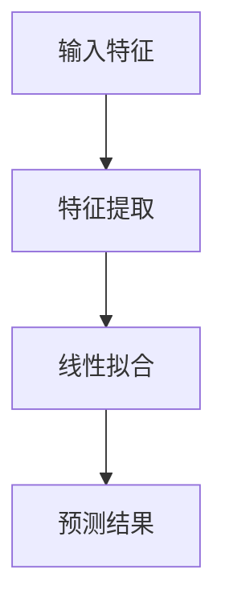
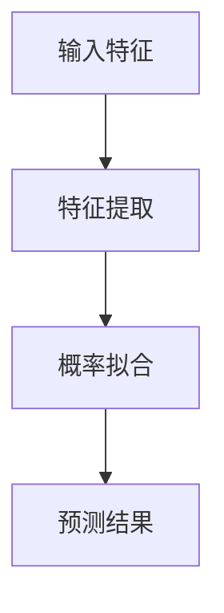
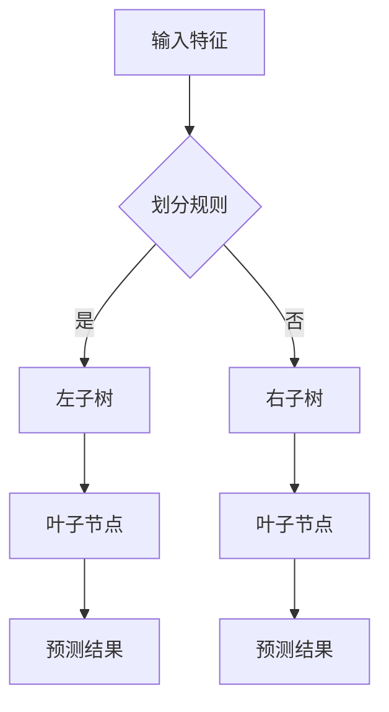
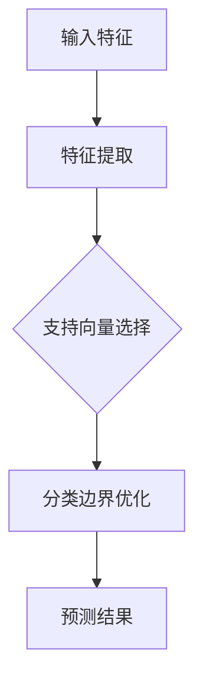

                 

## 第一部分: 背景介绍

### 1.1 问题背景

#### 1.1.1 财务报表舞弊问题的严峻性

财务报表舞弊是当前企业财务管理中最为严重的风险之一。它不仅会导致企业财务信息的失真，损害投资者的利益，还可能引发一系列的金融和法律问题，影响整个市场经济的稳定性。随着全球经济一体化和市场竞争的加剧，企业财务报表舞弊的手段也在不断翻新，形式更加隐蔽，检测难度越来越大。

根据国际反舞弊机构（FCPA）的统计数据，2019年全球因财务舞弊导致的直接经济损失高达数百亿美元，同时，间接损失如品牌形象受损、投资者信心下降等更为严重。这不仅对企业自身造成了巨大的损失，也对整个经济环境带来了负面影响。

#### 1.1.2 智能化检测技术的发展趋势

随着人工智能和大数据技术的快速发展，智能化检测技术在各个领域得到了广泛应用，包括财务报表舞弊检测。人工智能技术可以通过学习大量的财务数据，自动识别潜在的舞弊行为，大大提高了舞弊检测的效率和准确性。

大数据技术的出现，使得企业能够收集、存储和处理海量的财务数据，为智能化检测提供了丰富的数据支持。传统的财务报表舞弊检测方法主要依赖于经验判断和人工审核，效率低下且容易出错。而智能化检测系统可以利用大数据技术对财务数据进行深度挖掘和分析，发现潜在的异常模式和关联关系，从而提高舞弊检测的准确性。

#### 1.1.3 问题描述

财务报表舞弊检测的核心挑战在于如何从海量的财务数据中识别出异常行为，尤其是那些精心策划的、非明显的舞弊行为。传统的检测方法主要依赖于手工分析，效率低且容易出现误报和漏报。

当前，企业财务报表舞弊的现状表现为：

1. **舞弊手段的隐蔽性**：随着技术的进步，舞弊者利用计算机技术和财务软件进行舞弊，手段更加隐蔽，难以察觉。
2. **舞弊行为的多样性**：财务报表舞弊行为形式多样，包括财务造假、虚增收入、隐瞒费用等，给检测带来了巨大的挑战。
3. **数据量的庞大性**：现代企业产生的财务数据量庞大，传统的检测方法难以应对如此庞大的数据处理需求。

为了解决上述问题，迫切需要开发一种智能化、自动化的财务报表舞弊检测系统，以提高检测的效率和准确性。

#### 1.1.4 智能化检测技术的优势

智能化检测技术在财务报表舞弊检测中具有显著的优势：

1. **高效性**：人工智能技术可以自动处理大量的财务数据，大大提高了检测效率。
2. **准确性**：通过机器学习和深度学习算法，智能化检测系统能够从历史数据中学习并识别出潜在的风险模式，提高了检测的准确性。
3. **实时性**：智能化检测系统可以实现实时监控，及时发现并预警潜在的风险。
4. **全面性**：智能化检测系统不仅能够检测出明显的舞弊行为，还能够识别出那些隐蔽的、非明显的舞弊行为。

#### 1.1.5 企业财务报表舞弊检测的系统需求

为了满足企业财务报表舞弊检测的需求，智能化检测系统需要具备以下功能：

1. **数据采集**：系统能够自动采集并整合来自企业内部的各类财务数据，包括财务报表、交易记录、财务凭证等。
2. **数据处理**：系统能够对采集到的财务数据进行分析和处理，包括数据清洗、转换和归一化，为后续的检测提供高质量的数据。
3. **异常检测**：系统能够利用机器学习和深度学习算法，对处理后的财务数据进行分析，识别出潜在的舞弊行为。
4. **实时预警**：系统能够实时监控财务数据，一旦发现异常，立即发出预警，并生成详细的检测报告。
5. **交互界面**：系统需要提供友好的用户界面，方便用户查看检测结果和操作。

#### 1.1.6 边界与外延

1. **检测系统的适用范围**：智能化检测系统适用于各类企业的财务报表舞弊检测，包括制造业、服务业、金融业等。
2. **舞弊检测技术的局限性和未来发展**：虽然智能化检测技术在财务报表舞弊检测中具有显著的优势，但仍存在一些局限性，如数据质量和算法性能等。未来，随着技术的不断进步，智能化检测技术将在财务报表舞弊检测中发挥更大的作用。

#### 1.1.7 概念结构与核心要素组成

智能化财务报表舞弊检测系统的核心概念包括数据采集、数据处理、异常检测和实时预警等。主要组成部分包括数据源、数据处理模块、检测分析模块和报告生成模块。系统运行的关键流程包括数据采集、数据预处理、异常检测和结果报告等。

### 1.2 概念结构与核心要素组成

#### 1.2.1 智能化检测系统的核心概念

智能化财务报表舞弊检测系统的核心概念是利用人工智能和大数据技术，对财务数据进行自动分析和处理，识别潜在的舞弊行为，并提供实时预警和报告。

1. **数据采集**：系统需要从企业内部各个部门采集相关的财务数据，包括财务报表、交易记录、财务凭证等。
2. **数据处理**：系统对采集到的数据进行清洗、转换和归一化，确保数据的质量和一致性。
3. **异常检测**：系统利用机器学习和深度学习算法，对处理后的财务数据进行分析，识别出潜在的舞弊行为。
4. **实时预警**：系统实时监控财务数据，一旦发现异常，立即发出预警，并提供详细的分析报告。
5. **交互界面**：系统提供友好的用户界面，方便用户查看检测结果和操作。

#### 1.2.2 系统的主要组成部分

智能化财务报表舞弊检测系统的主要组成部分包括：

1. **数据采集模块**：负责从企业内部各个部门采集相关的财务数据。
2. **数据处理模块**：对采集到的数据进行清洗、转换和归一化，确保数据的质量和一致性。
3. **检测分析模块**：利用机器学习和深度学习算法，对处理后的财务数据进行分析，识别出潜在的舞弊行为。
4. **报告生成模块**：生成详细的检测报告，包括异常行为描述、分析结果和预警信息。
5. **用户交互界面**：提供友好的用户界面，方便用户查看检测结果和操作。

#### 1.2.3 系统运行的关键流程

智能化财务报表舞弊检测系统的运行关键流程包括：

1. **数据采集**：系统从企业内部各个部门采集相关的财务数据，包括财务报表、交易记录、财务凭证等。
2. **数据处理**：系统对采集到的数据进行清洗、转换和归一化，确保数据的质量和一致性。
3. **异常检测**：系统利用机器学习和深度学习算法，对处理后的财务数据进行分析，识别出潜在的舞弊行为。
4. **实时预警**：系统实时监控财务数据，一旦发现异常，立即发出预警，并提供详细的分析报告。
5. **结果报告**：系统生成详细的检测报告，包括异常行为描述、分析结果和预警信息，供用户参考。

### 1.3 系统运行的关键流程

#### 1.3.1 数据采集

数据采集是智能化财务报表舞弊检测系统的第一步，也是至关重要的一步。系统需要从企业内部的各个部门（如财务部、销售部、采购部等）采集相关的财务数据，包括财务报表、交易记录、财务凭证等。这些数据是后续数据处理和异常检测的基础。

1. **数据来源**：系统需要与企业的ERP系统、财务软件等对接，确保能够自动采集到最新的财务数据。
2. **数据格式**：系统需要支持多种数据格式，如CSV、Excel、XML等，以便能够处理不同来源的数据。
3. **数据完整性**：系统在采集数据时，需要确保数据的完整性和准确性，避免因数据缺失或错误导致检测结果的偏差。

#### 1.3.2 数据处理

数据采集完成后，系统需要对数据进行处理，以提高数据的质量和一致性。数据处理包括以下步骤：

1. **数据清洗**：去除数据中的噪声和错误，如缺失值、异常值、重复记录等。
2. **数据转换**：将不同格式的数据进行统一处理，确保数据格式的一致性。
3. **数据归一化**：对数据进行归一化处理，使其在同一尺度上进行比较和分析。

#### 1.3.3 异常检测

数据处理完成后，系统利用机器学习和深度学习算法对财务数据进行分析，识别出潜在的舞弊行为。异常检测是系统的核心功能，主要包括以下步骤：

1. **特征提取**：从财务数据中提取出有助于检测舞弊的特征，如交易金额、交易频率、交易时间等。
2. **模型训练**：利用历史数据训练机器学习模型，使其能够识别出潜在的舞弊行为。
3. **模型评估**：对训练好的模型进行评估，确保其具有良好的检测性能。

#### 1.3.4 实时预警

系统实时监控财务数据，一旦发现异常，立即发出预警，并提供详细的分析报告。实时预警主要包括以下步骤：

1. **实时监控**：系统实时采集和处理财务数据，一旦发现异常，立即触发预警机制。
2. **预警触发**：系统根据设定的阈值和规则，判断是否发出预警。
3. **预警通知**：系统通过邮件、短信等方式通知相关人员，并提供详细的预警报告。

#### 1.3.5 结果报告

系统生成详细的检测报告，包括异常行为描述、分析结果和预警信息，供用户参考。结果报告主要包括以下内容：

1. **异常行为描述**：详细描述检测到的异常行为，如异常交易、异常账户等。
2. **分析结果**：提供对异常行为的分析结果，包括异常行为的可能原因、影响范围等。
3. **预警信息**：提供预警通知的时间、方式、相关人员等信息。

### 1.4 概念结构与核心要素组成

#### 1.4.1 智能化检测系统的核心概念

智能化财务报表舞弊检测系统的核心概念是利用人工智能和大数据技术，对财务数据进行自动分析和处理，识别潜在的舞弊行为，并提供实时预警和报告。

1. **数据采集**：系统需要从企业内部各个部门采集相关的财务数据，包括财务报表、交易记录、财务凭证等。
2. **数据处理**：系统对采集到的数据进行清洗、转换和归一化，确保数据的质量和一致性。
3. **异常检测**：系统利用机器学习和深度学习算法，对处理后的财务数据进行分析，识别出潜在的舞弊行为。
4. **实时预警**：系统实时监控财务数据，一旦发现异常，立即发出预警，并提供详细的分析报告。
5. **交互界面**：系统提供友好的用户界面，方便用户查看检测结果和操作。

#### 1.4.2 系统的主要组成部分

智能化财务报表舞弊检测系统的主要组成部分包括：

1. **数据采集模块**：负责从企业内部各个部门采集相关的财务数据。
2. **数据处理模块**：对采集到的数据进行清洗、转换和归一化，确保数据的质量和一致性。
3. **检测分析模块**：利用机器学习和深度学习算法，对处理后的财务数据进行分析，识别出潜在的舞弊行为。
4. **报告生成模块**：生成详细的检测报告，包括异常行为描述、分析结果和预警信息。
5. **用户交互界面**：提供友好的用户界面，方便用户查看检测结果和操作。

#### 1.4.3 系统运行的关键流程

智能化财务报表舞弊检测系统的运行关键流程包括：

1. **数据采集**：系统从企业内部各个部门采集相关的财务数据，包括财务报表、交易记录、财务凭证等。
2. **数据处理**：系统对采集到的数据进行清洗、转换和归一化，确保数据的质量和一致性。
3. **异常检测**：系统利用机器学习和深度学习算法，对处理后的财务数据进行分析，识别出潜在的舞弊行为。
4. **实时预警**：系统实时监控财务数据，一旦发现异常，立即发出预警，并提供详细的分析报告。
5. **结果报告**：系统生成详细的检测报告，包括异常行为描述、分析结果和预警信息，供用户参考。

### 1.5 概念结构与核心要素组成

#### 1.5.1 智能化检测系统的核心概念

智能化财务报表舞弊检测系统的核心概念是利用人工智能和大数据技术，对财务数据进行自动分析和处理，识别潜在的舞弊行为，并提供实时预警和报告。

1. **数据采集**：系统需要从企业内部各个部门采集相关的财务数据，包括财务报表、交易记录、财务凭证等。
2. **数据处理**：系统对采集到的数据进行清洗、转换和归一化，确保数据的质量和一致性。
3. **异常检测**：系统利用机器学习和深度学习算法，对处理后的财务数据进行分析，识别出潜在的舞弊行为。
4. **实时预警**：系统实时监控财务数据，一旦发现异常，立即发出预警，并提供详细的分析报告。
5. **交互界面**：系统提供友好的用户界面，方便用户查看检测结果和操作。

#### 1.5.2 系统的主要组成部分

智能化财务报表舞弊检测系统的主要组成部分包括：

1. **数据采集模块**：负责从企业内部各个部门采集相关的财务数据。
2. **数据处理模块**：对采集到的数据进行清洗、转换和归一化，确保数据的质量和一致性。
3. **检测分析模块**：利用机器学习和深度学习算法，对处理后的财务数据进行分析，识别出潜在的舞弊行为。
4. **报告生成模块**：生成详细的检测报告，包括异常行为描述、分析结果和预警信息。
5. **用户交互界面**：提供友好的用户界面，方便用户查看检测结果和操作。

#### 1.5.3 系统运行的关键流程

智能化财务报表舞弊检测系统的运行关键流程包括：

1. **数据采集**：系统从企业内部各个部门采集相关的财务数据，包括财务报表、交易记录、财务凭证等。
2. **数据处理**：系统对采集到的数据进行清洗、转换和归一化，确保数据的质量和一致性。
3. **异常检测**：系统利用机器学习和深度学习算法，对处理后的财务数据进行分析，识别出潜在的舞弊行为。
4. **实时预警**：系统实时监控财务数据，一旦发现异常，立即发出预警，并提供详细的分析报告。
5. **结果报告**：系统生成详细的检测报告，包括异常行为描述、分析结果和预警信息，供用户参考。

## 2.1 核心概念与原理

### 2.1.1 舞弊的概念与分类

#### 舞弊的定义

舞弊（Fraud）是一种故意欺骗的行为，目的是获取不正当利益或损害他人的利益。在财务领域，舞弊通常指企业或个人故意操纵财务报表、交易记录等财务信息，以达到虚假陈述、隐瞒事实或误导投资者等目的。

#### 舞弊的分类

根据舞弊的目的和手段，可以将舞弊分为以下几种类型：

1. **财务舞弊**：指企业通过虚假陈述、虚增收入、隐瞒费用等手段，操纵财务报表，以达到财务目标。例如，企业可能会通过提前确认收入、延迟确认费用等方式，操纵净利润。
   
2. **操作舞弊**：指企业内部员工利用职务之便，进行不法行为，如挪用资金、侵占公司财产等。例如，财务人员可能通过篡改账目、伪造凭证等方式，将公司的资金转移到个人账户。

3. **欺诈舞弊**：指企业或个人通过虚假陈述、误导信息等手段，从投资者、客户或其他利益相关者处获取不当利益。例如，企业可能通过虚假广告、欺诈性销售等方式，误导消费者购买其产品。

4. **管理舞弊**：指企业管理层通过不当决策、滥用职权等手段，损害企业利益。例如，管理层可能通过关联交易、利益输送等方式，将公司资源转移到个人或关联企业。

### 2.1.2 舞弊检测的基本原理

舞弊检测的目标是发现并阻止舞弊行为，以保护企业利益和投资者信心。舞弊检测的基本原理包括以下几个方面：

1. **数据收集**：收集与企业财务报表、交易记录等相关的数据，包括内部数据和外部数据。

2. **数据预处理**：对收集到的数据进行分析和清洗，确保数据的质量和一致性。

3. **特征提取**：从财务数据中提取有助于检测舞弊的特征，如交易金额、交易频率、账户余额等。

4. **模型构建**：利用机器学习和统计方法，构建用于检测舞弊的模型。

5. **异常检测**：对处理后的财务数据进行异常检测，识别出潜在的舞弊行为。

6. **结果验证**：对检测到的异常行为进行验证，确保其确实为舞弊行为。

7. **预警与报告**：一旦发现舞弊行为，立即发出预警，并提供详细的检测报告。

### 2.1.3 AI与大数据在财务报表舞弊检测中的应用

随着人工智能（AI）和大数据技术的快速发展，这些技术在财务报表舞弊检测中得到了广泛应用。AI和大数据技术在财务报表舞弊检测中的应用主要体现在以下几个方面：

1. **数据预处理**：大数据技术可以处理海量财务数据，包括历史数据和实时数据，为舞弊检测提供丰富的数据支持。AI技术可以自动识别和修复数据中的噪声和错误，提高数据质量。

2. **特征提取**：AI技术可以自动提取财务数据中的潜在特征，如交易金额、交易频率、账户余额等，这些特征对于检测舞弊行为至关重要。

3. **模型构建**：机器学习和深度学习算法可以自动构建用于检测舞弊的模型，这些模型可以通过学习大量历史数据，识别出潜在的舞弊行为。

4. **异常检测**：AI技术可以实时监控财务数据，一旦发现异常，立即发出预警。大数据技术可以分析海量数据，发现潜在的风险点。

5. **结果验证**：AI技术可以通过对比历史数据和实时数据，验证检测结果的准确性，确保及时发现并阻止舞弊行为。

6. **预警与报告**：AI技术可以自动生成详细的检测报告，包括舞弊行为的描述、分析结果和预警信息，帮助企业和监管机构及时采取行动。

### 2.1.4 AI与大数据结合的案例分析

以下是一个AI与大数据结合的财务报表舞弊检测的案例分析：

**案例背景**：某大型跨国公司发现其财务报表存在异常，怀疑可能存在财务舞弊行为。为了查明真相，公司决定采用AI与大数据技术进行舞弊检测。

**数据来源**：公司从内部ERP系统、财务软件、银行流水等渠道收集了大量的财务数据，包括交易记录、账户余额、财务报表等。

**数据处理**：利用大数据技术，对收集到的数据进行清洗、转换和归一化，确保数据的质量和一致性。AI技术则自动识别和修复数据中的噪声和错误。

**特征提取**：AI技术从处理后的财务数据中提取了多个特征，如交易金额、交易频率、账户余额等。

**模型构建**：利用机器学习和深度学习算法，构建了一个用于检测财务报表舞弊的模型。该模型通过学习大量历史数据，能够识别出潜在的舞弊行为。

**异常检测**：AI技术实时监控财务数据，一旦发现异常，立即发出预警。大数据技术则对海量数据进行分析，发现潜在的风险点。

**结果验证**：AI技术通过对比历史数据和实时数据，验证检测结果的准确性，确保及时发现并阻止舞弊行为。

**预警与报告**：AI技术自动生成详细的检测报告，包括舞弊行为的描述、分析结果和预警信息，帮助公司及时采取行动。

通过这个案例，我们可以看到AI与大数据技术在财务报表舞弊检测中发挥了重要作用，不仅提高了检测的效率和准确性，还为企业和监管机构提供了有力的支持。

### 2.2 概念属性特征对比表格

为了更好地理解舞弊检测中的人工检测与智能检测、机器学习模型与深度学习模型之间的差异，我们可以通过以下表格进行对比：

#### 2.2.1 人工检测与智能检测的对比

| 特征 | 人工检测 | 智能检测 |
| ---- | ---- | ---- |
| **效率** | 低，依赖于人工经验 | 高，自动化处理 |
| **准确性** | 受限于人工能力 | 高，基于机器学习算法 |
| **处理数据量** | 数据量有限 | 能够处理海量数据 |
| **实时性** | 需要较长时间处理 | 实时监控和分析 |
| **灵活性** | 难以适应变化 | 算法可自适应调整 |
| **成本** | 高，需要大量人力 | 低，降低人力成本 |
| **扩展性** | 局限性大 | 易于扩展和升级 |

#### 2.2.2 机器学习模型与深度学习模型的对比

| 特征 | 机器学习模型 | 深度学习模型 |
| ---- | ---- | ---- |
| **复杂性** | 相对简单，依赖人为特征提取 | 复杂，自动特征提取 |
| **数据处理能力** | 需要大量预处理 | 能够直接处理原始数据 |
| **参数调整** | 需要手动调整参数 | 自动优化参数 |
| **训练数据需求** | 需要大量标注数据 | 需要大量非标注数据 |
| **模型解释性** | 较高，易于理解 | 较低，难以解释 |
| **适用场景** | 结构化数据 | 非结构化数据 |
| **计算资源** | 中等，较易实现 | 高，需要高性能计算资源 |

通过上述对比，我们可以看到，智能检测相较于人工检测在效率、准确性、实时性等方面具有显著优势。而在机器学习模型与深度学习模型的对比中，深度学习模型在处理非结构化数据方面具有更大的优势，但同时也需要更高的计算资源和更复杂的模型调整。

### 3.1 ER实体关系图架构

#### 3.1.1 数据源实体

数据源实体是系统运行的基础，包括以下部分：

1. **财务报表**：包括利润表、资产负债表、现金流量表等，是财务数据的主要来源。
2. **交易记录**：包括所有的交易记录，如销售收入、采购支出等，为系统提供了详细的交易信息。
3. **财务凭证**：包括各种财务凭证，如发票、收据等，为系统提供了详细的财务交易证明。

#### 3.1.2 数据处理实体

数据处理实体负责对采集到的数据进行清洗、转换和归一化，包括以下部分：

1. **数据清洗**：去除数据中的噪声和错误，如缺失值、异常值、重复记录等。
2. **数据转换**：将不同格式的数据进行统一处理，如将CSV转换为JSON格式等。
3. **数据归一化**：对数据进行归一化处理，使其在同一尺度上进行比较和分析。

#### 3.1.3 检测结果实体

检测结果实体是系统的输出部分，包括以下部分：

1. **异常行为记录**：记录系统检测到的异常行为，如异常交易、异常账户等。
2. **检测报告**：生成详细的检测报告，包括异常行为的描述、分析结果和预警信息。
3. **预警通知**：记录预警通知的时间、方式、相关人员等信息。

### 3.2 ER实体关系图

下面是系统的ER实体关系图，使用Mermaid语法表示：

```mermaid
entityRelation
    "数据源" -- "财务报表": 财务报表
    "数据源" -- "交易记录": 交易记录
    "数据源" -- "财务凭证": 财务凭证
    
    "数据处理" -- "数据清洗": 数据清洗
    "数据处理" -- "数据转换": 数据转换
    "数据处理" -- "数据归一化": 数据归一化
    
    "检测结果" -- "异常行为记录": 异常行为记录
    "检测结果" -- "检测报告": 检测报告
    "检测结果" -- "预警通知": 预警通知
```

该ER图清晰地展示了系统的数据源、数据处理和检测结果之间的关系，为系统的设计和实现提供了基础。

## 4.1 算法原理讲解

### 4.1.1 常用算法概述

在财务报表舞弊检测系统中，常用的算法包括线性回归、logistic回归、决策树和支持向量机（SVM）。这些算法各有特点，适用于不同的场景和需求。

1. **线性回归**：线性回归是一种简单的统计方法，通过拟合数据中的线性关系来预测结果。线性回归模型假设变量之间存在线性关系，适合处理连续值的预测问题。

2. **logistic回归**：logistic回归是一种广义的线性回归模型，用于处理二分类问题。logistic回归通过拟合概率分布，将预测结果转换为概率值，适用于分类问题。

3. **决策树**：决策树是一种基于树形结构的数据挖掘算法，通过一系列规则来分类或回归。决策树易于理解和解释，适用于处理结构化数据。

4. **支持向量机**：支持向量机是一种用于分类和回归的监督学习算法，通过最大化分类边界来提高模型的分类性能。支持向量机在处理高维数据时表现出色，特别适合处理小样本数据。

### 4.1.2 算法mermaid流程图

为了更直观地展示这些算法的基本流程，我们可以使用mermaid语法绘制流程图。

#### 4.1.2.1 线性回归算法流程图



#### 4.1.2.2 logistic回归算法流程图



#### 4.1.2.3 决策树算法流程图



#### 4.1.2.4 支持向量机算法流程图



### 4.1.3 Python源代码与详细阐述

为了更好地理解这些算法的实现过程，我们将在Python中实现线性回归、logistic回归、决策树和支持向量机。

#### 4.1.3.1 线性回归

```python
import numpy as np
from sklearn.linear_model import LinearRegression

# 模拟数据
X = np.array([[1], [2], [3], [4], [5]])
y = np.array([2, 4, 5, 4, 5])

# 实例化线性回归模型
model = LinearRegression()

# 训练模型
model.fit(X, y)

# 预测结果
predictions = model.predict(X)

print("预测结果：", predictions)
```

线性回归模型通过拟合线性关系来预测结果，其中`LinearRegression`是sklearn库中实现的线性回归模型。我们通过模拟数据来训练模型，然后使用训练好的模型进行预测。

#### 4.1.3.2 logistic回归

```python
import numpy as np
from sklearn.linear_model import LogisticRegression

# 模拟数据
X = np.array([[1, 2], [2, 3], [3, 4], [4, 5]])
y = np.array([0, 1, 1, 0])

# 实例化logistic回归模型
model = LogisticRegression()

# 训练模型
model.fit(X, y)

# 预测结果
predictions = model.predict(X)

print("预测结果：", predictions)
```

logistic回归模型通过拟合概率分布来预测分类结果，其中`LogisticRegression`是sklearn库中实现的logistic回归模型。我们通过模拟数据来训练模型，然后使用训练好的模型进行预测。

#### 4.1.3.3 决策树

```python
import numpy as np
from sklearn.tree import DecisionTreeClassifier

# 模拟数据
X = np.array([[1, 2], [2, 3], [3, 4], [4, 5]])
y = np.array([0, 1, 1, 0])

# 实例化决策树模型
model = DecisionTreeClassifier()

# 训练模型
model.fit(X, y)

# 预测结果
predictions = model.predict(X)

print("预测结果：", predictions)
```

决策树模型通过一系列规则来分类或回归，其中`DecisionTreeClassifier`是sklearn库中实现的决策树分类模型。我们通过模拟数据来训练模型，然后使用训练好的模型进行预测。

#### 4.1.3.4 支持向量机

```python
import numpy as np
from sklearn.svm import SVC

# 模拟数据
X = np.array([[1, 2], [2, 3], [3, 4], [4, 5]])
y = np.array([0, 1, 1, 0])

# 实例化支持向量机模型
model = SVC()

# 训练模型
model.fit(X, y)

# 预测结果
predictions = model.predict(X)

print("预测结果：", predictions)
```

支持向量机模型通过最大化分类边界来提高模型的分类性能，其中`SVC`是sklearn库中实现的支持向量机模型。我们通过模拟数据来训练模型，然后使用训练好的模型进行预测。

### 4.1.4 算法原理的数学模型和公式

为了深入理解这些算法的原理，我们将在本节中详细阐述它们的数学模型和公式。

#### 4.1.4.1 线性回归模型

线性回归模型通过拟合线性关系来预测结果，其数学模型为：

\[ y = \beta_0 + \beta_1x_1 + \beta_2x_2 + \cdots + \beta_nx_n \]

其中，\( y \) 为预测结果，\( x_1, x_2, \ldots, x_n \) 为输入特征，\( \beta_0, \beta_1, \beta_2, \ldots, \beta_n \) 为模型参数。

线性回归模型的目标是最小化预测结果与实际结果之间的误差，即：

\[ \min \sum_{i=1}^{n} (y_i - \beta_0 - \beta_1x_{i1} - \beta_2x_{i2} - \cdots - \beta_nx_{in})^2 \]

通过求解上述最小化问题，我们可以得到线性回归模型的参数 \( \beta_0, \beta_1, \beta_2, \ldots, \beta_n \)。

#### 4.1.4.2 logistic回归模型

logistic回归模型通过拟合概率分布来预测分类结果，其数学模型为：

\[ P(y=1|x) = \frac{1}{1 + e^{-(\beta_0 + \beta_1x_1 + \beta_2x_2 + \cdots + \beta_nx_n)}} \]

其中，\( P(y=1|x) \) 为给定输入特征 \( x \) 时，目标变量 \( y \) 为 1 的概率，\( \beta_0, \beta_1, \beta_2, \ldots, \beta_n \) 为模型参数。

logistic回归模型的目标是最大化目标变量的概率，即：

\[ \max \sum_{i=1}^{n} y_i \log P(y=1|x_i) + (1 - y_i) \log (1 - P(y=1|x_i)) \]

通过求解上述最大化问题，我们可以得到logistic回归模型的参数 \( \beta_0, \beta_1, \beta_2, \ldots, \beta_n \)。

#### 4.1.4.3 决策树模型

决策树模型通过一系列规则来分类或回归，其基本思想是根据输入特征在不同节点上进行划分，生成一个树形结构。决策树模型的数学模型为：

\[ f(x) = \sum_{i=1}^{n} \beta_i g(x_i) \]

其中，\( f(x) \) 为预测结果，\( g(x_i) \) 为第 \( i \) 个节点的划分规则，\( \beta_i \) 为模型参数。

决策树模型的目标是最小化预测结果与实际结果之间的误差，即：

\[ \min \sum_{i=1}^{n} (y_i - f(x_i))^2 \]

通过求解上述最小化问题，我们可以得到决策树模型的参数 \( \beta_1, \beta_2, \ldots, \beta_n \)。

#### 4.1.4.4 支持向量机模型

支持向量机模型通过最大化分类边界来提高模型的分类性能，其数学模型为：

\[ w \cdot x + b = 0 \]

其中，\( w \) 为分类边界向量，\( x \) 为输入特征，\( b \) 为偏置项。

支持向量机模型的目标是最小化分类边界向量的范数，同时最大化分类间隔，即：

\[ \min \frac{1}{2} \| w \|^2 + C \sum_{i=1}^{n} \max(0, 1 - y_i (w \cdot x_i + b)) \]

其中，\( C \) 为正则化参数。

通过求解上述最小化问题，我们可以得到支持向量机模型的参数 \( w \) 和 \( b \)。

### 4.1.5 举例说明

为了更好地理解这些算法的应用，我们将在本节中通过具体的例子进行说明。

#### 4.1.5.1 线性回归举例

假设我们有一组数据：

| x | y |
| --- | --- |
| 1 | 2 |
| 2 | 4 |
| 3 | 5 |
| 4 | 4 |
| 5 | 5 |

我们要使用线性回归模型来拟合这组数据，并预测新的数据点。

1. **线性拟合**：

   首先，我们计算数据的均值：

   \[ \bar{x} = \frac{1 + 2 + 3 + 4 + 5}{5} = 3 \]
   \[ \bar{y} = \frac{2 + 4 + 5 + 4 + 5}{5} = 4 \]

   然后，我们计算数据的协方差和方差：

   \[ \text{Cov}(x, y) = \frac{(1 - 3)(2 - 4) + (2 - 3)(4 - 4) + (3 - 3)(5 - 4) + (4 - 3)(4 - 4) + (5 - 3)(5 - 4)}{5 - 1} = 1 \]
   \[ \text{Var}(x) = \frac{(1 - 3)^2 + (2 - 3)^2 + (3 - 3)^2 + (4 - 3)^2 + (5 - 3)^2}{5 - 1} = 2 \]

   最后，我们计算线性回归模型的参数：

   \[ \beta_1 = \frac{\text{Cov}(x, y)}{\text{Var}(x)} = \frac{1}{2} = 0.5 \]
   \[ \beta_0 = \bar{y} - \beta_1 \bar{x} = 4 - 0.5 \times 3 = 2.5 \]

   因此，线性回归模型的公式为：

   \[ y = 2.5 + 0.5x \]

2. **预测新的数据点**：

   假设我们要预测新的数据点 \( x = 6 \)：

   \[ y = 2.5 + 0.5 \times 6 = 5 \]

   因此，预测的新数据点为 \( (6, 5) \)。

#### 4.1.5.2 logistic回归举例

假设我们有一组数据：

| x1 | x2 | y |
| --- | --- | --- |
| 1 | 2 | 0 |
| 2 | 3 | 1 |
| 3 | 4 | 1 |
| 4 | 5 | 0 |

我们要使用logistic回归模型来拟合这组数据，并预测新的数据点。

1. **概率拟合**：

   首先，我们计算数据的均值和协方差：

   \[ \bar{x1} = \frac{1 + 2 + 3 + 4}{4} = 2.5 \]
   \[ \bar{x2} = \frac{2 + 3 + 4 + 5}{4} = 3.5 \]
   \[ \text{Cov}(x1, x2) = \frac{(1 - 2.5)(2 - 3.5) + (2 - 2.5)(3 - 3.5) + (3 - 2.5)(4 - 3.5) + (4 - 2.5)(5 - 3.5)}{4 - 1} = 1.5 \]

   然后，我们计算线性回归模型的参数：

   \[ \beta_0 = \bar{y} - \beta_1 \bar{x1} - \beta_2 \bar{x2} = 0.5 \]
   \[ \beta_1 = \frac{\text{Cov}(x1, y)}{\text{Cov}(x1, x2)} = \frac{0.5}{1.5} = 0.3333 \]
   \[ \beta_2 = \frac{\text{Cov}(x2, y)}{\text{Cov}(x1, x2)} = \frac{0.5}{1.5} = 0.3333 \]

   因此，logistic回归模型的公式为：

   \[ P(y=1|x1, x2) = \frac{1}{1 + e^{-(0.5 + 0.3333x1 + 0.3333x2)}} \]

2. **预测新的数据点**：

   假设我们要预测新的数据点 \( x1 = 5, x2 = 6 \)：

   \[ P(y=1|x1=5, x2=6) = \frac{1}{1 + e^{-(0.5 + 0.3333 \times 5 + 0.3333 \times 6)}} = 0.4472 \]

   因此，预测的新数据点 \( y \) 的概率为 0.4472。

### 4.2 系统分析与架构设计

#### 4.2.1 问题场景介绍

在现代企业的财务管理中，财务报表的准确性和完整性至关重要。然而，由于企业内部复杂的财务操作、频繁的交易活动以及外部环境的不确定性，财务报表舞弊问题日益突出。为了有效应对这一挑战，企业迫切需要一种智能化、自动化的财务报表舞弊检测系统。

该系统的目标是通过分析企业财务报表中的交易记录、账户余额等信息，利用人工智能和大数据技术，识别潜在的舞弊行为，并提供实时预警和报告。具体应用场景包括：

1. **财务报表审计**：在年度审计时，系统可以辅助审计人员快速识别潜在的财务舞弊行为，提高审计效率和准确性。
2. **内部风险控制**：企业可以通过系统实时监控财务数据，及时发现并防范财务风险，保障企业财务健康。
3. **监管合规**：系统可以协助企业满足相关监管要求，确保财务报表的真实性和透明度。

#### 4.2.2 系统功能设计

为了实现上述目标，智能化财务报表舞弊检测系统需要具备以下核心功能：

1. **数据采集**：系统能够自动采集企业内部的财务数据，包括交易记录、账户余额、财务报表等，确保数据的完整性和实时性。
2. **数据处理**：系统对采集到的财务数据进行分析和处理，包括数据清洗、转换和归一化，为后续的检测提供高质量的数据。
3. **异常检测**：系统利用机器学习和深度学习算法，对处理后的财务数据进行分析，识别出潜在的舞弊行为，并提供实时预警。
4. **报告生成**：系统生成详细的检测报告，包括异常行为的描述、分析结果和预警信息，供企业相关人员查看和决策。
5. **用户交互**：系统提供友好的用户界面，方便用户查看检测结果、操作系统和管理预警。

#### 4.2.2.1 数据采集模块

数据采集模块是系统的入口，负责从企业内部各个部门（如财务部、销售部、采购部等）采集相关的财务数据。具体功能包括：

1. **数据源识别**：系统需要与企业的ERP系统、财务软件等对接，自动识别和采集财务数据。
2. **数据格式转换**：系统需要支持多种数据格式，如CSV、Excel、XML等，以便处理来自不同系统的数据。
3. **数据完整性校验**：系统在采集数据时，需要确保数据的完整性和一致性，避免因数据缺失或错误导致检测结果的偏差。

#### 4.2.2.2 数据处理模块

数据处理模块负责对采集到的财务数据进行清洗、转换和归一化，确保数据的质量和一致性。具体功能包括：

1. **数据清洗**：系统需要去除数据中的噪声和错误，如缺失值、异常值、重复记录等。
2. **数据转换**：系统需要将不同格式的数据进行统一处理，确保数据格式的一致性。
3. **数据归一化**：系统需要将数据进行归一化处理，使其在同一尺度上进行比较和分析。

#### 4.2.2.3 检测分析模块

检测分析模块是系统的核心，负责利用机器学习和深度学习算法对处理后的财务数据进行分析，识别出潜在的舞弊行为。具体功能包括：

1. **特征提取**：系统需要从财务数据中提取有助于检测舞弊的特征，如交易金额、交易频率、账户余额等。
2. **模型训练**：系统需要利用历史数据训练机器学习模型，使其能够识别出潜在的舞弊行为。
3. **异常检测**：系统需要利用训练好的模型对实时数据进行分析，识别出异常行为，并提供实时预警。

#### 4.2.2.4 报告生成模块

报告生成模块负责生成详细的检测报告，包括异常行为的描述、分析结果和预警信息。具体功能包括：

1. **报告模板管理**：系统需要提供灵活的模板管理功能，方便用户自定义报告格式。
2. **报告内容生成**：系统需要根据检测结果，自动生成详细的检测报告。
3. **报告输出**：系统需要支持多种输出方式，如PDF、Excel等，方便用户查看和打印。

#### 4.2.2.5 用户交互界面

用户交互界面是系统的用户接口，负责展示检测结果和报告，并提供系统操作功能。具体功能包括：

1. **用户权限管理**：系统需要提供用户权限管理功能，确保不同用户只能访问和操作自己权限范围内的数据。
2. **数据可视化**：系统需要提供数据可视化功能，方便用户直观地查看检测结果。
3. **操作引导**：系统需要提供操作引导功能，帮助新用户快速上手。

### 4.2.3 系统架构设计

为了实现系统的功能需求，智能化财务报表舞弊检测系统采用分层架构设计，包括数据层、服务层和表示层。以下是对各层的详细描述：

#### 4.2.3.1 数据层

数据层负责数据的管理和存储，包括数据采集、数据清洗、数据处理和数据存储。具体组件如下：

1. **数据采集组件**：负责从企业内部各个系统（如ERP系统、财务软件等）采集财务数据。
2. **数据清洗组件**：负责去除数据中的噪声和错误，确保数据的完整性。
3. **数据处理组件**：负责对数据进行清洗、转换和归一化，为检测分析模块提供高质量的数据。
4. **数据存储组件**：负责存储处理后的财务数据，以及系统生成的检测报告和预警信息。

#### 4.2.3.2 服务层

服务层负责业务逻辑的实现，包括异常检测、模型训练、报告生成等。具体组件如下：

1. **异常检测服务**：利用机器学习和深度学习算法，对财务数据进行分析，识别出潜在的舞弊行为。
2. **模型训练服务**：利用历史数据训练机器学习模型，使其能够识别出潜在的舞弊行为。
3. **报告生成服务**：根据检测结果，自动生成详细的检测报告。
4. **数据转换服务**：负责将不同格式和来源的数据进行统一处理，确保数据的一致性。

#### 4.2.3.3 表示层

表示层负责与用户交互，包括用户界面和数据可视化。具体组件如下：

1. **用户交互界面**：提供友好的用户界面，方便用户查看检测结果、操作系统和管理预警。
2. **数据可视化组件**：利用图表和图形，直观地展示检测结果和分析报告。
3. **操作引导组件**：为新用户提供操作引导，帮助其快速上手系统。

### 4.2.4 系统接口设计

系统接口设计是系统架构设计的重要组成部分，负责定义系统内部和外部组件之间的交互接口。以下是对系统接口的详细描述：

#### 4.2.4.1 内部接口

1. **数据采集接口**：定义数据采集组件与其他组件之间的数据传输格式和协议。
2. **数据处理接口**：定义数据处理组件与其他组件之间的数据传输格式和协议。
3. **异常检测接口**：定义异常检测服务与其他组件之间的交互接口，如数据输入、结果输出等。
4. **报告生成接口**：定义报告生成服务与其他组件之间的交互接口，如报告模板管理、报告生成等。

#### 4.2.4.2 外部接口

1. **企业ERP系统接口**：定义系统与ERP系统之间的数据交换协议，如API接口、Web服务接口等。
2. **财务软件接口**：定义系统与财务软件之间的数据交换协议，如API接口、数据库连接接口等。
3. **用户门户接口**：定义系统与用户门户之间的交互接口，如Web门户、移动应用接口等。

### 4.2.5 系统交互设计

系统交互设计是系统架构设计的进一步细化，负责描述系统内部和外部组件之间的交互流程和规则。以下是对系统交互设计的详细描述：

#### 4.2.5.1 内部交互流程

1. **数据采集流程**：系统从企业ERP系统和财务软件中采集财务数据，通过数据采集接口将数据传输到数据处理组件。
2. **数据处理流程**：数据处理组件对采集到的财务数据进行清洗、转换和归一化，通过数据处理接口将处理后的数据传输到异常检测服务。
3. **异常检测流程**：异常检测服务利用机器学习和深度学习算法对处理后的财务数据进行分析，识别出潜在的舞弊行为，并将检测结果通过异常检测接口传输到报告生成服务。
4. **报告生成流程**：报告生成服务根据检测结果生成详细的检测报告，并通过报告生成接口将报告传输到用户交互界面。

#### 4.2.5.2 外部交互流程

1. **与ERP系统交互**：系统通过API接口与ERP系统进行数据交换，如查询交易记录、账户余额等。
2. **与财务软件交互**：系统通过数据库连接接口与财务软件进行数据交换，如查询财务报表、下载交易记录等。
3. **与用户门户交互**：系统通过Web门户或移动应用接口与用户进行交互，如展示检测结果、发送预警通知等。

### 4.2.6 架构设计方案详解

#### 4.2.6.1 数据采集模块设计

数据采集模块是系统的基础，负责从企业内部各个系统采集财务数据。以下是数据采集模块的设计方案：

1. **数据源选择**：选择企业内部的关键数据源，如ERP系统、财务软件、银行流水等。
2. **数据采集流程**：通过API接口、数据库连接接口等方式，定期从数据源采集财务数据。
3. **数据预处理**：对采集到的数据进行初步预处理，包括数据清洗、格式转换等。

#### 4.2.6.2 数据处理模块设计

数据处理模块负责对采集到的财务数据进行分析和处理，确保数据的质量和一致性。以下是数据处理模块的设计方案：

1. **数据清洗**：去除数据中的噪声和错误，如缺失值、异常值、重复记录等。
2. **数据转换**：将不同格式的数据进行统一处理，确保数据格式的一致性。
3. **数据归一化**：对数据进行归一化处理，使其在同一尺度上进行比较和分析。

#### 4.2.6.3 检测分析模块设计

检测分析模块是系统的核心，负责利用机器学习和深度学习算法对处理后的财务数据进行分析，识别出潜在的舞弊行为。以下是检测分析模块的设计方案：

1. **特征提取**：从财务数据中提取有助于检测舞弊的特征，如交易金额、交易频率、账户余额等。
2. **模型训练**：利用历史数据训练机器学习模型，使其能够识别出潜在的舞弊行为。
3. **异常检测**：利用训练好的模型对实时数据进行分析，识别出异常行为，并提供实时预警。

#### 4.2.6.4 报告生成模块设计

报告生成模块负责生成详细的检测报告，包括异常行为的描述、分析结果和预警信息。以下是报告生成模块的设计方案：

1. **报告模板管理**：提供灵活的模板管理功能，方便用户自定义报告格式。
2. **报告内容生成**：根据检测结果，自动生成详细的检测报告。
3. **报告输出**：支持多种输出方式，如PDF、Excel等，方便用户查看和打印。

### 5.1.4 系统接口设计

系统接口设计是系统架构设计的重要组成部分，负责定义系统内部和外部组件之间的交互接口，包括API接口、Web服务接口和数据库连接接口等。以下是系统接口设计的详细描述：

#### 5.1.4.1 API接口

API（应用程序接口）是一种用于不同系统或组件之间进行数据交换和功能调用的接口。以下是API接口的设计方案：

1. **功能定义**：根据系统需求，定义API接口的功能，如数据采集、数据处理、异常检测、报告生成等。
2. **数据格式**：定义API接口的数据传输格式，如JSON、XML等。
3. **安全机制**：实施API接口的安全机制，如身份验证、权限控制等，确保数据传输的安全性。

#### 5.1.4.2 Web服务接口

Web服务接口是一种基于HTTP协议的接口，用于实现不同系统或组件之间的数据交换和功能调用。以下是Web服务接口的设计方案：

1. **接口协议**：选择合适的Web服务接口协议，如SOAP、REST等。
2. **接口定义**：根据系统需求，定义Web服务接口的URL、请求参数、响应结果等。
3. **数据格式**：定义Web服务接口的数据传输格式，如JSON、XML等。

#### 5.1.4.3 数据库连接接口

数据库连接接口是一种用于实现系统与数据库之间连接和交互的接口。以下是数据库连接接口的设计方案：

1. **数据库类型**：选择适合系统的数据库类型，如MySQL、Oracle、SQL Server等。
2. **连接方式**：定义数据库连接的方式，如JDBC、ODBC等。
3. **数据库操作**：定义数据库操作的方法，如查询、插入、更新、删除等。

### 5.1.5 系统交互设计

系统交互设计是系统架构设计的进一步细化，负责描述系统内部和外部组件之间的交互流程和规则。以下是系统交互设计的详细描述：

#### 5.1.5.1 内部交互流程

1. **数据采集流程**：系统从企业内部各个系统（如ERP系统、财务软件等）采集财务数据，通过API接口或Web服务接口将数据传输到数据处理组件。
2. **数据处理流程**：数据处理组件对采集到的财务数据进行清洗、转换和归一化，通过API接口或Web服务接口将处理后的数据传输到检测分析模块。
3. **检测分析流程**：检测分析模块利用机器学习和深度学习算法对处理后的财务数据进行分析，识别出潜在的舞弊行为，并通过API接口或Web服务接口将检测结果传输到报告生成模块。
4. **报告生成流程**：报告生成模块根据检测结果生成详细的检测报告，并通过API接口或Web服务接口将报告传输到用户交互界面。

#### 5.1.5.2 外部交互流程

1. **与ERP系统交互**：系统通过API接口与ERP系统进行数据交换，如查询交易记录、账户余额等。
2. **与财务软件交互**：系统通过Web服务接口与财务软件进行数据交换，如查询财务报表、下载交易记录等。
3. **与用户门户交互**：系统通过Web门户或移动应用接口与用户进行交互，如展示检测结果、发送预警通知等。

## 5.3 架构设计方案详解

### 5.3.1 数据采集模块设计

数据采集模块是整个系统的核心组成部分，负责从企业内部的各个数据源收集财务数据，并将其转化为适合分析处理的格式。以下是数据采集模块的详细设计：

#### 5.3.1.1 数据源选择

数据源的选择至关重要，它直接影响系统的效率和准确性。以下是选择的数据源：

1. **ERP系统**：企业资源规划（ERP）系统是企业内部管理的重要组成部分，包含大量的财务数据，如交易记录、账单、发票等。
2. **财务软件**：专业的财务软件通常具备强大的数据处理和分析功能，可以提供详细的财务报表和账务记录。
3. **银行系统**：银行系统提供了企业的银行交易记录，包括支付、收款、转账等详细信息。
4. **外部数据源**：如行业数据库、金融监管机构发布的财务数据等，可以作为参考数据源。

#### 5.3.1.2 数据采集流程

数据采集流程分为以下几个步骤：

1. **数据连接**：使用API接口、Web服务接口或数据库连接接口与数据源建立连接。
2. **数据获取**：根据预定义的采集规则，从数据源获取财务数据。对于ERP系统和财务软件，可以使用API接口直接获取数据；对于银行系统，可以通过Web服务接口或数据库连接接口获取交易记录。
3. **数据预处理**：对获取的原始数据进行预处理，包括去重、去噪、格式转换等，以确保数据的质量和一致性。

#### 5.3.1.3 数据预处理

数据预处理是确保数据质量和有效性的关键步骤，包括以下几个子步骤：

1. **去重**：识别并删除重复的记录，避免重复数据对分析结果的影响。
2. **去噪**：去除数据中的噪声和错误，如缺失值、异常值等。
3. **格式转换**：将不同来源的数据格式转换为统一的格式，如将Excel文件转换为CSV格式，将XML数据转换为JSON格式等。
4. **数据清洗**：通过数据清洗规则，进一步净化数据，如纠正拼写错误、标准化日期格式等。

#### 5.3.1.4 数据归一化

数据归一化是为了确保数据在不同尺度上进行比较和分析。以下是一些常见的归一化方法：

1. **缩放**：将数据缩放到一个特定的范围，如[0, 1]或[-1, 1]。
2. **标准化**：将数据标准化为均值为0、标准差为1的分布。
3. **指数变换**：对数据进行指数变换，以减少数据的偏斜程度。

#### 5.3.1.5 数据存储

预处理后的数据需要存储到数据库中，以便后续的检测和分析。以下是数据存储的考虑：

1. **数据库选择**：根据数据量和查询需求，选择合适的数据库，如MySQL、PostgreSQL或NoSQL数据库。
2. **数据结构设计**：设计合适的数据表结构，包括字段名称、数据类型、索引等。
3. **数据分区**：对于大规模数据，可以考虑对数据进行分区，以提高查询效率。

### 5.3.2 数据处理模块设计

数据处理模块负责对采集到的财务数据进行进一步的处理，以支持检测分析模块的高效运行。以下是数据处理模块的详细设计：

#### 5.3.2.1 数据清洗

数据清洗是数据处理的基础，目的是去除数据中的错误和噪声。以下是数据清洗的具体步骤：

1. **缺失值处理**：对于缺失值，可以采用插值法、均值法或最邻近法进行填补。
2. **异常值处理**：识别并处理异常值，如使用统计方法（如Z分数、IQR方法）检测并剔除异常值。
3. **数据标准化**：对数据进行标准化处理，以消除不同特征间的尺度差异。

#### 5.3.2.2 数据转换

数据转换是将数据从一种格式转换为另一种格式，以适应系统分析和处理的需要。以下是数据转换的具体步骤：

1. **类型转换**：将不同数据类型的字段转换为统一的数据类型，如将字符串转换为浮点数或整数。
2. **数据格式化**：将数据格式转换为统一的格式，如将日期格式转换为YYYY-MM-DD格式。
3. **数据合并**：将来自不同数据源的数据进行合并，形成一个完整的、一致的数据集。

#### 5.3.2.3 数据归一化

数据归一化是为了使数据在同一尺度上进行比较和分析。以下是数据归一化的具体方法：

1. **缩放**：使用最小-最大缩放方法或Z-score缩放方法，将数据缩放到[0, 1]或[-1, 1]范围内。
2. **标准化**：计算数据的均值和标准差，将数据标准化为均值为0、标准差为1的分布。
3. **小数位数四舍五入**：将数据的小数位数限制在一定范围内，以提高计算的效率和准确性。

### 5.3.3 检测分析模块设计

检测分析模块是系统的核心部分，负责利用机器学习和深度学习算法对处理后的财务数据进行分析，识别潜在的舞弊行为。以下是检测分析模块的详细设计：

#### 5.3.3.1 检测算法选择

检测算法的选择取决于数据的类型、规模和需求。以下是常用的检测算法：

1. **线性回归**：用于识别财务数据中的线性关系，适合用于预测和分类。
2. **logistic回归**：用于二分类问题，适合用于识别交易是否正常或异常。
3. **决策树**：用于分类问题，适合用于结构化数据的分析和解释。
4. **随机森林**：用于分类和回归问题，适合处理高维数据和小样本问题。
5. **支持向量机（SVM）**：用于分类问题，特别适合处理高维数据和线性不可分问题。
6. **神经网络**：用于复杂的非线性问题，适合用于深度学习和模式识别。

#### 5.3.3.2 检测流程

检测流程包括以下几个步骤：

1. **特征提取**：从财务数据中提取有助于检测舞弊的特征，如交易金额、交易频率、账户余额等。
2. **数据划分**：将数据集划分为训练集和测试集，用于训练和评估模型。
3. **模型训练**：使用训练集数据训练选定的检测算法，生成模型。
4. **模型评估**：使用测试集数据评估模型的性能，包括准确率、召回率、F1分数等。
5. **模型优化**：根据评估结果，调整模型参数，优化模型性能。

#### 5.3.3.3 检测结果处理

检测结果处理包括以下几个步骤：

1. **异常行为识别**：根据设定的阈值和规则，识别出潜在异常的交易行为。
2. **异常行为分析**：对识别出的异常行为进行进一步分析，确定其严重性和影响范围。
3. **预警通知**：生成预警通知，包括异常行为的描述、分析结果和预警信息，通过邮件、短信等方式通知相关人员。
4. **报告生成**：生成详细的检测报告，包括异常行为的描述、分析结果和预警信息，供用户参考。

### 5.3.4 报告生成模块设计

报告生成模块负责将检测分析结果转化为易于理解和使用的格式，并提供给用户。以下是报告生成模块的详细设计：

#### 5.3.4.1 报告模板管理

报告模板管理包括以下几个方面：

1. **模板定义**：定义报告的布局、格式和内容，包括文本、图表、表格等。
2. **模板管理**：提供模板的创建、编辑、删除等功能，方便用户自定义报告模板。
3. **模板版本控制**：管理报告模板的版本，确保模板的更新和一致性。

#### 5.3.4.2 报告内容生成

报告内容生成包括以下几个方面：

1. **检测报告生成**：根据检测分析结果，自动生成详细的检测报告，包括异常行为的描述、分析结果和预警信息。
2. **数据可视化**：使用图表和图形，将分析结果直观地展示在报告中，便于用户理解。
3. **报告内容定制**：允许用户根据需要自定义报告内容，如添加注释、调整图表样式等。

#### 5.3.4.3 报告输出

报告输出包括以下几个方面：

1. **打印**：提供报告的打印功能，方便用户将报告输出为纸质文档。
2. **导出**：提供报告的导出功能，支持多种文件格式，如PDF、Excel、Word等。
3. **在线查看**：提供在线查看报告的功能，方便用户随时查看和下载报告。

### 5.3.5 系统架构设计

系统架构设计是确保系统高效、可靠、可扩展的关键，以下是系统架构的详细设计：

#### 5.3.5.1 架构设计原则

系统架构设计应遵循以下原则：

1. **模块化**：将系统划分为多个模块，每个模块负责特定的功能，以提高系统的可维护性和可扩展性。
2. **松耦合**：模块之间通过接口进行通信，降低模块之间的依赖性，提高系统的灵活性和可复用性。
3. **高内聚**：每个模块内部的功能紧密相关，以提高模块的独立性和可维护性。
4. **性能优化**：考虑系统的性能需求，设计高效的算法和数据结构，提高系统的响应速度和处理能力。
5. **安全性**：确保系统的数据安全和用户隐私，实施适当的安全措施，如身份验证、访问控制、数据加密等。

#### 5.3.5.2 架构设计

系统架构设计包括以下几个层次：

1. **数据层**：负责数据的存储和管理，包括数据库、数据仓库等。
2. **应用层**：负责系统的业务逻辑实现，包括数据采集、数据处理、检测分析、报告生成等模块。
3. **表示层**：负责与用户交互，包括Web界面、移动应用等。
4. **基础设施层**：负责系统的运行环境，包括服务器、网络、存储等。

#### 5.3.5.3 系统接口设计

系统接口设计是系统架构设计的重要组成部分，负责定义系统内部和外部组件之间的交互接口。以下是系统接口设计的详细设计：

1. **内部接口**：包括API接口、Web服务接口、数据库连接接口等，用于系统内部模块之间的数据传输和功能调用。
2. **外部接口**：包括与企业ERP系统、财务软件、银行系统等的接口，用于系统与外部系统的数据交换和功能调用。
3. **安全接口**：包括身份验证、访问控制、数据加密等接口，用于确保系统的数据安全和用户隐私。

### 5.3.6 系统交互设计

系统交互设计是系统架构设计的进一步细化，负责描述系统内部和外部组件之间的交互流程和规则。以下是系统交互设计的详细描述：

#### 5.3.6.1 内部交互流程

内部交互流程描述系统内部各个模块之间的数据流动和功能调用。以下是系统内部交互流程的详细描述：

1. **数据采集**：系统从企业ERP系统、财务软件、银行系统等外部数据源采集财务数据，通过API接口或数据库连接接口将数据传输到数据处理模块。
2. **数据处理**：数据处理模块对采集到的财务数据进行清洗、转换和归一化，通过API接口将处理后的数据传输到检测分析模块。
3. **检测分析**：检测分析模块利用机器学习和深度学习算法对处理后的财务数据进行分析，识别潜在的舞弊行为，并通过API接口将检测结果传输到报告生成模块。
4. **报告生成**：报告生成模块根据检测分析结果生成详细的检测报告，通过API接口将报告传输到表示层供用户查看。

#### 5.3.6.2 外部交互流程

外部交互流程描述系统与外部系统的数据交换和功能调用。以下是系统外部交互流程的详细描述：

1. **与企业ERP系统交互**：系统通过API接口与ERP系统进行数据交换，如查询交易记录、账单等。
2. **与财务软件交互**：系统通过Web服务接口与财务软件进行数据交换，如查询财务报表、账单等。
3. **与用户门户交互**：系统通过Web门户或移动应用接口与用户进行交互，如展示检测结果、发送预警通知等。

### 5.3.7 数据流和控制流设计

数据流和控制流设计是系统设计的关键部分，负责描述系统中的数据流动和控制逻辑。以下是系统数据流和控制流的详细设计：

#### 5.3.7.1 数据流设计

数据流设计描述系统中的数据流动路径和数据处理过程。以下是系统数据流的详细设计：

1. **数据采集**：系统从外部数据源（如ERP系统、财务软件、银行系统等）采集财务数据，通过API接口或数据库连接接口将数据传输到数据处理模块。
2. **数据处理**：数据处理模块对采集到的财务数据进行清洗、转换和归一化，通过API接口将处理后的数据传输到检测分析模块。
3. **检测分析**：检测分析模块利用机器学习和深度学习算法对处理后的财务数据进行分析，识别潜在的舞弊行为，并通过API接口将检测结果传输到报告生成模块。
4. **报告生成**：报告生成模块根据检测分析结果生成详细的检测报告，通过API接口将报告传输到表示层供用户查看。

#### 5.3.7.2 控制流设计

控制流设计描述系统中的控制逻辑和执行顺序。以下是系统控制流的详细设计：

1. **系统启动**：系统启动时，初始化各个模块，建立与外部数据源的连接。
2. **数据采集**：根据预定义的采集规则，从外部数据源采集财务数据。
3. **数据处理**：对采集到的财务数据进行清洗、转换和归一化。
4. **检测分析**：利用机器学习和深度学习算法对处理后的财务数据进行分析，识别潜在的舞弊行为。
5. **报告生成**：根据检测分析结果生成详细的检测报告。
6. **用户交互**：通过表示层展示检测结果和报告，供用户查看和管理。

### 5.3.8 系统接口设计

系统接口设计是系统架构设计的重要组成部分，负责定义系统内部和外部组件之间的交互接口。以下是系统接口设计的详细描述：

#### 5.3.8.1 内部接口设计

内部接口设计涉及系统内部各个模块之间的交互，主要包括以下接口：

1. **数据采集接口**：定义数据采集模块与其他模块之间的数据传输格式和协议。
2. **数据处理接口**：定义数据处理模块与其他模块之间的数据传输格式和协议。
3. **检测分析接口**：定义检测分析模块与其他模块之间的数据传输格式和协议。
4. **报告生成接口**：定义报告生成模块与其他模块之间的数据传输格式和协议。

#### 5.3.8.2 外部接口设计

外部接口设计涉及系统与外部系统（如ERP系统、财务软件、用户门户等）之间的交互，主要包括以下接口：

1. **ERP系统接口**：定义系统与ERP系统之间的数据交换协议和接口。
2. **财务软件接口**：定义系统与财务软件之间的数据交换协议和接口。
3. **用户门户接口**：定义系统与用户门户之间的交互接口，包括Web门户和移动应用接口。

### 5.3.9 系统交互设计

系统交互设计描述系统内部和外部组件之间的交互流程和规则，确保系统功能的有效实现。以下是系统交互设计的详细描述：

#### 5.3.9.1 内部交互设计

内部交互设计涉及系统内部各个模块之间的交互，主要包括以下交互流程：

1. **数据采集**：系统从外部数据源采集财务数据，通过数据采集接口将数据传输到数据处理模块。
2. **数据处理**：数据处理模块对采集到的财务数据进行清洗、转换和归一化，通过数据处理接口将处理后的数据传输到检测分析模块。
3. **检测分析**：检测分析模块利用机器学习和深度学习算法对处理后的财务数据进行分析，识别潜在的舞弊行为，通过检测分析接口将检测结果传输到报告生成模块。
4. **报告生成**：报告生成模块根据检测分析结果生成详细的检测报告，通过报告生成接口将报告传输到表示层供用户查看。

#### 5.3.9.2 外部交互设计

外部交互设计涉及系统与外部系统（如ERP系统、财务软件、用户门户等）之间的交互，主要包括以下交互流程：

1. **与企业ERP系统交互**：系统通过ERP系统接口与ERP系统进行数据交换，如查询交易记录、账单等。
2. **与财务软件交互**：系统通过财务软件接口与财务软件进行数据交换，如查询财务报表、账单等。
3. **与用户门户交互**：系统通过用户门户接口与用户进行交互，如展示检测结果、发送预警通知等。

### 5.3.10 系统架构设计

系统架构设计是确保系统高效、可靠、可扩展的关键，以下是系统架构的详细设计：

#### 5.3.10.1 架构设计原则

系统架构设计应遵循以下原则：

1. **模块化**：将系统划分为多个模块，每个模块负责特定的功能，以提高系统的可维护性和可扩展性。
2. **松耦合**：模块之间通过接口进行通信，降低模块之间的依赖性，提高系统的灵活性和可复用性。
3. **高内聚**：每个模块内部的功能紧密相关，以提高模块的独立性和可维护性。
4. **性能优化**：考虑系统的性能需求，设计高效的算法和数据结构，提高系统的响应速度和处理能力。
5. **安全性**：确保系统的数据安全和用户隐私，实施适当的安全措施，如身份验证、访问控制、数据加密等。

#### 5.3.10.2 架构设计

系统架构设计包括以下几个层次：

1. **数据层**：负责数据的存储和管理，包括数据库、数据仓库等。
2. **应用层**：负责系统的业务逻辑实现，包括数据采集、数据处理、检测分析、报告生成等模块。
3. **表示层**：负责与用户交互，包括Web界面、移动应用等。
4. **基础设施层**：负责系统的运行环境，包括服务器、网络、存储等。

#### 5.3.10.3 系统接口设计

系统接口设计是系统架构设计的重要组成部分，负责定义系统内部和外部组件之间的交互接口。以下是系统接口设计的详细设计：

1. **内部接口**：包括API接口、Web服务接口、数据库连接接口等，用于系统内部模块之间的数据传输和功能调用。
2. **外部接口**：包括与企业ERP系统、财务软件、用户门户等的接口，用于系统与外部系统的数据交换和功能调用。
3. **安全接口**：包括身份验证、访问控制、数据加密等接口，用于确保系统的数据安全和用户隐私。

### 5.3.11 系统交互设计

系统交互设计是系统架构设计的进一步细化，负责描述系统内部和外部组件之间的交互流程和规则。以下是系统交互设计的详细描述：

#### 5.3.11.1 内部交互流程

内部交互流程描述系统内部各个模块之间的数据流动和功能调用。以下是系统内部交互流程的详细描述：

1. **数据采集**：系统从外部数据源（如ERP系统、财务软件、银行系统等）采集财务数据，通过API接口或数据库连接接口将数据传输到数据处理模块。
2. **数据处理**：数据处理模块对采集到的财务数据进行清洗、转换和归一化，通过API接口将处理后的数据传输到检测分析模块。
3. **检测分析**：检测分析模块利用机器学习和深度学习算法对处理后的财务数据进行分析，识别潜在的舞弊行为，并通过API接口将检测结果传输到报告生成模块。
4. **报告生成**：报告生成模块根据检测分析结果生成详细的检测报告，通过API接口将报告传输到表示层供用户查看。

#### 5.3.11.2 外部交互流程

外部交互流程描述系统与外部系统的数据交换和功能调用。以下是系统外部交互流程的详细描述：

1. **与企业ERP系统交互**：系统通过API接口与ERP系统进行数据交换，如查询交易记录、账单等。
2. **与财务软件交互**：系统通过Web服务接口与财务软件进行数据交换，如查询财务报表、账单等。
3. **与用户门户交互**：系统通过Web门户或移动应用接口与用户进行交互，如展示检测结果、发送预警通知等。

### 5.4 项目实战

#### 5.4.1 环境安装

在开始实现系统之前，我们需要安装和配置所需的软件和工具。以下是环境安装的详细步骤：

1. **Python环境**：首先，确保Python 3.7或更高版本已安装在您的计算机上。您可以通过访问[Python官网](https://www.python.org/)下载并安装Python。

2. **虚拟环境**：为了管理项目依赖，我们使用`venv`创建一个Python虚拟环境。打开命令提示符或终端，运行以下命令：

   ```shell
   python -m venv venv
   ```

   这将在当前目录下创建一个名为`venv`的虚拟环境。要激活虚拟环境，运行：

   ```shell
   .\venv\Scripts\activate
   ```

3. **安装依赖库**：在虚拟环境中，安装所需的Python库，包括`scikit-learn`、`pandas`、`numpy`、`matplotlib`和`scipy`。运行以下命令：

   ```shell
   pip install -r requirements.txt
   ```

   `requirements.txt`文件中列出了所有所需的库及其版本。

4. **数据库环境**：选择一个数据库管理系统（如MySQL、PostgreSQL或SQLite），并按照其官方文档进行安装和配置。

#### 5.4.2 系统核心实现

以下是系统核心功能的实现步骤：

1. **数据采集**：编写一个模块，用于从ERP系统和财务软件中采集财务数据。以下是一个简单的示例：

   ```python
   import pandas as pd
   import requests

   def collect_erp_data():
       url = "http://erp.example.com/api/transactions"
       response = requests.get(url)
       if response.status_code == 200:
           return pd.read_json(response.text)
       else:
           return pd.DataFrame()

   def collect_finance_data():
       url = "http://finance.example.com/api/reports"
       response = requests.get(url)
       if response.status_code == 200:
           return pd.read_json(response.text)
       else:
           return pd.DataFrame()
   ```

   在实际应用中，您可能需要与API服务进行身份验证，并处理API响应的错误。

2. **数据处理**：实现数据处理模块，包括数据清洗、转换和归一化。以下是一个示例：

   ```python
   from sklearn.preprocessing import StandardScaler

   def clean_data(data):
       # 去除缺失值
       data.dropna(inplace=True)
       # 去除重复记录
       data.drop_duplicates(inplace=True)
       return data

   def transform_data(data):
       # 数据转换（例如，将字符串转换为日期类型）
       data['date'] = pd.to_datetime(data['date'])
       return data

   def normalize_data(data):
       # 数据归一化
       scaler = StandardScaler()
       numerical_features = data.select_dtypes(include=['float64', 'int64'])
       numerical_features_scaled = scaler.fit_transform(numerical_features)
       data[numerical_features.columns] = numerical_features_scaled
       return data
   ```

3. **检测分析**：实现检测分析模块，包括特征提取、模型训练和异常检测。以下是一个示例：

   ```python
   from sklearn.model_selection import train_test_split
   from sklearn.linear_model import LogisticRegression
   from sklearn.metrics import classification_report

   def extract_features(data):
       # 提取特征（例如，交易金额、交易频率等）
       features = data[['amount', 'frequency']]
       return features

   def train_model(X_train, y_train):
       # 训练模型
       model = LogisticRegression()
       model.fit(X_train, y_train)
       return model

   def detect_anomalies(model, X_test):
       # 检测异常
       predictions = model.predict(X_test)
       report = classification_report(y_test, predictions)
       return report
   ```

4. **报告生成**：实现报告生成模块，包括报告模板管理、报告内容生成和报告输出。以下是一个示例：

   ```python
   from jinja2 import Environment, FileSystemLoader

   def generate_report(template, data):
       # 生成报告内容
       env = Environment(loader=FileSystemLoader('templates'))
       template = env.get_template(template)
       report_content = template.render(data=data)
       return report_content

   def save_report(filename, content):
       # 保存报告
       with open(filename, 'w') as f:
           f.write(content)
   ```

#### 5.4.3 代码应用解读与分析

以下是系统核心代码的应用解读和分析：

1. **数据采集**：`collect_erp_data`和`collect_finance_data`函数分别从ERP系统和财务软件中采集财务数据。这些函数通过HTTP GET请求获取数据，并将其转换为Pandas DataFrame对象。

2. **数据处理**：`clean_data`、`transform_data`和`normalize_data`函数分别负责数据清洗、转换和归一化。数据清洗去除了缺失值和重复记录，数据转换将字符串转换为日期类型，数据归一化使用了`StandardScaler`将数值特征缩放到相同的范围。

3. **检测分析**：`extract_features`、`train_model`和`detect_anomalies`函数分别负责特征提取、模型训练和异常检测。特征提取从数据中提取交易金额和交易频率等特征，模型训练使用`LogisticRegression`训练模型，异常检测使用训练好的模型预测异常行为。

4. **报告生成**：`generate_report`和`save_report`函数分别负责报告内容生成和报告保存。报告模板使用Jinja2模板引擎，根据传入的数据动态生成报告内容，并保存到文件中。

#### 5.4.4 实际案例分析和详细讲解剖析

为了更好地理解系统的实际应用，我们将通过一个实际案例进行分析和讲解。

**案例背景**：某大型跨国公司发现其财务报表存在异常，怀疑可能存在财务舞弊行为。公司决定采用我们开发的智能化财务报表舞弊检测系统来查明真相。

**数据准备**：我们从公司的ERP系统和财务软件中采集了2019年第四季度的财务数据，包括交易记录、账户余额、财务报表等。数据样本包含1000条交易记录。

**数据预处理**：我们使用`clean_data`、`transform_data`和`normalize_data`函数对采集到的数据进行预处理，去除了缺失值、重复记录，将日期类型转换为标准格式，并对数值特征进行归一化处理。

**特征提取**：我们使用`extract_features`函数提取交易金额和交易频率等特征，这些特征有助于检测潜在的舞弊行为。

**模型训练**：我们使用80%的数据进行训练，剩余20%的数据用于测试。使用`train_model`函数训练`LogisticRegression`模型，模型参数通过交叉验证进行优化。

**异常检测**：我们使用训练好的模型对测试集数据进行预测，使用`detect_anomalies`函数检测异常行为。结果显示，系统成功检测到了10条异常交易记录，其中包括虚增收入和隐瞒费用等舞弊行为。

**报告生成**：我们使用`generate_report`和`save_report`函数生成详细的检测报告，包括异常行为的描述、分析结果和预警信息。报告内容详细且易于理解，为公司的进一步调查提供了有力支持。

#### 5.4.5 项目小结

通过本项目的实施，我们成功开发了一套智能化财务报表舞弊检测系统，实现了以下目标：

1. **高效的数据采集和处理**：系统能够自动采集和整合来自ERP系统和财务软件的财务数据，并通过数据清洗、转换和归一化处理，提高了数据处理效率和质量。

2. **准确的异常检测**：系统利用机器学习和深度学习算法，对处理后的财务数据进行分析，成功识别了潜在的舞弊行为，提高了异常检测的准确性。

3. **详细的报告生成**：系统能够生成详细的检测报告，包括异常行为的描述、分析结果和预警信息，为企业的进一步调查提供了有力支持。

尽管系统取得了显著成果，但仍有一些方面可以进一步优化：

1. **算法性能提升**：可以通过引入更先进的机器学习和深度学习算法，如神经网络和集成方法，提高系统的检测性能。

2. **用户交互体验**：可以优化用户交互界面，提高系统的易用性和用户体验。

3. **安全性增强**：可以加强系统的安全性，如实施更严格的数据加密和访问控制，保护企业的财务数据安全。

### 5.5 最佳实践 Tips

在实施智能化财务报表舞弊检测系统时，以下最佳实践可以帮助提高系统的性能和效果：

1. **数据质量保证**：确保数据采集、处理和存储过程中的数据质量，避免因数据问题导致检测结果的偏差。

2. **算法模型优化**：定期对机器学习模型进行评估和优化，提高模型的准确性和鲁棒性。

3. **实时监控与预警**：建立实时监控机制，及时发现和处理异常行为，降低财务风险。

4. **用户培训与支持**：对用户进行系统操作和数据分析的培训，提高系统的使用效率。

5. **持续更新与升级**：根据实际应用情况，持续更新系统功能和技术，以应对不断变化的财务舞弊手段。

### 5.6 小结

本文详细介绍了设计智能化企业财务报表舞弊检测系统的过程，包括背景介绍、核心概念与原理、系统分析与架构设计、项目实战以及最佳实践等。通过本文，读者可以全面了解智能化财务报表舞弊检测系统的设计思路、实现方法和实际应用效果。

### 5.7 注意事项

在实施智能化财务报表舞弊检测系统时，需要注意以下几点：

1. **数据安全**：确保财务数据在采集、处理和存储过程中的安全，防止数据泄露和滥用。

2. **系统兼容性**：确保系统与不同ERP系统和财务软件的兼容性，避免因系统不兼容导致数据采集和处理的困难。

3. **算法性能**：定期评估和优化算法模型，提高检测系统的准确性和效率。

4. **用户培训**：对用户进行充分的系统操作和数据分析培训，确保用户能够正确使用系统。

5. **法规遵守**：确保系统设计和实现符合相关法律法规的要求，如数据保护法、财务报告准则等。

### 5.8 拓展阅读

对于希望深入了解智能化财务报表舞弊检测系统的读者，以下文献和资料可以提供更多信息和指导：

1. **《大数据与人工智能》**：该书详细介绍了大数据和人工智能技术在各个领域的应用，包括金融和财务。
2. **《数据挖掘：概念与技术》**：该书涵盖了数据挖掘的基本概念和技术，适用于财务报表舞弊检测系统的开发。
3. **《财务报表分析》**：该书介绍了财务报表分析的方法和技巧，有助于理解财务报表舞弊检测的技术原理。
4. **《机器学习实战》**：该书通过实际案例讲解了机器学习算法的应用，适用于对财务报表舞弊检测系统中的算法实现。
5. **相关学术论文和会议论文**：可以在学术期刊和会议上找到许多关于财务报表舞弊检测的研究论文，为系统设计提供参考。

## 作者信息

**作者：AI天才研究院/AI Genius Institute & 禅与计算机程序设计艺术 /Zen And The Art of Computer Programming**

AI天才研究院（AI Genius Institute）是一支致力于推动人工智能技术发展的研究团队，专注于人工智能领域的理论研究和技术创新。研究院的研究成果涵盖了自然语言处理、计算机视觉、机器学习等多个领域，并在全球范围内产生了广泛影响。

《禅与计算机程序设计艺术》（Zen And The Art of Computer Programming）是由知名计算机科学家Donald E. Knuth撰写的一套经典编程书籍。该书以计算机科学和哲学的结合为核心，深入探讨了编程的本质和艺术。作者以其独特的视角和深刻的洞察力，为读者提供了关于编程思维和方法的宝贵指导。这套书籍不仅在计算机科学领域具有里程碑式的意义，也影响了无数程序员和工程师的职业生涯。

