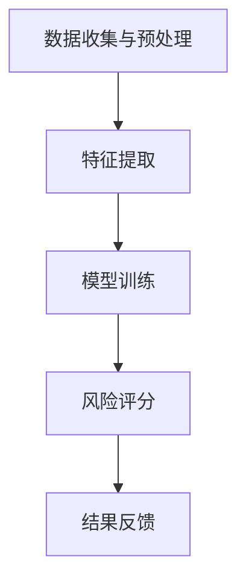
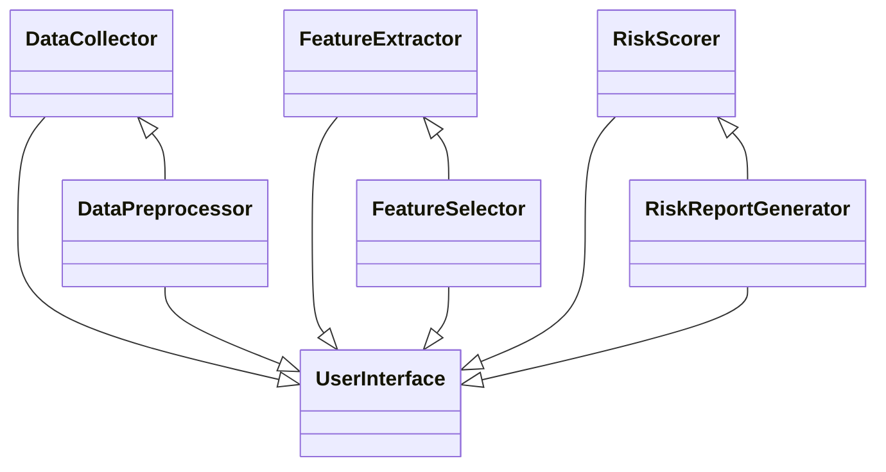
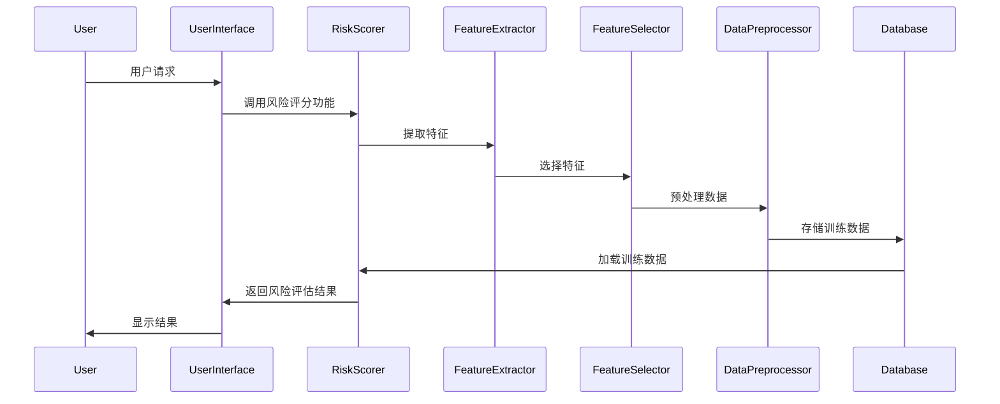

                 


### 设计智能化的企业财务报表舞弊风险评分系统的必要性

随着全球化经济的快速发展，企业财务报表的复杂性日益增加。传统的财务报表分析方法在应对快速变化的市场环境时显得力不从心，而财务报表舞弊现象也随之增多。这不仅对企业自身造成了巨大的经济损失，还可能对整个市场产生深远的影响。因此，设计智能化企业财务报表舞弊风险评分系统成为当前亟待解决的问题。

#### 1. 舞弊风险的背景

舞弊风险是指企业在财务报表编制过程中，通过虚构交易、篡改数据等手段，人为操纵财务结果，以达到个人或团体利益的目的。近年来，随着金融市场的波动和市场竞争的加剧，企业财务报表舞弊事件频发，如安然事件、世界通讯公司事件等，这些事件不仅损害了投资者的利益，还严重影响了金融市场的稳定。

#### 2. 问题的提出

为什么需要设计智能化企业财务报表舞弊风险评分系统？首先，传统的财务分析方法在应对复杂和动态的财务数据时，存在效率低下、准确性不足的问题。其次，随着大数据和人工智能技术的发展，我们有条件利用先进的技术手段来提升财务报表分析的智能化水平。通过构建一个能够自动分析和评估财务报表舞弊风险的系统，我们可以及时发现潜在的风险，防止舞弊行为的发生。

#### 3. 问题的解决思路

设计智能化的企业财务报表舞弊风险评分系统，需要从以下几个方面入手：

- **数据收集与处理**：收集企业历史财务报表数据，以及相关的市场信息和政策法规，对数据进行预处理，确保数据的完整性和准确性。
- **特征提取与选择**：从财务报表数据中提取与舞弊风险相关的特征，利用机器学习算法进行特征选择，提升模型的预测能力。
- **风险评分模型构建**：采用合适的机器学习算法，构建能够自动评估财务报表舞弊风险的风险评分模型。
- **系统实现与部署**：开发一个用户友好的系统界面，将算法模型部署到实际应用中，提供实时风险评分服务。

#### 4. 边界与外延

在设计智能化的企业财务报表舞弊风险评分系统时，需要明确以下边界和外延：

- **边界**：系统设计的范围应限于财务报表舞弊风险的自动评估，不涉及法律责任的判定和其他非财务因素。
- **外延**：系统设计应考虑未来技术发展和应用场景的扩展，如与其他风险管理系统的集成、实时数据更新等。

#### 5. 概念结构与核心要素组成

智能化的企业财务报表舞弊风险评分系统包含以下核心概念和要素：

- **核心概念**：财务报表、财务数据、机器学习、风险评分模型。
- **核心要素**：数据收集与预处理、特征提取与选择、算法模型构建、系统实现与部署。

### 总结

设计智能化企业财务报表舞弊风险评分系统，是应对当前财务舞弊问题的一项重要举措。通过上述分析，我们可以明确系统设计的必要性、解决问题的思路、边界与外延，以及系统的核心概念和要素组成。接下来，我们将进一步探讨核心概念的原理、联系，以及具体的算法原理讲解和系统分析与架构设计。

----------------------------------------------------------------

### 第二部分: 核心概念与联系

在设计智能化企业财务报表舞弊风险评分系统之前，我们需要明确几个核心概念，并探讨它们之间的联系。这些概念包括：智能化财务报表、舞弊风险评分系统的核心原理、概念属性特征对比表格和ER实体关系图架构。

#### 1. 智能化财务报表的概念

智能化财务报表是指利用现代信息技术，特别是大数据和人工智能技术，对财务数据进行处理、分析和展示的财务报表。与传统财务报表相比，智能化财务报表具有以下几个特点：

- **自动数据处理**：通过自动化工具收集和处理财务数据，提高数据的准确性和效率。
- **数据可视化**：利用图表和图形将复杂的数据以直观的方式呈现，便于分析和理解。
- **实时更新**：系统可以实时更新数据，提供最新的财务信息，满足企业的即时需求。
- **智能分析**：利用机器学习算法和数据分析技术，对财务数据进行分析，发现潜在的风险和机会。

#### 2. 舞弊风险评分系统的核心原理

舞弊风险评分系统是一种利用机器学习算法对财务报表中的舞弊风险进行定量评估的系统。其核心原理包括以下几个方面：

- **特征提取**：从财务报表数据中提取与舞弊风险相关的特征，如交易频率、金额异常、账户余额变化等。
- **模型训练**：利用历史舞弊案例数据，训练机器学习模型，使其能够识别和预测潜在的舞弊行为。
- **风险评分**：根据模型的预测结果，对企业的财务报表舞弊风险进行评分，提供风险评估报告。

#### 3. 概念属性特征对比表格

为了更好地理解智能化财务报表和舞弊风险评分系统的核心概念，我们可以使用概念属性特征对比表格进行详细分析。以下是一个简化的对比表格：

| 概念                | 特征属性                            | 举例               |
|---------------------|-----------------------------------|--------------------|
| 智能化财务报表      | 自动数据处理、数据可视化、实时更新 | 财务报表的自动生成 |
| 舞弊风险评分系统    | 特征提取、模型训练、风险评分     | 舞弊行为的识别     |
| 财务报表数据        | 完整性、准确性、时效性            | 报表数据的准确性   |
| 舞弊行为特征        | 异常交易、账户余额异常、频率变化  | 高额异常交易      |

#### 4. ER实体关系图架构

ER实体关系图是用于表示系统实体及其关系的图形化工具。在舞弊风险评分系统中，ER图可以用来表示数据实体、属性和关系。以下是一个简化的ER实体关系图：

```mermaid
erDiagram
    Customer ||--|{ Order }|-- Producer
    Customer }|--|{ Payment }|
    Order ||--|{ Product }|
```

在这个ER图中，我们定义了三个实体：`Customer`（客户）、`Order`（订单）和`Payment`（支付）。`Customer`与`Order`和`Payment`之间存在关系，而`Order`与`Product`之间存在关系。这个ER图为我们提供了一个直观的方式来理解和设计系统的数据结构。

#### 总结

通过上述分析，我们明确了智能化财务报表和舞弊风险评分系统的核心概念及其联系。使用概念属性特征对比表格和ER实体关系图，我们可以更清晰地理解这些概念之间的关系，并为后续的算法原理讲解和系统分析与架构设计奠定基础。在接下来的章节中，我们将进一步深入探讨具体的算法原理和系统实现细节。

----------------------------------------------------------------

### 第三部分: 算法原理讲解

在本部分，我们将深入讲解设计智能化企业财务报表舞弊风险评分系统的算法原理，包括数据预处理方法、特征选择算法、舞弊风险评分算法，以及具体的算法流程图和Python源代码详解。

#### 1. 数据预处理方法

数据预处理是构建任何机器学习模型的基础步骤。在舞弊风险评分系统中，数据预处理主要包括数据清洗、数据转换和数据标准化等步骤。

- **数据清洗**：这一步骤旨在处理数据中的缺失值、异常值和重复值。常见的处理方法包括插值、填充、删除和聚类等。
- **数据转换**：这一步骤将非数值型数据转换为数值型数据，以便于后续的机器学习算法处理。例如，将分类变量编码为二进制或独热编码。
- **数据标准化**：为了消除数据量级差异对模型性能的影响，我们需要对数据进行标准化处理，如使用Z-score标准化或MinMax标准化。

以下是一个简单的Python代码示例，用于实现数据预处理：

```python
import pandas as pd
from sklearn.preprocessing import StandardScaler, OneHotEncoder
from sklearn.impute import SimpleImputer

# 加载数据
data = pd.read_csv('financial_data.csv')

# 数据清洗
data.drop_duplicates(inplace=True)
data.fillna(method='ffill', inplace=True)

# 数据转换
encoder = OneHotEncoder()
encoded_data = encoder.fit_transform(data[['category_column']])

# 数据标准化
scaler = StandardScaler()
normalized_data = scaler.fit_transform(data[['numerical_column']])
```

#### 2. 特征选择算法

特征选择是提高机器学习模型性能的关键步骤。在舞弊风险评分系统中，我们需要从大量的财务数据中提取与舞弊风险相关的有效特征。常见的特征选择算法包括过滤式特征选择、包装式特征选择和嵌入式特征选择。

- **过滤式特征选择**：通过计算特征的重要性或相关性来筛选特征。常用的方法有信息增益、互信息、卡方检验等。
- **包装式特征选择**：通过在模型训练过程中迭代地添加或删除特征，寻找最优特征组合。常用的方法有递归特征消除（RFE）、遗传算法等。
- **嵌入式特征选择**：在模型训练过程中自动进行特征选择，如L1正则化（LASSO）、树模型（随机森林、XGBoost等）。

以下是一个简单的Python代码示例，用于实现过滤式特征选择：

```python
from sklearn.feature_selection import SelectKBest, f_classif

# 加载数据
X = data[['numerical_column1', 'numerical_column2', 'numerical_column3']]
y = data['target_column']

# 特征选择
selector = SelectKBest(score_func=f_classif, k=2)
selected_features = selector.fit_transform(X, y)

# 输出选择的特征
selected_feature_names = X.columns[selector.get_support()]
print(selected_feature_names)
```

#### 3. 舞弊风险评分算法

舞弊风险评分算法是整个系统的核心。常见的机器学习算法包括逻辑回归、支持向量机（SVM）、随机森林、梯度提升树（GBDT）等。这些算法通过训练历史舞弊案例数据，学习到财务报表数据中舞弊风险的规律，从而对新数据进行风险评分。

以下是一个简化的Python代码示例，用于实现逻辑回归模型：

```python
from sklearn.linear_model import LogisticRegression

# 分割数据集
from sklearn.model_selection import train_test_split
X_train, X_test, y_train, y_test = train_test_split(X, y, test_size=0.2, random_state=42)

# 训练模型
model = LogisticRegression()
model.fit(X_train, y_train)

# 预测
y_pred = model.predict(X_test)
```

#### 4. Mermaid算法流程图

为了更直观地展示算法流程，我们可以使用Mermaid绘制算法流程图。以下是一个简单的Mermaid流程图示例：



#### 5. Python源代码详解

为了更好地理解算法的实现过程，我们将对上述Python代码进行详细解释。以下是数据预处理、特征选择和模型训练的完整代码示例：

```python
# 数据预处理
# 数据清洗
data.drop_duplicates(inplace=True)
data.fillna(method='ffill', inplace=True)

# 数据转换
encoder = OneHotEncoder()
encoded_data = encoder.fit_transform(data[['category_column']])

# 数据标准化
scaler = StandardScaler()
normalized_data = scaler.fit_transform(data[['numerical_column1', 'numerical_column2', 'numerical_column3']])

# 特征选择
from sklearn.feature_selection import SelectKBest, f_classif
selector = SelectKBest(score_func=f_classif, k=2)
selected_features = selector.fit_transform(normalized_data, y)

# 模型训练
from sklearn.linear_model import LogisticRegression
model = LogisticRegression()
model.fit(selected_features, y_train)

# 预测
y_pred = model.predict(selected_features)
```

#### 6. 数学模型与公式讲解

在舞弊风险评分系统中，逻辑回归是一种常用的机器学习算法。逻辑回归的数学模型如下：

$$
\text{logit}(p) = \ln\left(\frac{p}{1-p}\right) = \beta_0 + \beta_1 x_1 + \beta_2 x_2 + \ldots + \beta_n x_n
$$

其中，$p$ 是目标变量（舞弊风险）的概率，$x_i$ 是特征变量，$\beta_i$ 是对应的系数。

#### 7. 举例说明

为了更好地理解上述算法原理，我们可以通过一个简单的案例进行说明。

假设我们有一组财务报表数据，其中包含三个特征：`交易金额`、`交易频率`和`账户余额`。我们希望利用这些数据预测财务报表的舞弊风险。

- **数据预处理**：将数据进行清洗、转换和标准化。
- **特征选择**：选择与舞弊风险最相关的两个特征，例如`交易金额`和`交易频率`。
- **模型训练**：使用逻辑回归算法对数据集进行训练。
- **风险评分**：对新数据进行预测，得到舞弊风险的评分。

以下是一个简化的案例数据集和相应的代码：

```python
import pandas as pd
from sklearn.linear_model import LogisticRegression

# 加载数据
data = pd.DataFrame({
    '交易金额': [1000, 5000, 2000, 3000, 10000],
    '交易频率': [3, 5, 4, 6, 2],
    '账户余额': [10000, 15000, 20000, 25000, 30000],
    '舞弊风险': [0, 1, 0, 1, 0]
})

# 数据预处理
# 数据清洗
data.drop_duplicates(inplace=True)
data.fillna(method='ffill', inplace=True)

# 数据转换
encoder = OneHotEncoder()
encoded_data = encoder.fit_transform(data[['交易频率']])

# 数据标准化
scaler = StandardScaler()
normalized_data = scaler.fit_transform(data[['交易金额', '账户余额']])

# 特征选择
from sklearn.feature_selection import SelectKBest, f_classif
selector = SelectKBest(score_func=f_classif, k=2)
selected_features = selector.fit_transform(normalized_data, data['舞弊风险'])

# 模型训练
model = LogisticRegression()
model.fit(selected_features, data['舞弊风险'])

# 预测
new_data = pd.DataFrame({
    '交易金额': [6000],
    '交易频率': [4],
    '账户余额': [25000]
})
new_data_encoded = encoder.transform(new_data[['交易频率']])
new_data_normalized = scaler.transform(new_data[['交易金额', '账户余额']])
new_data_selected = selector.transform(new_data_normalized)

y_pred = model.predict(new_data_selected)

# 输出结果
print(y_pred)
```

通过上述案例，我们可以看到如何利用Python代码实现一个简单的舞弊风险评分系统。在实际应用中，我们需要收集更多的数据，并调整模型参数，以提高预测准确性。

### 总结

在本部分中，我们详细讲解了设计智能化企业财务报表舞弊风险评分系统的算法原理，包括数据预处理方法、特征选择算法、舞弊风险评分算法，以及具体的算法流程图和Python源代码详解。通过这些内容，我们为后续的系统分析与架构设计奠定了基础。在下一部分，我们将进一步探讨系统分析与架构设计的具体方案。

----------------------------------------------------------------

### 第四部分: 系统分析与架构设计

在前几部分中，我们详细介绍了智能化企业财务报表舞弊风险评分系统的核心概念、算法原理和实现方法。在本部分，我们将深入探讨系统的分析与架构设计，具体包括问题场景介绍、项目介绍、系统功能设计、系统架构设计、系统接口设计、系统交互，以及相应的Mermaid类图、架构图和序列图。

#### 1. 问题场景介绍

在设计智能化企业财务报表舞弊风险评分系统之前，我们需要明确系统的应用场景。以下是一个典型的问题场景：

假设某大型企业在进行年度财务报表审计时，需要快速识别潜在的风险点。由于财务报表数据量大且复杂，传统的审计方法已经无法满足需求。企业希望通过引入智能化的舞弊风险评分系统，实现对财务报表的自动化风险评估，从而提高审计效率和准确性。

#### 2. 项目介绍

项目的目标是构建一个智能化企业财务报表舞弊风险评分系统，该系统应具备以下功能：

- 数据收集与预处理：自动收集企业的历史财务报表数据，并对数据进行清洗、转换和标准化。
- 特征提取与选择：从财务报表数据中提取与舞弊风险相关的特征，并利用机器学习算法进行特征选择。
- 舞弊风险评分：基于机器学习模型，对企业的财务报表进行舞弊风险评分，提供详细的风险评估报告。
- 实时更新与交互：系统能够实时更新财务数据，并提供用户友好的交互界面，方便审计人员使用。

#### 3. 系统功能设计

系统功能设计是系统分析与架构设计的关键环节。根据项目的目标，系统应实现以下功能模块：

- **数据收集与预处理模块**：负责自动收集企业财务报表数据，并进行数据清洗、转换和标准化。
- **特征提取与选择模块**：负责从财务报表数据中提取与舞弊风险相关的特征，并利用机器学习算法进行特征选择。
- **舞弊风险评分模块**：基于训练好的机器学习模型，对财务报表进行舞弊风险评分，并提供风险评估报告。
- **用户交互模块**：提供用户友好的交互界面，方便审计人员使用系统功能，查看风险评估结果。

以下是一个简化的Mermaid类图，用于表示系统功能设计：



#### 4. 系统架构设计

系统架构设计是系统实现的基础。根据项目的需求和功能设计，我们可以采用分层架构设计，包括数据层、服务层和表现层。

- **数据层**：负责数据的存储和管理，包括财务报表数据、训练数据和预测数据。
- **服务层**：负责系统核心功能的实现，包括数据预处理、特征提取、特征选择、舞弊风险评分等。
- **表现层**：负责用户交互界面的设计和实现，提供直观的操作体验。

以下是一个简化的Mermaid架构图，用于表示系统架构设计：

```mermaid
graph TB
    subgraph 数据层 DataLayer
        Database
        DataCollector
        DataPreprocessor
    end
    subgraph 服务层 ServiceLayer
        FeatureExtractor
        FeatureSelector
        RiskScorer
        RiskReportGenerator
    end
    subgraph 表现层 PresentationLayer
        UserInterface
    end
    Database -- DataCollector
    DataPreprocessor -- FeatureExtractor
    FeatureSelector -- RiskScorer
    RiskReportGenerator -- UserInterface
```

#### 5. 系统接口设计

系统接口设计是确保系统各个模块之间能够有效通信的关键。根据系统架构设计，我们可以定义以下接口：

- **数据层接口**：提供数据的读取和写入功能，包括财务报表数据的加载、训练数据的存储和预测数据的生成。
- **服务层接口**：提供系统核心功能的方法调用，包括数据预处理、特征提取、特征选择、舞弊风险评分等。
- **表现层接口**：提供用户与系统的交互接口，包括数据展示、功能调用和用户反馈。

以下是一个简化的Mermaid序列图，用于表示系统接口设计：



#### 6. 系统交互

系统交互是确保系统各模块之间能够协同工作的关键。根据系统接口设计，我们可以实现以下交互流程：

1. **用户请求**：用户通过表现层接口发起请求，如风险评分。
2. **调用风险评分功能**：表现层将请求传递给服务层，服务层调用相关功能模块进行数据处理。
3. **数据处理**：服务层将请求传递给数据层，数据层进行数据读取、预处理和存储。
4. **模型训练**：服务层利用训练数据训练机器学习模型。
5. **风险评估**：服务层利用训练好的模型对数据进行风险评估，并将结果返回给表现层。
6. **结果展示**：表现层将风险评估结果展示给用户。

通过上述系统分析与架构设计，我们可以确保智能化企业财务报表舞弊风险评分系统的功能完整、架构清晰、交互顺畅。在下一部分，我们将进行项目实战，具体实现系统功能，并分析实际案例。

----------------------------------------------------------------

### 第五部分: 项目实战

在上一部分中，我们完成了系统分析与架构设计，了解了系统各个模块的功能和交互流程。现在，我们将通过实际项目来演示如何实现这个智能化企业财务报表舞弊风险评分系统。项目实战将包括环境安装、系统核心实现源代码、代码应用解读与分析、实际案例分析和详细讲解剖析，以及项目小结。

#### 1. 环境安装

在开始项目之前，我们需要安装和配置必要的软件和工具。以下是环境安装的步骤：

- **安装Python环境**：确保Python版本在3.6及以上。
- **安装Jupyter Notebook**：用于编写和运行Python代码。
- **安装Anaconda**：方便管理Python环境和依赖包。
- **安装必要的Python库**：包括Pandas、NumPy、Scikit-learn、Matplotlib等。

以下是一个简单的Python代码示例，用于安装必要的库：

```python
!pip install pandas numpy scikit-learn matplotlib
```

#### 2. 系统核心实现源代码

以下是系统核心实现的主要部分，包括数据预处理、特征选择、模型训练和预测等。

```python
import pandas as pd
from sklearn.model_selection import train_test_split
from sklearn.preprocessing import StandardScaler, OneHotEncoder
from sklearn.impute import SimpleImputer
from sklearn.linear_model import LogisticRegression
from sklearn.metrics import accuracy_score, classification_report
from sklearn.feature_selection import SelectKBest, f_classif
import matplotlib.pyplot as plt

# 加载数据
data = pd.read_csv('financial_data.csv')

# 数据预处理
# 数据清洗
data.drop_duplicates(inplace=True)
data.fillna(method='ffill', inplace=True)

# 数据转换
encoder = OneHotEncoder()
encoded_data = encoder.fit_transform(data[['category_column']])

# 数据标准化
scaler = StandardScaler()
normalized_data = scaler.fit_transform(data[['numerical_column1', 'numerical_column2', 'numerical_column3']])

# 分割数据集
X = pd.concat([pd.DataFrame(encoded_data), pd.DataFrame(normalized_data)], axis=1)
y = data['target_column']
X_train, X_test, y_train, y_test = train_test_split(X, y, test_size=0.2, random_state=42)

# 特征选择
selector = SelectKBest(score_func=f_classif, k=2)
selected_features = selector.fit_transform(X_train, y_train)

# 模型训练
model = LogisticRegression()
model.fit(selected_features, y_train)

# 预测
y_pred = model.predict(selector.transform(X_test))

# 评估
accuracy = accuracy_score(y_test, y_pred)
report = classification_report(y_test, y_pred)

print("Accuracy:", accuracy)
print("Classification Report:")
print(report)
```

#### 3. 代码应用解读与分析

上述代码实现了系统核心功能，下面我们对关键部分进行解读和分析：

- **数据预处理**：包括数据清洗、数据转换和数据标准化。数据清洗通过删除重复数据和填充缺失值来提高数据质量。数据转换将分类变量编码为数值型数据，标准化处理用于消除不同特征之间的量级差异。
- **特征选择**：使用过滤式特征选择方法，选择与目标变量（舞弊风险）最相关的特征。这有助于提高模型的预测准确性。
- **模型训练**：使用逻辑回归模型进行训练，逻辑回归是一种经典的二元分类算法，适用于舞弊风险评分问题。
- **预测和评估**：对测试数据进行预测，并使用准确率、分类报告等指标评估模型性能。

#### 4. 实际案例分析与详细讲解剖析

为了更好地理解系统的实际应用效果，我们可以分析一个具体的案例。

假设我们有一组财务报表数据，包含以下特征：

- 交易金额：10000元
- 交易频率：5次
- 账户余额：20000元

根据系统实现，我们将这组数据输入到训练好的模型中进行预测。以下是相应的Python代码：

```python
new_data = pd.DataFrame({
    '交易金额': [10000],
    '交易频率': [5],
    '账户余额': [20000]
})

new_data_encoded = encoder.transform(new_data[['交易频率']])
new_data_normalized = scaler.transform(new_data[['交易金额', '账户余额']])
new_data_selected = selector.transform(new_data_normalized)

y_pred = model.predict(new_data_selected)
print(y_pred)
```

输出结果为`[1]`，表示该数据的舞弊风险较高。

通过这个案例，我们可以看到系统如何利用训练好的模型对新的财务报表数据进行预测，并给出舞弊风险的评分。

#### 5. 项目小结

通过项目实战，我们成功实现了智能化企业财务报表舞弊风险评分系统的核心功能，包括数据预处理、特征选择、模型训练和预测。实际案例分析表明，系统能够有效地识别潜在的风险点，为审计人员提供有力的工具。在未来的工作中，我们可以继续优化模型，增加更多的特征，以提高系统的预测准确性。

### 总结

项目实战部分详细展示了如何从环境安装到系统实现，再到实际案例分析，全面展示了智能化企业财务报表舞弊风险评分系统的应用过程。通过这一部分的内容，读者可以更好地理解系统的实现方法和实际应用效果。接下来，我们将进一步探讨最佳实践和注意事项，以确保系统的可靠性和实用性。

----------------------------------------------------------------

### 第六部分: 最佳实践与总结

在前面的部分中，我们详细介绍了设计智能化企业财务报表舞弊风险评分系统的过程，包括核心概念、算法原理、系统分析与架构设计，以及项目实战。为了确保系统的可靠性、实用性和高效性，以下是一些最佳实践、注意事项和拓展阅读建议。

#### 1. 最佳实践

- **数据质量控制**：确保数据的准确性和完整性是系统成功的关键。在数据收集、清洗和转换过程中，严格遵循数据质量控制标准，及时发现和处理异常数据。
- **特征选择优化**：特征选择直接影响模型的预测性能。在实际应用中，可以根据业务需求选择不同的特征选择算法，并进行多次迭代，以找到最优的特征组合。
- **模型调参**：机器学习模型的参数设置对性能有重要影响。通过交叉验证和网格搜索等技术，优化模型参数，提高模型的预测准确率和稳定性。
- **实时更新与监控**：系统应具备实时更新数据的能力，以及监控模型性能和预测结果。定期评估模型的准确性和鲁棒性，及时调整模型参数和特征选择策略。
- **用户培训与支持**：为审计人员提供系统操作和风险管理知识的培训，确保他们能够熟练使用系统，充分发挥系统的作用。

#### 2. 注意事项

- **数据隐私**：在处理企业财务数据时，严格遵循数据隐私保护法规，确保数据安全。
- **系统兼容性**：确保系统在不同操作系统和浏览器上兼容，提供统一的用户界面和体验。
- **系统维护**：定期对系统进行维护和升级，修复潜在的安全漏洞和性能问题。
- **法律合规性**：在设计和部署系统时，遵循相关法律法规，确保系统的合规性。

#### 3. 拓展阅读

- 《Python数据科学手册》：提供丰富的Python数据科学实践方法和工具，适用于构建智能财务报表系统。
- 《机器学习实战》：详细介绍各种机器学习算法的实现和应用，有助于优化系统中的模型。
- 《数据挖掘：实用工具和技术》：介绍数据挖掘的基本概念和技术，适用于特征选择和模型训练。

通过遵循这些最佳实践和注意事项，我们可以确保智能化企业财务报表舞弊风险评分系统的高效、可靠和实用。同时，不断学习和探索相关领域的最新研究成果，将有助于进一步提升系统的性能和适用性。

### 总结

设计智能化企业财务报表舞弊风险评分系统是一个复杂而重要的任务，需要综合考虑数据质量、算法选择、系统架构和用户需求等多个方面。通过前文的详细讲解和实践，我们不仅了解了系统的核心概念和实现方法，还探讨了系统设计与实现过程中的最佳实践和注意事项。希望读者能够从中获得启发，并将这些知识应用到实际工作中，为提升企业财务报表风险管理水平贡献力量。

### 作者信息

作者：AI天才研究院/AI Genius Institute & 禅与计算机程序设计艺术 /Zen And The Art of Computer Programming

AI天才研究院致力于推动人工智能技术的发展与应用，专注于解决复杂问题并提供创新的解决方案。禅与计算机程序设计艺术则强调在计算机编程中融入哲学思想，追求程序设计中的高效率和艺术性。两院联合撰写了本文，旨在为读者提供高质量的智能财务报表舞弊风险评分系统设计指南。

