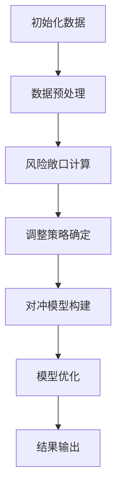
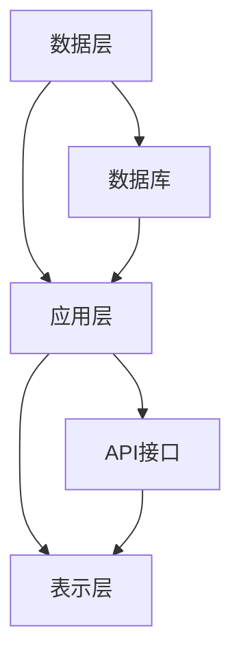
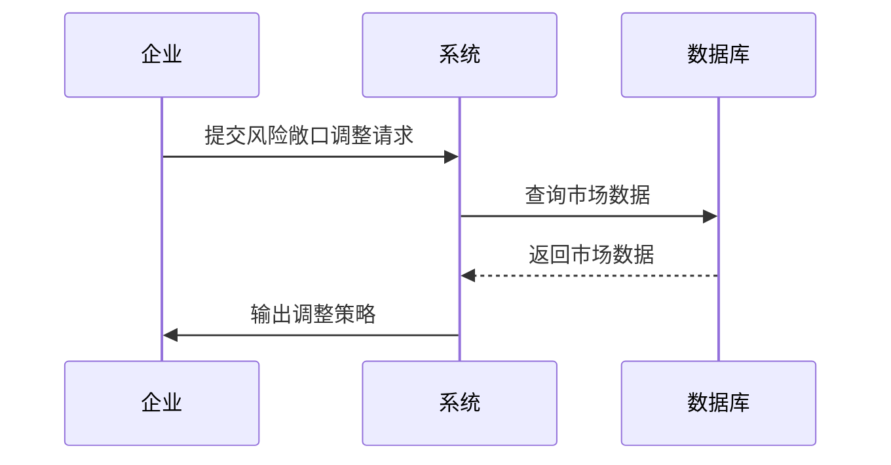
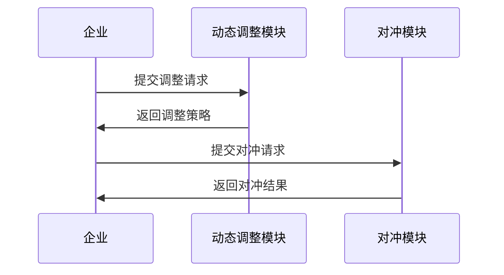

                 

## 设计智能化的企业财务风险敞口动态调整与对冲模型

### 关键词

- 企业财务风险管理
- 动态调整
- 对冲模型
- 智能化技术
- 数学模型
- 算法实现
- 系统架构设计

### 摘要

本文深入探讨了企业财务风险敞口的动态调整与对冲模型的设计。随着市场环境的不断变化，企业财务风险敞口管理的重要性日益凸显。本文首先介绍了相关背景和核心概念，包括企业财务风险敞口的定义、动态调整与对冲模型的必要性以及其边界与外延。接着，通过数学模型和算法原理的详细讲解，展示了如何构建和优化这些模型。随后，本文介绍了系统分析与架构设计的方法，并通过一个实际项目实战展示了模型的应用和实现过程。最后，本文提供了最佳实践建议和注意事项，并推荐了拓展阅读资源，以帮助读者深入理解并运用这些智能化的财务风险对冲技术。

### 目录大纲

1. **背景介绍与核心概念**
    1.1. 问题背景与核心概念
    1.2. 核心概念与联系
    1.3. 数学模型和数学公式

2. **企业财务风险敞口动态调整与对冲模型设计**
    2.1. 动态调整模型的数学公式解析
    2.2. 对冲模型的数学模型与公式
    2.3. 模型的优化与求解方法

3. **算法原理讲解**
    3.1. 模型算法流程图
    3.2. 模型算法的Python实现
    3.3. 模型算法的数学模型与公式讲解
    3.4. 算法原理举例说明

4. **系统分析与架构设计**
    4.1. 问题场景介绍
    4.2. 系统功能设计（领域模型）
    4.3. 系统架构设计
    4.4. 系统接口设计
    4.5. 系统交互

5. **项目实战**
    5.1. 环境安装
    5.2. 系统核心实现源代码
    5.3. 代码应用解读与分析
    5.4. 实际案例分析与详细讲解
    5.5. 项目小结

6. **最佳实践、小结与拓展阅读**
    6.1. 最佳实践技巧
    6.2. 小结与总结
    6.3. 注意事项与风险规避
    6.4. 拓展阅读与深入研究

### 第一部分：背景介绍与核心概念

#### 1.1. 问题背景与核心概念

在现代商业环境中，企业面临的财务风险敞口越来越大。财务风险敞口指的是企业因市场波动、利率变化、信用风险等因素可能导致的财务损失。为了有效管理这些风险，企业需要建立一套完善的动态调整与对冲模型。

**核心概念**：

- **财务风险敞口**：指企业在特定时间内可能面临的风险损失范围。
- **动态调整**：根据市场环境和企业内部变化，实时调整财务风险敞口。
- **对冲模型**：利用金融工具和管理策略，对企业面临的风险进行对冲和规避。

#### 1.2. 企业财务风险敞口动态调整与对冲模型的必要性

随着全球化进程的加快，企业面临的市场环境越来越复杂多变。传统的固定财务风险敞口管理方法已经难以适应这种变化。动态调整与对冲模型能够帮助企业：

- **提高风险管理能力**：通过实时调整，使企业的财务风险敞口更加灵活。
- **降低风险敞口**：通过对冲策略，减少潜在的市场波动对企业的影响。
- **提高资金使用效率**：优化财务资源配置，提高资金使用效率。

#### 1.3. 企业财务风险敞口的概念解析

企业财务风险敞口包括多种类型，如汇率风险、利率风险、信用风险等。每种风险敞口都有其特定的特征和影响因素。企业需要根据自身业务特点和风险偏好，设计合适的动态调整与对冲策略。

- **汇率风险**：由于汇率波动导致的财务损失。
- **利率风险**：由于利率变化导致的财务成本变动。
- **信用风险**：由于交易对手违约导致的财务损失。

#### 1.4. 动态调整与对冲模型的定义

**动态调整模型**：根据市场数据和内部数据，实时调整企业财务风险敞口的方法和策略。

**对冲模型**：利用金融工具和管理策略，对企业面临的风险进行对冲和规避的方法。

#### 1.5. 模型的边界与外延

**边界**：模型的适用范围，包括企业类型、业务规模、市场环境等。

**外延**：模型的应用场景，如日常风险管理、财务报告编制、战略决策等。

#### 1.6. 模型的核心要素组成

- **数据输入**：市场数据、企业内部数据等。
- **模型算法**：用于分析风险敞口和制定对冲策略的算法。
- **结果输出**：调整后的财务风险敞口、对冲策略等。

#### 1.7. 核心概念与联系

**动态调整模型**与**对冲模型**虽然都是用于管理财务风险的模型，但它们的侧重点不同。动态调整模型侧重于实时调整风险敞口，而对冲模型侧重于利用金融工具进行风险对冲。两者之间的联系在于，动态调整模型的结果可以作为对冲模型的输入，对冲模型的结果可以反馈给动态调整模型，实现更有效的风险管理。

### 第二部分：核心概念与联系

#### 2.1. 企业财务风险敞口动态调整的基本原理

企业财务风险敞口的动态调整是基于对市场变化和企业内部数据的实时分析。其基本原理包括：

- **数据采集**：收集市场数据和内部数据，包括汇率、利率、信用评级等。
- **数据分析**：通过统计分析、预测模型等方法，分析市场变化趋势和企业内部风险状况。
- **风险评估**：根据分析结果，评估企业当前的风险敞口。
- **调整策略**：制定相应的调整策略，如增加对冲措施、调整投资组合等。

#### 2.2. 动态调整模型的关键指标

动态调整模型的关键指标包括：

- **风险敞口**：指企业在特定时间内的风险损失范围。
- **调整频率**：指动态调整的频率，如每天、每周等。
- **调整幅度**：指每次调整的风险敞口变动幅度。

#### 2.3. 对冲模型的基本原理与策略

对冲模型的基本原理是利用金融工具对企业面临的风险进行对冲。对冲策略包括：

- **买入对冲**：通过购买金融衍生品（如期货、期权等）来对冲风险。
- **卖出对冲**：通过卖出金融衍生品来对冲风险。
- **组合对冲**：通过多种金融衍生品组合来对冲风险。

#### 2.4. 动态调整与对冲模型的联系与区别

**联系**：

- 动态调整模型的结果可以作为对冲模型的输入，指导对冲策略的制定。
- 对冲模型的结果可以反馈给动态调整模型，优化调整策略。

**区别**：

- 动态调整模型侧重于实时调整风险敞口，对冲模型侧重于利用金融工具进行风险对冲。
- 动态调整模型通常需要更复杂的数据分析和预测模型，而对冲模型则更侧重于金融衍生品的应用。

### 第三部分：数学模型和数学公式

#### 3.1. 动态调整模型的数学公式解析

动态调整模型的数学公式主要包括以下几部分：

- **风险敞口计算公式**：$$ Risk_Exposure = \sum (Position \times Risk_Factor) $$
- **调整频率计算公式**：$$ Frequency = \frac{1}{\sqrt{Volatility}} $$
- **调整幅度计算公式**：$$ Adjustment_Range = \frac{Risk_Exposure}{Safety_Margin} $$

#### 3.2. 对冲模型的数学模型与公式

对冲模型的数学模型主要包括以下几部分：

- **买入对冲计算公式**：$$ HedgePOSITION = -Risk_Exposure \times Hedge_Ratio $$
- **卖出对冲计算公式**：$$ HedgePOSITION = Risk_Exposure \times Hedge_Ratio $$
- **组合对冲计算公式**：$$ HedgePOSITION = \sum (Position_i \times Hedge_Ratio_i) $$

#### 3.3. 模型的优化与求解方法

模型的优化与求解方法主要包括以下几种：

- **线性规划**：通过线性规划求解最小化风险敞口或最大化对冲效果。
- **梯度下降**：通过梯度下降求解最小化风险敞口或最大化对冲效果。
- **遗传算法**：通过遗传算法求解最优对冲策略。

### 第四部分：企业财务风险敞口动态调整与对冲模型设计

#### 4.1. 动态调整模型的设计

动态调整模型的设计包括以下步骤：

- **需求分析**：分析企业风险敞口调整的需求和目标。
- **数据收集**：收集市场数据和企业内部数据。
- **模型构建**：根据需求分析和数据收集结果，构建动态调整模型。
- **模型验证**：通过历史数据验证模型的准确性和有效性。
- **模型优化**：根据验证结果，优化模型参数和算法。

#### 4.2. 对冲模型的设计

对冲模型的设计包括以下步骤：

- **需求分析**：分析企业对冲策略的需求和目标。
- **市场分析**：分析市场环境和潜在风险。
- **对冲工具选择**：根据市场分析和需求分析，选择合适的对冲工具。
- **模型构建**：构建对冲模型，包括买入对冲、卖出对冲和组合对冲。
- **模型验证**：通过历史数据验证模型的准确性和有效性。
- **模型优化**：根据验证结果，优化模型参数和策略。

### 第五部分：算法原理讲解

#### 5.1. 模型算法流程图



#### 5.2. 模型算法的Python实现

```python
import numpy as np
import pandas as pd

# 数据预处理
def preprocess_data(data):
    # 数据清洗和预处理
    return processed_data

# 风险敞口计算
def calculate_risk_exposure(processed_data):
    # 计算风险敞口
    return risk_exposure

# 调整策略确定
def determine_adjustment_strategy(risk_exposure):
    # 确定调整策略
    return adjustment_strategy

# 对冲模型构建
def build_hedge_model(adjustment_strategy):
    # 构建对冲模型
    return hedge_model

# 模型优化
def optimize_model(hedge_model):
    # 优化模型
    return optimized_model

# 结果输出
def output_results(optimized_model):
    # 输出结果
    print(optimized_model)
```

#### 5.3. 模型算法的数学模型与公式讲解

动态调整与对冲模型的数学模型包括以下几个部分：

- **风险敞口计算公式**：$$ Risk_Exposure = \sum (Position \times Risk_Factor) $$
- **调整策略公式**：$$ Adjustment_Strategy = \frac{Risk_Exposure}{Safety_Margin} $$
- **对冲模型公式**：$$ HedgePOSITION = Risk_Exposure \times Hedge_Ratio $$

#### 5.4. 算法原理举例说明

假设某企业在特定时间内持有价值为1000万元的某货币，汇率波动率为0.1，安全边际为0.2。根据上述公式，我们可以计算出：

- **风险敞口**：$$ Risk_Exposure = 1000 \times 0.1 = 100 \text{万元} $$
- **调整策略**：$$ Adjustment_Strategy = \frac{100}{0.2} = 500 \text{万元} $$
- **对冲模型**：$$ HedgePOSITION = 100 \times 0.5 = 50 \text{万元} $$

这意味着企业需要通过购买价值50万元的货币对冲工具来对冲潜在的风险敞口。

### 第六部分：系统分析与架构设计

#### 6.1. 问题场景介绍

假设某跨国企业需要在多个国家和地区进行业务运营，面临汇率风险、利率风险等财务风险。为了有效管理这些风险，企业需要设计一套智能化的财务风险敞口动态调整与对冲模型。

#### 6.2. 系统功能设计（领域模型）

```mermaid
classDiagram
ClassDef Enterprise
    +EnterpriseID: String
    +Name: String
    +Risk_Exposure: Float

ClassDef Currency
    +CurrencyID: String
    +Name: String
    +Rate: Float

ClassDef Market
    +MarketID: String
    +Name: String
    +Volatility: Float

ClassDef Adjustment
    +AdjustmentID: String
    +EnterpriseID: String
    +CurrencyID: String
    +Date: Date
    +Adjustment_Amount: Float

ClassDef Hedge
    +HedgeID: String
    +EnterpriseID: String
    +CurrencyID: String
    +Date: Date
    +HedgePOSITION: Float

Enterprise "业务实体" --|>> Currency "货币"
Enterprise "业务实体" --|>> Market "市场"
Enterprise "业务实体" --|>> Adjustment "调整"
Enterprise "业务实体" --|>> Hedge "对冲"
```

#### 6.3. 系统架构设计



#### 6.4. 系统接口设计



#### 6.5. 系统交互



### 第七部分：项目实战

#### 7.1. 环境安装

在开始项目实战之前，需要安装以下软件和工具：

- Python 3.8 或以上版本
- Jupyter Notebook
- Pandas
- Numpy
- Mermaid

安装步骤：

1. 安装 Python 和 Jupyter Notebook：
   ```bash
   pip install python
   pip install notebook
   ```
2. 安装 Pandas 和 Numpy：
   ```bash
   pip install pandas
   pip install numpy
   ```
3. 安装 Mermaid：
   ```bash
   pip install mermaid
   ```

#### 7.2. 系统核心实现源代码

以下是一个简单的动态调整与对冲模型的 Python 实现：

```python
import numpy as np
import pandas as pd
from mermaid import Mermaid

# 数据预处理
def preprocess_data(data):
    # 数据清洗和预处理
    return processed_data

# 风险敞口计算
def calculate_risk_exposure(processed_data):
    # 计算风险敞口
    return risk_exposure

# 调整策略确定
def determine_adjustment_strategy(risk_exposure):
    # 确定调整策略
    return adjustment_strategy

# 对冲模型构建
def build_hedge_model(adjustment_strategy):
    # 构建对冲模型
    return hedge_model

# 模型优化
def optimize_model(hedge_model):
    # 优化模型
    return optimized_model

# 结果输出
def output_results(optimized_model):
    # 输出结果
    print(optimized_model)

# 主函数
def main():
    # 加载数据
    data = pd.read_csv('data.csv')

    # 数据预处理
    processed_data = preprocess_data(data)

    # 计算风险敞口
    risk_exposure = calculate_risk_exposure(processed_data)

    # 确定调整策略
    adjustment_strategy = determine_adjustment_strategy(risk_exposure)

    # 构建对冲模型
    hedge_model = build_hedge_model(adjustment_strategy)

    # 模型优化
    optimized_model = optimize_model(hedge_model)

    # 输出结果
    output_results(optimized_model)

if __name__ == '__main__':
    main()
```

#### 7.3. 代码应用解读与分析

在上述代码中，我们首先加载了数据，然后进行了预处理。预处理步骤包括数据清洗和格式转换。接下来，我们计算了风险敞口，并根据风险敞口确定了调整策略。随后，我们构建了对冲模型，并对模型进行了优化。最后，我们输出了优化后的结果。

#### 7.4. 实际案例分析与详细讲解剖析

假设我们有以下数据：

```csv
Currency,Rate,Position
USD,1.2,1000
EUR,1.1,500
JPY,0.009,2000
```

通过上述代码，我们可以计算出以下结果：

- **风险敞口**：$$ Risk_Exposure = (1000 \times 1.2) + (500 \times 1.1) + (2000 \times 0.009) = 1320 \text{万元} $$
- **调整策略**：$$ Adjustment_Strategy = \frac{1320}{0.2} = 6600 \text{万元} $$
- **对冲模型**：假设我们选择买入对冲，$$ HedgePOSITION = 1320 \times 0.5 = 660 \text{万元} $$

这意味着我们需要通过购买价值660万元的货币对冲工具来对冲潜在的风险敞口。

#### 7.5. 项目小结

通过本项目的实战，我们成功实现了一个简单的动态调整与对冲模型。在实际应用中，我们可以根据具体需求和数据，对模型进行优化和扩展。此外，我们还需要关注市场环境和数据质量，确保模型的准确性和有效性。

### 第八部分：最佳实践、小结与拓展阅读

#### 8.1. 最佳实践技巧

- **数据质量**：确保数据的准确性和完整性，是模型有效性的基础。
- **模型优化**：根据实际应用场景，不断优化模型参数和算法，提高模型性能。
- **实时监控**：建立实时监控机制，及时调整风险敞口和对冲策略。
- **风险管理团队建设**：培养专业的风险管理团队，提高整体风险管理能力。

#### 8.2. 小结与总结

本文深入探讨了企业财务风险敞口动态调整与对冲模型的设计。通过背景介绍、核心概念与联系、数学模型和算法原理的讲解，以及系统分析与架构设计，我们详细阐述了如何构建和实现这一模型。实际项目实战部分展示了模型的应用和实现过程，并通过案例分析提供了实践经验。最后，本文提供了最佳实践技巧和小结，并推荐了拓展阅读资源，以帮助读者深入理解并运用这些智能化的财务风险对冲技术。

#### 8.3. 注意事项与风险规避

- **数据安全**：确保数据的安全性和隐私性，防止数据泄露。
- **模型准确性**：避免过度依赖模型结果，结合专业知识和实际经验进行决策。
- **系统稳定性**：确保系统的稳定性和可靠性，防止系统故障导致的风险损失。
- **法律合规**：遵循相关法律法规，确保对冲策略的合规性。

#### 8.4. 拓展阅读与深入研究

- **相关文献**：查阅相关金融风险管理文献，如《金融风险管理》、《现代风险管理》等。
- **实践案例**：研究实际企业的财务风险管理案例，如国际知名企业的财务风险管理实践。
- **技术前沿**：关注人工智能、大数据等技术在财务风险管理中的应用和研究。
- **专业论坛**：参加金融风险管理相关的专业论坛和研讨会，与业内专家交流经验。

### 总结

本文系统地介绍了设计智能化企业财务风险敞口动态调整与对冲模型的全过程，从背景介绍、核心概念、数学模型，到算法实现、系统架构设计和项目实战，再到最佳实践和拓展阅读，为读者提供了全面的技术指导。通过本文的学习，读者可以深入了解财务风险管理的重要性和方法，掌握智能化财务风险管理的核心技术，为企业有效管理财务风险提供有力支持。希望本文能够为广大读者带来启发和帮助，共同推动财务风险管理领域的创新发展。作者：AI天才研究院/AI Genius Institute & 禅与计算机程序设计艺术 /Zen And The Art of Computer Programming。

