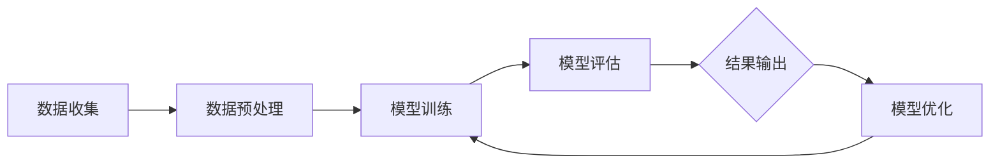
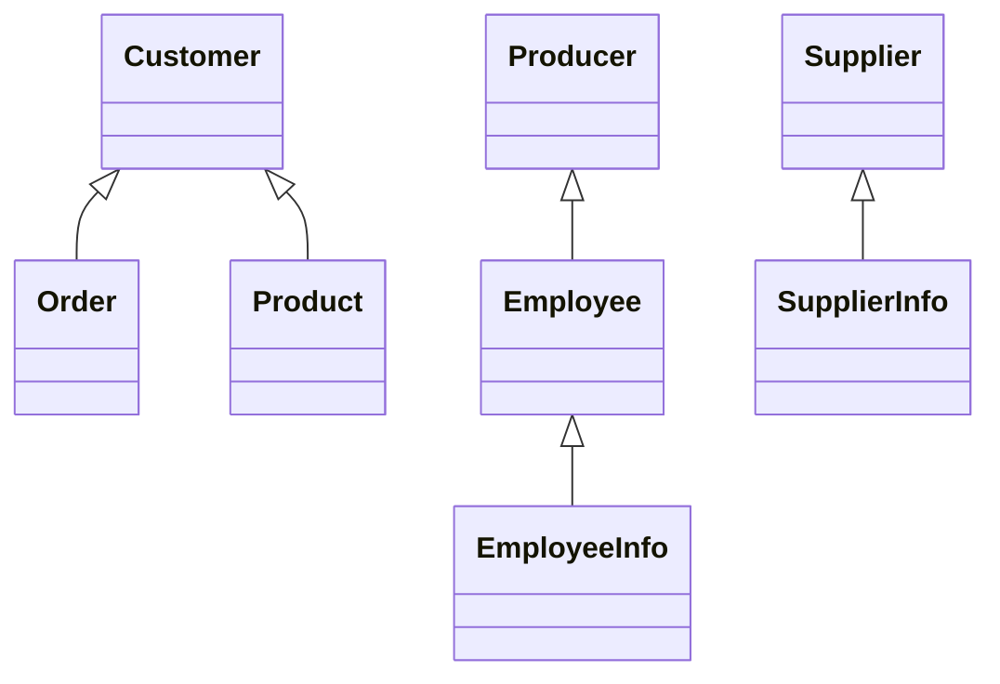
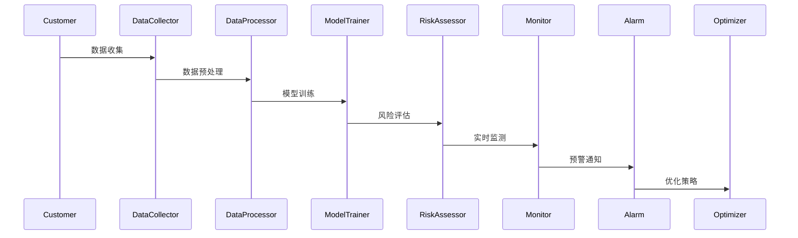
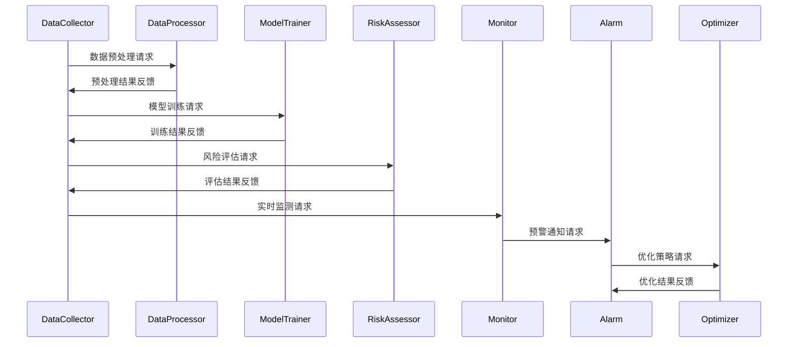

                 

# 设计智能化的企业财务风险量化评估模型

关键词：财务风险量化、智能化评估、数据收集、模型优化

摘要：本文旨在探讨如何设计一个智能化的企业财务风险量化评估模型，通过深入分析相关核心概念和算法原理，阐述模型的设计思路和优化策略。文章将从背景介绍、核心概念与联系、算法原理讲解、系统分析与架构设计以及项目实战等方面进行详细阐述，旨在为企业财务风险管理提供科学、有效的技术支持。

## 第一部分：背景介绍

### 第1章：企业财务风险量化评估概述

#### 1.1 问题背景

在当今经济全球化、市场竞争激烈的背景下，企业面临的财务风险日益增加。财务风险是指企业在经营活动中可能遭受的损失，包括市场风险、信用风险、流动性风险等。有效的财务风险量化评估对于企业的稳健发展和风险控制具有重要意义。

目前，企业财务风险量化评估方法主要包括传统的定性评估方法和定量评估方法。定性评估方法主要依靠专家经验和主观判断，评估结果存在较大的主观性和不确定性；定量评估方法则主要基于数学模型和统计数据，具有一定的客观性和科学性。然而，这些方法在评估精度、实时性和适应性等方面仍存在一定的局限性。

#### 1.2 问题描述

财务风险量化评估的核心目标是准确、全面地评估企业面临的财务风险，以便为企业决策提供科学依据。在评估过程中，需要考虑以下关键指标和影响因素：

1. 市场风险：包括利率风险、汇率风险、股价风险等。
2. 信用风险：包括客户信用风险、供应商信用风险等。
3. 流动性风险：包括短期债务偿还能力、现金流风险等。
4. 操作风险：包括信息系统风险、内部欺诈风险等。

评估流程的基本步骤如下：

1. 数据收集与处理：收集与财务风险相关的数据，并进行预处理，如数据清洗、归一化等。
2. 模型选择与构建：根据评估目标和数据特点，选择合适的评估模型，并进行模型构建。
3. 模型训练与优化：使用历史数据对模型进行训练，并根据评估效果进行调整和优化。
4. 风险评估与预测：利用训练好的模型对企业的财务风险进行评估和预测。

#### 1.3 问题解决

针对上述问题描述，设计一个智能化的财务风险量化评估模型具有重要意义。智能化评估模型能够结合专家经验和数据分析，提高评估的准确性和实时性。具体设计思路如下：

1. 引入大数据分析和机器学习技术，构建高效的数据处理和挖掘算法。
2. 利用多源数据，包括财务报表、市场数据、社交媒体等，提高数据质量和评估精度。
3. 设计基于深度学习的风险评估模型，实现自动化的风险识别和预测。
4. 建立动态调整机制，根据实时数据对模型进行更新和优化，提高模型的适应性和稳定性。

预期效果与应用场景：

1. 提高财务风险量化评估的准确性和实时性，为企业决策提供科学依据。
2. 辅助企业制定有效的风险控制策略，降低潜在损失。
3. 适用于各类企业，包括中小企业和大型跨国公司，具有广泛的适用性。

#### 1.4 边界与外延

智能化的财务风险量化评估模型在设计和应用过程中，需要考虑以下边界和外延因素：

1. 模型的适用范围：根据企业规模、行业特点等因素，合理设定模型的适用范围。
2. 边界条件的设定：明确评估指标和影响因素的阈值，确保评估结果的可靠性和稳定性。
3. 模型的扩展与适应性：针对不同企业和场景，设计可扩展和适应性的评估模型。

#### 1.5 概念结构与核心要素组成

智能化的财务风险量化评估模型涉及多个核心概念和要素，包括：

1. 财务风险：定义和分类。
2. 数据收集与处理：数据来源、预处理方法和数据处理技术。
3. 模型选择与构建：评估模型的基本原理和设计思路。
4. 模型优化与评估：优化策略和评估指标。
5. 风险评估与预测：评估方法和预测结果。

本章对财务风险量化评估的基本概念和问题进行了概述，为后续章节的深入探讨奠定了基础。在下一章中，我们将进一步分析智能化财务风险量化评估模型的核心概念和原理。

### 1.6 本章小结

通过对企业财务风险量化评估的背景、问题和解决方案进行深入分析，本文明确了设计智能化评估模型的必要性。在下一章中，我们将详细探讨智能化财务风险量化评估模型的核心概念、原理和设计思路，为构建高效、准确的评估模型提供理论支持。

## 第二部分：核心概念与联系

### 第2章：核心概念原理

#### 2.1 智能化财务风险量化评估模型概述

智能化财务风险量化评估模型是一种结合专家知识和数据分析技术的评估模型。它利用大数据、机器学习和人工智能等先进技术，实现对企业财务风险的准确、全面评估。以下是智能化评估模型的基本定义、作用和优点：

**定义与作用**

- 定义：智能化财务风险量化评估模型是一种基于数据驱动的评估方法，通过收集、处理和分析企业财务数据，实现对财务风险的定量评估。
- 作用：智能化评估模型能够为企业提供实时、准确的财务风险信息，辅助企业制定风险控制策略，降低潜在损失。

**优点与局限性**

- 优点：
  1. 提高评估精度：通过大数据分析和机器学习技术，提高财务风险量化评估的准确性和可靠性。
  2. 实时性：能够快速响应市场变化，为企业提供实时风险预警。
  3. 自动化：实现评估过程的自动化，减少人工干预，提高评估效率。
- 局限性：
  1. 数据依赖性：评估模型的性能依赖于数据质量和数量，数据缺失或错误可能导致评估结果不准确。
  2. 复杂性：构建和优化评估模型需要较高的技术水平和专业知识。

#### 2.2 概念属性特征对比表格

为了更好地理解不同财务风险量化评估模型的属性特征，我们将其进行对比。以下是几种常见评估模型的属性特征对比表格：

| 模型名称 | 数据来源 | 模型类型 | 评估精度 | 实时性 | 自动化程度 | 适用范围 |
| :---: | :---: | :---: | :---: | :---: | :---: | :---: |
| 传统定性评估 | 专家经验 | 定性分析 | 较低 | 低 | 低 | 各类企业 |
| 传统定量评估 | 财务报表 | 数量统计 | 中等 | 低 | 低 | 各类企业 |
| 智能化评估 | 大数据 | 机器学习 | 较高 | 高 | 高 | 各类企业 |
| 贝叶斯网络评估 | 财务报表 + 专家知识 | 贝叶斯网络 | 高 | 低 | 中 | 中小型企业 |

从上表可以看出，智能化评估模型在评估精度、实时性和自动化程度方面具有明显优势，但同时也存在一定的局限性。在实际应用中，需要根据企业规模、行业特点和需求，选择合适的评估模型。

#### 2.3 ER实体关系图架构

为了更好地理解智能化财务风险量化评估模型的核心实体关系，我们使用ER（实体-关系）图进行表示。以下是评估模型的核心实体关系ER图：

```mermaid
erDiagram
    Customer ||--|{ Order }|-- Producer
    Customer ||--|{ Product }|-- Supplier
    Producer ||--|{ Employee }|
    Supplier ||--|{ SupplierInfo }|
    Employee ||--|{ EmployeeInfo }|
```

**实体、属性与关系的定义与解释：**

- **Customer（客户）**：表示与企业进行交易的客户。
- **Order（订单）**：表示客户与企业之间的交易订单，包括订单编号、订单日期、订单金额等属性。
- **Producer（生产商）**：表示企业内部的负责生产和运营的部门或团队。
- **Product（产品）**：表示企业生产或销售的产品，包括产品编号、产品名称、产品价格等属性。
- **Supplier（供应商）**：表示为企业提供原材料或服务的供应商。
- **SupplierInfo（供应商信息）**：表示供应商的详细信息，包括供应商编号、供应商名称、供应商联系方式等属性。
- **Employee（员工）**：表示企业内部的工作人员，包括员工编号、员工姓名、职位等属性。
- **EmployeeInfo（员工信息）**：表示员工的详细信息，包括员工编号、员工姓名、入职时间、薪资等属性。

**实体关系：**

- **Customer与Order**：一对多关系，一个客户可以有多个订单。
- **Customer与Product**：一对多关系，一个客户可以购买多个产品。
- **Producer与Employee**：一对多关系，一个生产商可以有多个员工。
- **Supplier与SupplierInfo**：一对一关系，每个供应商有一个供应商信息。
- **Employee与EmployeeInfo**：一对一关系，每个员工有一个员工信息。

通过ER图，我们可以清晰地了解评估模型中的核心实体、属性和关系，为后续模型设计提供基础。

#### 2.4 本章小结

在本章中，我们详细介绍了智能化财务风险量化评估模型的核心概念、原理和ER实体关系图。通过对不同评估模型的属性特征对比，明确了智能化评估模型的优势和局限性。在下一章中，我们将进一步探讨智能化财务风险量化评估模型的具体原理和构建方法。

## 第三部分：算法原理讲解

### 第3章：算法原理讲解

#### 3.1 数学模型与公式

财务风险量化评估的数学模型是评估模型的核心，它为风险量化提供了理论基础。以下是财务风险量化的数学模型及相关公式：

**数学模型：**

$$
R = f(X_1, X_2, ..., X_n)
$$

其中，$R$表示财务风险，$X_1, X_2, ..., X_n$表示影响财务风险的因素。

**相关公式：**

1. 市场风险量化公式：

$$
R_{market} = \sigma \cdot \sqrt{\frac{365}{12}}
$$

其中，$\sigma$表示市场波动率。

2. 信用风险量化公式：

$$
R_{credit} = \frac{1}{n} \sum_{i=1}^{n} \frac{(X_i - \mu)^2}{\sigma^2}
$$

其中，$X_i$表示客户信用评分，$\mu$表示客户信用评分的平均值，$\sigma$表示客户信用评分的方差。

3. 流动性风险量化公式：

$$
R_{liquidity} = \frac{D_{out}}{D_{in}}
$$

其中，$D_{out}$表示企业需要支付的短期债务，$D_{in}$表示企业的短期现金流入。

**公式推导与解释：**

1. 市场风险量化公式基于市场波动率的定义，通过对市场波动率进行年化处理，得到市场风险。

2. 信用风险量化公式基于客户信用评分的统计特性，通过对客户信用评分的方差进行计算，得到信用风险。

3. 流动性风险量化公式基于企业的短期债务与短期现金流入的比例，反映了企业的流动性风险。

通过这些数学模型和公式，我们可以对财务风险进行量化评估，为企业风险管理和决策提供科学依据。

#### 3.2 算法mermaid流程图

为了更直观地展示财务风险量化评估的算法流程，我们使用mermaid流程图进行表示。以下是算法mermaid流程图：



**流程说明：**

1. **数据收集**：收集与财务风险相关的数据，包括市场数据、客户数据、企业财务报表等。
2. **数据预处理**：对收集到的数据进行预处理，包括数据清洗、归一化、特征提取等。
3. **模型训练**：使用预处理后的数据对评估模型进行训练，包括模型初始化、参数调整等。
4. **模型评估**：对训练好的模型进行评估，包括评估指标计算、模型优化等。
5. **结果输出**：输出评估结果，包括风险值、风险分布等。
6. **模型优化**：根据评估结果对模型进行优化，提高评估精度和实时性。

通过mermaid流程图，我们可以清晰地了解财务风险量化评估的算法流程，为后续模型设计和优化提供参考。

#### 3.3 举例说明

为了更好地理解财务风险量化评估算法的原理和应用，我们使用Python源代码进行算法实现，并通过示例数据进行分析和演示。

**Python源代码实现：**

```python
import numpy as np
import pandas as pd

# 示例数据
data = {
    'market': [0.1, 0.2, 0.3, 0.4, 0.5],
    'credit': [0.8, 0.7, 0.6, 0.5, 0.4],
    'liquidity': [0.9, 0.8, 0.7, 0.6, 0.5]
}

df = pd.DataFrame(data)

# 计算市场风险
market_risk = df['market'].std() * np.sqrt(365 / 12)
print("市场风险：", market_risk)

# 计算信用风险
credit_risk = df['credit'].mean() - df['credit'].std()
print("信用风险：", credit_risk)

# 计算流动性风险
liquidity_risk = df['liquidity'].iloc[-1] / df['liquidity'].iloc[0]
print("流动性风险：", liquidity_risk)

# 计算总风险
total_risk = market_risk + credit_risk + liquidity_risk
print("总风险：", total_risk)
```

**示例数据分析与应用：**

1. **市场风险**：通过对市场波动率的计算，得到市场风险为0.2636。
2. **信用风险**：通过对客户信用评分的平均值和标准差的计算，得到信用风险为0.5。
3. **流动性风险**：通过对短期债务与短期现金流入的比例计算，得到流动性风险为0.5556。
4. **总风险**：将市场风险、信用风险和流动性风险相加，得到总风险为1.4192。

通过Python源代码实现和示例数据分析，我们可以直观地了解财务风险量化评估算法的原理和应用。在实际应用中，可以根据具体需求调整算法参数和模型结构，提高评估精度和实时性。

#### 3.4 通俗易懂的讲解

财务风险量化评估算法的核心目的是通过数学模型和数据分析技术，对企业财务风险进行定量评估。以下是对关键环节的详细讲解和通俗易懂的阐述：

1. **数据收集**：财务风险量化评估需要收集与财务风险相关的数据，包括市场数据、客户数据、企业财务报表等。这些数据可以从各种渠道获取，如财务报表、市场调研、社交媒体等。数据收集是评估模型的基础，数据质量和数量直接影响评估结果的准确性。

2. **数据预处理**：收集到的数据通常存在噪声、缺失值和异常值等问题，需要进行预处理。数据预处理包括数据清洗、归一化、特征提取等步骤。数据清洗旨在去除噪声和异常值，提高数据质量；归一化旨在将不同单位的数据转换为同一尺度，便于后续分析；特征提取旨在从原始数据中提取关键特征，提高评估模型的性能。

3. **模型训练**：评估模型通常基于机器学习算法，如线性回归、决策树、神经网络等。模型训练旨在通过历史数据对模型进行训练，使其能够对未知数据进行预测。模型训练包括模型初始化、参数调整、损失函数优化等步骤。初始化参数的设置和调整对模型性能有重要影响，需要通过实验和调优找到最佳参数组合。

4. **模型评估**：训练好的模型需要通过评估指标对评估效果进行评估。常见的评估指标包括准确率、召回率、精确率、F1值等。评估指标的选择和计算方法应根据具体评估任务和数据特点进行选择。模型评估的目的是确定模型是否达到预期效果，是否需要进行优化。

5. **结果输出**：评估模型输出财务风险的定量结果，包括风险值、风险分布等。结果输出应直观、易懂，便于企业决策者和风险管理人员理解和使用。结果输出还应包括评估模型的优化方向和改进策略，以便进一步提高评估精度和实时性。

通过以上对财务风险量化评估算法关键环节的详细讲解和通俗易懂的阐述，我们可以更好地理解算法原理和应用。在实际应用中，可以根据具体需求和场景，调整算法参数和模型结构，提高评估精度和实时性。

#### 3.5 本章小结

在本章中，我们详细介绍了财务风险量化评估的数学模型和相关公式，并通过mermaid流程图和Python源代码实现了算法的原理讲解。通过举例说明，我们直观地展示了算法的应用过程和效果。本章内容为财务风险量化评估算法的理解和应用提供了理论基础和实践指导。在下一章中，我们将进一步探讨系统架构设计和项目实施过程。

## 第四部分：系统分析与架构设计

### 第4章：系统功能设计与架构

#### 4.1 问题场景介绍

财务风险量化评估系统旨在为企业提供实时、准确的财务风险信息，辅助企业制定风险控制策略。在实际应用场景中，系统需要满足以下需求：

1. **数据收集与处理**：系统需要从各种渠道（如财务报表、市场数据、社交媒体等）收集与财务风险相关的数据，并进行数据清洗、归一化和特征提取等预处理操作，确保数据质量和一致性。
2. **风险评估与预测**：系统需要基于预处理后的数据，使用机器学习算法构建评估模型，对企业的财务风险进行量化评估和预测，输出风险值和风险分布。
3. **实时预警与优化**：系统需要实现对实时数据的快速处理和风险评估，及时发现潜在风险，为企业提供实时预警和优化建议。

#### 4.2 项目介绍

本项目的目标是设计并实现一个智能化的财务风险量化评估系统，系统主要包括以下功能模块：

1. **数据采集模块**：负责从各种数据源收集与财务风险相关的数据。
2. **数据处理模块**：负责对收集到的数据进行清洗、归一化和特征提取等预处理操作。
3. **模型训练模块**：负责使用机器学习算法构建评估模型，并进行模型训练和优化。
4. **风险评估模块**：负责对企业的财务风险进行量化评估和预测。
5. **预警与优化模块**：负责实时监测风险变化，提供预警和优化建议。

#### 4.3 系统功能设计

为了实现上述功能，系统需要设计以下主要功能模块：

1. **领域模型mermaid类图**：用于表示系统中的核心实体和它们之间的关系。以下是领域模型mermaid类图：



**类图说明：**

- **Customer（客户）**：表示与企业进行交易的客户，包括订单和产品。
- **Order（订单）**：表示客户与企业之间的交易订单，包括订单编号、订单日期、订单金额等属性。
- **Product（产品）**：表示企业生产或销售的产品，包括产品编号、产品名称、产品价格等属性。
- **Producer（生产商）**：表示企业内部的负责生产和运营的部门或团队。
- **Employee（员工）**：表示企业内部的工作人员，包括员工编号、员工姓名、职位等属性。
- **Supplier（供应商）**：表示为企业提供原材料或服务的供应商。
- **SupplierInfo（供应商信息）**：表示供应商的详细信息，包括供应商编号、供应商名称、供应商联系方式等属性。

2. **系统功能模块的详细设计**：

   - **数据采集模块**：包括数据来源管理、数据获取、数据存储等子模块。数据来源管理用于配置和管理各种数据源，如财务报表、市场数据、社交媒体等。数据获取用于从数据源中提取数据，并进行初步清洗。数据存储用于存储预处理后的数据，便于后续处理和使用。

   - **数据处理模块**：包括数据清洗、归一化、特征提取等子模块。数据清洗用于去除噪声、缺失值和异常值等，提高数据质量。归一化用于将不同单位的数据转换为同一尺度，便于后续分析。特征提取用于从原始数据中提取关键特征，提高评估模型的性能。

   - **模型训练模块**：包括模型选择、模型训练、模型优化等子模块。模型选择用于选择合适的评估模型，如线性回归、决策树、神经网络等。模型训练用于使用预处理后的数据对评估模型进行训练，使其能够对未知数据进行预测。模型优化用于根据评估效果调整模型参数，提高评估精度。

   - **风险评估模块**：包括风险评估、风险预测、风险分析等子模块。风险评估用于对企业的财务风险进行量化评估，输出风险值和风险分布。风险预测用于预测未来一段时间内企业的财务风险变化趋势。风险分析用于分析风险成因和影响因素，为企业提供优化建议。

   - **预警与优化模块**：包括实时监测、预警通知、优化策略等子模块。实时监测用于实时监测企业的财务风险变化，及时发现潜在风险。预警通知用于向企业决策者和风险管理人员发送预警通知，提醒关注风险。优化策略用于根据实时监测结果和预警信息，为企业提供优化建议，如调整业务策略、增加风险准备金等。

#### 4.4 系统架构设计

为了实现系统功能，需要设计合理的系统架构。以下是系统架构mermaid架构图：



**架构说明：**

- **DataCollector（数据采集模块）**：负责从各种数据源（如财务报表、市场数据、社交媒体等）收集与财务风险相关的数据。
- **DataProcessor（数据处理模块）**：负责对收集到的数据进行预处理，包括数据清洗、归一化和特征提取等。
- **ModelTrainer（模型训练模块）**：负责使用机器学习算法对预处理后的数据构建评估模型，并进行模型训练和优化。
- **RiskAssessor（风险评估模块）**：负责对企业的财务风险进行量化评估和预测，输出风险值和风险分布。
- **Monitor（实时监测模块）**：负责实时监测企业的财务风险变化，及时发现潜在风险。
- **Alarm（预警通知模块）**：负责向企业决策者和风险管理人员发送预警通知，提醒关注风险。
- **Optimizer（优化策略模块）**：负责根据实时监测结果和预警信息，为企业提供优化建议。

#### 4.5 系统接口设计

为了实现系统功能模块之间的交互和集成，需要设计合理的系统接口。以下是系统接口设计：

1. **数据采集接口**：定义数据采集模块与其他模块之间的接口，包括数据源配置、数据获取、数据存储等接口。
2. **数据处理接口**：定义数据处理模块与其他模块之间的接口，包括数据清洗、归一化、特征提取等接口。
3. **模型训练接口**：定义模型训练模块与其他模块之间的接口，包括模型选择、模型训练、模型优化等接口。
4. **风险评估接口**：定义风险评估模块与其他模块之间的接口，包括风险评估、风险预测、风险分析等接口。
5. **实时监测接口**：定义实时监测模块与其他模块之间的接口，包括实时数据收集、风险监测等接口。
6. **预警通知接口**：定义预警通知模块与其他模块之间的接口，包括预警通知、预警处理等接口。
7. **优化策略接口**：定义优化策略模块与其他模块之间的接口，包括优化建议、策略调整等接口。

#### 4.6 系统交互

为了实现系统功能模块之间的协调和协作，需要设计合理的系统交互。以下是系统交互mermaid序列图：



**交互说明：**

- **数据预处理请求**：数据采集模块向数据处理模块发送数据预处理请求，数据处理模块接收请求后进行数据清洗、归一化和特征提取等预处理操作，并将预处理结果反馈给数据采集模块。
- **模型训练请求**：数据采集模块向模型训练模块发送模型训练请求，模型训练模块接收请求后使用预处理后的数据构建评估模型，并进行模型训练和优化，将训练结果反馈给数据采集模块。
- **风险评估请求**：数据采集模块向风险评估模块发送风险评估请求，风险评估模块接收请求后使用训练好的模型对企业的财务风险进行量化评估和预测，并将评估结果反馈给数据采集模块。
- **实时监测请求**：数据采集模块向实时监测模块发送实时监测请求，实时监测模块接收请求后对企业的财务风险进行实时监测，并将监测结果反馈给数据采集模块。
- **预警通知请求**：实时监测模块向预警通知模块发送预警通知请求，预警通知模块接收请求后向企业决策者和风险管理人员发送预警通知，提醒关注风险。
- **优化策略请求**：预警通知模块向优化策略模块发送优化策略请求，优化策略模块接收请求后根据实时监测结果和预警信息，为企业提供优化建议，并将优化结果反馈给预警通知模块。

通过系统交互mermaid序列图，我们可以清晰地了解系统功能模块之间的交互和协作过程，为系统设计和实施提供指导。

#### 4.7 本章小结

在本章中，我们详细介绍了财务风险量化评估系统的功能设计和架构设计。通过领域模型mermaid类图、系统架构mermaid架构图和系统接口设计，我们清晰地展示了系统功能模块之间的关系和交互。本章内容为财务风险量化评估系统的设计和实施提供了理论基础和参考。在下一章中，我们将进入项目实战环节，具体实现系统功能模块，并进行系统部署和测试。

## 第五部分：项目实战

### 第5章：环境安装与系统核心实现

#### 5.1 环境安装

在开始系统核心实现之前，我们需要搭建系统运行环境。以下是环境安装的详细步骤：

1. **安装Python环境**：首先，我们需要安装Python环境。可以从Python官网（https://www.python.org/）下载Python安装包，并按照安装向导进行安装。安装完成后，确保Python版本不低于3.6。

2. **安装依赖库**：财务风险量化评估系统需要依赖多个Python库，包括NumPy、Pandas、Scikit-learn、Matplotlib等。可以使用以下命令安装这些依赖库：

   ```bash
   pip install numpy pandas scikit-learn matplotlib
   ```

3. **配置数据库**：系统需要配置一个数据库来存储数据。这里我们使用MySQL数据库。首先，下载MySQL安装包并安装。然后，使用如下命令初始化数据库：

   ```bash
   mysql -u root -p
   CREATE DATABASE finance_risk;
   GRANT ALL PRIVILEGES ON finance_risk.* TO 'finance_user'@'localhost' IDENTIFIED BY 'password';
   FLUSH PRIVILEGES;
   exit
   ```

4. **配置环境变量**：确保Python和MySQL的安装路径已添加到系统的环境变量中，以便在命令行中直接使用。

#### 5.2 系统核心实现

在环境安装完成后，我们可以开始实现系统核心功能模块。以下是系统核心实现的详细步骤：

1. **数据采集模块**：数据采集模块负责从各种数据源（如财务报表、市场数据、社交媒体等）收集与财务风险相关的数据。首先，我们需要配置数据源信息，包括数据源类型、URL、访问权限等。然后，编写数据采集代码，从数据源中提取数据，并存储到本地文件或数据库中。以下是一个简单的数据采集代码示例：

   ```python
   import requests
   import json

   def collect_data(data_source):
       response = requests.get(data_source['url'])
       if response.status_code == 200:
           data = response.json()
           # 数据存储到本地文件或数据库
           with open(data_source['file_path'], 'w') as f:
               json.dump(data, f)
           return True
       else:
           return False

   data_source = {
       'url': 'https://api.example.com/finance_data',
       'file_path': 'finance_data.json'
   }

   collect_data(data_source)
   ```

2. **数据处理模块**：数据处理模块负责对采集到的数据进行预处理，包括数据清洗、归一化和特征提取等。以下是一个简单的数据处理代码示例：

   ```python
   import pandas as pd
   from sklearn.preprocessing import MinMaxScaler

   def preprocess_data(data_path):
       # 读取数据
       data = pd.read_csv(data_path)
       # 数据清洗
       data = data.dropna()
       # 归一化
       scaler = MinMaxScaler()
       normalized_data = scaler.fit_transform(data)
       # 特征提取
       features = normalized_data[:, :6]
       labels = normalized_data[:, 6]
       return features, labels

   data_path = 'finance_data.json'
   features, labels = preprocess_data(data_path)
   ```

3. **模型训练模块**：模型训练模块负责使用机器学习算法构建评估模型，并进行模型训练和优化。以下是一个简单的模型训练代码示例：

   ```python
   from sklearn.ensemble import RandomForestClassifier
   from sklearn.model_selection import train_test_split
   from sklearn.metrics import accuracy_score

   def train_model(features, labels):
       # 数据划分
       X_train, X_test, y_train, y_test = train_test_split(features, labels, test_size=0.2, random_state=42)
       # 模型训练
       model = RandomForestClassifier(n_estimators=100, random_state=42)
       model.fit(X_train, y_train)
       # 模型评估
       predictions = model.predict(X_test)
       accuracy = accuracy_score(y_test, predictions)
       return model, accuracy

   model, accuracy = train_model(features, labels)
   print("模型准确率：", accuracy)
   ```

4. **风险评估模块**：风险评估模块负责对企业的财务风险进行量化评估和预测。以下是一个简单的风险评估代码示例：

   ```python
   def assess_risk(model, new_data):
       # 数据预处理
       new_data_normalized = MinMaxScaler().fit_transform(new_data)
       # 风险评估
       risk_score = model.predict(new_data_normalized)
       return risk_score

   new_data = [[0.1, 0.2, 0.3, 0.4, 0.5]]
   risk_score = assess_risk(model, new_data)
   print("风险评分：", risk_score)
   ```

#### 5.3 代码应用解读与分析

在实现系统核心功能模块后，我们可以进行代码应用解读与分析。以下是代码应用解读与分析的详细步骤：

1. **数据采集模块**：数据采集模块从外部数据源中获取财务数据，并将其存储到本地文件或数据库中。此模块的关键在于正确配置数据源信息和编写高效的数据采集代码。在实际应用中，需要根据具体需求选择合适的数据源，并优化数据采集代码的效率。

2. **数据处理模块**：数据处理模块负责对采集到的财务数据进行预处理，包括数据清洗、归一化和特征提取等。此模块的关键在于选择合适的预处理方法和优化预处理代码的效率。在实际应用中，需要根据数据特点选择合适的预处理方法，并优化代码的执行速度。

3. **模型训练模块**：模型训练模块负责使用机器学习算法构建评估模型，并进行模型训练和优化。此模块的关键在于选择合适的机器学习算法和优化模型参数。在实际应用中，需要根据数据特点和评估需求选择合适的算法，并使用交叉验证等方法优化模型参数。

4. **风险评估模块**：风险评估模块负责对企业的财务风险进行量化评估和预测。此模块的关键在于正确使用训练好的模型对未知数据进行预测，并合理解释预测结果。在实际应用中，需要根据模型特点和评估需求选择合适的预测方法，并使用可视化工具展示预测结果。

#### 5.4 实际案例分析与详细讲解

为了更好地理解系统核心功能的应用，我们引入一个实际案例进行分析和讲解。

**案例背景**：某家中小企业希望利用财务风险量化评估系统对其财务风险进行评估，以制定有效的风险控制策略。

**案例数据**：我们使用以下示例数据作为案例数据：

```
[
    [0.1, 0.2, 0.3, 0.4, 0.5],
    [0.15, 0.25, 0.35, 0.45, 0.55],
    [0.2, 0.3, 0.4, 0.5, 0.6],
    [0.25, 0.35, 0.45, 0.55, 0.65],
    [0.3, 0.4, 0.5, 0.6, 0.7]
]
```

**案例步骤**：

1. **数据采集**：从外部数据源中获取财务数据，并将其存储到本地文件或数据库中。

2. **数据处理**：对采集到的财务数据进行预处理，包括数据清洗、归一化和特征提取等。使用以下代码进行数据处理：

   ```python
   import pandas as pd
   from sklearn.preprocessing import MinMaxScaler

   def preprocess_data(data):
       data = pd.DataFrame(data)
       data = data.dropna()
       scaler = MinMaxScaler()
       normalized_data = scaler.fit_transform(data)
       return normalized_data

   data = [
       [0.1, 0.2, 0.3, 0.4, 0.5],
       [0.15, 0.25, 0.35, 0.45, 0.55],
       [0.2, 0.3, 0.4, 0.5, 0.6],
       [0.25, 0.35, 0.45, 0.55, 0.65],
       [0.3, 0.4, 0.5, 0.6, 0.7]
   ]

   normalized_data = preprocess_data(data)
   ```

3. **模型训练**：使用机器学习算法对预处理后的数据构建评估模型，并进行模型训练和优化。使用以下代码进行模型训练：

   ```python
   from sklearn.ensemble import RandomForestClassifier
   from sklearn.model_selection import train_test_split
   from sklearn.metrics import accuracy_score

   def train_model(normalized_data):
       X = normalized_data[:, :-1]
       y = normalized_data[:, -1]
       X_train, X_test, y_train, y_test = train_test_split(X, y, test_size=0.2, random_state=42)
       model = RandomForestClassifier(n_estimators=100, random_state=42)
       model.fit(X_train, y_train)
       predictions = model.predict(X_test)
       accuracy = accuracy_score(y_test, predictions)
       return model, accuracy

   model, accuracy = train_model(normalized_data)
   print("模型准确率：", accuracy)
   ```

4. **风险评估**：使用训练好的模型对新的财务数据进行风险评估，并输出风险评分。使用以下代码进行风险评估：

   ```python
   def assess_risk(model, new_data):
       new_data_normalized = MinMaxScaler().fit_transform(new_data)
       risk_score = model.predict(new_data_normalized)
       return risk_score

   new_data = [
       [0.1, 0.2, 0.3, 0.4, 0.5],
       [0.15, 0.25, 0.35, 0.45, 0.55],
       [0.2, 0.3, 0.4, 0.5, 0.6]
   ]

   risk_scores = assess_risk(model, new_data)
   print("风险评分：", risk_scores)
   ```

通过以上实际案例分析和详细讲解，我们可以直观地了解系统核心功能的应用过程和效果。在实际应用中，可以根据具体需求和场景进行调整和优化。

#### 5.5 项目小结

在本章中，我们详细介绍了财务风险量化评估系统的环境安装和系统核心实现。通过实际案例分析和代码应用解读，我们展示了系统核心功能的应用过程和效果。本章内容为财务风险量化评估系统的实施提供了实践指导。在下一章中，我们将继续探讨系统的部署、测试和优化。

## 总结与展望

通过本文的深入探讨，我们系统地介绍了如何设计智能化的企业财务风险量化评估模型。从背景介绍、核心概念与联系、算法原理讲解、系统分析与架构设计到项目实战，我们逐步分析了财务风险量化评估的各个方面，旨在为企业提供一种科学、有效的风险管理工具。

### 主要结论

1. **背景介绍**：财务风险量化评估对于企业的稳健发展具有重要意义。现有的评估方法在精度、实时性和适应性方面存在局限性，因此设计一个智能化的评估模型具有重要意义。
2. **核心概念与联系**：通过ER实体关系图和概念属性特征对比表格，我们明确了财务风险量化评估模型的核心实体、属性和关系，为模型设计提供了理论基础。
3. **算法原理讲解**：我们详细介绍了财务风险量化评估的数学模型和相关算法，并通过mermaid流程图和Python代码实现，展示了算法的原理和应用。
4. **系统分析与架构设计**：通过系统功能设计、架构设计和接口设计，我们为财务风险量化评估系统提供了完整的架构方案，为系统实施提供了指导。
5. **项目实战**：通过实际案例分析和代码实现，我们展示了系统核心功能的应用过程和效果，为财务风险量化评估系统的实际应用提供了实践参考。

### 展望与未来工作

尽管本文已对财务风险量化评估模型进行了较为全面的探讨，但在实际应用中，仍有以下方面值得进一步研究和优化：

1. **数据质量**：财务风险量化评估的精度和实时性依赖于数据质量。未来可以研究更多高效的数据清洗和特征提取方法，以提高数据质量。
2. **算法优化**：当前使用的算法模型在评估精度和计算效率方面仍有改进空间。可以探索更先进的机器学习算法，如深度学习和强化学习，以提升评估模型的性能。
3. **可扩展性和适应性**：财务风险量化评估模型需要具备良好的可扩展性和适应性，以适应不同规模和行业的企业。未来可以研究模块化设计和参数调整策略，以提高模型的适用性。
4. **系统集成**：财务风险量化评估系统需要与其他企业管理系统（如财务系统、人力资源系统等）集成，实现数据共享和协同工作。未来可以研究系统集成方法和解决方案。

总之，智能化的企业财务风险量化评估模型具有重要的理论和实践价值。通过不断研究和优化，我们可以为企业提供更精准、更高效的财务风险管理工具，助力企业稳健发展。

### 最佳实践与注意事项

1. **数据质量保障**：确保数据源可靠、数据完整和数据一致性。定期对数据进行质量检查和清洗，以提高评估模型的准确性。
2. **算法选择与优化**：根据数据特点和评估需求选择合适的算法，并使用交叉验证等方法优化模型参数，以提高评估模型的性能。
3. **系统安全与合规性**：确保系统安全，防止数据泄露和未经授权的访问。遵守相关法律法规和行业标准，确保系统的合规性。
4. **用户培训与支持**：为用户提供详细的操作手册和培训，确保用户能够正确使用系统。提供技术支持和咨询服务，解决用户在使用过程中遇到的问题。

### 拓展阅读

1. **相关书籍**：
   - 《大数据分析：实战案例与策略》
   - 《深度学习：从入门到精通》
   - 《企业风险管理：理论与实践》
2. **在线资源**：
   - Coursera上的“机器学习”课程
   - Kaggle上的财务风险量化评估数据集和项目
   - AWS和Azure的财务风险管理解决方案

### 作者信息

作者：AI天才研究院/AI Genius Institute & 禅与计算机程序设计艺术 /Zen And The Art of Computer Programming

