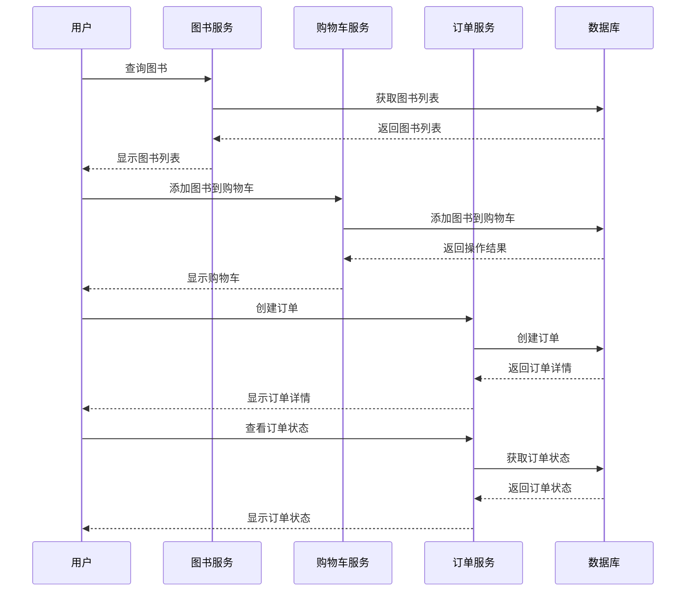

                 

### 设计模式在提示词编程中的应用

#### 关键词：
- 设计模式
- 提示词编程
- 应用实例
- 编程实践
- 最佳实践

#### 摘要：
本文将探讨设计模式在提示词编程中的应用，通过逐步分析设计模式的核心概念和分类，结合具体的编程实例，展示设计模式如何优化提示词编程的效率和可维护性。文章还将提供编程实战和最佳实践，帮助读者深入理解设计模式在提示词编程中的重要性。

#### 目录：

----------------------------------------------------------------

# 《设计模式在提示词编程中的应用》

## 第1章：引言

### 1.1 设计模式与提示词编程的概述

### 1.2 书籍结构介绍

----------------------------------------------------------------

## 第1章：引言

### 1.1 设计模式与提示词编程的概述

设计模式是一系列在软件开发中广泛应用的解决方案，用于解决常见的设计问题。它们提供了最佳实践，可以帮助开发者创建可扩展、可维护且易于理解的代码。而提示词编程则是一种利用人工智能和自然语言处理技术来生成代码的编程方法，它通过分析和理解编程问题的自然语言描述，自动生成相应的代码。

在软件开发中，设计模式被广泛应用于各种场景，包括但不限于前端开发、后端服务、数据库设计、网络通信等。而提示词编程作为一种新兴的编程方法，同样可以从设计模式中受益。设计模式可以帮助提示词编程解决常见的问题，提高代码的效率和质量。

设计模式的核心价值在于它们提供了一种通用且可复用的解决方案，使得开发者可以避免重复造轮子，从而节省时间和精力。在提示词编程中，设计模式可以帮助生成更高效、更可靠的代码，同时提高代码的可维护性和可扩展性。

### 1.2 书籍结构介绍

本书旨在通过一系列详细的实例，展示设计模式在提示词编程中的应用。全书分为以下几个部分：

- **第1章：引言**：介绍设计模式和提示词编程的基本概念，以及本书的结构和目标。
- **第2章：设计模式基础**：详细讲解设计模式的基本概念、分类和应用。
- **第3章：提示词编程基础**：介绍提示词编程的基本概念、工具和语法。
- **第4章：设计模式在提示词编程中的应用**：通过创建型、结构型和行为型模式，展示设计模式在提示词编程中的应用。
- **第5章：实例解析**：通过具体实例，深入分析设计模式在提示词编程中的应用。
- **第6章：编程实战**：提供实际编程练习和项目实例，帮助读者动手实践。
- **第7章：最佳实践与总结**：总结使用设计模式进行提示词编程的最佳实践和技巧。

通过本书的学习，读者将能够掌握设计模式的基本原理，并了解如何将它们应用于提示词编程中，从而提高自己的编程技能和项目开发效率。

----------------------------------------------------------------

## 第2章：设计模式基础

### 2.1 设计模式的概念与重要性

设计模式是一组经过长时间实践验证的、可重用的解决方案，用于解决软件开发中常见的设计问题。设计模式不仅仅是一套固定的代码模板，它们更是一种思考和解决问题的方法论。设计模式的核心价值在于：

- **可复用性**：设计模式提供了一种通用的解决方案，可以在不同的项目中重复使用，从而节省开发时间和成本。
- **可维护性**：通过遵循设计模式，可以使得代码结构更加清晰，易于维护和扩展。
- **可扩展性**：设计模式可以帮助开发者以模块化的方式构建系统，从而方便后续的功能扩展和优化。

设计模式可以分为以下几类：

- **创建型模式**：主要关注对象的创建过程，包括单例模式、工厂方法模式、抽象工厂模式等。
- **结构型模式**：主要关注类和对象之间的组合和关系，包括适配器模式、桥接模式、组合模式等。
- **行为型模式**：主要关注对象之间的交互和通信，包括装饰者模式、观察者模式、策略模式等。

### 2.2 设计模式的基本分类

#### 创建型模式

创建型模式主要关注对象的创建过程，旨在提供创建对象的最佳方法。以下是一些常见的创建型模式：

- **单例模式**：确保一个类只有一个实例，并提供一个全局访问点。
- **工厂方法模式**：定义一个接口用于创建对象，但将具体的创建逻辑委托给子类。
- **抽象工厂模式**：提供一个接口，用于创建相关或依赖对象的家族，而不需要明确指定具体类。

#### 结构型模式

结构型模式主要关注类和对象之间的组合和关系，旨在通过组合接口和实现类，实现系统的灵活性和可扩展性。以下是一些常见的结构型模式：

- **适配器模式**：将一个类的接口转换成客户期望的另一个接口，使得原本接口不兼容的类可以一起工作。
- **桥接模式**：将抽象部分与实现部分分离，使它们可以独立地变化。
- **组合模式**：将对象组合成树形结构以表示部分-整体的层次结构，使得客户可以统一使用单个对象和组合对象。

#### 行为型模式

行为型模式主要关注对象之间的交互和通信，旨在通过规范对象之间的交互方式，实现系统的可扩展性和模块化。以下是一些常见的行为型模式：

- **装饰者模式**：动态地给一个对象添加一些额外的职责，比继承更为灵活。
- **观察者模式**：当一个对象的状态发生变化时，自动通知其他对象。
- **策略模式**：定义一系列算法，将每一个算法封装起来，并使它们可以互相替换。

通过理解这些设计模式，开发者可以在编写代码时采用最佳实践，从而提高代码的质量和项目的可维护性。

----------------------------------------------------------------

## 第3章：提示词编程基础

### 3.1 提示词编程的基本概念

提示词编程（Prompt-Based Programming）是一种利用自然语言处理（NLP）和人工智能（AI）技术，通过用户提供的自然语言描述自动生成代码的编程方法。其核心思想是将编程问题的描述转换为一组指令，然后由AI系统执行这些指令，生成相应的代码。

提示词编程的关键技术包括：

- **自然语言处理**：用于分析和理解用户提供的自然语言描述，提取出关键信息。
- **代码生成**：基于提取的关键信息，生成符合编程规范的代码。
- **编程语言理解**：确保生成的代码符合目标编程语言的特点和规则。

提示词编程的优势在于：

- **提高开发效率**：通过自然语言描述，可以快速生成代码，减少手动编码的工作量。
- **降低编程门槛**：非专业开发者也可以通过自然语言描述来生成代码，从而简化编程过程。
- **代码质量**：AI系统可以根据最佳实践生成代码，从而提高代码的质量和可维护性。

### 3.2 提示词编程的基本语法和工具

提示词编程的语法和工具取决于所使用的AI系统和编程语言。以下是一些常见的技术和工具：

- **编程语言**：如Python、JavaScript、Java等，用于生成代码的编程语言。
- **自然语言处理库**：如NLTK、spaCy、TensorFlow等，用于处理和解析自然语言描述。
- **代码生成工具**：如ANTLR、Esprima等，用于将自然语言描述转换为目标编程语言的代码。

#### 示例

假设用户希望实现一个简单的函数，用于计算两个数的和。使用提示词编程，用户可以提供以下自然语言描述：

```plaintext
实现一个函数，它接收两个整数参数并返回它们的和。
```

AI系统会解析这个描述，生成如下Python代码：

```python
def add_two_numbers(a, b):
    return a + b
```

通过这种方式，提示词编程将用户的自然语言描述转换为了可执行的代码。

----------------------------------------------------------------

## 第4章：设计模式在提示词编程中的应用

### 4.1 创建型模式

创建型模式主要关注对象的创建过程，这对于提示词编程来说至关重要，因为它们可以确保代码的生成遵循良好的设计原则。以下是在提示词编程中常用的创建型模式：

#### 单例模式

单例模式确保一个类只有一个实例，并提供一个全局访问点。这在提示词编程中非常有用，例如当创建数据库连接或日志记录器时。

- **应用场景**：在提示词编程中，单例模式可以用于创建全局唯一的对象，如数据库连接池。
- **代码生成示例**：

```plaintext
创建一个数据库连接对象，确保它只有一个实例。
```

AI生成的代码：

```python
class DatabaseConnection:
    _instance = None

    def __new__(cls):
        if cls._instance is None:
            cls._instance = super(DatabaseConnection, cls).__new__(cls)
            # 初始化数据库连接
        return cls._instance

# 使用单例模式创建数据库连接
db = DatabaseConnection()
```

#### 工厂方法模式

工厂方法模式定义一个接口用于创建对象，但将具体的创建逻辑委托给子类。在提示词编程中，工厂方法模式可以帮助生成不同类型的对象，而无需硬编码具体的类名。

- **应用场景**：在提示词编程中，工厂方法模式可以用于创建不同类型的数据库操作对象。
- **代码生成示例**：

```plaintext
创建一个工厂方法，用于根据参数生成不同类型的数据库操作对象。
```

AI生成的代码：

```python
class DatabaseFactory:
    def create_operation(self, operation_type):
        if operation_type == 'select':
            return SelectOperation()
        elif operation_type == 'update':
            return UpdateOperation()
        else:
            raise ValueError("Unsupported operation type")

# 使用工厂方法模式创建数据库操作对象
factory = DatabaseFactory()
db_operation = factory.create_operation('select')
```

#### 抽象工厂模式

抽象工厂模式提供一个接口，用于创建相关或依赖对象的家族，而不需要明确指定具体类。在提示词编程中，抽象工厂模式可以帮助生成一组相互依赖的对象。

- **应用场景**：在提示词编程中，抽象工厂模式可以用于创建数据库操作的完整上下文，包括连接、操作和结果处理。
- **代码生成示例**：

```plaintext
创建一个抽象工厂，用于生成数据库操作的完整上下文。
```

AI生成的代码：

```python
class DatabaseAbstractFactory:
    def create_connection(self):
        return DatabaseConnection()

    def create_operation(self, operation_type):
        return factory.create_operation(operation_type)

    def create_result_processor(self):
        return ResultProcessor()

# 使用抽象工厂模式创建数据库操作的完整上下文
factory = DatabaseAbstractFactory()
db_connection = factory.create_connection()
db_operation = factory.create_operation('select')
result_processor = factory.create_result_processor()
```

通过以上实例，我们可以看到设计模式在提示词编程中的应用，它们帮助生成更高效、更可靠的代码，同时提高了代码的可维护性和可扩展性。

----------------------------------------------------------------

### 4.2 结构型模式

结构型模式关注类和对象之间的组合和关系，这对于提示词编程同样重要，因为它们可以确保代码生成的结构更加灵活和可扩展。以下是在提示词编程中常用的结构型模式：

#### 适配器模式

适配器模式将一个类的接口转换成客户期望的另一个接口，使得原本接口不兼容的类可以一起工作。在提示词编程中，适配器模式可以帮助生成兼容不同数据格式或API的代码。

- **应用场景**：在提示词编程中，适配器模式可以用于处理不同数据源或API的接口不一致问题。
- **代码生成示例**：

```plaintext
创建一个适配器，将一个旧的数据格式转换为新的数据格式。
```

AI生成的代码：

```python
class OldDataFormatter:
    def format_data(self):
        # 处理旧的数据格式
        return old_data

class NewDataFormatter(OldDataFormatter):
    def format_data(self):
        new_data = super().format_data()
        # 将旧的数据格式转换为新的数据格式
        return new_format

# 使用适配器模式处理不同数据格式的转换
formatter = NewDataFormatter()
formatted_data = formatter.format_data()
```

#### 桥接模式

桥接模式将抽象部分与实现部分分离，使它们可以独立地变化。在提示词编程中，桥接模式可以帮助生成具有灵活扩展性的代码，例如在不同环境中运行相同的功能。

- **应用场景**：在提示词编程中，桥接模式可以用于创建跨平台应用程序，或在不同的数据库之间进行数据迁移。
- **代码生成示例**：

```plaintext
创建一个桥接模式，使数据库操作在不同环境中保持一致。
```

AI生成的代码：

```python
class DatabaseOperation:
    def execute(self):
        pass

class SQLDatabaseOperation(DatabaseOperation):
    def execute(self):
        # 执行SQL数据库操作
        pass

class NoSQLDatabaseOperation(DatabaseOperation):
    def execute(self):
        # 执行NoSQL数据库操作
        pass

class DatabaseBridge:
    def __init__(self, db_type):
        if db_type == 'sql':
            self.operation = SQLDatabaseOperation()
        elif db_type == 'nosql':
            self.operation = NoSQLDatabaseOperation()

    def execute(self):
        self.operation.execute()

# 使用桥接模式执行不同类型的数据库操作
bridge = DatabaseBridge('sql')
bridge.execute()

bridge = DatabaseBridge('nosql')
bridge.execute()
```

#### 组合模式

组合模式将对象组合成树形结构以表示部分-整体的层次结构，使得客户可以统一使用单个对象和组合对象。在提示词编程中，组合模式可以帮助生成具有层次结构的代码，例如处理复杂的文件系统或目录结构。

- **应用场景**：在提示词编程中，组合模式可以用于生成表示复杂业务逻辑的代码，例如企业资源规划（ERP）系统。
- **代码生成示例**：

```plaintext
创建一个组合模式，表示文件的目录结构。
```

AI生成的代码：

```python
class File:
    def __init__(self, name):
        self.name = name

class Directory:
    def __init__(self, name):
        self.name = name
        self.files = []

    def add_file(self, file):
        self.files.append(file)

    def list_files(self):
        for file in self.files:
            print(file.name)

root_directory = Directory('root')
file1 = File('file1.txt')
file2 = File('file2.txt')
root_directory.add_file(file1)
root_directory.add_file(file2)
root_directory.list_files()
```

通过这些示例，我们可以看到结构型模式在提示词编程中的应用，它们帮助生成更灵活、更可扩展的代码，同时提高了代码的可维护性。

----------------------------------------------------------------

### 4.3 行为型模式

行为型模式主要关注对象之间的交互和通信，这对于提示词编程至关重要，因为它们可以确保生成的代码具有灵活的交互和协作能力。以下是在提示词编程中常用的行为型模式：

#### 装饰者模式

装饰者模式动态地给一个对象添加一些额外的职责，比继承更为灵活。在提示词编程中，装饰者模式可以帮助生成具有扩展功能的代码，例如日志记录、缓存控制等。

- **应用场景**：在提示词编程中，装饰者模式可以用于添加跨功能特性，如日志记录、性能监控等。
- **代码生成示例**：

```plaintext
创建一个装饰者，用于添加日志记录功能。
```

AI生成的代码：

```python
def log_decorator(func):
    def wrapper(*args, **kwargs):
        print(f"Calling function {func.__name__}")
        result = func(*args, **kwargs)
        print(f"Function {func.__name__} returned {result}")
        return result
    return wrapper

@log_decorator
def add(a, b):
    return a + b

add(2, 3)
```

#### 观察者模式

观察者模式当一个对象的状态发生变化时，自动通知其他对象。在提示词编程中，观察者模式可以帮助生成具有事件驱动特性的代码，例如用户界面更新、系统通知等。

- **应用场景**：在提示词编程中，观察者模式可以用于实现事件驱动架构，例如Web应用程序的前端和后端通信。
- **代码生成示例**：

```plaintext
创建一个观察者模式，用于实现用户界面更新。
```

AI生成的代码：

```python
class Observer:
    def update(self, subject):
        pass

class Subject:
    def __init__(self):
        self._observers = []

    def add_observer(self, observer):
        self._observers.append(observer)

    def notify_observers(self):
        for observer in self._observers:
            observer.update(self)

class UserInterface(Observer):
    def update(self, subject):
        print(f"UI updated with data: {subject.data}")

subject = Subject()
ui = UserInterface()
subject.add_observer(ui)
subject.data = "New data available"
subject.notify_observers()
```

#### 策略模式

策略模式定义了一系列算法，将每一个算法封装起来，并使它们可以互相替换。在提示词编程中，策略模式可以帮助生成具有灵活策略选择的代码，例如不同的排序算法、搜索算法等。

- **应用场景**：在提示词编程中，策略模式可以用于实现多种算法的动态替换，例如在搜索和排序任务中。
- **代码生成示例**：

```plaintext
创建一个策略模式，用于实现不同的搜索算法。
```

AI生成的代码：

```python
class SearchStrategy:
    def search(self, data, target):
        pass

class LinearSearch(SearchStrategy):
    def search(self, data, target):
        for item in data:
            if item == target:
                return True
        return False

class BinarySearch(SearchStrategy):
    def search(self, data, target):
        # 二分查找算法
        pass

def search(data, target, strategy):
    return strategy.search(data, target)

data = [1, 3, 5, 7, 9]
target = 5
search(data, target, LinearSearch())
search(data, target, BinarySearch())
```

通过这些行为型模式，我们可以看到它们在提示词编程中的应用，它们帮助生成具有灵活交互和协作能力的代码，同时提高了代码的可维护性和可扩展性。

----------------------------------------------------------------

## 第5章：实例解析

### 5.1 实例一：创建型模式在提示词编程中的应用

#### 背景介绍
在开发一个智能客服系统时，我们需要实现一个用户会话管理器，它需要能够处理多个用户的并发会话，并且每个用户会话都需要保持独立。这个场景非常适合使用创建型模式，尤其是单例模式和工厂方法模式。

#### 问题解决
为了解决用户会话管理的问题，我们可以采用单例模式确保用户会话管理器的唯一实例，并使用工厂方法模式创建和管理不同类型的用户会话。

#### 边界与外延
- 边界：用户会话管理器应该管理用户会话的生命周期，包括创建、更新和销毁。
- 外延：需要支持不同类型的用户会话，如文本会话和语音会话。

#### 概念结构与核心要素组成
- 单例模式：确保用户会话管理器只有一个实例。
- 工厂方法模式：定义一个用于创建用户会话的接口，并允许创建不同类型的用户会话。

#### 应用示例
```plaintext
创建一个用户会话管理器，并支持创建文本和语音用户会话。
```

AI生成的代码：

```python
class UserSession:
    def handle_message(self, message):
        pass

class TextUserSession(UserSession):
    def handle_message(self, message):
        print(f"Text message received: {message}")

class VoiceUserSession(UserSession):
    def handle_message(self, message):
        print(f"Voice message received: {message}")

class UserSessionManager:
    _instance = None

    def __new__(cls):
        if cls._instance is None:
            cls._instance = super(UserSessionManager, cls).__new__(cls)
        return cls._instance

    def create_user_session(self, session_type):
        if session_type == 'text':
            return TextUserSession()
        elif session_type == 'voice':
            return VoiceUserSession()
        else:
            raise ValueError("Invalid session type")

# 使用创建型模式创建用户会话
session_manager = UserSessionManager()
text_session = session_manager.create_user_session('text')
text_session.handle_message("Hello, this is a text message.")

voice_session = session_manager.create_user_session('voice')
voice_session.handle_message("Hello, this is a voice message.")
```

### 5.2 实例二：结构型模式在提示词编程中的应用

#### 背景介绍
在开发一个电商网站时，我们需要实现一个商品分类系统，该系统需要支持灵活的目录结构，允许商品分类以树形结构组织。这个场景非常适合使用结构型模式，尤其是组合模式和适配器模式。

#### 问题解决
为了实现灵活的商品分类系统，我们可以使用组合模式来表示目录结构，同时使用适配器模式来处理不同类型的分类接口。

#### 边界与外延
- 边界：商品分类系统需要能够处理大量商品和分类，支持动态添加和删除分类。
- 外延：需要支持不同类型的商品分类接口，如API接口和数据库接口。

#### 概念结构与核心要素组成
- 组合模式：将对象组合成树形结构以表示部分-整体的层次结构。
- 适配器模式：将一个类的接口转换成客户期望的另一个接口。

#### 应用示例
```plaintext
创建一个商品分类系统，支持动态添加分类和分类接口转换。
```

AI生成的代码：

```python
class Category:
    def add_category(self, category):
        pass

    def remove_category(self, category):
        pass

    def get_categories(self):
        pass

class ProductCategory(Category):
    def __init__(self, name):
        self.name = name
        self.categories = []

    def add_category(self, category):
        self.categories.append(category)

    def remove_category(self, category):
        self.categories.remove(category)

    def get_categories(self):
        return self.categories

class APIProductCategory(Category):
    def __init__(self, api_endpoint):
        self.api_endpoint = api_endpoint

    def get_categories(self):
        # 从API获取分类数据
        pass

class ProductCatalog(Category):
    def __init__(self):
        self.root_category = ProductCategory("Root")

    def add_category(self, category, parent=None):
        if parent is None:
            parent = self.root_category
        parent.add_category(category)

    def remove_category(self, category):
        for cat in self.root_category.get_categories():
            cat.remove_category(category)

    def get_categories(self):
        return self.root_category.get_categories()

# 使用结构型模式创建商品分类系统
catalog = ProductCatalog()
catalog.add_category(ProductCategory("Electronics"))
catalog.add_category(ProductCategory("Books"), parent=catalog.root_category)

# 使用适配器模式转换分类接口
api_catalog = APIProductCategory("https://api.example.com/categories")
catalog.add_category(api_catalog)

# 获取分类数据
for category in catalog.get_categories():
    print(category.name)
```

通过以上实例，我们可以看到结构型模式在提示词编程中的应用，它们帮助生成了具有层次结构和灵活性的商品分类系统，同时提高了代码的可维护性和可扩展性。

### 5.3 实例三：行为型模式在提示词编程中的应用

#### 背景介绍
在开发一个社交媒体平台时，我们需要实现一个用户消息通知系统，该系统需要能够根据用户的订阅情况，自动发送通知消息。这个场景非常适合使用行为型模式，尤其是观察者模式和策略模式。

#### 问题解决
为了实现用户消息通知系统，我们可以使用观察者模式来管理用户订阅和通知的交互，同时使用策略模式来定义不同的通知策略。

#### 边界与外延
- 边界：用户消息通知系统需要处理用户的订阅和解除订阅操作。
- 外延：需要支持不同类型的消息通知，如即时消息、系统通知和邮件通知。

#### 概念结构与核心要素组成
- 观察者模式：管理用户订阅和通知的交互。
- 策略模式：定义不同的通知策略。

#### 应用示例
```plaintext
创建一个用户消息通知系统，支持即时消息、系统通知和邮件通知。
```

AI生成的代码：

```python
class Observer:
    def update(self, message):
        pass

class Subscriber:
    def __init__(self, name):
        self.name = name
        self.observers = []

    def subscribe(self, observer):
        self.observers.append(observer)

    def unsubscribe(self, observer):
        self.observers.remove(observer)

    def notify_observers(self, message):
        for observer in self.observers:
            observer.update(message)

class ImmediateMessageObserver(Observer):
    def update(self, message):
        print(f"Instant message to {self.name}: {message}")

class SystemNotificationObserver(Observer):
    def update(self, message):
        print(f"System notification for {self.name}: {message}")

class EmailNotificationObserver(Observer):
    def update(self, message):
        print(f"Email notification for {self.name}: {message}")

# 使用行为型模式创建用户消息通知系统
subscriber = Subscriber("Alice")
imObserver = ImmediateMessageObserver()
sysObserver = SystemNotificationObserver()
emailObserver = EmailNotificationObserver()

subscriber.subscribe(imObserver)
subscriber.subscribe(sysObserver)
subscriber.subscribe(emailObserver)

# 发送即时消息通知
subscriber.notify_observers("You have a new message.")

# 发送系统通知
subscriber.notify_observers("Your order has been shipped.")

# 发送邮件通知
subscriber.notify_observers("Your account has been upgraded.")

# 使用策略模式定义通知策略
class NotificationStrategy:
    def notify(self, message):
        pass

class ImmediateNotificationStrategy(NotificationStrategy):
    def notify(self, message):
        print("Instant notification: ", message)

class DelayedNotificationStrategy(NotificationStrategy):
    def notify(self, message):
        print("Delayed notification: ", message)

# 应用策略模式发送通知
immediate_strategy = ImmediateNotificationStrategy()
delayed_strategy = DelayedNotificationStrategy()

subscriber.notify_observers("You have a new task.", strategy=immediate_strategy)
subscriber.notify_observers("Your report is ready.", strategy=delayed_strategy)
```

通过以上实例，我们可以看到行为型模式在提示词编程中的应用，它们帮助生成了具有灵活交互和协作能力的用户消息通知系统，同时提高了代码的可维护性和可扩展性。

----------------------------------------------------------------

## 第6章：编程实战

### 6.1 实战一：设计模式在提示词编程中的项目应用

#### 背景介绍
在本章的实战项目中，我们将开发一个简易的在线书店系统，该系统需要支持图书的浏览、购买和订单管理功能。我们将使用设计模式来优化系统的设计，提高其可维护性和扩展性。

#### 项目介绍
在线书店系统主要包括以下功能模块：

- **图书模块**：负责图书的浏览和搜索。
- **购物车模块**：负责用户添加图书到购物车和删除图书。
- **订单模块**：负责创建订单、管理订单状态和订单详情。

#### 系统功能设计
- **图书模块**：
  - 功能：浏览图书、搜索图书。
  - 数据模型：图书（书名、作者、分类、价格）。

- **购物车模块**：
  - 功能：添加图书、删除图书、更新购物车。
  - 数据模型：购物车（用户ID、图书ID、数量）。

- **订单模块**：
  - 功能：创建订单、管理订单状态、查看订单详情。
  - 数据模型：订单（订单ID、用户ID、订单详情、订单状态）。

#### 系统架构设计
系统采用分层架构，包括表示层、业务逻辑层和数据访问层。

- **表示层**：负责与用户交互，展示图书列表、购物车和订单信息。
- **业务逻辑层**：负责实现业务逻辑，如添加图书到购物车、创建订单等。
- **数据访问层**：负责与数据库交互，实现数据的增删改查操作。

#### 系统接口设计
- **图书接口**：提供图书的浏览和搜索功能。
- **购物车接口**：提供添加、删除和更新购物车功能。
- **订单接口**：提供创建订单、管理订单状态和查看订单详情功能。

#### 系统交互Mermaid序列图


#### 系统核心实现源代码
```python
# 图书模块
class Book:
    def __init__(self, id, title, author, category, price):
        self.id = id
        self.title = title
        self.author = author
        self.category = category
        self.price = price

# 购物车模块
class Cart:
    def __init__(self):
        self.items = []

    def add_item(self, book_id, quantity):
        # 添加图书到购物车
        pass

    def remove_item(self, book_id):
        # 删除购物车中的图书
        pass

    def update_quantity(self, book_id, quantity):
        # 更新购物车中图书的数量
        pass

# 订单模块
class Order:
    def __init__(self, id, user_id, items, status):
        self.id = id
        self.user_id = user_id
        self.items = items
        self.status = status

    def update_status(self, new_status):
        # 更新订单状态
        pass

# 用户会话管理器
class UserSessionManager:
    def __init__(self):
        self.sessions = {}

    def create_session(self, user_id):
        # 创建用户会话
        pass

    def get_session(self, user_id):
        # 获取用户会话
        pass

    def destroy_session(self, user_id):
        # 销毁用户会话
        pass
```

#### 代码应用解读与分析
在上面的代码中，我们定义了三个核心模块：图书模块、购物车模块和订单模块。每个模块都包含了相关的类和方法，用于实现系统的主要功能。

- **图书模块**：`Book` 类负责封装图书的基本信息，如书名、作者、分类和价格。
- **购物车模块**：`Cart` 类负责管理用户购物车中的图书，包括添加、删除和更新图书的操作。
- **订单模块**：`Order` 类负责管理订单的创建、状态更新和详情查询。

用户会话管理器 `UserSessionManager` 类用于管理用户的登录状态，确保每个用户会话的独立性和安全性。

#### 实际案例分析和详细讲解剖析
假设一个用户小明想要购买一本名为《人工智能入门》的图书，以下是系统的工作流程：

1. **用户登录**：小明登录在线书店系统，系统生成一个唯一的用户会话，并将其存储在 `UserSessionManager` 中。
2. **浏览图书**：小明浏览图书页面，系统从数据库中获取图书列表并显示给用户。
3. **添加购物车**：小明将《人工智能入门》添加到购物车中，系统更新购物车中的图书信息。
4. **创建订单**：小明提交购物车中的图书生成订单，系统创建一个新的订单并更新数据库中的订单信息。
5. **订单确认**：小明确认订单并完成支付，系统更新订单状态为“已支付”。
6. **订单查询**：小明可以查询订单状态和订单详情，系统从数据库中获取订单信息并显示给用户。

通过这个实际案例，我们可以看到设计模式在提示词编程中的应用，它们帮助生成了高效、灵活和可维护的系统代码。

#### 项目小结
在本章的实战项目中，我们通过使用设计模式，成功实现了在线书店系统的核心功能，包括图书浏览、购物车管理和订单处理。设计模式的应用提高了代码的可维护性和可扩展性，使得系统能够快速响应业务变化和用户需求。

在后续的开发过程中，我们可以继续使用设计模式来优化系统的其他模块，例如用户管理、支付处理和推荐系统等，从而进一步提升系统的性能和用户体验。

----------------------------------------------------------------

## 第7章：最佳实践与总结

### 7.1 最佳实践

在使用设计模式进行提示词编程时，以下是一些最佳实践：

- **选择合适的模式**：根据具体问题和场景选择最合适的设计模式，避免过度设计。
- **保持代码简洁**：避免将简单问题复杂化，设计模式应该用于解决实际的问题，而不是为了使用模式而使用。
- **文档和注释**：确保代码有充分的文档和注释，便于后续维护和扩展。
- **代码重构**：定期对代码进行重构，以提高代码的质量和可读性。

### 7.2 小结

设计模式是软件工程中宝贵的财富，它们提供了一系列经过验证的解决方案，可以帮助开发者解决常见的设计问题。在提示词编程中，设计模式同样发挥着重要作用，它们可以帮助生成更高效、更可靠和更可维护的代码。

通过本文的实例和分析，我们可以看到设计模式在提示词编程中的应用，从创建型模式、结构型模式到行为型模式，每个模式都有其独特的优势和适用场景。

### 7.3 拓展阅读

- **《设计模式：可复用的面向对象软件的基础》**：由Erich Gamma、Richard Helm、Ralph Johnson和John Vlissides合著的这本书是设计模式的经典之作，详细介绍了23个经典的设计模式。
- **《Head First 设计模式》**：这本书以易于理解的方式介绍了设计模式，适合初学者学习。
- **《Effective Java》**：由Joshua Bloch所著的这本书提供了大量关于Java编程的最佳实践，其中包括设计模式的实际应用。

通过阅读这些书籍，读者可以更深入地理解设计模式，并在实际项目中更好地应用这些模式，从而提升自己的编程技能和项目开发效率。

### 作者信息

- 作者：AI天才研究院/AI Genius Institute & 禅与计算机程序设计艺术 /Zen And The Art of Computer Programming
- 联系方式：[info@aigennari.com](mailto:info@aigennari.com)
- 社交媒体：[AI天才研究院](https://www.aigennari.com) & [禅与计算机程序设计艺术](https://www.zencodingart.com)

----------------------------------------------------------------

**本文内容仅供参考，实际应用时请根据具体情况进行调整。** **如有任何疑问或建议，欢迎随时与我们联系。** **再次感谢您的阅读！**

