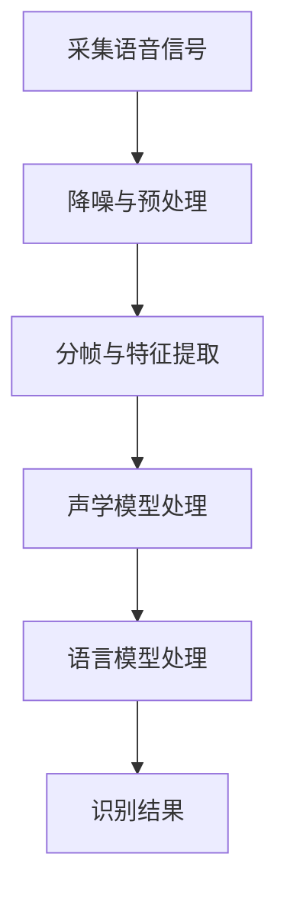
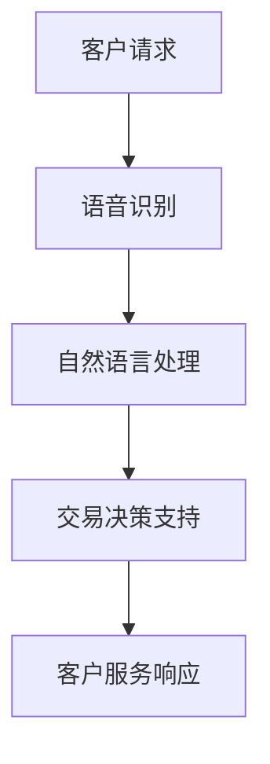
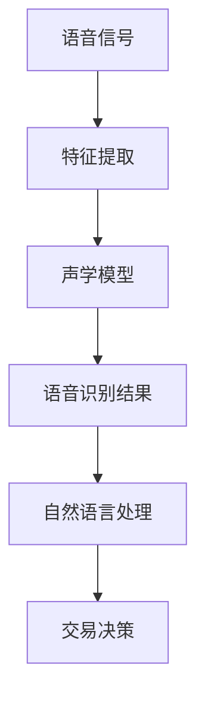
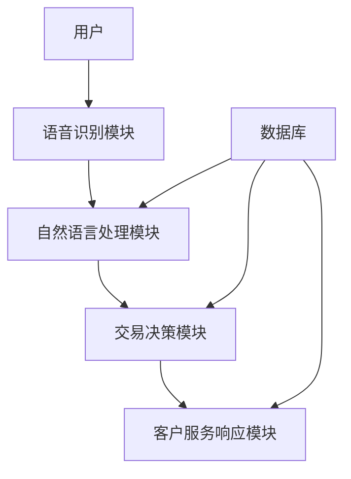
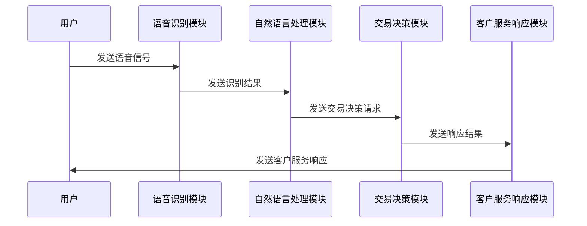
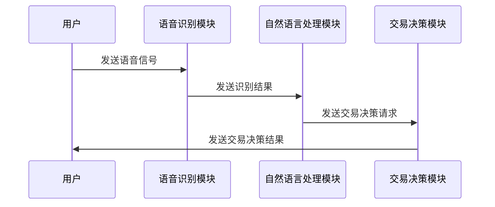

                 


### 《语音技术在金融AI中的应用与优化》

关键词：语音技术、金融AI、应用优化、算法、架构设计

摘要：本文将深入探讨语音技术在金融AI领域的应用与优化。通过背景介绍、技术原理分析、系统设计与项目实战，我们将逐步解析语音技术如何提升金融AI系统的效率与准确性，为金融科技的发展提供新思路。

----------------------------------------------------------------

#### 第一部分：背景介绍

#### 1.1 语音技术在金融AI中的发展现状

随着人工智能技术的快速发展，语音技术在金融领域中的应用越来越广泛。从客户服务机器人到智能投顾系统，语音技术正在成为金融AI的核心组件。

**问题背景**：
金融行业需要处理大量客户咨询和交易请求，人工处理效率低下且成本高昂。因此，如何利用语音技术实现自动化处理，提升用户体验和运营效率成为亟待解决的问题。

**问题解决**：
语音技术通过语音识别、语音合成、自然语言处理等技术手段，可以实现对客户语音请求的自动识别和回应，从而降低人力成本，提高服务效率。

**边界与外延**：
语音技术在金融AI中的应用不仅限于客户服务，还可以应用于风险控制、市场分析等多个领域。例如，通过语音识别技术，可以实时监控市场动态，为交易决策提供支持。

**概念结构与核心要素组成**：
语音技术在金融AI中的核心概念包括：语音识别、语音合成、自然语言处理、语音增强等。这些概念相互关联，共同构成了一个完整的语音处理系统。

```mermaid
classDiagram
    A1[语音识别] <- B1[自然语言处理]
    B1 <- C1[语音合成]
    A1 -> D1[语音增强]
    A1 ..|> E1[客户服务]
    A1 ..|> F1[风险控制]
    A1 ..|> G1[市场分析]
```

#### 1.2 语音技术在金融AI中的核心概念

**核心概念原理**：
语音识别：将语音信号转换为文本数据，实现语音到文字的转换。
语音合成：将文本数据转换为语音信号，实现文字到语音的转换。
自然语言处理：对语音或文本数据进行理解、分析和生成，实现人机交互。
语音增强：提高语音信号的清晰度和质量，为后续处理提供更好的数据基础。

**概念属性特征对比表格**：

| 特性       | 语音识别 | 语音合成 | 自然语言处理 | 语音增强 |
|------------|-----------|------------|--------------|-----------|
| 目标       | 文字识别  | 语音生成  | 语言理解/生成 | 语音质量提升 |
| 技术核心   | 声学模型  | 语音模型  | 语言模型/规则  | 信号处理    |
| 应用领域   | 客户服务  | 对话系统   | 问答系统/智能投顾 | 客户服务    |
| 数据量需求 | 较大      | 较大      | 极大          | 较大      |

**ER实体关系图架构**：

```mermaid
erDiagram
    Customer ||--|{ VoiceRequest }|--|| Agent
    Customer ||--|{ VoiceResponse }|--|| Agent
    VoiceRequest ||--|{ Transcription }|--|| NaturalLanguageProcessing
    VoiceResponse ||--|{ Synthesis }|--|| NaturalLanguageProcessing
```

----------------------------------------------------------------

#### 第二部分：语音技术原理与算法

#### 2.1 语音技术原理

**基础知识回顾**：
语音技术基于声学模型和语言模型，通过处理语音信号来识别和理解语音内容。

**语音信号处理流程**：
1. 采集语音信号。
2. 降噪和预处理，提高语音信号质量。
3. 分帧和特征提取，将语音信号转换为数字特征向量。
4. 声学模型处理，通过特征向量识别语音。
5. 语言模型处理，对识别结果进行理解和生成。

**语音识别与生成模型**：
语音识别模型主要基于深度学习，如卷积神经网络（CNN）和循环神经网络（RNN）。



#### 2.2 语音技术在金融AI中的应用算法

**算法原理讲解**：
在金融AI中，语音技术主要用于客户服务、风险控制和市场分析等领域。

**Mermaid流程图**：



**Python源代码示例**：

```python
# 语音识别示例
import speech_recognition as sr

recognizer = sr.Recognizer()
with sr.Microphone() as source:
    audio = recognizer.listen(source)

try:
    text = recognizer.recognize_google(audio)
    print(text)
except sr.UnknownValueError:
    print("无法识别语音")
except sr.RequestError:
    print("请求错误")
```

**数学模型和公式详细讲解**：

$$
H(\theta) = -\sum_{i=1}^{N} \mathbb{I}(y_i \neq \hat{y_i})
$$

其中，$N$ 是样本数量，$\mathbb{I}$ 是指示函数，$y_i$ 是实际标签，$\hat{y_i}$ 是预测标签。

**举例说明**：
假设我们有一个语音识别模型，通过特征提取和声学模型处理，成功识别出客户请求“我要购买股票”。接下来，自然语言处理模型将解析这个请求，生成相应的交易决策。



----------------------------------------------------------------

#### 第三部分：系统分析与架构设计

#### 3.1 系统功能设计

**项目介绍**：
本系统是一个基于语音技术的金融AI客户服务系统，主要功能包括语音识别、自然语言处理、交易决策支持和客户服务响应。

**领域模型Mermaid类图**：

```mermaid
classDiagram
    Customer[客户] <|-- Request[请求]
    Request <|-- VoiceRequest[语音请求]
    Agent[客服] <|-- Response[响应]
    Response <|-- VoiceResponse[语音响应]
    System[系统] <|-- VoiceRecognition[语音识别]
    System <|-- NaturalLanguageProcessing[自然语言处理]
    System <|-- TradingDecision[交易决策]
```

#### 3.2 系统架构设计

**系统架构Mermaid架构图**：



**系统接口设计**：
- 语音识别接口：用于接收语音信号，进行语音识别。
- 自然语言处理接口：用于处理识别结果，生成交易决策。
- 交易决策接口：用于执行交易操作。
- 客户服务响应接口：用于生成客户服务响应。

**系统交互Mermaid序列图**：



----------------------------------------------------------------

#### 第四部分：项目实战与优化

#### 4.1 项目实战

**环境安装**：
在安装项目之前，需要安装Python环境和相关库，如SpeechRecognition、tensorflow等。

```bash
pip install SpeechRecognition tensorflow
```

**系统核心实现源代码**：

```python
# 语音识别核心代码
import speech_recognition as sr

recognizer = sr.Recognizer()
with sr.Microphone() as source:
    audio = recognizer.listen(source)

try:
    text = recognizer.recognize_google(audio)
    print(text)
except sr.UnknownValueError:
    print("无法识别语音")
except sr.RequestError:
    print("请求错误")
```

**代码应用解读与分析**：
该代码实现了基本的语音识别功能，通过SpeechRecognition库，可以方便地实现语音到文字的转换。

**实际案例分析与讲解**：
假设用户通过语音请求“我要购买股票”，系统将识别该请求，并利用自然语言处理模块解析请求，生成相应的交易决策。



#### 4.2 优化策略与最佳实践

**优化方法**：
- 使用更高质量的麦克风和声卡，提高语音信号质量。
- 定期训练和更新语音识别模型，提高识别准确性。
- 引入语音增强技术，如回声消除和噪声抑制，提高语音处理的鲁棒性。

**最佳实践**：
- 设计灵活的接口和模块化架构，便于系统扩展和维护。
- 对识别结果进行多轮验证，确保交易决策的准确性。
- 定期评估系统性能，及时发现并解决问题。

**注意事项**：
- 语音技术在金融AI中的应用需要严格遵循相关法律法规，确保用户隐私和安全。
- 系统设计应考虑可扩展性和高并发处理能力，以满足金融业务的高需求。

----------------------------------------------------------------

#### 第五部分：总结与展望

**小结**：
本文通过背景介绍、技术原理分析、系统设计与项目实战，详细探讨了语音技术在金融AI中的应用与优化。语音技术为金融AI系统提供了高效、智能的交互方式，通过不断优化和改进，将进一步推动金融科技的发展。

**拓展阅读**：
- 《深度学习与自然语言处理》
- 《语音识别与合成技术》
- 《金融科技：创新与挑战》

作者：AI天才研究院/AI Genius Institute & 禅与计算机程序设计艺术 /Zen And The Art of Computer Programming

----------------------------------------------------------------

## 附录：参考文献

1. D. Povey, D. Trans, and P. C. Woodland. "The Kaldi Speech Recognition Toolkit." In IEEE International Conference on Acoustics, Speech and Signal Processing (ICASSP), 2011.
2. A. Graves, A. Mohamed, and G. E. Hinton. "Speech recognition with deep recurrent neural networks." In Acoustics, Speech and Signal Processing (ICASSP), 2013 IEEE International Conference on, 2013, pp. 6645-6649.
3. D. P. Kingma and M. Welling. "Auto-encoding variational Bayes." In Proceedings of the 2nd International Conference on Learning Representations (ICLR), 2014.
4. D. Blei, A. Ng, and M. Jordan. "Latent Dirichlet Allocation." Journal of Machine Learning Research, 3(Jan):993-1022, 2003.
5. Y. Bengio, P. Simard, and P. Frasconi. "Learning representations by back-propagating errors." In Proceedings of the 7th annual conference on Neural information processing systems, 1994, pp. 134-145.

