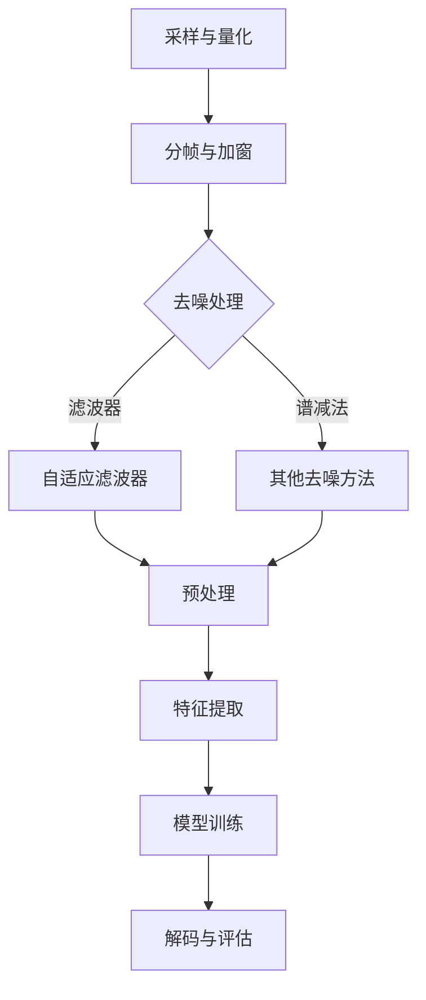
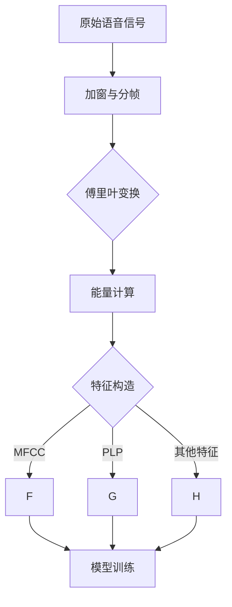
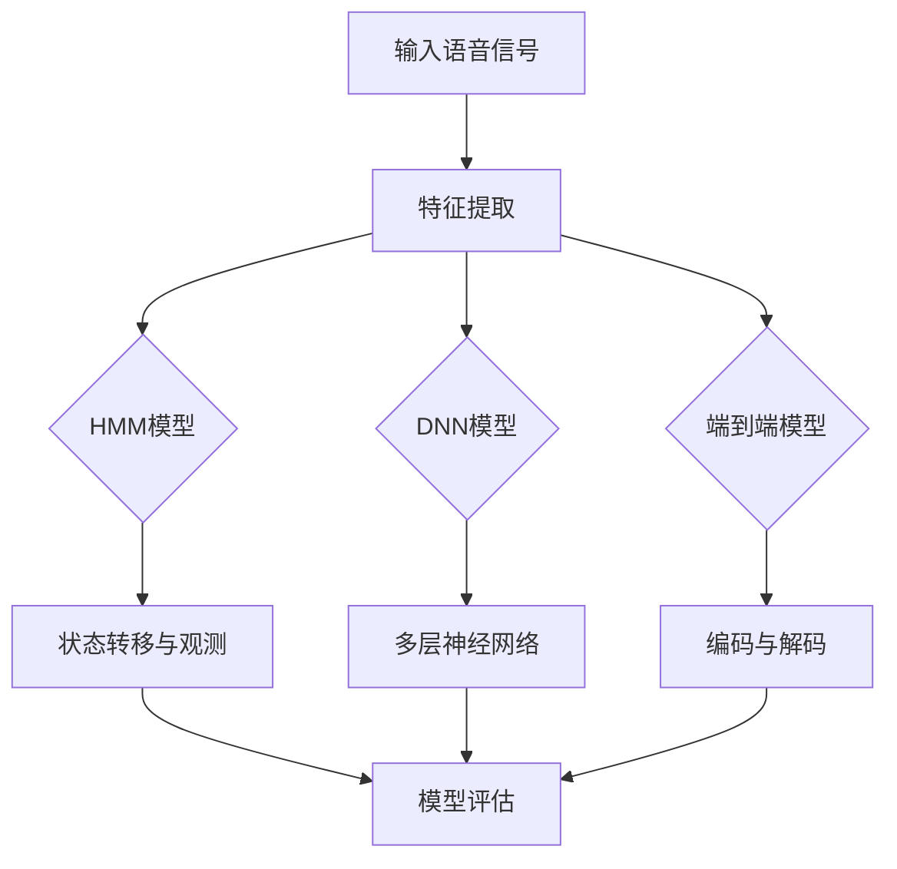
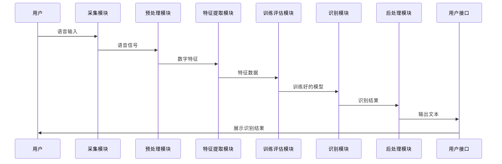

                 

### 语音识别技术基础

#### 1.1 语音识别的发展历程

语音识别技术起源于20世纪50年代，当时的科学家们开始研究如何让计算机模拟人类的听觉系统。这一阶段主要是基于规则的方法，通过编写大量的规则来识别语音。然而，这种方法在实际应用中效果不佳，因为语音具有高度的多样性和复杂性。

随着计算机性能的提升和算法的改进，20世纪80年代，隐马尔可夫模型（HMM）开始广泛应用于语音识别。HMM能够较好地模拟语音信号的概率特性，使得识别率得到了显著提高。这一时期的语音识别系统主要应用于军事和科研领域。

进入21世纪，随着深度学习技术的快速发展，深度神经网络（DNN）在语音识别中的应用逐渐成熟。DNN通过多层神经网络对大量语音数据进行训练，能够自动提取复杂的特征，并实现了更高的识别精度。2012年，AlexNet在图像识别领域的突破，为DNN在语音识别中的应用带来了新的契机。

近年来，基于端到端模型的语音识别技术逐渐成为研究热点。端到端模型能够直接将输入的语音信号映射到文本输出，避免了传统流程中多个步骤的中间转换，从而提高了系统的效率和准确性。

#### 1.2 语音识别技术核心概念

- **语音信号**：语音信号是声带振动产生的声波信号，通过麦克风等设备转换为电信号进行处理。

- **特征提取**：特征提取是将语音信号转换为数字特征的过程，常用的特征提取方法包括MFCC（梅尔频率倒谱系数）、PLP（平移长时能量）等。

- **模型训练**：模型训练是指利用大量的语音数据，通过算法训练出语音识别模型的过程。常见的训练方法包括HMM、DNN和端到端模型。

- **解码**：解码是将模型输出的概率分布转换为文本输出的过程。常见的解码算法包括动态时间弯曲（DTW）、前向-后向算法等。

- **评估**：评估是指对语音识别系统进行性能评估的过程，常用的评估指标包括词错误率（WER）和字符错误率（CER）。

#### 1.3 语音识别的应用场景

语音识别技术广泛应用于各种场景，主要包括：

- **智能手机**：智能手机中的语音助手（如Siri、Google Assistant）通过语音识别技术实现语音指令的解析和执行。

- **智能音箱**：智能音箱（如Amazon Echo、Google Home）通过语音识别技术实现用户语音的交互和响应。

- **语音助手**：语音助手（如Amazon Alexa、Microsoft Cortana）广泛应用于智能家居、企业办公等领域。

- **客服系统**：客服系统通过语音识别技术实现自动语音应答，提高客户服务效率。

- **语音翻译**：语音翻译通过语音识别技术实现不同语言之间的实时翻译。

#### 1.4 语音识别的技术挑战

虽然语音识别技术在近年来取得了显著进展，但仍面临一些技术挑战：

- **多语言识别**：多语言环境的语音识别仍然是一个挑战，特别是在语言差异较大的情况下。

- **口语化语言处理**：口语化语言（如缩写、连读、语气词等）的处理是语音识别中的一个难点。

- **噪声干扰**：噪声干扰会影响语音识别的准确性，尤其是在嘈杂环境下。

- **个性化识别**：每个人的发音都有所不同，个性化识别能够提高语音识别的准确性，但同时也增加了系统的复杂性。

在接下来的章节中，我们将深入探讨语音信号处理、特征提取、语音识别算法原理等内容，帮助读者更好地理解语音识别技术的核心要素和实现方法。通过这些基础知识的掌握，我们将为后续的提示词优化策略和音频转文字质量提升打下坚实的基础。让我们一步步来深入理解语音识别技术的本质，开启这段技术探索之旅。

#### 语音信号处理基础

语音信号处理是语音识别过程中不可或缺的一环，它旨在将原始的语音信号转换为适合后续处理的数字信号。在这一过程中，我们主要关注语音信号的特点、采样与量化以及去噪处理。

##### 2.1 语音信号的特点与处理方法

语音信号具有以下几个显著特点：

- **时变特性**：语音信号随时间变化而变化，这种变化反映了人类发音的动态特性。
- **频率范围**：语音信号的频率范围通常在300 Hz到3400 Hz之间。
- **幅度波动**：语音信号的幅度随时间发生波动，这些波动与发音的清晰度有关。
- **非线性特性**：语音信号在产生和传播过程中存在非线性失真。

针对这些特点，语音信号处理通常包括以下几个步骤：

1. **预处理**：包括去除静音、调整音量、消除背景噪声等，以提高语音信号的质量。
2. **分帧**：将连续的语音信号划分为短时段（帧），以便于后续处理。
3. **加窗**：对每一帧语音信号进行加窗处理，以减少边界效应。

##### 2.2 音频信号的采样与量化

采样与量化是数字信号处理的基础步骤，它们将模拟信号转换为数字信号。

- **采样**：采样是指每隔固定时间间隔，对语音信号进行一次测量，将连续的信号转换为离散的时间序列。常见的采样率包括8 kHz、16 kHz等，采样率越高，信号分辨率越高，但同时也增加了数据量。

  $$采样率 = \frac{信号频率范围}{2}$$

- **量化**：量化是指将采样得到的幅度值转换为数字表示。量化过程通常通过将连续的幅度值映射到有限数量的离散值来实现。量化位数（如8位、16位）决定了信号的最大动态范围和信噪比。

  $$量化位数 = \log_2(量化等级)$$

##### 2.3 音频信号的去噪处理

去噪处理是语音信号处理中的重要环节，旨在提高语音信号的清晰度。去噪方法可以分为以下几类：

- **滤波器**：通过滤波器对语音信号进行频域处理，去除特定频率范围的噪声。常见的滤波器包括低通滤波器、带通滤波器和高通滤波器。
- **自适应滤波器**：自适应滤波器可以根据语音信号和噪声的特性，实时调整滤波器的参数，以实现更好的去噪效果。自适应滤波器包括自适应噪声抵消器和自适应陷波器。
- **谱减法**：谱减法通过估计语音信号和噪声的频谱，将噪声频谱从语音频谱中减去，以达到去噪的目的。常见的谱减法包括谱减法和自适应谱减法。

##### 2.4 语音信号处理的Mermaid流程图

为了更好地理解语音信号处理的过程，我们使用Mermaid绘制了以下流程图：



通过上述流程图，我们可以清晰地看到语音信号处理的各个步骤及其之间的联系。接下来，我们将进一步探讨语音信号处理中的特征提取技术，了解如何从处理后的语音信号中提取有效的特征，为后续的语音识别算法提供支持。

#### 特征提取技术

在语音识别过程中，特征提取是将原始的语音信号转换为计算机可以处理和识别的数字特征的过程。有效的特征提取能够显著提高语音识别的准确性和效率。在这一部分，我们将详细讨论几种常用的特征提取方法，包括梅尔频率倒谱系数（MFCC）、平移长时能量（PLP）以及其他一些常用的特征。

##### 3.1 梅尔频率倒谱系数（MFCC）

梅尔频率倒谱系数（MFCC）是语音识别中应用最广泛的一种特征提取方法。MFCC的优点在于能够较好地模拟人类听觉系统的频率响应特性。

- **计算步骤**：
  1. **预加重**：对语音信号进行预加重处理，以增强高频成分。
  2. **加窗**：对语音信号进行加窗处理，以减少边界效应。
  3. **傅里叶变换**：对加窗后的语音信号进行离散傅里叶变换（DFT），得到频谱。
  4. **梅尔滤波器组**：将频谱映射到梅尔频率尺度，通过梅尔滤波器组对频谱进行加权处理。
  5. **倒谱变换**：对加权后的频谱进行对数处理，然后进行逆傅里叶变换，得到MFCC特征。

- **核心公式**：

  $$ X_{MFCC}(k) = \sum_{i=1}^{N} w_i \cdot X_i^* $$

  其中，\( X_i \) 是第 \( i \) 个梅尔滤波器输出的频谱值，\( w_i \) 是相应的权重。

##### 3.2 平移长时能量（PLP）

平移长时能量（PLP）特征是另一种常用的语音特征提取方法，它通过对语音信号的长期和短期能量信息进行综合处理，能够更好地捕捉语音的动态特性。

- **计算步骤**：
  1. **加窗与分帧**：与MFCC类似，对语音信号进行加窗处理，并将其划分为若干帧。
  2. **傅里叶变换**：对每帧语音信号进行傅里叶变换，得到频谱。
  3. **能量计算**：计算每帧的短期能量和长期能量。
  4. **特征构造**：将短期能量和长期能量信息结合，构造PLP特征。

- **核心公式**：

  $$ E_{PLP} = \frac{1}{M} \sum_{i=1}^{M} (E_i + \alpha \cdot E_{long}) $$

  其中，\( E_i \) 是第 \( i \) 帧的短期能量，\( E_{long} \) 是长期能量，\( \alpha \) 是权重参数。

##### 3.3 其他特征提取方法

除了MFCC和PLP，还有一些其他的特征提取方法，如：

- **共振峰频率（Formant Frequency）**：共振峰频率是语音信号频谱中几个显著的峰值频率，它们与语音的音色密切相关。

- **频谱熵（Spectral Entropy）**：频谱熵是语音信号频谱分布的随机性度量，能够反映语音信号的复杂度。

- **线性预测特征（Linear Prediction Features，LPC）**：LPC特征是基于语音信号的线性预测理论，通过分析语音信号的短时自相关性来提取特征。

- **深度特征（Deep Features）**：随着深度学习技术的发展，深度特征提取方法也逐渐应用于语音识别领域。深度特征通过多层神经网络对语音信号进行复杂的特征提取，能够捕捉到更加丰富的信息。

##### Mermaid流程图

为了更直观地展示特征提取的过程，我们使用Mermaid绘制了以下流程图：



通过上述流程图，我们可以清晰地看到从原始语音信号到特征提取的过程。接下来，我们将深入探讨语音识别算法的原理，了解如何利用这些特征来实现语音到文本的转换。

#### 语音识别算法原理

语音识别算法是实现语音到文本转换的核心，其发展经历了从规则方法到统计模型，再到深度学习的演变。在这一部分，我们将详细介绍几种主要的语音识别算法，包括隐马尔可夫模型（HMM）、深度神经网络（DNN）以及端到端模型，并探讨它们的基本原理和优缺点。

##### 4.1 隐马尔可夫模型（HMM）

隐马尔可夫模型（HMM）是最早应用于语音识别的一种统计模型，它通过模拟语音信号中的状态转移和观测概率，实现了语音到文本的转换。

- **基本原理**：
  1. **状态空间**：HMM定义了一个状态空间，每个状态代表语音中的一个音素或音节。
  2. **状态转移概率**：状态转移概率描述了从一个状态转移到另一个状态的可能性。
  3. **观测概率**：观测概率描述了在某个状态下，产生特定语音特征的概率。

- **算法步骤**：
  1. **初始化**：根据训练数据，初始化HMM参数，包括状态转移概率和观测概率。
  2. **状态转移**：根据当前状态，通过状态转移概率选择下一个状态。
  3. **特征提取**：从语音信号中提取特征向量。
  4. **模型评估**：通过观察概率计算每个状态下的特征匹配度，选择最优路径。

- **优缺点**：
  - **优点**：计算简单，能够处理时变特性，且适用于小数据集。
  - **缺点**：对噪声敏感，状态空间复杂度高，难以处理长时依赖关系。

##### 4.2 深度神经网络（DNN）

深度神经网络（DNN）通过多层非线性变换，能够自动提取语音信号的复杂特征，并取得了显著的识别效果。

- **基本原理**：
  1. **输入层**：接收语音信号的输入特征。
  2. **隐藏层**：通过非线性激活函数，对输入特征进行变换，提取更高层次的特征。
  3. **输出层**：输出每个类别的概率分布，选择概率最大的类别作为识别结果。

- **算法步骤**：
  1. **初始化**：初始化DNN的权重和偏置。
  2. **前向传播**：将输入特征传递到隐藏层，通过反向传播更新权重和偏置。
  3. **损失函数**：使用交叉熵损失函数优化模型。
  4. **反向传播**：计算损失函数关于权重的梯度，更新模型参数。

- **优缺点**：
  - **优点**：能够自动提取复杂特征，识别准确率高，适用于大数据集。
  - **缺点**：训练时间较长，对数据质量要求较高。

##### 4.3 端到端模型

端到端模型通过直接从输入语音信号映射到文本输出，避免了传统语音识别流程中的多个中间步骤，提高了系统的效率和准确性。

- **基本原理**：
  1. **编码器**：将输入语音信号编码为向量表示。
  2. **解码器**：将编码器的输出解码为文本序列。

- **算法步骤**：
  1. **编码**：通过编码器对输入语音信号进行编码。
  2. **解码**：通过解码器将编码后的向量解码为文本序列。
  3. **优化**：使用序列到序列（Seq2Seq）模型进行优化。

- **优缺点**：
  - **优点**：简化了流程，减少了中间误差，提高了识别准确率。
  - **缺点**：训练复杂度高，对数据依赖性强。

##### Mermaid流程图

为了更直观地展示语音识别算法的原理，我们使用Mermaid绘制了以下流程图：



通过上述流程图，我们可以清晰地看到从输入语音信号到识别结果的整个过程。接下来，我们将探讨提示词的作用、设计原则和优化方法，以便进一步提升语音识别的准确性和效率。

#### 提示词优化策略

提示词（也称为引导语或触发词）在语音识别系统中起着至关重要的作用。提示词的设计与优化直接影响语音识别的准确性和用户体验。在这一部分，我们将详细探讨提示词的作用、设计原则和优化方法。

##### 5.1 提示词的作用与设计原则

**提示词的作用**：

1. **触发语音识别**：提示词是用户与语音识别系统交互的桥梁，通过提示词用户可以触发语音识别功能，开始输入或查询信息。

2. **提高识别率**：恰当的提示词可以减少歧义，提高语音识别系统的识别率。例如，使用特定词汇可以区分不同的命令或意图。

3. **优化用户体验**：提示词的设计影响用户体验。简洁、直观的提示词可以提升用户的使用舒适度和满意度。

**提示词的设计原则**：

1. **明确性**：提示词应具有明确的语义，避免模糊不清的词汇，确保用户能够准确理解并响应。

2. **多样性**：设计多种提示词可以增强系统的灵活性和适应性，满足不同用户的表达习惯。

3. **简短性**：提示词应尽量简短，易于记忆和快速响应，避免冗长复杂的表达。

4. **个性化**：根据用户的使用习惯和偏好，定制个性化的提示词，提升用户体验。

5. **语境适应性**：提示词应根据不同的应用场景和上下文环境进行适配，确保在多种情境下都能准确触发识别功能。

##### 5.2 提示词优化方法

**常见提示词优化技巧**：

1. **关键词优化**：通过分析用户行为数据，确定高频使用的词汇，并将这些关键词作为提示词，以提高系统的识别率。

2. **歧义词替换**：针对存在歧义的词汇，采用同义词或具体化表达，以减少识别错误。例如，将“咖啡”替换为“拿铁咖啡”。

3. **语气调整**：根据用户的需求和情感状态，调整提示词的语气，使其更加贴近用户的心理预期。

4. **语境引导**：在特定语境下，使用引导性语言，帮助用户明确表达意图。例如，在音乐播放场景下，可以使用“播放”、“暂停”、“快进”等提示词。

5. **动态调整**：根据用户的反馈和使用习惯，动态调整提示词列表，优化系统的识别效果。

**实例分析**：

**场景1：智能家居控制系统**

- **原始提示词**：“打开灯”、“关灯”
- **优化后的提示词**：“开启客厅灯光”、“关闭卧室灯光”

通过具体化表达和情境引导，优化后的提示词提高了识别准确率和用户体验。

**场景2：语音助手应用**

- **原始提示词**：“发邮件给张三”
- **优化后的提示词**：“给张三发送一封邮件”

优化后的提示词更加明确，减少了识别歧义。

##### Mermaid ER实体关系图

为了更好地理解提示词的优化过程，我们使用Mermaid绘制了以下ER实体关系图：

```mermaid
erDiagram
    User ||--|{ Prompt } : has
    Prompt ||--|{ Keyword } : has
    Prompt ||--|{ Context } : has
    Keyword ||--|{ Synonym } : synonym
    Context ||--|{ Scene } : has
```

通过上述ER图，我们可以清晰地看到用户、提示词、关键词和上下文之间的实体关系，有助于我们更好地进行提示词的设计和优化。

综上所述，提示词的优化是提升语音识别系统性能和用户体验的关键环节。通过明确性、多样性、简短性、个性化和语境适应性等设计原则，以及关键词优化、歧义词替换、语气调整和动态调整等优化方法，我们可以设计出更有效、更贴近用户需求的提示词。接下来，我们将深入探讨音频转文字质量提升的相关技术和方法。

#### 音频转文字质量提升

音频转文字（Automatic Speech Recognition，ASR）的质量直接影响用户体验和系统功能。在语音识别系统中，提升音频转文字质量是关键任务。本文将讨论音频转文字质量的评估标准、提升算法及其在实际应用中的案例分析。

##### 6.1 音频转文字质量评估标准

音频转文字质量评估标准主要包括词错误率（Word Error Rate，WER）和字符错误率（Character Error Rate，CER）。

- **词错误率（WER）**：词错误率是评估语音识别系统准确性的关键指标，计算公式为：

  $$ WER = \frac{插入错误数 + 删除错误数 + 替换错误数}{总单词数} $$

  其中，插入错误、删除错误和替换错误分别指识别结果中多出的词、缺失的词和错误的词。

- **字符错误率（CER）**：字符错误率是评估语音识别系统对文本转换准确性的指标，计算公式为：

  $$ CER = \frac{插入错误数 + 删除错误数 + 替换错误数}{总字符数} $$

  与WER类似，CER也考虑了插入、删除和替换三种错误。

##### 6.2 提升音频转文字质量的算法

为了提升音频转文字质量，我们可以采用以下几种算法：

1. **增强预处理**：通过预处理技术（如去噪、去除背景噪声等）来提高语音信号的质量，从而提升识别准确率。

2. **特征提取优化**：优化特征提取方法，如采用更高分辨率的特征或结合多种特征，以提高识别准确度。

3. **模型训练数据增强**：通过数据增强技术，如数据扩充、数据扰动等，增加训练数据的多样性，提升模型的泛化能力。

4. **基于深度学习的端到端模型**：使用基于深度学习的端到端模型（如CTC、Seq2Seq等），可以避免传统流程中的中间步骤，提高识别效率和质量。

##### 6.3 实际应用案例分析

以下是一个实际应用案例分析，展示了如何通过优化算法提升音频转文字质量。

**案例1：智能语音助手**

- **场景**：用户通过智能语音助手进行语音查询和指令输入。
- **问题**：原始语音信号中存在噪声和背景干扰，导致识别错误率高。
- **解决方案**：
  1. **增强预处理**：采用自适应噪声抑制技术，减少背景噪声对识别结果的影响。
  2. **特征提取优化**：使用高级特征提取方法（如PLP、深度特征等），提高语音信号的表征能力。
  3. **模型训练数据增强**：通过数据扩充和扰动，增加训练数据的多样性。
  4. **端到端模型应用**：采用基于深度学习的端到端模型（如CTC），提高识别效率和准确率。
- **结果**：经过优化后，语音助手的识别错误率显著降低，用户体验得到大幅提升。

**案例2：自动字幕生成**

- **场景**：视频平台使用自动字幕生成技术为视频添加字幕。
- **问题**：视频中的语音信号复杂，存在语速快、发音含糊等问题，导致字幕生成错误率高。
- **解决方案**：
  1. **增强预处理**：使用去噪技术和音频增强算法，提高语音信号的清晰度。
  2. **特征提取优化**：采用结合MFCC和深度特征的方法，提升语音特征的表征能力。
  3. **模型训练数据增强**：通过语音速度调整、语调变化等数据增强技术，提升模型的泛化能力。
  4. **端到端模型应用**：使用端到端模型（如Seq2Seq），减少中间步骤，提高字幕生成的准确率和效率。
- **结果**：自动字幕生成系统的错误率显著降低，字幕质量和用户体验得到提升。

通过上述实际案例分析，我们可以看到，通过优化预处理、特征提取、模型训练和数据增强等环节，可以有效提升音频转文字质量，提高系统的准确率和用户体验。接下来，我们将探讨语音识别系统的构建与优化。

#### 语音识别系统的构建与优化

构建一个高效的语音识别系统涉及多个关键环节，包括系统架构设计、性能优化策略以及系统的部署与维护。下面，我们将详细介绍这些方面，帮助您更好地理解和实现一个完善的语音识别系统。

##### 7.1 语音识别系统架构

一个典型的语音识别系统架构通常包括以下几个主要模块：

1. **语音采集模块**：负责采集用户的语音输入。这包括麦克风等硬件设备以及音频信号的数字化处理。

2. **语音预处理模块**：包括去噪、静音检测、音量调整等，以提高语音信号的清晰度。

3. **特征提取模块**：将预处理后的语音信号转换为数字特征，如MFCC、PLP等。

4. **模型训练与评估模块**：使用大量语音数据进行模型训练，并评估模型的性能，调整模型参数以优化识别效果。

5. **语音识别模块**：采用不同的语音识别算法（如HMM、DNN、端到端模型等）进行语音到文本的转换。

6. **后处理模块**：对识别结果进行错误校正、标点符号添加等，提高输出文本的准确性和可读性。

7. **用户接口模块**：提供与用户的交互界面，如语音输入提示、识别结果展示等。

以下是语音识别系统的Mermaid架构图：



##### 7.2 系统性能优化策略

为了提升语音识别系统的性能，我们可以采取以下优化策略：

1. **数据增强**：通过数据扩充和扰动（如语音速度变化、噪声添加等）增加训练数据的多样性，提升模型的泛化能力。

2. **模型融合**：将多个模型（如基于HMM、DNN和深度学习的模型）进行融合，利用它们的优点，提高整体识别准确率。

3. **动态调整参数**：根据实时数据调整模型的参数，如学习率、隐藏层大小等，以适应不同的环境和应用场景。

4. **增量训练**：通过持续的训练和更新，使模型不断适应新的数据和环境变化，提高系统的适应性和稳定性。

5. **硬件加速**：利用GPU、TPU等硬件加速设备，提高模型的训练和推理速度，降低延迟。

##### 7.3 系统部署与维护

部署和维护语音识别系统是一个复杂的过程，需要考虑以下几个方面：

1. **云服务部署**：将系统部署在云服务器上，利用云计算资源进行弹性扩展，提高系统的可用性和可靠性。

2. **容器化**：使用Docker等容器技术，将系统模块化，便于部署和运维。

3. **自动化测试**：通过自动化测试工具，定期对系统进行测试，确保系统的稳定性和性能。

4. **监控与日志**：实时监控系统的运行状态，记录日志信息，便于故障排查和性能优化。

5. **安全与隐私**：确保系统的安全，保护用户数据不被泄露，遵循相关法律法规。

##### 7.4 最佳实践总结

在构建和优化语音识别系统时，以下是一些最佳实践：

- **数据质量**：确保训练数据的质量和多样性，有助于提高模型性能。
- **用户体验**：设计简洁直观的用户界面，提高用户的使用体验。
- **持续学习**：定期更新模型和算法，使系统能够适应新的应用场景和变化。
- **反馈机制**：建立用户反馈机制，收集用户反馈，优化系统功能。
- **性能监控**：实时监控系统的性能，及时发现问题并进行优化。

综上所述，构建和优化语音识别系统是一个系统性工程，需要从架构设计、性能优化、部署维护等多个方面进行综合考虑。通过最佳实践和持续改进，我们可以打造一个高效、稳定且具有良好用户体验的语音识别系统。

#### 最佳实践与未来趋势

在语音识别领域，最佳实践和未来趋势共同驱动着技术的发展，为提升用户体验和系统性能提供了方向。以下将总结当前的最佳实践，并探讨未来可能的研究方向和趋势。

##### 8.1 语音识别领域最佳实践总结

1. **数据质量优先**：高质量的训练数据是语音识别系统的基石。通过数据清洗、增强和多样性策略，确保训练数据的丰富性和代表性。

2. **模型融合与优化**：结合多种模型（如DNN、HMM等）的优势，通过模型融合技术提升整体识别准确率。动态调整参数和增量训练也是优化模型性能的重要手段。

3. **端到端模型应用**：端到端模型简化了传统语音识别流程，提高了训练和推理的效率。特别是CTC（Connectionist Temporal Classification）和Seq2Seq（Sequence to Sequence）模型在语音识别中的应用取得了显著成果。

4. **自适应技术**：针对不同的应用场景和用户需求，采用自适应技术（如语音识别引擎的动态调整、语音识别系统的上下文感知等）以提升用户体验。

5. **实时性能优化**：通过硬件加速（如GPU、TPU）、分布式计算和云计算等技术，提高语音识别系统的实时性能和响应速度。

##### 8.2 未来的研究方向与趋势

1. **多语言和跨语言识别**：随着全球化的发展，多语言和跨语言语音识别成为研究热点。通过多语言训练数据和跨语言模型，实现更广泛的语音识别应用。

2. **口语化语言处理**：提升对口语化语言（如缩写、连读、语气词等）的处理能力，是语音识别技术的重要方向。通过上下文理解和语义分析，提高语音识别的准确性和自然性。

3. **实时语音翻译**：实时语音翻译技术结合语音识别和机器翻译，有望在跨文化交流中发挥重要作用。未来的研究将聚焦于提高实时翻译的准确率和流畅度。

4. **隐私保护和安全性**：随着语音识别技术的广泛应用，隐私保护和安全性成为关键问题。未来的研究需要开发出更加安全可靠的语音识别系统，保护用户隐私。

5. **嵌入式系统和物联网应用**：随着物联网（IoT）的发展，语音识别技术在嵌入式系统和物联网设备中的应用日益广泛。研究如何将语音识别技术集成到资源有限的嵌入式设备中，是一个重要的研究方向。

6. **人机协作**：通过人机协作，结合人类的直觉和语音识别技术的精确性，实现更加智能化的语音交互系统。未来的研究将探讨如何更好地融合人机智能，提升系统的智能化水平。

综上所述，语音识别领域当前的最佳实践和未来的研究方向为技术的持续进步提供了方向。通过不断优化和探索，我们可以期待语音识别技术在未来带来更加智能、高效和便捷的应用体验。

#### 拓展阅读与资源推荐

在深入研究和实践语音识别技术的过程中，相关书籍、在线课程和论文是不可或缺的资源。以下是一些建议，帮助您进一步拓展知识，提升技术水平。

##### 9.1 相关书籍推荐

1. **《语音识别：原理与实践》（Speech Recognition: Theory and Practice）** - 由David H.rets教授编写，这是一本全面介绍语音识别技术的经典教材，涵盖了从基础理论到实际应用的各个方面。

2. **《深度学习与语音识别》（Deep Learning for Speech Recognition）** - 该书详细介绍了深度学习在语音识别中的应用，包括卷积神经网络（CNN）、循环神经网络（RNN）和生成对抗网络（GAN）等内容。

3. **《语音信号处理》（Speech Signal Processing）** - 由Jeffrey A. Smith所著，本书系统地介绍了语音信号处理的基础知识，包括采样、量化、特征提取等。

##### 9.2 在线课程与教程推荐

1. **Coursera上的“语音识别与合成”（Speech Recognition and Synthesis）”** - 这门课程由剑桥大学提供，涵盖了语音识别的基本概念、技术以及实现方法。

2. **Udacity的“深度学习项目：语音识别”（Deep Learning Project: Speech Recognition）”** - 该项目通过实际动手操作，帮助学员掌握语音识别的深度学习方法。

3. **edX上的“语音信号处理与音频工程”（Speech Signal Processing and Audio Engineering）”** - 由麻省理工学院（MIT）提供，深入探讨了语音信号处理的理论和实践。

##### 9.3 论文与研究报告推荐

1. **IEEE Transactions on Audio, Speech, and Language Processing** - 这是一本国际顶尖的学术期刊，涵盖了语音识别、语音信号处理等多个领域的最新研究成果。

2. **ICASSP（International Conference on Acoustics, Speech, and Signal Processing）** - 作为语音识别和信号处理领域的顶级会议，ICASSP的论文集包含了大量前沿研究。

3. **NeurIPS（Neural Information Processing Systems）** - 该会议专注于人工智能领域的深度学习研究，包括语音识别在内的多个应用方向。

通过阅读这些书籍、参与在线课程和查阅最新论文，您将能够深入了解语音识别技术的最新进展和应用，为自己的研究和实践提供坚实的理论支持和实践经验。

### 作者信息

作者：AI天才研究院/AI Genius Institute & 禅与计算机程序设计艺术 /Zen And The Art of Computer Programming

