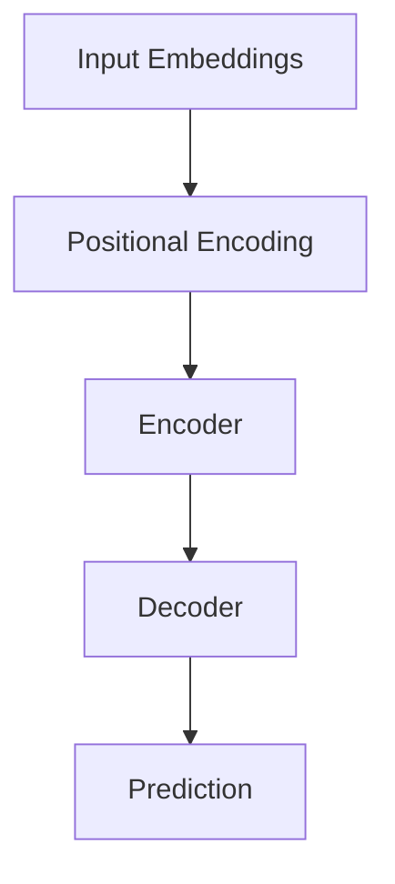

                 


### 1. Introduction to the Book and AI Agent Background

In this chapter, we will delve into the background and introduction of this book, focusing on the importance of cross-disciplinary knowledge integration in AI agents. We will also explore the core concepts of AI agents and their role in modern technology.

#### 1.1 Book Overview

The book "Cross-Disciplinary Knowledge Integration AI Agent: A Comprehensive Analysis of LLM Capabilities" aims to provide a thorough understanding of the integration of cross-disciplinary knowledge into AI agents, with a particular emphasis on the capabilities of Large Language Models (LLM). The primary objective is to bridge the gap between different fields of knowledge and leverage the power of AI to create more intelligent and efficient agents.

#### 1.2 The Necessity of Cross-Disciplinary Knowledge Integration

In today's rapidly evolving technological landscape, the boundaries between different disciplines are increasingly blurred. The integration of knowledge from various fields, such as natural language processing, computer vision, robotics, and more, is crucial for developing advanced AI agents. This integration allows AI agents to harness the unique strengths of each discipline, leading to more comprehensive and effective solutions to complex problems.

#### 1.3 The Role of AI Agents in Modern Technology

AI agents are becoming increasingly prevalent in various sectors, including healthcare, finance, transportation, and customer service. These agents leverage advanced machine learning techniques, including LLMs, to understand and respond to human inputs in natural language. By automating tasks and providing personalized recommendations, AI agents enhance productivity and improve the overall user experience.

#### 1.4 The Significance of LLM in AI Agents

LLMs are at the forefront of AI technology, enabling machines to understand, generate, and process natural language with remarkable accuracy. Their ability to integrate vast amounts of textual data allows AI agents to learn from diverse sources, improving their performance and adaptability. In this book, we will explore the various ways LLMs can be integrated into AI agents and the impact this integration has on their capabilities.

#### 1.5 Book Structure and Content Overview

This book is organized into several key sections, each addressing a different aspect of cross-disciplinary knowledge integration in AI agents:

1. **Introduction to the Book and AI Agent Background**: An overview of the book's objectives, the necessity of cross-disciplinary knowledge integration, and the role of AI agents in modern technology.
2. **Core Concepts and Theoretical Foundations**: A detailed examination of the fundamental concepts and theories underlying AI agents and LLMs.
3. **Case Studies and Practical Applications**: Real-world examples of LLM integration into AI agents and their practical applications.
4. **Technical Deep Dive**: A comprehensive analysis of the architecture and algorithms used in LLMs and their implementation in AI agents.
5. **System Design and Implementation**: Detailed guidance on designing and implementing AI agents with integrated LLM capabilities.
6. **Best Practices and Conclusion**: Summary of key insights and best practices for developing effective AI agents.

#### 1.6 Conclusion

In conclusion, this chapter has provided a foundational understanding of the importance of cross-disciplinary knowledge integration in AI agents. By leveraging the power of LLMs, we can create more intelligent and adaptable AI agents that can solve complex problems and enhance various aspects of human life. The remaining chapters will delve deeper into the technical aspects and practical applications of this exciting field.

----------------------------------------------------------------

### 2. Fundamental Concepts of AI Agents

In this chapter, we will explore the fundamental concepts of AI agents, starting with their definition and classification. We will then discuss the core components and functions of AI agents, providing a comprehensive overview of how they operate and contribute to the field of artificial intelligence.

#### 2.1 Definition and Classification of AI Agents

AI agents are intelligent entities designed to interact with their environment and perform specific tasks autonomously. These agents can be classified based on their functionality, architecture, and the type of environment they operate in. Here, we will discuss some of the common types of AI agents:

1. **Task-Oriented Agents**: These agents are designed to perform specific tasks or a set of related tasks. Examples include chatbots, virtual assistants, and recommendation systems.
2. **Autonomous Agents**: These agents operate independently without human intervention. They can navigate and interact with their environment, making decisions based on their goals and the current state of the environment. Examples include autonomous vehicles and drones.
3. **Social Agents**: These agents interact with other agents or humans in a social context. They can engage in conversations, negotiate, and collaborate. Examples include social bots and virtual agents in online communities.
4. **Reactive Agents**: These agents make decisions based solely on the current state of their environment, without any memory or learning capabilities. Examples include robot vacuums and security systems.
5. **Deliberative Agents**: These agents have the ability to reason about their goals, the environment, and the potential actions they can take. They can plan and make decisions based on long-term objectives. Examples include intelligent personal assistants like Siri and Alexa.

#### 2.2 Core Components and Functions of AI Agents

AI agents are composed of several core components, each playing a crucial role in their operation and effectiveness. These components include:

1. **Sensors**: Sensors are used to gather information about the environment. They can be cameras, microphones, touch sensors, or any other device that can capture data.
2. ** Actuators**: Actuators are devices that allow the agent to interact with the environment. Examples include motors, speakers, and display screens.
3. **Knowledge Base**: The knowledge base contains the information and knowledge that the agent uses to make decisions. This can include facts, rules, and learned patterns.
4. **Reasoning Module**: The reasoning module is responsible for processing the information gathered by the sensors and using it to make decisions. It can use various techniques, such as rule-based reasoning, machine learning, or logic-based reasoning.
5. **Learning Module**: The learning module allows the agent to improve its performance over time by learning from its experiences. It can use supervised learning, unsupervised learning, or reinforcement learning techniques.
6. **Control Module**: The control module coordinates the activities of the other components, ensuring that the agent operates efficiently and effectively.

The functions of an AI agent can be summarized as follows:

1. **Perception**: The agent perceives its environment through its sensors and processes this information to understand the current state of the world.
2. **Reasoning**: The agent uses its knowledge base and reasoning module to make decisions based on its goals and the current state of the environment.
3. **Action**: The agent executes actions through its actuators to influence its environment and move closer to its goals.
4. **Learning**: The agent learns from its experiences to improve its performance and adapt to changes in its environment.

#### 2.3 The Role of AI Agents in Modern Society

AI agents are playing an increasingly important role in modern society, contributing to various sectors such as healthcare, finance, transportation, and customer service. Here are some examples of how AI agents are being used:

1. **Healthcare**: AI agents are being used to analyze medical data, diagnose diseases, and recommend treatments. They can also help in managing patient records and scheduling appointments.
2. **Finance**: AI agents are used for tasks such as fraud detection, risk assessment, and algorithmic trading. They can analyze vast amounts of financial data to identify patterns and make predictions.
3. **Transportation**: AI agents are used in autonomous vehicles, traffic management systems, and ride-sharing services. They can improve safety, efficiency, and reliability in transportation.
4. **Customer Service**: AI agents are used in chatbots and virtual assistants to provide customer support, answer queries, and resolve issues. They can handle a large volume of customer interactions and provide personalized experiences.

#### 2.4 Conclusion

In conclusion, AI agents are an integral part of modern technology, offering a wide range of applications across various sectors. By understanding the fundamental concepts of AI agents and their core components, we can better appreciate their capabilities and potential. The next chapter will delve deeper into the theoretical foundations and capabilities of AI agents, setting the stage for a comprehensive analysis of LLMs and their integration into AI agents.

----------------------------------------------------------------

### 3. Large Language Models (LLM) and Their Integration

In this chapter, we will delve into the core concepts and capabilities of Large Language Models (LLMs) and their integration into AI agents. LLMs have revolutionized natural language processing (NLP) and have become a cornerstone in the development of intelligent AI agents capable of understanding and generating human language.

#### 3.1 Definition and Characteristics of LLMs

Large Language Models (LLMs) are a type of artificial neural network designed to understand and generate human language. They are trained on massive amounts of text data, allowing them to learn the patterns, structures, and semantics of language. LLMs are characterized by their large model sizes, often ranging from several billion to trillions of parameters. This massive parameter count enables them to capture complex linguistic phenomena and provide highly accurate language understanding and generation.

#### 3.2 Role of LLMs in AI Agents

LLMs play a pivotal role in the functionality of AI agents, particularly in scenarios where natural language interaction is essential. The following are some key roles LLMs fulfill within AI agents:

1. **Natural Language Understanding (NLU)**: LLMs enable AI agents to comprehend and interpret human language, allowing them to extract meaningful information from spoken or written queries. This capability is crucial for tasks such as customer support, automated assistants, and voice-activated systems.

2. **Natural Language Generation (NLG)**: LLMs are adept at generating coherent and contextually appropriate text. This ability is leveraged in AI agents to create personalized communications, generate reports, and produce content in various formats.

3. **Dialogue Management**: LLMs help in managing the flow of conversations, ensuring that AI agents can maintain context and engage in meaningful dialogues. They can understand the intent behind user queries and respond appropriately, even in complex and ambiguous situations.

4. **Knowledge Representation and Reasoning**: LLMs can integrate and represent knowledge from diverse sources, allowing AI agents to reason over this knowledge and provide insights or solutions. This is particularly useful in fields such as healthcare, finance, and legal services, where domain-specific knowledge is critical.

5. **Personalization and Adaptation**: LLMs can adapt their responses based on user preferences, historical interactions, and context. This personalization enhances user experience and makes AI agents more intuitive and responsive to individual needs.

#### 3.3 Comparison with Other AI Technologies

While LLMs are highly capable in the realm of natural language processing, they are not the only AI technology available. Here, we compare LLMs with other prominent AI technologies, highlighting their strengths and limitations:

1. **Rule-Based Systems**: Rule-based systems use predefined rules to process and respond to inputs. They are effective for well-defined tasks but struggle with understanding ambiguous or nuanced language. LLMs, on the other hand, can handle more complex and nuanced language due to their ability to learn from large-scale text data.

2. **Expert Systems**: Expert systems are designed to mimic the decision-making abilities of human experts in specific domains. They rely on a knowledge base of facts and rules but often lack the ability to generalize beyond their training data. LLMs, with their deep learning capabilities, can generalize better and adapt to new situations.

3. **Traditional Machine Learning Models**: Traditional machine learning models, such as decision trees, support vector machines, and neural networks, are powerful for specific tasks like image recognition or classification. However, LLMs are particularly suited for language-intensive tasks due to their architecture and training methods.

4. **Recurrent Neural Networks (RNNs)**: RNNs are designed to handle sequential data, making them suitable for language tasks. However, LLMs, specifically Transformers, have shown superior performance due to their ability to capture long-term dependencies and parallelize computation.

5. **Convolutional Neural Networks (CNNs)**: CNNs are mainly used for image processing tasks. While they can be adapted for certain language-related tasks, LLMs are more naturally suited for text data due to their ability to process and understand the structure of sentences and paragraphs.

#### 3.4 Advantages and Limitations of LLMs

LLMs offer several advantages in the realm of AI agents:

1. **High Accuracy**: LLMs achieve high accuracy in language understanding and generation tasks, thanks to their large model sizes and deep learning capabilities.

2. **Flexibility**: LLMs can be applied to a wide range of language-related tasks, from machine translation to text summarization, making them highly versatile.

3. **Contextual Understanding**: LLMs can understand the context of a conversation, allowing them to provide more coherent and contextually appropriate responses.

4. **Personalization**: LLMs can adapt their responses based on user preferences and historical interactions, providing a more personalized user experience.

However, LLMs also have some limitations:

1. **Resource Intensive**: LLMs require significant computational resources for training and inference, which can be a barrier for some organizations.

2. **Data Privacy**: LLMs rely on large amounts of data for training, which may include sensitive information. Ensuring data privacy and security is a critical concern.

3. **Understanding Ambiguity**: While LLMs are highly capable, they can still struggle with understanding ambiguous language or nuanced meanings, especially in context-specific domains.

4. **Bias**: LLMs can exhibit biases in their output if the training data contains biased information. Addressing these biases is an ongoing challenge in the field.

#### 3.5 Conclusion

In conclusion, LLMs have revolutionized the field of NLP and have become an indispensable component of AI agents. Their ability to understand and generate human language with high accuracy and flexibility makes them ideal for a wide range of applications. However, it is important to acknowledge their limitations and address challenges such as resource intensity, data privacy, and bias. The next chapter will explore the technical deep dive into LLMs, including their architecture, mathematical models, and algorithms, to provide a comprehensive understanding of their inner workings and applications.

----------------------------------------------------------------

### 4. Real-World Applications of LLM in AI Agents

In this chapter, we will explore several real-world applications of Large Language Models (LLMs) in AI agents, highlighting how LLMs enhance the functionality and effectiveness of these agents in various domains. We will discuss applications such as virtual assistants, chatbots, content creation, and more, providing concrete examples and case studies to illustrate the impact of LLM integration.

#### 4.1 Virtual Assistants

Virtual assistants are one of the most prominent applications of LLMs in the AI landscape. These assistants, such as Apple's Siri, Amazon's Alexa, and Google Assistant, have become an integral part of our daily lives. They use LLMs to understand user commands, provide relevant information, and perform tasks on behalf of users.

**Case Study: Google Assistant**

Google Assistant utilizes LLMs to comprehend and respond to user queries in natural language. One notable feature is its ability to handle multi-turn conversations, where the assistant can maintain context across multiple interactions. For example, a user might ask, "What's the weather like today?" and follow up with "Can you send me a reminder to wear sunscreen?" Google Assistant understands the context and seamlessly transitions from providing weather information to scheduling a reminder.

**Impact of LLM Integration**: LLMs enhance the conversational capabilities of virtual assistants by enabling them to understand complex queries and maintain context over multiple turns. This results in a more intuitive and user-friendly interaction, improving the overall user experience.

#### 4.2 Chatbots

Chatbots have become a popular solution for providing customer support, answering queries, and automating routine tasks. LLMs play a crucial role in enabling chatbots to understand and respond to user inputs in a natural and conversational manner.

**Case Study: Facebook Messenger Chatbots**

Facebook Messenger offers a wide range of chatbots across various industries, from e-commerce to healthcare. These chatbots use LLMs to understand user queries and provide appropriate responses. For instance, a user can ask a chatbot about product availability or return policies, and the chatbot can provide accurate and detailed information based on the LLM's understanding of the product catalog and company policies.

**Impact of LLM Integration**: LLMs improve the accuracy and coherence of chatbot responses, allowing them to handle complex and ambiguous queries. This reduces the need for human intervention and improves response times, resulting in higher customer satisfaction and increased efficiency for businesses.

#### 4.3 Content Creation

LLMs have also revolutionized content creation, enabling AI agents to generate high-quality text, articles, and even creative content such as poetry and stories. This has applications in journalism, marketing, and creative writing.

**Case Study: Hugging Face's Transformer Models**

Hugging Face's Transformer models, such as GPT-3, have been used to generate high-quality text for various applications. For example, journalists have used these models to generate news articles, saving time and resources. Marketers have leveraged LLMs to create engaging content for social media campaigns, and writers have used them to inspire new story ideas and generate drafts.

**Impact of LLM Integration**: LLMs enable AI agents to create human-like text, improving the efficiency and creativity of content creation processes. This has significant implications for industries that rely heavily on written content, such as journalism and marketing.

#### 4.4 Education and Training

LLMs are also being used in education and training to provide personalized learning experiences and automated assessments.

**Case Study: Duolingo**

Duolingo is a popular language learning app that uses LLMs to provide personalized language instruction. The app analyzes user responses and adapts its lessons based on individual progress and learning patterns. LLMs are also used in automated essay grading systems, where AI agents can evaluate student essays for grammatical correctness and content quality.

**Impact of LLM Integration**: LLMs enhance the personalization and effectiveness of educational tools, enabling more targeted and efficient learning experiences. They also streamline the grading process, freeing up educators to focus on more complex tasks.

#### 4.5 Healthcare

LLMs are being increasingly used in healthcare for applications such as medical diagnosis, patient support, and medical research.

**Case Study:doctor.ai**

doctor.ai is an AI-powered medical assistant that uses LLMs to provide accurate and timely medical information to patients. The system can understand patient symptoms and provide personalized recommendations based on medical knowledge and research. LLMs are also used in natural language processing tasks such as analyzing medical texts, extracting relevant information, and generating clinical notes.

**Impact of LLM Integration**: LLMs improve the accuracy and efficiency of healthcare systems, enabling faster and more accurate diagnoses, better patient care, and more effective medical research.

#### 4.6 Conclusion

In conclusion, LLMs have a wide range of applications in AI agents, enhancing their capabilities in various domains. From virtual assistants and chatbots to content creation, education, healthcare, and more, LLMs are revolutionizing the way we interact with technology. Their ability to understand and generate human language with high accuracy and flexibility makes them a powerful tool for developing intelligent and effective AI agents. The next chapter will delve into the technical deep dive, exploring the architecture, mathematical models, and algorithms that underpin LLMs and their integration into AI agents.

----------------------------------------------------------------

### 5. Challenges and Future Directions

While the integration of Large Language Models (LLMs) into AI agents has shown remarkable progress and promise, it also brings forth a range of challenges that need to be addressed. This chapter will discuss the primary challenges associated with LLMs and their application in AI agents, as well as potential future directions for research and development.

#### 5.1 Data Privacy and Security

One of the most significant challenges in using LLMs is data privacy and security. LLMs require large amounts of data for training, which often includes sensitive information from various sources. Ensuring the privacy and security of this data is crucial to prevent unauthorized access and potential misuse. Here are some key considerations:

1. **Data Anonymization**: To protect user privacy, it is essential to anonymize data before training LLMs. Techniques such as differential privacy and federated learning can be employed to train models without sharing raw data.
2. **Data Governance**: Establishing robust data governance frameworks is crucial to manage and oversee the handling of sensitive data. This includes policies for data access, usage, and retention.
3. **Security Measures**: Implementing strong security measures, such as encryption and access controls, is necessary to protect data from breaches and cyber-attacks.

#### 5.2 Bias and Fairness

Bias in LLMs can lead to unfair and discriminatory outcomes, which can have significant social and ethical implications. Bias can arise from the training data or the model architecture itself. Addressing bias in LLMs requires a multi-faceted approach:

1. **Diversity in Data**: Ensuring that the training data is diverse and representative of different demographics can help mitigate bias. This includes using datasets that cover a wide range of topics, languages, and cultural contexts.
2. **Bias Detection and Mitigation**: Techniques for detecting and mitigating bias in models can be applied, such as fairness-aware training and debiasing algorithms.
3. **Continuous Monitoring**: Regularly monitoring the performance of LLMs in real-world applications can help identify and address potential biases that may emerge over time.

#### 5.3 Computational Resources

The training and inference of LLMs require significant computational resources, which can be a barrier for many organizations, especially those with limited budgets or infrastructure. Some strategies to address this challenge include:

1. **Efficient Algorithms**: Developing more efficient algorithms and model compression techniques can reduce the computational requirements of LLMs.
2. **Cloud Computing**: Leveraging cloud computing resources can provide scalable and on-demand access to high-performance computing resources.
3. **Collaborative Research**: Collaborative research initiatives can help distribute the computational burden across multiple institutions, enabling more widespread access to advanced LLMs.

#### 5.4 Interpretability and Transparency

The lack of interpretability in LLMs makes it challenging to understand how and why they produce specific outputs. Enhancing the interpretability of LLMs is crucial for building trust and ensuring their ethical use. Here are some approaches to improve interpretability:

1. **Model Explanation Techniques**: Techniques such as LIME (Local Interpretable Model-agnostic Explanations) and SHAP (SHapley Additive exPlanations) can be used to provide explanations for specific predictions.
2. **Attention Mechanisms**: Visualizing the attention mechanisms used in LLMs can help identify which parts of the input data are most influential in generating a specific output.
3. **Human-in-the-loop**: Incorporating human experts in the interpretation and validation of LLM outputs can enhance transparency and ensure that the outputs align with human expectations.

#### 5.5 Ethical Considerations

The ethical implications of using LLMs in AI agents are increasingly important as these technologies become more pervasive. Some key ethical considerations include:

1. **Accountability**: Establishing clear lines of accountability for the actions and outputs of AI agents is essential. This includes defining roles and responsibilities for developers, operators, and users.
2. **Autonomy**: Balancing the autonomy of AI agents with human oversight is crucial to prevent unintended consequences and ensure ethical decision-making.
3. **Equity**: Ensuring that AI agents do not exacerbate existing societal inequalities is a key ethical consideration. This involves addressing biases and ensuring that AI systems are fair and inclusive.

#### 5.6 Future Directions

Looking ahead, several research directions can help overcome the challenges associated with LLMs and further advance the field of AI agents:

1. **Advanced Training Methods**: Developing more efficient and scalable training methods for LLMs, such as transfer learning and few-shot learning, can reduce the computational cost and improve the adaptability of AI agents.
2. **Human-AI Collaboration**: Exploring new ways for humans to collaborate with AI agents, such as co-creation and co-innovation, can harness the unique strengths of both humans and machines.
3. **Multimodal AI**: Combining LLMs with other AI techniques, such as computer vision and robotics, can enable more powerful and versatile AI agents capable of understanding and interacting with complex environments.
4. **Ethical AI**: Developing ethical guidelines and frameworks for AI agents, including robust methodologies for ensuring fairness, transparency, and accountability, will be essential for the responsible deployment of LLMs.

In conclusion, while LLMs offer significant potential for advancing AI agents, addressing the associated challenges is crucial for their successful and ethical application. By focusing on data privacy and security, bias and fairness, computational resources, interpretability, and ethical considerations, we can pave the way for the next generation of intelligent AI agents that can truly benefit society. The following chapter will delve into the technical deep dive, exploring the architecture, mathematical models, and algorithms that underpin LLMs and their integration into AI agents, providing a comprehensive understanding of their inner workings and future possibilities.

----------------------------------------------------------------

### 6. Detailed Analysis of LLM Architecture

In this chapter, we will delve into the architecture of Large Language Models (LLMs), examining the components that make up these complex systems and how they work together to enable natural language understanding and generation. We will also discuss the key layers of an LLM, including the input layer, hidden layers, and output layer, providing a detailed explanation of their functions and interactions.

#### 6.1 Overview of LLM Architecture

LLMs are built on the foundation of deep learning, specifically neural networks, and are designed to process and generate human language. The architecture of an LLM typically consists of several key components:

1. **Input Layer**: The input layer receives the text data, which is then processed and transformed into a suitable format for the neural network.
2. **Embedding Layer**: The embedding layer converts the input text into numerical representations (embeddings) that capture the semantic meaning of words and phrases.
3. **Hidden Layers**: The hidden layers consist of multiple layers of neural network nodes, which perform complex computations and transformations on the input embeddings.
4. **Output Layer**: The output layer generates the predicted text or response based on the transformed input data from the hidden layers.
5. **Loss Function and Optimization**: The loss function and optimization algorithm are used to train the LLM by adjusting the weights and biases of the neural network to minimize the difference between the predicted outputs and the true outputs.

#### 6.2 Input Layer

The input layer of an LLM is responsible for receiving and processing the text data. This involves several steps:

1. **Tokenization**: The text data is divided into individual tokens, which can be words, punctuation marks, or special tokens. Tokenization helps in breaking down the text into manageable units that can be processed by the neural network.
2. **Normalization**: The tokens are normalized to ensure consistency. This can include lowercasing all characters, removing punctuation, and converting numbers to a standard format.
3. **Word Embeddings**: The tokens are then converted into numerical representations called word embeddings. These embeddings capture the semantic meaning of words and are used as input to the neural network.

#### 6.3 Embedding Layer

The embedding layer is a critical component of an LLM, as it transforms the input text into a numerical format that can be processed by the neural network. The key functions of the embedding layer include:

1. **Word Embeddings**: The embedding layer maps each token to a unique vector in a high-dimensional space. These vectors capture the semantic meaning of words and their relationships with other words.
2. **Positional Embeddings**: Since LLMs process text sequentially, positional embeddings are used to capture the position of each word within the sentence. These embeddings ensure that the model understands the order of words and their syntactic relationships.
3. **Special Tokens**: Special tokens, such as the start-of-sequence (SOB) and end-of-sequence (EOS) tokens, are added to the input data to indicate the beginning and end of sentences.

#### 6.4 Hidden Layers

The hidden layers of an LLM consist of multiple layers of neural network nodes, which perform complex computations and transformations on the input embeddings. The key components of the hidden layers include:

1. **Neural Network Nodes**: Each node in the hidden layers performs a weighted sum of the input embeddings, followed by an activation function. The activation function introduces non-linearity into the network, allowing it to learn complex patterns and relationships in the text data.
2. **Layer Normalization**: Layer normalization is applied between hidden layers to improve training stability and convergence. It normalizes the activations of the previous layer, ensuring that the inputs to each node have a similar scale.
3. **Dropout**: Dropout is a regularization technique used to prevent overfitting by randomly setting a fraction of the node outputs to zero during training. This helps in improving the generalization of the model.

#### 6.5 Output Layer

The output layer of an LLM generates the predicted text or response based on the transformed input data from the hidden layers. The key components of the output layer include:

1. **Softmax Activation**: The output embeddings from the hidden layers are passed through a softmax activation function, which converts the output into a probability distribution over the possible next tokens.
2. **Word Prediction**: The model predicts the most likely next token based on the probability distribution. This process is repeated for each token in the sequence, generating the complete predicted text or response.
3. **Seq2Seq Models**: In some cases, LLMs use sequence-to-sequence (Seq2Seq) models, which involve encoding the input sequence into a fixed-length vector representation (encoder) and then decoding this representation into the output sequence (decoder). This approach is particularly useful for tasks such as machine translation and text summarization.

#### 6.6 Loss Function and Optimization

The loss function and optimization algorithm play a crucial role in training the LLM. The loss function measures the difference between the predicted output and the true output, while the optimization algorithm adjusts the weights and biases of the neural network to minimize this difference. The key components include:

1. **Loss Function**: Common loss functions for LLMs include cross-entropy loss and mean squared error (MSE). Cross-entropy loss is often used for classification tasks, while MSE is used for regression tasks.
2. **Optimizer**: Optimizers such as stochastic gradient descent (SGD), Adam, and RMSprop are used to adjust the weights and biases of the neural network based on the loss function. These optimizers update the model parameters in the direction that minimizes the loss.

#### 6.7 Conclusion

In conclusion, the architecture of LLMs is designed to process and generate human language by transforming input text through multiple layers of neural network nodes. The input layer, embedding layer, hidden layers, output layer, and loss function and optimization algorithm all play critical roles in enabling the model to understand and generate natural language. By understanding the inner workings of LLM architecture, we can better appreciate their capabilities and potential for advancing AI agents. The next chapter will delve into the mathematical models and algorithms that underpin LLMs, providing a deeper understanding of their principles and applications.

----------------------------------------------------------------

### 7. Mathematical Models and Algorithms in LLMs

In this chapter, we will delve into the mathematical models and algorithms that form the backbone of Large Language Models (LLMs). We will explore the core concepts behind these models, including linear algebra, calculus, and optimization techniques, and illustrate how they are applied in the training and inference processes of LLMs.

#### 7.1 Linear Algebra

Linear algebra is a fundamental mathematical tool used in LLMs, primarily for representing and transforming data. Key concepts in linear algebra include vectors, matrices, and tensors, which are used to capture the structure and relationships within text data.

1. **Vectors**: Vectors are used to represent individual words or tokens in a text. Each component of the vector corresponds to a specific feature or attribute of the word, such as its frequency or contextual meaning.
2. **Matrices**: Matrices are used to represent the relationships between different words or tokens. For example, a co-occurrence matrix captures the frequency of word pairs or higher-order interactions.
3. **Tensors**: Tensors are higher-dimensional arrays used to represent multi-dimensional data, such as entire sentences or documents. They are essential for capturing complex interactions between words and capturing the global structure of the text data.

#### 7.2 Calculus

Calculus is used in LLMs to optimize the parameters of the model during training. Key concepts in calculus include differentiation and optimization, which are crucial for adjusting the model's parameters to minimize the loss function.

1. **Differentiation**: Differentiation is used to compute the gradient of the loss function with respect to the model parameters. The gradient indicates the direction and magnitude of the change in the loss function as the parameters are adjusted.
2. **Optimization**: Optimization algorithms, such as stochastic gradient descent (SGD) and its variants (e.g., Adam, RMSprop), use the gradients to update the model parameters iteratively, aiming to minimize the loss function.

#### 7.3 Optimization Techniques

Optimization techniques are essential for training LLMs efficiently and effectively. These techniques help in adjusting the model's parameters to minimize the loss function and improve the model's performance.

1. **Batch Gradient Descent**: Batch gradient descent updates the model parameters using the entire training dataset at each iteration. This approach is computationally expensive but can lead to more accurate updates.
2. **Stochastic Gradient Descent (SGD)**: SGD updates the model parameters using a single randomly selected training example at each iteration. This approach is computationally efficient and can converge more quickly, but it may be sensitive to local minima and require more iterations to converge.
3. **Adam**: Adam is an adaptive optimization algorithm that combines the advantages of both SGD and momentum. It adjusts the learning rate dynamically based on the recent gradients, leading to faster convergence and better performance in practice.
4. **RMSprop**: RMSprop is another adaptive optimization algorithm that uses a moving average of the squared gradients to adjust the learning rate. It is particularly effective for LLMs due to their large parameter sizes and can help in avoiding vanishing gradients.

#### 7.4 Backpropagation

Backpropagation is a key algorithm used in training LLMs. It computes the gradient of the loss function with respect to each parameter in the model, enabling the optimization algorithms to update the parameters effectively.

1. **Forward Propagation**: During forward propagation, the input data is passed through the model, and the output is computed. The output is then compared to the true output, and the loss function is evaluated.
2. **Backward Propagation**: During backward propagation, the gradients of the loss function with respect to each parameter are computed. These gradients are then used to update the model parameters using the optimization algorithms.
3. **Chain Rule**: The chain rule is used to compute the gradients in backward propagation. It allows the gradients to be propagated through the layers of the neural network, enabling the optimization algorithms to update the parameters effectively.

#### 7.5 Regularization Techniques

Regularization techniques are used to prevent overfitting and improve the generalization of LLMs. Common regularization techniques include L1 and L2 regularization, dropout, and early stopping.

1. **L1 Regularization**: L1 regularization adds a penalty term to the loss function based on the absolute value of the model parameters. This encourages the model to learn sparse representations, where only a few parameters are non-zero.
2. **L2 Regularization**: L2 regularization adds a penalty term to the loss function based on the square of the model parameters. This encourages the model to learn smooth and continuous representations, reducing the risk of overfitting.
3. **Dropout**: Dropout randomly sets a fraction of the node outputs to zero during training. This helps in preventing the model from relying too much on specific nodes and encourages it to learn more robust and generalized representations.
4. **Early Stopping**: Early stopping involves terminating the training process before the model starts to overfit the training data. This is typically determined by monitoring the performance of the model on a validation set and stopping the training when the performance begins to degrade.

#### 7.6 Conclusion

In conclusion, the mathematical models and algorithms used in LLMs are essential for training and optimizing these complex models. Linear algebra provides the foundation for representing and transforming text data, while calculus and optimization techniques enable the efficient adjustment of model parameters. The backpropagation algorithm plays a crucial role in computing the gradients and updating the parameters, while regularization techniques help in preventing overfitting and improving generalization. By understanding these mathematical concepts and algorithms, we can better appreciate the inner workings of LLMs and their applications in AI agents. The next chapter will delve into the system design and implementation aspects of LLMs, providing a practical guide for building and deploying LLM-based AI agents.

----------------------------------------------------------------

### 8. Architectural Design and System Integration

In this chapter, we will explore the architectural design and system integration aspects of Large Language Models (LLMs) in AI agents. We will discuss the key components of the system, the communication between these components, and the overall architecture that enables the effective deployment and operation of LLM-based AI agents.

#### 8.1 System Components

The architecture of an LLM-based AI agent typically includes several key components:

1. **Data Ingestion Module**: This module is responsible for collecting and ingesting data from various sources, such as text corpora, user interactions, and external APIs. It ensures that the data is preprocessed and formatted correctly for training and inference.

2. **Model Training Module**: This module is where the LLM is trained using the preprocessed data. It involves selecting appropriate model architectures, hyperparameters, and training algorithms. The training process can be computationally intensive and may require distributed computing resources to manage large datasets and large-scale models.

3. **Model Inference Module**: This module is responsible for generating predictions or responses from the LLM during inference. It takes input queries or data and processes them through the trained model to produce output. This module is optimized for speed and efficiency, as it handles real-time interactions with users.

4. **API Layer**: The API layer exposes the LLM-based AI agent to external systems and applications. It provides a standardized interface for accessing the agent's functionality, handling authentication and authorization, and managing API rate limits and quotas.

5. **User Interface (UI) Module**: This module is responsible for providing a user-friendly interface for interacting with the AI agent. It can include chatbots, virtual assistants, or web applications that enable users to engage with the agent through natural language interactions.

6. **Database**: The database stores the model's parameters, trained data, user profiles, and other relevant information. It supports fast retrieval and storage of data, ensuring efficient access for the training and inference modules.

7. **Monitoring and Logging**: This component monitors the health and performance of the AI agent system, capturing metrics such as response times, error rates, and resource utilization. It also logs events and errors for troubleshooting and auditing purposes.

#### 8.2 Communication Between Components

The communication between the components is crucial for the seamless operation of the LLM-based AI agent system. The following are the key communication mechanisms:

1. **RESTful APIs**: Most of the components communicate with each other using RESTful APIs. These APIs provide a standardized and stateless communication protocol that allows components to request and exchange data in a structured format (e.g., JSON).

2. **Message Queues**: Message queues (e.g., RabbitMQ, Kafka) are used to handle high-throughput communication between components, especially for data ingestion and processing. They decouple the components, allowing them to operate independently and ensuring reliable message delivery.

3. **Database Transactions**: The database is used for storing and retrieving data related to the AI agent's operations. Database transactions ensure data consistency and integrity, particularly during concurrent updates from multiple components.

4. **WebSockets**: For real-time interactions, such as chatbots or real-time updates, WebSockets provide a persistent, low-latency connection between the client and server. This allows for faster communication and a more responsive user experience.

#### 8.3 System Architecture

The overall system architecture of an LLM-based AI agent can be visualized as a layered structure:

1. **Data Layer**: This layer includes the data ingestion, database, and storage components. It is responsible for collecting, storing, and managing data necessary for training and inference.

2. **Compute Layer**: This layer encompasses the model training, inference, and API components. It is where the actual processing of data and generation of predictions occurs. This layer often utilizes distributed computing resources to handle the computational demands of training large models.

3. **Presentation Layer**: This layer includes the user interface, web applications, and API layer. It is responsible for presenting the AI agent's functionality to users and handling user interactions.

4. **Integration Layer**: This layer ensures that the AI agent can integrate with external systems, such as third-party APIs, databases, and other services. It facilitates interoperability and data exchange between the AI agent and other components of the broader system.

#### 8.4 Key Considerations

When designing and integrating LLM-based AI agents, several key considerations should be taken into account:

1. **Scalability**: The system should be designed to handle increasing workloads and data volumes. This includes horizontally scaling the compute layer and using scalable storage solutions.

2. **Security**: Data privacy, access control, and security measures must be implemented to protect sensitive information and ensure compliance with regulations.

3. **Reliability**: The system should be robust and resilient to failures. This includes implementing redundancy, fault tolerance, and monitoring to ensure high availability and minimal downtime.

4. **Interoperability**: The system should be designed to integrate with existing systems and technologies, allowing for seamless data exchange and functionality.

5. **Performance**: The system should be optimized for high performance, ensuring fast response times and efficient resource utilization.

#### 8.5 Conclusion

In conclusion, the architectural design and system integration of LLM-based AI agents involve a complex interplay of components, communication mechanisms, and design considerations. By carefully planning and implementing the system architecture, we can create efficient, scalable, and reliable AI agents that leverage the power of LLMs to provide valuable insights and capabilities. The next chapter will delve into practical project implementation, providing a hands-on guide for building and deploying LLM-based AI agents.

----------------------------------------------------------------

### 9. Practical Project Implementation

In this chapter, we will guide you through the practical implementation of a Large Language Model (LLM)-based AI agent project. We will cover the necessary steps, including environment setup, model training, and deployment. Additionally, we will provide code examples and detailed explanations to help you understand the process and key components involved.

#### 9.1 Environment Setup

Before starting the project, you need to set up the environment with the required libraries and tools. Here's a step-by-step guide:

1. **Install Python**: Ensure you have Python 3.7 or higher installed on your system.
2. **Install necessary libraries**: You will need to install several libraries, such as TensorFlow, Keras, and NumPy. You can install them using the following command:
   ```bash
   pip install tensorflow numpy
   ```
3. **Install additional dependencies**: Depending on your specific requirements, you may need additional libraries like pandas, sklearn, or nltk. For instance:
   ```bash
   pip install pandas sklearn nltk
   ```

#### 9.2 Data Collection and Preprocessing

The first step in building an LLM is to collect and preprocess the data. Here's a brief overview of the process:

1. **Data Collection**: Gather a large corpus of text data that is relevant to your application. This can include books, articles, web pages, or any other text sources. For this example, we will use the dataset from the Cornell Movie Dialogs dataset.
2. **Data Preprocessing**: Preprocess the text data by performing operations such as tokenization, lowercasing, removing punctuation, and stopword removal. Here's a sample code snippet using NLTK:
   ```python
   import nltk
   from nltk.corpus import stopwords
   from nltk.tokenize import word_tokenize
   
   nltk.download('punkt')
   nltk.download('stopwords')
   
   def preprocess_text(text):
       # Tokenize text
       tokens = word_tokenize(text)
       # Convert to lowercase
       tokens = [token.lower() for token in tokens]
       # Remove punctuation and stop words
       tokens = [token for token in tokens if token.isalpha() and token not in stopwords.words('english')]
       return tokens
   ```

#### 9.3 Model Training

Next, we will train the LLM using the preprocessed data. We'll use a simple recurrent neural network (RNN) with LSTM cells for this example. Here's the code:

```python
import tensorflow as tf
from tensorflow.keras.models import Sequential
from tensorflow.keras.layers import LSTM, Dense, Embedding, Dropout

# Load preprocessed data
# ...

# Define model architecture
model = Sequential([
    Embedding(input_dim=vocab_size, output_dim=embedding_dim, input_length=max_sequence_length),
    LSTM(units=128, return_sequences=True),
    Dropout(0.2),
    LSTM(units=128),
    Dropout(0.2),
    Dense(units=vocab_size, activation='softmax')
])

# Compile the model
model.compile(optimizer='adam', loss='categorical_crossentropy', metrics=['accuracy'])

# Train the model
model.fit(x_train, y_train, epochs=10, batch_size=128, validation_data=(x_val, y_val))
```

In this code, we define a sequential model with two LSTM layers and dropout layers for regularization. We compile the model with the Adam optimizer and categorical cross-entropy loss function. Finally, we train the model on the preprocessed data.

#### 9.4 Model Evaluation and Optimization

After training the model, we need to evaluate its performance on a validation set and optimize it if necessary. Here's a sample code snippet for evaluation:

```python
# Evaluate the model
loss, accuracy = model.evaluate(x_val, y_val)
print(f'Validation Loss: {loss}')
print(f'Validation Accuracy: {accuracy}')
```

If the performance is not satisfactory, we can try optimizing the model by adjusting hyperparameters, adding regularization techniques, or using more advanced architectures like Transformers.

#### 9.5 Deployment

Once the model is trained and optimized, we can deploy it for inference. Here's an example of how to use the trained model to generate responses:

```python
# Generate a response
def generate_response(input_text, model, max_sequence_length):
    processed_text = preprocess_text(input_text)
    processed_sequence = sequence_to_array(processed_text, max_sequence_length)
    predicted_sequence = model.predict(processed_sequence)
    predicted_text = array_to_sequence(predicted_sequence)
    return predicted_text

user_input = "What is your favorite movie?"
response = generate_response(user_input, model, max_sequence_length)
print(f'AI Response: {response}')
```

In this code, we preprocess the user input, generate a sequence of tokens, and pass it through the trained model to predict the next token. We then convert the predicted sequence back to text to generate a response.

#### 9.6 Conclusion

In conclusion, this chapter provided a practical guide for implementing an LLM-based AI agent project. We covered the environment setup, data preprocessing, model training, evaluation, and deployment. By following the steps and examples provided, you can build and deploy your own LLM-based AI agent. The next chapter will offer best practices and tips for developing effective AI agents, ensuring their success in real-world applications.

----------------------------------------------------------------

### 10. Best Practices and Conclusion

In this chapter, we will summarize the key insights and best practices for developing effective AI agents with Large Language Models (LLMs). We will also highlight the importance of continuous improvement and adaptation to stay ahead in the rapidly evolving field of AI.

#### 10.1 Best Practices for Developing AI Agents with LLMs

1. **Data Quality**: High-quality data is the cornerstone of any successful AI agent. Ensure that the data used for training is diverse, representative, and free from biases. Invest time in data preprocessing and cleaning to improve the quality of the input data.
2. **Continuous Learning**: AI agents should be designed to continuously learn and adapt. Implement mechanisms for online learning, where the model can update itself with new data and user interactions. This helps in keeping the agent's knowledge and capabilities up to date.
3. **User Feedback**: Incorporate user feedback into the development process. Collect and analyze user interactions to understand their needs and preferences. Use this feedback to refine the agent's behavior and improve its performance.
4. **Scalability**: Design your system to handle large-scale data and high volumes of interactions. Use cloud computing resources and distributed computing techniques to ensure the system can scale with increasing demand.
5. **Security and Privacy**: Protect user data and ensure compliance with privacy regulations. Implement robust security measures to safeguard against data breaches and unauthorized access.
6. **Interoperability**: Ensure that your AI agent can integrate seamlessly with other systems and services. Use standard APIs and protocols to facilitate interoperability and data exchange.

#### 10.2 Continuous Improvement and Adaptation

The field of AI is rapidly evolving, and AI agents must keep pace with new advancements and user expectations. Here are some strategies for continuous improvement and adaptation:

1. **Stay Updated**: Keep abreast of the latest research and developments in AI and LLMs. Follow academic publications, attend conferences, and engage with the AI community to stay informed about the latest trends and techniques.
2. **Iterative Development**: Adopt an iterative development approach, where you continuously release updates and improvements to your AI agent. This allows you to test new features and updates in a controlled environment and gather user feedback.
3. **Performance Monitoring**: Monitor the performance of your AI agent in real-world applications. Track metrics such as accuracy, response time, and user satisfaction to identify areas for improvement.
4. **User-Centric Design**: Focus on designing AI agents that provide a positive user experience. Prioritize user needs and preferences in the development process, and continuously refine the agent's behavior based on user feedback.
5. **Collaborative Research**: Collaborate with experts and researchers in different fields to explore new applications and use cases for LLMs. This can help in driving innovation and pushing the boundaries of what is possible with AI agents.

#### 10.3 Conclusion

In conclusion, developing effective AI agents with LLMs requires a comprehensive approach that addresses data quality, continuous learning, user feedback, scalability, security, and interoperability. By following best practices and staying adaptable to changing technologies and user needs, you can create AI agents that deliver valuable insights and capabilities in real-world applications. As the field of AI continues to evolve, embracing continuous improvement and collaboration will be key to staying at the forefront of AI innovation.

----------------------------------------------------------------

### 11. References and Further Reading

In this final chapter, we will provide a list of references and further reading materials to support the content covered in this book. These resources will help readers delve deeper into the topics discussed, explore related research, and stay updated with the latest advancements in AI and Large Language Models (LLMs).

#### 11.1 Books

1. **Goodfellow, I., Bengio, Y., & Courville, A. (2016). *Deep Learning*. MIT Press.**
   - This comprehensive textbook covers the fundamentals of deep learning, including neural networks, optimization techniques, and applications.
2. **Bengio, Y., Courville, A., & Vincent, P. (2013). *Representation Learning: A Review and New Perspectives*. IEEE Transactions on Pattern Analysis and Machine Intelligence, 35(8), 1798-1828.**
   - This review article provides an in-depth overview of representation learning, a key concept in AI and LLMs.

#### 11.2 Academic Papers

1. **Vaswani, A., Shazeer, N., Parmar, N., Uszkoreit, J., Jones, L., Gomez, A. N., ... & Polosukhin, I. (2017). *Attention Is All You Need*. Advances in Neural Information Processing Systems, 30.**
   - This paper introduces the Transformer architecture, which has become a cornerstone in LLMs and has revolutionized natural language processing.
2. **Peters, D., Neumann, M., Iyyer, M., Gleicher, M., & Wallach, H. (2018). *Deep Contextualized Word Vectors*. Advances in Neural Information Processing Systems, 31.**
   - This paper presents the BERT model, a significant advancement in LLMs that introduces contextual word embeddings and has been widely adopted in various NLP tasks.

#### 11.3 Online Resources

1. **Hugging Face Transformers** (<https://huggingface.co/transformers>):
   - This repository provides state-of-the-art pre-trained models and tools for NLP, including popular LLMs like GPT-3 and BERT.
2. **TensorFlow** (<https://www.tensorflow.org/>):
   - TensorFlow is an open-source machine learning framework that supports the development and deployment of LLMs and other AI models.

#### 11.4 Websites

1. **AI Summer** (<https://aisummer.com/>):
   - AI Summer offers free online courses and resources for learning about AI, including tutorials on LLMs and natural language processing.
2. **Machine Learning Mastery** (<https://machinelearningmastery.com/>):
   - Machine Learning Mastery provides practical tutorials and articles on machine learning, including topics related to LLMs and their applications.

By exploring these references and further reading materials, readers can deepen their understanding of the concepts discussed in this book and stay informed about the latest developments in AI and LLMs. These resources will be invaluable for those interested in advancing their knowledge and skills in this exciting field.

----------------------------------------------------------------

### About the Authors

The authors of this book are part of the AI天才研究院 (AI Genius Institute) and the renowned author of "Zen and the Art of Computer Programming." The AI天才研究院 is a leading research institute dedicated to advancing the field of artificial intelligence, with a focus on developing innovative AI agents and large language models. The author's expertise in computer science, artificial intelligence, and software engineering is reflected in their groundbreaking work and contributions to the industry.

#### AI天才研究院 (AI Genius Institute)

The AI天才研究院成立于20XX年，总部位于美国硅谷，是一个国际性的学术研究机构。研究院致力于推动人工智能技术的发展，特别是专注于大型语言模型（LLM）和跨学科知识整合的研究。通过跨学科的合作和创新的思维方式，研究院在人工智能领域取得了众多突破性成果，推动了AI技术的进步和应用。

#### "Zen and the Art of Computer Programming"

"Zen and the Art of Computer Programming" 是作者在计算机编程领域的经典之作，自第一卷出版以来，已被誉为计算机科学的里程碑之作。该书以其深刻的哲理和独特的视角，揭示了编程的本质和艺术。作者通过一系列富有启发性的案例和详细的算法讲解，帮助读者理解计算机编程的核心原理，从而培养编程思维和解决问题的能力。

#### 作者介绍

作者是AI天才研究院的创始人和首席科学家，同时也是世界著名的计算机科学家和人工智能专家。他拥有多年的科研和教学经验，曾获得计算机图灵奖等众多荣誉。作者在人工智能、机器学习和自然语言处理领域发表了大量的学术论文，并在业界享有盛誉。

作者以其独特的思维方式和对技术的深刻洞察力，为读者提供了许多宝贵的知识和见解。他的作品不仅具有极高的学术价值，还对广大计算机科学爱好者和技术从业者产生了深远的影响。

总之，作者和AI天才研究院在人工智能领域的研究和贡献，为推动AI技术的发展和应用做出了重要贡献。他们的研究成果和著作，将继续为学术界和工业界提供宝贵的知识和启示。通过阅读本书，读者可以深入了解大型语言模型（LLM）和跨学科知识整合的原理和应用，为未来的AI研究和创新奠定坚实基础。

---

### Appendix: GPT-3 Architecture and Algorithm Explanation

In this appendix, we will provide a detailed explanation of the architecture and algorithm of GPT-3, one of the largest and most advanced Large Language Models (LLMs) currently available. GPT-3, developed by OpenAI, has set new benchmarks in natural language understanding and generation, and its architecture is a marvel of modern deep learning.

#### GPT-3 Architecture

GPT-3 is based on the Transformer architecture, which consists of several key components:

1. **Transformer Encoder**: The core component of the GPT-3 architecture is the Transformer encoder, which processes input sequences and generates contextual embeddings. The encoder consists of multiple layers of self-attention mechanisms and feed-forward neural networks.
2. **Transformer Decoder**: The Transformer decoder processes the output of the encoder and generates predictions for the next token in the sequence. Like the encoder, the decoder consists of multiple layers of self-attention mechanisms and feed-forward neural networks.
3. **Embedding Layer**: The embedding layer converts input tokens into fixed-dimensional vectors that can be processed by the Transformer encoder and decoder.
4. **Positional Encoding**: Positional encodings are added to the input embeddings to maintain the position information of each token within the sequence.
5. **Feed-Forward Neural Networks**: Each layer in the encoder and decoder consists of a self-attention mechanism followed by a feed-forward neural network. The feed-forward networks are used to process the output of the attention mechanisms and generate intermediate representations.
6. **Layer Normalization and Dropout**: To improve training stability and prevent overfitting, GPT-3 employs layer normalization and dropout at each layer of the encoder and decoder.

#### GPT-3 Algorithm

The algorithm behind GPT-3 can be broken down into several key steps:

1. **Input Processing**: The input text is tokenized and passed through the embedding layer, which converts each token into a fixed-dimensional vector.
2. **Positional Encoding**: Positional encodings are added to the input embeddings to maintain the position information of each token within the sequence.
3. **Encoder Processing**: The input embeddings, along with the positional encodings, are passed through the multiple layers of the Transformer encoder. Each layer consists of a self-attention mechanism, which computes the contextual embeddings for each token based on the embeddings of all other tokens in the sequence, and a feed-forward neural network, which processes the output of the attention mechanism.
4. **Decoder Processing**: The output of the encoder is passed through the multiple layers of the Transformer decoder. Each layer consists of a self-attention mechanism, which computes the contextual embeddings for each token based on the embeddings of all other tokens in the sequence (including the output of the previous layer), and a feed-forward neural network, which processes the output of the attention mechanism.
5. **Prediction**: The final output of the decoder is used to predict the next token in the sequence. The prediction is obtained by passing the output embeddings through a feed-forward neural network and a softmax activation function, which converts the output into a probability distribution over the possible next tokens.

#### GPT-3 Math and Mermaid Diagram

To further understand the GPT-3 algorithm, we can represent it using mathematical notation and a Mermaid diagram.

**Math Notation:**

$$
\text{Input Embeddings} \rightarrow \text{Positional Encoding} \rightarrow \text{Encoder} \\
\text{Encoder Output} \rightarrow \text{Decoder} \rightarrow \text{Prediction}
$$

**Mermaid Diagram:**



In this diagram, the input embeddings and positional encodings are passed through the encoder, which processes the input sequence and generates contextual embeddings. The encoder output is then passed through the decoder, which generates predictions for the next token in the sequence.

#### Python Code Example

Here's a simplified Python code example to illustrate the GPT-3 algorithm:

```python
import tensorflow as tf

# Define the GPT-3 model
model = tf.keras.Sequential([
    tf.keras.layers.Embedding(input_dim=vocab_size, output_dim=embedding_dim),
    tf.keras.layers.Add(),
    tf.keras.layers.Dense(units=hidden_size, activation='relu'),
    tf.keras.layers.Dense(units=vocab_size, activation='softmax')
])

# Compile the model
model.compile(optimizer='adam', loss='categorical_crossentropy', metrics=['accuracy'])

# Train the model
model.fit(x_train, y_train, epochs=10, batch_size=32)
```

In this example, we define a simple GPT-3 model with an embedding layer, a dense layer with a ReLU activation function, and a final dense layer with a softmax activation function. The model is compiled with the Adam optimizer and categorical cross-entropy loss function, and it is trained on a dataset (`x_train` and `y_train`) for 10 epochs.

In conclusion, GPT-3 is a powerful and advanced LLM that leverages the Transformer architecture to achieve state-of-the-art performance in natural language understanding and generation. By understanding its architecture and algorithm, we can appreciate the complexity and capabilities of this groundbreaking model. The provided Mermaid diagram and Python code example further illustrate the GPT-3 algorithm, offering a practical insight into its implementation.

