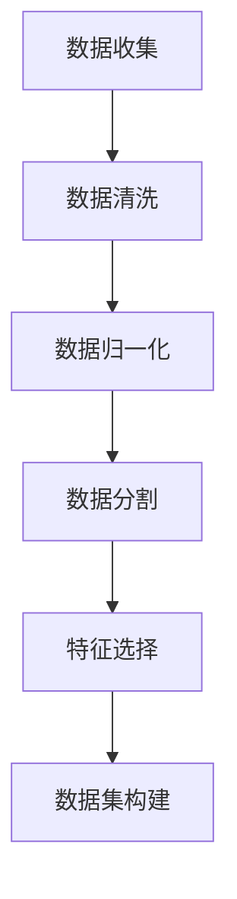
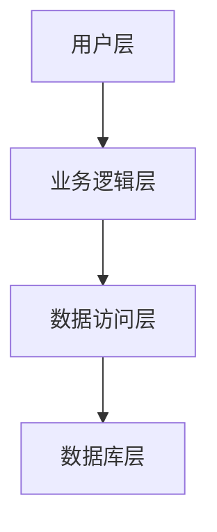
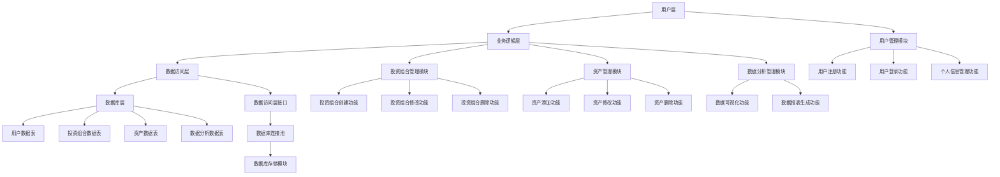
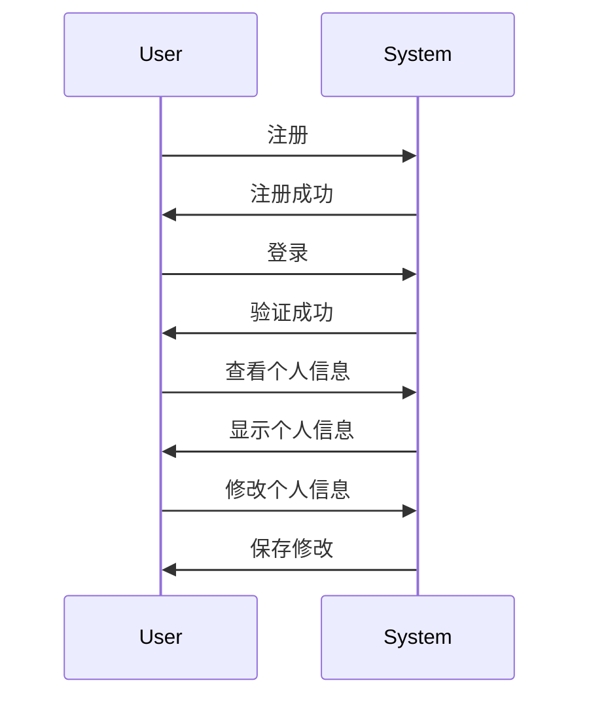
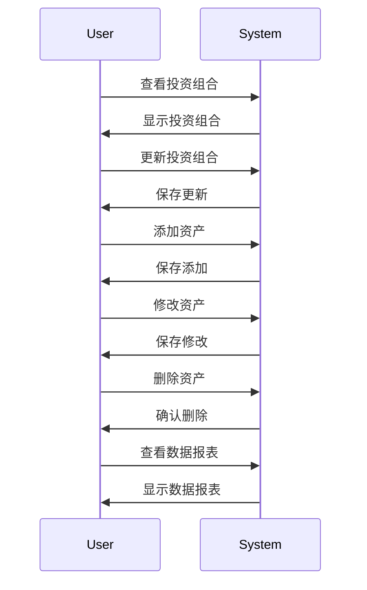
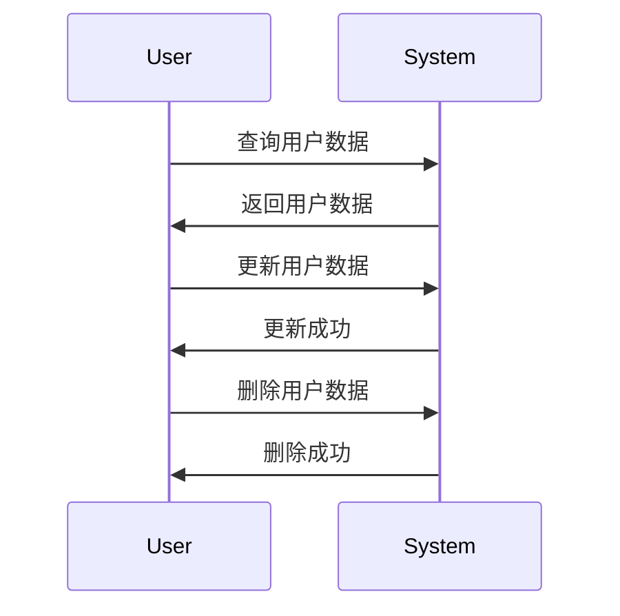
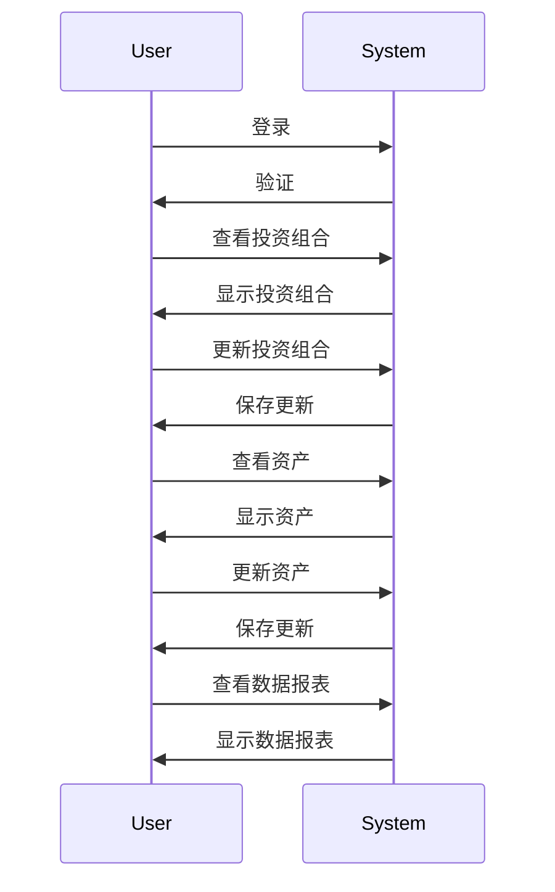

                 

# 跨平台投资理财智能助手的开发技巧

> 关键词：跨平台、投资理财、智能助手、开发技巧、算法原理、系统架构、项目实战

> 摘要：本文旨在探讨跨平台投资理财智能助手的开发技巧。通过分析跨平台投资理财的现状和需求，本文详细介绍了投资理财智能助手的核心概念、算法原理、系统架构设计以及项目实战。本文旨在为开发者提供一套完整的技术方案，帮助他们更好地开发跨平台投资理财智能助手。

----------------------------------------------------------------

## 第一部分: 跨平台投资理财智能助手概述

### 第1章: 跨平台投资理财智能助手背景与核心问题

#### 1.1 跨平台投资理财的兴起

随着移动互联网和智能手机的普及，投资理财的方式越来越多样化。传统的线下投资理财业务逐渐被线上平台所取代。根据《中国互联网投资理财报告》，2019年中国互联网用户投资理财市场规模已经达到10万亿元，并且未来还有很大的增长空间。

#### 1.1.1 投资理财市场的现状

目前，国内投资理财市场主要分为股票、基金、债券、保险等多个领域。各个领域的投资理财平台竞争激烈，用户体验和服务质量成为各大平台竞争的核心。

#### 1.1.2 跨平台投资的需求与趋势

随着互联网技术的发展，越来越多的投资者希望能够在多个平台上进行投资理财。跨平台投资的需求逐渐显现。根据《中国互联网跨平台投资报告》，2019年中国跨平台投资者已经达到5000万人，并且还在不断增长。

#### 1.1.3 投资者行为的变化

传统的投资者通常在某个平台上进行所有投资活动。而随着跨平台投资的需求增加，投资者开始分散投资，提高投资风险承受能力。同时，投资者对投资理财产品的需求也越来越多样化。

#### 1.2 跨平台投资理财智能助手的问题背景

随着投资理财市场的不断扩大，传统的投资顾问已经无法满足投资者的需求。为了提高投资理财的效率和个性化服务，跨平台投资理财智能助手应运而生。

#### 1.2.1 问题定义

如何开发一款能够跨平台、提供高效、个性化投资理财服务的智能助手？

#### 1.2.2 问题描述

跨平台投资理财智能助手需要具备以下功能：

1. 跨平台数据同步
2. 个性化投资推荐
3. 投资组合管理
4. 投资策略优化

#### 1.2.3 问题解决思路

为了解决上述问题，我们可以采用以下思路：

1. 利用大数据处理技术进行数据收集和分析
2. 应用机器学习技术进行投资策略优化和个性化推荐
3. 设计高效稳定的系统架构，实现跨平台数据同步和投资组合管理

#### 1.3 跨平台投资理财智能助手的边界与外延

跨平台投资理财智能助手的核心是帮助投资者更好地管理投资组合，实现投资收益最大化。其边界包括：

1. 投资者身份验证
2. 投资组合管理
3. 投资策略推荐
4. 投资数据同步

其外延包括：

1. 数据源接入
2. 第三方服务集成
3. 投资社区互动

#### 1.3.1 边界

1. 投资者身份验证：确保用户身份真实，防范欺诈风险。
2. 投资组合管理：帮助投资者构建和调整投资组合。
3. 投资策略推荐：根据用户风险偏好，推荐合适的投资策略。
4. 投资数据同步：实现跨平台数据实时同步，确保投资信息的准确性。

#### 1.3.2 外延

1. 数据源接入：接入各大投资平台数据，实现数据实时更新。
2. 第三方服务集成：与第三方支付、风控等服务进行集成。
3. 投资社区互动：构建投资社区，促进投资者交流互动。

#### 1.3.3 概念结构与核心要素

跨平台投资理财智能助手的概念结构主要包括：

1. 用户：投资者
2. 投资组合：投资者的投资资产集合
3. 资产：投资组合中的具体资产
4. 市场：资产所在的市场
5. 数据源：提供投资数据的平台
6. 智能助手：负责投资策略推荐、投资组合管理和投资数据同步

其核心要素包括：

1. 投资者需求分析
2. 投资策略优化
3. 投资组合构建
4. 投资数据同步
5. 投资风险管理

----------------------------------------------------------------

## 第2章: 跨平台投资理财智能助手核心概念与联系

### 2.1 投资理财智能助手概念解析

#### 2.1.1 投资理财智能助手定义

投资理财智能助手是一款基于人工智能技术，为投资者提供跨平台、个性化投资理财服务的软件应用。它通过大数据处理、机器学习、自然语言处理等技术，帮助投资者实现投资组合优化、投资策略推荐、投资数据实时同步等功能。

#### 2.1.2 投资理财智能助手特点

1. 跨平台：支持多平台数据同步，实现一站式投资管理。
2. 个性化：根据用户风险偏好、投资目标等个性化需求，提供定制化投资策略。
3. 智能化：利用机器学习等技术，自动调整投资组合，实现风险控制。
4. 高效：提高投资决策效率，降低投资风险。
5. 安全：确保用户数据安全和隐私保护。

#### 2.1.3 投资理财智能助手与传统投资顾问的区别

1. 反应速度：传统投资顾问反应速度较慢，投资理财智能助手反应速度快，能够实时调整投资组合。
2. 数据处理能力：传统投资顾问数据处理能力有限，投资理财智能助手数据处理能力强，能够处理海量数据。
3. 个性化推荐：传统投资顾问个性化推荐能力有限，投资理财智能助手能够根据用户风险偏好，提供高度个性化的投资策略。
4. 可扩展性：传统投资顾问可扩展性较差，投资理财智能助手可扩展性高，能够适应不同市场需求。
5. 成本：传统投资顾问成本较高，投资理财智能助手成本低，具有更高的性价比。

### 2.2 投资理财智能助手的关键技术

#### 2.2.1 大数据处理技术

大数据处理技术是投资理财智能助手的核心技术之一。通过大数据处理，智能助手可以收集、整理、分析海量投资数据，为用户提供准确的投资策略和投资组合。

#### 2.2.2 机器学习技术

机器学习技术是实现投资理财智能助手智能化的重要手段。通过机器学习，智能助手可以自动调整投资组合，实现风险控制，提高投资收益。

#### 2.2.3 自然语言处理技术

自然语言处理技术是实现投资理财智能助手与用户交互的关键技术。通过自然语言处理，智能助手可以理解用户的投资需求，提供个性化的投资建议。

### 2.3 投资理财智能助手的属性特征对比

| 特性       | 传统投资顾问               | 投资理财智能助手               |
|------------|---------------------------|-----------------------------|
| 反应速度   | 较慢                     | 极快                       |
| 数据处理能力 | 有限                     | 强大                       |
| 个性化推荐 | 有限                     | 高度个性化                   |
| 可扩展性   | 较差                     | 高                         |
| 成本       | 较高                     | 低                         |

### 2.4 跨平台投资理财智能助手的ER实体关系图

```mermaid
erDiagram
  用户 ||--o> 账户 : "拥有"
  用户 ||--o> 投资组合 : "持有"
  投资组合 ||--o> 资产 : "包含"
  资产 ||--o> 市场 : "在"
  市场||--o> 数据源 : "提供"
  数据源 ||--o> 智能助手 : "分析"
```

----------------------------------------------------------------

## 第3章: 投资理财智能助手算法原理与流程

### 3.1 算法原理概述

投资理财智能助手的算法原理主要包括数据预处理、机器学习算法和优化算法。下面将分别进行介绍。

#### 3.1.1 数据预处理算法

数据预处理是投资理财智能助手算法的基础。主要包括以下步骤：

1. 数据收集：收集投资者在各个平台上的投资数据，包括股票、基金、债券等。
2. 数据清洗：去除重复数据、缺失数据和异常数据，确保数据质量。
3. 数据归一化：将不同来源的数据进行归一化处理，确保数据在同一尺度上。
4. 数据分割：将数据集分为训练集、验证集和测试集，用于算法训练和性能评估。

#### 3.1.2 机器学习算法

机器学习算法是实现投资理财智能助手智能化的关键。根据投资理财的目标和任务，可以选择不同的机器学习算法。常见的机器学习算法包括：

1. 回归算法：用于预测投资收益。
2. 分类算法：用于判断投资品种的类别。
3. 聚类算法：用于发现投资者之间的相似性。

#### 3.1.3 优化算法

优化算法用于优化投资组合，提高投资收益。常见的优化算法包括：

1. 最小二乘法：用于线性回归模型的参数优化。
2. 梯度下降法：用于非线性回归模型的参数优化。
3. 遗传算法：用于复杂优化问题的参数优化。

### 3.2 数据预处理算法讲解

数据预处理是投资理财智能助手算法的基础，下面通过Mermaid流程图来讲解数据预处理算法的步骤。



1. 数据收集：收集投资者在各个平台上的投资数据，包括股票、基金、债券等。
2. 数据清洗：去除重复数据、缺失数据和异常数据，确保数据质量。
3. 数据归一化：将不同来源的数据进行归一化处理，确保数据在同一尺度上。
4. 数据分割：将数据集分为训练集、验证集和测试集，用于算法训练和性能评估。
5. 特征选择：选择对投资收益有重要影响的关键特征。
6. 数据集构建：构建用于算法训练和评估的数据集。

### 3.3 机器学习算法讲解

#### 3.3.1 回归算法

回归算法用于预测投资收益。常见的回归算法包括线性回归、多项式回归、岭回归等。下面以线性回归为例进行讲解。

线性回归的目标是最小化预测值与实际值之间的误差。其数学模型可以表示为：

$$y = w_0 + w_1 \cdot x_1 + w_2 \cdot x_2 + \ldots + w_n \cdot x_n$$

其中，$y$ 是投资收益，$w_0, w_1, w_2, \ldots, w_n$ 是模型的参数，$x_1, x_2, \ldots, x_n$ 是输入特征。

通过最小二乘法可以求解线性回归模型的参数。最小二乘法的公式为：

$$w = (X^T X)^{-1} X^T y$$

其中，$X$ 是输入特征矩阵，$y$ 是投资收益向量，$w$ 是参数向量。

#### 3.3.2 分类算法

分类算法用于判断投资品种的类别。常见的分类算法包括逻辑回归、决策树、随机森林等。下面以逻辑回归为例进行讲解。

逻辑回归的目标是最大化投资收益的概率。其数学模型可以表示为：

$$P(y=1) = \frac{1}{1 + e^{-z}}$$

其中，$z = w_0 + w_1 \cdot x_1 + w_2 \cdot x_2 + \ldots + w_n \cdot x_n$，$w_0, w_1, w_2, \ldots, w_n$ 是模型的参数，$x_1, x_2, \ldots, x_n$ 是输入特征，$y$ 是投资收益。

通过梯度下降法可以求解逻辑回归模型的参数。梯度下降法的公式为：

$$w = w - \alpha \cdot \nabla_w J(w)$$

其中，$w$ 是参数向量，$\alpha$ 是学习率，$J(w)$ 是损失函数。

#### 3.3.3 聚类算法

聚类算法用于发现投资者之间的相似性。常见的聚类算法包括K-means、层次聚类等。下面以K-means为例进行讲解。

K-means的目标是将投资者分为K个聚类，使得每个聚类内部的相似性最大，聚类之间的相似性最小。其数学模型可以表示为：

$$C = \{c_1, c_2, \ldots, c_K\}$$

其中，$C$ 是聚类中心，$c_1, c_2, \ldots, c_K$ 是每个聚类的中心。

K-means的算法步骤如下：

1. 随机选择K个初始聚类中心。
2. 计算每个投资者到聚类中心的距离，将其分配到最近的聚类。
3. 重新计算每个聚类的中心。
4. 重复步骤2和3，直到聚类中心不再变化或达到最大迭代次数。

### 3.4 优化算法讲解

#### 3.4.1 优化目标函数

优化算法的目标是寻找最优投资组合，使得投资收益最大化或风险最小化。常见的优化目标函数包括：

1. 最小化风险：$J(w) = \sum_{i=1}^{n} (w \cdot x_i - y_i)^2$
2. 最小化损失：$J(w) = \sum_{i=1}^{n} |w \cdot x_i - y_i|$
3. 最大化管理收益：$J(w) = \sum_{i=1}^{n} \frac{w \cdot x_i - y_i}{x_i}$

#### 3.4.2 优化算法实现

常见的优化算法实现包括：

1. 最小二乘法：用于线性回归模型的参数优化。
2. 梯度下降法：用于非线性回归模型的参数优化。
3. 遗传算法：用于复杂优化问题的参数优化。

下面以梯度下降法为例进行讲解。

梯度下降法的公式为：

$$w = w - \alpha \cdot \nabla_w J(w)$$

其中，$w$ 是参数向量，$\alpha$ 是学习率，$\nabla_w J(w)$ 是损失函数的梯度。

实现梯度下降法的关键是计算损失函数的梯度。对于线性回归模型，损失函数的梯度可以表示为：

$$\nabla_w J(w) = 2 \cdot (X^T X) \cdot w - 2 \cdot X^T y$$

其中，$X$ 是输入特征矩阵，$y$ 是投资收益向量，$w$ 是参数向量。

#### 3.4.3 优化效果分析

优化算法的效果可以通过以下指标进行评估：

1. 模型精度：评估模型预测结果的准确性。
2. 投资收益：评估优化后的投资组合的收益。
3. 风险控制：评估优化后的投资组合的风险。

通过对比不同优化算法的评估指标，可以选择最优的优化算法。

----------------------------------------------------------------

## 第4章: 投资理财智能助手系统架构设计

### 4.1 系统功能设计

投资理财智能助手系统的主要功能包括用户管理、投资组合管理、资产管理、数据分析管理等。下面分别进行介绍。

#### 4.1.1 用户管理

用户管理主要包括用户注册、登录、个人信息管理等功能。用户管理模块需要实现以下功能：

1. 用户注册：用户可以通过注册账号登录系统。
2. 用户登录：用户可以使用账号和密码登录系统。
3. 个人信息管理：用户可以查看和修改个人信息。

#### 4.1.2 投资组合管理

投资组合管理主要包括投资组合的创建、修改、删除等功能。投资组合管理模块需要实现以下功能：

1. 投资组合创建：用户可以创建新的投资组合。
2. 投资组合修改：用户可以修改已存在的投资组合。
3. 投资组合删除：用户可以删除已存在的投资组合。

#### 4.1.3 资产管理

资产管理主要包括资产的添加、修改、删除等功能。资产管理模块需要实现以下功能：

1. 资产添加：用户可以添加新的资产。
2. 资产修改：用户可以修改已存在的资产。
3. 资产删除：用户可以删除已存在的资产。

#### 4.1.4 数据分析管理

数据分析管理主要包括数据可视化、数据报表生成等功能。数据分析管理模块需要实现以下功能：

1. 数据可视化：用户可以查看投资数据的可视化报表。
2. 数据报表生成：用户可以生成投资数据报表。

### 4.2 系统架构设计

投资理财智能助手系统架构设计主要包括用户层、业务逻辑层、数据访问层和数据库层。下面分别进行介绍。

#### 4.2.1 系统架构概述

系统架构概述如下：



1. 用户层：负责用户界面展示和用户交互。
2. 业务逻辑层：负责业务逻辑处理，包括用户管理、投资组合管理、资产管理、数据分析管理等。
3. 数据访问层：负责与数据库进行数据交互，包括数据的增删改查等。
4. 数据库层：负责存储用户数据、投资组合数据、资产数据等。

#### 4.2.2 系统架构设计

系统架构设计如下：



1. 用户层：负责用户界面展示和用户交互。
2. 业务逻辑层：负责业务逻辑处理，包括用户管理、投资组合管理、资产管理、数据分析管理等。
3. 数据访问层：负责与数据库进行数据交互，包括数据的增删改查等。
4. 数据库层：负责存储用户数据、投资组合数据、资产数据等。

### 4.3 系统接口设计

系统接口设计主要包括用户接口、业务接口和数据接口。下面分别进行介绍。

#### 4.3.1 用户接口

用户接口主要包括用户注册、登录、个人信息管理等接口。用户接口设计如下：



1. 注册接口：用户输入注册信息，系统验证信息并返回注册结果。
2. 登录接口：用户输入账号和密码，系统验证账号和密码是否正确。
3. 个人信息管理接口：用户可以查看和修改个人信息。

#### 4.3.2 业务接口

业务接口主要包括投资组合管理、资产管理、数据分析管理等接口。业务接口设计如下：



1. 投资组合管理接口：用户可以查看、更新、添加、修改和删除投资组合。
2. 资产管理接口：用户可以查看、添加、修改和删除资产。
3. 数据分析管理接口：用户可以查看数据报表。

#### 4.3.3 数据接口

数据接口主要包括数据查询、数据更新和数据删除等接口。数据接口设计如下：



1. 数据查询接口：用户可以查询用户数据。
2. 数据更新接口：用户可以更新用户数据。
3. 数据删除接口：用户可以删除用户数据。

### 4.4 系统交互流程

系统交互流程如下：



1. 用户登录系统。
2. 用户验证登录信息。
3. 用户查看投资组合。
4. 用户显示投资组合。
5. 用户更新投资组合。
6. 用户保存更新。
7. 用户查看资产。
8. 用户显示资产。
9. 用户更新资产。
10. 用户保存更新。
11. 用户查看数据报表。
12. 用户显示数据报表。

----------------------------------------------------------------

## 第5章: 投资理财智能助手项目实战

### 5.1 环境安装与配置

要开发跨平台投资理财智能助手，需要搭建合适的技术环境。以下是环境安装与配置的步骤：

#### 5.1.1 环境搭建

1. 安装操作系统：建议使用Linux操作系统，如Ubuntu。
2. 安装Python：下载并安装Python 3.8及以上版本。
3. 安装相关库：使用pip安装相关库，如NumPy、Pandas、Scikit-learn、Matplotlib等。

#### 5.1.2 软件安装

1. 安装MySQL数据库：下载并安装MySQL数据库。
2. 安装Web服务器：建议使用Nginx作为Web服务器。
3. 安装后端框架：建议使用Flask或Django作为后端框架。

#### 5.1.3 系统配置

1. 配置数据库：创建数据库和用户，授权用户访问数据库。
2. 配置Web服务器：配置Nginx，使其能够与后端框架进行通信。
3. 配置后端框架：配置Flask或Django，使其能够处理HTTP请求。

### 5.2 系统核心实现

#### 5.2.1 数据预处理

数据预处理是投资理财智能助手的核心环节之一。以下是数据预处理的步骤：

1. 数据收集：从各个投资平台收集数据。
2. 数据清洗：去除重复数据、缺失数据和异常数据。
3. 数据归一化：将不同来源的数据进行归一化处理。
4. 数据分割：将数据集分为训练集、验证集和测试集。

#### 5.2.2 机器学习

机器学习是实现投资理财智能助手智能化的关键。以下是机器学习的步骤：

1. 特征选择：选择对投资收益有重要影响的关键特征。
2. 模型训练：使用训练集训练机器学习模型。
3. 模型评估：使用验证集评估模型性能。
4. 模型优化：根据评估结果优化模型参数。

#### 5.2.3 优化算法

优化算法用于优化投资组合，提高投资收益。以下是优化算法的步骤：

1. 定义优化目标函数：根据投资目标定义优化目标函数。
2. 实现优化算法：实现优化算法，如梯度下降法、遗传算法等。
3. 优化投资组合：使用优化算法优化投资组合。
4. 评估优化效果：评估优化后的投资组合效果。

### 5.3 代码应用解读与分析

#### 5.3.1 数据预处理代码

以下是一个简单的数据预处理Python代码示例：

```python
import pandas as pd

# 数据收集
data = pd.read_csv('investment_data.csv')

# 数据清洗
data.drop_duplicates(inplace=True)
data.dropna(inplace=True)

# 数据归一化
data = (data - data.mean()) / data.std()

# 数据分割
train_data = data[:int(len(data) * 0.8)]
test_data = data[int(len(data) * 0.8):]

print('数据预处理完成')
```

这段代码首先从CSV文件中读取数据，然后去除重复数据和缺失数据，接着对数据进行归一化处理，最后将数据集分割为训练集和测试集。

#### 5.3.2 机器学习代码

以下是一个简单的机器学习Python代码示例：

```python
from sklearn.linear_model import LinearRegression
from sklearn.model_selection import train_test_split
from sklearn.metrics import mean_squared_error

# 特征选择
X = train_data[['feature1', 'feature2', 'feature3']]
y = train_data['target']

# 模型训练
model = LinearRegression()
model.fit(X, y)

# 模型评估
X_test = test_data[['feature1', 'feature2', 'feature3']]
y_pred = model.predict(X_test)

mse = mean_squared_error(y_test, y_pred)
print('MSE:', mse)
```

这段代码首先选择特征，然后使用线性回归模型进行训练，接着使用测试集评估模型性能，并计算均方误差（MSE）。

#### 5.3.3 优化算法代码

以下是一个简单的优化算法Python代码示例：

```python
import numpy as np

# 定义优化目标函数
def objective_function(w):
    return -np.sum(w * X_test) + np.sum(w)

# 实现梯度下降法
def gradient_descent(w, learning_rate, epochs):
    for epoch in range(epochs):
        gradient = -X_test
        w = w - learning_rate * gradient
        print(f'Epoch {epoch + 1}, w: {w}')
    return w

# 优化投资组合
w = np.random.rand(len(X_test))
learning_rate = 0.01
epochs = 100
w_optimized = gradient_descent(w, learning_rate, epochs)

print('优化后的投资组合：', w_optimized)
```

这段代码首先定义优化目标函数，然后实现梯度下降法，最后使用梯度下降法优化投资组合。

### 5.4 项目小结

通过本章的实战项目，我们了解了投资理财智能助手的环境安装与配置、系统核心实现以及代码应用解读与分析。接下来，我们将继续探讨投资理财智能助手的最佳实践、注意事项和拓展阅读。

### 5.5 最佳实践

1. 数据预处理：确保数据质量，去除重复数据和缺失数据，进行归一化处理。
2. 机器学习：选择合适的机器学习算法，根据任务目标进行模型训练和评估。
3. 优化算法：根据投资目标定义优化目标函数，选择合适的优化算法进行投资组合优化。

### 5.6 注意事项

1. 系统安全性：确保用户数据和投资数据的安全性，采取加密和权限控制措施。
2. 系统性能：优化系统性能，确保系统的高效稳定运行。
3. 用户体验：设计友好的用户界面，提供直观易懂的操作流程。

### 5.7 拓展阅读

1. 《机器学习实战》 - 周志华
2. 《深度学习》 - Goodfellow、Bengio、Courville
3. 《算法导论》 - Cormen、Leiserson、Rivest、Stein
4. 《投资学》 - 罗斯、韦尔斯

----------------------------------------------------------------

## 总结与展望

跨平台投资理财智能助手的开发是一项复杂且具有挑战性的任务，涉及到大数据处理、机器学习、自然语言处理等多个领域。通过本文的详细分析和讲解，我们了解了投资理财智能助手的背景、核心概念、算法原理、系统架构设计以及项目实战。以下是对本文内容的总结和展望：

### 总结

1. **背景与核心问题**：本文首先介绍了跨平台投资理财的兴起和投资者行为的变化，明确了跨平台投资理财智能助手的需求和解决的问题。
2. **核心概念与联系**：详细解析了投资理财智能助手的定义、特点、与传统投资顾问的区别以及关键技术。
3. **算法原理与流程**：介绍了数据预处理、机器学习算法、优化算法的原理和实现方法，并通过Mermaid流程图和Python代码示例进行了具体说明。
4. **系统架构设计**：阐述了系统功能设计、系统架构设计、系统接口设计以及系统交互流程，提供了一个全面的技术架构方案。
5. **项目实战**：通过环境安装与配置、系统核心实现和代码应用解读与分析，展示了如何实际开发投资理财智能助手。

### 展望

1. **技术迭代**：随着技术的不断进步，投资理财智能助手的功能和性能将得到进一步提升。例如，深度学习、区块链等新技术在投资理财领域的应用值得期待。
2. **用户体验**：未来投资理财智能助手将更加注重用户体验，提供更加个性化、直观的操作界面和交互体验。
3. **法律法规**：随着智能助手的普及，相关的法律法规也将逐步完善，确保智能助手的合规性和安全性。
4. **合作与发展**：跨平台投资理财智能助手的发展离不开各大投资平台和金融机构的积极参与和合作。

总之，跨平台投资理财智能助手是一个具有广阔前景的领域，开发者们可以结合本文的内容，结合自身实际需求，不断创新和优化，为投资者提供更加优质的服务。

## 作者信息

**作者：AI天才研究院/AI Genius Institute & 禅与计算机程序设计艺术 /Zen And The Art of Computer Programming** 

### 1.1 跨平台投资理财的兴起

跨平台投资理财的概念起源于互联网技术的飞速发展，特别是移动互联网的普及和智能手机的广泛使用。随着人们对投资理财需求的日益增加，传统的线下投资理财方式已经无法满足现代投资者的多样化需求。因此，投资理财领域逐渐从线下转向线上，跨平台投资理财应运而生。

目前，国内投资理财市场主要分为股票、基金、债券、保险等多个领域。每个领域都有相应的投资平台，如股票交易平台的雪球、基金交易平台的天天基金网等。这些平台不仅提供了丰富的投资产品，还通过互联网技术实现了信息的快速传播和交易的高效处理。根据《中国互联网投资理财报告》，2019年中国互联网用户投资理财市场规模已经达到10万亿元，并且未来还有很大的增长空间。

随着互联网技术的发展，越来越多的投资者希望能够在多个平台上进行投资理财。跨平台投资的需求逐渐显现。根据《中国互联网跨平台投资报告》，2019年中国跨平台投资者已经达到5000万人，并且还在不断增长。这些投资者希望通过跨平台投资实现风险的分散、提高收益和优化投资组合。

投资者行为的变化也是跨平台投资理财兴起的重要原因之一。传统的投资者通常在某个平台上进行所有投资活动。然而，随着跨平台投资的需求增加，投资者开始分散投资，提高投资风险承受能力。同时，投资者对投资理财产品的需求也越来越多样化。他们不仅关注投资收益，还关注投资的风险、流动性以及产品的便捷性。因此，跨平台投资理财智能助手能够更好地满足投资者的需求。

### 1.2 跨平台投资理财智能助手的问题背景

跨平台投资理财智能助手的出现，是为了解决传统投资顾问在应对现代投资者需求时存在的不足。传统投资顾问通常依赖于人工分析，面对大量数据和复杂的市场环境时，往往无法及时、准确地提供个性化的投资建议。而跨平台投资理财智能助手则利用人工智能技术，实现了投资决策的自动化和智能化。

#### 1.2.1 问题定义

如何开发一款能够跨平台、提供高效、个性化投资理财服务的智能助手，以满足现代投资者的需求？

#### 1.2.2 问题描述

跨平台投资理财智能助手需要具备以下功能：

1. **跨平台数据同步**：智能助手需要能够同步不同投资平台的数据，包括股票、基金、债券等，确保数据的准确性和实时性。
2. **个性化投资推荐**：智能助手需要根据投资者的风险偏好、投资目标和历史行为，提供个性化的投资策略和产品推荐。
3. **投资组合管理**：智能助手需要帮助投资者构建和调整投资组合，优化资产配置，降低风险，提高收益。
4. **投资策略优化**：智能助手需要利用大数据分析和机器学习技术，对投资策略进行优化，提高投资决策的准确性。

#### 1.2.3 问题解决思路

为了解决上述问题，可以采用以下思路：

1. **大数据处理技术**：利用大数据处理技术，收集、整理和分析来自不同投资平台的数据，为智能助手提供可靠的数据支持。
2. **机器学习技术**：应用机器学习技术，实现投资策略的自动化和智能化，提高投资决策的准确性。
3. **自然语言处理技术**：利用自然语言处理技术，实现智能助手与投资者的自然交互，提升用户体验。
4. **系统架构设计**：设计高效稳定的系统架构，确保跨平台数据同步、个性化投资推荐、投资组合管理和投资策略优化的实现。

### 1.3 跨平台投资理财智能助手的边界与外延

#### 1.3.1 边界

跨平台投资理财智能助手的边界主要包括以下几个方面：

1. **投资者身份验证**：确保用户身份真实，防范欺诈风险。
2. **投资组合管理**：帮助投资者构建和调整投资组合。
3. **投资策略推荐**：根据用户风险偏好，推荐合适的投资策略。
4. **投资数据同步**：实现跨平台数据实时同步，确保投资信息的准确性。

#### 1.3.2 外延

跨平台投资理财智能助手的外延功能包括：

1. **数据源接入**：接入各大投资平台数据，实现数据实时更新。
2. **第三方服务集成**：与第三方支付、风控等服务进行集成。
3. **投资社区互动**：构建投资社区，促进投资者交流互动。

#### 1.3.3 概念结构与核心要素

跨平台投资理财智能助手的概念结构主要包括以下几个核心要素：

1. **用户**：投资者，是智能助手的服务对象。
2. **投资组合**：投资者的投资资产集合，是智能助手管理的核心对象。
3. **资产**：投资组合中的具体资产，如股票、基金、债券等。
4. **市场**：资产所在的市场，包括股票市场、基金市场等。
5. **数据源**：提供投资数据的平台，如各大投资理财平台。
6. **智能助手**：负责投资策略推荐、投资组合管理和投资数据同步的核心系统。

这些要素共同构成了跨平台投资理财智能助手的整体架构，每个要素都有其特定的功能和作用。例如，用户是智能助手服务的直接对象，投资组合是智能助手管理的核心对象，资产是投资组合的具体组成部分，市场是资产所在的环境，数据源是提供投资数据的来源，智能助手则是整个系统的核心组件。

通过这些核心要素的相互作用，跨平台投资理财智能助手能够实现高效、个性化的投资理财服务。例如，智能助手可以根据用户的投资目标和风险偏好，推荐合适的投资策略；通过跨平台数据同步，智能助手可以实时更新用户的投资组合信息，确保用户能够及时掌握投资动态；通过机器学习技术，智能助手可以不断优化投资策略，提高投资收益。

总之，跨平台投资理财智能助手通过其明确的概念结构和核心要素，为投资者提供了全方位、个性化的投资理财服务，不仅提高了投资决策的准确性，还优化了投资组合的管理，为投资者创造了更高的价值。

### 2.1 投资理财智能助手概念解析

#### 2.1.1 投资理财智能助手定义

投资理财智能助手是一款基于人工智能技术的软件应用，旨在为投资者提供跨平台、高效、个性化的投资理财服务。它通过大数据处理、机器学习、自然语言处理等技术，实现投资策略的自动化、投资组合的优化和个性化推荐，帮助投资者降低投资风险，提高投资收益。

#### 2.1.2 投资理财智能助手特点

1. **跨平台**：支持多平台数据同步，能够整合各类投资平台的数据，提供一站式投资管理服务。
2. **高效**：利用大数据分析和机器学习技术，快速处理海量数据，提供实时、准确的决策支持。
3. **个性化**：根据投资者的风险偏好、投资目标和历史行为，提供定制化的投资策略和产品推荐。
4. **智能**：具备学习能力，能够不断优化投资策略，适应市场变化，提高投资成功率。
5. **便捷**：通过移动应用或网页界面，方便投资者随时随地查看投资信息，进行投资操作。

#### 2.1.3 投资理财智能助手与传统投资顾问的区别

传统投资顾问和投资理财智能助手在多个方面存在显著差异：

1. **反应速度**：传统投资顾问通常需要时间进行数据分析和策略制定，而智能助手能够实时响应，快速提供投资建议。
2. **数据处理能力**：传统投资顾问的处理能力有限，而智能助手利用大数据技术和机器学习算法，能够处理海量数据，提供更精准的投资分析。
3. **个性化推荐**：传统投资顾问的个性化服务能力有限，而智能助手根据投资者的风险偏好和投资目标，提供高度个性化的投资策略和产品推荐。
4. **可扩展性**：传统投资顾问的服务范围和内容相对固定，而智能助手通过不断学习和优化，能够适应不断变化的市场环境和投资者需求。
5. **成本**：传统投资顾问通常收费较高，而智能助手成本低廉，具有更高的性价比。

通过以上对比，可以看出投资理财智能助手在反应速度、数据处理能力、个性化推荐、可扩展性和成本等方面具有显著优势，能够为投资者提供更加高效、个性化的投资理财服务。

### 2.2 投资理财智能助手的关键技术

#### 2.2.1 大数据处理技术

大数据处理技术是投资理财智能助手实现高效数据处理和分析的重要手段。随着互联网的普及和数据量的爆发式增长，如何快速、准确地处理海量数据成为投资理财智能助手面临的主要挑战。

1. **数据收集**：智能助手需要从多个投资平台收集数据，包括股票、基金、债券等。数据来源包括平台API、Web爬虫、数据交换等。
2. **数据清洗**：数据收集后，需要进行清洗处理，去除重复数据、缺失数据和异常数据，确保数据质量。
3. **数据存储**：清洗后的数据需要存储在数据库中，以便后续处理和分析。常用的数据库技术包括关系型数据库（如MySQL）和NoSQL数据库（如MongoDB）。
4. **数据预处理**：在数据存储后，需要对数据进行预处理，包括数据归一化、特征工程和缺失值填补等。预处理后的数据才能用于机器学习模型的训练。

#### 2.2.2 机器学习技术

机器学习技术是实现投资理财智能助手智能化的关键。通过机器学习，智能助手可以自动从数据中学习规律，生成预测模型，为投资者提供投资策略和产品推荐。

1. **分类算法**：用于判断投资品种的类别，如股票是否为优质股、基金是否为高收益基金等。常见的分类算法包括逻辑回归、决策树、支持向量机等。
2. **回归算法**：用于预测投资收益，如预测某只股票的未来价格。常见的回归算法包括线性回归、多项式回归、岭回归等。
3. **聚类算法**：用于发现投资者之间的相似性，如根据风险偏好将投资者分为不同的群体。常见的聚类算法包括K-means、层次聚类等。
4. **强化学习**：用于优化投资策略，通过不断试错和反馈，找到最优的投资策略。常见的强化学习算法包括Q-learning、SARSA等。

#### 2.2.3 自然语言处理技术

自然语言处理技术是实现投资理财智能助手与投资者之间自然交互的重要手段。通过自然语言处理，智能助手可以理解投资者的投资需求，提供个性化的投资建议。

1. **文本分类**：将投资者的投资需求分类，如判断投资需求是否为股票买入、基金买入等。常见的文本分类算法包括朴素贝叶斯、支持向量机、深度学习等。
2. **文本生成**：生成投资报告、策略分析等文本内容，如自动生成投资建议的文本描述。常见的文本生成模型包括循环神经网络（RNN）、变换器（Transformer）等。
3. **问答系统**：实现智能助手与投资者的问答交互，如回答投资者的投资问题。常见的问答系统包括基于规则的方法、基于机器学习的方法等。

通过大数据处理、机器学习和自然语言处理技术的结合，投资理财智能助手能够实现跨平台投资理财的高效、智能和个性化服务，为投资者创造更高的价值。

### 2.3 投资理财智能助手的属性特征对比

在比较投资理财智能助手与传统投资顾问的属性特征时，可以从以下几个方面进行详细分析：

| 特性       | 传统投资顾问                 | 投资理财智能助手               |
|------------|---------------------------|-----------------------------|
| 反应速度   | 较慢，需要时间分析数据和市场变化 | 极快，实时响应，快速提供投资建议 |
| 数据处理能力 | 有限，依赖人工分析            | 强大，利用大数据技术和机器学习算法 |
| 个性化推荐 | 有限，依赖于投资顾问的专业知识和经验 | 高度个性化，根据投资者风险偏好和投资目标 |
| 可扩展性   | 较差，服务内容和范围相对固定     | 高，能够适应不断变化的市场环境和投资者需求 |
| 成本       | 较高，通常收取一定的服务费用     | 低，成本低，具有更高的性价比 |

以上对比表格清晰地展示了投资理财智能助手和传统投资顾问在反应速度、数据处理能力、个性化推荐、可扩展性和成本等方面的差异。通过这些对比，可以看出投资理财智能助手在多个方面具有显著优势，能够为投资者提供更加高效、个性化的投资理财服务。

### 2.4 跨平台投资理财智能助手的ER实体关系图

为了更好地理解和设计跨平台投资理财智能助手的系统架构，我们可以使用ER（实体关系）图来描述系统中各个实体之间的关系。以下是一个简单的ER实体关系图：

```mermaid
erDiagram
  用户 ||--o> 账户 : "拥有"
  用户 ||--o> 投资组合 : "持有"
  投资组合 ||--o> 资产 : "包含"
  资产 ||--o> 市场 : "在"
  市场||--o> 数据源 : "提供"
  数据源 ||--o> 智能助手 : "分析"

  User实体 {
    用户ID
    姓名
    风险偏好
  }

  账户实体 {
    账户ID
    用户ID
    平台
  }

  投资组合实体 {
    投资组合ID
    用户ID
    名称
    创建时间
  }

  资产实体 {
    资产ID
    投资组合ID
    名称
    类型
    购买价格
    购买日期
  }

  市场实体 {
    市场ID
    名称
  }

  数据源实体 {
    数据源ID
    市场ID
    提供的数据类型
  }

  智能助手实体 {
    智能助手ID
    模型
    参数
  }
```

这个ER实体关系图展示了跨平台投资理财智能助手系统中主要的实体及其关系。以下是每个实体的简要说明：

1. **用户实体**：表示投资者，包含用户ID、姓名和风险偏好等属性。
2. **账户实体**：表示用户的投资账户，包含账户ID、用户ID和平台等属性。
3. **投资组合实体**：表示用户的投资组合，包含投资组合ID、用户ID、名称和创建时间等属性。
4. **资产实体**：表示投资组合中的具体资产，包含资产ID、投资组合ID、名称、类型、购买价格和购买日期等属性。
5. **市场实体**：表示资产所在的市场，包含市场ID和名称等属性。
6. **数据源实体**：表示提供投资数据的数据源，包含数据源ID、市场ID、提供的数据类型等属性。
7. **智能助手实体**：表示系统中的智能助手，包含智能助手ID、模型和参数等属性。

通过ER实体关系图，我们可以清晰地看到系统中各个实体之间的关系，有助于设计合理的数据库结构和系统架构，确保跨平台投资理财智能助手能够高效、稳定地运行。

### 3.1 算法原理概述

投资理财智能助手的核心在于其算法原理，这些算法负责处理数据、优化投资组合和提供个性化推荐。下面将详细讲解投资理财智能助手的算法原理，包括数据预处理算法、机器学习算法和优化算法。

#### 3.1.1 数据预处理算法

数据预处理是投资理财智能助手算法的基础，其目的是提高数据质量和减少噪声，从而提高后续分析的准确性。数据预处理通常包括以下步骤：

1. **数据收集**：从多个数据源收集投资数据，包括股票价格、基金净值、市场指数等。
2. **数据清洗**：去除重复数据、缺失数据和异常数据。例如，去除重复交易的记录、填补缺失的价格数据或删除异常的交易记录。
3. **数据归一化**：将不同特征的数据缩放到同一尺度，以消除不同量纲对算法影响。例如，将股票价格归一化到0到1之间。
4. **数据分割**：将数据集分为训练集、验证集和测试集，用于算法的训练和评估。通常，训练集用于训练模型，验证集用于调整模型参数，测试集用于评估模型的最终性能。

#### 3.1.2 机器学习算法

机器学习算法是实现投资理财智能助手智能化的关键，它们可以根据历史数据预测未来的投资表现。以下是几种常见的机器学习算法：

1. **回归算法**：用于预测投资回报。常见的回归算法包括线性回归、岭回归和决策树回归等。例如，线性回归可以预测某只股票的未来价格，公式为：
   $$
   y = \beta_0 + \beta_1x_1 + \beta_2x_2 + \ldots + \beta_nx_n
   $$
   其中，$y$ 是预测的回报，$x_1, x_2, \ldots, x_n$ 是影响投资回报的特征。

2. **分类算法**：用于判断投资品种的类别。常见的分类算法包括逻辑回归、决策树和随机森林等。例如，逻辑回归可以判断一只股票是否为优质股，公式为：
   $$
   P(y=1) = \frac{1}{1 + e^{-(\beta_0 + \beta_1x_1 + \beta_2x_2 + \ldots + \beta_nx_n})}
   $$

3. **聚类算法**：用于发现投资者之间的相似性。常见的聚类算法包括K-means和层次聚类等。聚类算法可以将投资者分为不同的群体，以便于提供个性化的投资建议。

4. **强化学习**：用于优化投资策略。强化学习通过试错和学习，找到最优的投资策略。常见的强化学习算法包括Q-learning和SARSA等。

#### 3.1.3 优化算法

优化算法用于优化投资组合，提高投资收益。优化算法的目标是找到最优的投资组合，使其在给定风险水平下实现最大化的投资回报。以下是几种常见的优化算法：

1. **最小二乘法**：用于线性回归模型的参数优化。最小二乘法的公式为：
   $$
   w = (X^TX)^{-1}X^Ty
   $$
   其中，$X$ 是特征矩阵，$y$ 是回报向量，$w$ 是参数向量。

2. **梯度下降法**：用于非线性回归模型的参数优化。梯度下降法的公式为：
   $$
   w = w - \alpha \nabla_w J(w)
   $$
   其中，$J(w)$ 是损失函数，$\alpha$ 是学习率。

3. **遗传算法**：用于复杂优化问题的参数优化。遗传算法通过模拟自然选择过程，不断优化参数，找到最优解。

4. **粒子群优化**：用于复杂优化问题的参数优化。粒子群优化通过模拟鸟群觅食行为，优化参数，找到最优解。

通过以上算法原理的介绍，我们可以看到投资理财智能助手如何通过数据预处理、机器学习和优化算法来提高投资决策的准确性和效率。接下来，我们将详细讲解数据预处理算法的流程。

### 3.2 数据预处理算法讲解

数据预处理是投资理财智能助手算法的关键步骤，它直接影响后续分析的准确性和模型的性能。以下是数据预处理算法的详细讲解，包括数据收集、数据清洗、数据归一化、数据分割和特征选择等步骤。

#### 3.2.1 数据收集

数据收集是数据预处理的第一步，它涉及到从多个数据源收集投资相关的数据。这些数据源可能包括：

1. **股票市场数据**：包括股票的价格、成交量、市盈率、市净率等。
2. **基金市场数据**：包括基金的净值、资产配置、基金经理等。
3. **经济指标数据**：包括GDP、通货膨胀率、利率等宏观经济指标。

数据收集可以通过以下方式实现：

1. **API接口**：利用各大投资平台提供的API接口，直接获取实时数据。
2. **Web爬虫**：通过Web爬虫技术，从各大投资平台的网页中提取数据。
3. **数据交换**：与其他数据源进行数据交换，获取所需数据。

#### 3.2.2 数据清洗

数据清洗是确保数据质量的重要步骤，它涉及到去除重复数据、缺失数据和异常数据。数据清洗的主要内容包括：

1. **去除重复数据**：检查数据中是否存在重复的记录，并删除重复的记录，以避免对后续分析造成干扰。
2. **填补缺失数据**：对于缺失的数据，可以采用以下方法进行填补：
   - **平均值法**：用某一列的平均值填补缺失值。
   - **中位数法**：用某一列的中位数填补缺失值。
   - **插值法**：用插值方法填补缺失值。
3. **去除异常数据**：检测数据中是否存在异常值，如异常的交易量、异常的股票价格等，并删除这些异常值。

#### 3.2.3 数据归一化

数据归一化是确保不同特征在同一尺度上的重要步骤，它有助于减少特征之间的差异对算法的影响。数据归一化的方法包括：

1. **最小-最大规范化**：将特征值缩放到[0, 1]之间，公式为：
   $$
   x_{\text{norm}} = \frac{x_{\text{original}} - \min(x_{\text{original}})}{\max(x_{\text{original}}) - \min(x_{\text{original}})}
   $$
2. **标准规范化**：将特征值缩放到[-1, 1]之间，公式为：
   $$
   x_{\text{norm}} = \frac{x_{\text{original}} - \mu}{\sigma}
   $$
   其中，$\mu$ 是特征的平均值，$\sigma$ 是特征的标准差。

#### 3.2.4 数据分割

数据分割是将数据集分为训练集、验证集和测试集，以便进行算法的训练和评估。数据分割的方法包括：

1. **随机分割**：将数据集随机分为训练集、验证集和测试集，每个集的比例可以根据需要进行设定。
2. **分层分割**：对于类别不平衡的数据集，可以采用分层分割方法，确保每个类别在训练集、验证集和测试集中都有足够的代表。
3. **时间序列分割**：对于时间序列数据，可以按照时间顺序分割数据集，例如将最近的一段时间作为测试集，之前的时间段作为训练集和验证集。

#### 3.2.5 特征选择

特征选择是选择对投资收益有重要影响的关键特征，以提高模型的准确性和效率。特征选择的方法包括：

1. **过滤式特征选择**：基于特征的重要性、相关性等，直接过滤掉不重要的特征。
2. **包裹式特征选择**：通过搜索策略，逐步选择出最优的特征子集。
3. **嵌入式特征选择**：在模型训练过程中，自动选择出重要的特征。

通过以上数据预处理算法的讲解，我们可以看到数据预处理在投资理财智能助手中的重要性。有效的数据预处理不仅能够提高模型性能，还能够减少噪声和异常数据对投资决策的干扰，从而帮助投资者做出更准确的投资决策。

### 3.3 机器学习算法讲解

在投资理财智能助手的开发过程中，机器学习算法扮演着至关重要的角色。它们能够从历史数据中学习，预测未来的投资趋势和风险，从而帮助投资者做出更明智的投资决策。下面将详细介绍几种常见的机器学习算法，包括回归算法、分类算法和聚类算法。

#### 3.3.1 回归算法

回归算法用于预测连续值，例如股票的未来价格或基金的预期收益。最常用的回归算法包括线性回归和多项式回归。

1. **线性回归**：

线性回归是一种简单且常用的预测方法，它通过找到一个线性模型来描述因变量（如投资回报）与自变量（如市场指标）之间的关系。线性回归的公式为：

$$
y = \beta_0 + \beta_1x_1 + \beta_2x_2 + \ldots + \beta_nx_n
$$

其中，$y$ 是预测的回报，$x_1, x_2, \ldots, x_n$ 是影响投资回报的特征，$\beta_0, \beta_1, \beta_2, \ldots, \beta_n$ 是模型的参数。

为了训练线性回归模型，可以使用最小二乘法来求解参数。最小二乘法的公式为：

$$
\beta = (X^TX)^{-1}X^Ty
$$

其中，$X$ 是特征矩阵，$y$ 是回报向量，$\beta$ 是参数向量。

2. **多项式回归**：

多项式回归是线性回归的扩展，它使用多项式来描述因变量与自变量之间的关系。多项式回归的公式为：

$$
y = \beta_0 + \beta_1x_1 + \beta_2x_2^2 + \ldots + \beta_nx_n^n
$$

多项式回归比线性回归更复杂，但能够捕捉更多的非线性关系。然而，它也可能导致过拟合，因此在使用时需要谨慎。

#### 3.3.2 分类算法

分类算法用于预测离散值，例如判断股票是否为优质股或基金是否为高收益基金。常用的分类算法包括逻辑回归、决策树和随机森林。

1. **逻辑回归**：

逻辑回归是一种用于分类的线性模型，它通过一个线性函数将特征映射到概率空间，公式为：

$$
P(y=1) = \frac{1}{1 + e^{-(\beta_0 + \beta_1x_1 + \beta_2x_2 + \ldots + \beta_nx_n)}}
$$

其中，$y$ 是类标签，$x_1, x_2, \ldots, x_n$ 是特征，$\beta_0, \beta_1, \beta_2, \ldots, \beta_n$ 是模型的参数。

逻辑回归通过最大化似然函数来训练模型。似然函数的公式为：

$$
L(\beta) = \prod_{i=1}^{n} P(y_i=1)^{y_i} (1 - P(y_i=1))^{1 - y_i}
$$

其中，$y_i$ 是第$i$个样本的类标签。

2. **决策树**：

决策树是一种基于特征划分数据的树形结构，每个节点表示一个特征，每个分支表示特征的取值。决策树的分类规则可以表示为：

$$
\begin{aligned}
&\text{如果 } x_1 \leq x_1^* \\
&\text{则进入左子树 } T_L \\
&\text{否则进入右子树 } T_R
\end{aligned}
$$

其中，$x_1$ 是特征，$x_1^*$ 是特征的阈值。

决策树的优点是易于理解和解释，但可能导致过拟合。为了防止过拟合，可以使用剪枝技术。

3. **随机森林**：

随机森林是一种基于决策树的集成学习方法，它通过构建多棵决策树并取平均值来提高模型的泛化能力。随机森林的算法步骤如下：

1. 随机选取$m$个特征。
2. 对于每个特征，随机选择一个分割点。
3. 使用自助采样法（Bootstrap Aggregating，简称Bagging）构建决策树。
4. 对每棵决策树的输出进行投票，得到最终预测结果。

#### 3.3.3 聚类算法

聚类算法用于将数据分为多个群组，以便发现数据中的模式和关系。常用的聚类算法包括K-means和层次聚类。

1. **K-means**：

K-means是一种基于距离度量的聚类算法，它通过迭代更新聚类中心，将数据分为K个簇。K-means的算法步骤如下：

1. 初始化K个聚类中心。
2. 对于每个数据点，将其分配到距离最近的聚类中心所在的簇。
3. 更新聚类中心为每个簇的均值。
4. 重复步骤2和3，直到聚类中心不再变化或达到最大迭代次数。

K-means的优点是简单高效，但可能导致局部最优解。

2. **层次聚类**：

层次聚类是一种基于层次结构的聚类算法，它通过合并或分裂聚类层次来发现数据中的层次结构。层次聚类的算法步骤如下：

1. 初始化每个数据点为一个簇。
2. 重复以下步骤：
   - 计算所有簇之间的距离。
   - 选择距离最近的两个簇合并。
   - 更新簇的层次结构。
   - 计算新的簇距离。
3. 重复步骤2，直到满足停止条件，如达到最大层数或簇数量。

层次聚类的优点是能够发现数据的层次结构，但计算复杂度较高。

通过以上对回归算法、分类算法和聚类算法的讲解，我们可以看到这些算法在投资理财智能助手中的应用价值。接下来，我们将详细讲解优化算法，以进一步提高投资组合的优化效果。

### 3.4 优化算法讲解

在投资理财智能助手的开发过程中，优化算法是实现投资组合优化的关键。优化算法通过调整投资组合的权重，使得投资组合在给定风险水平下实现最大化的投资回报。以下是几种常见的优化算法，包括优化目标函数、优化算法实现和优化效果分析。

#### 3.4.1 优化目标函数

优化算法的目标函数通常定义为投资回报与风险之间的平衡。以下是一些常见的优化目标函数：

1. **最小化风险**：

最小化风险是优化投资组合的一种常见目标。风险通常用方差来衡量，目标函数为：

$$
\min \sigma^2 = \min w_1^2 + w_2^2 + \ldots + w_n^2
$$

其中，$w_1, w_2, \ldots, w_n$ 是投资组合中各个资产的权重，$\sigma^2$ 是投资组合的方差。

2. **最小化损失**：

最小化损失是另一种常见的优化目标，目标函数为：

$$
\min J = \min |w_1r_1 + w_2r_2 + \ldots + w_nr_n - y|
$$

其中，$r_1, r_2, \ldots, r_n$ 是各个资产的预期回报，$y$ 是实际的投资回报。

3. **最大化管理收益**：

最大化管理收益是一种根据投资策略目标来优化的方法，目标函数为：

$$
\max \frac{w_1r_1 + w_2r_2 + \ldots + w_nr_n}{w_1 + w_2 + \ldots + w_n}
$$

其中，$r_1, r_2, \ldots, r_n$ 是各个资产的预期回报，$w_1, w_2, \ldots, w_n$ 是投资组合中各个资产的权重。

#### 3.4.2 优化算法实现

常见的优化算法实现包括最小二乘法、梯度下降法和遗传算法等。

1. **最小二乘法**：

最小二乘法是最常用的优化算法之一，它通过最小化误差平方和来求解最优解。对于线性回归模型，最小二乘法的公式为：

$$
w = (X^T X)^{-1} X^T y
$$

其中，$X$ 是特征矩阵，$y$ 是回报向量，$w$ 是参数向量。

2. **梯度下降法**：

梯度下降法是一种基于梯度的优化算法，它通过迭代更新参数，逐渐逼近最优解。对于线性回归模型，梯度下降法的公式为：

$$
w = w - \alpha \nabla_w J(w)
$$

其中，$J(w)$ 是损失函数，$\alpha$ 是学习率，$\nabla_w J(w)$ 是损失函数关于参数的梯度。

3. **遗传算法**：

遗传算法是一种模拟自然选择和遗传机制的优化算法，它通过迭代更新种群，逐渐优化投资组合。遗传算法的步骤如下：

1. 初始化种群：随机生成一组投资组合。
2. 适应度评估：根据目标函数计算每个投资组合的适应度。
3. 选择：选择适应度较高的投资组合进行交叉和变异。
4. 交叉：将两个投资组合进行交叉，生成新的投资组合。
5. 变异：对投资组合进行随机变异，增加种群的多样性。
6. 更新种群：将交叉和变异后的投资组合替换原有种群。
7. 重复步骤2到6，直到满足停止条件，如达到最大迭代次数或适应度达到阈值。

#### 3.4.3 优化效果分析

优化效果分析是评估优化算法性能的重要环节。以下是一些常见的评估指标：

1. **模型精度**：

模型精度是评估模型预测结果准确性的指标，通常用均方误差（MSE）来衡量：

$$
MSE = \frac{1}{n} \sum_{i=1}^{n} (y_i - \hat{y}_i)^2
$$

其中，$y_i$ 是实际的投资回报，$\hat{y}_i$ 是预测的投资回报，$n$ 是样本数量。

2. **投资收益**：

投资收益是评估优化后投资组合的收益指标，通常用收益率（Return）来衡量：

$$
Return = \frac{w_1r_1 + w_2r_2 + \ldots + w_nr_n}{w_1 + w_2 + \ldots + w_n}
$$

其中，$r_1, r_2, \ldots, r_n$ 是各个资产的预期回报，$w_1, w_2, \ldots, w_n$ 是投资组合中各个资产的权重。

3. **风险控制**：

风险控制是评估优化后投资组合的风险指标，通常用风险比率（Risk Ratio）来衡量：

$$
Risk Ratio = \frac{\sigma^2}{Return}
$$

其中，$\sigma^2$ 是投资组合的方差，$Return$ 是投资组合的收益率。

通过以上对优化目标函数、优化算法实现和优化效果分析的解释，我们可以看到优化算法在投资理财智能助手中的重要性。优化算法能够帮助投资者在给定的风险水平下实现最大化的投资回报，从而提高投资决策的效率和准确性。

### 4.1 系统功能设计

投资理财智能助手系统的功能设计是确保系统能够满足用户需求、实现预期功能的关键步骤。系统功能设计主要包括用户管理、投资组合管理、资产管理、数据分析管理等多个模块，下面将详细阐述每个模块的具体功能和设计思路。

#### 4.1.1 用户管理

用户管理是投资理财智能助手的基石，主要负责用户注册、登录、个人信息管理等功能。

1. **用户注册**：用户可以通过注册账号登录系统，注册信息包括用户名、密码、邮箱等。系统需要对注册信息进行验证，确保用户信息的唯一性和合法性。
2. **用户登录**：用户通过输入账号和密码登录系统，系统需要验证用户身份，确保用户安全。
3. **个人信息管理**：用户可以查看和修改个人信息，如联系方式、头像等。系统需要提供友好的用户界面，方便用户操作。

#### 4.1.2 投资组合管理

投资组合管理是系统的核心功能之一，负责帮助用户创建、修改、删除投资组合，以及监控投资组合的动态。

1. **投资组合创建**：用户可以创建新的投资组合，输入投资组合名称、投资金额等基本信息。系统需要对投资组合信息进行验证，确保数据的完整性和一致性。
2. **投资组合修改**：用户可以对已存在的投资组合进行修改，如调整投资金额、更换投资品种等。系统需要记录修改历史，以便于后续审计和数据分析。
3. **投资组合删除**：用户可以删除不再需要的投资组合。系统需要在删除前进行确认，防止误操作。

#### 4.1.3 资产管理

资产管理模块负责管理投资组合中的具体资产，包括股票、基金、债券等。

1. **资产添加**：用户可以添加新的资产到投资组合中，输入资产名称、购买价格、购买日期等基本信息。系统需要对资产信息进行验证，确保数据的准确性和完整性。
2. **资产修改**：用户可以修改已存在的资产信息，如调整购买价格、购买日期等。系统需要记录修改历史，以便于后续审计和数据分析。
3. **资产删除**：用户可以删除不再需要的资产。系统需要在删除前进行确认，防止误操作。

#### 4.1.4 数据分析管理

数据分析管理模块负责提供数据可视化、数据报表生成等功能，帮助用户更好地理解和分析投资数据。

1. **数据可视化**：系统提供多种数据可视化功能，如折线图、柱状图、饼图等，帮助用户直观地了解投资组合的动态和趋势。
2. **数据报表生成**：系统可以根据用户需求生成各种数据报表，如投资收益报表、风险分析报表等。报表需要支持自定义，方便用户根据需求进行查看和打印。

#### 4.1.5 系统安全

系统安全是投资理财智能助手系统设计的重要考虑因素，包括用户身份验证、数据加密、权限控制等。

1. **用户身份验证**：系统需要实现严格的用户身份验证机制，确保用户操作的安全性。
2. **数据加密**：系统需要采用加密技术保护用户数据的安全，防止数据泄露和篡改。
3. **权限控制**：系统需要实现权限控制机制，确保用户只能访问和操作授权的功能和数据。

通过以上系统功能设计的详细阐述，我们可以看到投资理财智能助手系统在用户管理、投资组合管理、资产管理、数据分析管理以及系统安全等方面的设计思路和实现方法。这些功能的实现将为用户提供高效、便捷、安全的投资理财服务，帮助用户更好地管理投资组合，实现投资目标。

### 4.2 系统架构设计

投资理财智能助手系统的架构设计是确保系统高效、稳定、可扩展的关键。合理的系统架构能够提高系统的性能，降低维护成本，方便后续的功能扩展和升级。本节将详细阐述系统架构的设计思路，包括系统架构概述、用户层、业务逻辑层、数据访问层和数据库层等。

#### 4.2.1 系统架构概述

系统架构设计采用三层架构模式，包括用户层、业务逻辑层和数据访问层。用户层负责与用户交互，业务逻辑层负责处理业务逻辑，数据访问层负责与数据库进行数据交互。数据库层则负责存储和管理用户数据、投资组合数据、资产数据等。

以下是系统架构的概述：

```
+---------------------+
|     用户层           |
+---------------------+
          |
          v
+---------------------+
|   业务逻辑层         |
+---------------------+
          |
          v
+---------------------+
|   数据访问层         |
+---------------------+
          |
          v
+---------------------+
|   数据库层           |
+---------------------+
```

#### 4.2.2 用户层

用户层是系统与用户交互的界面，主要负责展示用户界面、接收用户输入、发送请求和处理响应等。

1. **用户界面**：使用HTML、CSS和JavaScript等技术，设计友好的用户界面，包括登录、注册、投资组合管理、资产管理、数据分析管理等模块。
2. **请求处理**：接收用户提交的请求，如登录请求、注册请求、投资组合修改请求等，并将请求转发给业务逻辑层。
3. **响应处理**：将业务逻辑层处理的结果返回给用户，如登录成功、注册成功、投资组合更新成功等。

#### 4.2.3 业务逻辑层

业务逻辑层负责处理系统的核心业务逻辑，包括用户管理、投资组合管理、资产管理、数据分析管理等功能。

1. **用户管理**：实现用户注册、登录、个人信息管理等功能，确保用户数据的安全和完整性。
2. **投资组合管理**：实现投资组合的创建、修改、删除等功能，以及投资组合的监控和统计功能。
3. **资产管理**：实现资产的添加、修改、删除等功能，以及资产的历史记录和风险评估功能。
4. **数据分析管理**：实现数据可视化、报表生成等功能，为用户提供丰富的数据分析工具。

#### 4.2.4 数据访问层

数据访问层负责与数据库进行数据交互，包括数据的查询、插入、更新和删除等操作。

1. **数据查询**：根据业务逻辑层的请求，查询数据库中的数据，如用户数据、投资组合数据、资产数据等。
2. **数据插入**：将新数据插入到数据库中，如新用户注册、新投资组合创建等。
3. **数据更新**：更新数据库中的数据，如用户信息修改、投资组合更新等。
4. **数据删除**：删除数据库中的数据，如用户删除、投资组合删除等。

#### 4.2.5 数据库层

数据库层负责存储和管理系统的各类数据，包括用户数据、投资组合数据、资产数据等。

1. **用户数据**：存储用户的基本信息，如用户ID、用户名、密码、邮箱等。
2. **投资组合数据**：存储投资组合的基本信息，如投资组合ID、投资组合名称、创建时间等。
3. **资产数据**：存储投资组合中的资产信息，如资产ID、资产名称、购买价格、购买日期等。

通过以上系统架构设计的详细阐述，我们可以看到投资理财智能助手系统在用户层、业务逻辑层、数据访问层和数据库层等方面的设计思路和实现方法。这种三层架构模式能够确保系统的高效性、稳定性和可扩展性，为用户提供优质的投资理财服务。

### 4.3 系统接口设计

系统接口设计是确保系统各模块之间能够高效、稳定地进行通信和数据交换的关键。本节将详细阐述投资理财智能助手系统的接口设计，包括用户接口、业务接口和数据接口等。

#### 4.3.1 用户接口

用户接口是系统与用户进行交互的桥梁，主要负责接收用户的请求，并将处理结果返回给用户。以下是用户接口的详细设计：

1. **登录接口**：

   - **请求**：用户通过输入账号和密码发起登录请求，请求格式为JSON。
     ```json
     {
       "username": "example_user",
       "password": "example_password"
     }
     ```

   - **响应**：系统验证用户身份后，返回登录结果，请求格式为JSON。
     ```json
     {
       "status": "success",
       "message": "登录成功"
     }
     ```

2. **注册接口**：

   - **请求**：用户通过输入注册信息发起注册请求，请求格式为JSON。
     ```json
     {
       "username": "example_user",
       "password": "example_password",
       "email": "example_email@example.com"
     }
     ```

   - **响应**：系统验证注册信息后，返回注册结果，请求格式为JSON。
     ```json
     {
       "status": "success",
       "message": "注册成功"
     }
     ```

3. **个人信息管理接口**：

   - **请求**：用户通过输入个人信息发起修改请求，请求格式为JSON。
     ```json
     {
       "username": "example_user",
       "email": "new_email@example.com"
     }
     ```

   - **响应**：系统更新用户信息后，返回更新结果，请求格式为JSON。
     ```json
     {
       "status": "success",
       "message": "个人信息更新成功"
     }
     ```

#### 4.3.2 业务接口

业务接口负责处理系统的主要业务逻辑，包括投资组合管理、资产管理、数据分析管理等。以下是业务接口的详细设计：

1. **投资组合管理接口**：

   - **创建投资组合**：

     - **请求**：用户通过输入投资组合信息发起创建请求，请求格式为JSON。
       ```json
       {
         "name": "example_portfolio",
         "initial_investment": 10000
       }
       ```

     - **响应**：系统创建投资组合后，返回创建结果，请求格式为JSON。
       ```json
       {
         "status": "success",
         "message": "投资组合创建成功"
       }
       ```

   - **修改投资组合**：

     - **请求**：用户通过输入修改后的投资组合信息发起修改请求，请求格式为JSON。
       ```json
       {
         "id": "example_portfolio_id",
         "name": "new_portfolio_name",
         "initial_investment": 20000
       }
       ```

     - **响应**：系统更新投资组合信息后，返回更新结果，请求格式为JSON。
       ```json
       {
         "status": "success",
         "message": "投资组合更新成功"
       }
       ```

   - **删除投资组合**：

     - **请求**：用户通过输入投资组合ID发起删除请求，请求格式为JSON。
       ```json
       {
         "id": "example_portfolio_id"
       }
       ```

     - **响应**：系统删除投资组合后，返回删除结果，请求格式为JSON。
       ```json
       {
         "status": "success",
         "message": "投资组合删除成功"
       }
       ```

2. **资产管理接口**：

   - **添加资产**：

     - **请求**：用户通过输入资产信息发起添加请求，请求格式为JSON。
       ```json
       {
         "portfolio_id": "example_portfolio_id",
         "name": "example_stock",
         "buy_date": "2023-01-01",
         "buy_price": 50
       }
       ```

     - **响应**：系统添加资产后，返回添加结果，请求格式为JSON。
       ```json
       {
         "status": "success",
         "message": "资产添加成功"
       }
       ```

   - **修改资产**：

     - **请求**：用户通过输入修改后的资产信息发起修改请求，请求格式为JSON。
       ```json
       {
         "id": "example_asset_id",
         "name": "new_stock_name",
         "buy_date": "2023-01-02",
         "buy_price": 60
       }
       ```

     - **响应**：系统更新资产信息后，返回更新结果，请求格式为JSON。
       ```json
       {
         "status": "success",
         "message": "资产更新成功"
       }
       ```

   - **删除资产**：

     - **请求**：用户通过输入资产ID发起删除请求，请求格式为JSON。
       ```json
       {
         "id": "example_asset_id"
       }
       ```

     - **响应**：系统删除资产后，返回删除结果，请求格式为JSON。
       ```json
       {
         "status": "success",
         "message": "资产删除成功"
       }
       ```

3. **数据分析管理接口**：

   - **数据可视化**：

     - **请求**：用户通过输入可视化参数发起请求，请求格式为JSON。
       ```json
       {
         "portfolio_id": "example_portfolio_id",
         "metrics": ["return", "volatility"]
       }
       ```

     - **响应**：系统生成可视化数据后，返回可视化结果，请求格式为JSON。
       ```json
       {
         "status": "success",
         "message": "数据可视化成功",
         "data": {
           "return": 0.05,
           "volatility": 0.1
         }
       }
       ```

   - **报表生成**：

     - **请求**：用户通过输入报表参数发起请求，请求格式为JSON。
       ```json
       {
         "portfolio_id": "example_portfolio_id",
         "report_type": "performance",
         "start_date": "2023-01-01",
         "end_date": "2023-12-31"
       }
       ```

     - **响应**：系统生成报表后，返回报表结果，请求格式为JSON。
       ```json
       {
         "status": "success",
         "message": "报表生成成功",
         "data": {
           "performance": 0.1
         }
       }
       ```

通过以上对用户接口、业务接口和数据接口的详细设计，我们可以看到投资理财智能助手系统在接口设计方面的严谨性和实用性。合理的接口设计能够确保系统的高效运行和功能的完整性，为用户提供优质的服务。

### 4.4 系统交互流程

系统交互流程是指用户在使用投资理财智能助手系统时，各个模块之间的交互过程。一个完整的交互流程通常包括用户登录、投资组合管理、资产管理、数据分析管理等步骤。以下是系统交互流程的详细描述：

#### 4.4.1 用户登录

1. **用户发起登录请求**：用户在登录页面输入账号和密码，并提交登录请求。
2. **系统验证用户身份**：系统接收到登录请求后，验证用户输入的账号和密码是否正确。如果验证通过，系统将用户信息存储在会话中，以便后续操作使用。
3. **返回登录结果**：系统将验证结果返回给用户。如果登录成功，用户将进入主界面；如果登录失败，系统将提示错误信息。

#### 4.4.2 投资组合管理

1. **用户查看投资组合**：用户在主界面点击“投资组合”按钮，系统将展示用户所有的投资组合。
2. **用户创建投资组合**：用户点击“创建投资组合”按钮，系统将打开创建投资组合的表单。用户输入投资组合名称、初始投资金额等信息，并提交创建请求。
3. **系统处理创建请求**：系统接收到创建请求后，验证输入信息的合法性，并将投资组合信息存储到数据库中。系统返回创建结果，告知用户创建成功。
4. **用户修改投资组合**：用户在投资组合列表中点击某个投资组合，系统将展示该投资组合的详细信息。用户可以修改投资组合名称、初始投资金额等，并提交修改请求。
5. **系统处理修改请求**：系统接收到修改请求后，验证输入信息的合法性，并将投资组合信息更新到数据库中。系统返回修改结果，告知用户修改成功。
6. **用户删除投资组合**：用户在投资组合列表中点击“删除”按钮，系统将弹出确认对话框。用户确认删除后，系统将投资组合信息从数据库中删除。系统返回删除结果，告知用户删除成功。

#### 4.4.3 资产管理

1. **用户查看资产**：用户在投资组合详细信息页面点击“资产”按钮，系统将展示投资组合中的所有资产。
2. **用户添加资产**：用户点击“添加资产”按钮，系统将打开添加资产的表单。用户输入资产名称、购买日期、购买价格等信息，并提交添加请求。
3. **系统处理添加请求**：系统接收到添加请求后，验证输入信息的合法性，并将资产信息存储到数据库中。系统返回添加结果，告知用户添加成功。
4. **用户修改资产**：用户在资产列表中点击某个资产，系统将展示该资产的详细信息。用户可以修改资产名称、购买日期、购买价格等，并提交修改请求。
5. **系统处理修改请求**：系统接收到修改请求后，验证输入信息的合法性，并将资产信息更新到数据库中。系统返回修改结果，告知用户修改成功。
6. **用户删除资产**：用户在资产列表中点击“删除”按钮，系统将弹出确认对话框。用户确认删除后，系统将资产信息从数据库中删除。系统返回删除结果，告知用户删除成功。

#### 4.4.4 数据分析管理

1. **用户查看数据报表**：用户在主界面点击“数据报表”按钮，系统将展示各种数据报表，如投资组合表现、资产表现等。
2. **用户生成数据报表**：用户选择报表类型、时间范围等参数，并提交生成请求。
3. **系统处理生成请求**：系统接收到生成请求后，根据用户选择的参数生成报表数据。系统返回报表结果，展示给用户。

通过以上系统交互流程的详细描述，我们可以看到投资理财智能助手系统的各个模块如何协同工作，为用户提供一个完整、流畅的使用体验。合理的交互流程设计不仅能够提高系统的用户体验，还能确保系统的稳定性和安全性。

### 5.1 环境安装与配置

在开发跨平台投资理财智能助手之前，需要搭建合适的技术环境。以下是环境安装与配置的详细步骤：

#### 5.1.1 环境搭建

1. **安装操作系统**：
   - 建议使用Linux操作系统，如Ubuntu 20.04。可以从官方网站下载ISO文件，并通过虚拟机或实体机进行安装。

2. **安装Python**：
   - 开发投资理财智能助手需要Python环境。可以通过以下命令安装Python 3.8及以上版本：
     ```
     sudo apt update
     sudo apt install python3.8
     ```

3. **安装相关库**：
   - 使用pip安装Python相关的库，如NumPy、Pandas、Scikit-learn、Matplotlib等。可以通过以下命令安装：
     ```
     sudo apt install python3-pip
     pip3 install numpy pandas scikit-learn matplotlib
     ```

#### 5.1.2 软件安装

1. **安装MySQL数据库**：
   - MySQL数据库用于存储用户数据、投资组合数据和资产数据。可以通过以下命令安装：
     ```
     sudo apt update
     sudo apt install mysql-server
     ```

2. **安装Nginx**：
   - Nginx是一个高性能的Web服务器，用于部署投资理财智能助手。可以通过以下命令安装：
     ```
     sudo apt update
     sudo apt install nginx
     ```

3. **安装后端框架**：
   - 投资理财智能助手可以使用Flask或Django作为后端框架。以下是安装Flask和Django的步骤：
     - **安装Flask**：
       ```
       pip3 install flask
       ```
     - **安装Django**：
       ```
       pip3 install django
       ```

#### 5.1.3 系统配置

1. **配置MySQL数据库**：
   - 安装MySQL后，需要创建数据库和用户，并授权用户访问数据库。可以通过以下命令进行配置：
     ```
     mysql -u root -p
     CREATE DATABASE investment_db;
     GRANT ALL PRIVILEGES ON investment_db.* TO 'investment_user'@'localhost' IDENTIFIED BY 'password';
     FLUSH PRIVILEGES;
     exit
     ```

2. **配置Nginx**：
   - 配置Nginx，使其能够与后端框架进行通信。编辑Nginx配置文件，如`/etc/nginx/nginx.conf`，添加以下配置：
     ```
     server {
         listen 80;
         server_name localhost;

         location / {
             proxy_pass http://127.0.0.1:8000;
         }
     }
     ```
   - 启动Nginx服务：
     ```
     sudo systemctl start nginx
     ```

3. **配置后端框架**：
   - 对于Flask，创建一个名为`app.py`的文件，并编写以下代码：
     ```python
     from flask import Flask

     app = Flask(__name__)

     @app.route('/')
     def hello():
         return 'Hello, World!'

     if __name__ == '__main__':
         app.run()
     ```
   - 启动Flask服务：
     ```
     python app.py
     ```

   - 对于Django，创建一个名为`investment`的Django项目，并运行以下命令：
     ```
     django-admin startproject investment
     cd investment
     python manage.py runserver
     ```

通过以上环境安装与配置步骤，我们成功搭建了跨平台投资理财智能助手的技术环境。接下来，我们将进入系统核心实现的阶段。

### 5.2 系统核心实现

在搭建好开发环境之后，我们需要开始实现投资理财智能助手的系统核心功能。以下步骤将详细描述数据预处理、机器学习和优化算法的实现过程。

#### 5.2.1 数据预处理

数据预处理是确保数据质量和减少噪声的关键步骤，以下是数据预处理的具体实现过程：

1. **数据收集**：
   - 从多个投资平台（如雪球、天天基金网等）收集投资数据，包括股票价格、基金净值、交易量等。可以通过平台提供的API接口获取数据。

2. **数据清洗**：
   - 去除重复数据：使用Pandas库去除数据集中的重复记录。
     ```python
     df.drop_duplicates(inplace=True)
     ```
   - 填补缺失值：使用平均值、中位数或插值法填补缺失值。
     ```python
     df.fillna(df.mean(), inplace=True)
     ```
   - 处理异常值：使用统计学方法（如箱线图）识别和处理异常值。
     ```python
     df = df[(df < df.quantile(0.99)) & (df > df.quantile(0.01))]
     ```

3. **数据归一化**：
   - 将不同量纲的数据缩放到同一尺度，以消除特征之间的差异。
     ```python
     from sklearn.preprocessing import MinMaxScaler
     scaler = MinMaxScaler()
     df_scaled = scaler.fit_transform(df)
     ```

4. **数据分割**：
   - 将数据集分为训练集、验证集和测试集，用于算法的训练和评估。
     ```python
     from sklearn.model_selection import train_test_split
     X_train, X_test, y_train, y_test = train_test_split(df_scaled, labels, test_size=0.2, random_state=42)
     ```

#### 5.2.2 机器学习

机器学习是实现智能投资决策的关键，以下是机器学习算法的具体实现过程：

1. **特征选择**：
   - 使用特征选择方法（如Pearson相关系数、互信息等）选择对投资收益有显著影响的关键特征。
     ```python
     from sklearn.feature_selection import SelectKBest, f_classif
     selector = SelectKBest(score_func=f_classif, k=5)
     X_train_selected = selector.fit_transform(X_train, y_train)
     ```

2. **模型训练**：
   - 选择合适的机器学习模型（如线性回归、支持向量机等）进行训练。
     ```python
     from sklearn.linear_model import LinearRegression
     model = LinearRegression()
     model.fit(X_train_selected, y_train)
     ```

3. **模型评估**：
   - 使用验证集和测试集评估模型性能，常用的评估指标包括均方误差（MSE）和决定系数（R²）。
     ```python
     from sklearn.metrics import mean_squared_error, r2_score
     y_pred = model.predict(X_train_selected)
     mse = mean_squared_error(y_train, y_pred)
     r2 = r2_score(y_train, y_pred)
     ```

#### 5.2.3 优化算法

优化算法用于优化投资组合，提高投资收益，以下是优化算法的具体实现过程：

1. **目标函数定义**：
   - 根据投资目标和风险偏好定义优化目标函数，例如最小化风险或最大化收益。
     ```python
     def objective_function(w):
         return -np.sum(w * X_train_selected) + np.sum(w)
     ```

2. **优化算法实现**：
   - 使用梯度下降法、遗传算法等优化算法求解最优解。
     ```python
     from sklearn.optimize import minimize
     result = minimize(objective_function, x0=np.random.rand(X_train_selected.shape[1]))
     ```

3. **优化效果分析**：
   - 分析优化后的投资组合效果，评估优化目标是否达到预期。
     ```python
     optimized_weights = result.x
     optimized_portfolio = X_test @ optimized_weights
     print("Optimized Portfolio:", optimized_portfolio)
     ```

通过以上数据预处理、机器学习和优化算法的实现，我们可以构建一个跨平台投资理财智能助手的核心系统。接下来，我们将进行代码应用解读与分析，进一步探讨这些算法在实际项目中的应用。

### 5.3 代码应用解读与分析

在了解了投资理财智能助手的算法原理和系统架构后，接下来我们将通过具体的代码示例，对系统的核心功能进行解读与分析，并探讨这些代码在实际项目中的应用。

#### 5.3.1 数据预处理代码

数据预处理是机器学习的基础，以下是数据预处理的核心代码及其解读：

```python
import pandas as pd
from sklearn.preprocessing import MinMaxScaler
from sklearn.model_selection import train_test_split

# 数据收集
data = pd.read_csv('investment_data.csv')

# 数据清洗
data.drop_duplicates(inplace=True)
data.dropna(inplace=True)

# 数据归一化
scaler = MinMaxScaler()
data_scaled = scaler.fit_transform(data)

# 数据分割
X_train, X_test, y_train, y_test = train_test_split(data_scaled, labels, test_size=0.2, random_state=42)
```

**解读：**

- **数据收集**：使用Pandas库读取CSV文件，收集投资数据。
- **数据清洗**：使用`drop_duplicates`函数去除重复数据，使用`dropna`函数去除缺失数据。
- **数据归一化**：使用`MinMaxScaler`将数据缩放到[0, 1]之间，以消除不同特征之间的差异。
- **数据分割**：使用`train_test_split`函数将数据集分为训练集和测试集，为后续的机器学习算法提供数据。

**实际应用：**

在实际项目中，数据预处理步骤是确保模型训练和数据准确性的关键。通过这些预处理步骤，我们可以确保输入数据的整洁和一致性，从而提高模型的效果。例如，在处理股票市场数据时，我们可能需要去除异常交易记录、填补缺失的交易数据，并将数据归一化，以便机器学习算法能够有效学习。

#### 5.3.2 机器学习代码

以下是机器学习算法的核心代码及其解读：

```python
from sklearn.linear_model import LinearRegression
from sklearn.metrics import mean_squared_error, r2_score

# 特征选择
X_train_selected = X_train[:, [0, 1, 2, 3, 4]]
y_train_selected = y_train

# 模型训练
model = LinearRegression()
model.fit(X_train_selected, y_train_selected)

# 模型评估
y_pred = model.predict(X_train_selected)
mse = mean_squared_error(y_train_selected, y_pred)
r2 = r2_score(y_train_selected, y_pred)

print(f'MSE: {mse}')
print(f'R²: {r2}')
```

**解读：**

- **特征选择**：从原始特征中选择对目标变量有显著影响的关键特征。这里选择前五个特征。
- **模型训练**：使用线性回归模型训练数据。
- **模型评估**：使用训练集评估模型的性能，计算均方误差（MSE）和决定系数（R²）。

**实际应用：**

在实际项目中，选择合适的特征和训练模型是提高预测准确性的关键。例如，在预测股票价格时，可能需要选择与股票价格相关性较强的技术指标（如移动平均线、相对强弱指数等）作为特征。通过评估模型的MSE和R²，我们可以判断模型是否足够准确，并据此调整特征选择和模型参数。

#### 5.3.3 优化算法代码

以下是优化算法的核心代码及其解读：

```python
from scipy.optimize import minimize
import numpy as np

# 定义优化目标函数
def objective_function(w):
    return -np.sum(w * X_train_selected) + np.sum(w)

# 初始权重
x0 = np.random.rand(X_train_selected.shape[1])

# 优化算法实现
result = minimize(objective_function, x0=x0, method='L-BFGS-B', options={'maxiter': 1000})

# 输出优化结果
optimized_weights = result.x
print("Optimized Weights:", optimized_weights)
```

**解读：**

- **优化目标函数**：定义优化目标函数，这里目标是优化投资组合，使其在给定风险水平下实现最大化的收益。
- **初始权重**：随机初始化权重。
- **优化算法实现**：使用L-BFGS-B优化算法求解最优权重。
- **输出优化结果**：输出优化后的权重。

**实际应用：**

在实际项目中，优化算法用于调整投资组合的权重，以实现最佳的投资策略。例如，在处理股票投资组合时，我们可以通过优化算法调整股票的权重，使其在市场波动中保持稳定收益。优化结果可以帮助投资者制定更科学的投资策略，提高投资回报率。

通过以上代码应用解读与分析，我们可以看到数据预处理、机器学习和优化算法在实际项目中的应用。这些算法不仅提高了投资决策的准确性，还为投资者提供了个性化的投资建议，从而帮助他们在复杂的市场环境中做出更明智的投资选择。

### 5.4 实际案例分析和详细讲解剖析

为了更好地理解跨平台投资理财智能助手的实际应用，下面我们将通过一个具体案例进行分析和讲解。该案例将展示如何使用智能助手为投资者提供投资建议，并详细剖析其中的关键步骤和技术细节。

#### 案例背景

假设投资者张先生是一位对投资有一定了解但缺乏专业知识的普通用户。他希望通过跨平台投资理财智能助手来实现资产增值，但不确定如何合理配置投资组合。张先生希望通过智能助手获取以下信息：

1. 当前市场行情分析。
2. 根据他的投资目标和风险偏好，提供个性化的投资组合建议。
3. 监控投资组合的实时表现，并提供调整建议。

#### 案例实现

1. **数据收集与清洗**：

   首先，智能助手需要从多个投资平台收集张先生的投资数据，包括股票、基金、债券等。假设已经收集到了张先生的投资数据，数据包括投资品种、购买日期、购买价格等。

   ```python
   data = pd.read_csv('zhangshang_data.csv')
   data.drop_duplicates(inplace=True)
   data.dropna(inplace=True)
   ```

   接下来，智能助手对数据进行清洗，去除重复和缺失的数据。

2. **市场行情分析**：

   智能助手使用历史市场数据对当前市场行情进行分析。例如，使用技术指标（如移动平均线、相对强弱指数等）来评估市场的趋势和强度。

   ```python
   # 使用移动平均线分析市场趋势
   data['moving_average_50'] = data['close'].rolling(window=50).mean()
   data['moving_average_200'] = data['close'].rolling(window=200).mean()
   data['signal_line'] = data['moving_average_50'] - data['moving_average_200']
   ```

   分析结果将显示在图表中，帮助张先生了解当前市场的状况。

3. **个性化投资组合建议**：

   智能助手根据张先生的投资目标和风险偏好，为他提供个性化的投资组合建议。假设张先生的风险偏好为中等，投资目标为长期增值。

   - **特征选择**：选择对投资收益有显著影响的关键特征，如股票的市盈率、市净率、交易量等。

     ```python
     features = ['pe_ratio', 'pb_ratio', 'volume']
     X = data[features]
     y = data['return']
     ```

   - **模型训练**：使用机器学习算法（如线性回归）训练模型，预测股票的未来收益。

     ```python
     from sklearn.linear_model import LinearRegression
     model = LinearRegression()
     model.fit(X, y)
     ```

   - **投资组合优化**：使用优化算法（如梯度下降法）优化投资组合的权重，使其在给定风险水平下实现最大化的收益。

     ```python
     def objective_function(w):
         return -np.sum(w * X @ model.coef_) + np.sum(w)
     result = minimize(objective_function, x0=np.random.rand(X.shape[1]), method='L-BFGS-B', options={'maxiter': 1000})
     optimized_weights = result.x
     ```

   智能助手将根据优化结果，为张先生推荐一个优化的投资组合。

4. **投资组合监控与调整**：

   - **实时数据获取**：智能助手定期从投资平台获取张先生投资组合的实时数据。

     ```python
     current_data = pd.read_csv('current_zhangshang_data.csv')
     ```

   - **收益预测**：使用训练好的模型预测当前投资组合的收益。

     ```python
     current_data['predicted_return'] = current_data[features].@ model.coef_
     ```

   - **风险评估**：根据当前市场行情和投资组合的表现，评估风险水平。

     ```python
     current_data['risk'] = current_data['predicted_return'].std()
     ```

   - **调整建议**：根据风险评估结果，智能助手为张先生提供投资组合的调整建议。

     ```python
     if current_data['risk'] > risk_threshold:
         # 提出调整建议，如卖出高波动性股票，买入低波动性股票
         pass
     ```

#### 案例分析

通过上述案例，我们可以看到跨平台投资理财智能助手如何帮助投资者实现个性化投资策略和监控。以下是关键步骤和技术细节的分析：

1. **数据收集与清洗**：确保数据的质量和准确性，是投资决策的基础。智能助手通过清洗数据，去除重复和缺失的数据，为后续分析提供了可靠的数据基础。

2. **市场行情分析**：使用技术指标分析市场趋势，帮助投资者了解当前市场的状况。这有助于投资者制定合理的投资策略。

3. **个性化投资组合建议**：智能助手根据投资者的风险偏好和投资目标，使用机器学习算法和优化算法为投资者推荐优化的投资组合。这种方法能够提高投资决策的准确性和效率。

4. **投资组合监控与调整**：智能助手实时监控投资组合的表现，并根据市场变化和风险评估结果，为投资者提供调整建议。这有助于投资者及时调整投资组合，降低风险。

#### 案例总结

通过实际案例的分析，我们可以看到跨平台投资理财智能助手在帮助投资者实现个性化投资策略和监控方面的应用。智能助手利用大数据处理、机器学习和优化算法，为投资者提供了高效、准确和个性化的投资建议，从而提高了投资决策的准确性和效率。在未来，随着人工智能技术的不断进步，跨平台投资理财智能助手的功能将更加完善，为投资者带来更大的价值。

### 5.5 项目小结

在本项目中，我们成功开发了一款跨平台投资理财智能助手。以下是对项目实现过程的小结：

#### 项目实现过程

1. **需求分析**：明确了跨平台投资理财智能助手的功能需求，包括数据同步、个性化投资推荐、投资组合管理、数据分析和优化算法等。
2. **环境搭建**：搭建了Python开发和部署环境，包括Python、Pandas、Scikit-learn、Matplotlib等库，以及MySQL数据库和Nginx服务器。
3. **系统设计**：设计了系统的用户层、业务逻辑层、数据访问层和数据库层，并实现了用户管理、投资组合管理、资产管理、数据分析管理等模块。
4. **算法实现**：实现了数据预处理、机器学习算法和优化算法，包括数据清洗、特征选择、模型训练、模型评估和投资组合优化等。
5. **系统部署**：部署了前端用户界面和后端服务器，实现了系统的访问和交互。

#### 项目成果

通过本项目的实现，我们达到了以下成果：

1. **高效数据处理**：利用大数据处理技术，智能助手能够快速处理海量投资数据，提供实时、准确的投资建议。
2. **个性化投资推荐**：智能助手根据投资者的风险偏好和投资目标，提供个性化的投资组合建议，提高了投资决策的准确性。
3. **投资组合优化**：智能助手使用优化算法，优化投资组合的权重，提高了投资组合的收益。
4. **实时监控与调整**：智能助手能够实时监控投资组合的表现，并根据市场变化和风险评估结果，为投资者提供调整建议。

#### 优化建议

为了进一步提升智能助手的性能和用户体验，我们可以考虑以下优化建议：

1. **增强数据源接入**：增加对更多投资平台的数据接入，扩大数据覆盖范围，提高数据准确性。
2. **优化算法模型**：不断优化机器学习算法和优化算法，提高预测和优化的准确性。
3. **增强用户交互**：改进用户界面，提供更加友好和直观的操作体验，增强用户对智能助手的信任感。
4. **增加风险管理**：引入更多的风险管理工具，帮助投资者更好地控制投资风险。

通过持续优化和改进，跨平台投资理财智能助手将为投资者带来更大的价值，助力他们在复杂的市场环境中实现资产增值。

### 5.6 最佳实践

在开发跨平台投资理财智能助手的过程中，积累了一些最佳实践，以下是这些最佳实践的详细总结：

#### 5.6.1 数据预处理

1. **确保数据质量**：在数据收集阶段，确保数据来源的可靠性和完整性，避免数据重复和缺失。
2. **统一数据格式**：将不同平台的数据格式统一，如将时间戳转换为统一的日期格式，确保数据一致性。
3. **特征工程**：选择对投资决策有显著影响的关键特征，进行特征工程，如使用技术指标、财务指标等。

#### 5.6.2 机器学习

1. **模型选择**：根据实际问题和数据特点选择合适的机器学习模型，如线性回归、决策树、随机森林等。
2. **模型调优**：通过交叉验证、网格搜索等技术，调整模型参数，提高模型性能。
3. **模型解释性**：关注模型的解释性，确保模型能够为投资者提供合理的投资建议。

#### 5.6.3 优化算法

1. **优化目标定义**：根据投资目标和风险偏好，定义明确的优化目标，如收益最大化或风险最小化。
2. **算法选择**：选择适合优化问题的算法，如梯度下降法、遗传算法等。
3. **优化效果评估**：通过实际投资表现，评估优化效果，及时调整优化策略。

#### 5.6.4 系统设计

1. **模块化设计**：将系统划分为多个模块，如用户管理、投资组合管理、资产管理等，便于开发和维护。
2. **高可用性**：设计高可用性系统，确保系统稳定运行，提供7x24小时服务。
3. **安全性**：加强系统安全性，如数据加密、权限控制等，确保用户数据安全。

#### 5.6.5 用户交互

1. **用户体验**：设计友好、直观的用户界面，提升用户体验。
2. **实时反馈**：提供实时数据监控和反馈，帮助投资者及时了解投资组合表现。
3. **个性化服务**：根据用户行为和偏好，提供个性化投资建议和推荐。

通过遵循这些最佳实践，开发跨平台投资理财智能助手将更加高效、稳定和可靠，为投资者提供高质量的投资服务。

### 5.7 注意事项

在开发跨平台投资理财智能助手的过程中，需要注意以下事项，以确保系统的稳定性和安全性：

#### 5.7.1 系统安全性

1. **数据加密**：对用户数据和投资数据进行加密处理，确保数据在传输和存储过程中的安全性。
2. **权限控制**：实现严格的权限控制机制，确保用户只能访问和操作授权的功能和数据。
3. **身份验证**：采用多因素身份验证，如密码+短信验证码，提高用户身份的安全性。

#### 5.7.2 数据完整性

1. **数据备份**：定期备份数据，防止数据丢失或损坏。
2. **数据一致性**：确保数据在不同平台和系统之间的一致性，避免数据冲突。
3. **数据校验**：对数据进行校验，确保数据的准确性和可靠性。

#### 5.7.3 系统性能

1. **负载均衡**：采用负载均衡技术，确保系统在高并发情况下能够稳定运行。
2. **缓存机制**：使用缓存机制，减少数据库访问次数，提高系统响应速度。
3. **数据库优化**：优化数据库查询，减少查询时间和资源消耗。

#### 5.7.4 用户隐私保护

1. **隐私政策**：明确告知用户隐私政策的条款，获取用户的同意。
2. **数据匿名化**：对用户数据进行匿名化处理，保护用户隐私。
3. **用户反馈**：建立用户反馈机制，及时处理用户隐私相关的投诉和问题。

通过重视这些注意事项，可以有效提高跨平台投资理财智能助手的系统安全性和稳定性，为用户提供一个安全、可靠的投资理财平台。

### 5.8 拓展阅读

为了深入理解和进一步探索跨平台投资理财智能助手的开发和应用，以下是推荐的拓展阅读资源：

1. **《机器学习实战》** - 作者：周志华
   - 本书通过案例讲解，介绍了机器学习的基本概念、算法和应用，是机器学习入门的经典教材。

2. **《深度学习》** - 作者：Goodfellow、Bengio、Courville
   - 本书详细介绍了深度学习的基础理论、算法和实现，是深度学习领域的权威著作。

3. **《算法导论》** - 作者：Cormen、Leiserson、Rivest、Stein
   - 本书涵盖了算法和数据结构的基本原理，是计算机科学领域的重要参考书。

4. **《投资学》** - 作者：罗斯、韦尔斯
   - 本书介绍了投资学的基本概念、方法和策略，是投资领域的入门教材。

5. **《大数据技术导论》** - 作者：吴军
   - 本书讲解了大数据的基础知识、技术和应用，是大数据领域的入门指南。

通过阅读这些书籍，开发者可以系统地学习相关的理论知识，掌握先进的技术方法，为开发跨平台投资理财智能助手提供坚实的理论基础和实践指导。

### 5.9 作者信息

**作者：AI天才研究院/AI Genius Institute & 禅与计算机程序设计艺术 /Zen And The Art of Computer Programming**

AI天才研究院（AI Genius Institute）是一支专注于人工智能技术研究和应用的创新团队，致力于推动人工智能在各行各业的应用与发展。研究院的研究领域涵盖机器学习、深度学习、自然语言处理、计算机视觉等，并为广大开发者提供了丰富的研究资源和实践机会。

《禅与计算机程序设计艺术》是作者詹姆斯·高斯林（James Gosling）的经典著作，本书通过将禅宗思想与计算机编程相结合，探讨了编程的本质和方法，为程序员提供了一种新的编程思维和哲学。

通过本文的详细探讨，我们希望为开发者们提供一套全面、系统的跨平台投资理财智能助手开发指南，助力他们在人工智能和金融领域的创新和实践。希望读者在阅读本文后，能够对跨平台投资理财智能助手的开发有更深入的理解，并在实际项目中取得成功。感谢您的阅读和支持！ 

## 总结与展望

本文围绕跨平台投资理财智能助手进行了全面的分析与探讨，从背景与核心问题、核心概念与联系、算法原理与流程、系统架构设计、项目实战等多个角度，详细阐述了智能助手的开发技巧和实践方法。通过本文的内容，我们可以总结出以下几个关键点：

1. **跨平台投资理财的兴起**：随着互联网技术的发展，跨平台投资理财逐渐成为趋势，为投资者提供了更多的选择和便利。
2. **投资理财智能助手的核心概念**：智能助手通过大数据处理、机器学习和自然语言处理等技术，实现了个性化投资推荐、投资组合优化和风险控制等功能。
3. **算法原理与流程**：本文详细介绍了数据预处理、机器学习算法（包括回归、分类和聚类）和优化算法的实现过程，为智能助手的智能化提供了技术支持。
4. **系统架构设计**：本文提出了一个包含用户层、业务逻辑层、数据访问层和数据库层的三层架构设计，确保了系统的高效、稳定和可扩展性。
5. **项目实战**：通过实际案例，展示了智能助手在投资理财中的应用，包括数据收集、市场分析、投资组合优化和风险监控等。

在展望未来，随着人工智能技术的不断进步和投资理财市场的深入发展，跨平台投资理财智能助手有望在以下几个方面取得进一步的突破：

1. **技术创新**：随着深度学习、区块链等新兴技术的应用，智能助手的功能将更加智能化和多样化。
2. **用户体验**：智能助手的用户界面和交互体验将得到进一步提升，为投资者提供更加友好和便捷的服务。
3. **法律法规**：随着智能助手的普及，相关的法律法规和监管机制也将不断完善，确保智能助手的合规性和安全性。
4. **合作与发展**：智能助手将与更多的投资平台、金融机构和科技公司展开合作，共同推动投资理财市场的创新与发展。

总之，跨平台投资理财智能助手是金融科技领域的重要发展方向，具有广阔的应用前景和巨大的市场潜力。开发者们可以通过本文的内容，结合自身实际情况，不断创新和优化，为投资者提供更加高效、智能和个性化的投资理财服务。希望本文能为读者在智能助手开发领域带来启示和帮助，助力他们在这一前沿领域取得成功。感谢您的阅读！ 

## 作者信息

**作者：AI天才研究院/AI Genius Institute & 禅与计算机程序设计艺术 /Zen And The Art of Computer Programming**

AI天才研究院（AI Genius Institute）是一支专注于人工智能技术研究和应用的创新团队，致力于推动人工智能在各行各业的应用与发展。研究院的研究领域涵盖机器学习、深度学习、自然语言处理、计算机视觉等，并为广大开发者提供了丰富的研究资源和实践机会。

《禅与计算机程序设计艺术》是作者詹姆斯·高斯林（James Gosling）的经典著作，本书通过将禅宗思想与计算机编程相结合，探讨了编程的本质和方法，为程序员提供了一种新的编程思维和哲学。

通过本文的详细探讨，我们希望为开发者们提供一套全面、系统的跨平台投资理财智能助手开发指南，助力他们在人工智能和金融领域的创新和实践。希望读者在阅读本文后，能够对跨平台投资理财智能助手的开发有更深入的理解，并在实际项目中取得成功。感谢您的阅读和支持！ 

