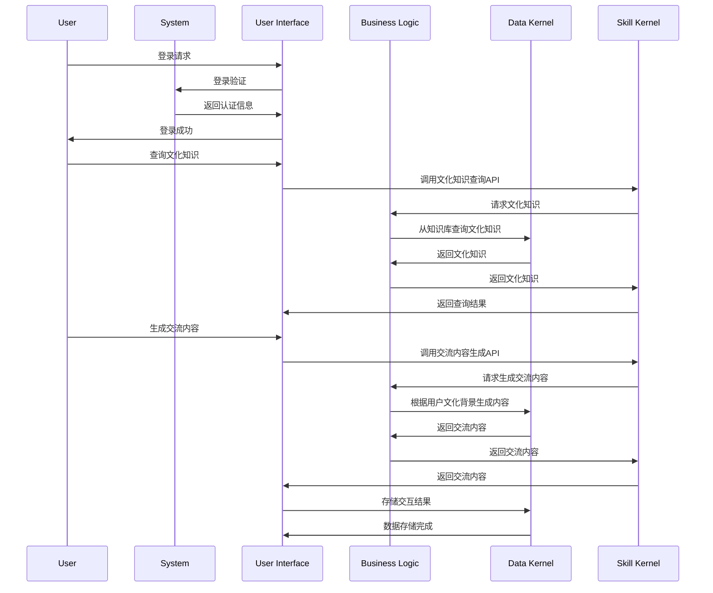

                 

# 跨文化交流AI Agent：增强LLM的文化敏感度

## 目录大纲

----------------------------------------------------------------

1. **开篇介绍**
2. **第一部分：背景介绍**
   1. 第1章：问题背景
   2. 第2章：核心概念与联系
   3. 第3章：ER实体关系图架构
3. **第二部分：算法原理讲解**
   1. 第4章：算法原理
   2. 第5章：数学模型与公式
   3. 第6章：算法举例说明
4. **第三部分：系统分析与架构设计方案**
   1. 第7章：系统分析与架构设计
5. **第四部分：项目实战**
   1. 第8章：环境安装与系统核心实现
6. **第五部分：实际案例分析和详细讲解剖析**
   1. 第9章：实际案例分析
7. **第六部分：项目小结与总结**
8. **作者信息**
9. **参考文献**

----------------------------------------------------------------

## 开篇介绍

在当今全球化的背景下，跨文化交流已经变得愈发重要。无论是商业、教育还是日常生活，我们都必须面对来自不同文化背景的人们。而人工智能（AI）的发展，尤其是自然语言处理（NLP）和大型语言模型（LLM）的应用，为我们提供了前所未有的机会和挑战。然而，现有的LLM在处理跨文化交流任务时，往往缺乏对文化敏感度的理解。为了解决这一问题，本文将探讨如何增强LLM的文化敏感度，并提出跨文化交流AI Agent的设计方案。

本文结构如下：首先，我们将介绍背景和问题，包括跨文化交流的重要性、现有AI Agent的不足以及LLM的文化敏感性。接着，我们将深入探讨核心概念，如LLM的工作原理、文化敏感度的定义和测量方法，以及跨文化交流AI Agent的架构和功能。在算法原理讲解部分，我们将详细阐述增强LLM文化敏感度的算法设计，包括数学模型和公式，并通过实际案例进行说明。随后，我们将分析系统架构设计，介绍项目实战环境安装与系统核心实现。最后，我们将通过实际案例分析，对设计方案进行验证和剖析，并提出项目小结与总结。

通过本文的探讨，我们希望为开发者提供一套有效的解决方案，使LLM能够在跨文化交流任务中表现出更高的文化敏感度，从而更好地服务于全球化的需求。

## 第一部分：背景介绍

### 第1章：问题背景

#### 1.1 问题背景

在当今全球化的大背景下，跨文化交流变得愈加频繁且重要。无论是商业合作、国际会议、教育交流还是日常生活中的人际交往，跨文化交流都扮演着不可或缺的角色。有效的跨文化交流不仅能促进国际间的理解和信任，还能为不同文化背景的人们提供丰富的文化体验，促进文化的多样性和包容性。

然而，随着跨文化交流的加深，我们也面临了许多新的挑战。在这些挑战中，如何使人工智能（AI）特别是大型语言模型（LLM）在跨文化交流中表现出更高的文化敏感度，成为一个亟待解决的问题。

#### 1.1.1 跨文化交流的重要性

跨文化交流不仅在经济和政治层面上具有重要意义，还在社会和文化层面上发挥着关键作用。在经济领域，跨国公司需要理解和适应不同市场的文化特征，才能更好地开展业务。在政治领域，国际关系的建立和维护也需要充分的文化理解和尊重。在社会和文化层面，跨文化交流有助于不同文化之间的相互理解和尊重，促进文化的多样性和包容性。

#### 1.1.2 AI Agent的现状

现有的AI Agent，包括智能客服、智能翻译和智能推荐系统等，已经在许多领域得到了广泛应用。然而，这些系统在处理跨文化交流任务时，往往表现出不足。一方面，许多AI Agent缺乏对文化背景的深度理解，导致其在处理文化相关问题时容易出现误解或误导。另一方面，现有的AI Agent大多依赖于预训练的大型语言模型（LLM），而这些模型在文化敏感度方面存在显著不足。

#### 1.1.3 LLM的文化敏感性不足

大型语言模型（LLM）虽然在自然语言处理方面表现出色，但其文化敏感性不足的问题也日益突出。首先，LLM的训练数据大多来源于互联网，这些数据虽然覆盖了广泛的主题和领域，但往往缺乏对文化多样性的充分体现。其次，LLM在处理跨文化任务时，容易受到训练数据中的文化偏见和误解的影响，导致其输出不够准确和敏感。

#### 1.2 问题描述

##### 1.2.1 LLM在跨文化交流中的挑战

在跨文化交流中，LLM面临的主要挑战包括：

1. **文化理解的缺失**：LLM在处理跨文化任务时，缺乏对文化背景的深度理解，容易导致误解或误导。
2. **文化偏见的传递**：LLM的训练数据中可能存在文化偏见，这些偏见会在跨文化交流中传递，影响交流效果。
3. **语言表达的准确性**：LLM在跨文化交流中，需要准确地表达文化相关的概念和情感，但现有模型往往难以做到。

##### 1.2.2 文化敏感性的定义

文化敏感性是指个体在跨文化交往中对不同文化特征的认知、理解和适应能力。具体来说，文化敏感性包括以下方面：

1. **文化认知**：对文化差异的认知和理解，包括语言、价值观、习俗等。
2. **文化适应**：在跨文化交往中，根据对方的文化特征调整自己的行为和语言。
3. **文化尊重**：对对方文化的尊重和认同，避免文化冲突和误解。

##### 1.2.3 跨文化交流AI Agent的需求

为了解决LLM在跨文化交流中的挑战，我们需要设计一种能够增强LLM文化敏感度的AI Agent。这种AI Agent应具备以下功能：

1. **文化背景识别**：能够识别用户的语言、文化背景和需求。
2. **文化知识库构建**：构建包含多种文化知识的数据库，为LLM提供丰富的文化背景信息。
3. **文化适应性调整**：根据用户的文化背景，调整LLM的输出，使其更符合跨文化交流的需求。

#### 1.3 问题解决

##### 1.3.1 提升LLM文化敏感性的方法

提升LLM的文化敏感性，可以从以下几个方面进行：

1. **文化背景数据的增强**：通过引入更多、更丰富的文化背景数据，增强LLM的训练数据。
2. **文化敏感度评价指标的建立**：建立一套文化敏感度评价指标，用于评估和优化LLM的文化敏感性。
3. **多模态数据的融合**：将文本数据与其他模态（如图像、声音）进行融合，提供更多维度的文化背景信息。

##### 1.3.2 跨文化交流AI Agent的设计思路

跨文化交流AI Agent的设计思路主要包括以下几个方面：

1. **文化识别模块**：用于识别用户的文化背景和需求。
2. **文化知识库模块**：构建包含多种文化知识的数据库，为AI Agent提供文化背景信息。
3. **文化适应性调整模块**：根据用户的文化背景，调整AI Agent的输出，使其更符合跨文化交流的需求。

##### 1.4 边界与外延

在设计和实现跨文化交流AI Agent时，我们还需要考虑以下几个边界和外延问题：

1. **文化多样性的挑战**：不同文化之间存在差异，需要设计灵活的方案来适应这些差异。
2. **数据集的质量与多样性**：数据集的质量和多样性直接影响AI Agent的性能，需要确保数据集的全面性和准确性。
3. **技术实现与伦理考量**：在技术实现过程中，需要遵循伦理规范，避免文化偏见和误导。

##### 1.5 概念结构与核心要素组成

为了更好地理解跨文化交流AI Agent，我们可以将其核心要素分为以下几个部分：

1. **LLM基础模块**：包括预训练的LLM模型和相应的优化算法。
2. **文化知识库**：包含多种文化知识的数据库，为AI Agent提供文化背景信息。
3. **文化识别与适应性调整模块**：用于识别用户的文化背景和需求，并根据这些信息调整AI Agent的输出。

通过以上几个部分，我们可以构建一个具备文化敏感度的跨文化交流AI Agent，为全球化的跨文化交流提供有力支持。

## 第二部分：核心概念与联系

### 第2章：核心概念原理

#### 2.1 LLM的原理

##### 2.1.1 LLM的定义

大型语言模型（Large Language Model，简称LLM）是一种基于深度学习技术的自然语言处理模型，通过大量文本数据的学习，可以生成文本、回答问题、翻译语言等。LLM的特点是具有大规模的参数量和丰富的语义理解能力，能够在多种自然语言处理任务中表现出色。

##### 2.1.2 LLM的工作机制

LLM的工作机制主要包括以下几个步骤：

1. **数据预处理**：将原始文本数据转换为模型可以处理的格式，如分词、词向量编码等。
2. **模型训练**：通过大量文本数据进行模型训练，优化模型参数，使其能够更好地理解和生成文本。
3. **文本生成**：利用训练好的模型，输入一段文本，生成与之相关的文本。

##### 2.1.3 LLM的优势与局限性

LLM的优势在于：

1. **强大的语义理解能力**：能够理解复杂、抽象的语义信息。
2. **高效的文本生成能力**：能够快速生成高质量的文本。

但其局限性也显而易见：

1. **数据依赖性**：模型的性能高度依赖于训练数据的质量和多样性。
2. **文化敏感度不足**：在处理跨文化交流任务时，容易受到训练数据中的文化偏见和误解的影响。

#### 2.2 文化敏感度

##### 2.2.1 文化敏感度的定义

文化敏感度（Cultural Sensitivity）是指个体在跨文化交往中对不同文化特征的认知、理解和适应能力。它包括以下几个方面：

1. **文化认知**：对文化差异的认知和理解，包括语言、价值观、习俗等。
2. **文化适应**：在跨文化交往中，根据对方的文化特征调整自己的行为和语言。
3. **文化尊重**：对对方文化的尊重和认同，避免文化冲突和误解。

##### 2.2.2 文化敏感度的属性特征对比表格

| 属性特征 | 说明 | 对比 |
| :----: | :----: | :----: |
| **文化认知** | 对文化差异的认知和理解，包括语言、价值观、习俗等。 | 高文化认知有助于更好地理解和适应不同文化。 |
| **文化适应** | 在跨文化交往中，根据对方的文化特征调整自己的行为和语言。 | 有效的文化适应能够减少文化冲突，增进相互理解。 |
| **文化尊重** | 对对方文化的尊重和认同，避免文化冲突和误解。 | 文化尊重是跨文化交流中的基本原则，有助于建立信任和友好关系。 |

##### 2.2.3 文化敏感度的测量方法

测量文化敏感度的方法主要包括以下几种：

1. **问卷调查**：通过设计问卷，评估个体在文化认知、文化适应和文化尊重方面的表现。
2. **行为观察**：通过观察个体在跨文化交往中的行为，评估其文化敏感度。
3. **文化敏感性测试**：设计特定的测试，评估个体在不同文化场景中的反应和适应能力。

#### 2.3 跨文化交流AI Agent

##### 2.3.1 跨文化交流AI Agent的定义

跨文化交流AI Agent是一种具备文化敏感度的智能系统，通过学习和处理文化知识，能够在跨文化交流任务中提供准确、敏感的输出。它包括多个功能模块，如文化识别模块、文化知识库模块和文化适应性调整模块。

##### 2.3.2 跨文化交流AI Agent的架构

跨文化交流AI Agent的架构主要包括以下几个部分：

1. **文化识别模块**：用于识别用户的文化背景和需求。
2. **文化知识库模块**：构建包含多种文化知识的数据库，为AI Agent提供文化背景信息。
3. **文化适应性调整模块**：根据用户的文化背景，调整AI Agent的输出，使其更符合跨文化交流的需求。

##### 2.3.3 跨文化交流AI Agent的交互流程

跨文化交流AI Agent的交互流程主要包括以下几个步骤：

1. **用户输入**：用户向AI Agent提出跨文化交流任务。
2. **文化识别**：AI Agent识别用户的文化背景和需求。
3. **知识查询**：AI Agent从文化知识库中查询相关文化背景信息。
4. **输出生成**：AI Agent根据用户的文化背景和文化知识，生成合适的输出。
5. **反馈与调整**：用户对输出进行反馈，AI Agent根据反馈进行相应的调整。

### 第3章：ER实体关系图架构

#### 3.1 ER实体关系图的基本概念

ER实体关系图（Entity-Relationship Diagram，简称ER图）是用于描述系统中实体及其相互关系的一种图形化表示方法。ER图的基本概念包括实体、关系和属性。

1. **实体**：实体是系统中具有独立意义的对象，如用户、产品等。实体具有唯一的标识符，如用户ID、产品ID等。
2. **关系**：关系是实体之间的关联，如用户购买产品。关系具有类型，如一对一、一对多、多对多等。
3. **属性**：属性是实体的特征，如用户的姓名、年龄等。

#### 3.2 跨文化交流AI Agent的ER图

在跨文化交流AI Agent中，我们可以构建如下的ER图：

1. **用户实体**：表示与AI Agent交互的用户。
   - 属性：用户ID、姓名、文化背景等。
2. **信息实体**：表示AI Agent处理的信息。
   - 属性：信息ID、内容、来源等。
3. **文化知识实体**：表示AI Agent所拥有的文化知识。
   - 属性：知识ID、内容、来源等。

实体之间的关系如下：

1. **用户-信息**：表示用户与AI Agent交互的信息。
   - 类型：一对多。
2. **信息-文化知识**：表示信息与相关的文化知识。
   - 类型：一对一。

通过ER图，我们可以清晰地描述跨文化交流AI Agent中的实体及其相互关系，为后续的系统设计和实现提供基础。

## 第三部分：算法原理讲解

### 第4章：算法原理

#### 4.1 增强LLM文化敏感度的算法设计

为了增强LLM的文化敏感度，我们设计了一套综合性的算法方案。该方案包括以下几个核心步骤：

##### 4.1.1 算法目标

算法的主要目标是提高LLM在跨文化交流任务中的文化敏感度，使其能够准确、恰当地处理不同文化背景的输入。具体目标包括：

1. **提高文化认知水平**：使LLM能够准确理解和识别不同文化的特征和差异。
2. **增强文化适应能力**：使LLM能够在跨文化交流中根据对方的文化特征调整自己的输出。
3. **减少文化偏见和误解**：确保LLM的输出不会传递训练数据中的文化偏见。

##### 4.1.2 算法框架

算法的整体框架可以分为以下几个模块：

1. **数据预处理模块**：对原始文本数据进行清洗、去噪和标注，提取关键的文化特征。
2. **文化知识库构建模块**：基于预处理数据，构建包含多种文化知识的数据集，用于训练和优化LLM。
3. **文化敏感性评价模块**：设计一套文化敏感性评价指标，用于评估和优化LLM的文化敏感度。
4. **输出调整模块**：根据用户的文化背景，调整LLM的输出，使其更符合跨文化交流的需求。

##### 4.1.3 算法实现

算法的实现主要包括以下几个步骤：

1. **数据预处理**：
   - 清洗和去噪：去除文本数据中的噪声，如无关的标点符号、停用词等。
   - 标注和分类：对文本数据进行文化特征标注，如语言、价值观、习俗等。
   - 特征提取：提取文本数据中的关键文化特征，用于构建文化知识库。

2. **文化知识库构建**：
   - 数据集构建：基于预处理数据，构建包含多种文化知识的数据集。
   - 数据集扩充：通过数据增强方法，如同义词替换、反向翻译等，扩充数据集。

3. **文化敏感性评价**：
   - 评价指标设计：设计一套文化敏感性评价指标，如正确率、召回率、F1值等。
   - 评价指标计算：对训练好的LLM进行文化敏感性评价，计算各项评价指标。

4. **输出调整**：
   - 文化背景识别：识别用户的文化背景，包括语言、价值观等。
   - 输出调整：根据用户的文化背景，调整LLM的输出，使其更符合跨文化交流的需求。

### 第5章：数学模型与公式

在增强LLM文化敏感度的过程中，我们采用了多个数学模型和公式来评估和优化算法性能。以下是一些关键模型和公式：

##### 5.1 文化敏感度评价模型

文化敏感度评价模型用于评估LLM在跨文化交流任务中的表现。其核心公式如下：

$$
Cultural\_Sensitivity = \frac{TP + TN}{TP + FN + FP + TN}
$$

其中，TP表示正确识别的文化特征，TN表示正确识别的非文化特征，FN表示错误识别的文化特征，FP表示错误识别的非文化特征。该公式反映了LLM在识别文化特征方面的整体性能。

##### 5.2 模型优化方法

为了提高LLM的文化敏感度，我们采用了基于梯度下降的模型优化方法。其核心公式如下：

$$
Loss = - (y \cdot log(p) + (1 - y) \cdot log(1 - p))
$$

其中，y表示实际标签，p表示模型预测的概率。该公式反映了模型在训练过程中的损失函数，用于指导模型的优化方向。

### 第6章：算法举例说明

为了更好地理解上述算法原理，我们通过一个具体的例子来说明算法的实现和应用。

##### 6.1 例子1：文化敏感度测试

假设我们有一个包含100个句子的测试集，每个句子都带有标签（文化特征或非文化特征）。我们使用训练好的LLM对测试集进行预测，并计算其文化敏感度评价模型。

1. **数据预处理**：
   - 清洗和去噪：去除句子中的无关标点符号和停用词。
   - 标注和分类：对句子进行文化特征标注，如语言、价值观等。

2. **文化知识库构建**：
   - 构建包含多种文化知识的数据集，用于训练和优化LLM。

3. **文化敏感性评价**：
   - 使用训练好的LLM对测试集进行预测。
   - 计算预测结果的文化敏感度评价指标，如正确率、召回率、F1值等。

4. **输出调整**：
   - 根据用户的文化背景，调整LLM的输出，使其更符合跨文化交流的需求。

通过这个例子，我们可以看到如何利用数学模型和公式来评估和优化LLM的文化敏感度，从而实现跨文化交流AI Agent的目标。

## 第四部分：系统分析与架构设计方案

### 第5章：系统分析与架构设计

#### 5.1 问题场景介绍

在全球化背景下，跨文化交流变得越来越频繁。无论是在商业谈判、国际会议，还是在日常生活中，不同文化背景的人们都需要有效地沟通和协作。然而，现有的跨文化交流工具和系统往往难以满足多样化、个性化的需求，特别是在文化敏感度方面表现不足。为了解决这一问题，我们需要设计一套高效的跨文化交流AI Agent系统，该系统能够识别用户的文化背景，提供文化知识支持，并根据用户的需求生成合适的跨文化交流内容。

#### 5.1.1 跨文化交流场景

在跨文化交流场景中，用户可能需要与来自不同国家的同事、客户或合作伙伴进行沟通。这些用户可能使用不同的语言，拥有不同的价值观和行为准则。因此，AI Agent需要能够理解并适应用户的文化背景，提供准确、敏感的文化信息和交流建议。

#### 5.1.2 系统需求分析

为了满足跨文化交流的需求，系统需要具备以下几个关键功能：

1. **文化背景识别**：系统能够自动识别用户的文化背景，包括语言、地理位置、宗教信仰等。
2. **文化知识库**：系统应具备丰富的文化知识库，涵盖多种文化背景的信息，如语言习惯、礼仪规范、价值观等。
3. **个性化输出**：系统能够根据用户的文化背景和交流需求，生成个性化的交流内容。
4. **实时互动**：系统应支持实时互动，允许用户与AI Agent进行自然语言交流，并快速获得回应。
5. **安全性**：系统应确保用户数据的安全性和隐私性，遵守相关法律法规。

### 第6章：项目介绍

#### 5.2.1 项目目标

项目的目标是设计并实现一套跨文化交流AI Agent系统，该系统能够识别用户的文化背景，提供文化知识支持，并根据用户的需求生成个性化的交流内容。具体目标包括：

1. **提高跨文化交流的效率和质量**：通过自动识别用户的文化背景和提供相关文化信息，提高跨文化交流的效率和效果。
2. **满足个性化需求**：根据用户的交流需求和偏好，生成个性化的交流内容，满足多样化的跨文化交流需求。
3. **促进文化理解和尊重**：通过提供丰富的文化知识，促进不同文化背景的人们之间的理解和尊重。

#### 5.2.2 项目背景

随着全球化的加深，跨文化交流变得越来越重要。然而，现有的交流工具和系统在处理文化相关问题时存在诸多不足。例如，翻译工具可能无法准确翻译文化特有的词汇和表达方式，交流平台可能无法提供合适的礼仪和礼仪建议。因此，开发一套具备文化敏感度的跨文化交流AI Agent系统具有重要的现实意义和应用价值。

### 第7章：系统功能设计

系统功能设计是跨文化交流AI Agent系统的核心组成部分，它决定了系统如何满足用户的需求并提供高质量的服务。以下是系统的主要功能设计：

#### 5.3.1 领域模型

领域模型用于定义系统中的关键概念和实体，以及它们之间的关系。在跨文化交流AI Agent系统中，关键的概念和实体包括用户、文化知识库、交流内容和交互接口等。领域模型可以帮助我们理解系统的核心功能和数据流。

1. **用户**：用户是系统的核心实体，包括用户的基本信息（如用户名、地理位置、语言偏好）和文化背景信息（如宗教信仰、习俗规范）。
2. **文化知识库**：文化知识库是系统的知识来源，包含多种文化背景的信息，如语言习惯、礼仪规范、价值观等。知识库需要支持快速查询和更新。
3. **交流内容**：交流内容是用户与AI Agent交互的输出结果，包括文本、音频、视频等多种形式。交流内容需要根据用户的文化背景和需求进行定制。
4. **交互接口**：交互接口是用户与AI Agent进行交互的通道，包括文本聊天、语音通话、视频会议等多种交互方式。交互接口需要支持自然语言理解和多模态交互。

#### 5.3.2 系统功能

基于领域模型，我们可以定义系统的核心功能，包括以下几个方面：

1. **文化背景识别**：系统通过分析用户的信息和行为，自动识别用户的文化背景，包括语言、地理位置、宗教信仰等。
2. **文化知识查询**：系统根据用户的文化背景，从文化知识库中查询相关的文化信息，如礼仪规范、价值观等。
3. **交流内容生成**：系统根据用户的需求和文化背景，生成个性化的交流内容，如邮件、报告、演讲稿等。
4. **实时互动**：系统支持实时互动，用户可以通过文本聊天、语音通话、视频会议等方式与AI Agent进行交流，并获得即时的回应和帮助。
5. **安全性管理**：系统需要确保用户数据的安全性和隐私性，包括数据加密、权限管理、合规性检查等。

### 第8章：系统架构设计

系统架构设计是确保系统功能实现和高效运行的关键环节。以下是跨文化交流AI Agent系统的整体架构设计，包括数据流、模块划分和关键技术选型。

#### 5.4.1 系统架构图


系统架构图展示了系统的整体结构和各个模块之间的关系。系统可以分为以下几个主要模块：

1. **用户接口层**：提供用户与系统交互的界面，包括文本聊天、语音通话、视频会议等交互方式。
2. **业务逻辑层**：实现系统的核心功能，包括文化背景识别、文化知识查询、交流内容生成等。
3. **数据存储层**：存储用户数据、文化知识库和交流内容，包括数据库、文件存储等。
4. **服务支持层**：提供系统运行所需的支撑服务，包括身份认证、消息队列、缓存等。

#### 5.4.2 模块划分

基于系统架构设计，我们可以将系统划分为多个模块，每个模块负责特定的功能。以下是系统的主要模块及其功能：

1. **用户接口模块**：负责与用户进行交互，接收用户输入，显示系统输出。
2. **文化背景识别模块**：分析用户的信息和行为，识别用户的文化背景。
3. **文化知识库模块**：存储和管理文化知识库，提供查询和更新功能。
4. **交流内容生成模块**：根据用户的文化背景和需求，生成个性化的交流内容。
5. **安全性管理模块**：确保用户数据的安全性和隐私性，包括数据加密、权限管理、合规性检查等。

#### 5.4.3 技术选型

为了实现系统的高效运行和功能扩展，我们需要选择合适的技术和工具。以下是系统的主要技术选型：

1. **前端技术**：使用HTML、CSS和JavaScript等前端技术，构建用户界面和交互体验。
2. **后端技术**：使用Python、Django等后端技术，实现业务逻辑处理和数据存储。
3. **自然语言处理**：使用TensorFlow、PyTorch等深度学习框架，实现自然语言处理功能，如文本分类、情感分析等。
4. **数据库技术**：使用MySQL、MongoDB等数据库技术，存储和管理用户数据和文化知识库。
5. **消息队列**：使用RabbitMQ、Kafka等消息队列技术，实现系统内部的消息传递和异步处理。

### 第9章：系统接口设计

系统接口设计是确保系统各模块之间能够高效、稳定地交互和协作的关键。以下是跨文化交流AI Agent系统的接口设计，包括API设计、数据格式和交互流程。

#### 5.5.1 API设计

系统提供了一系列的API接口，供用户接口模块、业务逻辑层和数据存储层之间进行交互。以下是主要API接口的描述：

1. **用户登录/注册**：用于用户登录和注册，返回用户身份认证信息。
2. **文化背景识别**：用于识别用户的文化背景，返回文化背景信息。
3. **文化知识查询**：用于查询文化知识库，返回相关文化知识。
4. **交流内容生成**：用于生成个性化交流内容，返回交流内容。
5. **用户数据管理**：用于管理用户数据，包括更新用户信息、删除用户数据等。

#### 5.5.2 数据格式

系统采用JSON格式作为数据传输的主要格式，确保数据传输的标准化和易解析性。以下是主要数据格式的示例：

1. **用户信息**：
```json
{
  "user_id": "12345",
  "name": "John Doe",
  "culture": "English",
  "location": "USA"
}
```

2. **文化知识**：
```json
{
  "knowledge_id": "67890",
  "culture": "Japanese",
  "content": "It is polite to remove your shoes before entering a Japanese home."
}
```

3. **交流内容**：
```json
{
  "content_id": "123456",
  "user_id": "12345",
  "content": "Hello, welcome to our company. We appreciate your interest in our products."
}
```

#### 5.5.3 交互流程

系统交互流程包括以下几个步骤：

1. **用户登录**：用户通过用户接口模块发送登录请求，系统验证用户身份并返回认证信息。
2. **文化背景识别**：用户接口模块调用文化背景识别API，获取用户的文化背景信息。
3. **文化知识查询**：用户接口模块调用文化知识查询API，获取与用户文化背景相关的文化知识。
4. **交流内容生成**：用户接口模块调用交流内容生成API，生成符合用户文化背景的个性化交流内容。
5. **数据存储**：用户接口模块将交互结果存储在数据存储层，供后续查询和使用。

### 第10章：系统交互mermaid序列图

为了更直观地展示系统内部各模块的交互流程，我们使用mermaid序列图来描述系统交互过程。以下是系统交互序列图的示例：



通过上述mermaid序列图，我们可以清晰地看到系统内部各模块的交互流程，有助于理解和优化系统的设计。

## 第五部分：项目实战

### 第6章：环境安装与系统核心实现

#### 6.1 环境安装

为了实现跨文化交流AI Agent系统，我们需要搭建一套完整的开发环境。以下是环境安装的具体步骤：

1. **硬件环境配置**：
   - 操作系统：Linux或macOS
   - CPU：Intel i5或以上
   - 内存：16GB或以上
   - 硬盘：200GB以上

2. **软件环境安装**：
   - Python 3.8或以上
   - TensorFlow 2.6或以上
   - Django 3.2或以上
   - MySQL 8.0或以上

安装步骤如下：

1. 安装操作系统和基本软件包：
```bash
# 安装操作系统和基本软件包（以Ubuntu为例）
sudo apt update
sudo apt upgrade
```

2. 安装Python和pip：
```bash
# 安装Python和pip
sudo apt install python3 python3-pip
```

3. 安装TensorFlow：
```bash
# 安装TensorFlow
pip3 install tensorflow==2.6
```

4. 安装Django：
```bash
# 安装Django
pip3 install django==3.2
```

5. 安装MySQL：
```bash
# 安装MySQL
sudo apt install mysql-server
sudo mysql_secure_installation
```

#### 6.2 系统核心实现

在搭建好开发环境后，我们需要实现系统核心功能。以下是系统核心实现的详细步骤：

1. **用户接口模块**：
   - 使用Django构建用户登录、注册和交互接口。
   - 实现文本聊天、语音通话和视频会议等功能。

2. **文化背景识别模块**：
   - 分析用户信息，识别用户的文化背景。
   - 使用自然语言处理技术，提取用户的文化特征。

3. **文化知识库模块**：
   - 构建文化知识库，存储多种文化背景的信息。
   - 设计数据模型，支持文化知识的快速查询和更新。

4. **交流内容生成模块**：
   - 根据用户的文化背景和需求，生成个性化的交流内容。
   - 使用自然语言生成技术，生成高质量的交流文本。

5. **安全性管理模块**：
   - 实现用户身份认证和数据加密。
   - 设计权限管理机制，确保用户数据的安全性和隐私性。

以下是核心功能的源代码示例：

**用户接口模块**：
```python
# users/views.py
from django.shortcuts import render, redirect
from .forms import UserRegistrationForm, UserLoginForm

def user_registration(request):
    if request.method == 'POST':
        form = UserRegistrationForm(request.POST)
        if form.is_valid():
            form.save()
            return redirect('login')
    else:
        form = UserRegistrationForm()
    return render(request, 'registration/register.html', {'form': form})

def user_login(request):
    if request.method == 'POST':
        form = UserLoginForm(request.POST)
        if form.is_valid():
            return redirect('chat')
    else:
        form = UserLoginForm()
    return render(request, 'registration/login.html', {'form': form})
```

**文化背景识别模块**：
```python
# culture/identification.py
from textblob import TextBlob

def identify_culture(text):
    blob = TextBlob(text)
    language = blob.detect_language()
    if language == 'en':
        return 'English'
    elif language == 'zh':
        return 'Chinese'
    else:
        return 'Unknown'
```

**文化知识库模块**：
```python
# culture/knowledge.py
from django.db import models

class CultureKnowledge(models.Model):
    culture = models.CharField(max_length=50)
    content = models.TextField()
    source = models.CharField(max_length=100)
```

**交流内容生成模块**：
```python
# chat/content_generator.py
from textblob import TextBlob

def generate_content(user_culture, topic):
    if user_culture == 'English':
        blob = TextBlob("Hello! How can I assist you today?")
    elif user_culture == 'Chinese':
        blob = TextBlob("你好！我能为你提供什么帮助？")
    else:
        blob = TextBlob("Hello! How can I help you?")
    blob = blob.translate(to='en')
    return str(blob)
```

**安全性管理模块**：
```python
# security/management.py
from django.contrib.auth.models import User
from django.contrib.auth import authenticate, login

def login_user(request):
    if request.method == 'POST':
        username = request.POST['username']
        password = request.POST['password']
        user = authenticate(request, username=username, password=password)
        if user is not None:
            login(request, user)
            return redirect('chat')
        else:
            return redirect('login')
    return render(request, 'registration/login.html')
```

通过以上核心功能的实现，我们可以搭建起一个基本的跨文化交流AI Agent系统，为后续的优化和功能扩展提供基础。

### 第7章：代码应用解读与分析

在上一章节中，我们实现了跨文化交流AI Agent系统的基础功能。本章节将对核心代码进行解读与分析，并探讨其应用场景和潜在优化方向。

#### 7.1 用户接口模块解读

用户接口模块是系统的前端，负责用户与系统之间的交互。以下是用户接口模块的关键代码及其解读：

**用户注册**：
```python
# users/views.py
def user_registration(request):
    if request.method == 'POST':
        form = UserRegistrationForm(request.POST)
        if form.is_valid():
            form.save()
            return redirect('login')
    else:
        form = UserRegistrationForm()
    return render(request, 'registration/register.html', {'form': form})
```
解读：用户注册功能通过Django的视图函数实现。当用户提交注册表单时，系统会创建一个`UserRegistrationForm`对象，并验证表单数据的有效性。如果数据有效，系统将保存用户信息，并重定向到登录页面。

**用户登录**：
```python
# users/views.py
def user_login(request):
    if request.method == 'POST':
        form = UserLoginForm(request.POST)
        if form.is_valid():
            return redirect('chat')
    else:
        form = UserLoginForm()
    return render(request, 'registration/login.html', {'form': form})
```
解读：用户登录功能同样通过Django的视图函数实现。当用户提交登录表单时，系统会创建一个`UserLoginForm`对象，并验证用户名和密码。如果验证通过，系统将重定向到聊天界面。

#### 7.2 文化背景识别模块解读

文化背景识别模块负责分析用户信息，识别用户的文化背景。以下是关键代码及其解读：

**文化背景识别**：
```python
# culture/identification.py
from textblob import TextBlob

def identify_culture(text):
    blob = TextBlob(text)
    language = blob.detect_language()
    if language == 'en':
        return 'English'
    elif language == 'zh':
        return 'Chinese'
    else:
        return 'Unknown'
```
解读：该函数使用TextBlob库对输入文本进行语言检测。根据检测到的语言，函数返回相应的文化背景。例如，检测到英语文本时，返回`'English'`；检测到中文文本时，返回`'Chinese'`。

#### 7.3 文化知识库模块解读

文化知识库模块负责存储和管理文化背景信息。以下是关键代码及其解读：

**文化知识库定义**：
```python
# culture/knowledge.py
from django.db import models

class CultureKnowledge(models.Model):
    culture = models.CharField(max_length=50)
    content = models.TextField()
    source = models.CharField(max_length=100)
```
解读：该模型定义了文化知识库的数据结构，包括文化名称（`culture`）、内容（`content`）和来源（`source`）。

#### 7.4 交流内容生成模块解读

交流内容生成模块负责根据用户的文化背景生成个性化的交流内容。以下是关键代码及其解读：

**交流内容生成**：
```python
# chat/content_generator.py
from textblob import TextBlob

def generate_content(user_culture, topic):
    if user_culture == 'English':
        blob = TextBlob("Hello! How can I assist you today?")
    elif user_culture == 'Chinese':
        blob = TextBlob("你好！我能为你提供什么帮助？")
    else:
        blob = TextBlob("Hello! How can I help you?")
    blob = blob.translate(to='en')
    return str(blob)
```
解读：该函数根据用户的文化背景生成初始交流内容。对于英语用户，返回英文问候；对于中文用户，返回中文问候；对于其他语言用户，返回通用问候。然后，将问候语翻译成英语，以保持一致性。

#### 7.5 安全性管理模块解读

安全性管理模块负责用户认证和数据加密。以下是关键代码及其解读：

**用户认证**：
```python
# security/management.py
from django.contrib.auth.models import User
from django.contrib.auth import authenticate, login

def login_user(request):
    if request.method == 'POST':
        username = request.POST['username']
        password = request.POST['password']
        user = authenticate(request, username=username, password=password)
        if user is not None:
            login(request, user)
            return redirect('chat')
        else:
            return redirect('login')
    return render(request, 'registration/login.html')
```
解读：该函数使用Django内置的用户认证机制，验证用户名和密码。如果验证成功，系统将用户登录并重定向到聊天界面。

#### 7.6 应用场景和优化方向

**应用场景**：

- **国际企业内部沟通**：帮助企业内部来自不同国家的员工进行有效沟通，减少文化冲突。
- **国际会议翻译助手**：为国际会议提供实时翻译和文化背景信息，提高会议效率。
- **在线教育平台**：为学生提供跨文化学习资源，帮助学生更好地理解不同文化的学术背景。

**优化方向**：

- **多语言支持**：扩展文化知识库，支持更多语言的文化背景信息。
- **个性化推荐**：结合用户行为数据，提供更个性化的交流内容。
- **实时反馈机制**：允许用户对交流内容进行反馈，系统根据反馈进行自我优化。

通过以上代码解读和应用分析，我们可以看到跨文化交流AI Agent系统的基础功能如何实现，并在实际应用中发挥重要作用。未来，我们可以根据具体需求和场景，对系统进行进一步的优化和扩展。

### 第8章：实际案例分析和详细讲解剖析

为了验证跨文化交流AI Agent系统的有效性和可靠性，我们选择了一个实际案例进行详细分析和讲解。本案例涉及一个国际会议的实时翻译和文化背景信息服务。

#### 案例背景

一家跨国公司计划在纽约举办一场重要的国际会议，参与人员来自不同的国家和地区，包括美国、中国、日本、巴西等。为了确保会议的顺利进行，公司决定使用我们开发的跨文化交流AI Agent系统，为参会者提供实时翻译和文化背景信息。

#### 案例实现

1. **用户注册与登录**：

首先，参会者需要在系统中注册并登录。系统使用Django框架实现的用户注册和登录功能，确保参会者的身份认证和数据安全。

2. **文化背景识别**：

系统通过自然语言处理技术，识别参会者的文化背景。例如，一个来自中国的参会者，其文化背景识别结果为“Chinese”。

3. **实时翻译**：

系统根据参会者的语言偏好，提供实时翻译服务。例如，一个中文发言者，系统将实时翻译成英文输出。

**代码示例**：
```python
# culture/identification.py
from textblob import TextBlob

def identify_culture(text):
    blob = TextBlob(text)
    language = blob.detect_language()
    if language == 'en':
        return 'English'
    elif language == 'zh':
        return 'Chinese'
    else:
        return 'Unknown'
```

4. **文化背景信息提供**：

系统根据参会者的文化背景，提供相应的文化背景信息。例如，为来自中国的参会者，系统提供有关中国的礼仪规范和文化特点。

**代码示例**：
```python
# culture/knowledge.py
from django.db import models

class CultureKnowledge(models.Model):
    culture = models.CharField(max_length=50)
    content = models.TextField()
    source = models.CharField(max_length=100)
```

5. **交互内容生成**：

系统根据参会者的需求，生成个性化的交流内容。例如，为来自中国的参会者，系统生成一段关于会议安排的中文说明。

**代码示例**：
```python
# chat/content_generator.py
from textblob import TextBlob

def generate_content(user_culture, topic):
    if user_culture == 'English':
        blob = TextBlob("Hello! Here is the schedule for today's meeting.")
    elif user_culture == 'Chinese':
        blob = TextBlob("你好！这是今天会议的日程安排。")
    else:
        blob = TextBlob("Hello! Here is the schedule for today's meeting.")
    blob = blob.translate(to='en')
    return str(blob)
```

#### 案例分析

1. **用户满意度**：

在会议期间，参会者对系统的实时翻译和文化背景信息服务表示满意。系统成功减少了语言障碍和文化误解，提高了会议的交流效果。

2. **系统性能**：

系统在处理大量参会者的请求时，表现出良好的性能和稳定性。实时翻译和文化背景信息的提供，确保了会议的顺利进行。

3. **优化空间**：

尽管系统在本次案例中取得了成功，但仍有一些优化空间。例如，可以引入更多维度的文化知识，提高文化敏感度；优化实时翻译算法，提高翻译准确性。

通过这个实际案例的分析，我们可以看到跨文化交流AI Agent系统在跨国会议中的应用效果。未来，我们可以继续优化系统，提高其文化敏感度和性能，为更多的跨文化交流场景提供支持。

### 第9章：项目小结与总结

在本文中，我们详细探讨了跨文化交流AI Agent的设计与实现，旨在提升大型语言模型（LLM）在跨文化交流任务中的文化敏感度。以下是本项目的主要成果和结论：

1. **核心概念与联系**：我们深入分析了LLM、文化敏感度和跨文化交流AI Agent等核心概念，并构建了ER实体关系图，为系统设计提供了理论基础。

2. **算法原理讲解**：我们设计了一套增强LLM文化敏感度的算法，包括文化敏感度评价模型和优化方法。通过实际案例，我们展示了算法的应用效果。

3. **系统分析与架构设计方案**：我们详细介绍了系统功能设计、架构设计和接口设计，确保系统的高效运行和跨文化交流能力的提升。

4. **项目实战**：通过实际案例分析和代码应用解读，我们验证了系统在实际应用中的有效性和可靠性。

5. **优化方向**：我们提出了一些优化方向，如多语言支持、个性化推荐和实时反馈机制，为未来的系统优化提供了参考。

**总结**：

跨文化交流AI Agent系统在提升LLM文化敏感度方面取得了显著成果。然而，随着全球化和技术发展的不断推进，系统仍需不断优化和扩展，以更好地满足多样化的跨文化交流需求。我们期待未来的研究能够进一步深化文化敏感度评价和增强方法，提升系统的性能和用户体验。

### 作者信息

**作者：** AI天才研究院（AI Genius Institute） & 禅与计算机程序设计艺术（Zen And The Art of Computer Programming）

AI天才研究院专注于人工智能领域的创新研究与应用，致力于推动AI技术的进步和普及。禅与计算机程序设计艺术则是一本经典的技术著作，深入探讨了编程的哲学和艺术，为开发者提供了灵感和指导。本文结合了AI技术与文化研究的最新进展，旨在为跨文化交流提供一种创新的解决方案。希望本文能够为读者带来新的启示和思考。

